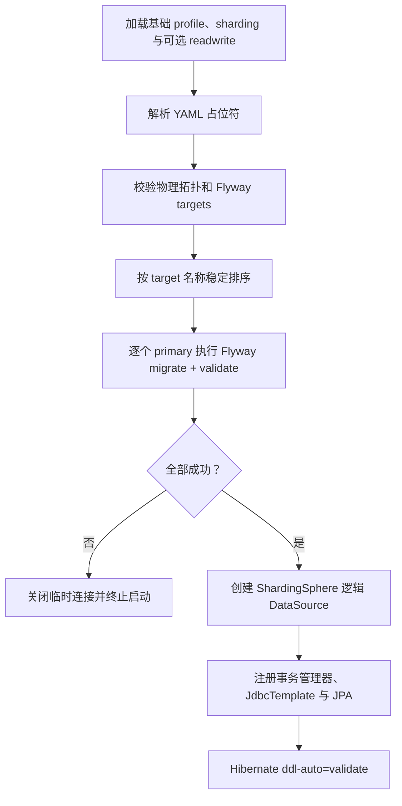

# Archetype 接入 ShardingSphere JDBC、Flyway 与 UUIDv7 设计

## 1. 文档状态

- 状态：已审核，待实施
- 日期：2026-07-23
- 目标版本：Egon-COLA 5.2.3 archetype 模板
- 适用范围：`egon-cola-archetype-light`、`egon-cola-archetype-web`、`egon-cola-archetype-service`
- 术语说明：本文使用当前产品名“Apache ShardingSphere JDBC”；需求中的 ShardingJDBC 指同一能力，不引入旧版 `sharding-jdbc-spring-boot-starter`。

## 2. 背景与现状

三个 archetype 已接入 Flyway，但尚未接入 ShardingSphere JDBC。当前共同特征如下：

1. `dev`、`prod` 使用 PostgreSQL 与 HikariCP，`test` 使用 PostgreSQL 兼容模式的 H2。
2. Flyway 当前扫描 `classpath:db/migration`，JPA 使用 `ddl-auto=validate`。
3. 每个 archetype 各有两份 `V1__*.sql`、`V2__*.sql`。
4. 这些 SQL 是尚未对真实数据库执行的脚手架源码，不存在历史数据、checksum 或滚动升级兼容负担。
5. 当前部分实体使用 `UUID.randomUUID()`，部分关系表使用数据库 `IDENTITY` 自增主键，尚未形成统一的分布式主键规范。
6. 生成模板的有效修改面是 `src/main/resources/archetype-resources` 与 `verify.groovy`；`target/` 下的生成项目仅作为验证产物，不能直接修改。

ShardingSphere 模式下存在两个需要同时解决的问题：

- Flyway 不能只对 ShardingSphere 逻辑数据源执行 DDL，必须按物理拓扑迁移各个写节点。
- 不是所有表都适合分库分表；分片表、单表和广播表的建表位置、路由规则及事务边界不同。

因此，本次不是简单增加一个依赖和一份 YAML，而是要同时定义数据布局、分片键、读写分离、UUIDv7 主键、Flyway 物理节点迁移及本地事务边界。

## 3. 已确认需求

### 3.1 功能要求

1. 三个 archetype 全部接入 ShardingSphere JDBC。
2. 同时支持数据分片和读写分离。
3. 同时支持不分库分表的业务表。
4. 分布式主键统一使用 UUIDv7。
5. Flyway 必须与 ShardingSphere 物理拓扑协同，先迁移写节点，再创建逻辑数据源。
6. 新生成项目默认仍可按现有单数据源模式运行；通过叠加 profile 启用 ShardingSphere。
7. 同一聚合内、使用同一分片根键的表必须落在同一物理库和同一物理表后缀中。
8. 业务代码继续只依赖一个逻辑 `DataSource`，不直接选择物理数据源。
9. 数据库数、每库物理表数和总物理节点数必须是 `2` 的幂；扩容采用 `N → 2N` 的 2N 平滑迁移法（即本需求约定的“2n 法”）。

### 3.2 事务要求

1. 不引入 XA、BASE、Seata 或 ShardingSphere 分布式事务能力。
2. 一个本地事务只允许写：
   - 一个 `SINGLE` 数据源；或
   - 一个分片根键所路由到的一个物理主库。
3. 同一分片根键下的聚合根、明细表和关系表必须共置，以 PostgreSQL 单机事务保证原子性。
4. 跨分片、跨分片与单表库的多写操作，不允许依赖一个 `@Transactional` 获得原子性。
5. 跨分片业务一致性通过业务状态、幂等键、重试、补偿和领域事件解决。

### 3.3 Flyway SQL 规范

模板工程 `db/migration` 下的全部 versioned migration 统一使用：

```text
VyyyyMMdd_NNN__lower_snake_case_description.sql
```

例如：

```text
V20260724_001__init_light_default_schema.sql
V20260724_003__init_light_sharding_schema.sql
V20260724_001__add_class_schedule_index.sql
```

规则如下：

1. `yyyyMMdd` 是文件创建日期。
2. `NNN` 是同一生成项目、同一天内从 `001` 开始递增的三位序列号。
3. 同一生成项目内，即使文件位于不同 migration location，同一天的序列号也不能重复。
4. 描述只允许小写字母、数字和下划线。
5. 每个 SQL 文件必须在首个 SQL 语句之前包含：

   ```sql
   -- 变更内容：具体说明本次新增、修改或删除的数据库对象及数据处理逻辑。
   -- 影响范围：具体说明涉及的表、索引、约束、数据范围和应用模块。
   -- 兼容性说明：具体说明已有数据、发布和回滚约束；初始化模板需明确无历史数据。
   ```

6. 注释值不得为空，不得使用 `TODO`、`TBD` 或“待补充”。
7. 配置 `spring.flyway.validate-migration-naming=true`，并增加项目级规范测试；Flyway 自带校验不能替代日期、序列号和注释校验。

### 3.4 现有 SQL 的处理

现有六个 `V1/V2` migration 属于未执行的脚手架模板。用户已明确授权本次修改、重命名、合并或删除这些文件，因此不保留历史兼容白名单，也不设计数据回填。

本次不机械保留“V1 建旧模型、V2 再迁移到新模型”的中间过程，而是按最终数据拓扑重写为干净的初始化 schema：

| Archetype | Location | 文件 |
| --- | --- | --- |
| Light | `db/migration/default` | `V20260724_001__init_light_default_schema.sql` |
| Light | `db/migration/sharding/single` | `V20260724_002__init_light_single_schema.sql` |
| Light | `db/migration/sharding/shard` | `V20260724_003__init_light_sharding_schema.sql` |
| Web | `db/migration/default` | `V20260724_001__init_organization_default_schema.sql` |
| Web | `db/migration/sharding/single` | `V20260724_002__init_organization_single_schema.sql` |
| Web | `db/migration/sharding/shard` | `V20260724_003__init_organization_sharding_schema.sql` |
| Service | `db/migration/default` | `V20260724_001__init_evaluation_default_schema.sql` |
| Service | `db/migration/sharding/single` | `V20260724_002__init_evaluation_single_schema.sql` |
| Service | `db/migration/sharding/shard` | `V20260724_003__init_evaluation_sharding_schema.sql` |

每个 archetype 虽有三份初始化文件，但它们分别服务互斥的默认库、单表库和分片库，是三个独立 Flyway target；每个 target 本次只有一份初始化 migration，不把同一物理数据库变更任意拆成多份。

处理约束：

1. `default` 文件直接创建当前最终领域模型使用的无后缀逻辑表。
2. `sharding/single` 只创建不分片的表。
3. `sharding/shard` 只创建分片物理表及其本地索引、约束。
4. Light 的 `students`、`student_course_assignments` 和 Service 的 `exam_result` 等仅服务旧中间模型的表与搬数 SQL 不再保留。
5. 初始化数据按最终表结构直接插入，不先插旧表再搬迁。
6. 原 `V1/V2` 文件路径必须从 archetype 模板和重新生成的验证项目中消失。
7. 依赖固定 Flyway version `"1"` 的测试改为断言新的目标版本或当前 migration 状态。

## 4. 范围

### 4.1 本次范围

1. 三个 archetype 的 POM、配置、基础设施代码与测试。
2. 数据分片、单表、读写分离规则。
3. 现有领域表的分片分类和分片键。
4. UUIDv7 生成与现有主键改造。
5. Flyway migration 目录、文件命名、文件头注释和物理节点迁移编排。
6. Repository/Query 的分片键完整性改造。
7. 本地事务边界和跨分片业务一致性约束。
8. 2N 平滑扩容所需的稳定槽位算法、追加式节点映射和迁移操作规范。
9. `verify.groovy` 生成契约。
10. 中英文 README。

### 4.2 非本次范围

1. 不迁移历史数据；模板尚未执行，无历史兼容要求。
2. 不实现在线双写、CDC、数据搬迁执行器或缩容工具；本次实现 2N 扩容的稳定路由契约和操作规范。
3. 不引入 ShardingSphere Proxy、治理中心、影子库或数据加密规则。
4. 不引入任何分布式事务实现。
5. 不实现通用 Saga 框架；仅定义跨分片业务处理原则。
6. 不修改或提交 `target/` 下的生成产物。

## 5. 方案选择

### 5.1 Flyway 与 ShardingSphere 的集成方式

#### 方案 A：Flyway 迁移 ShardingSphere 逻辑数据源

改动少，但不能明确控制 DDL 落到哪些物理节点，也无法保证全部主库 schema 一致。

结论：不采用。

#### 方案 B：应用内迁移物理写节点，再创建逻辑数据源

在 `sharding` profile 下关闭 Spring Boot 默认 Flyway 执行，按显式 target 列表迁移物理主库；全部成功后再创建 ShardingSphere 逻辑 `DataSource`。

结论：采用。该方式保留脚手架开箱即用能力，并能严格控制启动顺序和失败边界。

#### 方案 C：由 CI/CD 或独立 Job 迁移

适合成熟生产平台，但会使模板的本地开发和小型部署依赖额外设施。

结论：本次不采用；生成项目后续可将同一套 migration 外置执行。

### 5.2 数据布局方式

#### 方案 A：全部表都分片

会破坏邮箱、课程编码、角色编码等全局唯一约束，并增加无必要的广播查询和多库写入。

结论：不采用。

#### 方案 B：全部表都保持单表，仅提供空白分片示例

无法验证分片键、绑定表、物理 DDL 和 Repository 路由是否真正可用，不满足“接入数据分片”的要求。

结论：不采用。

#### 方案 C：按聚合选择性分片

高增长聚合按稳定的聚合根键分片；全局身份、权限和小型目录表使用 `SINGLE`；当前没有真实需要的表不滥用 `BROADCAST`。

结论：采用。

## 6. 总体运行模式

### 6.1 profile 契约

| 激活 profile | 数据源模式 | 数据分片 | 读写分离 | Flyway |
| --- | --- | --- | --- | --- |
| `dev` / `test` / `prod` | 单数据源 | 否 | 否 | Spring Boot 迁移 `db/migration/default` |
| `dev,sharding` / `test,sharding` / `prod,sharding` | ShardingSphere | 是 | 否 | 自定义编排迁移单表主库和分片主库 |
| `dev,sharding,readwrite` / `prod,sharding,readwrite` | ShardingSphere | 是 | 是 | 仅迁移各组 primary，replica 通过数据库复制获得 DDL |
| `test,sharding,readwrite` | ShardingSphere 测试拓扑 | 是 | 是 | primary 与 replica 可指向同一 H2 测试库别名 |

约束：

1. `sharding` 和 `readwrite` 都是叠加 profile。
2. `readwrite` 不能单独启用；缺少 `sharding` 时启动失败并给出明确错误。
3. 默认 profile 仍为 `dev`。
4. `sharding` 与 `sharding,readwrite` 使用相同逻辑数据源名和分片规则，仅物理拓扑不同。
5. 默认模式与分片模式必须在新建数据库时二选一；不支持把已有默认数据库直接切换成分片拓扑，后者属于独立数据迁移项目。

### 6.2 逻辑与物理拓扑

每个生成项目的 ShardingSphere 模式包含：

- `single`：不分片表的逻辑数据源。
- `shard_0`、`shard_1`：两个逻辑分片数据源。
- 每个分片数据源内每张分片表有 `_0`、`_1` 两个物理表。

数量约束：

1. 数据库数必须为 `2^a`，每库物理表数必须为 `2^b`，总物理节点数为 `N = 2^(a+b)`。
2. 初始模板使用 `2 库 × 每库 2 表 = 4 节点`。
3. 一次扩容只允许把总节点数从 `N` 扩成 `2N`。
4. 若库数和每库表数都要翻倍，必须拆成两次连续的 `N → 2N`，不能一次从 `N` 跳到 `4N`。
5. 节点槽位映射只允许在尾部追加，已有槽位对应的物理库表永不改写。

读写分离模式下：

```text
single  -> single_primary  + single_replica_0
shard_0 -> shard_0_primary + shard_0_replica_0
shard_1 -> shard_1_primary + shard_1_replica_0
```

非读写分离模式下，`single`、`shard_0`、`shard_1` 本身就是物理数据源。稳定的逻辑名称使两份 ShardingSphere YAML 可以复用完全相同的 `!SHARDING` 与 `!SINGLE` 规则。

### 6.3 依赖边界

使用 Apache ShardingSphere JDBC 5.5.3：

```xml
<shardingsphere.version>5.5.3</shardingsphere.version>

<dependency>
    <groupId>org.apache.shardingsphere</groupId>
    <artifactId>shardingsphere-jdbc</artifactId>
    <version>${shardingsphere.version}</version>
</dependency>
```

依赖放置：

1. Light 在生成项目根 POM 引入 ShardingSphere JDBC 和 `egon-cola-component-common-id`。
2. Web、Service 在生成父 POM 管理版本：
   - ShardingSphere JDBC 只由 `infrastructure` 引入；
   - `egon-cola-component-common-id` 由生成项目的 `common` 模块引入；
   - Domain 不直接依赖 ShardingSphere、Flyway 或 JDBC。
3. 不引入旧版 ShardingSphere Spring Boot Starter。
4. Flyway、PostgreSQL、H2 与 JPA 的现有依赖位置保持不变，除非生成项目编译边界要求做最小调整。

实施时通过 Maven 依赖树和生成项目启动测试验证 ShardingSphere 5.5.3 与当前 Java 21、Spring Boot 3.5.16、Flyway 组合，不允许通过静默降级现有依赖解决冲突。

## 7. 表分类与分片键

### 7.1 分类原则

| 类型 | 适用条件 | 本次策略 |
| --- | --- | --- |
| `SHARDING` | 数据持续增长；所有核心读写都能携带稳定分片根键；聚合内表可共置 | 用于班级排课、班级成员和考试聚合 |
| `SINGLE` | 需要全局唯一、小数据量、管理类或目录类数据；不要求与分片表做数据库 JOIN | 用于用户、权限、角色、课程、年级等 |
| `BROADCAST` | 极小、低频变更，并且必须在每个分片本地参与 SQL JOIN | 当前不使用，只保留扩展规范 |

当前不使用 `BROADCAST` 的原因：

1. 现有 Repository 通过独立查询读取引用数据，不依赖跨表 SQL JOIN。
2. 广播表写入会变成多主库写入，与“只使用单机事务”的约束冲突。
3. 用户、权限和课程存在全局唯一或管理语义，放在 `SINGLE` 更清晰。

未来只有在“分片内 JOIN 的收益明确、表极小、更新可通过业务幂等复制”时才增加 `!BROADCAST`，并为每个 primary 增加专用 migration target。

### 7.2 Light archetype

| 逻辑表 | 类型 | 分片列 | 说明 |
| --- | --- | --- | --- |
| `users` | `SINGLE` | 无 | 保持 `external_id`、`email` 的全局唯一性 |
| `roles` | `SINGLE` | 无 | 权限目录 |
| `permissions` | `SINGLE` | 无 | 权限目录 |
| `user_roles` | `SINGLE` | 无 | 与用户、角色在同一单表库完成本地事务 |
| `role_permissions` | `SINGLE` | 无 | 与角色、权限在同一单表库完成本地事务 |
| `courses` | `SINGLE` | 无 | 小型课程目录，保持课程编码全局唯一 |
| `school_classes` | `SHARDING` | `id` | 班级聚合根，UUIDv7 |
| `class_course_schedules` | `SHARDING` | `school_class_id` | 与班级使用同一根键 |

绑定表组：

```text
school_classes(id), class_course_schedules(school_class_id)
```

班级与排课使用相同的虚拟桶算法，保证相同班级 ID 落在同一库和同一表后缀。本地事务可原子写入班级与排课。课程只在单表库读取，排课记录保存必要课程快照；事务不同时写课程表。

### 7.3 Web archetype

| 逻辑表 | 类型 | 分片列 | 说明 |
| --- | --- | --- | --- |
| `users` | `SINGLE` | 无 | 保持 email 全局唯一 |
| `roles` | `SINGLE` | 无 | 权限目录 |
| `permissions` | `SINGLE` | 无 | 权限目录 |
| `user_roles` | `SINGLE` | 无 | 用户授权只写单表库 |
| `role_permissions` | `SINGLE` | 无 | 权限配置只写单表库 |
| `grades` | `SINGLE` | 无 | 年级目录 |
| `school_classes` | `SHARDING` | `grade_id` | 同一年级的班级共置，保证 `(grade_id, name)` 可在物理库内唯一 |
| `school_class_users` | `SHARDING` | `grade_id` | 新增 `grade_id` 路由列，与班级共置 |

绑定表组：

```text
school_classes(grade_id), school_class_users(grade_id)
```

接口与 Repository 约束：

1. 班级详情、成员维护和删除等命令必须同时携带 `gradeId` 与 `schoolClassId`。
2. Repository 不允许仅按 `schoolClassId` 访问分片表。
3. `school_class_users` 的物理唯一约束至少包含 `(grade_id, school_class_id, user_id)`。
4. 当前未使用的 `findByUserId` 全路由查询应移除。
5. 若未来需要“查询用户加入的全部班级”，使用业务事件构建按 `user_id` 分片的只读投影；投影更新是跨分片业务一致性，不放进班级本地事务。
6. Service archetype 的 `OrganizationDirectoryPort`、Dubbo client 和本地 stub 调用班级 Facade 时也必须携带 `gradeId + schoolClassId`，不能让跨模板调用绕过分片键契约。

选择 `grade_id` 而不是 `school_class_id`，是为了保留同年级班级名称的唯一约束，并使班级及其成员在同一物理节点完成事务。代价是所有班级访问必须带 `gradeId`，该约束由 Facade、Query 和 Repository 签名共同强制。

### 7.4 Service archetype

| 逻辑表 | 类型 | 分片列 | 说明 |
| --- | --- | --- | --- |
| `course` | `SINGLE` | 无 | 课程目录，保持 code 全局唯一 |
| `course_schedule` | `SHARDING` | `course_id` | 排课查询天然携带课程 ID |
| `exam` | `SHARDING` | `id` | 考试聚合根，UUIDv7 |
| `exam_paper` | `SHARDING` | `exam_id` | 与考试共置 |
| `score` | `SHARDING` | `exam_id` | 与考试共置，唯一约束包含 `(exam_id, student_id)` |

绑定表组：

```text
exam(id), exam_paper(exam_id), score(exam_id)
```

接口与 Repository 约束：

1. `exam` 按 `id` 路由。
2. `exam_paper`、`score` 的所有查询与写入必须携带 `examId`。
3. 现有仅按 `scoreId` 的查询契约改为 `examId + scoreId`。
4. `course_schedule` 的所有查询与写入必须携带 `courseId`。
5. 创建考试可以读取 `SINGLE course` 后只写一个考试分片；该读取用于业务校验，不宣称与课程变更具有跨库原子性。

### 7.5 分片键通用约束

1. 分片键必须在记录创建时已知，创建后不可修改。
2. 子表必须冗余聚合根分片键，不能依赖 JOIN 后再路由。
3. 在线点查、更新、删除必须包含分片键；缺少分片键不能静默全路由。
4. 分片键不是“默认等于当前表主键”：
   - 聚合根通常使用自己的 UUIDv7 主键；
   - 聚合子表使用根 ID，即使子表有自己的 UUIDv7 主键。
5. 全局唯一约束若不包含分片键，不能仅依赖分片库的数据库唯一索引；本次这类表统一放入 `SINGLE`。
6. 不为分片表建立指向 `SINGLE` 表的数据库外键。
7. 同一绑定表组内允许在对应物理表之间建立本地外键，但外键列必须包含分片键并验证 PostgreSQL/H2 兼容性。

## 8. 分片算法

### 8.1 为什么不直接对库和表都使用同一个 `HASH_MOD`

如果数据库和表都对同一键执行 `hash % 2`，只会命中：

```text
shard_0.table_0
shard_1.table_1
```

另外两个组合将永远空置。因此本次不能简单复制两份 `HASH_MOD` 配置。

### 8.2 2N 稳定槽位算法

增加一个轻量 `CLASS_BASED` 标准分片算法 `UuidV7BucketShardingAlgorithm`：

```text
hash = javaStringHash(shardingKey)
spreadHash = hash ^ (hash >>> 16)
slot = spreadHash & (nodeCount - 1)
node = nodeMap[slot]
```

初始 `nodeCount=4` 的追加式映射：

| 槽位 | 物理节点 |
| --- | --- |
| `0` | `shard_0.table_0` |
| `1` | `shard_0.table_1` |
| `2` | `shard_1.table_0` |
| `3` | `shard_1.table_1` |

扩成 `nodeCount=8` 时保留 `0..3` 不变，只追加 `4..7`。新增节点可以来自：

- 库扩容：追加 `shard_2.table_0`、`shard_2.table_1`、`shard_3.table_0`、`shard_3.table_1`；
- 表扩容：追加 `shard_0.table_2`、`shard_0.table_3`、`shard_1.table_2`、`shard_1.table_3`。

数据库策略和表策略读取同一份 `nodeMap`，通过 `target=database/table` 分别返回物理数据源名和表后缀。不能再通过 `db = slot / tableCount` 动态推导节点，否则表数翻倍时会改写已有槽位映射。

2N 性质：

```text
oldSlot = spreadHash & (N - 1)
newSlot = spreadHash & (2N - 1)
```

对任意键，`newSlot` 只可能等于 `oldSlot` 或 `oldSlot + N`。因此已有槽位和节点不变，理论上约一半数据保留原节点、另一半迁往新增槽位，避免全量重排。

UUIDv7 的随机位参与稳定 hash，避免时间前缀造成单节点热点；UUIDv7 在单节点索引中仍保留大体递增特征。

算法约束：

1. 仅支持精确值和 `IN` 路由。
2. 分片键范围查询默认拒绝；业务需要范围查询时必须按业务时间列查询并明确接受跨分片聚合。
3. `null`、空字符串和格式非法的 UUIDv7 直接失败。
4. `nodeCount` 必须大于等于 `2` 且为 `2` 的幂。
5. `nodeMap` 必须连续覆盖 `0..nodeCount-1`，不能缺槽、重复槽位、重复完整物理节点或改写已有槽位；同一库对应多个表槽位不属于重复。
6. 数据库数和每库表数都必须是 `2` 的幂。
7. 配置必须携带 `mappingVersion`；版本只递增，不允许回退后复用旧版本号。
8. 单个应用进程无法仅凭当前配置判断版本是否曾经回退；运行时负责校验版本为正数且 database/table 一致，CI 测试和扩容 runbook 通过 `assertCanExpandTo(oldMap, newMap)` 校验版本递增、`N → 2N` 及旧槽位前缀不变。

该算法是必要的 Strategy 扩展点；直接使用两次相同取模不能覆盖全部物理节点。除这一处外不新增自定义路由 DSL。

### 8.3 2N 平滑迁移流程

本次脚手架实现稳定槽位算法和配置校验，不在应用进程内实现跨库搬数。实际 `N → 2N` 按以下顺序执行：

1. 固化旧 `mappingVersion`、`nodeCount=N` 和 `nodeMap[0..N-1]`。
2. 新增数据库或物理表；所有新增 primary 先执行 Flyway，schema 校验通过后才参与迁移。
3. 生成 `nodeCount=2N` 的新映射，只追加 `nodeMap[N..2N-1]`。
4. 搬迁任务仅扫描 `newSlot = oldSlot + N` 的记录，复制到新节点；保留槽位数据不动。
5. 在线增量通过业务幂等、CDC 或外部迁移任务解决，不使用分布式事务。
6. 以分片键执行源目标行数、主键集合和业务摘要校验。
7. 校验通过后原子发布新的 `mappingVersion`，应用统一切换到 `2N` 路由。
8. 观察期内旧节点保留已搬记录；确认无回退需求后再按独立 migration runbook 清理。

“平滑”表示旧槽位映射稳定且只迁移约一半数据，不代表脚手架自动提供零停机双写或 CDC。

## 9. UUIDv7 分布式主键

### 9.1 生成规范

1. 复用仓库现有 `top.egon:egon-cola-component-common-id`。
2. 复用现有 `IdGenerator` Strategy 与 `UuidV7Generator`，不再创建新的主键接口。
3. Infrastructure/Starter 注册 `UuidV7Generator` Bean，Application 构造边界注入 `IdGenerator`，生成 ID 后再传入 Domain，Domain 不直接依赖主键组件。
4. 数据库业务主键统一使用 `IdGenerator.nextId()`；现有 `UuidV7Generator` 返回 RFC 形式的 36 位小写 UUIDv7 字符串。
5. 主键由应用在构造聚合或实体时生成，不使用数据库自增、数据库 UUID 默认值或 ShardingSphere key generator。
6. 先生成根 ID，再用根 ID 计算分片，确保 insert 前路由已确定。

### 9.2 改造范围

1. 所有业务实体的代理主键改为 UUIDv7 字符串。
2. Web 的 `user_roles`、`role_permissions`、`school_class_users` 等现有 `IDENTITY` 主键改为 UUIDv7。
3. Service 的自增主键改为 UUIDv7。
4. 纯关系表可以使用由 UUIDv7 外键组成的复合主键，不强制增加无业务价值的代理主键。
5. traceId、requestId、幂等键等非数据库业务主键不在本次统一替换范围内。

数据库字段统一使用 `VARCHAR(36)`；索引、外键和 PO 字段类型同步调整。由于模板无历史数据，不保留旧 Long ID 或随机 UUIDv4 的兼容逻辑。

## 10. 读写分离设计

### 10.1 路由规则

每个 `SINGLE` 或分片逻辑数据源组配置：

```yaml
transactionalReadQueryStrategy: PRIMARY
loadBalancerName: round_robin
```

行为：

1. insert、update、delete 始终路由 primary。
2. 事务中的 select 始终路由 primary，保证事务内读己之写。
3. 非事务 select 在 replica 间轮询。
4. 没有配置 `readwrite` profile 时，所有请求使用 primary-only 拓扑。

### 10.2 Spring/JPA 事务配合

Spring Data JPA 默认会给查询 Repository 增加只读事务；在 `PRIMARY` 策略下，这些查询仍会路由主库。为了让纯查询真正使用 replica：

1. 生成项目关闭 Spring Data Repository 默认事务。
2. Application 层写用例继续显式使用 `@Transactional`。
3. 纯查询用例移除不必要的 `@Transactional(readOnly = true)`。
4. Repository 必须在方法内完成 PO 到领域对象/DTO 的映射，不依赖事务外 lazy loading。
5. 需要强一致读取的查询显式进入本地事务，从而路由 primary。

实施时必须审计三个 archetype 的全部写用例，确认其外层都有明确事务；若发现依赖 Repository 默认事务的写操作，先补齐 Application 事务再关闭默认事务。

### 10.3 replica schema

1. Flyway 只连接 primary，不直接迁移 replica。
2. 生产 replica 必须是 primary 的数据库级复制节点，DDL 和 `flyway_schema_history` 由复制链路同步。
3. 独立、无复制关系的只读数据库不能配置成 replica。
4. 运维 readiness 应检查复制延迟和 schema 可读性，但不能让应用对 replica 重复执行 migration。

## 11. ShardingSphere 配置文件

### 11.1 文件布局

每个 archetype 生成：

```text
src/main/resources/
├── application-sharding.yml
├── application-readwrite.yml
└── sharding/
    ├── shardingsphere-sharding.yml
    └── shardingsphere-sharding-readwrite.yml
```

职责：

- `application-sharding.yml`
  - 关闭 Spring Boot 默认 Flyway。
  - 用列表定义 primary-only 物理数据源及角色。
  - 只定义一份 `routing.mapping-version`、`routing.node-count` 和 `routing.node-map`。
  - 指定 primary-only ShardingSphere 规则 YAML。
  - 显式列出 Flyway target 与 location。
- `application-readwrite.yml`
  - 用完整列表替换 primary-only 物理数据源，定义 primary 与 replica。
  - 将规则资源切换为 read/write YAML。
  - 将 Flyway target 切换为各组 primary。
  - 校验必须同时启用 `sharding`。
- `shardingsphere-sharding.yml`
  - 只定义 `!SHARDING`、`!SINGLE` 和 ShardingSphere 属性。
- `shardingsphere-sharding-readwrite.yml`
  - 定义逻辑组 `single`、`shard_0`、`shard_1`。
  - 在相同的 `!SHARDING`、`!SINGLE` 规则前增加 `!READWRITE_SPLITTING`。

物理连接和 2N 路由映射只存在于 Spring profile。Bootstrapper 从物理连接列表创建一个 `Map<String, DataSource>`，同一批实例先交给 Flyway，再通过 ShardingSphere 5.5.3 的公开重载 `YamlShardingSphereDataSourceFactory.createDataSource(dataSourceMap, yamlBytes)` 创建逻辑数据源。规则 YAML 不重复保存 JDBC URL、用户名、密码或 nodeMap，也不依赖 ShardingSphere 内部 YAML 类。

两份 ShardingSphere 规则 YAML 存在受控重复。文件必须把 `!READWRITE_SPLITTING` 放在最前面，并保证从 `- !SHARDING` 到文件末尾逐字一致；测试截取该后缀做 UTF-8 文本比较。这样不需要解析 ShardingSphere YAML，也能保证两份文件的 `!SHARDING`、`!SINGLE` 和 props 一致。

### 11.2 代表性规则

以下为 Service 的 read/write 规则骨架；物理 `DataSource` 由 Spring profile 创建后通过 Factory 参数注入：

```yaml
databaseName: evaluation

rules:
  - !READWRITE_SPLITTING
    dataSourceGroups:
      single:
        writeDataSourceName: single_primary
        readDataSourceNames:
          - single_replica_0
        transactionalReadQueryStrategy: PRIMARY
        loadBalancerName: round_robin
      shard_0:
        writeDataSourceName: shard_0_primary
        readDataSourceNames:
          - shard_0_replica_0
        transactionalReadQueryStrategy: PRIMARY
        loadBalancerName: round_robin
      shard_1:
        writeDataSourceName: shard_1_primary
        readDataSourceNames:
          - shard_1_replica_0
        transactionalReadQueryStrategy: PRIMARY
        loadBalancerName: round_robin
    loadBalancers:
      round_robin:
        type: ROUND_ROBIN

  - !SHARDING
    tables:
      exam:
        actualDataNodes: shard_$->{0..1}.exam_$->{0..1}
        databaseStrategy:
          standard:
            shardingColumn: id
            shardingAlgorithmName: uuid_v7_database_bucket
        tableStrategy:
          standard:
            shardingColumn: id
            shardingAlgorithmName: uuid_v7_table_bucket
      exam_paper:
        actualDataNodes: shard_$->{0..1}.exam_paper_$->{0..1}
        databaseStrategy:
          standard:
            shardingColumn: exam_id
            shardingAlgorithmName: uuid_v7_database_bucket
        tableStrategy:
          standard:
            shardingColumn: exam_id
            shardingAlgorithmName: uuid_v7_table_bucket
      score:
        actualDataNodes: shard_$->{0..1}.score_$->{0..1}
        databaseStrategy:
          standard:
            shardingColumn: exam_id
            shardingAlgorithmName: uuid_v7_database_bucket
        tableStrategy:
          standard:
            shardingColumn: exam_id
            shardingAlgorithmName: uuid_v7_table_bucket
    bindingTables:
      - exam,exam_paper,score
    shardingAlgorithms:
      uuid_v7_database_bucket:
        type: CLASS_BASED
        props:
          strategy: STANDARD
          algorithmClassName: top.egon.cola.evaluation.infrastructure.config.datasource.UuidV7BucketShardingAlgorithm
          target: database
          mapping-version: ${app.sharding.routing.mapping-version}
          node-count: ${app.sharding.routing.node-count}
          node-map: ${app.sharding.routing.node-map}
      uuid_v7_table_bucket:
        type: CLASS_BASED
        props:
          strategy: STANDARD
          algorithmClassName: top.egon.cola.evaluation.infrastructure.config.datasource.UuidV7BucketShardingAlgorithm
          target: table
          mapping-version: ${app.sharding.routing.mapping-version}
          node-count: ${app.sharding.routing.node-count}
          node-map: ${app.sharding.routing.node-map}

  - !SINGLE
    tables:
      - single.public.course
    defaultDataSource: single

props:
  sql-show: ${SHARDING_SQL_SHOW:false}
```

ShardingSphere 行表达式统一写成 `$->{0..1}`。规则 YAML 不含物理凭证，Loader 只负责加载规则资源并解析路由映射、`sql-show` 等非敏感 Spring placeholder。database/table 两个算法都引用同一组 `app.sharding.routing.*`，不能各自维护值。

## 12. Flyway 与物理拓扑集成

### 12.1 migration locations

```text
src/main/resources/db/migration/
├── default/
├── sharding/
│   ├── single/
│   └── shard/
└── broadcast/  # 当前不创建；未来确有广播表时再增加
```

执行映射：

| 模式/节点 | Flyway locations |
| --- | --- |
| 默认单数据源 | `classpath:db/migration/default` |
| `single` 或 `single_primary` | `classpath:db/migration/sharding/single` |
| `shard_0` / `shard_1` 或对应 primary | `classpath:db/migration/sharding/shard` |
| replica | 不执行 Flyway |

每个分片 primary 执行相同的 `sharding/shard` migration，因此每个库都创建 `_0`、`_1` 物理表；ShardingSphere 根据虚拟桶只把数据路由到正确组合。

### 12.2 显式迁移 target

不根据名称后缀猜测 primary。`application-sharding.yml` 与 `application-readwrite.yml` 使用列表显式声明物理连接角色和 Flyway target；profile 合并时由 read/write 列表整体替换 primary-only 列表：

```yaml
app:
  sharding:
    config: classpath:sharding/shardingsphere-sharding-readwrite.yml
    routing:
      mapping-version: ${EVALUATION_SHARDING_MAPPING_VERSION:1}
      node-count: ${EVALUATION_SHARDING_NODE_COUNT:4}
      node-map: ${EVALUATION_SHARDING_NODE_MAP:0=shard_0:0,1=shard_0:1,2=shard_1:0,3=shard_1:1}
    physical-data-sources:
      - name: single_primary
        logical-name: single
        role: PRIMARY
        driver-class-name: org.postgresql.Driver
        jdbc-url: ${EVALUATION_SINGLE_PRIMARY_URL}
        username: ${EVALUATION_SINGLE_PRIMARY_USERNAME}
        password: ${EVALUATION_SINGLE_PRIMARY_PASSWORD}
      - name: single_replica_0
        logical-name: single
        role: REPLICA
        driver-class-name: org.postgresql.Driver
        jdbc-url: ${EVALUATION_SINGLE_REPLICA_0_URL}
        username: ${EVALUATION_SINGLE_REPLICA_0_USERNAME}
        password: ${EVALUATION_SINGLE_REPLICA_0_PASSWORD}
      - name: shard_0_primary
        logical-name: shard_0
        role: PRIMARY
        driver-class-name: org.postgresql.Driver
        jdbc-url: ${EVALUATION_SHARD_0_PRIMARY_URL}
        username: ${EVALUATION_SHARD_0_PRIMARY_USERNAME}
        password: ${EVALUATION_SHARD_0_PRIMARY_PASSWORD}
      - name: shard_0_replica_0
        logical-name: shard_0
        role: REPLICA
        driver-class-name: org.postgresql.Driver
        jdbc-url: ${EVALUATION_SHARD_0_REPLICA_0_URL}
        username: ${EVALUATION_SHARD_0_REPLICA_0_USERNAME}
        password: ${EVALUATION_SHARD_0_REPLICA_0_PASSWORD}
      - name: shard_1_primary
        logical-name: shard_1
        role: PRIMARY
        driver-class-name: org.postgresql.Driver
        jdbc-url: ${EVALUATION_SHARD_1_PRIMARY_URL}
        username: ${EVALUATION_SHARD_1_PRIMARY_USERNAME}
        password: ${EVALUATION_SHARD_1_PRIMARY_PASSWORD}
      - name: shard_1_replica_0
        logical-name: shard_1
        role: REPLICA
        driver-class-name: org.postgresql.Driver
        jdbc-url: ${EVALUATION_SHARD_1_REPLICA_0_URL}
        username: ${EVALUATION_SHARD_1_REPLICA_0_USERNAME}
        password: ${EVALUATION_SHARD_1_REPLICA_0_PASSWORD}
    flyway:
      targets:
        - data-source-name: single_primary
          locations:
            - classpath:db/migration/sharding/single
        - data-source-name: shard_0_primary
          locations:
            - classpath:db/migration/sharding/shard
        - data-source-name: shard_1_primary
          locations:
            - classpath:db/migration/sharding/shard
```

启动校验：

1. 每个 `!READWRITE_SPLITTING` 的 `writeDataSourceName` 必须恰好出现在一个 Flyway target 中。
2. replica 不得出现在 Flyway target。
3. target 必须引用真实物理数据源，不能引用 `single`、`shard_0` 等逻辑组。
4. primary-only 配置中的每个物理数据源必须恰好有一个 target。
5. location 为空、重复 target 或存在未迁移的写节点时启动失败。
6. `REPLICA` 不得出现在 Flyway target。
7. 物理数据源名称重复、角色缺失或连接属性不完整时启动失败。
8. `logical-name` 必须覆盖 `single` 和 `nodeMap` 引用的全部 `shard_N`；每个逻辑组只能有一个 primary。
9. `routing` 只允许一份，database/table 算法必须通过占位符引用该配置，不能在规则 YAML 中写独立 nodeMap。

### 12.3 启动顺序



约束：

1. 串行迁移 primary，保证日志、连接峰值和失败定位可控。
2. 每个 primary 使用自己的 `flyway_schema_history`。
3. Flyway 只连接物理 JDBC URL，不连接 ShardingSphere 逻辑 JDBC URL。
4. 任一节点 migration 或 validate 失败，主 `DataSource` 不得创建。
5. 异常包含 target 名称和 migration location，不包含密码。

### 12.4 配置继承

自定义迁移复用现有 Flyway 属性：

- `baseline-on-migrate=false`，允许环境变量覆盖；
- `validate-on-migrate=true`；
- `validate-migration-naming=true`；
- `clean-disabled=true`，仅测试环境按现有约定放开；
- encoding、placeholders 等后续属性通过统一 properties 映射，不维护第二套默认值。

## 13. 组件边界与设计模式

各 archetype 按自身模块结构放置相同职责：

- `ShardingSphereDataSourceConfiguration`
  - 条件装配和 Bean 定义。
- `ShardingDataSourceBootstrapper`
  - Facade，编排加载、校验、迁移和逻辑数据源创建。
- `ShardingYamlLoader`
  - 加载资源、解析 Spring 占位符。
- `ShardingTopologyValidator`
  - 校验 primary、replica、`logical-name`、单一 routing 映射、规则占位符和 Flyway target 的对应关系。
- `PhysicalDataSourceFactory`
  - 从 Spring 绑定的物理连接列表创建具名 Hikari DataSource Map，并在启动失败时统一关闭。
- `PhysicalDataSourceFlywayMigrator`
  - 只对 target 指定的物理写节点执行 Flyway。
- `UuidV7BucketShardingAlgorithm`
  - ShardingSphere `CLASS_BASED` Strategy，实现 2N 稳定槽位路由。
- `ShardingNodeMap`
  - 不可变值对象，解析并校验 `mappingVersion`、`nodeCount`、槽位与物理节点映射。
- `ShardingNodeMapCompatibilityValidator`
  - 比较新旧两版映射，强制版本递增、节点数翻倍和旧映射前缀不变；供 CI 和扩容 runbook 复用。

Light 放在 `infrastructure.config.datasource`；Web、Service 放在各自 `infrastructure` 模块的 `infrastructure.config.datasource`。Domain、Application 和 Starter 不依赖 ShardingSphere/Flyway 实现。

模式判断：

1. 使用 Facade 是因为启动过程有严格的阶段顺序，配置解析、迁移和逻辑数据源创建需要独立测试。
2. 使用 ShardingSphere Strategy 是因为库、表需要从同一虚拟桶派生不同后缀，简单配置无法正确覆盖 `2 × 2` 节点。
3. UUIDv7 复用已有 `IdGenerator` Strategy，不重复抽象。
4. 不增加 Factory、Builder、责任链或继承体系；Spring 条件装配和 ShardingSphere 官方 Factory 已覆盖对象创建变化。

## 14. 本地事务与跨分片业务

### 14.1 允许的本地事务

```text
允许：SINGLE 用户 + SINGLE 用户角色
允许：同一 school_class_id 的班级 + 排课
允许：同一 grade_id 的班级 + 班级成员
允许：同一 exam_id 的考试 + 试卷 + 成绩
允许：同一 course_id 的排课写入
```

### 14.2 禁止的隐式分布式事务

```text
禁止：一个事务写两个不同 exam_id
禁止：一个事务写两个不同 grade_id
禁止：一个事务同时写 SINGLE 与 SHARDING
禁止：一个事务同时写两个分片组
禁止：依赖 @Transactional 让跨分片消息发布与数据库写入原子提交
```

### 14.3 跨分片处理规则

确需跨分片时：

1. 命令拆成可独立提交的单分片步骤。
2. 每一步使用稳定业务幂等键。
3. 状态变更采用明确的中间态和终态。
4. 本地提交后发布领域事件；消费者幂等处理。
5. 失败通过重试或补偿命令处理。
6. 查询聚合优先使用异步投影，不在在线事务里跨库 JOIN。

本次不建设通用 Saga 框架，但 README 和代码注释必须明确以上边界，避免后续误用 `@Transactional`。

## 15. 自动化约束与测试

### 15.1 单元测试

1. `UuidV7BucketShardingAlgorithmTest`
   - 相同键的 database/table 结果稳定；
   - 初始四个稳定槽位均可命中；
   - 聚合根与子表使用同一根键时共置；
   - `N → 2N` 后旧槽位映射不变，新槽位只可能是 `oldSlot + N`；
   - 使用确定性样本验证约一半键保留、约一半键迁移；
   - 非 `2` 的幂、缺槽、重复节点、算法配置不一致时失败；
   - `null`、空值、非法 UUIDv7 失败；
   - 精确值和 `IN` 路由正确。
2. `ShardingNodeMapCompatibilityValidatorTest`
   - `4 → 8` 且仅尾部追加时通过；
   - 版本未递增、节点数不是两倍、旧槽位被改写或新节点重复时失败。
3. `ShardingYamlLoaderTest`
   - 环境变量占位符正确解析；
   - `$->{...}` ShardingSphere 行表达式不被 Spring placeholder 解析破坏；
   - 缺少规则资源时失败。
4. `ShardingTopologyValidatorTest`
   - write primary 与 Flyway target 一一对应；
   - replica 被配置为 target 时失败；
   - 逻辑组被配置为 target 时失败；
   - 两份 YAML 从 `- !SHARDING` 开始的后缀逐字一致；
   - 库数、每库表数和总节点数必须为 `2` 的幂；
   - `routing` 引用的 logical name 与物理数据源组一致；
   - database/table 算法必须只引用同一组 `app.sharding.routing.*`。
5. `PhysicalDataSourceFactoryTest`
   - 从 profile 列表创建按名称索引的 Hikari DataSource；
   - 名称重复、连接属性缺失时失败；
   - 创建中途失败时关闭已经创建的连接池；
   - 异常和日志不泄漏密码。
6. `PhysicalDataSourceFlywayMigratorTest`
   - single 与两个 shard primary 使用各自 location；
   - 第二个节点失败时整体失败；
   - target 按名称稳定排序；
   - replica 从不建立 Flyway 连接。
7. `ShardingDataSourceBootstrapperTest`
   - 全部 migration 完成后才创建逻辑数据源；
   - migration 失败时不返回逻辑数据源；
   - 同一物理 DataSource Map 同时传给 Flyway 和 `YamlShardingSphereDataSourceFactory.createDataSource(Map, byte[])`。
8. `FlywayMigrationConventionTest`
   - 扫描所有 migration 子目录；
   - 文件名匹配：

     ```regex
     ^V\d{8}_\d{3}__[a-z0-9]+(?:_[a-z0-9]+)*\.sql$
     ```

   - 同日序列号全局不重复；
   - 三项文件头注释完整且无占位词；
   - 原 `V1/V2` 文件不存在。
9. `LogicalSchemaParityTest`
   - 默认模式与 ShardingSphere 逻辑模式暴露相同的逻辑表、列和 JPA 映射；
   - 允许的差异仅限物理表后缀、物理库名和分片局部约束；
   - 任一模式的 schema 漂移都使生成项目测试失败。

### 15.2 Repository 与事务契约测试

1. Light 班级、排课用同一 `schoolClassId` 路由到同一节点。
2. Web 班级、成员用同一 `gradeId` 路由到同一节点。
3. Web 缺少 `gradeId` 的班级访问在 API/Repository 签名层无法表达。
4. Service 的组织目录客户端查询班级必须传 `gradeId + schoolClassId`。
5. Service 考试、试卷、成绩用同一 `examId` 路由到同一节点。
6. Service 查询成绩必须传 `examId + scoreId`。
7. 写用例均有 Application 层显式事务。
8. 纯查询无事务时命中 replica；写事务内查询命中 primary。
9. 对当前全部写用例逐一断言只命中一个写节点；本次不承诺拦截任意未来 SQL 的通用运行时事务守卫。

### 15.3 生成项目测试

1. 默认 `test` profile：
   - Flyway 执行 `db/migration/default`；
   - JPA validate 通过；
   - 原有用例通过。
2. `test,sharding`：
   - 三个物理 primary 按各自 location 完成 migration；
   - `SINGLE` 与 `SHARDING` 表可正常 CRUD；
   - 初始四个稳定槽位至少各写入一条数据；
   - 绑定表共置；
   - JPA validate 通过。
3. `test,sharding,readwrite`：
   - 写入路由 primary；
   - 非事务读取路由 replica；
   - 事务内读取路由 primary；
   - Flyway 不迁移 replica。
4. 不生成第二套 EntityManagerFactory，不重复执行 Flyway 自动配置。

### 15.4 `verify.groovy` 生成契约

三个 archetype 均断言：

1. POM 包含 ShardingSphere JDBC 5.5.3 和 `egon-cola-component-common-id`。
2. Web、Service 的基础设施依赖不泄漏到 Domain/Application。
3. 两份 application profile 和两份 ShardingSphere YAML 已生成。
4. 默认 profile 仍为 `dev`。
5. ShardingSphere 模式关闭 Spring Boot 默认 Flyway。
6. Flyway target、migration locations 与 SQL 文件完整。
7. 原 `V1/V2` 文件和旧中间表 migration 不存在。
8. UUIDv7 与 2N 稳定槽位算法类位于正确模块。
9. migration 规范测试、分片路由测试和读写分离测试存在。
10. README 中英文内容包含启用方式、表分类、分片键、事务边界和 SQL 规范。
11. `node-count=4`、初始追加式 `node-map`、`mapping-version` 和 2N 路由契约已生成。

### 15.5 验证命令

实施完成后至少执行：

```bash
./mvnw -B -ntp -f egon-cola-archetypes/pom.xml clean integration-test
```

并对三个生成项目分别执行：

```bash
./mvnw -B -ntp clean verify
./mvnw -B -ntp -Dspring.profiles.active=test,sharding clean verify
./mvnw -B -ntp -Dspring.profiles.active=test,sharding,readwrite clean verify
```

最后执行：

```bash
git diff --check
git status --short
```

不得以 archetype 模块 `compile` 代替生成项目契约和运行时路由验证。

## 16. 文档要求

每个 archetype 的 README 与 README.zh-CN 同步更新：

1. 默认、分片、分片加读写分离三种模式。
2. profile 启用命令和所需环境变量。
3. 每张表属于 `SINGLE`、`SHARDING` 或未来 `BROADCAST` 的原因。
4. 分片键必须进入 API、Query、Command 和 Repository 签名。
5. UUIDv7 的 36 位 RFC 字符串格式及应用侧生成规则。
6. Flyway 只迁移 primary 的行为。
7. 日期加三位序列号的 SQL 命名规则。
8. SQL 文件头注释模板。
9. 模板无历史数据，原 `V1/V2` 已重写为最终初始化 schema。
10. 本地事务边界，以及跨分片使用业务幂等、状态、事件和补偿的原则。
11. 2N 平滑扩容的数量约束、追加式节点映射、Flyway 前置条件、数据校验和切换步骤。

## 17. 验收标准

以下条件全部满足才视为实现完成：

1. 三个 archetype 都能生成默认单数据源、分片、分片加读写分离三种可验证模式。
2. 不启用 `sharding` 时，现有业务行为保持一致。
3. Light、Web、Service 按本文表分类和分片键完成物理分片。
4. 同一聚合根键的绑定表落在同一物理库和表后缀。
5. 全部业务代理主键使用应用侧 UUIDv7，不再依赖数据库自增。
6. 每个 primary 只执行与自身角色匹配的 Flyway locations，replica 不被迁移。
7. 任一 primary migration 失败时应用启动失败，且错误不泄漏凭证。
8. 纯查询可路由 replica，写事务和事务内读取路由 primary。
9. 不存在 XA、BASE、Seata 或其他分布式事务依赖及配置。
10. 分片写事务只触达一个物理主库；跨分片流程不伪装成本地事务。
11. 原 `V1/V2` migration 已删除并重写为带日期序列号、完整注释的最终 schema。
12. migration 规范由自动化测试强制执行。
13. 三个 archetype 的 `clean integration-test` 与三个生成项目的三种 profile 验证通过。
14. README 中英文内容一致。
15. 无 `target/` 生成产物被提交。
16. 数据库数、每库表数和总节点数均为 `2` 的幂。
17. `4 → 8` 路由测试证明旧槽位映射不变，任意键只保留原槽位或迁往 `oldSlot + 4`。
18. database/table 算法映射版本不一致或节点映射缺槽时启动失败；CI 的新旧映射兼容性测试拒绝旧槽位覆盖、非翻倍扩容和版本倒退。

## 18. 风险与控制

### 18.1 分片键缺失导致全路由

控制：让分片键进入 Facade、Command、Query 和 Repository 签名；在线更新、删除和点查不提供缺失分片键的重载方法。

### 18.2 Web 按年级分片造成热点

控制：初始拓扑仅两个库，使用 UUIDv7 年级 ID 的稳定 hash 分布；生成项目测试验证不同年级覆盖全部虚拟桶。若实际业务只有极少年级或数据严重倾斜，应在落地项目中重新评估组织/租户键，不能照搬模板。

### 18.3 两份 ShardingSphere YAML 漂移

控制：配置一致性测试比较 `SHARDING`、`SINGLE` 规则语义；不通过复制粘贴人工检查。

### 18.4 replica schema 延迟

控制：Flyway 只迁移 primary，数据库复制同步 DDL；运维健康检查监控复制延迟。事务内读取固定走 primary。

### 18.5 关闭 Repository 默认事务后出现 lazy loading

控制：Repository 内完成映射，保持 `open-in-view=false`，增加纯查询集成测试；所有写用例显式声明 Application 事务。

### 18.6 2N 扩容时误改旧槽位导致全量重排

控制：`nodeMap` 是追加式持久化契约；旧槽位映射由测试快照和扩容前导出的已部署配置共同锁定。运行时配置校验拒绝非 `2` 的幂、缺槽、重复槽位以及 database/table 算法映射不一致；CI/runbook 的新旧映射兼容性校验拒绝版本倒退、非 `N → 2N` 和旧槽位改写。

### 18.7 ShardingSphere 与 Spring Boot 依赖冲突

控制：显式锁定版本，检查依赖树，以三个生成项目的实际启动与路由测试作为结论，不静默降级现有依赖。

### 18.8 把本地事务误认为跨库事务

控制：不引入分布式事务模块；文档列出禁止场景；对当前写用例增加物理写节点路由断言。后续新增批量或跨聚合命令时，必须先设计业务一致性流程，不能默认复用本地事务。

### 18.9 在已有默认数据库上直接切换分片 profile

控制：三种模式是新建项目的部署拓扑选项，不是原地数据迁移开关。已有默认库迁移到分片拓扑需要独立的数据搬迁、校验和切流方案，不在本次脚手架范围内。

### 18.10 默认与分片初始化 SQL 重复导致逻辑 schema 漂移

控制：不同拓扑必须使用不同 DDL，但由 `LogicalSchemaParityTest` 比较逻辑表、列和 JPA 映射；三种 profile 都执行 `ddl-auto=validate`，防止只更新其中一个 location。

## 19. 已确认决策

1. 三个 archetype 全部纳入。
2. 默认模式保持单数据源；`sharding` 和 `readwrite` 作为叠加 profile。
3. Light 按 `school_class_id` 共置班级和排课。
4. Web 按 `grade_id` 共置班级和成员，所有班级访问都携带 `gradeId`。
5. Service 按 `exam_id` 共置考试、试卷和成绩；排课按 `course_id` 分片。
6. 用户、权限、课程、年级等使用 `SINGLE`；当前不使用 `BROADCAST`。
7. 初始使用 `2 库 × 2 表 = 4 节点`；库数、每库表数和总节点数按 `2` 的幂增长。
8. 扩容采用 `N → 2N` 的 2N 平滑迁移法（2n 法），旧槽位映射不变，新槽位只在尾部追加；库表同时翻倍时拆成两次 2N。
9. 全部业务代理主键使用现有 `UuidV7Generator` 生成的 36 位 UUIDv7，由应用在路由前生成。
10. Flyway 只迁移 primary，并按 `default/single/shard` 使用不同 locations。
11. 原 `V1/V2` 可以删除、合并和重写，不考虑历史数据。
12. 不使用分布式事务；跨分片一致性由业务幂等、状态、事件和补偿解决。

## 20. 参考资料

- [Apache ShardingSphere JDBC 5.5.3 Java API](https://shardingsphere.apache.org/document/5.5.3/en/user-manual/shardingsphere-jdbc/java-api/)
- [Apache ShardingSphere JDBC YAML 配置](https://shardingsphere.apache.org/document/5.5.3/en/user-manual/shardingsphere-jdbc/yaml-config/)
- [Apache ShardingSphere 数据分片规则](https://shardingsphere.apache.org/document/5.5.3/en/user-manual/shardingsphere-jdbc/java-api/rules/sharding/)
- [Apache ShardingSphere 单表规则](https://shardingsphere.apache.org/document/5.5.3/en/user-manual/shardingsphere-jdbc/yaml-config/rules/single/)
- [Apache ShardingSphere 广播表规则](https://shardingsphere.apache.org/document/5.5.3/en/user-manual/shardingsphere-jdbc/yaml-config/rules/broadcast/)
- [Apache ShardingSphere 读写分离规则](https://shardingsphere.apache.org/document/5.5.3/en/user-manual/shardingsphere-jdbc/yaml-config/rules/readwrite-splitting/)
- [Flyway Versioned Migrations](https://documentation.red-gate.com/flyway/flyway-concepts/migrations/versioned-migrations)
- [Flyway Validate Migration Naming](https://documentation.red-gate.com/flyway/reference/configuration/flyway-namespace/flyway-validate-migration-naming-setting)
- [RFC 9562 UUID Version 7](https://www.rfc-editor.org/rfc/rfc9562.html#name-uuid-version-7)
