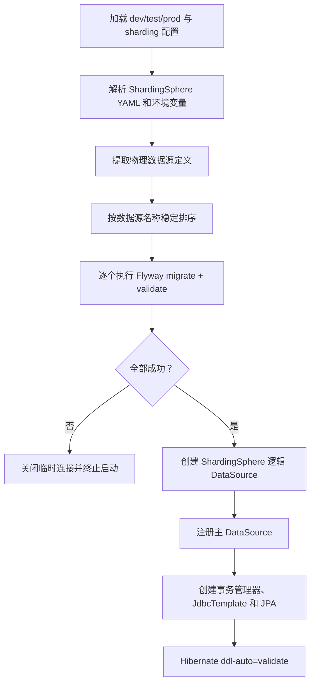

# Archetype 接入 ShardingSphere JDBC 与 Flyway 协同设计

## 1. 文档状态

- 状态：待审核
- 日期：2026-07-23
- 目标版本：Egon-COLA 5.2.3 archetype 模板
- 术语说明：本文使用当前产品名“Apache ShardingSphere JDBC”；用户所说的 ShardingJDBC 指同一能力，不引入旧版 `sharding-jdbc-spring-boot-starter`。

## 2. 背景与现状

当前三个 archetype 均已接入 Flyway，但尚未接入 ShardingSphere JDBC：

- `egon-cola-archetype-light`
- `egon-cola-archetype-service`
- `egon-cola-archetype-web`

现有模板的共同特征如下：

1. `dev`、`prod` 使用 `spring.datasource` 配置 PostgreSQL 与 HikariCP。
2. `test` 使用 PostgreSQL 兼容模式的 H2。
3. Flyway 默认扫描 `classpath:db/migration`，并在启动时执行迁移。
4. JPA 使用 `ddl-auto=validate`，依赖 Flyway 先完成建表。
5. 每个模板已有 `V1__*.sql`、`V2__*.sql` 历史迁移。
6. archetype 的有效修改面是 `src/main/resources/archetype-resources` 与 `verify.groovy`；`target/` 下的生成项目只能作为验证产物，不能直接修改。

直接把 `spring.datasource` 替换为 ShardingSphere 逻辑数据源会产生启动顺序问题：Flyway 可能拿到逻辑数据源，而不是需要真正执行 DDL 的物理数据源。多物理库场景下，只迁移其中一个库也会导致各分片 schema 不一致。因此本次不能只增加 Maven 依赖和一段 YAML，必须同时定义物理数据源迁移、逻辑数据源创建和 JPA 初始化的先后关系。

## 3. 需求目标

### 3.1 功能目标

1. 三个 archetype 全部具备 ShardingSphere JDBC 接入能力。
2. 新生成项目默认仍可按现有单数据源方式运行，避免升级 archetype 后强制改变部署拓扑。
3. 新生成项目可通过额外启用 `sharding` profile 切换到 ShardingSphere JDBC 逻辑数据源。
4. ShardingSphere 模式下，Flyway 必须先对配置中的每个物理数据源完成迁移，再创建逻辑数据源。
5. 任一物理数据源迁移失败时，应用必须启动失败，不能带着不一致的 schema 继续运行。
6. JPA、事务管理器、JdbcTemplate 以及现有 Repository 继续只依赖主 `DataSource`，业务代码不感知单数据源或 ShardingSphere 模式。
7. 支持一个或多个物理数据源；默认示例保持单物理库和单表路由，不擅自改变现有学生管理领域表的分片语义。
8. ShardingSphere 规则使用独立 YAML 表达，便于生成项目根据业务需要增加分库、分表、广播表或绑定表配置。

### 3.2 Flyway 规范目标

1. 所有新建的 SQL versioned migration 使用“日期 + 当日序列号”版本。
2. 文件名统一为：

   ```text
   VyyyyMMdd_NNN__lower_snake_case_description.sql
   ```

   示例：

   ```text
   V20260723_001__create_user_sharding_tables.sql
   V20260723_002__add_score_query_indexes.sql
   ```

3. `yyyyMMdd` 使用迁移文件创建日期；`NNN` 是同一生成项目、同一天内从 `001` 开始递增的三位序列号。
4. 描述只允许小写字母、数字和下划线。
5. 每个新 SQL 文件的开头必须包含以下注释，内容必须具体，不能保留占位文字：

   ```sql
   -- 变更内容：说明本次新增、修改或删除的数据库对象及数据处理逻辑。
   -- 影响范围：说明涉及的表、索引、约束、数据范围和受影响的应用模块。
   -- 兼容性说明：说明对已有数据、滚动发布和回滚处理的约束。
   ```

6. 配置 `spring.flyway.validate-migration-naming=true`，使不符合 Flyway 基础命名约定的文件在启动时快速失败。
7. 生成项目增加迁移规范测试，使用正则校验日期、三位序列号和描述格式，并校验三个必需的文件头注释。`validate-migration-naming` 只能校验 Flyway 基础格式，不能替代此项目级测试。

### 3.3 历史迁移兼容

现有六个 `V1__*.sql`、`V2__*.sql` 属于历史迁移，不改名、不移动、不补注释。原因如下：

1. Flyway 会记录 versioned migration 的名称和 checksum；修改已执行文件会破坏验证。
2. 仓库规则明确要求历史 Flyway migration 不可变。
3. 日期 + 序列号规范从本次变更之后的新 migration 开始执行。

迁移规范测试必须维护这六个历史文件的精确白名单。白名单只用于兼容当前文件，不能使用 `V1/V2` 这类宽泛规则放过未来新增文件。

## 4. 范围

### 4.1 本次范围

1. 三个 archetype 的生成项目 POM。
2. 三个 archetype 的 `dev`、`test`、`prod` 数据源与 Flyway 配置。
3. 新增 `sharding` profile 及 ShardingSphere YAML 规则模板。
4. Light 的 `infrastructure/config` 数据源启动编排。
5. Web、Service 的 `infrastructure` 模块数据源启动编排。
6. Flyway 迁移命名与注释规范测试。
7. 三个 archetype 的 `verify.groovy` 生成契约。
8. 中英文 README 中的数据源模式、启用方式、Flyway 规则和故障处理说明。

### 4.2 非本次范围

1. 不把现有 `users`、`course`、`score` 等业务表直接改造成物理分片表。
2. 不迁移已有生产数据，不设计在线双写、历史数据回填或切片扩容方案。
3. 不引入 ShardingSphere Proxy、治理中心或集群持久化模式。
4. 不引入读写分离、数据加密、影子库、分布式事务等额外规则。
5. 不修改现有六个 Flyway migration。
6. 不修改 `target/` 下的 archetype 生成产物。

实际业务表采用何种分片键、分片算法、物理节点数及跨表关联策略，需要基于具体业务访问模式另行设计，不能由通用 archetype 猜测。

## 5. 方案比较

### 5.1 方案 A：直接使用 ShardingSphere JDBC Driver，并让 Flyway 连接逻辑数据源

做法：

- `spring.datasource.driver-class-name` 改为 `ShardingSphereDriver`。
- `spring.datasource.url` 指向 ShardingSphere YAML。
- 保留 Spring Boot 默认 Flyway 自动配置。

优点：

- 配置和代码改动最少。

缺点：

- Flyway 面向逻辑数据源执行 DDL，多物理库迁移行为不明确。
- 无法清晰保证每个物理节点拥有相同 schema。
- 启动顺序与失败边界不可控。

结论：不采用。

### 5.2 方案 B：应用内先迁移物理数据源，再创建 ShardingSphere 逻辑数据源

做法：

- 单数据源模式继续使用 Spring Boot 原生自动配置。
- `sharding` profile 下关闭默认 Flyway 自动执行。
- 读取并解析同一份 ShardingSphere YAML 中的物理数据源。
- 对每个物理数据源依次执行 Flyway。
- 所有迁移成功后，通过 `YamlShardingSphereDataSourceFactory` 创建主逻辑 `DataSource`。

优点：

- 生成项目自包含，启动即可完成 schema 检查和迁移。
- 支持一个或多个物理数据源。
- 能明确保证“物理迁移完成 → 逻辑数据源可用 → JPA validate”顺序。
- ShardingSphere 规则仍由官方 YAML 表达，不需要自建一套规则 DSL。

缺点：

- 需要少量启动编排代码和针对性的测试。
- 启动时间随物理数据源数量增加。

结论：采用。

### 5.3 方案 C：Flyway 完全移出应用，由 CI/CD 或独立 Job 执行

优点：

- 应用启动职责最简单。
- 大规模生产环境更容易独立控制 migration 权限和发布窗口。

缺点：

- archetype 生成项目不再开箱即用。
- 本地开发、测试和小型部署必须额外维护迁移流程。
- 与当前三个模板的应用内 Flyway 约定不一致。

结论：本次不采用；可作为生成项目后续生产治理选项。

## 6. 选定设计

### 6.1 依赖

使用 Apache ShardingSphere JDBC 5.5.2：

```xml
<shardingsphere.version>5.5.2</shardingsphere.version>
```

依赖坐标：

```xml
<dependency>
    <groupId>org.apache.shardingsphere</groupId>
    <artifactId>shardingsphere-jdbc</artifactId>
    <version>${shardingsphere.version}</version>
</dependency>
```

依赖放置规则：

- Light：放入生成项目根 POM。
- Web、Service：版本放入生成父 POM，实际依赖放入 `infrastructure` 模块。
- 不引入旧版 ShardingSphere Spring Boot Starter。
- Flyway、PostgreSQL、H2 与 JPA 现有依赖保持原位置。

实施时必须通过 Maven 依赖树和生成项目测试验证 ShardingSphere 5.5.2 与当前 Java 21、Spring Boot 3.5.16、Flyway 组合；不得因传递依赖冲突静默降级现有依赖。

### 6.2 profile 契约

| 激活 profile | 数据源模式 | Flyway 执行方式 |
| --- | --- | --- |
| `dev` | 现有单数据源 | Spring Boot 默认 Flyway |
| `test` | 现有 H2 单数据源 | Spring Boot 默认 Flyway |
| `prod` | 现有单数据源 | Spring Boot 默认 Flyway |
| `dev,sharding` | ShardingSphere JDBC | 自定义物理节点迁移编排 |
| `test,sharding` | ShardingSphere JDBC 测试拓扑 | 自定义物理节点迁移编排 |
| `prod,sharding` | ShardingSphere JDBC | 自定义物理节点迁移编排 |

`sharding` 是叠加 profile，不替代 `dev/test/prod`。默认 profile 仍为 `dev`，因此现有生成项目和部署配置不会被强制切换。

### 6.3 配置文件职责

1. `application-dev.yml`、`application-test.yml`、`application-prod.yml`
   - 保留当前单数据源配置。
   - 增加 `validate-migration-naming: true`。
2. `application-sharding.yml`
   - 启用自定义 ShardingSphere 数据源配置。
   - 关闭 Spring Boot 默认 Flyway 自动执行，避免逻辑数据源被误迁移。
   - 指定 ShardingSphere YAML 资源位置。
   - 复用现有 `spring.flyway.locations`、`baseline-on-migrate`、`validate-on-migrate` 和 `clean-disabled` 语义。
3. `sharding/shardingsphere.yml`
   - 定义逻辑数据库名、物理数据源、规则和 ShardingSphere 属性。
   - 数据源 URL、用户名、密码和池参数继续使用环境变量占位符。
   - 默认模板使用单物理数据源与单表路由，保证启用后不改变现有业务表语义。
   - 文件中提供说明性注释，标明增加物理节点或 `!SHARDING` 规则时必须同步考虑 Flyway 和业务分片键。

ShardingSphere 原生 YAML 不是 Spring 配置文件。启动编排必须先通过 Spring `Environment` 解析模板占位符，再把解析后的内容交给 ShardingSphere，避免把 `${...}` 原样传给 HikariCP。

### 6.4 启动顺序



约束：

1. 物理数据源名称排序后串行迁移，保证日志与故障定位稳定。
2. 不并行执行 migration，避免模板默认场景下增加连接峰值和复杂失败处理。
3. 每个物理数据源使用自己的 `flyway_schema_history`。
4. 所有物理数据源使用同一组 `classpath:db/migration` 脚本，保证 schema 一致。
5. Flyway 只对物理 JDBC URL 执行，不对 ShardingSphere 逻辑 JDBC URL 执行。
6. 迁移完成前不得暴露主 `DataSource` Bean。
7. 迁移或 YAML 解析失败时，异常必须包含物理数据源名称和 migration location，但不得打印密码。

### 6.5 组件边界

各 archetype 采用相同职责，包路径按自身结构放置：

- `ShardingSphereDataSourceConfiguration`
  - 仅负责条件装配和 Bean 定义。
- `ShardingDataSourceBootstrapper`
  - 作为 Facade，编排“加载配置、迁移物理库、创建逻辑数据源”完整流程。
- `ShardingYamlLoader`
  - 加载资源、解析 Spring 占位符并校验必要字段。
- `PhysicalDataSourceFlywayMigrator`
  - 从解析后的配置提取物理连接信息，逐节点执行 Flyway。

Light 放在 `infrastructure.config.datasource`；Web、Service 放在各自 `infrastructure` 模块的 `infrastructure.config.datasource`。不在 Domain、Application 或 Starter 模块放置 ShardingSphere/Flyway 实现。

## 7. 设计模式判断

本次采用轻量的 Facade 模式：`ShardingDataSourceBootstrapper` 对外只暴露“创建已完成物理迁移的逻辑数据源”这一职责，内部协调 YAML 加载和 Flyway 迁移。

采用原因：

1. 启动过程存在严格且不可交换的三阶段顺序。
2. 配置解析、数据库迁移和逻辑数据源创建需要分别测试。
3. 如果全部堆在一个 `@Bean` 方法中，错误处理和资源关闭会难以维护。

不引入 Strategy、Factory 接口层或继承体系。单数据源与 ShardingSphere 的切换已经由 Spring profile/条件装配表达；额外抽象不会增加真实扩展能力。逻辑数据源创建直接使用 ShardingSphere 官方 Factory。

## 8. Flyway 执行细则

### 8.1 配置继承

自定义物理迁移必须与现有配置保持一致：

- `locations=classpath:db/migration`
- `baseline-on-migrate=false`（允许环境变量覆盖）
- `validate-on-migrate=true`
- `validate-migration-naming=true`
- `clean-disabled=true`，仅测试环境允许现有测试按需清理

不得在 ShardingSphere 模式下另建一套默认值不同的 Flyway 配置。

### 8.2 schema 一致性

1. 每个物理节点执行完全相同的 versioned migrations。
2. 任一节点的 `info`、`migrate` 或 `validate` 失败，整体启动失败。
3. 错误信息要指出失败节点，但密码和完整密文不得进入日志。
4. 本次不支持每个分片使用不同 migration location；这会破坏统一逻辑表的 schema 一致性。

### 8.3 命名规范的持续约束

生成项目中的测试必须扫描 `src/main/resources/db/migration`，并执行以下检查：

1. 历史白名单文件必须存在且名称不变。
2. 白名单之外的 SQL 文件名必须匹配：

   ```regex
   ^V\d{8}_\d{3}__[a-z0-9]+(?:_[a-z0-9]+)*\.sql$
   ```

3. 同一天的序列号不能重复。
4. 新 migration 的 version 必须大于现有最大 version。
5. 新文件必须在首个 SQL 语句之前包含“变更内容”“影响范围”“兼容性说明”三项注释。
6. 注释值不能为空，也不能使用 `TODO`、`TBD` 或“待补充”。

## 9. 生成契约

三个 `verify.groovy` 均需断言：

1. 生成 POM 包含 `org.apache.shardingsphere:shardingsphere-jdbc` 和显式版本管理。
2. Web、Service 的 ShardingSphere 依赖只位于 `infrastructure`，不泄漏到 Domain/Application。
3. `application-sharding.yml` 和 `sharding/shardingsphere.yml` 已生成。
4. 默认 profile 仍为 `dev`，ShardingSphere 不会被默认强制启用。
5. ShardingSphere 模式关闭默认 Flyway 自动执行。
6. 启动编排类位于正确模块和包路径。
7. 历史 migration 名称和 checksum 不变。
8. 迁移规范测试存在，并包含日期序列号正则、历史白名单和注释校验。
9. README 中英文版本均说明启用命令、配置项、物理节点迁移行为和命名规范。

## 10. 测试设计

### 10.1 单元测试

1. `ShardingYamlLoaderTest`
   - 正确解析环境变量占位符。
   - 缺失 URL、用户名或规则资源时失败。
   - 异常中不泄漏密码。
2. `PhysicalDataSourceFlywayMigratorTest`
   - 使用两个独立 H2 数据源验证 migration 都被执行。
   - 第二个节点失败时整体失败。
   - 验证节点按名称稳定排序。
3. `ShardingDataSourceBootstrapperTest`
   - 证明 Flyway 完成后才调用 ShardingSphere Factory。
   - 证明 migration 失败时不会返回逻辑数据源。
4. `FlywayMigrationConventionTest`
   - 验证历史白名单。
   - 验证新文件命名。
   - 验证必需注释。

### 10.2 生成项目测试

1. 原有 `test` profile 全量测试保持通过。
2. 增加 `test,sharding` 集成测试：
   - 使用 H2 物理数据源；
   - Flyway 创建 schema；
   - ShardingSphere 逻辑数据源成功建立；
   - JPA `ddl-auto=validate` 通过；
   - 至少通过现有 Repository 或 JdbcTemplate 完成一次写入和查询。
3. 验证主事务管理器使用逻辑数据源。
4. 验证没有生成第二套 EntityManagerFactory 或重复 Flyway 自动配置。

### 10.3 验证命令

实施完成后至少执行：

```bash
./mvnw -B -ntp -f egon-cola-archetypes/pom.xml clean integration-test
```

并对三个生成项目分别执行：

```bash
./mvnw -B -ntp clean verify
./mvnw -B -ntp -Dspring.profiles.active=test,sharding clean verify
```

最后执行：

```bash
git diff --check
```

不得以 archetype 模块 `compile` 代替生成项目契约验证。

## 11. 文档要求

每个 archetype 的 README 与 README.zh-CN 同步更新：

1. 单数据源与 ShardingSphere 两种模式的适用场景。
2. `dev,sharding`、`test,sharding`、`prod,sharding` 的启用方法。
3. 物理数据源环境变量和规则文件位置。
4. Flyway 在每个物理节点执行的行为。
5. 日期 + 三位序列号命名规则。
6. SQL 文件头注释模板。
7. 历史 `V1/V2` 不可修改的原因。
8. 新增分片规则前必须先确定业务分片键和物理表 migration。

## 12. 验收标准

以下条件全部满足才视为完成：

1. 三个 archetype 均包含 ShardingSphere JDBC 依赖、配置、启动编排和测试。
2. 不启用 `sharding` 时，现有单数据源行为与测试不变。
3. 启用 `test,sharding` 时，Flyway 对所有测试物理节点迁移成功，逻辑数据源和 JPA 正常工作。
4. 任一物理节点迁移失败时，应用启动失败且错误不泄漏凭证。
5. 历史 migration 文件内容、路径和 checksum 不变。
6. 新 migration 命名与注释规范可被自动化测试强制执行。
7. 三个 archetype 的 `clean integration-test` 通过。
8. 三个生成项目的单数据源与 ShardingSphere 验证均通过。
9. README 中英文内容一致。
10. 无 `target/` 生成产物被提交。

## 13. 风险与控制

### 13.1 ShardingSphere 与 Spring Boot 依赖冲突

控制：显式锁定 ShardingSphere 版本，检查依赖树，并以三个生成项目的实际启动测试作为兼容性结论。

### 13.2 Flyway 与逻辑数据源初始化顺序错误

控制：逻辑数据源只允许由 Bootstrapper 在全部物理 migration 成功后创建；增加调用顺序测试。

### 13.3 多节点 schema 漂移

控制：所有物理节点共用 migration locations，任一节点失败则整体失败，不支持节点级差异脚本。

### 13.4 配置中凭证泄漏

控制：凭证只从环境变量或现有加密占位符进入，日志与异常只输出数据源名称和脱敏 URL。

### 13.5 把“已接入”误解为“已有业务表已完成分片”

控制：README 与示例明确说明本次提供基础设施接入和可运行逻辑数据源，不替业务决定分片键，也不改造现有业务表。

## 14. 审核重点

本 spec 采用以下明确决策，请审核时重点确认：

1. 作用范围是 Light、Web、Service 三个 archetype。
2. ShardingSphere 通过叠加 `sharding` profile 启用，不默认强制开启。
3. 本次提供 ShardingSphere/Flyway 基础设施协同，不直接改造现有业务表为分片表。
4. Flyway 在应用内逐个迁移物理数据源，不迁移逻辑数据源。
5. 新 SQL 使用 `VyyyyMMdd_NNN__description.sql`。
6. 现有 `V1/V2` 完全不动，日期规则只约束后续新 migration。
7. 新 SQL 必须包含“变更内容、影响范围、兼容性说明”头注释。

## 15. 参考资料

- [Apache ShardingSphere JDBC 5.5.2 Java API](https://shardingsphere.apache.org/document/5.5.2/en/user-manual/shardingsphere-jdbc/java-api/)
- [Apache ShardingSphere JDBC YAML 配置](https://shardingsphere.apache.org/document/current/cn/user-manual/shardingsphere-jdbc/yaml-config/)
- [Apache ShardingSphere JDBC Driver](https://shardingsphere.apache.org/document/current/cn/user-manual/shardingsphere-jdbc/yaml-config/jdbc-driver/)
- [Spring Boot 3.5.16 FlywayAutoConfiguration](https://docs.spring.io/spring-boot/3.5/api/java/org/springframework/boot/autoconfigure/flyway/FlywayAutoConfiguration.html)
- [Spring Boot 3.5.16 FlywayDataSource](https://docs.spring.io/spring-boot/3.5/api/java/org/springframework/boot/autoconfigure/flyway/FlywayDataSource.html)
- [Flyway Versioned Migrations](https://documentation.red-gate.com/flyway/flyway-concepts/migrations/versioned-migrations)
- [Flyway Validate Migration Naming](https://documentation.red-gate.com/flyway/reference/configuration/flyway-namespace/flyway-validate-migration-naming-setting)
