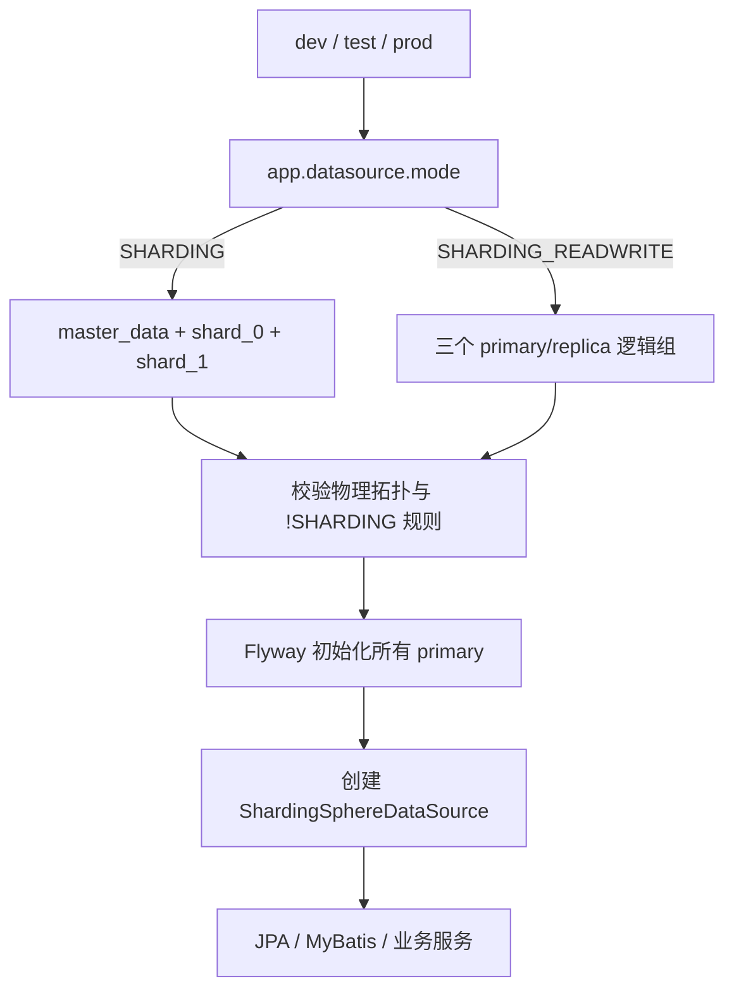

# Archetype ShardingSphere JDBC 与 Flyway 设计 Spec（2026-07-26 修订）

## 1. 文档状态

- 状态：方案与 Spec 已确认，等待实施。
- 适用范围：`egon-cola-archetype-light`、`egon-cola-archetype-service`、`egon-cola-archetype-web`。
- 目标版本：Apache ShardingSphere JDBC 5.5.3。
- 本次修订取代本文此前关于“应用级 SINGLE mode”“!SINGLE 规则”和“在线数据迁移”的设计。

## 2. 背景与前提

三个 archetype 都是尚未上线、尚未生成生产数据的新项目模板。不存在历史业务数据，不需要兼容旧路由，也不设计在线搬迁、双写、切流或回滚流程。

当前模板已经具备 ShardingSphere JDBC、UUIDv7 路由、读写分离和物理主库 Flyway 初始化的基础代码，但仍保留了两类容易混淆的 SINGLE 能力：

1. `app.datasource.mode=SINGLE`：整个应用绕过 ShardingSphere，使用 Spring Boot 普通单数据源。
2. `!SINGLE`：ShardingSphere 用独立 Single Rule 管理不分片表。

本次确认后的目标是：

- 删除第一类应用级 SINGLE mode；
- 删除第二类 `!SINGLE` 规则；
- 应用始终使用 ShardingSphereDataSource；
- 业务主数据仍允许只存放在一个物理库，但必须作为 `!SHARDING` 表规则并显式使用 `NoneShardingStrategy`；
- 需要分片的聚合继续使用 UUIDv7 分库分表；
- 可选叠加读写分离，但不建设真实主从环境。

## 3. 目标

### 3.1 功能目标

1. 数据源能力只允许 `SHARDING` 和 `SHARDING_READWRITE`。
2. 未配置 mode 时默认 `SHARDING`；配置 `SINGLE` 或未知值时启动失败。
3. dev、test、prod 仅表示环境，不能承担数据源能力切换。
4. 所有业务运行模式都创建 ShardingSphereDataSource。
5. 主数据表显式绑定到 `master_data` 单一节点，分库与分表策略都使用 `none`。
6. 真正的分片表使用 UUIDv7 聚合根键完成分库、分表和绑定表路由。
7. 对缺少分片条件的危险 DML 启用 `DML_SHARDING_CONDITIONS` 审计。
8. Flyway 在逻辑数据源创建前初始化全部物理 primary；replica 和逻辑数据源不执行 Flyway。
9. 初始库数和每库表数必须是 2 的幂。
10. 不使用分布式事务。

### 3.2 质量目标

1. 配置失败必须在启动期暴露，不能静默降级。
2. 主数据表和分片表都必须显式声明物理节点，不允许隐式随机或默认路由。
3. 两种 mode 的 `!SHARDING` 规则必须保持一致，差异只允许出现在 `!READWRITE_SPLITTING` 规则和物理连接池定义。
4. 三个生成项目必须通过单元测试、路由集成测试、架构检查和 archetype `verify.groovy` 契约检查。

## 4. 非目标

本次明确不包含：

- 历史业务数据兼容；
- 在线数据迁移；
- N→2N 双写、搬迁、校验、切流或回滚；
- 真实 PostgreSQL primary/replica 部署；
- 复制延迟、故障切换或网络分区验证；
- ShardingSphere Proxy；
- XA、Seata 或其他分布式事务；
- 跨库外键；
- 广播表；
- 动态治理中心和运行期 DistSQL 改规则。

Flyway 仍负责新项目的数据库结构初始化；这里排除的是历史业务数据搬迁，不是数据库结构版本管理。

## 5. 核心术语

### 5.1 应用运行模式

| mode | 分库分表 | 读写分离 | 应用 DataSource |
|---|---|---|---|
| `SHARDING` | 是 | 否 | ShardingSphereDataSource |
| `SHARDING_READWRITE` | 是 | 是 | ShardingSphereDataSource |

不再存在 `SINGLE` mode。

### 5.2 主数据表

主数据表是业务上只需要一份、需要全局唯一约束或承担目录/权限语义的表。它们位于 `master_data` 物理库，但仍属于 `!SHARDING.tables`，配置为：

```yaml
users:
  actualDataNodes: master_data.public.users
  databaseStrategy:
    none:
  tableStrategy:
    none:
```

这表示：

- 表由 ShardingSphere 管理；
- 物理节点唯一且明确；
- 不计算分库；
- 不计算分表；
- 不使用 `!SINGLE`；
- 不使用广播规则。

### 5.3 分片表

分片表包含多个实际数据节点，并同时配置标准分库策略和标准分表策略。所有关联表以同一个聚合根分片键路由。

## 6. 总体架构


```mermaid
flowchart TD
    A["dev / test / prod"] --> B["app.datasource.mode"]
    B -->|"SHARDING"| C["master_data + shard_0 + shard_1"]
    B -->|"SHARDING_READWRITE"| D["三个 primary/replica 逻辑组"]
    C --> E["校验物理拓扑与 !SHARDING 规则"]
    D --> E
    E --> F["Flyway 初始化所有 primary"]
    F --> G["创建 ShardingSphereDataSource"]
    G --> H["JPA / MyBatis / 业务服务"]
```

启动顺序是强约束：

1. 绑定当前 mode 对应的完整物理拓扑；
2. 创建物理 Hikari 连接池；
3. 加载并校验 ShardingSphere YAML；
4. 对每个 Flyway primary target 执行 `migrate()` 和 `validate()`；
5. 创建 ShardingSphereDataSource；
6. 交由 JPA/MyBatis 初始化。

任一步失败都关闭已创建的物理连接池并终止启动。

## 7. 物理数据源拓扑

### 7.1 SHARDING

| 物理数据源 | 角色 | 内容 |
|---|---|---|
| `master_data` | PRIMARY | NoneShardingStrategy 主数据表 |
| `shard_0` | PRIMARY | 分片物理表 `_0`、`_1` |
| `shard_1` | PRIMARY | 分片物理表 `_0`、`_1` |

`!SHARDING` 的 actual data node 直接引用上述名称。

### 7.2 SHARDING_READWRITE

物理连接池：

- `master_data_primary`、`master_data_replica_0`；
- `shard_0_primary`、`shard_0_replica_0`；
- `shard_1_primary`、`shard_1_replica_0`。

`!READWRITE_SPLITTING` 将它们组合为三个逻辑组：

- `master_data`；
- `shard_0`；
- `shard_1`。

因此两种 mode 后续使用完全相同的 actual data node 名称。

每个组必须配置：

```yaml
transactionalReadQueryStrategy: PRIMARY
```

写操作访问 primary，普通查询可访问 replica，事务内查询固定访问 primary。代码保留该能力，但本次不提供真实复制拓扑。

## 8. 表分类与分片键

### 8.1 Light

| 逻辑表 | 类型 | actual data nodes / 分片键 |
|---|---|---|
| `users` | NONE | `master_data.public.users` |
| `roles` | NONE | `master_data.public.roles` |
| `permissions` | NONE | `master_data.public.permissions` |
| `user_roles` | NONE | `master_data.public.user_roles` |
| `role_permissions` | NONE | `master_data.public.role_permissions` |
| `courses` | NONE | `master_data.public.courses` |
| `school_classes` | SHARDING | `id` |
| `class_course_schedules` | SHARDING | `school_class_id` |

绑定表：

```text
school_classes,class_course_schedules
```

同一个 `schoolClassId` 的班级与排课必须落在同一个库和同一个表后缀。

### 8.2 Web

| 逻辑表 | 类型 | actual data nodes / 分片键 |
|---|---|---|
| `users` | NONE | `master_data.public.users` |
| `roles` | NONE | `master_data.public.roles` |
| `permissions` | NONE | `master_data.public.permissions` |
| `user_roles` | NONE | `master_data.public.user_roles` |
| `role_permissions` | NONE | `master_data.public.role_permissions` |
| `grades` | NONE | `master_data.public.grades` |
| `school_classes` | SHARDING | `grade_id` |
| `school_class_users` | SHARDING | `grade_id` |

绑定表：

```text
school_classes,school_class_users
```

同一个 `gradeId` 的班级与成员关系必须落在同一个库和同一个表后缀。

### 8.3 Service

| 逻辑表 | 类型 | actual data nodes / 分片键 |
|---|---|---|
| `course` | NONE | `master_data.public.course` |
| `course_schedule` | SHARDING | `course_id` |
| `exam` | SHARDING | `id` |
| `exam_paper` | SHARDING | `exam_id` |
| `score` | SHARDING | `exam_id` |

绑定表：

```text
exam,exam_paper,score
```

课程排期按 `courseId` 路由；考试、试卷和成绩按 `examId` 路由。创建考试时 `exam.id` 必须先生成并作为该聚合根分片键。

## 9. UUIDv7 与路由算法

### 9.1 主键生成

1. 所有代理主键继续由应用层 `UuidV7Generator` 在 INSERT 前生成。
2. 不使用数据库自增键作为分片键。
3. 不启用 ShardingSphere Snowflake 主键生成器。
4. 主数据表的 UUIDv7 仅保证全局唯一，不参与 None 路由。
5. 分片从属表必须显式保存聚合根分片键。

### 9.2 初始物理布局

默认布局：

```text
2 个分片库 × 每库 2 张物理表 = 4 个实际分片节点
```

示例：

```text
0=shard_0:0
1=shard_0:1
2=shard_1:0
3=shard_1:1
```

校验规则：

- 分片库数量必须是 2 的幂；
- 每库物理表数量必须相等且是 2 的幂；
- 表后缀必须从 0 连续编号；
- node count 必须等于 node map 数量；
- node map 中的每个物理节点必须唯一；
- node map 必须和 YAML actual data nodes 完全一致。

本次同时删除：

- `ShardingNodeMapCompatibilityValidator`；
- `mapping-version` 配置；
- `ShardingNodeMap.mappingVersion` 字段；
- 旧映射与候选映射比较测试。

这些内容都属于扩容迁移语义，而新项目不存在旧映射。运行时路由只需要 `node-count` 和 `node-map`。

### 9.3 范围查询

当前 UUIDv7 自定义算法只支持精确路由。范围查询不自动转换为广播查询；需要跨分片聚合时必须由明确的查询用例、分页上限和执行计划单独设计。

## 10. 分片 DML 审计

真正的分片表必须配置：

```yaml
auditStrategy:
  auditorNames:
    - sharding_key_required_auditor
  allowHintDisable: false
```

规则级算法：

```yaml
auditors:
  sharding_key_required_auditor:
    type: DML_SHARDING_CONDITIONS
```

要求：

- 缺少分片条件的危险 DML 必须被拒绝；
- 禁止通过 Hint 绕过审计；
- NoneShardingStrategy 主数据表不配置该审计；
- SELECT 是否允许跨分片由具体查询语义决定，不以 DML 审计替代查询治理。

## 11. 事务边界

只使用单物理库本地事务：

允许：

- 一个事务写多张 `master_data` 主数据表；
- 一个事务写相同分片键的 binding tables；
- 事务内读取固定走当前逻辑组的 primary。

禁止宣称原子性：

- 一个事务同时写 `master_data` 和任意 shard；
- 一个事务写两个不同分片键；
- 一个事务写两个不同 shard；
- 依赖 replica 完成写后立即读。

跨物理库流程通过业务幂等、状态机、事件和补偿解决，但本次不新增事务框架。

## 12. Flyway 结构初始化

### 12.1 自动配置边界

应用永远不允许 Flyway 对 ShardingSphere 逻辑 DataSource 执行 SQL。

实现方式：

1. 排除 Spring Boot `FlywayAutoConfiguration`；
2. 由 ShardingSphere 配置显式绑定 `FlywayProperties`；
3. `PhysicalDataSourceFlywayMigrator` 在逻辑 DataSource 创建前执行；
4. 删除 `LogicalDataSourceFlywayMigrationStrategy` 及其 no-op Bean；
5. `spring.flyway.enabled=false` 时跳过物理结构初始化，但不会恢复逻辑 DataSource 自动迁移。

### 12.2 目录

每个 archetype 只保留：

```text
classpath:db/migration/sharding/master-data
classpath:db/migration/sharding/shard
```

删除：

```text
classpath:db/migration/default
classpath:db/migration/sharding/single
```

### 12.3 SQL 文件

由于模板未上线、未执行，可以直接重组现有初始化 SQL。最终文件为：

| Archetype | master-data | shard |
|---|---|---|
| Light | `V20260726_001__init_light_master_data_schema.sql` | `V20260726_002__init_light_sharded_schema.sql` |
| Web | `V20260726_001__init_organization_master_data_schema.sql` | `V20260726_002__init_organization_sharded_schema.sql` |
| Service | `V20260726_001__init_evaluation_master_data_schema.sql` | `V20260726_002__init_evaluation_sharded_schema.sql` |

每个文件开头必须包含：

```sql
-- 变更内容：...
-- 影响范围：...
-- 兼容性说明：新脚手架初始化文件，不涉及历史业务数据兼容。
```

### 12.4 Flyway targets

SHARDING：

| target | location |
|---|---|
| `master_data` | `classpath:db/migration/sharding/master-data` |
| `shard_0` | `classpath:db/migration/sharding/shard` |
| `shard_1` | `classpath:db/migration/sharding/shard` |

SHARDING_READWRITE：

| target | location |
|---|---|
| `master_data_primary` | `classpath:db/migration/sharding/master-data` |
| `shard_0_primary` | `classpath:db/migration/sharding/shard` |
| `shard_1_primary` | `classpath:db/migration/sharding/shard` |

任何 replica 出现在 Flyway targets 中都必须启动失败。

## 13. 配置文件设计

### 13.1 application.yml

保留导入：

```yaml
spring:
  profiles:
    default: dev
  config:
    import:
      - classpath:datasource/sharding.yml
      - classpath:datasource/sharding-readwrite.yml

app:
  datasource:
    mode: ${APP_DATASOURCE_MODE:SHARDING}
```

删除普通 `spring.datasource` 和默认 Flyway locations。

### 13.2 数据源环境变量

三类 archetype 的业务前缀分别是 `LIGHT`、`EVALUATION`、`ORGANIZATION`。

SHARDING 使用统一凭证和三个物理 URL：

```text
<PREFIX>_SHARDING_MASTER_DATA_URL
<PREFIX>_SHARDING_SHARD_0_URL
<PREFIX>_SHARDING_SHARD_1_URL
<PREFIX>_SHARDING_USERNAME
<PREFIX>_SHARDING_PASSWORD
```

SHARDING_READWRITE 对每个 primary/replica 使用独立 URL 与凭证：

```text
<PREFIX>_MASTER_DATA_PRIMARY_URL/USERNAME/PASSWORD
<PREFIX>_MASTER_DATA_REPLICA_0_URL/USERNAME/PASSWORD
<PREFIX>_SHARD_0_PRIMARY_URL/USERNAME/PASSWORD
<PREFIX>_SHARD_0_REPLICA_0_URL/USERNAME/PASSWORD
<PREFIX>_SHARD_1_PRIMARY_URL/USERNAME/PASSWORD
<PREFIX>_SHARD_1_REPLICA_0_URL/USERNAME/PASSWORD
```

删除所有带 `SHARDING_SINGLE` 或 `SINGLE_PRIMARY/REPLICA` 的环境变量名，避免把“主数据单库”和已删除的 SINGLE mode 混为一谈。

### 13.3 application-test.yml

测试配置必须提供完整 H2 SHARDING 拓扑，不能依赖普通单数据源：

- mode 缺省，验证默认值就是 SHARDING；
- 提供 `master_data`、`shard_0`、`shard_1` 测试连接；
- 提供对应 Flyway targets；
- 保留 JPA `ddl-auto=validate`；
- 不出现 `spring.datasource`；
- 不出现 `db/migration/default`。

读写分离测试通过测试参数提供独立的 primary/replica 拓扑，不写入默认测试配置。

### 13.4 DataSourceModeProperties

枚举仅包含：

```java
SHARDING("sharding"),
SHARDING_READWRITE("sharding-readwrite")
```

构造时 null 默认转换为 SHARDING。删除 `isShardingSphere()`，因为所有合法值都是 ShardingSphere mode。

### 13.5 条件装配

删除 `ShardingDataSourceModeCondition`。ShardingSphere 配置在所有合法运行模式下始终装配，mode 只负责选择 topology name。

## 14. ShardingSphere YAML 规则

### 14.1 SHARDING 规则结构

```yaml
rules:
  - !SHARDING
    tables:
      # 主数据表：单一节点 + none/none
      # 分片表：多个节点 + standard/standard
    bindingTables:
      # 只包含同分片键的关联分片表
    shardingAlgorithms:
      uuid_v7_database_bucket:
        type: CLASS_BASED
      uuid_v7_table_bucket:
        type: CLASS_BASED
    auditors:
      sharding_key_required_auditor:
        type: DML_SHARDING_CONDITIONS
```

文件中禁止出现 `!SINGLE` 和 `defaultDataSource`。

### 14.2 SHARDING_READWRITE 规则结构

```yaml
rules:
  - !READWRITE_SPLITTING
    # master_data、shard_0、shard_1
  - !SHARDING
    # 与 SHARDING mode 逐字一致的规则后缀
```

测试必须比较从 `- !SHARDING` 到文件末尾的 UTF-8 文本，保证 None、分片、binding、audit 和 props 一致。

## 15. 本地部署模板

### 15.1 Compose

18 份 Compose 文件默认使用 SHARDING，并部署三个独立 PostgreSQL 服务：

- `postgres-master-data`；
- `postgres-shard-0`；
- `postgres-shard-1`。

要求：

- `APP_DATASOURCE_MODE: "SHARDING"`；
- application 依赖三个 PostgreSQL healthcheck；
- 删除普通 `DB_URL`、`DB_USERNAME`、`DB_PASSWORD`；
- 注入 master-data、shard-0、shard-1 对应 URL 和凭证；
- 每个 PostgreSQL 使用独立 volume；
- 不创建 replica；
- 不模拟复制。

### 15.2 Dockerfile

容器默认值改为：

```text
APP_DATASOURCE_MODE=SHARDING
```

镜像本身不内置物理数据库地址。

### 15.3 SHARDING_READWRITE 部署边界

README 只说明所需 primary/replica 变量和路由语义，不提供生产拓扑模板，不宣称完成真实主从验证。

## 16. 代码调整范围

三个 archetype 统一调整：

1. `DataSourceModeProperties`：删除 SINGLE，默认 SHARDING。
2. 删除 `ShardingDataSourceModeCondition`。
3. `ShardingSphereDataSourceConfiguration`：始终装配，移除 no-op Flyway strategy。
4. 删除 `LogicalDataSourceFlywayMigrationStrategy`。
5. 排除 Boot `FlywayAutoConfiguration`，保留手工物理 primary 初始化。
6. `ShardingDataSourcePropertiesLoader`：只选择 sharding 或 sharding-readwrite。
7. `ShardingTopologyValidator`：删除 `!SINGLE` 校验，新增 None table 校验和 audit 校验。
8. 删除 `ShardingNodeMapCompatibilityValidator`、`mapping-version` 及其测试。
9. 更新数据源名称、Flyway locations、SQL、README、Dockerfile 和 Compose。
10. 更新三个 `verify.groovy` 的生成项目契约。

现有 `ShardingDataSourceBootstrapper` 继续作为 Facade，负责连接池、校验、Flyway 和逻辑 DataSource 的启动编排。该职责已经清晰，不新增 Strategy/Factory 类层级；表级策略直接使用 ShardingSphere 官方配置模型。

## 17. 拓扑校验规则

`ShardingTopologyValidator` 必须验证：

1. 所有 physical data source name 唯一。
2. SHARDING 只允许 PRIMARY。
3. SHARDING_READWRITE 每个逻辑组恰好一个 PRIMARY，至少一个 REPLICA。
4. read/write group 只能引用已配置的物理连接池。
5. 所有主数据表都在 `!SHARDING.tables` 中。
6. 主数据表只有一个 actual data node。
7. 主数据表 actual data node 必须属于 `master_data`。
8. 主数据表 databaseStrategy 和 tableStrategy 都是 `none`。
9. 分片表不能使用 `master_data`。
10. 分片表必须同时配置 database/table standard strategy。
11. binding tables 必须存在且使用兼容的分片策略。
12. 分片表必须配置 `DML_SHARDING_CONDITIONS` 且禁止 Hint 绕过。
13. YAML 中不得出现 `!SINGLE` 或 `defaultDataSource`。
14. Flyway targets 必须恰好覆盖所有 primary。
15. Flyway targets 不得包含 replica。
16. master-data target 只能引用 master-data location。
17. shard target 只能引用 shard location。
18. node map 与 actual data nodes 完全一致。

## 18. 测试设计

### 18.1 配置绑定

- null mode 默认 SHARDING；
- SHARDING、SHARDING_READWRITE 可绑定；
- SINGLE 和未知值绑定失败；
- 只解析选中 topology，未选中的凭证占位符不影响启动。

### 18.2 NoneShardingStrategy

- YAML 能解析为 ShardingSphereDataSource；
- 主数据表 INSERT/SELECT/UPDATE/DELETE 只命中 `master_data`；
- shard 数据源中不创建、不访问同名主数据表；
- 主数据表配置缺少任意一个 `none` 时校验失败；
- YAML 出现 `!SINGLE` 时校验失败。

### 18.3 分片路由

- UUIDv7 精确路由到唯一数据库和表后缀；
- 非 UUIDv7、null、空字符串启动或路由失败；
- binding tables 使用同一聚合根键时落在同一物理节点；
- 缺少分片条件的危险 DML 被审计拒绝；
- 范围路由保持显式不支持。

### 18.4 Flyway

- 所有 primary 按目标执行一次结构初始化和校验；
- replica 不执行；
- 逻辑 ShardingSphereDataSource 不存在 Boot Flyway bean；
- `spring.flyway.enabled=false` 跳过物理初始化；
- migration 文件名和三行头注释符合规范。

### 18.5 应用启动

- 只激活 `test` profile，未显式配置 mode 时启动 SHARDING；
- DataSource 类型始终为 ShardingSphereDataSource；
- SHARDING_READWRITE 测试显式传 mode 后启动；
- JPA EntityManagerFactory 或 MyBatis 会话工厂正常创建；
- 不存在普通 Hikari 单数据源启动断言。

### 18.6 读写分离

使用轻量路由探针验证：

- 写入访问 primary；
- 普通查询访问 replica；
- 事务内查询访问 primary；
- 不启动真实 PostgreSQL 复制环境。

### 18.7 Archetype 契约

每个生成项目的 `verify.groovy` 必须断言：

- 只存在 SHARDING、SHARDING_READWRITE；
- 默认 mode 为 SHARDING；
- 不存在 `db/migration/default`；
- 不存在 `db/migration/sharding/single`；
- 不存在 `!SINGLE`；
- 主数据表存在显式 none/none；
- 分片表存在 standard/standard 和 DML audit；
- SQL 命名与注释正确；
- Compose 默认 SHARDING 且包含三个 PostgreSQL；
- Dockerfile 默认 SHARDING；
- dev/test/prod profile 合同未被改变。

## 19. 验证命令

权威验证命令：

```bash
./mvnw -B -ntp -f egon-cola-archetypes/pom.xml clean integration-test
```

辅助验证：

```bash
git diff --check
rg -n 'app.datasource.mode.*SINGLE|!SINGLE|db/migration/default|db/migration/sharding/single' egon-cola-archetypes
```

辅助扫描允许 README 的历史说明出现必要文字，但 active template configuration、source、test contract 和 SQL 路径不得残留旧实现。

不启动生成项目，不启动 Compose，不进行真实 PostgreSQL 主从测试。

## 20. 验收标准

全部满足才算完成：

1. 应用级 SINGLE mode 已从三个 archetype 删除。
2. 默认 mode 是 SHARDING。
3. 所有合法 mode 都创建 ShardingSphereDataSource。
4. `!SINGLE` 规则完全删除。
5. 主数据表通过 `actualDataNodes + none/none` 固定到 `master_data`。
6. 分片表使用 UUIDv7、标准分库分表策略和 DML 审计。
7. binding tables 使用同一聚合根分片键落在同一物理节点。
8. Flyway 只初始化物理 primary。
9. 默认 migration 和普通单数据源 Flyway 链路已删除。
10. 本地 Compose 提供三个 primary 数据库，不提供 replica。
11. dev/test/prod 环境合同保持不变。
12. 三个 archetype 的完整 integration-test 通过。
13. 文档不宣称历史数据迁移或真实主从验证。

## 21. 官方参考

- [ShardingSphere 5.5.3 数据分片 YAML](https://shardingsphere.apache.org/document/5.5.3/en/user-manual/shardingsphere-jdbc/yaml-config/rules/sharding/)
- [ShardingSphere 5.5.3 NoneShardingStrategy Java API](https://shardingsphere.apache.org/document/5.5.3/en/user-manual/shardingsphere-jdbc/java-api/rules/sharding/)
- [ShardingSphere 5.5.3 Single Rule](https://shardingsphere.apache.org/document/5.5.3/en/user-manual/shardingsphere-jdbc/yaml-config/rules/single/)
- [ShardingSphere 5.5.3 Readwrite-splitting YAML](https://shardingsphere.apache.org/document/5.5.3/en/user-manual/shardingsphere-jdbc/yaml-config/rules/readwrite-splitting/)
- [ShardingSphere 5.5.3 Sharding Audit](https://shardingsphere.apache.org/document/5.5.3/en/user-manual/common-config/builtin-algorithm/audit/)
