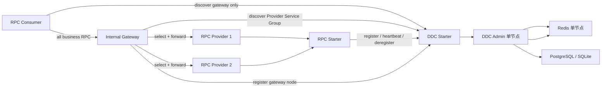

# 2026-07-24 DDC 单机闭环与轻量 gRPC + Protobuf RPC 框架设计 Spec

状态：草案，等待审核

文档阶段：需求与架构设计确认

涉及范围：

- 完善 `egon-cola-component-dynamic-config-center` 的单机运行闭环；
- 将 DDC 扩展为配置中心与轻量服务注册中心；
- 新增独立 `egon-cola-component-rpc` Component；
- RPC Component 只包含 `starter` 与 `test`；
- Provider、Consumer 和内部网关统一使用 DDC 注册发现；
- 暂不建设 DDC 集群、Raft、Redis Cluster 或多 Admin 高可用。

## 1. 背景

现有 DDC 已具备配置 CRUD、版本、回滚、发布任务、Redis Pub/Sub、
SDK 字段刷新、实例接口和 ACK 模型，但当前实现仍存在运行闭环缺口：

1. Starter 没有在应用启动后自动执行实例注册、默认值上报、全量配置
   拉取、定时心跳和优雅下线。
2. SDK 刷新后发送的 ACK 没有填写 `instanceId`，而 Admin 按
   `changeId + instanceId` 识别 ACK。
3. `ack-enabled`、`fail-fast`、心跳间隔和超时等配置没有完整进入运行链。
4. Redis 实例记录没有租约 TTL，数据库中的在线实例也没有过期摘除。
5. 强一致发布只具备 ACK 数量判断，没有同步等待、超时扫描和恢复逻辑。
6. SDK 可以生成 HMAC 请求头，但 Admin 没有验签。
7. SDK 和 Manifest 版本存在硬编码，可能与 Maven 工程版本漂移。
8. DDC 目前只有配置实例概念，没有 Provider Service、内部 Gateway Node、
   服务分组、版本和动态发现模型。

本次在修复上述单机缺口的基础上，将 DDC 扩展为 RPC Provider 与内部网关
共同使用的服务注册中心，并在独立 RPC Component 中实现一套以 grpc-java
作为传输运行时、Protocol Buffers 作为 IDL 和序列化协议的轻量 RPC 框架。

## 2. 已确认需求

### 2.1 DDC

1. 当前只支持单 Admin 进程。
2. 当前只支持一个 Redis 单节点连接。
3. PostgreSQL 和 SQLite 继续作为支持的数据库。
4. 不实现 Raft、Leader 选举、节点成员管理和复制日志。
5. 不实现多 Admin 并发写协调。
6. 修复 Starter 启动、刷新、ACK、心跳、租约、下线、发布超时和验签闭环。
7. DDC 新增服务注册与发现能力。
8. 服务注册事实是临时运行态数据，存储在 Redis，不新增数据库表。
9. 配置中心与注册中心共享 Admin 和基础设施，但使用隔离的 API、模型与
   Redis Key 空间。

### 2.2 RPC

1. RPC 框架基于 gRPC/grpc-java 和 Protocol Buffers：
   - gRPC 负责 HTTP/2 传输、流控、Deadline、Status 和调用模型；
   - Protobuf 负责唯一 IDL、消息代码生成和二进制序列化；
   - 框架不自行实现 TCP、HTTP/2 或私有序列化协议。
2. 主要角色为 Provider 与 Consumer。
3. Provider 启动后注册服务名称、分组、版本、实例地址、端口和扩展元数据。
4. Provider 通过心跳或租约维持状态，停止时主动注销。
5. Consumer 只发现内部网关，不发现、缓存或连接 Provider。
6. Consumer 的所有业务 RPC 请求都发送到内部网关。
7. 网关发现 Provider Service Group，把同一服务的多个实例视为一个逻辑集群。
8. Provider 实例选择、流量分发、故障摘除和请求转发由网关负责。
9. RPC 框架负责：
   - gRPC 服务暴露；
   - Protobuf Service Descriptor 装载与 Contract 校验；
   - Consumer 客户端代理创建；
   - DDC 注册发现接入；
   - 服务元数据传递；
   - 超时配置；
   - 异常转换；
   - 基础 Trace 信息透传；
   - 为网关提供 Provider Directory 和 gRPC 转发基础适配。
10. RPC 框架不负责：
    - Consumer 侧 Provider 负载均衡；
    - Consumer 直连 Provider；
    - 灰度路由；
    - 熔断和限流；
    - 重试策略；
    - Provider 权重或标签路由；
    - 完整 Gateway Engine。
11. RPC Component 只包含 `starter` 和 `test`。

## 3. 本 Spec 的关键设计假设

以下假设写入设计并等待本轮审核：

1. “单机”指一个 DDC Admin 和一个 Redis 实例，不限制业务 Provider 数量。
2. DDC 不内嵌 Redis；开发和生产均由部署环境提供 Redis 单节点。
3. RPC V1 只支持 unary RPC，不支持 client streaming、server streaming
   和 bidirectional streaming。
4. 每个业务 RPC 必须提供 `.proto`，并同时定义 `service`、request 和
   response；Proto 是线上的唯一协议事实。
5. 使用标准 `protoc` 与 `protoc-gen-grpc-java` 生成 Message 和 `*Grpc`
   Descriptor，不编写私有代码生成器。
6. RPC 请求和响应必须是标准 Protobuf `Message` 类型。
7. RPC 使用“生成的 gRPC Descriptor + 注解式 Java Contract + JDK Dynamic
   Proxy”；Java Contract 是框架易用层，必须在启动时与 Proto Descriptor
   完整校验，不能另行定义线上 Method。
8. 业务模块拥有自己的 `.proto`；RPC Component 不集中管理业务 Proto，
   `rpc-test` 提供样例 Proto 和生成验证。
9. RPC Method 全名直接取自生成的 gRPC Descriptor，稳定为
   `/{protoPackage.serviceName}/{methodName}`。
10. Consumer 在当前单机阶段只接受一个健康内部网关实例；发现零个实例时调用
   失败，发现多个实例时启动或刷新失败，不隐式实现客户端负载均衡。
11. 生产网关实现仍属于 Gateway 项目，不放入 RPC Component。
12. `rpc-starter` 提供网关接入契约和转发基础设施；`rpc-test` 提供仅用于验证
    的最小测试网关。
13. 本 Spec 对现有 Gateway 总览 Spec 的影响仅限：
    - gRPC 成为后续 Gateway Engine 的新 `UpstreamAdapter`；
    - RPC Provider 与内部 Gateway Node 使用 DDC，而不是 Nacos；
    - Gateway 的其他 HTTP/Dubbo/Nacos 决策不在本次修改。

## 4. 范围边界

### 4.1 本次实现范围

- DDC Starter 生命周期闭环；
- DDC 配置快照首次加载；
- DDC ACK 身份和幂等闭环；
- DDC 实例租约、过期和下线；
- DDC 强一致发布同步等待与超时完成；
- DDC OpenAPI HMAC 验签；
- DDC 通用服务注册、心跳、注销、查询和订阅；
- 标准 Protobuf IDL、代码生成约定与 Descriptor 校验；
- RPC Provider 服务暴露与注册；
- RPC Consumer 代理创建与网关连接；
- RPC Gateway Node 注册；
- RPC 网关侧 Provider 目录订阅；
- unary gRPC 原始请求转发基础适配；
- RPC 元数据、Deadline、Trace 和异常模型；
- 单元、组件和进程内闭环测试；
- README、配置说明和示例。

### 4.2 明确不实现

- DDC Raft、JRaft、Leader/Follower；
- DDC 多 Admin；
- Redis Sentinel、Redis Cluster；
- PostgreSQL 高可用编排；
- Kubernetes、Helm 或多节点部署编排；
- Consumer 发现 Provider；
- Consumer 侧负载均衡或故障转移；
- RPC 灰度、权重、标签、限流、熔断和重试；
- RPC Streaming；
- RPC 服务 Mock 平台；
- RPC 控制台或管理 UI；
- TLS/mTLS 证书管理平台；
- 完整 Gateway Engine；
- 修改现有 Gateway HTTP/Dubbo 主路线；
- 通用跨语言 RPC IDL 管理平台。

## 5. 总体架构



核心边界：

1. DDC 是配置与注册事实的管理入口。
2. Redis 是配置通知和服务租约的运行基础设施。
3. Consumer 永远只持有 Gateway Channel。
4. Gateway 才持有 Provider Directory 和 Provider Channel。
5. RPC Starter 提供协议与注册发现适配，不决定网关流量策略。

## 6. 模块结构

### 6.1 DDC 保持现有结构

```text
egon-cola-component-dynamic-config-center/
├── egon-cola-component-dynamic-config-center-starter
├── egon-cola-component-dynamic-config-center-admin
└── egon-cola-component-dynamic-config-center-test
```

职责变化：

- `starter`：
  - 完善配置中心 SDK 生命周期；
  - 新增通用服务注册发现客户端和订阅模型；
  - 不依赖 RPC Component。
- `admin`：
  - 完善配置发布和实例租约；
  - 新增服务注册发现 OpenAPI 与 Redis Repository；
  - 保持独立可执行应用。
- `test`：
  - 验证默认值、首次拉取、消息刷新、ACK、租约和注册发现。

### 6.2 新增 RPC Component

```text
egon-cola-component-rpc/
├── pom.xml
├── README.md
├── README.zh-CN.md
├── egon-cola-component-rpc-starter/
│   └── pom.xml
└── egon-cola-component-rpc-test/
    └── pom.xml
```

约束：

1. `egon-cola-components/pom.xml` 聚合 RPC 根模块。
2. RPC 根 POM 只聚合 `starter` 和 `test`。
3. BOM 只导出 `egon-cola-component-rpc-starter`。
4. `rpc-starter` 可以依赖 DDC Starter，不能依赖 DDC Admin 或 DDC Test。
5. `rpc-test` 依赖 RPC Starter，并提供示例 Provider、Consumer 和测试网关。
6. 不拆 `rpc-api`、`rpc-core`、`rpc-registry` 等额外 Maven 模块；在 Starter
   内通过包边界保持职责清晰。

建议包结构：

```text
top.egon.cola.component.rpc
├── annotation
├── config
├── contract
├── provider
├── consumer
├── gateway
├── registry
├── protocol
├── trace
├── exception
└── lifecycle
```

## 7. DDC 单机闭环完善

### 7.1 Starter 生命周期

新增统一 `DdcRuntimeCoordinator`，避免把启动流程散落在多个 Bean。

应用启动成功后的顺序：

1. 校验 `appCode + env + namespace`。
2. 生成并固定本进程 `instanceId`。
3. Redis Topic Listener 已进入可接收状态。
4. 向 Admin 注册实例。
5. 收集所有 `@DdcValue` Binding，批量上报默认值。
6. 从 Admin 拉取完整配置快照。
7. 只应用版本高于本地版本的配置。
8. 标记 DDC SDK 为 `READY`。
9. 按配置周期发送心跳。

启动并发规则：

- Redis Listener 先订阅、全量配置后拉取。
- 如果订阅后先收到新版本，再收到较旧全量快照，较旧快照不得覆盖新版本。
- 初始快照应用不发送发布 ACK。
- Redis 发布消息刷新才发送 ACK。

启动失败策略：

- `fail-fast=true`：
  - 注册、默认值上报或首次拉取失败时阻止应用完成启动。
- `fail-fast=false`：
  - 保留注解默认值；
  - 应用继续启动；
  - 后续心跳周期同时承担重新注册和首次同步恢复。

优雅停止顺序：

1. SDK 状态改为 `STOPPING`。
2. 停止发送新心跳。
3. 尽力调用 Admin 下线接口。
4. 移除本地 Listener。
5. 关闭 DDC 专用 Redisson Client。

### 7.2 实例身份

引入独立、不可变的 `DdcInstanceIdentity`：

```text
instanceId
appCode
env
namespace
host
port
pid
sdkVersion
```

规则：

- `instanceId` 在进程生命周期内保持不变。
- 注册、心跳、默认值上报和 ACK 使用同一个 `instanceId`。
- SDK 版本从构建 Manifest 或 Maven 过滤属性读取，不再在 Java 类中硬编码。
- 未取得有效 `instanceId` 时禁止发送 ACK。

### 7.3 配置快照与运行时刷新

拆分两个明确入口：

- `applySnapshot(DdcConfigValue)`：
  - 用于首次拉取或恢复同步；
  - 版本必须单调递增；
  - 不发送 ACK。
- `refresh(DdcPublishMessage)`：
  - 用于发布消息；
  - 校验 Scope、Checksum 和版本；
  - 应用后根据结果发送 ACK。

刷新规则：

1. `targetVersion <= localVersion` 返回 `IGNORED`。
2. 转换全部成功后才更新字段和本地版本。
3. 单个配置 Key 绑定多个字段时，转换阶段先完成，再执行字段写入。
4. 写入中发生异常时不推进本地版本。
5. `ack-enabled=false` 时仍刷新字段，但不调用 Admin ACK。
6. ACK 必须包含 `instanceId`。
7. ACK 调用失败不能把已成功的字段刷新重新标记成业务转换失败。

### 7.4 实例租约

配置实例和服务实例统一采用“主动注销 + 租约过期”模型。

租约字段：

```text
leaseSeconds
registeredAt
lastHeartbeatAt
leaseExpireAt
status
```

约束：

- 默认租约：30 秒。
- 默认心跳：10 秒。
- 允许租约范围：5～300 秒。
- 心跳间隔必须小于租约。
- Redis Instance Bucket 使用真实 TTL。
- Redis Service Index 使用过期时间作为 ZSET Score。
- 每次心跳同时延长 Bucket TTL 和 Index Score。
- 主动下线立即删除 Bucket 和 Index Member。

Admin 运行一个单机租约清理任务：

1. 扫描已经超过 `leaseExpireAt` 的实例。
2. 从服务索引移除。
3. 将配置 SDK 实例投影更新为 `OFFLINE`。
4. 对服务注册实例发布 `EXPIRED` 事件。
5. 清理操作必须幂等。

本设计明确依赖单 Admin，不提供分布式调度锁。

### 7.5 发布一致性

发布模式保持：

- `ASYNC`
- `STRONG_ALL_ACK`
- `STRONG_QUORUM_ACK`

行为修正：

#### ASYNC

1. 数据库事务提交。
2. Redis 当前值和版本写入成功。
3. Redis 消息发布成功。
4. 发布接口返回 `SUCCESS`。
5. 后续 ACK 只更新明细，不改变已成功的异步结果。

#### STRONG_ALL_ACK

1. 发布目标只包含当前租约有效的在线配置 SDK 实例。
2. 没有有效目标时立即返回 `FAILED`，错误为 `DDC_NO_LIVE_INSTANCE`。
3. 发布接口等待所有目标 `SUCCESS` 或超时。
4. 任一目标 `FAILED` 或 `TIMEOUT` 后，在不可能全部成功时完成为 `FAILED`。

#### STRONG_QUORUM_ACK

1. 多数值为 `floor(targetCount / 2) + 1`。
2. 达到多数 `SUCCESS` 后立即完成。
3. 失败和超时数量导致不可能达到多数时立即失败。
4. 没有有效目标时立即失败。

单机等待模型：

- 发布准备事务将任务写为 `PENDING`，同时固化目标实例和待发布版本。
- 强一致任务在数据库事务提交后、Redis 派发前注册 Waiter；Waiter 的等待条件
  始终以持久化任务状态为准，不能只依赖一次进程内 Signal。
- 数据库事务提交后，再写 Redis 当前值并发布消息；不得在数据库事务内等待 ACK。
- Redis 写入和消息发布成功后，任务从 `PENDING` 进入 `PUBLISHING`。
- Redis 写入或消息发布失败时，任务进入 `FAILED` 并记录失败阶段；已经提交的
  配置版本不做伪回滚，管理端可使用同一当前版本重新发起发布。
- 使用进程内 `PublishCompletionWaiter` 按 `changeId` 等待。
- ACK、失败和超时处理完成后唤醒 Waiter。
- 使用进程内按 `changeId` 串行锁保护同一发布任务的并发 ACK。
- 终态后移除 Waiter 和串行锁，避免内存增长。
- 该实现明确不支持多 Admin；未来集群化时替换为分布式协调。

ACK 计数规则：

1. 发布准备阶段为每个目标实例预建唯一 ACK 记录。
2. ACK 请求的 `instanceId` 必须属于本次发布目标；不得根据任意请求补建目标。
3. `appCode + env + namespace + configKey + targetVersion` 必须与任务一致。
4. 同一 `changeId + instanceId` 重复 ACK 幂等更新，不增加目标数。
5. 已进入终态的任务不再被迟到 ACK 改写，只记录可观测日志。
6. `IGNORED` 不计为成功；对强一致发布，它与 `FAILED/TIMEOUT` 一起参与
   “已不可能满足条件”的判断。

超时恢复：

- `PublishTimeoutScanner` 周期扫描 `PENDING/PUBLISHING` 任务。
- `PENDING` 超过派发超时后进入 `FAILED`，避免任务永久悬挂。
- 对超过 `createdAt + timeoutMs` 且仍未完成的目标记录 `TIMEOUT`。
- 重新运行对应一致性策略并更新任务终态。
- Admin 重启后也能根据数据库任务和 ACK 明细完成遗留任务。
- `timeoutMs` 未填写时使用 Admin 默认值。
- 配置最大等待时间，避免管理请求无限占用线程。

### 7.6 OpenAPI HMAC 验签

验签范围：

```text
/api/v1/ddc/openapi/**
```

签名关闭时保持当前开发体验；签名开启时，Client 和 Admin 使用同一 Canonical
Request：

```text
HTTP_METHOD
PATH
CANONICAL_QUERY
TIMESTAMP
NONCE
SHA256(BODY)
```

请求头：

```text
X-DDC-Access-Key
X-DDC-Timestamp
X-DDC-Nonce
X-DDC-Content-SHA256
X-DDC-Signature
```

规则：

1. Admin 根据配置的 Access Key 查找 Secret。
2. Signature 使用 HMAC-SHA256。
3. 使用常量时间比较。
4. Timestamp 默认只允许正负 5 分钟偏差。
5. 单 Admin 使用带过期清理的内存 Nonce Cache 防止时间窗口内重放。
6. Body 为空时对空字节计算 SHA-256。
7. 验签失败返回稳定错误，不进入 Controller。
8. 管理 API 账号、RBAC 和权限仍不属于本次范围。

### 7.7 DDC 运行状态

Starter 状态：

```text
DISABLED
STARTING
READY
DEGRADED
STOPPING
STOPPED
```

状态原则：

- `fail-fast=false` 且 Admin 暂时不可用时进入 `DEGRADED`。
- 重新注册并完成快照同步后恢复 `READY`。
- 状态中不得暴露 Secret、完整配置值或敏感元数据。

## 8. DDC 服务注册中心

### 8.1 通用模型

DDC Starter 定义通用模型，不能引用 RPC 包。

#### DdcServiceKey

```text
env
namespace
serviceKind
serviceName
group
version
protocol
```

`serviceKind` 首期支持：

```text
RPC_PROVIDER
INTERNAL_GATEWAY
```

约束：

- `serviceName`、`group`、`version` 均不能为空。
- 默认 `group=default`。
- 默认 `version=1.0.0`。
- RPC 的 `protocol=grpc`。
- `env + namespace` 继续承担环境隔离。

#### DdcServiceInstance

```text
instanceId
serviceKey
host
port
secure
metadata
leaseSeconds
registeredAt
lastHeartbeatAt
leaseExpireAt
status
revision
```

元数据规则：

- 最多 32 项。
- Key 长度不超过 64。
- Value 长度不超过 512。
- `ddc.*`、`egon.internal.*`、`egon.rpc.*` 为框架保留前缀，业务扩展元数据
  不能覆盖。
- 不允许保存密码、Token、证书私钥或完整异常堆栈。

#### DdcServiceSnapshot

订阅者接收完整不可变快照，而不是只接收单条增量：

```text
serviceKey
revision
instances
observedAt
```

完整快照可以避免 Redis 消息丢失后本地目录永久错误。

#### DdcServiceQuery

服务目录查询用于“发现有哪些 Service Key”，而不是只查询一个已知服务：

```text
env
namespace
serviceKind
protocol
serviceName?
group?
version?
```

规则：

- `env + namespace + serviceKind + protocol` 必填。
- 其他字段为空时表示该维度不过滤。
- Consumer 使用完整字段查询固定 Gateway Service。
- Gateway 使用 `serviceKind=RPC_PROVIDER + protocol=grpc` 查询 Provider
  Service Catalog，再分别维护每个 Service Key 的 Instance Snapshot。
- 查询结果是稳定排序、不可变的 `DdcServiceKey` 集合。

### 8.2 Redis Key

```text
ddc:registry:instance:{env}:{namespace}:{kind}:{instanceId}
ddc:registry:service:{env}:{namespace}:{kind}:{serviceKeyDigest}
ddc:registry:revision:{env}:{namespace}:{kind}:{serviceKeyDigest}
ddc:registry:catalog:{env}:{namespace}:{kind}:{protocol}
ddc:registry:catalog-revision:{env}:{namespace}:{kind}:{protocol}
ddc:registry:topic:{env}:{namespace}:{kind}:{protocol}
```

存储结构：

- Instance：JSON Bucket + TTL。
- Service：ZSET，Member 为 `instanceId`，Score 为 `leaseExpireAt`。
- Service Revision：递增 Long。
- Catalog：SET，Member 为 Canonical Service Key。
- Catalog Revision：Service Key 新增或删除时递增。
- Topic：发布包含 Service Key、Service Revision 和 Catalog Revision 的失效通知。

`serviceKeyDigest` 为 Canonical Service Key 的 SHA-256，避免业务名称中的分隔符
污染 Redis Key；实例 JSON 和 Catalog Member 保留完整 Service Key 用于回读。

注册、变更、注销和过期时递增 Service Revision；Service 第一次出现或最后一个
实例消失时同时更新 Catalog 与 Catalog Revision。注册、心跳、注销和过期清理
使用 Lua 脚本原子维护 Bucket、Service Index、Catalog 和 Revision，避免部分
写入留下幽灵实例或空目录。

心跳只延长租约；地址或元数据没有变化时不发送高频目录事件。

### 8.3 注册与心跳 API

SDK OpenAPI：

```text
POST   /api/v1/ddc/openapi/registry/instances/register
POST   /api/v1/ddc/openapi/registry/instances/heartbeat
POST   /api/v1/ddc/openapi/registry/instances/deregister
GET    /api/v1/ddc/openapi/registry/instances
GET    /api/v1/ddc/openapi/registry/services
```

行为：

- Register：
  - 校验服务 Key、地址、端口、租约和元数据；
  - 相同 `instanceId + serviceKey` 重复注册幂等；
  - 元数据变化视为更新并递增 Revision。
- Heartbeat：
  - 已存在时延长租约；
  - Redis 重启导致实例丢失时按完整请求自动重建注册；
  - Service Key 不允许在心跳中漂移。
- Deregister：
  - 重复注销幂等；
  - 删除 Instance、Service Index Member；
  - 发布新 Revision。
- List：
  - 返回租约仍有效的实例；
  - 查询时顺便清理已过期成员；
  - 实例按 `instanceId` 稳定排序。
- Services：
  - 按 `DdcServiceQuery` 返回 Service Catalog；
  - 不使用 Redis `KEYS` 或全量 `SCAN` 发现服务；
  - Catalog 中不存在有效实例的 Service Key 会被幂等移除。

所有 Registry OpenAPI 进入同一 HMAC 验签链。

### 8.4 订阅

DDC Starter 暴露：

```text
register(instance)
heartbeat(instance)
deregister(instance)
getInstances(serviceKey)
subscribe(serviceKey, snapshotListener)
getServiceKeys(serviceQuery)
subscribeServices(serviceQuery, catalogListener)
```

Instance Snapshot 订阅流程：

1. 先订阅对应 `serviceKind` Topic。
2. 再通过 Admin 拉取完整快照。
3. 收到事件后按 Service Key 去抖并重新拉取快照。
4. 即使没有事件，也按配置周期执行版本对账。
5. 只有 Revision 或快照内容变化时通知上层。
6. Listener 异常不能中断 Redis 消息线程。
7. 本地始终发布不可变实例列表。

Service Catalog 订阅流程：

1. 先订阅 `serviceKind + protocol` Topic。
2. 再通过 Admin 拉取符合 Query 的完整 Service Key 集合。
3. Catalog Revision 变化时重新拉取完整 Catalog。
4. 对新增 Service Key 建立 Instance Snapshot 订阅。
5. 对已删除 Service Key 关闭对应订阅并发布空快照。
6. 周期对账同时校正 Catalog 与各 Service Snapshot。

Consumer 使用固定 Gateway 的 Instance Snapshot 订阅，不订阅 Provider Catalog；
Gateway 的 `RpcProviderDirectory` 才使用 Provider Catalog 订阅。

短时 Admin 或 Redis 异常：

- 已有实例在租约仍有效时保留。
- 超过租约后必须移除，不无限保留失效实例。
- 恢复后通过完整快照自动收敛。

### 8.5 注册中心状态不写数据库

服务注册实例是临时运行状态，本次不新增 `ddc_service_instance` 数据库表：

- 不新增 Flyway Migration。
- Redis 丢失后由下一次心跳自动恢复。
- Admin 管理查询直接读取 Redis 当前事实。
- 历史审计、容量报表和实例事件持久化留到后续需求。

## 9. RPC Contract 与协议

### 9.1 Protobuf IDL 与 Contract 声明

每个业务服务先定义标准 Proto：

```proto
syntax = "proto3";

package order.v1;

option java_multiple_files = true;
option java_package = "top.egon.order.rpc.proto";

service OrderQueryService {
  rpc GetOrder(GetOrderRequest) returns (GetOrderResponse);
}

message GetOrderRequest {
  string order_id = 1;
}

message GetOrderResponse {
  string order_id = 1;
  string status = 2;
}
```

业务 Maven 模块使用标准 `protoc` 和 `protoc-gen-grpc-java` 生成：

```text
GetOrderRequest
GetOrderResponse
OrderQueryServiceGrpc
```

框架易用层使用 Java Interface，但必须显式绑定生成的 gRPC Descriptor：

```java
@EgonRpcService(
        grpcClass = OrderQueryServiceGrpc.class,
        group = "default",
        version = "1.0.0"
)
public interface OrderQueryRpc {

    @EgonRpcMethod(name = "GetOrder")
    GetOrderResponse getOrder(GetOrderRequest request);
}
```

方法约束：

1. Interface 必须有 `@EgonRpcService`。
2. `grpcClass` 必须是由 `protoc-gen-grpc-java` 生成并能返回
   `io.grpc.ServiceDescriptor` 的 `*Grpc` 类。
3. RPC 方法必须有 `@EgonRpcMethod`，其名称必须命中 Proto Service 中的
   unary Method。
4. V1 每个方法只允许一个请求参数。
5. 请求和返回值必须实现 Protobuf `Message`。
6. Java 方法请求/响应 Descriptor 必须与 Proto Method 的 input/output
   Descriptor 一致。
7. 不允许方法重载。
8. 不允许 `null` 请求或响应。
9. 不允许 Java Primitive、Map、任意 POJO 或 Java Serialization。
10. Service 名和 Method 全名只从生成 Descriptor 读取：

```text
/order.v1.OrderQueryService/GetOrder
```

`GeneratedGrpcDescriptorResolver` 在启动时调用生成类的
`getServiceDescriptor()`，并通过 grpc-protobuf 提供的 Proto Method Schema
Descriptor 校验 Java Interface。框架不得根据注解字符串自行构造另一份
`MethodDescriptor`，从而避免 Java Contract 与 Proto 漂移。

Proto 演进规则：

- `package + service + method` 一经发布不得直接重命名。
- 已发布 Field Number 不得复用。
- 删除字段时使用 `reserved` 保留原 Field Number 和名称。
- 不改变已发布字段的 Wire Type。
- Enum 必须定义 `*_UNSPECIFIED = 0`，Consumer 必须能处理未知枚举值。
- 破坏性变更通过新的 Proto Package 或 RPC `version` 发布。
- V1 不建设集中式 Proto Schema Registry；兼容检查由代码评审、生成编译和
  RPC Test 承担。

### 9.2 Provider 声明

```java
@EgonRpcProvider
public class OrderQueryRpcProvider implements OrderQueryRpc {

    @Override
    public GetOrderResponse getOrder(GetOrderRequest request) {
        // delegate to Application service
    }
}
```

Provider 扫描规则：

- Bean 必须实现一个或多个 `@EgonRpcService` Interface。
- 一个 `serviceKey + methodName` 只能有一个实现。
- 启动时发现冲突、非法签名、生成 Descriptor 缺失或 Proto input/output
  Descriptor 不匹配时失败。
- Provider 实现可以依赖业务 Application/Facade，但 RPC Starter 不理解业务模型。

### 9.3 Consumer 声明

```java
@EgonRpcReference(timeoutMs = 3000)
private OrderQueryRpc orderQueryRpc;
```

Consumer 代理：

- 使用 JDK Dynamic Proxy。
- 从生成的 `ServiceDescriptor` 取得原生 unary `MethodDescriptor`。
- 请求序列化和响应解析完全使用该生成 Descriptor 的 Protobuf Marshaller。
- 每次调用只通过 Gateway Channel。
- 将 Descriptor Service 名称、分组和版本放入框架生成的 RPC Metadata。
- 将 gRPC Status 转换为稳定 `EgonRpcException`。

不支持没有 Interface 的字符串泛化 Consumer API，避免业务调用失去编译期约束。

### 9.4 Wire Metadata

保留 Metadata：

```text
x-egon-rpc-service
x-egon-rpc-group
x-egon-rpc-version
x-egon-rpc-invocation-id
x-egon-rpc-source-app
x-egon-rpc-source-instance
x-egon-trace-id
traceparent
tracestate
```

规则：

- Service 来自生成 Descriptor，Group、Version 来自已校验 Contract；业务代理
  API 不允许逐次动态修改。原始网络调用仍可能伪造 Metadata，Gateway 必须按
  12.3 节重新校验。
- Invocation ID 每次调用生成。
- Trace 优先复用当前线程或框架上下文。
- Gateway 只能透传白名单 Metadata。
- Gateway 转发前移除调用方伪造的内部目标地址、Provider Instance ID 等字段。
- 不透传 Access Key、DDC Secret 或管理认证信息。

## 10. RPC Provider 运行链

### 10.1 启动

1. Spring 完成 Bean 创建。
2. 扫描和校验 RPC Contract/Provider。
3. 为方法构建 gRPC `ServerServiceDefinition`。
4. 启动 grpc-netty-shaded Server。
5. 获取实际监听地址和端口。
6. 为每个 Service 构建 `DdcServiceInstance`。
7. 注册为 `RPC_PROVIDER`。
8. 全部注册成功后 Provider 状态变为 `READY`。
9. 启动心跳。

一个进程可以暴露多个 RPC Service：

- 多个 Service 共用同一个 gRPC 端口和进程 `instanceId`。
- 每个 Service 在 DDC 中有独立 Service Key。
- `serviceName` 必须取自生成的 Protobuf Service Descriptor 全限定名。
- 框架写入 `egon.rpc.transport=grpc`、`egon.rpc.serialization=protobuf` 和
  `egon.rpc.runtime-version`，业务元数据不能覆盖这些保留项。
- Registry Instance ID 使用
  `{processInstanceId}:{serviceName}:{group}:{version}`，避免冲突。

### 10.2 对外注册地址

绑定地址和注册地址分离：

```text
bindAddress
bindPort
advertisedHost
advertisedPort
```

规则：

- Server 可以绑定 `0.0.0.0`。
- 注册中心禁止注册 `0.0.0.0`。
- `bindPort=0` 允许测试使用随机端口。
- 生产未配置 `advertisedHost` 时，从 DDC Instance Identity 解析。
- 无法得到可路由地址时启动失败。

### 10.3 心跳和停止

Provider 心跳复用 DDC Service Registry 租约。

优雅停止：

1. 状态改为 `DRAINING`。
2. 从 DDC 注销全部 RPC Provider Service。
3. 停止接受新 RPC。
4. 在配置的 Drain Timeout 内等待在途请求。
5. 关闭 gRPC Server 和执行器。

Provider 默认 `registration.fail-fast=true`：

- 注册中心不可用时，Provider 不应在“未注册但可接流”的状态下继续启动。
- 可以显式关闭注册用于纯本地测试，但该模式不得用于 Consumer→Gateway 闭环测试。

## 11. RPC Consumer 运行链

### 11.1 Gateway 发现

Consumer 只订阅：

```text
serviceKind=INTERNAL_GATEWAY
serviceName=egon-internal-rpc-gateway
group={configuredGatewayGroup}
version={configuredGatewayVersion}
protocol=grpc
```

RPC Starter 的 Consumer 包不暴露查询 `RPC_PROVIDER` 的 API。

架构测试必须证明：

- Consumer 代码不引用 Provider Registry Adapter。
- Consumer Channel Target 只能来自 Gateway Snapshot。
- Consumer 不接受 Provider Host/Port 配置。
- Consumer 不创建 Provider Channel。

### 11.2 单 Gateway 规则

当前阶段不考虑 Gateway 集群，因此：

- 零个健康 Gateway：
  - Proxy 已创建；
  - 调用返回 `RPC_GATEWAY_UNAVAILABLE`。
- 一个健康 Gateway：
  - 创建或复用 ManagedChannel。
- 多个健康 Gateway：
  - 不做轮询、随机或 Failover；
  - 标记状态为 `AMBIGUOUS_GATEWAY`；
  - 新调用失败并提示当前单机模式只允许一个 Gateway。

这样既满足动态发现，也不会在 Consumer 中暗含负载均衡。

后续 Gateway 集群化必须通过独立 Spec 决定由 DNS、前置 LB、Service Mesh
还是 Consumer Gateway Selector 处理，不能在本次实现中提前选择。

### 11.3 Channel 切换

Gateway 实例变化时：

1. 创建新 Channel。
2. 新 Channel 达到可用条件后原子替换。
3. 新请求使用新 Channel。
4. 旧 Channel 在 Drain Timeout 后关闭。
5. 如果新 Channel 建立失败，旧实例租约仍有效时保留旧 Channel。
6. 旧实例租约过期后不得无限使用旧 Channel。

### 11.4 超时

- 全局默认 Deadline。
- `@EgonRpcReference` 可配置接口默认 Deadline。
- 后续方法级配置可以覆盖接口级配置，但不属于 V1 必需项。
- 调用方显式上下文 Deadline 更短时使用更短值。
- Consumer 不自动重试。
- Gateway 转发使用剩余 Deadline，不能重新开始完整超时时间。

## 12. 内部网关接入契约

### 12.1 生产边界

RPC Component 不实现完整 Gateway Engine，但 Starter 提供以下可复用边界：

```text
RpcGatewayNodeRegistrar
RpcProviderDirectory
RpcInvocationMetadata
RpcProviderEndpoint
RpcProviderChannelFactory
RpcGatewayHandlerRegistry
RpcUnaryForwarder
```

职责：

- `RpcGatewayNodeRegistrar`
  - 将 Gateway 注册为 `INTERNAL_GATEWAY`；
  - 维持租约并在停止时注销。
- `RpcProviderDirectory`
  - 先订阅 DDC Provider Service Catalog，再维护每个 Service Key 的 Instance
    Snapshot；
  - 输出不可变 Provider Cluster Snapshot；
  - 不选择实例。
- `RpcProviderChannelFactory`
  - 为网关已经选中的 Provider Endpoint 创建/复用 Channel；
  - 不执行负载均衡。
- `RpcGatewayHandlerRegistry`
  - 作为 grpc-java `ServerBuilder.fallbackHandlerRegistry(...)` 的动态后备
    `HandlerRegistry`；
  - 根据完整 gRPC Method 名按需生成 unary `ServerMethodDefinition`；
  - 使用框架内部 Byte Array Marshaller 接收和返回已经由 gRPC transport
    分帧后的 Protobuf Payload；
  - 只负责动态方法接入，不选择 Provider。
- `RpcUnaryForwarder`
  - 使用原始 gRPC Method 全名和 Protobuf Bytes 转发 unary 请求；
  - 透传剩余 Deadline 和白名单 Metadata；
  - 不决定路由、重试、熔断和摘除。

Provider 实例选择由 Gateway Engine 调用上述边界前完成。

### 12.2 Provider Cluster Snapshot

```text
serviceKey
revision
instances
observedAt
```

同一个：

```text
env + namespace + serviceName + group + version + protocol
```

下的所有有效 Provider Instance 组成一个逻辑集群。

RPC Starter 只保证：

- 快照完整；
- 实例租约有效；
- 变化可订阅；
- 地址和元数据已校验。

RPC Starter 不解释：

- weight；
- gray tag；
- zone preference；
- circuit state；
- failure score。

这些字段即使存在于 Metadata，也只能由 Gateway 的治理实现消费。

### 12.3 透明 unary 转发

Consumer 调用 Gateway 时保留原始 Method 全名。

Gateway Server 不能预先依赖所有业务 Proto，也不能只注册一个固定 Envelope
方法。因此使用 grpc-java 的动态后备 `HandlerRegistry`：

1. Primary Registry 继续承载 Gateway 自身的固定管理服务。
2. Primary Registry 未命中业务 Method 时，grpc-java 调用
   `RpcGatewayHandlerRegistry.lookupMethod(fullMethodName, authority)`。
3. Registry 只接受合法的 `serviceName/methodName`，并确认 Provider Catalog
   中至少存在同名 Service；具体 Group/Version 在收到调用 Metadata 后校验。
4. Registry 按完整 Method 名缓存 unary Byte Array Method Definition；实现
   必须线程安全，并使用可配置上限的 LRU 缓存，防止任意 Method 名耗尽内存。
5. Provider Service 消失后，已有 Method Definition 可以保留为无状态缓存，
   但调用必须重新查询实时 Directory 并返回 `RPC_SERVICE_NOT_FOUND`，不能
   继续使用过期 Endpoint。

该设计利用 grpc-java 官方
[`fallbackHandlerRegistry`](https://grpc.github.io/grpc-java/javadoc/io/grpc/ServerBuilder.html#fallbackHandlerRegistry(io.grpc.HandlerRegistry))
和
[`HandlerRegistry`](https://grpc.github.io/grpc-java/javadoc/io/grpc/HandlerRegistry.html)
扩展点，不引入统一 `GatewayInvoke` Envelope，也不要求 Gateway 编译所有
业务 Proto。

Gateway 处理步骤：

1. 从 Method 全名解析 `serviceName`，并要求它与框架生成的
   `x-egon-rpc-service` 一致。
2. 校验 `group/version` Metadata 的格式和长度；V1 内网模型不提供调用方身份
   鉴权，因此不得把这些 Header 视为不可伪造的安全凭证。
3. 根据校验后的 Service、Group、Version 确定 Provider Service Key。
4. 从 `RpcProviderDirectory` 获取 Provider Cluster Snapshot。
5. Gateway 自己选择实例。
6. 将选中的 Endpoint 交给 `RpcProviderChannelFactory`。
7. `RpcUnaryForwarder` 以原始 Method 全名和 Byte Array Marshaller 转发
   Payload。
8. Provider 响应 Payload 和 gRPC Status 返回 Consumer。

RPC Starter 不定义网关选择算法。

### 12.4 测试网关

`rpc-test` 提供最小 `TestRpcGateway`，只用于证明架构链路：

- 注册为 `INTERNAL_GATEWAY`；
- 订阅 `RPC_PROVIDER`；
- 接收透明 unary 调用；
- 在测试中使用明确的 Round Robin 选择两个 Provider；
- 转发请求和响应；
- 记录调用实际经过 Gateway；
- 不作为生产类发布；
- 不进入 BOM；
- 不承诺限流、熔断、灰度或生产故障摘除能力。

测试网关使用 Round Robin 只为证明 Provider 多实例由 Gateway 选择，不代表
Consumer 或 RPC Starter 实现负载均衡。

## 13. 异常模型

统一异常：

```text
EgonRpcException
```

稳定错误分类：

```text
RPC_INVALID_CONTRACT
RPC_PROVIDER_START_FAILED
RPC_REGISTRATION_FAILED
RPC_GATEWAY_UNAVAILABLE
RPC_GATEWAY_AMBIGUOUS
RPC_SERVICE_NOT_FOUND
RPC_METHOD_NOT_FOUND
RPC_DEADLINE_EXCEEDED
RPC_CANCELLED
RPC_PROVIDER_UNAVAILABLE
RPC_INVALID_REQUEST
RPC_PROVIDER_REJECTED
RPC_INTERNAL
```

映射原则：

- gRPC `INVALID_ARGUMENT` → `RPC_INVALID_REQUEST`
- gRPC `NOT_FOUND` → `RPC_SERVICE_NOT_FOUND` 或 `RPC_METHOD_NOT_FOUND`
- gRPC `DEADLINE_EXCEEDED` → `RPC_DEADLINE_EXCEEDED`
- gRPC `CANCELLED` → `RPC_CANCELLED`
- gRPC `UNAVAILABLE` → `RPC_GATEWAY_UNAVAILABLE` 或
  `RPC_PROVIDER_UNAVAILABLE`，由失败阶段区分
- 未分类状态 → `RPC_INTERNAL`

Provider 异常处理：

- 不向 Consumer 暴露堆栈、类名、SQL、地址和内部消息。
- 允许业务实现显式抛出可映射的 RPC 业务拒绝异常。
- 未声明异常统一转为 `INTERNAL`，完整异常只记录在 Provider 日志。

Consumer 代理只抛 `EgonRpcException` 和业务 Contract 明确声明的异常，不把
grpc-java `StatusRuntimeException` 作为框架公共契约。

## 14. Trace 与调用上下文

Trace 规则：

1. 优先读取当前 Egon Trace Context。
2. 没有 Trace ID 时生成新 Trace ID。
3. Consumer 将 Trace 写入 gRPC Metadata。
4. Gateway 校验后透传。
5. Provider 建立调用作用域并写入日志上下文。
6. Provider 返回后清理线程上下文。
7. Gateway 和 Provider 不修改合法的上游 Trace ID。
8. 非法 Trace 字段被丢弃并重新生成。

上下文只透传有明确白名单的字段，V1 不提供任意 ThreadLocal 或任意 Header
自动复制能力。

## 15. 配置模型

### 15.1 DDC

```yaml
egon:
  cola:
    component:
      ddc:
        enabled: true
        app-code: order-service
        env: dev
        namespace: default
        admin:
          endpoint: http://127.0.0.1:18080
          signature-enabled: false
          access-key:
          secret-key:
        redis:
          enabled: true
          host: 127.0.0.1
          port: 6379
          database: 0
        instance:
          heartbeat-interval-seconds: 10
          heartbeat-timeout-seconds: 30
        consistency:
          ack-enabled: true
          fail-fast: true
        registry:
          enabled: true
          reconcile-interval-seconds: 10
```

Admin：

```yaml
egon:
  cola:
    component:
      ddc:
        admin:
          redis:
            enabled: true
            host: 127.0.0.1
            port: 6379
            database: 0
          openapi:
            signature-enabled: false
            access-key:
            secret-key:
            allowed-clock-skew-seconds: 300
          instance:
            scan-interval-seconds: 5
          publish:
            default-timeout-ms: 30000
            max-timeout-ms: 60000
            scan-interval-ms: 1000
```

### 15.2 RPC Provider

```yaml
egon:
  cola:
    component:
      rpc:
        enabled: true
        provider:
          enabled: true
          bind-address: 0.0.0.0
          port: 19090
          advertised-host: 127.0.0.1
          advertised-port: 19090
          registration-fail-fast: true
          lease-seconds: 30
          heartbeat-interval-seconds: 10
          graceful-shutdown-timeout-ms: 10000
        consumer:
          enabled: false
        gateway:
          enabled: false
```

### 15.3 RPC Consumer

```yaml
egon:
  cola:
    component:
      rpc:
        enabled: true
        provider:
          enabled: false
        consumer:
          enabled: true
          default-timeout-ms: 3000
          startup-fail-fast: false
          gateway-service-name: egon-internal-rpc-gateway
          gateway-group: default
          gateway-version: 1.0.0
          channel-drain-timeout-ms: 5000
        gateway:
          enabled: false
```

### 15.4 RPC Gateway Adapter

```yaml
egon:
  cola:
    component:
      rpc:
        enabled: true
        provider:
          enabled: false
        consumer:
          enabled: false
        gateway:
          enabled: true
          service-name: egon-internal-rpc-gateway
          group: default
          version: 1.0.0
          advertised-host: 127.0.0.1
          advertised-port: 19100
          lease-seconds: 30
          heartbeat-interval-seconds: 10
          max-dynamic-methods: 2048
```

Provider、Consumer 和 Gateway 能力使用独立开关；同一个业务应用可以同时开启
Provider 与 Consumer，但普通业务应用不能开启 Gateway。

## 16. 依赖与版本管理

组件父 POM 统一管理：

```text
grpc.version
protobuf.version
protoc.version
protoc-gen-grpc-java.version
protobuf.maven.plugin.version
os-maven-plugin.version
```

RPC Starter 主要依赖：

```text
egon-cola-component-dynamic-config-center-starter
egon-cola-component-common-core
egon-cola-component-common-id
egon-cola-component-common-trace
spring-boot-autoconfigure
grpc-netty-shaded
grpc-protobuf
grpc-stub
protobuf-java
```

约束：

- 不引入第三方 gRPC Spring Boot Starter。
- gRPC Server、Channel、Spring 生命周期和自动装配由本项目实现。
- 业务模块必须使用标准 `protobuf-maven-plugin` 执行 `compile` 和
  `compile-custom`，分别生成 Protobuf Message 与 grpc-java 类。
- `protoc`、`protoc-gen-grpc-java` 和运行时 Protobuf 版本由父 POM 统一管理，
  避免生成器与运行时漂移。
- `rpc-starter` 只消费生成类和 Descriptor，不在应用启动时执行代码生成。
- `rpc-test` 必须包含真实 `.proto`，在 Maven `generate-sources` 阶段生成样例
  Message 和 `*Grpc` Descriptor，证明构建链可用。
- 不新增自研 Protobuf Compiler Plugin，也不新增独立 `rpc-proto` Maven 模块。
- 不引入 Nacos、Consul、ZooKeeper 或 Etcd Client。
- 不引入 Resilience4j；限流、熔断和重试属于网关。

## 17. 设计模式

### 17.1 采用的模式

| 模式 | 使用位置 | 原因 |
|---|---|---|
| Lifecycle Coordinator | DDC 和 RPC 启停 | 注册、同步、心跳和注销必须有确定顺序 |
| Observer | DDC 服务快照订阅 | 注册实例变化需要推送本地只读目录 |
| Proxy | RPC Consumer JDK Proxy | 把 Java Contract 调用转换为 gRPC 调用 |
| Adapter | DDC Registry、gRPC Transport、Gateway 接入 | 隔离基础设施和业务契约 |
| Facade | RPC Provider/Gateway 运行入口 | 为自动装配提供稳定、少量入口 |
| Strategy | DDC 发布一致性 | 现有三种 ACK 完成规则确有变化点 |

### 17.2 明确不引入

- 不为每种 RPC 状态创建 Handler Chain。
- 不为固定 Protobuf 编解码创建 Serializer SPI。
- 不创建 Consumer LoadBalancer Strategy。
- 不创建 Provider Router、CircuitBreaker 或 Retry Strategy。
- 不为了 Maven 模块纯度拆分额外 API/Core 模块。
- 不建立通用 Service Mesh 抽象。

## 18. 测试设计

### 18.1 DDC 单元测试

至少覆盖：

1. Coordinator 启动顺序。
2. `fail-fast=true/false`。
3. 首次快照只应用更高版本。
4. ACK 包含统一 `instanceId`。
5. `ack-enabled=false` 不发送 ACK。
6. ACK 失败不篡改字段刷新结果。
7. Redis Instance Bucket 使用 TTL。
8. 心跳延长租约。
9. 注销幂等。
10. 过期实例清理。
11. 强一致无目标立即失败。
12. ALL ACK 成功和失败。
13. QUORUM ACK 成功和不可能完成。
14. 超时扫描。
15. 同一 `changeId` 并发 ACK 串行更新。
16. HMAC 成功、错误签名、过期 Timestamp、重复 Nonce 和 Body 被修改。
17. SDK/Manifest 版本不再硬编码。

### 18.2 DDC 注册中心测试

至少覆盖：

1. Provider 注册和重复注册。
2. Metadata 更新递增 Revision。
3. 心跳自动恢复丢失实例。
4. Service Key 漂移被拒绝。
5. 主动注销。
6. 租约过期。
7. List 只返回有效实例并稳定排序。
8. Topic 消息后重新拉取完整快照。
9. 消息丢失后周期对账收敛。
10. Listener 异常隔离。
11. Provider 和 Gateway Key 空间隔离。
12. 元数据大小和保留前缀校验。
13. Service Catalog 新增、删除和 Revision。
14. Catalog 订阅自动建立和关闭 Instance Snapshot 订阅。
15. Redis Key 使用 Service Key Digest，不受分隔符污染。
16. Lua 原子更新失败时不留下部分 Bucket、Index 或 Catalog 数据。

### 18.3 RPC Starter 单元测试

至少覆盖：

1. Contract 和 Method 注解解析。
2. 生成的 `ServiceDescriptor` 可以装载。
3. Proto Service/Method 不匹配时启动失败。
4. Proto input/output Descriptor 与 Java 签名不匹配时启动失败。
5. 非 Protobuf 参数拒绝。
6. 重载方法拒绝。
7. 重复 Provider 拒绝。
8. Method Descriptor 全名完全取自生成 Descriptor。
9. Provider Server 生命周期。
10. Provider 注册发生在端口绑定之后。
11. Provider 心跳和注销。
12. Consumer Proxy 创建。
13. Consumer 只发现 Gateway。
14. 零 Gateway 调用失败。
15. 多 Gateway 在单机模式失败。
16. Deadline 优先级。
17. gRPC Status 到 `EgonRpcException` 的转换。
18. Trace Metadata 透传和清理。
19. Gateway Provider Directory 快照。
20. 动态 `HandlerRegistry` 只接受合法 Method，并创建 unary Byte Array
    Method Definition。
21. 动态 Method LRU 达到上限后有界淘汰。
22. Provider Service 消失后，已缓存的 Method Definition 不使用过期 Endpoint。
23. Forwarder 不包含实例选择逻辑。

### 18.4 RPC Test 闭环

`rpc-test` 使用真实 grpc-java Server 和 ManagedChannel，但不启动长期运行项目。

闭环场景：

1. 启动两个样例 Provider，暴露同一个 Service。
2. 两个 Provider 注册到测试 DDC Registry。
3. 启动 Test Gateway 并注册为内部网关。
4. Test Gateway 发现两个 Provider 为同一逻辑集群。
5. Consumer 只发现 Test Gateway。
6. Consumer Proxy 连续调用。
7. 请求实际经过 Test Gateway。
8. Test Gateway 在两个 Provider 之间选择实例。
9. Consumer 从未创建 Provider Channel。
10. 停止一个 Provider 后租约或注销使目录收敛。
11. 后续请求只转发到剩余 Provider。
12. Deadline 和 Trace 穿过 Consumer、Gateway、Provider。
13. Provider 异常转换后返回 Consumer。
14. 测试结束后全部 Server、Channel、Scheduler 和 Listener 关闭。

DDC Admin、PostgreSQL/SQLite 和 Redis 的真实外部环境 E2E 使用显式 Live Test
开关，不作为普通单元测试的强制前置条件。

## 19. 安全与运行约束

1. DDC 与 RPC 默认运行在受信任内网。
2. DDC OpenAPI 可开启 HMAC；生产建议开启。
3. RPC V1 不管理 TLS/mTLS 证书。
4. RPC Plaintext 只能用于受信任网络或本地测试。
5. Metadata 不允许携带 Secret。
6. 日志不记录完整请求/响应 Body。
7. Provider 异常不向 Consumer 暴露堆栈。
8. 服务地址必须经过 Host、Port 和保留地址校验。
9. Consumer 不能通过参数覆盖目标 Provider。
10. Gateway 必须忽略客户端伪造的 Provider Instance ID。

## 20. 与现有功能的兼容性

### 20.1 DDC

- 现有 `@DdcValue` 写法保持兼容。
- 现有配置 API 路径保持兼容。
- 现有 Redis Config Key 保持不变。
- 新 Registry Key 使用独立前缀。
- HMAC 默认关闭，避免直接破坏已有开发配置。
- 旧 ACK 请求缺少 `instanceId` 时返回明确错误，SDK 同步升级后发送正确值。
- 不修改现有 Flyway V1 文件。
- 本次 Registry 不新增数据库结构，因此不新增 Migration。

### 20.2 RPC

- 新 Component 不修改现有 Dubbo Triple Archetype。
- 不替换现有 Facade Contract。
- 业务可选择是否引入 RPC Starter。
- RPC Starter 默认关闭，未配置时不创建 Server、Channel 或 Registry Listener。
- Gateway 总览 Spec 中 HTTP/Dubbo 路线保持不变；gRPC Adapter 由后续 Gateway
  实施 Spec 接入。

## 21. 验收标准

### 21.1 DDC

- [ ] Starter 自动完成注册、默认值上报、首次拉取、心跳和下线。
- [ ] 首次拉取与 Redis 消息并发时版本单调。
- [ ] ACK 必须携带当前进程 `instanceId`。
- [ ] `ack-enabled` 和 `fail-fast` 行为与配置一致。
- [ ] 实例记录具有 TTL，过期后不再进入发布目标。
- [ ] 强一致发布可等待 ACK，并能成功、失败或超时结束。
- [ ] Admin 重启后能收敛遗留超时任务。
- [ ] OpenAPI HMAC 可完整验签并拒绝重放。
- [ ] SDK 和 Manifest 版本无硬编码漂移。
- [ ] 服务注册、心跳、注销、查询和订阅闭环可用。
- [ ] DDC 仍保持单 Admin、单 Redis，不引入集群代码。

### 21.2 RPC

- [ ] 新 Component 只有 Starter 和 Test。
- [ ] BOM 只导出 RPC Starter。
- [ ] `rpc-test` 的 `.proto` 可以在 `generate-sources` 阶段生成 Message 和
  `*Grpc` Descriptor。
- [ ] Java Contract 与生成 Descriptor 不一致时启动失败。
- [ ] Provider 可以暴露 unary Protobuf RPC。
- [ ] Provider 启动后注册服务名称、分组、版本、地址、端口和元数据。
- [ ] Provider 心跳维持租约，停止时注销。
- [ ] Consumer 可以通过注解获得类型安全代理。
- [ ] Consumer 只发现内部 Gateway。
- [ ] Consumer 所有请求经过 Gateway。
- [ ] Gateway 可以发现同一 Service Group 的多个 Provider。
- [ ] Test Gateway 负责实例选择和转发。
- [ ] Consumer 不包含 Provider LoadBalancer 或直连代码。
- [ ] Deadline、Trace 和白名单 Metadata 可透传。
- [ ] gRPC Status 转换为稳定框架异常。
- [ ] RPC Starter 不实现限流、熔断、灰度或重试。
- [ ] 真实 grpc-java 进程内闭环测试通过且无资源泄漏。

## 22. 建议验证命令

DDC：

```bash
./mvnw -B -ntp \
  -pl egon-cola-components/egon-cola-component-dynamic-config-center/egon-cola-component-dynamic-config-center-starter,egon-cola-components/egon-cola-component-dynamic-config-center/egon-cola-component-dynamic-config-center-admin,egon-cola-components/egon-cola-component-dynamic-config-center/egon-cola-component-dynamic-config-center-test \
  -am test
```

RPC：

```bash
./mvnw -B -ntp \
  -pl egon-cola-components/egon-cola-component-rpc/egon-cola-component-rpc-starter,egon-cola-components/egon-cola-component-rpc/egon-cola-component-rpc-test \
  -am test
```

组合验证：

```bash
./mvnw -B -ntp \
  -pl egon-cola-components/egon-cola-component-dynamic-config-center,egon-cola-components/egon-cola-component-rpc \
  -am test
```

打包验证只生成产物，不启动应用：

```bash
./mvnw -B -ntp \
  -pl egon-cola-components/egon-cola-component-dynamic-config-center/egon-cola-component-dynamic-config-center-admin,egon-cola-components/egon-cola-component-rpc \
  -am package -DskipTests
```

## 23. 路线比较与选择

### 路线 A：DDC 通用注册中心 + 注解式透明 gRPC（推荐）

特点：

- DDC 定义通用 Registry，不依赖 RPC；
- `.proto` 是唯一 IDL，并使用标准工具生成 Message 和 gRPC Descriptor；
- Java Contract 绑定并校验生成 Descriptor，不自建线上 Method；
- Consumer 代理直接发标准 gRPC Method 到 Gateway；
- Gateway 保留原始 Method 并透明转发；
- 业务不直接依赖 grpc-java Stub。

优点：

- 符合“自研轻量 RPC 框架”目标；
- Provider/Consumer API 简洁；
- 不发明新序列化协议；
- Consumer→Gateway→Provider 边界清晰；
- 后续 Gateway 可以直接接入。

成本：

- 需要实现 Descriptor 解析校验、Dynamic Proxy 和动态 Server Definition；
- V1 必须严格限制 unary 和 Protobuf 类型。

结论：本 Spec 选择此路线。

### 路线 B：标准生成 Stub + DDC 注册包装

特点：

- Provider 直接实现生成的 `BindableService`；
- Consumer 使用生成的 Blocking/Future Stub；
- 框架只创建 Gateway Channel 和注册生命周期。

优点：

- grpc-java 原生程度最高；
- 实现成本最低；
- Streaming 扩展更自然。

缺点：

- “自研 RPC 框架”能力偏弱；
- 自动代理、统一异常和 Contract 管理较难形成稳定框架体验；
- 业务代码直接感知较多 grpc-java 类型。

结论：作为后续兼容模式保留，不作为 V1 主 API。

### 路线 C：统一 `GatewayInvoke` Envelope

特点：

- 所有 Consumer 调用一个统一 gRPC 方法；
- Envelope 携带 Service、Method 和 Payload；
- Gateway 解包后调用 Provider。

优点：

- Gateway 实现简单；
- 容易做统一审计。

缺点：

- 丢失原生 gRPC Method 语义；
- Streaming、Status、工具链和跨语言兼容更差；
- 容易演变为自定义私有协议。

结论：不采用。

## 24. 本轮审核项

请重点审核以下决策：

1. DDC 当前只做单 Admin + 单 Redis，不加入任何集群代码。
2. DDC 服务注册状态只存 Redis，不新增数据库表和 Flyway Migration。
3. 配置实例与服务实例统一使用租约、心跳、主动注销和过期清理。
4. 强一致发布在单机内使用进程 Waiter 和按 `changeId` 串行锁。
   ACK 只接受发布准备阶段固化的目标实例。
5. RPC Component 只有 Starter 和 Test。
6. RPC V1 只支持 unary + 标准 Protobuf `Message`。
7. `.proto` 是唯一 IDL，必须定义 Service 和 Message，并使用标准
   `protoc + protoc-gen-grpc-java` 生成代码。
8. RPC 主 API 使用“生成 Descriptor + 注解式 Java Contract + Provider Bean
   + Consumer JDK Proxy”，启动时强校验两者一致。
9. Consumer 只发现 Gateway，绝不发现 Provider。
10. 单机阶段只允许一个健康 Gateway；多个 Gateway 不做客户端负载均衡。
11. RPC Starter 提供 Gateway 注册、Provider Directory、Channel Factory 和
    动态 Handler Registry、Unary Forwarder，但不提供实例选择策略。
12. 生产 Gateway 不在 RPC Component 中实现。
13. RPC Test 内提供测试专用 Gateway，验证多 Provider 的选择和转发。
14. RPC 不实现灰度、限流、熔断、重试和 Consumer 直连。
15. 现有 Gateway 总览 Spec 的 HTTP/Dubbo 主路线暂不修改，后续单独增加
    gRPC + DDC Adapter 实施 Spec。
16. DDC 与 RPC 采用一次完整实现计划，但实施时分为两个独立提交：
    - DDC 单机闭环与注册中心；
    - RPC Starter/Test。

本 Spec 审核通过后，再编写实施级 Plan；审核前不创建 RPC 模块、不修改 POM、
不修改 DDC 代码，也不启动项目。
