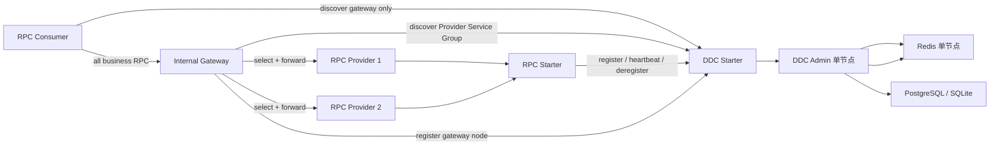
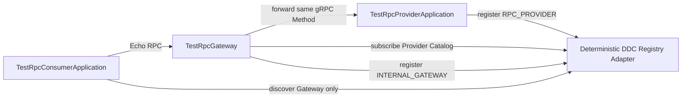

# 2026-07-24 DDC 单机闭环与轻量 gRPC + Protobuf RPC 框架设计 Spec

状态：已确认，进入实施计划

文档阶段：实施基线

涉及范围：

- 完善 `egon-cola-component-dynamic-config-center` 的单机运行闭环；
- 将 DDC 扩展为配置中心与轻量服务注册中心；
- 新增独立 `egon-cola-component-rpc` Component；
- RPC Component 顶层只包含 `starter` 与 `test` 聚合器，`test` 内允许拆分多个
  不发布的测试模块；
- Provider、Consumer 和内部网关统一使用 DDC 注册发现；
- DDC 仅支持单 Admin 和单 Redis，不实现多 Admin、Redis 集群或分布式协调代码。

## 1. 背景

现有 DDC 已具备配置 CRUD、版本、回滚、发布任务、Redis Pub/Sub、
SDK 字段刷新、实例接口和 ACK 模型，但当前实现仍存在运行闭环缺口：

1. Starter 没有在应用启动后自动执行实例注册、默认值上报、全量配置
   拉取、定时心跳和优雅下线。
2. SDK 刷新后发送的 ACK 没有填写 `instanceId`，而 Admin 按
   `changeId + instanceId` 识别 ACK。
3. `fail-fast`、心跳间隔、租约和确认超时等配置没有完整进入运行链。
4. Redis 实例记录没有租约 TTL，数据库中的在线实例也没有过期摘除。
5. 强一致发布只具备 ACK 数量判断，没有同步等待、超时扫描和恢复逻辑。
6. SDK 可以生成 HMAC 请求头，但 Admin 没有验签。
7. SDK 和 Manifest 版本存在硬编码，可能与 Maven 工程版本漂移。
8. DDC 目前只有配置实例概念，没有 Provider Service、内部 Gateway Node、
   服务分组、版本和动态发现模型。

本次在修复上述单机缺口的基础上，将 DDC 扩展为 RPC Provider 与内部网关
共同使用的服务注册中心，并在独立 RPC Component 中实现一套以 grpc-java
作为传输运行时、Protocol Buffers 作为 IDL 和序列化协议的轻量 RPC 框架。

## 2. 已确认需求

### 2.1 DDC

1. 当前只支持单 Admin 进程。
2. 当前只支持一个 Redis 单节点连接。
3. PostgreSQL 和 SQLite 继续作为支持的数据库。
4. 不实现 Raft、Leader 选举、节点成员管理、复制日志或其他分布式协调代码。
5. 不实现多 Admin 并发写协调、Redis Sentinel 或 Redis Cluster。
6. 修复 Starter 启动、刷新、ACK、心跳、租约、下线、发布超时和验签闭环。
7. DDC 新增服务注册与发现能力。
8. 服务注册事实是临时运行态数据，存储在 Redis，不新增数据库表。
9. 配置中心与注册中心共享 Admin 和基础设施，但使用隔离的 API、模型与
   Redis Key 空间。

### 2.2 RPC

1. RPC 框架基于 gRPC/grpc-java 和 Protocol Buffers：
   - gRPC 负责 HTTP/2 传输、流控、Deadline、Status 和调用模型；
   - Protobuf 负责唯一 IDL、消息代码生成和二进制序列化；
   - 框架不自行实现 TCP、HTTP/2 或私有序列化协议。
2. 主要角色为 Provider 与 Consumer。
3. Provider 启动后注册服务名称、分组、版本、实例地址、端口和扩展元数据。
4. Provider 通过心跳或租约维持状态，停止时主动注销。
5. Consumer 只发现内部网关，不发现、缓存或连接 Provider。
6. Consumer 的所有业务 RPC 请求都发送到内部网关。
7. 网关发现 Provider Service Group，把同一服务的多个实例视为一个逻辑集群。
8. Provider 实例选择、流量分发、故障摘除和请求转发由网关负责。
9. RPC 框架负责：
   - gRPC 服务暴露；
   - Protobuf Service Descriptor 装载与 Contract 校验；
   - Consumer 客户端代理创建；
   - DDC 注册发现接入；
   - 服务元数据传递；
   - 超时配置；
   - 异常转换；
   - 基础 Trace 信息透传；
   - 为网关提供 Provider Directory 和 gRPC 转发基础适配。
10. RPC 框架不负责：
    - Consumer 侧 Provider 负载均衡；
    - Consumer 直连 Provider；
    - 灰度路由；
    - 熔断和限流；
    - 重试策略；
    - Provider 权重或标签路由；
    - 完整 Gateway Engine。
11. RPC Component 顶层只包含 `starter` 和 `test` 聚合器；测试聚合器内部
    可以按 Contract、Provider、Consumer 和 E2E 职责拆分。

## 3. 实现约束

1. “单机”指一个 DDC Admin 和一个 Redis 实例，不限制业务 Provider 数量。
2. DDC 不内嵌 Redis；开发和生产均由部署环境提供 Redis 单节点。
3. RPC V1 只支持 unary RPC，不支持 client streaming、server streaming
   和 bidirectional streaming。
4. 每个业务 RPC 必须提供 `.proto`，并同时定义 `service`、request 和
   response；Proto 是线上的唯一协议事实。
5. 使用标准 `protoc` 与 `protoc-gen-grpc-java` 生成 Message 和 `*Grpc`
   Descriptor，不编写私有代码生成器。
6. RPC 请求和响应必须是标准 Protobuf `Message` 类型。
7. RPC 使用“生成的 gRPC Descriptor + 注解式 Java Contract + JDK Dynamic
   Proxy”；Java Contract 是框架易用层，必须在启动时与 Proto Descriptor
   完整校验，不能另行定义线上 Method。
8. 业务模块拥有自己的 `.proto`；RPC Component 不集中管理业务 Proto，
   `rpc-test-contract` 提供测试专用样例 Proto 和生成验证。
9. RPC Method 全名直接取自生成的 gRPC Descriptor，稳定为
   `/{protoPackage.serviceName}/{methodName}`。
10. Consumer 只接受唯一活跃内部网关实例；启动和运行期间发现零个或多个活跃
    Gateway 时快速失败，不保留过期 Channel，不实现客户端负载均衡。
11. 生产网关实现仍属于 Gateway 项目，不放入 RPC Component。
12. `rpc-starter` 提供网关接入契约和转发基础设施；`rpc-test-suite` 提供仅
    用于验证的最小测试网关。
13. 本 Spec 对现有 Gateway 总览 Spec 的影响仅限：
    - gRPC 成为后续 Gateway Engine 的新 `UpstreamAdapter`；
    - RPC Provider 与内部 Gateway Node 使用 DDC，而不是 Nacos；
    - Gateway 的其他 HTTP/Dubbo/Nacos 决策不在本次修改。

## 4. 范围边界

### 4.1 本次实现范围

- DDC Starter 生命周期闭环；
- DDC 配置快照首次加载；
- DDC ACK 身份和幂等闭环；
- DDC 实例租约、过期和下线；
- DDC 单 Admin 同步全目标确认发布、超时、重启 UNKNOWN 和幂等重试；
- DDC OpenAPI HMAC 验签；
- DDC 通用服务注册、心跳、注销、查询和订阅；
- 标准 Protobuf IDL、代码生成约定与 Descriptor 校验；
- RPC Provider 服务暴露与注册；
- RPC Consumer 代理创建与网关连接；
- RPC Gateway Node 注册；
- RPC 网关侧 Provider 目录订阅；
- unary gRPC 原始请求转发基础适配；
- RPC 元数据、Deadline、Trace 和异常模型；
- 单元、组件和进程内闭环测试；
- README、配置说明和示例。

### 4.2 明确不实现

- DDC Raft、JRaft、Leader/Follower；
- DDC 多 Admin；
- Redis Sentinel、Redis Cluster；
- PostgreSQL 高可用编排；
- Kubernetes、Helm 或多节点部署编排；
- Consumer 发现 Provider；
- Consumer 侧负载均衡或故障转移；
- RPC 灰度、权重、标签、限流、熔断和业务重试；
- RPC Streaming；
- RPC 服务 Mock 平台；
- RPC 控制台或管理 UI；
- TLS/mTLS 证书管理平台；
- 完整 Gateway Engine；
- 修改现有 Gateway HTTP/Dubbo 主路线；
- 通用跨语言 RPC IDL 管理平台。

## 5. 总体架构


```mermaid
flowchart LR
    Consumer["RPC Consumer"]
    Gateway["Internal Gateway"]
    Provider1["RPC Provider 1"]
    Provider2["RPC Provider 2"]
    RpcStarter["RPC Starter"]
    DdcStarter["DDC Starter"]
    DdcAdmin["DDC Admin 单节点"]
    Redis["Redis 单节点"]
    Database["PostgreSQL / SQLite"]

    Consumer -->|"discover gateway only"| DdcStarter
    DdcStarter --> DdcAdmin
    DdcAdmin --> Redis

    Consumer -->|"all business RPC"| Gateway
    Gateway -->|"discover Provider Service Group"| DdcStarter
    Gateway -->|"select + forward"| Provider1
    Gateway -->|"select + forward"| Provider2

    Provider1 --> RpcStarter
    Provider2 --> RpcStarter
    RpcStarter -->|"register / heartbeat / deregister"| DdcStarter

    Gateway -->|"register gateway node"| DdcStarter

    DdcAdmin --> Database
    DdcAdmin --> Redis
```

核心边界：

1. DDC 是配置与注册事实的管理入口。
2. Redis 是配置通知和服务租约的运行基础设施。
3. Consumer 永远只持有 Gateway Channel。
4. Gateway 才持有 Provider Directory 和 Provider Channel。
5. RPC Starter 提供协议与注册发现适配，不决定网关流量策略。

## 6. 模块结构

### 6.1 DDC 保持现有结构

```text
egon-cola-component-dynamic-config-center/
├── egon-cola-component-dynamic-config-center-starter
├── egon-cola-component-dynamic-config-center-admin
└── egon-cola-component-dynamic-config-center-test
```

职责变化：

- `starter`：
  - 完善配置中心 SDK 生命周期；
  - 新增通用服务注册发现客户端和订阅模型；
  - 不依赖 RPC Component。
- `admin`：
  - 完善配置发布和实例租约；
  - 新增服务注册发现 OpenAPI 与 Redis Repository；
  - 保持独立可执行应用。
- `test`：
  - 验证默认值、首次拉取、消息刷新、ACK、租约和注册发现。

### 6.2 新增 RPC Component

```text
egon-cola-component-rpc/
├── pom.xml
├── README.md
├── README.zh-CN.md
├── egon-cola-component-rpc-starter/
│   └── pom.xml
└── egon-cola-component-rpc-test/
    ├── pom.xml
    ├── egon-cola-component-rpc-test-contract/
    │   └── pom.xml
    ├── egon-cola-component-rpc-test-provider/
    │   └── pom.xml
    ├── egon-cola-component-rpc-test-consumer/
    │   └── pom.xml
    └── egon-cola-component-rpc-test-suite/
        └── pom.xml
```

约束：

1. `egon-cola-components/pom.xml` 聚合 RPC 根模块。
2. RPC 根 POM 只聚合 `starter` 和 `test` 聚合器。
3. BOM 只导出 `egon-cola-component-rpc-starter`。
4. `rpc-starter` 可以依赖 DDC Starter，不能依赖 DDC Admin 或 DDC Test。
5. `rpc-test` 及其子模块全部是测试资产，不进入 BOM，不作为生产组件发布。
6. 不拆 `rpc-api`、`rpc-core`、`rpc-registry` 等额外 Maven 模块；在 Starter
   内通过包边界保持职责清晰。

测试子模块职责：

- `rpc-test-contract`
  - 持有测试专用 `.proto`；
  - 生成 Message 与 `*Grpc` Descriptor；
  - 作为 Provider 和 Consumer 唯一共享的测试协议依赖。
- `rpc-test-provider`
  - 依赖 Test Contract 和 RPC Starter；
  - 提供独立 `TestRpcProviderApplication`；
  - 暴露 Echo Service，并记录收到的 Invocation ID、Trace 和调用次数。
- `rpc-test-consumer`
  - 依赖 Test Contract 和 RPC Starter；
  - 提供独立 `TestRpcConsumerApplication`；
  - 只通过 `@EgonRpcReference` 获得代理，不允许配置 Provider 地址。
- `rpc-test-suite`
  - 依赖 Provider/Consumer 测试应用；
  - 提供 `TestRpcGateway`、确定性测试注册中心适配和 JUnit E2E；
  - 负责启动和关闭多个隔离 Spring Context；
  - 断言 Consumer→Gateway→Provider 调用成功。

测试应用放在测试子模块的 `src/main`，便于 Suite 作为普通依赖复用；它们只能
被 `rpc-test-suite` 使用，禁止被业务模块或 BOM 引用。

Starter 包结构：

```text
top.egon.cola.component.rpc
├── annotation
├── config
├── contract
├── provider
├── consumer
├── gateway
├── registry
├── protocol
├── trace
├── exception
└── lifecycle
```

## 7. DDC 单机闭环完善

### 7.1 Starter 生命周期

新增统一 `DdcRuntimeCoordinator`，避免把启动流程散落在多个 Bean。

应用启动成功后的顺序：

1. 校验 `appCode + env + namespace`。
2. 生成并固定本进程 `instanceId`。
3. Redis Topic Listener 已进入可接收状态。
4. 向 Admin 注册实例并取得新的 `leaseId`。
5. 收集所有 `@DdcValue` Binding，批量上报默认值。
6. 从 Admin 拉取完整配置快照。
7. 只应用版本高于本地版本的配置。
8. 标记 DDC SDK 为 `READY`。
9. 按配置周期发送心跳。

启动并发规则：

- Redis Listener 先订阅、全量配置后拉取。
- 如果订阅后先收到新版本，再收到较旧全量快照，较旧快照不得覆盖新版本。
- 初始快照应用不发送发布 ACK。
- Redis 发布消息刷新才发送 ACK。

启动失败策略：

- `fail-fast=true`：
  - 注册、默认值上报或首次拉取失败时阻止应用完成启动。
- `fail-fast=false`：
  - 保留注解默认值；
  - 应用继续启动；
  - 后续心跳周期同时承担重新注册和首次同步恢复。

优雅停止顺序：

1. SDK 状态改为 `STOPPING`。
2. 停止发送新心跳。
3. 使用当前 `instanceId + leaseId` 尽力调用 Admin 下线接口。
4. 移除本地 Listener。
5. 关闭 DDC 专用 Redisson Client。

### 7.2 实例身份

引入独立、不可变的 `DdcInstanceIdentity`：

```text
instanceId
appCode
env
namespace
host
port
pid
sdkVersion
```

注册成功后创建当前租约会话 `DdcLeaseSession`：

```text
instanceId
leaseId
role
leaseSeconds
heartbeatIntervalSeconds
registeredAt
leaseExpireAt
```

规则：

- `instanceId` 在进程生命周期内保持不变。
- `leaseId` 由 Admin 在每次注册时重新生成；重新注册会使旧租约立即失效。
- 心跳、注销和 ACK 必须使用当前 `instanceId + leaseId`。
- 默认值上报和首次快照拉取在当前租约建立后执行。
- 当前 `DdcLeaseSession` 使用原子引用替换，业务线程不得缓存旧 `leaseId`。
- SDK 版本从构建 Manifest 或 Maven 过滤属性读取，不再在 Java 类中硬编码。
- 未取得有效 `instanceId + leaseId` 时禁止发送心跳、注销和 ACK。

### 7.3 配置快照与运行时刷新

拆分两个明确入口：

- `applySnapshot(DdcConfigValue)`：
  - 用于首次拉取或恢复同步；
  - 版本必须单调递增；
  - 不发送 ACK。
- `refresh(DdcPublishMessage)`：
  - 用于发布消息；
  - 校验 Scope、Checksum 和版本；
  - 应用后根据结果发送 ACK。

刷新规则：

1. `targetVersion <= localVersion` 返回 `IGNORED`。
2. 转换全部成功后才更新字段和本地版本。
3. 单个配置 Key 绑定多个字段时，转换阶段先完成，再执行字段写入。
4. 写入中发生异常时不推进本地版本。
5. Redis 发布消息匹配当前目标时必须发送 ACK，V1 不提供关闭 ACK 的配置。
6. ACK 必须包含当前 `instanceId + leaseId`、目标版本和内容摘要。
7. ACK 调用失败不能把已成功的字段刷新重新标记成业务转换失败。

### 7.4 实例租约

配置客户端、RPC Provider 和内部 Gateway 统一采用“注册换取租约 + 心跳续租 +
主动注销 + 超时过期”协议。

租约字段：

```text
instanceId
leaseId
leaseSeconds
heartbeatIntervalSeconds
registeredAt
lastHeartbeatAt
leaseExpireAt
status
```

`role` 固定为：

```text
CONFIG_CLIENT
RPC_PROVIDER
INTERNAL_GATEWAY
```

三类角色的当前租约统一存储为：

```text
ddc:lease:instance:{env}:{namespace}:{role}:{instanceId}
```

约束：

- 配置客户端默认租约 30 秒、默认心跳 10 秒。
- RPC Provider 默认租约 30 秒、默认心跳 10 秒。
- 内部 Gateway 默认租约 15 秒、默认心跳 5 秒。
- 三类角色使用同一协议和校验逻辑，但分别配置 TTL 和心跳参数。
- 允许租约范围：5～300 秒。
- 心跳间隔必须小于租约。
- Register 请求携带 `instanceId` 和完整实例信息，不接受调用方指定 `leaseId`。
- Admin 每次 Register 都生成新的 `leaseId` 并原子替换该 `instanceId` 的旧租约。
- Heartbeat 和 Deregister 必须通过 Lua 原子比较
  `stored.instanceId + stored.leaseId`；不匹配时不得延长或删除当前租约。
- Redis 中租约不存在时 Heartbeat 返回 `DDC_LEASE_NOT_FOUND`，客户端重新
  Register 并取得新 `leaseId`，不得在 Heartbeat 中隐式重建。
- 旧租约的迟到 Heartbeat 返回 `DDC_LEASE_MISMATCH`。
- 旧租约的迟到 Deregister 幂等返回“未删除”，不得删除同一 `instanceId`
  后来建立的新租约。
- Redis 是当前租约事实；配置客户端的 `ddc_instance` 数据库记录只是管理投影。
- 发布目标从 Redis 当前有效租约快照生成，不从数据库 `ONLINE` 状态推断。
- Redis Instance Bucket 使用真实 TTL。
- Redis Service Index 使用过期时间作为 ZSET Score。
- 每次心跳同时延长 Bucket TTL 和 Index Score。
- 主动下线立即删除 Bucket 和 Index Member。

Admin 运行一个单机租约清理任务：

1. 扫描已经超过 `leaseExpireAt` 的实例。
2. 从服务索引移除。
3. 仅当数据库投影中的 `instanceId + leaseId` 仍匹配过期租约时，将配置 SDK
   实例投影更新为 `OFFLINE`。
4. 对服务注册实例发布 `EXPIRED` 事件。
5. 清理操作必须幂等。

所有租约脚本只面向单 Redis。Admin 清理任务只面向单 Admin，不提供分布式锁、
选主、Redis Cluster Slot 兼容或跨节点协调代码。

### 7.5 发布一致性

V1 只提供单 Admin 范围内的同步全目标确认发布，模式固定为
`SYNC_ALL_ACK`。新发布请求不接受 `ASYNC`、`STRONG_QUORUM_ACK` 或其他完成策略。

#### 7.5.1 资源串行化

配置资源标识 `DdcConfigResourceKey`：

```text
appCode
env
namespace
configKey
```

规则：

1. `PublishResourceLockRegistry` 按 `DdcConfigResourceKey` 原子维护
   `resourceKey -> ownerChangeId`。
2. 同一资源同时只允许一个 `PENDING/PUBLISHING` 发布流程。
3. 占位使用 `putIfAbsent` 语义，不使用由管理请求线程长期持有的
   `ReentrantLock`，避免等待 ACK 时阻塞 ACK 线程。
4. 新请求无法取得资源占位时立即返回 `DDC_PUBLISH_IN_PROGRESS` 和当前
   `changeId`，不阻塞等待另一个管理请求。
5. 不同配置资源可以并行发布。
6. 发布进入 `SUCCESS/FAILED/TIMEOUT/UNKNOWN` 后，只有匹配
   `ownerChangeId` 的流程可以释放占位。
7. ACK、超时和失败使用数据库事务条件更新任务状态，不等待资源占位。
8. 不实现分布式锁；该正确性边界明确依赖单 Admin。

#### 7.5.2 发布准备

发布请求必须携带调用方预先生成的 UUIDv7 `changeId`，用于请求重试和结果查询。

取得资源锁后，在一个数据库事务中：

1. 校验期望版本。
2. 固化 `DdcConfigResourceKey`、目标版本和配置内容 SHA-256 摘要。
3. 查询当前租约有效的配置客户端。
4. 将每个发布目标固化为 `instanceId + leaseId`。
5. 为每个目标预建唯一 ACK 记录，写入目标版本和内容摘要。
6. 创建状态为 `PENDING` 的发布任务。
7. 提交配置版本、任务、目标集合和操作日志。

没有有效目标时发布立即进入 `FAILED`，错误为 `DDC_NO_LIVE_INSTANCE`。

数据库事务提交后：

1. `PublishCompletionWaiterRegistry` 按 `changeId` 注册 Waiter。
2. 写入 Redis 当前配置和版本。
3. 发布包含 `changeId + targetVersion + contentChecksum` 的消息。
4. 派发成功后任务进入 `PUBLISHING`。
5. 当前管理请求在数据库事务外等待全部目标 ACK 或超时。

Redis 写入或消息发布失败时任务进入 `FAILED` 并记录失败阶段。已经提交的配置
版本不做伪回滚；后续使用同一 `changeId` 执行显式幂等重试。

#### 7.5.3 ACK 严格匹配

ACK 请求必须包含：

```text
changeId
instanceId
leaseId
targetVersion
contentChecksum
currentVersion
status
ackTime
```

处理规则：

1. ACK 必须同时匹配任务 `changeId`、目标版本、内容摘要和
   `instanceId + leaseId` 目标身份。
2. 不得根据 ACK 请求动态补建目标。
3. 旧 `leaseId`、错误版本或错误摘要返回稳定错误，不计入完成条件。
4. 同一 `changeId + instanceId + leaseId` 重复 ACK 幂等，不增加目标数。
5. 客户端已经应用相同版本和摘要时返回 `SUCCESS`，不得用 `IGNORED` 代替成功。
6. 任一固化目标返回 `FAILED` 时，任务立即进入 `FAILED`。
7. 只有全部固化目标返回 `SUCCESS` 时，任务进入 `SUCCESS`。
8. 迟到 ACK 不改写 `SUCCESS/FAILED/TIMEOUT` 终态。

ACK 保存后唤醒对应 `changeId` Waiter。Waiter 每次被唤醒都重新读取持久化任务
和 ACK 状态，不能只依赖一次进程内 Signal。

#### 7.5.4 超时与 Admin 重启

`PublishTimeoutScanner` 周期扫描 `PENDING/PUBLISHING`：

- 超过派发超时的 `PENDING` 任务进入 `FAILED`。
- 超过确认超时的未完成目标记为 `TIMEOUT`，任务进入 `TIMEOUT`。
- Scanner、ACK 和请求线程复用同一个事务状态转换服务，通过条件更新保证终态
  只写一次；它们不等待资源占位。

Admin 启动时：

1. 在恢复事务中将所有遗留 `PENDING/PUBLISHING` 任务统一更新为 `UNKNOWN`。
2. `UNKNOWN` 表示 Admin 无法证明发布最终结果，不等同于成功或失败。
3. 不根据部分 ACK 自动推断成功，不自动更换目标集合，不自动继续等待。
4. 释放对应资源占用，使显式重试可以重新取得资源锁。

#### 7.5.5 changeId 幂等重试

相同 `changeId` 的重复请求必须匹配原任务的配置资源、目标版本、内容摘要和超时
参数；任一字段不一致返回 `DDC_CHANGE_ID_CONFLICT`。

幂等行为：

- 原任务为 `SUCCESS`：直接返回原结果，不再次派发。
- 原任务为 `PENDING/PUBLISHING`：返回当前状态并复用现有 Waiter，不创建任务。
- 原任务为 `FAILED/TIMEOUT/UNKNOWN`：只有显式 Retry API 可以增加
  `attemptCount` 并重新派发。
- Retry 固定复用原 `instanceId + leaseId` 目标集合，不重新快照在线实例。
- 原目标租约已经失效时 Retry 进入 `FAILED`，错误为
  `DDC_TARGET_LEASE_EXPIRED`。
- 原目标仍存活且已经应用相同版本和摘要时，客户端重新返回 `SUCCESS` ACK。
- 需要面向当前在线实例重新发布时必须使用新的 `changeId`。

Waiter 始终按 `changeId` 管理；资源串行锁始终按 `DdcConfigResourceKey` 管理，
两者不得共用 Key 或生命周期。

### 7.6 OpenAPI HMAC 验签

验签范围：

```text
/api/v1/ddc/openapi/**
```

签名关闭时保持当前开发体验；签名开启时，Client 和 Admin 使用同一 Canonical
Request：

```text
HTTP_METHOD
PATH
CANONICAL_QUERY
TIMESTAMP
NONCE
SHA256(BODY)
```

请求头：

```text
X-DDC-Access-Key
X-DDC-Timestamp
X-DDC-Nonce
X-DDC-Content-SHA256
X-DDC-Signature
```

规则：

1. Admin 根据配置的 Access Key 查找 Secret。
2. Signature 使用 HMAC-SHA256。
3. 使用常量时间比较。
4. Timestamp 默认只允许正负 5 分钟偏差。
5. 单 Admin 使用带过期清理的内存 Nonce Cache 防止时间窗口内重放。
6. Body 为空时对空字节计算 SHA-256。
7. 验签失败返回稳定错误，不进入 Controller。
8. 管理 API 账号、RBAC 和权限仍不属于本次范围。

### 7.7 DDC 运行状态

Starter 状态：

```text
DISABLED
STARTING
READY
DEGRADED
STOPPING
STOPPED
```

状态原则：

- `fail-fast=false` 且 Admin 暂时不可用时进入 `DEGRADED`。
- 重新注册并完成快照同步后恢复 `READY`。
- 状态中不得暴露 Secret、完整配置值或敏感元数据。

## 8. DDC 服务注册中心

### 8.1 通用模型

DDC Starter 定义通用模型，不能引用 RPC 包。

#### DdcServiceKey

```text
env
namespace
serviceKind
serviceName
group
version
protocol
```

`serviceKind` 首期支持：

```text
RPC_PROVIDER
INTERNAL_GATEWAY
```

约束：

- `serviceName`、`group`、`version` 均不能为空。
- 默认 `group=default`。
- 默认 `version=1.0.0`。
- RPC 的 `protocol=grpc`。
- `env + namespace` 继续承担环境隔离。

#### DdcServiceInstance

```text
instanceId
leaseId
serviceKey
host
port
secure
metadata
leaseSeconds
heartbeatIntervalSeconds
registeredAt
lastHeartbeatAt
leaseExpireAt
status
revision
```

元数据规则：

- 最多 32 项。
- Key 长度不超过 64。
- Value 长度不超过 512。
- `ddc.*`、`egon.internal.*`、`egon.rpc.*` 为框架保留前缀，业务扩展元数据
  不能覆盖。
- 不允许保存密码、Token、证书私钥或完整异常堆栈。

#### DdcServiceSnapshot

订阅者接收完整不可变快照，而不是只接收单条增量：

```text
serviceKey
revision
instances
observedAt
```

完整快照可以避免 Redis 消息丢失后本地目录永久错误。

#### DdcServiceQuery

服务目录查询用于“发现有哪些 Service Key”，而不是只查询一个已知服务：

```text
env
namespace
serviceKind
protocol
serviceName?
group?
version?
```

规则：

- `env + namespace + serviceKind + protocol` 必填。
- 其他字段为空时表示该维度不过滤。
- Consumer 使用完整字段查询固定 Gateway Service。
- Gateway 使用 `serviceKind=RPC_PROVIDER + protocol=grpc` 查询 Provider
  Service Catalog，再分别维护每个 Service Key 的 Instance Snapshot。
- 查询结果是稳定排序、不可变的 `DdcServiceKey` 集合。

### 8.2 Redis Key

```text
ddc:lease:instance:{env}:{namespace}:{kind}:{instanceId}
ddc:registry:service:{env}:{namespace}:{kind}:{serviceKeyDigest}
ddc:registry:revision:{env}:{namespace}:{kind}:{serviceKeyDigest}
ddc:registry:catalog:{env}:{namespace}:{kind}:{protocol}
ddc:registry:catalog-revision:{env}:{namespace}:{kind}:{protocol}
ddc:registry:topic:{env}:{namespace}:{kind}:{protocol}
```

存储结构：

- Instance：JSON Bucket + TTL。
- Service：ZSET，Member 为 `instanceId`，Score 为 `leaseExpireAt`。
- Service Revision：递增 Long。
- Catalog：SET，Member 为 Canonical Service Key。
- Catalog Revision：Service Key 新增或删除时递增。
- Topic：发布包含 Service Key、Service Revision 和 Catalog Revision 的失效通知。

`serviceKeyDigest` 为 Canonical Service Key 的 SHA-256，避免业务名称中的分隔符
污染 Redis Key；实例 JSON 和 Catalog Member 保留完整 Service Key 用于回读。

每次注册、实例信息变更、注销和过期时递增 Service Revision；Service 第一次
出现或最后一个实例消失时同时更新 Catalog 与 Catalog Revision。注册、心跳、
注销和过期清理使用 Lua 脚本原子维护 Bucket、Service Index、Catalog 和
Revision，避免部分写入留下幽灵实例或空目录。

心跳只延长租约；地址或元数据没有变化时不发送高频目录事件。

### 8.3 注册与心跳 API

SDK OpenAPI：

```text
POST   /api/v1/ddc/openapi/registry/instances/register
POST   /api/v1/ddc/openapi/registry/instances/heartbeat
POST   /api/v1/ddc/openapi/registry/instances/deregister
GET    /api/v1/ddc/openapi/registry/instances
GET    /api/v1/ddc/openapi/registry/services
```

行为：

- Register：
  - 校验服务 Key、地址、端口、租约和元数据；
  - 每次调用都由 Admin 生成新的 `leaseId`；
  - 原子替换相同 `instanceId + serviceKey` 的旧租约；
  - 返回完整 `DdcLeaseSession`；
  - 旧租约立即失效并递增 Service Revision。
- Heartbeat：
  - 必须携带 `instanceId + leaseId`；
  - Lua 原子校验成功后才延长 Bucket TTL 和 Index Score；
  - Redis 重启或租约过期导致实例丢失时返回 `DDC_LEASE_NOT_FOUND`；
  - 不在心跳中自动重建注册；
  - Service Key 不允许在心跳中漂移。
- Deregister：
  - 必须携带 `instanceId + leaseId`；
  - 只有 Lua 原子校验匹配时才删除 Instance 和 Service Index Member；
  - 重复注销或旧租约注销幂等返回“未删除”，不影响当前租约；
  - 发布新 Revision。
- List：
  - 返回租约仍有效的实例；
  - 查询时顺便清理已过期成员；
  - 返回当前 `leaseId`；
  - 实例按 `instanceId + leaseId` 稳定排序。
- Services：
  - 按 `DdcServiceQuery` 返回 Service Catalog；
  - 不使用 Redis `KEYS` 或全量 `SCAN` 发现服务；
  - Catalog 中不存在有效实例的 Service Key 会被幂等移除。

所有 Registry OpenAPI 进入同一 HMAC 验签链。

### 8.4 订阅

DDC Starter 通过 `DdcServiceRegistryClient` 接口暴露：

```text
register(instance) -> leaseSession
heartbeat(instanceId, leaseId)
deregister(instanceId, leaseId)
getInstances(serviceKey)
subscribe(serviceKey, snapshotListener)
getServiceKeys(serviceQuery)
subscribeServices(serviceQuery, catalogListener)
```

生产自动装配提供 `DdcOpenApiServiceRegistryClient`：写操作和全量查询访问 Admin
OpenAPI，失效通知复用 DDC Redis Topic。测试 Adapter 只能由测试配置显式注入，
不得进入 Starter 自动装配候选。

Instance Snapshot 订阅流程：

1. 先订阅对应 `serviceKind` Topic。
2. 再通过 Admin 拉取完整快照。
3. 收到事件后按 Service Key 去抖并重新拉取快照。
4. 即使没有事件，也按配置周期执行版本对账。
5. 只有 Revision 或快照内容变化时通知上层。
6. Listener 异常不能中断 Redis 消息线程。
7. 本地始终发布不可变实例列表。

Service Catalog 订阅流程：

1. 先订阅 `serviceKind + protocol` Topic。
2. 再通过 Admin 拉取符合 Query 的完整 Service Key 集合。
3. Catalog Revision 变化时重新拉取完整 Catalog。
4. 对新增 Service Key 建立 Instance Snapshot 订阅。
5. 对已删除 Service Key 关闭对应订阅并发布空快照。
6. 周期对账同时校正 Catalog 与各 Service Snapshot。

Consumer 使用固定 Gateway 的 Instance Snapshot 订阅，不订阅 Provider Catalog；
Gateway 的 `RpcProviderDirectory` 才使用 Provider Catalog 订阅。

短时 Admin 或 Redis 异常：

- 已有实例在租约仍有效时保留。
- 超过租约后必须移除，不无限保留失效实例。
- 恢复后通过完整快照自动收敛。

### 8.5 注册中心状态不写数据库

服务注册实例是临时运行状态，本次不新增 `ddc_service_instance` 数据库表：

- Provider 和 Gateway 的实例、租约、Catalog 与 Snapshot 全部只存 Redis。
- 发布目标身份所需的 `leaseId` 和内容摘要只扩展现有配置实例、发布任务和 ACK
  表，不创建服务注册表。
- Redis 丢失后心跳收到 `DDC_LEASE_NOT_FOUND`，客户端重新注册并取得新
  `leaseId` 后恢复。
- Admin 管理查询直接读取 Redis 当前事实。
- 历史审计、容量报表和实例事件持久化留到后续需求。

## 9. RPC Contract 与协议

### 9.1 Protobuf IDL 与 Contract 声明

每个业务服务先定义标准 Proto：

```proto
syntax = "proto3";

package order.v1;

option java_multiple_files = true;
option java_package = "top.egon.order.rpc.proto";

service OrderQueryService {
  rpc GetOrder(GetOrderRequest) returns (GetOrderResponse);
}

message GetOrderRequest {
  string order_id = 1;
}

message GetOrderResponse {
  string order_id = 1;
  string status = 2;
}
```

业务 Maven 模块使用标准 `protoc` 和 `protoc-gen-grpc-java` 生成：

```text
GetOrderRequest
GetOrderResponse
OrderQueryServiceGrpc
```

框架易用层使用 Java Interface，但必须显式绑定生成的 gRPC Descriptor：

```java
@EgonRpcService(
        grpcClass = OrderQueryServiceGrpc.class,
        group = "default",
        version = "1.0.0"
)
public interface OrderQueryRpc {

    @EgonRpcMethod(name = "GetOrder")
    GetOrderResponse getOrder(GetOrderRequest request);
}
```

方法约束：

1. Interface 必须有 `@EgonRpcService`。
2. `grpcClass` 必须是由 `protoc-gen-grpc-java` 生成并能返回
   `io.grpc.ServiceDescriptor` 的 `*Grpc` 类。
3. RPC 方法必须有 `@EgonRpcMethod`，其名称必须命中 Proto Service 中的
   unary Method。
4. V1 每个方法只允许一个请求参数。
5. 请求和返回值必须实现 Protobuf `Message`。
6. Java 方法请求/响应 Descriptor 必须与 Proto Method 的 input/output
   Descriptor 一致。
7. 不允许方法重载。
8. 不允许 `null` 请求或响应。
9. 不允许 Java Primitive、Map、任意 POJO 或 Java Serialization。
10. Service 名和 Method 全名只从生成 Descriptor 读取：

```text
/order.v1.OrderQueryService/GetOrder
```

`GeneratedGrpcDescriptorResolver` 在启动时调用生成类的
`getServiceDescriptor()`，并通过 grpc-protobuf 提供的 Proto Method Schema
Descriptor 校验 Java Interface。框架不得根据注解字符串自行构造另一份
`MethodDescriptor`，从而避免 Java Contract 与 Proto 漂移。

Proto 演进规则：

- `package + service + method` 一经发布不得直接重命名。
- 已发布 Field Number 不得复用。
- 删除字段时使用 `reserved` 保留原 Field Number 和名称。
- 不改变已发布字段的 Wire Type。
- Enum 必须定义 `*_UNSPECIFIED = 0`，Consumer 必须能处理未知枚举值。
- 破坏性变更通过新的 Proto Package 或 RPC `version` 发布。
- V1 不建设集中式 Proto Schema Registry；兼容检查由代码评审、生成编译和
  RPC Test 承担。

### 9.2 Provider 声明

```java
@EgonRpcProvider
public class OrderQueryRpcProvider implements OrderQueryRpc {

    @Override
    public GetOrderResponse getOrder(GetOrderRequest request) {
        // delegate to Application service
    }
}
```

Provider 扫描规则：

- Bean 必须实现一个或多个 `@EgonRpcService` Interface。
- 一个 `serviceKey + methodName` 只能有一个实现。
- 启动时发现冲突、非法签名、生成 Descriptor 缺失或 Proto input/output
  Descriptor 不匹配时失败。
- Provider 实现可以依赖业务 Application/Facade，但 RPC Starter 不理解业务模型。

### 9.3 Consumer 声明

```java
@EgonRpcReference(timeoutMs = 3000)
private OrderQueryRpc orderQueryRpc;
```

Consumer 代理：

- 使用 JDK Dynamic Proxy。
- 从生成的 `ServiceDescriptor` 取得原生 unary `MethodDescriptor`。
- 请求序列化和响应解析完全使用该生成 Descriptor 的 Protobuf Marshaller。
- 每次调用只通过 Gateway Channel。
- 将 Descriptor Service 名称、分组和版本放入框架生成的 RPC Metadata。
- 将 gRPC Status 转换为稳定 `EgonRpcException`。

不支持没有 Interface 的字符串泛化 Consumer API，避免业务调用失去编译期约束。

### 9.4 Wire Metadata

保留 Metadata：

```text
x-egon-rpc-service
x-egon-rpc-group
x-egon-rpc-version
x-egon-rpc-invocation-id
x-egon-rpc-source-app
x-egon-rpc-source-instance
x-egon-trace-id
traceparent
tracestate
```

规则：

- Service 来自生成 Descriptor，Group、Version 来自已校验 Contract；业务代理
  API 不允许逐次动态修改。原始网络调用仍可能伪造 Metadata，Gateway 必须按
  12.3 节重新校验。
- Invocation ID 每次调用生成。
- Trace 优先复用当前线程或框架上下文。
- Gateway 只能透传白名单 Metadata。
- Gateway 转发前移除调用方伪造的内部目标地址、Provider Instance ID 等字段。
- 不透传 Access Key、DDC Secret 或管理认证信息。

## 10. RPC Provider 运行链

### 10.1 启动

1. Spring 完成 Bean 创建。
2. 扫描和校验 RPC Contract/Provider。
3. 为方法构建 gRPC `ServerServiceDefinition`。
4. 启动 grpc-netty-shaded Server。
5. 获取实际监听地址和端口。
6. 为每个 Service 构建 `DdcServiceInstance`。
7. 注册为 `RPC_PROVIDER`。
8. 保存每个 Service 注册返回的当前 `leaseId`。
9. 全部注册成功后 Provider 状态变为 `READY`。
10. 启动心跳。

一个进程可以暴露多个 RPC Service：

- 多个 Service 共用同一个 gRPC 端口和进程 `instanceId`。
- 每个 Service 在 DDC 中有独立 Service Key。
- `serviceName` 必须取自生成的 Protobuf Service Descriptor 全限定名。
- 框架写入 `egon.rpc.transport=grpc`、`egon.rpc.serialization=protobuf` 和
  `egon.rpc.runtime-version`，业务元数据不能覆盖这些保留项。
- Registry Instance ID 使用
  `{processInstanceId}:{serviceName}:{group}:{version}`，避免冲突。

### 10.2 对外注册地址

绑定地址和注册地址分离：

```text
bindAddress
bindPort
advertisedHost
advertisedPort
```

规则：

- Server 可以绑定 `0.0.0.0`。
- 注册中心禁止注册 `0.0.0.0`。
- `bindPort=0` 允许测试使用随机端口。
- 生产未配置 `advertisedHost` 时，从 DDC Instance Identity 解析。
- 无法得到可路由地址时启动失败。

### 10.3 心跳和停止

Provider 心跳复用 DDC Service Registry 租约。

- 每个 Service 使用自己的 `instanceId + leaseId`。
- 心跳收到 `DDC_LEASE_NOT_FOUND` 或 `DDC_LEASE_MISMATCH` 时暂停该 Service
  接流，重新注册并取得新 `leaseId` 后恢复。
- 停止时只使用当前租约注销，旧租约注销不得影响新租约。

优雅停止：

1. 状态改为 `DRAINING`。
2. 从 DDC 注销全部 RPC Provider Service。
3. 停止接受新 RPC。
4. 在配置的 Drain Timeout 内等待在途请求。
5. 关闭 gRPC Server 和执行器。

Provider 默认 `registration.fail-fast=true`：

- 注册中心不可用时，Provider 不应在“未注册但可接流”的状态下继续启动。
- 可以显式关闭注册用于纯本地测试，但该模式不得用于 Consumer→Gateway 闭环测试。

## 11. RPC Consumer 运行链

### 11.1 Gateway 发现

Consumer 只订阅：

```text
serviceKind=INTERNAL_GATEWAY
serviceName=egon-internal-rpc-gateway
group={configuredGatewayGroup}
version={configuredGatewayVersion}
protocol=grpc
```

RPC Starter 的 Consumer 包不暴露查询 `RPC_PROVIDER` 的 API。

架构测试必须证明：

- Consumer 代码不引用 Provider Registry Adapter。
- Consumer Channel Target 只能来自 Gateway Snapshot。
- Consumer 不接受 Provider Host/Port 配置。
- Consumer 不创建 Provider Channel。

### 11.2 单 Gateway 规则

Consumer 启动时在 `gateway-discovery-timeout-ms` 内等待 Gateway Snapshot：

- 恰好一个有效 `instanceId + leaseId`：创建 Channel，Consumer 进入 `READY`。
- 零个有效实例：启动失败，错误为 `RPC_GATEWAY_UNAVAILABLE`。
- 多个有效实例：启动失败，错误为 `RPC_GATEWAY_AMBIGUOUS`。

运行期间 Snapshot 变化：

- 恰好一个有效实例：保持或切换到该 Gateway。
- 零个有效实例：立即进入 `UNAVAILABLE`，新调用快速失败。
- 多个有效实例：立即进入 `AMBIGUOUS`，新调用快速失败。
- `UNAVAILABLE/AMBIGUOUS` 状态不选择实例、不发起业务调用，并关闭不再唯一有效
  的旧 Channel。

Consumer 不保留过期 Gateway Channel，不提供 Gateway Selector，不实现轮询、
随机或 Failover。

### 11.3 Channel 切换

Gateway 实例变化时：

1. 创建新 Channel。
2. 新 Channel 达到可用条件后原子替换。
3. 新请求使用新 Channel。
4. 旧 Channel 在 Drain Timeout 后关闭。
5. 如果新 Channel 建立失败，旧实例租约仍有效时保留旧 Channel。
6. 旧实例租约过期后不得无限使用旧 Channel。
7. 所有 Channel 构建时显式调用 `disableRetry()`。

### 11.4 Deadline、Cancellation 与 Status

- 全局默认 Deadline。
- `@EgonRpcReference` 可配置接口默认 Deadline。
- 调用方显式上下文 Deadline 更短时使用更短值。
- Consumer 和 Gateway Channel 均显式关闭 gRPC Retry。
- 框架不发起透明重试或业务重试。
- Gateway 转发使用剩余 Deadline，不能重新开始完整超时时间。
- Consumer 调用取消时，Gateway 取消对应 Provider `ClientCall`。
- Gateway 收到 Provider Cancellation 或 Deadline Status 后原样结束上游调用。
- Consumer 将最终 gRPC Status 转换为稳定 `EgonRpcException`。

## 12. 内部网关接入契约

### 12.1 生产边界

RPC Component 不实现完整 Gateway Engine，但 Starter 提供以下可复用边界：

```text
RpcGatewayNodeRegistrar
RpcProviderDirectory
RpcInvocationMetadata
RpcProviderEndpoint
RpcProviderChannelFactory
RpcGatewayHandlerRegistry
RpcUnaryForwarder
```

职责：

- `RpcGatewayNodeRegistrar`
  - 将 Gateway 注册为 `INTERNAL_GATEWAY`；
  - 保存注册返回的 `leaseId`；
  - 使用 `instanceId + leaseId` 维持租约并在停止时注销。
- `RpcProviderDirectory`
  - 先订阅 DDC Provider Service Catalog，再维护每个 Service Key 的 Instance
    Snapshot；
  - 输出不可变 Provider Cluster Snapshot；
  - 不选择实例。
- `RpcProviderChannelFactory`
  - 为网关已经选中的 Provider Endpoint 创建/复用 Channel；
  - 所有 Provider Channel 显式调用 `disableRetry()`；
  - 不执行负载均衡。
- `RpcGatewayHandlerRegistry`
  - 作为 grpc-java `ServerBuilder.fallbackHandlerRegistry(...)` 的动态后备
    `HandlerRegistry`；
  - 根据完整 gRPC Method 名按需生成 unary `ServerMethodDefinition`；
  - 使用框架内部 Byte Array Marshaller 接收和返回已经由 gRPC transport
    分帧后的 Protobuf Payload；
  - 只负责动态方法接入，不选择 Provider。
- `RpcUnaryForwarder`
  - 必须接收 Gateway 已选定的 `RpcProviderEndpoint`；
  - 使用原始 gRPC Method 全名和 Protobuf Bytes 转发 unary 请求；
  - 透传剩余 Deadline、Cancellation、Status 和白名单 Metadata；
  - 不查询 Directory，不决定实例，不执行路由、重试、熔断和摘除。

Provider 实例选择由 Gateway Engine 调用上述边界前完成。

### 12.2 Provider Cluster Snapshot

```text
serviceKey
revision
instances
observedAt
```

同一个：

```text
env + namespace + serviceName + group + version + protocol
```

下的所有有效 Provider Instance 组成一个逻辑集群。

RPC Starter 只保证：

- 快照完整；
- 实例租约有效；
- 变化可订阅；
- 地址和元数据已校验。

RPC Starter 不解释：

- weight；
- gray tag；
- zone preference；
- circuit state；
- failure score。

这些字段即使存在于 Metadata，也只能由 Gateway 的治理实现消费。

### 12.3 透明 unary 转发

Consumer 调用 Gateway 时保留原始 Method 全名。

Gateway Server 不能预先依赖所有业务 Proto，也不能只注册一个固定 Envelope
方法。因此使用 grpc-java 的动态后备 `HandlerRegistry`：

1. Primary Registry 继续承载 Gateway 自身的固定管理服务。
2. Primary Registry 未命中业务 Method 时，grpc-java 调用
   `RpcGatewayHandlerRegistry.lookupMethod(fullMethodName, authority)`。
3. Registry 只接受合法的 `serviceName/methodName`，并确认 Provider Catalog
   中至少存在同名 Service；具体 Group/Version 在收到调用 Metadata 后校验。
4. Registry 按完整 Method 名缓存 unary Byte Array Method Definition；实现
   必须线程安全，并使用可配置上限的 LRU 缓存，防止任意 Method 名耗尽内存。
5. Provider Service 消失后，已有 Method Definition 可以保留为无状态缓存，
   但调用必须重新查询实时 Directory 并返回 `RPC_SERVICE_NOT_FOUND`，不能
   继续使用过期 Endpoint。

该设计利用 grpc-java 官方
[`fallbackHandlerRegistry`](https://grpc.github.io/grpc-java/javadoc/io/grpc/ServerBuilder.html#fallbackHandlerRegistry(io.grpc.HandlerRegistry))
和
[`HandlerRegistry`](https://grpc.github.io/grpc-java/javadoc/io/grpc/HandlerRegistry.html)
扩展点，不引入统一 `GatewayInvoke` Envelope，也不要求 Gateway 编译所有
业务 Proto。

Gateway 处理步骤：

1. 从 Method 全名解析 `serviceName`，并要求它与框架生成的
   `x-egon-rpc-service` 一致。
2. 校验 `group/version` Metadata 的格式和长度；V1 内网模型不提供调用方身份
   鉴权，因此不得把这些 Header 视为不可伪造的安全凭证。
3. 根据校验后的 Service、Group、Version 确定 Provider Service Key。
4. 从 `RpcProviderDirectory` 获取 Provider Cluster Snapshot。
5. Gateway 自己选择实例。
6. 将选中的 Endpoint 交给 `RpcProviderChannelFactory`。
7. Gateway 将选中的 Endpoint 显式传给 `RpcUnaryForwarder`。
8. `RpcUnaryForwarder` 以原始 Method 全名和 Byte Array Marshaller 转发
   Payload，并绑定剩余 Deadline 与 Cancellation。
9. Provider 响应 Payload 和 gRPC Status 返回 Consumer。

RPC Starter 不定义网关选择算法。

### 12.4 测试网关

`rpc-test-suite` 提供最小 `TestRpcGateway` 参考实现，只依赖 RPC Starter
公共 API：

- 注册为 `INTERNAL_GATEWAY`；
- 订阅 `RPC_PROVIDER`；
- 接收透明 unary 调用；
- 在测试中使用明确的 Round Robin 选择两个 Provider；
- 转发请求和响应；
- 记录调用实际经过 Gateway；
- 不作为生产类发布；
- 不进入 BOM；
- 不引用 Starter `internal` 包；架构测试对此进行约束；
- 不承诺限流、熔断、灰度或生产故障摘除能力。

测试网关使用 Round Robin 只为证明 Provider 多实例由 Gateway 选择，不代表
Consumer 或 RPC Starter 实现负载均衡。

## 13. 异常模型

统一异常：

```text
EgonRpcException
```

稳定错误分类：

```text
RPC_INVALID_CONTRACT
RPC_PROVIDER_START_FAILED
RPC_REGISTRATION_FAILED
RPC_GATEWAY_UNAVAILABLE
RPC_GATEWAY_AMBIGUOUS
RPC_SERVICE_NOT_FOUND
RPC_METHOD_NOT_FOUND
RPC_DEADLINE_EXCEEDED
RPC_CANCELLED
RPC_PROVIDER_UNAVAILABLE
RPC_INVALID_REQUEST
RPC_PROVIDER_REJECTED
RPC_INTERNAL
```

映射原则：

- gRPC `INVALID_ARGUMENT` → `RPC_INVALID_REQUEST`
- gRPC `NOT_FOUND` → `RPC_SERVICE_NOT_FOUND` 或 `RPC_METHOD_NOT_FOUND`
- gRPC `DEADLINE_EXCEEDED` → `RPC_DEADLINE_EXCEEDED`
- gRPC `CANCELLED` → `RPC_CANCELLED`
- gRPC `UNAVAILABLE` → `RPC_GATEWAY_UNAVAILABLE` 或
  `RPC_PROVIDER_UNAVAILABLE`，由失败阶段区分
- 未分类状态 → `RPC_INTERNAL`

Provider 异常处理：

- 不向 Consumer 暴露堆栈、类名、SQL、地址和内部消息。
- 允许业务实现显式抛出可映射的 RPC 业务拒绝异常。
- 未声明异常统一转为 `INTERNAL`，完整异常只记录在 Provider 日志。

Consumer 代理只抛 `EgonRpcException` 和业务 Contract 明确声明的异常，不把
grpc-java `StatusRuntimeException` 作为框架公共契约。

## 14. Trace 与调用上下文

Trace 规则：

1. 优先读取当前 Egon Trace Context。
2. 没有 Trace ID 时生成新 Trace ID。
3. Consumer 将 Trace 写入 gRPC Metadata。
4. Gateway 校验后透传。
5. Provider 建立调用作用域并写入日志上下文。
6. Provider 返回后清理线程上下文。
7. Gateway 和 Provider 不修改合法的上游 Trace ID。
8. 非法 Trace 字段被丢弃并重新生成。

上下文只透传有明确白名单的字段，V1 不提供任意 ThreadLocal 或任意 Header
自动复制能力。

## 15. 配置模型

### 15.1 DDC

```yaml
egon:
  cola:
    component:
      ddc:
        enabled: true
        app-code: order-service
        env: dev
        namespace: default
        admin:
          endpoint: http://127.0.0.1:18080
          signature-enabled: false
          access-key:
          secret-key:
        redis:
          enabled: true
          host: 127.0.0.1
          port: 6379
          database: 0
        instance:
          heartbeat-interval-seconds: 10
          lease-seconds: 30
        consistency:
          fail-fast: true
        registry:
          enabled: true
          reconcile-interval-seconds: 10
```

Admin：

```yaml
egon:
  cola:
    component:
      ddc:
        admin:
          redis:
            enabled: true
            host: 127.0.0.1
            port: 6379
            database: 0
          openapi:
            signature-enabled: false
            access-key:
            secret-key:
            allowed-clock-skew-seconds: 300
          instance:
            scan-interval-seconds: 5
          publish:
            dispatch-timeout-ms: 5000
            default-timeout-ms: 30000
            max-timeout-ms: 60000
            scan-interval-ms: 1000
```

### 15.2 RPC Provider

```yaml
egon:
  cola:
    component:
      rpc:
        enabled: true
        provider:
          enabled: true
          bind-address: 0.0.0.0
          port: 19090
          advertised-host: 127.0.0.1
          advertised-port: 19090
          registration-fail-fast: true
          lease-seconds: 30
          heartbeat-interval-seconds: 10
          graceful-shutdown-timeout-ms: 10000
        consumer:
          enabled: false
        gateway:
          enabled: false
```

### 15.3 RPC Consumer

```yaml
egon:
  cola:
    component:
      rpc:
        enabled: true
        provider:
          enabled: false
        consumer:
          enabled: true
          default-timeout-ms: 3000
          gateway-discovery-timeout-ms: 5000
          gateway-service-name: egon-internal-rpc-gateway
          gateway-group: default
          gateway-version: 1.0.0
          channel-drain-timeout-ms: 5000
        gateway:
          enabled: false
```

### 15.4 RPC Gateway Adapter

```yaml
egon:
  cola:
    component:
      rpc:
        enabled: true
        provider:
          enabled: false
        consumer:
          enabled: false
        gateway:
          enabled: true
          service-name: egon-internal-rpc-gateway
          group: default
          version: 1.0.0
          advertised-host: 127.0.0.1
          advertised-port: 19100
          lease-seconds: 15
          heartbeat-interval-seconds: 5
          max-dynamic-methods: 2048
```

Provider、Consumer 和 Gateway 能力使用独立开关；同一个业务应用可以同时开启
Provider 与 Consumer，但普通业务应用不能开启 Gateway。

## 16. 依赖与版本管理

组件父 POM 统一管理：

```text
grpc.version
protobuf.version
protoc.version
protoc-gen-grpc-java.version
protobuf.maven.plugin.version
os-maven-plugin.version
```

RPC Starter 主要依赖：

```text
egon-cola-component-dynamic-config-center-starter
egon-cola-component-common-core
egon-cola-component-common-id
egon-cola-component-common-trace
spring-boot-autoconfigure
grpc-netty-shaded
grpc-protobuf
grpc-stub
protobuf-java
```

约束：

- 不引入第三方 gRPC Spring Boot Starter。
- gRPC Server、Channel、Spring 生命周期和自动装配由本项目实现。
- 业务模块必须使用标准 `protobuf-maven-plugin` 执行 `compile` 和
  `compile-custom`，分别生成 Protobuf Message 与 grpc-java 类。
- `protoc`、`protoc-gen-grpc-java` 和运行时 Protobuf 版本由父 POM 统一管理，
  避免生成器与运行时漂移。
- `rpc-starter` 只消费生成类和 Descriptor，不在应用启动时执行代码生成。
- `rpc-test-contract` 必须包含真实 `.proto`，在 Maven `generate-sources`
  阶段生成样例 Message 和 `*Grpc` Descriptor，证明构建链可用。
- `rpc-test-provider` 与 `rpc-test-consumer` 只能依赖同一个 Test Contract
  Artifact，禁止各自复制 Proto 或生成类。
- `rpc-test-suite` 的默认测试依赖确定性内存 Registry Adapter 和真实
  grpc-java 网络传输；Live Profile 才增加真实 DDC Admin 与 Redis 测试依赖。
- `rpc-test-suite` 复用组件父 POM 已管理的 Awaitility 等待目录收敛，测试中
  不使用固定 `Thread.sleep`。
- 不新增自研 Protobuf Compiler Plugin，也不新增独立 `rpc-proto` Maven 模块。
- 不引入 Nacos、Consul、ZooKeeper 或 Etcd Client。
- 不引入 Resilience4j；限流、熔断和重试属于网关。

## 17. 设计模式

### 17.1 采用的模式

| 模式 | 使用位置 | 原因 |
|---|---|---|
| Lifecycle Coordinator | DDC 和 RPC 启停 | 注册、同步、心跳和注销必须有确定顺序 |
| Observer | DDC 服务快照订阅 | 注册实例变化需要推送本地只读目录 |
| Proxy | RPC Consumer JDK Proxy | 把 Java Contract 调用转换为 gRPC 调用 |
| Adapter | DDC Registry、gRPC Transport、Gateway 接入 | 隔离基础设施和业务契约 |
| Facade | RPC Provider/Gateway 运行入口 | 为自动装配提供稳定、少量入口 |
| Idempotent Receiver | DDC changeId、ACK、Retry | 重复请求不能创建第二个发布或重复计数 |
| Keyed Lock | DDC 配置资源发布 | 同一配置资源只允许一个发布流程 |

### 17.2 明确不引入

- 不为每种 RPC 状态创建 Handler Chain。
- 不为固定 Protobuf 编解码创建 Serializer SPI。
- 不创建 Consumer LoadBalancer Strategy。
- 不创建 Provider Router、CircuitBreaker 或 Retry Strategy。
- 不为发布一致性创建多策略层，V1 只有 `SYNC_ALL_ACK`。
- 不为了 Maven 模块纯度拆分额外 API/Core 模块。
- 不建立通用 Service Mesh 抽象。

## 18. 测试设计

### 18.1 DDC 单元测试

至少覆盖：

1. Coordinator 启动顺序。
2. `fail-fast=true/false`。
3. 首次快照只应用更高版本。
4. 每次注册生成新 `leaseId`，旧租约立即失效。
5. ACK 包含 `instanceId + leaseId + targetVersion + contentChecksum`。
6. ACK 失败不篡改字段刷新结果。
7. Redis Instance Bucket 使用 TTL。
8. 正确租约心跳延长 TTL。
9. 旧 `leaseId` 心跳返回 `DDC_LEASE_MISMATCH`。
10. 旧 `leaseId` 注销不删除新租约。
11. 过期实例清理。
12. 无发布目标立即失败。
13. 全部目标 ACK 成功。
14. 任一目标 ACK 失败使任务失败。
15. 错误版本、摘要或目标身份的 ACK 被拒绝。
16. Waiter 按 `changeId` 唤醒并重新读取持久化状态。
17. 同一配置资源并发发布返回 `DDC_PUBLISH_IN_PROGRESS`。
18. 不同配置资源可以并行发布。
19. 派发超时和确认超时。
20. Admin 启动把遗留任务更新为 `UNKNOWN`。
21. 相同 `changeId` 幂等返回、显式重试和冲突检测。
22. Retry 复用固化目标，目标租约失效时失败。
23. HMAC 成功、错误签名、过期 Timestamp、重复 Nonce 和 Body 被修改。
24. SDK/Manifest 版本不再硬编码。

### 18.2 DDC 注册中心测试

至少覆盖：

1. Provider 每次注册取得新 `leaseId`。
2. Gateway 使用独立 TTL 和心跳参数注册。
3. 新注册原子替换旧租约并递增 Revision。
4. 正确 `instanceId + leaseId` 心跳续租。
5. 租约丢失时心跳返回 `DDC_LEASE_NOT_FOUND`，重新注册后恢复。
6. Service Key 漂移被拒绝。
7. 旧租约主动注销不删除当前租约。
8. 租约过期。
9. List 只返回有效 `instanceId + leaseId` 并稳定排序。
10. Topic 消息后重新拉取完整快照。
11. 消息丢失后周期对账收敛。
12. Listener 异常隔离。
13. Provider 和 Gateway Key 空间隔离。
14. 元数据大小和保留前缀校验。
15. Service Catalog 新增、删除和 Revision。
16. Catalog 订阅自动建立和关闭 Instance Snapshot 订阅。
17. Redis Key 使用 Service Key Digest，不受分隔符污染。
18. Lua 原子更新失败时不留下部分 Bucket、Index 或 Catalog 数据。

### 18.3 RPC Starter 单元测试

至少覆盖：

1. Contract 和 Method 注解解析。
2. 生成的 `ServiceDescriptor` 可以装载。
3. Proto Service/Method 不匹配时启动失败。
4. Proto input/output Descriptor 与 Java 签名不匹配时启动失败。
5. 非 Protobuf 参数拒绝。
6. 重载方法拒绝。
7. 重复 Provider 拒绝。
8. Method Descriptor 全名完全取自生成 Descriptor。
9. Provider Server 生命周期。
10. Provider 注册发生在端口绑定之后。
11. Provider 心跳和注销。
12. Consumer Proxy 创建。
13. Consumer 只发现 Gateway。
14. 启动时零 Gateway 快速失败。
15. 启动时多 Gateway 快速失败。
16. 运行时零或多 Gateway 停止新调用并关闭非唯一有效 Channel。
17. Consumer 和 Provider Channel 显式关闭 gRPC Retry。
18. Deadline 优先级和剩余时间转发。
19. Consumer Cancellation 取消 Gateway 到 Provider 的 `ClientCall`。
20. gRPC Status 到 `EgonRpcException` 的转换。
21. Trace 与白名单 Metadata 透传和清理。
22. Gateway Provider Directory 快照。
23. 动态 `HandlerRegistry` 只接受合法 Method，并创建 unary Byte Array
    Method Definition。
24. 动态 Method LRU 达到上限后有界淘汰。
25. Provider Service 消失后，已缓存的 Method Definition 不使用过期 Endpoint。
26. Forwarder 必须接收已选 Endpoint，且不查询 Directory 或选择实例。
27. Test Gateway 只引用 Starter 公共 API。

### 18.4 RPC Test 分层

测试分为三层，不能只用 Mock 验证方法调用：

| 层级 | 模块 | 传输 | 注册中心 | 目的 |
|---|---|---|---|---|
| Unit | `rpc-starter` | Mock/In-Process | Mock | 验证单类和边界规则 |
| TCP Smoke | `rpc-test-suite` / `mvn test` | 同 JVM、真实 TCP | 确定性内存 Adapter | 每次构建验证 Consumer→Gateway→Provider |
| Process E2E | `rpc-test-suite` / `mvn verify` | 独立 JVM、真实 TCP | 单 DDC Admin + 单 Redis | 验证完整注册发现与进程边界 |

TCP Smoke 必须进入普通 Maven `test`，使用 Netty Server、随机 loopback TCP
端口和真实 ManagedChannel；禁止使用 `InProcessServerBuilder` 或直接 Java 调用。
Process E2E 由 Maven Failsafe 在 `mvn verify -Pddc-live-test` 中执行。

至少包含以下独立测试类：

- `RpcProviderApplicationTest`
  - 只启动 Provider Context；
  - 验证 gRPC Server 暴露、`RPC_PROVIDER` 注册、心跳和注销。
- `RpcConsumerApplicationTest`
  - 只启动 Consumer Context；
  - 验证代理创建、零 Gateway 错误，以及不存在 Provider 发现和直连能力。
- `RpcProviderConsumerTcpTest`
  - 启动 Provider、Test Gateway 和 Consumer 三个隔离 Context；
  - 使用真实 TCP 验证一次完整 RPC 调用成功。
- `RpcMultipleProvidersTest`
  - 启动两个 Provider；
  - 验证 Provider Cluster、Gateway 选择和下线摘除。

确定性内存 Adapter 只能实现 DDC Starter 已定义的
`DdcServiceRegistryClient` 接口，支持注册、心跳、注销、Service Catalog 和
Snapshot 订阅，并严格执行“每次注册新 leaseId、心跳/注销匹配
instanceId + leaseId”的语义；RPC 生产代码不能感知或特判该 Adapter。

### 18.5 单 Provider、单 Consumer 调用成功

这是 RPC Component 的最低验收用例，测试类命名为
`RpcProviderConsumerTcpTest`。

测试拓扑：


```mermaid
flowchart LR
    Consumer["TestRpcConsumerApplication"]
    Gateway["TestRpcGateway"]
    Provider["TestRpcProviderApplication"]
    Registry["Deterministic DDC Registry Adapter"]

    Provider -->|"register RPC_PROVIDER"| Registry
    Gateway -->|"subscribe Provider Catalog"| Registry
    Gateway -->|"register INTERNAL_GATEWAY"| Registry
    Consumer -->|"discover Gateway only"| Registry
    Consumer -->|"Echo RPC"| Gateway
    Gateway -->|"forward same gRPC Method"| Provider
```

执行顺序：

1. `rpc-test-contract` 生成 Echo Proto Message 和 `EchoServiceGrpc`。
2. 创建全新的确定性 Registry Adapter，禁止复用其他测试状态。
3. 启动 `TestRpcProviderApplication` 的独立 Spring Context 和随机 gRPC 端口。
4. 等待 Registry 出现一个 `RPC_PROVIDER` 实例。
5. 启动 `TestRpcGateway` 的独立 Context 和随机 gRPC 端口。
6. 等待 Gateway 目录发现 Provider，并注册一个 `INTERNAL_GATEWAY` 实例。
7. 启动 `TestRpcConsumerApplication` 的独立 Spring Context。
8. Consumer 通过 `@EgonRpcReference` 获得 Echo Contract 代理。
9. Consumer 发起 `echo("hello")`，返回值必须为 Provider 生成的确定性响应。
10. 断言 Gateway 转发计数为 1，Provider 调用计数为 1。
11. 断言 Consumer 只创建 Gateway Channel，Provider Channel 数量为 0。
12. 断言 Provider 收到的 Invocation ID、Deadline 和 Trace 与调用上下文一致。
13. 按 Consumer、Gateway、Provider、Registry 的逆序关闭所有资源。
14. 断言不存在存活的 RPC Scheduler、Channel、Server 或 Listener。

测试成功不能只断言响应内容，还必须证明请求实际经过 Gateway；Provider
不得与 Consumer 共享 Spring Bean、Channel 或直接 Java 方法引用。测试必须
断言 Server 与 Channel 使用 loopback TCP Socket，不能退化为 gRPC In-Process。

### 18.6 多 Provider 与摘除

在最低成功用例之外，增加 `RpcMultipleProvidersTest`：

1. 启动两个 Provider Context，暴露同一个 Proto Service、Group 和 Version。
2. 两个实例注册到同一个 DDC Service Group。
3. Test Gateway 将其识别为一个逻辑集群。
4. Consumer 连续调用，Test Gateway 的确定性 Round Robin 分别命中两个实例。
5. 主动停止第一个 Provider，并等待注销或租约过期。
6. Gateway Directory 收敛到一个实例。
7. 后续调用只命中剩余 Provider。
8. Consumer 全程不订阅 Provider Catalog，也不创建 Provider Channel。

Round Robin 仅存在于 `rpc-test-suite`，用于证明实例选择属于 Gateway，不进入
RPC Starter 生产 API。

### 18.7 完整进程级 E2E

`RpcProcessIT` 由 Maven Failsafe 在
`mvn verify -Pddc-live-test` 中执行。测试 Harness 使用 `ProcessBuilder` 启动
独立 JVM，不把 Provider、Gateway 和 Consumer 放在同一个 Spring Context。

进程拓扑：

```text
Failsafe Harness
├── DDC Admin JVM + temporary SQLite
├── Test Provider JVM
├── Test Gateway JVM
└── Test Consumer JVM
```

执行顺序：

1. 从 `DDC_TEST_REDIS_HOST/DDC_TEST_REDIS_PORT` 连接外部提供的单 Redis。
2. 为本次执行生成唯一 `env + namespace` 和临时工作目录。
3. 启动 DDC Admin JVM，使用临时 SQLite 和随机管理端口。
4. 启动 Test Provider JVM，等待 DDC 中出现有效
   `RPC_PROVIDER instanceId + leaseId`。
5. 启动 Test Gateway JVM，等待其发现 Provider 并注册唯一
   `INTERNAL_GATEWAY` 租约。
6. 启动一次性 Test Consumer JVM；Consumer 从 DDC 发现 Gateway，执行 Echo
   RPC，写出结构化结果后以退出码 0 结束。
7. Harness 校验 Consumer 响应、Gateway 转发事件和 Provider 调用事件使用同一
   Invocation ID。
8. Harness 校验 Provider、Gateway、Consumer 使用不同 PID 和真实 TCP 地址。
9. 停止 Provider，验证主动注销后 Gateway Directory 摘除该
   `instanceId + leaseId`。
10. 关闭 Gateway 和 DDC Admin，等待全部子进程退出。
11. 清理本次命名空间 Redis Key、临时 SQLite 和工作目录，不清空共享 Redis。
12. 测试失败时保留各进程 stdout/stderr 到 `target/process-it`，并强制终止
    遗留子进程。

Profile 开启但 Redis 地址缺失时立即失败，不能静默跳过。当前 CI 的 Maven
运行容器没有 Docker Socket，因此不引入 Testcontainers；Process E2E 使用
CI 或开发者显式提供的单 Redis，不修改为 Redis 集群。

## 19. 安全与运行约束

1. DDC 与 RPC 默认运行在受信任内网。
2. DDC OpenAPI 在生产环境必须开启 HMAC；本地开发和测试环境允许关闭。
3. RPC V1 不管理 TLS/mTLS 证书。
4. RPC Plaintext 只能用于受信任网络或本地测试。
5. Metadata 不允许携带 Secret。
6. 日志不记录完整请求/响应 Body。
7. Provider 异常不向 Consumer 暴露堆栈。
8. 服务地址必须经过 Host、Port 和保留地址校验。
9. Consumer 不能通过参数覆盖目标 Provider。
10. Gateway 必须忽略客户端伪造的 Provider Instance ID。

## 20. 与现有功能的兼容性

### 20.1 DDC

- 现有 `@DdcValue` 写法保持兼容。
- 现有配置 API 路径保持兼容。
- 现有 Redis Config Key 保持不变。
- 新 Registry Key 使用独立前缀。
- HMAC 默认关闭，避免直接破坏已有开发配置。
- 旧 ACK 请求缺少 `leaseId`、目标版本或内容摘要时返回明确错误。
- 新发布请求只接受 `SYNC_ALL_ACK`；旧 `ASYNC/STRONG_QUORUM_ACK` 历史任务
  保持可读，不再创建。
- 发布状态新增 `UNKNOWN`，Admin 启动时用于标记遗留未完成任务。
- 不修改现有 Flyway V1 文件。
- 新增唯一 V2 迁移版本，在 PostgreSQL 与 SQLite 现有方言目录中同步扩展
  `ddc_instance`、`ddc_publish_task` 和 `ddc_publish_ack` 所需租约、摘要及重试
  字段。
- Registry 不创建数据库表，Provider/Gateway 注册状态仍只存在 Redis。

### 20.2 RPC

- 新 Component 不修改现有 Dubbo Triple Archetype。
- 不替换现有 Facade Contract。
- 只有需要 RPC 能力的业务模块引入 RPC Starter。
- RPC Starter 默认关闭，未配置时不创建 Server、Channel 或 Registry Listener。
- Gateway 总览 Spec 中 HTTP/Dubbo 路线保持不变；gRPC Adapter 由后续 Gateway
  实施 Spec 接入。

## 21. 验收标准

### 21.1 DDC

- [ ] Starter 自动完成注册、默认值上报、首次拉取、心跳和下线。
- [ ] 首次拉取与 Redis 消息并发时版本单调。
- [ ] 配置客户端、Provider 和 Gateway 每次注册都取得新的 `leaseId`。
- [ ] 心跳和注销原子校验 `instanceId + leaseId`，旧租约不能续租或删除新租约。
- [ ] 三类角色复用统一租约协议，并使用各自 TTL 和心跳参数。
- [ ] 发布目标固定为 `instanceId + leaseId` 集合。
- [ ] ACK 同时匹配 `changeId`、目标版本、内容摘要和目标身份。
- [ ] Waiter 按 `changeId` 管理，资源锁按
  `appCode + env + namespace + configKey` 管理。
- [ ] 同一配置资源同时只有一个发布流程，不同资源可以并行。
- [ ] `SYNC_ALL_ACK` 可以成功、失败或超时结束，V1 不创建其他发布模式。
- [ ] Admin 重启后遗留未完成任务统一变为 `UNKNOWN`。
- [ ] 同一 `changeId` 可以幂等查询和显式重试，不更换固化目标集合。
- [ ] OpenAPI HMAC 可完整验签并拒绝重放。
- [ ] SDK 和 Manifest 版本无硬编码漂移。
- [ ] 服务注册、心跳、注销、查询和订阅闭环可用。
- [ ] Provider/Gateway 服务注册状态只存 Redis，不新增服务注册数据库表。
- [ ] DDC 仅支持单 Admin、单 Redis，不包含集群或分布式协调代码。

### 21.2 RPC

- [ ] 新 Component 顶层只有 Starter 和 Test 聚合器。
- [ ] BOM 只导出 RPC Starter。
- [ ] Test 聚合器只包含 Contract、Provider、Consumer 和 Suite 四个测试模块，
  且全部设置 `maven.deploy.skip=true`。
- [ ] `rpc-test-contract` 的 `.proto` 可以在 `generate-sources` 阶段生成
  Message 和 `*Grpc` Descriptor。
- [ ] Test Provider 和 Test Consumer 只依赖同一个 Contract Artifact。
- [ ] Java Contract 与生成 Descriptor 不一致时启动失败。
- [ ] Provider 可以暴露 unary Protobuf RPC。
- [ ] Provider 启动后注册服务名称、分组、版本、地址、端口和元数据。
- [ ] Provider 心跳维持租约，停止时注销。
- [ ] Consumer 可以通过注解获得类型安全代理。
- [ ] Consumer 只发现唯一活跃内部 Gateway。
- [ ] 启动和运行期间发现零个或多个 Gateway 时快速失败。
- [ ] Consumer 所有请求经过 Gateway。
- [ ] Gateway 可以发现同一 Service Group 的多个 Provider。
- [ ] Test Gateway 负责实例选择和转发。
- [ ] Test Gateway 只依赖 RPC Starter 公共 API。
- [ ] Consumer 不包含 Provider LoadBalancer 或直连代码。
- [ ] Unary Forwarder 只接受 Gateway 已选 Endpoint，不查询 Directory 或选择实例。
- [ ] Consumer 和 Provider Channel 显式关闭 gRPC Retry。
- [ ] Deadline、Cancellation、Status、Trace 和白名单 Metadata 可传播。
- [ ] gRPC Status 转换为稳定框架异常。
- [ ] RPC Starter 不实现限流、熔断、灰度或重试。
- [ ] 普通 Maven `test` 中，一个独立 Provider 和一个独立 Consumer 可以通过
  Test Gateway 完成真实 TCP grpc-java 调用。
- [ ] 成功用例同时证明请求经过 Gateway，Consumer 没有 Provider Channel。
- [ ] 多 Provider、主动注销和租约摘除用例通过。
- [ ] 闭环测试结束后没有 Server、Channel、Scheduler 或 Listener 泄漏。
- [ ] `mvn verify -Pddc-live-test` 可以完成独立 JVM 进程级链路验证。

## 22. 验证命令

DDC：

```bash
./mvnw -B -ntp \
  -pl egon-cola-components/egon-cola-component-dynamic-config-center/egon-cola-component-dynamic-config-center-starter,egon-cola-components/egon-cola-component-dynamic-config-center/egon-cola-component-dynamic-config-center-admin,egon-cola-components/egon-cola-component-dynamic-config-center/egon-cola-component-dynamic-config-center-test \
  -am test
```

RPC：

```bash
./mvnw -B -ntp \
  -pl egon-cola-components/egon-cola-component-rpc/egon-cola-component-rpc-starter,egon-cola-components/egon-cola-component-rpc/egon-cola-component-rpc-test/egon-cola-component-rpc-test-suite \
  -am test
```

Provider、Consumer 定向测试：

```bash
./mvnw -B -ntp \
  -pl egon-cola-components/egon-cola-component-rpc/egon-cola-component-rpc-test/egon-cola-component-rpc-test-provider,egon-cola-components/egon-cola-component-rpc/egon-cola-component-rpc-test/egon-cola-component-rpc-test-consumer \
  -am test
```

完整进程级测试：

```bash
DDC_TEST_REDIS_HOST=127.0.0.1 \
DDC_TEST_REDIS_PORT=6379 \
./mvnw -B -ntp \
  -pl egon-cola-components/egon-cola-component-rpc/egon-cola-component-rpc-test/egon-cola-component-rpc-test-suite \
  -am -Pddc-live-test -Dit.test=RpcProcessIT verify
```

组合验证：

```bash
./mvnw -B -ntp \
  -pl egon-cola-components/egon-cola-component-dynamic-config-center/egon-cola-component-dynamic-config-center-test,egon-cola-components/egon-cola-component-rpc/egon-cola-component-rpc-test/egon-cola-component-rpc-test-suite \
  -am test
```

打包验证只生成产物，不启动应用：

```bash
./mvnw -B -ntp \
  -pl egon-cola-components/egon-cola-component-dynamic-config-center/egon-cola-component-dynamic-config-center-admin,egon-cola-components/egon-cola-component-rpc/egon-cola-component-rpc-starter \
  -am package -DskipTests
```

## 23. 实施交付边界

DDC 与 RPC 使用同一份总体实施计划，按顺序拆分为两个独立 PR。

### 23.1 PR1：DDC 单机闭环与注册中心

范围：

- 统一 `instanceId + leaseId` 租约协议；
- 配置客户端生命周期闭环；
- Redis-only Provider/Gateway 服务注册与目录订阅；
- 配置资源串行发布、changeId Waiter、严格目标 ACK；
- `SYNC_ALL_ACK`、超时、重启 `UNKNOWN` 和幂等重试；
- HMAC 验签、数据库 V2 迁移和 DDC 测试。

PR1 不依赖 RPC Component。PR1 合入前必须独立完成 DDC Starter、Admin、Test
编译、测试和 Admin 打包验证。

### 23.2 PR2：RPC Starter 与测试体系

PR2 基于已经合入的 PR1：

- 新增 RPC Starter；
- 接入 DDC 公共租约和 Registry API；
- 实现 Protobuf Descriptor 绑定、Provider、Consumer 和 Gateway 公共能力；
- 实现唯一 Gateway 快速失败、Deadline、Cancellation、Status、Metadata 和
  Retry Disabled；
- 新增 Contract、Provider、Consumer、Suite 测试模块；
- 完成普通 `mvn test` 真实 TCP 链路与 `mvn verify` 进程级链路。

PR2 不实现生产 Gateway 和流量治理。PR2 合入前必须独立完成 RPC 模块及其依赖
的编译、测试和打包验证。

两个 PR 都不得提交无法独立编译的跨 PR 半成品；PR2 只能引用 PR1 已发布的
DDC Starter 公共 API。
