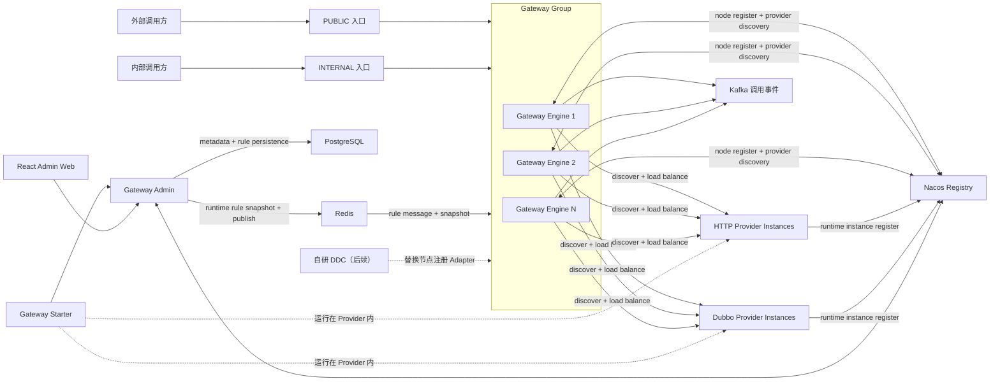
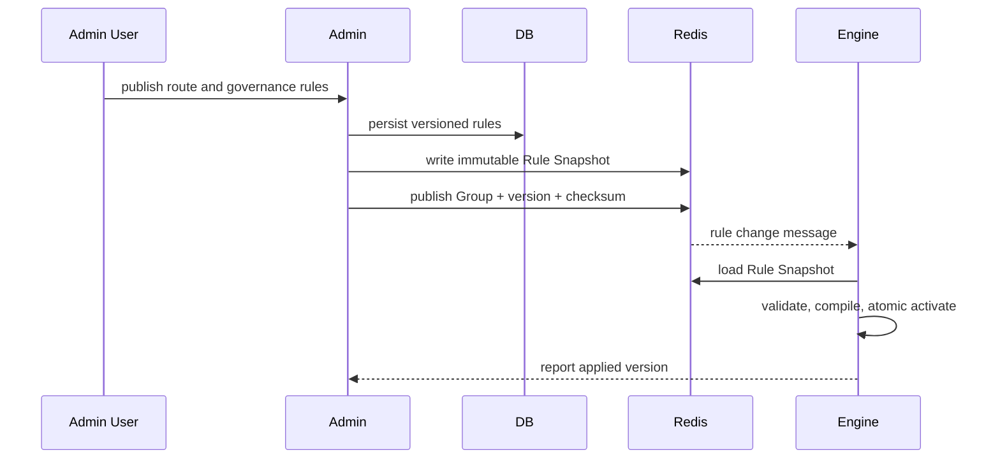

# Egon-COLA Gateway 项目总览 Spec

状态：草案，等待审核

文档阶段：功能范围与技术路线对齐

项目定位：Egon-COLA Component 体系中的大型网关平台

## 1. 本文档要解决的问题

本文档只回答两个问题：

1. Gateway 项目最终需要具备哪些功能。
2. 这些功能采用什么总体技术路线实现。

本文档不是实施级详细设计，暂不展开：

- 数据库表结构和 Flyway 脚本；
- HTTP API、DTO 和错误码清单；
- 类、接口、包和配置项的最终命名；
- 路由发布状态机、消息体和协议字段；
- 单个页面的交互原型；
- 详细测试用例、性能指标和容量参数；
- 任务拆分、实施顺序和工期。

总览审核通过后，再按 Engine、Admin、Starter、Test 及各项治理能力分别拆分子 Spec，逐步实现。

## 2. 已确认的核心结论

| 决策 | 结论 |
|---|---|
| 项目规模 | 虽然归属 Component 项目，但它是一套独立的大型网关平台，不能按普通轻量 Starter 设计 |
| 原始范围 | `/Users/mario/SelfProject/blog/source/_posts/archtect/gateway.md` 29 章的业务网关能力全部纳入分析；第 25～27 章中的 Nginx 管理实现明确不纳入本项目，以 Engine 的 Provider 发现、路由和负载均衡替代 |
| 核心模块 | 建设 Gateway Engine 集群、Gateway Admin 管理平台、Gateway Starter 和 Gateway Test |
| 网关内核 | 优先自研；基于 Reactor Netty/Netty 提供的网络能力建设自己的请求模型、路由、Filter Chain、执行器和生命周期 |
| Spring Cloud Gateway | 只借鉴 Route、Predicate、Filter、治理和可观测性思想，不作为 Engine 运行内核 |
| 分层架构 | Engine、Admin、Starter 均采用分层架构；模块之间通过明确契约交互 |
| 上游协议 | 首期正式支持 HTTP 和 Dubbo；后续协议通过 Adapter SPI 扩展 |
| Admin 定位 | Admin 是管理平台和控制面，负责接口定义存储、配置管理、版本发布、集群管理及管理页面 |
| Starter 定位 | Starter 只采集并上报 Provider 的接口定义，不负责接口调用上报 |
| 调用事件 | 每次接口调用由 Engine 异步发送到 Kafka，不能由 Starter 发送 |
| 接口目录 | 接口按业务域 → 实体域 → 接口组三级组织；一个 Controller/Facade 对应一个接口组 |
| 接口详情 | Starter 需要上报完整接口描述、参数、响应、协议、约束、示例、来源和治理元数据 |
| 外部访问 | 每个 HTTP/Dubbo Operation 都有 `externalAccessible`；false 时仅允许内部入口调用 |
| 鉴权范围 | 不实现具体下游权限系统，但网关必须具备认证、授权、身份上下文和身份透传扩展点 |
| 节点注册 | 当前使用 Nacos 注册和发现 Gateway Node；通过 SPI 隔离，后续迁移自研 DDC |
| Provider 发现 | HTTP/Dubbo Provider 必须注册到服务注册中心；Engine 通过 `ProviderServiceRegistry` 发现实例，不维护静态实例清单 |
| 网关治理 | Engine 负责限流、路由分配、Provider 实例选择和负载均衡，规则统一由 Admin 配置 |
| 规则存储 | 路由、限流、负载均衡等运行规则由 Admin 同时写入 DB 和 Redis；DB 保存持久化管理数据，Redis 保存运行时规则副本 |
| 规则下发 | Admin 完成规则版本写入后通过 Redis 消息通知对应 Gateway Group，Engine 从 Redis 获取版本化规则并原子生效 |
| 管理前端 | React + TypeScript + Ant Design + Ant Design Charts |
| Nginx 边界 | 本项目不生成、管理或动态刷新 Nginx 配置；Engine 通过独立 PUBLIC/INTERNAL Listener 识别入口，Engine 集群前置流量设施由部署环境负责 |
| Trace ID | 优先使用前端或调用方生成的合法 Trace ID；没有或不合法时由 Engine 生成 |
| Test 定位 | 参考动态线程池项目，启动真实 HTTP/Dubbo 应用并完成真实注册、可见和调用闭环 |

## 3. 产品定位与边界

### 3.1 产品定位

Gateway 是位于调用方与业务 Provider 之间的统一流量入口，同时包含数据面和控制面：

- 数据面由 Gateway Engine 承担，负责实际接收、治理和转发请求。
- 控制面由 Gateway Admin 承担，负责定义、编排、发布和管理网关能力。
- Gateway Starter 安装在 Provider 中，负责发现和上报接口定义。
- Gateway Test 提供真实应用和环境，持续验证整个闭环。

该项目不是单个反向代理服务，也不是只包装 Dubbo 的协议转换器，而是能够运行多组 Gateway、管理多个 Engine 节点和多个业务系统的网关平台。

### 3.2 首期范围

首期范围包括：

1. 自研 HTTP 网关运行内核。
2. HTTP Provider 转发。
3. Dubbo Provider 泛化调用。
4. 动态路由、路由分配和版本化发布。
5. Gateway Group 与多 Engine Node 管理。
6. Gateway Node 和 Provider 的 Nacos 注册发现。
7. Engine 内部的 Provider 实例选择和负载均衡。
8. Admin 规则配置、DB/Redis 双写和 Redis 消息下发。
9. Provider 接口定义采集、上报和管理。
10. 业务域、实体域、接口组、Operation 管理。
11. PUBLIC/INTERNAL 入口隔离。
12. 网关鉴权扩展框架。
13. 超时、限流、并发隔离、熔断、重试等治理能力。
14. Trace、日志、指标和 Kafka 调用事件。
15. React 管理平台。
16. 真实 HTTP/Dubbo 应用的端到端测试。
17. 容器化部署、优雅停机和故障恢复。

### 3.3 首期不实现的内容

下列内容不属于首期，但不得阻断未来扩展：

1. 具体的下游账号、角色、权限和租户系统。
2. 内置 Shiro、JWT、OAuth2、OIDC 或其他具体认证 Provider。
3. gRPC、WebSocket、GraphQL 等额外协议。
4. Nginx 配置生成、节点 upstream 管理、动态 reload 和 Nginx 运维。
5. Gateway Engine 集群前置负载设施的建设和管理。
6. 自研 Nacos 替代品；自研 DDC 接入属于后续迁移。
7. API 商业化计费、开发者门户和开放平台套餐。

“不实现具体权限系统”不等于“网关没有鉴权”。Engine 必须提供完整扩展链，后续权限系统只需实现扩展契约即可接入。

## 4. 总体架构



### 4.1 架构原则

1. **控制面与数据面分离**：Admin 故障不能直接中断 Engine 已加载路由的调用。
2. **管理数据与运行规则双写**：Admin 将路由、限流和负载均衡规则同时写入 DB 与 Redis；DB 负责持久化管理，Redis 负责 Engine 运行时读取。
3. **定义与运行分离**：Starter 上报“Provider 有什么接口”，Admin 决定“哪些接口进入哪个 Gateway、如何暴露和治理”。
4. **入口与暴露策略分离**：PUBLIC/INTERNAL 来自可信物理入口，`externalAccessible` 决定 Operation 是否允许通过 PUBLIC 入口。
5. **内核与基础设施分离**：自研 Core 不依赖 Admin、Nacos、Kafka 或具体权限系统。
6. **Provider 必须经注册中心发现**：Engine 不从 Admin 接收静态 Provider 地址，通过注册中心订阅可用实例并在本地完成负载均衡。
7. **Redis 消息驱动生效**：Admin 先写入版本化 Redis 规则副本，再发布 Group 定向消息；Engine 收到消息后获取并原子切换对应版本。
8. **可替换扩展点**：上游协议、鉴权 Provider、Provider 注册发现、Gateway Node 注册和配置通知均通过稳定契约隔离。
9. **配置不可变发布**：Engine 消费已发布版本，不直接运行未发布的编辑态配置。
10. **故障保留最后可用状态**：控制面或通知链路不可用时，Engine 使用 Last-Known-Good 配置继续提供服务。

## 5. 项目与模块职责

### 5.1 核心产品模块

#### Gateway Engine

Gateway Engine 是实际处理请求的网关运行时。多个 Engine 组成一个 Gateway Group，可水平扩缩。

主要职责：

- 接收 PUBLIC 和 INTERNAL HTTP 请求；
- 解析 Trace、入口区域、协议和请求参数；
- 根据 Admin 下发规则完成 Gateway Group 和 Operation 路由匹配；
- 执行外部暴露检查、认证、授权和治理 Filter；
- 从注册中心发现 HTTP/Dubbo Provider 实例；
- 根据 Admin 配置的负载均衡策略选择 Provider 实例并发起调用；
- 执行本地或分布式限流；
- 生成标准响应、反馈头、日志和指标；
- 将调用事件异步发送到 Kafka；
- 从 Nacos 注册和注销节点；
- 订阅 Redis 规则消息，拉取、校验、编译和切换版本化运行规则；
- 在控制面异常时使用最后可用配置继续运行；
- 支持 Drain、优雅停机和连接资源释放。

#### Gateway Admin

Gateway Admin 是网关管理平台和控制面，不承载业务请求转发。

主要职责：

- 管理 Gateway Group、Engine Node 和业务系统；
- 订阅 Nacos 并形成 Gateway Node 管理视图；
- 持久化 Starter 上报的接口定义；
- 管理业务域、实体域、接口组和 Operation；
- 管理 HTTP/Dubbo 路由分配、限流、负载均衡、外部暴露、鉴权引用和其他治理策略；
- 将运行规则双写 DB 和 Redis；
- 通过 Redis 消息向对应 Gateway Group 下发规则版本；
- 展示发布、节点准备、运行版本和异常状态；
- 展示注册中心中的 Gateway Node 和 Provider Instance；
- 提供 React 管理页面、图表和审计能力。

#### Gateway Starter

Gateway Starter 安装在 HTTP/Dubbo Provider 中。

主要职责：

- 识别当前应用和环境；
- 扫描 Controller、HTTP Facade 或 Dubbo Facade；
- 生成业务域、实体域、接口组和 Operation 定义；
- 采集完整接口元数据；
- 计算定义指纹并批量上报 Admin；
- 支持幂等、重试、变更和下线语义。

Starter 明确不负责：

- 拦截或统计接口调用；
- 向 Kafka 发送调用事件；
- 决定 Engine 的运行路由；
- 注册 Gateway Engine Node。

#### Gateway Test

Gateway Test 不是 Mock 集合，而是网关平台的真实验证工程。

主要职责：

- 提供可执行 HTTP Provider；
- 提供可执行 Dubbo Provider；
- 两类 Provider 均安装真实 Gateway Starter；
- 真实注册到 Nacos 并向 Admin 上报；
- 提供真实调用客户端和 Kafka Consumer；
- 验证 Admin 可见、Redis 规则可下发、Engine 可路由和限流、Provider 可负载均衡、Kafka 可消费。

### 5.2 支撑模块

为保持职责清晰，可在核心产品模块内部拆出以下支撑模块：

- `gateway-contract`：模块间稳定 DTO、事件和扩展契约；
- `gateway-core`：请求模型、路由、Filter Chain、参数绑定、执行器和协议 SPI；
- `gateway-admin-web`：React 管理前端；
- 各基础设施 Adapter：Nacos、Kafka、Redis、PostgreSQL、HTTP 和 Dubbo。

支撑模块是工程组织手段，不改变 Engine、Admin、Starter、Test 四类产品职责。最终 Maven 模块名称在对应实施子 Spec 中确定。

### 5.3 分层架构

各运行模块统一采用分层架构，但不强迫所有模块拥有完全相同的包数量：

| 层 | 职责 |
|---|---|
| Interfaces | HTTP、消息、Starter 回调、管理页面接口和协议转换 |
| Application | 用例编排、事务边界、发布流程和生命周期协调 |
| Domain | 路由、接口目录、Gateway Group、Node、策略等核心规则 |
| Infrastructure | PostgreSQL、Redis、Nacos、Kafka、HTTP、Dubbo 和文件存储 Adapter |

依赖方向由外向内，Domain 不依赖具体基础设施。Engine 的网络传输层可以直接使用 Reactor Netty，但必须转换为自有 `GatewayExchange` 后再进入应用处理链。

## 6. 完整功能范围

### 6.1 Engine 数据面

#### 网络与会话

- 基于 Reactor Netty/Netty 提供 HTTP Server。
- 支持连接、请求体聚合、流式或聚合响应、协议异常处理。
- 使用自有请求、响应、Exchange 和上下文模型。
- 区分 PUBLIC 与 INTERNAL Listener，不接受客户端伪造入口区域。

#### 路由

- 根据 Gateway Group、规则版本、Host、Path 和 HTTP Method 匹配 Operation。
- 支持精确路径、路径变量和必要的通配规则。
- 支持同一路径不同 HTTP Method。
- 路由分配规则由 Admin 配置，通过 DB/Redis 双写和 Redis 消息下发。
- Engine 从 Redis 获取本 Group 的版本化规则快照，不直接查询 Admin 数据库。
- 支持新版本预加载、原子切换、回滚和旧版本安全退役。

#### Provider 注册发现与负载均衡

- HTTP/Dubbo Provider 运行实例必须注册到服务注册中心。
- Engine 通过 `ProviderServiceRegistry` 订阅 Provider Instance 的上线、下线、地址、协议、权重、标签和健康状态。
- Provider 运行实例与 Starter 上报的接口定义通过稳定的 application/service 标识关联。
- Engine 维护本地只读 Provider Directory，注册中心短时异常时保留最后一次可用实例视图。
- Engine 根据 Admin 下发的负载均衡规则，从健康 Provider Instance 中选择目标。
- 首期支持轮询、加权轮询、随机和最少在途请求策略。
- 路由规则负责选择目标服务和候选集合，负载均衡规则负责从候选实例中选择单个实例。
- 没有可用实例时快速失败，不回退到 Admin 中维护的静态地址。

#### HTTP 与 Dubbo 调用

- HTTP Adapter 支持常用 Method、Header、Query、Path、Body 和响应透传/转换。
- Dubbo Adapter 使用泛化调用，不要求 Engine 引入 Provider 接口 JAR。
- 支持 Dubbo interface、method、parameter types、version 和 group。
- HTTP、Dubbo 共享统一执行器、治理链和错误模型。
- 后续协议通过 `UpstreamAdapter` 接入，不修改路由核心。

#### 参数与响应

- 支持 Path、Query、Header、Cookie、Form 和 JSON Body 参数。
- 根据 Starter 上报的 Schema 和参数顺序完成类型绑定。
- 对缺失、类型错误和约束失败返回稳定错误。
- 支持统一网关响应和按 Route 配置的透明响应。
- 禁止调用方通过类型字段要求 Engine 反序列化任意 Java Class。

#### Filter Chain

- 自研可排序、可扩展的 Filter Chain。
- 支持全局、Gateway Group、业务系统、接口组和 Operation 等策略作用域。
- 核心阶段包括 Trace、入口识别、CORS、路由、外部暴露、认证、授权、流控、参数绑定、调用、响应、日志、指标和调用事件。
- Filter 必须有明确顺序、短路行为和异常边界。

#### 流量治理

- 超时；
- 请求速率限制，支持全局、Gateway Group、业务系统、接口组、Operation 和调用方等规则作用域；
- 单 Engine 本地限流和基于 Redis 的多 Engine 分布式限流；
- 并发隔离；
- 熔断；
- 有条件重试；
- 请求体大小限制；
- Header 与连接限制；
- Provider 注册发现、实例选择和健康感知；
- 可扩展灰度、权重和标签路由能力。

#### 运行与恢复

- Readiness 与 Liveness 分离。
- 节点启动后先完成注册和配置准备，再加入流量。
- 支持 Drain 和优雅停机。
- 配置发布失败时保留旧版本。
- Admin、Redis 或通知暂时不可用时，已运行 Engine 继续使用最后可用配置。

### 6.2 Admin 控制面

#### 资源管理

- Gateway Group；
- Gateway Engine Node；
- Application System；
- Business Domain；
- Entity Domain；
- Interface Group；
- Operation；
- HTTP/Dubbo 上游目标；
- Route 分配、限流、负载均衡、暴露策略、鉴权策略引用和其他治理策略；
- Group、Node 与 System 的关联关系。

#### 接口定义管理

- 接收 Starter 的批量定义上报。
- 持久化三级接口目录和详细 Operation。
- 区分 Provider 原始定义与 Admin 治理配置。
- 展示新增、修改、下线和冲突。
- Starter 上报不能直接把接口变成公网可调用状态。
- 支持没有 Starter 的接口由管理员补充维护，但来源必须可区分。

#### 路由配置与发布

- 编辑态和运行态分离。
- 发布前校验路径冲突、参数定义、Provider Service、限流、负载均衡、外部暴露和鉴权引用。
- 将一个 Gateway Group 的路由和治理规则编译成不可变版本。
- Admin 将规则版本双写到 DB 和 Redis，只有 Redis 运行时副本完整后才发布消息。
- Engine 收到 Redis 消息后拉取并准备新版本，再原子切换本地规则。
- 展示节点版本、准备结果和失败原因。
- 支持历史版本查看、差异和回滚。
- Redis 消息丢失后可通过版本对账恢复。

#### 节点与 Provider 管理

- 从 Nacos 获取 Engine Node 的注册和健康信息。
- 保存用于管理、审计和发布判断的节点投影。
- 展示节点所属 Group、地址、版本、状态和最近变化。
- 展示 Provider Service 和 Provider Instance 的注册、健康、权重、标签和最近变化。
- Engine Node 前置流量分配属于部署环境，不由 Admin 生成或管理负载配置。

#### 管理页面

- 总览仪表盘；
- Gateway Group 与 Node 页面；
- 业务系统和三级接口目录树；
- Operation 详细定义页面；
- 路由分配、限流、Provider 负载均衡、外部暴露、鉴权和治理配置页面；
- 发布、差异、节点准备和回滚页面；
- Gateway Node、Provider Service 和 Provider Instance 页面；
- Trace、限流、负载分布、流量、错误率、延迟和节点分布图表；
- 审计和异常提示。

### 6.3 Starter 接口定义上报

Starter 上报的目录结构为：

```text
Application System
└── Business Domain
    └── Entity Domain
        └── Interface Group
            └── Operation
```

三级分组指 Business Domain、Entity Domain 和 Interface Group；Application System 是接口归属根，Operation 是最终可调用单元。

映射规则：

1. 一个 Controller、HTTP Facade 或 Dubbo Facade 对应一个 Interface Group。
2. 多个 Interface Group 可以归入一个 Entity Domain。
3. 多个 Entity Domain 可以归入一个 Business Domain。
4. 同一个 Controller/Facade 不能在一次上报中拆成多个 Interface Group。
5. 目录 code 必须稳定，名称和描述可以演进。

Operation 至少包含以下信息：

- 稳定 Operation ID、名称、摘要、详细描述、标签和负责人；
- 所属应用、业务域、实体域、接口组；
- HTTP 或 Dubbo 协议类型；
- HTTP Path、Method、Host、consumes 和 produces；
- Dubbo interface、method、version、group 和注册服务信息；
- 参数名称、顺序、来源、类型、泛型 Schema、必填、默认值和校验约束；
- 请求示例；
- 成功响应、错误响应、Schema 和示例；
- `externalAccessible`；
- 鉴权策略引用和可配置治理元数据；
- 废弃标记、版本、构建信息、来源类和方法签名；
- 用于幂等和变更识别的定义指纹。

Admin 必须存储这些信息，而不是只保存 Path、Method 和 Dubbo 方法名。

### 6.4 外部与内部访问

每个 Operation 都必须有 `externalAccessible`：

- `true`：允许通过 PUBLIC 或 INTERNAL 入口继续进入后续处理。
- `false`：PUBLIC 入口按“未对外暴露”处理，不能调用；INTERNAL 入口可以继续处理。

技术原则：

1. 默认值为 false，防止 Starter 新上报接口自动暴露公网。
2. PUBLIC/INTERNAL 身份只由 Engine 独立监听端口或受信任的部署入口绑定关系确定。
3. 不信任普通客户端传入的“内部请求”Header。
4. 暴露检查在具体鉴权前完成，避免向外部泄漏内部接口存在性。
5. HTTP 和 Dubbo Operation 使用同一规则。
6. `externalAccessible=true` 只代表允许从外部入口进入，不代表跳过鉴权、限流或其他治理。

### 6.5 网关鉴权扩展

首期不实现具体下游权限系统，但 Core 必须定义：

- Credential 提取扩展；
- `GatewayAuthenticationProvider`；
- `GatewayAuthorizationProvider`；
- 不可变 `GatewayPrincipal`；
- `GatewayAuthContext`；
- 认证、拒绝、不可用等稳定决策模型；
- HTTP Header 和 Dubbo Attachment 的受控身份透传；
- Route 对鉴权策略和 Provider ID 的引用。

基本规则：

1. Operation 可以明确配置无需鉴权，但不能因鉴权 Provider 缺失而自动放行。
2. 配置了鉴权策略却找不到对应鉴权 Provider 时，发布应失败；运行期异常时默认关闭访问。
3. 客户端传入的内部身份 Header 必须先移除，再由可信 Mapper 写入。
4. 认证失败、授权失败和鉴权 Provider 不可用需要可区分。
5. 未来接入公司的权限系统时，只实现 Provider 和 Mapper，不改 Engine 路由核心。

### 6.6 Trace 与调用事件

Trace ID 规则：

1. 前端或调用方负责优先生成 Trace ID。
2. Engine 校验并接受合法的 `traceparent` 或约定 Trace Header。
3. 缺失或非法时由 Engine 生成。
4. Trace ID 贯穿 Engine 日志、HTTP Header、Dubbo Attachment、响应、指标和 Kafka 调用事件。
5. Admin React 前端对管理请求也使用统一 Trace 生成和透传策略。

调用事件规则：

1. 只有 Engine 产生接口调用事件。
2. Starter 不拦截调用，也不持有 Kafka Producer。
3. 调用完成后异步发送 Kafka，Kafka 故障不能改变业务响应。
4. 事件包含 Trace、Route、Operation、Node、耗时、结果和必要的诊断维度。
5. 默认不记录请求/响应 Body、凭据和敏感身份信息。
6. 投递链路需要有界、可观测，并在后续子 Spec 中确定缓冲和可靠性级别。

## 7. 自研网关技术路线

### 7.1 路线比较

| 路线 | 说明 | 结论 |
|---|---|---|
| Spring Cloud Gateway 扩展 | 直接使用其 Server、RouteDefinition 和 GlobalFilter，再扩展 Dubbo | 可借鉴但不作为主路线，核心路由和生命周期受框架约束 |
| Reactor Netty 上自研内核 | 复用成熟网络传输和 HTTP 编解码，自研 Exchange、路由、Filter、版本和 Adapter | 推荐，既满足自研要求，又避免重复实现底层协议 |
| 原始 Netty 全自研 | 从 Pipeline、HTTP 聚合、连接管理到 Client 全部自行建设 | 首期成本和风险过高，不推荐 |

推荐路线是“Reactor Netty 基础设施 + 自研 Gateway Core”，不是 Spring Cloud Gateway 二次封装。

### 7.2 自研与复用边界

项目自行实现：

- `GatewayRequest`、`GatewayResponse`、`GatewayExchange`；
- 路由定义、路由编译器和 Matcher；
- 版本化 Route Repository；
- Filter Chain 和 Filter 扩展契约；
- 入口区域与外部暴露判断；
- 鉴权扩展链和身份上下文；
- 参数提取、类型绑定和响应映射；
- `GatewayExecutor`；
- `ProviderServiceRegistry`、本地 Provider Directory 和负载均衡策略；
- 路由、限流和负载均衡运行规则模型；
- `UpstreamAdapter` 和调用生命周期；
- 错误模型、反馈头和调用事件；
- 路由 Prepare、Activate、Retire 与 LKG；
- Engine Node 生命周期和控制面协作。

项目复用：

- Reactor Netty/Netty 的 EventLoop、Channel、HTTP 编解码、连接池和 HttpClient；
- Dubbo 的 `GenericService`；
- Jackson 的 JSON 与 Schema 基础能力；
- Resilience4j 或等价成熟库的限流、熔断和重试算法；
- Micrometer/OpenTelemetry 的指标和 Trace 标准；
- Nacos Client、Kafka Client、Redis Client 和 PostgreSQL Driver。

Engine 运行依赖中不引入 `spring-cloud-starter-gateway-*`，也不把 Spring Cloud Gateway 的 `RouteDefinition`、`GlobalFilter` 或 Actuator API 当成项目契约。

### 7.3 请求处理主链


这是逻辑阶段，不代表每个阶段都必须拆成一个类。实施时只在确有变化点的地方使用扩展接口，避免为了模式而过度设计。

### 7.4 设计模式选择

| 模式 | 使用位置 | 原因 |
|---|---|---|
| Chain of Responsibility | Filter、认证、授权和治理处理链 | 阶段有顺序、可短路且需要扩展 |
| Strategy | 路由分配、限流键、鉴权 Provider 和负载均衡 | 同一职责存在可配置算法 |
| Adapter | HTTP、Dubbo、Provider 注册中心、Gateway Node 注册中心和未来 DDC | 隔离外部协议和基础设施 |
| Factory/Builder | 编译不可变 Route Snapshot 和调用资源 | 创建过程需要集中校验 |
| State | Route 发布和 Engine Node 生命周期 | 状态变化具有明确约束 |
| Facade | `GatewayExecutor` | 为网络层提供单一稳定执行入口 |

简单的参数转换和直接业务判断不额外引入模式。

## 8. 路由、发布与集群技术路线

### 8.1 路由配置

- Admin 保存接口定义，并配置路由分配、限流、负载均衡、暴露、鉴权和其他治理规则。
- 发布时按 Gateway Group 生成完整、不可变、带版本和校验值的 Rule Snapshot。
- 一次发布在逻辑上同时写入 DB 持久化版本和 Redis 运行时版本。
- Redis Rule Snapshot 完整可读后，Admin 才向对应 Gateway Group 发布规则变更消息。
- Engine 收到消息后从 Redis 拉取 Snapshot，在流量外完成校验和编译。
- 编译成功后进入可切换状态，失败不影响当前版本。
- Group 内 Engine 通过 Redis 的 Prepare/Activate 版本消息协调切换，单节点本地使用原子引用替换规则。
- 历史回滚通过重新发布一个已知内容的新版本完成。

DB 与 Redis 的职责：

- DB 保存管理态规则、历史版本、审计和可恢复事实。
- Redis 保存 Engine 直接消费的当前版本指针、不可变 Rule Snapshot 和规则消息。
- Engine 不直连 Admin 数据库，也不把 Redis 消息体当作唯一规则内容。
- Admin 通过版本、校验值、重试和周期对账修复 DB/Redis 双写不一致。
- Engine 通过 Redis 当前版本对账补偿消息丢失。



### 8.2 Gateway Group 与 Engine Node

- 一个 Gateway Group 包含多个 Engine Node。
- 业务系统或路由被分配到 Gateway Group，而不是绑定单台 Engine。
- Group 内 Node 应运行同一已激活配置版本。
- 新 Node 完成 Nacos 注册、配置加载和资源预热后才能接流。
- Drain、异常、未准备或已注销的 Node 必须暴露不可接流状态。
- Engine Node 之间的入口流量分配由项目外部署设施负责，Gateway Admin 不生成或下发该设施的配置。

### 8.3 Nacos 与未来 DDC

当前路线：

- Engine 通过 `GatewayNodeRegistry` Port 注册、更新元数据和注销。
- Engine 通过独立的 `ProviderServiceRegistry` Port 订阅 Provider Service 和 Instance。
- Infrastructure 分别提供两个 Port 的 Nacos Adapter，避免混淆 Gateway Node 注册和 Provider 发现。
- Nacos 临时实例和健康状态作为 Node 存活事实。
- Admin 订阅 Nacos 并持久化管理投影。
- HTTP/Dubbo Provider 运行实例必须注册到当前支持的注册中心；首期统一使用 Nacos。
- Provider 与 Gateway Node 使用隔离的 serviceName、group 和 namespace。

未来迁移：

- 自研 DDC 首先实现同一 `GatewayNodeRegistry` 契约。
- Engine Domain 和路由核心不感知 Nacos/DDC 差异。
- 迁移期可增加双注册或灰度读取，但具体方案留到 DDC 接入子 Spec。

### 8.4 Provider 路由与负载均衡

Engine 的调用目标分两步确定：

1. 路由分配：根据 Admin 下发规则，把 Operation 映射到目标 Provider Service 和候选实例条件。
2. 负载均衡：从注册中心同步到本地的健康候选实例中选择本次调用实例。

Admin 可配置负载均衡算法、权重、标签和灰度条件；Engine 负责执行。Provider 上下线由注册中心事件驱动本地目录更新，不需要重新发布静态地址列表。

### 8.5 限流

- 限流规则在 Admin 配置，随同其他 Rule Snapshot 双写 DB/Redis 并通过 Redis 消息下发。
- Engine 在请求链中执行限流，Admin 不进入业务请求热路径。
- 本地限流用于单 Engine 快速保护，Redis 分布式限流用于 Gateway Group 共享配额。
- 限流规则支持作用域、键提取方式、算法、阈值、时间窗口和拒绝行为。
- 规则版本更新必须原子替换，Redis 分布式限流运行状态与规则配置使用不同 key 空间。

## 9. Admin 技术路线

### 9.1 后端

- Java 21、Spring Boot 和分层架构；
- PostgreSQL 保存接口定义、路由与治理规则、发布版本和审计；
- Redis 保存 Engine 运行时 Rule Snapshot、当前版本指针、规则发布消息和分布式限流状态；
- Admin 对路由、限流、负载均衡等运行规则执行 DB/Redis 双写，并负责版本对账和失败修复；
- Nacos Client 用于订阅 Gateway Node 与 Provider Instance；
- Kafka 可用于平台事件集成，但接口调用事件始终由 Engine 生产；
- 管理 API 与 Engine 内部控制 API 分离；
- 管理面部署在受信任网络，具体账号/RBAC 作为独立后续能力。

### 9.2 前端

- React；
- TypeScript；
- Vite；
- Ant Design；
- Ant Design Charts；
- 统一请求客户端、Trace ID、错误处理和权限占位能力；
- 以目录树、详情页、发布工作台和图表为主要交互模型。

Ant Design Charts 主要展示 Gateway/Provider 节点、路由流量、负载分布、限流拒绝、错误、延迟、发布状态和版本分布。图表只展示有明确来源的指标，不以高基数原始 Path 或 Trace ID 作为指标标签。

## 10. Starter 技术路线

Starter 采用“声明 + 扫描 + 编译 + 批量上报”路线：

1. Provider 声明应用、业务域、实体域和接口组信息。
2. Starter 扫描 Spring Controller、HTTP Facade 或 Dubbo Facade。
3. 结合注解、方法签名、参数类型和校验注解编译 Operation。
4. 对整个上报批次和单个定义计算稳定指纹。
5. 应用启动成功后向 Admin 批量上报。
6. Admin 在一个一致性边界内保存目录和接口详情。
7. 重复上报幂等，定义变化可识别，下线有明确语义。

Starter 默认是否开启、注解命名、OpenAPI 元数据复用方式和失败策略在 Starter 子 Spec 中确定。无论最终选择如何，Starter 上报失败不能静默把未审核接口变成公网路由。

## 11. Test 技术路线

Gateway Test 参考动态线程池项目的“真实示例应用 + 可选真实环境测试”方式。

建议包含以下真实运行单元：

- HTTP Provider：真实 Spring Boot Controller，安装 Gateway Starter；
- Dubbo Provider：真实 Dubbo Facade 与实现，安装 Gateway Starter；
- Gateway Client：模拟前端生成 Trace ID，并调用 PUBLIC/INTERNAL 入口；
- Kafka Consumer：验证 Engine 发送的调用事件；
- E2E：编排 Admin、Engine、Nacos、PostgreSQL、Redis、Kafka 和多实例 Provider。

验证目标：

1. HTTP/Dubbo Provider 能真实启动。
2. Provider 运行实例能出现在 Nacos。
3. Starter 上报后，Admin 能真实看到业务域、实体域、接口组、Operation 和详细定义。
4. Engine Node 能真实注册并出现在 Admin。
5. 多个 HTTP/Dubbo Provider Instance 能注册到 Nacos，并被 Engine 动态发现。
6. Admin 发布路由、限流或负载均衡规则时，DB 与 Redis 均形成同一版本，Engine 能收到 Redis 消息并生效。
7. Engine 能真实路由 HTTP/Dubbo Operation，并按配置在多个 Provider Instance 之间负载均衡。
8. 限流规则能在 Engine 请求链真实拒绝超额请求。
9. `externalAccessible=false` 的接口外部不可调、内部可调。
10. 调用方 Trace ID 能贯穿调用；缺失时 Engine 能补充。
11. Engine 能向 Kafka 发送真实调用事件，Starter 不发送。

日常构建保留快速单元和组件测试；依赖完整基础设施的 Live Test 使用显式环境开关运行。当前阶段只定义测试路线，不启动任何项目。

## 12. 原始 29 章能力对齐

| 章 | 原始能力 | 本项目功能归属 |
|---|---|---|
| 1 | HTTP 请求会话协议处理 | 自研 Reactor Netty Server、Gateway Exchange 和协议处理 |
| 2 | 代理 RPC 泛化调用 | Dubbo `GenericService` Adapter |
| 3 | 分治处理会话流程 | 自研 Filter Chain、Executor 和职责分层 |
| 4 | 将 RPC、HTTP、其他连接抽象为数据源 | `UpstreamAdapter` SPI，首期 HTTP + Dubbo |
| 5 | HTTP 请求参数解析 | 多来源参数提取、Schema 校验和类型绑定 |
| 6 | 执行器封装服务调用 | `GatewayExecutor` 与统一调用结果 |
| 7 | Shiro + JWT 权限认证 | 不内置 Shiro/JWT；实现认证、授权、Principal 和 Provider SPI |
| 8 | 网关会话鉴权处理 | Filter Chain 中的认证、授权、拒绝和身份透传阶段 |
| 9 | 网关注册中心服务创建 | Gateway Admin 控制面 |
| 10 | 网关注册中心库表结构 | Admin 持久化模型；表结构在后续 Admin 子 Spec 设计 |
| 11 | 注册 Gateway 算力节点 | Gateway Group、Engine Node 和 Nacos 注册 |
| 12 | 注册应用、接口、方法 | Admin 的应用与三级接口目录管理 |
| 13 | 服务发现和注册网关连接 | Nacos `GatewayNodeRegistry`、`ProviderServiceRegistry` 和 Admin 控制面连接 |
| 14 | 网关映射聚合查询 | Gateway Group Rule Snapshot 聚合 |
| 15 | 配置拉取和组件验证 | Engine 从 Redis 拉取、校验、编译、准备、切换和反馈 |
| 16 | 网络通信配置提取 | Engine/Admin/Starter 类型化配置 |
| 17 | 核心通信组件管理和服务映射 | Engine 生命周期与版本化 Route Repository |
| 18 | 容器关闭监听和异常管理 | Drain、优雅停机、稳定错误和资源释放 |
| 19 | 网关引擎镜像部署 | Engine 可执行包、容器镜像和部署配置 |
| 20 | 服务注册组件采集接口信息 | Starter 扫描并编译完整接口定义 |
| 21 | 应用服务接口注册到中心 | Starter 批量上报，Admin 持久化 |
| 22 | 订阅服务注册消息驱动网关映射 | Admin DB/Redis 双写、Redis 规则消息、全量拉取和周期对账 |
| 23 | 网关运营管理后台 | Admin 后端与 React/Ant Design/Ant Design Charts |
| 24 | 前后端分离跨域调用 | Admin CORS 与 Engine 自研 CORS Filter |
| 25 | Nginx 负载模型配置 | 不实现 Nginx 管理；其业务目标由 Provider Service、候选实例和 Engine 负载均衡模型承接 |
| 26 | 动态刷新 Nginx 负载配置 | 不实现 Nginx 动态刷新；动态能力改为 Admin 规则双写和 Redis 消息下发 |
| 27 | Gateway 节点动态负载 | 不管理 Gateway Node 前置负载；改为 Engine 订阅 Provider Instance 变化并动态负载均衡 |
| 28 | 网关组件工程模块合并 | Engine、Admin、Starter、Test 及支撑模块的 Component 聚合工程 |
| 29 | 算力关联、接口上报、调用反馈 | Group/Node/System 关联、三级接口目录、Starter 上报、节点反馈和 Engine Kafka 调用事件 |

结论：

- 原文 29 章均已分析并映射。
- 第 7、8 章改变具体实现边界，不删除网关鉴权能力。
- 第 25～27 章中的 Nginx 节点负载、配置生成和动态刷新明确不属于本项目。
- 第 25～27 章所表达的动态路由与负载目标，由注册中心 Provider 发现、Engine 路由/负载均衡和 Admin Redis 规则下发承接。

## 13. 本轮审核项

本轮只需审核以下总览结论：

1. Gateway 是大型 Component 项目，包含 Engine 集群、Admin、Starter 和 Test。
2. 原始 29 章全部完成映射，但 Nginx 管理实现明确排除。
3. Engine 采用 Reactor Netty/Netty 之上的自研网关内核，不依赖 Spring Cloud Gateway 运行时。
4. HTTP 与 Dubbo 是首期正式协议。
5. Admin 是管理与控制面，Starter 只上报接口定义，Engine 才发送 Kafka 调用事件。
6. 接口目录是业务域 → 实体域 → 接口组，Controller/Facade 与接口组一一对应。
7. Admin 保存完整 Operation 详情。
8. `externalAccessible=false` 只能从 INTERNAL 入口调用。
9. 不实现具体下游权限系统，但必须建设网关鉴权扩展框架。
10. Gateway Node 当前注册到 Nacos，后续通过 Adapter 迁移 DDC。
11. HTTP/Dubbo Provider 注册到注册中心，Engine 通过注册中心发现实例。
12. 路由分配、限流和 Provider 负载均衡由 Engine 执行，规则由 Admin 配置。
13. Admin 将运行规则双写 DB/Redis，并通过 Redis 消息向 Engine 下发版本。
14. Gateway Admin 不生成、管理或动态刷新 Nginx 配置。
15. Admin 前端使用 React、Ant Design 和 Ant Design Charts。
16. Test 必须启动真实 HTTP/Dubbo 多实例应用，并验证注册发现、规则下发、限流和负载均衡。
17. Trace ID 由前端/调用方优先生成，缺失或非法时 Engine 生成。

上述总览审核通过后，再拆分实施级子 Spec；在此之前不创建 Gateway 模块、不修改 POM、不引入依赖，也不启动项目。
