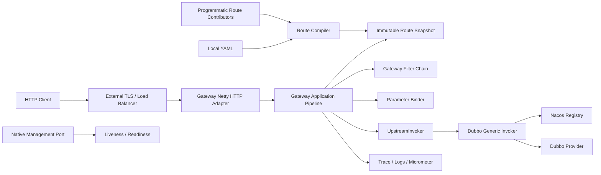
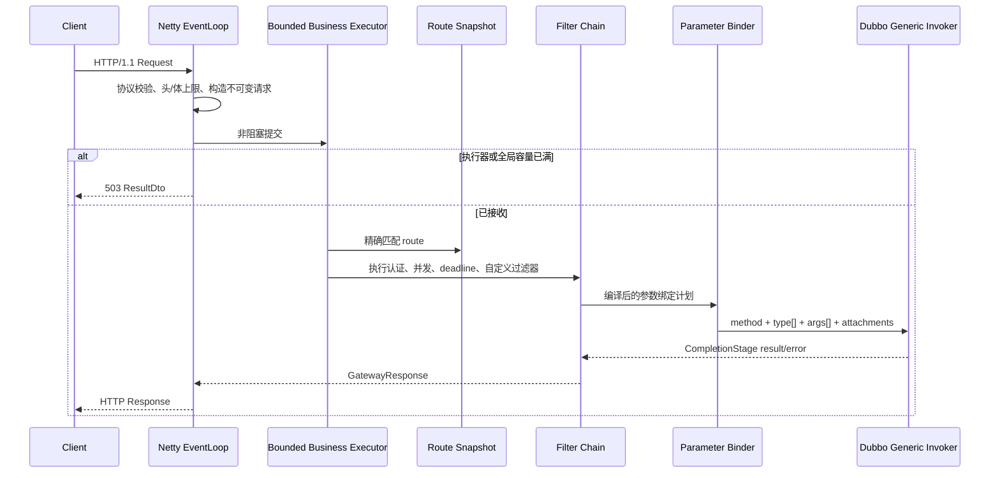

# 2026-07-24 Egon-COLA Gateway Component V1 设计 Spec

状态：草案，等待用户审核。本文档只定义需求、功能边界和技术方案，尚未授权进入实现阶段。

## 1. 文档目的与审核方式

本文档把现有网关教程中的有效主干、美团 Shepherd 的成熟设计原则和 Egon-COLA 当前组件工程约束，收敛为一个可落地的轻量级网关组件 V1。

本轮已经一次性确认以下总体方向：

1. 这是 `egon-cola-components` 下的 component 项目。
2. 采用分层架构，不建设完整网关平台。
3. V1 聚焦数据面：接收 HTTP 请求，匹配本地路由，完成参数绑定，通过 Dubbo 泛化调用访问上游，再返回 HTTP 响应。
4. 采用 `core + starter + engine + test` 四模块结构。
5. 使用原生 Netty 提供 HTTP/1.1 服务。
6. V1 上游只实现 Dubbo 泛化调用，注册中心以 Nacos 为验收基线。
7. V1 路由来自本地 YAML 和程序化 Bean，不实现控制台、数据库、SDK 上报和在线动态配置中心。
8. 鉴权采用标准 Bearer JWT、公钥或 JWK 验签，不沿用 Shiro、自定义 token header 或共享 HMAC 密钥方案。
9. 采用有界线程、有界请求、超时、并发保护、优雅停机、指标和健康检查；V1 不自动重试。
10. TLS、外部负载均衡、实例摘流和容器编排由 Nginx、Kubernetes 或其他基础设施负责，网关组件不修改外部代理配置。

建议按以下顺序审核：

1. 第 2～5 节：需求来源、目标、范围和总体决策。
2. 第 6～9 节：架构、模块、领域模型和路由契约。
3. 第 10～15 节：请求流程、HTTP、参数、Dubbo、JWT 和过滤器契约。
4. 第 16～20 节：错误、稳定性、生命周期、可观测性和安全。
5. 第 21～25 节：配置、测试、验收、风险和后续边界。

审核通过前：

- 不创建 gateway 模块；
- 不修改 Maven POM、BOM 或现有代码；
- 不引入依赖；
- 不启动服务；
- 不提前编写实施代码。

## 2. 需求来源与现状分析

### 2.1 原始网关文档的能力分布

原始文档：

```text
/Users/mario/SelfProject/blog/source/_posts/archtect/gateway.md
```

该文档是一个由 29 个章节逐步演进的教学项目，不是可以直接作为生产契约使用的统一设计。它的内容可以归为四组：

| 章节 | 主要内容 | V1 处理 |
|---|---|---|
| 1～8 | Netty HTTP、URI 映射、参数解析、Dubbo 泛化调用、响应、Shiro/JWT 鉴权 | 保留主干，重做契约和安全模型 |
| 9～15 | 网关注册中心、数据库表、节点、应用/接口/方法配置、配置拉取 | 不进入 V1 |
| 16～22 | engine/assist/sdk 生命周期、接口上报、Redis Pub/Sub 路由刷新 | 只保留 engine 生命周期；动态配置延期 |
| 23～24 | Vue 管理后台和跨域 | 管理后台不做；仅保留可选安全 CORS |
| 25～29 | Nginx 配置生成、Docker Socket、动态负载、工程合并 | 外置给部署平台，不由 Java 组件控制 |

原始方案对理解“HTTP 到 RPC”的主链路有价值，但存在以下问题：

1. GET、POST、PUT、DELETE 的声明与实际实现不一致。
2. 参数模型从单参数逐步变为字符串拆分，没有稳定、显式、可验证的多参数契约。
3. 数据源抽象声称支持 HTTP/RPC 等多种连接，但只有 Dubbo 流程真正闭环。
4. Shiro、自定义 `uId/token` 请求头和共享 HMAC key 不适合作为当前网关安全基线。
5. 同步 RPC 调用存在阻塞 Netty EventLoop 的风险。
6. 路由以 URI 字符串为主，缺少 method、host、path 规范化、冲突检测和 404/405 语义。
7. Redis Pub/Sub 只有通知，没有版本、校验和、重放、原子切换、Last-Known-Good 和回滚契约。
8. 节点注册缺少可靠心跳、租约、摘流和优雅下线语义。
9. Java 进程挂载 Docker Socket、修改 Nginx 文件并执行 reload，职责耦合且扩大安全面。
10. 缺少请求体、请求头、并发、队列、响应体、超时和下游故障边界。
11. 缺少稳定错误码、健康检查、指标、脱敏日志和完整优雅停机契约。

### 2.2 Shepherd 方案中采用的原则

参考资料：

- [美团 Shepherd API 网关设计原文](https://tech.meituan.com/2021/05/20/Shepherd-API-Gateway.html)
- [用户提供的 PDai 整理版本](https://pdai.tech/md/arch/gateway/arch-gateway-mt-shepherd.html)

本设计吸收以下原则：

1. 清晰区分控制面、配置分发和数据面。
2. 路由是显式、类型化、启动前可校验的配置，不是散落字符串。
3. 请求处理采用有顺序、可短路、可扩展的功能组件链。
4. 上游调用通过统一 Invoker 抽象隔离。
5. 参数映射必须显式表达来源、类型和顺序。
6. 数据面必须异步化，并把可能阻塞的工作与网络 EventLoop 隔离。
7. 超时、流量保护、监控、健康检查和安全是网关基础能力，而不是后补功能。
8. 精确路由和变量路由应采用不同匹配结构。

本设计不复制 Shepherd 的完整平台能力：

- 不建设控制台；
- 不建设 API 配置中心；
- 不实现脚本 DSL；
- 不动态加载 JAR；
- 不实现服务编排；
- 不实现灰度发布；
- 不实现函数计算或 Serverless；
- 不实现组件市场。

### 2.3 当前仓库基线

当前 `egon-cola-components` 基线：

| 项目 | 当前值 |
|---|---|
| Java | 21 |
| Spring Boot | 3.5.16 |
| Egon-COLA component version | 5.2.3 |
| Micrometer | 1.15.12 |
| Archetype 中的 Dubbo | 3.3.6 |
| 自动配置发现 | `META-INF/spring/org.springframework.boot.autoconfigure.AutoConfiguration.imports` |
| 外部结果契约 | `ResultDto<T>` + `ResultDtos` |
| Trace 契约 | `TraceContext` |
| BOM 发布习惯 | 对业务组件通常只暴露 starter |

Gateway 必须服从当前组件仓库的 Maven 聚合、命名、自动配置、测试和 BOM 习惯，不另建一套工程标准。

## 3. 问题定义

### 3.1 要解决的问题

业务服务已经通过 Dubbo 暴露接口，但外部调用方只使用 HTTP。当前每个业务系统都需要重复创建 Controller/BFF 代码，完成：

1. HTTP 协议解析；
2. 路由选择；
3. 参数转换；
4. JWT 验证；
5. Dubbo Consumer 配置；
6. 调用超时和错误映射；
7. 日志、指标和健康检查；
8. 启停和资源释放。

Gateway Component 的目标是把这一组重复能力沉淀为统一组件，使使用方只声明路由和参数映射，不依赖服务提供方 API JAR，也不重复实现协议转换代码。

### 3.2 目标用户

| 用户 | 诉求 |
|---|---|
| 组件接入方 | 在现有 Spring Boot 应用中引入 starter，声明路由并启动独立 Netty 端口 |
| 独立部署方 | 使用 engine 模块打包的可执行 JAR 运行网关数据面 |
| API 调用方 | 通过标准 HTTP/JSON 和 Bearer JWT 调用 Dubbo 服务 |
| 运维人员 | 获取稳定健康状态、指标、脱敏访问日志和优雅摘流能力 |
| 扩展开发者 | 通过稳定 SPI 增加过滤器、路由来源或新的上游 Invoker |

### 3.3 成功定义

V1 成功不是“具备完整网关平台”，而是同时满足：

1. 一条配置正确的 HTTP 路由可以稳定调用一个不引入 API JAR 的 Dubbo 服务。
2. 多参数、复杂 JSON 对象和鉴权信息映射行为明确且可测试。
3. 无任何下游调用、JWK 网络访问或其他阻塞操作运行在 Netty EventLoop 上。
4. 请求、线程、队列、并发、超时和响应均有上限。
5. 错误对外稳定、对内可追踪，不泄漏敏感异常。
6. 组件可以嵌入应用，也可以独立运行。
7. 后续增加动态路由或其他上游协议时，不需要推翻请求主链路。

## 4. 需求

### 4.1 业务需求

| ID | 需求 |
|---|---|
| BR-001 | 将 HTTP/JSON 请求转换为 Dubbo 泛化调用 |
| BR-002 | 网关不依赖任何业务 Provider 的 API、DTO 或 Facade JAR |
| BR-003 | 路由和参数映射通过配置或程序化 API 声明 |
| BR-004 | 路由可选择公开访问或要求标准 Bearer JWT |
| BR-005 | 网关产生的错误采用 Egon-COLA `ResultDto` 外部契约 |
| BR-006 | RPC 正常返回值保持业务语义，不由网关重新解释 |
| BR-007 | 独立 engine 和嵌入式 starter 使用同一套核心能力 |
| BR-008 | Nacos 作为 Dubbo 服务发现的 V1 验收基线 |

### 4.2 功能需求

| ID | 需求 |
|---|---|
| FR-001 | 组件必须显式启用，单纯引入依赖不得自动开放端口 |
| FR-002 | 支持本地 YAML 路由和程序化 `GatewayRouteContributor` |
| FR-003 | 启动前完成全量路由解析、规范化、冲突检查和编译 |
| FR-004 | V1 支持 HTTP/1.1、GET、POST、JSON 和 query/header 参数 |
| FR-005 | V1 使用 method + 可选精确 host + 精确 path 匹配 |
| FR-006 | 参数列表顺序必须与 Dubbo 方法参数顺序一一对应 |
| FR-007 | 参数来源支持 QUERY、HEADER、BODY、CONSTANT、CONTEXT、JWT_CLAIM |
| FR-008 | 通过 `GenericService` 调用配置的 interface/method/group/version |
| FR-009 | 支持命名 Nacos Registry，并允许路由选择 Registry |
| FR-010 | 支持按路由启用或跳过 JWT 鉴权 |
| FR-011 | 支持有序 Filter Chain、短路响应和异步后置处理 |
| FR-012 | 支持全局和路由级超时、并发上限与容量拒绝 |
| FR-013 | 支持 traceId、脱敏访问日志和 Micrometer 指标 |
| FR-014 | 提供 liveness、readiness 和优雅停机 |
| FR-015 | 提供 `UpstreamInvoker`、`GatewayFilterFactory`、`RouteProvider` 扩展契约 |
| FR-016 | 提供原子路由快照管理能力，但 V1 不提供在线动态 RouteProvider |
| FR-017 | 提供可执行 engine JAR，但不负责外部代理或编排平台配置 |

### 4.3 非功能需求

| ID | 类别 | 需求 |
|---|---|---|
| NFR-001 | 性能 | Netty EventLoop 不得执行阻塞 I/O、等待锁、同步 RPC 或同步 JWK 拉取 |
| NFR-002 | 容量 | 请求头、请求体、响应体、并发数、线程数和队列长度必须有界 |
| NFR-003 | 稳定性 | 单个路由或单个下游故障不得破坏其他路由处理 |
| NFR-004 | 超时 | 每个请求只有一个绝对 deadline，排队和调用时间都计入 |
| NFR-005 | 安全 | 不信任外部提供的 interface、method、javaType 或 attachment 名称 |
| NFR-006 | 安全 | 未知异常 message、token、cookie、密码和完整请求体不得写入响应或普通日志 |
| NFR-007 | 可维护性 | core 不依赖 Spring、Netty、Dubbo、Nacos、JWT 或 Micrometer |
| NFR-008 | 可测试性 | 路由、过滤器、参数绑定、错误映射和生命周期可以脱离真实网络做单测 |
| NFR-009 | 兼容性 | 遵循当前 Java 21、Spring Boot 3.5.16 和 component 5.2.3 基线 |
| NFR-010 | 可操作性 | 所有业务指标标签必须有界，不使用原始 path、userId 或异常 message 作为 tag |
| NFR-011 | 发布 | 对组件消费者只在 BOM 中公开 starter |
| NFR-012 | 数据 | V1 不需要数据库，不新增 Flyway migration |

## 5. V1 功能点与范围

### 5.1 功能点清单

| ID | 功能点 | V1 行为 |
|---|---|---|
| FP-001 | 组件启用 | starter 默认关闭；只有显式 `enabled=true` 才创建端口、线程和 Dubbo runtime |
| FP-002 | 独立引擎 | engine 提供可执行 JAR，复用 starter 全部能力，不复制请求逻辑 |
| FP-003 | 路由声明 | 支持严格 YAML 和程序化 Contributor，两者进入同一个 Route Compiler |
| FP-004 | 路由匹配 | 按 method + 精确/wildcard host + 精确 path 匹配，区分 404 与 405 |
| FP-005 | HTTP 接入 | 原生 Netty HTTP/1.1，支持 GET、POST、keep-alive 和 JSON |
| FP-006 | 参数绑定 | 显式绑定 query/header/body/constant/context/JWT claim，顺序对应 Dubbo 参数 |
| FP-007 | Dubbo 调用 | 缓存 GenericService Reference，以异步 CompletionStage 返回调用结果 |
| FP-008 | Nacos 发现 | 支持命名 Nacos Registry，Provider 上下线无需重启 Gateway |
| FP-009 | JWT 认证 | 路由级 REQUIRED/PUBLIC，使用 Bearer JWT + RSA 公钥/JWK |
| FP-010 | Filter Chain | 内置固定安全过滤器，支持路由级自定义 Filter Factory |
| FP-011 | 稳定性保护 | 请求/响应大小、全局/路由并发、业务队列和 deadline 全部有界 |
| FP-012 | 响应与错误 | 正常 RPC 结果保持 JSON 业务语义；Gateway error 使用 `ResultDto` |
| FP-013 | 可观测性 | traceId、脱敏完成日志和低基数 Micrometer 指标 |
| FP-014 | 健康检查 | 独立原生 Netty 管理端口提供 liveness/readiness |
| FP-015 | 优雅停机 | 先关闭 readiness 和新流量，再等待在途请求并释放全部资源 |
| FP-016 | 扩展能力 | 暴露 RouteProvider、GatewayFilterFactory、UpstreamInvoker 稳定 SPI |
| FP-017 | 路由快照 | 启动期编译不可变快照，提供版本、checksum、原子发布和 LKG 语义 |
| FP-018 | CORS | 默认关闭；开启时使用安全 allowlist 并短路 preflight |

### 5.2 纳入 V1

1. 原生 Netty HTTP/1.1 数据端口。
2. GET 和 POST。
3. 精确 host/path/method 路由。
4. query、header、JSON body、constant、context、JWT claim 参数绑定。
5. Dubbo GenericService 调用。
6. Nacos 服务发现。
7. YAML 路由。
8. 程序化路由贡献者。
9. 启动期路由编译和不可变快照。
10. 标准 Bearer JWT 验证。
11. 固定安全过滤器和自定义过滤器扩展。
12. 全局/路由并发保护。
13. 请求 deadline 和下游 timeout。
14. 网关错误 `ResultDto`。
15. traceId、访问日志、Micrometer。
16. 原生 Netty 管理端口上的 liveness/readiness。
17. 优雅启动和停机。
18. 可执行 engine JAR。
19. 单元测试、网络集成测试、Dubbo 测试和可选 Nacos 真实集成测试。

### 5.3 明确延期

| 能力 | 原因 | 预留点 |
|---|---|---|
| 动态配置中心 | 需要版本、权限、审计、分发和回滚闭环 | `RouteProvider` + 原子快照 |
| 路径变量和前缀路由 | 精确路由已满足初级网关，变量路由需独立歧义规则 | 独立 `RouteMatcher` |
| HTTP/gRPC/Triple 上游 | V1 先闭环一个 Invoker | `UpstreamInvoker` |
| 限流 | 需要明确算法、维度和分布式语义 | Filter Chain |
| 熔断和降级 | 需要失败分类、窗口和恢复策略 | Filter Chain / Invoker |
| 灰度和标签路由 | 依赖服务治理和控制面 | route metadata / attachment |
| API SDK 自动上报 | 依赖可信注册、版本与审批 | future control plane |
| 管理后台 | 超出数据面 component 范围 | future control plane |
| 服务编排 | 会显著扩大 DSL、安全和事务边界 | 不在当前主链路 |
| Prometheus HTTP scrape endpoint | Micrometer 已提供指标抽象，具体 exporter 由宿主选择 | `MeterRegistry` |

### 5.4 明确不采用

1. Shiro 网关鉴权。
2. 自定义 `uId/token` 鉴权请求头。
3. 网关签发 token、用户登录、账号管理或 RBAC。
4. 共享 HMAC secret 验证外部 JWT。
5. CGLIB 动态构造 RPC 接口。
6. ORM 风格 SessionFactory/MapperProxy 模型。
7. 允许调用方直接提交 interface、method 或 javaType 的“万能 RPC 测试接口”。
8. SpEL、Groovy、JavaScript 或任意脚本表达式。
9. 动态下载和加载 JAR。
10. 裸 Redis Pub/Sub 作为路由事实来源。
11. Java 进程写 Nginx 配置、调用 Nginx reload 或挂载 Docker Socket。
12. 网关内置 TLS 证书生命周期管理。
13. 自动重试非幂等或未知语义 RPC。
14. 文件上传、multipart、WebSocket、SSE 和流式转发。

## 6. 总体技术方案与决策

| 决策 ID | 决策 |
|---|---|
| D-001 | Gateway 是轻量数据面组件，不是完整控制面平台 |
| D-002 | 模块为 `core + starter + engine + test` |
| D-003 | 模块内部采用 domain/application/adapter/infrastructure 分层 |
| D-004 | 入站网络使用原生 Netty HTTP/1.1 |
| D-005 | 所有业务请求进入有界业务执行器，EventLoop 只处理有限网络工作 |
| D-006 | V1 上游仅为 Dubbo GenericService |
| D-007 | V1 Dubbo 兼容基线是传统 `dubbo` 协议，不支持 Triple-only Provider |
| D-008 | Nacos 只承担 Dubbo Registry，不承担 V1 路由配置中心 |
| D-009 | 路由启动时编译为不可变快照，运行时按请求捕获快照 |
| D-010 | 精确路由使用哈希索引，不为 V1 引入路径 Trie |
| D-011 | 过滤器使用 Chain of Responsibility，Invoker 使用 Strategy/Adapter |
| D-012 | 网关错误使用 `ResultDto`；正常 RPC 结果按 JSON 语义透明返回 |
| D-013 | JWT 只做认证，使用非对称公钥/JWK，不做登录、发证和 RBAC |
| D-014 | 过载返回 503；未来真正的请求速率限制才使用 429 |
| D-015 | 不自动重试；调用方或未来策略必须显式定义幂等后才可增加 |
| D-016 | 健康检查由独立原生 Netty 管理端口提供，不引入第二套 Servlet Server |
| D-017 | BOM 只暴露 starter，core 由 starter 同版本传递 |

## 7. 总体架构

### 7.1 系统边界



边界说明：

1. 外部 TLS 和负载均衡不属于组件。
2. Nacos 只向 Dubbo 提供服务发现。
3. 本地 YAML 和 Bean 是 V1 唯一路由事实来源。
4. 请求不能覆盖路由配置中的 interface、method、registry 或 javaType。
5. 管理端口不进入业务 RouteTable，不可被业务路由覆盖。

### 7.2 分层架构

```text
top.egon.cola.component.gateway
├── domain
│   ├── route
│   ├── request
│   ├── response
│   ├── invocation
│   └── error
├── application
│   ├── dispatch
│   ├── filter
│   ├── binding
│   ├── routing
│   ├── lifecycle
│   └── port
├── adapter
│   ├── inbound.netty
│   └── outbound.dubbo
├── infrastructure
│   ├── configuration
│   ├── security
│   ├── observability
│   ├── execution
│   └── health
└── autoconfigure
```

依赖方向：

```text
domain
  ↑
application
  ↑
adapter / infrastructure
  ↑
autoconfigure / engine
```

规则：

1. domain 不依赖 application、adapter 或 infrastructure。
2. application 只依赖 domain 和稳定 port/SPI。
3. adapter 实现 application port。
4. infrastructure 提供配置、线程、JWT、指标和生命周期实现。
5. autoconfigure 只负责装配，不承载业务逻辑。
6. engine 只负责启动和默认运行配置。

### 7.3 请求主链路



## 8. Maven 模块与发布边界

### 8.1 目标目录

```text
egon-cola-components/
└── egon-cola-component-gateway/
    ├── pom.xml
    ├── egon-cola-component-gateway-core/
    │   └── pom.xml
    ├── egon-cola-component-gateway-starter/
    │   └── pom.xml
    ├── egon-cola-component-gateway-engine/
    │   └── pom.xml
    └── egon-cola-component-gateway-test/
        └── pom.xml
```

### 8.2 模块职责

| 模块 | 职责 | 允许的主要依赖 | 发布边界 |
|---|---|---|---|
| `gateway-core` | 路由模型、上下文、Filter/Invoker SPI、编译后路由、调度契约、错误模型 | JDK、`common-core` | starter 的内部同版本依赖 |
| `gateway-starter` | Netty、Dubbo/Nacos、JWT/JWK、Jackson、Micrometer、配置绑定、自动装配 | core、common result/trace、Spring Boot、Netty、Dubbo | BOM 唯一公开入口 |
| `gateway-engine` | 独立 Spring Boot 启动类、可执行 JAR、默认日志和运行配置 | starter | 可部署产物，不加入 BOM |
| `gateway-test` | 示例配置、测试 Provider、网络/鉴权/生命周期/兼容性验证 | starter/engine + test dependencies | 不加入 BOM |

### 8.3 依赖图

```text
gateway-engine
    └── gateway-starter
            ├── gateway-core
            │       └── common-core
            ├── common-result
            ├── common-trace
            ├── Spring Boot autoconfigure
            ├── Netty HTTP
            ├── Dubbo 3.3.6 + Nacos Registry adapter
            ├── Jackson
            ├── Spring Security JOSE/JWT
            └── Micrometer

gateway-test
    └── gateway-starter / gateway-engine
```

### 8.4 依赖约束

1. components parent 增加 `dubbo.version=3.3.6` 并导入对应 Dubbo BOM。
2. Netty、Jackson、Spring Security 和 Micrometer 优先使用 Spring Boot BOM 管理版本。
3. Nacos client 版本必须由 Dubbo 兼容依赖链统一管理，不与 Spring Cloud Alibaba 重复引入。
4. Gateway 不依赖 `spring-cloud-starter-alibaba-nacos-discovery` 或 Nacos Config starter。
5. Gateway 不强制依赖现有 dynamic-thread-pool 或 dynamic-config-center component。
6. V1 使用标准有界 `ThreadPoolExecutor`；宿主可以通过 Bean 覆盖执行器，但覆盖实现仍必须满足有界契约。
7. engine 使用 Spring Boot Maven Plugin 打包可执行 JAR。
8. engine 使用 `WebApplicationType.NONE`，不会额外启动 Tomcat、Jetty 或 WebFlux Server。
9. test 和 engine 不加入 `egon-cola-components-bom`。
10. BOM 只新增 `top.egon:egon-cola-component-gateway-starter:${project.version}`。

### 8.5 Starter 自动配置

starter 提供单一入口 `GatewayAutoConfiguration`，并通过 AutoConfiguration imports 注册。

启用条件：

```text
egon.cola.component.gateway.enabled=true
```

装配顺序：

1. `GatewayProperties` 严格绑定和校验；
2. 默认 `GatewayJsonCodec`；
3. 路由来源和 Route Compiler；
4. 有界业务执行器和 deadline scheduler；
5. JWT verifier/key source；
6. Gateway-owned Dubbo runtime 和 Invoker registry；
7. Filter factories、dispatcher 和 route snapshot；
8. Micrometer binder；
9. Netty data/management server；
10. `SmartLifecycle` 协调器。

覆盖规则：

1. `GatewayRouteContributor`、`GatewayFilterFactory`、`UpstreamInvoker` 等扩展类型允许多 Bean 聚合。
2. `GatewayJsonCodec`、执行器和时间源等单一策略使用明确 qualifier，并允许 `@ConditionalOnMissingBean` 覆盖。
3. 不覆盖宿主应用的全局 `ObjectMapper`、`Executor`、`MeterRegistry` 或 Dubbo 配置。
4. 默认 JSON codec 使用 Gateway 专用、安全约束的 ObjectMapper，禁止 default typing；使用方需要特殊序列化时覆盖 `GatewayJsonCodec`，而不是修改全局 mapper。
5. 宿主存在 `MeterRegistry` 时直接使用；不存在时创建内部 `SimpleMeterRegistry` 以保证 meter 契约和测试可用，并记录一次“未配置 exporter”的提示。
6. Gateway Bean 全部使用明确名称/qualifier，避免与业务 Netty、Dubbo 或安全 Bean 按类型误注入。
7. 自动配置类不执行 package component scan。
8. 任一必要 Bean、路由或端口校验失败时，启动失败并执行已创建资源的逆序清理。

## 9. 核心领域模型

### 9.1 GatewayRouteDefinition

路由是不可变、类型化定义。逻辑字段如下：

```text
GatewayRouteDefinition
├── id: String
├── enabled: boolean
├── hosts: Set<String>
├── method: GatewayHttpMethod
├── path: String
├── request: RouteRequestDefinition
├── security: RouteSecurityDefinition
├── protection: RouteProtectionDefinition
├── filters: List<RouteFilterReference>
└── upstream: UpstreamDefinition
```

字段约束：

| 字段 | 规则 |
|---|---|
| `id` | 必填；全局唯一；格式 `[a-z][a-z0-9._-]{2,127}`；作为日志和指标 tag |
| `enabled` | 默认 `true`；禁用路由不进入快照 |
| `hosts` | 默认 `*`；支持 `*` 或精确主机名；不支持正则和 `*.example.com` |
| `method` | V1 仅 `GET`、`POST` |
| `path` | 必须以 `/` 开始；精确路径；不能进入管理端口空间 |
| `request` | 内容类型、参数绑定和路由级 body 上限 |
| `security` | `REQUIRED` 或 `PUBLIC`，默认 `REQUIRED` |
| `protection` | timeout、route max-concurrent |
| `filters` | 自定义 filter 名称和只读配置 |
| `upstream` | V1 必须为 `DUBBO` |

### 9.2 RouteRequestDefinition

```text
RouteRequestDefinition
├── contentType: application/json
├── maxBodyBytes: DataSize?
└── parameters: List<GatewayParameterBinding>
```

规则：

1. GET 不允许携带 body。
2. POST 有 body 时只接受 `application/json` 和 UTF-8。
3. 路由级 `maxBodyBytes` 只能小于或等于全局上限。
4. `parameters` 的列表顺序就是 Dubbo `$invoke` 的参数顺序。
5. 零参数方法使用空列表，不使用 `null`。

### 9.3 GatewayParameterBinding

```text
GatewayParameterBinding
├── name: String
├── javaType: String
├── source: ParameterSource
├── key: String?
├── jsonPointer: String?
├── required: boolean
├── defaultValue: String?
└── multiValue: FIRST | LIST
```

参数来源：

| Source | 数据来源 | 约束 |
|---|---|---|
| `QUERY` | query 参数 | GET/POST 均可；重复值必须指定 FIRST 或 LIST |
| `HEADER` | 请求头 | 名称大小写不敏感；禁止读取 `Authorization` 为普通业务参数 |
| `BODY` | JSON body | 使用 RFC 6901 JSON Pointer；未配置或空字符串表示完整对象 |
| `CONSTANT` | 路由常量 | 值来自可信路由配置 |
| `CONTEXT` | 网关上下文 | 仅允许 `traceId`、`requestId`、`remoteAddress` |
| `JWT_CLAIM` | 已验证 JWT claim | 只能用于 `REQUIRED` 路由；claim 名需显式声明 |

规则：

1. `javaType` 必须由路由配置提供，外部请求不能覆盖。
2. 标量支持 Java primitive、wrapper、String、BigInteger、BigDecimal、UUID 和有限时间类型。
3. 数组和 List 必须显式声明，不能根据重复 query 自动猜测。
4. 复杂 POJO 输入在网关内表示为 `Map<String, Object>`，调用时使用配置的全限定类型名称。
5. 对 POJO map，Dubbo 适配器按泛化调用要求补充或校验 `class` 元信息，外部请求中的同名 `class` 不能覆盖可信配置。
6. 网关不使用 `Class.forName` 加载业务 DTO。
7. 类型字符串只作为 Dubbo 泛化协议元数据，经长度和语法校验后发送。
8. 缺少 required 参数返回 400。
9. 转换失败返回 400，不能把底层 Jackson/Dubbo 异常暴露给调用方。
10. `defaultValue` 只在参数缺失时使用；参数存在但格式错误时不能回退默认值。
11. `jsonPointer` 只适用于 BODY；未配置或空字符串表示 JSON 根，非空值必须是合法 RFC 6901 Pointer。

### 9.4 DubboUpstreamDefinition

```text
DubboUpstreamDefinition
├── type: DUBBO
├── registry: String
├── interfaceName: String
├── methodName: String
├── group: String?
├── version: String?
└── protocol: dubbo
```

约束：

1. `registry` 引用全局命名 Registry。
2. `interfaceName` 必须为合法 Java 全限定名称。
3. `methodName` 必须为合法 Java 方法名。
4. `protocol` V1 固定为 `dubbo`。
5. timeout 不在 upstream 重复配置，由 `RouteProtectionDefinition` 统一控制。
6. retries 固定为 `0`。
7. 路由不能配置 Provider 直连地址作为生产默认方式；测试可以使用专用 direct invoker 配置。

### 9.5 RouteProtectionDefinition

```text
RouteProtectionDefinition
├── timeout: Duration
└── maxConcurrent: int
```

规则：

1. timeout 默认 3 秒，必须大于 0，最大不超过全局允许值。
2. timeout 从网关接受请求时开始计时，包含业务执行器排队、鉴权、绑定和 RPC 调用。
3. `maxConcurrent` 默认继承全局值。
4. 获取并发许可使用 `tryAcquire`，不能等待。
5. 超限返回 503，不进入 Dubbo 调用。

### 9.6 GatewayRequestContext

每个请求创建独立上下文：

```text
GatewayRequestContext
├── requestId
├── traceId
├── acceptedAt
├── deadline
├── remoteAddress
├── method
├── host
├── normalizedPath
├── headers
├── queryParameters
├── body
├── route
├── principal
├── claims
├── invocationArguments
└── attributes
```

规则：

1. request/route 本身不可变。
2. attributes 是受控扩展区，不允许 Filter 修改路由标识或上游身份。
3. 上下文不跨请求复用。
4. 上下文在线程切换时显式传播 trace，而不是依赖不安全的 ThreadLocal 继承。
5. 请求完成后必须释放 body、并发许可和快照引用。

### 9.7 编译后路由

配置对象不会直接进入热路径。启动时将每条路由编译为：

```text
CompiledRoute
├── normalized match key
├── immutable route metadata
├── compiled parameter binding plan
├── resolved filter chain
├── resolved invoker handle
├── concurrency guard
└── timeout policy
```

这样运行时不重复执行：

- 字符串类型解析；
- Filter Bean 查找；
- JSON Pointer 编译；
- Registry 查找；
- GenericService Reference 创建；
- 配置合法性校验。

## 10. 路由来源、编译与快照

### 10.1 V1 路由来源

V1 支持两个来源：

1. `GatewayProperties.routes`：本地 YAML/Properties。
2. `GatewayRouteContributor` Bean：程序化声明。

合并规则：

1. 两个来源同等可信。
2. 不存在“Bean 自动覆盖 YAML”或“后加载覆盖前加载”。
3. route id 重复直接失败。
4. match key 冲突直接失败。
5. 所有来源必须先合并，再做一次全量编译。

程序化 API 采用 Contributor + Builder：

```java
@Bean
GatewayRouteContributor orderRoutes() {
    return routes -> routes.route("order.query")
            .get("/api/orders/query")
            .authenticationRequired()
            .queryParameter("orderId", "java.lang.Long", true)
            .dubbo("default", "com.example.OrderFacade", "query")
            .timeout(Duration.ofSeconds(2))
            .register();
}
```

以上是目标 API 形态，不代表已实现类签名。最终实施必须保持 YAML 与 Builder 生成同一个 `GatewayRouteDefinition`，不能形成两套规则。

### 10.2 编译流程

```mermaid
flowchart LR
    Sources["YAML + Contributors"] --> Bind["Bind typed definitions"]
    Bind --> Normalize["Normalize host/path/method"]
    Normalize --> Validate["Cross-route validation"]
    Validate --> Filters["Resolve and compile filters"]
    Filters --> Params["Compile parameter plans"]
    Params --> Upstream["Prepare invoker handles"]
    Upstream --> Hash["Canonicalize + SHA-256 checksum"]
    Hash --> Snapshot["Immutable RouteTableSnapshot"]
    Snapshot --> Swap["Atomic publish"]
```



任何一步失败：

- 初次启动：启动失败，数据端口不绑定；
- 未来动态更新：保留当前 Last-Known-Good 快照，拒绝新候选配置；
- 不能发布“部分成功”的路由表。

### 10.3 RouteTableSnapshot

```text
RouteTableSnapshot
├── version
├── checksum
├── createdAt
├── exactHostRoutes
├── wildcardHostRoutes
└── compiledRoutesById
```

规则：

1. 使用 `AtomicReference<RouteTableSnapshot>` 发布。
2. 单次请求开始时读取一次快照，整个请求使用同一版本。
3. 快照及其路由集合不可变。
4. version 使用数值 Gauge，version/checksum 同时进入结构化日志；checksum 不作为指标 tag。
5. 未来动态 RouteProvider 必须提供单调版本或可比较 revision。
6. checksum 使用规范化配置的 SHA-256。
7. 未来更新不得直接用裸 Pub/Sub 消息替换状态；通知只能触发带版本的完整拉取。
8. 被替换快照关联的资源要等待在途请求释放后销毁。

### 10.4 精确路由索引

V1 路由 key：

```text
(HTTP method, normalized host or *, normalized exact path)
```

查找顺序：

1. 精确 host + method + path；
2. `*` host + method + path；
3. host/path 存在但 method 不支持：405；
4. 不存在：404。

不使用配置 `order` 解决冲突。V1 所有有效匹配必须是唯一的。

## 11. HTTP 入站契约

### 11.1 协议范围

支持：

- HTTP/1.1；
- keep-alive；
- GET；
- POST；
- query string；
- `application/json; charset=UTF-8`；
- 标准 `Authorization: Bearer <JWT>`；
- 可选 CORS preflight。

不支持：

- HTTP/2；
- WebSocket；
- SSE；
- multipart；
- 文件上传；
- 流式 body；
- 业务 chunk streaming；
- CONNECT；
- TRACE；
- PUT、PATCH、DELETE、HEAD。

Netty 可以接收 chunked HTTP body，但必须先在有界 aggregator 内聚合，业务层看不到无界流。

### 11.2 默认网络限制

| 配置 | 默认值 | 规则 |
|---|---:|---|
| initial request line | 8 KiB | 超限返回 414 或关闭非法连接 |
| total request headers | 16 KiB | 超限返回 431 |
| header count | 100 | 超限返回 431 |
| query parameter count | 100 | 超限返回 400 |
| single query/header value | 4 KiB | 超限返回 400 |
| global request body | 1 MiB | 超限返回 413 |
| global response body | 4 MiB | 超限返回 502 |
| JSON nesting depth | 64 | 超限返回 400 |
| global in-flight | 1024 | 超限返回 503 |

所有值都可配置，但必须有硬上限校验，防止误配为无界。

### 11.3 URI 和 path 规范化

1. query 不参与 path 匹配。
2. path 必须以 `/` 开始。
3. `/a` 与 `/a/` 是两个不同路径。
4. 不自动合并重复 `/`。
5. 百分号编码只规范化一次。
6. 非法 percent encoding 直接返回 400。
7. 拒绝 NUL、控制字符、反斜杠、原始或解码后的 `.`/`..` path segment。
8. 拒绝编码后的 `/` 和 `\`，避免代理与网关解释差异。
9. Host 转为小写并移除合法端口部分后匹配。
10. HTTP/1.1 缺少 Host 返回 400。
11. 不信任 `X-Forwarded-Host` 参与路由。

### 11.4 请求走私防护

1. 同时出现冲突的 `Content-Length` 与 `Transfer-Encoding` 时拒绝请求。
2. 多个不一致 `Content-Length` 时拒绝请求。
3. 非法 header name/value 时关闭连接并记录安全日志。
4. Netty decoder 必须使用严格校验。
5. hop-by-hop header 不进入业务参数或下游 attachment。

### 11.5 CORS

1. 默认关闭。
2. 开启后必须配置精确 origin allowlist。
3. `allowCredentials=true` 时禁止 origin `*`。
4. 只允许实际已启用的方法和配置的 header。
5. preflight 在进入业务执行器前短路，不调用 Dubbo。
6. 管理端口不启用 CORS。

## 12. 参数绑定方案

### 12.1 绑定目标

绑定结果固定为：

```text
methodName: String
parameterTypes: String[]
arguments: Object[]
attachments: Map<String, String>
```

满足 Dubbo：

```java
genericService.$invoke(methodName, parameterTypes, arguments);
```

### 12.2 顺序规则

路由参数声明：

```yaml
parameters:
  - name: userId
    java-type: java.lang.Long
    source: QUERY
    key: userId
    required: true
  - name: command
    java-type: com.example.order.UpdateOrderCommand
    source: BODY
    required: true
```

编译结果：

```text
parameterTypes[0] = "java.lang.Long"
arguments[0]      = converted query userId

parameterTypes[1] = "com.example.order.UpdateOrderCommand"
arguments[1]      = body Map with trusted class metadata
```

不允许：

- 根据 JSON 字段顺序猜方法参数顺序；
- 使用逗号分隔字符串描述多个参数；
- 请求方传入 `types` 数组；
- 通过反射扫描 Provider 方法；
- 依赖 Provider API JAR。

### 12.3 JSON 绑定

1. body 只解析一次。
2. 使用 Jackson `JsonNode` 作为中间表示。
3. 使用 JSON Pointer，不引入 JsonPath 脚本表达式。
4. 未配置或空字符串表示完整根对象；`/` 按 RFC 6901 表示名称为空的根属性，不能拿来代替根对象。
5. 指针不存在且 required=true：400。
6. JSON `null` 与字段缺失是不同状态。
7. 复杂对象转换为普通 Map/List/标量树。
8. 外部 JSON 中的 `class`、`@type`、`@class` 等类型元信息不能控制反序列化类型。
9. 禁止启用 Jackson default typing。
10. 不把业务 DTO 加载到 gateway classpath。

### 12.4 标量转换

允许的 V1 标量：

- `boolean` / `java.lang.Boolean`
- `byte` / `java.lang.Byte`
- `short` / `java.lang.Short`
- `int` / `java.lang.Integer`
- `long` / `java.lang.Long`
- `float` / `java.lang.Float`
- `double` / `java.lang.Double`
- `char` / `java.lang.Character`
- `java.lang.String`
- `java.math.BigInteger`
- `java.math.BigDecimal`
- `java.util.UUID`
- `java.time.LocalDate`
- `java.time.LocalDateTime`
- `java.time.Instant`

规则：

1. 数字转换必须检查溢出。
2. Boolean 只接受明确约定值，不把任意非空字符串当 true。
3. 时间使用 ISO-8601，不使用服务器默认时区猜测。
4. 空字符串不自动等于 null。
5. unsupported javaType 在路由编译时失败。

### 12.5 Attachment

默认只传播：

```text
traceId
requestId
gateway.routeId
gateway.subject
```

路由可以声明经过验证的 claim 映射：

```yaml
claim-attachments:
  tenant_id: gateway.tenantId
```

限制：

1. attachment key 必须符合 allowlist/命名规则。
2. attachment value 有长度上限。
3. 不传播 Authorization、JWT、Cookie、Set-Cookie、密码或完整 headers。
4. 请求方不能直接提交 attachment map。
5. 目标 key 冲突在路由编译时失败。

## 13. Dubbo 与 Nacos 技术方案

### 13.1 Provider 兼容契约

Apache Dubbo 当前官方文档明确提示：Java Dubbo 3.3 及以后如果使用 Triple，推荐直接使用 Triple 的 HTTP/application-json 能力，而传统 GenericService 泛化调用主要面向旧 Dubbo 通信协议。因此 V1 明确限定：

1. Provider 必须暴露传统 `dubbo` 协议。
2. Provider 必须在 Nacos 中提供可用于 interface-level discovery 的服务元数据。
3. Provider 可以同时暴露 Triple，但不能是 Triple-only。
4. Gateway 使用 Dubbo 3.3.6 GenericService。
5. Triple-only Provider 属于 V1 不兼容项，未来通过独立 `TripleUpstreamInvoker` 解决。

该限制必须在 README 和验收环境中醒目标明，不能把 Triple-only 失败包装成普通配置问题。

参考：[Apache Dubbo 泛化调用官方文档](https://cn.dubbo.apache.org/zh-cn/overview/mannual/java-sdk/tasks/framework/generic/)。

### 13.2 Registry 配置

全局支持命名 Registry：

```text
registries
├── default
│   ├── address
│   ├── namespace
│   ├── group
│   ├── username
│   └── password
└── secondary
    └── ...
```

规则：

1. address 使用 `nacos://host:8848`。
2. Nacos Server 必须为 Dubbo 3 支持的 2.x 或更高兼容版本。
3. username/password 通过环境变量或外部 secret 注入。
4. Registry 地址不得暴露在公共网络。
5. V1 默认显式关闭 `use-as-config-center` 和 `use-as-metadata-report`，避免把 Nacos 隐式扩大为 Gateway 路由控制面。
6. V1 Provider 必须满足不依赖 Gateway 自建 metadata center 的泛化调用契约。
7. Nacos 连接状态进入 readiness 和指标。

参考：[Apache Dubbo Registry 官方说明](https://dubbo.apache.org/en/overview/mannual/java-sdk/reference-manual/registry/overview/)。

### 13.3 GenericService Reference 管理

Reference cache key：

```text
(registry, interfaceName, group, version, protocol)
```

规则：

1. 同 key 复用同一个 GenericService Reference。
2. Reference 是重资源，不能按请求创建。
3. Reference 创建在路由编译/预热阶段完成。
4. Reference 管理由 `GatewayDubboRuntime` 统一持有。
5. 禁止使用无生命周期约束的静态全局 Map。
6. 宿主应用已有 Dubbo Runtime 时，Gateway 默认仍使用隔离的 consumer runtime，不隐式修改宿主的 `dubbo.*` 配置。
7. 如果 Dubbo 3.3.6 公共 API 无法提供稳定隔离模型，实施阶段必须先做兼容性 PoC；不能退化为静态 default model 而不记录风险。
8. 快照替换后，无路由引用且无在途请求的 Reference 才可销毁。
9. 应用停机时统一销毁 Reference 和 Dubbo runtime。

### 13.4 异步调用

目标路径：

1. `ReferenceConfig` 启用 consumer async。
2. 发起 `$invoke` 后通过 Dubbo `RpcContext` 取得 `CompletableFuture`。
3. 立即返回 `CompletionStage` 给 Gateway Filter Chain。
4. 不在调用线程执行 `get()`、`join()` 或 `await()`。

若实际 Dubbo GenericService API 或特定兼容路径无法可靠提供异步 Future：

1. 同步 `$invoke` 只能运行在 Gateway 有界业务执行器；
2. 仍不能运行在 Netty EventLoop；
3. timeout 到期后忽略迟到结果，并尝试取消；
4. 该降级必须有独立测试和指标；
5. 不得创建无界 cached thread pool。

参考：[Apache Dubbo consumer async 官方说明](https://dubbo.apache.org/en/overview/mannual/java-sdk/tasks/framework/async/)。

### 13.5 调用行为

1. retries 固定为 0。
2. Dubbo timeout 设置为当前请求剩余 deadline，而不是重新开始一段完整 timeout。
3. 没有 Provider 返回 503。
4. Registry/连接暂不可用返回 503。
5. RPC timeout 返回 504。
6. 协议、序列化、GenericException 或无效上游结果返回 502。
7. Provider 正常返回的 ResultDto 或业务错误对象仍是正常 RPC result，HTTP 状态为 200。
8. Provider 抛出的业务异常不直接反序列化为网关业务异常，统一按 upstream failure 处理。
9. 上游异常 message 只进入受控内部日志，不进入外部响应。

## 14. JWT 认证方案

### 14.1 边界

Gateway 只验证调用方身份，不负责：

- 用户登录；
- token 签发；
- refresh token；
- session；
- 用户库；
- RBAC；
- scope 决策；
- token 撤销中心；
- OAuth2 Authorization Server。

### 14.2 路由策略

```text
RouteAuthentication
├── REQUIRED
└── PUBLIC
```

规则：

1. 默认 `REQUIRED`，公开路由必须显式标记 `PUBLIC`。
2. JWT 全局未配置但存在 REQUIRED 路由时，启动失败。
3. PUBLIC 路由即使收到非法 Bearer token，也不建立 principal；默认忽略 token，不让可选 token 产生歧义。
4. 健康检查走管理端口，不参与业务 JWT。

### 14.3 验签来源

二选一：

1. `public-key-location`：本地 PEM 公钥；
2. `jwk-set-uri`：远程 JWK Set。

二者同时配置或都未配置且存在 REQUIRED 路由时失败。

### 14.4 验证规则

1. 只读取标准 `Authorization: Bearer <token>`。
2. 只允许配置的非对称算法，V1 默认 RS256。
3. 拒绝 `none` 和所有 HS*。
4. issuer 必填且精确匹配。
5. audience 至少一个且必须命中。
6. `exp` 必须存在且未过期。
7. `nbf` 存在时必须验证。
8. clock skew 默认 60 秒且有最大上限。
9. token、header、claim 数量和单 claim 大小均有上限。
10. 缺少 token、格式错误、签名失败、issuer/audience/expiry 失败返回 401。
11. 401 响应带安全的 `WWW-Authenticate: Bearer`，不包含底层失败细节。

### 14.5 JWK 行为

1. JWK 预取和刷新不运行在 Netty EventLoop。
2. key 缓存在内存中，并有 refresh/expiry 策略。
3. 遇到未知 kid 时最多触发一次受控刷新，不能形成请求风暴。
4. 有仍然有效的缓存 key 时，短暂 JWK 服务故障不影响已知 key。
5. 无可用 key 且 JWK 服务不可达属于认证基础设施不可用，返回 503，不伪装成无效 token。
6. JWK connect/read timeout 必须小于请求最大 deadline。
7. 生产环境默认要求 HTTPS JWK URI；允许 HTTP 只能通过显式开发配置。

### 14.6 Principal 与 claim

验证成功后上下文保存：

```text
subject
issuer
audiences
issuedAt
expiresAt
selectedClaims
```

只保留路由绑定或 attachment 映射实际需要的 claim，不把完整 token payload 长期保存在上下文或日志中。

## 15. Filter Chain 与扩展设计

### 15.1 Filter 契约

核心异步契约：

```java
CompletionStage<GatewayResponse> filter(
        GatewayRequestContext context,
        GatewayFilterChain chain
);
```

Filter 可以：

1. 调用 `chain.next(context)` 继续；
2. 返回自己的 response 短路；
3. 在 CompletionStage 完成后做受控后置处理；
4. 抛出/返回分类后的 GatewayException。

Filter 不可以：

1. 阻塞等待；
2. 修改不可变 route/request；
3. 改写 interface/method/registry/javaType；
4. 把 token 或 body 写入普通日志；
5. 创建无界线程；
6. 吞掉 timeout/cancellation 而不完成 stage。

### 15.2 固定处理顺序

| 顺序区间 | 组件 | 是否可禁用 |
|---:|---|---|
| transport | Netty 协议、header/body、全局 admission | 否 |
| -10000 | TraceFilter | 否 |
| -9500 | MetricsFilter | 否 |
| -9000 | AccessLogFilter | 可关闭日志输出，但生命周期仍保留 |
| -8000 | AuthenticationFilter | PUBLIC 路由为 no-op |
| -7000 | RouteConcurrencyFilter | 否 |
| -6000 | DeadlineFilter | 否 |
| -5000 | ParameterBindingFilter | 否 |
| -1000～1000 | Route custom filters | 路由可选 |
| terminal | UpstreamDispatch + ResponseMapping | 否 |

安全过滤器使用保留顺序，用户 Filter 不能占用。

### 15.3 GatewayFilterFactory

路由级可配置 Filter 使用：

```text
GatewayFilterFactory
├── name()
├── validate(config)
└── create(route, immutableConfig)
```

规则：

1. Factory 由 Spring Bean 提供。
2. Filter 名称全局唯一。
3. 路由引用不存在的 Factory 时启动失败。
4. config 在路由编译期校验并转为不可变对象。
5. 每请求不能重新解析 Filter 配置。
6. V1 不支持动态 JAR 或反射类名创建 Filter。

### 15.4 设计模式选择

| 问题 | 采用模式 | 原因 |
|---|---|---|
| 多个可短路、可后置的请求功能 | Chain of Responsibility | 认证、指标、超时和扩展 Filter 需要确定顺序和统一异步契约 |
| 多种上游协议 | Strategy + Adapter | core 只依赖 `UpstreamInvoker`，Dubbo 是 V1 adapter |
| 多种路由来源 | Strategy/Port | YAML、Bean 和未来动态 provider 使用同一编译入口 |
| 复杂程序化路由声明 | Builder | 避免嵌套 record 构造器降低接入可读性 |
| 路由一致性发布 | Immutable Snapshot + Atomic Swap | 单请求只能观察一个完整版本 |
| 路由级 Filter 配置 | Factory Method | 配置需要启动期验证和实例化 |

明确拒绝：

1. 不使用 CGLIB 生成 RPC 接口，因为 GenericService 已提供统一调用契约。
2. 不使用 Template Method 深继承树，因为 transport、binding、invoker 的变化点更适合组合。
3. 不为简单 DTO 创建 Abstract Factory。
4. 不用 ORM Session/Mapper 类比包装请求，会增加没有实际价值的层级。

## 16. 响应与错误契约

### 16.1 正常上游结果

1. Dubbo 正常完成时 HTTP status 为 200。
2. 返回对象使用 Gateway ObjectMapper 转为 JSON。
3. Map/List/标量保持 JSON 语义。
4. String 序列化为 JSON string，不把字符串内容当作可信原始 JSON 注入。
5. `null` 返回 JSON `null`。
6. byte[]、文件和流不是 V1 支持的业务响应。
7. 如果 Provider 返回自己的 `ResultDto`，Gateway 不再包装一层。
8. Gateway 不读取上游 `success/code/status` 来改写 HTTP status。
9. 响应固定带 `Content-Type: application/json; charset=UTF-8` 和 `X-Trace-Id`。
10. 序列化超过 response 上限返回 502 Gateway error。

“透明返回”指不改变业务对象语义，不表示转发 Dubbo 的原始二进制字节。

### 16.2 Gateway 错误

Gateway 自身产生的错误统一使用现有：

```text
top.egon.cola.component.common.result.dto.ResultDto
top.egon.cola.component.common.result.factory.ResultDtos
```

示例：

```json
{
  "success": false,
  "code": 404100,
  "status": "GATEWAY_ROUTE_NOT_FOUND",
  "message": "gateway route not found",
  "data": null,
  "traceId": "019f...",
  "timestamp": 1784860800000
}
```

Gateway 在 core 中定义 `GatewayStatus implements ErrorStatus`，starter 使用 `ResultDtos.failure(...)` 生成外部 DTO。

### 16.3 HTTP 与 GatewayStatus 映射

| HTTP | code | status | 场景 |
|---:|---:|---|---|
| 400 | 400100 | `GATEWAY_INVALID_REQUEST` | 非法 URI、GET body、非法 query |
| 400 | 400101 | `GATEWAY_PARAMETER_BINDING_FAILED` | 缺参数、类型转换、JSON Pointer 失败 |
| 401 | 401100 | `GATEWAY_AUTHENTICATION_REQUIRED` | 缺少 Bearer token |
| 401 | 401101 | `GATEWAY_INVALID_TOKEN` | token 格式、签名、issuer、audience、expiry 失败 |
| 404 | 404100 | `GATEWAY_ROUTE_NOT_FOUND` | 无 host/path 路由 |
| 405 | 405100 | `GATEWAY_METHOD_NOT_ALLOWED` | path 存在但 method 不支持 |
| 413 | 413100 | `GATEWAY_PAYLOAD_TOO_LARGE` | 请求体超限 |
| 414 | 414100 | `GATEWAY_URI_TOO_LONG` | initial line/URI 超限 |
| 415 | 415100 | `GATEWAY_UNSUPPORTED_MEDIA_TYPE` | POST body 不是 JSON |
| 431 | 431100 | `GATEWAY_HEADERS_TOO_LARGE` | header 数量或大小超限 |
| 500 | 500100 | `GATEWAY_INTERNAL_ERROR` | 未分类内部错误 |
| 502 | 502100 | `GATEWAY_UPSTREAM_BAD_RESPONSE` | Dubbo 协议、序列化、GenericException |
| 502 | 502101 | `GATEWAY_UPSTREAM_RESPONSE_TOO_LARGE` | 上游结果序列化超限 |
| 503 | 503100 | `GATEWAY_OVERLOADED` | 全局/路由并发或业务执行器容量耗尽 |
| 503 | 503101 | `GATEWAY_UPSTREAM_UNAVAILABLE` | 无 Provider、Registry/连接不可用 |
| 503 | 503102 | `GATEWAY_AUTH_KEY_UNAVAILABLE` | JWK 基础设施不可用且无有效缓存 |
| 504 | 504100 | `GATEWAY_UPSTREAM_TIMEOUT` | 请求 deadline 到期 |

规则：

1. 对外 message 使用固定安全文本。
2. 未知 Throwable 映射 500100。
3. 不返回堆栈、类名、Registry 地址、interface、method、Nacos/JWK 细节。
4. 405 响应带 `Allow` header。
5. 401 响应带 `WWW-Authenticate`。
6. 错误响应也必须有 traceId。
7. 客户端断开不再写 response，但仍完成资源释放和内部指标。

## 17. 线程、容量与超时

### 17.1 线程模型

Netty EventLoop 只允许：

1. socket accept/read/write；
2. HTTP codec；
3. 严格 header/body 聚合上限；
4. 创建轻量不可变 request；
5. 非阻塞全局 admission；
6. 向业务执行器提交任务；
7. 在 channel EventLoop 写回已完成 response。

业务执行器负责：

1. 路由匹配；
2. JWT 验证；
3. 参数绑定；
4. Filter Chain；
5. 发起 Dubbo 调用；
6. 同步兼容调用；
7. JSON 响应序列化。

### 17.2 默认业务执行器

建议默认：

| 配置 | 默认值 |
|---|---:|
| core threads | `max(4, availableProcessors)` |
| max threads | `max(16, availableProcessors * 4)` |
| queue capacity | 512 |
| keep alive | 60s |
| rejection | 立即拒绝 |

规则：

1. 不使用 `Executors.newCachedThreadPool()`。
2. 不使用无界 `LinkedBlockingQueue`。
3. 执行器满时在 EventLoop 快速返回 503。
4. 覆盖 Bean 必须通过启动校验确认 queue 有界。
5. 线程名固定前缀，便于测试 EventLoop 隔离。
6. 所有 accepted/rejected/active/queue 指标进入 Micrometer。

### 17.3 并发许可

请求需要两个许可：

1. global in-flight；
2. route in-flight。

获取顺序固定，释放顺序反向。任何异常、timeout、cancel、客户端断开都必须 exactly-once 释放。

许可只限制在途数量，不是速率限制。V1 因此使用 503，不使用 429。

### 17.4 Deadline

1. 请求进入 Gateway 时计算绝对 deadline。
2. 业务队列等待计入 deadline。
3. 每一步读取剩余时间。
4. 到达 Dubbo 时把剩余时间转为 consumer timeout。
5. deadline 到期完成 504，并忽略迟到结果。
6. 如果底层支持 cancellation，尝试取消；不能假定取消一定终止远程执行。
7. V1 不因 timeout 自动重试。

## 18. 生命周期与健康检查

### 18.1 生命周期状态

```text
NEW -> STARTING -> READY -> DRAINING -> STOPPED
                  \-> DEGRADED
STARTING/READY/DEGRADED -> FAILED
```

状态含义：

| 状态 | 含义 |
|---|---|
| NEW | 尚未初始化 |
| STARTING | 配置、路由、执行器、Dubbo 和 Netty 初始化中 |
| READY | 可接收业务流量 |
| DEGRADED | 进程存活，但 Registry/JWK/全局依赖暂不可用 |
| DRAINING | readiness 已关闭，停止接收新业务请求，等待在途完成 |
| STOPPED | 资源已释放 |
| FAILED | 不可恢复的生命周期错误 |

### 18.2 启动顺序

1. 绑定并严格校验 Gateway properties。
2. 收集 YAML 和 Contributor routes。
3. 编译完整 RouteTableSnapshot。
4. 初始化执行器、JWT key source 和 Dubbo runtime。
5. 准备 GenericService References。
6. 发布初始快照。
7. 绑定管理端口。
8. 绑定数据端口。
9. 评估 Registry/JWK 可用性。
10. 满足 readiness 条件后进入 READY。

无有效路由、路由冲突或静态配置非法时直接启动失败，数据端口不得先开放。

Nacos/JWK 是瞬时外部依赖：

- 静态定义合法但外部依赖暂不可用时，进程和管理端口可以启动；
- readiness 为 false；
- 数据请求快速返回对应 503；
- 依赖恢复后自动进入 READY；
- 不需要重启进程。

### 18.3 Readiness

独立管理端口：

```text
GET /live
GET /ready
```

响应只包含固定的 `status`、`state` 和当前时间，不暴露 route、Registry、JWK 或异常细节。`/live` 只返回 200 或连接不可用；`/ready` 在可接流量时返回 200，否则返回 503。

`/live` 返回 200 条件：

- Netty 管理服务和核心生命周期线程正常；
- 未进入 FAILED/STOPPED。

`/ready` 返回 200 条件：

- 数据端口已绑定；
- 有有效路由快照；
- 不在 DRAINING；
- 业务执行器可接受任务；
- JWT required 路由存在时有可用验证 key；
- Registry runtime 已初始化；
- 至少一个启用路由当前具备可用调用路径。

单个 Provider 不可用不必让整个实例 unready；该路由返回 503。只有所有业务路由都不可调用或全局依赖不可用超过 grace period 时，readiness 才失败。

### 18.4 停机顺序

1. 状态切换为 DRAINING。
2. `/ready` 立即返回 503。
3. 关闭数据 server accept channel，不再接收新连接。
4. 对已建立连接拒绝新请求。
5. 等待在途请求，默认最多 30 秒。
6. deadline 内完成的请求正常返回。
7. 到期请求完成 cancellation/资源释放。
8. 关闭业务执行器。
9. 释放 GenericService References 和 Dubbo runtime。
10. 关闭 Netty worker/boss event loops。
11. 最后关闭管理端口并进入 STOPPED。

任何路径都必须保证并发许可、ByteBuf 和快照引用不泄漏。

## 19. 可观测性

### 19.1 Trace

1. 首选读取 `X-Trace-Id`。
2. 外部 traceId 只接受 `[A-Za-z0-9._-]{1,64}`。
3. 缺失或非法时由 Gateway 生成。
4. traceId 写入 `TraceContext`/MDC、响应头、Gateway error 和 Dubbo attachment。
5. 异步线程切换时显式安装和清理 MDC。
6. 不引入完整分布式追踪 SDK 作为 V1 强依赖。

### 19.2 访问日志

每个请求只写一条完成日志，字段：

```text
requestId
traceId
routeId
snapshotVersion
method
normalizedPathTemplate
remoteAddress
authenticated
statusCode
gatewayStatus
durationMs
queueMs
upstreamMs
requestBytes
responseBytes
outcome
```

不得记录：

- Authorization；
- Cookie/Set-Cookie；
- JWT；
- 密码；
- JWK/Nacos credential；
- 完整 query；
- 完整 body；
- 任意 claim 全量；
- Provider 异常堆栈到 access log。

调试日志仍必须经过 header/field allowlist 和长度截断。

### 19.3 Micrometer 指标

建议 meter 名：

| Meter | 类型 | 主要 tags |
|---|---|---|
| `egon.gateway.requests` | Counter | routeId, method, outcome, status |
| `egon.gateway.request.duration` | Timer | routeId, outcome |
| `egon.gateway.queue.duration` | Timer | routeId |
| `egon.gateway.upstream.duration` | Timer | routeId, invoker, outcome |
| `egon.gateway.inflight` | Gauge | scope, routeId |
| `egon.gateway.rejected` | Counter | reason, routeId |
| `egon.gateway.timeouts` | Counter | routeId, phase |
| `egon.gateway.auth` | Counter | routeId, outcome |
| `egon.gateway.routes` | Gauge | state |
| `egon.gateway.snapshot.version` | Gauge | 无动态 tag |
| `egon.gateway.registry.connected` | Gauge | registry |
| `egon.gateway.executor.active` | Gauge | executor |
| `egon.gateway.executor.queued` | Gauge | executor |

标签限制：

1. routeId 来自受控配置。
2. 不使用 raw path。
3. 不使用 interface/method 全名作为默认高基数 tag。
4. 不使用 subject、tenantId、traceId、requestId 或异常 message。
5. HTTP status 使用有限集合。

### 19.4 管理端口

默认：

```text
data port:       7397
management port: 7398
```

管理端口只提供 live/ready，不提供路由表、配置、token、线程 dump 或管理写操作。

Prometheus scrape、Actuator 和具体监控后端由宿主应用选择；Gateway 只注册 Micrometer meter。

## 20. 安全设计

### 20.1 信任边界

| 输入 | 信任级别 |
|---|---|
| HTTP 请求 | 不可信 |
| JWT claims | 验签且校验 issuer/audience 后有限可信 |
| 本地路由 YAML | 运维可信，但仍严格校验 |
| 程序化 RouteContributor | 应用代码可信 |
| Nacos provider metadata | 内网中间件可信，仍按 Dubbo 契约限制 |
| Dubbo 返回值 | 不可信数据，只做有界 JSON 序列化 |

### 20.2 Generic Invocation 安全

1. interface、method、javaType 只能来自启动期可信路由。
2. 外部请求不能提交或覆盖这些字段。
3. Gateway 不暴露任意 GenericService 调试端点。
4. 不启用 Java 原生序列化。
5. 使用 Dubbo 当前安全默认和 class allowlist。
6. 不反序列化远程异常为任意业务类。
7. 不根据请求中的 `class/@type` 动态加载类型。
8. 路由数量、参数数量、类型名称长度和嵌套 JSON 深度均受限。
9. Nacos 启用认证并部署在可信内网。

### 20.3 网络与代理

1. 生产 TLS 在外部代理终止。
2. Gateway 与 Nacos、JWK、Provider 使用受控内网。
3. 默认 remoteAddress 使用 socket peer。
4. 只有配置了 trusted proxy CIDR 时才读取 `X-Forwarded-For`。
5. trusted proxy 配置为空时忽略所有 forwarded client IP header。
6. Host 路由不依赖 X-Forwarded-Host。
7. 管理端口通过网络策略限制访问。

### 20.4 Secret

1. Nacos password、JWK client credential 等不得写在示例明文配置。
2. 使用环境变量、Kubernetes Secret 或宿主外部配置注入。
3. properties `toString()` 和启动日志必须脱敏。
4. 配置错误不得把 secret 打到异常中。
5. Gateway 不持久化 token 或 secret。

## 21. 配置契约

### 21.1 属性前缀

```text
egon.cola.component.gateway
```

单纯引入 starter 时：

```text
enabled=false
```

只有显式开启才创建 Netty/Dubbo runtime。

Gateway 配置绑定必须严格：

- unknown field 失败；
- invalid field 失败；
- route 枚举拼写错误失败；
- duration/data-size 单位缺失按明确规则处理；
- 不使用 `ignoreInvalidFields=true` 掩盖错误。

### 21.2 完整示例

```yaml
egon:
  cola:
    component:
      gateway:
        enabled: true

        server:
          bind-address: 0.0.0.0
          port: 7397
          boss-threads: 1
          worker-threads: 0
          max-initial-line-size: 8KB
          max-header-size: 16KB
          max-header-count: 100
          max-query-parameters: 100
          max-body-size: 1MB
          max-response-size: 4MB
          idle-timeout: 60s
          drain-timeout: 30s

        management:
          enabled: true
          bind-address: 0.0.0.0
          port: 7398

        execution:
          global-max-concurrent: 1024
          core-threads: 8
          max-threads: 32
          queue-capacity: 512
          keep-alive: 60s

        cors:
          enabled: false
          allowed-origins: []
          allowed-headers:
            - Authorization
            - Content-Type
            - X-Trace-Id
          allow-credentials: false
          max-age: 30m

        jwt:
          issuer: https://identity.example.com
          audiences:
            - egon-api
          allowed-algorithms:
            - RS256
          jwk-set-uri: https://identity.example.com/.well-known/jwks.json
          public-key-location:
          clock-skew: 60s
          connect-timeout: 1s
          read-timeout: 1s
          cache-ttl: 10m

        dubbo:
          application-name: egon-gateway
          registries:
            default:
              address: ${DUBBO_REGISTRY_ADDRESS:nacos://127.0.0.1:8848}
              namespace: ${NACOS_NAMESPACE:dev}
              group: ${NACOS_REGISTRY_GROUP:DEFAULT_GROUP}
              username: ${NACOS_USERNAME:}
              password: ${NACOS_PASSWORD:}
              use-as-config-center: false
              use-as-metadata-report: false

        routes:
          - id: order.query
            enabled: true
            hosts:
              - api.example.com
            method: GET
            path: /api/orders/query
            request:
              parameters:
                - name: orderId
                  java-type: java.lang.Long
                  source: QUERY
                  key: orderId
                  required: true
            security:
              authentication: REQUIRED
              claim-attachments:
                tenant_id: gateway.tenantId
            protection:
              timeout: 2s
              max-concurrent: 200
            filters: []
            upstream:
              type: DUBBO
              registry: default
              interface-name: com.example.order.OrderFacade
              method-name: query
              group:
              version: 1.0.0
              protocol: dubbo

          - id: order.create
            enabled: true
            hosts:
              - "*"
            method: POST
            path: /api/orders
            request:
              content-type: application/json
              max-body-size: 256KB
              parameters:
                - name: command
                  java-type: com.example.order.CreateOrderCommand
                  source: BODY
                  required: true
                - name: traceId
                  java-type: java.lang.String
                  source: CONTEXT
                  key: traceId
                  required: true
            security:
              authentication: REQUIRED
              claim-attachments: {}
            protection:
              timeout: 3s
              max-concurrent: 100
            filters:
              - name: tenant-header
                config:
                  required: "true"
            upstream:
              type: DUBBO
              registry: default
              interface-name: com.example.order.OrderFacade
              method-name: create
              group:
              version: 1.0.0
              protocol: dubbo
```

### 21.3 启动校验清单

必须检查：

1. data/management port 不冲突。
2. thread、queue、size、timeout、concurrency 均在合法范围。
3. 至少一条 enabled route。
4. route id 唯一。
5. match key 唯一。
6. host/path/method 合法。
7. 管理端口路径不被业务占用。
8. POST/GET 与 body binding 兼容。
9. 参数名、来源、key/pointer/type 合法。
10. required/default 组合不矛盾。
11. JWT required 路由与全局 JWT 配置一致。
12. issuer、audience、algorithm 和 key source 完整。
13. Registry 引用存在。
14. upstream type/protocol/interface/method 合法。
15. timeout 和 route maxConcurrent 合法。
16. Filter Factory 存在且配置通过验证。
17. claim attachment 不冲突、不含禁用 header/token 名称。
18. route body 上限不大于 global 上限。
19. CORS origin/credential 组合安全。

## 22. 测试与验证策略

### 22.1 Core 单元测试

| 范围 | 必测内容 |
|---|---|
| route validation | id、host、path、method、duplicate、reserved path |
| route matcher | exact host、wildcard host、404、405、trailing slash |
| snapshot | immutable、atomic swap、单请求固定版本、LKG 拒绝 |
| filter chain | 顺序、短路、异常、异步后置、exactly-once completion |
| binding | 各 source、多参数顺序、required/default、溢出、JSON Pointer |
| protection | global/route semaphore、timeout、cancel、exactly-once release |
| error mapping | 所有 GatewayStatus、未知异常、安全 message |

### 22.2 Starter 单元/切片测试

| 范围 | 必测内容 |
|---|---|
| properties | strict binding、unknown field、默认值、边界值 |
| auto-configuration | disabled no-op、enabled beans、用户 Bean 覆盖 |
| JWT | missing、invalid、expired、issuer、audience、RS256、unknown kid |
| JWK | cache、刷新、服务不可用、并发 single-flight |
| ResultDto | JSON 字段、traceId、固定错误 message |
| Micrometer | meter 名和低基数 tags |
| MDC | 异步传播和请求后清理 |

### 22.3 Netty 集成测试

使用随机端口、测试结束后完全关闭：

1. GET/query 正常。
2. POST/JSON 正常。
3. keep-alive。
4. 请求体、请求头、URI、query 数量超限。
5. GET body 拒绝。
6. unsupported content type。
7. request smuggling header 组合拒绝。
8. path 规范化和编码攻击。
9. 404/405。
10. executor 满和 global concurrency 满。
11. client disconnect。
12. response size 超限。
13. data/management 端口隔离。

### 22.4 Dubbo 集成测试

普通测试使用进程内或测试专用 Provider，至少覆盖：

1. 零参数。
2. 单标量。
3. 多标量。
4. 复杂 POJO Map。
5. List/数组。
6. group/version。
7. attachments。
8. 正常 ResultDto。
9. null result。
10. GenericException。
11. 无 Provider。
12. timeout。
13. async Future。
14. Reference cache。
15. shutdown destroy。

### 22.5 Nacos 真实验收

增加独立 Maven profile：

```text
gateway-nacos-it
```

验收要求：

1. 使用一次性 Nacos 2.x 测试环境或 Testcontainers。
2. 启动传统 `dubbo` 协议 Provider。
3. Provider 注册到 Nacos。
4. Gateway 通过 Registry 发现并泛化调用。
5. Provider 下线后路由返回 503。
6. Provider 恢复后无需重启 Gateway 即可恢复。
7. Gateway 关闭后 consumer runtime 和连接释放。
8. 验证 Nacos 不被用作 Gateway RouteProvider。

该 profile 属于完整交付验证。若执行环境没有 Docker/Nacos，必须明确报告未验证边界，不能用普通单元测试冒充。

### 22.6 Triple 兼容性负向测试

增加 Triple-only Provider，验证：

1. 路由配置 `protocol=tri` 在编译期失败；
2. README 明确解释 V1 不支持；
3. 不静默回退到不可预测 GenericService 行为。

### 22.7 非阻塞与容量测试

1. 测试 UpstreamInvoker 记录当前线程，断言不以 Netty EventLoop 前缀运行。
2. JWK remote fetch 同样不能运行在 EventLoop。
3. 人工阻塞 Provider 时，EventLoop 仍能处理健康请求和容量拒绝。
4. executor queue 不超过配置值。
5. global/route inflight 不超过配置值。
6. timeout 后迟到 Future 不写第二次响应。
7. ByteBuf leak detector 在测试中使用严格级别。

### 22.8 Benchmark

V1 不设未经测量的硬 QPS 指标，但必须提供可复现报告：

1. 在 `gateway-test` 增加 opt-in `gateway-benchmark` profile。
2. 固定 JDK、CPU、内存、payload、并发、warmup、measurement 和 Provider 延迟。
3. 分别测：
   - route matcher；
   - filter chain；
   - JSON binding；
   - HTTP -> in-memory invoker；
   - HTTP -> local Dubbo Provider。
4. 输出 throughput、p50、p95、p99、error rate、GC 和线程/queue 峰值。
5. 初次结果作为基线，不因没有预设 QPS 而阻塞功能验收。
6. 后续版本相同环境下出现超过 10% 的显著回退时必须分析。

### 22.9 目标验证命令

实现完成后的最小命令形态：

```bash
./mvnw -B -ntp \
  -pl egon-cola-components/egon-cola-component-gateway \
  -am clean test
```

完整 component reactor：

```bash
./mvnw -B -ntp -f egon-cola-components/pom.xml clean test
```

Nacos 集成：

```bash
./mvnw -B -ntp \
  -pl egon-cola-components/egon-cola-component-gateway/egon-cola-component-gateway-test \
  -am verify -Pgateway-nacos-it
```

静态检查：

```bash
git diff --check
```

验证过程可以在测试生命周期内启动/关闭随机端口服务，但不得在任务结束后留下运行中的 Gateway、Nacos 或 Provider 进程。

## 23. 验收标准

### 23.1 工程与发布

- AC-001：Gateway 父模块加入 components reactor。
- AC-002：存在 core、starter、engine、test 四个模块。
- AC-003：BOM 只新增 gateway starter。
- AC-004：starter 使用 AutoConfiguration imports，不依赖 component scan。
- AC-005：只引入 starter 且 `enabled=false` 时不创建端口、线程或 Dubbo runtime。
- AC-006：engine 可打包为可执行 JAR，但验证后不保持运行。

### 23.2 路由和 HTTP

- AC-007：YAML 和 Contributor 使用同一 RouteDefinition/Compiler。
- AC-008：重复 id 或 match key 使启动失败。
- AC-009：精确 host 优先于 wildcard host。
- AC-010：path 存在而 method 不支持返回 405 和 Allow。
- AC-011：不存在路由返回 404 ResultDto。
- AC-012：GET/POST/query/JSON 按本文契约工作。
- AC-013：非法 URI、走私 header 和超限请求在调用上游前被拒绝。

### 23.3 参数与 Dubbo

- AC-014：零、一、多参数严格按配置顺序调用。
- AC-015：复杂 body 不需要 Provider DTO JAR。
- AC-016：外部请求不能覆盖 interface/method/javaType/class metadata。
- AC-017：GenericService Reference 按 key 复用。
- AC-018：Nacos 2.x 环境可发现传统 dubbo Provider。
- AC-019：Provider 下线/恢复不需要重启 Gateway。
- AC-020：Triple-only 被明确拒绝，不声称支持。
- AC-021：retries 恒为 0。

### 23.4 安全

- AC-022：REQUIRED 路由缺 token 返回 401。
- AC-023：RS256 签名、issuer、audience、exp 全部验证。
- AC-024：HS* 和 none 被拒绝。
- AC-025：token、cookie、secret、完整 body 不进入普通日志。
- AC-026：未知异常对外只返回固定 500 错误。
- AC-027：只传播 allowlist attachment，不传播 Authorization。

### 23.5 稳定性

- AC-028：EventLoop 不执行同步 Dubbo、JWK 拉取或阻塞等待。
- AC-029：线程、队列、请求体、响应体和并发均有界。
- AC-030：全局/路由容量超限返回 503。
- AC-031：deadline 包含排队时间，超时返回 504。
- AC-032：timeout/cancel/error 均 exactly-once 释放许可。
- AC-033：Gateway 不自动重试。

### 23.6 可观测性与生命周期

- AC-034：每个响应和 Gateway error 包含 traceId。
- AC-035：访问日志字段完整且脱敏。
- AC-036：核心 Micrometer meter 存在且 tags 有界。
- AC-037：管理端口 live/ready 与数据端口隔离。
- AC-038：Nacos/JWK 暂不可用时 readiness 正确降级。
- AC-039：停机先取消 readiness，再摘流和等待在途请求。
- AC-040：停机后无 Gateway 线程、Netty event loop、Dubbo reference 或测试进程泄漏。

### 23.7 需求追踪矩阵

| 功能需求 | 主要设计章节 | 主要验收 |
|---|---|---|
| FR-001 组件显式启用 | 8.5、21.1 | AC-005 |
| FR-002 YAML + Bean 路由 | 10.1 | AC-007 |
| FR-003 全量校验与原子快照 | 10.2、10.3、21.3 | AC-008 |
| FR-004 HTTP/1.1 GET/POST/JSON | 11、12 | AC-012、AC-013 |
| FR-005 精确路由 | 10.4、11.3 | AC-009～AC-011 |
| FR-006 有序多参数 | 9.3、12.2 | AC-014 |
| FR-007 参数来源 | 9.3、12 | AC-014～AC-016 |
| FR-008 GenericService | 9.4、13 | AC-017、AC-020、AC-021 |
| FR-009 Nacos Registry | 13.2、13.3 | AC-018、AC-019 |
| FR-010 JWT | 14 | AC-022～AC-025 |
| FR-011 Filter Chain | 15 | AC-028、Core Filter tests |
| FR-012 超时/并发/容量 | 17 | AC-029～AC-033 |
| FR-013 trace/log/metrics | 19 | AC-034～AC-036 |
| FR-014 健康与停机 | 18 | AC-037～AC-040 |
| FR-015 SPI | 10.1、13、15 | 编译契约与扩展测试 |
| FR-016 原子快照 | 10.2、10.3 | AC-007、AC-008 |
| FR-017 engine | 8、18 | AC-006、AC-040 |

## 24. 预期变更范围

Spec 审核通过并进入实施后，预期只修改：

```text
egon-cola-components/pom.xml
egon-cola-components/egon-cola-components-bom/pom.xml
egon-cola-components/egon-cola-component-gateway/**
docs/superpowers/plans/<future implementation plan>.md
```

可选文档：

```text
egon-cola-components/egon-cola-component-gateway/README.md
egon-cola-components/egon-cola-component-gateway/README.zh-CN.md
```

不应修改：

- 现有 Flyway migration；
- 现有业务 component 行为；
- archetype 的业务 API；
- Nginx 配置；
- Kubernetes 集群；
- blog 原文；
- 任何业务 Provider 源码，测试 fixture 除外。

## 25. 风险、限制与处置

| 风险 | 影响 | 处置 |
|---|---|---|
| 当前 Egon archetype 常用 `tri`，而 V1 GenericService 基线是传统 `dubbo` | Triple-only 服务不能接入 | Spec 明确限制；Provider 双协议或未来新增 Triple Invoker |
| Dubbo 隔离 consumer runtime 的公共 API 可能存在版本细节 | 嵌入宿主时可能污染全局模型 | 实施计划第一阶段做 3.3.6 PoC；不接受静态全局状态的隐式退化 |
| POJO 泛化 Map 与序列化细节受 Provider 契约影响 | 某些复杂 DTO 调用失败 | 用真实复杂对象/集合/record 做兼容测试，限制 V1 类型集合 |
| JWK 服务故障 | REQUIRED 路由不可认证 | 内存缓存、single-flight 刷新、readiness 和 503 分类 |
| 无自动重试会暴露短暂下游失败 | 调用方收到 503/504 | 避免错误重试副作用；未来仅对显式幂等路由增加策略 |
| 静态路由需要重启才能变更 | 运维灵活性有限 | V1 接受；保留带版本原子快照和 RouteProvider SPI |
| 单 JVM 同时承担网络、JWT、JSON、Dubbo | 资源争用 | 有界执行器、并发许可、指标和 benchmark |
| 管理端口暴露 | 健康信息被外部访问 | 独立端口、只读最小端点、网络策略 |
| `ResultDto` error code 是新公共契约 | 后续变更成本高 | 在 V1 固定枚举和 JSON contract tests |

### 25.1 当前没有遗留的需求确认问题

本文已按已确认的推荐方案给出完整 V1 选择，没有用占位符回避关键决策。

用户审核时最需要明确接受的限制是：

1. V1 只支持传统 `dubbo` 协议的 GenericService，Triple-only 不支持。
2. V1 没有在线动态路由、控制台和 SDK 上报。
3. V1 不自动重试。
4. V1 只支持 GET/POST、精确路由、JSON 和非流式响应。
5. 默认认证是 REQUIRED；公开路由必须显式声明。
6. 外部 TLS/负载均衡/摘流由部署平台负责。

## 26. 审核通过后的下一步

用户批准本 Spec 后，再单独编写实施计划。实施计划必须：

1. 先验证 Dubbo 3.3.6 隔离 runtime、GenericService async、Nacos 2.x 和复杂 Map 的最小 PoC；
2. 按 core、starter、engine/test 和文档拆分可独立验证的任务；
3. 明确每个文件、测试先行顺序、命令和提交边界；
4. 不在 Spec 未批准时开始编码。
