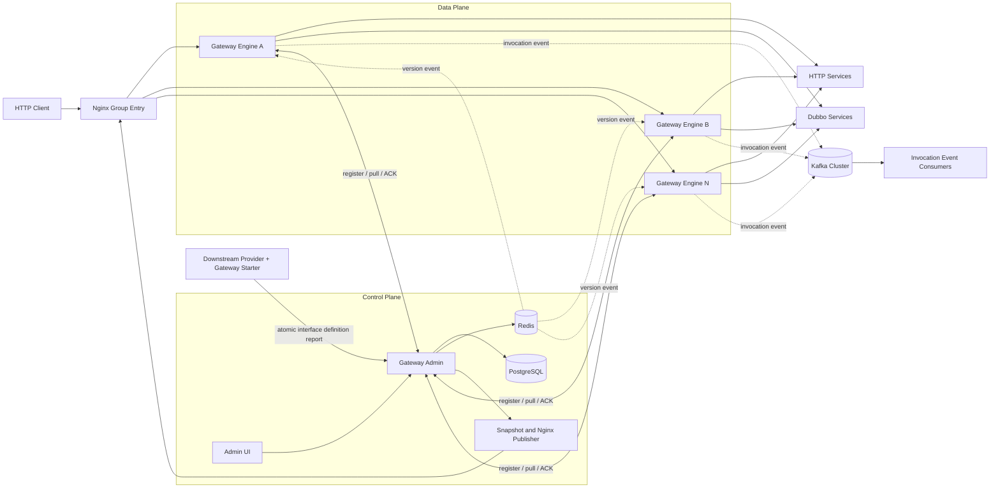
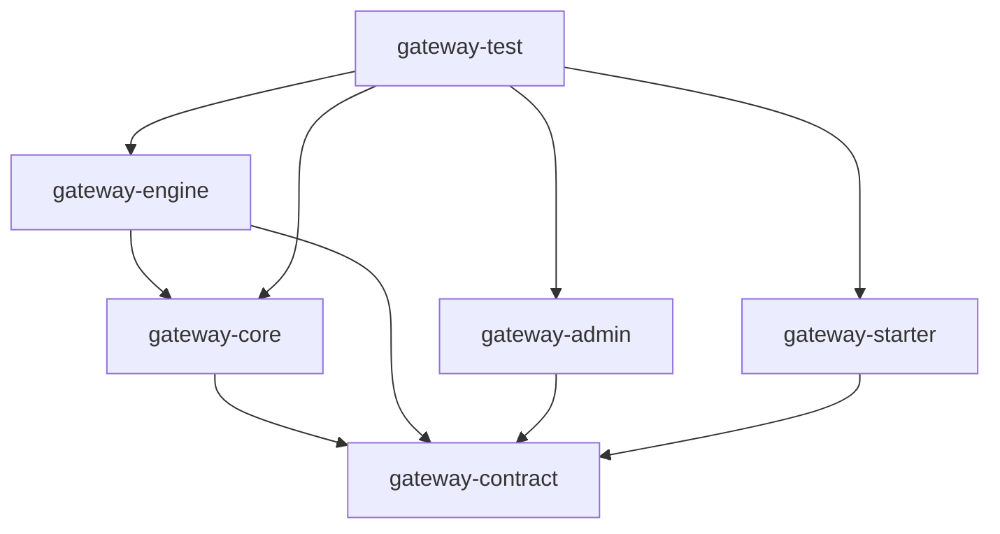
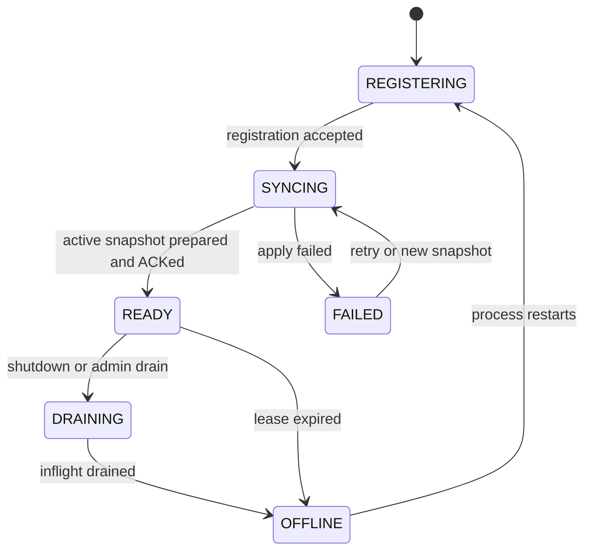
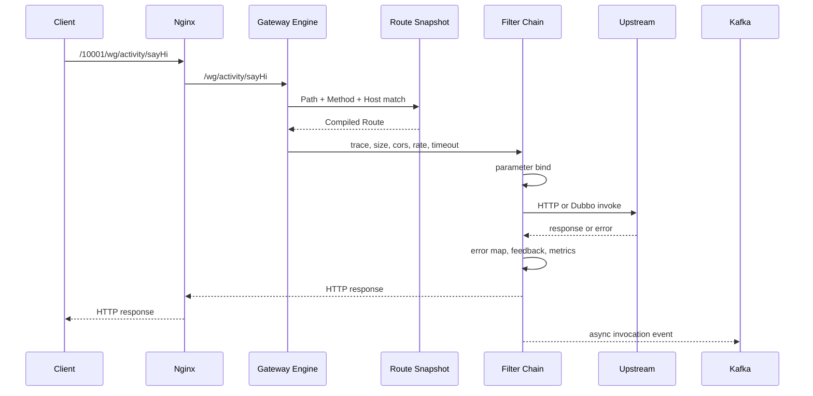
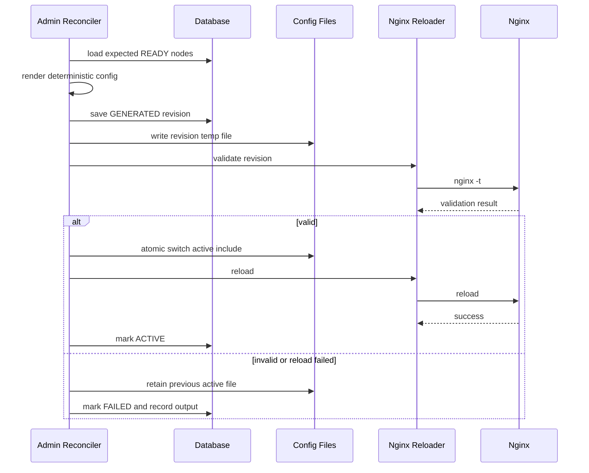

# 2026-07-24 Egon-COLA Gateway Platform 设计 Spec

状态：修订草案，等待用户审核。
文档性质：需求、功能点、技术方案和验收边界。
当前阶段：只写 Spec，尚未授权创建模块或实施代码。

## 1. 修订结论

### 1.1 本次纠偏

上一版把 Gateway 错误地收敛成了一个轻量级、仅支持本地配置和 Dubbo 泛化调用的 starter，这与用户要求不符。本次修订作废上一版的以下结论：

1. 作废“只建设数据面”的范围。
2. 作废“只使用本地 YAML 路由”的范围。
3. 作废“不建设控制台、注册中心和动态配置”的范围。
4. 作废“不管理 Nginx 动态负载”的范围。
5. 作废“只有 `core + starter + engine + test` 四个模块”的结构。
6. 作废“使用自研原生 Netty 替代 Spring Cloud Gateway”的路线。
7. 作废 JWT、Shiro 或其他网关鉴权设计。

修订后的项目是一套完整的网关平台，虽然归属于 `component` 工程，但必须按独立大型子系统设计，不能被其他轻量组件的目录或 starter 模式限制。

### 1.2 已确认的范围

| 决策 ID | 已确认内容 |
|---|---|
| DEC-001 | 原始 `gateway.md` 29 个章节的能力均进入需求追踪范围 |
| DEC-002 | 第 7、8 章的鉴权能力是唯一允许不实现的部分 |
| DEC-003 | 网关数据面基于 Spring Cloud Gateway WebFlux 扩展，不再自研完整 HTTP Server |
| DEC-004 | 必须支持一组或多组 Gateway，每组包含多个可独立伸缩的 Gateway Engine 节点 |
| DEC-005 | 必须建设独立的 `gateway-admin` 管理与控制面模块 |
| DEC-006 | 必须建设 `gateway-starter`，由下游 Provider 采集并上报接口定义 |
| DEC-007 | 必须建设 `gateway-test`，覆盖单元、集成、集群和端到端验证 |
| DEC-008 | 必须建设独立可执行的 Gateway Engine，并打包容器镜像 |
| DEC-009 | 必须完成数据库、配置聚合、配置拉取、Redis 通知、动态刷新、节点管理和 Nginx 动态负载闭环 |
| DEC-010 | 采用分层架构；Admin、Engine、Starter 各自按职责分层，禁止跨运行时共享内部实现 |
| DEC-011 | HTTP 和 Dubbo 都是首期正式上游类型；后续协议通过 Adapter SPI 扩展 |
| DEC-012 | Admin 是配置事实源；Redis Pub/Sub 只负责变更通知，不能成为唯一事实源 |
| DEC-013 | 同一 Gateway Group 的每个入口 Revision 必须显式选择一个已发布版本，目标节点均须已 PREPARED，禁止节点自行漂移 |
| DEC-014 | 审核通过前不创建模块、不改 POM、不引入依赖、不启动服务 |
| DEC-015 | Admin 是网关管理平台；Engine 是实际处理请求的网关，二者不得合并职责 |
| DEC-016 | Starter 只采集并上报下游 Provider 的接口定义，不采集、不上报任何接口调用 |
| DEC-017 | 接口调用事件由 Engine 在请求结束后异步发送到 Kafka 集群 |
| DEC-018 | 路由新版本先在 Engine 预备，再由 Nginx 内部版本头切流，避免同一 Group 在刷新窗口随机命中新旧路由 |

### 1.3 “全部实现”的定义

“覆盖原文能力”不是照搬原文每一行教学代码，而是：

1. 原文每个章节表达的业务能力都有明确需求 ID。
2. 每项能力都有所属模块、数据模型、接口、状态和异常处理方案。
3. 每项能力都有至少一条可执行的验收场景。
4. 原文中存在可靠性或安全问题的实现方式可以替换，但能力不能删除。
5. 除经确认豁免的鉴权外，不得以“后续版本”名义移除原文能力。
6. 原文没有闭环的地方，本方案必须补足版本、幂等、回滚、重试、ACK、Last-Known-Good 和故障恢复。

## 2. 文档依据

### 2.1 原始需求文档

```text
/Users/mario/SelfProject/blog/source/_posts/archtect/gateway.md
```

该文档共 29 章，描述了从 HTTP/RPC 协议转换逐步发展到注册中心、服务上报、管理后台、动态路由、Gateway 集群和 Nginx 动态负载的完整过程。

### 2.2 参考设计

- [用户提供的 PDai 网关设计文章](https://pdai.tech/md/arch/gateway/arch-gateway-mt-shepherd.html)
- [Spring Cloud Gateway 项目](https://spring.io/projects/spring-cloud-gateway)
- [Spring Cloud Gateway WebFlux Starter](https://docs.spring.io/spring-cloud-gateway/reference/4.3/spring-cloud-gateway-server-webflux/starter.html)
- [Spring Cloud Gateway Global Filters](https://docs.spring.io/spring-cloud-gateway/reference/spring-cloud-gateway-server-webflux/global-filters.html)
- [Spring Cloud Gateway CORS](https://docs.spring.io/spring-cloud-gateway/reference/spring-cloud-gateway-server-webflux/cors-configuration.html)
- [Apache Dubbo 泛化调用](https://dubbo.apache.org/en/overview/mannual/java-sdk/tasks/framework/more/generic-call/)

参考方案只用于技术选型和可靠性补强，不用于缩减原始 29 章的项目范围。

### 2.3 当前仓库技术基线

| 项目 | 当前基线 | 本项目处理 |
|---|---|---|
| Java | 21 | 保持 Java 21 |
| Spring Boot | 3.5.16 | Admin、Engine 和 Starter 基于此版本 |
| Spring Cloud | 2025.0.3 | 与 Spring Boot 3.5.x 对齐 |
| Spring Cloud Gateway | 4.3.5 | Engine 使用 WebFlux Server |
| Dubbo | 3.3.6 | Dubbo 上游适配器基线 |
| Micrometer | 1.15.x | 指标与 Observation |
| Redis | 由部署环境提供 | 路由快照缓存、通知、节点租约、限流 |
| Kafka | 由部署环境提供 | Engine 异步上报接口调用事件 |
| PostgreSQL | 推荐 16+ | Admin 持久化事实源 |
| Nginx | 推荐 1.26+ | 组级入口与节点负载均衡 |

注意：Spring Cloud 2025.0.x 与当前 Spring Boot 3.5.x 兼容，但该发布线已进入生命周期尾部。本项目先保持仓库 Boot 3.5 基线，不在 Gateway 子项目中单独升级到 Boot 4；后续全仓升级时再迁移 Spring Cloud Gateway 5.x。

## 3. 原文 29 章能力清单

| 章节 | 原始能力 | 修订后的实现归属 | 处理结论 |
|---|---|---|---|
| 1 | HTTP 请求会话协议处理 | Gateway Engine / Spring Cloud Gateway WebFlux | 完整实现 |
| 2 | 代理 RPC 泛化调用 | Gateway Core Dubbo Adapter | 完整实现 |
| 3 | 分治处理会话流程 | GlobalFilter、GatewayFilter、Invoker 分层处理链 | 完整实现 |
| 4 | 将 RPC、HTTP、其他连接抽象为数据源 | `UpstreamAdapter` SPI，首期 HTTP + Dubbo | 完整实现 |
| 5 | HTTP 请求参数解析 | 参数绑定模型和编译器 | 完整实现 |
| 6 | 执行器封装服务调用 | `GatewayExecutor` + `UpstreamInvoker` | 完整实现 |
| 7 | Shiro + JWT 权限认证 | 无 | 经用户确认不实现 |
| 8 | 网关会话鉴权处理 | 无 | 经用户确认不实现 |
| 9 | 网关注册中心服务创建 | Gateway Admin 控制面 | 完整实现 |
| 10 | 网关注册中心库表结构 | Admin PostgreSQL + Flyway | 完整实现并增强 |
| 11 | 注册 Gateway 算力节点 | 节点注册、租约、心跳、状态机 | 完整实现并增强 |
| 12 | 注册应用、接口、方法 | Admin 元数据注册 API | 完整实现并增强 |
| 13 | 服务发现和注册网关连接 | Engine 控制面客户端 | 完整实现并增强 |
| 14 | 网关映射聚合查询 | Group Route Snapshot 聚合服务 | 完整实现并增强 |
| 15 | 配置拉取和组件验证 | 拉取、校验、编译、原子生效、ACK | 完整实现并增强 |
| 16 | 网络通信配置提取 | Engine、Admin、Starter 类型化配置 | 完整实现 |
| 17 | 管理通信组件和映射 | Engine 生命周期与版本化路由仓库 | 完整实现并增强 |
| 18 | 容器关闭监听和异常管理 | Readiness、Drain、优雅停机、错误模型 | 完整实现并增强 |
| 19 | Engine 打包镜像部署 | Engine 可执行 JAR、OCI 镜像和 Compose | 完整实现 |
| 20 | Starter 采集下游接口定义 | 注解、Bean 扫描、元数据编译 | 完整实现并增强 |
| 21 | 下游接口定义注册到中心 | Starter 原子接口定义批次上报 | 完整实现并增强 |
| 22 | Redis 消息驱动映射刷新 | 版本事件、全量拉取、周期对账 | 完整实现并增强 |
| 23 | 网关运营管理后台 | Admin 后端 + Vue 3 管理界面 | 完整实现并增强 |
| 24 | 前后端分离 CORS | Admin 和 Engine 分别配置 CORS | 完整实现 |
| 25 | Nginx 负载模型 | Group Upstream 和路径前缀模型 | 完整实现 |
| 26 | 动态刷新 Nginx 配置 | 版本化生成、校验、原子切换、重载、回滚 | 完整实现并增强 |
| 27 | Gateway 节点动态负载 | 节点注册/下线触发 Nginx 对账 | 完整实现并增强 |
| 28 | 工程模块合并 | Gateway 大型 component 多模块工程 | 完整实现 |
| 29 | 算力关联、接口定义上报、调用反馈 | Group/Node/System 关联、Starter 开关、反馈头、Engine Kafka 调用事件 | 完整实现并增强 |

因此，本项目验收口径是“27 章能力完整实现 + 2 章鉴权能力明确豁免”，而不是只实现前 6 章。

## 4. 产品定义

### 4.1 产品定位

Gateway Platform 是 Egon-COLA 内可独立部署、可水平扩缩、可集中管理的 API 网关平台，负责：

1. 接收外部 HTTP 请求。
2. 根据已发布路由匹配目标服务。
3. 完成请求参数解析和类型绑定。
4. 通过 HTTP 或 Dubbo 泛化调用访问上游。
5. 应用超时、限流、熔断、日志、指标等网关治理能力。
6. 由 Admin 集中维护服务元数据、Gateway Group、节点、路由和发布版本。
7. 由 Starter 自动采集下游 Provider 的接口定义并上报 Admin。
8. 由 Redis 通知 Engine 拉取新版本并原子刷新。
9. 由 Admin 根据节点状态动态生成和发布 Nginx 负载配置。
10. 由 Engine 在每次已匹配路由的接口调用结束后异步发送调用事件到 Kafka 集群。
11. 由 Test 模块验证整套控制面、数据面、接口定义上报和调用事件上报闭环。

### 4.2 核心角色

| 角色 | 主要职责 |
|---|---|
| API 调用方 | 通过 `/groupId/**` 入口调用网关 |
| Gateway 管理员 | 管理 Group、节点、系统、接口、路由、发布和回滚 |
| 服务开发者 | 通过 Starter 注解声明并上报下游 Provider 接口定义 |
| Gateway Engine | 执行路由匹配、参数绑定、治理和上游调用 |
| Gateway Admin | 保存事实数据，生成版本化快照并管理节点/Nginx |
| Nginx | 将组级入口请求转发到同组已就绪 Engine 节点 |
| Kafka | 接收 Engine 产生的接口调用事件，供独立消费方处理 |
| 运维人员 | 部署、扩缩容、观察健康、处理发布失败和回滚 |

### 4.3 核心术语

| 术语 | 定义 |
|---|---|
| Gateway Group | 网关路由、容量和发布的最小隔离单元 |
| Gateway Node | 一个 Gateway Engine 进程实例 |
| Application System | 一个被网关代理的业务系统 |
| Interface | 业务系统中的服务接口 |
| Method Route | 一个可被 HTTP 入口匹配并调用的上游方法 |
| Route Draft | 尚未对数据面生效的可编辑路由定义 |
| Route Snapshot | 某 Group 在某个递增版本下的完整不可变路由集合 |
| Desired Version | Admin 已发布、要求 Engine 预备但尚未切流的目标版本 |
| Active Version | Nginx 当前通过内部版本头选择的 Group 路由版本 |
| Prepared Version | 某个 Gateway Node 已校验、编译并可随时服务的版本 |
| Effective Version | 已在要求的 Nginx 实例完成切流并达到发布成功条件的版本 |
| LKG | Engine 本地保存的 Last-Known-Good 路由快照 |
| Node Lease | Engine 持续心跳维持的节点存活租约 |
| Nginx Revision | 一次完整、可校验、可回滚的 Nginx 配置版本 |
| Interface Definition Report | Starter 将 Provider 的系统、接口、方法、参数和路由定义上报 Admin |
| Invocation Event | Engine 对一次已匹配路由调用产生的结果事件，通过 Kafka 异步发送 |

术语说明：本文遵从用户的业务称谓，把被 Engine 调用的 Provider 称为“下游 Provider”。Spring Cloud Gateway/Dubbo 的技术扩展类仍可采用业内常见的 `UpstreamAdapter` 命名，两者指向同一调用目标，不代表职责变化。

## 5. 目标、非目标与约束

### 5.1 业务目标

| ID | 目标 |
|---|---|
| BR-001 | 将外部 HTTP 请求统一代理到 HTTP 或 Dubbo 上游 |
| BR-002 | 用 Gateway Group 对路由和算力进行隔离 |
| BR-003 | 支持每个 Group 部署多个 Engine 节点并动态扩缩 |
| BR-004 | 下游 Provider 接口定义可由 Starter 自动发现上报，也可由 Admin 手工维护 |
| BR-005 | 路由配置通过审核、发布、ACK 和回滚形成可追踪闭环 |
| BR-006 | 变更消息丢失、Admin 短暂不可用或节点重启时仍可恢复 |
| BR-007 | Nginx 只向已就绪并 PREPARED 本次入口目标版本的节点转发 |
| BR-008 | 所有关键动作具备日志、指标、状态和审计记录 |
| BR-009 | Engine 可独立打包镜像并水平扩展 |
| BR-010 | 原始教程 29 章除鉴权外的能力都有测试和验收映射 |
| BR-011 | 每次已匹配路由的接口调用由 Engine 形成标准事件并异步发送到 Kafka |

### 5.2 明确不做

以下能力不是原文要求，也不进入本次首期范围：

1. JWT、Shiro、OAuth2、OIDC、API Key、用户登录和路由权限认证。
2. Admin 账号、角色、菜单权限和租户隔离。
3. 工作流审批系统；发布动作只有 Draft、Validate、Publish、Rollback 状态。
4. GraphQL 聚合、服务编排、BFF 脚本、动态 Groovy/Lua。
5. 上传第三方 JAR 并在运行期执行。
6. WebSocket、SSE 代理和通用 TCP/UDP 代理。
7. 文件分片上传、Multipart 大文件代理。
8. 商业 Nginx Plus 的专有能力；可以预留 Adapter。
9. 跨地域多活控制面和跨数据库双写。
10. Kubernetes Ingress Controller；首期入口明确为 Nginx。

“不做鉴权”不代表 Admin 可以暴露到公网。Admin、节点管理接口和 Nginx 重载接口必须部署在受信任的管理网络。

### 5.3 关键约束

1. Engine 使用 WebFlux/Reactor Netty，禁止引入 Servlet Server。
2. 任何 Dubbo 阻塞调用、数据库访问或文件 IO 都不得运行在 Netty EventLoop。
3. 路由发布必须是 Group 级全量快照，不允许逐条路由在节点上半生效。
4. 同一 Nginx Revision 必须为 Group 请求写入同一个 Active Version，Engine 必须按该版本完整选路。
5. Redis Pub/Sub 消息可以丢失，Engine 必须通过版本拉取和周期对账自愈。
6. Nginx 配置修改必须先验证再原子切换，不能直接覆盖生效文件。
7. Admin 数据库是事实源；Redis、Engine 本地文件和 Nginx 文件都是派生状态。
8. Starter 上报只更新元数据草稿，不得绕过发布流程直接修改线上路由。
9. Starter 只处理接口定义，不得依赖 Engine 调用链、Kafka Producer 或调用结果模型。
10. Kafka 调用事件发送不得阻塞请求响应，不得因 Kafka 故障放大为网关不可用。

## 6. 总体架构

### 6.1 运行时拓扑



### 6.2 控制面与数据面职责

| 能力 | Admin 控制面 | Engine 数据面 |
|---|---|---|
| 系统/接口/方法元数据 | 保存与管理 | 只消费编译结果 |
| 路由编辑 | 保存 Draft | 不允许本地编辑线上路由 |
| 路由校验 | 业务校验、冲突校验、快照生成 | 再次做运行时兼容校验 |
| 版本发布 | 生成版本并通知 | 拉取、编译、原子替换、ACK |
| 节点注册 | 维护节点和租约 | 主动注册与心跳 |
| Nginx | 生成、校验、发布、回滚 | 不直接修改 Nginx |
| 请求处理 | 不参与 | 匹配、过滤、绑定、调用、响应 |
| 上游连接 | 不持有 | 持有 HTTP Pool 和 Dubbo Reference |
| 接口定义上报 | 接收并形成 Draft | 不参与 |
| 接口调用事件 | 不通过 HTTP 接收逐次调用上报 | 请求结束后异步发送 Kafka |
| 本地容灾 | 不适用 | 保存并加载 LKG |

### 6.3 Gateway Group 模型

1. 一个 Group 对应一个对外路径前缀，例如 `/10001/**`。
2. 一个 Group 可以关联多个 Application System。
3. 一个 System 首期只能在同一环境中关联到一个 Group，避免同一路由多组写入产生歧义；后续如需多组灰度必须显式增加发布目标模型。
4. 一个 Group 可以包含多个 Gateway Node。
5. Group 的路由版本单调递增。
6. Group 下进入目标 Nginx Revision 的所有 `READY` Node 必须 ACK PREPARED 该版本。
7. 未 PREPARED 目标版本的新 Node 不进入对应 Nginx upstream。
8. 节点不是独立的路由分片；`group -> node -> system` 关联是 Group 分配关系在节点上的物化和审计。

### 6.4 关键架构选择

#### 6.4.1 为什么采用 Spring Cloud Gateway

Spring Cloud Gateway 已提供：

1. Reactor Netty HTTP Server。
2. Path、Method、Host 等路由 Predicate。
3. GlobalFilter 和 GatewayFilter 有序处理链。
4. HTTP 上游 Netty Client、连接池和流式转发。
5. CORS、请求体限制、限流、熔断、重试和指标扩展点。
6. `RouteDefinitionLocator`、路由刷新事件和 Actuator 观察能力。

本项目的价值放在平台控制面、版本化配置、Dubbo Adapter、参数绑定、集群发布和动态负载，不重复实现成熟的 HTTP Server。

#### 6.4.2 为什么保留 Gateway Core

Spring Cloud Gateway 只解决 HTTP 网关运行时，不解决：

1. Admin 路由模型到 SCG RouteDefinition 的编译。
2. Dubbo 泛化调用。
3. 多来源参数绑定。
4. Group Snapshot 版本校验。
5. 统一错误和调用反馈。
6. HTTP、Dubbo 及未来协议的统一 Adapter。

因此需要独立 Core，但 Core 是本项目内部核心库，不做成通用框架市场。

### 6.5 设计模式选择

| 模式 | 使用位置 | 解决的问题 |
|---|---|---|
| Adapter | `HttpUpstreamAdapter`、`DubboUpstreamAdapter` | 隔离不同上游协议 |
| Strategy | 参数转换、限流键、Nginx 发布驱动 | 已知变化点可配置替换 |
| Chain of Responsibility | GlobalFilter/GatewayFilter | 前置、调用、后置和短路处理 |
| Factory | 上游 Client/Reference 创建 | 按路由稳定创建并缓存连接资源 |
| Facade | `GatewayExecutor`、Admin Publish Service | 隐藏跨组件编排细节 |
| Repository | Admin 持久化、Engine Route Snapshot | 隔离存储和运行时模型 |
| State | Node、Snapshot、Publish Task、Nginx Revision | 约束合法状态迁移 |
| Transactional Outbox | 路由发布任务 | 避免数据库提交成功但 Redis 通知丢失 |
| Specification | 路由冲突和发布校验 | 组合可测试的发布规则 |

不采用以下模式：

1. 不使用抽象工厂层层创建简单 DTO。
2. 不使用模板方法建立深继承树；处理链优先组合。
3. 不使用动态代理隐藏路由业务流程。
4. 不把每个简单校验拆成独立类，只有可复用或可组合规则才使用 Specification。

## 7. 工程与模块设计

### 7.1 工程目录

建议在 `egon-cola-components` 下建立独立聚合工程：

```text
egon-cola-components/
└── egon-cola-component-gateway/
    ├── pom.xml
    ├── README.md
    ├── egon-cola-component-gateway-contract/
    ├── egon-cola-component-gateway-core/
    ├── egon-cola-component-gateway-engine/
    ├── egon-cola-component-gateway-admin/
    │   └── src/main/frontend/
    ├── egon-cola-component-gateway-starter/
    └── egon-cola-component-gateway-test/
```

这是一个大型 component 家族，不按其他轻量 component 的单 starter 结构压缩。

运行时模块边界：

1. `gateway-admin` 是管理平台，同时承接原文 `gateway-center` 的注册中心和配置中心能力，不再额外部署一个职责重叠的 Center 进程。
2. `gateway-engine` 就是实际网关进程；一个 Group 通过部署多个 Engine 实例形成 Gateway 集群。
3. `gateway-starter` 只部署在下游 Provider，用于接口定义上报。
4. `gateway-core` 和 `gateway-contract` 是内部库，不是独立运行服务。
5. `gateway-test` 是验证工程，不进入生产运行拓扑。

原文章节 28 的模块能力映射：

| 原模块 | 新模块 | 说明 |
|---|---|---|
| center | admin | 注册中心、配置中心并入管理平台后端 |
| admin | admin | 管理 API 和 Vue UI |
| core | core | 参数绑定、执行器、协议 Adapter |
| assist | engine | 节点注册、配置拉取、生命周期成为 Engine 内部应用层 |
| engine | engine | 可执行网关 |
| sdk | starter | 下游接口定义扫描和上报 |
| test | test | Provider、Client、Kafka Consumer 和 E2E |

### 7.2 模块职责

#### 7.2.1 `gateway-contract`

只放跨运行时稳定契约：

1. Group、Node、System、Interface、Method、Route Snapshot DTO。
2. 注册、心跳、拉取、ACK、批次上报请求与响应。
3. 路由类型、HTTP Method、参数来源、节点状态等枚举。
4. Starter 注解可以放在 contract 的独立 annotation 包，避免 Starter 扫描实现泄漏给 Provider 编译期。
5. 版本化 `GatewayInvocationEvent` 及其 JSON Schema。
6. JSON Schema/校验约束。

禁止放：

1. Admin Entity、Repository。
2. Engine Filter 或 Dubbo Client。
3. Spring MVC/WebFlux Controller。
4. 数据库或 Redis 实现。

#### 7.2.2 `gateway-core`

负责数据面协议无关的核心能力：

1. Route Snapshot 校验和编译。
2. 参数提取、转换和绑定。
3. `GatewayExecutor`。
4. `UpstreamAdapter`、`UpstreamRequest`、`UpstreamResponse` SPI。
5. Dubbo 泛化调用 Adapter。
6. HTTP 上游扩展元数据模型。
7. 错误码、异常映射和反馈头生成。
8. 调用结果到 `GatewayInvocationEvent` 的纯模型映射。
9. Client/Reference 生命周期管理。

#### 7.2.3 `gateway-engine`

独立可执行数据面：

1. Spring Cloud Gateway WebFlux Server。
2. Admin Client、节点注册、心跳、路由拉取、ACK。
3. Redis 版本事件订阅。
4. `VersionedRouteDefinitionLocator`。
5. GlobalFilter/GatewayFilter。
6. HTTP 转发和 Dubbo Routing Filter。
7. 本地 LKG。
8. Readiness、Drain、优雅停机。
9. Actuator、Micrometer 和访问日志。
10. 调用结束事件采集、有界缓冲和 Kafka 异步 Producer。
11. 可执行 JAR 和 Engine 镜像。

部署多个 Engine 实例即形成“一组 Gateway”；不需要复制工程模块。

#### 7.2.4 `gateway-admin`

独立可执行控制面：

1. Group、节点、系统、接口、方法、路由管理。
2. Starter 下游接口定义批次上报。
3. 路由校验、预览、发布、回滚和审计。
4. Engine 节点注册、租约、快照拉取和 ACK。
5. PostgreSQL 持久化与 Flyway。
6. Redis 快照缓存、Pub/Sub、租约和发布任务。
7. Nginx 配置生成、发布、回滚和状态。
8. Vue 3 管理界面。
9. Admin 镜像。

Admin 不依赖 Engine 实现；双方只通过 contract 约定的 HTTP/JSON 与 Redis 事件通信。

Admin 不接收 Engine 逐次调用上报。接口调用事件直接进入 Kafka，避免高吞吐调用流量穿过管理 API 或写入配置数据库。

#### 7.2.5 `gateway-starter`

Provider 侧轻量 SDK：

1. 启用配置和自动配置。
2. 扫描下游 Provider 中带网关注解的 Spring Bean。
3. 编译下游系统、接口、方法、参数和入口路由定义。
4. 启动后向 Admin 原子批次上报接口定义。
5. 本地元数据校验、幂等重报和退避重试。
6. 暴露上报健康和最后结果。

Starter 不启动 Gateway Server，不持有路由，不订阅路由版本，不观察业务调用，不发送调用结果，也不依赖 Kafka。

#### 7.2.6 `gateway-test`

测试专用，不发布到 BOM：

1. HTTP Provider Fixture。
2. Dubbo Provider Fixture。
3. Starter 接口定义上报 Fixture。
4. Gateway Client Fixture。
5. Kafka Invocation Event Consumer Fixture。
6. Admin、Redis、Kafka、PostgreSQL、Nacos、ZooKeeper、Nginx 和双 Engine 的 Testcontainers/Compose 环境。
7. 端到端、故障注入、动态发布和回滚测试。
8. 原文 29 章追踪验收测试。

### 7.3 依赖方向



约束：

1. `contract` 不依赖其他 Gateway 模块。
2. `core` 不依赖 Admin、Engine 或 Starter。
3. `admin` 不依赖 Core/Engine。
4. `starter` 不依赖 Core/Engine/Admin 实现。
5. `test` 是唯一可以聚合所有模块的模块。

### 7.4 分层架构

Admin：

```text
interfaces       REST Controller / UI API / DTO mapping
application      use case / transaction / publish orchestration
domain           aggregate / state / policy / repository port
infrastructure   JDBC / Redis / Nginx / HTTP / Flyway
bootstrap        Spring Boot configuration
```

Engine：

```text
transport        SCG routes / filters / HTTP exchange
application      register / pull / apply / ACK / reconcile
domain           snapshot / compiled route / node lifecycle
infrastructure   Admin client / Redis / disk LKG / Dubbo / HTTP
bootstrap        Spring Boot configuration
```

Engine 的 Kafka 调用事件上报属于 infrastructure，但采集点位于 transport 请求完成回调；应用层只接收不可变调用结果，不依赖 Kafka API。

Starter：

```text
annotation       provider-facing annotations
scanner          Bean and method metadata collection
application      validate interface definitions / batch / report / retry
infrastructure   Admin HTTP client / actuator contributor
autoconfigure    conditional configuration
```

## 8. 功能需求

### 8.1 Gateway 数据面

| ID | 功能需求 |
|---|---|
| FR-DP-001 | Engine 必须使用 Spring Cloud Gateway WebFlux 接收 HTTP/1.1 请求 |
| FR-DP-002 | 必须支持 GET、POST、PUT、PATCH、DELETE、HEAD、OPTIONS 路由 |
| FR-DP-003 | 必须同时使用 Path 和 HTTP Method 匹配路由 |
| FR-DP-004 | 必须支持可选 Host Predicate |
| FR-DP-005 | 必须支持 HTTP/HTTPS 上游 |
| FR-DP-006 | 必须支持 Dubbo 3 泛化调用上游 |
| FR-DP-007 | 必须支持 Path、Query、Header、Cookie、Body、Body Field、常量和网关上下文参数来源 |
| FR-DP-008 | 必须支持零参数、单参数、多参数、简单类型、集合和复杂对象 |
| FR-DP-009 | 参数缺失、格式错误、类型转换失败必须返回稳定错误 |
| FR-DP-010 | 一次请求只能匹配一个已发布路由；冲突配置不得发布 |
| FR-DP-011 | 必须支持前置、调用、后置过滤处理 |
| FR-DP-012 | 必须支持请求大小、超时、并发、限流、熔断和响应大小保护 |
| FR-DP-013 | 必须产生 Trace ID、访问日志和 Micrometer 指标 |
| FR-DP-014 | 必须返回可配置的节点、Group、Route 和配置版本反馈头 |
| FR-DP-015 | 必须在不重启 Engine 的情况下原子切换路由版本 |
| FR-DP-016 | 不得在 EventLoop 上执行阻塞 RPC、磁盘或控制面 HTTP 操作 |
| FR-DP-017 | 每次已匹配路由的调用结束后，Engine 必须构造并异步提交调用事件 |

### 8.2 Admin 控制面

| ID | 功能需求 |
|---|---|
| FR-AD-001 | 管理 Gateway Group |
| FR-AD-002 | 查询、禁用、Drain 和下线 Gateway Node |
| FR-AD-003 | 管理 Application System、Interface 和 Method |
| FR-AD-004 | 接收 Starter 的下游接口定义原子批次上报 |
| FR-AD-005 | 支持手工创建和编辑服务元数据，不强制依赖 Starter |
| FR-AD-006 | 管理 Group 与 System 分配关系 |
| FR-AD-007 | 根据分配关系聚合 Group 完整路由 |
| FR-AD-008 | 校验路径、方法、参数、上游、引用和冲突 |
| FR-AD-009 | 预览标准化路由快照和与当前版本的差异 |
| FR-AD-010 | 发布不可变、单调递增的 Group Snapshot |
| FR-AD-011 | 展示节点 Prepared/Serving Version 和 ACK 状态 |
| FR-AD-012 | 支持回滚到任意仍被保留的历史有效快照 |
| FR-AD-013 | 生成、预览、验证、发布和回滚 Nginx 配置 |
| FR-AD-014 | 记录元数据、分配、发布、回滚、节点和 Nginx 审计 |
| FR-AD-015 | 提供 Vue 管理页面和跨域配置 |

### 8.3 Gateway 节点与集群

| ID | 功能需求 |
|---|---|
| FR-CL-001 | Engine 启动时向 Admin 注册唯一 Node |
| FR-CL-002 | Node 必须归属一个 Group |
| FR-CL-003 | Node 必须按租约周期发送心跳 |
| FR-CL-004 | Admin 必须识别 REGISTERING、SYNCING、READY、DRAINING、OFFLINE、FAILED 状态 |
| FR-CL-005 | 新 Node 必须先预备 Group Active Version，再进入 READY |
| FR-CL-006 | 只有 READY 且已预备 Active Version 的节点可进入对应 Nginx upstream |
| FR-CL-007 | Node 下线、租约过期或版本落后必须触发负载配置对账 |
| FR-CL-008 | 同一 Group 的节点不得各自选择不同路由子集 |
| FR-CL-009 | Group 扩缩容不得要求重新发布路由 |
| FR-CL-010 | Engine 优雅关闭必须先 Drain、等待在途请求，再注销节点 |

### 8.4 路由分发

| ID | 功能需求 |
|---|---|
| FR-CFG-001 | Admin 数据库是路由事实源 |
| FR-CFG-002 | 每次发布生成 Group 全量快照 |
| FR-CFG-003 | 快照必须包含 version、checksum、schemaVersion 和 generatedAt |
| FR-CFG-004 | 发布任务必须持久化，进程崩溃后可继续 |
| FR-CFG-005 | Redis 必须缓存各版本快照、维护 Desired Version 指针并发布轻量版本事件 |
| FR-CFG-006 | Engine 收到事件后必须通过 Admin 或 Redis 拉取完整快照 |
| FR-CFG-007 | Engine 必须校验 schema、Group、version、checksum、引用和运行时支持 |
| FR-CFG-008 | 全部路由编译成功后才能把新版本加入节点的 Prepared Snapshot 集合 |
| FR-CFG-009 | 任一路由预备失败或 Nginx 切流失败时旧 Active Version 必须继续服务 |
| FR-CFG-010 | Engine 必须对 Admin ACK PREPARED/REJECTED/ACTIVATED 及原因 |
| FR-CFG-011 | Engine 必须周期查询版本，修复 Pub/Sub 消息丢失 |
| FR-CFG-012 | Engine 必须持久化 LKG 并支持 Admin 不可用时启动 |
| FR-CFG-013 | 回滚必须生成新的发布版本并引用历史快照内容，版本号不得倒退 |

### 8.5 Starter

| ID | 功能需求 |
|---|---|
| FR-ST-001 | Starter 通过显式 `enabled` 开关启用，默认关闭 |
| FR-ST-002 | 采集下游 Provider 的应用系统、接口、方法、HTTP 路径、HTTP Method 和参数映射定义 |
| FR-ST-003 | 必须支持同一 Bean 多接口场景，通过注解显式指定接口 |
| FR-ST-004 | 本地存在重复路由、缺失类型或不支持参数时启动阶段报告明确错误 |
| FR-ST-005 | 一次启动采集到的全部接口定义必须作为一个原子 Interface Definition Report Batch 上报 |
| FR-ST-006 | 重复上报同一指纹必须幂等 |
| FR-ST-007 | 上报失败按有界指数退避重试，不阻止 Provider 提供业务服务 |
| FR-ST-008 | 新上报只更新 Draft，不自动发布 |
| FR-ST-009 | 必须暴露最后上报时间、批次 ID、指纹和状态 |
| FR-ST-010 | Starter 不得采集调用次数、调用结果、耗时或错误，也不得连接 Kafka |

### 8.6 Nginx 动态负载

| ID | 功能需求 |
|---|---|
| FR-LB-001 | 外部入口使用 `/{groupId}/**` |
| FR-LB-002 | Nginx 按 Group 维护独立 upstream |
| FR-LB-003 | 转发前去掉第一段 Group 前缀 |
| FR-LB-004 | upstream 只包含 READY 且版本一致的 Node |
| FR-LB-005 | 节点注册、就绪、Drain、离线和地址/权重变化触发防抖对账 |
| FR-LB-006 | Admin 必须生成完整、确定性、版本化的 Nginx 配置 |
| FR-LB-007 | 新配置必须经过 `nginx -t` 或等价验证 |
| FR-LB-008 | 验证成功后才能原子切换并 reload |
| FR-LB-009 | reload 失败必须保留旧配置并记录失败 |
| FR-LB-010 | 必须支持回滚到上一个成功 Nginx Revision |
| FR-LB-011 | 禁止把 Docker Socket 暴露给 Admin |
| FR-LB-012 | Nginx 必须覆盖写入内部 Route Version Header，Engine 依据该版本选择已预备快照 |

### 8.7 Engine 调用事件上报

| ID | 功能需求 |
|---|---|
| FR-EVT-001 | 调用事件必须由处理请求的 Engine 生成，Starter 和 Admin API 不参与逐次上报 |
| FR-EVT-002 | 每个已匹配 Route 的成功、上游失败、超时、熔断、限流和客户端取消都必须形成事件 |
| FR-EVT-003 | 事件必须发送到配置的 Kafka Cluster 和版本化 Topic |
| FR-EVT-004 | Kafka 发送必须与 HTTP 响应解耦，不得等待 Broker ACK 后再返回调用方 |
| FR-EVT-005 | 事件必须包含唯一 eventId、traceId、Group、Route、Node、Snapshot Version、下游接口标识、结果和耗时 |
| FR-EVT-006 | 事件不得包含请求/响应 Body、Authorization、Cookie、Registry 凭据和未脱敏敏感 Header |
| FR-EVT-007 | Producer 必须启用 `acks=all`、幂等 Producer、有界缓冲、重试和发送结果指标 |
| FR-EVT-008 | Kafka 故障不得导致接口调用失败；缓冲溢出必须按明确策略处理并告警 |
| FR-EVT-009 | 已进入本地 spool 的事件按 at-least-once 交付，消费方必须按 eventId 幂等；强杀窗口和容量溢出风险必须显式可观测 |
| FR-EVT-010 | Kafka Topic 不由 Engine 在生产环境自动创建，部署前必须完成分区、副本和保留策略配置 |

### 8.8 生命周期与部署

| ID | 功能需求 |
|---|---|
| FR-OPS-001 | Engine 和 Admin 均提供可执行 JAR |
| FR-OPS-002 | Engine 和 Admin 均提供 OCI 镜像 |
| FR-OPS-003 | Test 提供包含双 Engine 的完整 Compose 环境 |
| FR-OPS-004 | Engine 启动失败必须区分配置失败、控制面失败、Redis 失败和上游初始化失败 |
| FR-OPS-005 | Engine 必须支持仅凭 LKG 降级启动 |
| FR-OPS-006 | Engine 关闭必须停止接流、等待请求、停止心跳、注销节点、释放连接 |
| FR-OPS-007 | Admin 关闭必须停止领取新发布任务并完成或安全释放已领取任务 |
| FR-OPS-008 | 各进程必须提供 liveness、readiness 和 startup 健康状态 |
| FR-OPS-009 | Engine 关闭时必须在限定时间内刷新 Kafka 调用事件缓冲并关闭 Producer |

## 9. 非功能需求

### 9.1 性能

| ID | 指标 |
|---|---|
| NFR-PERF-001 | HTTP 纯转发时网关自身 P99 增量目标小于 20ms，测试环境需记录硬件和并发条件 |
| NFR-PERF-002 | Route Snapshot 包含 10,000 条路由时，校验与编译目标小于 10 秒 |
| NFR-PERF-003 | 路由切换不停止接收请求，不产生半版本窗口 |
| NFR-PERF-004 | Engine EventLoop 阻塞检测不得发现控制面、磁盘、Kafka Client 或同步 Dubbo 调用 |
| NFR-PERF-005 | HTTP 请求和响应默认上限 10 MiB，可按 Route 收紧 |

性能指标是验收目标，不是脱离测试环境的绝对承诺。实施阶段必须提供基准脚本和报告格式。

### 9.2 可用性

1. Admin 或 Redis 暂时不可用时，已运行 Engine 继续使用当前版本处理请求。
2. Engine 重启时，若 Admin 不可用但 LKG 合法，可进入 `DEGRADED_READY`。
3. 单个 Engine Prepare 失败不影响其他节点；失败节点可继续服务旧 Active Version，但不得进入新版本 upstream。
4. 发布任务可重试且幂等。
5. Nginx reload 失败不覆盖上一个成功版本。
6. Pub/Sub 消息丢失通过周期对账恢复。
7. Kafka 不可用时请求链继续服务，调用事件进入有界缓冲/spool 并产生健康降级。

### 9.3 一致性

1. 管理元数据允许最终一致。
2. 单次数据库元数据写入必须事务一致。
3. Group Active Snapshot 是不可变对象。
4. Engine Prepare、默认版本 Activate 和版本 Retire 都是节点内原子状态变更。
5. Group 内接流量节点必须版本一致。
6. Nginx upstream 与 Node READY/Applied 状态最终一致，默认 10 秒内完成对账。

### 9.4 可维护性

1. 所有外部协议 DTO 在 contract 中版本化。
2. 快照包含 `schemaVersion`，不兼容时 Engine 拒绝应用。
3. Route 编译规则必须有独立单元测试。
4. Admin UI 不直接拼接数据库字段，全部调用稳定 Admin API。
5. 任何新增上游协议通过 Adapter 扩展，不在 Executor 内增加大段 `if/else`。

## 10. 领域模型与不变量

### 10.1 Group

字段：

| 字段 | 含义 |
|---|---|
| `groupId` | 稳定业务标识，例如 `10001` |
| `groupName` | 管理显示名称 |
| `environment` | `dev/test/staging/prod` |
| `entryPrefix` | 默认等于 `/{groupId}` |
| `status` | `ENABLED/DISABLED` |
| `desiredVersion` | 已发布并要求 Engine 预备的版本 |
| `activeVersion` | 当前 Nginx 版本头选择的版本 |
| `effectiveVersion` | 所有要求入口完成切流确认的版本 |
| `minReadyNodes` | 最少就绪节点数 |

不变量：

1. 同一 environment 内 `groupId` 唯一。
2. `desiredVersion` 单调增加；回滚也创建新版本。
3. Disabled Group 不生成对外 Nginx location。
4. Group 至少有 `minReadyNodes` 个 Node ACK PREPARED 后才能发起 Nginx 切流。
5. `activeVersion` 只在目标 Nginx Revision 通过验证并开始切流时更新。
6. `effectiveVersion` 只在要求的 Nginx 实例全部 ACK 后更新。

### 10.2 Node

节点状态机：



新 Desired Version 的预备不改变健康 Node 的生命周期状态。Node 继续以 READY 服务旧 Active Version，同时配置同步状态独立变化：

```text
IN_SYNC -> PREPARING -> PREPARED
                   \-> REJECTED
PREPARED -> IN_SYNC after Nginx activation
```

不变量：

1. `nodeId` 是配置或启动生成后持久化的稳定 UUID，不能只使用 IP。
2. `advertisedHost:advertisedPort` 必须可被 Nginx 访问。
3. `groupId` 在一次进程生命周期内不可变化。
4. 只有 `READY` 且持有 Nginx 目标版本 Prepared Snapshot 的节点进入 upstream。
5. 心跳不能把 `FAILED` 节点直接提升为 `READY`。
6. 新版本预备失败时，只要旧 Active Version 仍可用，Node 保持 READY 但配置同步状态为 REJECTED，不参与新版本切流。

### 10.3 System、Interface、Method Route

关系：

```text
ApplicationSystem 1 --- N ApplicationInterface
ApplicationInterface 1 --- N MethodRoute
GatewayGroup N --- N ApplicationSystem
```

System 类型：

- `HTTP`
- `DUBBO`

Method Route 包含两部分：

1. Inbound：Path、HTTP Method、Host、参数来源、过滤策略。
2. Upstream：HTTP URI/方法或 Dubbo registry/interface/method/version/group/protocol。

### 10.4 Snapshot

快照状态：

```text
DRAFT -> VALIDATING -> PUBLISHING -> PUBLISHED -> PREPARED -> ACTIVATING -> EFFECTIVE
                     \-> FAILED        \-> PARTIAL       \-> FAILED
EFFECTIVE -> SUPERSEDED
历史内容 --rollback--> 新版本 PUBLISHING
```

不变量：

1. 一旦进入 `PUBLISHING`，快照内容不可修改。
2. 每个 Group 同时只有一个 Active Version，但可以额外保留一个 Desired Prepared Version 和历史过渡版本。
3. 回滚不会重新激活旧版本号，而是复制旧内容生成新版本。
4. 校验和基于规范化 JSON 的 SHA-256。

## 11. 数据模型

### 11.1 存储选择

推荐 PostgreSQL 16+ 作为 Admin 事实源，原因：

1. 事务和唯一约束稳定。
2. JSONB 适合保存参数映射、Filter 配置和不可变快照。
3. `FOR UPDATE SKIP LOCKED` 可用于可靠领取发布任务。
4. Flyway 与当前 Spring Boot 体系成熟。

首期只保证 PostgreSQL，不承诺 MySQL 双方言。原文 MySQL 表表达的领域能力全部保留，但按当前平台可靠性要求重新建模。

### 11.2 表清单

#### 11.2.1 `gateway_group`

| 列 | 类型 | 约束 |
|---|---|---|
| `id` | bigint | PK |
| `group_id` | varchar(64) | not null |
| `group_name` | varchar(128) | not null |
| `environment` | varchar(32) | not null |
| `entry_prefix` | varchar(256) | not null |
| `status` | varchar(32) | not null |
| `desired_version` | bigint | not null default 0 |
| `active_version` | bigint | not null default 0 |
| `effective_version` | bigint | not null default 0 |
| `min_ready_nodes` | integer | not null default 1 |
| `revision` | bigint | optimistic lock |
| `created_at/updated_at` | timestamptz | not null |

唯一键：`(environment, group_id)`、`(environment, entry_prefix)`。

#### 11.2.2 `gateway_node`

| 列 | 类型 | 说明 |
|---|---|---|
| `id` | bigint | PK |
| `node_id` | uuid | 稳定节点标识 |
| `group_id` | bigint | FK `gateway_group.id` |
| `advertised_host` | varchar(255) | Nginx 可访问地址 |
| `advertised_port` | integer | Engine 端口 |
| `management_host/port` | varchar/int | 可选管理地址 |
| `status` | varchar(32) | Node 状态 |
| `prepared_version` | bigint | 最新已预备版本 |
| `serving_version` | bigint | 直接访问时的默认服务版本 |
| `desired_version` | bigint | 应预备版本 |
| `weight` | integer | Nginx 权重，默认 1 |
| `started_at` | timestamptz | 启动时间 |
| `last_heartbeat_at` | timestamptz | DB 投影时间 |
| `lease_expires_at` | timestamptz | 租约过期时间 |
| `metadata` | jsonb | zone、image、commit 等 |
| `failure_reason` | text | 最近失败原因 |

唯一键：`node_id`；地址索引：`(group_id, advertised_host, advertised_port)`。

#### 11.2.3 `gateway_application_system`

| 列 | 类型 | 说明 |
|---|---|---|
| `id` | bigint | PK |
| `system_id` | varchar(128) | 业务稳定 ID |
| `system_name` | varchar(128) | 名称 |
| `environment` | varchar(32) | 环境 |
| `upstream_type` | varchar(32) | HTTP/DUBBO |
| `base_uri` | varchar(1024) | HTTP 可用 |
| `registry_address` | varchar(1024) | Dubbo 可用 |
| `registry_type` | varchar(32) | nacos/zookeeper |
| `status` | varchar(32) | DRAFT/ACTIVE/DISABLED |
| `source` | varchar(32) | MANUAL/STARTER |
| `metadata` | jsonb | 扩展配置 |
| `revision` | bigint | optimistic lock |

唯一键：`(environment, system_id)`。

#### 11.2.4 `gateway_application_interface`

| 列 | 类型 | 说明 |
|---|---|---|
| `id` | bigint | PK |
| `system_id` | bigint | FK |
| `interface_id` | varchar(256) | 稳定逻辑 ID |
| `interface_name` | varchar(512) | Java FQCN 或 HTTP resource 名 |
| `version` | varchar(64) | Dubbo 版本 |
| `group_name` | varchar(64) | Dubbo group |
| `status` | varchar(32) | 状态 |
| `metadata` | jsonb | 扩展 |

唯一键：`(system_id, interface_id)`。

#### 11.2.5 `gateway_method_route`

主要列：

| 列 | 类型 | 说明 |
|---|---|---|
| `id` | bigint | PK |
| `interface_id` | bigint | FK |
| `route_id` | varchar(256) | 全环境稳定路由 ID |
| `method_name` | varchar(256) | 上游方法名 |
| `inbound_path` | varchar(1024) | 标准化入口 Path |
| `inbound_method` | varchar(16) | HTTP Method |
| `inbound_host` | varchar(255) | 可空 |
| `upstream_definition` | jsonb | HTTP/Dubbo 目标 |
| `parameter_bindings` | jsonb | 有序参数绑定 |
| `filter_definition` | jsonb | 超时、限流、熔断、Rewrite 等 |
| `response_definition` | jsonb | 响应和反馈配置 |
| `status` | varchar(32) | DRAFT/ACTIVE/DISABLED |
| `source` | varchar(32) | MANUAL/STARTER |
| `source_fingerprint` | varchar(64) | Starter 幂等 |
| `revision` | bigint | optimistic lock |

唯一键：`route_id`。
发布时另校验 `(group, host, method, normalizedPath)` 冲突。

#### 11.2.6 `gateway_group_system`

保存原文“算力组关联应用系统”能力：

| 列 | 类型 | 说明 |
|---|---|---|
| `group_id` | bigint | FK |
| `system_id` | bigint | FK |
| `status` | varchar(32) | ACTIVE/DISABLED |
| `assigned_at` | timestamptz | 分配时间 |

联合主键：`(group_id, system_id)`。

#### 11.2.7 `gateway_node_system`

保存原文 `groupId -> gatewayId -> systemId` 的物化关联：

| 列 | 类型 | 说明 |
|---|---|---|
| `node_id` | bigint | FK |
| `system_id` | bigint | FK |
| `group_id` | bigint | 冗余校验 |
| `source_assignment_revision` | bigint | 来源版本 |
| `status` | varchar(32) | ACTIVE/STALE |

联合主键：`(node_id, system_id)`。

该表由 Group 分配关系自动同步，不允许运营人员把同一 Group 内节点任意分片，否则 Nginx 轮询会产生同路径随机 404。

#### 11.2.8 `gateway_route_snapshot`

| 列 | 类型 | 说明 |
|---|---|---|
| `id` | bigint | PK |
| `group_id` | bigint | FK |
| `version` | bigint | Group 内递增 |
| `schema_version` | integer | 快照 Schema |
| `checksum` | char(64) | SHA-256 |
| `content` | jsonb | 完整规范化快照 |
| `status` | varchar(32) | Snapshot 状态 |
| `source_version` | bigint | 回滚时记录来源 |
| `created_by` | varchar(128) | 操作来源 |
| `created_at/published_at` | timestamptz | 时间 |

唯一键：`(group_id, version)`、`(group_id, checksum)` 可按需求允许历史同内容重发；推荐后者只建普通索引。

#### 11.2.9 `gateway_publish_task`

同时承担 Durable Outbox：

| 列 | 类型 | 说明 |
|---|---|---|
| `id` | bigint | PK |
| `task_id` | uuid | 外部任务 ID |
| `group_id/version` | bigint | 发布目标 |
| `task_type` | varchar(32) | ROUTE_PUBLISH/NODE_RECONCILE/NGINX_PUBLISH |
| `status` | varchar(32) | PENDING/RUNNING/SUCCEEDED/PARTIAL/FAILED |
| `attempts` | integer | 次数 |
| `next_attempt_at` | timestamptz | 重试时间 |
| `locked_by/locked_at` | varchar/timestamptz | Worker 租约 |
| `last_error` | text | 脱敏错误 |
| `payload` | jsonb | 任务数据 |

#### 11.2.10 `gateway_node_config_ack`

| 列 | 类型 | 说明 |
|---|---|---|
| `node_id` | bigint | FK |
| `group_id` | bigint | FK |
| `version` | bigint | 版本 |
| `status` | varchar(32) | PREPARED/REJECTED/ACTIVATED/RETIRED |
| `checksum` | char(64) | 节点确认值 |
| `acknowledged_at` | timestamptz | ACK 时间 |
| `duration_ms` | bigint | 应用耗时 |
| `reason_code/reason_detail` | varchar/text | 失败信息 |

唯一键：`(node_id, version)`。

#### 11.2.11 `gateway_registration_batch`

| 列 | 类型 | 说明 |
|---|---|---|
| `batch_id` | uuid | PK |
| `system_id` | varchar(128) | 上报系统 |
| `environment` | varchar(32) | 环境 |
| `instance_id` | varchar(128) | Provider 实例 |
| `fingerprint` | char(64) | 规范化内容指纹 |
| `content` | jsonb | 原始批次 |
| `status` | varchar(32) | RECEIVED/APPLIED/REJECTED |
| `failure_reason` | text | 原因 |
| `reported_at/applied_at` | timestamptz | 时间 |

唯一键：`(system_id, environment, fingerprint)`。

#### 11.2.12 `gateway_nginx_revision`

| 列 | 类型 | 说明 |
|---|---|---|
| `revision` | bigint | PK |
| `environment` | varchar(32) | 环境 |
| `route_version` | bigint | 该配置选择的 Group 路由版本；多 Group 文件时为 jsonb 映射 |
| `checksum` | char(64) | 配置校验和 |
| `content` | text | 生成配置 |
| `status` | varchar(32) | GENERATED/VALIDATED/ACTIVE/FAILED/ROLLED_BACK |
| `trigger_type` | varchar(32) | NODE/ADMIN/RECONCILE |
| `validation_output` | text | 脱敏后的 `nginx -t` 输出 |
| `previous_revision` | bigint | 前版本 |
| `created_at/activated_at` | timestamptz | 时间 |

#### 11.2.13 `gateway_nginx_instance_ack`

| 列 | 类型 | 说明 |
|---|---|---|
| `revision` | bigint | FK |
| `instance_id` | varchar(128) | Nginx/reloader 稳定实例 ID |
| `status` | varchar(32) | VALIDATED/ACTIVE/FAILED |
| `checksum` | char(64) | 实例实际加载校验和 |
| `validated_at/activated_at` | timestamptz | 时间 |
| `failure_reason` | text | 脱敏错误 |

唯一键：`(revision, instance_id)`。

#### 11.2.14 `gateway_audit_log`

保存：

1. 资源类型与 ID。
2. 操作类型。
3. 请求 ID。
4. 操作来源：UI、STARTER、ENGINE、SYSTEM。
5. 变更前后摘要。
6. 结果与失败原因。
7. 时间和调用方网络信息。

本期没有用户鉴权，所以 `actor` 是显式请求头/系统实例提供的审计标签，不代表可信身份。生产环境只能通过受控管理网络访问。

#### 11.2.15 调用事件不进入 Admin 配置库

逐次接口调用不新增 PostgreSQL 明细表：

1. 调用事件由 Engine 直接发送 Kafka。
2. Admin 内部 API 不提供 `/invocations/report` 一类入口。
3. Starter Registration Batch 与 Invocation Event 是两个完全独立的契约。
4. PostgreSQL 只保存配置、发布、节点、注册批次、Nginx 和管理审计数据。
5. Kafka 消费、长期明细和调用聚合需要独立分析存储时再按数据量设计。

### 11.3 Flyway 规则

1. Gateway Admin 是全新数据库域，实现时新增一个初始 Gateway 平台迁移文件。
2. 不修改仓库任何已有 Flyway migration。
3. 后续每次 Schema 变化只追加新版本。
4. 初始迁移必须包含表、唯一约束、外键、检查约束和必要索引。
5. Test 必须验证空库迁移、重复启动和 migration validate。

## 12. Admin 控制面技术方案

### 12.1 技术栈

| 层 | 推荐 |
|---|---|
| Backend | Spring Boot 3.5.x + Spring MVC |
| Persistence | Spring JDBC 或 Spring Data JDBC |
| Migration | Flyway |
| Database | PostgreSQL |
| Redis | Spring Data Redis / Lettuce |
| Validation | Jakarta Validation + Domain Specification |
| Frontend | Vue 3 + TypeScript + Vite |
| UI library | Element Plus |
| API schema | OpenAPI 3 |
| Metrics | Actuator + Micrometer |

Admin 使用 MVC 是因为它主要执行数据库、发布和管理请求，不与 Engine 的 WebFlux 数据面共享线程模型。禁止为了“统一技术栈”把 Admin 与 Engine 合并进一个进程。

### 12.2 Admin 用例

#### 12.2.1 Group 管理

支持：

1. 新建 Group。
2. 修改名称、入口前缀、最少就绪节点数。
3. 启用/禁用 Group。
4. 查询 Active/Effective Version。
5. 查询节点和系统分配。
6. 触发对账。

不支持直接修改版本号。

#### 12.2.2 系统和接口管理

支持：

1. 手工创建 HTTP 或 Dubbo System。
2. Starter 下游接口定义批次上报创建或更新 Draft。
3. 查看本次上报与上次上报差异。
4. 启用、禁用 Interface/Method。
5. 删除 Draft；已进入历史快照的记录只能逻辑禁用。
6. 配置参数绑定和治理策略。

#### 12.2.3 算力关联

运营人员执行的是“System 分配到 Group”，Admin 在事务中：

1. 写 `gateway_group_system`。
2. 为该 Group 当前 Node 物化 `gateway_node_system`。
3. 标记 Group Draft 已变更。
4. 不自动发布。

新 Node 注册时，Admin 自动为其补齐该 Group 全部 System 物化关系。

#### 12.2.4 发布

发布前必须：

1. 加载 Group 全部 Active System/Interface/Method Draft。
2. 规范化路径、Method、Host 和上游定义。
3. 检测路由冲突。
4. 校验每个参数来源和目标类型。
5. 校验 HTTP URI 或 Dubbo registry/interface/method。
6. 校验 Filter 配置和上下限。
7. 生成完整快照、diff、checksum。
8. 要求操作者显式确认发布 API。

#### 12.2.5 回滚

1. 选择历史 Effective Snapshot。
2. 重新执行当前 Schema 校验。
3. 复制内容生成新版本。
4. 走完整发布、通知、Prepare、Nginx Activate 和 ACK 流程。
5. 不直接把 `activeVersion` 改小。

### 12.3 Admin API

统一前缀：

```text
/api/gateway-admin/v1
```

#### 12.3.1 管理 API

| Method | Path | 用途 |
|---|---|---|
| POST | `/groups` | 创建 Group |
| GET | `/groups` | 分页查询 Group |
| GET | `/groups/{groupId}` | Group 详情 |
| PUT | `/groups/{groupId}` | 修改 Group |
| POST | `/groups/{groupId}/enable` | 启用 |
| POST | `/groups/{groupId}/disable` | 禁用 |
| GET | `/groups/{groupId}/nodes` | 查询 Node |
| GET | `/groups/{groupId}/systems` | 查询分配 |
| PUT | `/groups/{groupId}/systems/{systemId}` | 分配 System |
| DELETE | `/groups/{groupId}/systems/{systemId}` | 解除分配 |
| POST | `/groups/{groupId}/validate` | 校验 Draft |
| GET | `/groups/{groupId}/preview` | 预览标准化快照 |
| POST | `/groups/{groupId}/publish` | 发布 |
| GET | `/groups/{groupId}/publishes` | 发布历史 |
| GET | `/groups/{groupId}/publishes/{version}` | 版本详情和 ACK |
| POST | `/groups/{groupId}/rollback` | 回滚历史内容为新版本 |
| POST | `/groups/{groupId}/reconcile` | 路由/节点/Nginx 对账 |

系统元数据：

| Method | Path | 用途 |
|---|---|---|
| POST | `/systems` | 手工创建 System |
| GET | `/systems` | 查询 |
| GET | `/systems/{systemId}` | 详情 |
| PUT | `/systems/{systemId}` | 修改 |
| POST | `/systems/{systemId}/interfaces` | 创建 Interface |
| POST | `/interfaces/{interfaceId}/methods` | 创建 Method Route |
| PUT | `/methods/{routeId}` | 修改 Method Route |
| POST | `/methods/{routeId}/enable` | 启用 Draft |
| POST | `/methods/{routeId}/disable` | 禁用 Draft |
| GET | `/registration-batches` | 查询 Starter 上报 |
| GET | `/registration-batches/{batchId}/diff` | 查询上报差异 |

节点与 Nginx：

| Method | Path | 用途 |
|---|---|---|
| POST | `/nodes/{nodeId}/drain` | 摘流 |
| POST | `/nodes/{nodeId}/resume` | 重新同步并接流 |
| POST | `/nodes/{nodeId}/offline` | 管理下线 |
| GET | `/nginx/revisions` | 配置历史 |
| GET | `/nginx/preview` | 预览当前应生成配置 |
| POST | `/nginx/publish` | 手工触发发布 |
| POST | `/nginx/revisions/{revision}/rollback` | 回滚 |

#### 12.3.2 内部 API

内部前缀：

```text
/internal/gateway/v1
```

| Method | Path | 调用方 |
|---|---|---|
| POST | `/nodes/register` | Engine |
| POST | `/nodes/{nodeId}/heartbeat` | Engine |
| POST | `/nodes/{nodeId}/drain` | Engine |
| POST | `/nodes/{nodeId}/offline` | Engine |
| GET | `/groups/{groupId}/versions/status` | Engine |
| GET | `/groups/{groupId}/snapshots/{version}` | Engine |
| POST | `/groups/{groupId}/snapshots/{version}/acks` | Engine |
| POST | `/registrations/batches` | Starter |
| GET | `/registrations/batches/{batchId}` | Starter |
| POST | `/nginx/instances/{instanceId}/revisions/{revision}/acks` | Nginx Reloader |

内部 API 本期不做应用层身份认证，但必须：

1. 默认绑定管理网卡。
2. 与公网 Engine 端口分离。
3. 通过防火墙、安全组或 Kubernetes NetworkPolicy 限制来源。
4. 请求体和速率有硬限制。
5. 全量审计。

### 12.4 Admin UI

Admin UI 至少包含：

1. Dashboard：Group、Node 状态、版本、发布失败、Nginx 状态。
2. Gateway Group 列表和详情。
3. Node 列表、状态、版本、心跳、Kafka Producer 健康/积压、Drain/Resume。
4. Application System 列表。
5. Interface 和 Method Route 编辑器。
6. 参数绑定编辑器。
7. Group-System 分配页面。
8. Route 校验结果和冲突展示。
9. 发布预览、Diff、确认、进度和 Node ACK。
10. 历史版本和回滚。
11. Starter Registration Batch 与 Diff。
12. Nginx 配置预览、校验、发布和历史。
13. 审计日志。

UI 不实现账号登录和 RBAC。部署时必须限制网络入口。

Admin UI 首期不展示逐次调用明细或调用统计；这些数据由 Kafka 消费方负责。Admin 只展示 Engine 调用事件 Producer 的运行状态。

### 12.5 CORS

1. Admin CORS 只允许配置的 UI Origin。
2. 不允许 `allowedOrigins=*` 与 credentials 同时使用。
3. 默认只允许 GET、POST、PUT、DELETE、OPTIONS。
4. Engine 路由可配置独立 CORS Policy。
5. SCG 的 simple URL handler CORS 必须开启，保证 OPTIONS 未匹配业务 Predicate 时仍可响应。

## 13. Starter 技术方案

Starter 安装在被网关调用的下游 Provider 应用中。它只负责把“可以被网关暴露的接口定义”报告给 Admin，运行时业务请求不会经过 Starter，Starter 也不观察调用成功、失败或耗时。

### 13.1 Provider 注解

建议契约：

```java
@GatewayApplication(
        systemId = "activity",
        systemName = "Activity Service",
        upstreamType = UpstreamType.DUBBO
)
public class ActivityGatewayConfiguration {
}
```

```java
@GatewayApi(
        interfaceClass = ActivityService.class,
        interfaceId = "activity-service",
        version = "1.0.0",
        group = "default"
)
public class ActivityServiceImpl implements ActivityService {

    @GatewayRoute(
            routeId = "activity-say-hi",
            path = "/wg/activity/sayHi",
            method = HttpMethod.GET,
            upstreamMethod = "sayHi"
    )
    public String sayHi(
            @GatewayParam(source = ParamSource.QUERY, name = "name")
            String name
    ) {
        // Provider implementation
    }
}
```

注解不包含 `auth` 字段，因为本期不实现第 7、8 章。

### 13.2 扫描规则

1. 只扫描 Spring 容器中显式带 `@GatewayApi` 的 Bean。
2. 扫描在单例 Bean 初始化完成后执行。
3. AOP Proxy 必须解析到目标类。
4. 多接口实现必须通过 `interfaceClass` 指定。
5. 重载方法必须使用参数类型列表区分。
6. Bridge、synthetic、private 方法不采集。
7. 路由 Path 必须以 `/` 开头并规范化。
8. 参数顺序取真实方法签名顺序，不依赖反射参数名是否保留。
9. 未标注的复杂参数默认绑定规则禁止猜测，必须显式声明。

### 13.3 接口定义批次上报

Starter 生成一个完整的 Interface Definition Report Batch：

```json
{
  "batchId": "4da25e1e-f17b-4acd-9d12-278e4e319f45",
  "schemaVersion": 1,
  "environment": "dev",
  "system": {
    "systemId": "activity",
    "systemName": "Activity Service",
    "upstreamType": "DUBBO",
    "registryType": "NACOS",
    "registryAddress": "nacos://nacos:8848"
  },
  "provider": {
    "instanceId": "activity-1",
    "applicationName": "activity-service",
    "applicationVersion": "1.2.0"
  },
  "interfaces": [],
  "fingerprint": "sha256..."
}
```

Admin 处理规则：

1. 验证 Schema 和大小。
2. 以 `(systemId, environment, fingerprint)` 幂等。
3. 整批校验成功后在一个事务内 upsert。
4. 任一 Method 非法则整批 REJECTED。
5. 不删除其他 Provider 实例上报但本批未包含的 Route。
6. System 的规范定义由最新成功批次更新，冲突时标记并等待人工处理。
7. 上报完成只形成 Draft，不触发 Route Publish。

### 13.4 Starter 配置

```yaml
egon:
  gateway:
    starter:
      enabled: false
      admin-base-url: http://gateway-admin:8080
      environment: dev
      system-id: activity
      instance-id: ${spring.application.name}-${INSTANCE_ID}
      report:
        connect-timeout: 2s
        read-timeout: 5s
        max-attempts: 8
        initial-backoff: 1s
        max-backoff: 60s
```

默认关闭的原因是避免业务应用仅引入依赖便向控制面发送数据；这不影响原文第 29 章要求的 `enabled` 能力。

### 13.5 失败语义

1. 本地注解和元数据编译错误：Starter 健康状态为 DOWN，可按 `fail-fast` 决定是否阻止 Provider 启动。
2. Admin 暂不可用：Provider 正常启动，Starter 后台有界重试，健康为 DEGRADED。
3. Admin 返回永久校验错误：停止自动重试，记录批次和错误。
4. 相同指纹已经成功：视为成功。
5. 新指纹上报后可查询 Admin 状态。

## 14. 路由快照与发布方案

### 14.1 快照结构

```json
{
  "schemaVersion": 1,
  "groupId": "10001",
  "environment": "prod",
  "version": 42,
  "generatedAt": "2026-07-24T10:00:00Z",
  "checksum": "sha256...",
  "routes": [
    {
      "routeId": "activity-say-hi",
      "order": 100,
      "predicates": {
        "path": "/wg/activity/sayHi",
        "methods": ["GET"],
        "host": null
      },
      "upstream": {
        "type": "DUBBO",
        "registryType": "NACOS",
        "registryAddress": "nacos://nacos:8848",
        "interfaceName": "com.example.ActivityService",
        "methodName": "sayHi",
        "version": "1.0.0",
        "group": "default",
        "parameterTypes": ["java.lang.String"]
      },
      "parameters": [
        {
          "index": 0,
          "name": "name",
          "source": "QUERY",
          "sourceName": "name",
          "targetType": "java.lang.String",
          "required": true
        }
      ],
      "policies": {
        "requestTimeoutMs": 3000,
        "requestBodyBytes": 1048576,
        "responseBodyBytes": 10485760,
        "rateLimit": null,
        "circuitBreaker": null
      },
      "feedback": {
        "mode": "NODE_ID",
        "includeRouteId": true,
        "includeVersion": true
      }
    }
  ]
}
```

### 14.2 规范化

生成 checksum 前必须：

1. 路由按 `routeId` 排序。
2. Map key 使用确定性顺序。
3. Path 移除重复 `/` 和末尾无意义 `/`，根路径除外。
4. HTTP Method 大写。
5. Duration 转换为毫秒整数。
6. 缺省值写入完整值，不依赖 Engine 本地默认。
7. 不把 `generatedAt` 计入内容 checksum，避免相同内容产生不同校验和。
8. 不包含数据库自增 ID。

### 14.3 发布事务

Admin 在一个数据库事务中：

1. 锁定 `gateway_group`。
2. 读取并校验 Draft。
3. 计算 `nextVersion = max(desiredVersion, activeVersion) + 1`。
4. 插入不可变 `gateway_route_snapshot`。
5. 插入 `gateway_publish_task`。
6. 更新 Group `desiredVersion`，不修改仍在接流的 `activeVersion`。
7. 提交。

事务提交后 Publisher Worker：

1. 领取 Pending Task。
2. 将快照写入 Redis version key。
3. 原子更新 desired pointer。
4. 发布 `ROUTE_VERSION_PREPARE` 轻量事件。
5. 标记 Snapshot 为 PUBLISHED。
6. 等待或异步观察 Node PREPARED/REJECTED ACK。
7. 达到 `minReadyNodes` 且满足 Group 发布策略后，生成只包含已 PREPARED Node 的 Nginx Revision。
8. Nginx Revision 覆盖内部 Route Version Header 为 Desired Version。
9. 验证并激活 Nginx Revision。
10. 更新 Group `activeVersion`，发布 `ROUTE_VERSION_ACTIVATED` 事件。
11. 要求 Engine 把直接访问默认版本切换到 Active Version，并 ACK ACTIVATED。
12. 所有要求的 Nginx 实例 ACK 后更新 `effectiveVersion`，Snapshot 标记 EFFECTIVE。
13. 经过旧版本保留窗口后发布 RETIRE 事件并回收不再被入口使用的历史 Snapshot 资源。

任一步失败时旧 Nginx Revision 和旧 Active Version继续服务；仅仅创建了 Desired Version 不能让现网流量提前切换。

### 14.4 Redis 设计

Key：

```text
gateway:route:{environment}:{groupId}:version:{version}
gateway:route:{environment}:{groupId}:desired
gateway:node:{environment}:{nodeId}:lease
gateway:publish:{taskId}:lock
```

Channel：

```text
gateway:route-event:{environment}:{groupId}
gateway:node-event:{environment}
```

路由事件：

```json
{
  "eventId": "uuid",
  "eventType": "ROUTE_VERSION_PREPARE",
  "environment": "prod",
  "groupId": "10001",
  "version": 42,
  "checksum": "sha256...",
  "occurredAt": "2026-07-24T10:00:00Z"
}
```

事件不携带完整路由，原因：

1. Pub/Sub 不保证重放。
2. 大消息会增加 Redis 和订阅者压力。
3. Engine 必须以版本和 checksum 判断是否需要拉取。

路由事件类型：

| Event Type | Engine 行为 |
|---|---|
| `ROUTE_VERSION_PREPARE` | 拉取、校验、编译并保留为 Prepared Snapshot，旧 Active 继续服务 |
| `ROUTE_VERSION_ACTIVATED` | 更新直接访问的默认版本并 ACK ACTIVATED |
| `ROUTE_VERSION_RETIRE` | 等待该版本在途请求归零后释放路由和连接引用 |

### 14.5 Engine Prepare、Activate 与 Retire

Engine 收到 `ROUTE_VERSION_PREPARE`：

1. 若该 version 已在 Prepared Snapshot 集合中，幂等返回 PREPARED。
2. 从 Admin 获取快照；Admin 不可用时可从 Redis version key 读取。
3. 校验 Group、environment、schemaVersion、version 和 checksum。
4. 解析所有 Route。
5. 编译 Predicate、Filter、参数绑定和 Upstream Handle。
6. 为每条 SCG Route 增加内部 Route Version Header Predicate，内部 route ID 使用 `v{version}:{logicalRouteId}`。
7. 预创建或复用 HTTP/Dubbo Client 资源。
8. 任一 Route 失败则释放本次新资源并拒绝整版；旧 Active Version 继续服务。
9. 把整版加入 `VersionedCompiledRouteRepository`，与旧 Active Version 并存。
10. 触发 SCG Route Refresh。
11. 验证新版本全部 Route 已进入只读路由缓存，但不改变当前入口流量。
12. 原子写入本地 Prepared/LKG 文件。
13. 向 Admin ACK PREPARED。
14. 初次启动时若该版本就是 Group Active Version，设置默认版本并从 SYNCING 进入 READY；在线更新时 Node 保持 READY。

Engine 收到 `ROUTE_VERSION_ACTIVATED`：

1. 确认目标版本已经 PREPARED。
2. 原子更新“非受信任 Nginx 直连请求”的默认服务版本。
3. 向 Admin ACK ACTIVATED。
4. 不立即删除旧版本，因为部分 Nginx 实例和在途请求可能仍携带旧版本头。

Engine 收到 `ROUTE_VERSION_RETIRE`：

1. 拒绝新直连请求选择待回收版本。
2. 等待该版本在途计数归零或达到回收超时。
3. 从 Versioned Repository 移除该版本并刷新 SCG Route。
4. 释放只被该版本引用的 Client/Reference。
5. 删除超出保留策略的本地历史文件。
6. ACK RETIRED。

不能逐条调用“添加路由”后再逐条删除旧路由，也不能在所有节点准备完成前用新版本替换旧 Active Version。

### 14.6 ACK 与发布结果

发布状态区分：

| 状态 | 含义 |
|---|---|
| PUBLISHED | DB/Redis 已生成并可被节点拉取 |
| PREPARED | 达到 Group 的 Node PREPARED 门槛，允许生成切流配置 |
| ACTIVATING | Nginx Revision 正在切换内部版本头 |
| EFFECTIVE | 所有要求入口已 ACK 新 Nginx Revision |
| PARTIAL | 部分 Node 或 Nginx 实例成功，部分失败或超时 |
| FAILED | 无足够 Node 可预备、Nginx 无法切流或发布基础设施失败 |

默认门槛：

1. 至少 `minReadyNodes` 个节点 ACK PREPARED。
2. 新 Nginx upstream 的所有节点必须已 ACK PREPARED。
3. 未 PREPARED 节点不进入新版本 upstream，但可以继续承接旧 Active Version，直到旧入口完成切流。
4. Admin UI 明确显示 Partial，不能伪装为全成功。

### 14.7 周期对账

Engine 默认每 30 秒：

1. 查询 Group desired/active/effective version。
2. Desired Version 未 PREPARED 时拉取并预备。
3. 默认服务版本落后 Active Version 时，在确认 Prepared 后激活。
4. 发现 Admin 回报版本倒退时不自动降级，记录控制面异常。

Admin 默认每 10 秒：

1. 扫描节点租约。
2. 校正 Node 状态。
3. 比较 Node PREPARED/ACTIVATED ACK 和 Desired/Active Version。
4. 比较期望 Nginx 配置和 Active Revision。
5. 产生防抖后的修复任务。

### 14.8 LKG

目录：

```text
${egon.gateway.engine.data-dir}/routes/{environment}/{groupId}/
├── serving.json
├── serving.meta
├── prepared/
│   └── {version}.json
└── history/
```

规则：

1. 仅成功 PREPARED 的快照能写入 `prepared/`，仅 ACTIVATED 版本能更新 `serving.json`。
2. 使用临时文件、fsync 和原子 rename。
3. 启动时先校验 checksum。
4. Admin 不可用且配置 `allow-lkg-startup=true` 时加载。
5. LKG 启动节点状态为 `DEGRADED_READY`；只有 Admin 恢复并确认版本后转 READY。
6. 是否把 DEGRADED_READY 加入 Nginx 由 Group 策略决定，生产默认不加入，新部署环境可显式允许。

## 15. Gateway Engine 技术方案

### 15.1 Spring Cloud Gateway 集成

依赖：

```xml
<dependency>
    <groupId>org.springframework.cloud</groupId>
    <artifactId>spring-cloud-starter-gateway-server-webflux</artifactId>
</dependency>
```

核心扩展：

1. `VersionedRouteDefinitionLocator`：同时输出仍可能接流的 Active、Desired 和过渡 RouteDefinition。
2. `GatewayRouteVersionWebFilter`：在路由匹配前覆盖或校验内部版本头，选择已预备 Snapshot。
3. `GatewaySnapshotManager`：验证、编译、Prepare、Activate 和 Retire 版本。
4. `GatewayNodeLifecycle`：注册、心跳、同步、Drain 和注销。
5. `DubboRoutingGlobalFilter`：处理 `dubbo://` 逻辑目标并标记 exchange 已路由。
6. `GatewayFeedbackGlobalFilter`：在响应中添加节点反馈。
7. `GatewayAccessLogGlobalFilter`：记录结构化访问日志。
8. `GatewayErrorWebExceptionHandler`：统一错误映射。

SCG 默认 HTTP `NettyRoutingFilter` 继续处理 `http://` 和 `https://` 路由，不重复造 HTTP Client。

内部版本头：

```text
X-Egon-Gateway-Route-Version
```

处理规则：

1. Nginx 对所有外部请求覆盖写入该 Header。
2. Engine 数据端口只允许受信任 Nginx 网段携带版本头。
3. 其他来源的同名 Header 一律删除，并由 `GatewayRouteVersionWebFilter` 写入节点默认 Active Version。
4. 每条编译后的 SCG Route 都附加该版本的 Header Predicate。
5. 逻辑 Route ID 与内部带版本 Route ID 分离，日志、指标和 Kafka Event 使用逻辑 Route ID。

### 15.2 请求处理链



过滤顺序：

| Order | Filter | 说明 |
|---|---|---|
| -1000 | Trace | 提取或生成 Trace ID |
| -950 | Access Log/Metrics | 外层包裹所有已匹配 Route 的结果 |
| -900 | Route Metadata | 固定逻辑 Route/Group/实际选中 Version 到 exchange |
| -850 | Invocation Event Capture | 在所有短路治理之前创建上下文，在终止信号后非阻塞入队 |
| -800 | Request Limit | Header/body/URI 大小 |
| -750 | CORS | Route CORS；预检请求不产生接口调用事件 |
| -700 | Rate Limit | Route + Client IP 等维度 |
| -600 | Concurrency Guard | 有界并发 |
| -500 | Request Mapping | Path/Header/Body rewrite |
| -400 | Parameter Binding | Dubbo 或显式 HTTP 参数 |
| -300 | Timeout/Circuit Breaker | 调用治理 |
| 0 | Routing | HTTP Netty 或 Dubbo Adapter |
| 100 | Response Mapping | 响应头/状态/Body 映射 |
| 200 | Feedback | Node/Route/Version |

实际 order 必须集中定义并通过测试禁止重复。

### 15.3 Route 匹配

1. 先按内部 Route Version Header 选择 Snapshot。
2. 精确 Path 优先于模板 Path。
3. 更长静态前缀优先。
4. 同 Path 下 Method 必须唯一。
5. Host Predicate 若存在，先按 Host 分区。
6. Catch-all `/**` 只能设置低优先级且显式确认。
7. 发布校验使用与运行时相同的规范化和冲突算法。
8. Path 匹配基于已解码还是原始路径必须固定；推荐使用 SCG 标准 Path Predicate，并拒绝非法双重编码。

### 15.4 HTTP 上游

支持：

1. 固定 `http://host:port` 和 `https://host:port`。
2. 可选 `lb://serviceId`，仅在显式启用 Spring Cloud LoadBalancer 时使用。
3. 保留或重写 HTTP Method。
4. Path 前缀增加、删除和模板变量替换。
5. Query 增删改。
6. Header allowlist/denylist。
7. Request/Response Body 仅在显式配置时缓存和转换。
8. 连接、响应和总请求超时。
9. HTTP 连接池按 upstream authority 复用。

默认移除 Hop-by-Hop Headers，禁止任意转发 `Connection`、`Keep-Alive`、`Transfer-Encoding` 等。

`X-Egon-Gateway-Route-Version` 只用于 Engine 内部选路，进入 HTTP 下游前必须移除，不得泄漏给 Provider。

### 15.5 Dubbo 上游

Dubbo Route 必填：

1. Registry Type 和 Address。
2. Interface FQCN。
3. Method Name。
4. 有序 Parameter Type Names。
5. Version/Group 可选。
6. Timeout。

执行：

```java
genericService.$invoke(
        methodName,
        parameterTypeNames,
        arguments
);
```

资源管理：

1. 以 registry + interface + version + group + protocol 为 Reference Key。
2. 使用并发安全缓存。
3. Snapshot 预热时创建新 Reference。
4. Route 删除后延迟引用计数回收。
5. 初始化失败导致整版 Prepare 失败。
6. 同步调用必须调度到专用有界 Scheduler。
7. 若 Dubbo 返回 `CompletionStage`，优先使用异步桥接。

协议边界：

1. 传统 Dubbo 协议使用 `GenericService`。
2. Triple HTTP/JSON 服务优先按 HTTP 上游代理。
3. 不承诺对任意仅 Triple IDL 服务使用无 API JAR 的传统泛化调用。
4. Nacos 是强制验收基线，ZooKeeper 做兼容集成测试。

### 15.6 参数绑定

参数来源：

| Source | 示例 |
|---|---|
| PATH | `/users/{id}` 的 `id` |
| QUERY | `?page=1` |
| HEADER | `X-Tenant-Id` |
| COOKIE | Cookie 值 |
| BODY | 完整 JSON Body |
| BODY_FIELD | JSON Pointer，例如 `/user/name` |
| FORM | `application/x-www-form-urlencoded` |
| CONSTANT | 路由配置常量 |
| CONTEXT | traceId、clientIp、requestMethod、requestPath |

不提供 `AUTH_CONTEXT`，因为鉴权不在范围内。

每个绑定包含：

```text
index
targetName
targetType
source
sourceName/jsonPointer
required
defaultValue
collectionFormat
converter
validation
```

转换规则：

1. String -> primitive/wrapper/BigDecimal/UUID/enum/time。
2. 重复 Query -> List/Array。
3. JSON object -> Map/List/泛化 DTO 表示。
4. null 只允许目标可空。
5. 不启用 Jackson Default Typing。
6. 不接受客户端传入任意 Java class 名。
7. Dubbo DTO 的类型名只能来自已发布参数定义。
8. 多参数按 index 排序，不能依赖 JSON 字段顺序。

### 15.7 执行器

```text
GatewayExecutor
  -> CompiledRoute
  -> ParameterBinder
  -> UpstreamAdapter
  -> UpstreamInvoker
  -> ResponseMapper
```

`GatewayExecutor` 是请求编排 Facade：

1. 不负责路由查找。
2. 不创建连接。
3. 不包含协议类型大分支；Adapter Registry 负责选择。
4. 不吞掉异常。
5. 记录统一调用计时和 outcome。

### 15.8 响应契约

代理成功时：

1. HTTP 上游默认保留状态码和 Body。
2. Dubbo 上游默认返回 JSON 序列化结果，HTTP 200。
3. 业务返回 `ResultDto` 时不再套第二层。
4. 可配置响应字段映射，但首期不提供脚本。

网关错误：

```json
{
  "success": false,
  "code": "GATEWAY_UPSTREAM_TIMEOUT",
  "message": "Upstream request timed out",
  "traceId": "..."
}
```

错误码：

| HTTP | Code | 场景 |
|---|---|---|
| 400 | `GATEWAY_BAD_REQUEST` | 请求格式非法 |
| 400 | `GATEWAY_PARAMETER_MISSING` | 必填参数缺失 |
| 400 | `GATEWAY_PARAMETER_CONVERSION_FAILED` | 类型转换失败 |
| 404 | `GATEWAY_ROUTE_NOT_FOUND` | 无匹配 Path |
| 405 | `GATEWAY_METHOD_NOT_ALLOWED` | Path 存在但 Method 不匹配 |
| 413 | `GATEWAY_REQUEST_TOO_LARGE` | 请求超限 |
| 429 | `GATEWAY_RATE_LIMITED` | 限流 |
| 429 | `GATEWAY_CONCURRENCY_LIMITED` | 并发保护 |
| 502 | `GATEWAY_UPSTREAM_BAD_RESPONSE` | 上游协议/响应异常 |
| 503 | `GATEWAY_UPSTREAM_UNAVAILABLE` | 上游不可用/熔断 |
| 504 | `GATEWAY_UPSTREAM_TIMEOUT` | 超时 |
| 500 | `GATEWAY_INTERNAL_ERROR` | 未分类内部错误 |

禁止向调用方返回 Registry 地址、Java 堆栈、SQL、Nginx 路径或内部异常类名。

### 15.9 客户端节点反馈

实现原文第 29 章“由哪台网关算力处理请求”的客户端反馈能力：

| Header | 内容 |
|---|---|
| `X-Gateway-Node` | `NODE_ID` 或显式配置的 `host:port` |
| `X-Gateway-Group` | Group ID |
| `X-Gateway-Route` | Route ID |
| `X-Gateway-Config-Version` | 本次请求实际选择的 Route Version |
| `X-Trace-Id` | Trace ID |

配置：

```text
OFF
NODE_ID
HOST_PORT
```

Test Profile 必须使用 `HOST_PORT` 验证 Nginx 确实把请求分发到多个 Node。生产推荐 `NODE_ID`，避免暴露内部地址，但 `HOST_PORT` 能力必须保留。

### 15.10 Engine Kafka 调用事件

#### 15.10.1 职责边界

调用事件链路固定为：

```text
Client -> Nginx -> Gateway Engine -> Kafka Cluster -> Independent Consumers
```

明确禁止：

1. Starter 监听或代理 Provider 的业务调用。
2. Starter 发送调用结果。
3. Engine 把逐次调用结果通过 HTTP 发送给 Admin。
4. Admin 配置数据库保存逐次原始调用事件。
5. Kafka Broker ACK 阻塞 HTTP 响应。

Starter 的“上报”始终只表示下游接口定义上报；Engine 的“调用事件”才表示实际接口调用结果上报。

#### 15.10.2 Topic

默认 Topic：

```text
egon.gateway.invocation.v1
```

生产约束：

1. Topic 必须由部署流程预创建。
2. 生产副本因子推荐至少 3。
3. `min.insync.replicas` 推荐至少 2。
4. 分区数量按调用吞吐评估，不能由每个 Engine 启动时随意创建。
5. Retention 由消费用途决定，默认建议 7 天。
6. 调用事件不要求严格顺序；默认消息 key 为 `environment|groupId|routeId|shard`，其中 `shard = hash(eventId) % partitionKeyShards`，避免单个热点 Route 压到一个分区。
7. `partitionKeyShards` 默认 16，必须小于或等于 Topic 分区数，并作为全 Engine 一致配置。
8. Value 使用版本化 JSON；首期不强制引入 Schema Registry，但 contract 必须提供 JSON Schema。

Kafka Header：

| Header | 值 |
|---|---|
| `eventType` | `GATEWAY_INVOCATION_COMPLETED` |
| `schemaVersion` | `1` |
| `contentType` | `application/json` |
| `traceId` | 与消息体一致 |

#### 15.10.3 事件契约

```json
{
  "eventId": "019f...",
  "eventType": "GATEWAY_INVOCATION_COMPLETED",
  "schemaVersion": 1,
  "occurredAt": "2026-07-24T10:00:00.123Z",
  "environment": "prod",
  "traceId": "4bf92f3577b34da6a3ce929d0e0e4736",
  "requestId": "01J...",
  "groupId": "10001",
  "routeId": "activity-say-hi",
  "snapshotVersion": 42,
  "node": {
    "nodeId": "7fc...",
    "zone": "az-a"
  },
  "inbound": {
    "method": "GET",
    "pathTemplate": "/wg/activity/sayHi",
    "protocol": "HTTP/1.1"
  },
  "target": {
    "systemId": "activity",
    "interfaceId": "activity-service",
    "methodName": "sayHi",
    "upstreamType": "DUBBO"
  },
  "result": {
    "outcome": "SUCCESS",
    "httpStatus": 200,
    "gatewayErrorCode": null,
    "upstreamStatus": "SUCCESS",
    "clientCancelled": false
  },
  "timing": {
    "startedAtEpochMs": 1784887200000,
    "completedAtEpochMs": 1784887200123,
    "durationMs": 123,
    "upstreamDurationMs": 87
  },
  "traffic": {
    "requestBytes": 128,
    "responseBytes": 512
  },
  "governance": {
    "rateLimited": false,
    "circuitBreakerOpen": false,
    "retryCount": 0
  }
}
```

必填字段：

1. `eventId`：Engine 在请求内生成的全局唯一 ID。
2. `schemaVersion`。
3. `environment/groupId/routeId/snapshotVersion`。
4. `nodeId`。
5. `systemId/interfaceId/methodName/upstreamType`。
6. `outcome/httpStatus`。
7. 开始、结束和耗时。

事件不得包含：

1. 请求或响应 Body。
2. 原始 Query String。
3. Authorization、Cookie 或用户凭据。
4. 未脱敏 Header。
5. Dubbo Registry 地址和凭据。
6. Java 异常堆栈。
7. 原始客户端 IP；如消费确需来源维度，只允许发送不可逆、带轮换盐的分组哈希，并需另行审核。

#### 15.10.4 产生时机

1. Route 成功匹配后创建 Invocation Context。
2. 请求结束、失败或取消时只完成一次 Context。
3. 成功、参数失败、限流、并发拒绝、熔断、上游超时、上游异常、响应写失败和客户端取消都产生事件。
4. `GATEWAY_ROUTE_NOT_FOUND` 没有接口目标，不产生 Invocation Event，只记录访问日志和指标。
5. Event 构造失败不能修改已经确定的 HTTP 响应。
6. Reactor `doFinally` 只负责创建不可变事件并非阻塞入队，不能执行 Kafka 网络调用。

#### 15.10.5 Producer

Engine 使用独立 `KafkaInvocationEventReporter`：

```text
InvocationEventCaptureFilter
  -> non-blocking bounded queue
  -> dedicated reporter worker
  -> optional local spool
  -> Kafka Producer
```

Producer 基线：

```text
acks=all
enable.idempotence=true
retries=maximum bounded by delivery.timeout.ms
compression.type=lz4
max.in.flight.requests.per.connection=5
delivery.timeout.ms=30000
request.timeout.ms=10000
```

约束：

1. Kafka Client 不在 Netty EventLoop 初始化、等待 metadata 或 flush。
2. 应用队列和 Kafka `buffer.memory` 都有明确上限。
3. Reporter Worker 数量固定且可配置。
4. Kafka send callback 记录成功、失败、重试和延迟。
5. 事件 `eventId` 在重试中保持不变。
6. Broker 返回永久错误时进入失败处理，不无限占用内存。

#### 15.10.6 可靠性语义

调用事件是管理和观测事件，不参与业务调用事务，数据面可用性优先：

1. HTTP 响应不等待 Kafka ACK。
2. Kafka 暂不可用时，先进入有界内存队列。
3. 推荐默认启用 Engine 本地有界 spool，将待发送事件写入 `${dataDir}/invocation-events` 后后台重发。
4. 已成功写入 spool 的事件按 at-least-once 发送，可能重复，消费方按 `eventId` 幂等。
5. 事件从 Reactor 回调进入队列、但尚未写入 spool 时若进程被强杀，存在极小丢失窗口。
6. 队列和 spool 都满时默认丢弃最旧事件，继续服务请求，并产生高优先级日志、指标和健康降级。
7. 不声称 exactly-once，也不把该事件流用于未经专项设计的计费或财务结算。
8. 若未来要求“接口调用与事件绝对不丢”，必须另行评审同步持久化对请求延迟和可用性的影响。

Overflow Policy：

```text
DROP_OLDEST   默认；保护网关可用性
DROP_NEWEST   保留已有积压
```

不提供“阻塞请求直到有空间”的模式。

#### 15.10.7 消费边界

1. 本项目交付标准 Topic 和 Event Schema。
2. 独立消费者可以用于调用分析、告警、审计或数据仓库。
3. Gateway Admin 首期不消费和持久化逐次原始事件，避免配置管理平台承担高吞吐日志平台职责。
4. Admin 通过 Node Heartbeat 展示 Producer 健康、积压量和最近成功发送时间。
5. 若后续要求 Admin 展示调用报表，应新增聚合消费方案和专用分析存储，不能把原始事件直接写入当前 PostgreSQL 配置库。

## 16. Node 注册、心跳和生命周期

### 16.1 注册请求

```json
{
  "nodeId": "7fc...",
  "groupId": "10001",
  "environment": "prod",
  "advertisedHost": "10.0.1.15",
  "advertisedPort": 9001,
  "managementHost": "10.0.1.15",
  "managementPort": 9101,
  "engineVersion": "5.2.3",
  "snapshotSchemaVersions": [1],
  "metadata": {
    "zone": "az-a",
    "image": "gateway-engine:5.2.3"
  }
}
```

Admin 响应：

```json
{
  "accepted": true,
  "activeVersion": 41,
  "desiredVersion": 42,
  "heartbeatIntervalSeconds": 5,
  "leaseSeconds": 20
}
```

### 16.2 启动顺序

1. 校验本地配置和数据目录。
2. 启动 SCG Server，但 readiness 为 false。
3. 向 Admin 注册。
4. Admin 创建/更新 Node，并物化 Group-System 关系。
5. Node 进入 SYNCING。
6. 拉取并 PREPARE Active Snapshot。
7. 设置默认服务版本并 ACK PREPARED/ACTIVATED。
8. Node 进入 READY。
9. 若 Desired Version 高于 Active Version，在后台继续 PREPARE Desired，但不阻塞旧版 READY。
10. Admin 触发 Nginx 对账。
11. Nginx 发布成功后开始接收外部请求。

### 16.3 心跳

心跳包含：

1. Node 状态。
2. Prepared Version 集合、默认 Serving Version 和 checksum。
3. Inflight 数。
4. 最近 Prepare/Activate 结果。
5. Kafka Producer 状态、内存队列深度、spool 字节数和最近发送成功时间。
6. JVM/进程摘要。

Admin 将高频 Lease 写 Redis TTL，数据库只按间隔或状态变化投影，避免每 5 秒更新一行造成写放大。

Redis Lease 故障保护：

1. Redis 不可用时，Admin 将心跳按节流间隔写入 PostgreSQL 作为临时后备。
2. Reconciler 不得因为 Redis Key 集体消失而一次性把所有 Node 判定 OFFLINE。
3. 只有 Redis 恢复、后备心跳也超时并超过额外故障宽限期后才摘流。
4. 故障期间保留上一个成功 Nginx Revision并标记控制面 DEGRADED。

### 16.4 租约过期

1. Redis Lease 到期。
2. Admin Reconciler 将 Node 标记 OFFLINE。
3. 创建 Nginx Reconcile Task。
4. 从 upstream 移除。
5. 保留 Node 历史和 ACK，不物理删除。

### 16.5 优雅关闭

Engine 收到停止信号：

1. Readiness 立即 false。
2. 向 Admin 请求 DRAINING。
3. Admin 将 Node 从 Nginx 期望集合移除。
4. 等待 Nginx Revision ACTIVE 或达到安全超时。
5. 等待 Engine Inflight 归零或达到 drain timeout。
6. 停止心跳。
7. 发送 OFFLINE。
8. 在 `invocation-reporting.shutdown-flush-timeout` 内刷新 Kafka 内存队列和本地 spool；未发完事件留待下次启动重放。
9. 关闭 Kafka Producer、HTTP Client、Dubbo Reference、Redis Subscription 和 Scheduler。
10. 退出。

若 Admin 不可用：

1. Engine 仍先 readiness false。
2. 等待最大 Drain 时间。
3. 记录无法确认 Nginx 摘流的告警后退出。

## 17. Nginx 动态负载方案

### 17.1 入口模型

外部请求：

```text
https://api.example.com/10001/wg/activity/sayHi
```

Nginx：

1. 通过第一段 `10001` 选择 Group upstream。
2. 删除 `/10001`。
3. 将 `/wg/activity/sayHi` 转给 Engine。
4. 转发 Trace、Client IP 和必要 Header。

示意：

```nginx
upstream gateway_group_10001 {
    least_conn;
    server 10.0.1.15:9001 weight=1 max_fails=3 fail_timeout=10s;
    server 10.0.1.16:9001 weight=1 max_fails=3 fail_timeout=10s;
    keepalive 128;
}

location /10001/ {
    rewrite ^/10001/(.*)$ /$1 break;
    proxy_set_header X-Egon-Gateway-Route-Version 42;
    proxy_pass http://gateway_group_10001;
}
```

实际生成器必须正确处理 URI、尾部斜线、转义和空 Group，不直接拼接未校验输入。版本头由 Nginx 覆盖，不能透传客户端同名值。

### 17.2 期望节点集合

节点必须同时满足：

1. Group ENABLED。
2. Node READY。
3. Lease 有效。
4. Node 已 PREPARED 本次 Nginx Revision 要切换的目标版本。
5. Node 未被人工 Drain。
6. 地址合法且无重复。

旧 Nginx Revision 可以在切流完成前继续把旧版本头发送给同一批 Node；Engine 同时保留旧 Active 和新 Prepared Snapshot，因此不会因节点先预备新版本而出现随机 404。

### 17.3 发布驱动

定义：

```text
NginxConfigRenderer
NginxConfigValidator
NginxConfigPublisher
NginxReloadDriver
```

首期必须实现两种 Driver：

1. `LOCAL_PROCESS`：Admin 与 Nginx 在同一受控主机，使用固定命令模板执行验证和 reload。
2. `RELOADER_API`：容器部署时，Admin 将配置写入共享卷并调用内网 reloader sidecar；sidecar 只允许验证和 reload 固定路径。

不使用 Docker Socket，不允许 Admin 执行任意 shell 字符串。

### 17.4 发布流程



路由版本切流补充规则：

1. Nginx Revision 同时固化 Node 列表和 `X-Egon-Gateway-Route-Version`。
2. 单个 Nginx 实例 reload 成功后 ACK 该 Revision。
3. Admin 在开始切流时把 Group `activeVersion` 更新为目标版本。
4. 所有要求的 Nginx 实例 ACK 后才更新 `effectiveVersion`。
5. 任一仍在服务的旧 Nginx 实例可继续发送旧版本头，Engine 在保留窗口内继续服务旧 Snapshot。
6. 旧版本只有在所有 Nginx 实例 ACK 或超过明确的故障处置/保留策略后才允许 Retire。

### 17.5 防抖与对账

1. 普通心跳不触发 reload。
2. Node 状态或期望集合变化触发 2 秒防抖窗口。
3. 同一环境同时只允许一个 Nginx Publish Task。
4. 生成内容 checksum 与 Active 相同则跳过 reload。
5. 每 30 秒做一次完整对账。
6. 连续失败产生告警，但不删除旧配置。

### 17.6 空 Group

当 Group 无就绪 Node：

1. 保留 location。
2. 指向无 server 的保护 upstream 或直接返回 503。
3. 不把请求随机转给其他 Group。
4. Admin Dashboard 标记 Group unavailable。

### 17.7 回滚

1. 选择上一个 ACTIVE Revision。
2. 重新验证。
3. 原子切换 include。
4. reload。
5. 新增一条 ROLLBACK 审计，不改写历史。

## 18. 稳定性与流量治理

### 18.1 超时

每条 Route：

1. Connect Timeout。
2. Response Timeout。
3. Total Request Timeout。
4. Dubbo Timeout。

优先级：

```text
Route explicit > Group default > Engine global hard default
```

所有值有上下限，禁止配置无限超时。

### 18.2 限流

使用 SCG Redis Request Rate Limiter 或等价 Lua Token Bucket：

1. Route ID + Client IP。
2. Route ID + Header。
3. Group + Route。

由于没有鉴权，本期不支持按 User ID 限流。Client IP 必须只信任配置的代理跳数/网段，不能直接相信任意 `X-Forwarded-For`。

### 18.3 并发保护

1. 全局最大 Inflight。
2. Route 最大 Inflight。
3. Dubbo Adapter 独立 Semaphore。
4. 超限立即 429，不进入无界队列。
5. 阻塞 Scheduler 队列有界。

### 18.4 熔断

使用 Resilience4j：

1. 每 Route 独立 Circuit Breaker。
2. 配置滑动窗口、最小请求数、失败率和恢复等待。
3. 熔断时返回稳定 503。
4. 不提供脚本 fallback。
5. HTTP 5xx、连接失败、超时是否计入失败由 Route Policy 决定。

### 18.5 重试

默认关闭。

只有同时满足以下条件才允许显式开启：

1. GET/HEAD 或路由明确声明幂等。
2. Request Body 可安全重放且在上限内。
3. 总超时覆盖所有尝试。
4. 配置最大尝试次数和退避。

Dubbo 写操作默认禁止自动重试，避免业务重复。

### 18.6 请求与响应大小

1. Header 总大小上限。
2. URI 长度上限。
3. Body 上限。
4. 需要解析 Body 的 Route 才缓存 Body。
5. HTTP 纯转发尽量保持流式。
6. 超限立即释放 DataBuffer，防止内存泄漏。

## 19. 可观测性

### 19.1 日志

结构化访问日志字段：

```text
timestamp
traceId
groupId
routeId
snapshotVersion
nodeId
clientIp
method
normalizedPath
upstreamType
upstreamTargetHash
status
outcome
durationMs
requestBytes
responseBytes
errorCode
```

禁止默认记录：

1. Authorization、Cookie。
2. 完整 Query。
3. 完整请求/响应 Body。
4. Registry 凭据。
5. 数据库连接信息。

### 19.2 指标

Engine：

1. `gateway.requests`：Group/Route/Method/Status/Outcome。
2. `gateway.request.duration`。
3. `gateway.upstream.duration`。
4. `gateway.inflight`。
5. `gateway.rate_limited`。
6. `gateway.circuit_breaker.state`。
7. `gateway.snapshot.prepared.version` 和 `gateway.snapshot.serving.version`。
8. `gateway.snapshot.apply.duration`。
9. `gateway.snapshot.apply.failures`。
10. `gateway.node.heartbeat.failures`。
11. `gateway.invocation.events.enqueued`。
12. `gateway.invocation.events.sent`。
13. `gateway.invocation.events.failed`。
14. `gateway.invocation.events.dropped`。
15. `gateway.invocation.events.queue.depth`。
16. `gateway.invocation.events.spool.bytes`。
17. `gateway.invocation.events.send.duration`。

Admin：

1. 注册批次成功/失败。
2. 发布任务状态和耗时。
3. Node 数量和状态。
4. 版本落后节点数。
5. Nginx Revision 成功/失败。
6. Redis 和 PostgreSQL Client 指标。

Route ID 可能较多，必须评估标签基数；禁止把原始 Path、Node IP、Exception Message 直接作为指标标签。

### 19.3 Trace

1. 接受标准 W3C `traceparent`。
2. 缺失时生成。
3. 转发到 HTTP 上游。
4. Dubbo Attachment 传递 Trace ID。
5. 响应返回 `X-Trace-Id`。

### 19.4 健康

Engine：

| Probe | 条件 |
|---|---|
| startup | 本地配置加载且 HTTP Server 已启动 |
| liveness | EventLoop、关键线程和进程正常 |
| readiness | Node READY 且有可用 Snapshot |

Kafka 不可用时 Invocation Reporting 健康状态为 `DEGRADED`，但不直接把 Engine readiness 置为 false；只有队列/spool 持续溢出时触发高优先级告警。接口调用数据链和请求服务链明确解耦。

Admin：

| Probe | 条件 |
|---|---|
| startup | Flyway 完成且应用启动 |
| liveness | 进程和任务调度器正常 |
| readiness | PostgreSQL 可用；Redis 故障可按策略 DEGRADED |

## 20. 安全边界

本期不做业务鉴权，但仍必须实现基础安全：

1. Admin 和内部 API 只监听管理地址或独立端口。
2. Actuator 只暴露必要的 health、info、prometheus。
3. 禁止开放 SCG Actuator 路由写接口。
4. CORS 使用 allowlist。
5. 所有配置输入校验长度和字符集。
6. Nginx upstream host、port、groupId 禁止注入换行或指令。
7. Nginx 重载不使用 Docker Socket，不执行任意命令。
8. 快照 checksum 防止传输损坏，但不等同身份认证。
9. Registry、数据库、Redis 凭据来自外部 Secret，不写入快照和日志。
10. HTTP 上游 URI 必须符合 Admin 配置的协议和网络策略，防止任意 SSRF。
11. Header 转发使用 allowlist/denylist。
12. Jackson 不启用不受控多态反序列化。
13. `X-Egon-Gateway-Route-Version` 是内部控制头，Nginx 必须覆盖，Engine 必须按可信代理网段校验，外部客户端不能自行选版本。

风险声明：因为 Admin 没有账号/RBAC，若管理网络边界失效，攻击者可能修改路由或触发发布。因此“Admin 不可公网访问”是本期上线硬前置条件，不是建议项。

## 21. 配置设计

### 21.1 Engine

```yaml
server:
  port: 9001

management:
  server:
    port: 9101

egon:
  gateway:
    engine:
      node-id-file: /var/lib/egon-gateway/node-id
      group-id: "10001"
      environment: prod
      advertised-host: 10.0.1.15
      advertised-port: 9001
      data-dir: /var/lib/egon-gateway
      admin:
        base-url: http://gateway-admin:8080
        connect-timeout: 2s
        read-timeout: 5s
      heartbeat:
        interval: 5s
        lease: 20s
      reconcile:
        interval: 30s
      route-versions:
        trusted-proxy-cidrs:
          - 10.0.0.0/8
        retained-versions: 3
        retire-grace-period: 2m
      startup:
        allow-lkg: true
      limits:
        max-request-body: 10MiB
        max-response-body: 10MiB
        global-inflight: 10000
      feedback:
        mode: NODE_ID
      invocation-reporting:
        enabled: true
        topic: egon.gateway.invocation.v1
        partition-key-shards: 16
        queue-capacity: 10000
        overflow-policy: DROP_OLDEST
        spool:
          enabled: true
          directory: /var/lib/egon-gateway/invocation-events
          max-size: 2GiB
        kafka:
          bootstrap-servers:
            - kafka-1:9092
            - kafka-2:9092
            - kafka-3:9092
          client-id-prefix: gateway-engine
          delivery-timeout: 30s
```

### 21.2 Admin

```yaml
server:
  port: 8080

egon:
  gateway:
    admin:
      environment: prod
      node:
        default-heartbeat-interval: 5s
        default-lease: 20s
      publish:
        worker-count: 2
        ack-timeout: 30s
        max-attempts: 10
      nginx:
        enabled: true
        driver: RELOADER_API
        config-directory: /var/lib/egon-gateway/nginx
        debounce: 2s
        reconcile-interval: 30s
```

### 21.3 配置原则

1. 使用 `@ConfigurationProperties` 和启动校验。
2. 地址、端口、Duration、DataSize 有明确范围。
3. 不把 Secret 放入普通配置示例。
4. Group 路由策略由 Snapshot 下发，Engine 本地配置只放运行时和硬上限。
5. 本地配置不能覆盖 Admin Active Route，避免节点漂移。
6. Invocation Reporting 属于 Engine 全局运行能力，不由 Starter 配置。
7. 生产启用 Invocation Reporting 时 Topic 必须已存在；Topic 缺失使 Producer 健康状态降级，但不阻止已发布路由处理请求。

## 22. 打包与部署

### 22.1 Engine 镜像

1. 多阶段构建。
2. JRE 21 精简运行层。
3. 非 root 用户。
4. `/var/lib/egon-gateway` 持久卷保存 node ID 和 LKG。
5. 暴露 data port 和 management port。
6. 使用 JVM 容器感知参数。
7. SIGTERM 进入优雅关闭。

### 22.2 Admin 镜像

1. Maven 构建 Backend。
2. Node 构建 Vue 静态资源。
3. 静态资源打包进入 Admin JAR，或由同一发布产物独立提供；首期推荐随 JAR 打包，减少版本错配。
4. 非 root 用户。
5. 不内置 PostgreSQL、Redis 或 Nginx。
6. Nginx 生成目录使用受控共享卷。

### 22.3 测试 Compose

至少包含：

```text
postgres
redis
kafka
nacos
zookeeper
gateway-admin
gateway-engine-1
gateway-engine-2
http-provider
dubbo-provider
nginx
nginx-reloader
```

ZooKeeper 用于兼容测试，Nacos 是默认 Dubbo 注册中心。

### 22.4 生产部署最小拓扑

1. PostgreSQL 高可用由基础设施负责。
2. Redis 采用受支持的高可用模式。
3. Kafka Cluster 的分区、副本、ISR 和磁盘保留由部署平台保障。
4. Admin 至少两实例时，发布 Worker 通过数据库任务锁协调。
5. 每个生产 Group 至少两个 Engine。
6. Nginx 至少两个实例时，每个实例分别 ACK Nginx Revision，Admin 展示部分发布。
7. 本期不设计跨区域一致性；一个 environment 对应一个控制面。

## 23. Gateway Test 设计

### 23.1 测试目录

```text
egon-cola-component-gateway-test/
├── src/test/java/.../unit/
├── src/test/java/.../integration/
├── src/test/java/.../e2e/
├── src/test/resources/fixtures/
├── compose/
├── providers/http-provider/
├── providers/dubbo-provider/
├── clients/gateway-test-client/
└── consumers/kafka-invocation-consumer/
```

### 23.2 单元测试

Core：

1. Path 规范化。
2. Route 冲突。
3. 参数来源和转换。
4. 多参数顺序。
5. JSON Body/Field。
6. HTTP Upstream 编译。
7. Dubbo Reference Key。
8. 错误映射。
9. Snapshot checksum。
10. Nginx 配置渲染和转义。
11. Invocation Event 字段、脱敏和 JSON Schema。
12. 内部 Route Version Header 可信代理校验和版本选择。

Admin：

1. Group/Node 状态迁移。
2. 批次幂等。
3. Group-System 物化。
4. 发布版本单调性。
5. 回滚产生新版本。
6. Durable Task 重试。
7. ACK 门槛。

Starter：

1. AOP Proxy 和接口解析。
2. 多接口显式选择。
3. 重载方法。
4. 指纹稳定。
5. enabled 开关。
6. Starter 依赖树和运行行为中不存在 Kafka Producer 或调用拦截器。

### 23.3 集成测试

1. PostgreSQL migration。
2. Admin Repository 约束。
3. Redis desired pointer + Pub/Sub。
4. Engine 拉取与 ACK。
5. 本地 LKG 原子写入和损坏检测。
6. SCG Versioned Route Repository 同时保留旧 Active 和新 Prepared Route。
7. Nginx 内部版本头选择对应 HTTP 转发 Route。
8. Dubbo + Nacos 泛化调用。
9. Dubbo + ZooKeeper 兼容。
10. Resilience4j 熔断。
11. Redis 限流。
12. Nginx Renderer + `nginx -t`。
13. Kafka Producer 的 key、header、序列化、回调和重试。
14. Kafka spool 重放、eventId 稳定和溢出策略。

### 23.4 端到端测试

#### E2E-001 Starter 接口定义到调用

1. 启动 Dubbo Provider + Starter。
2. Starter 只上报下游接口定义。
3. Admin UI/API 可见 Draft。
4. 分配 System 到 Group。
5. 发布。
6. 双 Engine PREPARED/ACTIVATED ACK。
7. Nginx 更新。
8. 经 `/10001/...` 调用成功。

#### E2E-002 HTTP 上游

1. 手工创建 HTTP System。
2. 发布 GET/POST/PUT/DELETE Route。
3. 验证 Path、Query、Header、Body 和状态码。

#### E2E-003 动态刷新

1. 版本 1 路由返回 A。
2. 修改 Draft 并发布版本 2。
3. Engine 不重启，先 PREPARE 版本 2，同时 Nginx 仍携带版本 1 Header，返回继续为 A。
4. 节点满足 PREPARED 门槛后，Nginx Revision 切换版本头到 2。
5. 两节点都返回 B。
6. 在任何采样窗口内不允许出现“Route 不存在”的半状态；多 Nginx 切流期间每个请求必须按其显式版本完整处理。

#### E2E-004 Pub/Sub 消息丢失

1. 暂停一个 Engine 的 Redis 订阅。
2. 发布新版本。
3. 恢复订阅但不重放旧消息。
4. Engine 通过周期对账发现并应用新版本。

#### E2E-005 Prepare 失败

1. 发布一个当前 Engine 不支持的故障 Fixture。
2. Engine REJECTED。
3. 旧版本继续服务。
4. REJECTED 节点可继续服务旧 Active Version，但不能进入新版本 upstream。
5. 如果其他节点达到门槛并切流，失败节点从新 Nginx Revision 移除。
6. Admin 展示 PARTIAL/FAILED 和原因。

#### E2E-006 回滚

1. 发布版本 1、2。
2. 选择版本 1 内容回滚。
3. Admin 生成版本 3。
4. Engine 预备版本 3，Nginx 切流后激活。
5. 行为等同版本 1，版本号不倒退。

#### E2E-007 动态扩容

1. Group 已有一个 READY Node。
2. 启动第二 Node。
3. 第二 Node 注册、拉取、ACK。
4. Nginx Revision 更新。
5. `X-Gateway-Node=HOST_PORT` 显示请求分发到两个节点。

#### E2E-008 动态下线

1. 对一个 Node 执行 Drain。
2. Nginx 移除该 Node。
3. 在途请求完成。
4. 后续请求只到剩余 Node。

#### E2E-009 租约过期

1. 强制终止 Engine，不发送注销。
2. Lease 到期。
3. Admin 标记 OFFLINE。
4. Nginx 自动移除。

#### E2E-010 Nginx 发布失败

1. 注入非法目标配置或 reloader 故障。
2. 新 Revision FAILED。
3. 旧配置继续 ACTIVE。
4. 恢复后对账成功。

#### E2E-011 Admin/Redis 故障

1. Engine 已 READY。
2. 停止 Admin 和 Redis。
3. 已发布 Route 继续服务。
4. 重启一个 Engine，验证 LKG 降级启动策略。

#### E2E-012 优雅关闭

1. 发送长请求。
2. SIGTERM Engine。
3. Node 先从 Nginx 移除。
4. 在途请求完成。
5. Kafka 队列在限定时间内刷新，未发送 spool 保留。
6. 资源释放，进程退出。

#### E2E-013 Engine 调用事件

1. 通过 Nginx 分别触发 HTTP 成功、Dubbo 成功、参数失败、超时、限流和熔断。
2. Kafka Consumer Fixture 收到对应 Invocation Event。
3. 事件由处理请求的具体 Engine Node 产生。
4. `groupId/routeId/snapshotVersion/systemId/interfaceId/methodName/outcome/duration` 正确。
5. Kafka key 为 `environment|groupId|routeId|shard`，shard 算法和范围正确。
6. 消息不包含 Body、Authorization、Cookie、原始 Query 或异常堆栈。

#### E2E-014 Kafka 故障与恢复

1. Engine 正常处理请求。
2. 停止 Kafka。
3. 接口调用仍按正常上游结果响应，不因事件发送失败返回 5xx。
4. 事件进入有界队列/spool，Producer 健康变为 DEGRADED。
5. 恢复 Kafka。
6. spool 事件按原 eventId 重发。
7. 验证重复消费可按 eventId 幂等。

#### E2E-015 Starter 职责隔离

1. Provider 引入并启用 Starter。
2. Admin 收到 Interface Definition Report Batch。
3. Provider 多次处理本地和网关业务调用。
4. Starter 不产生 Invocation Event、不连接 Kafka、不发送调用结果到 Admin。
5. Invocation Event 仅由 Gateway Engine 产生。

### 23.5 前端测试

1. TypeScript typecheck。
2. ESLint。
3. Route 编辑器校验。
4. 发布 Diff 页面。
5. ACK 状态展示。
6. Nginx 预览。
7. CORS 集成。
8. Production build。

### 23.6 测试隔离

1. 所有容器使用随机或隔离端口。
2. 测试完成后自动停止。
3. 不修改开发者本机 Nginx。
4. 不依赖本机已有 Nacos、ZooKeeper、PostgreSQL、Redis 或 Kafka。
5. 不在完成任务后自动启动项目；运行验证由测试命令生命周期控制。

## 24. 验收标准

### 24.1 功能验收

| ID | 验收标准 |
|---|---|
| AC-001 | 一个 Group 可运行至少两个 Engine Node |
| AC-002 | Admin 可管理 Group、Node、System、Interface、Method Route |
| AC-003 | Starter 能原子上报下游接口定义，重复上报幂等 |
| AC-004 | Admin 可手工维护不使用 Starter 的 HTTP/Dubbo Route |
| AC-005 | HTTP GET/POST/PUT/DELETE 均能通过网关调用 |
| AC-006 | Dubbo Nacos 泛化调用成功，ZooKeeper 兼容测试成功 |
| AC-007 | 多参数和复杂 Body 映射顺序、类型正确 |
| AC-008 | Group-System 分配能同步所有 Group Node |
| AC-009 | Route 发布形成 version/checksum、Redis PREPARE/ACTIVATE 事件、Engine PREPARED/ACTIVATED ACK 闭环 |
| AC-010 | Pub/Sub 消息丢失可通过对账恢复 |
| AC-011 | 路由整版预备并通过 Nginx 内部版本头切流，失败时保留旧 Active Version |
| AC-012 | 历史内容回滚生成新版本 |
| AC-013 | 新 Node ACK 后自动加入 Nginx |
| AC-014 | Drain/Lease 过期后自动移出 Nginx |
| AC-015 | Nginx 配置先 validate 后 reload，失败保留旧版 |
| AC-016 | `X-Gateway-Node` 能证明多节点负载 |
| AC-017 | Engine 可用 LKG 降级启动 |
| AC-018 | Engine 和 Admin 可构建可执行 JAR 与镜像 |
| AC-019 | Admin UI 可完成核心配置、发布、回滚和状态查看 |
| AC-020 | Admin 与 Engine CORS 行为符合 allowlist |
| AC-021 | 鉴权相关测试不存在，文档明确说明无鉴权 |
| AC-022 | 每个已匹配路由的调用事件只由 Engine 生成并发送到 Kafka |
| AC-023 | Starter 不包含调用上报、调用拦截或 Kafka Producer |
| AC-024 | Kafka 故障不改变接口响应，恢复后可重放已进入 spool 的事件 |
| AC-025 | Invocation Event 符合 v1 Schema 且不携带请求/响应 Body 和敏感字段 |

### 24.2 质量验收

1. 全模块 Maven 构建通过。
2. Java 单元和集成测试通过。
3. 前端 typecheck、lint、unit、build 通过。
4. Flyway validate 通过。
5. 端到端测试通过。
6. Docker/Compose 配置校验通过。
7. `nginx -t` Fixture 通过。
8. 依赖树中 Engine 不包含 Servlet Web Server。
9. BlockHound 或等价测试不发现核心链路 EventLoop 阻塞。
10. 没有明文 Secret、Docker Socket 或开放的路由写 Actuator。
11. Kafka Topic Fixture、Invocation Event JSON Schema 和 Consumer Contract 测试通过。

### 24.3 可靠性验收

1. Admin 和 Redis 同时中断时，现有 Engine 继续服务。
2. 一个 Engine Prepare 失败时，健康节点继续服务，旧 Active Version 不受影响。
3. Nginx reload 失败时，旧流量配置继续服务。
4. 发布 Worker 中断后可恢复未完成任务。
5. Engine 强制终止后，Lease 过期自动摘流。
6. 优雅关闭不接收新流量并等待在途请求。
7. Kafka 中断时 Engine 请求链继续服务，队列/spool 有界且溢出可观测。
8. Kafka 恢复后已持久化待发事件继续发送，重复事件可用 eventId 去重。

## 25. 29 章需求追踪矩阵

| 章 | 需求 ID | 关键实现 | 主要验收 |
|---|---|---|---|
| 1 | FR-DP-001～004 | SCG WebFlux、Predicate | HTTP E2E |
| 2 | FR-DP-006、FR-DP-008 | Dubbo Adapter、GenericService | E2E-001 |
| 3 | FR-DP-011 | Filter Chain、Executor | Filter 顺序测试 |
| 4 | FR-DP-005～006 | Upstream Adapter SPI | HTTP/Dubbo 集成 |
| 5 | FR-DP-007～009 | Parameter Binder | 多来源参数测试 |
| 6 | FR-DP-011 | GatewayExecutor Facade | Core 单测 |
| 7 | 无 | 经确认豁免鉴权 | AC-021 |
| 8 | 无 | 经确认豁免会话鉴权 | AC-021 |
| 9 | FR-AD-001～015 | Admin 控制面 | Admin API/UI |
| 10 | FR-CFG-001 | PostgreSQL/Flyway 14 表 | Migration 测试 |
| 11 | FR-CL-001～007 | Node 注册、租约、状态机 | E2E-007/009 |
| 12 | FR-AD-003～005 | System/Interface/Method API | 上报/手工 CRUD |
| 13 | FR-CL-001、FR-CFG-006 | Engine Admin Client | 启动注册测试 |
| 14 | FR-AD-007～009 | Snapshot Aggregator | Preview/Diff |
| 15 | FR-CFG-006～010 | Pull/Compile/Prepare/Activate/ACK | E2E-003/005 |
| 16 | FR-OPS-004 | 类型化配置 | Configuration 测试 |
| 17 | FR-DP-015、FR-CFG-008 | Versioned Route Repository + Header 选版 | 原子刷新测试 |
| 18 | FR-OPS-004～008 | Lifecycle/Error/Drain | E2E-012 |
| 19 | FR-OPS-001～003 | JAR/Image/Compose | 构建验收 |
| 20 | FR-ST-001～005、FR-ST-010 | 下游接口定义注解和 Scanner | Starter 单测 |
| 21 | FR-ST-005～009 | Atomic Interface Definition Report Batch | E2E-001 |
| 22 | FR-CFG-004～012 | Redis Event + Reconcile + LKG | E2E-004/011 |
| 23 | FR-AD-015 | Vue 3 Admin UI | 前端测试 |
| 24 | FR-AD-015、FR-DP-011 | SCG/Admin CORS | CORS 集成 |
| 25 | FR-LB-001～004、FR-LB-012 | Group upstream/path strip/route version header | Nginx Fixture |
| 26 | FR-LB-005～010 | Revision/validate/reload/rollback | E2E-010 |
| 27 | FR-CL-005～010、FR-LB-005 | Node 事件驱动对账 | E2E-007～009 |
| 28 | DEC-005～008 | 六模块聚合工程 | Reactor 构建 |
| 29 | FR-AD-006、FR-ST-001、FR-DP-014、FR-EVT-001～010 | 算力关联、接口定义上报开关、节点反馈头、Engine Kafka 调用事件 | E2E-007/013～015 |

任何后续实施计划都必须以该矩阵为完成清单，不能只以“主链路能调用”为完成标准。

## 26. 实施分段建议

本节只定义实现依赖顺序，不代表已授权开始实现。

### 阶段 1：工程骨架与 Contract

1. Parent 和六模块。
2. Spring Cloud BOM。
3. Contract DTO、枚举、Schema。
4. 基础构建和依赖约束。

完成条件：全 Reactor 空骨架构建、依赖边界测试通过。

### 阶段 2：Admin 数据和基础管理

1. Flyway 初始迁移。
2. Group/Node/System/Interface/Method Repository。
3. Admin CRUD API。
4. 基础 Vue 页面。

完成条件：手工维护完整 Draft。

### 阶段 3：Starter 下游接口定义上报

1. 注解和 Scanner。
2. 批次指纹。
3. Admin 原子 upsert。
4. Batch Diff UI。

完成条件：Provider 接口定义上报 Draft 闭环，且 Starter 不包含调用上报能力。

### 阶段 4：Engine HTTP 数据面

1. SCG Engine。
2. Snapshot 编译。
3. HTTP 上游。
4. 参数、Filter、错误、指标。

完成条件：本地测试快照可 HTTP 转发。

### 阶段 5：Dubbo 数据面

1. Dubbo Adapter。
2. GenericService 参数。
3. Nacos/ZooKeeper。
4. Reference 生命周期。

完成条件：Dubbo E2E。

### 阶段 6：Engine Kafka 调用事件

1. Invocation Event Contract 和 JSON Schema。
2. 请求完成采集 Filter。
3. 有界队列、spool 和 Kafka Producer。
4. Kafka Consumer Fixture。
5. Broker 故障、恢复、重放和脱敏测试。

完成条件：E2E-013～015 通过，Kafka 故障不影响接口响应。

### 阶段 7：版本发布与动态刷新

1. Snapshot、Publish Task。
2. Redis desired pointer/event。
3. Engine Prepare/Activate/Retire、ACK 和 Reconcile。
4. Versioned Route Repository、内部版本头、LKG 和回滚。

完成条件：动态发布和故障恢复 E2E。

### 阶段 8：集群与 Nginx

1. Node Lease/状态机。
2. Group-System 物化。
3. Nginx Renderer/Validator/Publisher。
4. 扩缩、Drain、下线。

完成条件：双 Engine 动态负载 E2E。

### 阶段 9：治理、UI 和完整验收

1. 限流、并发、熔断、超时。
2. 完整 Admin UI。
3. 镜像和 Compose。
4. 29 章追踪测试。
5. 性能和故障注入。

完成条件：第 24、25 节全部验收通过。

## 27. 技术风险与控制

| 风险 | 影响 | 控制方案 |
|---|---|---|
| Spring Cloud 2025.0.x 生命周期尾部 | 后续安全维护压力 | 当前保持 Boot 3.5 对齐；全仓 Boot 4 时专项升级 SCG 5 |
| Dubbo 泛化复杂 DTO | 类型转换不兼容 | 发布前类型校验、Fixture、禁止客户端指定任意 class |
| 阻塞 Dubbo 调用 | EventLoop 卡死 | 异步 API 优先，阻塞调用专用有界 Scheduler |
| Pub/Sub 丢消息 | 节点版本落后 | desired pointer + 周期对账 |
| Group 节点版本不一致 | 随机行为 | 新版本先 PREPARED，Nginx 固化版本头和目标节点，旧版本延迟 Retire |
| Nginx reload 失败 | 流量中断 | validate、原子文件、旧版保留、回滚 |
| Admin 无鉴权 | 控制面被篡改 | 受信任管理网络是硬前置，禁止公网 |
| Starter 接口定义上报覆盖人工配置 | 配置漂移 | Source 标记、Draft、Diff、冲突等待人工处理 |
| Kafka Broker 中断 | 调用事件积压或丢弃 | 请求链解耦、有界队列、spool、恢复重放和告警 |
| 调用事件重复 | 消费统计重复 | 稳定 eventId、at-least-once 契约、消费方幂等 |
| 调用事件携带敏感数据 | 数据泄漏 | 固定 Schema、禁止 Body/凭据、Contract 脱敏测试 |
| 路由量大时刷新抖动 | 延迟/内存尖峰 | 全量离线编译、资源复用、原子引用、性能基准 |
| Engine/SCG 内部扩展 API 变化 | 升级困难 | 封装在 engine adapter 包、契约测试 |
| 指标标签高基数 | 监控系统压力 | Route ID 受控，禁止原始 Path/IP/异常文本标签 |
| Nginx 命令执行扩大权限 | 主机风险 | 固定路径/命令、reloader sidecar、无 Docker Socket |

## 28. 审核重点与最终边界

本次建议按以下顺序审核：

1. 第 1～5 节：范围是否已正确恢复为完整平台，鉴权是否是唯一豁免。
2. 第 6～7 节：控制面、数据面、Group 集群和六模块结构。
3. 第 8～11 节：功能需求、领域不变量和数据库模型。
4. 第 12～14 节：Admin、Starter 接口定义上报、版本发布和 Redis 通知闭环。
5. 第 15～17 节：Spring Cloud Gateway、HTTP/Dubbo、Engine Kafka 调用事件、节点与 Nginx。
6. 第 18～23 节：治理、观测、部署和测试。
7. 第 24～25 节：验收标准和 29 章逐项追踪。

本 Spec 当前采用的推荐默认值：

| 项目 | 推荐结论 |
|---|---|
| 数据面 | Spring Cloud Gateway WebFlux |
| 控制面数据库 | PostgreSQL |
| 动态通知 | Redis Pub/Sub + 版本拉取 + 周期对账 |
| HTTP 上游 | SCG Netty Routing |
| RPC 上游 | Dubbo 3 GenericService |
| Dubbo 注册中心 | Nacos 强制验收，ZooKeeper 兼容 |
| 管理前端 | Vue 3 + TypeScript + Vite + Element Plus |
| 对外负载 | Nginx Group upstream |
| Nginx 动态发布 | LOCAL_PROCESS + RELOADER_API，不使用 Docker Socket |
| 路由发布粒度 | Group 全量不可变 Snapshot，先 Prepare 再由 Nginx 版本头 Activate |
| 节点接流条件 | READY + Lease 有效 + PREPARED Nginx 目标版本 |
| Starter 默认 | disabled，显式开启 |
| Starter 职责 | 只上报下游接口定义，不上报调用 |
| 调用事件 | Engine 异步发送 `egon.gateway.invocation.v1` Kafka Topic |
| 调用事件可靠性 | 请求链解耦、有界队列、默认本地 spool；写入 spool 后按 at-least-once 发送 |
| 鉴权 | 本期完全不实现 |

审核通过前，仍然保持：

- 不创建 Gateway 模块；
- 不修改任何 Maven POM、BOM 或生产代码；
- 不新增 Flyway 文件；
- 不引入 Spring Cloud、Dubbo、Redis、Kafka、PostgreSQL 或前端依赖；
- 不构建或启动 Gateway 服务；
- 不进入实施计划和编码。

用户审核并明确批准本 Spec 后，再基于第 26 节拆分逐任务实施计划。
