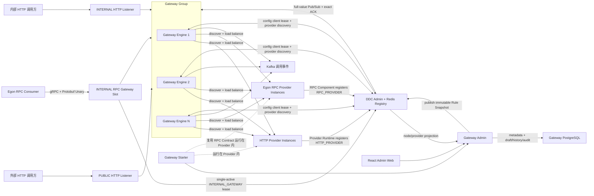
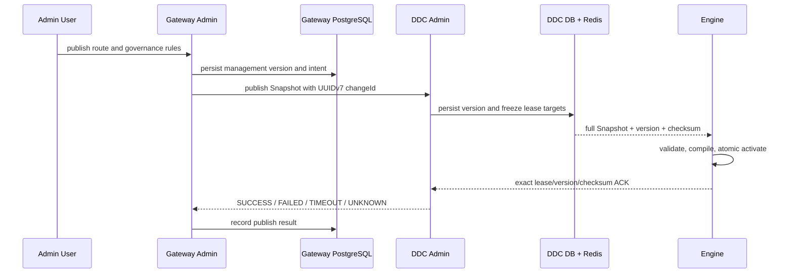

# Egon-COLA Gateway 项目总览 Spec

状态：已实现，待用户验收

文档阶段：功能范围与技术路线对齐

项目定位：Egon-COLA Component 体系中的大型网关平台

## 1. 本文档要解决的问题

本文档只回答两个问题：

1. Gateway 项目最终需要具备哪些功能。
2. 这些功能采用什么总体技术路线实现。

本文档不是实施级详细设计，暂不展开：

- 数据库表结构和 Flyway 脚本；
- HTTP API、DTO 和错误码清单；
- 类、接口、包和配置项的最终命名；
- 路由发布状态机、消息体和协议字段；
- 单个页面的交互原型；
- 详细测试用例、性能指标和容量参数；
- 任务拆分、实施顺序和工期。

总览审核通过后，再按 Engine、Admin、Starter、Test 及各项治理能力分别拆分子 Spec，逐步实现。

### 1.1 现有组件事实基线

本轮技术路线以仓库当前 RPC/DDC 实现为依据，不把设计意图误写成已完成能力：

| 组件事实 | 当前实现 | 对 Gateway 的约束 |
|---|---|---|
| RPC 协议 | gRPC Java + Protobuf，V1 仅 Unary | Gateway 首期 RPC 必须遵守同一协议，不再支持 Dubbo |
| RPC Provider | 启动真实 gRPC Server，并以 `RPC_PROVIDER` 租约注册 DDC | Engine 订阅 Provider，不复制 Provider 启停和租约逻辑 |
| RPC Consumer | 只发现恰好一个 `INTERNAL_GATEWAY`；不发现 Provider、不负载均衡 | Provider Directory 和负载均衡必须在 Engine；RPC Gateway 首期受单活约束 |
| RPC Gateway | 生产 Gateway 明确不属于 RPC Component；现有 Mock Gateway 位于测试源码 | Gateway 自己实现生产数据面，只复用公共协议契约 |
| DDC 配置 | DB 记录配置/版本/发布/ACK，Redis 缓存并以 Pub/Sub 携带完整配置值，发布模式仅 `SYNC_ALL_ACK` | Admin 复用 DDC 发布状态机，Engine 应用成功后精确 ACK；运行期周期校准仍需补齐 |
| DDC 服务注册 | `DdcServiceRegistryClient` 支持租约、查询、实例订阅和服务目录订阅 | RPC 可直接接入；HTTP 需增加服务类型 |
| DDC 服务类型 | 当前只有 `RPC_PROVIDER`、`INTERNAL_GATEWAY` | `HTTP_PROVIDER` 是明确前置扩展，不得假设已经存在 |
| DDC 部署 | 当前验证边界是单 DDC Admin + 单 Redis | 可用 LKG 保护数据面，但不能宣称控制面已经高可用 |

## 2. 已确认的核心结论

| 决策 | 结论 |
|---|---|
| 项目规模 | 虽然归属 Component 项目，但它是一套独立的大型网关平台，不能按普通轻量 Starter 设计 |
| 原始范围 | `/Users/mario/SelfProject/blog/source/_posts/archtect/gateway.md` 29 章的业务网关能力全部纳入分析；第 25～27 章中的 Nginx 管理实现明确不纳入本项目，以 Engine 的 Provider 发现、路由和负载均衡替代 |
| 核心模块 | 建设 Gateway Engine 集群、Gateway Admin 管理平台、Gateway Starter 和 Gateway Test |
| 网关内核 | 优先自研；基于 Reactor Netty/Netty 提供的网络能力建设自己的请求模型、路由、Filter Chain、执行器和生命周期 |
| Spring Cloud Gateway | 只借鉴 Route、Predicate、Filter、治理和可观测性思想，不作为 Engine 运行内核 |
| 分层架构 | Engine、Admin、Starter 均采用分层架构；模块之间通过明确契约交互 |
| 协议范围 | 首期正式支持 HTTP 与 Egon RPC；Egon RPC 使用现有 `egon-cola-component-rpc` 的 gRPC + Protobuf Unary 契约，不支持 Dubbo |
| Admin 定位 | Admin 是管理平台和控制面，负责接口定义存储、配置管理、版本发布、集群管理及管理页面 |
| Starter 定位 | Starter 只采集并上报 Provider 的接口定义，不负责接口调用上报 |
| 调用事件 | 每次接口调用由 Engine 异步发送到 Kafka，不能由 Starter 发送 |
| 接口目录 | 接口按业务域 → 实体域 → 接口组三级组织；一个 Spring Controller/Egon RPC Contract 对应一个接口组 |
| 接口详情 | Starter 需要上报完整接口描述、参数、响应、协议、约束、示例、来源和治理元数据 |
| 外部访问 | 每个 HTTP/RPC Operation 都有 `externalAccessible`；false 时仅允许内部入口调用；该字段不会把内部 gRPC Listener 自动暴露到公网 |
| 鉴权范围 | 不实现具体下游权限系统，但网关必须具备认证、授权、身份上下文和身份透传扩展点 |
| 节点与服务注册 | 统一使用现有 `egon-cola-component-dynamic-config-center`（下称 DDC），不引入 Nacos；Engine 配置客户端租约用于节点与发布目标管理，内部 RPC 入口使用 `INTERNAL_GATEWAY` 服务租约 |
| Provider 发现 | RPC Provider 使用 RPC Component 已有的 `RPC_PROVIDER` 租约；HTTP Provider 也必须通过 DDC 发现，但 DDC 当前缺少 `HTTP_PROVIDER`，因此需先做最小兼容扩展 |
| 网关治理 | Engine 负责限流、路由分配、Provider 实例选择和负载均衡，规则统一由 Admin 配置 |
| 规则存储 | Gateway Admin 的 PostgreSQL 保存编辑态、历史和审计；发布后的不可变 Rule Snapshot 交给 DDC，复用 DDC 已有的 DB 持久化、Redis 缓存和版本事实，不在 Gateway 内重复实现一套 DB/Redis 双写状态机 |
| 规则下发 | DDC 通过 Redis Pub/Sub 下发版本，Engine 校验、编译并原子生效后才 ACK；发布采用 DDC 当前的 `SYNC_ALL_ACK` 语义 |
| 管理前端 | React + TypeScript + Ant Design + Ant Design Charts |
| Nginx 边界 | 本项目不生成、管理或动态刷新 Nginx 配置；Engine 通过独立 PUBLIC/INTERNAL Listener 识别入口，Engine 集群前置流量设施由部署环境负责 |
| Trace ID | 优先使用前端或调用方生成的合法 Trace ID；没有或不合法时由 Engine 生成 |
| Test 定位 | 参考动态线程池和 RPC Component 的测试方式，启动真实 HTTP/Egon RPC 应用、DDC Admin、Gateway Admin 与 Engine，完成真实注册、可见和调用闭环 |

## 3. 产品定位与边界

### 3.1 产品定位

Gateway 是位于调用方与业务 Provider 之间的统一流量入口，同时包含数据面和控制面：

- 数据面由 Gateway Engine 承担，负责实际接收、治理和转发请求。
- 控制面由 Gateway Admin 承担，负责定义、编排、发布和管理网关能力。
- Gateway Starter 安装在 Provider 中，负责发现和上报接口定义。
- Gateway Test 提供真实应用和环境，持续验证整个闭环。

该项目不是单个反向代理服务，也不是 RPC Component 中测试用 Mock Gateway 的产品化包装，而是能够运行多组 Gateway、管理多个 Engine 节点和多个业务系统的网关平台。

### 3.2 首期范围

首期范围包括：

1. 自研 HTTP 网关运行内核。
2. HTTP Provider 转发。
3. Egon RPC Provider 的 Unary gRPC 代理，以及 HTTP 到 RPC 的协议适配。
4. 动态路由、路由分配和版本化发布。
5. Gateway Group 与多 Engine Node 管理。
6. 基于 DDC 的 Engine Node、内部 RPC Gateway 和 Provider 注册发现。
7. Engine 内部的 Provider 实例选择和负载均衡。
8. Admin 规则配置，以及基于 DDC 的 DB/Redis 持久化、Redis 消息下发和精确 ACK。
9. Provider 接口定义采集、上报和管理。
10. 业务域、实体域、接口组、Operation 管理。
11. PUBLIC/INTERNAL 入口隔离。
12. 网关鉴权扩展框架。
13. 超时、限流、并发隔离、熔断、重试等治理能力。
14. Trace、日志、指标和 Kafka 调用事件。
15. React 管理平台。
16. 真实 HTTP/Egon RPC 应用的端到端测试。
17. 容器化部署、优雅停机和故障恢复。

### 3.3 首期不实现的内容

下列内容不属于首期，但不得阻断未来扩展：

1. 具体的下游账号、角色、权限和租户系统。
2. 内置 Shiro、JWT、OAuth2、OIDC 或其他具体认证 Provider。
3. RPC Streaming、WebSocket、GraphQL 等额外协议。
4. Nginx 配置生成、节点 upstream 管理、动态 reload 和 Nginx 运维。
5. Gateway Engine 集群前置负载设施的建设和管理。
6. Nacos、Dubbo 及与它们相关的兼容 Adapter、双注册或迁移链路。
7. API 商业化计费、开发者门户和开放平台套餐。

“不实现具体权限系统”不等于“网关没有鉴权”。Engine 必须提供完整扩展链，后续权限系统只需实现扩展契约即可接入。Egon RPC 首期遵守 RPC Component 的 V1 边界：仅 Unary、Protobuf 请求/响应、标准 gRPC Deadline/Cancellation，Consumer 不直连 Provider。

## 4. 总体架构


```mermaid
flowchart LR
    PublicClient["外部 HTTP 调用方"] --> PublicEntry["PUBLIC HTTP Listener"]
    InternalHttpClient["内部 HTTP 调用方"] --> InternalEntry["INTERNAL HTTP Listener"]
    RpcConsumer["Egon RPC Consumer"] -->|"gRPC + Protobuf Unary"| RpcEntry["INTERNAL RPC Gateway Slot"]

    PublicEntry --> GatewayGroup
    InternalEntry --> GatewayGroup
    RpcEntry --> GatewayGroup

    subgraph GatewayGroup["Gateway Group"]
        Engine1["Gateway Engine 1"]
        Engine2["Gateway Engine 2"]
        EngineN["Gateway Engine N"]
    end

    Engine1 -->|"discover + load balance"| HttpProvider["HTTP Provider Instances"]
    Engine1 -->|"discover + load balance"| RpcProvider["Egon RPC Provider Instances"]
    Engine2 -->|"discover + load balance"| HttpProvider
    Engine2 -->|"discover + load balance"| RpcProvider
    EngineN -->|"discover + load balance"| HttpProvider
    EngineN -->|"discover + load balance"| RpcProvider

    Engine1 --> Kafka["Kafka 调用事件"]
    Engine2 --> Kafka
    EngineN --> Kafka

    Engine1 <-->|"config client lease + provider discovery"| DDC["DDC Admin + Redis Registry"]
    Engine2 <-->|"config client lease + provider discovery"| DDC
    EngineN <-->|"config client lease + provider discovery"| DDC
    RpcEntry -->|"single-active INTERNAL_GATEWAY lease"| DDC

    Starter["Gateway Starter"] --> Admin["Gateway Admin"]
    Starter -. "运行在 Provider 内" .-> HttpProvider
    Starter -. "复用 RPC Contract 运行在 Provider 内" .-> RpcProvider
    HttpProvider -->|"Provider Runtime registers HTTP_PROVIDER"| DDC
    RpcProvider -->|"RPC Component registers RPC_PROVIDER"| DDC

    Admin -->|"metadata + draft/history/audit"| PostgreSQL["Gateway PostgreSQL"]
    Admin -->|"publish immutable Rule Snapshot"| DDC
    DDC -->|"full-value Pub/Sub + exact ACK"| GatewayGroup
    DDC -->|"node/provider projection"| Admin

    AdminWeb["React Admin Web"] --> Admin
```

### 4.1 架构原则

1. **控制面与数据面分离**：Admin 故障不能直接中断 Engine 已加载路由的调用。
2. **管理事实与发布事实分离**：Gateway Admin PostgreSQL 保存可编辑领域模型；DDC 保存已发布配置版本，并负责其内部 DB/Redis 一致性、通知和 ACK。
3. **定义与运行分离**：Starter 上报“Provider 有什么接口”，Admin 决定“哪些接口进入哪个 Gateway、如何暴露和治理”。
4. **入口与暴露策略分离**：PUBLIC/INTERNAL 来自可信物理入口，`externalAccessible` 决定 Operation 是否允许通过 PUBLIC 入口。
5. **内核与基础设施分离**：自研 Core 不依赖 Admin、DDC、Kafka 或具体权限系统；这些能力通过 Adapter 接入。
6. **Provider 必须经 DDC 发现**：Engine 不从 Admin 接收静态 Provider 地址，订阅 DDC 服务目录并在本地完成候选过滤和负载均衡。
7. **DDC 消息驱动生效**：Admin 只调用 DDC 发布契约，不直写 DDC 的 Redis/DB；Engine 校验 Pub/Sub 中的完整配置值并完成编译、原子切换，再返回精确 ACK；启动和补偿场景使用全量拉取。
8. **复用组件稳定契约**：RPC 使用 RPC Component 的服务身份、Metadata、错误、Deadline 和 Cancellation 契约；配置和注册使用 DDC 公共 API，不复制组件内部实现。
9. **配置不可变发布**：Engine 消费已发布版本，不直接运行未发布的编辑态配置。
10. **故障保留最后可用状态**：控制面或通知链路不可用时，Engine 使用 Last-Known-Good 配置继续提供服务。
11. **当前能力如实建模**：DDC V1 的单 Admin/单 Redis、RPC Consumer 的单活 Gateway 发现，以及 DDC 尚缺 HTTP Provider 类型，均作为当前约束或前置扩展写入方案，不用文档假设掩盖。

## 5. 项目与模块职责

### 5.1 核心产品模块

#### Gateway Engine

Gateway Engine 是实际处理请求的网关运行时。多个 Engine 组成一个 Gateway Group，可水平扩缩。

主要职责：

- 接收 PUBLIC 和 INTERNAL HTTP 请求；
- 接收 Egon RPC Consumer 发往内部 Gateway 的 Unary gRPC 请求；
- 解析 Trace、入口区域、协议和请求参数；
- 根据 Admin 下发规则完成 Gateway Group 和 Operation 路由匹配；
- 执行外部暴露检查、认证、授权和治理 Filter；
- 从 DDC 发现 HTTP/Egon RPC Provider 实例；
- 根据 Admin 配置的负载均衡策略选择 Provider 实例并发起调用；
- 执行本地或分布式限流；
- 生成标准响应、反馈头、日志和指标；
- 将调用事件异步发送到 Kafka；
- 以 DDC 配置客户端租约注册 Engine Node，并在获得内部 RPC 单活资格时注册 `INTERNAL_GATEWAY`；
- 启动时从 DDC 全量拉取 Rule Snapshot；运行时校验 Pub/Sub 完整配置值，编译和切换成功后精确 ACK；
- 通过受信任的内部状态接口上报 Readiness、当前/LKG 版本、Listener 和资源状态；DDC 租约只表示注册存活，不代替 Engine Readiness；
- 在控制面异常时使用最后可用配置继续运行；
- 支持 Drain、优雅停机和连接资源释放。

#### Gateway Admin

Gateway Admin 是网关管理平台和控制面，不承载业务请求转发。

主要职责：

- 管理 Gateway Group、Engine Node 和业务系统；
- 读取 DDC 配置客户端和服务租约，形成 Gateway Node、内部 RPC Gateway 与 Provider 管理视图；
- 持久化 Starter 上报的接口定义；
- 管理业务域、实体域、接口组和 Operation；
- 管理 HTTP/Egon RPC 路由分配、限流、负载均衡、外部暴露、鉴权引用和其他治理策略；
- 将管理态配置和审计保存在 Gateway PostgreSQL；
- 将编译后的不可变 Rule Snapshot 发布到 DDC，由 DDC 完成版本持久化、Redis 下发、目标 ACK、超时和重试；
- 展示发布、节点准备、运行版本和异常状态；
- 展示 DDC 中的 Gateway Node、内部 RPC Gateway 和 Provider Instance；
- 提供 React 管理页面、图表和审计能力。

#### Gateway Starter

Gateway Starter 安装在 HTTP/Egon RPC Provider 中，只负责接口定义。运行实例注册是独立职责：RPC Provider 由 RPC Component 完成，HTTP Provider 由独立的 DDC Provider Runtime Adapter 完成。

主要职责：

- 识别当前应用和环境；
- 扫描 Spring Controller，或复用 RPC Component 已校验的 RPC Contract Descriptor；
- 生成业务域、实体域、接口组和 Operation 定义；
- 采集完整接口元数据；
- 计算定义指纹并批量上报 Admin；
- 支持幂等、重试、变更和下线语义。

Starter 明确不负责：

- 拦截或统计接口调用；
- 向 Kafka 发送调用事件；
- 决定 Engine 的运行路由；
- 注册或维持 HTTP/RPC Provider 运行实例租约；
- 注册 Gateway Engine Node。

#### Gateway Test

Gateway Test 不是 Mock 集合，而是网关平台的真实验证工程。

主要职责：

- 提供可执行 HTTP Provider；
- 提供可执行 Egon RPC Provider 与 Consumer；
- 两类 Provider 均安装真实 Gateway Starter；
- 真实注册到 DDC 并向 Admin 上报；
- 提供真实调用客户端和 Kafka Consumer；
- 验证 Admin 可见、DDC 规则可下发并 ACK、Engine 可路由和限流、Provider 可负载均衡、Kafka 可消费。

### 5.2 支撑模块

为保持职责清晰，可在核心产品模块内部拆出以下支撑模块：

- `gateway-contract`：模块间稳定 DTO、事件和扩展契约；
- `gateway-core`：请求模型、路由、Filter Chain、参数绑定、执行器和协议 SPI；
- `gateway-engine-http`：Reactor Netty HTTP Listener、HTTP Client 与 HTTP 协议适配；
- `gateway-engine-rpc`：内部动态 gRPC Server、Egon RPC 路由、Provider Channel 管理和 Unary Forwarder；
- `gateway-ddc-adapter`：DDC 配置、Engine 租约、Provider 目录和发布状态投影；
- HTTP Provider Runtime Adapter：独立于 Gateway Starter，使用 DDC Client 注册、心跳和注销 `HTTP_PROVIDER`；
- `gateway-admin-web`：React 管理前端；
- 各基础设施 Adapter：Kafka、Redis 限流状态、PostgreSQL、HTTP、RPC 和 DDC。

支撑模块是工程组织手段，不改变 Engine、Admin、Starter、Test 四类产品职责。最终 Maven 模块名称在对应实施子 Spec 中确定。

### 5.3 分层架构

各运行模块统一采用分层架构，但不强迫所有模块拥有完全相同的包数量：

| 层 | 职责 |
|---|---|
| Interfaces | HTTP、消息、Starter 回调、管理页面接口和协议转换 |
| Application | 用例编排、事务边界、发布流程和生命周期协调 |
| Domain | 路由、接口目录、Gateway Group、Node、策略等核心规则 |
| Infrastructure | PostgreSQL、DDC、Redis 限流状态、Kafka、HTTP、gRPC/Protobuf 和文件存储 Adapter |

依赖方向由外向内，Domain 不依赖具体基础设施。Engine 的网络传输层可以直接使用 Reactor Netty，但必须转换为自有 `GatewayExchange` 后再进入应用处理链。

## 6. 完整功能范围

### 6.1 Engine 数据面

#### 网络与会话

- 基于 Reactor Netty/Netty 提供 HTTP Server。
- 支持连接、请求体聚合、流式或聚合响应、协议异常处理。
- 使用自有请求、响应、Exchange 和上下文模型。
- 区分 PUBLIC 与 INTERNAL Listener，不接受客户端伪造入口区域。

#### 路由

- 根据 Gateway Group、规则版本、Host、Path 和 HTTP Method 匹配 Operation。
- 支持精确路径、路径变量和必要的通配规则。
- 支持同一路径不同 HTTP Method。
- 路由分配规则由 Admin 配置，并以不可变 Rule Snapshot 发布到 DDC。
- Engine 通过 DDC Config Client 获取本 Group 的版本化规则快照，不直接查询 Gateway Admin 数据库，也不直接读取 DDC 数据库。
- 支持新版本预加载、原子切换、回滚和旧版本安全退役。

#### Provider 注册发现与负载均衡

- HTTP/Egon RPC Provider 运行实例必须注册到 DDC。
- RPC Provider 直接复用 RPC Component 的 `RPC_PROVIDER` 服务身份和租约；HTTP Provider 使用待补齐的 `HTTP_PROVIDER` 服务类型。
- Engine 通过 `DdcServiceRegistryClient` 的查询、服务目录订阅和实例订阅能力，获取 Provider Instance 的上线、下线、地址、协议、受控 Metadata 和租约状态；权重、标签和灰度条件由 Admin Rule Snapshot 与经批准的 Metadata Schema 共同归一化。
- Provider 运行实例与 Starter 上报的接口定义通过稳定的 application/service 标识关联。
- Engine 将 DDC 服务键映射为自有 `ProviderServiceKey`，维护本地只读 Provider Directory；DDC 短时异常时保留最后一次可用实例视图，但不得把已明确过期的租约长期伪装为健康实例。
- DDC 有效租约只证明实例仍在注册，不等同于业务方法健康；Engine 结合租约、被动调用结果和可选主动探测形成本地可用性判断，Admin 分开展示“DDC 注册状态”和“Engine 观测健康”。
- Engine 根据 Admin 下发的负载均衡规则，从健康 Provider Instance 中选择目标。
- 首期支持轮询、加权轮询、随机和最少在途请求策略。
- 路由规则负责选择目标服务和候选集合，负载均衡规则负责从候选实例中选择单个实例。
- 没有可用实例时快速失败，不回退到 Admin 中维护的静态地址。

#### HTTP 与 Egon RPC 调用

首期调用矩阵：

| 入口 | 上游 Provider | 首期支持 |
|---|---|---|
| PUBLIC HTTP | HTTP / Egon RPC | 支持；必须存在显式 PUBLIC Route，并通过 `externalAccessible`、鉴权和治理 |
| INTERNAL HTTP | HTTP / Egon RPC | 支持；仍执行配置的鉴权和治理 |
| INTERNAL Egon RPC | Egon RPC | 支持；遵守 RPC Component Unary 契约 |
| INTERNAL Egon RPC | HTTP | 不作为首期必需组合；需要单独定义 Protobuf→HTTP 映射后再扩展 |

- HTTP Adapter 支持常用 Method、Header、Query、Path、Body 和响应透传/转换。
- RPC Adapter 复用 RPC Component 的 `serviceName + group + version` 服务身份、方法描述、Metadata Key 和稳定错误语义，不使用 Dubbo，也不要求 Engine 引入业务 Provider 接口 JAR。
- RPC Consumer → Engine 路径使用动态 gRPC Handler；Engine 根据 RPC Metadata 和完整 gRPC 方法名路由，将 Protobuf 原始字节、Deadline、Cancellation、Trace 和受控 Metadata 转发给目标 Provider。
- HTTP → RPC 路径根据 Starter 上报的 Protobuf Descriptor 把 HTTP 参数绑定为 Protobuf Message，再通过动态 Unary 调用目标 Provider；禁止根据客户端输入加载任意 Java Class。
- RPC V1 仅支持 Unary；Streaming、客户端直连 Provider、Consumer 侧发现和负载均衡均不属于 Gateway 首期路线。
- HTTP、RPC 共享统一执行器、治理链和网关错误模型；RPC 边界上的状态转换必须遵守 RPC Component 的 gRPC Status/Trailer 契约。
- 后续协议通过 `UpstreamAdapter` 接入，不修改路由核心。

#### 参数与响应

- 支持 Path、Query、Header、Cookie、Form 和 JSON Body 参数。
- 根据 Starter 上报的 HTTP Schema 或 Protobuf Descriptor 完成类型绑定。
- 对缺失、类型错误和约束失败返回稳定错误。
- 支持统一网关响应和按 Route 配置的透明响应。
- 禁止调用方通过类型字段要求 Engine 反序列化任意 Java Class。

#### Filter Chain

- 自研可排序、可扩展的 Filter Chain。
- 支持全局、Gateway Group、业务系统、接口组和 Operation 等策略作用域。
- 核心阶段包括 Trace、入口识别、CORS、路由、外部暴露、认证、授权、流控、参数绑定、调用、响应、日志、指标和调用事件。
- Filter 必须有明确顺序、短路行为和异常边界。

#### 流量治理

- 超时；
- 请求速率限制，支持全局、Gateway Group、业务系统、接口组、Operation 和调用方等规则作用域；
- 单 Engine 本地限流和基于 Redis 的多 Engine 分布式限流；
- 并发隔离；
- 熔断；
- 有条件重试；
- 请求体大小限制；
- Header 与连接限制；
- Provider 注册发现、实例选择和健康感知；
- 可扩展灰度、权重和标签路由能力。

#### 运行与恢复

- Readiness 与 Liveness 分离。
- 节点启动后先完成注册和配置准备，再加入流量。
- 支持 Drain 和优雅停机。
- 配置发布失败时保留旧版本。
- Gateway Admin、DDC Admin、DDC Redis 或通知暂时不可用时，已运行 Engine 继续使用磁盘和内存中的最后可用配置；新发布、节点状态刷新和 Provider 变化感知进入降级状态。

### 6.2 Admin 控制面

#### 资源管理

- Gateway Group；
- Gateway Engine Node；
- Application System；
- Business Domain；
- Entity Domain；
- Interface Group；
- Operation；
- HTTP/Egon RPC 上游目标；
- Route 分配、限流、负载均衡、暴露策略、鉴权策略引用和其他治理策略；
- Group、Node 与 System 的关联关系。

#### 接口定义管理

- 接收 Starter 的批量定义上报。
- 持久化三级接口目录和详细 Operation。
- 区分 Provider 原始定义与 Admin 治理配置。
- 展示新增、修改、下线和冲突。
- Starter 上报不能直接把接口变成公网可调用状态。
- 支持没有 Starter 的接口由管理员补充维护，但来源必须可区分。

#### 路由配置与发布

- 编辑态和运行态分离。
- 发布前校验路径冲突、参数定义、Provider Service、限流、负载均衡、外部暴露和鉴权引用。
- 将一个 Gateway Group 的路由和治理规则编译成不可变版本。
- Gateway Admin 在自身事务中保存管理态版本，再向 DDC 提交不可变 Rule Snapshot；Gateway Admin 不直写 DDC 的 DB 或 Redis。
- DDC 按现有 `SYNC_ALL_ACK` 模式准备发布、写入 DB/Redis、通过 Redis Pub/Sub 通知精确目标租约，并等待 `leaseId + version + checksum` 匹配的 ACK。
- Engine 收到包含完整配置值、目标版本和校验值的 DDC 消息后准备新版本，完成校验、编译和原子切换后才返回成功 ACK；失败 ACK 必须包含可诊断原因，旧版本继续生效。
- 展示 DDC 发布状态、目标租约、节点版本、应用结果和失败原因。
- 支持历史版本查看、差异和回滚。
- Redis 消息丢失后依靠 DDC 发布重试和待补齐的周期全量拉取/版本对账恢复；仅靠当前启动/重注册拉取不足以覆盖“租约仍有效但消息丢失”的场景。

#### 节点与 Provider 管理

- 从 DDC 配置客户端租约获取 Engine Node 的注册与心跳；从 DDC 发布 ACK 和 Engine 内部状态接口形成当前版本、LKG、Readiness 与 Listener 管理投影。
- 从 DDC `INTERNAL_GATEWAY` 与 Provider 服务租约获取内部 RPC Gateway 和 Provider 的运行状态。
- 保存用于管理、审计和发布判断的节点投影。
- 展示节点所属 Group、地址、版本、状态和最近变化。
- 展示 Provider Service 和 Provider Instance 的注册、健康、权重、标签和最近变化。
- Engine Node 前置流量分配属于部署环境，不由 Admin 生成或管理负载配置。

#### 管理页面

- 总览仪表盘；
- Gateway Group 与 Node 页面；
- 业务系统和三级接口目录树；
- Operation 详细定义页面；
- 路由分配、限流、Provider 负载均衡、外部暴露、鉴权和治理配置页面；
- 发布、差异、节点准备和回滚页面；
- Gateway Node、Provider Service 和 Provider Instance 页面；
- Trace、限流、负载分布、流量、错误率、延迟和节点分布图表；
- 审计和异常提示。

### 6.3 Starter 接口定义上报

Starter 上报的目录结构为：

```text
Application System
└── Business Domain
    └── Entity Domain
        └── Interface Group
            └── Operation
```

三级分组指 Business Domain、Entity Domain 和 Interface Group；Application System 是接口归属根，Operation 是最终可调用单元。

映射规则：

1. 一个 Spring Controller 或一个 Egon RPC Service Contract 对应一个 Interface Group。
2. 多个 Interface Group 可以归入一个 Entity Domain。
3. 多个 Entity Domain 可以归入一个 Business Domain。
4. 同一个 Controller/RPC Contract 不能在一次上报中拆成多个 Interface Group。
5. 目录 code 必须稳定，名称和描述可以演进。

Operation 至少包含以下信息：

- 稳定 Operation ID、名称、摘要、详细描述、标签和负责人；
- 所属应用、业务域、实体域、接口组；
- HTTP 或 Egon RPC 协议类型；
- HTTP Path、Method、Host、consumes 和 produces；
- RPC `serviceName`、`group`、`version`、完整 gRPC Method Name 和 DDC 服务身份；
- RPC Protobuf 输入/输出消息全名、字段 Schema、必要的 Descriptor 内容和 Unary 类型；
- 参数名称、顺序、来源、类型、泛型 Schema、必填、默认值和校验约束；
- 请求示例；
- 成功响应、错误响应、Schema 和示例；
- `externalAccessible`；
- 鉴权策略引用和可配置治理元数据；
- 废弃标记、版本、构建信息、来源类和方法签名；
- 用于幂等和变更识别的定义指纹。

Admin 必须存储这些信息，而不是只保存 Path、Method 或 RPC 方法名。RPC Starter 侧应复用 RPC Component 的 `RpcContractValidator` 与 `RpcContractDescriptor` 校验结果，再转换成无 Java 反射对象、可稳定传输和持久化的 Gateway Contract；不得另写一套不一致的 RPC 注解扫描规则。

### 6.4 外部与内部访问

每个 Operation 都必须有 `externalAccessible`：

- `true`：允许通过 PUBLIC 或 INTERNAL 入口继续进入后续处理。
- `false`：PUBLIC 入口按“未对外暴露”处理，不能调用；INTERNAL 入口可以继续处理。

技术原则：

1. 默认值为 false，防止 Starter 新上报接口自动暴露公网。
2. PUBLIC/INTERNAL 身份只由 Engine 独立监听端口或受信任的部署入口绑定关系确定。
3. 不信任普通客户端传入的“内部请求”Header。
4. 暴露检查在具体鉴权前完成，避免向外部泄漏内部接口存在性。
5. HTTP 和 Egon RPC Operation 使用同一规则；Egon RPC Consumer 连接的 gRPC Listener 始终属于 INTERNAL。
6. `externalAccessible=true` 只代表该 Operation 可以被显式 PUBLIC Route 引用，不会自动创建公网 Route，也不代表跳过鉴权、限流或其他治理。

### 6.5 网关鉴权扩展

首期不实现具体下游权限系统，但 Core 必须定义：

- Credential 提取扩展；
- `GatewayAuthenticationProvider`；
- `GatewayAuthorizationProvider`；
- 不可变 `GatewayPrincipal`；
- `GatewayAuthContext`；
- 认证、拒绝、不可用等稳定决策模型；
- HTTP Header 和 gRPC Metadata 的受控身份透传；
- Route 对鉴权策略和 Provider ID 的引用。

基本规则：

1. Operation 可以明确配置无需鉴权，但不能因鉴权 Provider 缺失而自动放行。
2. 配置了鉴权策略却找不到对应鉴权 Provider 时，发布应失败；运行期异常时默认关闭访问。
3. 客户端传入的内部身份 Header 必须先移除，再由可信 Mapper 写入。
4. 认证失败、授权失败和鉴权 Provider 不可用需要可区分。
5. 未来接入公司的权限系统时，只实现 Provider 和 Mapper，不改 Engine 路由核心。

### 6.6 Trace 与调用事件

Trace ID 规则：

1. 前端或调用方负责优先生成 Trace ID。
2. Engine 校验并接受合法的 `traceparent` 或约定 Trace Header。
3. 缺失或非法时由 Engine 生成。
4. Trace ID 贯穿 Engine 日志、HTTP Header、gRPC Metadata、响应、指标和 Kafka 调用事件。
5. Admin React 前端对管理请求也使用统一 Trace 生成和透传策略。

调用事件规则：

1. 只有 Engine 产生接口调用事件。
2. Starter 不拦截调用，也不持有 Kafka Producer。
3. 调用完成后异步发送 Kafka，Kafka 故障不能改变业务响应。
4. 事件包含 Trace、Route、Operation、Node、耗时、结果和必要的诊断维度。
5. 默认不记录请求/响应 Body、凭据和敏感身份信息。
6. 投递链路需要有界、可观测，并在后续子 Spec 中确定缓冲和可靠性级别。

## 7. 自研网关技术路线

### 7.1 网关内核路线比较

| 路线 | 说明 | 结论 |
|---|---|---|
| Spring Cloud Gateway 扩展 | 直接使用其 Server、RouteDefinition 和 GlobalFilter，再扩展 RPC | 可借鉴但不作为主路线，核心路由和生命周期受框架约束 |
| Reactor Netty 上自研内核 | 复用成熟网络传输和 HTTP 编解码，自研 Exchange、路由、Filter、版本和 Adapter | 推荐，既满足自研要求，又避免重复实现底层协议 |
| 原始 Netty 全自研 | 从 Pipeline、HTTP 聚合、连接管理到 Client 全部自行建设 | 首期成本和风险过高，不推荐 |

推荐路线是“Reactor Netty 基础设施 + 自研 Gateway Core”，不是 Spring Cloud Gateway 二次封装。

### 7.2 RPC/DDC 集成路线比较

| 路线 | 说明 | 结论 |
|---|---|---|
| Gateway 直接适配 RPC/DDC 公共契约 | Engine 自己实现生产级数据面，复用 RPC 的协议契约和 DDC 的配置/注册契约 | **推荐**；职责清晰，Gateway 仍是自研内核 |
| 在 Engine 内启用 RPC Consumer Starter | 让 Engine 通过 RPC Consumer 发起 Provider 调用 | 不可行；RPC Consumer 的目标本来就是唯一内部 Gateway，会形成错误回路，而且 Consumer 不负责 Provider 发现和负载均衡 |
| 复制 RPC Test 的 Mock Gateway | 把测试目录中的动态 Handler、目录和转发器直接搬入生产 | 不采用；这些类是协议验证 Fixture，不是稳定生产 API，但可作为行为契约参考 |

推荐路线的含义：

1. Gateway Engine 通过 DDC 公共接口订阅 `RPC_PROVIDER`，自己维护生产级 Provider Directory、Channel Cache、负载均衡和 Unary Forwarder。
2. RPC Consumer 继续按现有契约只发现一个 `INTERNAL_GATEWAY`，不感知 Provider，也不承担负载均衡。
3. RPC Provider 继续由 RPC Component 启动真实 gRPC Server，并向 DDC 注册 `RPC_PROVIDER`；Gateway 不复制 Provider 生命周期。
4. Gateway Starter 复用 RPC Contract 校验结果来上报接口定义；Gateway Engine 复用 RPC Metadata、错误、Deadline 和 Cancellation 语义。
5. Gateway Admin 通过 DDC 的配置发布能力下发 Rule Snapshot，不直接操作 DDC Redis/DB，也不另写一套发布 ACK 状态机。

### 7.3 现有组件需要补齐的最小契约

本 Spec 以当前 RPC/DDC 代码为准，以下不是已存在能力，必须作为 Gateway 实施前置任务单独设计和测试：

1. **DDC HTTP Provider 类型**：在 `DdcServiceKind` 及相关租约角色中增加 `HTTP_PROVIDER`，保持现有服务键 `env + namespace + serviceKind + serviceName + group + version + protocol` 不变；独立 HTTP Provider Runtime Adapter 用它登记实例，Gateway Starter 不承担租约职责。
2. **DDC 自定义配置应用器**：DDC 已有 `DdcConfigApplier` 语义，但当前自动配置固定绑定字段刷新。需要提供可替换或可组合的公开扩展点，使 Engine 能在“Snapshot 校验 → 编译 → 原子激活”成功后再 ACK，失败时返回失败 ACK；不能在规则真正生效前确认成功。
3. **RPC Contract Catalog 与可传输 Snapshot**：当前 `RpcContractDescriptor` 含 Java `Class`、`Method` 等运行时对象，Provider Lifecycle 内部构造的方法目录也未作为只读 Bean/事件公开。需要由 RPC Component 暴露已校验 Contract Catalog，并提供或允许 Gateway Adapter 稳定转换出可序列化的 Service/Method/Protobuf Descriptor Snapshot，供 Starter 上报、Admin 持久化以及 HTTP → RPC 参数绑定。
4. **RPC Gateway 生产契约**：Gateway 不依赖 `src/test` 中的 Mock Gateway。必要的 Metadata Key、方法身份、错误映射等继续使用 RPC 公共契约；动态字节 Handler、Provider Channel 生命周期和转发器在 Gateway Engine 内按生产要求实现。
5. **DDC 管理端机器接口**：现有 HMAC OpenAPI 主要面向配置客户端和服务注册，配置创建/更新/发布及实例、发布任务管理接口仍属于 DDC Admin 管理 API，部分响应直接暴露持久化实体。需要补充稳定 DTO、HMAC 保护和类型化 Client 的机器间契约，供 Gateway Admin 发布配置和读取投影；Gateway Admin 不得依赖 DDC JPA Entity 或私有 Repository。
6. **Provider Metadata Schema**：DDC 支持受限 Metadata，但 RPC Provider 当前只写入 transport、serialization 和 runtime-version 等框架字段。若启用机房、标签、权重或灰度发现，需要为 HTTP/RPC Provider 定义统一、非敏感、受 DDC 数量/长度限制约束的 Metadata Schema，并为 RPC Provider 增加受控扩展入口；首期也可由 Admin 对实例配置覆盖值，但不能假设 RPC 租约已包含这些字段。
7. **DDC 配置周期校准**：当前配置客户端在启动和租约恢复时全量拉取，运行期直接应用 Pub/Sub 携带的完整配置值；租约正常时没有周期配置对账。需要增加带版本比较的周期全量拉取或轻量版本校准，补偿单次 Pub/Sub 丢失。

这些扩展只补公共契约，不把路由、限流、负载均衡或 Gateway 生命周期下沉到 RPC/DDC Component。

### 7.4 自研与复用边界

项目自行实现：

- `GatewayRequest`、`GatewayResponse`、`GatewayExchange`；
- 路由定义、路由编译器和 Matcher；
- 版本化 Route Repository；
- Filter Chain 和 Filter 扩展契约；
- 入口区域与外部暴露判断；
- 鉴权扩展链和身份上下文；
- 参数提取、类型绑定和响应映射；
- `GatewayExecutor`；
- DDC 到自有 `ProviderServiceRegistry` 的 Adapter、本地 Provider Directory 和负载均衡策略；
- 路由、限流和负载均衡运行规则模型；
- `UpstreamAdapter` 和调用生命周期；
- 动态 gRPC Server Handler、Provider Channel Cache 和 Unary Forwarder；
- 错误模型、反馈头和调用事件；
- 路由 Prepare、Activate、Retire 与 LKG；
- Engine Node 生命周期和控制面协作。

项目复用：

- Reactor Netty/Netty 的 EventLoop、Channel、HTTP 编解码、连接池和 HttpClient；
- `egon-cola-component-rpc` 的 gRPC/Protobuf 契约、Provider 注册、Consumer→Gateway 发现规则、Metadata、Deadline/Cancellation 和错误语义；
- `egon-cola-component-dynamic-config-center` 的配置版本、DB/Redis 存储、Redis Pub/Sub、精确目标 ACK、服务租约和订阅 API；
- `egon-cola-component-common-id`、`common-trace`、`common-result`、`common-crypto` 和 `common-mask` 的通用能力；
- Jackson 的 JSON 与 Schema 基础能力；
- Resilience4j 或等价成熟库的限流、熔断和重试算法；
- Micrometer/OpenTelemetry 的指标和 Trace 标准；
- Kafka Client、用于分布式限流状态的 Redis Client 和 PostgreSQL Driver。

`access-guard` 是业务方法访问控制组件，不适合作为 Netty 请求热路径 Filter；现有 `rule-engine` 也不承担 Gateway 动态路由编译。`transactional-outbox` 当前没有 Kafka Delivery Adapter，且每次网关调用先落业务数据库不适合高吞吐调用事件，因此三者均不作为首期核心依赖。`dynamic-thread-pool` 只可用于后续有界阻塞任务池，不能接管 Reactor Netty EventLoop。

Engine 运行依赖中不引入 `spring-cloud-starter-gateway-*`、Nacos Client 或 Dubbo，也不把 Spring Cloud Gateway 的 `RouteDefinition`、`GlobalFilter` 或 Actuator API 当成项目契约。

### 7.5 请求处理主链


```mermaid
flowchart LR
    Transport["Reactor Netty Transport"]
    Trace["Trace Context"]
    Zone["Access Zone"]
    Cors["CORS"]
    Match["Route Match"]
    Exposure["External Exposure"]
    Authentication["Authentication"]
    Authorization["Authorization"]
    Governance["Limit / Timeout / Circuit"]
    Binding["Parameter Binding"]
    Executor["Gateway Executor"]
    Discovery["Provider Discovery"]
    Balance["Load Balance"]
    Adapter["HTTP / Egon RPC Adapter"]
    Response["Response Mapping"]
    Observe["Log / Metric / Kafka Event"]

    Transport --> Trace --> Zone --> Cors --> Match --> Exposure
    Exposure --> Authentication --> Authorization --> Governance
    Governance --> Binding --> Executor --> Discovery --> Balance --> Adapter
    Adapter --> Response --> Observe
```

这是逻辑阶段，不代表每个阶段都必须拆成一个类。实施时只在确有变化点的地方使用扩展接口，避免为了模式而过度设计。

### 7.6 设计模式选择

| 模式 | 使用位置 | 原因 |
|---|---|---|
| Chain of Responsibility | Filter、认证、授权和治理处理链 | 阶段有顺序、可短路且需要扩展 |
| Strategy | 路由分配、限流键、鉴权 Provider 和负载均衡 | 同一职责存在可配置算法 |
| Adapter | HTTP、Egon RPC、DDC 配置/注册和 Kafka | 隔离协议、组件契约与自研 Core |
| Factory/Builder | 编译不可变 Route Snapshot 和调用资源 | 创建过程需要集中校验 |
| State | Route 发布和 Engine Node 生命周期 | 状态变化具有明确约束 |
| Facade | `GatewayExecutor` | 为网络层提供单一稳定执行入口 |

简单的参数转换和直接业务判断不额外引入模式。

## 8. 路由、发布与集群技术路线

### 8.1 路由配置

上一版“DB + Redis 保存运行规则、Redis 消息下发”的业务要求保留，但实现责任调整为 DDC：Gateway Admin 管理业务配置，DDC 负责已发布运行配置的 DB/Redis 存储、消息和 ACK。这样复用现有 Component，同时避免两个模块分别维护一套双写恢复逻辑。

- Admin 保存接口定义，并配置路由分配、限流、负载均衡、暴露、鉴权和其他治理规则。
- 发布时按 Gateway Group 生成完整、不可变、带版本和校验值的 Rule Snapshot。
- 每个 Gateway Group 映射到独立的 DDC `appCode + env + namespace + configKey` 逻辑坐标；Group 内 Engine 以同一坐标注册为配置客户端，具体命名在 DDC 集成子 Spec 固化。
- Admin 先在自身 PostgreSQL 事务中固化管理版本和发布意图，再使用 UUIDv7 `changeId` 调用 DDC Admin 发布 API。
- DDC 将 Snapshot 作为配置版本写入自身 DB 和 Redis 缓存，固化当前 Engine 的 `instanceId + leaseId` 目标集合，再通过 Redis Pub/Sub 分发。
- DDC Pub/Sub 消息携带完整 Snapshot、目标版本和内容校验值；Engine 在流量外校验和编译，并以单个原子引用完成本节点版本切换。
- 只有实际切换成功的 Engine 才返回包含 `changeId + instanceId + leaseId + version + checksum` 的成功 ACK；失败保留 LKG 并返回失败原因。
- Gateway Admin 只在 DDC 返回 `SUCCESS` 时把发布标记为成功；`FAILED`、`TIMEOUT`、`UNKNOWN` 必须保留任务、目标和诊断信息，并允许按 DDC 原目标语义重试。
- 历史回滚通过重新发布一个已知内容的新版本完成。

数据职责：

- Gateway PostgreSQL 保存接口定义、编辑态规则、管理版本、审计和发布结果关联。
- DDC PostgreSQL 保存已发布配置、版本、发布任务、目标 ACK 和操作日志。
- DDC Redis 保存配置缓存、发布通知和客户端租约；Gateway 不越过 DDC API 直接修改这些 Key。
- Gateway Redis Key Space 只保存分布式限流等运行状态，不保存 Rule Snapshot。
- Engine 不直连 Gateway Admin 或 DDC 数据库；Pub/Sub 完整值用于实时更新，启动与周期补偿以 DDC 全量拉取为准。

DDC 的 `SYNC_ALL_ACK` 能确认全部固化目标均已成功应用，但不提供分布式同时切换。每个 Engine 的本地切换是原子的；如果部分节点成功后任务失败，Admin 必须显示版本分歧并通过重试或新版本回滚收敛，不能宣称整个 Group 已原子切换。

DDC 当前会在 Pub/Sub 消息中携带完整配置值，因此 Rule Snapshot 大小是明确容量约束。首期保持“一 Group 一完整 Snapshot”以获得简单一致性，并在发布子 Spec 中确定大小上限和压测门槛；若超限，必须采用带版本清单的不可变分片并在全部分片校验完成后 ACK，不能随意拆成多个独立生效的配置键。


```mermaid
sequenceDiagram
    participant User as Admin User
    participant Admin as Gateway Admin
    participant GatewayDB as Gateway PostgreSQL
    participant DDC as DDC Admin
    participant DDCStore as DDC DB + Redis
    participant Engine

    User->>Admin: publish route and governance rules
    Admin->>GatewayDB: persist management version and intent
    Admin->>DDC: publish Snapshot with UUIDv7 changeId
    DDC->>DDCStore: persist version and freeze lease targets
    DDCStore-->>Engine: full Snapshot + version + checksum
    Engine->>Engine: validate, compile, atomic activate
    Engine-->>DDC: exact lease/version/checksum ACK
    DDC-->>Admin: SUCCESS / FAILED / TIMEOUT / UNKNOWN
    Admin->>GatewayDB: record publish result
```

### 8.2 Gateway Group 与 Engine Node

- 一个 Gateway Group 包含多个 Engine Node。
- 业务系统或路由被分配到 Gateway Group，而不是绑定单台 Engine。
- Group 内 Node 应运行同一已激活配置版本。
- 每个 Node 作为 DDC Config Client 注册、心跳和注销；其租约同时作为本 Group Rule Snapshot 的精确发布目标。
- 新 Node 完成 DDC 注册、全量 Snapshot 拉取、编译和资源预热后才能 Readiness Ready。
- Drain、异常、未准备或已注销的 Node 必须暴露不可接流状态。
- Engine Node 之间的入口流量分配由项目外部署设施负责，Gateway Admin 不生成或下发该设施的配置。

#### 内部 RPC Gateway 单活约束

RPC Component 当前要求同一个 `{env, namespace, serviceName, group, version, grpc}` 服务键恰好发现一个 `INTERNAL_GATEWAY`，发现 0 个或多个都会快速失败。因此：

1. 多个 Engine Node 可以共同承载 HTTP 流量，但同一个内部 RPC Gateway Service Key 首期只能有一个 Engine 持有有效 `INTERNAL_GATEWAY` 租约。
2. 该 Service Key 称为一个 **RPC Gateway Slot**；Consumer 的配置必须精确指向 Slot 的 serviceName/group/version。
3. 首期采用单活部署和受控切换：旧租约失效后才允许新 Node 注册同一 Slot。DDC V1 没有选主、分布式锁或 Fencing Token，因此本 Spec 不承诺自动无缝选主。
4. 多活 RPC Gateway、虚拟服务端点或自动故障切换需要先演进 RPC Consumer/DDC 契约，再单独编写子 Spec，不能通过同时注册多个相同实例实现。

### 8.3 DDC 注册、发现与配置边界

- DDC 是 Gateway 首期唯一的配置中心和注册中心，不提供 Nacos Adapter、双注册或迁移开关。
- Engine Node 存活与配置目标使用 DDC Config Client 租约；内部 RPC 入口使用 `INTERNAL_GATEWAY` 服务租约，两种租约不能混为一个概念。
- RPC Provider 使用现有 `RPC_PROVIDER`；HTTP Provider 在 DDC 增加 `HTTP_PROVIDER` 后使用同一服务注册 API。
- Engine Core 只依赖自有 `ProviderServiceRegistry` Port，DDC Adapter 使用 `DdcServiceRegistryClient` 实现服务键目录订阅、实例订阅、查询和重连校准。
- Admin 通过上述待补齐的 DDC 管理端机器接口读取配置客户端、发布任务与服务投影，不读取 DDC JPA Entity、Repository 或 Redis 私有 Key。
- DDC 当前仅验证单 Admin + 单 Redis；Gateway 可以凭 LKG 继续转发既有路由，但该拓扑不等同于高可用控制面。DDC HA、Redis Sentinel/Cluster 和多 Admin 不属于本 Gateway Spec 的实现范围。

### 8.4 Provider 路由与负载均衡

Engine 的调用目标分两步确定：

1. 路由分配：根据 Admin 下发规则，把 Operation 映射到目标 Provider Service 和候选实例条件。
2. 负载均衡：从 DDC 同步到本地的有效租约候选实例中选择本次调用实例。

Admin 可配置负载均衡算法、权重、标签和灰度条件；Engine 负责执行。Provider 上下线由 DDC Pub/Sub 提醒并通过周期全量校准更新本地目录，不需要重新发布静态地址列表。RPC Consumer 不参与这一步。

### 8.5 限流

- 限流规则在 Admin 配置，随同其他 Rule Snapshot 通过 DDC 发布。
- Engine 在请求链中执行限流，Admin 不进入业务请求热路径。
- 本地限流用于单 Engine 快速保护，Redis 分布式限流用于 Gateway Group 共享配额。
- 限流规则支持作用域、键提取方式、算法、阈值、时间窗口和拒绝行为。
- 规则版本更新必须原子替换，Redis 分布式限流运行状态与规则配置使用不同 key 空间。

## 9. Admin 技术路线

### 9.1 后端

- Java 21、Spring Boot 和分层架构；
- Gateway PostgreSQL 保存接口定义、路由与治理规则、管理版本、发布关联和审计；
- DDC Admin 保存已发布 Rule Snapshot、运行版本、发布任务和目标 ACK，并通过其 Redis 完成配置缓存和通知；
- Gateway Admin 使用 DDC 受支持的发布/查询契约，不直接写 DDC DB/Redis；
- 独立 Redis Key Space 保存 Gateway 分布式限流状态，和 DDC 配置数据隔离；
- DDC 运行时 Client 用于 Engine 配置/注册，待补齐的 DDC 管理端机器 Client 用于 Gateway Admin 发布和查询 Gateway Node、`INTERNAL_GATEWAY` 与 Provider Instance；
- Kafka 可用于平台事件集成，但接口调用事件始终由 Engine 生产；
- 管理 API 与 Engine 内部控制 API 分离；
- 管理面部署在受信任网络，具体账号/RBAC 作为独立后续能力。

### 9.2 前端

- React；
- TypeScript；
- Vite；
- Ant Design；
- Ant Design Charts；
- 统一请求客户端、Trace ID、错误处理和权限占位能力；
- 以目录树、详情页、发布工作台和图表为主要交互模型。

Ant Design Charts 主要展示 Gateway/Provider 节点、路由流量、负载分布、限流拒绝、错误、延迟、发布状态和版本分布。图表只展示有明确来源的指标，不以高基数原始 Path 或 Trace ID 作为指标标签。

## 10. Starter 技术路线

Starter 采用“声明 + 扫描 + 编译 + 批量上报”路线：

1. Provider 声明应用、业务域、实体域和接口组信息。
2. HTTP 路径扫描 Spring Controller、方法签名、参数类型和校验注解，编译 HTTP Operation。
3. RPC 路径调用 RPC Component 的 Contract Validator/Descriptor，不重复扫描一套 RPC 协议；再导出可传输的 Protobuf Contract Snapshot。
4. 对整个上报批次和单个定义计算稳定指纹。
5. 应用启动成功后向 Admin 批量上报。
6. Admin 在一个一致性边界内保存目录和接口详情。
7. 重复上报幂等，定义变化可识别，下线有明确语义。

Starter 默认是否开启、注解命名、OpenAPI/Protobuf 元数据复用方式、Admin 上报认证和失败策略在 Starter 子 Spec 中确定。无论最终选择如何，Starter 上报失败不能静默把未审核接口变成公网路由。

HTTP Provider Runtime Adapter 在应用 Ready 后通过 DDC 注册 `HTTP_PROVIDER` 并维持心跳；RPC Provider 的 `RPC_PROVIDER` 注册、心跳和注销完全委托 RPC Component。接口定义上报、HTTP 实例租约和 RPC Component 实例租约是三个独立状态，Admin 必须分别展示，不能用“实例在线”替代“接口定义已审核”。

## 11. Test 技术路线

Gateway Test 参考动态线程池项目的“真实示例应用 + 可选真实环境测试”方式，同时复用 RPC Component 已验证的独立 Provider/Consumer/Mock Gateway 测试思想，但被测 Gateway 必须替换为真实 Gateway Engine。

建议包含以下真实运行单元：

- HTTP Provider：真实 Spring Boot Controller，安装 Gateway Starter 和独立 DDC Provider Runtime Adapter；
- RPC Provider：真实 `@EgonRpcService`/`@EgonRpcProvider`、Protobuf Contract、RPC Component 和 Gateway Starter；
- RPC Consumer：真实 `@EgonRpcReference`，只通过 DDC 发现 `INTERNAL_GATEWAY`；
- Gateway Client：模拟前端生成 Trace ID，并调用 PUBLIC/INTERNAL 入口；
- Kafka Consumer：验证 Engine 发送的调用事件；
- E2E：编排 DDC Admin、Gateway Admin、Engine、PostgreSQL、Redis、Kafka 和多实例 Provider。

验证目标：

1. HTTP/Egon RPC Provider 能真实启动。
2. HTTP Provider 以 `HTTP_PROVIDER`、RPC Provider 以 `RPC_PROVIDER` 出现在 DDC。
3. Starter 上报后，Admin 能真实看到业务域、实体域、接口组、Operation 和详细定义。
4. Engine Node 以 DDC Config Client 租约出现，RPC 单活节点以 `INTERNAL_GATEWAY` 出现，并能在 Gateway Admin 看到。
5. 多个 HTTP/RPC Provider Instance 能注册到 DDC，并被 Engine 通过服务目录和实例订阅动态发现。
6. Admin 发布路由、限流或负载均衡规则时，Gateway 管理版本与 DDC 配置版本可关联，Engine 收到 DDC 通知、完成本地原子切换并返回精确 ACK。
7. Engine 能真实路由 HTTP/RPC Operation，并按配置在多个 Provider Instance 之间负载均衡；RPC Consumer 本身不做 Provider 负载均衡。
8. 限流规则能在 Engine 请求链真实拒绝超额请求。
9. `externalAccessible=false` 的接口外部不可调、内部可调。
10. 调用方 Trace ID 能贯穿调用；缺失时 Engine 能补充。
11. Engine 能向 Kafka 发送真实调用事件，Starter 不发送。
12. RPC Deadline、Cancellation、Metadata、Provider Status/Trailer 能经真实 Engine 正确转发。
13. 同一 RPC Gateway Slot 注册 0 个或多个 `INTERNAL_GATEWAY` 时，RPC Consumer 按现有契约快速失败；单活时调用成功。
14. DDC 发布 `FAILED`、`TIMEOUT`、`UNKNOWN`、重试和租约失效场景能在 Gateway Admin 准确呈现，失败节点保留 LKG。

日常构建保留快速单元和组件测试；依赖完整基础设施的 Live Test 使用显式环境开关运行。当前阶段只定义测试路线，不启动任何项目。

## 12. 原始 29 章能力对齐

| 章 | 原始能力 | 本项目功能归属 |
|---|---|---|
| 1 | HTTP 请求会话协议处理 | 自研 Reactor Netty Server、Gateway Exchange 和协议处理 |
| 2 | 代理 RPC 泛化调用 | Egon RPC 动态 gRPC Unary Handler、Provider Directory、Channel Cache 和 Forwarder |
| 3 | 分治处理会话流程 | 自研 Filter Chain、Executor 和职责分层 |
| 4 | 将 RPC、HTTP、其他连接抽象为数据源 | `UpstreamAdapter` SPI，首期 HTTP + Egon RPC |
| 5 | HTTP 请求参数解析 | 多来源参数提取、Schema 校验和类型绑定 |
| 6 | 执行器封装服务调用 | `GatewayExecutor` 与统一调用结果 |
| 7 | Shiro + JWT 权限认证 | 不内置 Shiro/JWT；实现认证、授权、Principal 和 Provider SPI |
| 8 | 网关会话鉴权处理 | Filter Chain 中的认证、授权、拒绝和身份透传阶段 |
| 9 | 网关注册中心服务创建 | Gateway Admin 业务控制面 + DDC 配置/注册基础设施 |
| 10 | 网关注册中心库表结构 | Gateway Admin 管理模型；DDC 复用现有配置、版本、租约、发布和 ACK 模型 |
| 11 | 注册 Gateway 算力节点 | Gateway Group、DDC Config Client 节点租约和单活 `INTERNAL_GATEWAY` 租约 |
| 12 | 注册应用、接口、方法 | Admin 的应用与三级接口目录管理 |
| 13 | 服务发现和注册网关连接 | DDC `DdcServiceRegistryClient` Adapter、`RPC_PROVIDER`/`HTTP_PROVIDER` 和 Admin 投影 |
| 14 | 网关映射聚合查询 | Gateway Group Rule Snapshot 聚合 |
| 15 | 配置拉取和组件验证 | Engine 通过 DDC 全量拉取、校验、编译、原子切换和精确 ACK |
| 16 | 网络通信配置提取 | Engine/Admin/Starter 类型化配置 |
| 17 | 核心通信组件管理和服务映射 | Engine 生命周期与版本化 Route Repository |
| 18 | 容器关闭监听和异常管理 | Drain、优雅停机、稳定错误和资源释放 |
| 19 | 网关引擎镜像部署 | Engine 可执行包、容器镜像和部署配置 |
| 20 | 服务注册组件采集接口信息 | Starter 扫描并编译完整接口定义 |
| 21 | 应用服务接口注册到中心 | Starter 批量上报，Admin 持久化 |
| 22 | 订阅服务注册消息驱动网关映射 | Gateway Admin 编译 Snapshot，DDC DB/Redis 发布、Pub/Sub、精确 ACK、全量拉取和对账 |
| 23 | 网关运营管理后台 | Admin 后端与 React/Ant Design/Ant Design Charts |
| 24 | 前后端分离跨域调用 | Admin CORS 与 Engine 自研 CORS Filter |
| 25 | Nginx 负载模型配置 | 不实现 Nginx 管理；其业务目标由 Provider Service、候选实例和 Engine 负载均衡模型承接 |
| 26 | 动态刷新 Nginx 负载配置 | 不实现 Nginx 动态刷新；动态能力改为 Admin 编排规则和 DDC 版本化下发 |
| 27 | Gateway 节点动态负载 | 不管理 Gateway Node 前置负载；改为 Engine 订阅 Provider Instance 变化并动态负载均衡 |
| 28 | 网关组件工程模块合并 | Engine、Admin、Starter、Test 及支撑模块的 Component 聚合工程 |
| 29 | 算力关联、接口上报、调用反馈 | Group/Node/System 关联、三级接口目录、Starter 上报、节点反馈和 Engine Kafka 调用事件 |

结论：

- 原文 29 章均已分析并映射。
- 第 7、8 章改变具体实现边界，不删除网关鉴权能力。
- 第 25～27 章中的 Nginx 节点负载、配置生成和动态刷新明确不属于本项目。
- 第 25～27 章所表达的动态路由与负载目标，由 DDC Provider 发现、Engine 路由/负载均衡和 DDC Rule Snapshot 下发承接。

## 13. 已确认并实现的基线

本轮只需审核以下总览结论：

1. Gateway 是大型 Component 项目，包含 Engine 集群、Admin、Starter 和 Test。
2. 原始 29 章全部完成映射，但 Nginx 管理实现明确排除。
3. Engine 采用 Reactor Netty/Netty 之上的自研网关内核，不依赖 Spring Cloud Gateway 运行时。
4. HTTP 与 Egon RPC 是首期正式协议；不支持 Nacos、Dubbo 和 RPC Streaming。
5. Admin 是管理与控制面，Starter 只上报接口定义，Engine 才发送 Kafka 调用事件。
6. 接口目录是业务域 → 实体域 → 接口组，Spring Controller/Egon RPC Contract 与接口组一一对应。
7. Admin 保存完整 Operation 详情。
8. `externalAccessible=false` 只能从 INTERNAL 入口调用。
9. 不实现具体下游权限系统，但必须建设网关鉴权扩展框架。
10. DDC 是首期唯一的配置中心和注册中心；Engine Node 使用 Config Client 租约，RPC 入口使用 `INTERNAL_GATEWAY` 租约。
11. RPC Provider 使用现有 `RPC_PROVIDER`；HTTP Provider 需要先为 DDC 补充 `HTTP_PROVIDER`，Engine 统一通过 DDC 发现实例。
12. 路由分配、限流和 Provider 负载均衡由 Engine 执行，规则由 Admin 配置。
13. Gateway Admin 保存管理态后调用 DDC 发布；DDC 负责自身 DB/Redis、Redis Pub/Sub、精确目标 ACK 和重试，Gateway 不重复实现双写状态机。
14. Gateway Admin 不生成、管理或动态刷新 Nginx 配置。
15. Admin 前端使用 React、Ant Design 和 Ant Design Charts。
16. Test 必须启动真实 HTTP/Egon RPC 多实例应用、DDC Admin、Gateway Admin 和 Engine，并验证注册发现、规则下发/ACK、限流和负载均衡。
17. Trace ID 由前端/调用方优先生成，缺失或非法时 Engine 生成。
18. RPC Consumer 当前要求每个 RPC Gateway Slot 恰好一个 `INTERNAL_GATEWAY`；首期单活，自动选主和多活不在本 Spec 中虚构。
19. RPC 需要暴露已校验的只读 Contract Catalog/事件，Gateway Starter 再导出可持久化 Protobuf Contract Snapshot，不能依赖 RPC 内部 Method Registry。
20. DDC 需要补充可组合的 `DdcConfigApplier` 契约，确保 Engine 真正编译并激活 Rule Snapshot 后才成功 ACK。
21. DDC V1 当前是单 Admin + 单 Redis；LKG 保护既有数据面，但不把该控制面描述为已具备高可用。
22. Gateway Admin 与 DDC Admin 之间需要稳定、HMAC 保护的配置发布和管理投影机器接口，不能直接耦合 DDC 管理实体或数据库。
23. Provider 权重、标签和灰度条件使用统一 Metadata/Rule Schema；RPC 当前租约没有这些业务字段，必须显式扩展或由 Admin 覆盖，不能默认存在。
24. DDC 配置客户端需要补充运行期周期版本校准，避免租约正常但单次 Pub/Sub 丢失后长期停留在旧 Rule Snapshot。
25. DDC Pub/Sub 当前携带完整配置值；首期采用一 Group 一 Snapshot，并在发布子 Spec 中设定容量上限，超限分片必须由同一版本清单原子组装。

上述基线已经拆分为 GWS-01～GWS-13 子 Spec 和实施 Plan，并完成代码实现。
实现证据、验证层级和未执行的运行态验证边界见
`2026-07-25-gateway-implementation-acceptance.md`。
