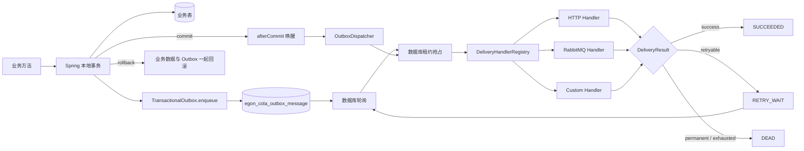
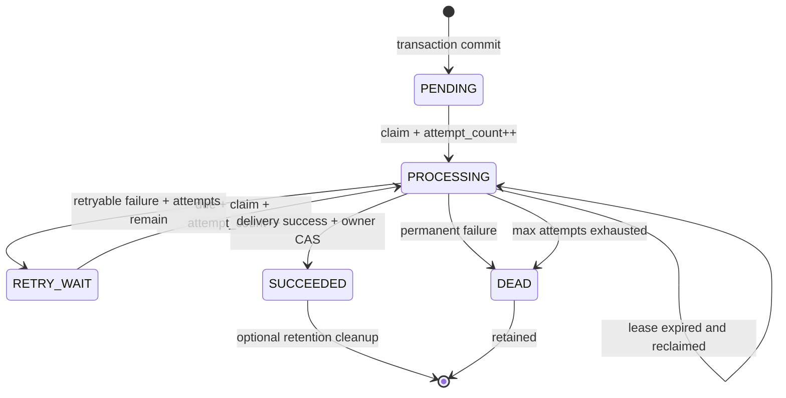

# Egon-COLA Transactional Outbox Component 设计

状态：已按确认方案编写，等待 Spec 审阅

文档阶段：组件详细设计，不包含实施计划和代码实现

## 1. 背景与问题定义

`/Users/mario/SelfProject/blog/source/_posts/java/event.md` 描述了一套“本地任务消息组件”：

1. 业务数据与本地任务记录在一个业务方法内写入；
2. 写入后发布 Spring Event；
3. 异步监听器通过 HTTP 或 RabbitMQ 对外投递；
4. 定时任务扫描失败记录并补偿；
5. 业务方可以直接调用服务，也可以使用注解接入。

这个方向对应业界的 Transactional Outbox 模式，但原文实现仍是教学原型，不能直接作为
Egon-COLA 的生产级组件。原实现存在以下关键缺口：

1. 直接调用 `DataSource#getConnection()`，不能保证获得 Spring 当前事务绑定的连接；
2. 受理服务捕获并吞掉落库异常，可能出现业务提交而 outbox 记录不存在；
3. 普通 `@EventListener + @Async` 可能在业务事务提交前执行外部调用；
4. RabbitMQ 发送没有 publisher confirm，无法把“方法返回”视为 broker 已确认；
5. JVM 内存中的 `lastId` 和人工“门牌号”不能解决多实例并发、崩溃恢复和毒消息阻塞；
6. 状态表缺少尝试次数、下次执行时间、租约、错误原因、死信和关键索引；
7. 注解解析失败只记录警告，可能静默提交业务但不产生消息；
8. 原始 URL、Authorization 等信息进入任务表，存在凭据泄漏和任意目标调用风险。

本组件不复刻这些缺陷。它将文章的业务诉求重构为一个明确承诺
**同库事务落盘、提交后至少一次投递、可恢复补偿**的 Transactional Outbox Starter。

## 2. 已确认决策

1. 新组件命名为 `egon-cola-component-transactional-outbox`。
2. 组件根 POM 只聚合两个功能模块：
   - `egon-cola-component-transactional-outbox-starter`
   - `egon-cola-component-transactional-outbox-test`
3. 不拆分独立的 core、jdbc、http、rabbit、admin 或 adapter Maven 模块。
4. 组件包根为 `top.egon.cola.component.outbox`。
5. 配置前缀为 `egon.cola.component.transactional-outbox`。
6. Java 基线为 21，Spring Boot 基线为当前仓库的 3.5.x。
7. V1 数据库正式支持范围为 PostgreSQL；MySQL、SQLite、Oracle、SQL Server 和 R2DBC
   不在 V1 兼容承诺中。
8. V1 同时提供直接 API 和可选注解；直接 API 是主入口。
9. 默认强制调用发生在活动事务内，并强制 outbox 使用与业务一致的
   `DataSource` 和事务管理器。
10. 内置 HTTP、RabbitMQ 投递器，并提供自定义 `DeliveryHandler` SPI。
11. V1 不内置 Kafka、RocketMQ、WebSocket、Socket 或 RPC 投递器。
12. 投递语义为 at-least-once，不宣称 exactly-once。
13. 使用数据库租约和状态条件更新处理多实例并发，不使用内存游标或“门牌号”保证正确性。
14. 数据库只保存逻辑 destination，不保存密码、Authorization 或任意完整 URL。
15. V1 包含指标、日志、成功记录清理能力和死信通知扩展点。
16. V1 不包含 Admin、UI、HTTP 管理接口、人工重放 API 或独立调度服务。
17. V1 只新增 component，不修改现有 archetype 中的 domain-event 和 RabbitMQ 示例。
18. Spec 存放在仓库级 `docs/superpowers/specs`，不创建组件本地 `docs` 目录。

## 3. 目标

组件必须提供以下能力：

1. 在业务事务中持久化 outbox 记录；
2. outbox 入库失败时让业务事务回滚；
3. 业务事务回滚时不留下可投递记录；
4. 事务提交后立即发出一次进程内唤醒，降低正常路径延迟；
5. 即使提交后唤醒丢失，也能通过数据库轮询发现并投递；
6. 多应用实例安全抢占任务，避免同一时刻由多个正常 worker 同时处理同一租约；
7. worker 崩溃后通过租约过期恢复任务；
8. 支持 HTTP、RabbitMQ 和业务自定义投递策略；
9. 对可重试失败执行有限指数退避，对永久失败或耗尽任务转为 DEAD；
10. 为每次重试保持稳定的 `messageId`，帮助下游实现幂等；
11. 提供可选业务幂等键，阻止同一业务动作重复创建不同 outbox 记录；
12. 提供 Spring Boot 自动配置、属性校验、扩展 Bean 覆盖和清晰的启动失败信息；
13. 提供日志、Micrometer 指标、死信通知和可选成功记录清理；
14. 用真实 PostgreSQL 并发测试证明事务、租约和状态条件更新语义；
15. 在不启动长期运行应用的前提下，通过 Maven 测试完成验证。

## 4. 非目标

V1 明确不实现：

1. XA、2PC、TCC、SAGA 或其他分布式事务协议；
2. exactly-once 投递承诺；
3. 下游业务幂等存储；
4. 消息消费框架或 inbox 表；
5. RabbitMQ 队列、交换机的自动声明与治理；
6. 任意 URL 通用 webhook 平台；
7. Kafka、RocketMQ、Pulsar 或其他 MQ 的内置适配；
8. 管理后台、管理 HTTP API、人工重放 API；
9. 独立部署的调度服务；
10. 跨数据库事务；
11. 多个 outbox 表的动态路由；
12. MySQL、SQLite、Oracle、SQL Server 方言；
13. R2DBC 和 reactive transaction；
14. payload schema registry 和事件契约注册中心；
15. 业务事件建模框架；
16. 对现有 archetype 的自动替换或迁移；
17. 自动修改消费方已有 Flyway 历史；
18. 自动建表或默认扫描组件 migration。

## 5. 组件与 Maven 结构

```text
egon-cola-components/
└── egon-cola-component-transactional-outbox/
    ├── pom.xml
    ├── README.md
    ├── README.zh-CN.md
    ├── egon-cola-component-transactional-outbox-starter/
    │   ├── pom.xml
    │   └── src/
    └── egon-cola-component-transactional-outbox-test/
        ├── pom.xml
        └── src/
```

约束：

1. `egon-cola-components/pom.xml` 聚合组件根 POM。
2. 组件根 POM 只聚合 starter 与 test。
3. `egon-cola-components-bom` 只导出：

   ```text
   top.egon:egon-cola-component-transactional-outbox-starter
   ```

4. BOM 不导出组件根 POM和 test。
5. starter 包含公共 API、JDBC 存储、调度、投递 SPI、可选内置投递器和自动配置。
6. test 提供使用示例、Spring 上下文验证和真实 PostgreSQL 集成测试。
7. 不创建第三个功能 Maven 模块。

## 6. 依赖边界

### 6.1 Starter 必需依赖

starter 可以依赖：

1. `spring-boot-starter`
2. `spring-boot-autoconfigure`
3. `spring-jdbc`
4. `spring-tx`
5. `spring-boot-starter-aop`
6. `jackson-databind`
7. `spring-boot-configuration-processor`，`optional=true`

### 6.2 Starter 可选依赖

以下依赖只用于条件化内置能力，必须为 optional，不能强迫所有消费方引入：

1. `spring-web`：提供基于 `RestClient` 的 HTTP 投递器；
2. `spring-rabbit`：提供基于 `RabbitTemplate` 的 RabbitMQ 投递器；
3. `micrometer-core`：提供指标。

消费方需要 HTTP 时，可以通过已有 `spring-boot-starter-web` 或 `spring-web` 提供类路径。
需要 RabbitMQ 时，由消费方显式引入 `spring-boot-starter-amqp`。

### 6.3 禁止的 Starter 依赖

starter 不得依赖：

1. JPA；
2. Flyway 运行时；
3. PostgreSQL JDBC Driver；
4. 数据库连接池实现；
5. Redis；
6. 动态配置中心；
7. 动态线程池组件；
8. Actuator；
9. Admin 或 test 模块；
10. Retrofit；
11. Fastjson；
12. Kafka、RocketMQ 或其他消息客户端；
13. Testcontainers。

数据库驱动、DataSource 和事务管理器由消费应用提供。starter 只使用 Spring JDBC 与标准
事务抽象。

### 6.4 Test 依赖

test 可以使用：

1. starter；
2. `spring-boot-starter-test`；
3. PostgreSQL JDBC Driver；
4. Testcontainers PostgreSQL；
5. Testcontainers RabbitMQ；
6. WireMock；
7. Awaitility。

Testcontainers 仅用于测试，不能进入 starter 传递依赖。

## 7. 总体架构



架构原则：

1. 数据库记录是唯一可靠事实来源。
2. Spring Event 只是提交后的低延迟唤醒信号，不是消息持久化设施。
3. 快速路径与轮询路径必须调用同一个 claim、deliver、transition 流程。
4. 外部调用必须发生在业务事务提交之后。
5. 外部调用期间不持有数据库行锁和业务事务。
6. 投递状态更新必须携带租约 owner 条件，过期 worker 不能覆盖新 owner 的状态。
7. 任何进程内队列、线程池和事件丢失都不能造成永久消息丢失。

## 8. 一致性与投递契约

### 8.1 组件承诺

当 `TransactionalOutbox.enqueue` 成功返回且外层业务事务最终提交时：

1. outbox 记录与业务数据同时提交；
2. 记录最终会被正常 worker 发现；
3. 在持续存在可用数据库、有效目标配置和可用下游的前提下，组件会执行有限次数投递；
4. 投递成功后记录进入 `SUCCEEDED`；
5. 永久失败或重试耗尽后记录进入 `DEAD`，不会静默消失。

当业务事务回滚时：

1. 业务数据回滚；
2. 同一事务内插入的 outbox 记录回滚；
3. 不发布 after-commit 唤醒；
4. 外部投递不得发生。

### 8.2 组件不承诺

组件不可能原子提交“远端副作用”和“本地成功状态”。以下崩溃窗口必然存在：

1. 远端已成功；
2. 当前进程在本地状态更新前崩溃；
3. 租约过期后另一 worker 再次投递。

因此组件语义必须明确为 at-least-once。下游必须基于稳定的 `messageId` 或业务幂等键处理重复。
README、Javadoc 和示例不得暗示 exactly-once。

### 8.3 核心不变量

1. 没有活动事务时，直接 enqueue 必须失败。
2. 当前事务没有绑定组件选定 DataSource 时，enqueue 必须失败。
3. outbox insert 失败必须向外抛出异常。
4. 未提交记录对其他数据库会话不可见。
5. 同一条记录同一时刻只能有一个未过期租约 owner。
6. 状态完成更新只能由当前租约 owner 执行。
7. `messageId` 在全部重试中保持不变。
8. 一个 `idempotencyKey` 只能对应一份持久化内容。
9. DEAD 记录不会被正常 poller 再次投递。
10. SUCCEEDED 记录只会被可选清理任务删除。

## 9. 公共 API

### 9.1 主入口

```java
public interface TransactionalOutbox {

    OutboxReceipt enqueue(OutboxMessage message);
}
```

`TransactionalOutbox` 是业务代码的首选入口。它不负责开启事务，调用方必须已经位于有效的
Spring 本地事务中。

### 9.2 OutboxMessage

`OutboxMessage` 是不可变请求对象，至少包含：

```text
messageId
idempotencyKey
channel
destination
payload
contentType
schemaVersion
headers
availableAt
traceId
```

字段规则：

1. `messageId`
   - 可由调用方提供；
   - 未提供时由 `OutboxIdGenerator` 生成；
   - 默认实现使用 UUID；
   - 最大 64 字符；
   - 在所有重试中保持不变。
2. `idempotencyKey`
   - 可选；
   - 最大 256 字符；
   - 用于阻止同一业务动作重复入队；
   - 不能用来声称下游 exactly-once；
   - 必须由业务使用命名空间构造，例如 `order:created:<orderId>`；
   - 不应直接包含手机号、邮箱等个人敏感信息。
3. `channel`
   - 必填；
   - 最大 64 字符；
   - 内置值为 `http`、`rabbitmq`；
   - 自定义 handler 使用自定义稳定值。
4. `destination`
   - 必填；
   - 最大 256 字符；
   - 是逻辑目标名称，不是任意 URL 或凭据。
5. `payload`
   - 必填；
   - 可以是业务对象或字符串；
   - 由 `OutboxMessageSerializer` 在事务内序列化；
   - 序列化后的 UTF-8 大小默认不得超过 1 MiB；
   - 默认以明文 text 存入业务数据库，组件 V1 不提供字段级加密；
   - 业务不得把密码、token、私钥等凭据放入 payload，数据库静态加密由部署环境负责。
6. `contentType`
   - 默认 `application/json`；
   - 最大 128 字符。
7. `schemaVersion`
   - 可选；
   - 最大 32 字符；
   - 由业务定义，不由组件解释。
8. `headers`
   - 只允许字符串键值；
   - 默认最多 64 项、序列化后最多 16 KiB；
   - 禁止保存 Authorization、Cookie、Host、Content-Length 等敏感或传输控制头。
9. `availableAt`
   - 可选；
   - 未提供时在 insert 中使用 PostgreSQL 当前时间；
   - 用于延迟首次投递。
10. `traceId`
    - 可选；
    - 最大 128 字符；
    - 只用于日志关联，不作为幂等键。

构造示例：

```java
OutboxMessage message = OutboxMessage.builder()
        .idempotencyKey("order-created:" + orderId)
        .channel("rabbitmq")
        .destination("order-created")
        .payload(new OrderCreatedEvent(orderId, userId))
        .schemaVersion("1")
        .traceId(traceId)
        .build();
```

### 9.3 OutboxReceipt

```java
public record OutboxReceipt(
        String messageId,
        String idempotencyKey,
        boolean created
) {
}
```

`created=true` 表示本次插入新记录。`created=false` 表示相同幂等键和相同持久化内容已经存在，
本次调用返回已有记录，不新建消息。

### 9.4 序列化

```java
public interface OutboxMessageSerializer {

    SerializedOutboxPayload serialize(Object payload, String contentType);
}
```

默认实现：

1. 使用应用管理的 `ObjectMapper`；
2. 不在组件内部创建隐藏 `ObjectMapper`；
3. `String` payload 在兼容 content type 时保持原值；
4. 序列化失败抛出 `OutboxSerializationException`；
5. 序列化、大小校验和 fingerprint 计算都发生在数据库 insert 前；
6. payload 和 headers 不写入日志。

### 9.5 幂等冲突

组件对持久化字段计算 SHA-256 fingerprint，参与字段包括：

```text
channel
destination
serialized payload
contentType
schemaVersion
规范化 headers
```

`availableAt` 不参与 fingerprint。它是首次调度策略，不是业务消息内容；否则调用方未显式指定
`availableAt` 时，两次使用相同幂等键 enqueue 会因为各自取到不同“当前时间”而产生假冲突。
重复 enqueue 命中已有记录时，不修改已有记录的 `availableAt`。

同一 `idempotencyKey` 再次 enqueue 时：

1. fingerprint 相同：返回已有 `OutboxReceipt(created=false)`；
2. fingerprint 不同：抛出 `OutboxIdempotencyConflictException` 并让当前业务事务回滚。

同一调用方提供的 `messageId` 已存在时，使用相同规则处理；不同内容不能覆盖已有记录。
命中已有 SUCCEEDED、DEAD、PENDING 或 RETRY_WAIT 记录都不会修改原状态，也不会隐式重放。
需要新的业务投递时必须使用新的幂等键；DEAD 的人工重放属于后续带审计的管理能力。

## 10. 直接调用模式

推荐用法：

```java
@Transactional
public void createOrder(CreateOrderCommand command) {
    Order order = orderRepository.save(command);

    transactionalOutbox.enqueue(OutboxMessage.builder()
            .idempotencyKey("order-created:" + order.id())
            .channel("rabbitmq")
            .destination("order-created")
            .payload(new OrderCreatedEvent(order.id()))
            .build());
}
```

直接调用规则：

1. 组件不自动为 `enqueue` 开启独立事务；
2. 方法必须位于调用方业务事务中；
3. 业务数据和 outbox 必须使用同一物理 DataSource；
4. 使用 JPA 时，`JpaTransactionManager` 必须能够向同一 DataSource 暴露 JDBC 连接；
5. `REQUIRES_NEW`、多事务管理器和跨库场景由业务明确设计，组件不猜测；
6. 一个事务可以多次 enqueue；
7. 同一事务中的 after-commit 唤醒应合并消息 ID，避免注册大量重复同步器。

## 11. 注解调用模式

### 11.1 注解契约

```java
@Target(ElementType.METHOD)
@Retention(RetentionPolicy.RUNTIME)
@Documented
public @interface TransactionalMessage {

    String message();
}
```

`message` 是受限 SpEL 表达式，结果必须为一个 `OutboxMessage`。

示例：

```java
@TransactionalMessage(message = "#p0.outboxMessage()")
public OrderId createOrder(CreateOrderRequest request) {
    return orderRepository.save(request).id();
}
```

或：

```java
@TransactionalMessage(message = "#result.outboxMessage()")
public CreateOrderResult createOrder(CreateOrderCommand command) {
    return orderApplicationService.create(command);
}
```

### 11.2 注解事务语义

注解切面使用组件配置的 `TransactionTemplate`，以 `PROPAGATION_REQUIRED` 包裹：

```text
目标方法执行
→ 成功返回
→ 解析 SpEL
→ enqueue
→ 提交事务
```

规则：

1. 目标方法抛出异常时不解析消息、不 enqueue，并回滚事务；
2. SpEL 解析失败、返回 null、类型错误或 enqueue 失败时回滚目标方法产生的业务数据；
3. 切面不得捕获并吞掉异常；
4. 切面不得依赖与 Spring `@Transactional` advisor 的偶然排序；
5. 同一方法额外使用默认 REQUIRED 且相同事务管理器时可以加入已有事务，但不推荐重复声明；
6. 同一方法使用不同事务管理器、`REQUIRES_NEW`、`NOT_SUPPORTED` 或其他改变事务边界的配置不受支持；
7. 能在启动期检测到的冲突必须启动失败；
8. 运行期发现事务与选定 DataSource 不一致时必须抛出事务不匹配异常；
9. 目标方法内部主动调用其他 `REQUIRES_NEW` 服务产生的独立提交，不由外层 outbox 自动覆盖。

第 1 条同时适用于 checked exception。切面必须显式标记 rollback，并在退出
`TransactionTemplate` 后恢复原始异常语义，不能因为 callback 包装把业务异常永久改写成组件异常。
切面实现 `Ordered`，默认 order 为 `Ordered.HIGHEST_PRECEDENCE + 100`，并允许通过配置调整。
无论与其他 advisor 的相对顺序如何，组件自身都必须通过 `TransactionTemplate` 明确建立或加入
选定的 REQUIRED 事务，不能把一致性依赖在默认 advisor 排序上。

### 11.3 SpEL 安全与解析

1. 始终支持 `#p0`、`#a0` 等索引参数；
2. 具备参数名元数据时可以使用命名参数；
3. 支持 `#result`；
4. 不启用 Bean 引用、类型定位、构造器或任意静态方法；
5. 表达式来自源码注解，不从外部配置动态加载；
6. V1 一次只解析一个 `OutboxMessage`；
7. 多消息事务使用直接 API；
8. 解析不到消息必须抛出 `OutboxMessageResolutionException`，禁止只记录 warning。

### 11.4 AOP 限制

注解仅支持：

1. Spring 管理 Bean；
2. public、可代理的同步方法；
3. 通过 Spring 代理发生的外部调用。

不支持：

1. self-invocation；
2. private、static 或不可代理 final 方法；
3. `Mono`、`Flux`、`Publisher`；
4. `Future`、`CompletionStage`；
5. 方法返回后仍在其他线程执行的业务事务。

检测到明显异步或 reactive 返回类型时必须拒绝配置，而不是在错误时机提交 outbox。

## 12. 数据库模型

### 12.1 表

V1 使用一个固定表：

```text
egon_cola_outbox_message
```

不支持配置任意表名，避免 SQL 标识符注入和多种 schema 漂移。应用可以通过 PostgreSQL
`search_path` 或显式 DataSource schema 管理其所在 schema。

建议 DDL：

```sql
create table egon_cola_outbox_message (
    id bigint generated by default as identity primary key,
    message_id varchar(64) not null,
    idempotency_key varchar(256),
    message_fingerprint char(64) not null,
    channel varchar(64) not null,
    destination varchar(256) not null,
    payload text not null,
    content_type varchar(128) not null,
    schema_version varchar(32),
    headers_json text not null default '{}',
    trace_id varchar(128),
    status varchar(32) not null,
    attempt_count integer not null default 0,
    max_attempts integer not null,
    next_attempt_at timestamp with time zone not null,
    locked_by varchar(128),
    locked_until timestamp with time zone,
    last_error_code varchar(64),
    last_error_message text,
    created_at timestamp with time zone not null,
    updated_at timestamp with time zone not null,
    completed_at timestamp with time zone,
    constraint ck_outbox_status check (
        status in ('PENDING', 'PROCESSING', 'RETRY_WAIT', 'SUCCEEDED', 'DEAD')
    ),
    constraint ck_outbox_attempt_count check (attempt_count >= 0),
    constraint ck_outbox_max_attempts check (max_attempts >= 1)
);

create unique index uk_outbox_message_id
    on egon_cola_outbox_message(message_id);

create unique index uk_outbox_idempotency_key
    on egon_cola_outbox_message(idempotency_key)
    where idempotency_key is not null;

create index idx_outbox_claim
    on egon_cola_outbox_message(next_attempt_at, id)
    where status in ('PENDING', 'RETRY_WAIT');

create index idx_outbox_reclaim
    on egon_cola_outbox_message(locked_until, id)
    where status = 'PROCESSING';

create index idx_outbox_cleanup
    on egon_cola_outbox_message(completed_at, id)
    where status = 'SUCCEEDED';
```

### 12.2 字段语义

1. `id`：数据库内部稳定排序键，不对业务暴露。
2. `message_id`：跨重试稳定的外部消息 ID。
3. `idempotency_key`：可选业务去重键。
4. `message_fingerprint`：检测同一幂等键是否对应不同内容。
5. `channel`：投递 handler key。
6. `destination`：逻辑目标。
7. `payload`：序列化正文。
8. `headers_json`：过滤后的非敏感业务 headers。
9. `status`：当前状态。
10. `attempt_count`：已开始的投递尝试次数；每次成功 claim 时加一。
11. `max_attempts`：enqueue 时按当前策略固化的总尝试上限，包含第一次。
12. `next_attempt_at`：首次或下一次允许 claim 的时间。
13. `locked_by`、`locked_until`：当前租约 owner token 和过期时间；token 必须包含进程
    `nodeId` 与本次 claim 生成的随机 claim ID，不能只保存稳定 nodeId。
14. `last_error_code`、`last_error_message`：最近一次失败摘要。
15. `completed_at`：进入 SUCCEEDED 或 DEAD 的时间。

V1 不额外创建 attempt history 表。每次尝试通过日志与指标观察，数据库只保存最近失败摘要。

### 12.3 Migration 规则

新增且只新增一个 migration 资源：

```text
egon-cola-component-transactional-outbox-starter/
└── src/main/resources/
    └── db/transactional-outbox/postgresql/
        └── V1__create_transactional_outbox_schema.sql
```

规则：

1. 不修改任何已有 migration；
2. starter 不依赖 Flyway；
3. 该路径不是 Spring Boot 默认 `classpath:db/migration`，不会因引入 starter 自动执行；
4. 资源是消费方创建本地 migration 的参考模板；
5. 消费方应复制内容并按自己项目的下一个 Flyway 版本重新编号；
6. 不建议把组件的 V1 location 与业务已有 migration location 直接合并，以免出现全局版本冲突；
7. test 模块可以在隔离数据库中单独加载该资源验证 DDL；
8. 组件自动配置默认校验表及关键列存在，但不自动建表。

## 13. 状态机



状态规则：

1. insert 初始状态为 `PENDING`；
2. 延迟消息仍为 PENDING，但 `next_attempt_at` 在未来；
3. claim 在短数据库事务内把记录更新为 PROCESSING；
4. 外部投递发生在 claim 事务结束之后；
5. 成功状态更新清空租约和错误字段；
6. RETRY_WAIT 设置新的 `next_attempt_at` 并清空租约；
7. DEAD 设置 `completed_at` 并清空租约；
8. 过期 PROCESSING 可以重新 claim，并增加 attempt_count；
9. DEAD 不由普通 poller 自动恢复；
10. SUCCEEDED 不再进入投递链。

## 14. 数据库抢占与租约

### 14.1 Claim

PostgreSQL claim 必须在一个短事务内完成，使用
`FOR UPDATE SKIP LOCKED` 加条件更新和 `RETURNING`。逻辑等价于：

```sql
with candidates as (
    select id
    from egon_cola_outbox_message
    where (
        status in ('PENDING', 'RETRY_WAIT')
        and next_attempt_at <= clock_timestamp()
    ) or (
        status = 'PROCESSING'
        and locked_until < clock_timestamp()
    )
    order by next_attempt_at, id
    for update skip locked
    limit :batchSize
)
update egon_cola_outbox_message m
set status = 'PROCESSING',
    attempt_count = attempt_count + 1,
    locked_by = :leaseOwner,
    locked_until = clock_timestamp() + :leaseDuration,
    updated_at = clock_timestamp()
from candidates c
where m.id = c.id
returning m.*;
```

最终 SQL 可以为查询计划和 PostgreSQL 语法做等价调整，但必须保持：

1. 跳过其他实例正在锁定的候选；
2. claim 与 attempt_count 增加原子完成；
3. 支持过期 PROCESSING 恢复；
4. 顺序稳定；
5. 批次有上限；
6. 外部调用不在 claim 事务内；
7. 每次 claim 使用新的 lease owner token，后续重新 claim 不能复用旧 token。

租约过期、due 判断、`created_at`、`updated_at`、`completed_at` 和 retry 的基准时间以 PostgreSQL
数据库时间为准，避免多实例主机时钟偏差改变抢占正确性。应用只计算退避 Duration；
repository 负责把 Duration 加到数据库当前时间。调用方显式提供的 `availableAt` 仍按其 `Instant`
解释。

### 14.2 Owner 条件更新

完成更新必须包含：

```text
id = ?
status = PROCESSING
locked_by = currentLeaseOwner
```

更新行数不是 1 时：

1. 当前 worker 已失去租约；
2. 不得覆盖新 owner 的状态；
3. 记录租约丢失指标与 warning；
4. 不再次执行外部调用；
5. 由数据库现状决定后续处理。

### 14.3 Lease 与超时

默认值：

```text
delivery timeout = 10s
lease duration = 60s
```

启动时必须校验：

```text
lease duration > delivery timeout + polling delay + safety margin
```

V1 不做租约心跳续期。内置 handler 必须遵守 delivery timeout。自定义 handler 超时后仍继续运行时，
可能在租约过期后与新 worker 重叠，这属于 at-least-once 边界，必须在 SPI Javadoc 中说明。

## 15. 提交后快速唤醒

### 15.1 事务同步

每次成功插入新记录后，组件在当前事务注册 `TransactionSynchronization`：

1. 同一事务只注册一次；
2. 事务内创建的 message ID 聚合到一个 buffer；
3. `afterCommit` 发布内部 `OutboxCommittedEvent`；
4. `afterCompletion` 清理线程绑定 buffer；
5. rollback 不发布事件；
6. `afterCommit` 内部必须捕获事件发布和 executor 拒绝异常，只记录日志与指标；
7. after-commit 快速唤醒失败不能让调用方误以为已经提交的业务事务发生了回滚。

### 15.2 事件用途

`OutboxCommittedEvent` 只包含 message ID，不携带可直接投递的业务对象。

事件监听器：

1. 将 ID 提交给专用 dispatcher executor；
2. dispatcher 仍需从数据库 claim；
3. claim 不成功时不直接投递；
4. 事件监听或线程池拒绝失败只记指标和日志；
5. poller 最终会恢复，因此事件失败不能改变业务事务结果。

starter 不使用全局 `@EnableAsync`，也不修改应用已有异步执行器。内部异步工作使用具名、可覆盖的
专用 `TaskExecutor`。

## 16. Poller 与执行器

1. poller 使用组件自有 `TaskScheduler`，不要求应用添加 `@EnableScheduling`；
2. 默认 fixed delay 为 1 秒；
3. 默认 batch size 为 100；
4. 默认并发 worker 数为 4；
5. poller 每次只做有限 claim，不做无限 while 循环霸占线程；
6. dispatcher 与 poller 共享同一个有界投递 executor；
7. executor 队列必须有界；
8. 队列满时不丢数据库记录，只跳过本次即时投递并等待后续 poll；
9. 不使用 `lastId`；
10. 不要求实例人工分配“门牌号”；
11. 多实例都可以扫描同一状态集合，由数据库锁与租约协调。

## 17. DeliveryHandler SPI

### 17.1 接口

```java
public interface DeliveryHandler {

    String channel();

    void validateDestination(String destination);

    DeliveryResult deliver(DeliveryContext context) throws Exception;
}
```

### 17.2 DeliveryContext

不可变上下文包含：

```text
messageId
channel
destination
payload
contentType
schemaVersion
headers
traceId
attempt
maxAttempts
deadline
```

不暴露数据库连接、repository 或可修改内部状态。

### 17.3 DeliveryResult

```java
DeliveryResult.success()
DeliveryResult.retryableFailure(code, message)
DeliveryResult.permanentFailure(code, message)
```

规则：

1. 普通业务失败通过 `DeliveryResult` 表达；
2. 未捕获异常交给 `DeliveryFailureClassifier` 分类；
3. error message 入库前清洗并截断；
4. response body 不写入 outbox 表；
5. handler 不负责修改数据库状态；
6. 状态机编排由 dispatcher 统一负责。

### 17.4 Registry

`DeliveryHandlerRegistry` 在启动时收集 Spring Bean：

1. channel 必须非空且符合稳定标识规则；
2. 同一 channel 必须恰好一个 handler；
3. 重复 channel 启动失败；
4. enqueue 时 handler 必须存在；
5. 内置 handler 和自定义 handler 可以通过 `@ConditionalOnMissingBean` 替换；
6. 数据库遗留记录找不到 handler 时转 DEAD，并通知死信 listener，不能阻塞整个批次。

destination 在每次投递时解析，因此应用配置变更会影响尚未完成的消息和后续重试。需要保持旧目标
稳定时，业务必须使用版本化 destination 名称，例如 `order-created-v1`、`order-created-v2`。
删除仍有积压消息引用的 destination 会使这些消息进入 DEAD。这个取舍让凭据轮换和端点治理留在
应用配置中，同时避免把敏感连接信息固化进 outbox 表。

## 18. HTTP 投递器

### 18.1 启用条件

内置 HTTP handler 仅在以下条件满足时注册：

1. `spring-web` 与 `RestClient` 在类路径；
2. HTTP delivery 未禁用；
3. 存在 `HttpDestinationResolver`。

### 18.2 逻辑目标

```java
public interface HttpDestinationResolver {

    HttpDeliveryTarget resolve(String destination);
}
```

starter 提供基于配置 Map 的默认 resolver；应用提供自定义 `HttpDestinationResolver` Bean 时，
默认实现后退。未知 destination 必须在 enqueue 的 `validateDestination` 阶段失败。

`HttpDeliveryTarget` 可以包含：

```text
uri
method
connect timeout
read timeout
固定非敏感 headers
credential reference/provider
```

敏感认证信息通过独立扩展点在投递时获取：

```java
public interface HttpCredentialProvider {

    Map<String, String> resolveHeaders(String destination);
}
```

默认 provider 返回空 Map。应用可以对接环境变量、Secret Manager 或自己的凭据服务。
credential provider 返回的 headers 只存在于单次投递内存中，不能合并回 outbox record，
不能写入日志或指标。

规则：

1. outbox 表只保存 destination 名称；
2. URI 由 resolver 在投递时解析；
3. 凭据来自环境变量、Secret Manager 或业务自定义 provider；
4. 消息 headers 不能覆盖 Host、Authorization、Cookie、Content-Length；
5. 默认添加 `Idempotency-Key: <messageId>`；
6. 默认添加稳定的消息 ID header；
7. 不允许数据库 payload 指定完整 URL；
8. 默认只允许 `http`、`https` scheme，URI 不允许携带 user-info；
9. 默认关闭自动重定向，防止经重定向绕过 destination allowlist。

### 18.3 HTTP 成功与失败分类

默认规则：

1. `2xx`：成功；
2. 连接失败、读超时、`408`、`425`、`429`、`5xx`：可重试；
3. 其他 `4xx`：永久失败；
4. `3xx`：默认永久失败，不自动跨目标重定向；
5. 分类器可以由应用覆盖；
6. 响应正文不记录日志、不存数据库；
7. 日志只记录 messageId、destination、HTTP status、attempt 和耗时。

## 19. RabbitMQ 投递器

### 19.1 启用条件

内置 RabbitMQ handler 仅在以下条件满足时注册：

1. `spring-rabbit` 在类路径；
2. 存在 `RabbitTemplate`；
3. RabbitMQ delivery 未禁用；
4. 存在 `RabbitDestinationResolver`；
5. publisher confirm 使用 correlated 模式；
6. mandatory return 能够识别不可路由消息。

配置不满足确认语义时必须启动失败，不能退化为“调用 `convertAndSend` 即成功”。

### 19.2 逻辑目标

```java
public interface RabbitDestinationResolver {

    RabbitDeliveryTarget resolve(String destination);
}
```

starter 提供基于配置 Map 的默认 resolver；应用提供自定义 `RabbitDestinationResolver` Bean 时，
默认实现后退。未知 destination 必须在 enqueue 阶段失败。

target 至少包含：

```text
exchange
routingKey
mandatory
confirmTimeout
固定非敏感 headers
```

交换机和 routing key 来自应用配置或 resolver，不由表中任意 JSON 决定。

### 19.3 RabbitMQ 成功与失败分类

1. broker confirm ack 且没有不可路由 return：成功；
2. nack：可重试；
3. confirm 超时：可重试；
4. 连接异常：可重试；
5. mandatory return：默认永久失败，允许分类器覆盖；
6. 消息属性 `messageId` 固定为 outbox messageId；
7. 消息 delivery mode 为 persistent；
8. headers 包含 attempt 和 schemaVersion，但不得包含凭据；
9. 组件不自动声明 exchange、queue 或 binding。

## 20. 重试策略

### 20.1 默认值

```text
max attempts = 10
initial delay = 1s
multiplier = 2.0
max delay = 5m
jitter = 20%
```

`max attempts` 包含第一次投递。

### 20.2 退避

默认退避为有限指数退避加随机抖动：

```text
delay = min(initialDelay * multiplier^(attempt - 1), maxDelay)
jitteredDelay = delay ± jitter
```

要求：

1. 计算结果不得为负；
2. 使用可注入随机源便于确定性测试，策略只返回 Duration；
3. 退避策略通过 `OutboxRetryPolicy` 可覆盖；
4. enqueue 时把 maxAttempts 固化进记录；
5. 已存在记录不因运行配置变化被静默提高尝试上限。

### 20.3 失败处理

1. 可重试且 attempt_count < max_attempts：进入 RETRY_WAIT；
2. 可重试但已达上限：进入 DEAD，错误码 `OUTBOX_RETRY_EXHAUSTED`；
3. 永久失败：立即进入 DEAD；
4. handler 抛出异常：由分类器决定 retryable 或 permanent；
5. `Error` 默认不吞掉，worker 记录后让租约恢复；
6. 单条消息失败不得停止同批其他消息。

## 21. 事务与多数据源

### 21.1 默认解析

自动配置优先使用：

1. 唯一或 `@Primary` 的 `DataSource`；
2. 与其匹配的唯一或 `@Primary` `PlatformTransactionManager`。

多候选无法唯一确定时，不得随机选择或静默关闭，必须要求配置：

```yaml
egon:
  cola:
    component:
      transactional-outbox:
        storage:
          data-source-bean-name: businessDataSource
          transaction-manager-bean-name: businessTransactionManager
```

### 21.2 事务 Guard

直接 enqueue 前必须验证：

1. `TransactionSynchronizationManager` 存在活动事务；
2. 事务同步已开启；
3. 选定 DataSource 的连接参与当前事务；
4. JDBC insert 实际使用 Spring 事务绑定连接。

失败分别抛出：

```text
OutboxTransactionRequiredException
OutboxTransactionSynchronizationException
OutboxTransactionMismatchException
```

不得仅依赖“线程上有任意事务”，因为该事务可能属于另一个数据库。

### 21.3 JDBC 规则

1. 使用应用管理的 `JdbcTemplate` 或基于选定 DataSource 创建的组件专用 `JdbcTemplate`；
2. 禁止直接 `dataSource.getConnection()`；
3. 如需底层连接，使用 `DataSourceUtils`；
4. 不手动 commit 或 rollback；
5. 不关闭 Spring 绑定连接；
6. SQL 异常转换为组件运行时异常并向业务层传播。

## 22. 自动配置

starter 通过以下文件注册：

```text
META-INF/spring/org.springframework.boot.autoconfigure.AutoConfiguration.imports
```

主配置类：

```text
TransactionalOutboxAutoConfiguration
```

自动配置顺序位于 DataSource、JdbcTemplate、Transaction 和可选 Rabbit 自动配置之后。

主要 Bean：

```text
TransactionalOutbox
OutboxMessageSerializer
OutboxIdGenerator
OutboxStore
OutboxTransactionGuard
OutboxRetryPolicy
DeliveryFailureClassifier
DeliveryHandlerRegistry
HttpDestinationResolver
HttpCredentialProvider
RabbitDestinationResolver
OutboxDispatcher
OutboxPoller
OutboxTaskScheduler
OutboxDeliveryExecutor
OutboxCleanupJob
OutboxDeadLetterNotifier
```

条件规则：

1. `enabled=false` 时不注册运行 Bean；
2. 没有 DataSource 时自动配置后退，不修改无数据库应用；
3. 发现用户自定义同类型核心 Bean 时使用 `@ConditionalOnMissingBean`；
4. 多 DataSource 歧义时给出明确启动异常；
5. HTTP、Rabbit、Micrometer 使用各自 `@ConditionalOnClass`；
6. 自动配置不得使用大范围 `@ComponentScan`；
7. starter 不添加全局 `@EnableAsync`、`@EnableScheduling` 或修改应用 executor；
8. 所有内部线程必须有 `egon-cola-outbox-` 前缀。

## 23. 配置模型

建议配置：

```yaml
egon:
  cola:
    component:
      transactional-outbox:
        enabled: true
        node-id:
        annotation:
          enabled: true
          order: -2147483548
        storage:
          data-source-bean-name:
          transaction-manager-bean-name:
          validate-schema: true
        polling:
          enabled: true
          fixed-delay: 1s
          batch-size: 100
          concurrency: 4
        delivery:
          timeout: 10s
          lease-duration: 60s
          queue-capacity: 1000
        retry:
          max-attempts: 10
          initial-delay: 1s
          multiplier: 2.0
          max-delay: 5m
          jitter: 0.2
        payload:
          max-bytes: 1MB
          max-header-count: 64
          max-header-bytes: 16KB
        http:
          enabled: false
          destinations:
            order-callback:
              uri: ${ORDER_CALLBACK_URI}
              method: POST
              connect-timeout: 2s
              read-timeout: 10s
              fixed-headers:
                X-Source: order-service
        rabbitmq:
          enabled: false
          confirm-timeout: 5s
          destinations:
            order-created:
              exchange: order.events
              routing-key: order.created
              mandatory: true
        cleanup:
          enabled: false
          success-retention: 7d
          fixed-delay: 1h
          batch-size: 500
        shutdown:
          grace-period: 30s
```

规则：

1. duration 和 data size 使用 Spring Boot 类型；
2. 非法范围启动失败；
3. `node-id` 为空时生成进程级唯一值，包含主机、进程和随机后缀；
4. cleanup 默认关闭，避免 starter 未经业务确认删除审计数据；
5. DEAD 永不由 cleanup 自动删除；
6. HTTP/Rabbit enabled 只表示允许条件化注册，缺少对应类路径时不会强制引入依赖；
7. HTTP 与 RabbitMQ 内置 handler 默认关闭，消费方必须显式启用需要的渠道；
8. RabbitMQ 只有显式启用后才校验 publisher confirm 和 mandatory return；
9. HTTP 默认 resolver 禁止在 `fixed-headers` 中配置 Authorization、Cookie 等敏感头；
10. HTTP URI 和 Rabbit exchange/routing key 只从应用配置或自定义 resolver 获取，不从表中获取；
11. 配置元数据必须由 configuration processor 生成。

## 24. 错误模型

公共异常继承：

```text
OutboxException
├── OutboxConfigurationException
├── OutboxValidationException
├── OutboxTransactionRequiredException
├── OutboxTransactionSynchronizationException
├── OutboxTransactionMismatchException
├── OutboxSerializationException
├── OutboxIdempotencyConflictException
├── OutboxMessageResolutionException
└── OutboxStorageException
```

规则：

1. enqueue 路径异常是运行时异常，必须能触发 Spring 默认事务回滚；
2. 不把普通投递失败抛回已经提交的业务调用方；
3. 投递失败通过状态、日志、指标和死信 listener 表达；
4. 异常消息不得包含 payload、Authorization、Cookie 或完整凭据；
5. `last_error_message` 入库前默认截断到 2,000 字符；
6. SQL 和网络原始异常保留为 cause，但对外 message 使用稳定摘要。

## 25. 可观测性

### 25.1 日志

日志上下文可以包含：

```text
messageId
idempotencyKey hash
channel
destination
status
attempt
workerId
traceId
duration
errorCode
```

禁止记录：

```text
payload
headers 全文
Authorization
Cookie
HTTP response body
MQ 凭据
数据库密码
```

### 25.2 Micrometer

存在 Micrometer 时提供：

```text
egon.cola.outbox.enqueue
egon.cola.outbox.claim
egon.cola.outbox.delivery
egon.cola.outbox.retry
egon.cola.outbox.dead
egon.cola.outbox.lease_lost
egon.cola.outbox.delivery.duration
egon.cola.outbox.backlog
```

tag 只允许低基数字段，例如：

```text
channel
result
status
```

不得把 messageId、idempotencyKey、URL 或任意 destination 直接作为指标 tag。

backlog gauge 使用定时缓存值，不在每次监控 scrape 时执行无界数据库查询。

## 26. DEAD 与清理

### 26.1 Dead Letter Listener

```java
public interface OutboxDeadLetterListener {

    void onDead(OutboxDeadLetterEvent event);
}
```

规则：

1. 状态成功转为 DEAD 后再异步通知 listener；
2. listener 失败不回滚 DEAD 状态；
3. 多 listener 相互隔离；
4. listener 只接收脱敏摘要；
5. V1 不提供把 DEAD 改回 PENDING 的公共 API；
6. 业务如需人工重放，后续单独设计带审计的管理能力。

### 26.2 成功记录清理

1. cleanup 默认关闭；
2. 启用后只删除超过 retention 的 SUCCEEDED；
3. 按主键小批量删除；
4. 每次删除数量有上限；
5. 不删除 PENDING、PROCESSING、RETRY_WAIT 或 DEAD；
6. 清理失败只影响清理任务，不影响投递；
7. 删除属于明确配置后的数据生命周期行为；
8. 删除 SUCCEEDED 后，组件对该行 `messageId` 和 `idempotencyKey` 的 enqueue 去重记忆同时结束；
9. cleanup retention 因而也是组件级 enqueue 幂等窗口，README 必须明确说明；
10. 下游基于 messageId 的幂等保留期由下游自行决定，不能假设与 outbox cleanup 相同。

## 27. 生命周期与优雅停机

组件运行部分使用 `SmartLifecycle` 或等价生命周期协调：

1. 启动时先完成 schema 校验、handler registry 校验和配置校验；
2. 再启动 scheduler 与 dispatcher；
3. shutdown 时先停止新的 poll 和 claim；
4. 等待已经进入投递 executor 的任务，默认最多 30 秒；
5. 未完成任务不强制标记成功或失败；
6. 进程退出后由租约过期恢复；
7. 不在 JVM shutdown hook 中执行数据库大批量状态改写；
8. 生命周期日志不输出敏感配置。

## 28. 设计模式选择

### 28.1 Transactional Outbox

核心采用 Transactional Outbox，因为真实变化点是“本地数据库事务不能与远端 HTTP/MQ
组成一个原子事务”。本地持久化记录和补偿 worker 能把丢失风险转换为可恢复状态。

### 28.2 Strategy + Adapter

`DeliveryHandler` 使用 Strategy 表达 HTTP、RabbitMQ 和自定义渠道差异；内置 handler 同时承担
外部框架 Adapter 职责。Spring 容器负责构造，Registry 只负责唯一性和查找。

### 28.3 Facade

`TransactionalOutbox` 是业务侧 Facade，隐藏序列化、事务校验、fingerprint、JDBC 和
after-commit buffer。

### 28.4 Observer 的受限使用

Spring Event 只作为 after-commit 唤醒 Observer。它不是可靠队列，不参与一致性承诺。

### 28.5 不采用的模式

1. 不为五个状态建立 State 类层次；枚举、数据库条件更新和集中状态机更直接。
2. 不使用 Chain of Responsibility；一次投递只选择一个 handler。
3. 不使用 Abstract Factory；Spring 已负责 handler 和基础设施 Bean 的创建。
4. 不使用 Template Method 拆出深层私有调用链；dispatcher 保持可顺序阅读的直接编排。
5. 不照搬完整 DDD 四层目录；这是一个中间件 starter，清晰包边界比形式化层数更重要。

## 29. 包结构

```text
top.egon.cola.component.outbox
├── api
│   ├── TransactionalOutbox
│   ├── OutboxMessage
│   └── OutboxReceipt
├── annotation
│   └── TransactionalMessage
├── aop
│   ├── TransactionalMessageAop
│   └── OutboxMessageExpressionResolver
├── autoconfigure
│   ├── TransactionalOutboxAutoConfiguration
│   └── TransactionalOutboxProperties
├── serialization
│   ├── OutboxMessageSerializer
│   └── JacksonOutboxMessageSerializer
├── store
│   ├── OutboxStore
│   ├── OutboxRecord
│   ├── OutboxStatus
│   └── PostgresqlJdbcOutboxStore
├── transaction
│   ├── OutboxTransactionGuard
│   └── OutboxAfterCommitBuffer
├── dispatch
│   ├── OutboxDispatcher
│   ├── OutboxPoller
│   └── OutboxWorkerIdentity
├── delivery
│   ├── DeliveryHandler
│   ├── DeliveryHandlerRegistry
│   ├── DeliveryContext
│   ├── DeliveryResult
│   └── DeliveryFailureClassifier
├── delivery.http
│   ├── HttpDeliveryHandler
│   ├── HttpDestinationResolver
│   ├── PropertiesHttpDestinationResolver
│   ├── HttpCredentialProvider
│   └── HttpDeliveryTarget
├── delivery.rabbitmq
│   ├── RabbitDeliveryHandler
│   ├── RabbitDestinationResolver
│   ├── PropertiesRabbitDestinationResolver
│   └── RabbitDeliveryTarget
├── retry
│   ├── OutboxRetryPolicy
│   └── ExponentialJitterRetryPolicy
├── event
│   ├── OutboxCommittedEvent
│   └── OutboxDeadLetterEvent
├── deadletter
│   ├── OutboxDeadLetterListener
│   └── OutboxDeadLetterNotifier
├── cleanup
│   └── OutboxCleanupJob
├── observability
│   └── OutboxMetrics
└── exception
    ├── OutboxException
    ├── OutboxConfigurationException
    ├── OutboxValidationException
    ├── OutboxTransactionRequiredException
    ├── OutboxTransactionSynchronizationException
    ├── OutboxTransactionMismatchException
    ├── OutboxSerializationException
    ├── OutboxIdempotencyConflictException
    ├── OutboxMessageResolutionException
    └── OutboxStorageException
```

包结构可以在不改变公共契约和职责边界的前提下做小幅合并，但不得再拆成新的 Maven 模块。

## 30. 测试策略

### 30.1 单元测试

必须覆盖：

1. `OutboxMessage` 字段、大小和敏感 header 校验；
2. Jackson 序列化；
3. fingerprint 稳定性；
4. 幂等相同内容与冲突内容；
5. transaction guard 各失败分支；
6. after-commit buffer 合并、commit 与 rollback；
7. retry 退避边界与 jitter；
8. DeliveryHandlerRegistry 唯一性；
9. HTTP 状态分类；
10. HTTP/Rabbit property-backed destination resolver 与未知目标；
11. Rabbit confirm、nack、timeout 和 return 分类；
12. owner CAS 更新失败；
13. DEAD listener 隔离；
14. cleanup 只删除 SUCCEEDED，并验证幂等窗口结束语义；
15. 配置属性校验；
16. SpEL 参数、结果、null、错误类型和受限能力；
17. AOP 异常传播与原始方法不重复执行。

### 30.2 PostgreSQL 集成测试

使用真实 PostgreSQL Testcontainer，必须证明：

1. 业务写入和 outbox insert 同时 commit；
2. 业务异常时两者同时 rollback；
3. outbox insert 异常导致业务 rollback；
4. 没有事务时 enqueue 失败；
5. 另一个事务管理器绑定时 enqueue 失败；
6. 两个并发 worker 不会同时 claim 同一未过期租约；
7. claim 后数据库事务立即释放行锁；
8. 过期 PROCESSING 可以恢复；
9. 即使同一应用实例重新 claim，新的 claim token 也能阻止旧 owner 覆盖新状态；
10. retry 条件和 `next_attempt_at` 生效；
11. 毒消息不阻塞同批其他消息；
12. unique messageId 生效；
13. partial unique idempotencyKey 生效；
14. migration 可以在空 PostgreSQL 数据库执行；
15. claim 查询使用预期索引，至少通过 SQL 结构和必要的 explain 断言验证。

### 30.3 HTTP 集成测试

使用 WireMock 验证：

1. 2xx 成功；
2. 429、5xx 和 timeout 重试；
3. 普通 4xx 进入 DEAD；
4. 3xx 不跨目标自动重定向；
5. messageId 幂等 header；
6. 敏感 header 不能由消息覆盖；
7. response body 不进入数据库错误字段。

### 30.4 RabbitMQ 集成测试

使用 RabbitMQ Testcontainer 验证：

1. publisher confirm ack 后才成功；
2. nack 重试；
3. confirm timeout 重试；
4. mandatory return 分类；
5. messageId 与持久化属性；
6. 重试使用同一 messageId；
7. 组件不自动声明业务拓扑。

### 30.5 Auto-Configuration 与示例测试

使用 `ApplicationContextRunner` 和 test 模块样例验证：

1. 单 DataSource 自动装配；
2. 多 DataSource 歧义失败；
3. 显式 bean name 选择；
4. 缺少 DataSource 时后退；
5. optional HTTP、Rabbit、Micrometer 条件；
6. 自定义 handler 覆盖；
7. annotation enabled/disabled；
8. README 中直接 API 和注解示例能够编译并执行。

## 31. 验收标准

### AC-001 模块与 BOM

组件根只包含 starter 和 test，父 reactor 正确聚合，BOM 只导出 starter。

### AC-002 自动配置

starter 使用 `AutoConfiguration.imports`，不使用 `spring.factories` 或大范围组件扫描。

### AC-003 同事务提交

真实 PostgreSQL 测试证明业务数据和 outbox 在同一事务提交。

### AC-004 同事务回滚

业务异常或 outbox insert 异常都让两类数据一起回滚。

### AC-005 无事务失败

直接 API 在无事务环境下明确失败，不自动创建一个看似可靠的独立事务。

### AC-006 DataSource 匹配

当前事务与选定 DataSource 不一致时明确失败。

### AC-007 提交前不投递

任何 HTTP/MQ 外部调用都不能在业务 commit 前发生。

### AC-008 唤醒丢失可恢复

禁用或丢弃 after-commit 事件后，poller 仍能发现并投递记录。

### AC-009 多实例抢占

并发 PostgreSQL 测试证明未过期租约不会被两个 worker 同时 claim。

### AC-010 崩溃恢复

过期 PROCESSING 能被重新 claim，旧 owner 不能覆盖新状态。

### AC-011 有限重试

可重试失败按配置退避，达到最大次数后进入 DEAD。

### AC-012 毒消息隔离

单条永久失败不阻止同批其他消息完成。

### AC-013 HTTP 语义

HTTP 成功、可重试、永久失败和幂等 header 通过集成测试。

### AC-014 RabbitMQ 确认

只有 publisher confirm ack 且没有 return 时才标记成功。

### AC-015 扩展渠道

应用可以只注册一个 `DeliveryHandler` Bean 新增渠道，不修改 dispatcher。

### AC-016 幂等键

相同幂等键与相同内容返回已有 receipt；不同内容让业务事务回滚。

### AC-017 注解失败安全

目标异常、表达式错误、类型错误和 insert 失败都不能静默提交业务。

### AC-018 安全

数据库、日志和指标不包含 Authorization、Cookie、payload 全文或响应正文。

### AC-019 可观测性

低基数指标、结构化日志、死信 listener 和租约丢失观测可用。

### AC-020 清理边界

清理默认关闭；启用后只删除过期 SUCCEEDED，不删除 DEAD 或待处理状态。

### AC-021 依赖边界

starter 不传递 PostgreSQL Driver、Flyway、Actuator、Redis、Testcontainers 或其他 MQ 客户端。

### AC-022 Schema

只新增一个 PostgreSQL migration 模板，不修改已有 migration，不自动执行。

### AC-023 兼容边界

README 明确 Java 21、Spring Boot 3.5.x、PostgreSQL、imperative JDBC 和 at-least-once。

### AC-024 不启动长期服务

验证通过 Maven 测试完成，不自动启动长期运行的测试应用。

## 32. 验证命令

实施阶段至少执行：

```bash
./mvnw -B -ntp \
  -pl egon-cola-components/egon-cola-component-transactional-outbox/egon-cola-component-transactional-outbox-starter,egon-cola-components/egon-cola-component-transactional-outbox/egon-cola-component-transactional-outbox-test \
  -am test
```

```bash
./mvnw -B -ntp -f egon-cola-components/pom.xml test
```

```bash
./mvnw -B -ntp \
  -pl egon-cola-components/egon-cola-component-transactional-outbox/egon-cola-component-transactional-outbox-starter \
  -am dependency:tree \
  -Dincludes=org.flywaydb,org.postgresql,org.xerial,org.springframework.boot:spring-boot-starter-actuator,org.redisson
```

因为新增 component 会修改共享 reactor 与 BOM，完成后还必须执行：

```bash
./mvnw -B -ntp clean integration-test
```

以及：

```bash
git diff --check
```

验证报告必须区分：

1. 单元测试；
2. 真实 PostgreSQL 测试；
3. HTTP/Rabbit 集成测试；
4. component reactor；
5. root integration-test；
6. 依赖边界；
7. 未执行或受环境限制的项目。

## 33. 文档要求

组件实现时提供：

1. `README.md`
2. `README.zh-CN.md`

README 必须包含：

1. 适用问题和非适用问题；
2. at-least-once 与重复投递说明；
3. 直接 API 推荐用法；
4. 注解用法和 AOP 限制；
5. PostgreSQL migration 复制与重新编号说明；
6. 单 DataSource 与多 DataSource 配置；
7. HTTP destination 配置；
8. Rabbit publisher confirm 前置条件；
9. 自定义 DeliveryHandler 示例；
10. 重试、DEAD 和清理策略；
11. 指标与安全说明；
12. 不支持 reactive transaction、跨库和 exactly-once。

README 不得让用户通过 `new CountDownLatch(1).await()` 观察异步结果，也不得用无限等待作为样例
或测试完成条件。

## 34. 与现有 Archetype 的边界

当前 web archetype 已有提交后发布 domain event 的示例，并明确不宣称 transactional outbox。
本次工作：

1. 不修改该示例；
2. 不自动把 `OrganizationTransactionHooks` 替换为本组件；
3. 不修改 RabbitMQ command 重试；
4. 不改变 light/service/web archetype 依赖；
5. 不修改 archetype `verify.groovy`。

后续如需让生成工程采用 outbox，必须单独设计：

1. 哪些领域事件进入 outbox；
2. 事件契约与 destination；
3. migration 如何进入生成工程；
4. 测试 profile 如何提供 PostgreSQL/Rabbit；
5. 与当前 after-commit publisher 的迁移和兼容方式。

## 35. 后续演进边界

V1 的扩展点允许后续独立增加：

1. MySQL 方言；
2. Kafka/RocketMQ handler；
3. inbox/consumer deduplication component；
4. 带权限、审计和并发控制的人工重放管理能力；
5. DEAD 独立归档；
6. payload schema registry；
7. 多租户或分区扫描；
8. reactive/R2DBC 版本。

这些能力不能以预留空模块、空接口或未使用字段的方式提前进入 V1。新增能力必须有明确需求和
独立设计。

## 36. Spec 完成边界

本 Spec 固化的是组件需求、公共契约、事务语义、数据库模型、投递语义、扩展边界、测试范围和
验收标准。

本 Spec 审阅通过前：

1. 不创建 component 目录；
2. 不修改 reactor 或 BOM；
3. 不创建 migration；
4. 不编写 starter/test 代码；
5. 不进入实施计划。

用户确认本 Spec 后，下一步才使用 writing-plans 流程生成逐任务实施计划。
