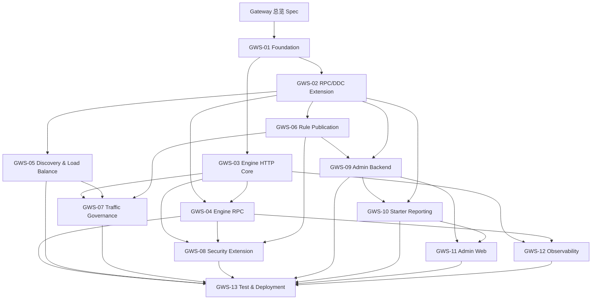

# Egon-COLA Gateway 子 Spec 索引

状态：已实现，待用户验收

父文档：`2026-07-24-gateway-component-design.md`

文档阶段：实施级设计、计划与代码已完成

## 1. 目的

Gateway 是由 Engine、Admin、Starter、Provider Runtime 和 Test 共同组成的大型
Component 平台。父 Spec 已经确认产品范围与总体技术路线，本索引用于：

1. 把父 Spec 拆成可以独立审核、独立实施和独立验收的能力域；
2. 固定子 Spec 之间的依赖顺序，防止不同文档重复定义同一契约；
3. 保证原始 29 章能力都有唯一主责文档；
4. 明确哪些前置能力需要先在 RPC/DDC Component 中补齐；
5. 记录“子 Spec 审核 → 实施计划 → 代码实现”的完整交付链。

GWS-01～GWS-13 均已形成实施 Plan 并完成代码实现。实现证据、验证层级和未执行的
运行态验证边界见 `2026-07-25-gateway-implementation-acceptance.md`。

## 2. 拆分原则

采用“能力域为主、产品模块为辅”的混合拆分：

- 不按 Engine/Admin/Starter/Test 四个模块各写一份巨型文档；
- 不按 PR 或迭代批次重复定义领域模型和跨进程协议；
- 一个稳定契约只在一份主责 Spec 中定义，其他文档只引用；
- 每份 Spec 必须可以形成一个独立实施计划和独立验收结果；
- 子 Spec 不得改变父 Spec 已确认的 Nginx、Nacos、Dubbo、鉴权和 Starter 边界。

## 3. 子 Spec 清单

| 编号 | 子 Spec | 主责范围 | 前置依赖 |
|---|---|---|---|
| GWS-01 | `2026-07-25-gateway-foundation-module-contract-design.md` | 工程模块、分层、公共身份、版本、错误与依赖规则 | 父 Spec |
| GWS-02 | `2026-07-25-gateway-rpc-ddc-extension-design.md` | RPC/DDC 必要扩展及稳定机器契约 | GWS-01 |
| GWS-03 | `2026-07-25-gateway-engine-http-core-design.md` | 自研 Engine Core、HTTP Listener、路由和 HTTP Upstream | GWS-01 |
| GWS-04 | `2026-07-25-gateway-engine-rpc-design.md` | 内部 RPC Gateway Slot、动态 Unary 转发、HTTP→RPC | GWS-01、GWS-02、GWS-03 |
| GWS-05 | `2026-07-25-gateway-provider-discovery-load-balancing-design.md` | DDC Provider Directory、HTTP Provider Runtime、健康与负载均衡 | GWS-01、GWS-02 |
| GWS-06 | `2026-07-25-gateway-rule-publication-runtime-design.md` | Rule Snapshot、DDC 发布、ACK、LKG、回滚和节点版本 | GWS-01、GWS-02 |
| GWS-07 | `2026-07-25-gateway-traffic-governance-design.md` | 限流、超时、隔离、熔断、重试和资源保护 | GWS-03、GWS-05、GWS-06 |
| GWS-08 | `2026-07-25-gateway-security-extension-design.md` | PUBLIC/INTERNAL、外部暴露、认证授权 SPI 和身份透传 | GWS-01、GWS-03、GWS-04、GWS-06 |
| GWS-09 | `2026-07-25-gateway-admin-backend-design.md` | Admin 领域模型、存储、管理 API、发布编排和节点投影 | GWS-01、GWS-02、GWS-06 |
| GWS-10 | `2026-07-25-gateway-starter-interface-reporting-design.md` | HTTP/RPC 接口定义采集、三级目录、指纹、批量上报 | GWS-01、GWS-02、GWS-09 |
| GWS-11 | `2026-07-25-gateway-admin-web-design.md` | React/Ant Design 管理页面、发布工作台和图表 | GWS-09、GWS-10 |
| GWS-12 | `2026-07-25-gateway-observability-call-event-design.md` | Trace、日志、指标和 Engine→Kafka 调用事件 | GWS-01、GWS-03、GWS-04 |
| GWS-13 | `2026-07-25-gateway-test-deployment-design.md` | 真实应用、E2E、故障测试、构建和容器运行边界 | GWS-01～GWS-12 |

## 4. 依赖关系

依赖只表示设计契约先后，不表示所有实现必须严格串行。各能力已按依赖顺序完成，
实现验收仍按本索引逐项追踪。

## 5. 建议审核与实施波次

### 波次 0：基础契约

- GWS-01 工程与公共契约；
- GWS-02 RPC/DDC 扩展。

该波次先解决 Gateway 是否能稳定依赖现有 Component，未通过前不实现数据面。

### 波次 1：数据面闭环

- GWS-03 Engine HTTP Core；
- GWS-04 Engine RPC；
- GWS-05 Provider 发现与负载均衡；
- GWS-06 规则发布与运行态。

完成后应形成最小的 HTTP/RPC 真实转发与动态规则闭环。

### 波次 2：治理与安全

- GWS-07 流量治理；
- GWS-08 安全扩展。

该波次只能扩展 Filter/Policy，不得重写 Engine Core 或发布协议。

### 波次 3：控制面与 Provider 接入

- GWS-09 Admin Backend；
- GWS-10 Starter 接口上报；
- GWS-11 Admin Web。

该波次形成接口目录、配置、发布和页面管理闭环。

### 波次 4：观测与产品级验证

- GWS-12 可观测性和 Kafka 调用事件；
- GWS-13 Test 与部署。

完成后才具备父 Spec 所要求的真实端到端验证证据。

## 6. 跨文档权威规则

当多个文档描述同一概念时，按以下顺序确定权威来源：

1. 父 Spec 决定产品范围、已排除能力和技术总路线；
2. GWS-01 决定模块依赖、公共身份、版本和错误基线；
3. GWS-02 决定 RPC/DDC Component 的公共契约；
4. 对应能力域 Spec 决定本能力内部模型和行为；
5. GWS-13 只定义如何验证，不得重新定义业务行为。

发现冲突时应修改文档并重新审核，不允许在实施计划中临时选择一种解释。

## 7. 全局约束

所有子 Spec 共同遵守：

1. Java 21、Spring Boot 3.5.x 和当前仓库版本治理；
2. Engine 使用 Reactor Netty/Netty 上的自研 Core，不引入 Spring Cloud Gateway；
3. RPC 只使用 Egon RPC 的 gRPC + Protobuf Unary 契约；
4. 配置和服务注册只使用 DDC，不支持 Nacos；
5. 不支持 Dubbo；
6. 不建设、生成或管理 Nginx 配置；
7. Gateway Starter 只上报接口定义，不拦截调用、不发送 Kafka、不维持 Provider 租约；
8. HTTP Provider 租约由独立 Provider Runtime 负责，RPC Provider 租约由 RPC
   Component 负责；
9. 调用事件只由 Engine 异步发送 Kafka；
10. `externalAccessible` 默认 false，PUBLIC/INTERNAL 来源不能由普通 Header 伪造；
11. 不实现具体下游权限系统，但必须保留安全扩展链；
12. 前端优先生成 Trace ID，缺失或非法时由 Engine 生成；
13. DDC V1 的单 Admin、单 Redis 边界必须如实保留；
14. RPC Gateway Slot 首期遵守唯一 `INTERNAL_GATEWAY` 单活约束；
15. Engine 不从 Admin 获取静态 Provider 地址；
16. 每个能力必须包含失败语义、可观测性和可执行测试设计。

## 8. 原始 29 章主责映射

| 章 | 原能力主题 | 主责子 Spec | 辅助子 Spec |
|---|---|---|---|
| 1 | HTTP 请求会话协议处理 | GWS-03 | GWS-13 |
| 2 | RPC 泛化调用 | GWS-04 | GWS-02、GWS-05 |
| 3 | 分治处理会话流程 | GWS-03 | GWS-07、GWS-08 |
| 4 | HTTP/RPC 等连接抽象 | GWS-03、GWS-04 | GWS-01 |
| 5 | HTTP 请求参数解析 | GWS-03 | GWS-10 |
| 6 | 执行器封装服务调用 | GWS-03 | GWS-04 |
| 7 | 权限认证组件 | GWS-08 | GWS-09 |
| 8 | 网关会话鉴权处理 | GWS-08 | GWS-03、GWS-04 |
| 9 | 注册中心服务 | GWS-09 | GWS-02 |
| 10 | 注册中心存储模型 | GWS-09 | GWS-06 |
| 11 | 网关算力节点注册 | GWS-06 | GWS-02、GWS-13 |
| 12 | 服务接口领域模型 | GWS-09、GWS-10 | GWS-01 |
| 13 | 服务发现与网关连接 | GWS-02、GWS-05 | GWS-04 |
| 14 | 网关映射聚合查询 | GWS-06 | GWS-09 |
| 15 | 服务配置拉取与验证 | GWS-06 | GWS-02 |
| 16 | 网络通信配置提取 | GWS-01 | 各能力 Spec |
| 17 | 通信组件与服务映射 | GWS-03、GWS-04、GWS-05 | GWS-06 |
| 18 | 容器关闭与异常管理 | GWS-03、GWS-04 | GWS-13 |
| 19 | Engine 镜像部署 | GWS-13 | GWS-03、GWS-04 |
| 20 | 接口信息采集组件 | GWS-10 | GWS-02 |
| 21 | 应用接口注册 | GWS-10、GWS-09 | GWS-13 |
| 22 | 消息驱动网关映射 | GWS-06 | GWS-02、GWS-09 |
| 23 | 管理后台 | GWS-09、GWS-11 | GWS-12 |
| 24 | 前后端分离与 CORS | GWS-03、GWS-11 | GWS-08 |
| 25 | 节点负载目标 | GWS-05 | GWS-06；仅承接业务目标，不实现 Nginx |
| 26 | 动态负载配置目标 | GWS-06 | GWS-05；仅承接动态能力，不实现 Nginx |
| 27 | 算力节点动态负载 | GWS-05 | GWS-13；不管理 Gateway 前置负载 |
| 28 | Component 工程合并 | GWS-01 | GWS-13 |
| 29 | 算力关联、接口上报、调用反馈 | GWS-09、GWS-10、GWS-12 | GWS-06 |

## 9. 审核规则

建议按编号审核。每份子 Spec 的结尾包含独立审核清单；用户确认某一份后，才为该能力
编写实施计划。未确认的后续 Spec 可以继续讨论，但不能作为代码实现依据。

全部子 Spec 获得确认后，父 Spec 保持总体权威；如果后续能力设计需要改变父 Spec，
必须先回写父 Spec 并重新确认相关受影响子 Spec。
