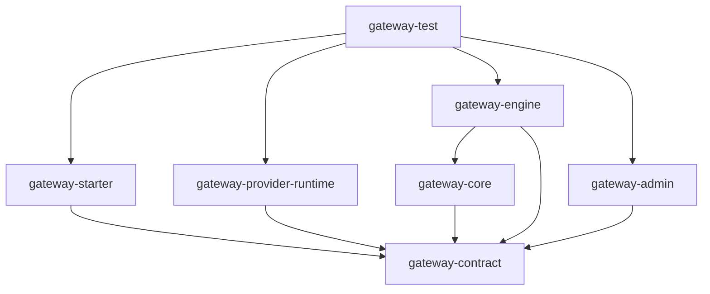

# GWS-01 Gateway 工程模块与公共契约 Spec

状态：草案，等待审核

父文档：`2026-07-24-gateway-component-design.md`

索引：`2026-07-25-gateway-child-spec-index.md`

## 1. 目标

本 Spec 固定 Gateway Component 的工程边界、分层方式、模块依赖、公共身份、版本、
错误和跨进程契约基线。后续子 Spec 可以扩展能力，但不能重新定义这些基础概念。

本 Spec 不定义具体路由算法、数据库表、页面、RPC 转发和治理参数。

## 2. 工程结构

Gateway 作为 `egon-cola-components` 下的独立大型 Component：

```text
egon-cola-components/
└── egon-cola-component-gateway/
    ├── pom.xml
    ├── README.md
    ├── README.zh-CN.md
    ├── egon-cola-component-gateway-contract/
    ├── egon-cola-component-gateway-core/
    ├── egon-cola-component-gateway-engine/
    ├── egon-cola-component-gateway-admin/
    ├── egon-cola-component-gateway-starter/
    ├── egon-cola-component-gateway-provider-runtime/
    ├── egon-cola-component-gateway-admin-web/
    └── egon-cola-component-gateway-test/
        ├── pom.xml
        ├── egon-cola-component-gateway-test-http-provider/
        ├── egon-cola-component-gateway-test-rpc-contract/
        ├── egon-cola-component-gateway-test-rpc-provider/
        ├── egon-cola-component-gateway-test-rpc-consumer/
        └── egon-cola-component-gateway-test-suite/
```

### 2.1 模块职责

| 模块 | 类型 | 职责 |
|---|---|---|
| `gateway-contract` | Java Library | 跨进程 DTO、枚举、事件 Schema 和公共扩展契约 |
| `gateway-core` | Java Library | 不依赖 Spring/基础设施的请求模型、路由模型、Filter、执行器和错误模型 |
| `gateway-engine` | Executable | HTTP/RPC Listener、规则运行时、Provider 调用、治理、Kafka 和生命周期 |
| `gateway-admin` | Executable | 接口目录、规则配置、发布编排、节点投影、管理 API 和审计 |
| `gateway-starter` | Starter | Provider 接口定义扫描、编译和向 Admin 上报 |
| `gateway-provider-runtime` | Starter | 仅为 HTTP Provider 维护 DDC `HTTP_PROVIDER` 租约 |
| `gateway-admin-web` | Node/Vite App | React 管理平台，独立构建和部署 |
| `gateway-test` | Test Aggregator | 真实 HTTP/RPC 应用、基础设施编排和端到端验证 |

`gateway-starter` 与 `gateway-provider-runtime` 必须是两个独立 Artifact。安装
`gateway-starter` 不能隐式注册 Provider 实例，安装 `gateway-provider-runtime`
不能隐式上报接口定义。

### 2.2 Maven 与 BOM

- Gateway 根模块使用 `pom` packaging；
- Java 模块继承 `egon-cola-components-parent`；
- `egon-cola-components/pom.xml` 只聚合 Gateway 根模块；
- BOM 只导出下游业务应用直接使用的：
  - `egon-cola-component-gateway-starter`；
  - `egon-cola-component-gateway-provider-runtime`；
- Engine、Admin、Core、Contract 和 Test 不进入公共 BOM；
- `gateway-starter` 可以传递依赖 `gateway-contract`，业务方不直接依赖内部 Core；
- Admin 与 Engine 是可执行应用，不作为下游 Library 使用。

### 2.3 Admin Web

`gateway-admin-web` 是前后端分离的 Vite 工程，不强制进入 Maven 编译生命周期。
发布流程分别生成 Admin API Jar 和 Web 静态制品，避免为了构建前端给全部 Java
Component 引入 Node 构建步骤。

## 3. 分层架构

### 3.1 统一分层

Engine、Admin、Starter 和 Provider Runtime 使用以下逻辑层：

| 层 | 职责 | 可以依赖 |
|---|---|---|
| Interfaces | HTTP/gRPC/Kafka/Spring 生命周期入口与 DTO 转换 | Application、Contract |
| Application | 用例编排、事务边界、状态协调 | Domain、Port、Contract |
| Domain | 领域实体、值对象、策略规则和状态约束 | Java 标准库、Core |
| Infrastructure | PostgreSQL、Redis、DDC、Kafka、Netty、文件和外部 Client | Application Port、Contract |

依赖从外向内。Domain 不依赖 Spring、JPA、Redis、DDC、Kafka、Reactor Netty 或
gRPC。

### 3.2 Core 与 Engine 的关系

- `gateway-core` 承载数据面领域模型和稳定 SPI；
- `gateway-engine` 承载网络、组件接入和运行编排；
- 网络请求进入 Engine 后必须先转换成 `GatewayExchange`；
- Core 不直接读取 Spring `ApplicationContext`；
- Core 不直接发送 Kafka、访问 Redis 或调用 DDC；
- Engine Infrastructure 通过 Port 实现这些能力。

### 3.3 包命名

公共根包：

```text
top.egon.cola.component.gateway
```

推荐包边界：

```text
top.egon.cola.component.gateway.contract
top.egon.cola.component.gateway.core
top.egon.cola.component.gateway.engine.interfaces
top.egon.cola.component.gateway.engine.application
top.egon.cola.component.gateway.engine.infrastructure
top.egon.cola.component.gateway.admin.interfaces
top.egon.cola.component.gateway.admin.application
top.egon.cola.component.gateway.admin.domain
top.egon.cola.component.gateway.admin.infrastructure
top.egon.cola.component.gateway.starter
top.egon.cola.component.gateway.provider
```

不使用 `common`、`utils`、`manager` 等无明确职责的兜底包。

## 4. 公共身份模型

### 4.1 环境作用域

所有配置、接口定义和运行实例必须包含：

```text
env + namespace
```

- `env`：`local`、`test`、`dev`、`prod` 等运行环境；
- `namespace`：同一环境内的隔离空间；
- 二者均参与 DDC 服务键和规则配置坐标；
- 跨环境或跨 namespace 引用必须在发布校验阶段拒绝。

### 4.2 资源标识

| 资源 | 标识 |
|---|---|
| Gateway Group | `gatewayGroupId`，UUIDv7；另有唯一稳定 `gatewayGroupCode` |
| Engine Node | `engineNodeId`，UUIDv7；运行身份包含稳定 `instanceId` |
| RPC Gateway Slot | DDC `serviceName + group + version` |
| Application System | `applicationId`，UUIDv7；另有唯一 `applicationCode` |
| Business Domain | `businessDomainId` + 同应用内稳定 `code` |
| Entity Domain | `entityDomainId` + 同业务域内稳定 `code` |
| Interface Group | `interfaceGroupId` + 同实体域内稳定 `code` |
| Operation | `operationId`，UUIDv7；另有稳定 `operationKey` |
| Route | `routeId`，UUIDv7 |
| Policy | `policyId`，UUIDv7 |
| Release | `releaseId`，UUIDv7；DDC 发布使用独立 UUIDv7 `changeId` |
| Provider Instance | DDC `instanceId + leaseId` |

数据库主键和跨进程 ID 使用字符串形式 UUIDv7，不使用自增 ID 作为公共身份。

### 4.3 Operation Key

Operation Key 是定义幂等和路由引用的稳定业务键：

- HTTP：`applicationCode:http:{normalizedMethod}:{normalizedPath}`；
- RPC：`applicationCode:rpc:{serviceName}:{group}:{version}:{fullMethodName}`。

显示名称、描述、负责人变化不能改变 Operation Key。HTTP Path 或 RPC
service/method 身份变化视为新 Operation，旧 Operation 进入废弃或下线流程。

## 5. 协议和版本基线

### 5.1 Contract 版本

所有 Gateway 自有跨进程请求必须携带：

```text
contractVersion = "v1"
```

HTTP 管理/上报 API 使用 `/api/v1/gateway/...`。Kafka 事件使用独立
`eventSchemaVersion`。Rule Snapshot 使用独立 `ruleSchemaVersion`。

三种版本不能互相替代：

- API Contract Version 决定请求/响应结构；
- Event Schema Version 决定 Kafka 消费兼容；
- Rule Schema Version 决定 Engine 是否能编译配置。

### 5.2 时间与数值

- 跨进程时间使用 UTC ISO-8601 或 epoch milliseconds，单个契约内保持一致；
- 数据库存储使用带时区时间类型；
- Duration 在配置与 DTO 中使用明确毫秒字段或 ISO-8601 Duration，不用无单位数字；
- 权重、阈值和百分比必须定义上下界；
- 金额不属于 Gateway 公共契约。

### 5.3 枚举兼容

- 未知枚举不能静默映射到默认放行行为；
- Admin 发布未知 Policy/Protocol 时失败；
- Engine 收到未知 Rule Schema 时保留 LKG 并报告失败 ACK；
- 新增枚举值必须先升级 Engine，再允许 Admin 发布。

## 6. 公共请求模型

Core 至少包含：

```java
public interface GatewayRequest {
    String requestId();
    String traceId();
    GatewayProtocol protocol();
    AccessZone accessZone();
    GatewayHeaders headers();
    GatewayBody body();
}

public interface GatewayResponse {
    GatewayResult result();
    GatewayHeaders headers();
    GatewayBody body();
}

public interface GatewayExchange {
    GatewayRequest request();
    GatewayContext context();
    GatewayResponse response();
}
```

上述是职责契约，不锁定最终方法是否使用 Reactor 类型。Core 业务模型不得直接暴露
Reactor Netty `HttpServerRequest`、gRPC `ServerCall` 或 Spring
`ServerHttpRequest`。

### 6.1 Gateway Context

`GatewayContext` 至少包含：

- `requestId`；
- `traceId`、`traceparent`、`tracestate`；
- `accessZone`；
- `gatewayGroupId`、`engineNodeId`；
- `operationId`、`routeId`、`releaseId`；
- 调用方 Principal/Attributes；
- Provider Service/Instance 选择结果；
- Deadline、开始时间、当前阶段；
- 治理决策和诊断信息。

Context 对 Filter 可读，对指定阶段受控写入；不能作为无类型 Map 任意塞值。

## 7. 公共错误模型

### 7.1 错误结构

```text
GatewayError
├── code
├── category
├── message
├── traceId
├── retryable
└── details（受控、非敏感）
```

错误类别：

| Category | 示例 |
|---|---|
| `REQUEST_INVALID` | 参数、Header、Body 或协议不合法 |
| `ROUTE_NOT_FOUND` | 无匹配 Route |
| `EXTERNAL_NOT_ACCESSIBLE` | PUBLIC 调用内部 Operation |
| `AUTHENTICATION_FAILED` | 凭据无效 |
| `AUTHORIZATION_DENIED` | 无权限 |
| `POLICY_REJECTED` | 限流、并发隔离、熔断 |
| `PROVIDER_UNAVAILABLE` | 无候选 Provider |
| `UPSTREAM_TIMEOUT` | 上游超时 |
| `UPSTREAM_FAILURE` | 上游调用失败 |
| `RULE_NOT_READY` | Engine 无可用 Rule Snapshot |
| `INTERNAL_ERROR` | 未分类内部错误 |

### 7.2 安全规则

- 对外错误不包含堆栈、类名、SQL、Redis Key、DDC Secret 或 Provider 内部地址；
- 内部日志通过 `traceId + requestId + errorCode` 关联详细异常；
- HTTP 和 gRPC 使用同一个 Gateway Error Category，再映射为各自状态；
- 未分类异常统一映射 `INTERNAL_ERROR`，不返回原始异常文本。

## 8. 跨进程契约清单

`gateway-contract` 只包含以下稳定边界：

1. Gateway Starter → Gateway Admin 的定义上报 DTO；
2. Gateway Engine Runtime Status DTO，由 Gateway Admin 通过内部管理接口查询；
3. Gateway Admin 管理 API 的公共 DTO/枚举；
4. Engine Kafka 调用事件 Schema；
5. 可由业务权限系统实现的鉴权扩展契约；
6. Rule Snapshot 的序列化 Schema。

下列类型不进入 Contract：

- JPA Entity；
- DDC Admin Entity/Repository；
- Reactor Netty/gRPC Channel；
- 本地 Provider Directory 内部结构；
- Spring Bean、ApplicationContext 或配置绑定对象；
- Admin 页面专用 View State。

## 9. 依赖规则



禁止：

- Contract 依赖 Engine/Admin/Starter；
- Core 依赖 Admin 或 Starter；
- Starter 依赖 Engine；
- Admin 依赖 Engine 实现包；
- RPC/DDC Component 反向依赖 Gateway；
- 业务 Provider 依赖 Gateway Core 或 Engine。

外部 Component 依赖：

| Gateway 模块 | 允许依赖 |
|---|---|
| Engine | DDC Starter、RPC Starter 公共契约、Common Trace/Mask、Kafka/Redis Client |
| Admin | DDC Management Client、Common Trace/Mask、Spring Kafka、PostgreSQL/JPA |
| Starter | RPC Starter（可选）、Common Crypto/Trace |
| Provider Runtime | DDC Starter、Gateway Contract |

Gateway Admin 不依赖 DDC Starter；使用 GWS-02 新增的轻量 Management Client，避免
把 Redisson 配置运行时引入控制面。

Engine 对 RPC Starter 的依赖只用于公共类型和 gRPC/Protobuf 契约，RPC Consumer
AutoConfiguration 必须关闭；Provider 发现和调用仍由 Engine Adapter 实现。

## 10. 生命周期基线

Engine 节点状态统一为：

```text
NEW → STARTING → SYNCING_RULES → READY → DRAINING → STOPPED
                       └──────→ FAILED
```

- `READY` 必须表示 Listener、有效 Rule Snapshot、Provider Directory 和必要资源均可
  执行；正常模式还要求 DDC Config Client 租约在线；
- 已运行节点在 DDC 短时中断时，可以在已有 Rule 和未过期 Provider Lease 范围内进入
  `DEGRADED` 子状态继续服务；
- 冷启动时只有 Rule LKG、但无法从 DDC 建立 Provider Directory，不能进入 READY；
- DDC 配置客户端租约在线不等于 Engine Ready；
- Config Client 只有在 Rule Applier/Compiler/本地目录已经可用后才注册，此时可以
  接收首个 Rule，但业务 Listener 仍保持 Readiness=false；
- `DRAINING` 不接收新请求，允许有界等待在途请求；
- 无 Rule Snapshot 且无磁盘 LKG 时不得进入 Ready；
- FAILED 节点不能注册或继续持有 RPC Gateway Slot。

Admin、Starter 和 Provider Runtime 可以拥有各自生命周期，但必须使用同一
`instanceId`、时间和错误基线。

## 11. 配置命名

Gateway 自有 Spring 配置统一使用：

```text
egon.cola.component.gateway.*
```

建议二级前缀：

- `engine.*`
- `admin.*`
- `starter.*`
- `provider-runtime.*`
- `test.*`

RPC 和 DDC 继续使用各自已有前缀，Gateway 不复制或重命名其配置。

Secret 只能通过环境变量、Secret Manager 或加密配置注入，不能进入 Rule Snapshot、
Starter Report、Kafka Event 或 DDC 服务 Metadata。

## 12. 设计模式选择

采用：

- Ports and Adapters：隔离 DDC、Kafka、Redis、HTTP、gRPC；
- Chain of Responsibility：Engine Filter Chain；
- Strategy：路由、负载均衡、限流和鉴权 Provider；
- Builder/Compiler：把管理模型编译为不可变 Rule Snapshot；
- State：Engine 与发布任务生命周期；
- Facade：网络层只调用单一 `GatewayExecutor`。

不采用：

- 为每个简单 DTO 引入 Factory；
- 通过继承树表达所有协议差异；
- 全局 Service Locator；
- 允许任意 Bean 通过反射修改 Engine Context。

## 13. 验收标准

1. Maven 模块和依赖图不存在循环；
2. 业务 Provider 只需安装 Starter/Provider Runtime/RPC Component，不依赖 Engine；
3. Starter 和 Provider Runtime 可以单独启用、单独关闭；
4. Contract 中不存在 JPA、Netty、gRPC Channel 或 Spring 运行时类型；
5. Operation Key 在显示信息变化时稳定，在协议身份变化时改变；
6. 所有跨进程契约有独立版本；
7. HTTP/gRPC 错误来自同一 Gateway Error Category；
8. Engine 未加载有效规则时不能 Ready；
9. DDC 租约、Engine Readiness 和 RPC Gateway Slot 是三个独立状态；
10. BOM 不导出 Engine、Admin 或内部 Core。

## 14. 本轮审核项

1. 认可 8 个产品/支撑模块与 Test 子模块结构；
2. 认可 Gateway Starter 与 HTTP Provider Runtime 分成两个 Artifact；
3. 认可 Admin Web 独立构建部署，不强绑 Maven Reactor；
4. 认可 UUIDv7、Operation Key、三类版本和统一错误基线；
5. 认可 Contract/Core/Engine/Admin 的依赖方向；
6. 认可 Engine 生命周期和“DDC 在线不等于 Ready”的规则。
