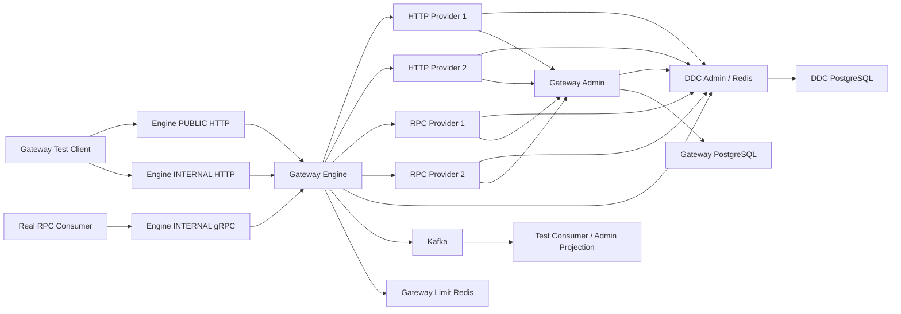

# GWS-13 Gateway Test 与部署 Spec

状态：草案，等待审核

父文档：`2026-07-24-gateway-component-design.md`

索引：`2026-07-25-gateway-child-spec-index.md`

依赖：GWS-01～GWS-12

## 1. 目标

本 Spec 定义 Gateway 的测试工程、真实进程端到端验证、故障验证、构建命令和部署
边界。

测试方式参考现有 Dynamic Thread Pool 的真实示例应用和 RPC Component 的
Contract/Provider/Consumer/Test Suite/Process Harness：

- 不是只用 Mock Controller 验证 Bean；
- 真实启动 HTTP Provider；
- 真实启动 Egon RPC Provider 与 Consumer；
- 真实启动 DDC Admin、Gateway Admin 和 Gateway Engine；
- 使用真实 PostgreSQL、Redis、Kafka；
- Provider 真实注册，Starter 真实上报；
- Admin API 与页面真实可见；
- 客户端真实通过 Engine 调用；
- Kafka Consumer 真实收到 Engine 调用事件。

本 Spec 不要求当前文档阶段启动任何服务；实现完成后才执行相应测试。

## 2. 测试模块

```text
egon-cola-component-gateway-test/
├── pom.xml
├── egon-cola-component-gateway-test-http-provider/
├── egon-cola-component-gateway-test-rpc-contract/
├── egon-cola-component-gateway-test-rpc-provider/
├── egon-cola-component-gateway-test-rpc-consumer/
└── egon-cola-component-gateway-test-suite/
```

### 2.1 HTTP Provider

真实 Spring Boot 应用，安装：

- `gateway-starter`；
- `gateway-provider-runtime`；
- Spring MVC 或 WebFlux；
- 测试用 Controller。

接口覆盖：

```text
GET    /api/orders/{id}
POST   /api/orders
GET    /api/orders/search
GET    /api/internal/inventory/{sku}
POST   /api/orders/{id}/cancel
GET    /api/slow/{millis}
GET    /api/fail/{status}
POST   /api/body/echo
```

至少包含：

- PUBLIC 可访问接口；
- `externalAccessible=false` 内部接口；
- Path/Query/Header/Body；
- 幂等与非幂等操作；
- 成功、业务错误、延迟、连接断开；
- 两个实例，Metadata 中 Zone/Weight/Definition Set 可区分。

### 2.2 RPC Contract

独立 Contract 模块包含 Protobuf Unary：

```text
EchoService/Echo
OrderService/GetOrder
OrderService/CreateOrder
OrderService/SlowCall
OrderService/Fail
```

用于验证：

- Contract Catalog；
- Descriptor Snapshot；
- Starter 三级目录；
- RPC Consumer→Engine→Provider；
- HTTP→RPC 参数绑定；
- Deadline、Cancellation、Metadata、Status/Trailer。

### 2.3 RPC Provider

真实 Spring Boot 应用，安装 RPC Provider 与 Gateway Starter：

- 启动真实 gRPC Server；
- 通过 RPC Component 向 DDC 注册 `RPC_PROVIDER`；
- 通过 Starter 向 Admin 上报 Contract；
- 通过 Gateway Metadata Contributor 携带 Definition Set/Zone/Weight；
- 至少启动两个实例验证负载均衡和故障切换。

Starter 不注册 RPC Lease；Lease 必须能证明来自 RPC Component。

### 2.4 RPC Consumer

真实 Spring Boot 应用，安装 RPC Consumer：

- 按现有契约只发现唯一 `INTERNAL_GATEWAY`；
- 发起真实 RPC 调用；
- 传播 Trace、Deadline、Cancellation 和受控 Metadata；
- 提供测试 HTTP Endpoint 或命令接口供 Test Suite 驱动。

Consumer 不直接发现业务 RPC Provider。

### 2.5 Test Suite

负责：

- Testcontainers 基础设施；
- 子进程构建/启动/停止；
- 随机端口与配置注入；
- 真实 HTTP/RPC Client；
- Gateway Admin Client；
- DDC Management/Registry 查询；
- Kafka Test Consumer；
- 故障注入；
- 日志、退出码和诊断制品归档。

测试代码中可以使用 Fake 做单元边界验证，但 E2E 不允许用现有 RPC
`MockGateway` 代替生产 Gateway Engine。

## 3. 测试分层

### 3.1 Unit

每个模块运行快速、无外部依赖测试：

- Core 路由和 Filter；
- Rule Compiler；
- HTTP/RPC Binding；
- Load Balancer；
- 治理状态机；
- 安全链；
- Canonical/Fingerprint；
- Admin Domain；
- Event Schema。

### 3.2 Component

单个 Spring Context 或真实网络组件：

- Reactor Netty Listener；
- gRPC Dynamic Handler；
- PostgreSQL Repository；
- DDC/Kafka/Redis Adapter；
- Starter Scanner；
- Admin Controller；
- 前端组件。

可使用 Testcontainers，但不要求所有产品进程同时启动。

### 3.3 Process Integration

使用 Maven Failsafe 的 `*IT`：

- 每个产品/Provider 是独立 JVM；
- 使用真实 TCP；
- 使用 Testcontainers 基础设施；
- Process Harness 读取 Readiness；
- 失败时保留各进程 stdout/stderr、配置摘要和容器日志。

### 3.4 Full E2E

包含 Admin Web 的 Playwright，覆盖用户可见闭环。E2E 不替代 Java 单元/集成测试。

## 4. 真实拓扑



DDC Redis 与 Gateway 分布式限流 Redis 使用独立实例或至少独立、明确的 Key Space；
E2E 首选独立容器，避免故障测试相互污染。

## 5. Process Harness

### 5.1 启动顺序

```text
PostgreSQL / Redis / Kafka
→ DDC Admin
→ Gateway Admin
→ HTTP/RPC Providers
→ Gateway Engine
→ RPC Consumer
→ Admin Web（Web E2E 时）
→ Test Client/Assertions
```

Provider 可以先于 Engine 注册，验证 Engine 启动全量发现；另有场景在 Engine 后启动
Provider，验证动态订阅。

### 5.2 Readiness

Harness 不用固定 Sleep 判断启动完成。每个进程必须有：

- 唯一进程名；
- 随机端口回传；
- Liveness；
- Readiness；
- 启动阶段日志；
- 超时；
- 正常退出协议。

Readiness 条件：

| 进程 | 条件 |
|---|---|
| DDC Admin | DB/Redis 可用，OpenAPI 可响应 |
| Gateway Admin | DB Migration 完成，管理 API 可响应 |
| Provider | 业务端口 Ready，租约已注册，上报已接受 |
| Engine | Config Apply 能力与租约已建立；业务 Readiness 在规则/Provider 就绪后成立 |
| RPC Consumer | 唯一 Gateway Slot 可发现 |

### 5.3 隔离

- 每次 Suite 使用唯一 Env/Namespace/Application Code 后缀；
- PostgreSQL 使用独立 Database/Schema；
- Kafka 使用唯一 Topic 前缀；
- 文件 LKG 使用测试临时目录；
- 不依赖开发者本机固定端口；
- 不读取生产配置或凭据；
- 测试结束优雅停止进程和容器；
- 失败时保留诊断目录，正常成功可按 Maven 生命周期清理。

## 6. 核心 E2E 场景

### 6.1 接口上报与 Admin 可见

1. 启动 HTTP Provider；
2. Starter 上报完整 HTTP Definition Set；
3. Admin 出现 Application、Business Domain、Entity Domain、Interface Group、
   Operation；
4. 每个 Controller 恰好一个 Interface Group；
5. 详细 Method/Path/参数/Schema/响应可查询；
6. `externalAccessible=false` 正确；
7. 启动 RPC Provider；
8. Admin 出现 Proto Service/Unary Method/Descriptor；
9. 断言 Starter 没有 Provider Lease，也没有 Kafka 调用事件。

### 6.2 Provider 注册与发现

1. HTTP Provider Runtime 注册 `HTTP_PROVIDER`；
2. RPC Component 注册 `RPC_PROVIDER`；
3. DDC Registry 查询真实实例；
4. Admin Provider 页面/API 可见租约和 Metadata；
5. Engine Directory 订阅到实例；
6. 新增/续租/注销/过期动态收敛；
7. Provider 地址不进入 Admin Route Snapshot。

### 6.3 HTTP→HTTP

- PUBLIC 调用外部接口成功；
- PUBLIC 调用内部接口返回未暴露；
- INTERNAL 调用内部接口成功；
- Method/Host/Path 匹配；
- Header/Body/Status 正确转发；
- Hop-by-Hop 和身份 Header 清洗；
- Trace 回传；
- 客户端取消传播。

### 6.4 RPC Consumer→Engine→RPC Provider

- DDC 中恰好一个 `INTERNAL_GATEWAY` 时调用成功；
- Engine 动态 Handler 按 Full Method 路由；
- Protobuf 原始字节正确转发；
- Metadata 白名单；
- Deadline 和 Cancellation；
- Status/Trailer 映射；
- 0 个 Gateway 快速失败；
- 2 个 Gateway 同 Slot 按 RPC 现有单活契约快速失败。

### 6.5 HTTP→RPC

- Path/Query/Header/Body 绑定 Protobuf；
- 字段类型、枚举、Repeated、Nested；
- 未知/缺失/溢出字段错误；
- Provider RPC Error 映射 HTTP；
- 不根据客户端输入加载 Java Class；
- Descriptor 更新随 Rule Release 原子切换。

### 6.6 负载均衡

- Round Robin；
- Smooth Weighted Round Robin；
- Random；
- Least Inflight；
- Zone/Tag 筛选；
- 两实例调用分布符合容差；
- 权重动态更新；
- 租约失效立即移出候选；
- 被动失败/主动探测维度分开；
- 无可用 Provider 统一失败。

### 6.7 Rule 发布

1. Admin 创建 Draft；
2. 完整校验和 Diff；
3. 创建 Release；
4. DDC DB/Redis 和 Pub/Sub；
5. Engine 编译、磁盘 Staging、原子激活；
6. 精确 `instanceId + leaseId` ACK；
7. Admin 显示成功 Target；
8. 小 Snapshot 和 Activation/Chunk；
9. 失败版本保留 LKG；
10. 回滚创建新 Release；
11. Pub/Sub 丢失后周期校准；
12. Admin 通过受保护 Management API 查询节点状态并校验 instanceId/leaseId；
13. 状态查询失败只使管理投影 stale，不替代 DDC ACK。

### 6.8 流量治理

- 本地/Redis 分布式限流；
- Redis Lua 原子性；
- 限流 Fail Closed/配置的失败语义；
- 并发隔离；
- 超时；
- 熔断打开、半开、关闭；
- 幂等 Retry；
- 非幂等默认不 Retry；
- 总 Deadline 约束；
- Rule State Epoch 切换。

### 6.9 安全

- Access Zone 不可伪造；
- PUBLIC/Internal 暴露控制；
- 入站身份 Header 清洗；
- Mock 安全 Provider 的 ALLOW/DENY/ERROR/TIMEOUT；
- 缺失 Provider 阻止规则 ACK；
- 可信身份映射到 HTTP/RPC；
- Credential 不进入日志和事件。

### 6.10 Trace 与 Kafka

- 客户端生成 Trace 贯穿完整调用；
- 缺失/非法时 Engine 生成；
- HTTP/RPC/HTTP→RPC；
- 正常、拒绝、错误、取消各一条事件；
- Kafka 事件字段和敏感信息约束；
- Starter 不发送；
- Admin Consumer 可查询聚合/Trace 摘要；
- Kafka 停止时业务响应不改变且有 Drop/Failure 指标。

## 7. 故障矩阵

| 故障 | 期望 |
|---|---|
| DDC Admin 不可用 | 已运行 Engine 使用 LKG 和未过期内存 Directory；冷启动不 Ready；新发布失败可恢复 |
| DDC Redis Pub/Sub 丢失 | 配置周期校准最终收敛 |
| DDC Redis 重启 | Provider/Engine 使用新 Lease 重注册，旧 Lease 不续约 |
| Gateway Admin 重启 | 非终态 Release 恢复查询/发布 |
| Engine 在 Apply 中崩溃 | 重启读取有效 LKG，不激活半成品 |
| 一个 Engine ACK 失败 | Release 显示部分失败，其他节点事实保留 |
| HTTP Provider 退出 | 租约/健康移出候选并切换其他实例 |
| RPC Provider 超时 | Deadline、被动健康、Retry/Circuit 按规则 |
| 限流 Redis 不可用 | 按 Policy 的固定失败模式，不静默切换 |
| Kafka 不可用 | 业务响应不变，队列有界、失败/丢弃可见 |
| Provider 返回超大响应 | Body 上限生效，连接正确释放 |
| 客户端中断 | 上游取消、资源和 Inflight 正确释放 |
| Admin Web/API 网络超时 | Idempotency/Release ID 查询，不重复创建 |

## 8. 性能与稳定性验证

不在首期 Spec 承诺未经测量的 QPS 数字。实施计划应先建立可复现基线：

- HTTP→HTTP；
- RPC→RPC；
- HTTP→RPC；
- 无治理与常用治理；
- 单实例/多实例；
- Kafka 正常/慢；
- 规则发布并发调用；
- Provider 变更。

关注：

- Throughput；
- P50/P95/P99；
- EventLoop Blocking；
- Heap/Direct Memory；
- Connection/Channel 数；
- Queue/Inflight；
- GC；
- Kafka Drop；
- 规则切换停顿；
- 24 小时稳定运行的资源增长。

性能测试独立 Profile，不作为每次单元测试门禁；但 Engine 发布前必须保留固定基线和
回归阈值。

## 9. 前端 E2E

Playwright 启动真实 Admin Web/API，至少覆盖：

1. HTTP/RPC 接口目录真实可见；
2. 创建 Group/Route/Policy；
3. PUBLIC 选择内部接口被阻止；
4. 校验错误定位；
5. 发布 Diff 和 Target ACK；
6. 部分失败/UNKNOWN；
7. Provider 注册/过期；
8. 调用统计与 Trace；
9. Revision 冲突；
10. 浏览器 Trace ID 可从后端/事件查到。

截图/Trace/Video 只在失败或配置开启时保留，敏感值必须脱敏。

## 10. Maven 与前端验证命令

模块实现后，目标命令为：

```bash
./mvnw -B -ntp \
  -f egon-cola-components/egon-cola-component-gateway/pom.xml \
  clean verify
```

真实进程测试：

```bash
./mvnw -B -ntp \
  -f egon-cola-components/egon-cola-component-gateway/pom.xml \
  -Pgateway-live-test \
  clean verify
```

RPC/DDC 前置扩展还必须分别通过其现有 Reactor 和 Live Profile。具体 Profile 名称以
实施时现有 POM 为准，不能在代码前假称已存在。

Admin Web：

```bash
npm ci
npm run lint
npm run typecheck
npm run test
npm run build
npm run e2e
```

Admin Web 统一使用 npm 与 `package-lock.json`，不同时维护其他包管理器 Lockfile。

## 11. CI 分层

| 阶段 | 内容 | 触发 |
|---|---|---|
| Fast | Compile、Unit、Lint、Typecheck | 每个 PR |
| Component | Repository/Netty/gRPC/Adapter Testcontainers | 每个 PR |
| Live | 全进程 DDC/Admin/Engine/Provider/Kafka | Gateway/RPC/DDC 相关 PR |
| Web E2E | Admin Web 关键流程 | Web/Admin 相关 PR |
| Performance | 固定基线与长稳 | 定时/发布前 |

Live 失败必须上传：

- Surefire/Failsafe Report；
- Process Log；
- 容器状态和日志；
- 端口/进程清单；
- 脱敏配置摘要；
- Playwright Trace（如适用）。

## 12. 部署制品

### 12.1 Engine

- 可执行 Spring Boot Jar；
- 独立 OCI Image；
- Java 21 Runtime；
- 非 Root 用户；
- 只写配置的数据目录；
- 暴露 PUBLIC HTTP、INTERNAL HTTP、INTERNAL gRPC 和 Management Port；
- Rule LKG 挂载持久化 Volume；
- Kafka/DDC/Redis Secret 从运行环境注入。

### 12.2 Admin

- 可执行 Spring Boot Jar；
- 独立 OCI Image；
- Java 21 Runtime；
- PostgreSQL Migration；
- DDC Management Client；
- Kafka Consumer 可配置启停；
- Management Port 与业务 API 分离。

### 12.3 Admin Web

- 静态制品或独立静态站点 Image；
- API Base URL 可配置；
- 不包含后端/HMAC Secret；
- 本项目不创建或管理 Nginx 配置。

### 12.4 Test Apps

HTTP/RPC Provider/Consumer 只用于测试，不进入业务 BOM，不作为生产 Gateway
部署制品发布。

## 13. 运行配置

Engine 最少需要：

```text
gatewayGroupCode
env
namespace
node identity
public/internal/rpc ports
management bind/advertised host and port
engine data dir
DDC endpoint + credentials
Kafka bootstrap + credentials
rate-limit Redis
listener/TLS settings
resource limits
```

Admin 最少需要：

```text
Gateway PostgreSQL
DDC Management endpoint + credentials
Kafka consumer
retention
management security
```

配置优先级遵循 Spring Boot 现有约定；Secret 不进入仓库默认配置、镜像层或健康响应。

## 14. 健康检查

### 14.1 Engine

Liveness 只表示进程/EventLoop 活着。Readiness 至少考虑：

- Listener 已绑定；
- 有可用 Active Rule 或明确的 Empty Bootstrap；
- LKG 未损坏；
- DDC Config Client 身份已建立；
- INTERNAL Gateway Lease（若启用 RPC）已注册；
- 关键资源没有启动级错误。

Kafka 故障不使业务 Listener 自动 Not Ready，但单独健康项为 Degraded。已运行节点
DDC 暂时断开且 LKG、内存 Provider Lease 仍有效时为 Degraded，不立即停止现有调用；
冷启动节点不能只凭 Rule LKG Ready。

### 14.2 Admin

- DB/Migration；
- DDC Management 连通性；
- Kafka Consumer；
- 后台发布恢复任务。

Liveness 与 Dependency Readiness 分开，避免依赖波动造成无限重启。

## 15. 优雅关闭

Engine：

```text
标记 Not Ready
→ 停止接受新请求
→ 注销 INTERNAL_GATEWAY/Config Client 租约
→ 等待有界 Inflight
→ 取消超时请求
→ Drain Kafka Event Queue
→ 关闭 HTTP Pool/gRPC Channel
→ 关闭 EventLoop
```

Provider 实例注销由各自 Runtime/RPC Component 完成。Admin 停止接收新发布后，等待
有界后台任务保存可恢复状态，不假装外部 DDC 调用已经回滚。

## 16. 部署边界

- 首期支持单 DDC Admin + 单 Redis 的现有边界；
- Gateway Engine 可以多个实例，但 RPC 单 Slot 首期只能一个活动
  `INTERNAL_GATEWAY`；
- PUBLIC/INTERNAL 前置四层/七层基础设施由部署平台管理；
- Gateway 不负责 Nginx 节点负载或动态配置；
- Provider 发现只通过 DDC；
- 不支持 Nacos/Dubbo；
- 多机房、DDC HA、RPC Gateway HA 是后续独立能力；
- 测试通过不等同于上述 HA 已实现。

## 17. 验收矩阵

| 能力 | Unit | Component | Process E2E | Web E2E |
|---|---:|---:|---:|---:|
| HTTP Route/Proxy | 是 | 是 | 是 | 可观察 |
| RPC Dynamic Gateway | 是 | 是 | 是 | 可观察 |
| HTTP→RPC | 是 | 是 | 是 | 是 |
| Starter 上报 | 是 | 是 | 是 | 是 |
| Provider DDC 注册 | 是 | 是 | 是 | 是 |
| Rule 发布/ACK/LKG | 是 | 是 | 是 | 是 |
| Load Balance | 是 | 是 | 是 | 可观察 |
| Traffic Governance | 是 | 是 | 是 | 可配置 |
| Security Extension | 是 | 是 | 是 | 可配置 |
| Trace/Kafka Event | 是 | 是 | 是 | 是 |
| Failure Recovery | 是 | 是 | 是 | 部分 |
| Deployment/Lifecycle | 否 | 是 | 是 | 否 |

## 18. 验收标准

1. Test 项目真实启动 HTTP 和 Egon RPC 应用，不以 Mock Gateway 替代 Engine；
2. Provider 真实注册到 DDC，接口定义真实上报到 Admin；
3. Admin API 与 React 页面能真实看到三级目录、节点和 Provider；
4. HTTP、RPC Consumer 和 HTTP→RPC 均能通过 Engine 完成真实调用；
5. 规则通过 DDC DB/Redis/PubSub 下发并取得精确 ACK；
6. 限流、路由、负载均衡、安全和失败恢复有真实场景；
7. Engine 调用事件能被真实 Kafka Consumer 接收，Starter 不发送；
8. 前端 Trace ID 能贯穿端到端；
9. 0/1/2 RPC Gateway Slot 行为按当前 RPC 契约验证；
10. CI 分层、制品、健康和优雅关闭边界明确；
11. 不测试或声称 Nacos、Dubbo、Nginx 管理、DDC HA 或 RPC Gateway HA；
12. 文档阶段不自动启动项目，实施后才执行验证命令。

## 19. 本轮审核项

1. 认可真实独立 JVM + Testcontainers 的主 E2E 方式；
2. 认可 HTTP/RPC Provider、RPC Consumer 和 Test Suite 模块划分；
3. 认可 Admin 必须真实看到 Starter 上报与 DDC 注册结果；
4. 认可 Kafka 故障、DDC 故障、LKG 和节点分歧进入故障矩阵；
5. 认可首期部署边界保留 DDC 单节点和 RPC Gateway 单 Slot；
6. 认可 Nginx/Nacos/Dubbo 均不进入测试和部署能力。
