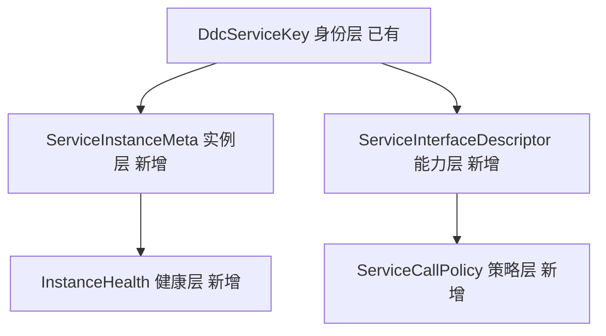

# DDC / RPC / Gateway 统一服务模型与管理端优化设计

状态：**部分实施（S1–S4 已合入）；S5 计划已被代码事实推翻，见下方勘误**

---

## 勘误（2026-07-26，实施阶段核对代码后）

实施前逐条核对代码，本设计有 **三处结论与事实不符**，按事实修正：

| # | 本文原结论 | 代码事实 | 处置 |
|---|---|---|---|
| E1 | §9 S5 要"新建 `LoadBalancerRegistry.java` 5 种策略" | **负载均衡已存在**：`engine/balance/LoadBalancerType`（`ROUND_ROBIN` / `SMOOTH_WEIGHTED_ROUND_ROBIN` / `RANDOM` / `LEAST_IN_FLIGHT`）+ `ProviderLoadBalancers` 工厂 | 改为扩展既有实现，不新建 |
| E2 | §9 S5 要"新建 `HealthProbe.java` + Http/Grpc 实现" | **健康探活已存在**：`ProviderActiveHealthProbe` SPI + `HttpProviderActiveHealthProbe` / `RpcProviderActiveHealthProbe` + `ActiveHealthTracker` / `PassiveHealthTracker` | 同上 |
| E3 | §3.2 用**新前缀** `egon.meta.*` 投影实例元数据 | **`gateway.*` 约定已在用**：`gateway.weight` / `zone` / `region` / `tags` / `protocol-version` / `definition-set-id` / `artifact-version` / `build-id` / `management-path`，写侧在 rpc-starter 的 `RpcProviderMetadataMerger` 校验，读侧在 gateway-core 的 `ProviderInstance` 解析 | **改用 `gateway.*`**。新前缀会让同一语义有两个事实源，违反本文自己的 P3 |

另有三处细节修正：

- §5.5 称"`GatewayError` 增加 `retryable`"—— `retryable` **字段已存在**，仅 `upstreamStatus` 缺失。
- §5.5 称 `GatewayCallEventV1` 需加 `retryCount` / `selectedInstanceId` —— `Governance.retryCount`
  与 `Attempt.providerInstanceId` **均已存在**。
- §3.2 将 `tags` 设计为 `Set<String>`，但既有 `gateway.tags` 约定是**排序后的 `k=v` 键值对**
  （`RpcProviderMetadataMerger.validateTags` 强制升序并校验模式），故实现取 `Map<String,String>`。

**教训**：G1/G2 的"缺失"判断只核对了类型是否结构化，未核对约定是否已存在。
"没有类型"不等于"没有约定"—— `gateway.*` 一直在用，只是以**跨模块重复的字面量**而非共享定义的
形式存在，这才是 G1 的真实形态。

### 实施状态

| 阶段 | 状态 | 说明 |
|---|---|---|
| S1 | **已实施** | `ServiceInstanceMeta` / `ServiceInstanceMetaCodec` / `InstanceHealthState`（置于 ddc-management-client，是所有消费方都可见的唯一公共模块）；`RpcProviderMetadataMerger` 改为委派；保留键与业务额度分开计数 |
| S2 | **已实施（范围调整）** | `ServiceCallPolicy` + `ServiceCallPolicyCodec` + `LoadBalanceStrategy`。定位为既有 TIMEOUT / RETRY / CIRCUIT_BREAKER / LOAD_BALANCE 策略的**类型化视图**（沿用其既有 key 名与默认值），而非新机制；仅 CACHE 为新增能力 |
| S3 | **已实施** | `@EgonServiceMeta` / `LoadBalance` / `FailStrategy` / `@EgonHttpService`；三个 RPC 注解扩展，既有字段与默认值零改动 |
| S4 | **已实施（形态调整）** | `MetadataResolver`（注解无关、含来源层级）+ `AnnotationValidationReport`。未按原文改写既有 contributor 上报链路 |
| S5 | **未实施** | 按 E1/E2 须改为"扩展既有子系统"，范围与原文差异较大，需重新拆解 |
| S6 | **未实施** | — |
| S7 | **未实施** | — |

原已知遗留（`GatewayRuntimeOperation` 不携带 `parameters`，Admin 无法据运行时规则生成接口测试表单）
**已解除**，§6.1 接口测试功能的前置依赖就位：

- 新增 `GatewayRuntimeParameter`（`contract/rule`），字段为
  `name / location / required / typeDisplay / defaultValue / description`，
  即 §3.3 `ParameterDescriptor` 的形态。上报模型的 `schema` 与 `constraints` **不下发**——
  operation 已带 `requestSchema`，且规则内容有体积上限（分片阈值 512KB）。
- `GatewayRuntimeOperation` 增加 `parameters` 组件，并保留原 12 参构造器供既有调用方使用。
- Admin 侧 `GatewayRuntimeParameterMapper` 完成上报模型 -> 运行时模型的映射，数据源是
  operation definition 的 `parameters` 属性（由 `JdbcGatewayDefinitionReportStore` 写入）。
  该属性不再以 `toString()` 形式混入运行时 `attributes`。

**wire 兼容要点**：`parameters` 标注 `@JsonInclude(NON_EMPTY)`，这是必需项而非优化。
引擎 `GatewayRuleActivationApplier` 会重新序列化快照并与 `ruleContentSha256` 比对，
若无参数的 operation 多出一个 `"parameters":[]`，老快照将以
`GATEWAY_RULE_CHECKSUM_MISMATCH` 失败——**仅让紧凑构造器容忍 null 不足以兑现兼容**。

**灰度顺序**：`GatewayRuleJsonCodec` 未关闭 `FAIL_ON_UNKNOWN_PROPERTIES`，
故带参数的新快照会被老引擎拒绝。升级须**先引擎、后 Admin**。

---

以下为原设计正文，**内容未修改**，请对照上方勘误阅读。

---

编写日期：2026-07-26

代码基线：`main@55614029`

范围：`egon-cola-component-dynamic-config-center`、`egon-cola-component-rpc`、
`egon-cola-component-gateway`（含 admin 与 admin-web）

关联设计：

- `2026-07-26-components-capability-hardening-design.md`（组件能力兑现，波次 0/1/2 已实施）
- `2026-07-26-gateway-ddc-rpc-integration-remediation-design.md`（联调闭环，已合入 `a58d7645`）
- `2026-07-25-gateway-*`（16 份 Gateway 子 Spec，已实现待验收）

**约束**：保持现有架构与向后兼容；本轮不涉及权限体系。

---

## 1. 结论先行

盘点后有一条结论会改变实施策略：

> **统一服务模型不需要新建，它已经存在，但只完成了"身份"一层，缺"能力"一层和"策略"一层。**

`DdcServiceKey` 已经用 `DdcServiceKind{RPC_PROVIDER, HTTP_PROVIDER, INTERNAL_GATEWAY}` +
`protocol` 把 RPC 与 HTTP 收在同一把钥匙下，字段为
`env / namespace / serviceKind / serviceName / group / version / protocol`。这正是需求 1 想要的
服务名、协议、版本、分组。

真正缺失的是另外两层：

```text
身份层（已有）：DdcServiceKey                      —— 找得到服务
能力层（缺）：接口路径、请求方法、参数结构、幂等性  —— 不知道服务能做什么
策略层（弱）：超时、重试、负载均衡、健康            —— 不知道该怎么调
```

因此本设计不是"造一个新模型"，而是**在既有身份层之上补齐能力层与策略层**，这也是保持向后
兼容的前提：`DdcServiceKey` 一个字段都不动。

### 1.1 五个确定性缺口

| 缺口 | 事实 | 影响 |
|---|---|---|
| G1 实例元数据无类型 | `DdcServiceInstance.metadata` 是 `Map<String,String>`，上限 32 项，weight/region/zone/health 全部塞在里面 | 拼写错误无法发现，Admin 无法结构化展示，前端只能平铺字符串 |
| G2 无统一接口模型 | RPC 侧有 `RpcMethodDescriptor`，HTTP 侧只有 lease 与健康（`gateway-provider-runtime` 仅 6 个类，无接口上报） | HTTP 下游"能调什么"完全不可见，Admin 无法做接口测试 |
| G3 调用策略无类型 | `GatewayRuntimePolicy.configuration` 是 `Map<String,Object>` | 超时/重试/负载均衡无字段校验、无默认值、无法在 UI 上表单化 |
| G4 注解体系过薄 | `@EgonRpcProvider` **零字段**；`@EgonRpcReference` 仅 `timeoutMs`；`@EgonRpcMethod` 仅 `name`+`idempotent` | 需求 2 描述的"字段不足、语义不清、扩展性差"完全属实 |
| G5 注解体系割裂 | RPC 用 `@EgonRpcService/@EgonRpcMethod`（rpc-starter），上报用 `@GatewayOperation/@GatewayInterfaceGroup`（gateway-starter），HTTP 只有后者 | 同一个接口要标两套注解，语义重叠且无继承关系 |

---

## 2. 设计原则

```text
P1 只增不改：既有 record 组件、注解字段、REST 路径一律保留；新增能力走新增字段 / 新增端点。
P2 wire 兼容：新结构化字段在传输层仍降解为 metadata 的保留键，老 Engine 读不到新字段也能工作。
P3 单一事实源：同一语义只允许一处声明，其余从它派生（注解 -> 上报 -> 存储 -> 运行时）。
P4 默认值链固定：方法级 -> 类级 -> 应用配置 -> 组件全局默认，逐级回退且可观测。
P5 不引入新框架：不引入新的注册中心、不引入 Saga / 规则引擎 / 插件容器。
```

### 2.1 向后兼容契约

```text
1. DdcServiceKey 七字段不变。
2. DdcServiceInstance 组件不删不改；新增能力通过 metadata 保留键 + 旁路结构化视图表达。
3. 现有注解的现有字段保留且默认值不变；新增字段一律带默认值。
4. 现有 Admin REST 路径与响应字段保留；新增字段可选，新增能力用新路径。
5. GatewayRuntimePolicy.configuration 保留；新增 typed 视图与它双向映射。
```

---

## 3. 统一服务模型（字段模型）

### 3.1 分层



### 3.2 实例层：`ServiceInstanceMeta`（解决 G1）

放置位置：`ddc-management-client` 的 `top.egon.cola.component.ddc.management.model`
（Gateway、RPC 均已依赖该模块，不产生新耦合）。

| 字段 | 类型 | 默认 | 说明 |
|---|---|---|---|
| `weight` | `int` | 100 | 负载均衡权重，1–10000 |
| `region` | `String` | `""` | 地域 |
| `zone` | `String` | `""` | 可用区 |
| `warmupSeconds` | `int` | 0 | 预热期，期间权重线性爬升 |
| `protocolVersion` | `String` | `""` | 如 `HTTP/1.1`、`h2`、`grpc` |
| `definitionSetId` | `String` | `""` | 接口定义集指纹，已在用 |
| `tags` | `Set<String>` | 空 | 灰度 / 金丝雀标签 |
| `healthState` | `enum` | `UNKNOWN` | `UP / DOWN / DEGRADED / OUT_OF_SERVICE / UNKNOWN` |
| `lastHealthCheckAt` | `Instant` | null | 最近探活时间 |

**兼容做法**（关键）：不改 `DdcServiceInstance`，而是提供双向投影

```java
public final class ServiceInstanceMetaCodec {
    private static final String PREFIX = "egon.meta.";   // 保留前缀，避免与业务 metadata 冲突

    public static Map<String, String> encode(ServiceInstanceMeta meta);   // 写入 metadata
    public static ServiceInstanceMeta decode(Map<String, String> metadata); // 缺字段回落默认值
}
```

老 Engine 读到的仍是 `Map<String,String>`；新 Engine 调用 `decode` 得到类型化视图。
`metadata` 32 项上限需要复核：保留键预计占 9 项，业务可用余量 23 项，建议将上限提到 64 并在
`DdcServiceRegistration.validatedMetadata` 中对 `egon.` 前缀单独计数。

### 3.3 能力层：`ServiceInterfaceDescriptor`（解决 G2，RPC/HTTP 统一）

这是本设计的核心新增。**同一个 record 同时描述 RPC 方法与 HTTP 接口**，用 `protocol` 区分。

| 字段 | 类型 | RPC 语义 | HTTP 语义 |
|---|---|---|---|
| `interfaceId` | `String` | 稳定 ID（`sha256(serviceKey + identity)` 前 16 位） | 同 |
| `serviceKey` | `DdcServiceKey` | 所属服务 | 同 |
| `protocol` | `GatewayProtocol` | `GRPC` | `HTTP` |
| `identity` | `String` | `pkg.Service/Method` | `GET /orders/{id}` |
| `interfacePath` | `String` | `/pkg.Service/Method` | `/orders/{id}` |
| `requestMethod` | `String` | `POST`（Triple 固定） | `GET/POST/PUT/DELETE/PATCH` |
| `requestSchema` | `String` | protobuf message 全名 | JSON Schema 或 `$ref` |
| `responseSchema` | `String` | 同上 | 同上 |
| `parameters` | `List<ParameterDescriptor>` | 从 descriptor 推导 | 从 `@RequestParam/@PathVariable` 推导 |
| `idempotent` | `boolean` | `@EgonRpcMethod.idempotent` | 由 `requestMethod` 推定并可覆盖 |
| `streaming` | `enum` | `UNARY/SERVER/CLIENT/BIDI` | `UNARY` |
| `callPolicy` | `ServiceCallPolicy` | 见 3.4 | 同 |
| `deprecated` | `boolean` | 注解声明 | 同 |
| `summary` / `description` / `owner` / `tags` | `String` / `Set` | 复用 `@GatewayOperation` 现有字段 | 同 |

`ParameterDescriptor`：`name / in（PATH/QUERY/HEADER/BODY/FIELD）/ type / required / defaultValue /
description`。这是 Admin 接口测试功能（需求 4）的数据基础——没有它，测试面板无法生成表单。

### 3.4 策略层：`ServiceCallPolicy`（解决 G3）

替换 `GatewayRuntimePolicy.configuration` 中散落的键，并与之双向映射。

```java
public record ServiceCallPolicy(
        long connectTimeoutMs,        // 默认 1000
        long readTimeoutMs,           // 默认 3000，对应现有 deadline
        RetryPolicy retry,
        LoadBalancePolicy loadBalance,
        CircuitBreakerPolicy circuitBreaker,
        CachePolicy cache
) {}

public record RetryPolicy(
        int maxAttempts,              // 默认 0（不重试）
        long backoffMs,               // 默认 100
        double backoffMultiplier,     // 默认 2.0
        Set<String> retryableStatuses,// 默认 UNAVAILABLE, DEADLINE_EXCEEDED
        boolean retryOnlyIdempotent   // 默认 true —— 与 interfaceDescriptor.idempotent 联动
) {}

public record LoadBalancePolicy(
        Strategy strategy,            // ROUND_ROBIN / RANDOM / WEIGHTED / LEAST_ACTIVE / CONSISTENT_HASH
        String hashKey,               // CONSISTENT_HASH 时的取值表达式
        boolean preferSameZone        // 默认 true
) {}

public record CircuitBreakerPolicy(
        boolean enabled, int failureRateThreshold, int slowCallDurationMs,
        int minimumCalls, int openStateSeconds
) {}

public record CachePolicy(
        boolean enabled, long ttlSeconds, String keyExpression, Set<String> varyHeaders
) {}
```

**`retryOnlyIdempotent` 默认 true 是一条安全约束**：非幂等接口即便配置了重试也不会重放，
避免网关层制造重复下单。这条比其余字段更重要，应写进 Admin 表单的提示文案。

---

## 4. 注解体系重构（解决 G4 / G5）

### 4.1 现状问题定位（逐条对应用户判断）

| 注解 | 现有字段 | 问题 |
|---|---|---|
| `@EgonRpcService` | `grpcClass, group, version` | 缺协议、超时、重试、负载均衡、标签、描述、下线标记 |
| `@EgonRpcProvider` | **无字段** | 纯标记，语义与 `@EgonRpcService` 重叠且无法表达任何策略 |
| `@EgonRpcReference` | `timeoutMs` | 缺重试、负载均衡、group/version 覆盖、直连、降级 |
| `@EgonRpcMethod` | `name, idempotent` | 缺超时、重试、描述、下线、参数/返回说明 |
| `@GatewayOperation` | 6 个描述字段 | 与 `@EgonRpcMethod` 语义重叠，无继承关系，HTTP 侧无对应服务级注解 |

### 4.2 统一元注解：`@EgonServiceMeta`

引入一个**可组合的元注解**承载跨协议共享字段，解决"扩展性差 + 无继承关系"：

```java
@Target({ElementType.TYPE, ElementType.METHOD})
@Retention(RetentionPolicy.RUNTIME)
@Inherited                              // 支持类层次继承
public @interface EgonServiceMeta {
    String summary() default "";
    String description() default "";
    String owner() default "";
    String[] tags() default {};
    boolean deprecated() default false;
    String since() default "";
    long timeoutMs() default -1;        // -1 = 继承上级
    int retries() default -1;           // -1 = 继承上级
    LoadBalance loadBalance() default LoadBalance.INHERIT;
}
```

`-1` / `INHERIT` 作为"未设置"哨兵是关键设计：它让**四级默认值链**可以被实现，而不是像现在这样
用固定字面量当默认值（后者会让"未设置"和"显式设置成默认值"无法区分）。

### 4.3 扩展后的注解

```java
// 服务级：新增字段全部带默认值，现有三字段不动
public @interface EgonRpcService {
    Class<?> grpcClass();                      // 保留
    String group() default "default";          // 保留
    String version() default "1.0.0";          // 保留
    String serviceName() default "";           // 新增，默认取 grpcClass 推导
    int weight() default 100;                  // 新增
    String[] tags() default {};                // 新增
    long timeoutMs() default -1;               // 新增
    int retries() default -1;                  // 新增
    LoadBalance loadBalance() default LoadBalance.INHERIT;
    boolean deprecated() default false;
}

// 方法级
public @interface EgonRpcMethod {
    String name();                             // 保留
    boolean idempotent() default false;        // 保留
    long timeoutMs() default -1;               // 新增
    int retries() default -1;                  // 新增
    boolean externalAccessible() default false;// 新增，与 @GatewayOperation 对齐
    String summary() default "";
    boolean deprecated() default false;
}

// 消费端
public @interface EgonRpcReference {
    long timeoutMs() default -1;               // 保留
    int retries() default -1;                  // 新增
    LoadBalance loadBalance() default LoadBalance.INHERIT;
    String group() default "";                 // 新增，覆盖服务默认
    String version() default "";               // 新增
    String fallbackBean() default "";          // 新增，降级 Bean 名
    FailStrategy failStrategy() default FailStrategy.INHERIT;
}
```

### 4.4 `@EgonRpcProvider` 的处置

它当前零字段、语义与 `@EgonRpcService` 重叠。按"实现或删除、不留第三态"：

```text
建议：保留注解（兼容），但明确其唯一职责为"Bean 发现标记"，并在 Javadoc 与 README 中写死；
      所有元数据一律由 @EgonRpcService 承载。同时补一条启动期校验：
      标了 @EgonRpcProvider 但未标 @EgonRpcService 的 Bean 直接启动失败并给出指引。
```

这样既不破坏兼容，又消除了"两个注解都能标、语义不清"的问题。

### 4.5 HTTP 侧对等注解

HTTP 下游目前无服务级注解。新增：

```java
@Target(ElementType.TYPE) @Retention(RUNTIME)
public @interface EgonHttpService {
    String serviceName() default "";
    String group() default "default";
    String version() default "1.0.0";
    String basePath() default "";
    int weight() default 100;
    // 其余共享字段由 @EgonServiceMeta 组合
}
```

方法级**不新增注解**：直接复用 Spring MVC 的 `@RequestMapping` 家族解析
`interfacePath / requestMethod / parameters`，再用 `@GatewayOperation` 补描述字段。这避免了
"一个接口标三套注解"。

### 4.6 元数据解析机制

新增 `ServiceMetadataParser`（放 `gateway-starter`，RPC 与 HTTP 共用）：

```text
1. 扫描：@EgonRpcService / @EgonHttpService 标注的 Bean。
2. 合并：按 P4 默认值链解析每个字段
      方法注解 -> 类注解 -> @EgonServiceMeta（含 @Inherited 父类）-> application.yml -> 组件默认
   每级只覆盖"非哨兵值"，解析结果记录来源层级用于 Admin 展示。
3. 校验：AnnotationValidationReport 收集所有问题后一次性抛出，而不是遇到第一个就失败。
      规则：weight 1..10000；timeoutMs > 0 或 -1；retries 0..5；非幂等且 retries>0 且
      retryOnlyIdempotent=false 时给出 WARN；version 需符合 semver；serviceName 非空。
4. 产出：List<ServiceInterfaceDescriptor>，直接喂给现有 GatewayInterfaceDefinitionReport 上报链路。
```

**校验时机**：`ApplicationReadyEvent` 之前（`SmartInitializingSingleton`），保证错误配置不会
进入运行态。这与波次 1 给 method-extension 加的 fail-fast 是同一原则。

---

## 5. Gateway 能力优化

### 5.1 服务发现

```text
1. DdcProviderServiceRegistryAdapter 增加 ServiceInstanceMetaCodec.decode，向下游暴露类型化实例。
2. 实例选择按 healthState 过滤：只选 UP / DEGRADED（DEGRADED 降权 50%），排除 OUT_OF_SERVICE。
3. 预热：warmupSeconds 内权重按 (elapsed / warmup) 线性爬升，避免新实例被打满。
4. 同区优先：preferSameZone=true 时优先同 zone，无可用实例再跨区，并记录跨区调用指标。
```

### 5.2 动态路由

```text
1. GatewayRuntimeRoute 新增可选字段：matchHeaders、matchQuery、rewritePath、stripPrefix、
   canaryTag（灰度标签，与实例 tags 匹配）。全部带默认值，老规则不受影响。
2. 路由匹配保持现有 host + method + pathPattern 主键，新增条件作为二级筛选，避免改动匹配算法复杂度。
3. 优先级：现有 priority 保留；同优先级下按 pathPattern 特异性（静态段数量）排序，消除不确定性。
```

### 5.3 协议转换（HTTP ⇄ gRPC）

```text
1. 依据 ServiceInterfaceDescriptor.parameters 做结构化映射，取代当前按约定的整体 body 透传：
   PATH/QUERY/HEADER -> protobuf field，BODY -> message。
2. 错误码映射表固化为 GatewayProtocolErrorMapper：gRPC Status <-> HTTP Status <-> GatewayError，
   当前散落在多处的映射收敛到一处。
3. 流式：streaming != UNARY 的接口在 HTTP 入口显式拒绝并返回 501，而不是走到一半失败。
```

### 5.4 健康检查

```text
1. 统一 HealthProbe SPI：HTTP 走 GET {healthPath}，RPC 走 grpc.health.v1.Health/Check。
2. 主动探活周期 = min(leaseSeconds/3, 10s)，连续 N 次失败置 DOWN 并回写 DDC 实例元数据。
3. 被动健康：熔断器状态变化同步 healthState，避免主动探活正常但实际调用全失败。
4. 复核项：gateway 上游 TLS 缺失（见能力兑现设计 W1-09）会让 https 探活形同虚设，需先修复。
```

### 5.5 异常处理、缓存、可观测性

```text
1. 异常：GatewayError 增加 retryable 与 upstreamStatus 字段；所有 upstream 异常必须落到
   GatewayErrorCategory，禁止塌缩为 INTERNAL_FAILURE（DDC admin 已确认存在该问题）。
2. 缓存：按 CachePolicy 在 operation 级生效，key = keyExpression + varyHeaders，仅对
   idempotent=true 且 requestMethod ∈ {GET, HEAD} 的接口开放，防止缓存写操作。
3. 可观测性：GatewayCallEventV1 增加 selectedInstanceId、retryCount、lbStrategy、cacheHit、
   upstreamLatencyMs；指标维度限定为低基数（service/group/version/protocol/status），
   instanceId 只进 trace 不进 metric tag。
```

---

## 6. Gateway Admin 接口定义

现有 REST 已覆盖 application / catalog / draft / release / policy / route / observability。
需求 4 缺的是**实例维度、健康维度、调用配置维度与接口测试**。新增端点（不改既有路径）：

| 方法 | 路径 | 用途 |
|---|---|---|
| `GET` | `/api/v1/gateway/admin/services` | 统一服务列表（RPC+HTTP），支持 protocol/env/namespace/keyword 过滤与分页 |
| `GET` | `/api/v1/gateway/admin/services/{serviceId}` | 服务详情 + 聚合健康 + 实例统计 |
| `GET` | `/api/v1/gateway/admin/services/{serviceId}/instances` | 实例列表，返回类型化 `ServiceInstanceMeta` |
| `POST` | `/api/v1/gateway/admin/instances/{instanceId}/online` | 上线（置 `UP`，恢复权重） |
| `POST` | `/api/v1/gateway/admin/instances/{instanceId}/offline` | 下线（置 `OUT_OF_SERVICE`，优雅摘流） |
| `PUT` | `/api/v1/gateway/admin/instances/{instanceId}/weight` | 调权重（灰度） |
| `GET` | `/api/v1/gateway/admin/services/{serviceId}/interfaces` | 接口清单（`ServiceInterfaceDescriptor`） |
| `GET` | `/api/v1/gateway/admin/interfaces/{interfaceId}` | 接口详情（含参数结构、schema） |
| `GET/PUT` | `/api/v1/gateway/admin/interfaces/{interfaceId}/call-policy` | 类型化调用配置读写 |
| `POST` | `/api/v1/gateway/admin/interfaces/{interfaceId}/test-invoke` | 接口测试（见 6.1） |
| `GET` | `/api/v1/gateway/admin/services/{serviceId}/health` | 健康明细与最近探活历史 |
| `GET` | `/api/v1/gateway/admin/metrics/operations` | 调用监控：QPS / P99 / 错误率 / 重试率 |

### 6.1 接口测试端点的安全边界

接口测试会真实打到下游，必须约束：

```text
1. 仅允许对 externalAccessible=false 的内网接口测试，或显式勾选"我确认这是真实调用"。
2. 强制超时上限 10s，禁用重试，请求打上 X-Egon-Test: true 头，便于下游识别与审计。
3. 请求/响应体在返回给前端前走脱敏（复用 common-mask，注意其边界泄漏已在波次 1 修复）。
4. 每次测试写审计事件，包含操作者、目标接口、耗时、状态码，不落请求明文。
```

---

## 7. 前端优化（不动业务逻辑）

技术栈已是 React 19 + antd 6 + react-query + react-router 7，无需替换。问题在信息架构与呈现。

### 7.1 现状问题（以 `ProvidersPage.tsx` 为样本）

```text
1. 14 列平铺 + scroll.x=1450，横向滚动才能看全，关键信息（健康、权重）淹没在末尾。
2. 无搜索、无过滤、无分页控制，实例多时不可用。
3. 无操作列——需求 4 的上线/下线/调权重无处落地。
4. 时间字段直出 ISO 字符串，无相对时间与本地化。
5. 页面级 Alert 承担说明职责，占据首屏且无法收起。
```

### 7.2 优化方案

**信息架构**：由「一张宽表」改为「列表 + 抽屉详情」

```text
主表只保留 7 个决策列：Protocol / Service / Group:Version / Instances(健康比) / Weight / Status / Actions
次要字段（lease、definitionSetId、region/zone、时间戳）移入右侧 Drawer 详情。
```

**表格**：
```text
1. 列分组（antd ColumnGroup）：身份 / 位置 / 健康 / 时间。
2. 顶部 FilterBar：protocol 多选、status 多选、关键字搜索、env/namespace 级联，状态入 URL query（可分享）。
3. 密度切换（紧凑/默认）+ 列显隐设置，持久化到 localStorage。
4. 空态用 antd Empty 并给出下一步操作，不是空白表格。
5. 保留 10s 轮询，但改为静默刷新（不重置滚动与选中）并显示"最近更新于 xx 秒前"。
```

**状态展示**：
```text
1. StatusTag 扩展为语义色板：UP=success、DEGRADED=warning、DOWN=error、
   OUT_OF_SERVICE=default、UNKNOWN=processing，并统一加 Badge 圆点提升可扫描性。
2. 健康用「3/4 healthy」形式的 Progress 微条，而不是单个 Tag。
3. 时间统一 <RelativeTime>：默认相对时间，hover 显示绝对时间（Tooltip）。
```

**表单**（调用配置、接口测试）：
```text
1. 调用配置用分组 Form：超时 / 重试 / 负载均衡 / 熔断 / 缓存，每组可折叠。
2. 每个字段显示"继承自（服务级/全局）"来源标签，与 4.6 的来源层级对应，用户能看出改的是哪一层。
3. 非幂等接口开启重试时表单内联 Warning，呼应 3.4 的安全约束。
4. 接口测试面板依据 parameters 自动生成表单（PATH/QUERY/HEADER/BODY 分区），
   BODY 用 JSON 编辑器并按 requestSchema 做前端校验；响应区分 Headers / Body / Timing 三栏。
```

**布局**：
```text
1. AdminLayout 增加面包屑与页面级 PageHeader（标题 + 描述 + 主操作按钮区）。
2. 说明性文案从 Alert 改为标题旁的 Tooltip/Popover，释放首屏。
3. 统一间距令牌（8/16/24），移除散落的 className="section-row" 式一次性样式。
4. 深色模式：antd 6 的 ConfigProvider + theme.darkAlgorithm，仅需在 App.tsx 接一次。
```

### 7.3 新增页面

```text
1. ServicesPage（统一服务视图，RPC+HTTP 同表，protocol 列区分）—— 当前缺失，是需求 4 的入口。
2. ServiceDetailPage：Tabs = 概览 / 实例 / 接口 / 调用配置 / 监控。
3. InterfaceTestPanel：挂在 ServiceDetailPage 的接口 Tab 内，不单独占路由。
```

---

## 8. 实施计划

按"先合同、后运行时、再管理端、最后前端"排序，每阶段可独立交付且不破坏兼容。

| 阶段 | 内容 | 主要模块 | 规模 |
|---|---|---|---|
| S1 | `ServiceInstanceMeta` + Codec + metadata 上限调整 | ddc-management-client、ddc-starter | M |
| S2 | `ServiceInterfaceDescriptor` + `ServiceCallPolicy` + 与 `GatewayRuntimePolicy` 双向映射 | gateway-contract | M |
| S3 | `@EgonServiceMeta` + 四个 RPC 注解扩展 + `@EgonHttpService` | rpc-starter、gateway-starter | M |
| S4 | `ServiceMetadataParser` + 校验报告 + 默认值链 | gateway-starter | L |
| S5 | 发现 / 路由 / 协议转换 / 健康 / 缓存 / 可观测 | gateway-engine、gateway-core | L |
| S6 | Admin 新增 12 个端点 + 审计 | gateway-admin | L |
| S7 | 前端信息架构重构 + 新增 3 个页面 | gateway-admin-web | L |

依赖：S2 依赖 S1；S4 依赖 S3；S5 依赖 S2+S4；S6 依赖 S5；S7 依赖 S6。
S1–S4 是纯增量，可与现网并存；S5 起需要 Engine 与 Admin 同版本发布。

---

## 9. 实际代码修改建议（文件级）

```text
【S1】
+ ddc-management-client/.../model/ServiceInstanceMeta.java
+ ddc-management-client/.../model/ServiceInstanceMetaCodec.java
+ ddc-management-client/.../model/InstanceHealthState.java
M ddc-starter/.../model/registry/DdcServiceRegistration.java
    validatedMetadata: 上限 32 -> 64，且 egon. 前缀键单独计数
M ddc-starter/.../registry/DdcServiceRegistryClient.java
    注册时用 Codec.encode 合并结构化元数据

【S2】
+ gateway-contract/.../rule/ServiceInterfaceDescriptor.java
+ gateway-contract/.../rule/ParameterDescriptor.java
+ gateway-contract/.../rule/ServiceCallPolicy.java（含 Retry/LoadBalance/CircuitBreaker/Cache）
+ gateway-contract/.../rule/ServiceCallPolicyCodec.java
    与 GatewayRuntimePolicy.configuration 双向映射，未知键原样保留
M gateway-contract/.../rule/GatewayRuntimeRoute.java
    追加 matchHeaders/matchQuery/rewritePath/stripPrefix/canaryTag，全部带默认值
！gateway-contract 存在两个同名 GatewayDefinitionIdentity（definition/ 与 reporting/），
   本轮一并合并，否则新增字段会加剧混淆（已在能力兑现设计中登记）

【S3】
M rpc-starter/.../annotation/EgonRpcService.java     追加 7 个带默认值字段
M rpc-starter/.../annotation/EgonRpcMethod.java      追加 5 个
M rpc-starter/.../annotation/EgonRpcReference.java   追加 6 个
M rpc-starter/.../annotation/EgonRpcProvider.java    仅补 Javadoc 与启动校验，不加字段
+ rpc-starter/.../annotation/EgonServiceMeta.java
+ rpc-starter/.../annotation/LoadBalance.java、FailStrategy.java
+ gateway-starter/.../annotation/EgonHttpService.java

【S4】
+ gateway-starter/.../metadata/ServiceMetadataParser.java
+ gateway-starter/.../metadata/AnnotationValidationReport.java
+ gateway-starter/.../metadata/MetadataSource.java（记录字段来源层级）
M gateway-starter/.../reporting/*ReportBuilder
    改为消费 ServiceInterfaceDescriptor，替代现有分散解析

【S5】
M gateway-engine/.../discovery/DdcProviderServiceRegistryAdapter.java  类型化实例 + 健康过滤
M gateway-engine/.../upstream/ReactorNettyHttpUpstreamAdapter.java     TLS/mTLS（与 W1-09 合并做）
+ gateway-engine/.../lb/LoadBalancerRegistry.java                      5 种策略 + 预热 + 同区优先
+ gateway-engine/.../protocol/GatewayProtocolErrorMapper.java          错误映射收敛
+ gateway-engine/.../health/HealthProbe.java + Http/Grpc 实现
M gateway-contract/.../observability/GatewayCallEventV1.java           追加 5 个字段

【S6】
+ gateway-admin/.../controller/GatewayServiceController.java
+ gateway-admin/.../controller/GatewayInstanceController.java
+ gateway-admin/.../controller/GatewayInterfaceController.java
+ gateway-admin/.../service/GatewayTestInvokeService.java（含 6.1 的四条约束）
M gateway-admin/.../GatewayAdminSchema / Flyway：新增 call_policy、instance_health_history 两表

【S7】
+ admin-web/src/features/services/ServicesPage.tsx、ServiceDetailPage.tsx
+ admin-web/src/features/services/InterfaceTestPanel.tsx
+ admin-web/src/components/FilterBar.tsx、RelativeTime.tsx、HealthBar.tsx、MetaDrawer.tsx
M admin-web/src/components/StatusTag.tsx    扩展语义色板
M admin-web/src/features/providers/ProvidersPage.tsx  瘦身为 7 列 + Drawer
M admin-web/src/layouts/AdminLayout.tsx     PageHeader + 面包屑
M admin-web/src/app/App.tsx                 ConfigProvider 主题令牌与深色模式
```

---

## 10. 兼容性与迁移

```text
1. 老 Provider（不带新注解）：解析器全部字段回落默认值，行为与今天一致。
2. 老 Engine + 新 Provider：新字段以 egon.meta.* 存在于 metadata，老 Engine 忽略，不报错。
3. 新 Engine + 老 Provider：decode 得到默认值，健康状态 UNKNOWN 视为可用（保守），
   避免升级瞬间把老实例全部摘掉——这条是升级安全的关键。
4. GatewayRuntimePolicy：Codec 对未识别键原样保留并回写，避免新旧 Admin 交替编辑时丢配置。
5. 数据库：两张新表，不改既有表结构；Flyway 版本号顺延。
```

---

## 11. 风险

```text
1. metadata 上限从 32 提到 64 会放大 Redis 单键体积；需先测实例规模下的内存与网络开销。
2. 健康过滤如果实现有误会瞬间摘掉全部实例；必须保留"全部不健康时降级为全部可用"的兜底。
3. 接口测试端点是唯一会主动打到生产下游的管理功能，必须按 6.1 的四条约束实现，否则不要上线。
4. 前端信息架构重构涉及既有页面，需与 Playwright 用例同步更新（当前只有 1 个 spec，覆盖不足）。
5. S5 依赖 gateway 上游 TLS 修复（W1-09），该项在能力兑现设计中仍标注为未复核。
```

---

## 12. 待确认项

```text
1. 总体分层：认可"身份层已有、补能力层与策略层"的定位，而不是新建统一模型？
2. ServiceInstanceMeta 的落地方式：走 metadata 保留键投影（本文方案，wire 全兼容），
   还是给 DdcServiceInstance 直接加字段（更干净，但需要 Engine/Provider 同版本升级）？
3. metadata 上限是否从 32 提到 64？
4. @EgonRpcProvider：保留为纯标记 + 启动校验（本文建议），还是直接废弃并标 @Deprecated？
5. HTTP 方法级是否确认不新增注解，复用 Spring MVC 映射 + @GatewayOperation？
6. 接口测试是否允许对 externalAccessible=true 的外网接口执行？本文默认禁止。
7. 前端是否接受"宽表改列表+抽屉"的信息架构变更（会改变现有使用习惯）？
8. 是否需要我把本设计拆为 7 份阶段实施计划文档（docs/superpowers/plans/）？
```
