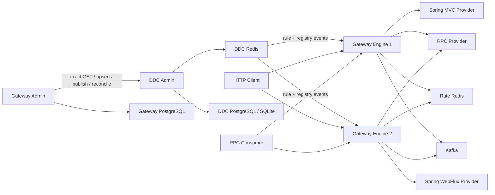

# Gateway、DDC、RPC 与 HTTP 联调闭环修复设计

状态：已确认，待实施

确认日期：2026-07-26

代码基线：`main@3690c5f114bd`

关联设计：

- `2026-07-24-ddc-standalone-rpc-framework-design.md`
- `2026-07-24-gateway-component-design.md`
- `2026-07-25-gateway-rule-publication-runtime-design.md`
- `2026-07-25-gateway-17-gap-remediation-design.md`
- `2026-07-25-gateway-test-deployment-design.md`

## 1. 背景与结论

当前 Gateway、DDC、RPC 三个 Component 各自拥有较完整的单元能力，但真实组合链路仍有
确定性合同冲突：Gateway 生成的 DDC 发布请求不能通过 DDC 校验，DDC 写出的服务状态会被
Gateway 和 RPC 判断为不可用，HTTP Provider Runtime 没有业务可直接使用的自动装配，真实
测试也只覆盖 Spring MVC 的局部 happy path。

本轮采用“持久化分阶段发布 + 稳定公共契约 + 可执行联调环境”方案，修复已经审计确认的
P0、P1、P2 问题，并以真实 Redis、PostgreSQL、Kafka、独立 JVM 和双 Gateway Engine
证明组合能力。

本设计不采用以下替代方案：

1. 只补 UUID、状态字符串和配置项的紧急补丁。它不能处理响应丢失、进程崩溃、chunk
   中途失败和 DB/Redis 运行态泄漏。
2. 给 DDC 增加 Gateway 专用 `publishBundle`。它会让通用配置中心理解 Gateway 的
   chunk/activation 语义，并把单 key 发布扩大为跨 key 事务问题。
3. 引入通用 Saga、2PC、Strategy 或 Chain 框架。当前发布阶段固定，持久化 operation
   journal、幂等 changeId 和显式 Coordinator 已足够。

## 2. 目标

### 2.1 功能目标

1. Gateway Admin 可以通过真实 DDC 合同创建、发布并恢复 inline/chunked 规则。
2. DDC Config、Service Registry、Gateway Provider Directory 和 RPC Gateway Directory
   使用一致的服务状态与租约语义。
3. HTTP Provider 仅添加依赖和配置即可在 Spring MVC 或 Spring WebFlux 应用中完成接口
   上报、服务注册、心跳和注销。
4. 打通三条真实数据路径：
   - HTTP Client → Gateway → Spring MVC/WebFlux HTTP Provider；
   - HTTP Client → Gateway → RPC Provider；
   - RPC Consumer → Gateway → RPC Provider。
5. RPC 能准确区分 Gateway 阶段和 Provider 阶段失败，只对显式幂等方法执行安全的
   Gateway 实例故障转移。
6. 提供可自动执行和可人工操作的联调路径，并交付中英文指导文档。

### 2.2 质量目标

1. 外部调用前持久化每个发布操作的身份和参数；同一次重试必须复用完全相同的 UUIDv7。
2. Redis Cluster 多键 Lua 不发生 `CROSSSLOT`。
3. DDC 发布失败时，周期 pull 不得读取未发布 draft。
4. 所有后台循环可关闭、有界、可观测，并对瞬时故障自恢复。
5. 真实联调使用隔离数据、唯一端口/进程名和可重复清理，不泄漏 Secret、JWT 或规则内容。

## 3. 明确边界

本轮包含：

- 注解式 Spring MVC Controller；
- 注解式 Spring WebFlux Controller，返回非流式 `Mono<DTO>`/JSON；
- Gateway Rule inline/chunked 发布、恢复、回滚、LKG 和 GC；
- DDC SINGLE、SENTINEL 与 CLUSTER 的配置合同和测试入口；
- DDC 管理面认证、HMAC scope 与共享 nonce 防重放；
- RPC unary 调用、多 Gateway Slot、幂等故障转移和错误分类；
- Testcontainers 真实进程测试和 Compose Demo。

本轮不包含：

- WebFlux functional `RouterFunction` 自动发现；
- SSE、`Flux` 流式 HTTP 响应；
- RPC client/server/bidirectional streaming；
- Raft、JRaft、Redis 自建高可用或 PostgreSQL 高可用编排；
- 新的证书管理平台或补齐所有未实现的端到端 TLS/mTLS 产品能力；
- Nginx 节点管理和动态配置；
- Admin Web 浏览器 E2E、长稳和性能基线作为本轮完成门禁。

已有 TLS/mTLS 配置继续保留并做静态/组件验证；没有真实进程证据的加密链路不得标记为
“已验收”。

## 4. 当前确定性缺口

### 4.1 P0：组合链路无法成立

#### P0-01 Gateway → DDC 发布请求无效

`GatewayDdcRulePublisher` 传递空 `expectedVersion`，并从普通字符串拼接 chunk changeId；
`GatewayReleaseService` 使用 `gateway-release-*` 作为 changeId。DDC 要求配置已存在、
`expectedVersion` 精确匹配且 changeId 为 UUIDv7，因此真实发布必然失败。

#### P0-02 服务状态不一致

DDC 生产 `ONLINE`；Gateway 只接受 `REGISTERED`；RPC Consumer 只接受 `UP` 或空值。
真实 Provider 和 Gateway Slot 会被错误摘除。

#### P0-03 DDC 容器不可执行

DDC Admin 主产物是 thin JAR，可执行产物使用 `exec` classifier；Dockerfile 当前复制 thin
JAR，Compose 会在 `java -jar` 阶段失败。

#### P0-04 联调进程连接错误 Redis

Compose Engine 与现有 live Harness 没有把 DDC Redis 的服务地址或 Testcontainers 随机
端口传给所有 DDC Client，进程会退回 `127.0.0.1:6379`。

#### P0-05 HTTP Provider 不能直接消费

`gateway-provider-runtime` 没有 Boot AutoConfiguration、配置属性或生命周期绑定。现有
MVC 测试应用通过私有 Configuration 手工创建 Runtime，且上报 artifact version 与注册
service version 不一致。仓库没有 WebFlux Provider 应用。

### 4.2 P1：恢复、一致性与运行可靠性不足

#### P1-01 Gateway 只记录 activation changeId

chunk 发布没有持久化 phase；响应丢失或任意 chunk 后崩溃时无法确定完成位置，也不能安全
决定是否进入 activation。

#### P1-02 DDC draft 与 published 指针混用

publish prepare 会推进 `current_version`，pull 又读取 current draft。Redis 投递失败后，
客户端仍可能通过周期 pull 应用一个状态为 FAILED 的版本。

#### P1-03 Redis 发布不是原子动作

value、version 和 Pub/Sub event 分别写入，部分成功时 Redis 运行态不一致。

#### P1-04 Redisson Bean 装配会串线或缺失

DDC Config、Registry 和 Gateway Rate Limit 按类型判断缺省 Bean，却又按固定 qualifier
消费；应用中存在其他 `RedissonClient` 时会压制目标 Bean。Registry 还绕过
`DdcRedisTopology`，只支持 SINGLE。

#### P1-05 Redis Cluster Lua 跨槽

配置租约和服务注册脚本同时操作多个没有共同 hash tag 的 key，在真实 Cluster 中会
`CROSSSLOT`。

#### P1-06 ACK 只有一次发送

客户端应用成功后的 ACK 发生网络异常时只记日志，没有有界重试，发布任务可能误超时。

#### P1-07 chunk 应用顺序与生命周期不闭合

首次 pull 没有保证 chunk applier 先于 activation applier；Engine 本机 chunk store 无上限，
DDC 中旧 release chunks 也没有保护规则与延迟清理策略。

#### P1-08 RPC 重试与错误分类不安全

Consumer 会对缺乏明确 Provider failure trailer 的 `UNAVAILABLE` 重试，但方法合同没有
幂等标记；部分生产错误没有一致写入 failure-stage；Gateway Slot 心跳失败后不能重新注册。

### 4.3 P2：安全、可测试性和文档不足

1. DDC HMAC 只保护 openapi，其他管理接口默认开放；nonce 是单进程内存态。
2. Compose 没有 MVC/WebFlux/RPC Provider 和 RPC Consumer，也没有数据初始化脚本。
3. Compose 服务只依赖 `service_started`，缺少 readiness 等待，容易发生启动竞态。
4. 现有 live IT 没有 WebFlux、RPC 双 Engine、Provider 新 lease 恢复、真实 rollback/LKG、
   跨 Engine 分布式限流断言。
5. 两个 Engine 使用相同进程名，日志和 manifest 可能互相覆盖。
6. DDC manifest 默认版本仍为 `5.2.1`，与工程 `5.2.3` 漂移。
7. Gateway Admin 本地联调缺少 JWT 生成工具；Admin Web 文档包含不存在的环境变量。
8. 外部 Redis 测试没有精确 scope 清理，可能污染共享 Redis。

## 5. 目标总体架构



## 6. 公共服务状态合同

新增 `DdcInstanceStatus`：

```text
ONLINE
OFFLINE
UNKNOWN
```

兼容规则：

- 新生产者只输出 `ONLINE`/`OFFLINE`；
- `REGISTERED`、`UP` 读入时归一化为 `ONLINE`；
- `EXPIRED`、`DOWN` 读入时归一化为 `OFFLINE`；
- 空值和未知值归一化为 `UNKNOWN`，不能默认视为在线；
- 保留 management-client 公共 record 中的 JSON String component；新增
  `normalizedStatus()` typed accessor，避免 patch 版本破坏二进制/JSON 合同；
- Gateway/RPC 选择候选时同时要求 `ONLINE` 且 `leaseExpireAt > now`。

状态解析位于 DDC management-client 公共模型，不允许 Gateway、RPC 各自继续比较字符串。

## 7. Gateway 持久化分阶段发布

### 7.1 publication journal

Gateway Admin 新增 `gateway_release_publication`：

```text
GatewayReleasePublication
├── releaseId
├── attemptNo
├── phaseOrder
├── phaseType = CHUNK | ACTIVATION
├── configKey
├── contentSha256
├── expectedVersion
├── changeId             # UUIDv7
├── ddcTargetVersion
├── ddcStatus
├── errorCode
├── errorMessage
├── createdAt
└── updatedAt
```

约束：

- 主键 `(release_id, attempt_no, phase_order)`；
- `change_id` 唯一；
- 外部 DDC 调用前必须先持久化完整 operation；
- 同一个 operation 的查询、重试和恢复始终复用原 changeId、expectedVersion、内容和超时；
- activation 只有在全部 chunks 为 SUCCESS 后才能进入；
- release 只有 activation SUCCESS 才能标记 SUCCEEDED；
- PARTIAL_SUCCESS、TIMEOUT、UNKNOWN 不得提升 Draft active revision。

### 7.2 exact GET、创建与 CAS

DDC management-client 增加：

```java
Optional<DdcManagementConfig> findConfig(
        DdcManagementConfigQuery query
);
```

发布单个 artifact 的顺序：

1. exact GET config coordinate；
2. 不存在时使用 `upsert(expectedVersion=0)` 创建；
3. 响应丢失时再次 exact GET；内容相同则认领，内容冲突则失败；
4. 把实际 current version 固化为 journal 的 expectedVersion；
5. 生成并持久化 UUIDv7；
6. 调用 publish；
7. 响应不确定时按同一 changeId 查询 task；
8. 保存 targetVersion 和最终状态。

`GatewayDdcRulePublisher` 只负责已完整指定 operation 的远程适配；阶段编排进入
`GatewayReleasePublicationCoordinator`，DB Store 不执行网络调用。

### 7.3 恢复与 GC

`GatewayReleaseReconciler` 按 journal phase 恢复，不再只查询 release 级 changeId。

GC 规则：

- 当前 activation 引用的 chunks 永不删除；
- 后继 activation 成功后，前一成功 release 的 chunks 默认再保留 24 小时；
- 删除必须使用 journal 中的 configKey 和 version 做 CAS；
- 删除失败可重试，不回滚已成功 activation；
- Engine 成功校验、保存 LKG 并切换 active snapshot 后立即清理本机临时 chunk buffer。

## 8. DDC 发布一致性

### 8.1 draft 与 published 指针

`ddc_config_item` 增加 `published_version`：

- `current_version`：最新 draft；
- `published_version`：pull 和运行态查询唯一读取的版本；
- 升级回填 `published_version = current_version`，保持既有运行态可见；
- publish prepare 创建 immutable version 和 task，但不推进 published pointer；
- Redis 投递成功后使用短 DB 事务推进 published pointer；
- Redis 失败时 pointer 保持旧值。

这不是 DB/Redis 2PC。合同为幂等、至少一次投递和前向收敛；UNKNOWN 状态必须通过同一
task 重放，不能声称已回滚。

### 8.2 Redis 原子发布

新增同槽 Lua，一次完成：

1. 校验 expected Redis version；
2. 写入 config value；
3. 写入 config version；
4. 发布包含 changeId、targetVersion、checksum、ack deadline 的消息。

相同 changeId/targetVersion/content 的重放必须幂等；不同内容复用 changeId 必须拒绝。

### 8.3 ACK delivery

新增有界 `DdcAckDelivery`：

- 首次立即 ACK；
- 仅网络异常、超时和 5xx 重试；
- 4xx、lease mismatch、checksum mismatch 不重试；
- 指数退避加 jitter；
- 合并 `(changeId, instanceId, leaseId)` 相同 ACK；
- 有界队列和线程池；
- 实现 `SmartLifecycle`/`AutoCloseable`；
- 队列饱和、最终耗尽和重试次数提供指标及结构化日志。

第一阶段不增加客户端持久化 ACK outbox。客户端崩溃后的遗漏由 DDC 重发和周期 reconcile
收敛。

### 8.4 pull 应用顺序

为 `DdcConfigApplier` 增加向后兼容的默认 priority；启动 pull 与批量 reconcile 按
priority、configKey 排序。Gateway chunk applier 优先于 activation applier，避免首次启动
先处理 activation 后丢失激活机会。

## 9. Redisson 与 Redis Cluster 合同

明确四个独立 Bean：

```text
ddcRedissonClient
ddcRegistryRedissonClient
ddcAdminRedissonClient
gatewayRateLimitRedissonClient
```

全部使用：

- `@ConditionalOnMissingBean(name = "...")`；
- 消费者精确 `@Qualifier`；
- 依赖自动配置精确 `@ConditionalOnBean(name = "...")`；
- `destroyMethod = "shutdown"`；
- Registry 通过 `DdcRedisTopology.create(...)` 支持 SINGLE/SENTINEL/CLUSTER。

Redis v2 hash tag：

- config/value/version/topic/lease 使用 `(appCode, env, namespace)` digest；
- service registry 六个原子 key 使用 `(env, namespace, serviceKind)` digest；
- 不使用全局 `{ddc}`，避免所有数据集中到单槽；
- service registry 不按单 serviceKey 分槽，继续保证同 scope 下 instanceId 冲突检测。

滚动兼容一个 minor release：

- config value/version 双写 legacy/v2；
- legacy/v2 topic 双发；
- 新客户端优先 v2，缺失时回退 legacy；
- registry/lease 通过重新注册恢复，新 Admin 继续发布 legacy topic；
- 遗留无 TTL key 由精确运维脚本清理，不执行全库 `FLUSHALL`。

## 10. DDC 安全

身份边界：

- `/api/v1/ddc/openapi/**`：HMAC 服务身份；
- apps/namespaces/configs/publish-tasks/instances/cache 等人员管理接口：JWT；
- manifest、Actuator health/info：匿名；
- 其他接口默认拒绝。

HMAC credential 绑定 `clientType`、appCode/env/namespace scope 和 allowed operations；请求体
中的 operator 只作审计备注，可信主体由服务端从 credential 推导。

nonce 使用 Redis `SET NX PX`，多 Admin 共享；管理写请求在 nonce store 不可用时 fail
closed。JWT claim/capability 语义与 Gateway Admin 保持一致，但 DDC 不依赖 Gateway 模块。

开发环境允许通过显式 `local-dev` 配置启用受限简化认证；默认配置不得把生产管理接口开放。

## 11. HTTP Provider Runtime

`gateway-provider-runtime` 新增：

- `GatewayHttpProviderProperties`，前缀
  `egon.cola.component.gateway.provider.http`；
- `GatewayHttpProviderAutoConfiguration`；
- `META-INF/spring/org.springframework.boot.autoconfigure.AutoConfiguration.imports`；
- `GatewayHttpProviderHealthIndicator`。

自动装配行为：

1. 同时适用于 Servlet 和 Reactive Web Server；
2. 监听 `WebServerInitializedEvent`，使用实际端口启动 `HttpProviderLeaseRuntime`；
3. Context 关闭时主动注销并关闭心跳；
4. env、namespace、serviceName、version 默认复用 Gateway Reporting/DDC 配置；
5. Reporting 和 Registry 使用同一个 artifact/service version 来源；
6. 非 local/test 环境必须显式配置 advertised host，不能猜测 wildcard/loopback；
7. 健康状态至少包含 `REGISTERING/REGISTERED/FAILED/STOPPED`；
8. `fail-fast=false` 时网络恢复后继续重试注册，健康状态反映当前事实。

新增 WebFlux 测试 Provider，使用注解式 Controller 和 `Mono<DTO>`；MVC 与 WebFlux
Provider 注册为同一 service identity，以验证混合框架负载均衡。现有 MVC 应用删除私有
Runtime Configuration，证明真实业务只需要依赖和 YAML。

## 12. RPC 合同、错误和恢复

### 12.1 幂等声明

扩展：

```java
@EgonRpcMethod(name = "Echo", idempotent = true)
```

`idempotent` 默认 `false` 并进入 `RpcMethodDescriptor`。Consumer 只在以下条件同时满足时
尝试下一个 Gateway：

- 方法显式幂等；
- 请求 Deadline 尚有剩余；
- failure-stage 为 GATEWAY；
- 错误属于可重试的瞬时不可用；
- 尚未超过有界 attempt 数。

Provider 阶段失败、非幂等方法、Deadline exceeded、contract 错误均不跨 Gateway 重试。

### 12.2 failure-stage

新增 typed `RpcFailureStage` 和集中 metadata key 常量，wire 继续兼容当前
`failure-stage`：

```text
GATEWAY
PROVIDER
```

生产 Gateway 的路由/目录/连接失败写 GATEWAY 或 PROVIDER；Provider 返回的业务 gRPC
Status 保留 Provider 阶段。`UNIMPLEMENTED` 映射为稳定 method-not-found 错误，不伪装成
Gateway unavailable。

### 12.3 Gateway Slot 生命周期

Gateway RPC registrar 使用：

```text
STARTING → REGISTERED → RECOVERING → REGISTERED → STOPPED
```

心跳或 lease mismatch 后进入 RECOVERING，以有界退避重新注册并取得新 leaseId；关闭期间
禁止重注册。Consumer Directory 接受多个 ONLINE Gateway Slot，按现有负载策略选择；实例
移除时排空并关闭 Channel。

默认 Gateway service name 统一为 `egon-gateway-rpc`；env、namespace、group、version 和
DDC appCode 的来源在 Gateway Engine、RPC Consumer、Compose 与测试中保持一致。

## 13. 启动、部署与版本修复

1. DDC Dockerfile 复制 `*-exec.jar`，保留 thin JAR 为 Maven 主产物。
2. Compose 和 live Harness 给每一个 DDC Client 传递真实 Redis host/port。
3. 容器内 advertised host 使用 Compose service DNS，禁止使用 `127.0.0.1`。
4. DDC manifest 版本从 Maven/build metadata 获取，删除 `5.2.1` 硬编码。
5. Compose 为 DDC、Gateway Admin、Engine 添加 healthcheck，依赖 readiness 而非单纯
   `service_started`。
6. 双 Engine 使用唯一 instanceId、进程名、日志、manifest 和 LKG 目录。

## 14. 数据库迁移

既有 V1-V3 一律不修改。

Gateway 数据库变更：

- 新增且仅新增
  `egon-cola-component-gateway-admin/src/main/resources/db/migration/`
  `V4__add_release_publication_journal.sql`。

DDC 对两个受支持数据库分别执行一次相同逻辑变更：

- PostgreSQL：`db/postgresql/V4__add_published_config_pointer.sql`；
- SQLite：`db/sqlite/V4__add_published_config_pointer.sql`。

每个数据库只有一份新版本文件，均回填 `published_version=current_version`。不能只更新
PostgreSQL 后继续宣称 SQLite 支持。

Redis v2 key 迁移不使用 Flyway，由双写/双读、双 topic 和精确清理脚本完成。

## 15. 测试设计

### 15.1 L0 单元与组件测试

覆盖：

- UUIDv7、expectedVersion、exact GET/upsert、幂等响应丢失；
- 每个 chunk phase 恢复及 activation barrier；
- ONLINE/REGISTERED/UP 与 OFFLINE/EXPIRED JSON fixture；
- 四个 Redisson Bean 与用户自定义 Bean 共存；
- Redis v2 key 的 cluster slot 一致；
- published pointer 与 Redis Lua 失败窗口；
- ACK 瞬时/永久失败、队列饱和和关闭；
- applier priority 与 chunk cleanup；
- MVC/WebFlux 自动装配和 service version 一致；
- RPC 幂等/非幂等重试、failure-stage 与 Slot re-register；
- DDC 未认证、错误 capability、越权 scope 和跨节点 nonce replay；
- PostgreSQL/SQLite V1→V4 migration。

### 15.2 L1 `gateway-live` 真实进程测试

使用 Testcontainers 启动真实 PostgreSQL、DDC Redis、Rate Redis、Kafka，并启动独立 JVM：

- DDC Admin；
- Gateway Admin；
- 两个 Gateway Engine；
- MVC Provider；
- WebFlux Provider；
- RPC Provider；
- RPC Consumer。

必须证明：

1. MVC/WebFlux 接口均完成上报和注册；
2. HTTP→HTTP 同时命中 MVC、WebFlux；
3. HTTP→RPC 成功；
4. RPC Consumer→双 Engine→RPC Provider 成功且两个 Engine 都承载流量；
5. v1、v2、rollback 发布均成功，两个 Engine activeReleaseId 一致；
6. Provider 优雅停止立即摘除，强制停止按 TTL 摘除，重启取得新 lease；
7. 分布式限流跨 Engine 出现 200→429；
8. Kafka Trace 包含正确 protocol、providerId、engineInstanceId 和 traceId；
9. Engine 使用 LKG 重启恢复，损坏 checksum 时 fail closed；
10. Admin/DDC 重启后 PostgreSQL 数据、发布任务和 Flyway history 保留。

### 15.3 L2 Redis 拓扑与安全测试

- SINGLE 作为默认快速入口；
- SENTINEL 配置和 failover 集成测试；
- 真实三节点 CLUSTER 验证所有 Lua keys 同槽且无 CROSSSLOT；
- 双 DDC Admin 验证 Redis nonce 防重放；
- 无法执行的外部环境必须在最终报告中明确说明，不能用 mock 替代通过声明。

### 15.4 L3 Compose Demo

`compose.demo.yml` 增加 MVC/WebFlux/RPC 示例与 Consumer。静态门禁执行
`docker compose ... config --quiet`；真实 `up --build --wait` 作为人工联调和
nightly/release 入口，不进入默认 Surefire。

## 16. 联调交付

新增：

```text
egon-cola-component-gateway/
├── docs/
│   ├── developer-integration.md
│   └── developer-integration.zh-CN.md
└── deployment/
    ├── compose.demo.yml
    ├── demo/
    │   ├── applications.json
    │   ├── routes.json
    │   └── policies.json
    └── scripts/
        ├── demo.sh
        ├── demo-token.sh
        └── wait-ready.sh
```

`demo.sh` 只提供稳定子命令：

```text
doctor
build
up-control
init
up-providers
publish
up-consumer
verify
logs
down
purge
```

默认 `down` 保留卷；`purge` 才允许删除本地 Demo 卷，且必须校验 Compose project name 并
要求明确确认。脚本不得执行全局 Docker/Redis 清理。

Runbook 必须包含：

- JDK、Maven、Docker、Compose、curl、jq 前置检查；
- 固定启动顺序与端口表；
- JWT 生成和 Secret 文件权限；
- Application/Credential/Rule 初始化；
- MVC、WebFlux、HTTP→RPC、RPC Consumer 调用命令；
- readiness、release、runtime consistency、Provider projection、Kafka Trace 成功判据；
- Provider、Redis、Kafka、PostgreSQL 故障演练；
- 日志与指标路径；
- 保留数据的停止方式与可恢复清理；
- 按症状、首查位置和常见原因组织的故障排查矩阵。

文档只描述实际执行成功的命令。未执行的 TLS、Cluster、HA 或性能场景必须明确标注验证
边界。

## 17. 可观测性与敏感信息

结构化日志和指标至少包含：

- releaseId、attempt、phase、changeId、configKey；
- DDC expected/target version 和 dispatch/replay 次数；
- ACK retry、queue saturation、final exhaustion；
- legacy/v2 fallback 次数；
- chunk GC 数量和被保护 active release；
- Provider/Gateway lease re-register；
- HMAC credential id、scope rejection、replay rejection。

禁止记录：

- configValue、chunk Base64 和完整规则正文；
- Credential secret、JWT、HMAC secret、数据库密码；
- 完整敏感 cache diff。

## 18. 设计模式决策

采用：

- Adapter：DDC publisher、HTTP/RPC upstream 和 Registry 保持外部系统适配边界；
- Application Coordinator：`GatewayReleasePublicationCoordinator` 负责编排固定阶段；
- Persistent Command Journal：保存外部调用身份与恢复进度；
- 显式 State Enum：发布、ACK、Provider Runtime、Gateway Slot 状态；
- Test Fixture + Facade：拆分现有超大 live IT，提高故障诊断与资源清理可靠性。

不采用：

- 通用 Saga/2PC 框架；
- Strategy 或 Factory 层级；
- Chain of Responsibility；
- DDC Gateway 专用 Bundle API。

固定 `chunks → activation` 的流程用显式代码和持久化 phase 更直观，新增通用抽象不会提高
当前正确性。

## 19. 实施与提交顺序

1. 公共状态语义、DDC Docker/版本/Redis 地址与 Redisson Bean；
2. DDC exact GET、published pointer、v2 key、Lua 原子发布和迁移；
3. Gateway publication journal、阶段 Coordinator、reconcile 和迁移；
4. ACK delivery、applier order 与 chunk GC；
5. HTTP Provider Boot 自动装配、MVC 修订和 WebFlux Provider；
6. RPC 幂等、failure-stage、多 Slot 恢复；
7. DDC HMAC/JWT/Redis nonce；
8. live test fixture 和完整真实矩阵；
9. Compose Demo、初始化脚本和中英文 Runbook；
10. 全量验证、文档校准和完成审计。

每一项形成独立提交；共享文件按顺序修改，不并发写入同一区域。

## 20. 完成定义

本轮只有同时满足以下条件才算完成：

1. 所有 P0/P1/P2 缺口都有先失败后通过的定向测试；
2. DDC、Gateway、RPC 各自模块测试通过；
3. Gateway/DDC/RPC 相关 Reactor 构建通过；
4. `gateway-live` 真实闭环覆盖 MVC、WebFlux、HTTP→RPC、RPC 双 Engine、发布恢复、
   rollback、LKG、分布式限流和 Provider 新 lease；
5. PostgreSQL、DDC Redis、Rate Redis、Kafka 均有行为断言，不只是容器成功启动；
6. Compose 静态验证通过，人工联调脚本与中英文 Runbook 使用同一事实来源；
7. 对无法运行的 Redis Cluster/Sentinel、TLS/HA 或外部环境测试逐项报告未验证边界；
8. `git diff --check` 通过，工作树只包含本轮范围文件；
9. 不自动启动并遗留任何业务项目、容器或后台进程。
