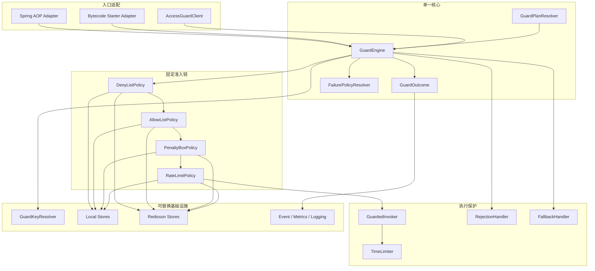

# Access Guard V2 整改设计 Spec

> 状态：待审核，未进入实施
>
> 日期：2026-07-29
>
> 基线：`main@62af42bc`，仓库版本 `5.3.1`
>
> 整改对象：`egon-cola-component-access-guard-starter` 及其在 Bytecode 组件中的接入适配

## 1. 审核闸门

本文只确认整改需求、目标结构、行为语义、兼容边界和验收标准，不是实施计划。

在本文得到明确确认前：

1. 不修改 Access Guard 或 Bytecode 源码；
2. 不修改 POM、BOM、版本号或自动配置；
3. 不删除旧注解；
4. 不新增测试、SQL、Flyway 或其他运行时资源；
5. 不创建 `docs/superpowers/plans/` 下的实施计划。

确认后再按本文拆解实施计划和任务提交。

## 2. 背景与问题定性

当前 Access Guard 已经提供 Spring AOP、Bytecode Agent、允许名单、限流、自动封禁、
本地与 Redisson 存储、超时、fallback、`returnJson` 和动态规则等能力，但实现仍以一个扁平
`AccessGuardRule` 和多条入口专用执行链组织，能力之间的边界与故障语义不清晰。

本次源码审计确认以下问题仍存在：

1. `AccessGuardExecutionService` 直接依赖 AspectJ `ProceedingJoinPoint`，核心执行链不能被
   AOP、Agent 和程序化调用自然复用。
2. 当前执行顺序是 AllowList 在 DenyList 之前，且 `BYPASS_GUARD` 会直接执行业务方法，
   允许名单可以绕过拒绝名单。
3. `BlacklistService` 同时承担违规计数和临时封禁，没有独立的人工 DenyList 语义；LOCAL
   默认实现又是空实现，导致本地自动封禁不闭环。
4. Redisson 条件装配只在存在 `RedissonClient` 时生效。显式选择 `REDISSON` 却没有客户端时，
   可能落回核心本地默认 Bean，而不是启动失败。
5. `LOCAL_FALLBACK` 的解释分散在失败处理器和 Redisson 限流器中，存储异常、真实限流拒绝和
   本地降级结果没有统一模型。
6. 动态规则仍由扁平 Rule/Override 合并，没有版本化、校验后原子替换和最后有效快照契约。
7. 当前超时实现没有 open/half-open/closed 状态机，却使用 Circuit Breaker 命名；线程池部分
   配置没有完整兑现，虚拟线程执行器生命周期也未统一托管。
8. timeout、fallback 或 `returnJson` 成功处理后，外层仍可能发布 `PASS`，最终观测结果与真实
   决策不一致。
9. fallback 依赖运行时反射搜索，没有启动期签名校验和 MethodHandle 缓存；JSON 拒绝值没有
   复用 Spring 管理的 `ObjectMapper`。
10. Key 解析依赖 AOP JoinPoint，默认信任 `X-Forwarded-For`，原始访问 Key 贯穿可变上下文，
    缺少统一规范化、可信代理和隐私边界。
11. Bytecode Starter 通过 `AgentProceedingJoinPoint` 反向模拟 AOP，并维护单独的构造器执行链；
    方法、构造器和 AOP 的行为容易漂移。
12. `AccessGuardProperties` 使用 `ignoreInvalidFields=true`，部分错误配置可能被忽略而不是启动失败。

这不是在现有 AOP 类中继续补条件分支就能解决的问题。整改目标是把入口、策略、存储、业务执行
保护和最终观测拆成清晰的内部边界，同时保持业务接入仍然只有一个 Starter。

## 3. 整改目标

V2 必须实现：

1. `egon-cola-component-access-guard-starter` 仍是唯一 Access Guard 业务依赖；
2. 所有单元、自动配置和集成测试继续位于 Starter 的 `src/test`；
3. AOP、Bytecode Agent 和程序化 API 共用一个不依赖 AspectJ 的 `GuardEngine`；
4. 准入判断与业务执行保护分开建模；
5. DenyList、AllowList、PenaltyBox 和 RateLimit 使用固定、安全的执行顺序；
6. LOCAL、REDISSON 和自定义存储遵循相同策略接口和决策语义；
7. 动态规则采用不可变、版本化、校验后原子替换的快照；
8. 故障、拒绝、降级和最终返回方式有准确且唯一的最终结果；
9. 默认拒绝抛出结构化异常，fallback、`returnJson` 和显式 `returnNull` 是可选处理方式；
10. 所有配置都必须“有生产读取方和行为测试，或被删除”；
11. 所有原始访问 Key 不进入日志、指标、事件、异常或 Redis key；
12. 删除 `DoWhiteList`、`DoRateLimiter`、`DoHystrix` 及其全部识别、解析、测试和文档；
13. 用 TimeLimiter 术语替换不真实的 Circuit Breaker 术语；
14. 保留现有 AllowList、RateLimit、自动封禁、动态规则、AOP、Agent、超时和 fallback 的
    对应替代能力。

## 4. 非目标

本次不包含：

1. 新建 `egon-cola-component-access-guard` 聚合模块、core 模块、store 模块或 test 模块；
2. Access Guard Admin、管理 UI、数据库表或 Flyway 迁移；
3. 网关级流量治理、跨地域强一致限流或风控评分；
4. 完整熔断状态机；真正的 Circuit Breaker 应由后续 resilience 组件负责；
5. V2 中实现 `ConcurrencyLimitPolicy`；只保留策略 SPI 的扩展能力，不声明无实现配置；
6. 保证强制中断已经进入不可中断 I/O 的同步业务代码；
7. 为旧 `Do*` 注解提供 deprecated 转发器或兼容模块；
8. 自动启动业务应用、Redis 或其他长驻服务；
9. 在 Access Guard Starter 中复制 Bytecode 组件已有的 ClassLoader Bridge 协议。

## 5. 方案比较与结论

### 5.1 方案 A：单 Starter 原位重构，6.0.0 一次切换

在现有 Starter 内重构内部包和执行模型；Bytecode 适配仍由现有 Bytecode Starter 承担；删除旧
公开 API，不保留双执行链。

优点是边界最简单、没有新模块、没有长期兼容债务，且与当前已经扁平化的模块结构一致。缺点是
外部调用方需要一次性迁移注解和配置。

### 5.2 方案 B：保留 V1 兼容门面并逐步迁移

让 V1 注解和规则先转换到 V2 `GuardPlan`，跨一个版本后再删除。

该方案能降低单次迁移压力，但会继续保留两套注解语义、动态配置映射和 Agent 识别逻辑，无法证明
旧配置已经真正生效，也与整改文档明确删除 `Do*` 的方向冲突。

### 5.3 方案 C：拆分 api/core/store/starter/test 多模块

该方案可以形成更纯的依赖图，但当前实现规模和消费者边界不足以支撑额外发布单元，还会重新引入
刚刚移除的聚合与测试模块层级。

### 5.4 选型

采用方案 A。

V2 作为破坏性发布进入仓库 `6.0.0` 发布线。仓库当前所有模块共用 `5.3.1` 版本，因此版本升级
必须作为仓库级发布动作统一处理，不能只给 Access Guard 单独改版本。具体版本提交在实施计划中
单独安排，本次 Spec 不改版本。

## 6. 模块与依赖边界

目标结构保持：

```text
egon-cola-components/
├── egon-cola-component-access-guard-starter/
│   ├── pom.xml
│   └── src/
│       ├── main/
│       └── test/
└── egon-cola-component-bytecode/
    ├── egon-cola-component-bytecode-bridge/
    ├── egon-cola-component-bytecode-runtime/
    ├── egon-cola-component-bytecode-core/
    └── egon-cola-component-bytecode-starter/
```

边界规则：

1. Access Guard Starter 不依赖 Bytecode 组件；
2. Bytecode Starter 保持对 Access Guard Starter 的 optional 依赖，并负责两者间的适配；
3. `bytecode-bridge` 继续是 JDK-only 通用协议，不引入 Access Guard API；
4. Access Guard 核心不依赖 AspectJ、Bytecode Bridge、Reactor、Redisson、Micrometer 或 Actuator；
5. AOP、Redisson、Reactor、Micrometer 和 Actuator 能力通过条件自动配置接入；
6. Redisson、Reactor、Micrometer 和 Actuator 只能是 optional 能力，未选择时不得影响本地启动；
7. BOM 继续只导出 `egon-cola-component-access-guard-starter`，不新增 Access Guard 发布物；
8. 不引入 JPA、数据库、Flyway、MQ、Hystrix 或新的配置中心强依赖。

## 7. 总体架构



核心流程固定为：

```text
解析规则快照
  -> 构造不可变 GuardInvocation
  -> 解析并散列访问 Key
  -> DenyList
  -> AllowList
  -> PenaltyBox
  -> RateLimit
  -> TimeLimiter / 业务执行
  -> Rejection 或 Fallback
  -> 生成一次最终 GuardOutcome
  -> 发布一次最终 GuardEvent
```

## 8. 目标包结构

所有 Access Guard 生产代码仍位于同一个 Starter：

```text
top.egon.cola.component.accessguard
├── api
│   ├── AccessGuard
│   ├── GuardKey
│   ├── AccessGuardClient
│   ├── GuardRequest
│   └── AccessGuardRejectedException
├── core
│   ├── GuardEngine
│   ├── DefaultGuardEngine
│   ├── GuardInvocation
│   ├── GuardOutcome
│   ├── GuardDecision
│   ├── GuardResolution
│   ├── GuardPlan
│   ├── GuardPlanSnapshot
│   └── GuardPlanResolver
├── policy
│   ├── GuardPolicy
│   ├── PolicyResult
│   ├── deny
│   ├── allow
│   ├── penalty
│   └── ratelimit
├── key
│   ├── GuardKeyResolver
│   ├── KeyHasher
│   └── contributor
├── store
│   ├── AllowListStore
│   ├── DenyListStore
│   ├── PenaltyStore
│   ├── RateLimitBackend
│   ├── local
│   └── redisson
├── execution
│   ├── TimeLimiter
│   ├── GuardedInvoker
│   ├── FallbackHandler
│   └── RejectionHandler
├── adapter
│   ├── aop
│   └── programmatic
├── observability
└── autoconfigure
```

这是内部代码组织，不对应新的 Maven 模块。实现时允许根据现有风格合并只含一个简单类型的包，
但不得改变上述责任边界。

### 8.1 当前类型处置

| 当前类型 | V2 处置 |
| --- | --- |
| `AccessGuardAop` | `SpringAopAccessGuardAdvisor`，只做入口适配 |
| `AccessGuardExecutionService` | `DefaultGuardEngine` |
| `ConstructorAccessGuardExecutionService` | 删除，构造器调用统一 Engine 的准入入口 |
| `AccessGuardRule` | 拆为 `GuardPlan` 和各 PolicyConfig |
| `AccessGuardRuleOverride` | 删除，使用不可变 `GuardPlanSnapshot` |
| `AccessGuardRuleResolver` | `DefaultGuardPlanResolver` |
| `AccessGuardConfigProvider` | `GuardPlanSource` |
| `DefaultAccessKeyResolver` | `CompositeGuardKeyResolver` 和 Contributor 链 |
| `WhiteListService` | `AllowListPolicy` |
| `WhiteListRepository` | `AllowListStore` |
| `BlacklistService` | 拆为 `DenyListStore`、`PenaltyStore` 和 `PenaltyService` |
| `RateLimiterExecutor` | `RateLimitPolicy` + `RateLimitBackend` |
| `TimeoutCircuitBreakerExecutor` | `TimeLimiter` |
| `ReflectionFallbackInvoker` | `MethodHandleFallbackHandler` |
| `RejectResponseInvoker` | `RejectionHandler` |
| `NoopAccessGuardEventPublisher` | `CompositeGuardEventPublisher` |
| 可变 `AccessGuardContext` | 不可变 `GuardContext` / `GuardInvocation` |
| `AgentProceedingJoinPoint` | 删除，由 Bytecode Starter Adapter 直接转换 Bridge 请求 |

## 9. 公共注解与迁移边界

### 9.1 主入口注解

`@AccessGuard` 只绑定规则，不再携带 allow/rate/penalty/time-limit/fallback/failure-policy 等
复杂参数：

```java
@Target({ElementType.TYPE, ElementType.METHOD, ElementType.CONSTRUCTOR})
@Retention(RetentionPolicy.RUNTIME)
@Documented
public @interface AccessGuard {

    String value();

    String key() default "";
}
```

规则：

1. `value` 必填，对应 `rules.<ruleId>`；空值启动失败；
2. 方法上的注解覆盖类型上的注解，不做两条规则合并；
3. 类型注解只应用到可治理的 public 实例方法，不隐式应用到构造器；
4. 构造器必须直接标注，且只在 AGENT 模式生效；
5. 同一个可执行点解析出多个不同 ruleId 时启动失败；
6. `key` 只保留简单表达式兼容入口，复杂复合 Key 优先使用 `@GuardKey` 或 Contributor；
7. 注解不允许覆盖存储、失败策略或拒绝方式，避免同一 ruleId 在不同入口产生不同语义。

### 9.2 Key 注解

`@GuardKey` 支持参数、字段和 record component：

```java
@Target({ElementType.PARAMETER, ElementType.FIELD, ElementType.RECORD_COMPONENT})
@Retention(RetentionPolicy.RUNTIME)
@Documented
public @interface GuardKey {

    String value() default "";

    int order() default 0;

    boolean required() default true;
}
```

复合 Key 先按 `order`、再按声明顺序稳定排列，使用 `name=value` 规范化后再散列。

### 9.3 专用注解

为保持现有“单能力快速接入”使用方式，但不继续携带复杂参数，V2 使用薄绑定注解：

| V1 | V2 | 行为 |
| --- | --- | --- |
| `WhiteListAccessInterceptor` | `AllowListGuard` | 只绑定仅启用 AllowList 的规则 |
| `RateLimiterAccessInterceptor` | `RateLimitGuard` | 只绑定仅启用 RateLimit 的规则 |
| `TimeoutCircuitBreaker` | `TimeLimitGuard` | 只绑定仅启用 TimeLimit 的规则 |

三个 V2 专用注解只允许 `value` 和 `key`，全部进入同一个 `GuardBindingResolver` 和
`GuardEngine`，不再各自维护执行逻辑。专用注解绑定的规则若启用了名字之外的其他 Policy，必须
在启动时失败，防止注解名称与实际行为不一致。若后续实现审计证明没有仓库内外的真实使用需求，可在
实施计划评审时进一步收敛为只保留 `@AccessGuard`；未经再次确认不得扩大删除面。

### 9.4 明确删除

以下类型直接删除，不提供 deprecated 转发：

```text
DoWhiteList
DoRateLimiter
DoHystrix
```

同时删除 Resolver 分支、AOP Pointcut、Agent Matcher、测试、README、示例和 import。

### 9.5 配置迁移提示

V2 不运行旧配置，但启动校验必须识别已知旧键并给出一一对应的迁移错误，例如
`circuit-breaker` -> `time-limit`。迁移检测器只负责快速失败，不转换或静默接受 V1 配置，
也不形成长期 legacy API。

## 10. 程序化 API 与统一调用模型

程序化 API 是正式入口：

```java
public interface AccessGuardClient {

    GuardOutcome evaluate(GuardRequest request);

    <T> T execute(GuardRequest request, GuardedOperation<T> operation) throws Throwable;
}
```

1. `evaluate` 只执行 Key 与准入策略，不运行 TimeLimiter、fallback 或业务方法；真实拒绝以
   `GuardOutcome` 返回，不调用 RejectionHandler；
2. `execute` 运行与 AOP/Agent 相同的完整流程；
3. `GuardRequest` 只包含 ruleId、参数和受控 attributes，不暴露 Spring 或 Bytecode 类型；
4. `GuardedOperation` 是可抛异常的函数式接口；
5. AOP 和 Agent 先转换为统一的不可变 `GuardInvocation`，再调用同一个 Engine；
6. `GuardInvocation` 可包含 target、targetClass、Executable、arguments、attributes、
   invocation kind 和 continuation，但不得引用 `ProceedingJoinPoint`；
7. 构造器只调用 Engine 的准入判断，不走返回值、fallback、`returnJson` 或 TimeLimiter。

## 11. GuardPlan 与动态规则

### 11.1 规则模型

扁平 `AccessGuardRule` 拆为不可变 `GuardPlan`：

```text
GuardPlan
├── id / enabled
├── key
├── admission
│   ├── denyList
│   ├── allowList
│   ├── penaltyBox
│   └── rateLimit
├── execution
│   ├── timeLimit
│   ├── rejection
│   └── fallback
├── failurePolicies
└── observability
```

每个 PolicyConfig 只持有该策略真实消费的字段。删除全局大 Rule 的反复复制与 nullable Override。

### 11.2 解析优先级

规则 ID 来自注解或程序化请求；规则内容按以下顺序解析：

```text
框架安全默认值
  < 全局 defaults
  < application.yml 中的 rules.<id>
  < 动态源中同 ruleId 的最后有效快照
```

注解不参与复杂字段覆盖。动态源没有有效快照时使用静态规则；动态源已经成功发布过快照后，
后续非法更新保留最后有效快照，不回退到另一套语义。

### 11.3 快照契约

`GuardPlanSnapshot` 至少包含：

```text
ruleId
version
loadedAt
source
plan
configurationFingerprint
```

动态更新必须先完成绑定、交叉字段校验和 fallback 签名校验，再原子替换快照。版本必须单调，旧版本
更新被拒绝。更新成功只发布一次 `GuardPlanChangedEvent`；非法更新发布配置失败事件，但不污染当前
快照。

`rules` 使用 `Map<String, RuleProperties>`，禁止继续用 List 扫描并允许重复 ruleId。

动态能力通过 `GuardPlanSource` SPI 提供当前快照和变更订阅。Starter 提供 properties source，
配置中心通过业务方自定义 Bean 接入；Access Guard 不直接依赖 DDC/Nacos。多个动态 Source 同时存在
且没有显式优先级时启动失败，不能按 Bean 注册顺序选取。

### 11.4 状态版本

速率桶和自动惩罚属于短期计算状态，存储 key 使用策略级 `stateVersion` 或配置指纹，规则参数变化后
不能继续复用旧算法状态。人工 AllowList/DenyList 数据不因无关配置变化自动失效，其数据版本独立
管理。

### 11.5 GuardPolicy 契约

策略扩展点保持小而明确：

```java
public interface GuardPolicy<C extends PolicyConfig> {

    String id();

    PolicyResult evaluate(GuardContext context, C config);
}
```

1. `GuardContext` 和 PolicyConfig 都是不可变对象；
2. `PolicyResult` 只表达真实 allow/reject、根因 decision、retryAfter 和必要的低敏元数据；
3. Store 或配置故障通过受控异常交给 Engine 的 FailurePolicyResolver，不伪装成真实拒绝；
4. Policy 不执行业务方法、不渲染拒绝值、不直接发布最终事件；
5. 内置 Policy 的顺序由 Engine 固定；自定义 Policy 只能注册到明确扩展槽；
6. Policy 的副作用必须属于自身领域。RateLimit 拒绝后的违规记录通过 PenaltyService 完成，
   不允许 RateLimit 直接操作 PenaltyStore。

## 12. 固定准入策略语义

### 12.1 顺序不可配置

内置策略固定为：

```text
DenyList -> AllowList -> PenaltyBox -> RateLimit
```

顺序是安全不变量，不开放给 YAML 或用户 Bean 重排。自定义 Policy 只能进入明确预留的扩展槽，
不能插到 DenyList 之前或改变内置顺序。

### 12.2 DenyList

DenyList 表示人工或外部系统明确下发的拒绝名单：

1. 命中即真实拒绝，任何 AllowList 模式都不能绕过；
2. 支持 LOCAL、REDISSON 和自定义 Store；
3. 与违规累计、自动封禁和 TTL 分离；
4. 真实命中不适用 FAIL_OPEN。

### 12.3 AllowList

AllowList 支持：

```text
GATE
BYPASS_RATE_LIMIT
BYPASS_RATE_LIMIT_AND_PENALTY
```

`GATE` 表示未命中即拒绝；另外两种模式只跳过名字中明确列出的后续策略。删除宽泛的
`BYPASS_GUARD`，禁止直接跳过 DenyList 或业务执行保护。

### 12.4 PenaltyBox

PenaltyBox 表示由连续 RateLimit 违规触发的临时惩罚：

1. `PenaltyBoxPolicy` 在 RateLimit 前检查当前惩罚状态；
2. `RateLimitPolicy` 真实拒绝后通过独立 `PenaltyService` 原子记录违规；
3. 达到阈值后创建带 TTL 的惩罚记录；
4. 未达到阈值的计数也有 TTL，避免永久累积；
5. LOCAL 与 REDISSON 使用相同阈值、时间边界和释放语义；
6. Redis 计数、过期和进入惩罚必须由 Lua 或等价原子能力一次完成；
7. PenaltyBox 状态不能写入人工 DenyList。

### 12.5 RateLimit

V2 基础算法统一为 Token Bucket：

```text
capacity
refillTokens
refillPeriod
requestedTokens
```

LOCAL 与 REDISSON 必须对同一时间线产生等价结果，并返回 `remainingTokens` 和可计算时的
`retryAfter`。Fixed Window 可以作为同一 Backend SPI 的可选实现；Sliding Window 和并发限制
不在本次范围，不能提前声明无生产读取方的配置。

## 13. Key 解析与隐私边界

Key 解析采用有序 Contributor 链：

```text
显式程序化 attributes
  -> @GuardKey 参数/字段
  -> 简单 key 表达式
  -> Principal
  -> 受信任 HTTP Header
  -> Client IP
  -> GLOBAL
```

具体优先级可由规则选择，但最终必须满足：

1. 解析结果先进行稳定类型转换、空白归一化、长度限制和复合字段排序；
2. `required=true` 的部分为空时产生 `KEY_RESOLUTION_FAILED`，不得静默退化为 GLOBAL；
3. GLOBAL 是显式 scope，不再使用魔法字符串 `"all"`；
4. 只有请求来源位于配置的 trusted-proxies 时才读取 `Forwarded` 或 `X-Forwarded-For`；
5. Header 名称使用 allowlist，禁止任意 Header 进入访问 Key；
6. 进入存储前统一使用带命名空间的 HMAC-SHA-256 或等价不可逆散列；
7. 原始 Key 不进入 Redis key、日志、指标、事件、异常消息或 `toString()`；
8. 最终事件默认不携带 Key 指纹。只有显式开启诊断时可带单向 fingerprint，且仍不得作为
   metric tag 或普通日志字段；
9. 散列密钥缺失或非法时启动失败，不能临时生成导致重启后 key 空间漂移。

## 14. 存储与故障策略

### 14.1 存储接口

存储按能力拆分：

```text
AllowListStore
DenyListStore
PenaltyStore
RateLimitBackend
```

Store 只返回真实数据或真实策略决策；基础设施异常统一抛 `StoreOperationException`，不得在 Store
内部解释 FAIL_OPEN、FAIL_CLOSED 或 LOCAL_FALLBACK。

### 14.2 LOCAL

LOCAL 必须真实支持 AllowList、DenyList、PenaltyBox 和 RateLimit，并具备：

1. 并发安全；
2. TTL；
3. 最大容量；
4. 空闲淘汰；
5. 规则状态版本隔离；
6. 可注入 Clock/Ticker；
7. 关闭时释放清理任务；
8. 达到容量时可观测且遵循明确失败策略，不能无界增长。

### 14.3 REDISSON

1. `storage=REDISSON` 且缺少被选中的 `RedissonClient` 时启动失败；
2. `client-bean-name` 配置必须精确选择 Bean，名称不存在或类型不符时启动失败；
3. 禁止因为条件自动配置未命中而静默装配 LOCAL；
4. Redis key 使用组件命名空间、应用、ruleId、policy、策略数据版本和散列 Key；短期计算状态
   使用 stateVersion，人工 AllowList/DenyList 使用独立 dataVersion；
5. 原子语义必须由 Redisson 原语或 Lua 保证；
6. Redis 恢复后下一次调用重新使用主存储，不维持永久本地降级状态。

### 14.4 FailurePolicy

运行时只保留：

```text
FAIL_OPEN
FAIL_CLOSED
LOCAL_FALLBACK
```

删除 `GLOBAL_DEFAULT` 枚举值。默认值在配置合并阶段解析为具体策略，不允许进入运行时。

默认矩阵：

| 故障点 | 默认策略 | 说明 |
| --- | --- | --- |
| Key 解析 | FAIL_CLOSED | 无法识别访问主体时不放行 |
| DenyList Store | FAIL_CLOSED | 无法证明不在拒绝名单时不放行 |
| AllowList Store | FAIL_CLOSED | 无法证明被允许时不放行 |
| Penalty Store | LOCAL_FALLBACK | 用本地惩罚状态继续判断 |
| RateLimit Backend | LOCAL_FALLBACK | 用本地限流器继续判断 |
| 动态规则源 | LAST_KNOWN_GOOD | 不是运行时枚举，保留最后有效快照 |
| 事件、日志、指标 | FAIL_OPEN | 观测失败不改变治理结果 |

约束：

1. FailurePolicy 只解释基础设施失败，真实 DenyList、AllowList、PenaltyBox 或 RateLimit 拒绝永远
   是终态，不能因为拒绝响应生成失败而放行业务；
2. `LOCAL_FALLBACK` 只在对应本地实现可用时合法，否则配置启动失败；
3. 本地降级成功时 `GuardOutcome` 为 `DEGRADED`，必须保留原始 store failure；
4. 本地降级自身失败时使用该策略配置的 terminal policy，默认 FAIL_CLOSED；
5. FAIL_OPEN 结果也不是普通 PASS，而是 `DEGRADED + FAIL_OPEN`。

## 15. GuardOutcome：根因与处理结果分离

每次调用只产生一个最终 `GuardOutcome`，模型至少包含：

```text
type
decision
resolution
ruleId
policy
planVersion
storage
engine
elapsed
retryAfter
failure
```

`type`：

```text
ALLOWED
REJECTED
DEGRADED
FAILED
```

`decision` 表示根因：

```text
PASS
DENY_LIST_HIT
ALLOW_LIST_MISS
PENALTY_ACTIVE
RATE_LIMITED
KEY_RESOLUTION_FAILED
STORE_FAILED
CONFIG_FAILED
TIME_LIMIT_EXCEEDED
EXECUTOR_REJECTED
BUSINESS_EXCEPTION
```

`resolution` 表示最终处理方式：

```text
NONE
THROWN
FALLBACK
RETURN_JSON
RETURN_NULL
FAIL_OPEN
LOCAL_FALLBACK
```

例如限流后成功调用 fallback：

```text
type=DEGRADED
decision=RATE_LIMITED
resolution=FALLBACK
```

超时后 fallback 也不能记录为 PASS。把根因与处理方式拆开，可以同时保留“为什么失败”和“最终
怎样返回”，不再用 `FALLBACK_INVOKED` 覆盖真正原因。

## 16. 业务执行保护

### 16.1 TimeLimiter

统一更名：

| V1 | V2 |
| --- | --- |
| `TimeoutCircuitBreaker` | `TimeLimitGuard` |
| `TimeoutCircuitBreakerExecutor` | `TimeLimiter` |
| `ThreadPoolTimeoutCircuitBreakerExecutor` | `ThreadPoolTimeLimiter` |
| `VirtualThreadTimeoutCircuitBreakerExecutor` | `VirtualThreadTimeLimiter` |
| `CIRCUIT_BREAKER_TIMEOUT` | `TIME_LIMIT_EXCEEDED` |
| `CIRCUIT_BREAKER_REJECTED` | `EXECUTOR_REJECTED` |

同步调用执行模式：

```text
CALLER_THREAD
THREAD_POOL
VIRTUAL_THREAD
```

语义：

1. `CALLER_THREAD` 不能提供硬超时，只能用于不切线程的耗时观测；配置必须明确为 observe-only，
   不得宣称能够提前终止或返回 fallback；
2. 硬超时必须使用有界 `THREAD_POOL` 或受控 `VIRTUAL_THREAD`；
3. THREAD_POOL 的 core/max/queue/keepAlive/name/rejection 配置都必须真实生效；
4. 所有 Executor 由 Spring 托管生命周期，禁止静态池；
5. timeout/cancel 是尽力而为，文档不得承诺中断不可中断 I/O；
6. 删除 `HYSTRIX_ADAPTER`、`CUSTOM`、`GLOBAL_DEFAULT` 等没有闭环的 executor 枚举值；
7. 自定义实现通过唯一 `TimeLimiter` Bean 覆盖默认实现，不靠枚举声明空能力。

### 16.2 fallback

fallback 支持且只支持以下签名：

```text
原方法参数
原方法参数 + GuardOutcome
无参数
```

启动时校验：

1. 方法存在且没有歧义；
2. static/instance 语义可用；
3. 返回类型与原方法兼容；
4. Reactive/CompletionStage 包装形态兼容；
5. 构造器禁止 fallback；
6. 校验成功后缓存 MethodHandle，运行时不再扫描反射；
7. fallback 自身异常产生 `FAILED`，保留原始 decision 和 fallback failure。

### 16.3 拒绝方式

```text
THROW        默认
FALLBACK
RETURN_JSON
RETURN_NULL  必须显式开启
```

默认抛 `AccessGuardRejectedException`，异常携带不含原始 Key 的 `GuardOutcome` 摘要和稳定错误码。

`RETURN_JSON` 使用 Spring 管理的 `ObjectMapper` 按原方法返回类型反序列化；类型不兼容、缺少
Jackson 或 JSON 非法时启动失败。`RETURN_NULL` 对 primitive、构造器和不允许 null 的返回契约
启动失败。拒绝响应生成失败绝不重新执行业务方法。

### 16.4 Reactive 与 CompletionStage

Reactor 不作为强依赖。classpath 存在时，同一 Starter 条件装配适配器：

1. Mono/Flux 的准入判断在订阅时执行；
2. 拒绝返回 `Mono.error`/`Flux.error` 或同形态 fallback；
3. TimeLimiter 使用 Reactor `timeout`，不提交到平台线程池；
4. CompletionStage 使用组合 Future/`orTimeout`，不阻塞等待；
5. 取消、超时、fallback 和业务异常仍生成一个最终 Outcome；
6. Reactor 不存在时不能出现类加载错误或新增必选依赖。

## 17. 三种入口与 Bytecode 边界

### 17.1 Engine 模式

```text
AOP
AGENT
DISABLED
```

AOP 与 AGENT 互斥，避免同一方法重复治理。程序化 `AccessGuardClient` 在组件启用时始终可用，不受
自动拦截模式影响。配置 AGENT 但 Agent 集成未注册时必须启动失败，不能静默不拦截。

### 17.2 Spring AOP

1. Advisor 只负责解析目标方法并创建 `GuardInvocation`；
2. 所有实际决策进入 `GuardEngine`；
3. 明确保留 Spring Proxy 的可见性和 self-invocation 限制；
4. 类型级 `@AccessGuard` 与方法级覆盖规则必须在代理方法解析后保持一致；
5. AOP 模式不支持构造器，发现 Spring Bean 构造器使用该注解时启动失败。

### 17.3 Bytecode Agent

现有 `bytecode-bridge` 已提供 JDK-only 的 `BridgeGuardedInvocation`、
`BridgeConstructorInvocation` 和 ClassLoader-scoped dispatcher。V2 复用该协议：

1. `bytecode-core` 只识别 V2 注解并生成通用 Bridge 调用；
2. `bytecode-starter` 内的 Access Guard Adapter 把 `BridgeGuardedInvocation` 转为
   `GuardInvocation`；
3. 删除 Access Guard Starter 中的 `AgentProceedingJoinPoint`；
4. 不在 JDK-only bridge 中新增依赖 Access Guard API 的专用类；
5. 方法与构造器不再调用两套 Access Guard Service；
6. Agent Matcher 只校验字节码层约束，规则相关 TimeLimit/fallback 校验由 Spring 规则校验器完成；
7. Agent、AOP 和程序化入口对同一请求必须产生等价 Outcome。

### 17.4 构造器安全边界

构造器只支持准入策略和结构化异常拒绝：

```text
支持：DenyList / AllowList / PenaltyBox / RateLimit
禁止：TimeLimiter / fallback / returnJson / returnNull / instance state
```

构造器可能在 Spring Engine 注册前执行。V2 不保留已被删除注解中的 failStrategy 提示，因此
Bridge 未 ready 时必须 fail-closed，由增强代码抛稳定的构造器拒绝异常，禁止静默放行。应用若有
早于 Spring 初始化的受保护构造器，应改为方法治理或调整初始化顺序。这是 6.0.0 的明确安全行为
变化，必须有 Agent 集成测试覆盖。

## 18. 自动配置与配置校验

自动配置按职责拆分，但仍在一个 Starter 内：

```text
AccessGuardCoreAutoConfiguration
AccessGuardAopAutoConfiguration
AccessGuardLocalStoreAutoConfiguration
AccessGuardRedissonAutoConfiguration
AccessGuardTimeLimitAutoConfiguration
AccessGuardObservabilityAutoConfiguration
AccessGuardReactiveAutoConfiguration
```

规则：

1. `AccessGuardProperties` 使用 `@Validated`，设置 `ignoreInvalidFields=false` 和
   `ignoreUnknownFields=false`；
2. 空 ruleId、重复 ruleId、不支持枚举、非正数容量/周期、无效线程池、非法 bypass、缺失 Bean、
   fallback 不匹配和无效 JSON 都在启动时失败；
3. 条件装配不能掩盖显式选择的能力；显式 REDISSON/AGENT/REACTIVE 配置未满足依赖时启动失败；
4. 每个属性必须在生产代码有唯一清晰的消费方，并有断言行为的测试；
5. 用户提供同类型扩展 Bean 时，默认 Bean 使用 `@ConditionalOnMissingBean` 退出；
6. Bean 组合歧义必须启动失败，不按注册顺序选择；
7. 线程池、清理器、动态订阅和监听器全部有可验证的关闭生命周期。

建议配置形态：

```yaml
egon:
  cola:
    component:
      access-guard:
        enabled: true
        engine: AOP
        storage: LOCAL
        defaults:
          rejection: THROW
        key:
          trusted-proxies:
            - 10.0.0.0/8
        rules:
          draw:
            key:
              contributors: [ARGUMENT]
            deny-list:
              enabled: true
            allow-list:
              enabled: true
              mode: BYPASS_RATE_LIMIT
            penalty-box:
              enabled: true
              threshold: 5
              violation-ttl: 1m
              penalty-ttl: 10m
            rate-limit:
              enabled: true
              algorithm: TOKEN_BUCKET
              capacity: 100
              refill-tokens: 100
              refill-period: 1s
            time-limit:
              enabled: true
              executor: VIRTUAL_THREAD
              timeout: 800ms
            rejection:
              mode: FALLBACK
              fallback-method: drawFallback
```

具体属性名在实施计划中以 Spring Boot metadata 可验证性为准，但不能改变本节语义。

## 19. 可观测性

每次调用默认只发布一次最终 `GuardEvent`。调试模式可以发布阶段事件，但必须使用独立事件类型，
不能重复计入最终调用指标。

最终事件包含：

```text
ruleId / planVersion / policy / type / decision / resolution
engine / storage / elapsed / retryAfter / bounded failure category
```

约束：

1. 不包含原始 Key、参数值、Header 值、方法参数快照或返回值；
2. 指标标签只允许 `ruleId`、`policy`、`type`、`decision`、`resolution`、`engine`、`storage`；
3. 方法签名、Key/hash、异常消息、动态 Header 和用户标识不得成为标签；
4. 日志采用结构化稳定字段，异常堆栈只在真实 failure 时输出；
5. Micrometer 缺失时不装配指标监听器，不影响 Engine；
6. 可选 Actuator 只读端点只展示规则 ID、版本、来源、启用策略、存储类型和健康状态，不展示
   原始配置密钥、名单成员、Key 或 fallback 参数；
7. 观测发布失败不能改变已经确定的治理结果。

稳定指标名：

```text
egon.access.guard.calls
egon.access.guard.duration
egon.access.guard.store.failures
egon.access.guard.plan.reloads
egon.access.guard.local.entries
```

`calls`、`store.failures` 和 `plan.reloads` 是 Counter，`duration` 是 Timer，`local.entries` 是
Gauge。未启用对应能力时不注册空指标。

可选只读端点固定为 `/actuator/accessguard`；端点不存在或 Actuator 未启用不影响核心治理。

## 20. 设计模式决策

本次使用以下模式：

1. **Strategy**：`GuardPolicy`、Store、TimeLimiter 和 FailurePolicy 分别封装可替换行为，解决
   LOCAL/REDISSON 和不同策略实现的真实变化点；
2. **Chain of Responsibility**：Engine 按固定顺序执行准入 Policy，统一短路和 Outcome 聚合；
   链的顺序由框架固定，不暴露任意编排；
3. **Adapter**：AOP、Bytecode Bridge 和程序化请求只负责转成 `GuardInvocation`，隔离 AspectJ、
   ClassLoader Bridge 与核心模型；
4. **Facade**：`AccessGuardClient` 向业务方提供 `evaluate/execute`，隐藏内部策略与存储组合。

不采用 Abstract Factory、Template Method、多层 Handler Factory 或为每个配置字段创建接口。当前
变化点已经由上述四种模式覆盖，继续抽象会增加调用深度而不能改善行为语义。

## 21. 测试与验证策略

所有 Access Guard 测试放在：

```text
egon-cola-component-access-guard-starter/src/test
```

### 21.1 单元测试

覆盖：

1. 四个 Policy 的允许、拒绝、故障和短路；
2. 固定顺序及 AllowList 不能绕过 DenyList；
3. Penalty 临界阈值、TTL 和自动释放；
4. Token Bucket 时间线、retryAfter、容量和清理；
5. 复合 Key、空 Key、GLOBAL、可信代理和隐私；
6. FailurePolicy 矩阵与二次 fallback 失败；
7. GuardOutcome 根因/处理方式组合；
8. fallback 签名、缓存和异常；
9. TimeLimiter 三种执行语义和生命周期；
10. 动态快照版本、非法更新和原子切换；
11. 最终事件只发布一次且没有高基数/敏感字段。

时间相关测试使用可注入 Clock/Ticker，不依赖真实 sleep。

### 21.2 自动配置测试

使用 `ApplicationContextRunner` 覆盖：

1. 默认 LOCAL；
2. REDISSON 有/无正确客户端；
3. 指定 Bean 名称不存在或歧义；
4. AOP、AGENT、DISABLED；
5. Micrometer、Actuator、Reactor classpath 有/无；
6. 用户自定义 Store/TimeLimiter 覆盖；
7. 所有非法配置启动失败；
8. 旧配置键给出迁移错误；
9. 关闭 Context 后线程池和清理任务终止。

### 21.3 Redis 集成测试

使用专用 Redis 集成套件验证：

1. 多实例共享 Token Bucket；
2. Penalty 原子累计和 TTL；
3. DenyList 与 PenaltyBox 数据隔离；
4. Redis 故障时三种 FailurePolicy；
5. Local Fallback 后恢复主存储；
6. 动态规则更新期间的并发请求。

默认 Maven 构建不得隐式依赖开发机 Redis 或自动启动容器；外部 Redis/Testcontainers 场景由显式
profile 或 CI job 运行，结果必须如实区分于默认单元测试。

### 21.4 入口契约测试

同一套场景分别通过 AOP、Agent 和程序化 API 执行，比较：

```text
业务方法是否执行
最终返回或异常
decision / resolution / type
存储副作用
最终事件
```

构造器另设 Agent 专用契约，验证 Engine ready、未 ready fail-closed 和不支持执行保护的启动校验。

### 21.5 计划中的验证层级

实施完成后至少依次执行：

1. Access Guard Starter 定向测试；
2. Bytecode Bridge/Core/Runtime/Starter 定向测试；
3. Access Guard 与 Bytecode 的 Agent 集成测试；
4. `egon-cola-components` Reactor 测试；
5. 仓库集成测试生命周期中与组件相关的校验。

上述 Maven/静态测试只能证明源码与进程内契约，不能替代真实多 JVM、真实 Redis 故障恢复或生产
代理链路验证；交付时必须明确证据边界。

## 22. 实施阶段边界

本文确认后，实施计划按以下依赖顺序拆分，每个阶段都要求生产代码、测试、文档和配置 metadata
闭环后再进入下一阶段：

1. 建立不可变 API/Core/Outcome 和静态 Plan 解析；
2. 重构 Key、四个 Policy、LOCAL Store 和 FailurePolicy；
3. 重构 Redisson Store、原子 Penalty 和动态快照；
4. 接入 AOP 与程序化 API，替换旧执行服务；
5. 重构 TimeLimiter、fallback、拒绝处理和 Reactive；
6. 复用现有 Bytecode Bridge，迁移 Agent 方法/构造器适配；
7. 完成 Event/Metrics/Logging/Actuator；
8. 删除旧 API、旧配置和死实现，迁移 README/示例；
9. 完成跨入口契约、并发、Redis 与 Reactor 验证；
10. 进行仓库级 6.0.0 发布面检查。

每阶段的精确文件、测试命令和提交边界在审核通过后的实施计划中确定，本文不提前授权代码改动。

## 23. 验收标准

整改完成必须同时满足：

1. Access Guard 只有一个 Starter 模块，测试全部在其 `src/test`；
2. 源码、测试、Pointcut、Agent Matcher 和文档中不存在三个 `Do*` 注解；
3. AOP、Agent 和程序化 API 共用一个 `GuardEngine`；
4. `GuardEngine` 不依赖 AspectJ 或 Bytecode Bridge；
5. Access Guard Starter 中不存在 `AgentProceedingJoinPoint`；
6. 方法和构造器不再维护两套核心准入逻辑；
7. DenyList 和 PenaltyBox 是独立概念与存储；
8. AllowList 不能绕过 DenyList；
9. LOCAL 真实支持四项准入策略，状态有容量、TTL 和清理；
10. REDISSON 缺少选定客户端时启动失败，不静默回落 LOCAL；
11. Redis 原子操作和 Local 对同一策略具有一致语义；
12. Store 异常不会被误报成正常 RateLimit/DenyList 决策；
13. 真实拒绝是终态，拒绝渲染失败不会执行业务方法；
14. 所有配置字段都有生产读取方和行为测试，或已经删除；
15. 动态规则有单调版本、校验后原子替换和最后有效快照；
16. TimeLimit、fallback、returnJson、FAIL_OPEN 和 LOCAL_FALLBACK 都不会记录为普通 PASS；
17. 每次调用默认只产生一个准确的最终 GuardOutcome/GuardEvent；
18. fallback 在启动期完成签名校验并缓存 MethodHandle；
19. `returnJson` 使用 Spring `ObjectMapper`，非法值启动失败；
20. 构造器不支持的 TimeLimit/fallback/returnJson 配置启动失败；
21. AGENT 未接入或受保护构造器在 Engine ready 前不会静默放行；
22. 日志、指标、事件、异常和 Redis key 不包含原始访问 Key；
23. 指标不使用 Key、方法签名、异常消息或用户标识等高基数标签；
24. Reactor 不存在时 Starter 正常加载，存在时不阻塞并保持异步语义；
25. 原有 AllowList、RateLimit、自动封禁、动态规则、超时和 fallback 都有 V2 替代路径；
26. Access Guard Starter、相关 Bytecode 模块和 Components Reactor 验证通过；
27. README、配置 metadata、示例和迁移说明与最终实现一致；
28. 没有新增 Access Guard Maven 模块、数据库迁移或无实现配置。

## 24. 风险与控制

| 风险 | 控制措施 |
| --- | --- |
| 公开注解和配置破坏性变化 | 进入 6.0.0，提供明确迁移表，旧配置启动失败而非静默忽略 |
| Agent 与 AOP 结果漂移 | 单 Engine + 三入口契约测试 |
| 构造器早于 Spring 初始化 | Bridge 未 ready 固定 fail-closed，文档提示调整初始化顺序 |
| Redis 与 Local 时间边界不同 | 注入时钟、共享契约用例、Redis 原子脚本 |
| 动态更新污染运行状态 | 校验后原子替换、单调版本、最后有效快照 |
| 硬超时无法中断 I/O | 明确尽力取消边界，不作强中断承诺 |
| 观测标签导致基数或隐私问题 | 固定低基数字段 allowlist，默认不输出 Key fingerprint |
| 一次性重构范围较大 | 按核心、策略、入口、执行保护、Agent、观测顺序分阶段提交和验证 |

若任一阶段无法维持本 Spec 的单 Engine 或固定安全顺序，应停止该阶段并重新评审，不允许临时保留
第二条生产执行链作为交付状态。

## 25. 本轮一次性确认项

请统一确认以下决策；回复“通过”即视为全部通过，有调整可一次列出：

1. 采用单 Starter 原位重构，不新增 Access Guard 聚合/core/store/test 模块；
2. V2 进入仓库 6.0.0 发布线，不保留三个 `Do*` 兼容转发；
3. `@AccessGuard` 只绑定 ruleId/key；现有三种专用注解迁移为
   `AllowListGuard`、`RateLimitGuard`、`TimeLimitGuard` 薄入口；
4. 固定 `DenyList -> AllowList -> PenaltyBox -> RateLimit`，删除 `BYPASS_GUARD`；
5. Bytecode 复用现有 JDK-only 通用 Bridge，Access Guard Adapter 留在 Bytecode Starter；
6. 受保护构造器在 Engine ready 前固定 fail-closed；
7. ConcurrencyLimit 不纳入 V2，Reactive/CompletionStage 作为同 Starter 的可选闭环能力纳入；
8. Outcome 将根因 `decision` 与处理方式 `resolution` 分离；
9. 外部 Redis/多 JVM 验证与默认 Maven 单测分层报告，不把静态证据夸大为真实拓扑证明。

审核通过后的下一步仅是编写实施计划；实施仍按计划任务逐步执行和验证。
