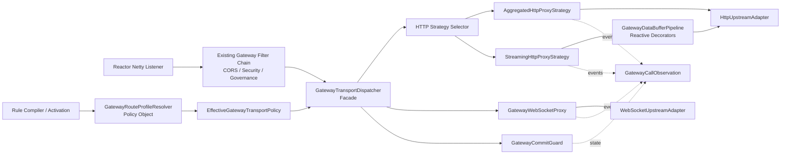

# GWS-03A Gateway OpenAI 兼容流式传输能力 Spec

版本：v2

状态：推荐架构已确认，设计模式增强版待用户复审；尚未修改运行代码

本次修订：在不改变 v1 功能范围、默认值和职责边界的前提下，补充设计模式选择、
协作关系、类职责、拒绝项、依赖方向和测试约束。

父文档：

- `2026-07-24-gateway-component-design.md`
- `2026-07-25-gateway-engine-http-core-design.md`

主模块：

- `egon-cola-platform-gateway-contract`
- `egon-cola-platform-gateway-core`
- `egon-cola-platform-gateway-engine`
- `egon-cola-platform-gateway-admin`
- `egon-cola-platform-gateway-admin-web`

## 1. 结论

本次改造采用“通用流式传输能力 + OpenAI Route Profile”方案：

1. 在现有 HTTP Route、Security、Governance、Provider Discovery 和 Trace 链路内，
   增加通用的 Streaming HTTP、SSE、Multipart、Binary Stream 和 WebSocket
   Proxy 能力；
2. 增加轻量 `OPENAI_HTTP` Route Profile，只提供透明转发、长连接超时、关闭
   Body 日志、关闭响应聚合和关闭默认重试等传输预设；
3. 不增加 `OPENAI` 业务协议，不读取请求 JSON 中的 `model`、`messages`、
   `input`、`tools` 或其他业务字段，不解析并重新序列化 OpenAI 请求；
4. 保留现有 HTTP 与 gRPC/RPC 路径的默认行为；只有显式启用新 Transport Policy
   的 HTTP Route 才进入新能力；
5. 不新建网关模块、不引入 Spring Cloud Gateway、不增加数据库表，也不修改任何
   已有 Flyway Migration。

本 Spec 是 GWS-03 的增量修订。它只扩展 HTTP 数据面的传输能力，不扩大网关的业务
职责。

## 2. 改造前现状审计

### 2.1 HTTP 请求入口与 Body

| 位置 | 当前实现 | 影响 |
|---|---|---|
| `GatewayHttpListener` | `request.receive().map(ByteBufUtil::getBytes)` | 每个 Netty `ByteBuf` 都复制为 `byte[]` |
| `GatewayInboundHttpRequest` | `Flux<byte[]>` | 不能表达 pooled buffer 所有权 |
| `DefaultGatewayHttpDataPlaneHandler.invokeUpstream` | 对所有 HTTP 请求调用 `aggregateRequest` | 普通 JSON、Multipart 和大文件都会完整聚合 |
| `GatewayBodySizeLimiter.aggregateRequest` | `ByteArrayOutputStream` | 完整请求体进入 JVM 堆 |
| `HttpUpstreamRequest` | `Flux<byte[]>` | 即使上层已有流，也只能以复制后的字节数组发送 |

因此当前实现不满足 Multipart、大文件和 OpenAI 透明流式上传要求。已有 GWS-03
曾设计 `AggregatedBody` 与 `StreamingBody` 两种模式，但当前运行代码只实现了前者。

### 2.2 HTTP 响应、SSE 与二进制

| 位置 | 当前实现 | 影响 |
|---|---|---|
| `ReactorNettyHttpUpstreamAdapter` | 上游 `ByteBuf` 经 `ByteBufUtil::getBytes` 转为 `byte[]` | 每块响应都发生堆复制 |
| `GatewayOutboundHttpResponse` | `Flux<byte[]>` | 没有 DataBuffer 生命周期约束 |
| `GatewayHttpListener` | `response.sendByteArray(...)` | 没有 SSE 逐块 Flush 语义 |
| `ReactorNettyHttpUpstreamAdapter` | `HttpClient.compress(true)` | 透明模式下可能改变压缩协商或表示层 |
| `DefaultGatewayHttpDataPlaneHandler` | 固定 4 MiB 响应上限 | 较大的音频或其他二进制响应会被截断为错误 |

当前响应没有默认完整聚合，但没有显式 SSE、Binary Stream、禁止缓存和实时 Flush
能力。二进制当前虽未主动转成字符串或 JSON，仍会复制到 `byte[]`。

### 2.3 Multipart 与 WebSocket

- 代码中没有 Multipart 专用转发能力；因为请求统一聚合，所以 Multipart 文件会完整
  进入 JVM 堆。
- Engine 中没有 WebSocket Upgrade、上游 `ws/wss` 建连或 Frame 双向桥接实现。
- 现有 GWS-03 明确把 WebSocket 排除在第一版范围外。

### 2.4 Header

`ReactorNettyHttpUpstreamAdapter` 已过滤一组固定 Hop-by-Hop Header，但存在两个缺口：

1. 未解析 `Connection` Header 中动态声明的逐跳 Header 名称；
2. `TrustedIdentitySanitizer` 固定删除 `Authorization`，不能满足显式配置的 OpenAI
   凭证透明转发。

`OpenAI-Organization`、`OpenAI-Project`、`Idempotency-Key` 当前没有被固定删除，
但缺少面向透明代理的明确契约。`traceparent` 当前会被网关的 attempt span 重新生成
为同一 Trace 下的子 Span，而不是逐字符照搬。

### 2.5 超时

当前 HTTP 默认值为：

- `maxBodyBytes = 2 MiB`；
- `idleTimeout = 30s`；
- `upstreamTimeout = 5s`；
- `drainTimeout = 10s`。

实际语义存在混用：

1. `upstreamTimeout` 同时用于等待响应、响应 Body 的 `Flux.timeout` 和 attempt 预算；
2. 没有显式 Connect Timeout；
3. 没有独立 Response Header Timeout；
4. 没有覆盖完整响应生命周期的 Total Timeout；
5. 没有 WebSocket Idle Timeout；
6. Traffic `TIMEOUT` Policy 当前只会取比 5 秒更小的值，不能为 AI Route 配置更长
   的超时。

### 2.6 重试与取消

当前实现具备以下基础：

- 无显式 `RETRY` Policy 时默认不重试；
- GET、HEAD、OPTIONS、PUT、DELETE 默认视为幂等；
- POST 只有在 Operation Metadata 明确 `idempotent=true` 时才可能重试；
- 响应 Body 已交接后，取消会进入 `AttemptLifecycle.cancel()`。

仍需修正：

1. 当前遇到 502、503、504 等可重试响应状态时，会先收到并排空完整上游响应，再发起
   下一次 attempt；
2. retry attempt 的完成边界没有被建模为“上游响应头已收到”“下游响应头已提交”
   或“首个流式字节已发送”；
3. 还没有 SSE 和 WebSocket 的不可重试提交点；
4. 客户端在上传、等待响应头、消费流式响应或 WebSocket 会话中的断开，需要统一验证
   能立即取消上游。

### 2.7 日志与观测

当前 `GatewayCallAccessLogger` 和 `GatewayCallObservation` 只记录请求/响应字节数、
状态、耗时、attempt 等元数据，没有记录完整 Body。这是正确的安全基线，应继续保持。

### 2.8 Admin 与规则兼容

- Route Draft 存储在 `route_content JSONB`，新 Route 字段不需要数据库迁移。
- `GatewayRuntimeRoute` 当前没有传输策略字段。
- Admin Web 当前写入 `listener/method/path`，而发布服务读取
  `accessZones/httpMethod/pathPattern`。本次修改同一路由表单时必须采用“双读旧键、
  规范化写入标准键”，避免旧 Draft 丢失，同时不扩大为后台重构。
- Rule JSON 会用内容 SHA-256 校验。新增字段必须对旧 Snapshot 保持“缺失即缺失”，
  不能在反序列化后补默认值再序列化，从而改变旧快照哈希。

### 2.9 gRPC/RPC

gRPC Listener、RPC Route Index 和 HTTP-to-RPC Bridge 是独立路径。HTTP-to-RPC
Bridge 当前必须把 JSON 聚合为 `byte[]` 再转换成 Protobuf，这是该桥接的既有语义。
本次不把 Streaming、SSE、Binary 或 WebSocket Route 指向 RPC Provider，也不新增
gRPC Streaming。

## 3. OpenAI 传输事实与设计含义

官方协议资料确认：

- Responses 流式返回使用 Server-Sent Events：
  [OpenAI Responses streaming](https://platform.openai.com/docs/api-reference/responses-streaming?lang=python)；
- 音频接口同时存在 `multipart/form-data` 上传、音频文件内容返回和 SSE 音频事件：
  [OpenAI Audio API](https://platform.openai.com/docs/api-reference/audio/voice-consent-list?lang=curl)；
- Files API 使用文件上传，且文件规模明显大于当前 2 MiB 聚合上限：
  [OpenAI Files API](https://platform.openai.com/docs/api-reference/files?lang=ruby)；
- Realtime 能通过 WebSocket 承载文本、图像和音频输入输出：
  [OpenAI Realtime API](https://platform.openai.com/docs/api-reference/realtime?lang=javascript)、
  [GPT-Realtime model](https://developers.openai.com/api/docs/models/gpt-realtime)。

由此得到的网关设计约束是：根据 Route、HTTP Method、Path、Upgrade 和响应 Header
决定传输方式即可；网关不需要、也不允许理解 OpenAI Body Schema 或模型业务含义。

## 4. 范围与职责边界

### 4.1 本次包含

1. 普通 HTTP JSON 透明转发；
2. SSE 流式响应；
3. Multipart 和大请求体流式上传；
4. 图片、音频等多模态载荷透明承载；
5. 音频、图片、文件等二进制响应；
6. OpenAI Realtime WebSocket 双向透明代理；
7. Connect、Response Header、Stream Idle、Total 和 WebSocket Idle 五类超时；
8. 流式生命周期、取消传播、Header 过滤和不可重试提交点；
9. Route Transport Policy、OpenAI Profile、Admin Route 字段和旧规则兼容；
10. 相应单元、组件和回归测试。

### 4.2 明确不包含

网关不得实现：

- Token 统计、Token 配额或计费；
- Prompt 模板、Prompt 版本或 Prompt 管理；
- 会话、上下文或消息历史管理；
- RAG、向量检索或知识库；
- Agent 编排；
- Function Calling/Tool Calling 执行；
- 模型目录、模型路由、模型降级或模型业务选择；
- OpenAI 请求 JSON 校验、字段补写、字段删除或重新序列化；
- OpenAI API Key 管理页面；
- 响应内容审核、缓存或内容级重放；
- gRPC Streaming；
- Nginx、Ingress 或其他外层代理的配置管理。

网关可以继续记录通用传输元数据，如 Route、Provider、状态、耗时、连接关闭原因和
请求/响应字节数，但不能把这些数据解释成 Token 或计费数据。

## 5. 方案比较与设计模式

### 5.1 设计原则

设计模式只用于解决本次已经存在的变化点，不为了形式完整而增加层级：

1. 组合优于继承；
2. 只有真正可替换的实现才共享 Strategy Interface；
3. Route Profile 是传输 Policy，不是模型选择 Strategy；
4. HTTP Body 的横切约束通过响应式 Operator 组合，不为每个 Operator 创建类；
5. 复用现有 Filter Chain，不再建设第二套 Security/Governance Chain；
6. WebSocket 与普通 HTTP 的终止契约不同，不强行伪装成同一种 Response；
7. 每个模式必须有可独立验证的输入、输出和失败边界；
8. 模式不能让 Contract/Core 依赖 Reactor Netty，也不能让 Admin 依赖 Engine。

### 5.2 总体方案比较

| 方案 | 优点 | 问题 | 结论 |
|---|---|---|---|
| A. `DataBuffer` + 组合式 Transport Pattern | 与用户要求一致；保留 Reactor Netty；流式、聚合和 WS 生命周期可隔离；不复制业务协议 | 需要严格管理 pooled buffer 所有权 | 采用 |
| B. 全链路直接暴露 Netty `ByteBuf` | 最少复制，Netty API 直接 | Netty 类型会穿透 Handler、Limiter、测试和扩展点，耦合过重 | 不采用 |
| C. 新建 OpenAI Controller/Proxy 模块 | 初期看似独立 | 重复 Route、Security、Governance、Discovery、Trace；容易加入模型业务职责 | 禁止 |

### 5.3 模式组合方案比较

| 模式方案 | 做法 | 优点 | 问题 | 结论 |
|---|---|---|---|---|
| A. Remote Proxy + 责任链 + Strategy + Adapter + Policy + 响应式 Decorator | 保留旧 Filter Chain，在 Invocation 阶段选择传输实现，并用窄 Facade/Observer 协调 | 与当前工程模式一致，变化点清楚，HTTP/WS 可分别测试 | 需要明确模式边界和 DataBuffer 所有权 | 推荐 |
| B. 所有能力都做成 Gateway Filter | SSE、Multipart、Timeout、WebSocket 都加入 Chain | 表面上统一 | WebSocket 是双向长连接，Body Operator 是逐 Buffer 生命周期，均不适合单次前向 Chain；容易重复订阅 | 不采用 |
| C. `AbstractProxyHandler` Template Method | 抽象父类固定 normalize、route、invoke、writeResponse 步骤 | 可以共享部分代码 | HTTP、SSE 和 WS 的返回契约、提交点与取消路径不同，子类会大量 override；形成脆弱父类 | 不采用 |

总体职责采用 Remote Proxy Pattern：客户端仍使用 OpenAI 兼容 HTTP/WebSocket
Contract，Gateway 只代表远端 Provider 承载并转发该 Contract，不成为目标业务能力的
实现者。这一模式直接约束网关不得解释模型、Prompt、Token 或 Tool Call。

当前 `DefaultGatewayHttpDataPlaneHandler` 已超过一千行。继续在同一方法中用
`if/else` 叠加聚合、SSE、Multipart、Binary、WebSocket、五类 Timeout 和提交点，会
形成传输模式与治理规则的组合爆炸。采用上述模式是为了拆开已经不同的生命周期；
简单场景仍保持直接实现，不为每个枚举、状态或配置项创建接口。

### 5.4 Chain of Responsibility：保留现有跨切面管线

现有 `DefaultGatewayFilterChain` 和 `GatewayHttpExecutionPipeline` 已按 Stage 承载：

```text
CORS
  → AUTHENTICATION
  → RATE_CONCURRENCY
  → INVOCATION
```

本次继续使用该责任链处理 Route 已匹配后的通用横切规则：

- CORS 或 WebSocket Handshake Origin 约束；
- Authentication/Authorization；
- Rate Limit、Bulkhead、Circuit Breaker 和 Governance；
- 进入最终 Invocation。

新增约束：

1. Transport Policy Resolution 和 Strategy Dispatch 发生在 `INVOCATION` 阶段；
2. SSE Flush、DataBuffer Size Limit、Stream Idle 等逐 Buffer 行为不得注册为
   Gateway Filter，避免 Chain 被每个 Buffer 重复执行；
3. WebSocket Frame 不重新进入 Authentication/Governance Chain；
4. HTTP 与 WebSocket 必须经过同一个 Route Exposure、Security 和 Governance
   入口，不能由 WebSocket 旁路；
5. 原有 Filter Stage、顺序和短路语义不变。

该模式已经存在，继续复用比创建新的 Admission Chain 更安全。

### 5.5 Strategy：只隔离真实可替换的 HTTP Body 处理

新增窄接口 `GatewayHttpProxyStrategy`，只覆盖具有同一输入/输出契约的 HTTP 代理：

```java
interface GatewayHttpProxyStrategy {

    GatewayRequestBodyMode requestBodyMode();

    Mono<GatewayOutboundHttpResponse> invoke(
            GatewayHttpProxyContext context,
            Flux<DataBuffer> requestBody);
}
```

实现：

| Strategy | 职责 | 明确不负责 |
|---|---|---|
| `AggregatedHttpProxyStrategy` | 在有限上限内聚合；保留旧 HTTP、参数绑定和 HTTP-to-RPC Bridge；提供 replayable body | SSE、Multipart 大文件、WebSocket |
| `StreamingHttpProxyStrategy` | 透明传输 JSON、Multipart、大 Body、SSE 和 Binary；body 永远 non-replayable | 解析 JSON、Multipart Part、模型或 SSE Event |

选择规则：

- `AGGREGATED` 选择 Aggregated；
- `STREAMING` 选择 Streaming；
- `transportProtocol=WEBSOCKET` 不进入 `GatewayHttpProxyStrategy`。

WebSocket 不强行实现该接口。HTTP Strategy 返回
`Mono<GatewayOutboundHttpResponse>`，而 WebSocket 在 101 后拥有一个双向会话并返回
`Mono<Void>`；让两者共享同一接口会违反可替换性，并迫使 HTTP Response 模型承载
不存在的 WebSocket Body。

Strategy 实例在 Engine 初始化时创建并复用，不按请求 new；选择器使用固定 Enum Map
或穷尽 `switch`，不引入 Abstract Factory。

### 5.6 Dedicated WebSocket Proxy：独立终止契约

`GatewayWebSocketProxy` 是 Transport Dispatcher 的专用分支，而不是
`GatewayHttpProxyStrategy` 子类：

1. 输入是已完成 Route/Security/Governance/Provider Selection 的
   `GatewayWebSocketProxyContext`；
2. 输出是代表整个双向会话生命周期的 `Mono<Void>`；
3. 它协调 Client Handshake、Upstream Handshake、两个 Frame Flux、Close 和取消；
4. Frame 内容只交给 WebSocket Adapter，不进入 HTTP Body Strategy；
5. 它不包含 OpenAI Event、音频或模型逻辑。

这种分离保持了 Strategy Pattern 的真实可替换边界，也避免为“模式数量看起来统一”
而制造虚假抽象。

### 5.7 Adapter：隔离 Reactor Netty

保留并调整现有 `HttpUpstreamAdapter`：

- 接收 `HttpUpstreamRequest` 与 `Flux<DataBuffer>`；
- 返回 `Mono<GatewayOutboundHttpResponse>`；
- Reactor Netty 实现负责 HTTP Client、连接、Header、ByteBuf/DataBuffer 边界和取消；
- Strategy 不直接调用 `HttpClient`。

新增 `WebSocketUpstreamAdapter`：

- 根据 Provider `secure` 选择 ws/wss；
- 完成上游 Handshake；
- 暴露 Text/Binary/Ping/Pong/Close Frame 的双向端口；
- Reactor Netty 细节不泄漏到 Contract、Core、Admin 或 Profile Resolver。

Adapter 的价值是把“如何使用 Reactor Netty”与“何时允许流式、重试或关闭”分开。
前者属于 I/O 技术，后者属于网关传输 Policy。

不为 Listener 再创建无意义的多层 Adapter；入站只有一个 Reactor Netty 实现时，直接在
Listener 边界转换为 Engine Model 即可。

### 5.8 Policy Object + Resolver：Profile 不是业务 Strategy

`GatewayRouteProfileResolver` 是纯函数式 Policy Resolver：

```text
Route Transport Override
  + OPENAI_HTTP / DEFAULT Profile
  + Existing Traffic Policy
  + Engine Safety Bounds
  → EffectiveGatewayTransportPolicy
```

`EffectiveGatewayTransportPolicy` 是不可变值对象，包含本次请求需要的最终：

- Transport Protocol；
- Request/Response Mode；
- Body/Frame Limit；
- 五类 Timeout；
- Body Log；
- Retry Veto。

规则：

1. 尽量在 Rule Compile/Activation 时解析，而不是在每个 DataBuffer 上判断；
2. Resolver 不读取 HTTP Body、模型名、Content 或用户身份；
3. Resolver 不创建 Upstream Client 或 Strategy；
4. 同一输入必须得到同一输出，便于表驱动测试；
5. Profile 只给默认值，显式 Route Override 和安全硬边界按第 8 节规则处理。

这里使用 Policy Object 是为了把配置决策从 I/O 实现中移走；不使用 Strategy 表示
Profile，避免把“配置值组合”和“执行算法替换”混为一谈。

### 5.9 Decorator：用 Reactor Operator 组合流式约束

DataBuffer 横切能力采用 Decorator 思路，但实现为小型纯 Operator，不创建深层包装类：

```text
source
  → ownership
  → incrementalSizeLimit
  → byteObservation / boundedBodyLogTap
  → streamIdleTimeout
  → upstream/downstream send
  → cancel/error/discard release
```

建议集中在 `GatewayDataBufferPipeline` 中提供可组合函数：

- `limitBytes`；
- `observeBytes`；
- `sampleBodyWhenEnabled`；
- `enforceIdleTimeout`；
- `releaseOnDiscardOrCancel`。

约束：

1. 每个 Operator 保持单订阅；
2. 不调用 `cache`、`replay` 或无界 `collect`；
3. `doOnDiscard`、cancel 和正常发送只能释放各自拥有的 Buffer，不能重复 release；
4. Operator 顺序固定并有测试，Body Log 不能绕过 Size Limit；
5. Observation 异常不得中断主传输；
6. Multipart、Binary 和 WebSocket 内容日志的禁止规则不能被 Decorator Override。

使用响应式 Decorator 能独立测试每项约束，又不会出现
`LoggingTimeoutSizeLimitedStreamingBody` 一类组合爆炸。

### 5.10 Facade/Dispatcher：让 Listener 只负责协议承载

新增窄 `GatewayTransportDispatcher`，作为 Listener 与传输实现之间的 Facade：

1. 接收已建立的 Gateway Exchange 和 Effective Transport Policy；
2. HTTP 分支委托 `GatewayHttpProxyStrategy`；
3. WebSocket 分支委托 `GatewayWebSocketProxy`；
4. 统一连接取消、Observation 终止和错误提交边界；
5. 不重新实现 Route Match、Security、Governance 或 Provider Selection；
6. 不读取 Body 内容。

Dispatcher 保留两个真实终止契约：

```java
Mono<GatewayOutboundHttpResponse> dispatchHttp(
        GatewayHttpProxyContext context);

Mono<Void> dispatchWebSocket(
        GatewayWebSocketProxyContext context);
```

不返回 `Object`，也不为了统一方法签名引入只包含一种值的通用 Result Wrapper。

Facade 的目的只是避免 `GatewayHttpListener` 同时认识所有 Strategy、Adapter 和
Commit Guard；它不是新的业务 Service，也不拥有可变全局状态。

### 5.11 单调 Commit Guard：不引入完整 State Pattern

重试提交状态使用 `GatewayCommitGuard` 的原子枚举/CAS，不为每个状态创建类：

```text
NEW
  → REQUEST_STREAMING
  → UPSTREAM_HEADERS_RECEIVED
  → DOWNSTREAM_HEADERS_COMMITTED
  → FIRST_BODY_BUFFER_SENT
  → TERMINATED
```

WebSocket 使用：

```text
NEW
  → UPSTREAM_HANDSHAKE_RECEIVED
  → CLIENT_HANDSHAKE_COMMITTED
  → FIRST_FRAME_FORWARDED
  → TERMINATED
```

职责：

- 只允许单向前进；
- 提供 `mayRetry()`、`downstreamCommitted()` 等查询；
- 一旦收到上游响应头，`mayRetry()` 永久为 false；
- 不执行 retry、write response 或 dispose，只给调用方不可逆事实；
- 并发 cancel、header 和 body signal 下保持线性化。

完整 State Pattern 不适合这里：状态本身没有不同算法，只有单调事实和安全断言。
创建 `NewState`、`HeadersState`、`BodyState` 等对象只会增加间接层。

### 5.12 Observer：观测不能控制传输

继续复用 `GatewayCallObservation` 的 Observer 角色：

- Strategy、Adapter、Commit Guard 只发送事件；
- Observation 记录字节数、模式、提交点、取消和 Close Reason；
- Observation 不选择 Provider、不决定 retry、不改变 DataBuffer；
- 观测 Sink 失败必须隔离，不能让 SSE 或 WebSocket 断流；
- 不创建第二个 Body Subscription。

Body Log Tap 是受 Policy 控制的有界 Observer，不是请求处理器。

### 5.13 模式协作图



图中的 Profile Resolver 在规则激活时尽量预计算；请求阶段只读取已解析值。图为职责
关系，不要求每条边都对应一个新的 Java Interface。

### 5.14 建议类职责

| 类型 | 状态 | 单一职责 | 禁止职责 |
|---|---|---|---|
| `GatewayHttpExecutionPipeline` | 复用/小改 | 执行现有 Filter Chain，Invocation 委托 Dispatcher | 解析 OpenAI Body、逐 Buffer 处理 |
| `GatewayTransportDispatcher` | 新增 | HTTP/WS 分派和终止协调 | Route Match、Provider Discovery、模型选择 |
| `GatewayRouteProfileResolver` | 新增 | 编译 Effective Transport Policy | 网络调用、Body 读取 |
| `GatewayHttpProxyStrategy` | 新增 | HTTP 聚合/流式可替换契约 | WebSocket 会话 |
| `AggregatedHttpProxyStrategy` | 新增 | 保留有限聚合和旧桥接 | Multipart 大文件、SSE |
| `StreamingHttpProxyStrategy` | 新增 | DataBuffer 透明 HTTP 流 | JSON/SSE/Multipart 解析 |
| `GatewayWebSocketProxy` | 新增 | Handshake、Frame、Close 双向协调 | HTTP Body、OpenAI Event |
| `HttpUpstreamAdapter` | 修改 | HTTP I/O 技术适配 | Route Policy 决策 |
| `WebSocketUpstreamAdapter` | 新增 | WebSocket I/O 技术适配 | Security/Governance |
| `GatewayDataBufferPipeline` | 新增 | 有界 Operator 组合与 Buffer 释放 | Route/Provider 选择 |
| `GatewayCommitGuard` | 新增 | 单调提交事实和 retry gate 查询 | 发起 retry、写响应 |
| `GatewayHeaderFilter` | 新增 | End-to-End/Hop-by-Hop Header 规则 | 凭证业务管理 |
| `GatewayCallObservation` | 扩展 | 被动观测传输事件 | 控制主流程 |

命名允许在实施计划中按现有包风格微调，但职责边界不得合并回一个巨型 Handler。

### 5.15 明确拒绝的模式

| 模式 | 本次是否采用 | 原因 |
|---|---|---|
| Template Method | 否 | HTTP 与 WebSocket 生命周期差异过大，继承会产生大量 Hook/Override |
| Factory Method / Abstract Factory | 否 | Strategy 数量固定且由 Enum 决定，实例在启动时装配，简单 Map/switch 足够 |
| Builder | 否 | Transport Policy 是可校验 Record/值对象，没有复杂分步构建 |
| Command | 否 | 网关不排队、持久化或重放 AI 请求；Command 容易模糊禁止重试边界 |
| 完整 State Pattern | 否 | 状态只有单调事实，没有独立行为算法 |
| Specification 类树 | 否 | 发布校验规则数量有限，Compiler 内直接组合更清楚 |
| Domain Service | 否 | 本次是协议传输，不是模型、Token、Prompt 等业务域 |
| OpenAI Facade/SDK | 否 | 会引入请求解析、序列化和厂商业务耦合 |

### 5.16 依赖方向

```text
Admin → Contract
Engine → Contract + Core
Engine Transport Strategy → Engine Adapter Port
Reactor Netty Adapter → Engine Transport Model
Contract/Core ↛ Reactor Netty / Spring DataBuffer
Admin ↛ Engine
Profile Resolver ↛ OpenAI SDK
```

`DataBuffer` 只存在于 Engine HTTP 传输层；Contract/Core 继续保持协议和运行规则模型。
任何模式实现都不能反转该依赖方向。

## 6. 目标架构

```text
Reactor Netty Listener
  → Request Head / Upgrade 识别
  → 现有 Normalize + Route Match
  → 现有 Exposure + Security + CORS + Governance
  → 现有 Provider Discovery / Selection
  → Effective Transport Policy
      ├─ Aggregated HTTP Strategy
      ├─ Streaming HTTP Strategy
      └─ Dedicated WebSocket Proxy
  → 统一 Observation / Cancellation / Resource Release
```

约束：

1. Route 匹配只使用 Host、Method、Path、Access Zone 和 Upgrade，不读取 Body；
2. Security、Governance、Provider Discovery、Tracing 和审计入口继续复用；
3. OpenAI Profile 不能创建新的 Provider 发现方式，Provider 地址仍只来自现有 DDC
   Provider Instance；
4. `GatewayProtocol` 仍只有 `HTTP` 与 `RPC`，不增加 `OPENAI`；
5. WebSocket 是 HTTP Route 的 Transport Protocol，不是新的业务协议；
6. `GatewayResponseMode.TRANSPARENT/WRAPPED` 继续表示 Operation 响应封装语义；
   新 Route 内的 `transportPolicy.responseMode` 表示传输 Body 模式，两者不得混用；
7. Streaming、SSE、Binary、WebSocket 和 `OPENAI_HTTP` 只允许
   `GatewayProtocol.HTTP + TRANSPARENT`；发布阶段拒绝与 RPC Provider 或
   `WRAPPED` 组合。

## 7. DataBuffer 与资源所有权

### 7.1 类型调整

Engine HTTP 包内以下模型改为 `Flux<DataBuffer>`：

- `GatewayInboundHttpRequest.body`；
- `HttpUpstreamRequest.body`；
- `GatewayOutboundHttpResponse.body`。

使用 Spring Core `DataBuffer` 作为 Engine 内部传输抽象；在 Reactor Netty 边界使用
`NettyDataBufferFactory` 包装 pooled `ByteBuf`。不切换到 Spring WebFlux
`DispatcherHandler`，不引入 Spring Cloud Gateway。若 Maven 需要显式声明
`spring-core`，它只是对当前已在运行时存在依赖的直接声明，不引入新技术栈。

### 7.2 所有权规则

1. 入站 Netty Buffer 在包装时只产生一次受控 retain；
2. 每个 `DataBuffer` 只能由一个下游拥有；
3. 正常发送、上游错误、下游错误、取消、超限和超时都必须进入唯一 release 路径；
4. 分支观察必须使用只读视图或有界复制，不得让同一 pooled buffer 被两个订阅者消费；
5. 禁止对 Body Flux 调用无界 `cache`、`replay`、`collectList` 或默认 `join`；
6. 只有 `AGGREGATED` 策略和既有 HTTP-to-RPC Bridge 可以在上限内显式聚合；
7. Leak Detection 测试必须覆盖正常完成和所有取消/异常路径。

### 7.3 大小限制

- 有 `Content-Length` 时，在连接上游前校验；
- 无 `Content-Length` 或使用 Chunked 时，对每个 DataBuffer 累加计数；
- 超限立即取消客户端 Body Subscription 和上游请求；
- 下游尚未提交时返回 413；
- 下游已提交时关闭连接并记录 `REQUEST_BODY_LIMIT_AFTER_COMMIT`，不得改写响应；
- 限制的是总传输字节，不是单个 Buffer 大小。

## 8. Route Transport Policy

### 8.1 规则模型

`GatewayRuntimeRoute` 增加可空的 `transportPolicy`。建议的规范化 Route JSON：

```json
{
  "host": "ai.example.com",
  "httpMethod": "POST",
  "pathPattern": "/v1/**",
  "accessZones": ["PUBLIC"],
  "priority": 0,
  "transportPolicy": {
    "profile": "OPENAI_HTTP",
    "transportProtocol": "HTTP",
    "requestBodyMode": "STREAMING",
    "responseMode": "AUTO_STREAM",
    "maxRequestBodyBytes": 536870912,
    "connectTimeoutMs": 10000,
    "responseHeaderTimeoutMs": 120000,
    "streamIdleTimeoutMs": 90000,
    "totalTimeoutMs": 1800000,
    "websocketIdleTimeoutMs": 300000,
    "websocketMaxFrameBytes": 16777216,
    "bodyLogEnabled": false,
    "retryEnabled": false
  }
}
```

枚举：

| 字段 | 值 | 语义 |
|---|---|---|
| `profile` | `DEFAULT`, `OPENAI_HTTP` | 只提供传输默认值 |
| `transportProtocol` | `HTTP`, `WEBSOCKET` | HTTP 请求或 WebSocket Upgrade |
| `requestBodyMode` | `AGGREGATED`, `STREAMING` | 是否完整聚合请求 |
| `responseMode` | `STANDARD`, `AUTO_STREAM`, `SSE`, `BINARY_STREAM` | 响应传输语义 |

`AUTO_STREAM` 不读取请求 Body。它只在收到上游响应头后：

- 对 `text/event-stream` 应用 SSE Flush 和 No-Cache 规则；
- 对其他 Content-Type 进行逐 DataBuffer 透明发送；
- 不把 JSON、文本、图片或音频转换成其他表示。

### 8.2 继承与覆盖

所有 Route 字段使用 Wrapper/可空值表达“继承”，不通过构造器补默认值。有效值解析：

```text
Engine 安全硬边界
  > 显式 Route Override
  > Route Profile 默认值
  > 旧全局默认值
```

与现有 Traffic Policy 的组合：

- 请求体限制取 Engine 绝对上限、Route/Profile 上限和 `REQUEST_SIZE` Policy 中的
  最小值；
- 显式 `totalTimeoutMs` 优先，否则使用现有 `TIMEOUT` Policy，再否则使用
  Profile/全局值；
- `retryEnabled=false` 是否决项；`true` 只表示允许现有 `RETRY` Policy 生效，
  不自动创建最大 attempt 数和 backoff；
- 即使 Route Override 为 `true`，协议安全不变量仍可使本次请求不可重试。

### 8.3 默认值

| 配置 | 旧 Route / `DEFAULT` | `OPENAI_HTTP` |
|---|---:|---:|
| Transport Protocol | `HTTP` | `HTTP`，Realtime Route 改为 `WEBSOCKET` |
| Request Body Mode | `AGGREGATED` | `STREAMING` |
| Response Mode | `STANDARD` | `AUTO_STREAM` |
| 最大请求体 | 2 MiB | 512 MiB |
| Connect Timeout | 30s，显式化 Reactor Netty 旧默认 | 10s |
| Response Header Timeout | 5s | 120s |
| Stream Idle Timeout | 5s | 90s |
| Total Timeout | 关闭，保持旧流式生命周期 | 30min |
| WebSocket Idle Timeout | 不适用 | 5min |
| WebSocket Max Frame | 不适用 | 16 MiB |
| Body Log | `false`，与当前行为一致 | `false` |
| Retry | 继承既有 Traffic Policy | `false` |
| 默认响应字节上限 | 4 MiB | Streaming 模式不设默认字节上限 |

新增 Engine 绝对请求体上限默认 1 GiB，Route 不得超过；它控制总传输量，不造成
1 GiB 堆分配。512 MiB 是 Profile 初始值，不把上游厂商限制写死为网关协议，Route
可在 1 GiB 硬边界内覆盖。

Streaming 响应不设默认字节上限，是因为它受背压、Stream Idle 和 Total Timeout
约束，且不驻留完整 Body。已有 `RESPONSE_SIZE` Policy 仍可按 Route 显式限制。
`STANDARD` Route 的 4 MiB 行为不变。

显式 Route Override 的初始校验范围：

| 字段 | 范围 |
|---|---:|
| `maxRequestBodyBytes` | 1 byte ～ 1 GiB |
| `connectTimeoutMs` | 100ms ～ 60s |
| `responseHeaderTimeoutMs` | 1s ～ 10min |
| `streamIdleTimeoutMs` | 1s ～ 30min |
| `totalTimeoutMs` | 1s ～ 2h |
| `websocketIdleTimeoutMs` | 1s ～ 2h |
| `websocketMaxFrameBytes` | 1 KiB ～ 64 MiB |

旧 `DEFAULT` Route 的 Total Timeout 关闭是兼容特例；新增 Route Override 不用 `0`
表达关闭，避免把“缺失/继承”和“主动关闭”混为一谈。以后若确需无限长连接，应单独
评审配置语义，而不是用负数或特殊值绕过。

### 8.4 配置不变量

发布阶段必须拒绝：

- `WEBSOCKET + GatewayProtocol.RPC`；
- `WEBSOCKET + WRAPPED`；
- `STREAMING/AUTO_STREAM/SSE/BINARY_STREAM + RPC Provider`；
- `SSE/BINARY_STREAM + WRAPPED`；
- WebSocket Route 使用非 GET Method；
- WebSocket Frame 大小、超时或 Body 上限超出 Engine 硬边界；
- `SSE` Route 配置响应聚合或响应缓存；
- Profile/Override 中出现未知枚举或负数超时。

Route Override 可以调整 Profile 默认值，但不能关闭 Buffer 释放、Hop-by-Hop 过滤、
SSE 禁止缓存、提交点后禁止重试等协议安全不变量。

## 9. HTTP 透明转发

### 9.1 普通 JSON

`OPENAI_HTTP` Route 的 JSON 请求也使用 `STREAMING`：

1. 不读取 JSON 字段；
2. 不校验模型名；
3. 不改变属性顺序、数字格式、空白或编码；
4. 不重新生成 Content-Length；
5. 请求和响应按 DataBuffer 原始字节转发；
6. 上游非流式 JSON 响应仍以透明 Body Stream 发送，客户端看到的协议行为不变。

旧 Route 继续使用 `AGGREGATED`，避免改变已有参数绑定、HTTP-to-RPC Bridge、
幂等重放和测试语义。

### 9.2 Multipart 与大文件

1. 不调用 Multipart Decoder、`getMultipartData`、临时文件落盘或完整聚合；
2. 原样保留 `Content-Type` 及 boundary 参数；
3. 文件、普通字段和分隔符全部视为不透明字节；
4. 有 Content-Length 时保留正确长度；无长度时由 Reactor Netty 重新建立合法
   Chunked Framing，不转发客户端的 `Transfer-Encoding`；
5. 通过增量计数执行最大请求体限制；
6. 请求体是一次性流，始终标记为 non-replayable，禁止重试。

### 9.3 SSE

当 Route 为 `SSE`，或 `AUTO_STREAM` 收到
`Content-Type: text/event-stream` 时：

1. 收到上游响应头后立即向下游提交；
2. 删除不再正确的 `Content-Length`；
3. 确保 `Cache-Control: no-cache, no-transform`；
4. 可附加 `X-Accel-Buffering: no`，但不声称能够配置或保证外层 Nginx/Ingress；
5. 不启用网关响应缓存；
6. 不启用自动压缩、解压或重新压缩；
7. 每个上游 DataBuffer 作为独立 Flush Group 立即发送；
8. 不解析 SSE event、`data:`、event type 或 `[DONE]`，也不重新分帧；
9. 不聚合响应，不等待流完成后再返回；
10. 首个响应头或 DataBuffer 后发生错误时只关闭流并记录原因，不改写为 JSON 错误。

### 9.4 二进制与多模态

- JSON 内的 Base64 图像/音频仍是普通不透明 JSON 字节；
- Multipart 内图片、音频和文件保持原始字节；
- `BINARY_STREAM` 以及 `AUTO_STREAM` 下的非文本响应不得转换成 String、JSON 或
  Base64；
- 保留 `Content-Type`、`Content-Disposition`、`Content-Encoding`、ETag 等
  End-to-End Header；
- OpenAI 透明模式禁用 `HttpClient.compress(true)` 的自动表示层转换；若客户端发送
  `Accept-Encoding`，按 Header 透明协商并原样转发上游表示；
- 任何字节计数都只统计长度，不读取媒体内容。

## 10. Header 规则

### 10.1 请求

默认转发所有合法 End-to-End Header，并特别保证：

- `Content-Type`；
- `Accept`；
- `Authorization`；
- `OpenAI-Organization`；
- `OpenAI-Project`；
- `Idempotency-Key`；
- `OpenAI-*` 其他扩展 Header；
- `traceparent` / `tracestate` 的有效 Trace 链路。

`Authorization` 只在显式 `OPENAI_HTTP` Profile 的透明凭证模式下保留。旧 Route
继续使用当前 Sanitizer 行为，避免把网关认证凭证意外泄漏给普通 Provider。无论哪种
模式，都继续删除并重建网关内部身份 Header。

Trace 规则保持现有可观测语义：有效的客户端 `traceparent` 作为父上下文，网关向
上游发送 attempt child span 的 `traceparent`，因此 Trace ID 保留但 Span ID 会改变；
Malformed Header 不能透传。

### 10.2 Hop-by-Hop

请求和响应都必须：

1. 删除标准 Hop-by-Hop Header：
   `Connection`、`Keep-Alive`、`Proxy-Authenticate`、`Proxy-Authorization`、
   `TE`、`Trailer`、`Transfer-Encoding`、`Upgrade` 和非标准
   `Proxy-Connection`；
2. 解析 `Connection` 的逗号分隔 Token，并删除其中动态声明的 Header；
3. 由下游连接重新生成 Host、Connection 和传输分帧 Header；
4. WebSocket Handshake 由 Reactor Netty 重新生成 Upgrade、Connection 和
   `Sec-WebSocket-Key`；客户端提供的 `Sec-WebSocket-Protocol` 候选列表发给上游，
   下游只返回上游最终选中的候选值；
5. 首版关闭两侧 `permessage-deflate`，不透传 `Sec-WebSocket-Extensions`，避免两个
   独立 WebSocket 连接之间发生隐式解压/重压缩；
6. Origin 和其他合法 End-to-End Header 保留；
7. 响应同样执行动态 `Connection` Token 删除。

## 11. WebSocket Proxy

### 11.1 建连

1. Listener 识别 Upgrade，但 Route Match 仍使用现有 Host、GET、Path 和 Access Zone；
2. 在给客户端返回 101 前完成 Security、Governance、Provider Selection 和上游
   WebSocket Handshake；
3. 根据 Provider Instance 的 `secure` 属性选择 `ws` 或 `wss`；
4. 保留原 Path 和 Query，不读取其中的模型业务含义；
5. 上游协商失败且客户端尚未升级时，返回现有 Gateway HTTP 错误模型；
6. 上游 101 已收到或客户端 101 已提交后，绝不切换 Provider 或重试。

### 11.2 Frame

通用 WebSocket 能力必须透明支持：

- Text Frame；
- Binary Frame；
- Ping；
- Pong；
- Close Frame 的 Code 和 Reason；
- Fragmented Frame；
- 单 Frame 最大 Payload；
- 双向背压。

规则：

1. Frame 类型、顺序、FIN 和 payload bytes 保持不变；
2. 禁止把 Binary Frame 转为 Text 或 Base64；
3. Ping/Pong 计入活跃时间，并在两个连接之间转发；避免底层自动 Pong 与手工转发重复；
4. 第一方发送合法 Close Frame 时，将同一 Code/Reason 发送给另一方一次；
5. 无 Close Frame 的 TCP 异常断开记录为 1006 语义，但 1006 是保留值，不能作为
   Close Frame 发送；
6. 超过最大 Frame 大小使用 1009 关闭；
7. WebSocket Idle Timeout 到期使用 1001 关闭，并释放上下游连接；
8. 任一方向结束、错误或取消时，立即终止另一方向，不允许半开连接长期存活；
9. Body 日志不能记录 WebSocket Frame 内容，只记录 Frame 类型、方向、大小和关闭
   原因等元数据。

## 12. 超时语义

| 超时 | 起点 | 终点/重置 | 超时动作 |
|---|---|---|---|
| Connect Timeout | 获得连接池许可并开始连接 Provider | TCP/TLS 建连完成 | 连接拒绝/DNS 错误为 502；连接超时为 504 |
| Response Header Timeout | 上游请求 Body 发送完成；无 Body 时为请求头发送完成 | 收到完整上游响应头；上游提前响应也立即完成 | 504；只可能在安全重试门内重试 |
| Stream Idle Timeout | 请求上传或响应 Body Stream 建立 | 每个方向收到/发送 DataBuffer 后单独重置 | 取消对应流并关闭连接 |
| Total Timeout | HTTP Route 被接收 | 响应 Body 完成 | 未提交时 504；已提交时关闭流 |
| WebSocket Idle Timeout | 双方 101 完成 | 任一方向任何 Frame 后重置 | Close 1001 并释放双方 |

补充规则：

- 排队等待连接池也计入 Total Timeout；
- Connect Timeout 不等于连接池 Idle Timeout；
- 大文件持续上传期间由 Request Stream Idle 和 Total Timeout 约束，不消耗
  Response Header Timeout；
- Response Header Timeout 结束后，SSE/Binary 使用 Stream Idle Timeout；
- Total Timeout 是墙钟上限，不因流量重置；
- WebSocket 握手完成后不应用 HTTP Total Timeout，只应用 WebSocket Idle Timeout；
- 正常背压不能被误判为无上游数据；Timer 观察的是网络活动而不是下游消费速度；
- 超时配置在 Route Compile 时完成边界校验，不在首个请求时才失败。

## 13. 重试安全

### 13.1 默认行为

- `OPENAI_HTTP` 默认 `retryEnabled=false`；
- 所有 AI 生成类 POST 默认只发起一次上游调用；
- Streaming Request、Multipart 和 WebSocket 始终 non-replayable；
- Route `retryEnabled=true` 不代表一定重试，它只允许既有 RETRY Policy 进入安全判断。

### 13.2 唯一允许重试的窗口

同时满足以下条件才允许重试：

1. Route 显式允许且存在启用的 RETRY Policy；
2. Method/Operation 明确幂等；
3. 请求体为空或已在有限上限内聚合，能够完整重放；
4. 还没有收到任何上游响应头；
5. 还没有向下游提交响应头；
6. 还没有发送 SSE/响应 Body DataBuffer；
7. WebSocket 还没有完成 101，也没有发送任何 Frame；
8. Total Timeout 仍有足够 attempt 预算。

因此 Streaming/OpenAI Route 不进行基于上游 HTTP Status 的重试，因为判断 Status 时
已经收到上游响应头。旧 `STANDARD` Route 保留现有基于状态码的重试语义，避免破坏
兼容性。

错误、取消和超时必须带着 Commit State 进入重试判断；禁止仅以 Exception 类型判断。

## 14. 取消传播

以下客户端事件都必须在同一 Reactor 取消链上立即处理：

- 上传中断开；
- 等待响应头时断开；
- SSE 消费中断开；
- 二进制下载中断开；
- WebSocket 任一方向断开或 Close；
- Total/Idle Timeout；
- Engine Drain。

取消动作：

1. 取消入站 Body Subscription；
2. 取消上游 Send/Receive Subscription；
3. Dispose 当前 Provider Connection；
4. 结束 Attempt Lifecycle 和 Provider Selection Handle；
5. 释放尚未转交的 DataBuffer；
6. 结束 Observation，结果标记为 `CANCELLED` 或具体 timeout/close 原因；
7. 不触发 retry。

“立即”在自动化测试中定义为：收到下游 cancel 后一个 EventLoop 调度周期内发出上游
cancel，并在 1 秒测试上限内观察到上游 Channel 关闭；这不是生产 SLA。

## 15. Body 日志

`bodyLogEnabled` 是 Route 级通用网关能力，不是 OpenAI 业务功能：

1. 默认 `false`，`OPENAI_HTTP` 也默认 `false`；
2. `false` 时任何日志/观测扩展都不能订阅、聚合或采样 Body；
3. `true` 时只允许有界采样，采样上限由 Engine 全局安全配置控制，不能由 Route
   无限放大；
4. 采样以旁路有界复制实现，不能改变主 DataBuffer 背压和所有权；
5. Multipart、图片、音频、`application/octet-stream` 和 WebSocket Frame 即使开关为
   `true` 也只记录媒体类型、方向和字节数，不记录内容；
6. `Authorization`、Cookie、OpenAI Key 和内部身份 Header 永不进入日志；
7. 本次不新增 Body 检索、存储或管理页面。

全局采样默认上限为每个方向 8 KiB，硬上限 64 KiB。超过部分只记录
`truncated=true` 和总字节数。

这样开关具有实际的禁止/允许语义，同时不会为了日志默认聚合完整 Body。

## 16. Admin 与发布规则

Route 表单只增加传输相关字段：

- Route Profile；
- Transport Protocol；
- Request Body Mode；
- Response Mode；
- 最大请求体；
- Connect Timeout；
- Response Header Timeout；
- Stream Idle Timeout；
- Total Timeout；
- WebSocket Idle Timeout；
- WebSocket Frame 大小；
- Body 日志开关；
- 重试开关。

UI 规则：

1. 选择 `OPENAI_HTTP` 时展示 Profile 默认值和“继承/覆盖”来源；
2. 现有 Operation Protocol 仍显示 HTTP/RPC；只有 HTTP Operation 展示新的
   Transport Protocol，RPC Operation 显示 gRPC 只读状态；
3. 选择 `WEBSOCKET` 时隐藏无意义的 Request/Response Body Mode；
4. 选择 `SSE` 或 `BINARY_STREAM` 时明确显示“透明响应、禁止聚合”；
5. `retryEnabled=true` 显示“仍受幂等、可重放和提交点限制”的提示；
6. 不增加模型、Token、配额、计费、Prompt、会话、RAG 或 Agent 页面；
7. 不允许配置静态上游 URL，Provider 仍来自注册中心。

Admin 数据兼容：

- 新保存统一写入 `host/httpMethod/pathPattern/accessZones/transportPolicy`；
- 读取旧 Draft 时兼容 `listener/method/path`，编辑后规范化；
- 发布服务同样双读旧键，避免历史 Draft 因 UI 旧格式无法发布；
- 新字段继续存入现有 JSONB；
- 不创建 V5 Migration。

## 17. Rule Wire Compatibility

1. `GatewayRuntimeRoute.transportPolicy` 使用可空字段；
2. 旧构造器保留 overload，并传入 `null`；
3. 旧 Snapshot 反序列化后保持 `null`，序列化时由当前 `NON_NULL` 规则完全省略；
4. Engine 在 Compile 阶段把 `null` 解析为旧默认，而不是修改 Wire Object；
5. 新 Snapshot 才写入 `transportPolicy`；
6. `schemaVersion` 保持 v1，因为这是可选增量字段；
7. 增加与 `GatewayRuleParameterCompatibilityTest` 同等级的旧 JSON SHA-256
   往返测试；
8. 旧 HTTP Route 不自动按 `/v1/**`、Header 或 Content-Type 套用 OpenAI Profile，
   防止无配置行为变化。

## 18. 错误处理

| 场景 | 下游未提交 | 下游已提交 |
|---|---|---|
| 请求体超限 | 413 `GATEWAY_REQUEST_BODY_TOO_LARGE` | 取消上传并关闭连接 |
| Connect 失败 | 502 `GATEWAY_UPSTREAM_CONNECT_FAILED` | 不适用 |
| Connect Timeout | 504 `GATEWAY_UPSTREAM_CONNECT_TIMEOUT` | 不适用 |
| Response Header Timeout | 504 `GATEWAY_UPSTREAM_HEADER_TIMEOUT` | 不适用 |
| Stream Idle Timeout | 504 `GATEWAY_STREAM_IDLE_TIMEOUT` | 关闭流，不追加 JSON |
| Total Timeout | 504 `GATEWAY_TOTAL_TIMEOUT` | 关闭流，不追加 JSON |
| 上游流错误 | 502 通用上游错误 | 关闭流并记录 |
| WebSocket 握手失败 | HTTP 错误，不返回 101 | 不适用 |
| WebSocket Frame 超限 | 不适用 | Close 1009 |
| WebSocket Idle | 不适用 | Close 1001 |

所有错误都记录 Trace ID、Route ID、Provider ID、Commit State 和终止原因，但不记录
OpenAI Body。

## 19. 测试设计

### 19.1 普通 HTTP

- OpenAI Profile 的 JSON 请求与响应逐字节一致；
- JSON 属性顺序、空白、UTF-8 和未知字段不变；
- `Content-Type`、Authorization、OpenAI Organization/Project、Idempotency-Key
  和 Trace 链路正确；
- Hop-by-Hop 固定 Header 和 `Connection` 动态 Token 被删除；
- 旧 `DEFAULT` Route 仍聚合并通过现有 HTTP 测试。

### 19.2 SSE

- 上游延迟发送多个 DataBuffer，客户端在上游完成前收到第一块；
- 每块实时 Flush，不被合并到流结束；
- `Content-Type`、No-Cache、No-Transform 和无 Content-Length 正确；
- SSE 内容字节不变，不解析 event；
- 首块发送后上游失败，不产生第二个 JSON 错误响应；
- 客户端取消后上游连接立即关闭。

### 19.3 Multipart 与大请求体

- 生成式 DataBuffer Publisher 发送大于旧 2 MiB 的 Multipart；
- boundary、字段、文件 checksum 与上游收到内容一致；
- 测试不预先构造同尺寸 `byte[]`；
- 在途 Buffer 数量保持有界；
- Content-Length 预检和 Chunked 中途超限都返回/终止正确；
- 取消和超限后所有 Buffer release；
- 上游调用次数恒为 1。

### 19.4 二进制响应

- 使用包含无效 UTF-8 序列的随机音频/文件字节；
- 客户端 checksum 与上游一致；
- Content-Type、Content-Disposition 和 Content-Encoding 保留；
- 响应不经过 String、JSON 或 Base64 转换；
- 大于旧 4 MiB 的 Streaming 响应可完成。

### 19.5 WebSocket

- `ws` 和带测试证书的 `wss`；
- Text、Binary、Fragmented、Ping、Pong；
- Subprotocol 候选与上游最终选择；
- `permessage-deflate`/`Sec-WebSocket-Extensions` 首版被禁用；
- 双向并发和背压；
- 客户端/上游分别发起 Close，Code/Reason 保持；
- 异常断开不发送保留的 1006；
- Frame 超限 Close 1009；
- Idle Close 1001；
- 客户端断开立即取消上游；
- 完成 101 或发送任一 Frame 后，上游连接失败不重试。

### 19.6 超时

分别构造：

- TCP/TLS Connect Timeout；
- 上游不发响应头；
- 上传中停止发送；
- 响应头后停止发送 Body；
- 持续有数据但超过 Total Timeout；
- WebSocket 无 Frame；
- Ping/Pong 持续存在时 Idle Timer 被重置。

同时验证未提交时返回 Gateway Error、已提交时只关闭传输。

### 19.7 重试

- AI 生成 POST 在 Connect Error、Header Timeout、502、SSE 中断下都只调用一次；
- Streaming Body 即使 Route 开启 retry 也只调用一次；
- 收到上游响应头后绝不重试；
- 发出首个 SSE DataBuffer 后绝不重试；
- WebSocket 101 或首 Frame 后绝不重试；
- 旧 `STANDARD` 幂等 Route 的既有状态码重试测试继续通过；
- 显式幂等、有限聚合且尚未收到响应头的普通 HTTP Route 仍可执行安全重试。

### 19.8 兼容与资源

- 旧 Snapshot JSON SHA-256 可校验、读取并重发；
- 新 Transport Policy Canonical JSON 顺序稳定；
- 旧 HTTP Route 默认值不变；
- gRPC Listener、RPC Route 和 HTTP-to-RPC Bridge 全部回归；
- Admin 旧键双读、新键写入和 Profile 表单测试；
- Netty Leak Detection 覆盖完成、失败、取消、超限、超时；
- Engine Drain 能终止 HTTP Stream 和 WebSocket。

### 19.9 设计模式边界与协作

- HTTP 与 WebSocket 都只执行一次现有 Filter Chain，WebSocket 不得绕过 Security 或
  Governance；
- `GatewayRouteProfileResolver` 使用表驱动测试覆盖 DEFAULT、OPENAI、Override、
  Traffic Policy 和 Safety Bound，并验证同一输入输出稳定；
- HTTP Strategy Selector 对 `GatewayRequestBodyMode` 穷尽映射，未知值在 Rule
  Compile 阶段失败；
- Aggregated 与 Streaming Strategy 使用同一 Contract Test，验证各自只调用 Adapter
  一次、错误和取消均传播；
- WebSocket Proxy 不被注册成 HTTP Strategy，并验证其独立 `Mono<Void>` 生命周期；
- `GatewayDataBufferPipeline` 验证 Operator 顺序、单订阅、Observer 失败隔离、
  `doOnDiscard` 和取消释放；
- `GatewayCommitGuard` 使用并发测试验证状态单调、不可回退，以及收到上游响应头后
  `mayRetry()` 永久为 false；
- Adapter 测试只验证 Reactor Netty I/O、Header 和 Buffer 所有权，不复制 Route
  Policy 测试；
- Observation 测试验证 Sink 抛错不会中断 SSE、Binary 或 WebSocket；
- 模块依赖检查验证 Contract/Core 不依赖 Reactor Netty/DataBuffer，Admin 不依赖
  Engine；不为此新增另一套架构测试框架。

### 19.10 实现后验证命令

实现阶段至少执行：

```bash
./mvnw -pl egon-cola-platforms/egon-cola-platform-gateway/egon-cola-platform-gateway-engine -am test
./mvnw -pl egon-cola-platforms/egon-cola-platform-gateway/egon-cola-platform-gateway-admin -am test
npm test -- --run
npm run typecheck
npm run build
```

后三条命令在
`egon-cola-platforms/egon-cola-platform-gateway/egon-cola-platform-gateway-admin-web`
执行。最终还需运行 Gateway 父 Reactor 测试，确保 contract、core、engine、admin、
starter、provider-runtime 和 test modules 的回归闭合。

这些验证只能证明源码与本机组件测试结果，不能替代真实 OpenAI、真实外网 TLS、
多进程 DDC/Redis/PostgreSQL/Kafka 拓扑或生产外层代理的验证。

## 20. 最小文件改造面

### 20.1 Contract/Core

- 新增 Route Transport Policy、枚举和旧构造器兼容；
- `RuntimeHttpRoute` 携带已解析的 Effective Transport Policy；
- Rule Canonical JSON 兼容测试。

### 20.2 Engine

- HTTP Body 模型迁移为 `Flux<DataBuffer>`；
- Listener 与 Upstream Adapter 取消 `ByteBufUtil::getBytes`；
- Body Limiter 增加 Streaming 计数与释放；
- 复用现有 Filter Chain，引入 Aggregated/Streaming 两个 HTTP Strategy；
- 增加 Dedicated WebSocket Proxy、Transport Dispatcher 和 Profile Resolver；
- 增加 DataBuffer Decorator Pipeline、Commit Guard 与 Adapter 边界；
- 通用 Hop-by-Hop Filter；
- 五类 Timeout；
- Commit State + retry gate；
- SSE Flush、Multipart、Binary 和 cancellation；
- WebSocket 双向桥接；
- 观测字段增加 Transport Mode、Commit State 和 Close Reason。

保留现有 Normalize、Route Match、Security、CORS、Governance、Provider Selection、
Trace、LKG Rule 和 RPC 实现，不做无关重构。

### 20.3 Admin

- 发布映射 `transportPolicy`；
- Route 校验；
- Admin Web Route 表单；
- 旧字段双读与规范化写入；
- 不改数据库结构。

## 21. 实施顺序与独立提交

用户审核通过后按以下顺序实施，每项完成、测试并独立提交一次：

1. Contract、Rule Canonical Compatibility、Profile Resolver 和 Admin Backend 映射；
2. DataBuffer 基础、Adapter Port、HTTP Strategy、Header Filter 和 Dispatcher；
3. SSE、Multipart、Binary、Decorator Pipeline、Timeout、Cancellation 与 Commit Guard；
4. Dedicated WebSocket Proxy 和 WebSocket Adapter；
5. Admin Web Route 表单；
6. Gateway 全量回归与文档收口。

不得在实施中启动项目常驻服务。组件测试自行管理临时端口和测试 Provider。

## 22. 验收标准

1. 旧 HTTP Route 与 gRPC/RPC 测试保持通过；
2. OpenAI Route 不解析或重新序列化请求 Body；
3. Streaming Route 不默认聚合完整请求或响应；
4. Multipart/大文件不会完整进入 JVM 堆；
5. SSE 首块在上游完成前到达客户端，并逐块 Flush；
6. 二进制响应 checksum、类型和 Header 保持；
7. WebSocket 支持 ws/wss、Text、Binary、Ping/Pong、Close、Frame Limit 和 Idle；
8. 客户端取消能立即终止上游；
9. 五类 Timeout 各自独立生效；
10. AI POST 默认不重试，所有提交点后绝不重试；
11. Hop-by-Hop Header 正确删除，必要 End-to-End Header 正确保留；
12. OpenAI Profile 仅是传输配置预设，不包含模型或计费业务；
13. Admin 只新增传输字段；
14. 旧 Snapshot 哈希和旧 Draft 可兼容；
15. 没有数据库 Migration、额外网关模块或新的模型管理能力；
16. 现有责任链只执行一次，HTTP Strategy 可替换边界真实，WebSocket 不伪装成 HTTP
    Response；
17. Adapter、Policy、Decorator、Observer 和 Commit Guard 各自满足第 5 节禁止职责，
    没有形成新的巨型 Handler 或继承层级。

## 23. 本轮审核项

用户已确认 v1 推荐方向：通用 Streaming/SSE/Multipart/Binary/WebSocket 能力 +
`OPENAI_HTTP` Profile，不建立 OpenAI 业务协议。v1 的 Profile 默认值、Header、
Timeout、Retry、Admin、兼容和无 Migration 决策在 v2 中均未改变。

请一次性复审本次新增的设计模式决策：

1. 认可 Remote Proxy 是总体职责模式，Gateway 只承载远端 Contract，不成为模型、
   Prompt、Token 或 Tool Call 的实现者；
2. 认可复用现有 Chain of Responsibility，只在 Invocation 阶段分派传输，不把逐
   DataBuffer 或 WebSocket Frame 处理做成 Gateway Filter；
3. 认可 Strategy 只用于可替换的 Aggregated/Streaming HTTP 路径，WebSocket 使用
   独立 Proxy，不强行实现 HTTP Strategy；
4. 认可 `HttpUpstreamAdapter`/`WebSocketUpstreamAdapter` 隔离 Reactor Netty，
   Strategy 不直接操作 Client；
5. 认可 Route Profile 使用纯 Policy Resolver，不作为模型或业务 Strategy；
6. 认可 DataBuffer 横切能力使用响应式 Decorator Operator，不创建包装类组合爆炸；
7. 认可 `GatewayTransportDispatcher` 是窄 Facade，现有 Filter Chain、Route、
   Security、Governance 和 Provider Selection 仍为唯一入口；
8. 认可提交点使用单调 `GatewayCommitGuard`，不引入完整 State Pattern；
9. 认可 Observer 只能被动记录，不能控制 retry、Provider 或传输；
10. 认可拒绝 Template Method、Factory Method/Abstract Factory、Builder、Command、
    完整 State、Specification 类树、Domain Service 和 OpenAI SDK/Facade；
11. 认可第 5.14 节类职责和第 5.16 节依赖方向；
12. 认可最新 Spec 审核通过前仍不开始实现。
