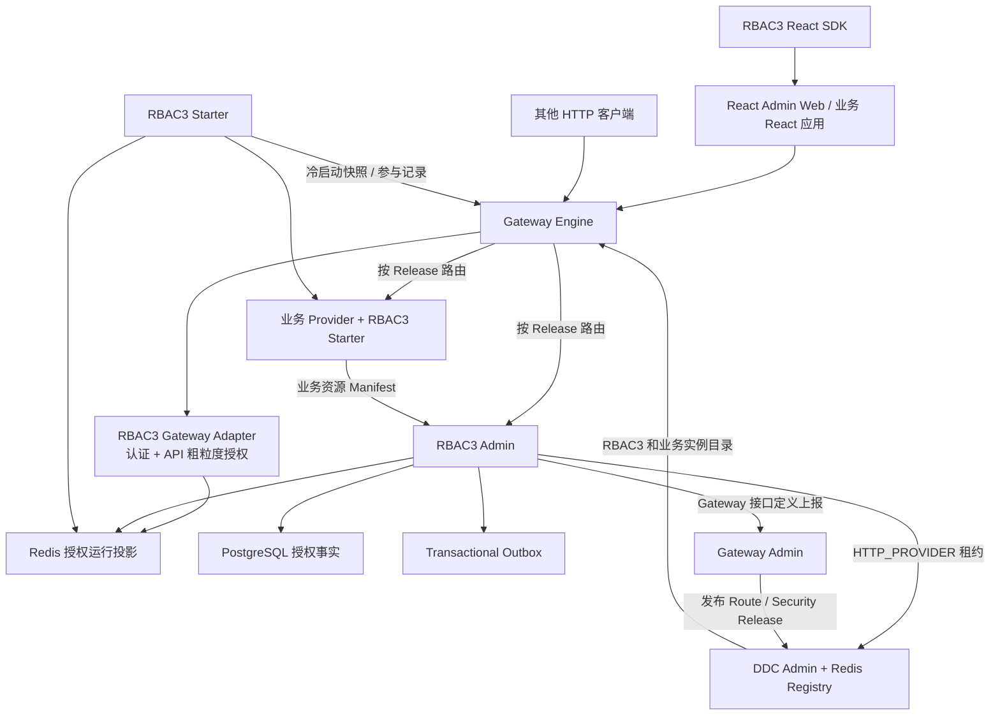
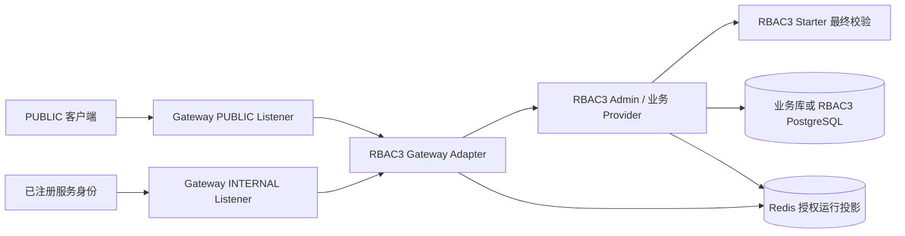
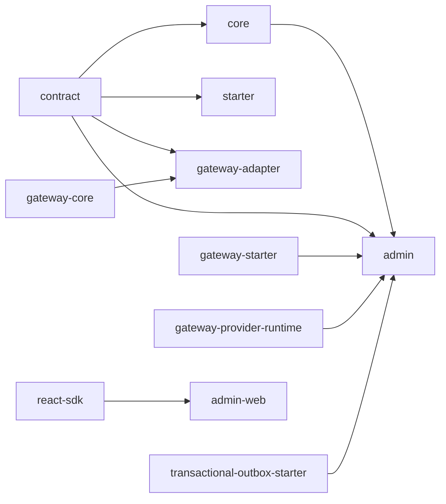
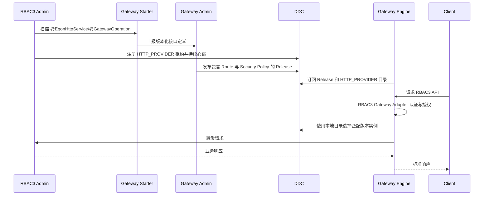
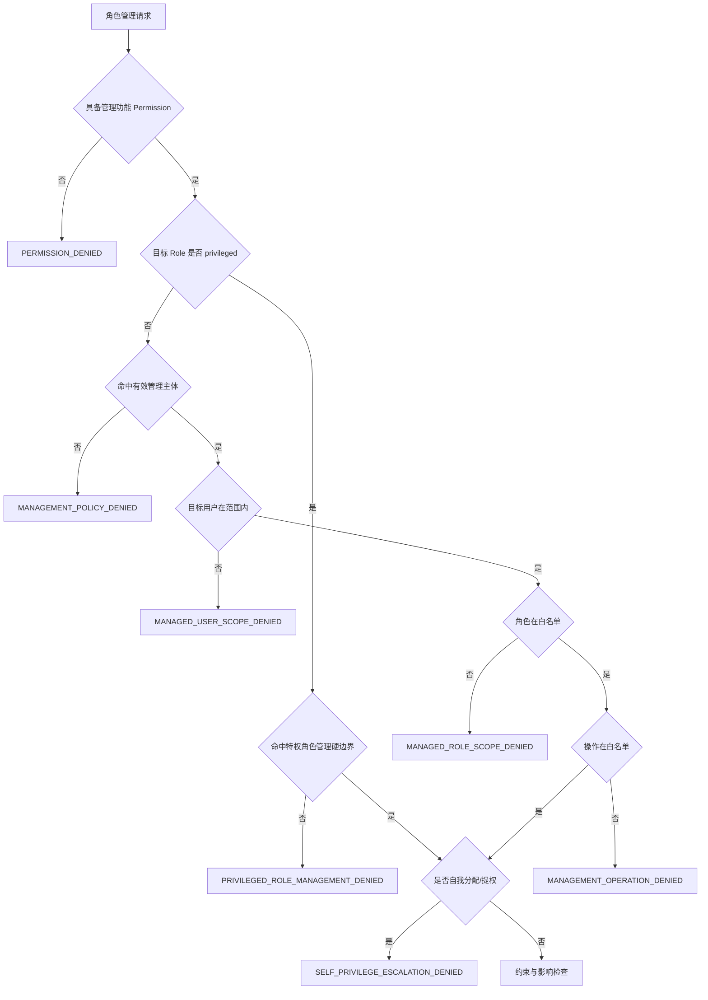
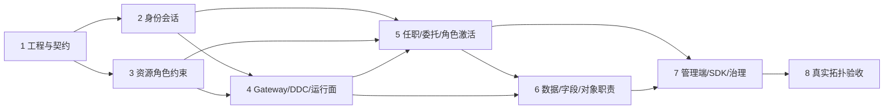

# Egon-COLA RBAC3 企业级权限平台设计 Spec

> 状态：待用户审核，未进入实施
>
> 日期：2026-07-30
>
> 修订：R3 详细评审稿（收紧业务轮岗边界，补全会话级多角色激活、算法与设计模式）
>
> 功能源码审查基线：`6e730cba`（首版 Spec 前的 `main`），仓库版本 `5.3.2`
>
> 首版 Spec 提交：`b8daeb05`
>
> 原始需求稿：`/Users/mario/Downloads/rbac3-permission-system-design-v4.md`
>
> 目标目录：`egon-cola-platforms/egon-cola-platform-rbac3`

## 1. 审核闸门

本文只固化 RBAC3 的产品范围、领域语义、模块边界、运行拓扑、接口契约、数据模型、
一致性要求、错误语义和验收标准，不是实施计划。

在本文获得用户明确确认前：

1. 不创建 `egon-cola-platform-rbac3` 目录或任何子模块；
2. 不修改根 POM、Platforms POM、BOM、版本号或发布配置；
3. 不新增 Java、TypeScript、React、配置、测试、SQL 或 Flyway 文件；
4. 不修改现有 Gateway、DDC、Access Guard 或 Transactional Outbox；
5. 不生成 `docs/superpowers/plans/` 下的实施计划；
6. 不启动 RBAC3、Gateway、DDC、PostgreSQL、Redis 或其他长驻进程。

用户确认本文后，下一步才是按本 Spec 编写实施计划。实施计划仍需列出精确文件、测试、
验证命令和逐任务提交边界。

### 1.1 本轮评审对象

本轮需要审核的是“系统应该具备什么行为以及各模块如何协作”，不是 Java 类、SQL 文件或页面的
最终实现代码。为了避免“名称写了但含义没写”的情况，本文中的每项能力均按以下六层展开：

| 层次 | 本文必须回答的问题 |
|---|---|
| 产品语义 | 谁在什么场景下做什么，什么明确不能做 |
| 领域规则 | 状态如何变化，约束以什么时点和什么数据判断 |
| 持久化 | 哪张表保存事实，关键字段、唯一约束和锁是什么 |
| 运行契约 | Redis、Token、快照、Fence、事件如何配合 |
| 接入契约 | HTTP API、Gateway、DDC、Starter、React 如何接入 |
| 验收证据 | 正常、拒绝、并发、故障和恢复分别怎样证明 |

本文中出现的“必须”“禁止”“仅允许”是后续实施和验收的强制约束；“默认”“推荐”表示允许通过
配置改变，但实现必须提供本文给出的默认值；“首期不实现”表示不能在首期代码、表、API 或页面中
预留半成品流程。

### 1.2 审核建议顺序

1. 先审核第 2～6 节的范围、术语和方案选择；
2. 再审核第 7～10 节的模块边界以及 Gateway/DDC 闭环；
3. 再审核第 11～24 节的领域语义、状态机和一致性；
4. 再审核第 25～29 节的数据、API、页面和安全契约；
5. 最后审核第 30～33 节的测试、阶段、验收和风险。

若本 Spec 获得确认，确认的是本文定义的完整终态和分阶段实现边界；并不意味着允许在一个提交中
一次性落完全部模块，也不意味着可以跳过每阶段的失败测试、代码审查和真实拓扑验收。

## 2. 已确认决策

以下三条是本次确认中最容易产生歧义、也最需要显式锁定的结论：

> **业务轮岗不属于 RBAC3。** 排班、换岗、代岗、来源岗位处理、业务交接和到期恢复由业务系统
> 自己定义；RBAC3 不保存轮岗单、不运行轮岗状态机，也不提供轮岗 API。权限平台只对外提供
> “查询可激活角色”和“原子替换当前会话激活角色集合”的语义 API。
>
> **RBAC3 完全不实现审批。** 普通任职管理和角色激活均没有提交、审批、通过、驳回流程；调用者
> 通过同步权限、管理范围和安全约束后，命令直接生效。角色激活不是给用户新增任职或权限。
>
> **DDC 与 Gateway 对接是交付必选项。** RBAC3 Admin 的接口必须由 Gateway Starter 上报，
> RBAC3 Admin 实例必须以 `HTTP_PROVIDER` 注册到 DDC；Gateway 只能从 DDC 的有效租约中选择
> 实例，并且只有 Gateway Admin 已发布 Release 的接口才允许路由。

| 编号 | 决策 |
|---|---|
| D-01 | RBAC3 是 `egon-cola-platforms` 下的独立完整平台，不是普通工具 Starter |
| D-02 | 建设中心服务、业务 Starter、Gateway Adapter、React 管理端和 React 业务 SDK；不建设独立 Test 模块，测试归属各模块自己的测试源集 |
| D-03 | RBAC3 自带最小租户、用户、组织、部门、岗位和授权快照，并提供外部 IdP/HR 同步 SPI；不建设完整 HR 系统 |
| D-04 | 所有业务数据强制租户隔离；平台管理员与租户管理员是不同安全边界 |
| D-05 | 首期支持本地账号、签名 JWT、Refresh Token 轮换和 Redis 在线会话；不建设完整 OAuth2/OIDC Authorization Server |
| D-06 | 持久化使用 PostgreSQL，运行态缓存与会话使用 Redis；不支持 MySQL 或 SQLite |
| D-07 | 管理聚合优先使用 Spring Data JPA；锁、继承闭包、批量决策和热查询允许使用显式 SQL |
| D-08 | 权限资源通过版本化 Manifest 显式注册，不从 URL、类名或前端组件名隐式创造权限 |
| D-09 | Gateway 执行入口认证与粗粒度 API 权限；RBAC3 Starter 和业务服务执行最终功能、数据、字段与同对象职责校验 |
| D-10 | 数据权限和字段权限通过类型化决策契约交给业务侧执行；首期不自动改写任意 JPA/MyBatis SQL |
| D-11 | 有效任职只决定用户“有资格激活哪些角色”，不能自动把全部任职权限装入 Session |
| D-12 | 一个 Session 支持同时激活一个或多个角色；角色集合只能通过专用激活语义 API 原子替换，不能用前端本地状态或 Token Claim 自行拼接 |
| D-13 | 激活角色先归一到该 APP 内唯一最顶级角色，再展开该根角色及其全部有效子角色，权限、数据范围和字段规则按既定代数合并 |
| D-14 | 同一 APP 中被 DSD/激活互斥集合约束的顶级角色不能同时激活；跨 APP 或同 APP 非互斥角色可以同时激活 |
| D-15 | 业务轮岗完全由业务系统定义；RBAC3 不提供轮岗、排班、交接、来源岗位处理、定时执行或恢复模型 |
| D-16 | RBAC3 不实现审批；不出现待审批、通过、驳回、审批人或审批策略等模型、接口和页面 |
| D-17 | RBAC3 Admin 必须使用 Gateway Starter 上报全部 HTTP 接口 |
| D-18 | RBAC3 Admin 必须使用 Gateway Provider Runtime，以 `HTTP_PROVIDER` 服务类型注册到 DDC |
| D-19 | Gateway Engine 必须从 DDC 获取 RBAC3 可用实例并完成负载均衡与请求路由 |
| D-20 | DDC 注册成功不等于接口已暴露；接口必须经过 Gateway Admin 的目录接收、路由配置和 Release 发布后才能由 Gateway 路由 |
| D-21 | RBAC3 Gateway Adapter 复用 Gateway 现有认证、授权和可信身份扩展契约，所有失败均 Fail Closed |
| D-22 | 角色、权限、任职或会话激活集合变化通过数据库事务、版本、事务 Outbox、Redis 投影和会话控制闭环生效 |
| D-23 | 禁止自我分配和自我提升；激活仅能从本人有效任职派生的候选根角色中选择，不等同于自我授权 |
| D-24 | Spec 描述完整终态，实施按可独立验收的阶段拆分，每个任务单独提交 |
| D-25 | Java 基线为 21，Spring Boot 基线为 3.5.16，Flyway 基线为 11.15.0 |
| D-26 | 管理端沿用现有 Gateway Admin Web 技术方向：React、TypeScript、Vite、React Router、TanStack Query、Ant Design |
| D-27 | 前端不是安全边界；绕过页面直接请求 API 仍必须被 Gateway 和业务侧授权链拒绝 |

### 2.1 决策理由、影响和反向约束

| 决策组 | 为什么这样选 | 对实现的直接影响 | 明确排除的替代做法 |
|---|---|---|---|
| D-01～D-03 平台形态 | 权限事实、运行执行和业务接入是不同职责，且平台需要独立运维 | 建立中心 Admin、轻量 Starter/Adapter 和前端；测试分别留在所属模块 | 把所有逻辑塞进一个 Starter；复制完整 HR；建立聚合 Test 模块 |
| D-04 多租户 | 角色、组织和权限均属于租户安全域 | 所有事实表、缓存 Key、事件、审计和查询必须携带租户 | 用请求 Header 任意切租户；以 `tenant_id=0` 表示公共事实 |
| D-05 认证边界 | 首期需要可独立运行，但不需要建设通用身份协议服务器 | 本地密码、JWT、Refresh Family、在线会话；保留认证 SPI | 自建完整 OAuth2/OIDC Server；无状态 JWT 永不撤销 |
| D-06～D-07 存储 | 仓库平台基线是 PostgreSQL/Redis，复杂约束需要事务和显式锁 | JPA 管理聚合，SQL 处理闭包、领取任务、容量和批量热查询 | MySQL 方言；全部用 JPA 派生查询；用 Redis 作为授权事实库 |
| D-08 资源注册 | 隐式扫描只能发现机械接口，不能安全创造业务权限 | 业务资源用版本化 Manifest；API 与 Gateway Operation 显式映射 | 从 URL、Controller 名或 React 组件名自动生成并授权 |
| D-09～D-10 执行面 | Gateway 适合入口粗检，业务服务才知道对象、数据和字段语义 | Gateway Adapter + Starter 双层 PEP；类型化 Scope/Field/Participation | 每请求远程回调中心 PDP；Starter 自动拼任意 SQL |
| D-11～D-14 激活语义 | 任职是资格，Session 中真正参与授权的是用户明确激活的角色族 | 独立候选/激活 API；唯一根归一、子树展开、APP 分桶、互斥检测、原子替换 | 登录自动合并全部任职；前端只切菜单不切授权；按请求临时拼角色 |
| D-15～D-16 业务边界 | 轮岗的时间、来源岗位和交接是业务事实，权限平台无法替业务定义 | 删除全部轮岗表、状态、Worker、API、页面和 SPI；只保留普通任职与会话激活 | 在 RBAC3 中建立通用轮岗引擎；把轮岗换名后继续保留；预留审批字段 |
| D-17～D-21 Gateway/DDC | 服务注册、接口目录和路由发布是三个不同事实 | 复用现有 Gateway Starter/Provider Runtime/安全 SPI；三态独立验收 | RBAC3 自写注册器；DDC 有实例就自动公开接口；静态地址兜底 |
| D-22 一致性 | 权限或当前激活集合变化后，旧 Token 不能继续使用旧 Snapshot | 数据库版本、Session/User/Tenant Fence、同步投影和 Outbox 形成闭环 | 只改前端状态；只删本机缓存；Redis 失败仍返回成功 |
| D-23 高风险管理 | 无审批时必须用硬边界防止直接提权 | 禁止自我分配；激活只能选已有资格；高风险角色分配需强认证和审计 | 把激活当分配；前端隐藏按钮；普通委托策略包含平台管理员角色 |
| D-24～D-27 交付与 UI | 完整终态需要分阶段证明，前端只能改善体验 | 每阶段独立验收；React 技术栈对齐；后端始终最终拒绝 | 以页面隐藏替代后端授权；以聚合构建成功替代行为证明 |

### 2.2 配置项与业务规则的边界

以下内容允许配置：Token 时长、会话时长、租约周期、密码失败阈值、角色容量值、管理策略有效期、
紧急角色最长时长以内的实际时长、每次最多激活角色数、限流阈值和审计保留期。

以下内容不允许通过配置关闭：租户隔离、禁止自我分配/提权、激活资格边界、APP 互斥、无审批语义、Gateway/DDC 三事实分离、
受保护请求 Fail Closed、Refresh 重放撤销 Token Family、敏感字段默认拒绝、同对象职责历史保留、
数据库事实与 Outbox 同事务、已有 Flyway 迁移不可修改。

## 3. 原始设计稿分析与需求归一

原始设计稿已经正确识别企业权限系统的核心问题：RBAC0 的用户、角色、权限关系不足以
覆盖角色继承、职责分离、任职有效期、委托式管理、会话角色激活、数据范围、字段权限和实时失效。
本平台保留这些业务结论，但修正原稿中尚未落到可实施边界的部分。

### 3.1 保留的核心模型

RBAC3 在本项目中的含义为：

```text
RBAC0 用户—角色—权限
+
RBAC1 角色继承
+
RBAC2 SSD/DSD/前置角色/角色容量约束
+
有有效期和状态的岗位任职
+
委托式角色管理
+
会话级角色激活
+
同一业务对象职责分离
+
数据权限
+
字段权限
```

普通用户授权路径为：

```text
认证主体
→ 当前有效任职形成激活资格
→ 当前 Session 请求的角色集合
→ 归一为每个 APP 内唯一顶级角色
→ APP 内激活互斥复核
→ 展开每个顶级角色的全部有效子角色
→ 角色权限并集
→ APP/MENU/ROUTE/ACTION/API
→ 数据范围
→ 字段规则
→ 当前授权快照
```

管理者执行角色变更的路径为：

```text
管理功能权限
→ 普通角色：同一委托策略内主体 + 目标用户范围 + 角色白名单 + 操作白名单
→ 特权角色：专用安全管理硬边界（不进入普通委托策略）
→ 自我授权拒绝
→ SSD/前置/容量/有效期检查（DSD 留到 Session 激活）
→ 原子变更
→ 授权版本更新
→ 会话与缓存失效
→ 审计
```

### 3.2 对原稿的关键修正

1. 原稿只描述一个中心系统，没有说明分布式业务应用如何注册资源和执行最终权限。本 Spec
   增加 RBAC3 Starter、React SDK 和 Gateway Adapter。
2. 原稿将 MySQL 写入技术头部，但当前 Platforms 基线已经治理 PostgreSQL、Flyway 和 Redis。
   本项目统一选择 PostgreSQL + Redis。
3. 原稿同时包含登录接口和“可外接 HR/组织中心”，却没有确定账号与组织归属。本 Spec 采用
   “最小内置目录 + 外部同步 SPI”，保证平台既能独立运行，也不复制完整 HR。
4. 原稿只使用 `authVersion`，无法精确表达单会话撤销和租户级角色权限变更。本 Spec 明确
   `sessionVersion`、用户 `authVersion` 和租户 `policyVersion` 三个版本。
5. 原稿只要求事务提交后删除缓存，进程在提交后崩溃会丢失失效动作。本 Spec 将审计事件和
   Outbox 与业务变化写入同一事务，并增加授权变更栅栏。
6. 原稿定义数据权限和字段权限，但没有定义业务侧执行接口。本 Spec 明确类型化 Scope、Field
   Policy 和 Participation SPI，禁止把任意 SQL 字符串当作权限规则。
7. 原稿把轮岗、交接和审批定义为权限平台能力。本项目明确将轮岗整体交还业务系统；RBAC3
   不保留轮岗单、调度、交接、恢复或审批的状态、字段、接口、页面和错误码。
8. 原稿没有区分 DDC 注册事实、Gateway 接口目录事实和 Gateway Release 路由事实。本 Spec
   将三者作为独立状态管理，禁止用“已注册 DDC”推导“已对外暴露”。
9. 原稿的角色激活语义不够确定。本 Spec 明确有效任职只产生候选，用户通过 Session 级语义 API
   激活一个或多个顶级角色；同 APP 互斥集合原子拒绝，不能自动把全部任职合并进授权集合。
10. 原稿只描述单系统 React Bootstrap。本 Spec 增加可复用 React SDK 和显式
    `componentKey` 注册表，禁止服务端下发可执行前端代码。

### 3.3 原稿需求追踪矩阵

| 原稿主题 | 本 Spec 落点 | 处理结果 | 评审说明 |
|---|---|---|---|
| 角色分类、激活策略 | 12～14、20、21 | 保留并重构 | 任职只形成资格；Session 可激活多个角色；唯一根归一、子树展开、APP 内互斥 |
| 普通分配与业务轮岗 | 5、20、21 | 收紧边界 | RBAC3 只管理普通任职和激活；排班、换岗、交接、调度、恢复全部由业务系统负责 |
| 委托管理 | 19 | 保留并补强 | 五元组必须由同一条有效策略完整满足，禁止把多条策略碎片拼成一次授权 |
| 轮岗与审批 | 5、19～21、25～29、32 | 删除 | 两类能力均不建表、不建状态、不建接口、不建页面、不建错误码 |
| 登录、角色激活与 Landing Route | 12、13、21、28 | 保留并补强 | 登录建立未激活 Session；激活后按 APP 返回 Route，`componentKey` 必须存在于本地白名单 |
| 实时生效 | 12、22、23 | 重构 | 三类版本 + Fence + 同步投影 + Outbox；不是只删缓存 |
| SSD/DSD/前置/容量 | 14、25、27 | 保留并补强 | 明确校验时点、变化后闭包、时间重叠容量和并发锁 |
| 同对象职责分离 | 18 | 保留并补强 | 使用不因角色切换或任职变化消失的 Participation 事实；写入与业务动作可靠绑定 |
| 资源、数据、字段权限 | 15～17 | 保留并补强 | 显式 Manifest、类型化 Scope、后端字段执行；不使用动态脚本或 SQL 字符串 |
| 数据库 | 25 | 重新基线化 | PostgreSQL + `timestamptz/jsonb` + Flyway；Outbox 复用组件表 |
| API、错误、页面 | 26～28 | 扩展 | 增加 Gateway/DDC、内部服务身份、幂等、版本和统一错误信封 |
| 审计 | 23、29、30 | 保留并补强 | 成功和拒绝都审计；定义脱敏、保留、事件关联和传播故障 |
| Gateway/DDC | 7、10、30、32 | 新增强制项 | 接口上报、Provider 注册、Release 发布、实例发现和路由逐段验收 |

### 3.4 统一术语

| 术语 | 精确定义 | 不等同于 |
|---|---|---|
| User | 租户内可认证或可被授权的人员快照 | HR 完整员工档案 |
| Position | 组织目录中的岗位定义 | Role |
| Role | 权限、范围和约束的集合 | User 当前登录模式 |
| Assignment | User 在一段时间内持有某 Role 的事实 | 永久的用户标签 |
| Permission | 可授权动作，Code 为 `domain:resource:action` | URL 或菜单本身 |
| Resource | APP/MENU/ROUTE/ACTION/API 的注册对象 | Permission |
| Manifest | 某应用某构建声明的完整资源集合 | 增量授权命令 |
| Management Policy | 谁能对哪些用户的哪些角色执行哪些管理操作 | 业务数据权限 |
| Role Activation Candidate | 从用户当前有效任职归一得到、允许该 Session 激活的顶级角色 | 已经生效的权限 |
| Activation Root | 一个 APP 的角色继承图中没有有效父角色的唯一顶级角色 | 任意继承祖先或前端菜单分组 |
| Active Role Set | 当前 Session 原子生效的 Activation Root 集合 | User 的全部有效任职 |
| Role Family | 一个 Activation Root 与其全部有效后代角色形成的集合 | 跨 APP 角色集合 |
| Snapshot | 某 Session 在特定 `sessionVersion/authVersion/policyVersion` 与 Active Role Set 下的授权运行投影 | PostgreSQL 权威事实 |
| Fence | 授权变化期间阻止旧权限继续使用的运行标记 | 分布式数据库事务 |
| Gateway Definition | Controller/Operation 的接口目录事实 | DDC Provider 实例 |
| Gateway Release | 已配置 Route 和安全策略的可运行发布版本 | 接口上报成功 |
| DDC Lease | 某 Provider 实例当前可发现的有时效租约 | API 已对外开放 |

## 4. 建设目标

### 4.1 产品目标

RBAC3 必须提供：

1. 多租户账号、会话和最小组织岗位目录；
2. 用户与角色多对多任职、有效期、状态和来源追踪；
3. 角色继承与最大深度为 10 的闭包；
4. APP、MENU、ROUTE、ACTION、API 五类资源；
5. `domain:resource:action` 权限字符；
6. 角色权限、数据范围和字段等级；
7. SSD、DSD、角色前置条件和容量约束；
8. 跨角色、跨会话、跨角色激活仍有效的同对象职责分离；
9. 委托式管理主体、用户范围、角色范围和操作范围；
10. 普通角色分配、暂停、恢复和撤销；
11. 会话级多角色激活、唯一根归一和角色子树权限聚合；
12. APP 内激活互斥、原子替换和确定性 Landing Route；
13. 登录、Refresh、Logout、激活候选、Bootstrap 和默认 Landing Route；
14. 用户级、会话级和租户策略级授权版本；
15. Gateway 入口认证授权、可信身份透传和业务服务二次校验；
16. DDC HTTP Provider 注册、恢复、心跳和下线；
17. Gateway 接口目录上报、显式发布、DDC 实例发现和路由闭环；
18. 管理端、React 业务 SDK、审计、模拟和影响分析；
19. 可靠授权失效、Outbox 重试和可观测性；
20. 各模块测试源集内可重复的单元/集成测试，以及真实 DDC/Gateway 闭环测试。

### 4.2 成功标准

平台成功不以“表和 CRUD 已存在”为判断依据，而以以下闭环为准：

```text
业务应用声明资源
→ RBAC3 接收版本化 Manifest
→ 管理员为角色授权
→ 管理者为用户创建有效任职
→ 登录生成在线会话与激活候选
→ 用户通过激活 API 选择一个或多个非冲突角色
→ RBAC3 归一顶级角色、展开子树并生成 Session 授权快照
→ Gateway 验证身份和 API 权限
→ 业务 Starter 再次验证权限、数据、字段和对象职责
→ 角色变化后旧会话下一次请求被拒绝
→ React 重新加载 Bootstrap 并进入所激活 APP/角色页面
→ 全链路可按 traceId 查询审计
```

RBAC3 自身还必须满足：

```text
RBAC3 Controller 被 Gateway Starter 发现并上报
→ Gateway Admin 接收接口定义
→ RBAC3 Admin 以 HTTP_PROVIDER 注册 DDC
→ Gateway Admin 发布 RBAC3 Route Release
→ Gateway Engine 从 DDC 发现 RBAC3 实例
→ 客户端通过 Gateway 成功路由到 RBAC3 Admin
```

### 4.3 参与者与核心用例

| 参与者 | 允许的核心行为 | 明确限制 |
|---|---|---|
| 平台安全管理员 | 建租户模板、管理平台资源和高风险角色、查看全局运行状态 | 进入业务租户时必须显式选择目标租户并审计，不能静默绕过 |
| 租户安全管理员 | 管理本租户角色、权限、约束、管理策略和任职 | 不能访问其他租户，不能给自己提权 |
| 委托管理者 | 在一条有效策略完整授权的范围内查看、分配、暂停、恢复或撤销任职 | 不能拼接多条策略绕过角色或用户范围，不能管理高风险角色 |
| 普通用户 | 登录、查询本人激活候选、原子激活一个或多个合规角色、刷新、退出和获取 Bootstrap | 不能激活未任职角色、不能绕过 APP 互斥、不能查看他人任职或自行新增任职 |
| 低风险自助撤销用户 | 在策略显式允许时撤销自己的低风险辅助角色 | 不能撤销岗位来源角色、高风险角色或破坏前置依赖 |
| 业务服务身份 | 上报自己的 Manifest、冷加载快照、提交参与记录 | 只能操作绑定的 `applicationCode`，不能执行人工管理 API |
| Gateway Engine | 校验入口身份/API 权限并按 DDC 目录路由 | 不写授权事实，不计算数据/字段/对象职责 |
| 审计人员 | 只读查询审计、执行记录和模拟结果 | 无角色变更能力；审计查询本身也被审计 |
| 运维人员 | 查看健康、指标、租约、投影和 Outbox 状态，执行受控重试 | 无业务授权修改权；不能手工改 Redis 冒充恢复 |

### 4.4 非功能目标与测量口径

以下是首期设计验收目标，不是未经压测即可宣称的生产保证：

| 属性 | 目标 | 测量边界 |
|---|---|---|
| 默认安全 | 任一必要身份、映射、版本、快照或运行存储缺失即拒绝 | Gateway Adapter 与 Starter 的故障测试 |
| 授权失效 | 变更命令成功返回后，旧 Token 的下一次受保护请求不得使用旧权限 | 从命令响应完成到下一请求；数据库已提交但投影失败时命令不得返回成功 |
| Gateway 热路径 | 已命中内存公钥且 Redis 正常时，单次粗粒度决策 p95 设计预算不高于 10 ms | 不含公网、TLS、业务 Provider 和冷加载；最终以基准测试为准 |
| Starter 热路径 | 本地快照命中且无需业务查询时，功能权限决策 p95 设计预算不高于 5 ms | 不含业务 Data Scope 查询和 Participation 查询 |
| 可恢复性 | Redis 投影可从 PostgreSQL + Outbox 重建；DDC 租约可在依赖恢复后重新注册 | 故障注入和恢复测试，不以人工改数据证明 |
| 可追踪性 | 管理命令、角色激活、事件、投影、Gateway 请求和业务请求可通过 `traceId/requestId` 关联 | 日志、审计、Mutation Journal 和事件头联合查询 |
| 幂等性 | Manifest、目录同步、管理命令、角色激活集合替换和事件消费可安全重试 | 相同集合重复激活不重复递增版本；相同 Key 同内容返回既有管理结果 |
| 时间一致性 | 授权有效期与调度判断使用数据库 UTC 时间，应用节点时钟不参与最终授权 | 命令用 `transaction_timestamp()`，调度领取用 `clock_timestamp()`，并做边界测试 |
| 可用性取舍 | 无法确认权限时拒绝，而不是依赖不可用时放行 | Redis、DDC、Key Ring、快照故障矩阵 |

### 4.5 一条完整业务场景

以“张三登录后在财务 APP 激活出纳角色，同时在报表 APP 激活报表查看角色”为例：

1. 认证成功后，RBAC3 创建尚未激活业务角色的 Session，并从张三当前有效任职计算候选；
2. `CASHIER_L2` 被归一为 finance APP 唯一顶级角色 `CASHIER_ROOT`，`PUBLIC_REPORT` 被归一为
   reporting APP 的 `REPORT_ROOT`；候选响应给出 APP、根角色、资格来源和互斥摘要；
3. 张三调用 `PUT /auth/role-activations` 一次提交两个角色，Gateway 只允许当前 Session 操作本人；
4. Admin 锁 Session，复核两个根角色仍由有效任职支持，确认每个角色只有一个顶级根；
5. 系统按 APP 分桶，检查 finance 的 `CASHIER_ROOT` 未与该请求中的其他根角色违反 DSD/激活互斥；
6. 系统展开 `CASHIER_ROOT` 和 `REPORT_ROOT` 的全部有效子角色，对 Permission 去重，对 Data Scope
   做规范化并集，对 Field Policy 取允许等级上限并受敏感字段硬上限约束；
7. 同一 PostgreSQL 事务原子替换 Session Active Role Set、递增 `sessionVersion`、写审计和 Outbox；
8. Redis 原子发布新的 Session Snapshot 后返回新 Access Token；旧 Token 下一次请求因
   `sessionVersion` 不匹配而失败，Refresh Token Family 不因本次激活而轮换；
9. Bootstrap 按 APP 返回激活根、有效角色族、资源和 Landing Route，React 关闭不再属于旧激活
   集合的页面；
10. 若张三同时请求 finance APP 中互斥的 `CASHIER_ROOT` 与 `PAYMENT_APPROVER_ROOT`，整个替换返回
    `APP_ROLE_ACTIVATION_MUTEX_VIOLATION`，旧 Active Role Set 完整保留；
11. 张三过去对付款对象留下的 Participation 永久保留，切换激活角色也不能使其获得同对象复核权；
12. 若业务上发生轮岗，业务系统自行完成排班和交接，只通过普通任职管理改变张三的资格，RBAC3
    不创建轮岗单或推断业务交接。

## 5. 非目标

首期明确不实现：

1. 任何角色分配审批；
2. 通用 BPMN、工作流或审批中心；
3. 完整 HR、薪资、考勤或人员档案系统；
4. 完整 OAuth2/OIDC Authorization Server；
5. 排班、换岗、代岗、业务交接、来源岗位处理、定时轮岗和到期恢复；
6. 用户直接绑定普通业务权限；
7. 通用 Deny 权限模型；
8. 完整 ABAC 策略语言或动态脚本授权；
9. 任意 SQL、SpEL 或脚本形式的数据权限；
10. 首期自动改写 JPA、MyBatis 或 JDBC 查询；
11. 跨租户角色、权限、组织、资源或角色继承；
12. 独立 PAGE 资源；
13. 服务端向浏览器下发任意可执行 React 代码；
14. 业务负责人创建平台级角色、修改底层 API 资源或修改 SSD/DSD；
15. 仅依赖前端隐藏按钮或仅依赖 Gateway 的单层授权；
16. 用 DDC 保存 RBAC3 业务主数据，或用 Gateway Admin 保存角色与权限事实；
17. MySQL、SQLite、Nacos、Dubbo 或新增注册中心；
18. 自动启动项目或把模块测试宣称为真实多进程拓扑验证。

### 5.1 非目标的边界解释

- “不做完整 HR”不表示没有 User/Org/Department/Position；RBAC3 必须保存授权判断所需的最小快照。
- “不做 OAuth2 Server”不表示没有签名、轮换、会话撤销和 Refresh 重放防护。
- “不做 Deny 权限模型”不表示可以绕过 SSD/DSD、管理范围、数据范围或对象职责；这些是独立约束。
- “不自动改写 SQL”不表示数据权限由前端承担；业务 Repository/Domain Service 必须消费类型化 Scope。
- “不做审批”不表示安全检查减少；管理范围、自我授权、强认证、约束、Fence 和审计仍是同步硬门槛。
- “不做业务轮岗”不表示没有角色资格变化；业务系统可经受控普通任职 API 分配或撤销 Role，但
  RBAC3 不解释这些变化是不是轮岗，也不保存业务交接状态。
- “支持角色激活”不表示用户能自我授权；可激活根角色必须由当前有效任职派生，激活只改变当前
  Session 使用哪部分既有资格。
- “Gateway 做粗粒度授权”不表示 Provider 可以只信 Gateway；业务 Starter 必须完成最终判断。
- “Redis 可重建”不表示 Redis 不重要；运行投影缺失时受保护请求 Fail Closed。
- “分阶段交付”不表示允许长期保留可绕过的半闭环；每阶段必须定义在未完成后续阶段时哪些接口不可启用。

## 6. 方案比较与选型

### 6.1 方案 A：中心控制面 + 本地执行面 + Gateway 入口执行面

RBAC3 Admin 保存授权事实并生成版本化运行快照；Gateway Adapter 在入口执行认证和粗粒度
API 权限；业务 Starter 在服务内部执行最终授权、数据、字段和同对象职责校验。

优点：

- 角色、权限、激活上下文和审计集中治理；
- 热路径不需要每次同步调用中心 PDP；
- Gateway 可以在请求进入业务网络前拒绝明显越权；
- 业务服务仍保留最终安全边界，不信任可伪造的前端或普通代理头；
- 中心短暂不可用时，已加载且版本仍有效的授权快照可以继续工作；
- 能直接复用现有 Gateway 和 DDC 契约。

代价：

- 必须维护版本化 Redis 运行投影；
- Gateway Adapter、Starter 和 Admin 对决策语义必须有契约测试；
- 权限变更传播需要 Outbox、栅栏和恢复机制。

### 6.2 方案 B：所有请求远程调用中心 PDP

Gateway 和业务服务每次请求都同步调用 RBAC3 Admin 决策。

优点是授权事实集中且实现直观。缺点是 RBAC3 Admin 成为所有请求的延迟与可用性瓶颈，
Gateway 调用 RBAC3 自身时还会产生递归路由风险。该方案不满足平台数据面的可用性目标。

### 6.3 方案 C：每个业务应用嵌入完整 RBAC

每个应用维护自己的角色、权限、数据库和会话。

优点是应用自治。缺点是无法统一角色激活、审计、资源、会话撤销和跨应用工作台，不能称为统一
RBAC3 平台。

### 6.4 结论

采用方案 A。

Gateway 是第一层 PEP，业务 Starter 是最终 PEP，RBAC3 Core 是统一决策语义，RBAC3 Admin
是授权事实和控制面。任何一层不得自行发明不同的角色合并、权限字符、版本或错误规则。

### 6.5 逐项取舍矩阵

| 评审维度 | 方案 A | 方案 B | 方案 C |
|---|---|---|---|
| 统一治理 | 强：一个授权事实源 | 强 | 弱：每个应用一套 |
| 热路径延迟 | Redis/本地决策，无中心 HTTP | 每请求增加中心网络调用 | 本地，但各自实现 |
| 中心故障影响 | 登录/写入/冷加载受影响；有效热快照可工作 | 所有授权请求受影响 | 单应用隔离 |
| 实时撤权复杂度 | 中：版本/Fence/Outbox | 较低但仍需会话撤销 | 高：跨应用无法统一 |
| Gateway 自身递归 | 无，Adapter 不回调 Admin | 高风险，需特殊旁路 | 不适用但无统一入口策略 |
| 数据/字段权限 | 业务 Starter 显式执行 | 中心难理解业务对象 | 各应用重复建设 |
| Gateway/DDC 复用 | 完整复用 | 需要额外中心 PDP 路由例外 | 无统一闭环 |
| 审计与角色激活 | 跨应用统一 | 跨应用统一 | 分散且难关联 |
| 交付复杂度 | 较高但边界清晰 | 初始低、运行风险高 | 初始分散、长期最高 |

方案 A 的复杂度集中在运行投影一致性，因此第 22～23 节的 Mutation Journal、Fence、Outbox 和
故障验收是选型成立的必要条件，不是后续可删减的“性能优化”。

## 7. 总体架构



### 7.1 三类事实

平台必须区分三类事实：

| 事实 | 权威来源 | 含义 |
|---|---|---|
| 授权事实 | RBAC3 PostgreSQL | 租户、用户、角色、权限、任职资格、Session 激活集合、约束、管理策略和审计 |
| 服务发现事实 | DDC | 哪些 RBAC3/业务 HTTP Provider 实例当前持有有效租约 |
| Gateway 发布事实 | Gateway Admin + DDC 发布版本 | 哪些 Operation 已被分配 Route、安全策略和运行版本 |

三者不可相互替代：

- RBAC3 数据库有权限，不代表 Gateway 已配置路由；
- DDC 有实例，不代表 Operation 已发布；
- Gateway 有 Route，不代表调用者拥有 RBAC3 权限；
- 前端有菜单，不代表 API 一定允许访问。

### 7.2 控制面、运行面和业务面

| 平面 | 组件 | 写入的事实 | 读取的事实 | 请求特征 |
|---|---|---|---|---|
| 授权控制面 | RBAC3 Admin + PostgreSQL | 身份快照、资源、角色、约束、任职、Session 激活集合、管理策略、审计 | 当前授权事实和激活历史 | 低频写、高一致性、完整审计 |
| 授权运行面 | Redis + Gateway Adapter + Starter | Session、版本、快照、映射、Fence | Token、版本化授权投影 | 高频读、低延迟、缺失拒绝 |
| 服务治理控制面 | Gateway Admin + DDC | 接口目录、Route/Security Release、Provider 租约 | Definition、Release、实例目录 | 发布和租约是独立生命周期 |
| 业务执行面 | 业务 Provider | 业务对象、业务事务、Participation Outbox | 功能/数据/字段/职责决策 | 最终安全边界，了解对象语义 |
| 交互面 | Admin Web + React SDK | 仅保存非安全的 UI 状态 | Bootstrap、菜单、字段展示策略 | 不是授权事实来源 |

任何“管理角色”的写操作必须经过授权控制面；任何“业务对象”的最终写入必须留在业务执行面。
RBAC3 Admin 不替业务服务保存付款单、订单或合同，业务服务也不得直接改 RBAC3 任职表。

### 7.3 信任区和网络入口



- PUBLIC Listener 只允许 `externalAccessible=true` 且已发布到 PUBLIC Route 的 Operation；
- INTERNAL Listener 仍需要服务 Credential、服务身份映射和对应内部 Permission；
- Provider 管理端口、数据库、Redis、DDC 管理接口不能暴露在 PUBLIC Listener；
- 直连 Provider 的网络路径应由部署网络策略关闭；即使网络误配，受保护 Controller 和业务方法仍由
  Starter 拒绝，不把“网络不可达”当作唯一安全边界；
- Gateway 注入的可信身份只在 Gateway 到 Provider 的受信网络段有效，外部同名 Header 必须先删除。

### 7.4 三类请求的完整路径

**登录请求：**

```text
Client -> Gateway 匿名 Login Route -> RBAC3 Admin
-> 用户名/密码与风控校验 -> 创建 Session/Refresh Family
-> 计算激活候选 -> 返回 Access/Refresh 与角色激活入口
```

登录 Route 不要求已有 Bearer Token，但要求 Gateway 限流、请求大小限制和 RBAC3 认证风控。
登录后业务授权集合默认为空；该 Session 只允许调用激活候选、激活、Refresh、Logout 等认证基础
接口，直到激活 API 成功发布 Session Snapshot。

**角色激活请求：**

```text
React/Client -> Gateway REQUIRED Session Policy -> RBAC3 Admin
-> 复核当前 Session 和激活资格 -> 唯一根归一 -> APP 分桶互斥
-> 展开根角色子树 -> 合并权限 -> 原子替换 Active Role Set
-> sessionVersion +1 -> Redis Session Snapshot -> 新 Access Token
```

该流程不创建、撤销或修改 User Assignment，不进入 Management Policy，也不能激活其他用户。

**管理命令：**

```text
Admin Web -> Gateway REQUIRED Policy -> RBAC3 Admin Controller
-> Admin Security/Method Permission -> Management Policy -> Domain Constraint
-> Fence -> PostgreSQL 事务 -> Redis 投影 -> 响应
```

Gateway 的 Allow 不能替代 Admin 中的委托范围和并发复核。

**业务命令：**

```text
Business UI -> Gateway REQUIRED Policy -> 业务 Provider
-> Starter Permission -> Data Scope -> Field Policy -> Participation
-> 业务状态规则 -> 业务事务 + Participation/Outbox
```

业务服务不在每次请求中远程调用 RBAC3 Admin；运行决策使用版本化本地/Redis 投影，Participation
冲突查询可以由业务本地存储或受控内部 API 实现，但不能形成 Gateway 递归调用。

### 7.5 部署单元和水平扩展

| 部署单元 | 是否有状态 | 水平扩展规则 |
|---|---|---|
| RBAC3 Admin | 进程无会话粘性，事实位于 PostgreSQL/Redis | 可多实例；每个实例有唯一 `instanceId`，相同 Service Key |
| Gateway Adapter | 本地仅短期公钥/快照 LKG | 随 Gateway Engine 扩展；所有节点共享版本语义 |
| RBAC3 Starter | 本地只读缓存 | 随业务 Provider 扩展；不得在本地保存唯一授权事实 |
| Assignment/Outbox Worker | 使用数据库竞争领取 | 可多实例；推进任职生效/过期和 Outbox，使用 `SKIP LOCKED` + 条件更新 + 幂等消费 |
| Admin Web/React SDK | 静态前端 | 可由静态资源服务扩展，不持有服务端会话事实 |

RBAC3 Admin 不要求 Session Affinity。Refresh、Logout、Bootstrap 和管理命令命中任意健康实例都
必须得到相同结果。Assignment Worker 和 Outbox Worker 不能依赖“只有一个实例会运行”的部署约定
保证幂等。

## 8. 目标工程结构

```text
egon-cola-platforms/
└── egon-cola-platform-rbac3/
    ├── pom.xml
    ├── README.md
    ├── README.zh-CN.md
    ├── docs/
    │   └── manifest.md
    ├── egon-cola-platform-rbac3-contract/
    ├── egon-cola-platform-rbac3-core/
    ├── egon-cola-platform-rbac3-starter/
    ├── egon-cola-platform-rbac3-gateway-adapter/
    ├── egon-cola-platform-rbac3-admin/
    ├── egon-cola-platform-rbac3-admin-web/
    └── egon-cola-platform-rbac3-react-sdk/
```

Java 包根使用：

```text
top.egon.cola.platform.rbac3
```

配置前缀使用：

```text
egon.cola.platform.rbac3
```

### 8.1 `contract`

稳定、可序列化的消费者契约：

- ID、权限字符、资源类型和错误码；
- Token Claims 和可信身份模型；
- Authorization Snapshot、Decision、Data Scope、Field Policy；
- Resource Manifest 和版本协议；
- Bootstrap DTO；
- 业务参与记录契约；
- 管理端与 Starter 共享的请求响应模型。

该模块不得依赖 Admin、JPA、Redis、Gateway Engine 或前端工程。

### 8.2 `core`

纯领域与决策内核：

- 有效任职计算；
- 角色继承闭包输入校验；
- 激活候选、唯一根归一、角色族展开和 APP 分桶；
- 权限、数据范围和字段等级合并；
- SSD、DSD、前置角色、容量和对象职责规则；
- 委托管理策略决策；
- 授权版本变化判定；
- 决策原因和影响分析。

Core 不依赖 Spring MVC、Gateway、DDC、JPA 实体或 Redis 实现。

### 8.3 `starter`

安装在业务 Spring Boot 应用中，负责：

- Bearer Token 解析和 Spring Security 上下文创建；
- `sid/sessionVersion/authVersion/policyVersion` 运行校验；
- 方法与 API 权限校验；
- Data Scope、Field Policy 和同对象职责 API；
- 高风险写操作授权栅栏；
- 业务资源 Manifest 生成和上报；
- 本地只读快照缓存和 Redis/中心冷加载；
- 401/403/409 错误映射、事件、日志和指标。

Starter 不依赖 Admin、JPA、业务数据库或 Gateway Engine。业务应用是否同时安装 Gateway
Starter 由其自身网关接入需求决定。

### 8.4 `gateway-adapter`

安装在 Gateway Engine 部署中，复用现有：

- `GatewayCredentialExtractor`；
- `GatewayAuthenticationProvider`；
- `GatewayAuthorizationProvider`；
- `GatewayIdentityMapper`；
- `GatewaySecurityPolicy`；
- `TrustedIdentity`。

Adapter 本地验证 JWT、在线会话和粗粒度 API 权限，不通过 Gateway 回调 RBAC3 HTTP API，
从而避免递归路由。所有 Provider 超时、Redis 不可用、版本缺失或策略缺失均 Fail Closed。

### 8.5 `admin`

独立 Spring Boot 中心服务，负责：

- 租户、账号、目录快照和外部身份映射；
- 角色、权限、资源、继承和约束管理；
- 任职、委托管理、Session 角色激活和激活审计；
- 登录、会话、Bootstrap 和授权快照物化；
- PostgreSQL、Redis、Outbox、审计和普通 Assignment 生效/到期调度；
- 业务资源 Manifest 接收；
- Gateway Starter 接口上报；
- Gateway Provider Runtime 的 DDC HTTP Provider 注册。

Admin 是唯一可写授权事实的服务。Gateway、Starter、React SDK 和业务应用均不得直接写
RBAC3 数据表。

Admin 自身的 Security Filter/Method Authorization 直接复用 Contract/Core 的 Token、版本和决策语义，
不通过 HTTP 调用自己，也不依赖消费者 Starter 的自动配置；Starter 只把相同语义包装给业务应用。

### 8.6 `admin-web`

平台和租户安全管理端，只调用 Gateway 暴露的 RBAC3 Admin API，不直连 PostgreSQL、Redis、
DDC 或 Gateway Admin。

### 8.7 `react-sdk`

供业务 React 应用接入：

- 登录态和 Bootstrap Client；
- 激活候选、当前激活集合和原子切换 Client；
- `PermissionGuard`、`ActionGuard`、`FieldGuard`；
- APP/MENU/ROUTE 注册表；
- `componentKey` 到本地组件的白名单映射；
- `AUTH_VERSION_MISMATCH` 和 `SESSION_INVALIDATED` 统一处理；
- 默认 Landing Route 解析；
- 不包含管理端页面。

### 8.8 测试归属（不是独立模块）

RBAC3 不创建 `egon-cola-platform-rbac3-test`，也不发布 test-jar。测试遵循“谁拥有行为，谁在自己
的测试源集验证”的原则：

因此旧稿中“RBAC Test 模块依赖 RBAC Admin”的关系被完全删除：Admin 的 Controller、数据库、
Redis、事务和 Gateway/DDC 接入测试本来就是 Admin 自己的实现验证，应放在 `admin/src/test`；
Starter 和 Gateway Adapter 只验证各自公开契约，不需要通过依赖 Admin 获得夹具。真实拓扑只是用
脚本启动已构建的生产制品并采集证据，也不形成 Maven 依赖。

| 所属模块 | 测试目录 | 负责验证 | 禁止依赖 |
|---|---|---|---|
| `contract` | `src/test/java` | 序列化、Schema、错误码、向后兼容 | Admin、Spring MVC、JPA、Redis |
| `core` | `src/test/java` | 角色图算法、激活根、子树展开、APP 互斥、合并代数、Specification | Admin/JPA/Redis/Gateway |
| `starter` | `src/test/java` | 业务 Provider 测试夹具、方法/Data/Field/Fence 执行 | Admin 生产代码、Admin 测试代码 |
| `gateway-adapter` | `src/test/java` | Gateway SPI、Token/Session/Snapshot 粗检、Fail Closed | Admin Client、Starter 测试代码 |
| `admin` | `src/test/java`、`src/test/resources` | Controller/Facade、PostgreSQL/Redis、事务、锁、Outbox、DDC/Gateway 接入 | 任何独立 RBAC3 Test 模块 |
| `admin-web` | 源码旁 `*.test.tsx` 或项目既有测试目录 | 页面、激活选择器、错误和 E2E | Java Test Artifact |
| `react-sdk` | 源码旁 `*.test.tsx` 或项目既有测试目录 | Provider、Guard、激活状态机和宿主契约 | Admin Web 内部组件 |

真实多进程验收所需的最小业务 Provider 放在 `starter/src/test`，Gateway 夹具放在
`gateway-adapter/src/test`，Admin 双实例使用生产 Admin 制品。编排脚本若需要，放在 RBAC3 聚合目录
的 `scripts/verification/`，只负责启动用户明确要求的测试进程，不形成 Maven 模块、不发布制品，
也不让生产代码依赖测试类。

### 8.9 Java 包职责建议

最终类名在实施计划阶段以测试驱动细化，但包职责必须保持以下方向，避免 Controller、JPA Entity
和决策规则混在一起：

```text
top.egon.cola.platform.rbac3.contract
├── auth              Token、Session、Bootstrap 契约
├── activation        激活候选、Active Role Set 与 APP Context 契约
├── authorization     Permission、Decision、Scope、Field、Snapshot 契约
├── manifest          应用资源 Manifest 契约
├── management        任职和委托管理命令契约
└── error             错误码与错误响应

top.egon.cola.platform.rbac3.core
├── assignment        有效任职和时间窗口规则
├── hierarchy         角色继承和闭包规则
├── activation        唯一根归一、子树展开、APP 互斥和 ActiveRoleSet
├── constraint        SSD/DSD/前置/容量 Specification
├── delegation        Management Policy 决策
└── decision          权限、Scope、Field 合并器

top.egon.cola.platform.rbac3.admin
├── interfaces        HTTP、调度和消息入口
├── application       Facade、Command/Query Handler、事务编排
├── domain            Admin 聚合与领域服务
└── infrastructure    JPA、SQL、Redis、Outbox、Gateway/DDC Adapter
```

`admin.domain` 不引用 `interfaces`；`application` 可以组合领域与端口但不写 SQL；
`infrastructure` 实现端口但不决定业务 Allow/Deny；`interfaces` 不直接注入 Repository。

### 8.10 消费者公开契约

Starter 对业务 Java 应用至少公开以下稳定语义，方法名可在实施计划中微调，但输入输出不可退化为
Map、SQL 字符串或裸 boolean：

```java
AuthorizationDecision requirePermission(PermissionRequest request);
DataScopeDecision decideDataScope(DataScopeRequest request);
FieldPolicyDecision decideFields(FieldPolicyRequest request);
OperationSodDecision checkParticipation(OperationSodRequest request);
AuthorizationFenceDecision verifyFence(AuthorizationFenceRequest request);
```

每个 Decision 统一包含：

```text
decision = ALLOW | DENY | INDETERMINATE
reasonCode
tenantId
subjectId
permissionCode
authVersion
sessionVersion
policyVersion
evidenceIds[]
decidedAt
```

业务便捷注解（例如方法权限注解）只能是上述类型化服务的薄封装；复杂 Scope、字段和对象职责不能
塞入注解字符串表达式。

React SDK 至少公开：

```text
Rbac3Provider
useRbac3Session
useRoleActivationCandidates
useActiveRoles
replaceActiveRoles
usePermission
useDataScopeMetadata
useFieldPolicy
PermissionGuard
ActionGuard
FieldGuard
resolveDefaultRoute
registerRbac3Components
```

`replaceActiveRoles` 只能调用服务端激活 API，并以服务端返回的新 Access Token/Bootstrap 覆盖本地
状态；SDK 不公开“本地直接修改 Active Role Set/Permission Store”或“激活未任职角色”的 escape
hatch。

### 8.11 每个模块的完成定义

| 模块 | 完成证据 | 不能作为完成证据的内容 |
|---|---|---|
| contract | 序列化兼容测试、枚举/错误码稳定性、无实现依赖 | DTO 能编译 |
| core | 规则表驱动单测、时间/并发边界输入、结构化拒绝原因 | 只覆盖 Allow 路径 |
| starter | Spring Boot 切片、方法/Scope/Field/Fence 契约测试 | 只提供注解不验证运行投影 |
| gateway-adapter | Gateway SPI 契约、超时/缺失/Redis 故障 Fail Closed | Mock 一个 boolean 返回值 |
| admin | PostgreSQL/Redis 集成、事务/锁/Outbox/Assignment Worker 测试 | 只有 Controller CRUD |
| admin-web | Typecheck/Lint/组件测试/关键流程 E2E | 页面能打开 |
| react-sdk | 类型声明、Guard、版本失效和宿主集成测试 | 仅导出 UI 组件 |

每个完成证据都在所属模块产生。双 Admin + Gateway/DDC + 测试业务 Provider 的真实闭环是跨模块
验收报告，不对应、也不需要一个 `test` 依赖模块。

## 9. 模块依赖边界



边界约束：

1. `contract` 和 `core` 不依赖 Admin；
2. `starter` 不依赖 Gateway、JPA 或业务持久化框架；
3. `gateway-adapter` 不依赖 Admin；
4. `admin` 可以依赖 Gateway Starter 和 Provider Runtime，但不能复制其上报或租约代码；
5. `admin-web` 和 `react-sdk` 是独立 npm 工程，不通过 Maven Frontend Plugin 隐式修改
   Java 构建；
6. Platforms Parent 只聚合 Maven 模块并在 `dependencyManagement` 治理消费者版本；
7. 不新建独立 RBAC3 BOM；Platforms Parent 只管理 `contract`、`starter` 和
   `gateway-adapter`，不把 Admin、前端或任何 Test Artifact 当作消费者依赖；
8. 各模块测试只能使用 Maven `test` scope/npm devDependency；测试代码不跨模块发布或形成生产依赖。

### 9.1 编译期依赖矩阵

`允许`表示可以直接依赖，`仅测试`表示只允许 test scope/devDependency，空白表示禁止：

| from \ to | contract | core | starter | gateway core | gateway starter | provider runtime | outbox starter | admin |
|---|---:|---:|---:|---:|---:|---:|---:|---:|
| contract |  |  |  |  |  |  |  |  |
| core | 允许 |  |  |  |  |  |  |  |
| starter | 允许 | 允许 |  |  |  |  |  |  |
| gateway-adapter | 允许 | 允许 |  | 允许 |  |  |  |  |
| admin | 允许 | 允许 |  |  | 允许 | 允许 | 允许 |  |

Admin 不依赖 Starter，无论 production 还是 test scope；Admin 自身的 Controller 安全测试使用
Contract/Core 和 Admin 测试夹具。Starter 在自己的 `src/test` 验证业务 Provider 接入。Gateway
Adapter 可依赖 Gateway Core SPI，但不能依赖 Gateway Engine 的具体路由实现。

### 9.2 架构守卫

后续必须使用 Maven 依赖收敛测试和 ArchUnit/等价源码规则验证：

1. `contract` 不出现 `org.springframework`、JPA、Redis、Gateway 包；
2. `core` 不出现 `jakarta.persistence`、Spring MVC、RedisTemplate、Gateway/DDC 客户端；
3. `starter` 不出现 Admin Entity/Repository；
4. `gateway-adapter` 不出现 Admin Client 或访问 RBAC3 HTTP 的 WebClient；
5. Admin Controller 不直接依赖 JPA Repository；
6. 生产源集不依赖 test artifact；
7. npm `react-sdk` 不依赖 `admin-web`，依赖方向只能是 `admin-web -> react-sdk`；
8. Platforms 聚合构建必须实际进入所有子模块，不能只在 aggregator 成功后误报完成。

## 10. Gateway 与 DDC 强制闭环

### 10.1 RBAC3 API 上报 Gateway

RBAC3 Admin 必须依赖现有：

```text
top.egon:egon-cola-platform-gateway-starter
```

Controller 使用现有 `@EgonHttpService`，方法使用现有 `@GatewayOperation`。Spring MVC Mapping
仍是 HTTP Method、Path、Content Type 和参数事实来源，不新增重复描述机械 HTTP 信息的注解。

统一应用身份：

```text
applicationCode = rbac3-admin
applicationName = Egon COLA RBAC3 Admin
serviceName     = rbac3-admin
group           = default
protocol        = http
```

`artifactVersion`、Provider `version` 和 Gateway Definition Identity 必须一致。Gateway Starter
负责定义指纹、幂等上报、失败重试、状态文件和周期校准；RBAC3 不实现第二套上报器。

接口暴露规则：

| 接口 | `externalAccessible` | Gateway 安全模式 |
|---|---:|---|
| Login、Refresh、JWKS/公钥读取、健康探针 | true | 匿名或可选认证，仍受限流和输入校验 |
| Logout、Bootstrap | true | 强制 RBAC3 Bearer 认证 |
| Admin Web 使用的管理 API | true | 强制认证 + 对应管理权限 + 委托范围 |
| Resource Manifest、快照冷加载、参与记录等内部 API | false | 内部入口 + 服务身份 + RBAC3 权限 |
| 调试、重放、Outbox 运维 API | false | 内部入口 + 平台安全管理员 |

`externalAccessible=true` 只表示允许从 PUBLIC Listener 进入，不代表匿名，也不代表拥有业务权限。

#### 10.1.1 Controller 与 Operation 编码规则

每个 Controller 必须显式声明稳定的 `serviceName`、`group`、`version` 和 `basePath`。每个方法
必须显式声明稳定 `name`、业务说明、owner、标签和外部可达性；HTTP Method、Path、Consumes、
Produces 继续只从 Spring MVC Mapping 获取。

`operationId` 最终由 Gateway Starter 既有算法生成，RBAC3 不自行拼接。RBAC3 在自己的
Manifest 中保存 Gateway 上报结果返回的 `operationId/operationKey`，再由管理员将 API Resource
映射到 Permission；禁止在 RBAC3 中用 URL 字符串猜测 Operation。

定义上报结果必须逐项保存和展示：

```text
reportId
definitionSetId
status = ACCEPTED | ACCEPTED_WITH_WARNINGS | REJECTED
operationRefs[].operationKey
operationRefs[].operationId
operationRefs[].changeType
warnings[]
receivedAt
```

`REJECTED` 时 Admin 不进入“接口目录就绪”；`ACCEPTED_WITH_WARNINGS` 可进入就绪，但发布前必须
在运行状态页展示 Warning，不能丢弃。

#### 10.1.2 Definition 生命周期

```text
未扫描
-> SCANNED
-> REPORTING
-> ACCEPTED | ACCEPTED_WITH_WARNINGS | REJECTED
-> RECONCILED（周期校准确认当前定义集合仍一致）
```

该状态是 RBAC3 自身的观测状态，不新增 Gateway 的业务状态。定义内容变化后生成新的 BuildId/
DefinitionSet，不覆盖旧集合。旧 Operation 是否从 Release 移除由 Gateway Admin 管理，不由 RBAC3
在上报时自动下线生产路由。

#### 10.1.3 上报配置基线

以下键来自现有 Gateway Starter，实施不得另造 RBAC3 专用上报协议：

```yaml
egon:
  cola:
    component:
      gateway:
        reporting:
          enabled: true
          admin-base-url: ${GATEWAY_ADMIN_BASE_URL}
          application-code: rbac3-admin
          application-name: Egon COLA RBAC3 Admin
          env: ${DEPLOY_ENV}
          namespace: ${DEPLOY_NAMESPACE:default}
          artifact-version: ${RBAC3_ARTIFACT_VERSION}
          build-id: ${BUILD_ID}
          declared-hosts: []
          fail-fast: true
          access-key: ${GATEWAY_REPORT_ACCESS_KEY}
          secret-key: ${GATEWAY_REPORT_SECRET_KEY}
          connect-timeout: 3s
          read-timeout: 10s
          max-attempts: 5
          reconcile-interval: 5m
          state-file: data/rbac3-gateway-definition-report.state
```

生产环境 `enabled`、`admin-base-url`、身份、版本、BuildId 和签名凭证缺失时必须启动失败；Secret
只由部署 Secret 注入。`state-file` 只保存非敏感幂等状态，不保存 Secret 或接口响应凭证。

### 10.2 RBAC3 Admin 注册 DDC

RBAC3 Admin 必须依赖现有：

```text
top.egon:egon-cola-platform-gateway-provider-runtime
```

Provider Runtime 使用现有配置前缀：

```text
egon.cola.component.gateway.provider.http
```

并使用现有 `DdcServiceRegistryClient` 注册：

```text
DdcServiceKind.HTTP_PROVIDER
```

服务键完整维度为：

```text
env
+ namespace
+ HTTP_PROVIDER
+ serviceName=rbac3-admin
+ group=default
+ version
+ protocol=http|https
```

每个 Admin 实例必须拥有稳定且唯一的 `instanceId`、可路由的 `advertisedHost` 和实际端口。
生产默认：

```text
leaseSeconds = 30
heartbeatIntervalSeconds = 10
failFast = true
```

运行期必须复用 `HttpProviderLeaseRuntime` 的注册、心跳、丢租约恢复和 TTL 下线行为。RBAC3
不得直接写 DDC Redis Key 或复制租约 Lua。

#### 10.2.1 DDC 与 Provider Runtime 配置基线

```yaml
egon:
  cola:
    component:
      ddc:
        enabled: true
        app-code: rbac3-admin
        env: ${DEPLOY_ENV}
        namespace: ${DEPLOY_NAMESPACE:default}
        admin:
          endpoint: ${DDC_ADMIN_ENDPOINT}
          access-key: ${DDC_ACCESS_KEY}
          secret-key: ${DDC_SECRET_KEY}
          signature-enabled: true
        registry:
          enabled: true
          reconcile-interval-seconds: 10
      gateway:
        provider:
          http:
            enabled: true
            env: ${DEPLOY_ENV}
            namespace: ${DEPLOY_NAMESPACE:default}
            instance-id: ${RBAC3_INSTANCE_ID}
            service-name: rbac3-admin
            group: default
            version: ${RBAC3_ARTIFACT_VERSION}
            protocol: http
            advertised-host: ${RBAC3_ADVERTISED_HOST}
            port: ${RBAC3_ADVERTISED_PORT:0}
            lease-seconds: 30
            heartbeat-interval-seconds: 10
            fail-fast: true
            metadata:
              gateway.zone: ${DEPLOY_ZONE:default}
              gateway.weight: ${RBAC3_PROVIDER_WEIGHT:100}
```

约束：

1. `heartbeat-interval-seconds` 必须大于 0 且小于 `lease-seconds`；
2. 端口为 0 时只允许 Provider Runtime 在 HTTP Server Ready 后解析真实端口；注册值最终必须在
   `1..65535`；
3. `protocol=https` 时 DDC Registration 的 `secure` 必须为 true；
4. `version` 必须等于 Gateway Definition 的 `artifactVersion`；
5. `instanceId` 在同一 Service Key 下唯一，重启是否复用由部署实例身份决定，两个并行实例不能相同；
6. `advertisedHost` 必须从 Gateway Engine 所在网络可达，不能无条件写 `localhost`；
7. Metadata 不放 Token、Secret、证书或私钥；遵守 DDC 现有数量、Key 长度和值长度限制；
8. RBAC3 不写 `ddc:*` Redis Key，也不读取租约实现细节。

#### 10.2.2 Provider 租约状态机

直接采用现有 `HttpProviderLeaseRuntime` 状态语义：

```text
NEW -> REGISTERING -> REGISTERED
                    -> FAILED       （初始注册失败且 failFast=true）
                    -> RECOVERING   （failFast=false 或运行期丢租约）
REGISTERED -> RECOVERING -> REGISTERED
任意运行态 -> STOPPED
```

- HTTP Server 未 Ready 前不得用猜测端口注册；
- Heartbeat 返回未续租、租约 NOT_FOUND 或抛错时丢弃旧 Lease 并重新注册；
- 优雅停机调用 deregister；DDC 不可用时由 TTL 最终清理；
- `REGISTERED` 仅证明 Provider 租约有效，不证明 Definition 已接受或 Release 已发布；
- 生产 `failFast=true` 下初始注册失败必须阻止 Ready，运行期进入 RECOVERING 时 Readiness 变为
  OUT_OF_SERVICE，恢复注册后才能恢复 Ready。

### 10.3 Gateway 路由 RBAC3 请求

请求闭环为：



Gateway Engine 只能选择与 Route 的 env、namespace、serviceName、group、version 和 protocol
全部匹配且租约有效的实例。无匹配实例返回 Gateway 的无可用 Provider 错误，不允许退回静态
地址或跨环境实例。

#### 10.3.1 三个独立就绪条件

| 条件 | 判定来源 | 未满足时的行为 |
|---|---|---|
| Definition Ready | Gateway 上报结果为 ACCEPTED/ACCEPTED_WITH_WARNINGS 且 definitionSetId 已记录 | 无法创建/校验正确 Operation Release |
| Provider Ready | DDC 中存在与 Service Key 完全匹配的有效 HTTP_PROVIDER Lease | Gateway 返回无可用 Provider，不静态兜底 |
| Release Ready | Gateway Release 状态到达 SUCCESS，Engine 已观测相同发布版本 | Operation 不可路由；不能因为前两项成功自动开放 |

部署验收页必须并列展示三项，不能合并成一个“已注册”图标。Release 状态至少区分现有 Gateway
语义：`CREATED/VALIDATING/READY/PUBLISHING/SUCCESS/FAILED/TIMEOUT/UNKNOWN/SUPERSEDED`。

#### 10.3.2 Provider 选择规则

Gateway Engine 构造查询键：

```text
env + namespace + HTTP_PROVIDER + serviceName + group + version + protocol
```

只保留租约有效、健康元数据可接受且与 Release 版本匹配的实例，再使用 Gateway 现有负载策略处理
`gateway.weight/zone/tags/warmup`。RBAC3 不另写负载均衡器。没有候选实例时不得：

- 降级到不同 version；
- 从 `https` 降到 `http`；
- 跨 env/namespace/group；
- 读取本地静态 Provider URL；
- 直连上一次已经过期的实例。

#### 10.3.3 两实例示例

```text
Service Key:
prod / finance / HTTP_PROVIDER / rbac3-admin / default / 5.3.2 / http

Instance A: rbac3-admin-a, 10.10.1.11:8080, lease valid, weight=100
Instance B: rbac3-admin-b, 10.10.1.12:8080, lease valid, weight=100
```

Gateway 在两者之间按现有策略路由。A 停止后，在租约仍有效的短窗口内可能被选择；TTL 到期或
健康目录剔除后不得再选择 A。A 恢复必须取得新/有效 Lease 后重新进入候选集，不能复活旧过期
Lease。

### 10.4 Gateway RBAC3 安全适配

`gateway-adapter` 提供固定能力 ID：

```text
credential extractor : rbac3-bearer
authentication       : rbac3-jwt-session
authorization        : rbac3-permission
identity mapper      : rbac3-trusted-identity
```

认证步骤：

1. 提取 Bearer Token；
2. 校验算法白名单、签名、`iss`、`aud`、`exp`、`nbf` 和 `jti`；
3. 校验 `tenantId`、`userId`、`sid`、`authVersion`、`sessionVersion`、`policyVersion`；
4. 在 Redis 运行投影中确认会话为 ACTIVE 且版本完全一致；
5. 创建 Gateway Principal；
6. 删除调用方伪造的可信身份头；
7. 由 Identity Mapper 生成受信任身份。

授权步骤：

1. 从 `GatewayAuthContext.policyId` 解析版本化 RBAC3 安全策略引用；
2. 将 Gateway `operationId` 映射到一个显式 API Permission；
3. 在相同版本的授权快照中检查 Permission；
4. 无映射、映射冲突、快照缺失、版本不一致或 Redis 不可用均拒绝；
5. Gateway 只返回粗粒度 Allow/Deny，不计算业务数据或字段结果。

登录和 Refresh Route 使用不需要已有登录态的 Gateway Policy；其他 Route 默认 Fail Closed。
Gateway Adapter 不通过 Gateway 请求 RBAC3 Admin，避免“Gateway 鉴权 → RBAC3 Route → Gateway
鉴权”的递归链。

#### 10.4.1 Gateway Policy 模板

受保护 Route 的安全策略必须引用现有 Gateway 模型，基线为：

```text
policyId                 = rbac3-required-v1
authenticationMode      = REQUIRED
credentialExtractorIds  = [rbac3-bearer]
authenticationProviderIds = [rbac3-jwt-session]
authorizationProviderIds  = [rbac3-permission]
decisionMode             = ALL_ALLOW
identityMapperId         = rbac3-trusted-identity
providerTimeout          <= 3s，热路径目标远低于该上限
failureMode              = FAIL_CLOSED
```

Login、Refresh、JWKS 和健康 Route 使用独立匿名/可选认证模板，不能把 `rbac3-required-v1` 临时
改为可选认证。内部 Route 还需服务身份 Provider；一个用户 Token 不能因为拥有管理员 Permission
就自动成为服务身份。

#### 10.4.2 Operation 与 Permission 映射

映射键必须包含 `tenantId + gatewayOperationId + definitionSetId/publishedVersion`，值包含：

```text
permissionCode
externalAccessible
securityPolicyId
mappingVersion
active
```

同一已发布 Operation 在同一 Mapping Version 只能映射一个 API Permission。映射缺失或一对多冲突
返回 `INDETERMINATE` 并由 Fail Closed 转为拒绝；不得把“没有配置 Permission”理解为公开接口。

#### 10.4.3 决策结果和超时

Extractor、Authentication Provider、Authorization Provider 均返回 Gateway 既有 Publisher 决策，
不得在 Reactor 线程上执行阻塞 PostgreSQL 查询。Redis 超时、Publisher 空完成、异常、未知 Key、
未知 Policy、未知 Operation 或 Decision 不是明确 ALLOW 时一律拒绝，并记录低基数 reasonCode。

### 10.5 可信身份

Gateway 只允许向 Provider 注入以下经过编码和签名/可信链路保护的身份字段：

```text
tenantId
userId
sessionId
authVersion
sessionVersion
policyVersion
traceId
```

角色和权限集合不通过普通 Header 全量透传。业务 Starter 仍校验原始 Bearer Token 和 Redis
版本，不因存在可信头而跳过最终授权。可信头用于减少重复解析和审计关联，不是独立凭证。

可信身份 Header 采用固定保留前缀，具体 Header 名在实施计划中与 Gateway 现有 Sanitizer 对齐。
无论最终名称为何，处理顺序必须是：

```text
删除客户端全部保留身份 Header
-> 完成认证授权
-> 从 GatewayAuthContext 构造 TrustedIdentity
-> 只在转发前注入
-> Provider 对 Token/版本再校验
```

Header 不包含角色列表、Permission 列表、Data Scope 或 Field Policy，避免超长、泄露和两份授权
事实不一致。`traceId` 可以透传但不能由客户端值覆盖 Gateway 已生成的可信 Trace。

### 10.6 故障和恢复

| 故障 | 行为 |
|---|---|
| DDC 启动不可用且生产 `failFast=true` | RBAC3 Admin 不进入 Ready |
| DDC 运行期短暂不可用 | Provider Runtime 进入 RECOVERING；已有租约最终按 TTL 失效；恢复后重新注册 |
| Gateway Admin 上报失败 | 按 Gateway Starter 既有重试和状态文件处理；新接口版本未被接收前不得宣称可发布 |
| Gateway Release 不存在 | DDC 有实例也不能由 Gateway 路由 |
| Redis 授权投影不可用 | Gateway Adapter 和业务 Starter 对受保护请求 Fail Closed |
| PostgreSQL 不可用 | 写操作失败；已有且版本有效的只读授权快照可继续服务 |
| RBAC3 Admin 不可用 | 登录、Refresh、管理和冷加载失败；已物化且版本有效的 Gateway/Starter 热路径继续工作 |

### 10.7 启动、Readiness 与下线顺序

启动顺序不是硬编码的全局编排，但单实例内部必须满足：

1. 校验 RBAC3 配置、JWT Key、Gateway 上报身份和 DDC 注册身份；
2. 两个 Flyway History 均迁移/校验成功；
3. PostgreSQL Repository、Redis 运行存储和 Outbox 就绪；
4. HTTP Server Ready，确定真实端口；
5. Gateway Definition 上报成功或按明确的非生产策略进入重试；
6. Provider Runtime 注册 DDC 并取得 Lease；
7. 必要签名公钥和内置资源已物化；
8. 才对 Readiness 返回 Ready。

生产环境 Definition 上报和 DDC 初始注册均 `failFast=true`。优雅下线顺序：先把 Readiness 置为
拒绝新流量，再等待在途请求上限，注销 DDC Lease，停止调度/Outbox 领取，最后关闭 HTTP 和数据
连接。注销失败依赖 TTL 清理，但仍记录告警。

### 10.8 不允许的集成捷径

1. 不在 RBAC3 配置里维护 `rbac3.instances[0].url` 供 Gateway 静态读取；
2. 不由 RBAC3 调用 Gateway Admin “自动审批并发布”每次接口变更；Release 是独立治理动作；
3. 不把 RBAC3 Resource Manifest 当作 Gateway Definition Report，二者内容和所有者不同；
4. 不在 Gateway Adapter 内使用 Admin Web Client 做远程权限查询；
5. 不把 DDC 配置发布事件当作授权事件总线；授权事件走 Outbox；
6. 不将 DDC Redis 与 RBAC3 Redis Key 直接耦合，即使部署使用同一 Redis 实例也保持逻辑前缀和
   所有权分离；
7. 不以一个 Mock Registry 测试替代双实例租约、TTL、Release 和真实路由验收。

## 11. 租户、账号与组织目录

### 11.1 租户边界

所有业务身份和授权实体都必须携带非空 `tenant_id`。任何查询、唯一约束、缓存 Key、审计和
事件都包含 tenant。禁止：

- 从普通请求 Header 直接相信 tenant；
- 使用 `tenant_id = 0` 表示无租户；
- 跨租户角色继承；
- 跨租户为用户分配角色；
- 跨租户合并数据范围；
- 平台管理员身份自动绕过租户审计。

平台运维使用独立的平台租户和平台级权限。进入某个业务租户执行管理动作时，必须形成显式的
目标租户上下文并写入审计。

### 11.2 最小内置目录

RBAC3 保存授权所需最小快照：

- Tenant；
- User；
- Local Credential；
- External Identity Mapping；
- Organization；
- Department；
- Position；
- User Position Snapshot；
- 用户状态与目录同步版本。

目录模型只承载授权所需编码、层级、状态和有效期，不管理薪资、合同、考勤等 HR 信息。

### 11.3 外部同步

提供：

```text
IdentityAuthenticator
DirectorySnapshotProvider
DirectoryChangeConsumer
ExternalSubjectMapper
```

外部同步必须幂等，以 `(tenantId, providerCode, externalId)` 唯一。目录删除先转为 INACTIVE，
不得级联删除历史任职、Session 激活审计、参与记录或审计。

### 11.4 ID 约定

Java 内部 ID 使用 `long`，通过项目 Long ID 生成能力生成。部署必须显式配置唯一 machine ID，
禁止从主机名或 IP 隐式推导。JSON 中所有 Long ID 序列化为十进制字符串，避免 JavaScript
安全整数精度丢失。外部系统主体 ID 单独使用字符串字段，不复用内部主键。

### 11.5 Tenant 与 User 状态语义

Tenant 状态：

```text
INITIALIZING -> ACTIVE -> SUSPENDED -> ACTIVE
                         -> CLOSED
INITIALIZING -----------> CLOSED
```

| 状态 | 登录 | 读取历史审计 | 管理写入 | 业务授权 |
|---|---:|---:|---:|---:|
| INITIALIZING | 否 | 平台管理员可读 | 仅初始化命令 | 否 |
| ACTIVE | 是 | 按权限 | 按权限 | 是 |
| SUSPENDED | 否 | 平台/租户审计员可读 | 仅恢复和安全处置 | 否，现有 Session 全撤销 |
| CLOSED | 否 | 按保留策略只读 | 否 | 否，不能恢复为 ACTIVE |

User 状态：

```text
INVITED -> ACTIVE <-> LOCKED
ACTIVE/LOCKED -> DISABLED
DISABLED -> ACTIVE（仅有权管理员显式恢复）
任意非删除态 -> ARCHIVED（终态）
```

| 状态 | 含义 | 会话处理 |
|---|---|---|
| INVITED | 账号已建立但尚未完成首次凭证激活 | 不能签发 Access Token |
| ACTIVE | 可按认证和授权规则使用 | 正常 |
| LOCKED | 因登录风控或管理员锁定暂不可认证 | 撤销所有 Session；解锁不自动登录 |
| DISABLED | 目录或管理员明确停用 | 递增 `authVersion` 并撤销所有 Session |
| ARCHIVED | 历史主体，只保留引用和审计 | 永久不可登录，不物理删除历史 ID |

User 状态变更必须带 `reason`；管理员锁定和认证失败自动锁定使用不同 `reasonCode`。恢复用户不会
恢复已经 REVOKED/EXPIRED 的任职，只会重新计算仍处于合法时间窗的 Assignment。

### 11.6 Tenant 上下文建立规则

1. 登录请求通过明确的 tenant code/受信域名解析 Tenant；用户名本身不全局唯一；
2. 已登录请求的 Tenant 只取已验证 Token `tid`，不接受客户端 `X-Tenant-Id` 覆盖；
3. 平台管理员进入业务租户时使用独立的受审计“目标租户上下文”命令，不改写其原 Token `tid`；
4. 内部服务身份在 Credential 中绑定允许的 Tenant 集合或平台作用域，不能仅靠请求字段声明；
5. Repository 的租户条件由服务端 TenantContext 注入，Controller 请求 DTO 不暴露可自由修改的
   `tenantId`；平台级接口例外但必须使用独立路径和权限；
6. 数据库关联写入同时校验父子实体 `tenant_id`，不能仅依靠应用查询先过滤。

用户名唯一键为 `(tenant_id, normalized_username)`。规范化使用 Unicode NFKC、去首尾空白并按
明确 Locale 无关规则转小写；原始展示名不参与登录唯一性。外部主体唯一键为
`(tenant_id, provider_code, external_subject_id)`。

### 11.7 目录层级与同步协议

Org Unit 统一表示组织或部门节点：

```text
unit_type = ORGANIZATION | DEPARTMENT
parent_id
path
depth
status
external_id
valid_from / valid_to
```

层级不能成环，最大深度首期为 20；移动节点时必须在事务内更新自身及全部后代 Path，并先执行对
任职、管理范围和数据范围的影响分析。Position 必须归属一个 ACTIVE Org Unit，Position Code 在
租户内唯一。

目录快照提交协议：

```text
providerCode
snapshotVersion（调用方单调递增字符串或数字语义）
generatedAt
checksum
organizations[]
departments[]
positions[]
userPositions[]
```

处理规则：

1. 相同 Provider + SnapshotVersion + Checksum 幂等返回既有结果；
2. 相同版本不同 Checksum 返回 `DIRECTORY_SNAPSHOT_CONFLICT`；
3. 低于当前已激活版本返回 `DIRECTORY_SNAPSHOT_STALE`；
4. 先在暂存区验证引用、环、重复 Code、时间和用户映射，再原子激活；
5. 新快照缺失的目录项先转 INACTIVE，不级联删除 Assignment、Scope、Session 激活审计或审计；
6. 目录变化导致用户有效角色或管理范围变化时递增相关用户 `authVersion`；只改变公共规则时递增
   Tenant `policyVersion`；
7. 同步响应必须返回 created/updated/inactivated/unchanged/conflict 计数和影响用户数量。

## 12. 认证、Token 与会话

### 12.1 本地认证

首期支持用户名/密码，密码默认使用 BCrypt strength 12。认证 SPI 可以接入外部 IdP，但外部
认证成功后仍必须映射到一个有效 RBAC3 User 和 Tenant。

本地密码基线：

- 接受 12～64 个 Unicode 字符且 UTF-8 编码不超过 72 字节；超限明确拒绝，不能依赖 BCrypt 静默
  截断；不做容易预测的“必须含大小写符号”组合规则；
- 拒绝 tenant code、username 和已配置常见泄露密码列表中的值；
- BCrypt cost 默认 12，登录发现旧 cost 时在认证成功后安全重哈希；
- 数据库只保存 `password_hash/password_changed_at/credential_version`，不保存可逆密码或密码提示；
- 首次激活、管理员重置和疑似泄露时设置 `must_change_password`；
- 连续 5 次失败默认锁定 15 分钟，阈值/窗口可配置，但错误响应不区分“用户不存在”和“密码错误”；
- Login 同时按 IP、tenant、normalized username 限流，避免只换用户名绕过。

外部 `IdentityAuthenticator` 只能返回经过验证的外部主体和认证强度，不能直接返回角色或 Permission；
RBAC3 使用 External Identity Mapping 找到本地 User，再按本地授权事实构建 Session。

### 12.1.1 登录流程与响应

请求：

```json
{
  "tenantCode": "finance-cn",
  "username": "zhangsan",
  "password": "<never-log>",
  "device": {
    "deviceId": "browser-installation-id",
    "deviceName": "Chrome on macOS"
  }
}
```

流程：

1. 规范化 tenantCode/username，执行匿名 Route 限流；
2. 读取 Tenant/User/Credential，使用常量时间校验路径降低账号枚举差异；
3. 检查 Tenant/User 状态、Credential 状态、锁定窗口和 `must_change_password`；
4. 计算当前有效任职，并将每条任职归一到唯一 Activation Root，形成按 APP 分组的激活候选；
5. 若任一候选找不到唯一顶级根，则记录配置告警并从候选中隔离，不能为了完成登录而扩大权限；
6. 创建 ACTIVE Session、空 Active Role Set、Refresh Family 和首个 Refresh Token Hash；
7. 物化 Redis Session/版本和“未激活”最小 Snapshot；
8. 签发只可访问认证基础接口的 Access Token 和一次可见的 Refresh Token；
9. 写登录审计，响应不回显失败次数、密码状态内部字段或其他 Tenant 信息。

成功响应体的数据部分：

```json
{
  "tokenType": "Bearer",
  "accessToken": "<jwt>",
  "expiresIn": 900,
  "refreshToken": "<opaque-secret>",
  "refreshExpiresIn": 604800,
  "sessionId": "40001",
  "roleActivationRequired": true,
  "activationCandidateCount": 2,
  "activationCandidatesUrl": "/api/rbac3/v1/auth/role-activation-candidates",
  "bootstrapRequired": false
}
```

Login 请求不接收 `roleId/roleIds`。认证与激活必须是两个明确步骤，避免 Login 在没有完整 Session
并发控制时偷偷选择角色。没有候选的用户仍可认证并进入“无可激活角色”页；业务 API 全部拒绝。
客户端通过第 21 节的激活 API 成功后，服务端返回新 Access Token，并把
`bootstrapRequired` 置为 true。

空 Active Role Set 的最小 Snapshot 只包含平台内置的 Session Bootstrap Capability：

```text
system:role-activation:read
system:role-activation:use
system:session:logout
```

这些 Capability 由 ACTIVE Session 状态产生，不来自 Assignment/Role，也不能被租户修改、继承或
映射到业务 API；只保护本人 Candidate/Current/PUT 和 Logout。Gateway Operation Mapping 必须把它们
限定到上述端点，禁止用通配符扩大。Refresh 使用 Refresh Credential 独立认证，JWKS/Login 仍是
匿名受限端点。

浏览器管理端推荐将 Refresh Token 放在 `Secure + HttpOnly + SameSite` Cookie 中；非浏览器客户端
可通过响应体接收，但必须由其安全存储。Access Token 通过 Authorization Header 使用，不写
LocalStorage。具体 Cookie Domain/Path 由部署配置决定，不能扩大到无关域。

### 12.2 Token

Access Token 为签名 JWT，至少包含：

```text
iss   issuer
aud   audience
sub   userId
tid   tenantId
sid   sessionId
av    authVersion
sv    sessionVersion
pv    policyVersion
jti   tokenId
iat   issuedAt
nbf   notBefore
exp   expiresAt
```

JWT 不嵌入完整角色、权限、数据或字段集合，避免角色变化后仍携带陈旧授权并控制 Token 大小。

默认时间：

| 项目 | 默认值 | 可配置范围 |
|---|---:|---:|
| Access Token | 15 分钟 | 5～30 分钟 |
| Refresh Token | 7 天 | 1～30 天 |
| 会话空闲时间 | 30 分钟 | 5 分钟～8 小时 |
| 会话绝对时长 | 12 小时 | 1～24 小时 |

Refresh Token 每次使用都轮换；数据库和 Redis 只保存 Token Hash。重放旧 Refresh Token 时撤销
整个 Token Family，并写入安全审计。

JWT 校验固定规则：

| Claim | 规则 |
|---|---|
| `alg`/`kid` | 算法在白名单且 `kid` 存在于有效 Key Ring；不接受从 Token 动态指定公钥 URL |
| `iss` | 完全匹配配置值，不做前缀匹配 |
| `aud` | 必须包含目标 Gateway/业务应用配置的 Audience |
| `sub/tid/sid/jti` | 非空、格式合法；Long ID Claims 使用十进制字符串 |
| `iat/nbf/exp` | `exp > nbf >= iat`，最大 Access 生命周期不超过配置；允许时钟偏差默认 120 秒 |
| `av/sv/pv` | 非负整数且与 Redis 当前值完全一致，不接受大于当前值的“未来 Token” |

Token 不接受客户端指定有效期、issuer、audience、role 或 permission。`jti` 用于审计关联和必要的
短期撤销，不用无限期保存所有已过期 Token。

### 12.2.1 Session 与 Refresh 状态机

Session 状态：

```text
ACTIVE -> LOGGED_OUT
ACTIVE -> REVOKED
ACTIVE -> EXPIRED
ACTIVE -> COMPROMISED
```

所有非 ACTIVE 状态都是终态。状态含义：

- LOGGED_OUT：用户主动退出当前 Session；
- REVOKED：管理员、用户状态、`authVersion` 变化或单设备撤销；
- EXPIRED：空闲或绝对时长到期；
- COMPROMISED：Refresh Token 重放或其他凭证风险。

Refresh Token 状态：

```text
ACTIVE -> ROTATED -> REUSED_DETECTED
ACTIVE -> REVOKED
ACTIVE -> EXPIRED
```

刷新必须在一个事务/原子流程中：锁定 Token Hash，确认 ACTIVE 且 Session ACTIVE，标记旧 Token
ROTATED，生成新 Hash，递增 `sessionVersion`，更新 lastSeen，签发新 Access/Refresh。两个并发请求
使用同一个 Refresh Token 时只能有一个成功；另一个被识别为重放，整个 Family 和 Session 转为
COMPROMISED。不能为了容忍移动端重试而让旧 Refresh Token 多次可用。

Refresh 不要求仍有效的旧 Access Token；它独立验证 opaque Refresh Token、Session ACTIVE、当前
User authVersion 和 Tenant 状态。若只发生 policyVersion 增长，Refresh 使用最新 Tenant
policyVersion 签发新 Access Token；旧 `pv` 只允许通过 Refresh Route 更新，不能继续访问其他受保护
Route。若 authVersion 已变化或 Session 已撤销，Refresh 失败并要求重新认证。

### 12.2.2 Logout 与撤销

`POST /auth/logout` 默认只注销当前 `sid`。另设受保护管理能力支持“注销用户全部会话”和“注销指定
Session”，但不与普通 Logout 混用。处理顺序：

1. 验证当前 Session；
2. 条件更新 Session 状态并递增 `sessionVersion`；
3. 撤销 Family 中所有 ACTIVE Refresh Token；
4. 同步删除/更新 Redis Session Runtime；
5. 写审计；
6. 重复 Logout 返回幂等成功，不泄露 Session 是否属于其他用户。

Access Token 不做服务器端续期；客户端必须用 Refresh 获得新 Token。用户 `authVersion` 变化默认
撤销全部 Session，因此不是只等 Access Token 自然过期。

### 12.3 签名密钥

JWT 私钥只从部署 Secret、受控文件或 KMS Adapter 读取，不进入 PostgreSQL、Redis、DDC、日志
或普通配置中心。RBAC3 Admin 将仅含公钥的 Key Ring 物化到 Redis，并通过 `/auth/jwks` 提供
标准只读视图。Gateway Adapter 和 Starter 按 `kid` 从 Redis Key Ring 刷新公钥，允许在公钥
`not_after` 之前使用内存 LKG；遇到未知 `kid`、过期 Key Ring 或签名算法变化时 Fail Closed。

密钥轮换必须保留旧公钥至少“最大 Access Token 有效期 30 分钟 + 2 分钟时钟偏差”，新私钥
生效、JWKS/Redis 公钥可见和旧私钥停签的顺序必须可审计。DDC 可以下发非敏感的 Key 版本号和
刷新配置，但不得保存或传递私钥。

Key 状态：`PREPARED -> SIGNING -> VERIFY_ONLY -> RETIRED`。轮换顺序：先发布 PREPARED 公钥并
等待所有 Gateway/Starter 可见，再把新 Key 切到 SIGNING，旧 Key 转 VERIFY_ONLY；至少经过最大
Access Token 生命周期与时钟偏差后才 RETIRED。任一时刻只能有一个 SIGNING Key，但可有多个
VERIFY_ONLY Key。回滚只能在旧私钥仍受控可用且审计记录完整时进行。

### 12.4 三类版本

| 版本 | 粒度 | 变化场景 |
|---|---|---|
| `sessionVersion` | 单会话 | 角色激活集合变化、Logout、正常 Refresh、Refresh Family 重放、单设备撤销 |
| `authVersion` | 单用户 | 任职、用户状态、目录归属和临时/紧急角色资格变化 |
| `policyVersion` | 单租户 | 角色权限、资源映射、继承、SSD/DSD、数据或字段规则变化 |

Token 中三个版本必须与 Redis 运行投影完全一致。角色权限变化不需要逐个更新所有用户，而是递增
租户 `policyVersion` 并重新物化受影响快照。

正常 Refresh 在轮换 Refresh Token 的同时递增当前 Session 的 `sessionVersion`，因此旧 Access
Token 立即失效。角色激活集合变化也递增 `sessionVersion`，但不轮换 Refresh Token、也不递增
`authVersion`。用户级 `authVersion` 变化撤销该用户全部现有 Session，必须重新认证；租户级
`policyVersion` 变化保留未被单独撤销的 Session，客户端可用有效 Refresh Token 获取新版本
Access Token 并重载 Bootstrap。

Policy 变化后，Refresh 必须重新校验当前 Active Role Set。若根角色归属、唯一根或 APP 互斥规则
已经使旧集合非法，服务端原子清空该 Session 的激活集合、递增 `sessionVersion`，签发仅可访问认证
基础接口的新 Token。Refresh 本身返回 200，并在 data 中返回
`roleActivationRequired=true/activationReasonCode=ROLE_ACTIVATION_RESELECTION_REQUIRED`；绝不能
用错误响应偷偷丢失已经轮换的新 Refresh Token，也不能用旧角色族继续授权。

版本递增矩阵：

| 变化 | sessionVersion | authVersion | policyVersion |
|---|---:|---:|---:|
| 正常 Refresh | 当前 Session +1 | 不变 | 不变 |
| 当前 Session 原子替换激活角色 | 当前 Session +1；相同归一集合不递增 | 不变 | 不变 |
| Logout/单 Session 撤销 | 当前 Session +1 | 不变 | 不变 |
| 用户状态/目录归属/任职 | 受影响 Session 撤销 | 目标 User +1 | 通常不变 |
| Role Permission/继承/约束/Scope/Field | 不直接逐 Session 更新 | 不逐 User 更新 | Tenant +1 |
| Manifest 激活/API 映射 | 不变 | 不变 | Tenant +1 |
| Management Policy 变化 | 操作者 Session 不必全撤销 | 受策略影响的管理主体按需 +1 | Tenant +1 |
| JWT Key 轮换 | 不变 | 不变 | 不变；由 `kid/keyRingVersion` 管理 |

版本递增使用数据库条件更新并记录 before/after。不能从 Redis `INCR` 反向充当 PostgreSQL 事实。
值到达实现上限前必须报警；不可溢出回零。

### 12.5 Bootstrap

`GET /api/rbac3/v1/auth/bootstrap` 只在当前 Session 已有合法 Active Role Set 时返回完整业务视图：

```json
{
  "user": {
    "id": "10001",
    "tenantId": "20001",
    "username": "zhangsan",
    "displayName": "张三"
  },
  "activeRoleContexts": [
    {
      "applicationCode": "finance-web",
      "activationRoot": {
        "roleId": "50002",
        "roleCode": "ROLE_PAYMENT_APPROVER"
      },
      "effectiveRoleIds": ["50002", "50010"],
      "eligibleAssignmentIds": ["30001"],
      "landingRoute": "/finance/payment-approvals"
    }
  ],
  "permissions": [
    "finance:payment:read",
    "finance:payment:approve"
  ],
  "apps": [],
  "menus": [],
  "routes": [],
  "actions": [],
  "fieldPolicies": {},
  "defaultApplicationCode": "finance-web",
  "defaultRoute": "/finance/payment-approvals",
  "sessionId": "40001",
  "authVersion": 43,
  "sessionVersion": 2,
  "policyVersion": 18
}
```

响应不返回其他角色可访问但当前用户不可访问的资源，也不返回密码、Credential、内部规则表达式
或管理策略底层范围。

若 Session 尚未激活角色，Bootstrap 返回 409 `ROLE_ACTIVATION_REQUIRED`，并只给候选接口 Link；
它不返回所有任职权限的临时并集。候选列表由独立接口返回，避免把“可选择”与“已授权”混为一体。

Bootstrap 必须满足：

1. 其 `authVersion/sessionVersion/policyVersion` 与当前 Access Token 和 Redis 完全一致；
2. APP/MENU/ROUTE/ACTION 只返回 Active Role Set 展开后 Allow 的 ACTIVE 资源，并按父子关系裁剪孤儿节点；
3. MENU 没有任何可见子项且自身无可访问 Route 时不返回；
4. Route 的 `requiredPermissionCode` 必须已在 permissions 中，未知 componentKey 由前端受控报错；
5. Actions 以 `resourceCode/actionCode/componentKey` 提供，不返回可执行代码；
6. Field Policy 只返回当前激活 APP 和可见资源相关字段；
7. Snapshot 太大时仍由服务器分页内部构建，Bootstrap 对客户端保持一个一致版本，不能混合两次
   policyVersion；
8. 支持 `ETag`/If-None-Match，ETag 至少绑定三类版本和 Manifest 版本；版本不同不能返回 304；
9. Bootstrap 响应设置 `Cache-Control: no-store`，浏览器不得由共享代理缓存用户权限。

### 12.6 服务身份与用户身份分离

内部 Manifest、Snapshot 冷加载和 Participation API 使用服务身份，不使用某个长期管理员 User
Token。Service Principal 至少包含 `serviceId/applicationCode/env/namespace/credentialId`，其权限是
独立服务 Permission。服务 Credential 轮换、禁用和审计与 User Session 分开；服务身份不能登录
Admin Web，也不能被加入普通 Role Assignment。

### 12.7 首个管理员初始化

Flyway 只创建 Schema 和不含凭证的全局参考数据，不写默认密码、Tenant 或通用管理员账号。首次
部署使用 Admin 制品内的 one-shot Bootstrap CLI，而不是 PUBLIC/INTERNAL HTTP 端点：

```text
rbac3-admin bootstrap-platform-admin
  --tenant-code platform
  --username <value>
```

密码从交互式 stdin/受控 Secret FD 读取，不放命令行、环境变量、日志或 Shell History。CLI：

1. 取得 PostgreSQL Advisory Lock；
2. 确认尚不存在 ACTIVE 平台管理员 Assignment；
3. 创建平台 Tenant，物化该 Tenant 的内置 Permission/Role，创建 User、Credential 和平台 Role
   Assignment；
4. 写 Audit、Outbox 和必要运行投影；
5. 成功后退出，不启动 HTTP Server；
6. 第二次执行在已有管理员时拒绝，不静默创建多个 root 账号。

管理员遗失后的恢复不复用普通 Bootstrap。使用独立、显式运维恢复命令，要求数据库/部署控制权、
reason/ticket 和 CRITICAL Audit；具体 runbook 在实施阶段编写。仓库、示例配置和迁移中永远不出现
默认管理员密码。

## 13. 角色、任职资格与激活角色

### 13.1 角色类型与 APP 归属

```text
PUBLIC
POSITION
MANAGEMENT
TEMPORARY
EMERGENCY
```

- PUBLIC：公共低风险角色，可与同 APP 的其他非互斥角色共同激活；
- POSITION：岗位能力和 APP Landing Route 的主要来源，但“岗位”名称不使 RBAC3 拥有业务轮岗；
- MANAGEMENT：允许进入授权管理功能，最终可管理范围仍由 Management Policy 决定；
- TEMPORARY：只能由有权管理者创建限时任职，用户仍需在有效期内激活；
- EMERGENCY：强制短有效期、强认证和完整审计；可以被本人激活，但前提是他人已合法创建任职。

每个 Role 必须且只能属于一个 `application_id`。系统管理角色属于内置 `rbac3-system` APP；Role
继承、Activation Root、角色族、DSD 激活互斥和 Landing Route 都不能跨 APP。一个 Session 可以
同时激活多个 APP 的根角色，这只是一个 Session 中的多 APP 上下文，不改变 Role 的归属。

角色状态为 `ACTIVE | DISABLED | ARCHIVED`。DISABLED 角色不形成候选、不参与新 Snapshot，也不能
新建任职；禁用前必须影响分析，提交后递增 `policyVersion`。ARCHIVED 为终态，只有没有未来有效
任职且不再被 ACTIVE 角色继承时才能归档；历史 Assignment/Audit 仍引用原 ID 和 Code 快照。

角色关键属性语义：

| 属性 | 规则 |
|---|---|
| `applicationId` | 创建后不可变；引用同 Tenant ACTIVE Application；决定激活分桶和资源边界 |
| `roleCode` | APP 内稳定唯一，匹配 `[A-Z][A-Z0-9_]{2,63}`，推荐 `ROLE_` 前缀；创建后不可改，归档后不立即复用 |
| `roleName` | 可修改展示名；变更审计并按展示缓存需要刷新，但不改变角色身份 |
| `roleType` | 创建后不可变，避免通过类型变更绕过风险、有效期或管理边界 |
| `riskLevel` | LOW/MEDIUM/HIGH/CRITICAL；决定任职创建时的强认证、最长有效期和可否委托 |
| `privileged` | 是否属于平台/租户特权角色；创建后不可改，普通租户 Role 创建接口不能设 true |
| `landingRouteCode` | 可空；必须引用同 APP 的 ACTIVE ROUTE，且展开后的 Permission 允许访问 |
| `landingPriority` | 整数，值越小优先级越高；默认 1000；只影响页面选择，不改变权限 |
| `maxAssignmentDays` | 可空表示无额外上限；不得突破 TEMPORARY/EMERGENCY 全局上限 |

### 13.2 任职是激活资格，不是当前权限

Assignment Type：

```text
AUTO
DIRECT
TEMPORARY
EMERGENCY
```

任职状态：

```text
PENDING
ACTIVE
SUSPENDED
EXPIRED
REVOKED
```

有效条件以数据库 UTC 时间为准：

```text
status = ACTIVE
AND valid_from <= database_now
AND (valid_to IS NULL OR valid_to > database_now)
```

同一业务命令在事务开始后读取一次 PostgreSQL `transaction_timestamp()`，该事务内全部有效期判断
使用同一值，避免长命令前后漂移；Assignment Worker 领取到期事实使用 `clock_timestamp()` 观察
真实当前时间，领取后的单任务事务再使用自己的 `transaction_timestamp()`。应用 JVM 时钟只用于
非安全日志展示。

有效任职只进入“激活候选计算”，不会自动进入 Session Permission 集合。授权运行时必须同时满足：

```text
有一条当前有效 Assignment 支持该 Activation Root
AND 该 Root 位于当前 Session 的 Active Role Set
AND 该 Root/角色族/APP 当前仍 ACTIVE
AND APP 激活互斥和版本校验通过
```

角色类型与任职类型的合法组合：

| Role Type | 允许 Assignment Type | 特殊限制 |
|---|---|---|
| PUBLIC | AUTO、DIRECT | AUTO 由租户规则产生；仍需 Session 激活，不是隐式全局权限 |
| POSITION | AUTO、DIRECT、TEMPORARY | 同时持有多个 POSITION 先受 SSD；同时激活再受 APP DSD/互斥 |
| MANAGEMENT | DIRECT、TEMPORARY | 高风险管理角色不能由普通委托策略分配 |
| TEMPORARY | TEMPORARY | `valid_to` 必填，默认最长 30 天，可配置更短 |
| EMERGENCY | EMERGENCY | `valid_to` 必填且最长 4 小时；创建任职时强认证、reason、ticketNo 必填 |

AUTO Assignment 只由版本化 Tenant 自动任职规则产生。首期规则类型固定为：

- `ALL_ACTIVE_USERS`：所有 ACTIVE User 获得指定 PUBLIC Role 的激活资格；
- `POSITION`：目录快照中持有指定 Position 的 User 获得对应 POSITION Role 的激活资格。

User/目录变为匹配或规则激活时幂等创建，离开匹配范围、User 停用或规则失效时撤销。普通管理 API
不能把任意 Role 伪装成 AUTO，也不能单独撤销仍被有效规则要求的 Assignment。规则变更按授权
Mutation 处理并审计影响用户数；不接受任意脚本、SpEL 或动态属性表达式。

Assignment 状态转换：

```text
PENDING -> ACTIVE -> SUSPENDED -> ACTIVE
PENDING -> REVOKED
ACTIVE/SUSPENDED -> REVOKED
PENDING/ACTIVE/SUSPENDED -> EXPIRED（时间窗结束）
```

EXPIRED/REVOKED 是终态。`PENDING` 仅表示 `valid_from` 尚未到，不表示待审批；它只有被 Worker
以条件更新推进为 ACTIVE 后才产生资格，Worker 延迟只会延迟授权，不会提前放权。反向边界更严格：
ACTIVE Assignment 一旦 `valid_to <= databaseNow`，候选算法立即排除，即使 Worker 尚未把状态写成
EXPIRED，避免延迟撤权。

每条 Assignment 保存创建来源：`sourceType/sourceId/createdBy/reason/ticketNo`。业务系统可在自己的
换岗事务/流程后调用普通 Assignment API，但 RBAC3 只记录上述来源，不创建 `rotationId`、交接项或
来源岗位恢复规则。修改有效时间不覆盖原历史；高风险变化用撤销旧 Assignment + 新建新 Assignment
表达。

### 13.3 Activation Root 与 Role Family

角色继承方向保持：

```text
senior_role -> junior_role
```

一个 Senior Role 获得其全部 Junior 后代的 Permission、Data Rule 和 Field Rule。为了使“激活一个
角色”只有一种解释，每个 APP 的 ACTIVE 角色图还必须满足：

1. 图是有向无环图，最大深度 10；
2. 每个 ACTIVE Role 沿父方向最终只能到达一个没有 ACTIVE 父角色的 Role；该 Role 是唯一
   Activation Root；
3. DAG 可以有多父节点，但多条祖先路径必须收敛到同一个 Root；若到达两个 Root，配置非法；
4. Role 自己没有父角色时，它就是 Root；因此合法图中不存在“零 Root”；
5. Root、全部后代、Permission、Resource 和 Landing Route 都属于同一个 APP；
6. 新增/删除继承边必须以变化后的图复核唯一根，不允许先提交一个歧义图再等待后台修正。

例子：

```text
FINANCE_OPERATOR (Root)
├── CASHIER
│   └── CASHIER_L2
└── REPORT_VIEWER
```

若用户有效任职是 `CASHIER_L2`，激活候选会归一为 `FINANCE_OPERATOR`。激活该 Root 后，实际有效
Role Family 是 `FINANCE_OPERATOR + CASHIER + CASHIER_L2 + REPORT_VIEWER`。这是本项目明确选择
的“顶级角色即授权包”语义；它会让同根的兄弟角色权限一并生效，因此角色树建模和影响分析必须把
这一权限扩张显式展示。若业务不希望兄弟权限合并，应拆成不同 Root，不能依赖前端只展示某个子角色。

Role Family 的安全等级向 Root 聚合：

```text
effectiveFamilyRisk = max(all family role riskLevel)
familyPrivileged = any(family role privileged == true)
requiredActivationAuthStrength = strictest(all family activation requirements)
```

任职分配、Management Policy、Candidate 和激活都按聚合后的等级检查，而不是只看被直接 Assignment
的子角色。这样可防止把 LOW 子角色挂到含 CRITICAL/privileged 兄弟的 Root 下，再由普通管理者分配
该子角色实现间接提权。继承边变更若使普通 Root 变成 privileged Family，必须走高风险影响分析和
专用安全边界。

候选计算的输入和输出：

```text
输入：tenantId、userId、databaseNow、当前有效 Assignment、ACTIVE Role Closure
输出：按 APP 分组的 ActivationCandidate(rootRoleId, sourceRoleIds, assignmentIds, mutexSetIds,
      effectiveFamilyRisk, requiredAuthStrength)
```

多条 Assignment 归一到同一 Root 时只产生一个候选，并保留全部 `assignmentIds` 作为资格 Evidence。
Candidate 不是授权 Snapshot；查询 Candidate 不改变 Session，也不递增任何版本。

### 13.4 APP Context 与 Landing Route

每个已激活 APP Context 包含：

```text
applicationId/applicationCode
activationRootIds[]
effectiveRoleIds[]
permissions/dataScopes/fieldPolicies
landingRouteCode
```

Landing Route 按 APP 单独选择：

1. 只从该 APP 当前激活 Role Family 中选择 `landing_route_code`；
2. 候选 Route 必须 ACTIVE、属于同 APP、`componentKey` 已注册且 required Permission 已 Allow；
3. 按 `landing_priority` 升序、`role_code` 升序、`route_code` 升序稳定选择；
4. 一个 APP 没有可访问 Route 时，该 APP Context 保留权限但 Landing Route 为空，前端显示无可访问页；
5. 多 APP 同时激活时，Bootstrap 的 `defaultApplicationCode` 按客户端上次仍合法的偏好选择；无合法
   偏好则按 Application 显式展示优先级、`applicationCode` 稳定排序；偏好不进入授权判断；
6. Route 指向未知 `componentKey` 时视为前端资源不兼容，不执行任意动态代码。

当 Route 因 Manifest 或 Active Role Set 变化不可用时，按同一算法选择下一个候选；不把旧 URL
当作兜底。React SDK 收到新 Session Snapshot 后关闭已失权页面并导航到新的 APP Landing Route；
后端在页面刷新前已经按新 `sessionVersion` 拒绝旧 Token。

## 14. 角色继承和约束

### 14.1 角色继承

`senior_role` 继承 `junior_role`。规则：

- 不能自继承；
- 不能成环；
- 不能跨租户或跨 APP；
- 最大深度 10；
- 使用闭包表读取；
- 修改继承关系时在同一事务维护闭包、递增 `policyVersion`、写审计和 Outbox；
- 发布前执行唯一 Activation Root、角色族权限扩张、SSD/DSD 和容量影响分析。

闭包表包含每个角色到自身的 `depth=0` 行。新增边 `A -> B` 时：

1. 锁定 A、B 和涉及的 closure 行；
2. 确认 A/B ACTIVE、同租户、A != B；
3. 若已存在 `B -> A` 的可达行则拒绝成环；
4. 计算 A 的所有祖先 × B 的所有后代组合及新深度；任何深度 > 10 则整体拒绝；
5. 插入缺失 closure，重复路径保留最短 depth 或由显式路径计数策略维护；
6. 找出受影响 Role 的全部无父祖先；任一 Role 的 Root 数量不等于 1 时整体拒绝；
7. 以变化后闭包执行角色族权限扩张、SSD/DSD/权限影响分析；
8. 同事务写边、闭包、`policyVersion`、审计和 Outbox。

删除边不能简单删除对应笛卡尔积，因为可能存在替代路径；必须根据剩余直接边重建受影响子图的
闭包或维护路径计数。首期选择“锁定受影响租户角色子图并重建受影响闭包”的清晰方案，不采用难以
审计的增量路径计数优化，除非压测证明需要。

### 14.2 SSD

SSD 在任职创建、恢复和角色继承变化时，基于“变化后的有效资格角色闭包”检查。冲突集合可
配置最大同时拥有数量，例如审核人和出纳集合最大值为 1。

SSD Set 包含 `memberRoleIds[]/maxActiveRoles`。一个候选角色通过继承得到集合成员也计数；同一
Role 经多条继承路径只计一次。校验对象是变化后的有效时间窗口：对未来 Assignment，
必须在其 `[valid_from, valid_to)` 与现有任职重叠的区间检查，而不是只看当前时刻。

### 14.3 DSD 与 APP 激活互斥

本项目把用户所说的“同一 APP 下互斥角色不能同时激活”落为 DSD 的确定语义，不再额外创造一套
重叠的互斥引擎：

```text
constraintType = DSD
applicationId = 必填
memberRoleIds = 同 APP 的 Activation Root
maxActiveRoles = 允许同时激活的最大根数（典型互斥值为 1）
```

DSD 只检查**归一后的 Activation Root Set**，不直接对用户的全部 Assignment 或展开后的每个子角色
计数。原因是同一 Root 下多个子角色本来就是一个授权包；若把后代重复计入，会错误拒绝合法的单根
激活。

执行时按 APP 分桶。对每个有效 DSD Set：

```text
count = size(distinct(activeRootIds ∩ set.memberRootRoleIds))
allow iff count <= set.maxActiveRoles
```

同一请求可同时命中多个 DSD Set，必须全部满足。典型 `maxActiveRoles=1` 表示集合内任意两个 Root
互斥；也允许配置 `maxActiveRoles=2` 表达更一般的动态职责约束。不同 APP 的 Root 不在一个 DSD Set
中比较；跨 APP 权限冲突应由同对象职责规则或独立业务规则表达，不能把登录上下文混成一个 APP。

DSD 在以下时点执行：

- `PUT /auth/role-activations` 锁 Session 后；
- Refresh/Bootstrap 因 `policyVersion` 变化重建当前 Active Role Set 时；
- DSD/继承/Role APP 归属变更的影响分析和发布时；
- 运行 Snapshot 冷加载前。

冲突时整个激活集合替换原子失败，原 Active Role Set 和 `sessionVersion` 不变；错误返回 APP、
冲突根角色和允许上限的安全 Evidence，不返回用户无权看到的其他角色详情。

### 14.4 前置角色

目标角色可以要求一个或多个前置角色。前置规则明确：

```text
ALL_OF
ANY_OF
```

校验基于变化后的角色闭包。继承得到的前置角色可以满足条件，但禁用、过期或跨租户角色不能。

前置条件在目标 Assignment 的整个有效窗口内都必须成立。若前置 Assignment 早于目标结束，目标
必须缩短 `valid_to` 或拒绝。撤销一个被依赖的前置角色前先影响分析；强制撤销只允许安全管理员
使用独立权限，并同步撤销/暂停不再满足条件的依赖 Assignment，不能留下静默无效组合。

### 14.5 角色容量

容量范围支持：

```text
TENANT
ORG
DEPT
```

容量统计包含在目标有效时间窗口内重叠的 ACTIVE 和已排期任职。容量校验与任职写入使用同一
范围锁/数据库事务，不能采用“先 count、后无锁 insert”的竞态实现。

时间重叠统一使用半开区间：

```text
existing.valid_from < requested.valid_to_or_infinity
AND requested.valid_from < existing.valid_to_or_infinity
```

容量键为 `(tenantId, roleId, scopeType, scopeId)`。实现必须锁定稳定的容量行；若该范围尚无行，先
通过唯一插入/冲突重读取得锁，避免“空集合无法加锁”。统计 PENDING 与 ACTIVE Assignment 的有效
时间窗；SUSPENDED 是否占容量由 Cardinality 配置明确，默认占用，防止暂停后超配再恢复。

### 14.6 统一约束执行顺序

任职管理和角色激活是两条不同管线。为了错误稳定和避免先泄露高敏配置，执行时按下列顺序返回
第一个主要拒绝；影响分析可收集全部非敏感冲突。

**任职变化：**

```text
Tenant/User/Role 状态
-> 功能 Permission
-> Management Policy
-> 自我授权/高风险边界
-> 时间和重复任职
-> 前置角色
-> SSD
-> 容量
-> 乐观版本/并发状态
```

**当前 Session 激活：**

```text
Tenant/User/Session 状态与 Token 三版本
-> expectedSessionVersion
-> 请求数量、重复 ID 和 APP 边界
-> 每个 Root 是否由当前有效 Assignment 支持
-> 每个 Role 是否只有一个 Activation Root
-> Role Family 聚合风险与当前 Session 认证强度
-> 按 APP 执行 DSD/激活互斥
-> 展开全部 Role Family
-> Permission/Data Scope/Field Policy 合并
-> Landing Route 与 Manifest 兼容
-> Session 锁内版本复核
```

任职命令必须在取得 User/容量锁后重跑，激活命令必须在取得 Session 锁后重跑；两者都不得直接
信任几分钟前的候选列表或影响分析结果。

## 15. 权限与资源

### 15.1 权限字符

格式固定为：

```text
domain:resource:action
```

只允许小写 ASCII、数字和中划线，段之间使用冒号。示例：

```text
finance:payment:read
finance:payment:approve
system:role-assignment:create
system:role-activation:use
system:management-policy:manage
```

Permission 必须绑定唯一 APP，但 Permission Code 在租户内全局唯一；推荐使用与 APP Code 对齐的
`domain` 前缀，避免不同 APP 产生同义或碰撞 Code。平台内置权限是只读模板，租户不得修改其 Code
或语义。

Permission 状态为 `ACTIVE | DEPRECATED | ARCHIVED`。DEPRECATED Permission 继续供现有 Role
和历史 API 使用，但不能授予新 Role；ARCHIVED 不参与快照。Permission Code 创建后不可改，语义
改变应创建新 Code 并迁移授权，不用同 Code 偷换含义。

Permission 是动作能力，Resource 是展示或接口对象。映射关系允许：

- 一个 Permission 保护多个语义等价 API/Action；
- 一个 MENU/ROUTE 关联一个进入所需 Permission；
- 一个 API 在一个激活版本中只能有一个 required Permission；
- 不允许一个 API 要求“任意一个 Permission”这种隐式 OR；需要 OR 时定义独立聚合 Permission 或
  在业务 Domain Service 中明确判断并审计。

### 15.2 资源类型

```text
APP
MENU
ROUTE
ACTION
API
```

不建立 PAGE。Route 持有：

```text
routeCode
path
componentKey
requiredPermissionCode
redirect
hidden
keepAlive
routeMeta
```

API 持有：

```text
applicationCode
serviceName
gatewayOperationId
httpMethod
pathPattern
requiredPermissionCode
externalAccessible
```

编码规则：`applicationCode/resourceCode/routeCode/actionCode/fieldCode` 使用小写 ASCII、数字和中划线，
首字符为字母、长度 2～128；`componentKey` 使用点分命名并只含 ASCII 字母、数字、下划线和点；
`gatewayOperationId` 完全采用 Gateway 返回值，不由 RBAC3 重新格式化。展示名称允许 Unicode，但不
参与唯一性或授权判断。

资源公共字段：

```text
id, tenantId, applicationId, resourceType, resourceCode, resourceName,
parentResourceId, requiredPermissionCode, status, sourceManifestId,
sourceBuildId, firstSeenAt, lastSeenAt, staleSince, metadata
```

资源状态：`PENDING_VALIDATION -> ACTIVE -> STALE -> ARCHIVED`。手工创建只允许平台内置应用的
展示元数据；业务应用资源必须来自 Manifest。STALE 资源在新 Bootstrap 中默认不返回，但已发布
Gateway Route 在管理员显式处理前仍由 Gateway Release 自己控制，RBAC3 不越权自动删除 Release。

层级约束：APP 可包含 MENU/ROUTE；MENU 可包含 MENU/ROUTE；ROUTE 可关联 ACTION；API 不参与
前端父子树。不同 applicationCode 的资源不能建立 parent 关系。

### 15.3 Resource Manifest

每个业务应用上报完整、版本化 Manifest：

```text
applicationCode
applicationName
artifactVersion
buildId
manifestVersion
checksum
apps
menus
routes
actions
apis
fieldDefinitions
```

规则：

1. 相同 `(tenant, applicationCode, artifactVersion, buildId, checksum)` 幂等；
2. 同一 BuildId 不允许用不同内容覆盖；
3. 新 Manifest 先校验引用、Code、Route 和 API 冲突，再原子激活；
4. 新版本缺失的资源标记为 STALE，不立即物理删除；
5. 已被角色授权或历史审计引用的资源不能物理删除；
6. 上报资源不自动把权限授予任何角色；
7. API Permission 必须和 Gateway Operation 显式映射；
8. Manifest 发布递增租户 `policyVersion` 并触发影响分析；
9. 服务账号只能上报自己被注册的 `applicationCode`；
10. 管理端手工补充展示元数据时不能改变应用声明的 API 机械事实。

完整示例（为便于评审省略重复项，不代表字段可选）：

```json
{
  "schemaVersion": "1.0",
  "applicationCode": "finance-web",
  "applicationName": "Finance Web",
  "artifactVersion": "5.3.2",
  "buildId": "git-a1b2c3d4",
  "manifestVersion": 17,
  "generatedAt": "2026-07-30T08:00:00Z",
  "checksum": "sha256:<canonical-json-digest>",
  "apps": [
    {"code": "finance", "name": "财务", "requiredPermissionCode": "finance:app:access"}
  ],
  "menus": [
    {"code": "payment-menu", "parentCode": "finance", "name": "付款", "order": 100}
  ],
  "routes": [
    {
      "code": "payment-approvals",
      "parentCode": "payment-menu",
      "path": "/finance/payment-approvals",
      "componentKey": "finance.paymentApprovals",
      "requiredPermissionCode": "finance:payment:approve",
      "hidden": false,
      "keepAlive": true
    }
  ],
  "actions": [
    {
      "code": "approve-payment",
      "routeCode": "payment-approvals",
      "componentKey": "finance.payment.approveButton",
      "requiredPermissionCode": "finance:payment:approve"
    }
  ],
  "apis": [
    {
      "code": "approve-payment-api",
      "gatewayOperationId": "<accepted-operation-id>",
      "httpMethod": "POST",
      "pathPattern": "/api/payments/{id}/approve",
      "requiredPermissionCode": "finance:payment:approve",
      "externalAccessible": true
    }
  ],
  "fieldDefinitions": [
    {
      "resourceCode": "payment-approvals",
      "fieldCode": "bankAccountNo",
      "dataType": "STRING",
      "sensitivity": "HIGH",
      "defaultAccess": "NONE",
      "maskingStrategy": "BANK_ACCOUNT"
    }
  ]
}
```

Checksum 基于去除 `checksum` 字段后、字段顺序和数组排序规则固定的 Canonical JSON 计算；相同
逻辑内容必须得到相同摘要。服务端重新计算，不信任调用方值。

激活过程：

```text
接收并鉴权服务身份
-> Schema/大小/数量限制
-> Canonical checksum
-> Code/引用/树/Permission/Operation 冲突校验
-> 暂存 PENDING_VALIDATION
-> 影响分析（新增/变化/STALE/角色受影响）
-> 条件激活（expected active manifest version）
-> 旧版本 SUPERSEDED，新资源 ACTIVE，缺失资源 STALE
-> policyVersion + audit + outbox
-> Redis Snapshot/Operation Mapping 重建
```

单个 Manifest 默认限制：压缩前 10 MiB、资源总数 50,000、树深度 20、单字段字符串 2,048 字符；
具体值可配置但必须在接收前限制，防止内存/数据库滥用。

### 15.3.1 Manifest 与 Gateway Definition 的一致性

Manifest 中 API 的 `gatewayOperationId` 必须存在于相同 applicationCode/artifactVersion/buildId
关联的已接受 Gateway Definition 中，HTTP Method/Path/externalAccessible 必须一致。差异返回明确
冲突列表，不允许管理员手工点“忽略后激活”。Gateway Definition 描述机械接口；Manifest 为它
绑定业务 Permission，两者都成功后才具备发布安全策略的前提。

### 15.4 React `componentKey`

React SDK 只从本地静态 Registry 解析 `componentKey`：

```text
componentKey -> lazy import factory
```

服务端不能返回 JavaScript URL、模块源码或任意 import 表达式。未知 Key 进入受控错误页并记录
前端兼容性事件。

Registry 在构建时声明：

```ts
registerRbac3Components({
  'finance.paymentApprovals': () => import('./pages/PaymentApprovals'),
  'finance.payment.approveButton': ApprovePaymentAction,
});
```

同一个 Key 不允许重复注册不同实现；生产构建不能通过网络 URL 动态扩展 Registry。服务端 Route
可以在当前前端版本中未知，此时只影响该 Route 的渲染，不得回退到 `eval`、远程模块或任意 import。

## 16. 数据权限

### 16.1 范围类型

```text
ALL
TENANT
ORG
ORG_TREE
DEPT
DEPT_TREE
SELF
CUSTOM_ORG
CUSTOM_DEPT
CUSTOM_USER
NONE
```

数据范围绑定 `role + permission`，最终规则为：

```text
租户边界
AND
同一 permission 下各有效角色 Data Scope 的规范化并集
```

`ALL` 仍受租户边界约束。`NONE` 不扩大范围。管理者的可管理用户范围与业务数据范围是两个
独立模型，禁止复用同一个 Scope 实例或查询方法。

每条 Data Rule 绑定：

```text
tenantId
roleId
permissionId
scopeType
scopeRefs[]
directorySnapshotVersion
validFrom / validTo
status
```

`scopeRefs` 的合法性：

| Scope Type | refs | 规范化结果 |
|---|---|---|
| ALL | 必须为空 | Tenant 内全部对象 |
| TENANT | 必须为空 | 与 ALL 在对象范围上等价，但保留配置来源语义 |
| ORG | 1..N 个 Org ID | 只含节点自身，不含后代 |
| ORG_TREE | 1..N 个 Org ID | 激活目录快照中节点自身及全部后代 Org/Dept |
| DEPT | 1..N 个 Department ID | 只含部门自身 |
| DEPT_TREE | 1..N 个 Department ID | 部门自身及后代 Department |
| SELF | 必须为空 | 当前 User ID |
| CUSTOM_ORG | 1..N 个 Org ID | 显式集合，不因目录移动自动扩张到后代 |
| CUSTOM_DEPT | 1..N 个 Dept ID | 显式集合 |
| CUSTOM_USER | 1..N 个 User ID | 显式集合，全部必须同 Tenant |
| NONE | 必须为空 | 空集合 |

ORG/DEPT 与 CUSTOM_* 的差异在于配置语义和 UI 来源：前者表达标准单节点/树范围，后者表达管理员
显式挑选的离散集合。两者最终都规范化为类型化 ID 集合，不能保存动态 SQL。

#### 16.1.1 合并代数

对同一个 `tenantId + userId + permissionCode`：

```text
Result = TenantBoundary AND Union(normalize(each rule from current Session Role Families))
```

合并规则：

1. 任一规则为 ALL/TENANT，结果为 Tenant 内 ALL；
2. NONE 是空集合，与其他规则并集时不缩小其他范围；全部为 NONE 或无规则时结果为 NONE；
3. ORG_TREE/DEPT_TREE 先按激活的 Directory Snapshot Version 展开，再去重；
4. SELF 与 CUSTOM_USER 合并为 User ID 维度；
5. Org/Dept/User 维度不能强行互相转换，Decision 可以同时携带多个允许维度；业务资源适配器声明
   它支持哪些维度；
6. Data Rule 没有 Deny，因此一个角色的 NONE 不能覆盖另一个角色的 ALL；
7. Scope 永远附带 Tenant Boundary，即使业务对象没有 org/dept/user 字段也至少校验 tenantId；
8. 使用的目录版本不一致时先重建到当前激活版本；无法重建则 INDETERMINATE 并 Fail Closed。

示例：用户同时具有 `DEPT_TREE=[D10]`、`CUSTOM_DEPT=[D99]` 和 `SELF`，等价结果是：

```text
tenant_id = currentTenant
AND (
    department_id IN (D10 及其当前后代, D99)
    OR owner_user_id = currentUser
)
```

这只是业务 Repository 可生成的等价条件示例；Starter 返回 ID 和语义，不返回上面的 SQL 文本。

### 16.2 类型化契约

Starter 返回结构化 `DataScopeDecision`，包含：

```text
tenantId
permissionCode
scopeType
allowedOrgIds
allowedDeptIds
allowedUserIds
selfUserId
decisionVersion
```

详细 Decision 示例：

```json
{
  "decision": "ALLOW",
  "reasonCode": "DATA_SCOPE_RESOLVED",
  "tenantId": "20001",
  "subjectUserId": "10001",
  "permissionCode": "finance:payment:read",
  "scope": {
    "allInTenant": false,
    "orgIds": ["31001"],
    "includeOrgDescendants": true,
    "deptIds": ["32001", "32099"],
    "includeDeptDescendants": false,
    "userIds": [],
    "includeSelf": true
  },
  "directorySnapshotVersion": "hr-20260730-42",
  "authVersion": 43,
  "policyVersion": 18,
  "evidenceRuleIds": ["71001", "71002"]
}
```

`decision=ALLOW` 表示功能 Permission 存在且 Scope 成功解析，不表示任意目标对象自动允许。业务
必须把具体对象代入 `matches` 或构建查询限制；空集合返回 DENY/NONE，而不能返回 ALLOW + 空条件
让 Repository 忘记加过滤。

#### 16.2.1 业务接入示例

```java
DataScopeDecision scope = authorization.decideDataScope(
        DataScopeRequest.of("finance:payment:read"));
PaymentCriteria criteria = paymentScopeAdapter.apply(
        scope,
        request.criteria()
);
Page<Payment> page = repository.findPage(criteria, request.pageable());
```

`PaymentScopeAdapter` 属于业务应用，显式映射 `tenantId/departmentId/ownerUserId`。Adapter 契约测试
必须证明：NONE 返回空结果、ALL 仍带 tenant、SELF 使用服务端 currentUser、CUSTOM ID 不接受
客户端覆盖。

单对象写入采用服务端事实：

```java
Payment payment = repository.lockByTenantAndId(
        currentTenant,
        paymentId
);
authorization.requireObjectInScope(
        scope,
        PaymentScopeAttributes.from(payment)
);
```

不能先按无 tenant 的主键读取，再把客户端传入的 departmentId 用于权限判断。

业务 Repository 或 Domain Service 将该结构转换为自身查询条件。首期 Starter 不接收或返回
SQL 片段，不拼接字段名，不通过拦截器猜测业务表的 tenant/dept/user 列。

### 16.3 写操作

数据权限不仅用于查询。更新、删除、导出和状态迁移必须以目标对象属性重新校验 Scope，禁止
先按客户端 ID 加载后只检查功能 Permission。

分页、计数和导出必须使用相同 Scope：

- Count 查询不能遗漏过滤而泄露总数；
- Page 数据查询和 count 查询基于同一授权/目录版本；
- Export 不能因为异步任务换成服务账号就丢失原发起用户 Scope；任务保存不可伪造的授权快照引用，
  执行前再次确认版本和有效性；
- 聚合报表若无法正确下推 Scope，必须拒绝或使用业务定义的安全聚合 Adapter，不能先查全量再前端过滤；
- 批量写入对每个目标对象或一个可证明等价的受限集合判断，任一越权默认整批回滚；若业务支持部分
  成功，响应逐项给出且不能泄露不可见对象存在性。

### 16.4 数据范围变更与缓存

Data Rule 创建、更新、禁用、关联 Role 变化或目录树语义变化均递增 `policyVersion`。Snapshot 保存
规范化结果和 Directory Snapshot Version。目录快照只改变少数用户的 SELF/归属时可递增相关
`authVersion`；改变 ORG_TREE/DEPT_TREE 结构并影响公共角色规则时必须递增 `policyVersion`。

## 17. 字段权限

访问等级：

```text
NONE < MASKED_READ < READ < WRITE
```

字段规则绑定：

```text
role + permission + application + resource + field
```

多个有效角色取同一字段的最高等级，但仍受租户和 Permission 前提约束。注册为敏感字段的字段
默认 `NONE`，必须显式授权。未注册为权限字段的普通响应字段继续由业务 DTO 控制。

后端必须执行：

- 响应字段删除；
- 脱敏转换；
- 写入字段校验；
- 导出字段校验；
- 审计字段校验。

React SDK 只负责隐藏、只读和脱敏展示提示，不能替代后端处理。

### 17.1 Field Definition

每个可治理字段由应用 Manifest 注册：

```text
applicationCode
resourceCode
fieldCode
jsonPath（仅受限属性路径，不支持脚本或过滤表达式）
dataType
sensitivity = NORMAL | INTERNAL | CONFIDENTIAL | HIGH
defaultAccess = NONE | MASKED_READ | READ
maskingStrategy
writable
exportable
```

`fieldCode` 在 application + resource 内唯一且创建后稳定。CONFIDENTIAL/HIGH 的默认访问必须为
NONE 或 MASKED_READ；Manifest 不能把高敏字段默认设为 WRITE。Masking Strategy 只允许平台注册的
枚举，例如 NAME、MOBILE、EMAIL、ID_CARD、BANK_ACCOUNT、FIXED，禁止脚本。

### 17.2 Field Rule 与合并

Field Rule 绑定 `roleId + permissionId + fieldDefinitionId + accessLevel + valid window`。只有当前
用户拥有该 Permission、Role 有效、Field Definition ACTIVE 时才参与合并。

| Role A | Role B | 合并结果 | 解释 |
|---|---|---|---|
| NONE | MASKED_READ | MASKED_READ | Allow 并集模型取最高级 |
| MASKED_READ | READ | READ | 至少一个有效角色允许明文读取 |
| READ | WRITE | WRITE | WRITE 隐含 READ，但仍受 `writable=true` |
| WRITE | NONE | WRITE | NONE 不是显式 Deny |
| 无任何 Rule | — | Field Definition.defaultAccess | 高敏字段通常为 NONE |

若业务要求“某角色绝不能看，即使还有其他角色”，应使用 SSD/DSD 阻止角色组合，或在业务敏感
策略中建立独立硬约束，不能偷偷改变字段合并代数。

### 17.3 后端执行规则

| 场景 | NONE | MASKED_READ | READ | WRITE |
|---|---|---|---|---|
| 查询响应 | 删除字段 | 平台策略脱敏 | 原值 | 原值 |
| 创建/修改请求 | 拒绝字段出现 | 拒绝字段出现 | 拒绝修改 | 允许并继续业务校验 |
| 导出 | 不含列 | 脱敏列 | 明文列 | 明文列 |
| 筛选/排序 | 默认禁止 | 默认禁止 | 需业务显式允许 | 需业务显式允许 |
| 审计快照 | 删除或 Hash | 脱敏 | 按审计数据分级 | 按审计数据分级 |

写请求出现未授权字段时返回 403，不能静默忽略以免客户端误判更新成功；读响应按策略裁剪。嵌套
对象和集合按注册的受限 `jsonPath` 递归处理，遇到未知结构 Fail Closed 并记录实现错误，不能序列化
后用不安全正则替换。

### 17.4 Field Policy 响应示例

```json
{
  "resourceCode": "payment-approvals",
  "permissionCode": "finance:payment:read",
  "fields": {
    "payeeName": {"level": "READ", "maskingStrategy": null},
    "bankAccountNo": {"level": "MASKED_READ", "maskingStrategy": "BANK_ACCOUNT"},
    "internalRiskScore": {"level": "NONE", "maskingStrategy": null}
  },
  "authVersion": 43,
  "policyVersion": 18
}
```

前端可据此隐藏或只读控件，但请求 DTO 后端仍逐字段校验。Field Policy 变更递增 Tenant
`policyVersion`。

## 18. 同一业务对象职责分离

同对象职责分离不依赖当前角色，而依赖历史参与记录。业务应用通过 Starter 记录：

```text
tenantId
businessResource
businessId
actorUserId
actionCode
occurredAt
traceId
```

典型规则：

| 前置操作 | 后置操作 | 同一用户 |
|---|---|---|
| CREATE | APPROVE | 禁止 |
| SUBMIT | APPROVE | 禁止 |
| APPROVE | EXECUTE_PAYMENT | 禁止 |
| EXECUTE_PAYMENT | AUDIT_CONFIRM | 禁止 |

参与记录必须在业务动作成功的同一业务事务或业务 Outbox 中产生。RBAC3 中央记录用于跨应用查询
和审计，但不能让业务动作先成功、参与记录随后静默丢失。

高风险动作流程：

```text
功能 Permission
→ authVersion/policyVersion 授权栅栏
→ Data Scope
→ Field Policy
→ 历史 Participation
→ 业务状态规则
→ 执行写入并记录新 Participation
```

### 18.1 Rule 与 Participation 数据语义

同对象职责 Rule：

```text
tenantId
businessResource
priorActionCode
forbiddenLaterActionCode
sameActorDimension = USER（首期固定）
lookbackFrom
validFrom / validTo
status
```

Participation 唯一事实键至少为：

```text
(tenantId, applicationCode, businessResource, businessId,
 actorUserId, actionCode, businessEventId)
```

同一业务动作重试使用相同 `businessEventId` 幂等，不重复产生记录。`businessId` 是业务稳定 ID 的
字符串表达，与 `applicationCode/businessResource` 一起解释，不要求使用 RBAC3 Long ID。

### 18.2 冲突判断

执行 `laterAction` 前：

1. 验证功能 Permission、Scope、Field 和 Fence；
2. 加载该 Tenant/Resource/BusinessId 的有效 Rule；
3. 查询当前 User 是否存在任一 Rule 指定的 priorAction Participation；
4. 存在则返回 `OPERATION_SOD_VIOLATION`；evidence 只返回可审计 ID/动作，不向普通用户泄露其他
   操作者身份；
5. 不存在则继续业务状态判断；
6. 业务写入成功时可靠记录当前 action Participation。

历史判断不看当前 Role、Position、Department 或 Session，因此用户切换激活角色、角色被撤销、用户名改变
后仍然冲突。规则变更可以读取历史 Participation；追溯起点由 Rule `lookbackFrom` 明确，不能物理
改写历史记录。

### 18.3 与业务事务的一致性模式

优先模式：业务库与 Participation 表在同一 DataSource/事务中，业务写入和参与记录同成败。

跨库模式：业务在自己的事务中写业务事实和业务 Outbox，事件含稳定 `businessEventId`；在中央
Participation 可见前，高风险后置动作必须读取业务侧本地 Participation/Outbox 状态或等待明确同步
栅栏，不能存在“付款已创建但中央记录延迟，所以本人马上审批成功”的窗口。

首期参考 Provider 必须演示至少一种无窗口实现。仅在动作成功后发送一个可能丢失的异步 HTTP 请求
不符合本 Spec。

### 18.4 并发和保留

两个并发冲突动作必须通过业务对象锁/业务状态条件更新保证只有合法顺序成功；RBAC3 的一次查询
不能替代业务事务隔离。Participation 为追加事实，默认在线保留不少于业务审计保留期；归档后仍可
被冲突查询访问。物理删除必须满足租户数据销毁策略并保留不可逆审计摘要，不提供普通管理 API。

## 19. 委托式管理

### 19.1 管理能力

管理权由以下五元组定义：

```text
管理主体
+ 目标用户范围
+ 可管理角色白名单
+ 可执行操作白名单
+ 有效期
```

本项目没有第六项“审批规则”。

管理主体：

```text
USER
ROLE
POSITION
```

目标范围：

```text
SELF_DEPT
DEPT
DEPT_TREE
ORG
ORG_TREE
CUSTOM_DEPT
CUSTOM_USER
```

操作：

```text
VIEW_ASSIGNMENT
ASSIGN_ROLE
REVOKE_ROLE
SUSPEND_ROLE
RESUME_ROLE
TEMPORARY_ASSIGN
VIEW_AUDIT
VIEW_IMPACT
SELF_REVOKE_LOW_RISK
```

不存在 `ROTATE_ROLE`、`SCHEDULE_ROTATION`、`CANCEL_ROTATION` 或任何审批操作。角色激活是当前
User 对本人 Session 的认证语义，不属于 Management Policy Operation，也不能借此新增资格。

Management Policy 状态为 `ACTIVE | DISABLED | EXPIRED | ARCHIVED`。ACTIVE 还必须满足
`valid_from <= database_now < valid_to_or_infinity`。Policy 是完整授权单元，包含至少一个 Subject、
一个 Scope、一个 Role 白名单和一个 Operation 白名单；任一集合为空时不能激活。

#### 19.1.1 主体匹配

| Subject Type | 匹配规则 |
|---|---|
| USER | operatorUserId 与 subjectId 完全相等 |
| ROLE | operator 当前有效直接角色包含 subjectRoleId；默认不按继承扩张 |
| POSITION | operator 当前有效 User Position Snapshot 包含 subjectPositionId 且时间有效 |

策略可显式设置 `includeInheritedSubjectRoles=true` 允许继承 Role 命中主体，默认 false，防止用户因
继承普通业务 Permission 而意外得到管理范围。Subject 匹配使用操作者当前版本化事实，而不是
Bootstrap 页面缓存。

#### 19.1.2 目标用户范围

范围解析基于目标 User 当前激活目录快照：

- SELF_DEPT：目标用户至少一个有效 Department 等于操作者主 Department；
- DEPT/DEPT_TREE/ORG/ORG_TREE：目标用户任一有效归属命中即满足；
- CUSTOM_DEPT/CUSTOM_USER：显式 ID 命中；
- 无有效目录归属的目标用户只能由 CUSTOM_USER 或安全管理员专用策略管理；
- 多归属用户默认“任一归属命中”即可；策略可设 `requireAllAffiliationsInScope=true` 收紧；
- Scope 引用失效目录节点时该引用不匹配并产生配置告警，不能把空范围解释成全租户。

Management Scope 与 Data Scope 使用不同表、不同枚举类型和不同解析器。

#### 19.1.3 角色与操作白名单

Role 白名单按稳定 Activation Root Role ID 存储，Role Code 仅展示。Assignment 的目标可以是该 Root
或其后代，但授权管理决策先归一到 Root；因为两者激活后得到同一个 Role Family，不能用 LOW 子角色
绕过 Root 的风险。策略的 `maxRiskLevel/privileged` 检查使用整个 Family 的聚合值。策略还可通过
allowedRoleTypes 和 maxAssignmentDays 进一步收紧，但不能扩大显式 Root 列表。Operation 精确匹配命令：VIEW 不隐含
ASSIGN，ASSIGN 不隐含 REVOKE/SUSPEND/RESUME，TEMPORARY_ASSIGN 也不隐含普通 ASSIGN。

### 19.2 决策顺序



普通 Role 必须走同一 Management Policy 全条件命中。`privileged=true` 的 Role 明确不走普通 Policy 白名单，而
走独立特权边界：专用 Permission + 平台/租户安全域 + 非委托来源的当前安全管理员 Assignment +
Step-up + 非本人 + reason/ticket。该分支不是“绕过策略”，而是比普通委托更窄的固定规则，并使用
独立错误码和审计类型。

#### 19.2.1 禁止跨策略拼接

一次请求必须至少存在一条**同一 Policy**同时满足：

```text
subjectMatch
AND targetUserInScope
AND roleInWhitelist
AND operationInWhitelist
AND policyTimeValid
```

禁止使用 Policy A 的 Subject + Policy B 的 User Scope + Policy C 的 Role + Policy D 的 Operation
拼接 Allow。多条 Policy 的关系是“任意一条完整命中即可”，不是字段级并集。若完整命中多条，
Decision 保存全部 matchedPolicyIds，并应用最严格附加限制：最短 maxAssignmentDays、最高强认证要求、
reason/ticket 必填条件的并集。

```text
candidates = activePoliciesForOperatorSubjects(operator, now)
activationRoot = requireUniqueActivationRoot(targetRole)
matches = candidates.filter(policy ->
    scopeMatches(policy, targetUser)
    AND policy.roles.contains(activationRoot)
    AND policy.maxRiskLevel >= effectiveFamilyRisk(activationRoot)
    AND policy.operations.contains(operation))
if matches.empty -> DENY with first safe reason
restrictions = strictestRestrictions(matches)
return ALLOW(matchedPolicyIds, restrictions)
```

“最严格限制”只应用于已经完整 Allow 的策略，不能把一条不完整策略补成完整策略。

#### 19.2.2 决策结果

Management Decision 至少返回：

```text
decision
reasonCode
operatorUserId
targetUserId
targetRoleId
activationRootRoleId
effectiveFamilyRisk
operation
matchedPolicyIds[]
matchedSubjectIds[]
matchedScopeIds[]
requiredAuthStrength
maxAllowedValidTo
evidenceVersion
```

高风险分支的 `matchedPolicyIds` 为空，改由 `privilegedBoundaryId` 和
`operatorSecurityAssignmentId` 提供 evidence；普通调用方不能自行选择进入该分支。

`/management-capabilities/me`、`/manageable-users` 和 `/manageable-roles` 仅用于页面裁剪与搜索。真正
执行命令时必须重新加载最新 Policy 和目标目录；客户端传回的 matchedPolicyId 不是授权凭证。

### 19.3 特权角色与高风险角色

以下角色不得出现在普通委托策略白名单：

```text
ROLE_PLATFORM_ADMIN
ROLE_TENANT_ADMIN
ROLE_SECURITY_ADMIN
ROLE_AUDIT_ADMIN
ROLE_EMERGENCY_ADMIN
```

这些内置 Role 固定 `privileged=true` 且 riskLevel=CRITICAL。只要 Role Family 任一成员 privileged，
整个 Activation Root 都按 privileged 处理，不能把普通子 Role 放进普通 Policy。普通业务 Role Family
即使聚合 riskLevel=HIGH，仍可
在显式允许 HIGH 的 Management Policy 中管理，但必须满足 Policy 的 Step-up、有效期和 reason/ticket
限制；它不自动获得特权分支。

它们只能由具备显式平台/租户安全管理 Permission 的非目标用户直接操作，并要求强认证、原因、
工单号和审计。由于本项目没有审批，这一限制是防止高风险误授权的硬边界，而不是可选建议。

高风险角色变更还要求：

1. 操作者最近强认证时间不早于当前时间 10 分钟（默认，可配置更短）；
2. 操作者与目标用户不同；服务主体使用专用命令，不能伪装成 User；
3. reason 10～500 字符、ticketNo 1～128 字符必填；
4. 只能通过平台/租户安全管理员专用能力处理，不能放入普通部门 Policy；
5. 变更前后 Snapshot 摘要、强认证方式、客户端和 Policy 全部审计；
6. EMERGENCY 管理 Role 最长 4 小时；续期是一个重新校验的新命令；
7. 仍然没有第二人审批，也没有 APPROVED 状态。

### 19.4 Policy 变更规则

创建/修改 Policy 需要 `system:management-policy:manage` 和租户安全管理员边界。一个 Policy 不能
授权其主体修改该 Policy 本身，否则会产生委托自扩张。更新采用 `expectedVersion`，一次请求完整
替换 Subject/Scope/Role/Operation 子集合并保留 before/after；不允许无版本逐行修改子表，让策略
短暂处于过宽或不完整状态。禁用立即递增 Tenant `policyVersion`，受影响管理者下一次请求重新加载。

## 20. 普通角色分配

普通分配适用于 PUBLIC、兼容辅助角色、报表角色和经允许的 MANAGEMENT 角色。它只新增或撤销
一个任职，不自动结束用户现有岗位。

分配前必须检查：

- Tenant 和用户状态；
- 管理策略；
- 角色状态和类型；
- 自我授权；
- 重复或时间重叠任职；
- SSD；DSD 留到 Session 激活时检查；
- 前置角色；
- 角色容量；
- 最大授权天数；
- 对激活候选、当前 Session 资格和授权版本的影响。

成功后递增用户 `authVersion`、撤销该用户现有 Session、更新资格投影和审计。它不尝试在旧 Session
中自动选择一个替代 Root，也不把新增任职直接塞进 Active Role Set。

### 20.1 创建命令

```json
{
  "roleId": "50001",
  "validFrom": "2026-08-01T00:00:00Z",
  "validTo": null,
  "assignmentType": "DIRECT",
  "reason": "增加月度报表查看职责",
  "ticketNo": "IAM-2026-0088",
  "expectedUserAuthVersion": 43
}
```

Header 必须有 `Idempotency-Key`。同 Tenant + Operator + Endpoint + Key 的规范化请求摘要相同，
返回第一次结果；摘要不同返回 `IDEMPOTENCY_CONFLICT`。普通幂等记录默认保留 24 小时，高风险
命令不少于审计在线期。

```json
{
  "assignmentId": "60001",
  "status": "ACTIVE",
  "roleId": "50001",
  "validFrom": "2026-08-01T00:00:00Z",
  "validTo": null,
  "authVersion": 44,
  "propagationStatus": "APPLIED"
}
```

未来 `validFrom` 返回 PENDING；到时由 Assignment Worker 推进状态并递增 `authVersion`。一个创建
命令只创建请求中明确的 Assignment，不会隐式结束或暂停其他 POSITION。业务系统如需把两个任职
变化组织成“轮岗”，必须在自己的领域流程中定义顺序、补偿和交接；RBAC3 仍把每次写入当普通
Assignment Mutation，不提供 Rotation API。

### 20.2 撤销、暂停和恢复

- revoke：ACTIVE/PENDING/SUSPENDED -> REVOKED，终态且不可恢复；
- suspend：ACTIVE -> SUSPENDED，保留有效期；
- resume：SUSPENDED -> ACTIVE，但重新检查当前时间、Role、Policy、前置、SSD 和容量；DSD 在用户
  后续激活时检查；
- 对 EXPIRED/REVOKED 重复 revoke 幂等返回当前状态，不物理删除；
- 管理者撤销他人 Role 重新检查 `REVOKE_ROLE`；本人自助撤销仅在策略显式允许、LOW 风险、非
  POSITION 且不破坏前置依赖时允许；
- suspend/resume/revoke 全部要求 expected assignment version，防止覆盖并发变化。

### 20.3 事务与投影

普通分配复用 Fence 框架，但锁范围只包含目标 User、目标 Assignment/Role 和容量键。事务内写
Assignment、版本、审计与 Outbox；提交后同步更新 Redis。数据库提交后投影失败仍返回
`AUTH_PROPAGATION_PENDING`，不能伪装成功。

## 21. 会话级多角色激活

### 21.1 领域边界与不变量

角色激活只回答一个问题：

> 当前已认证 Session 现在使用本人哪些**已有任职资格**进行授权？

它不回答用户为什么换岗、何时换岗、谁接手业务对象或到期如何恢复。后者属于业务轮岗，完全
留在业务系统。激活不会创建、暂停、恢复或撤销 Assignment，也不会修改 User `authVersion`。

激活的强制不变量：

1. 作用域是当前 Token 的 `tenantId + userId + sessionId`，不接受目标 User ID；
2. 输入最终归一为 `Activation Root` 集合，集合大小默认不超过 16、硬上限 32；
3. 每个 Root 必须由当前至少一条有效 Assignment 支持；
4. 每个支持该 Root 的 Role 必须在同 APP 中只有一个最顶级根；
5. 当前 Session 认证强度必须满足每个 Role Family 聚合后的风险要求；
6. 同 APP 的 DSD/激活互斥集合必须全部满足；
7. 一个请求原子替换整个 Active Role Set，而不是增量 add/remove；
8. 新集合完整可用前旧集合保持不变；成功后旧 Token 立即因 `sessionVersion` 失效；
9. 多 APP 可以同时激活；同 APP 也可激活多个非互斥 Root；
10. Permission 只来自激活 Root 的完整 Role Family，不来自未激活 Assignment；
11. 同一规范化集合重复提交是幂等读，不重复递增 `sessionVersion`；
12. 客户端不能提交 Permission、子角色列表、APP ID 或 Data Scope 来影响服务端展开结果；
13. 任何候选、根、互斥、版本或 Snapshot 无法确认时 Fail Closed。

Active Role Set 是不可变值对象，内容为稳定排序、去重后的：

```text
ActiveRoleSet(
  tenantId,
  userId,
  sessionId,
  rootsByApplication: Map<ApplicationId, SortedSet<RoleId>>,
  checksum
)
```

它没有 `PENDING/EFFECTIVE/APPROVED` 状态机。一次成功 PUT 直接用新值替换旧值；历史由 Audit 和
Outbox 记录，不把每次切换建成业务工单。

### 21.2 激活候选算法

候选查询在数据库一致性读中运行，输入当前 `databaseNow`、User `authVersion`、Tenant
`policyVersion` 和目录版本。伪代码：

```text
function buildActivationCandidates(tenantId, userId, now):
    user = requireActiveUser(tenantId, userId)
    assignments = loadAssignments(tenantId, userId)
    effective = assignments
        .filter(a -> a.status == ACTIVE)
        .filter(a -> a.validFrom <= now)
        .filter(a -> a.validTo == null OR now < a.validTo)
        .stableSort(by assignmentId)

    candidatesByRoot = orderedMap()
    configurationErrors = []

    for assignment in effective:
        role = loadRole(assignment.roleId)
        if role.status != ACTIVE:
            continue

        roots = findActiveTopRoots(role.applicationId, role.id)
        if roots.size != 1:
            configurationErrors += evidence(assignment.id, role.id, roots)
            continue

        root = roots.onlyElement
        candidate = candidatesByRoot.getOrCreate(root.id, role.applicationId)
        candidate.sourceRoleIds.add(role.id)
        candidate.assignmentIds.add(assignment.id)

    familyByRoot = batchLoadActiveRoleFamilies(candidatesByRoot.keys)
    dsdSetsByRoot = batchLoadActiveDsdSets(candidatesByRoot.keys)
    for candidate in candidatesByRoot.values:
        candidate.mutexSetIds = dsdSetsByRoot[candidate.rootId]
        family = familyByRoot[candidate.rootId]
        candidate.effectiveFamilyRisk = maxRisk(family)
        candidate.requiredAuthStrength = requiredAuthStrength(family)

    return CandidateResult(
        groups = groupAndStableSortByApplication(candidatesByRoot),
        configurationErrors,
        basedOnAuthVersion,
        basedOnPolicyVersion,
        basedOnDirectorySnapshotVersion,
        calculatedAt = now
    )
```

`findActiveTopRoots` 使用 Closure 表找当前 Role 的全部 ACTIVE 祖先，再筛选没有 ACTIVE 父角色的
祖先。Role 自身的 `depth=0` 行必须存在。Root 查询必须同时带 Tenant 和 Application 条件，不能从
客户端传入的 APP 推断。

候选响应按 APP 返回：

```json
{
  "applications": [
    {
      "applicationId": "71001",
      "applicationCode": "finance-web",
      "candidates": [
        {
          "rootRoleId": "50001",
          "rootRoleCode": "ROLE_CASHIER_ROOT",
          "displayName": "出纳工作台",
          "sourceRoleIds": ["50011"],
          "eligibleAssignmentIds": ["60001"],
          "mutexSetIds": ["90001"],
          "effectiveFamilyRisk": "HIGH",
          "requiredAuthStrength": "PASSWORD_RECENT",
          "landingRouteCode": "cashier-home"
        }
      ]
    }
  ],
  "basedOnAuthVersion": 43,
  "basedOnPolicyVersion": 18,
  "calculatedAt": "2026-07-30T08:00:00Z"
}
```

`configurationErrors` 只向安全管理员或当前用户返回安全摘要；存在错误的 Role 不成为候选。若全部
候选都因图歧义被隔离，当前用户得到“无可安全激活角色”，而不是获得任一猜测的 Root。

### 21.3 唯一根归一算法

激活 API 的 `roleIds` 可使用 Candidate 中的 `rootRoleId`，也可使用该 Candidate 的
`sourceRoleIds`（即本人当前有效 Assignment 直接持有的 Role）。前端应优先提交 Root，服务端无论
收到哪一种都重新寻找最顶级 Root，不能信任几秒前的 Candidate。对每个请求 Role：

```text
function normalizeRequestedRoots(requestedRoleIds, candidates):
    require 1 <= requestedRoleIds.size <= configuredMax
    require requestedRoleIds has no duplicate

    normalized = orderedSet()
    evidence = []
    for requestedId in stableSort(requestedRoleIds):
        candidate = candidates.find(c ->
            c.rootRoleId == requestedId OR c.sourceRoleIds.contains(requestedId))
        if candidate == null:
            deny ROLE_ACTIVATION_NOT_ELIGIBLE(requestedId)

        roots = findActiveTopRoots(candidate.applicationId, requestedId)
        if roots.size != 1:
            deny ROLE_ACTIVATION_ROOT_AMBIGUOUS(requestedId, safeEvidence(roots))

        normalized.add(roots.onlyElement)
        evidence.add(candidate.assignmentIds)

    return NormalizedRoots(normalized, evidence)
```

提交 Candidate Root 时二次归一得到自身；提交直接任职的子 Role 时归一到该 Root。二次计算同时
处理 Candidate 查询后继承图变化、Role 禁用或 Assignment 到期。请求不能使用既不是 Candidate Root、
也不是 `sourceRoleIds` 的兄弟/后代 Role 绕过资格；响应永远返回规范化 Root。

根唯一性校验不是“随便选最短路径”或“按 ID 取第一个”：

- 0 个 Root：Closure/Role 图损坏，拒绝并产生 CRITICAL 配置告警；
- 1 个 Root：合法；
- 2 个及以上 Root：授权包含义歧义，拒绝 `ROLE_ACTIVATION_ROOT_AMBIGUOUS`；
- 多条路径到同一个 Root：合法，Root 只计一次；
- Root 在不同 APP：不可能合法，继承写入时已禁止，运行时再次拒绝。

### 21.4 APP 分桶与互斥算法

根归一后，先检查互斥再展开子树，避免为一个必然拒绝的组合加载大量 Permission：

```text
function validateAppMutex(normalizedRoots, now):
    rootsByApp = normalizedRoots.groupBy(root.applicationId)
    violations = []

    for (appId, roots) in stableSortByApp(rootsByApp):
        sets = loadActiveDsdSets(appId, roots, now)
        for set in stableSortBySetId(sets):
            matched = distinct(roots ∩ set.memberRootRoleIds)
            if matched.size > set.maxActiveRoles:
                violations += Violation(
                    applicationId = appId,
                    setId = set.id,
                    matchedRootRoleIds = stableSort(matched),
                    maxActiveRoles = set.maxActiveRoles)

    if violations not empty:
        deny APP_ROLE_ACTIVATION_MUTEX_VIOLATION(violations)
```

规则示例：

| APP | DSD Set | Root 成员 | max | 请求 | 结果 |
|---|---|---|---:|---|---|
| finance | cashier-vs-approver | CASHIER、APPROVER | 1 | CASHIER | Allow |
| finance | cashier-vs-approver | CASHIER、APPROVER | 1 | CASHIER + APPROVER | Deny，整组不变 |
| finance | report-compatible | CASHIER、REPORT | 2 | CASHIER + REPORT | Allow |
| reporting | 无 | REPORT_VIEWER | - | finance:CASHIER + reporting:REPORT_VIEWER | Allow |

互斥只基于请求产生的新完整集合，而不是 `oldSet ∪ requestedSet`，因为 PUT 是替换语义。比如旧集合
为 CASHIER，新请求只有 APPROVER，应当原子切换成功，不应先把两者短暂并存再触发互斥。数据库和
Redis 中也不能出现这个中间并集。

### 21.5 角色族展开与权限合并算法

互斥通过后，对每个 Root 查询 Closure 中 `ancestor_role_id = rootId` 的全部 `depth 0..10` ACTIVE
后代。一个 Role 经多条路径到达只保留一次：

```text
function buildSessionSnapshot(session, normalizedRoots, versions):
    rootsByApp = groupByApplication(normalizedRoots)
    appContexts = []

    for (appId, roots) in stableSortByApp(rootsByApp):
        familyRoleIds = distinct(loadActiveDescendantsIncludingSelf(roots))
        permissionBindings = loadActivePermissions(appId, familyRoleIds, databaseNow)
        permissions = stableSortedSet(permissionBindings.permissionCode)

        dataRules = loadActiveDataRules(appId, familyRoleIds, permissions, databaseNow)
        dataScopes = normalizeScopeUnionByPermission(dataRules)

        fieldRules = loadActiveFieldRules(appId, familyRoleIds, permissions, databaseNow)
        fieldPolicies = mergeFieldAccessByResourceAndField(fieldRules)

        resources = resolveAllowedResources(appId, permissions, currentManifestVersion)
        landingRoute = chooseDeterministicLandingRoute(familyRoleIds, resources)

        appContexts += AppAuthorizationContext(
            appId, roots, stableSort(familyRoleIds), permissions,
            dataScopes, fieldPolicies, resources, landingRoute)

    return SessionAuthorizationSnapshot(
        sessionId = session.id,
        sessionVersion = session.nextVersion,
        authVersion = versions.authVersion,
        policyVersion = versions.policyVersion,
        appContexts = appContexts,
        checksum = canonicalSha256(appContexts))
```

合并代数固定，不允许 Tenant 或客户端选择另一个算法：

| 维度 | 合并 | 安全边界 |
|---|---|---|
| Permission | Role Family 中 ACTIVE Allow Code 的集合并集并去重 | 无隐式 Deny/通配超级管理员；未知 Code 不进入结果 |
| Data Scope | 先按 Permission/维度规范化并集，再与 Tenant Boundary 做 AND | NONE 不变成 ALL；目录版本无法解析时拒绝 |
| Field Policy | 同 Resource/Field 取 `NONE < MASKED_READ < READ < WRITE` 的最大等级 | Field Definition 的敏感默认、`writable/exportable=false` 是硬上限 |
| Resource | 只取当前 Manifest 中 required Permission 已 Allow 的 ACTIVE Resource | 孤儿节点裁剪；未知 componentKey 不执行 |
| Landing Route | 在已展开 Role Family 和允许 Route 中稳定选优先级最小项 | 只影响导航，不增加 Permission |

为什么先 Root 后子树：用户明确要求“激活一个角色时，使用最顶级角色及其全部子角色权限”。因此
算法不能只展开请求 Role 的后代，也不能只沿父链收集 Permission。根归一和子树展开是两个明确步骤。

#### 21.5.1 APP 内与跨 APP 的合并边界

- Permission Code 仍按稳定 Code 去重，但 Snapshot 同时保留 APP Context，Gateway Operation 必须匹配
  自己的 Application；不能用 APP A 的同名 Permission 解锁 APP B Operation；
- Data Scope 和 Field Policy 按 APP/Permission/Resource 分桶，绝不跨 APP 拼接引用；
- 多 APP Bootstrap 可一次返回，但每个 APP 独立拥有 Root、Role Family、Resource 和 Landing Route；
- 同 APP 多个非互斥 Root 的 Permission/Scope/Field 允许并集，这是“支持激活多个角色”的明确行为；
- 同 APP 互斥 Root 在合并前已经整体拒绝，不存在“先合并后选一个角色”的歧义；
- 审计 Evidence 保留 `rootRoleIds -> familyRoleIds -> permissionBindingIds` 的链路，能解释每个 Allow
  来自哪个激活根，不只记录最终 Permission 字符串。

### 21.6 原子替换、版本和锁

激活不是普通授权配置 Mutation，但必须保证旧 Token 与新 Snapshot 不交叉。完整顺序：

```text
1. 校验 Token 签名、Tenant/User/Session、av/sv/pv 和 Session ACTIVE
2. 创建 scope=SESSION 的 Authorization Mutation Journal
3. 以 mutationId 建立 Session Fence
4. PostgreSQL 事务锁定 rbac3_session FOR UPDATE
5. 校验 expectedSessionVersion 和 Token 版本
6. 重新计算 Candidate、唯一 Root、APP 互斥和完整 Snapshot
7. 若规范化 Root Set 与当前集合完全相同，走幂等读取分支
8. 否则原子替换 rbac3_session_active_role，sessionVersion +1
9. 同事务写 Audit、Outbox、Journal COMMITTED
10. Redis 原子发布新 Session Runtime、Snapshot 和指针，清 Session Fence
11. Journal COMPLETED 后签发带新 sv 的 Access Token 并响应
```

锁顺序固定：

```text
Tenant Policy Version（共享读/版本复核）
-> User Authorization Version（共享读/版本复核）
-> Session
-> Session Active Role Rows
```

Role/Closure/DSD/Permission 以同一 `policyVersion` 的一致视图读取，不在激活事务中修改。若读取期间
Tenant Policy Mutation Fence 建立或版本变化，激活返回版本冲突并让客户端 Refresh；不能把两个
policyVersion 的规则拼进同一 Snapshot。

相同规范化集合的幂等分支要求当前 Snapshot Checksum、三版本和 Redis 指针完整一致。满足时不递增
`sessionVersion`，可以签发相同版本的新 Access Token；若 Snapshot 缺失则先安全重建，不能仅因 Role
集合相同就返回成功。

两个并发激活请求都携带 `expectedSessionVersion=2` 时，最多一个把 Session 更新到 3；另一个锁内
看到版本 3，返回 `ROLE_ACTIVATION_VERSION_CONFLICT`，不得覆盖赢家。Activation 与 Refresh 也使用
同一 Session 锁，保证 SessionVersion 单调递增且不会签发回退版本 Token。

### 21.7 请求、响应与替换语义

请求：

```json
{
  "roleIds": ["50001", "51001"],
  "expectedSessionVersion": 2
}
```

约束：

- `roleIds` 是 Candidate 响应中的 Root Role ID 或由有效 Assignment 支持的 `sourceRoleIds`，必须
  `uniqueItems=true`；服务端响应始终规范化为 Root；
- 数组必须非空；清空业务授权使用 Logout，不提供保持认证但隐式无角色的 DELETE；
- `expectedSessionVersion` 必填，并与 `If-Match` 表达的 Session ETag 一致；两个来源冲突返回 400；
- 请求不含 userId、tenantId、permissionIds、childRoleIds、applicationId 或 `force`；
- 不要求 Management Policy、reason、ticket 或 Idempotency-Key，因为它只在本人现有资格内替换
  Session 值；版本 + PUT 全量替换已经提供并发和幂等语义。

成功响应：

```json
{
  "activeRoles": [
    {
      "applicationCode": "finance-web",
      "rootRoleIds": ["50001"]
    },
    {
      "applicationCode": "reporting-web",
      "rootRoleIds": ["51001"]
    }
  ],
  "changed": true,
  "sessionVersion": 3,
  "authVersion": 43,
  "policyVersion": 18,
  "accessToken": "<jwt>",
  "expiresIn": 900,
  "refreshTokenRotated": false,
  "bootstrapRequired": true,
  "snapshotChecksum": "sha256:<digest>"
}
```

响应只返回 Root，不把全部子角色当作“用户选择”。完整 `effectiveRoleIds` 和资源由 Bootstrap 返回。
客户端收到成功响应后必须先替换 Access Token，再取 Bootstrap；在这两个动作之间不得继续使用旧
Token 发业务请求。

GET 当前激活集合返回 ETag 和版本，可用于响应丢失恢复。若 PUT 成功后网络断开，旧 Access Token
已经失效；客户端使用尚未轮换的 Refresh Token 获取当前 SessionVersion，再 GET 当前集合和
Bootstrap。它不能盲目用新的 expectedVersion 重放另一个选择。

### 21.8 失败、恢复与审计

| 失败点 | Active Role Set | SessionVersion | 客户端结果 | 恢复 |
|---|---|---:|---|---|
| Candidate/资格不合法 | 旧值不变 | 不变 | 403/409，确定性拒绝 | 重新读取候选或由管理员修复资格 |
| 唯一根或 APP 互斥失败 | 旧值不变 | 不变 | 409，带安全 Evidence | 选择非冲突集合或修复角色图 |
| Session 锁/版本冲突 | 赢家值或旧值 | 由赢家决定 | 409 | GET 当前集合后由用户重新决定 |
| PostgreSQL 事务回滚 | 旧值不变 | 不变 | 原业务错误 | Session Fence 按 mutationId 清理 |
| DB 提交、Redis 发布失败 | 新值已提交 | 已递增 | 503 `AUTH_PROPAGATION_PENDING` | Fence 保持；Journal/Outbox 重放投影 |
| Redis 发布成功、响应丢失 | 新值 | 已递增 | 网络超时 | Refresh + GET 当前集合，不重复猜测 |
| Policy 变化使旧集合非法 | 激活集合被安全清空 | 递增 | Refresh 200 + `ROLE_ACTIVATION_RESELECTION_REQUIRED` reason | 用受限 Token 重新取候选并激活 |

激活成功、幂等命中和拒绝都审计。成功 Audit 至少包含：

```text
oldRootRoleIdsByApp / newRootRoleIdsByApp
eligibleAssignmentIds
expandedRoleIdsDigest
permission/data/field/resource count before/after
sessionVersion before/after
authVersion / policyVersion
snapshotChecksum
requestId / traceId / deviceIdHash / clientIp
```

拒绝 Audit 保存稳定 reasonCode、请求 Root、冲突 APP/DSD Evidence 和版本，不保存调用者无权查看的
角色详情。高频重复的相同无害候选 GET 可按访问审计采样，但每个激活 PUT 和每个安全拒绝都不能
采样丢失。

### 21.9 复杂度、缓存与退化保护

设：

```text
A = 用户当前 Assignment 数
Ca = 这些 Assignment 关联的祖先 Closure 行数
Cc = Candidate Root 关联的后代 Closure 行数
R = 请求的 Activation Root 数（默认 <=16，硬上限 32）
Cr = 这些 Root 关联的后代 Closure 行数
M = 命中的 DSD Member 行数
P/D/F = 展开角色族命中的 Permission/Data/Field 规则行数
K = 最终稳定排序元素数
```

在 Closure 和关联表索引正确时：

| 阶段 | 时间复杂度 | 空间复杂度 | 说明 |
|---|---:|---:|---|
| Candidate | `O(A + Ca + Cc + M)` | `O(A + Cc + M)` | 祖先、Family 风险和 DSD 都批量查询，不做 A/Root 次 N+1 |
| 根去重/APP 分桶 | `O(R log R)` | `O(R)` | 排序用于稳定 Checksum |
| DSD 互斥 | `O(R + M)` | `O(R + M)` | 以请求 APP/Root 批量查 Set/Member |
| Role Family 展开 | `O(Cr)` | `O(Cr)` | Closure 自身行包含 Root；Role ID 去重 |
| 权限/Scope/Field 合并 | `O(P + D + F + K log K)` | `O(P + D + F)` | 规则批量加载、内存规范化 |

角色图写入时若 Closure 不可信，允许在事务内对受影响 APP 子图用拓扑遍历校验，复杂度
`O(Vapp + Eapp)`；运行激活热路径不每次 DFS 全图。检测到 Closure 与直接边不一致时拒绝激活并
触发修复告警，不能临时选择一个看似可达的 Root。

缓存规则：

- Candidate 可短缓存，Key 至少绑定 `tenantId/userId/authVersion/policyVersion/directoryVersion`；
- Role Family 可按 `tenantId/applicationId/rootRoleId/policyVersion` 缓存只读 ID 集；
- 最终 Authorization Snapshot 必须按 Session + 三版本缓存，不能按 User 共用，因为不同 Session 可
  激活不同 Root Set；
- DSD/Closure/Role/Permission 任何变化递增 `policyVersion`，Assignment/User 变化递增 `authVersion`；
- 缓存命中也必须先校验 Session/User/Tenant Fence 和三版本；
- 单个 Root 展开 Role 数、Permission 数、Resource 数超过配置安全上限时拒绝发布该角色图或激活，
  返回容量错误并告警，不能截断后悄悄少授权/多授权；
- 不把 Candidate、请求 `roleIds` 或前端缓存当 Evidence，最终 Evidence 来自锁内数据库事实。

首期安全上限建议如下。默认值可在压测后向下/向上调整，但不得超过硬上限；需要突破硬上限必须
重新评审 Schema、序列化、Redis 和 Gateway/Starter 内存预算：

| 项目 | 默认上限 | 硬上限 | 超限行为 |
|---|---:|---:|---|
| 单 User Candidate Root | 128 | 512 | Candidate 隔离并告警，不截断后让用户误选 |
| 单次 Active Root | 16 | 32 | 422 `ROLE_ACTIVATION_SET_INVALID` |
| 单 Root Role Family Role | 512 | 2048 | 禁止角色图发布/激活 |
| 单 Session Permission Code | 4096 | 16384 | 禁止激活并返回容量错误 |
| 单 Session Resource | 10000 | 50000 | 禁止激活，不静默裁剪授权资源 |
| 序列化 Session Snapshot | 2 MiB | 8 MiB | 禁止发布并记录大小 Evidence |

上限按整个 Session 或单 Root 的表格口径计算，不能靠把同一集合分多页绕过。Bootstrap HTTP 响应可
压缩，但安全判断使用未压缩规范化内容大小；压缩比不参与上限。

本节算法没有定时激活 Worker、轮岗 Scheduler、交接 Contributor 或恢复任务。唯一与时间有关的
后台工作是普通 Assignment 到期/生效投影，它不替用户选择 Active Role Set；资格变化会通过
`authVersion` 撤销受影响 Session，要求重新认证和激活。

## 22. 授权运行投影与强一致边界

### 22.1 Redis 运行模型

Redis 保存：

- Session Runtime；
- User Authorization Version；
- Tenant Policy Version；
- Authorization Snapshot；
- Gateway Operation → Permission 映射；
- 授权变更 Fence；
- 短期幂等和撤销标记。

PostgreSQL 始终是业务事实。Redis 数据可以从 PostgreSQL 和 Outbox 重建，但受保护请求不会在
缺失运行投影时默认放行。

#### 22.1.1 Redis Key 命名与数据结构

Key 前缀固定为 `rbac3:v1`；Tenant 内需要原子处理的 Key 使用同一 Redis Cluster Hash Tag
`{t:<tenantId>}`。示例：

| Key | 类型 | 主要内容 | TTL |
|---|---|---|---|
| `rbac3:v1:{t:20001}:policy-version` | String | 当前 policyVersion | 无；缺失拒绝并触发重建 |
| `rbac3:v1:{t:20001}:user:10001:auth-version` | String | 当前 authVersion | 无 |
| `rbac3:v1:{t:20001}:session:40001` | Hash/序列化值 | userId、状态、sv、av、pv、activeRootChecksum、snapshotKey、idle/absolute expiry | 到 absolute expiry + 2m |
| `rbac3:v1:{t:20001}:snapshot:s:40001:sv:3:av:43:pv:18` | 版本化值 | Active Root、Role Family、Permission、Scope、Field、Route 摘要 | 不长于 Session absolute expiry，可重建 |
| `rbac3:v1:{t:20001}:opmap:<definitionSetId>:<operationId>` | String/Hash | Permission、Policy、mappingVersion | 随 Definition/Release 保留，STALE 后延迟清理 |
| `rbac3:v1:{t:20001}:fence:user:10001` | Hash | mutationId、state、old/new versions、createdAt | 不自动过期 |
| `rbac3:v1:{t:20001}:fence:session:40001` | Hash | 激活/Refresh mutationId、old/new sv、createdAt | 不自动过期 |
| `rbac3:v1:{t:20001}:fence:tenant` | Hash | policy mutation fence | 不自动过期 |
| `rbac3:v1:{t:20001}:refresh-family:<familyId>` | Hash | family/session 状态和当前 generation | 到 Refresh absolute expiry + 2m |
| `rbac3:v1:{t:20001}:idempotency:<scope>:<keyHash>` | 值 | requestHash、resourceId、responseDigest/status | 普通 24h；高风险按审计策略 |
| `rbac3:v1:keyring:<issuer>` | 版本化值 | 公钥、kid、notBefore/notAfter、keyRingVersion | 不短于旧 Access Token 窗口 |

原始 Token、Refresh Token、密码、Secret 不进入 Key。业务传入的 Idempotency Key 先做 HMAC/Hash，
不直接拼进 Redis Key。Permission 集合采用稳定排序后的紧凑序列化或 Bitmap 字典，但 Contract 层
保持 Permission Code 语义，不能把内部 Bitmap ID 暴露为跨版本协议。

#### 22.1.2 Authorization Snapshot Schema

```json
{
  "schemaVersion": 1,
  "tenantId": "20001",
  "userId": "10001",
  "sessionId": "40001",
  "sessionVersion": 3,
  "authVersion": 43,
  "policyVersion": 18,
  "directorySnapshotVersion": "hr-20260730-42",
  "activeRoleContexts": [
    {
      "applicationId": "71001",
      "applicationCode": "finance-web",
      "activationRootRoleIds": ["50002"],
      "eligibleAssignmentIds": ["60001"],
      "effectiveRoleIds": ["50002", "50010"],
      "permissions": ["finance:payment:approve"],
      "dataScopes": {},
      "fieldPolicies": {},
      "landingRouteCode": "payment-approvals"
    }
  ],
  "manifestVersions": {"finance-web": 17},
  "checksum": "sha256:<digest>",
  "builtAt": "2026-07-30T08:00:00Z"
}
```

读取者必须先校验 Schema Version、Tenant/User/Session、三版本、Active Root Checksum、内容
Checksum 和 Session/User/Tenant Fence，再使用内容。未知 Schema Version 不能尝试宽松反序列化
放行。Snapshot 是 Session 专属：同一 User 的两个 Session 可以激活不同 Root，绝不能共享一个
User Snapshot。Snapshot 只保存当前有效结果，不替代 Assignment/Session Active Role/Audit 历史。

#### 22.1.3 命中、缺失和重建

1. Gateway Adapter 只使用本地 Key Ring + Redis Session/Version/Snapshot，不在请求内远程回调
   RBAC3 Admin；Snapshot 缺失即拒绝并触发异步重建信号；
2. Starter 先读进程内短缓存，再校验 Redis 版本；本地 Snapshot 只有在 Redis 可确认版本相等、无
   Fence 时才可用；Redis 整体不可达不能使用 LKG 放行；
3. Login 只物化无业务权限的最小 Session Snapshot；角色激活、Refresh、授权变更和 Policy 变更主动
   物化受影响 Session Snapshot，避免把正常请求依赖于冷加载；
4. 内部冷加载 API 只由注册服务身份调用，返回的 Snapshot 先写 Redis，再允许请求重试；当前请求
   不在未完成重建时临时放行；
5. Redis Flush 后先恢复 Key Ring、Tenant/User 版本和 Session 状态，再重建 Snapshot；恢复完成前
   Readiness 和受保护请求 Fail Closed。

### 22.2 授权变更 Fence

为保证角色变化成功返回后旧授权不能继续使用，变更流程为：

```text
在 Redis 建立 session/user/tenant mutation fence
→ 受影响请求开始 Fail Closed
→ PostgreSQL 事务写业务变化、版本、审计、Outbox
→ 提交
→ 同步原子更新 Redis 版本/快照并撤销旧会话
→ 删除 fence
→ 返回成功
```

如果数据库回滚，删除 Fence。如果数据库已经提交但 Redis 投影失败：

- 不返回成功；
- 返回 `AUTH_PROPAGATION_PENDING`；
- Fence 保持，受影响请求继续 Fail Closed；
- Outbox Worker 重试投影和会话撤销；
- 修复完成后删除 Fence。

该选择优先安全而非短时可用性。

#### 22.2.1 持久 Mutation Journal

为了避免进程在“建立 Fence 后”或“数据库提交后”崩溃而无法判断 Fence 是否可删，增加
`rbac3_authorization_mutation` 持久 Journal：

```text
PREPARING -> COMMITTED -> PROJECTED -> COMPLETED
PREPARING -> ABORTED
COMMITTED/PROJECTED -> RECOVERY_REQUIRED -> COMPLETED
```

完整流程：

1. 小事务插入 PREPARING Journal，保存 mutationId、session/user/tenant scope、expected versions、commandId；
2. 用 compare-and-set 建立包含 mutationId 的 Redis Fence；已有其他 mutation Fence 时返回并发冲突；
3. 主业务事务锁事实并重校验，写业务变化、新版本、Audit、Outbox，同时把 Journal 更新 COMMITTED；
4. 主事务失败则把 Journal 标 ABORTED 并仅在 mutationId 相等时删除 Fence；
5. 主事务提交后，用同 Hash Slot Lua/事务原子更新版本、Session 状态、Snapshot 指针，并把 Fence
   标为 PROJECTED；
6. 校验投影后删除 Fence，把 Journal 标 COMPLETED，再返回成功；
7. 进程崩溃时 Recovery Worker 从 COMMITTED/RECOVERY_REQUIRED + Outbox 重做投影；
8. 长时间 PREPARING 只有在确认主事实和 Outbox 均未提交后才可 ABORT 并清 Fence。

Fence 不设置会自动消失的安全 TTL，因为“自动过期后旧版本仍在”会放行旧权限。监控可按年龄告警，
清理必须查 Journal 并按 mutationId 条件执行。Redis 整体丢失时版本 Key 也缺失，读取端仍 Fail Closed。

#### 22.2.2 Session、User 与 Tenant Fence

- 当前角色激活集合和正常 Refresh 使用 Session Fence，只阻断一个 Session；
- Assignment/User 变化使用 User Fence，阻断目标用户并撤销其全部 Session；
- Role Permission、继承、约束、Data/Field/Manifest 变化使用 Tenant Policy Fence；
- Tenant Fence 存在时该 Tenant 全部受保护授权 Fail Closed，直至新 `policyVersion` 和必要映射就绪；
- 同一个 Tenant 同时只允许一个 Policy Mutation；User Mutation 可以并行，但不能越过 Tenant Fence；
- 同一 Session 同时只能有一个激活/Refresh Mutation；Session Mutation 不能越过已有 User/Tenant Fence；
- Mutation 作用域和 Redis Hash Slot 必须能让版本、Fence、Session/Snapshot 指针原子更新。

### 22.3 在途请求

已在 Fence 建立前完成授权的普通只读请求可能完成。高风险写操作必须在业务数据库写入前调用
Starter 的授权栅栏，再次核对 Token 版本、Redis 版本和 Fence；版本变化时终止写入。

“下一次请求不得使用旧权限”的安全承诺成立需要：

1. 请求经过安装 RBAC3 Adapter 的 Gateway，或业务服务安装 RBAC3 Starter；
2. 受保护端点没有绕过两者；
3. Redis 运行投影可访问；
4. 高风险写操作在提交前使用授权栅栏。

### 22.4 高风险写栅栏契约

业务服务在写入前提交：

```text
tenantId, userId, sessionId, permissionCode,
tokenAuthVersion, tokenSessionVersion, tokenPolicyVersion,
snapshotChecksum, businessResource, businessId, traceId
```

Starter 原子验证：无 Session/User/Tenant Fence、Session ACTIVE、三版本一致、Active Root/Snapshot
Checksum 一致、Permission 仍在。返回的 Fence Decision 带极短 `verifiedAt`，只对当前业务事务/请求有效，不能缓存
给后续请求。业务事务执行很长时，在最终状态条件更新前再次验证，或者使用业务锁确保授权验证到
提交之间没有可利用窗口。

### 22.5 一致性失败矩阵

| 失败点 | 数据库事实 | Redis | 对客户端 | 恢复 |
|---|---|---|---|---|
| Journal 插入失败 | 未变 | 未建 Fence | 5xx，无业务变化 | 正常重试 |
| Fence 建立失败 | PREPARING | 无/冲突 | 409 或 503 | 标 ABORTED 或等在途 Mutation |
| 主事务回滚 | 未变 | Fence 存在 | 原业务错误 | ABORT + 条件删 Fence |
| 主事务提交、投影成功 | 已变 | 新版本 | 成功 | Outbox 继续投递下游事件 |
| 主事务提交、投影失败 | 已变 | Fence 保留 | 503 AUTH_PROPAGATION_PENDING | Journal/Outbox Recovery |
| 投影成功、响应丢失 | 已变 | 新版本、Fence 已清 | 客户端超时 | Idempotency 重试返回原结果 |
| Redis 全丢失 | 已变 | 版本/快照缺失 | 503，不能 LKG 放行 | 全量/增量重建后恢复 |

## 23. 可靠事件、审计与可观测性

### 23.1 Outbox

以下变化在业务事务内写 Outbox：

- 用户和目录授权属性变化；
- 任职创建、撤销、暂停、恢复和过期；
- Session 激活角色集合变化；
- 角色权限和继承变化；
- SSD/DSD、数据和字段规则变化；
- Resource Manifest 激活；
- 管理策略变化；
- 会话撤销。

复用 `egon-cola-component-transactional-outbox-starter` 的稳定契约，不在 RBAC3 内复制通用
轮询、锁、重试和失败模型。消费者必须按 Event ID 和 Aggregate Version 幂等。

#### 23.1.1 事件信封

```json
{
  "eventId": "<stable-id>",
  "eventType": "rbac3.assignment.changed.v1",
  "schemaVersion": 1,
  "occurredAt": "2026-07-30T08:00:00Z",
  "tenantId": "20001",
  "aggregateType": "USER_ASSIGNMENT",
  "aggregateId": "60001",
  "aggregateVersion": 3,
  "mutationId": "<stable-id>",
  "requestId": "req-...",
  "traceId": "trace-...",
  "actor": {"type": "USER", "id": "90001"},
  "payload": {}
}
```

Payload 不含密码、Token、Refresh Hash、私钥或完整敏感 before/after。Schema 不兼容变化创建 `.v2`
Event Type；添加可选字段仍需兼容测试。Partition Key 按事件语义选择 `tenantId:sessionId`、
`tenantId:userId` 或 tenantId，保证同一 Session 激活、同一用户资格和同一租户 Policy 各自有序，
不承诺所有 Tenant 全局有序。

#### 23.1.2 逻辑事件目录

| Event Type | 生产时点 | 关键 Payload | 主要消费者 |
|---|---|---|---|
| `rbac3.directory.snapshot-activated.v1` | 目录快照激活 | version、影响节点/用户摘要 | Snapshot Projector、审计 |
| `rbac3.user.status-changed.v1` | User 状态提交 | userId、old/new、authVersion | Session Revoker、Projector |
| `rbac3.assignment.changed.v1` | 任职变更提交 | assignmentId、userId、changeType、authVersion | Projector、前端通知 |
| `rbac3.role.policy-changed.v1` | Role/Permission/Constraint 提交 | affectedRoleIds、policyVersion | Tenant Projector、影响分析 |
| `rbac3.management-policy.changed.v1` | Policy 变更提交 | policyId、policyVersion、受影响主体摘要 | Capability Projector |
| `rbac3.role-activation.changed.v1` | Session Active Role Set 原子替换 | sessionId、old/new root 摘要、sessionVersion、snapshotChecksum | Session Projector、前端通知、审计 |
| `rbac3.manifest.activated.v1` | Manifest 激活 | app/build/manifestVersion、policyVersion | Operation Mapping、Bootstrap Projector |
| `rbac3.session.revoked.v1` | Session/Family 撤销 | sessionId、reason、sessionVersion | Runtime Cleaner |
| `rbac3.authorization.mutation-committed.v1` | 授权主事务提交 | mutationId、scope、target versions | Fence Recovery/Projector |
| `rbac3.participation.recorded.v1` | 业务参与可靠落地 | resource/id/action/actor/eventId | 中央 Participation Projection |

逻辑目录不强制引入新的消息中间件；实际 Destination 绑定由 Transactional Outbox 现有 Transport
配置决定。没有下游时 Outbox 仍用于可靠 Redis 投影恢复，不能退化为普通内存 Listener。

### 23.2 审计

必须审计成功和拒绝：

- 登录、Refresh、Logout 和重放检测；
- 角色与权限配置；
- 继承和约束配置；
- 普通任职分配、撤销和自助撤销；
- 激活候选图歧义、激活成功、幂等命中、互斥/资格/版本拒绝和安全重选；
- 管理策略变化；
- 超范围、自我提权、SSD/DSD、容量和对象职责拒绝；
- Manifest 上报、激活、冲突和归档；
- 授权版本变化、Fence、Redis 投影和会话撤销；
- Gateway Adapter 认证和授权拒绝；
- 模拟和影响分析。

审计至少包含：

```text
tenantId
operatorId
operatorPositionId
targetUserId
operationType
managementPolicyId
targetRoleId
requestedRootRoleIds
activeRootRoleIdsBefore/After
eligibleAssignmentIds
beforeSnapshot
afterSnapshot
decision
reasonCode
requestId
traceId
clientIp
userAgent
createdAt
```

审计为追加式记录，不提供普通物理删除 API。敏感字段、Token、密码、Secret 和未哈希 Credential
不得进入日志或审计快照。

#### 23.2.1 Audit Decision 与数据分级

```text
outcome = SUCCESS | DENIED | FAILED | PENDING_PROPAGATION
severity = INFO | WARN | HIGH | CRITICAL
actorType = USER | SERVICE | SYSTEM
```

- before/after 使用结构化 JSONB 和字段白名单；密码、Token、Refresh Hash、Secret 永远排除；
- 对银行账号、证件、手机号等使用与 Field Policy 一致或更严格的脱敏；
- 拒绝审计只记录安全 reasonCode 和 evidence ID，不记录可帮助攻击者枚举的他租户资源详情；
- Login 失败以 username 的 HMAC 指纹关联，不保存明文密码；
- 审计读取和导出本身产生 Audit；审计导出继续执行数据/字段权限；
- Audit 行包含不可变 payload checksum；需要防篡改时按批次建立链式摘要并外部归档，但首期不自建
  区块链或不可变存储产品。

默认在线保留：安全/授权管理审计 365 天、登录安全事件 180 天、普通决策拒绝明细 90 天，之后按
租户法规配置归档。保留期是可配置下限；法律保留/删除要求冲突时由平台数据治理策略决定，不能由
普通租户管理员直接物理删行。

### 23.3 指标和健康

指标至少包含：

- 认证允许/拒绝/错误；
- 授权允许/拒绝/错误；
- Snapshot 命中、冷加载、重建耗时；
- Fence 数量与持续时间；
- Outbox 积压、重试和死信；
- 角色激活成功、幂等、资格拒绝、根歧义、APP 互斥和传播恢复；
- DDC 租约状态和恢复次数；
- Gateway Definition 上报状态；
- sessionVersion/authVersion/policyVersion 传播延迟。

RBAC3 Readiness 至少检查 PostgreSQL、Redis、DDC Provider Lease 和必要的签名密钥；Gateway
接口是否已经发布属于部署验收，不在普通本地 Health 中伪装为必然成功。

#### 23.3.1 指标名与基数约束

建议固定前缀 `rbac3_`：

```text
rbac3_authentication_total{outcome,reason}
rbac3_authorization_total{layer,outcome,reason}
rbac3_authorization_latency_seconds{layer}
rbac3_snapshot_total{result}
rbac3_fence_active{scope}
rbac3_fence_age_seconds{scope}
rbac3_mutation_total{state}
rbac3_role_activation_total{outcome,reason}
rbac3_role_activation_root_count
rbac3_outbox_backlog{status}
rbac3_projection_lag_seconds{projector}
rbac3_ddc_lease_state{state}
rbac3_gateway_definition_state{state}
```

Label 不包含 tenantId、userId、roleId、permissionCode、operationId、traceId 或完整错误消息，避免高
基数和敏感泄露；这些维度在受控日志/审计中按 ID 查询。

#### 23.3.2 Health 分层

| Health | 依赖 | 失败影响 |
|---|---|---|
| Liveness | 进程与关键线程未死锁 | 失败由编排重启 |
| Readiness | PostgreSQL、Redis、Key、DDC Lease、必要 Worker | 失败停止接收新流量 |
| Control Plane Status | Gateway Definition、Release、Projector、Outbox Lag | 展示部署/治理是否闭环，不一定杀死进程 |

Gateway Release 未发布时 RBAC3 Admin 可以作为进程 Ready 供内部部署检查，但不能在运维页显示
“PUBLIC 可用”。三态必须分开展示。

## 24. 设计模式选择

模式的目标是让变化点更清楚，不是增加类数量。角色激活算法本身是固定安全语义，不允许按 Tenant
替换算法；只有真正会变化的外部接入或范围解析才使用 Strategy。

### 24.1 Application Facade + Domain Service

选择：

```text
RoleActivationFacade
  -> RoleActivationCandidateService
  -> RoleActivationResolver (Domain Service)
  -> ActiveRoleSetRepository / SessionRepository
  -> SnapshotProjector / Audit / Outbox
```

- Facade 负责用例顺序、Session Fence、事务、锁、Repository、审计、Outbox 和 Token 签发；
- `RoleActivationResolver` 负责唯一根归一、APP 分桶、互斥、角色族展开和合并，不写数据库、不发
  HTTP、不签 Token；
- Role Hierarchy、Assignment、Session 分属不同 Aggregate，激活判断不自然属于单一 Entity，因此
  Domain Service 比把算法塞进 `SessionEntity` 或 Controller 更合适；
- 简单查询仍直接使用 Query Service，不强行套 Command Bus/Handler 层。

直接把全部逻辑写进 Facade 虽然类少，但会把图算法、安全规则和事务副作用混在一起，难以对同一
输入做纯单测和 Simulation；因此此处使用 Domain Service 是真实需要，不是形式化分层。

### 24.2 Specification + Composite

以下规则使用返回结构化结果的 Specification：

```text
AssignmentEligibilitySpecification
UniqueActivationRootSpecification
ApplicationRoleMutexSpecification
SsdSpecification
PrerequisiteRoleSpecification
RoleCardinalitySpecification
SelfAssignmentSpecification
ManagementPolicySpecification
OperationSodSpecification
```

统一结果：

```text
RuleResult(decision, reasonCode, evidenceIds, safeArguments)
```

多个 APP DSD Set 使用 Composite AND；一个 Set 内对 Root Member 做计数，不把每个 Member 建成对象
链。Specification 只接收已加载事实并计算，不查询 Repository、不写日志。影响分析可收集全部安全
结果，执行命令按第 14.6 节稳定顺序选择主错误。

该模式适合这里，因为同一规则既用于写入前验证、激活、Refresh 重建、Simulation 和测试。如果只在
各入口复制 `if`，很容易出现 Login/Refresh/PUT 的互斥语义漂移。

### 24.3 Strategy

只用于确有实现变体的端口：

- `ManagementScopeResolverStrategy`：DEPT/ORG/CUSTOM 等已知范围类型；
- `DataScopeNormalizerStrategy`：组织树、自定义集合、SELF 等类型化 Scope；
- `IdentityAuthenticatorStrategy`：本地密码与外部 IdP；
- `DirectorySnapshotProviderStrategy`：不同 HR/目录来源；
- `FieldMaskingStrategy`：已注册且受控的脱敏方式；
- `AuthorizationRuntimeStore` Adapter：Redis 实现与测试内存实现。

Permission 并集、Activation Root、Role Family 展开、APP 互斥和 Field Access 等级合并**不是**
Strategy；这些是平台固定安全代数。如果允许 Tenant 更换，会导致相同配置在 Gateway、Starter 和
Admin 得到不同授权结果。

Strategy 由受控枚举和 Bean 注册表选择；未知 `strategyCode` 在配置激活时失败，不反射加载类名，
不为每个 Role/Tenant 动态创建 Bean。

### 24.4 Ports and Adapters

Core 定义端口，Infrastructure 提供 Adapter：

| Port | Adapter | 隔离原因 |
|---|---|---|
| Role/Closure/Assignment Query | JPA + 显式 SQL Repository Adapter | Core 不依赖持久化和锁语法 |
| Session Snapshot Store | Redis Adapter | Core 不知道 Key/Lua/序列化 |
| Gateway Definition Reporter | 现有 Gateway Starter Adapter | 不复制上报协议 |
| DDC Provider Registry | 现有 Provider Runtime Adapter | 不复制 Lease/Heartbeat |
| Identity Provider | Local/External Auth Adapter | 外部 IdP 不直接返回 Role |

这使 DDC/Gateway 集成遵循现有实现，同时让 Core 单测使用内存事实。Adapter 只能翻译协议和错误，
不能自己决定互斥或 Permission Allow。

### 24.5 Immutable Value Object + Builder

`ActiveRoleSet`、`AppAuthorizationContext` 和 `SessionAuthorizationSnapshot` 使用不可变值对象。
Builder 只用于分阶段收集去重后的 Root/Role/Permission/Scope/Field，然后在 `build()` 时执行：

```text
稳定排序 -> Schema 校验 -> 大小上限 -> canonical serialization -> checksum
```

构建后不暴露可变集合，防止 Redis 序列化、Token 签发和 Bootstrap 在同一请求中看到不同内容。
普通 DTO 不使用复杂 Abstract Factory；记录/构造器足够。Builder 不承担 Repository 查询或规则
判断，否则会变成隐藏的 Service Locator。

### 24.6 Transactional Outbox + Fence/Journal

Transactional Outbox 用于 PostgreSQL 事实与 Redis 投影、Session 通知之间的可靠衔接。简单
AFTER_COMMIT Listener 无法覆盖进程在提交后崩溃的情况，因此不足以满足激活后旧 Token 立即失效。

Outbox 本身不提供 PostgreSQL 与 Redis 的 ACID；Session/User/Tenant Fence + Mutation Journal 关闭
传播窗口。角色激活使用 SESSION scope，Assignment 使用 USER scope，Role Policy 使用 TENANT
scope，避免一次 Session 切换阻断整个 Tenant。

### 24.7 明确不采用的模式

- **不采用 State 表达角色激活**：Active Role Set 只有“旧不可变值 -> 新不可变值”的原子替换，
  没有值得建状态类层级的业务生命周期；
- **不建设轮岗 State Machine**：排班、交接、来源岗位和恢复属于业务系统，RBAC3 没有相应状态；
- **不建设通用规则引擎**：约束类型已知，Specification 更可审计；
- **不为每个 Role 创建 Strategy/Command 子类**：Role 是数据，新增 Role 不应发布 Java 类；
- **不使用 Visitor 遍历角色图**：Closure 批量查询和集合算法更直接，Visitor 不能解决数据库 N+1；
- **不使用深层 Chain of Responsibility**：第 14.6 节顺序固定，Facade 显式编排更容易确定主错误；
- **不使用 Abstract Factory 创建 DTO**：不可变构造器/有限 Builder 足够；
- **不引入 Event Sourcing**：Assignment、Session Active Role 当前事实 + Audit/Outbox 已满足追踪，
  全量事件重放会显著增加一致性和迁移复杂度；
- **不使用动态脚本/SpEL**：安全规则必须类型化、可静态搜索、可单元测试。

## 25. 数据库设计

### 25.1 表组

身份与目录：

```text
rbac3_tenant
rbac3_user
rbac3_user_credential
rbac3_external_identity
rbac3_directory_snapshot
rbac3_org_unit
rbac3_position
rbac3_user_position_snapshot
rbac3_service_principal
rbac3_service_credential
rbac3_service_permission
```

资源与授权：

```text
rbac3_application
rbac3_resource_manifest
rbac3_resource
rbac3_permission
rbac3_permission_resource
rbac3_role
rbac3_role_inheritance
rbac3_role_closure
rbac3_role_permission
rbac3_data_rule
rbac3_data_rule_ref
rbac3_field_definition
rbac3_field_rule
```

任职与约束：

```text
rbac3_user_role_assignment
rbac3_auto_assignment_rule
rbac3_role_prerequisite
rbac3_role_cardinality
rbac3_sod_set
rbac3_sod_member
rbac3_operation_sod_rule
rbac3_business_participation
```

委托管理：

```text
rbac3_management_policy
rbac3_management_subject
rbac3_management_scope
rbac3_management_role
rbac3_management_operation
```

会话、审计和可靠事件：

```text
rbac3_session
rbac3_session_active_role
rbac3_refresh_token
rbac3_idempotency_record
rbac3_authorization_mutation
rbac3_audit_log
egon_cola_outbox_message
```

`egon_cola_outbox_message` 由 Transactional Outbox Component 拥有。RBAC3 不创建
`rbac3_outbox_event`，不复制 Outbox 表、Store、状态机或清理逻辑。

### 25.2 字段级数据字典

除特别说明外：内部 ID 为 `bigint`；Code 为 `varchar(128)`；状态/枚举为 `varchar(32)` 并通过
Check Constraint 或应用枚举双重校验；时间为 `timestamptz`；版本为非负 `bigint`；可检索字段不
只放在 JSONB 中。HTTP JSON 中 bigint 按字符串序列化，数据库仍使用 bigint。

#### 25.2.1 身份与目录表

| 表 | 关键字段（省略公共审计列） | 主约束 | 主要索引 |
|---|---|---|---|
| `rbac3_tenant` | `id`, `code varchar(64)`, `name varchar(200)`, `status`, `policy_version bigint`, `settings jsonb` | PK id；UQ lower(code)；policy_version >= 0 | status；updated_at |
| `rbac3_user` | `tenant_id`, `username`, `normalized_username`, `display_name`, `status`, `auth_version`, `primary_org_unit_id`, `primary_position_id`, `directory_snapshot_version`, `locked_until`, `archived_at` | UQ `(tenant_id, normalized_username)`；所有目录 FK 同租户 | `(tenant_id,status)`；`(tenant_id,primary_org_unit_id)` |
| `rbac3_user_credential` | `tenant_id`, `user_id`, `credential_type`, `password_hash`, `credential_version`, `must_change_password`, `failed_attempts`, `locked_until`, `password_changed_at`, `status` | UQ `(tenant_id,user_id,credential_type)`；hash 非空仅 PASSWORD | `(tenant_id,user_id,status)` |
| `rbac3_external_identity` | `tenant_id`, `provider_code`, `external_subject_id`, `user_id`, `status`, `sync_version`, `last_synced_at` | UQ `(tenant_id,provider_code,external_subject_id)` | `(tenant_id,user_id)` |
| `rbac3_directory_snapshot` | `tenant_id`, `provider_code`, `snapshot_version`, `checksum`, `status`, `generated_at`, `received_at`, `activated_at`, `payload jsonb`, `counts jsonb` | UQ `(tenant_id,provider_code,snapshot_version)`；同版本 checksum 不可变 | `(tenant_id,provider_code,status,activated_at desc)` |
| `rbac3_org_unit` | `tenant_id`, `snapshot_id`, `unit_type`, `code`, `name`, `parent_id`, `path`, `depth`, `status`, `external_id`, `valid_from`, `valid_to` | UQ `(tenant_id,code)`；parent 同租户；depth 0..20；valid_to > valid_from | `(tenant_id,parent_id,status)`；path 前缀索引按实现选择 |
| `rbac3_position` | `tenant_id`, `snapshot_id`, `code`, `name`, `org_unit_id`, `status`, `external_id`, `valid_from`, `valid_to` | UQ `(tenant_id,code)`；org_unit 同租户；时间合法 | `(tenant_id,org_unit_id,status)` |
| `rbac3_user_position_snapshot` | `tenant_id`, `snapshot_id`, `user_id`, `position_id`, `org_unit_id`, `primary_flag`, `valid_from`, `valid_to`, `status`, `external_assignment_id` | UQ `(tenant_id,snapshot_id,user_id,position_id,valid_from)`；全部 FK 同租户 | `(tenant_id,user_id,status,valid_from,valid_to)`；`(tenant_id,position_id,status)` |

Tenant 是顶层安全域，因此 `rbac3_tenant` 自身没有业务 `tenant_id`。其他表使用复合唯一键/FK 或
等价数据库约束保证关联实体同租户，不能只有 Java 层 `if`。

#### 25.2.2 服务身份表

| 表 | 关键字段 | 主约束 | 主要索引 |
|---|---|---|---|
| `rbac3_service_principal` | `tenant_id`, `service_code`, `application_code`, `display_name`, `status`, `allowed_envs jsonb`, `allowed_namespaces jsonb` | UQ `(tenant_id,service_code)`；application_code 必须匹配注册 Application | `(tenant_id,application_code,status)` |
| `rbac3_service_credential` | `tenant_id`, `principal_id`, `credential_id`, `credential_type`, `secret_hash`, `public_key`, `valid_from`, `valid_to`, `status`, `last_used_at` | UQ `(tenant_id,credential_id)`；按类型仅允许 secret_hash/public_key 之一非空；不保存明文 Secret | `(tenant_id,principal_id,status)` |
| `rbac3_service_permission` | `tenant_id`, `principal_id`, `permission_id`, `application_code`, `valid_from`, `valid_to` | UQ `(tenant_id,principal_id,permission_id,application_code)` | `(tenant_id,principal_id,valid_from,valid_to)` |

Gateway/DDC 上报凭证仍由部署 Secret 管理，不强制写入这三张表；这三张表管理的是调用 RBAC3
内部业务 API 的服务身份。两类 Credential 不混用。

#### 25.2.3 应用、资源与授权表

| 表 | 关键字段 | 主约束 | 主要索引 |
|---|---|---|---|
| `rbac3_application` | `tenant_id`, `application_code`, `application_name`, `display_priority`, `status`, `current_manifest_id`, `current_manifest_version` | UQ `(tenant_id,application_code)`；display_priority 合法 | `(tenant_id,status,display_priority)` |
| `rbac3_resource_manifest` | `tenant_id`, `application_id`, `schema_version`, `artifact_version`, `build_id`, `manifest_version`, `checksum`, `status`, `definition_set_id`, `payload jsonb`, `validation_result jsonb`, `activated_at` | UQ `(tenant_id,application_id,artifact_version,build_id)`；同 build 内容不可变；UQ manifest_version | `(tenant_id,application_id,status,received_at desc)` |
| `rbac3_resource` | `tenant_id`, `application_id`, `resource_type`, `resource_code`, `resource_name`, `parent_resource_id`, `required_permission_id`, `status`, `source_manifest_id`, `source_build_id`, `mechanical_facts jsonb`, `display_metadata jsonb`, `stale_since` | UQ `(tenant_id,application_id,resource_type,resource_code)`；parent 同 application；API mechanical facts 不可手改 | `(tenant_id,application_id,status,type)`；`(tenant_id,required_permission_id)` |
| `rbac3_permission` | `tenant_id`, `application_id`, `permission_code`, `permission_name`, `risk_level`, `status`, `description` | UQ `(tenant_id,permission_code)`；Code 创建后不可改 | `(tenant_id,application_id,status)` |
| `rbac3_permission_resource` | `tenant_id`, `permission_id`, `resource_id`, `definition_set_id`, `gateway_operation_id`, `security_policy_id`, `mapping_version`, `status` | UQ `(tenant_id,resource_id,mapping_version)`；API 另 UQ `(tenant_id,definition_set_id,gateway_operation_id,mapping_version)`，保证一对一 Permission | `(tenant_id,gateway_operation_id,definition_set_id,status)` |
| `rbac3_role` | `tenant_id`, `application_id`, `role_code`, `role_name`, `role_type`, `risk_level`, `privileged`, `status`, `landing_route_id`, `landing_priority`, `max_assignment_days` | UQ `(tenant_id,application_id,role_code)`；application/roleType/privileged 创建后不可改；Route 同 APP；priority/max days 合法 | `(tenant_id,application_id,role_type,status)`；`(tenant_id,privileged,status)` |
| `rbac3_role_inheritance` | `tenant_id`, `application_id`, `senior_role_id`, `junior_role_id` | UQ 四元组；senior != junior；双方同租户同 APP | `(tenant_id,application_id,junior_role_id)` |
| `rbac3_role_closure` | `tenant_id`, `application_id`, `ancestor_role_id`, `descendant_role_id`, `depth` | UQ `(tenant_id,application_id,ancestor,descendant)`；depth 0..10；自身行 depth=0；双方同 APP | `(tenant_id,application_id,descendant_role_id,depth)`；`(tenant_id,application_id,ancestor_role_id,depth)` |
| `rbac3_role_permission` | `tenant_id`, `role_id`, `permission_id`, `valid_from`, `valid_to`, `status` | UQ `(tenant_id,role_id,permission_id,valid_from)`；Role/Permission 同 APP；时间合法 | `(tenant_id,role_id,status)`；`(tenant_id,permission_id,status)` |
| `rbac3_data_rule` | `tenant_id`, `role_id`, `permission_id`, `scope_type`, `directory_snapshot_version`, `status`, `valid_from`, `valid_to` | Role/Permission 同 APP；每个 Role/Permission 可多规则；时间合法 | `(tenant_id,role_id,permission_id,status)` |
| `rbac3_data_rule_ref` | `tenant_id`, `data_rule_id`, `ref_type`, `ref_id` | UQ `(tenant_id,data_rule_id,ref_type,ref_id)`；ref 类型与 scope_type 一致 | `(tenant_id,ref_type,ref_id)` |
| `rbac3_field_definition` | `tenant_id`, `application_id`, `resource_id`, `field_code`, `json_path`, `data_type`, `sensitivity`, `default_access`, `masking_strategy`, `writable`, `exportable`, `status`, `source_manifest_id` | UQ `(tenant_id,application_id,resource_id,field_code)` | `(tenant_id,resource_id,status)` |
| `rbac3_field_rule` | `tenant_id`, `role_id`, `permission_id`, `field_definition_id`, `access_level`, `valid_from`, `valid_to`, `status` | UQ `(tenant_id,role_id,permission_id,field_definition_id,valid_from)`；Role/Permission/Field Definition 同 APP | `(tenant_id,role_id,permission_id,status)` |

#### 25.2.4 任职与约束表

| 表 | 关键字段 | 主约束 | 主要索引 |
|---|---|---|---|
| `rbac3_user_role_assignment` | `tenant_id`, `user_id`, `role_id`, `assignment_type`, `status`, `valid_from`, `valid_to`, `source_type`, `source_id`, `reason`, `ticket_no` | 时间合法；TEMPORARY/EMERGENCY valid_to 非空；User/Role 同租户 | `(tenant_id,user_id,status,valid_from,valid_to)`；`(tenant_id,role_id,status,valid_from,valid_to)` |
| `rbac3_auto_assignment_rule` | `tenant_id`, `rule_code`, `match_type`, `match_ref_id`, `role_id`, `status`, `valid_from`, `valid_to` | UQ `(tenant_id,rule_code)`；ALL_ACTIVE_USERS 只能绑定 PUBLIC；POSITION 只能绑定 POSITION 且 ref 为 Position | `(tenant_id,status,match_type,match_ref_id)` |
| `rbac3_role_prerequisite` | `tenant_id`, `target_role_id`, `group_code`, `match_mode`, `prerequisite_role_id`, `status` | UQ `(tenant_id,target_role_id,group_code,prerequisite_role_id)`；match_mode ALL_OF/ANY_OF | `(tenant_id,target_role_id,status)` |
| `rbac3_role_cardinality` | `tenant_id`, `role_id`, `scope_type`, `max_active`, `status`, `valid_from`, `valid_to` | UQ `(tenant_id,role_id,scope_type,valid_from)`；max_active > 0 | `(tenant_id,role_id,status)` |
| `rbac3_sod_set` | `tenant_id`, `application_id nullable`, `set_code`, `constraint_type`, `max_active_roles`, `status`, `valid_from`, `valid_to` | UQ `(tenant_id,set_code)`；type SSD/DSD；max >= 1；DSD 的 application_id 必填 | `(tenant_id,constraint_type,application_id,status)` |
| `rbac3_sod_member` | `tenant_id`, `sod_set_id`, `role_id` | UQ `(tenant_id,sod_set_id,role_id)` | `(tenant_id,role_id)` |
| `rbac3_operation_sod_rule` | `tenant_id`, `application_code`, `business_resource`, `prior_action_code`, `forbidden_later_action_code`, `lookback_from`, `status`, `valid_from`, `valid_to` | UQ 业务动作组合 + valid_from；prior != later 是否允许由业务规则明确 | `(tenant_id,application_code,business_resource,status)` |
| `rbac3_business_participation` | `tenant_id`, `application_code`, `business_resource`, `business_id`, `actor_user_id`, `action_code`, `business_event_id`, `occurred_at`, `trace_id`, `payload_digest` | UQ `(tenant_id,application_code,business_event_id)`；追加只读 | 冲突查询复合索引 `(tenant_id,application_code,business_resource,business_id,actor_user_id,action_code)`；occurred_at |

`rbac3_role_cardinality` 的具体 scopeId 由目标用户当前 ORG/DEPT 归属解析；锁使用稳定
`tenant+role+scopeType+scopeId` 锁键。若实现需要物化锁行，应新增专用 `rbac3_role_capacity_lock` 表，
且必须作为对应阶段唯一的新 Flyway 迁移的一部分，不能借用业务表做伪锁。

DSD Set 的所有 `rbac3_sod_member.role_id` 必须是 `application_id` 对应 APP 的 Activation Root；写入时
用 Role/Inheritance 图校验，发布时再次校验。SSD 可以不指定 application_id 以表达租户内资格冲突；
若指定，则成员也必须同 APP。数据库 Check 不能跨表完成的部分由事务内显式锁和集成测试保证。

#### 25.2.5 委托管理表

| 表 | 关键字段 | 主约束 | 主要索引 |
|---|---|---|---|
| `rbac3_management_policy` | `tenant_id`, `policy_code`, `name`, `status`, `valid_from`, `valid_to`, `max_assignment_days`, `max_risk_level`, `required_auth_strength`, `require_reason`, `require_ticket`, `include_inherited_subject_roles`, `require_all_affiliations_in_scope` | UQ `(tenant_id,policy_code)`；Policy 启用时四类子项均非空 | `(tenant_id,status,valid_from,valid_to)` |
| `rbac3_management_subject` | `tenant_id`, `policy_id`, `subject_type`, `subject_id` | UQ `(tenant_id,policy_id,subject_type,subject_id)` | `(tenant_id,subject_type,subject_id)` |
| `rbac3_management_scope` | `tenant_id`, `policy_id`, `scope_type`, `scope_ref_id` | UQ `(tenant_id,policy_id,scope_type,scope_ref_id)`；SELF_DEPT 可无 ref | `(tenant_id,scope_type,scope_ref_id)` |
| `rbac3_management_role` | `tenant_id`, `policy_id`, `role_id` | UQ `(tenant_id,policy_id,role_id)`；role_id 必须是 Activation Root；Family privileged 时硬拒绝普通 Policy | `(tenant_id,role_id)` |
| `rbac3_management_operation` | `tenant_id`, `policy_id`, `operation_code` | UQ `(tenant_id,policy_id,operation_code)`；只接受定义枚举 | `(tenant_id,operation_code)` |

没有 `approval_policy_id`、`approver_role_id`、`required_approvals` 或任何同义字段。

#### 25.2.6 Session 角色激活表

| 表 | 关键字段 | 主约束 | 主要索引 |
|---|---|---|---|
| `rbac3_session_active_role` | `tenant_id`, `session_id`, `application_id`, `root_role_id`, `session_version`, `eligible_assignment_ids jsonb`, `activated_at` | UQ `(tenant_id,session_id,root_role_id)`；Session/User/Tenant 一致；Role ACTIVE 且为该 APP Root；assignment IDs 只作 Evidence，不替代资格复核 | `(tenant_id,session_id,application_id)`；`(tenant_id,root_role_id)` |

该表只保存当前 Active Role Set。每次不同集合的 PUT 在 Session 锁内删除旧行并批量插入新行；完整
历史写 `rbac3_audit_log` 和 Outbox，不再创建激活工单/执行日志表。`eligible_assignment_ids` 是提交时
资格 Evidence 的快照，运行时仍按当前 `authVersion` 和 Assignment 复核，不能用它绕过已撤销任职。

数据库中明确不存在 `rbac3_role_rotation`、`rbac3_rotation_handover`、
`rbac3_rotation_execution_log` 或任何同义轮岗表。

#### 25.2.7 会话、幂等、Mutation 与审计表

| 表 | 关键字段 | 主约束 | 主要索引 |
|---|---|---|---|
| `rbac3_session` | `tenant_id`, `user_id`, `session_id`, `status`, `session_version`, `auth_version_at_issue`, `policy_version_at_issue`, `active_root_checksum`, `activation_required`, `token_family_id`, `device_id_hash`, `auth_strength`, `authenticated_at`, `last_seen_at`, `idle_expires_at`, `absolute_expires_at`, `revoked_at`, `revoke_reason` | UQ session_id；UQ token_family_id；expiry 合法；activation_required 与 Active Role Rows 一致 | `(tenant_id,user_id,status)`；`(status,absolute_expires_at)` |
| `rbac3_refresh_token` | `tenant_id`, `session_id`, `family_id`, `generation`, `token_hash`, `status`, `issued_at`, `expires_at`, `rotated_at`, `replaced_by_id`, `reuse_detected_at` | UQ token_hash；UQ `(family_id,generation)`；只存 Hash | `(tenant_id,session_id,status)`；expires_at |
| `rbac3_idempotency_record` | `tenant_id`, `actor_type`, `actor_id`, `operation_code`, `key_hash`, `request_hash`, `resource_type`, `resource_id`, `response_status`, `response_digest`, `status`, `expires_at` | UQ `(tenant_id,actor_type,actor_id,operation_code,key_hash)` | expires_at；resource_id |
| `rbac3_authorization_mutation` | `mutation_id`, `tenant_id`, `user_id nullable`, `session_id nullable`, `scope_type`, `command_id`, `status`, `old_session_version`, `new_session_version`, `old_auth_version`, `new_auth_version`, `old_policy_version`, `new_policy_version`, `fence_created_at`, `committed_at`, `projected_at`, `completed_at`, `last_error_code`, `attempt` | UQ mutation_id；UQ command_id；scope=SESSION 时 session_id 必填；状态转换受控 | `(status,updated_at)`；`(tenant_id,user_id,session_id,status)` |
| `rbac3_audit_log` | `id`, `tenant_id`, `event_type`, `outcome`, `severity`, `actor_type`, `actor_id`, `target_type`, `target_id`, `management_policy_id`, `reason_code`, `request_id`, `trace_id`, `client_ip`, `user_agent`, `before_snapshot jsonb`, `after_snapshot jsonb`, `payload_checksum`, `created_at` | 追加只读；payload checksum 非空；不存 Secret | `(tenant_id,created_at desc)`；`(tenant_id,trace_id)`；`(tenant_id,target_type,target_id,created_at desc)` |

`egon_cola_outbox_message` 的具体字段完全沿用 Transactional Outbox Component 当前迁移，本 Spec
不重新定义或修改它的 Schema；RBAC3 只通过组件 Store/Publisher 写入。

### 25.3 全局字段与约束

除只追加日志、纯关联表和 Component 自有表外，所有可变租户聚合表包含：

```text
id
tenant_id
version
created_at
created_by
updated_at
updated_by
```

关键约束：

1. 业务唯一键都包含 `tenant_id`；
2. Permission Code、Application Code 在租户内唯一；Role Code 在 Tenant + APP 内唯一；Resource Code
   在 Tenant + APP + Resource Type 内唯一，均与 25.2.3 的数据库唯一键一致；
3. 所有关联写入在服务层和数据库复合键层校验同租户；
4. 任职包含 `valid_from/valid_to/status/assignment_type/source_type/source_id`，不含轮岗外键；
5. `valid_to > valid_from`；
6. 临时和紧急任职的 `valid_to` 非空；
7. Role Closure 使用 `(tenant_id, ancestor_role_id, descendant_role_id)` 唯一；
8. 每个 Role 必须属于一个 APP，Inheritance/Closure/DSD 激活集合均不跨 APP；
9. Session ID、Refresh Token Hash 和 Token Family ID 唯一；
10. Session Active Role 只允许 Root Role，且 `(tenant,session,root)` 唯一；
11. Audit 只追加；平台不存在轮岗表、轮岗状态或交接表；
12. 管理策略表没有审批策略字段；
13. 所有时间使用 PostgreSQL `timestamptz` 和 UTC；
14. JSON 快照使用 `jsonb`，但可查询的安全字段必须独立列出；
15. JPA 乐观锁不替代 Session 激活、容量和继承维护所需的悲观锁/条件更新。

#### 25.3.1 删除、归档和租户销毁

- User、Role、Permission、Resource、Assignment、Policy、Participation、Audit 不提供普通
  物理删除；使用 DISABLED/ARCHIVED/REVOKED/STALE 等状态；
- 子关联在未激活的配置草稿阶段可同事务替换，但一旦产生授权/审计引用就保留历史版本；
- Tenant CLOSED 后先撤销 Session、停止服务 Principal、阻断新写入，再按法规保留或离线归档；
- 真正租户数据销毁是平台级受控运维流程，必须生成销毁清单和不可逆审计摘要，不由租户管理员一个
  HTTP DELETE 完成；
- PostgreSQL 外键默认 RESTRICT，不用 CASCADE 删除历史授权事实；仅纯暂存、无审计引用的数据允许
  明确 CASCADE。

#### 25.3.2 事务聚合边界

| 命令 | 同一事务必须覆盖 |
|---|---|
| Role Permission/继承/约束变更 | 配置事实、Closure（若适用）、Tenant policyVersion、Audit、Outbox、Mutation COMMITTED |
| Assignment 变更 | Assignment、User authVersion、Audit、Outbox、Mutation COMMITTED |
| Session Role Activation | Session Active Role Set、sessionVersion、activeRootChecksum、Audit、Outbox、Mutation COMMITTED |
| Manifest 激活 | Manifest 状态、Resource/Field/API Mapping、Application current version、policyVersion、Audit、Outbox |
| Login/Refresh/Logout | Session、Refresh Token/Family 状态、对应版本、Audit；Redis 投影按第 22 节收敛 |

Controller 不开启跨请求长事务。影响分析/Candidate 是只读快照；执行命令取得锁后重算。外部 HTTP、
DDC 和 Gateway Admin 调用不放在持有数据库锁的本地事务中，采用事务后 Outbox/Reconcile，避免
网络超时长期占锁。

#### 25.3.3 JPA 与显式 SQL 分工

JPA 用于 Tenant/User/Role/Policy/Manifest 等聚合的普通写入和乐观版本；以下路径使用可审查的命名
SQL/JdbcTemplate/Repository Adapter：

- `FOR UPDATE SKIP LOCKED` 领取 Assignment 到期、Outbox 和投影恢复任务；
- Role Closure 子图查询与批量重建；
- Activation Root 反向祖先查询、Role Family 后代批量查询和 APP DSD Member 查询；
- Session Active Role 原子替换与 Session 行锁；
- Assignment 时间窗口重叠和 Role 容量锁；
- Participation 冲突热查询；
- 批量 Snapshot 投影源查询；
- Audit 时间范围分页/归档。

SQL 必须显式包含 tenant 条件并有 PostgreSQL 集成测试。首期不依赖 PostgreSQL RLS 作为唯一租户
隔离；如后续启用 RLS，只能作为纵深防御，不能移除应用 TenantContext 和复合约束。

#### 25.3.4 分区和归档

首期仅对预计高速增长的 `rbac3_audit_log`、`rbac3_business_participation` 评估按月时间分区；是否在
V1 启用由容量估算决定。分区键必须出现在唯一性/查询设计中，不能为了“看起来可扩展”先建无法
满足现有唯一约束的分区。Outbox 先使用组件既有清理策略，压测后再决定分区。

### 25.4 Flyway

迁移位置遵守项目 `classpath:db` 约定。RBAC3 领域迁移和 Outbox Component 迁移使用同一
DataSource、两个独立 Flyway History，避免两个目录中的 `V1` 发生版本冲突：

```text
RBAC3 领域：classpath:db/migration
History 表：flyway_schema_history_rbac3

Outbox：classpath:db/transactional-outbox/postgresql
History 表：flyway_schema_history_outbox
```

两个 Flyway 实例必须都成功后 Admin 才能进入 Ready；Outbox Schema 校验必须指向同一个
DataSource 和 TransactionManager，确保业务变化与消息入队处于同一本地事务。

每次数据库变更只新增一个下一版本 Flyway 文件。已有迁移一旦创建，不修改、不重命名、不重排、
不删除、不格式化，也不通过 Repair 替代新迁移。Outbox 直接使用组件现有迁移，不复制到 RBAC3
目录。初始实施计划必须按可独立运行的阶段确定迁移边界，不能先创建一个空壳 V1 再回头修改。

初次实现不是把上述所有表一次性塞进一个不可评审的巨大迁移。实施计划必须按第 31 节阶段决定
每个数据库变更的“一个新迁移文件”边界；同一个任务若只有一个数据库变更，只新增一个下一版本
文件。任何已提交迁移后续只能通过更高版本迁移扩展，绝不回改 checksum。

## 26. 核心 API

统一前缀：

```text
/api/rbac3/v1
```

### 26.0 HTTP 通用契约

#### 26.0.1 编码、ID 与时间

- 请求/响应为 `application/json; charset=utf-8`，Manifest 可额外接受受限 gzip，但解压后执行大小限制；
- JSON 中所有 bigint ID 都是十进制字符串；客户端不得把它转成 JavaScript Number；
- 时间使用 RFC 3339 UTC，例如 `2026-07-30T08:00:00Z`；只给日期或无时区时间返回 400；
- Enum 使用大写稳定 Code；未知枚举返回字段级错误，不静默使用默认值；
- 空字符串不等同 null；可选字段是否允许 null 在 DTO Schema 中明确；
- 未知请求字段默认拒绝，防止旧客户端以为某个安全字段已生效但服务端实际忽略。

#### 26.0.2 Header

| Header | 适用 | 规则 |
|---|---|---|
| `Authorization: Bearer` | 除匿名 Route 外 | Access Token；禁止 Query 参数 Token |
| `Idempotency-Key` | Assignment/Policy/Manifest 激活等管理命令 | 1～128 ASCII；服务端只存 Hash；相同 Key 不同请求冲突；Session 角色激活使用 PUT + expectedSessionVersion，不使用该 Header |
| `If-Match` | 更新已有聚合 | 值为当前 ETag/Version；缺失或过期返回并发错误 |
| `X-Request-Id` | 全部 | 客户端可提供合法值；缺失由 Gateway 生成；不能覆盖 Trace 安全上下文 |
| `Traceparent` | 全部 | 按现有可观测规范透传；非法值重新生成而不用于授权 |
| `X-RBAC3-Target-Tenant` | 仅平台管理员专用 Route | 仍需显式权限和审计；普通接口禁止使用 |

内部 Service Route 使用 Gateway 服务 Credential，不使用 `X-Internal=true` 之类可伪造 Header。

#### 26.0.3 成功信封

```json
{
  "data": {},
  "meta": {
    "requestId": "req-01",
    "traceId": "trace-01",
    "timestamp": "2026-07-30T08:00:00Z",
    "version": 3
  }
}
```

创建返回 201；异步受理（例如 Manifest 校验）返回 202；更新/命令返回 200；无响应体的幂等删除式动作可返回 204，
但撤销/角色激活通常返回最新状态和版本，因此使用 200。`meta.version` 是该资源乐观版本，不等同
`authVersion/policyVersion`；涉及授权的响应在 data 中显式返回后两者。

#### 26.0.4 列表与分页

普通管理列表：`page` 从 1 开始，`size` 默认 20、最大 100，`sort` 只接受端点白名单。响应：

```json
{
  "data": {
    "items": [],
    "page": 1,
    "size": 20,
    "total": 0,
    "totalPages": 0
  },
  "meta": {"requestId": "req-01", "traceId": "trace-01"}
}
```

Audit/Participation 等大表使用不透明 `cursor + limit`，默认 50、最大 200；响应给 `nextCursor`，不
强制高成本 total。Cursor 签名并绑定 Tenant、过滤和排序，客户端不能修改后跨范围翻页。

#### 26.0.5 更新与并发

聚合 GET 返回 `ETag: "<version>"`。PUT 是完整替换可变字段，要求 `If-Match`；不提供通用 JSON
Merge Patch 给安全聚合。状态命令也带 expectedVersion/If-Match。版本冲突返回 409
`RESOURCE_VERSION_CONFLICT`，附当前版本但不附调用者无权查看的完整资源。

#### 26.0.6 API 安全层次

| 类别 | Gateway | Admin/Starter | 额外检查 |
|---|---|---|---|
| Login/Refresh/JWKS | 匿名或可选认证 Policy + 限流 | 凭证/Refresh/Key 校验 | 防枚举、重放、请求大小 |
| Bootstrap/Logout | REQUIRED + API Permission/登录态 | Session/三版本 | 当前 User 只能操作自己 |
| 租户/角色/资源配置 | REQUIRED + API Permission | 方法 Permission + Tenant | expectedVersion、影响分析 |
| Assignment | REQUIRED + 管理功能 Permission | Management Policy + SSD/前置/容量 + Fence | 自我拒绝、强认证、幂等 |
| Current Session Role Activation | REQUIRED + GET `system:role-activation:read` / PUT `system:role-activation:use` | 本人 Session + 有效资格 + 唯一根 + APP 互斥 | expectedSessionVersion、原子替换、新 Token |
| Internal Manifest/Decision/Participation | INTERNAL 服务 Policy | Service Principal + application binding | Tenant/Application 范围、幂等 |
| Audit/Simulation/Runtime | REQUIRED + 专用 Permission | 数据/字段范围和完整审计 | 限流、脱敏 |

### 26.1 认证与 Bootstrap

```text
POST /auth/login
POST /auth/refresh
POST /auth/logout
POST /auth/step-up
GET  /auth/role-activation-candidates
GET  /auth/role-activations
PUT  /auth/role-activations
GET  /auth/bootstrap
GET  /auth/jwks
```

- Login 请求/响应见 12.1.1；成功不表示拥有任何管理权限；
- Refresh 从 HttpOnly Cookie 或 body 二选一读取 opaque Token，同一请求出现两个来源直接拒绝；响应
  轮换 Access/Refresh 并递增当前 Session Version；
- Refresh 重建发现旧 Active Role Set 已非法时仍安全完成 Token 轮换并返回受限 Session Token，
  `roleActivationRequired=true`；客户端不能因需要重选而继续保存旧 Refresh Token；
- Logout 只作用于 Token 的当前 `sid`，重复调用幂等；
- Step-up 使用当前 Session + 密码/外部 IdP 强认证，成功只更新 `authStrength/strongAuthenticatedAt`，
  不授予 Role；
- Role Activation Candidate/GET/PUT 的算法和原子语义见第 21 节；只能操作 Token 当前 Session；
- Bootstrap 见 12.5，支持 ETag，但 `Cache-Control: no-store`；
- `/auth/jwks` 遵循标准 JWKS JSON，作为通用成功信封的唯一明确例外；只返回公钥和必要元数据。

不存在创建首个管理员的 HTTP API；首次初始化只能走 12.7 的 one-shot CLI。

Refresh 请求体（非 Cookie 客户端）：

```json
{"refreshToken": "<opaque-secret>"}
```

Step-up 请求：

```json
{"method": "PASSWORD", "credential": "<never-log>"}
```

### 26.2 租户、用户和目录

```text
GET  /platform/tenants
POST /platform/tenants
GET  /platform/tenants/{tenantId}
PUT  /platform/tenants/{tenantId}/status
GET  /users?query=&status=&orgUnitId=&positionId=&page=&size=
GET  /users/{userId}
PUT  /users/{userId}/status
GET  /org-units?parentId=&type=&status=
GET  /positions?orgUnitId=&status=
POST /internal/directory-snapshots
GET  /directory-snapshots/{snapshotId}
```

平台 Tenant API 只在平台安全边界暴露；租户管理员没有 `/platform/*` 权限。Tenant 创建请求：

```json
{
  "code": "finance-cn",
  "name": "财务中国区",
  "settings": {
    "allowLoginWithoutBaseRole": true
  }
}
```

User 状态请求：

```json
{
  "status": "DISABLED",
  "reason": "人员离职",
  "expectedAuthVersion": 43
}
```

该请求成功时同步撤销 Session；不能通过把 status 改回 ACTIVE 自动恢复历史 Role。目录 Snapshot
请求结构见 11.7，服务身份必须绑定 providerCode/applicationCode。

### 26.3 应用、资源和 Manifest

```text
GET  /applications
GET  /applications/{applicationId}/resources
POST /internal/resource-manifests
GET  /resource-manifests/{manifestId}
GET  /resource-manifests/{manifestId}/validation
POST /resource-manifests/{manifestId}/impact-analysis
POST /resource-manifests/{manifestId}/activate
POST /resources/{resourceId}/archive
```

Manifest 上报返回 202 和验证结果引用：

```json
{
  "manifestId": "81001",
  "status": "PENDING_VALIDATION",
  "checksum": "sha256:...",
  "idempotentReplay": false
}
```

激活请求要求 `Idempotency-Key` 和 `If-Match`：

```json
{
  "expectedCurrentManifestVersion": 16,
  "expectedDefinitionSetId": "gateway-def-17",
  "reason": "发布 finance-web 5.3.2 资源定义"
}
```

激活成功返回新 `policyVersion`、新增/变更/STALE 计数和受影响 Role/User 估算。激活不是角色授权，
也不是审批；它是应用资源版本切换命令。

### 26.4 角色、权限和约束

```text
GET    /roles
POST   /roles
PUT    /roles/{roleId}
POST   /roles/{roleId}/permissions
DELETE /roles/{roleId}/permissions/{permissionId}
POST   /roles/{roleId}/inheritances
DELETE /roles/{roleId}/inheritances/{juniorRoleId}
GET    /roles/{roleId}/impact-analysis
GET    /sod-sets
POST   /sod-sets
PUT    /sod-sets/{setId}
POST   /roles/{roleId}/prerequisite-groups
PUT    /roles/{roleId}/cardinality
GET    /data-rules
POST   /data-rules
PUT    /data-rules/{ruleId}
GET    /field-rules
POST   /field-rules
PUT    /field-rules/{ruleId}
GET    /operation-sod-rules
POST   /operation-sod-rules
PUT    /operation-sod-rules/{ruleId}
```

不使用含义模糊的通用 `/constraints` 写接口；每种约束有独立 Schema。Role 创建示例：

```json
{
  "applicationId": "71001",
  "roleCode": "ROLE_PAYMENT_APPROVER",
  "roleName": "付款复核岗",
  "roleType": "POSITION",
  "riskLevel": "HIGH",
  "privileged": false,
  "landingRouteCode": "payment-approvals",
  "landingPriority": 100,
  "maxAssignmentDays": null
}
```

Role Permission 绑定：

```json
{
  "permissionIds": ["72001", "72002"],
  "validFrom": "2026-08-01T00:00:00Z",
  "validTo": null,
  "expectedRoleVersion": 3
}
```

批量绑定为一个事务；任一 Permission 跨租户、跨 APP、非 ACTIVE 或违反影响规则时整批失败。继承变更请求
带 expectedRoleVersion，并返回 closureAdded/closureRemoved、activationRootBefore/After、
roleFamilyBefore/After、effectiveFamilyRiskBefore/After、permissionsAdded/Removed 和冲突列表。出现
跨 APP、多个 Root、Family 超上限或普通 Root 间接包含 privileged Role 时不能激活配置。

SOD Set 示例：

```json
{
  "setCode": "cashier-approver-ssd",
  "constraintType": "SSD",
  "maxActiveRoles": 1,
  "memberRoleIds": ["50001", "50002"],
  "validFrom": "2026-08-01T00:00:00Z",
  "validTo": null
}
```

APP 激活互斥使用 DSD：

```json
{
  "setCode": "finance-cashier-approver-activation",
  "constraintType": "DSD",
  "applicationId": "71001",
  "maxActiveRoles": 1,
  "memberRoleIds": ["50001", "50002"],
  "validFrom": "2026-08-01T00:00:00Z",
  "validTo": null
}
```

后端只接受同 APP 的 Activation Root 作为 DSD Member；子角色、跨 APP Role 或歧义 Root 整体拒绝。

### 26.5 任职

```text
GET    /users/{userId}/role-assignments
POST   /users/{userId}/role-assignments
POST   /users/{userId}/role-assignments/{assignmentId}/revoke
POST   /users/{userId}/role-assignments/{assignmentId}/suspend
POST   /users/{userId}/role-assignments/{assignmentId}/resume
```

`revoke` 只把任职更新为 REVOKED 并保留历史，不物理删除任职行。

创建请求/响应见 20.1。列表默认包含历史状态并可用 `status/validAt/roleType/sourceType` 过滤；普通
用户访问自己的只读端点只返回允许展示的 Role/Assignment 字段，不能通过修改 path userId 查看他人。

撤销命令示例：

```json
{
  "reason": "职责结束",
  "ticketNo": "IAM-2026-0099",
  "expectedAssignmentVersion": 2,
  "expectedUserAuthVersion": 44
}
```

### 26.6 委托管理策略

```text
GET    /management-policies
GET    /management-policies/{policyId}
POST   /management-policies
PUT    /management-policies/{policyId}
POST   /management-policies/{policyId}/disable
GET    /management-capabilities/me
GET    /manageable-users
GET    /manageable-roles
```

禁用管理策略保留主体、范围、角色和操作历史，不物理删除策略。

创建/完整更新请求：

```json
{
  "policyCode": "finance-dept-manager",
  "name": "财务部门负责人授权",
  "validFrom": "2026-08-01T00:00:00Z",
  "validTo": null,
  "subjects": [
    {"type": "POSITION", "id": "41001"}
  ],
  "scopes": [
    {"type": "DEPT_TREE", "refId": "31001"}
  ],
  "activationRootRoleIds": ["50010", "50011"],
  "operations": ["VIEW_ASSIGNMENT", "ASSIGN_ROLE", "REVOKE_ROLE"],
  "restrictions": {
    "maxAssignmentDays": 180,
    "maxRiskLevel": "HIGH",
    "requiredAuthStrength": "PASSWORD",
    "requireReason": true,
    "requireTicket": false,
    "includeInheritedSubjectRoles": false,
    "requireAllAffiliationsInScope": false
  }
}
```

`activationRootRoleIds` 只接受稳定的 Activation Root ID；服务端将其持久化为
`rbac3_management_role` 明细行，不能用子角色绕过整个 Role Family 的风险校验。响应返回
`policyId/version/policyVersion` 和四类子项摘要。更新不允许只追加一个 Root Role ID 的无版本
PATCH；客户端 GET 当前完整聚合后以 If-Match PUT。

### 26.7 当前 Session 角色激活

```text
GET /auth/role-activation-candidates
GET /auth/role-activations
PUT /auth/role-activations
```

三个接口都只接受当前 User Session，不含 `{userId}` 路径，也没有管理员代激活接口。

**Candidate：** 返回第 21.2 节的按 APP 分组候选和 `basedOnAuthVersion/policyVersion`。可使用
`If-None-Match`，ETag 必须绑定 User、两个授权版本和目录版本；它不是执行凭证。

**GET Current：** 返回当前 Root Set、三版本、Snapshot Checksum 和 Session ETag。未激活时返回
200 + 空集合 + `activationRequired=true`，便于 Login 后初始化；这不等于业务 API 可用。

**接口权限：** Candidate 和 GET Current 使用 `system:role-activation:read`；PUT Replace 使用
`system:role-activation:use`。请求/响应见第 21.7 节。Admin 仍需校验 Token 当前 User/Session、
expectedSessionVersion、Candidate、唯一 Root、APP DSD 和 Snapshot。成功返回新 Access Token，
Refresh Token 不轮换。

以下接口明确不存在：

```text
/role-rotations/**
/handover-items/**
/scheduled-role-activations/**
/users/{userId}/role-activations   （管理员代激活）
```

业务系统的轮岗/排班若要改变资格，只能使用有相应服务/管理授权的普通 Assignment API；它自己的
业务单号可以写 Assignment `sourceId/ticketNo`，但不会让 RBAC3 创建轮岗状态。

### 26.8 运行决策和参与记录

```text
GET  /internal/authorization/sessions/{sessionId}/snapshot
POST /internal/authorization/decisions
POST /internal/authorization/fences/verify
POST /internal/business-participations
GET  /internal/business-participations/conflicts
```

内部 API 只允许注册服务身份通过 INTERNAL Gateway 入口调用。

通用决策请求：

```json
{
  "subject": {"tenantId": "20001", "userId": "10001", "sessionId": "40001"},
  "permissionCode": "finance:payment:approve",
  "resource": {"applicationCode": "finance-web", "resourceCode": "payment-approvals"},
  "requestedDecisions": ["FUNCTION", "DATA_SCOPE", "FIELD"],
  "tokenVersions": {"authVersion": 43, "sessionVersion": 2, "policyVersion": 18}
}
```

响应中的每个 Decision 使用 8.10 的统一结构；FUNCTION DENY 时不返回 Data/Field 细节。该远程接口
用于冷加载、诊断和不具备本地 Starter 的受控内部消费者，不是 Gateway Adapter 每请求调用路径。

Participation 提交：

```json
{
  "applicationCode": "finance-service",
  "businessResource": "PAYMENT",
  "businessId": "PAY-2026-001",
  "actorUserId": "10001",
  "actionCode": "SUBMIT",
  "businessEventId": "payment-event-7788",
  "occurredAt": "2026-07-30T08:00:00Z",
  "traceId": "trace-01"
}
```

Service Principal 必须绑定 finance-service；不能替任意 applicationCode 写记录。

### 26.9 审计和模拟

```text
GET  /audit-logs
POST /simulations/authorization
POST /simulations/role-change-impact
```

模拟无副作用，不写任职、Session Active Role Set 或授权版本；模拟结果带所用数据版本，版本变化后
不得当作执行授权。

Audit 过滤只允许：时间范围、actor/target 精确 ID、eventType/outcome/reasonCode、requestId/traceId；
普通模糊全文搜索不直接扫描未脱敏 JSONB。默认最多查询 31 天窗口，扩大窗口需要导出权限。

授权模拟请求必须明确 subject、time、permission/resource 和可选假设变更；响应区分当前事实结果与
假设结果，并返回 evidence、版本和 `expiresAt`。模拟绝不能建立 Fence、写 Audit 之外的业务事实或
产生 Assignment/Session Activation；模拟操作本身写 READ/SIMULATION Audit。

### 26.10 Session 与运行状态

```text
GET  /sessions/me
POST /sessions/{sessionId}/revoke
POST /users/{userId}/sessions/revoke-all
GET  /runtime/status
GET  /runtime/mutations?status=&cursor=
POST /runtime/mutations/{mutationId}/retry
GET  /runtime/gateway-ddc-status
```

用户只能查看/撤销自己的 Session；安全管理员可按 Management/Session Permission 操作他人。Runtime
重试只调用幂等 Recovery，不允许传入目标状态或直接清 Fence。`gateway-ddc-status` 分别返回：

```text
definitionReportStatus / definitionSetId / warnings
providerLeaseState / instanceId / leaseExpireAt
gatewayReleaseId / releaseStatus / observedByEngineVersion
```

它不把三者折叠成一个布尔值。

### 26.11 管理 API Permission 矩阵

| API 组 | Gateway API Permission | Admin 最终能力 |
|---|---|---|
| Tenant 平台管理 | `system:tenant:manage` | 平台安全管理员边界 |
| User/Directory 读取 | `system:user:read` / `system:directory:read` | Tenant + Data Scope |
| User 状态 | `system:user-status:manage` | 高风险管理 + 非本人 + reason |
| Application/Manifest | `system:resource-manifest:manage` | 服务绑定或资源管理员 + impact/version |
| Role/Permission | `system:role:manage` | 租户安全管理员 + 约束/impact |
| Assignment | `system:role-assignment:create`、`system:role-assignment:revoke`、`system:role-assignment:suspend`、`system:role-assignment:resume` | 同一完整 Management Policy |
| Current Session Role Activation | GET=`system:role-activation:read`；PUT=`system:role-activation:use` | 仅本人 Session；有效资格 + 唯一 Root + APP DSD；不走 Management Policy |
| Policy | `system:management-policy:manage` | 专用安全管理员，禁止自扩张 |
| Audit | `system:audit:read`、`system:audit:export` | 数据/字段范围 + 审计读取审计 |
| Simulation | `system:authorization-simulation:execute` | 输入范围、限流、无副作用 |
| Runtime Recovery | `system:authorization-runtime:operate` | 平台运维 + 强认证 + reason/ticket |

Permission Code 中的竖线仅表示表格中多个独立 Code，不是一个 OR 表达式。

### 26.12 API 兼容与弃用

- `/v1` 内只允许向响应添加向后兼容的可选字段；请求新增字段必须有安全默认且客户端未知字段仍
  拒绝，因此需要通过明确版本发布；
- Enum、错误码、Permission Code、状态机或字段必填性的不兼容变化使用 `/v2` 或新的命令路径；
- Deprecated Endpoint 至少保留一个发布周期并返回 Sunset/Deprecation 元数据，但安全漏洞修复可
  立即收紧；
- Gateway Definition 的 artifactVersion/buildId 与 API 版本共同决定路由兼容性，不能只改 URL
  而不发布新 Definition/Release；
- 没有审批 API，因此未来若产品重新要求审批，必须新开 Spec 和显式兼容设计，不能在 v1 暗加字段。

## 27. 错误语义

错误使用 HTTP 状态 + 稳定业务 Code，响应结构固定：

```json
{
  "error": {
    "code": "SSD_CONSTRAINT_VIOLATION",
    "message": "目标任职与静态职责分离规则冲突",
    "retryable": false,
    "details": [
      {
        "field": "roleId",
        "reasonCode": "SSD_SET_LIMIT_EXCEEDED",
        "evidenceId": "sod-set-9001"
      }
    ]
  },
  "meta": {
    "requestId": "req-01",
    "traceId": "trace-01",
    "timestamp": "2026-07-30T08:00:00Z"
  }
}
```

`code/reasonCode` 供程序判断，`message` 可本地化，客户端不能解析 message。Details 只返回调用者有权
知道的 ID；越权访问其他 Tenant 的对象时使用安全的 404/403 策略，不确认对象存在。

`ROLE_ACTIVATION_RESELECTION_REQUIRED` 是 Refresh 成功响应里的 `activationReasonCode`，不是 HTTP
错误码；此时服务端已经轮换 Token、清空非法 Active Role Set 并签发受限 Token。

| HTTP | 业务码 | 含义 |
|---:|---|---|
| 400 | REQUEST_INVALID | 请求字段、时间或 Code 非法 |
| 401 | AUTHENTICATION_REQUIRED | 未登录 |
| 401 | AUTHENTICATION_FAILED | 凭证错误 |
| 401 | TOKEN_INVALID | Token 签名或 Claims 非法 |
| 401 | SESSION_INVALIDATED | 会话失效 |
| 401 | AUTH_VERSION_MISMATCH | 用户授权版本变化 |
| 401 | SESSION_VERSION_MISMATCH | 单会话版本变化 |
| 401 | POLICY_VERSION_MISMATCH | 租户权限策略版本变化 |
| 403 | PERMISSION_DENIED | 无功能权限 |
| 403 | MANAGEMENT_POLICY_DENIED | 无有效委托管理策略 |
| 403 | MANAGED_USER_SCOPE_DENIED | 目标用户超出管理范围 |
| 403 | MANAGED_ROLE_SCOPE_DENIED | 目标角色超出白名单 |
| 403 | MANAGEMENT_OPERATION_DENIED | 操作未被委托 |
| 403 | PRIVILEGED_ROLE_MANAGEMENT_DENIED | 未满足高风险角色专用管理边界 |
| 403 | SELF_PRIVILEGE_ESCALATION_DENIED | 自我分配或自我提权；本人在既有资格内激活不属于该错误 |
| 403 | ROLE_ACTIVATION_NOT_ELIGIBLE | 请求 Root 不在本人当前有效激活候选中 |
| 403 | SSD_CONSTRAINT_VIOLATION | SSD 冲突 |
| 403 | OPERATION_SOD_VIOLATION | 同对象职责冲突 |
| 403 | DATA_SCOPE_DENIED | 数据范围拒绝 |
| 403 | FIELD_ACCESS_DENIED | 字段访问拒绝 |
| 409 | RESOURCE_MANIFEST_CONFLICT | Manifest 身份或内容冲突 |
| 409 | ROLE_PREREQUISITE_NOT_MET | 前置角色不满足 |
| 409 | ROLE_CARDINALITY_EXCEEDED | 角色容量超限 |
| 409 | ROLE_INHERITANCE_CYCLE | 角色继承成环 |
| 409 | ASSIGNMENT_TIME_OVERLAP | 任职有效时间重叠 |
| 409 | ROLE_ACTIVATION_REQUIRED | Session 尚未激活业务角色，必须先调用激活接口 |
| 409 | ROLE_ACTIVATION_ROOT_AMBIGUOUS | 请求 Role 无法归一到唯一 APP 顶级根 |
| 409 | APP_ROLE_ACTIVATION_MUTEX_VIOLATION | 同 APP 请求 Root 违反 DSD/激活互斥集合 |
| 409 | ROLE_ACTIVATION_VERSION_CONFLICT | expectedSessionVersion 已过期，不能覆盖并发激活/Refresh |
| 409 | IDEMPOTENCY_CONFLICT | 相同幂等 Key 对应不同命令 |
| 422 | ROLE_ACTIVATION_SET_INVALID | roleIds 为空、重复、超上限或含非法 Root |
| 422 | ROLE_FAMILY_SIZE_LIMIT_EXCEEDED | 角色族/权限/资源展开超过安全上限，禁止截断授权 |
| 503 | AUTH_RUNTIME_UNAVAILABLE | Redis 授权运行投影不可用 |
| 503 | AUTH_PROPAGATION_PENDING | 数据库已提交但授权投影尚未完成 |

补充公共错误：

| HTTP | 业务码 | retryable | 含义/处理 |
|---:|---|---:|---|
| 400 | TENANT_CONTEXT_INVALID | false | Tenant 来源缺失、冲突或格式非法 |
| 400 | DIRECTORY_SNAPSHOT_INVALID | false | 目录引用、环、版本或 Schema 非法 |
| 401 | USER_LOCKED | 可在锁定到期后 | 统一认证失败文案，管理审计保留具体原因 |
| 401 | REFRESH_TOKEN_REUSED | false | 整个 Family 已标 COMPROMISED，要求重新认证 |
| 401 | STEP_UP_REQUIRED | 用户操作后可重试 | 高风险操作的强认证时效不足 |
| 403 | SERVICE_IDENTITY_DENIED | false | 服务身份无内部 API 能力 |
| 403 | APPLICATION_BINDING_DENIED | false | Service Principal 试图操作其他 Application |
| 404 | RESOURCE_NOT_FOUND | false | 对象不存在或调用者无权确认其存在 |
| 409 | RESOURCE_VERSION_CONFLICT | 重新读取后可重试 | If-Match/expectedVersion 过期 |
| 409 | DIRECTORY_SNAPSHOT_CONFLICT | false | 同一 Snapshot Version 内容不同 |
| 409 | DIRECTORY_SNAPSHOT_STALE | false | 试图激活低于当前的目录版本 |
| 409 | ROLE_DISABLED | 状态恢复后可重试 | 目标 Role 已禁用/归档 |
| 409 | AUTH_MUTATION_CONFLICT | 稍后可重试 | 同一 User/Tenant 已有授权 Mutation Fence |
| 409 | INVALID_STATE_TRANSITION | 重新读取后判断 | 当前状态不接受该命令 |
| 409 | ROLE_APPLICATION_MISMATCH | false | Role、Inheritance、DSD Member 或 Route 跨 APP |
| 422 | MANAGEMENT_POLICY_INCOMPLETE | false | 主体/范围/角色/操作任一集合为空或限制不合法 |
| 422 | RESOURCE_MANIFEST_INVALID | false | Manifest Schema/引用/Operation 事实不一致 |
| 429 | RATE_LIMITED | 是 | 响应 Retry-After，不泄露具体账号存在性 |
| 503 | AUTH_SNAPSHOT_NOT_READY | 是 | 版本存在但 Snapshot 尚未完成物化 |
| 503 | SIGNING_KEY_UNAVAILABLE | 是/需运维 | 无有效签名 Key 或未知 Key Ring |
| 503 | DIRECTORY_RUNTIME_UNAVAILABLE | 是 | 当前目录版本无法解析 Scope |

错误选择原则：

1. 认证失败使用 401；身份已确认但缺功能/范围用 403；
2. 对调用者不应知道是否存在的跨范围对象使用一致 404，Audit 记录真实拒绝原因；
3. 输入本身无效用 400/422；与当前持久状态或并发版本冲突用 409；
4. 数据库已提交但安全投影未收敛专用 503 `AUTH_PROPAGATION_PENDING`，客户端只能使用同一
   Idempotency-Key 查询/重试，不能新建另一命令；
5. 503/429 必须明确 retryable/Retry-After；业务确定性拒绝不能让客户端无界自动重试；
6. 服务端异常响应不返回 Stack Trace、SQL、Redis Key、Token Claim 原文或内部 Host。

不定义任何审批相关错误码。

## 28. 管理端与 React SDK

### 28.1 管理端信息架构

```text
总览
租户与用户
组织与岗位快照
应用与资源
角色与权限
继承与约束
用户任职
委托管理策略
我的角色激活
会话
授权模拟
审计与运行状态
```

没有待审批、我发起的审批、审批规则或审批历史页面。

#### 28.1.1 路由与页面权限矩阵

| 前端 Route | 页面 | 主要只读 Permission | 写动作 Permission |
|---|---|---|---|
| `/overview` | 授权总览 | `system:rbac-overview:read` | 无 |
| `/platform/tenants` | Tenant 管理 | `system:tenant:read` | `system:tenant:manage` |
| `/directory/users` | 用户列表/详情 | `system:user:read` | `system:user-status:manage` |
| `/directory/org-units` | 组织树 | `system:directory:read` | 外部同步为主；人工修复专用权限 |
| `/directory/positions` | 岗位 | `system:directory:read` | 同上 |
| `/directory/snapshots` | 同步版本与冲突 | `system:directory-snapshot:read` | `system:directory-snapshot:activate` |
| `/resources/applications` | 应用/资源树 | `system:resource:read` | `system:resource-manifest:manage` |
| `/resources/manifests/:id` | Manifest 校验/影响 | `system:resource-manifest:read` | `system:resource-manifest:manage` |
| `/roles` | 角色列表 | `system:role:read` | `system:role:manage` |
| `/roles/:id` | 权限/继承/范围/字段/任职影响 | `system:role:read` | 对应 Role/Data/Field 管理 Permission |
| `/constraints/sod` | SSD/DSD | `system:constraint:read` | `system:constraint:manage` |
| `/constraints/operation-sod` | 同对象职责规则 | `system:constraint:read` | `system:constraint:manage` |
| `/assignments/users/:id` | 用户任职时间线 | `system:role-assignment:read` | Assignment 对应命令 + Management Policy |
| `/management-policies` | 委托策略 | `system:management-policy:read` | `system:management-policy:manage` |
| `/me/role-activations` | 当前 Session 的激活候选与 APP 角色上下文 | 当前有效 Session | `system:role-activation:use`；只能替换本人当前 Session |
| `/sessions` | 在线会话 | `system:session:read` | `system:session:revoke` |
| `/simulations` | 授权模拟 | `system:authorization-simulation:execute` | 模拟本身无事实写入 |
| `/audit` | 审计查询/导出 | `system:audit:read` | `system:audit:export` |
| `/runtime` | Fence/Mutation/Outbox/Gateway/DDC | `system:authorization-runtime:read` | `system:authorization-runtime:operate` |

Route Guard 只负责体验；用户直接输入 URL 时 API 仍按第 26 节校验。平台 Tenant 页面在普通租户
导航中完全不返回，不只是按钮 disabled。

#### 28.1.2 关键页面展开

**角色详情：**

```text
基本信息
权限
APP 归属、Activation Root 与 Role Family 聚合风险
继承关系（上级/下级、闭包、唯一根与完整子树权限预览）
数据范围
字段规则
SSD/DSD/前置/容量
有效任职
变更影响
审计
```

保存前调用影响分析；高风险变化展示会新增/失去的 Permission、受影响用户数和 Session 数。影响
分析不是审批，保存按钮仍根据当前权限直接执行。

**管理策略编辑：**

页面以一个 Policy 卡片同时编辑主体、目标范围、Role 白名单、Operation 白名单和有效期，并显式
显示“以上条件必须在同一条策略中全部满足”。不能提供把不同 Policy 列拖拽合并成能力的 UI。高
风险 Role Family 在普通策略选择器中不返回；白名单选择 Activation Root，并展示其全部子角色和
聚合风险；手工篡改请求后端仍拒绝。

**当前角色激活：**

```text
读取当前 Session 与激活候选
-> 按 APP 展示顶级角色卡片
-> 在同 APP 中禁用互斥组合并显示安全原因
-> 允许跨 APP 或同 APP 非互斥角色多选
-> 展示每个 Root 将展开的 Role Family/权限数量/默认 Route 摘要
-> 一次确认并原子替换整个 Active Role Set
-> 接收新 Access Token
-> 重新加载 Bootstrap 并进入所选 APP Route
```

该页面不是任职分配页，不显示未任职 Role，也没有“申请角色”“代他人激活”“定时激活”或审批。
前端的互斥禁用只改善体验；篡改请求仍由后端锁内复核。提交期间旧页面进入不可写状态，成功后
必须先换 Token 再加载 Bootstrap；失败则保留旧 Active Role Set 和旧页面。

**运行状态：**

Definition、DDC Lease、Gateway Release 三张独立状态卡；下面分别展示 Mutation/Fence、Snapshot、
Outbox、Assignment Worker 指标。Recovery 按钮只能触发指定 mutation/outbox 的幂等重试，不能输入 Redis Key
或目标状态。

### 28.2 前端技术边界

- React + TypeScript + Vite；
- React Router；
- TanStack Query 管理服务端状态；
- Ant Design；
- Typed API Client 统一处理 Trace、401、403、409、422 和 5xx；
- 不引入 Redux/Zustand，除非实施阶段证明跨页面客户端状态确有需要；
- URL 保存资源身份和可分享筛选；
- 中文为默认管理文案，API 字段保持英文；
- 权限按钮同时显示禁用原因时不得泄露不可见租户或角色信息。

#### 28.2.1 数据获取与缓存约定

- TanStack Query Key 必须包含 Tenant 上下文、资源 ID、过滤和版本；切 Tenant/退出时整体清理；
- 授权/管理 Mutation 成功不能只做前端乐观放行，先等待服务端 `propagationStatus=APPLIED`，再使
  相关 Query 失效；PENDING 时展示阻断状态并按同一 commandId 查询；
- If-Match 冲突展示“数据已变化”，重新读取后让用户比较，不自动覆盖；
- 401 版本错误先尝试一次受控 Refresh + Bootstrap；Refresh 失败清空内存状态并回登录；
- 403 不全局跳登录，保留页面外壳并显示无权限/范围变化；
- 429/503 按 retryable 和 Retry-After 处理，不对管理命令自动生成新的 Idempotency-Key；
- Token、Refresh Token、完整 Snapshot 不写浏览器日志、URL、Analytics 或错误上报。

#### 28.2.2 表单与危险动作

- 所有 ID 选择器显示业务 Code/Name，但提交稳定字符串 ID；
- 时间选择器显示用户时区，提交 UTC，并在确认区同时显示本地时间与 UTC；
- Role/Policy/Assignment/RoleActivation 使用独立 DTO，不复用一个万能 Form Model；
- DISABLE、REVOKE、高风险 Role Assignment 和 Active Role Set 替换等动作展示具体影响；
- Confirmation Dialog 不是审批，不能创建 Pending 业务状态；
- reason/ticket/step-up 按服务端 Decision 动态要求，前端规则只能提前提示，不能自行放宽。

### 28.3 业务 React 行为

Bootstrap 或授权版本变化后：

1. 清除旧 Permission Store；
2. 删除旧动态菜单和路由；
3. 关闭已失权页面；
4. 从本地 Registry 解析新 `componentKey`；
5. 更新 APP、MENU、ROUTE、ACTION 和 Field Policy；
6. 跳转 `defaultRoute`；
7. 无可访问 Route 时进入无权限页面；
8. `AUTH_VERSION_MISMATCH`、`SESSION_INVALIDATED` 或 `POLICY_VERSION_MISMATCH` 时清理旧
   状态并重新认证/刷新 Bootstrap。

角色激活成功是一个特殊的 SessionVersion 变化：SDK 从 PUT 响应获取新 Token，不把服务端 401 当成
意外登出；若响应丢失，则走 Refresh + GET Current 恢复。`APP_ROLE_ACTIVATION_MUTEX_VIOLATION`
只提示用户修改同 APP 选择，不清空当前合法 Bootstrap。

### 28.4 React SDK 状态机

```text
UNINITIALIZED
-> LOADING_BOOTSTRAP
-> ACTIVATION_REQUIRED
-> REPLACING_ACTIVE_ROLES
-> READY
-> REFRESHING_VERSION -> READY
-> AUTHENTICATION_REQUIRED
-> FORBIDDEN_NO_ROUTE
-> ERROR_RETRYABLE | ERROR_FATAL
```

规则：

1. READY 前 Guard 默认不渲染受保护内容，不能先显示再隐藏；
2. 同一时刻只允许一个 Refresh/Bootstrap 请求，其余请求等待同一 Promise，避免 Refresh Token 轮换重放；
3. 版本错误触发一次刷新；若新 Bootstrap 的版本仍不匹配，进入安全错误而非无限循环；
4. 切换 Tenant 只允许通过完整重新认证/平台目标租户流程，不直接改 Provider state；
5. `usePermission` 只返回当前 Bootstrap 的功能结果；Data Scope 只给业务 Adapter 元数据，不在浏览器
   过滤服务器数据；
6. FieldGuard 的 MASKED_READ 只展示服务端已脱敏值，SDK 不接收明文后再遮住；
7. SDK 公开当前版本和 trace helper 供诊断，但不公开写 Permission Store 的 escape hatch。
8. ACTIVATION_REQUIRED 只允许候选/激活/Refresh/Logout 视图；业务 Guard 全部默认拒绝；
9. REPLACING_ACTIVE_ROLES 时合并并锁定重复提交，成功先原子替换 Token，再清旧 Store 并加载新
   Bootstrap；失败恢复原 READY Snapshot；
10. 激活选择按 APP 展示；UI 不把同 APP 多选等同于一定合法，后端 DSD 结果是最终边界。

### 28.5 页面状态与可访问性

每个数据页面必须有 Loading、Empty、Forbidden、Conflict、Retryable Error 和 Fatal Error 状态；
不能把 403 显示成“暂无数据”。表格、树和对话框支持键盘操作、焦点管理、可读标签和足够对比度；
脱敏值需有文本说明而不只用颜色/图标。大量树节点使用虚拟化或服务端展开，但不能因性能优化跳过
Scope 过滤。

## 29. 安全要求

1. 默认拒绝，缺资源映射、缺版本、缺租户或缺会话均不放行；
2. Login、Refresh、角色激活、Manifest、管理策略和模拟接口必须限流；
3. Refresh Token、密码、HMAC Secret 和私钥不进入日志；
4. JWT 只接受显式算法白名单，禁止 `none` 和算法降级；
5. 签名 Key 有 `kid`，支持重叠轮换窗口；
6. Gateway 删除外部伪造的可信身份头；
7. Provider 不只相信可信头，仍执行 Starter 版本与权限校验；
8. 管理策略不能把高风险角色委托给普通部门负责人；
9. 自我授权、跨租户和跨范围操作无法通过超级管理员前端绕过；
10. Manifest 上报使用服务身份并绑定 `applicationCode`；
11. 数据和字段规则只接受已知枚举和 ID，不接受脚本；
12. 模拟接口和影响分析有独立权限并完整审计；
13. Export 使用与普通查询相同的数据和字段规则；
14. Redis Key、指标 Label 和日志不包含原始 Token、密码或高基数完整权限集合；
15. 紧急角色要求强认证、最长 4 小时有效期、显式原因和工单号，但不进入审批流程。

### 29.1 威胁模型

| 威胁 | 典型攻击 | 强制控制 | 验收 |
|---|---|---|---|
| 账号接管 | 暴力破解、撞库、Refresh 重放 | BCrypt、失败锁定、多维限流、Refresh Family 轮换、Step-up | 并发刷新和重放测试 |
| Token 伪造 | alg=none、错误 issuer/audience、未知 kid | 算法白名单、Key Ring、完整 Claims 校验 | 负向 Token 语料 |
| 租户越权 | 改 tenant Header/Path/ID | Token `tid`、TenantContext、复合约束、范围隐藏 | 跨租户 API/SQL 集成测试 |
| 自我提权 | 管理者把高权 Role 给本人 | 硬编码自我拒绝、同一 Policy 完整匹配、高风险隔离 | 直接 API 绕过 UI 测试 |
| 策略拼接 | 从多条 Policy 分别取主体/范围/Role/Operation | 单 Policy 全条件满足 | 组合矩阵单测 |
| 陈旧权限 | 角色撤销后旧 Token/缓存继续用 | 三版本、Mutation Journal、Fence、同步投影、会话撤销 | Redis 故障/响应丢失测试 |
| Gateway 绕过 | 直连 Provider、伪造可信 Header | 网络策略、Header Sanitizer、Starter 最终校验 | 直连与伪造 Header 测试 |
| 服务身份冒用 | 普通 User 调内部 Manifest/Participation | INTERNAL Listener、Service Credential、Application Binding | User Token 调内部 API 拒绝 |
| 资源投毒 | Manifest 伪造 Operation/JS 组件 | 服务绑定、Checksum、Definition 对账、componentKey 白名单 | 冲突 Manifest/未知 Key 测试 |
| 数据/字段泄露 | Count/Export/排序漏 Scope，前端只隐藏 | 后端 Scope、Field Policy、导出同规则 | 查询/Count/Export 对照测试 |
| 同对象职责竞态 | 本人并发提交并审批 | Participation 可靠记录 + 业务对象锁/状态条件 | 并发动作集成测试 |
| 注册与路由劫持 | 伪造 DDC Provider、跨版本路由 | DDC 签名 Credential、完整 Service Key、Release、TLS/网络 | 错 key/过期 lease/错误 version 测试 |
| 运维误操作 | 手改 Redis、强制清 Fence | Runtime API 只触发幂等恢复、Journal 对账、完整审计 | 恢复 API 负向测试 |

### 29.2 HTTP、浏览器与请求防护

1. 生产 PUBLIC/INTERNAL 链路使用 TLS；内部明文仅在受控本机/测试网络并显式配置；
2. CORS 只允许配置的精确 Origin；使用 Credential 时禁止 `*`；预检 Header/Method 白名单；
3. 浏览器 Refresh Cookie 使用 Secure、HttpOnly、SameSite=Lax/Strict；Refresh、Logout、Step-up 再校验
   Origin/Referer 和不可由第三方读取的 CSRF Header；
4. Access Token 不放 Cookie/URL；Authorization Header 在反向代理和应用日志中脱敏；
5. 通用 JSON 深度、数组元素、字符串长度和 body 大小限制；Manifest 使用独立 10 MiB 解压后上限，
   防止压缩炸弹；
6. Redirect/Route 只允许站内注册路径，禁止 `javascript:`、协议相对 URL 和未授权外域；
7. 错误页不把服务端 message 当 HTML，React 默认转义；展示 Manifest/审计 JSON 使用安全 Viewer；
8. Login/Refresh 默认限流基线：IP 每分钟 30、Tenant+Username 每 15 分钟 10，连续错误锁定阈值仍为
   第 12 节的 5；实际阈值可收紧并需压测；
9. Simulation 每用户每分钟 10、Manifest 每服务每分钟 5、管理 Mutation 每用户每分钟 60；批量接口
   另有限制，429 返回 Retry-After；
10. 请求日志只记录 Route Template/OperationId，不记录含敏感业务 ID 的完整 URL Query。

### 29.3 数据库与 Redis 防护

- RBAC3 Admin 使用最小权限数据库账号；Migration 账号与 Runtime 账号可分离，Runtime 不拥有 DROP/
  ALTER 权限；
- 所有 SQL 参数化，Scope Adapter 不接受列名/排序字段自由字符串；排序字段通过白名单映射；
- PostgreSQL/Redis 连接启用认证和生产 TLS/受控网络，凭证由 Secret 注入；
- Redis 禁止公网暴露，RBAC3 只访问自己的 Key 前缀，不执行 FLUSH/KEYS；运维扫描使用 SCAN 和范围；
- 备份加密、恢复演练和权限审计属于上线门槛；Spec 不把“有备份配置”当成恢复成功证据；
- JSONB 中的数据也执行脱敏、大小限制和 Schema 验证，不能成为绕过列约束的垃圾抽屉；
- 审计/Participation 的应用账号不提供 UPDATE/DELETE 普通路径；必要归档由专用受控任务完成。

### 29.4 Secret 与密钥治理

| Secret | 存储 | 轮换 | 禁止位置 |
|---|---|---|---|
| JWT Private Key | KMS/部署 Secret/受控文件 | PREPARED->SIGNING 流程 | DB、Redis、DDC、Git、日志 |
| Gateway Report Secret | 部署 Secret | 双凭证重叠或 Gateway 现有机制 | state-file、Manifest |
| DDC Access Secret | 部署 Secret | DDC 现有签名轮换机制 | Provider metadata、Redis Key |
| Service Credential | Hash 或公钥；原 Secret 一次显示 | credentialId 版本化重叠 | Audit before/after 明文 |
| Refresh Token | 客户端安全存储；服务端 Hash | 每次使用轮换 | LocalStorage、日志、URL |

Secret 读取失败时启动/认证失败，不回退到仓库内默认值。生产 Profile 禁止示例 Secret。密钥和凭证
轮换事件必须审计，但审计只记录 credentialId/kid 和操作者，不记录材料。

### 29.5 高风险操作和紧急能力

高风险变更同时要求：有效管理 Permission、专用安全边界、非本人、强认证时效、reason、ticket、
expectedVersion、Idempotency-Key、影响分析和 Audit。任何一项缺失都不能由“超级管理员”字符串绕过。

EMERGENCY Role 是限时任职，不是绕过全部校验的后门。它仍受 Tenant、Session、API Permission、
对象职责和审计约束；只在显式设计的紧急 Permission 范围内工作，到期自动撤销。没有通用 root
Token、万能 Header 或数据库开关。

### 29.6 依赖与构建供应链

- 不为 RBAC3 随意新增认证、规则引擎或前端状态库；复用仓库治理版本；
- Maven/npm Lock/版本治理、依赖漏洞扫描和 License 检查纳入 CI；
- 前端生产构建不允许运行时从 Manifest 加载远程 JavaScript；
- 构建生成的 buildId/artifactVersion 写入 Gateway Definition 和 Resource Manifest，便于来源追踪；
- 镜像/制品签名与部署策略若仓库已有则沿用；本 Spec 不凭空宣称已经具备供应链签名。

## 30. 测试与验证策略

### 30.0 标准验收夹具

所有层尽量复用同一套语义夹具，避免单测和真实拓扑使用不同业务故事：

| 夹具 | 内容 |
|---|---|
| Tenant A | `finance-cn`，Org O1，下有 Dept D1/D2，D1 下有 D1-1 |
| Tenant B | `retail-cn`，用于跨租户负向测试 |
| Users | Alice=租户安全管理员；Bob=D1 负责人；Zhang=D1 出纳；Li=D1 付款复核；Eve=Tenant B 用户 |
| Applications | finance-web、reporting-web、rbac3-system |
| Roles | finance: CASHIER_ROOT->CASHIER_L2、PAYMENT_APPROVER_ROOT->PAYMENT_APPROVER、PAYMENT_CREATOR_ROOT->PAYMENT_CREATOR；reporting: REPORT_ROOT->PUBLIC_REPORT；system: DEPT_MANAGER/TENANT_ADMIN/EMERGENCY_ADMIN |
| Constraints | finance 的 CASHIER_ROOT 与 PAYMENT_APPROVER_ROOT 为 DSD 激活互斥 max=1；PAYMENT_CREATOR 与 PAYMENT_APPROVER 另有 SSD max=1；CREATE->APPROVE 同对象冲突；审批岗容量 D1=2 |
| Management Policy | Bob 可管理 D1_TREE 中 PUBLIC_REPORT/PAYMENT_APPROVER 的指定操作，不含高风险 Role |
| Resources | finance-web Manifest，付款 Route/Action/API，bankAccountNo 高敏字段 |
| Runtime | Zhang 的 CASHIER_L2 与 PUBLIC_REPORT Assignment 均有效；authVersion=43、policyVersion=18、SessionVersion=2；Gateway Definition/Release version=5.3.2 |
| Business Object | PAYMENT `PAY-2026-001`，Zhang 已执行 SUBMIT Participation |

测试不得依赖固定数据库自增顺序；业务 Code 固定，Long ID 由夹具显式记录并作为 JSON 字符串比较。

### 30.1 单元测试

- 权限 Code 和 ID 值对象；
- 有效任职和时间边界；
- 角色继承环、深度、闭包、跨 APP 和唯一 Activation Root；
- Candidate 去重、顶级根归一、Role Family 子树展开和多 APP 分桶；
- SSD/DSD、前置和容量；
- APP 激活互斥、ActiveRoleSet 原子替换和 SessionVersion 并发；
- 管理策略范围与自我授权；
- 数据范围并集和字段等级；
- Token Claims 和版本；
- Resource Manifest 校验；
- 错误码和序列化契约。

每类规则至少覆盖：Allow、单一 Deny、多个冲突的稳定主错误、空输入、跨 Tenant、刚好等于时间边界、
继承得到的 Role、禁用事实和版本变化。时间使用可注入 Clock/显式 `Instant`，不能在测试中随意
`now()` 导致抖动。

重点参数表：

| 规则 | 必测边界 |
|---|---|
| Assignment | `validFrom == now` 生效；`validTo == now` 失效；null validTo；PENDING/ACTIVE/SUSPENDED |
| Closure/Root | 自继承、两节点/多节点环、跨 APP、深度 10 允许/11 拒绝、替代路径删除、单根多路径允许、多根歧义拒绝 |
| Candidate | 无 Assignment、到期/暂停 Assignment、多个 Assignment 同 Root 去重、Role 禁用、Candidate 后 Policy 变化 |
| Activation | 1/多 Root、跨 APP、同 APP 非互斥、同 APP 互斥、同集合幂等、并发 expectedSessionVersion、响应丢失恢复 |
| SSD/DSD | SSD 按资格窗口；DSD 只计归一 Root；同 Root 多后代不重复；Policy 变化后要求重选 |
| Cardinality | 0->1、达到上限、并发最后一个名额、PENDING/SUSPENDED 是否计数 |
| Management | 每个五元组单独不匹配；跨 Policy 拼接必须拒绝；多完整 Policy 取最严格限制 |
| Scope | ALL/NONE/SELF/树/自定义并集；多维结果；目录版本不一致 |
| Field | 4 级两两合并；高敏默认 NONE；WRITE 仍受 writable=false |
| Permission Merge | Root+全部子角色并集、重复路径去重、APP 隔离、Scope 规范化、Field 硬上限、稳定 Checksum |
| Token | alg/kid/iss/aud/time/ID/version 每个负向；时钟偏差上下界 |

### 30.2 模块边界测试

- Contract 不依赖 Spring/JPA/Gateway；
- Core 不依赖 Admin/Redis/JPA；
- Starter 不依赖 Admin 和业务数据库；
- Gateway Adapter 不依赖 Admin；
- 不存在独立 RBAC3 Test 模块或发布的 test-jar；生产模块不依赖任何测试代码；
- Admin 必须包含 Gateway Starter、Provider Runtime 和 Outbox；
- BOM 只导出允许的消费者模块。

还必须验证：

- `gateway-adapter` 字节码/源码中没有 RBAC3 Admin HTTP Client；
- Admin 依赖 Gateway Starter 与 Provider Runtime 的实际生产类，而不是复制注解/租约实现；
- npm 依赖方向为 `admin-web -> react-sdk`，SDK 不反向引用页面；
- Maven Reactor Summary 确认 `-pl ... -am` 实际进入 RBAC3 子模块；
- Consumer Fixture 位于 Starter 自己的 `src/test`，只依赖 BOM 暴露的 `contract/starter` 即可编译；
- Gateway Fixture 位于 Adapter 自己的 `src/test`；Admin 测试不依赖 Starter 或 Adapter 测试类；
- ArchUnit/等价规则验证 Controller -> Facade -> Port/Repository 边界。

### 30.3 PostgreSQL/Redis 集成测试

- Flyway 从空库成功迁移；
- 租户复合唯一约束；
- 并发任职、容量和 Session 角色激活锁；
- Closure 原子维护；
- Outbox 与业务事务同成败；
- Redis Session、版本、Snapshot 和 Fence Lua/原子行为；
- 数据库提交后 Redis 失败的 `AUTH_PROPAGATION_PENDING` 恢复；
- Refresh Token Family 重放撤销。

详细并发/故障用例：

1. 两个事务争抢最后一个 Role 容量，只允许一个提交；
2. 同一 Session 两个不同 Active Role Set 使用相同 expectedSessionVersion，只允许一个提交；
3. 激活请求与 Refresh 并发时使用同一 Session 锁，SessionVersion 单调递增且不签发回退 Token；
4. 同一个 Refresh Token 并发使用，一个成功轮换，另一个触发 Family COMPROMISED；
5. Mutation 主事务提交前进程退出，Recovery 不误删合法 Fence；
6. 主事务提交后 Redis 注入失败，客户端得到 PENDING，旧 Token 被 Fence 拒绝，恢复后新版本可用；
7. Assignment 响应返回前连接断开，同 Key 重试得到同一事实；激活响应丢失后 Refresh + GET 得到已提交集合；
8. 删除一条 Role 继承边但存在替代路径，Closure 仍保留可达关系；
9. Participation 并发冲突操作仅一个业务状态转换成功；
10. 空库运行两个 Flyway History；重复启动无 checksum 变化；已有迁移文件内容哈希保持不变。

集成测试应优先连接用户本机 PostgreSQL/Redis 做真实依赖验证；Testcontainers 可用于 CI 隔离，
但报告必须标明它不是用户本机拓扑或真实 DDC/Gateway 多进程证据。

### 30.4 Gateway/DDC 真实闭环

至少运行：

```text
PostgreSQL
Redis
DDC Admin
Gateway Admin
Gateway Engine
RBAC3 Admin x 2
Starter `src/test` 中的最小业务 Provider 夹具进程
```

验证：

1. 两个 RBAC3 Admin 实例以相同服务身份、不同 instanceId 注册 `HTTP_PROVIDER`；
2. Gateway Admin 接收 RBAC3 全部接口定义；
3. 发布 Route 后 Gateway Engine 从 DDC 获取实例并负载路由；
4. 停掉一个 Admin，租约到期后 Gateway 不再选择它；
5. DDC 短暂中断恢复后 Provider Runtime 重新注册；
6. 未发布 Route 时，即使 DDC 有实例也不能访问；
7. 匿名、失效 Session、旧 authVersion 和无 Permission 请求在 Gateway 被拒绝；
8. 绕过 Gateway 直达 Provider 时，业务 Starter 仍拒绝越权；
9. 角色激活后旧 Token 下一次请求失败，新 Bootstrap 只呈现所激活 Role Family；
10. 数据、字段和同对象职责在业务 Provider 最终执行。

模块测试、Mock DDC 或 Testcontainers 不能单独证明上述真实多进程闭环。最终报告必须区分静态、
单进程、外部依赖和多进程拓扑证据。

#### 30.4.1 启动前提和证据采集

用户明确发起运行验收后才启动进程。测试为每个进程分配独立端口、日志和 PID 文件，并记录：

```text
git commit / artifactVersion / buildId
PostgreSQL 与 Redis 连接目标（不记录 Secret）
DDC env/namespace
Gateway releaseId/version
RBAC3 instanceId/host/port/leaseId/expireAt
每个请求的 requestId/traceId/selectedInstanceId
```

成功路由至少连续请求 20 次并证明两个实例均被选择；这只证明在该测试窗口内的负载分配，不宣称
统计均匀性。停掉 A 后等待 `leaseSeconds + 允许观察延迟`，再证明 A 不被选择。DDC 中断恢复时记录
Provider Runtime `RECOVERING -> REGISTERED`，不能只看最终接口 200。

#### 30.4.2 Release 三态负向矩阵

| Definition | Lease | Release | 期望 |
|---:|---:|---:|---|
| 无 | 有 | 无 | 不能按未定义 Operation 路由 |
| 有 | 无 | 有 | Gateway 返回无可用 Provider |
| 有 | 有 | 无 | 仍不可路由 |
| 有 | 有 | SUCCESS 但版本不匹配 | 不跨版本选择实例 |
| 有 | 有 | SUCCESS 且全键匹配 | 路由并执行 RBAC3 安全策略 |

### 30.5 前端测试

- Typed Client 和错误转换；
- Permission/Action/Field Guard；
- componentKey 白名单；
- Bootstrap 重建；
- 默认 Landing Route；
- 管理策略范围页面；
- 无审批页面或调用；
- authVersion/policyVersion 失效处理；
- Typecheck、Lint、Vitest、关键 Playwright 流程。

关键 E2E 场景：

1. Bob 登录后只能看到 D1 范围用户和可管理 Role；
2. 篡改请求给自己或 Tenant Admin 分配 Role，后端 403，页面展示安全文案；
3. Zhang 同时激活 finance:CASHIER_ROOT 与 reporting:REPORT_ROOT，页面进入两个 APP Context；
4. Zhang 同时选择 finance:CASHIER_ROOT 与 PAYMENT_APPROVER_ROOT 时后端原子拒绝，旧 Context 不变；
5. Manifest/Role 版本冲突弹出比较与重新加载，不自动覆盖；
6. bankAccountNo 对 MASKED_READ 用户从服务端即为脱敏值；
7. 直接导航未知 componentKey 进入受控错误页，无远程脚本加载；
8. AUTH_PROPAGATION_PENDING 显示“安全同步中”，同 Idempotency-Key 查询，不重复提交。

### 30.6 安全与模糊测试

- JWT 负向语料：截断、超长、重复 Claim、错误类型、未来 iat、过期、未知 kid、算法混淆；
- JSON/Manifest：深层嵌套、重复 Code、Unicode 同形、超大数组、压缩炸弹、未知字段；
- Tenant/Object IDOR：替换 path/query/body 中每个 ID；
- Header：伪造可信身份、重复 Authorization、冲突 tenant、CRLF；
- Web：CORS、CSRF、Open Redirect、XSS 展示、敏感数据进入 URL/日志；
- SQL/排序：非法 sort/field/jsonPath 不得成为 SQL 标识符或表达式；
- Rate Limit：多 IP/多 username 组合，确保既防攻击又不把 Tenant 整体轻易锁死；
- Runtime API：不得直接设 mutation 状态、清 Fence 或读取 Secret。

### 30.7 性能与容量验证

在标准数据集（至少 10 万 User、1 万 Role、100 万 Assignment、10 万 Permission Mapping、1000 万
Audit/Participation 量级的可缩放样本）上分别测：

- Gateway Adapter 热决策、Starter 热决策；
- 登录/Bootstrap Snapshot 构建；
- Tenant Policy 变更的影响分析和投影；
- Role Closure 深度 10 更新；
- Audit 分页、Candidate 计算、Activation Root/Role Family 展开和 Session Snapshot 构建吞吐；
- Redis 重建、Outbox 积压恢复。

第 4.4 节延迟是设计预算，只有报告列出硬件、数据量、并发、百分位和错误率后才能宣称达到。不得
用空数据库单次调用冒充性能证明。

### 30.8 预期验证命令

模块创建后，实施计划至少包含等价命令并以实际 POM/npm scripts 为准：

```bash
./mvnw -B -ntp -pl egon-cola-platforms/egon-cola-platform-rbac3 -am clean verify
npm ci
npm run typecheck
npm run lint
npm run test
npm run build
```

真实拓扑使用独立集成命令/脚本，不挂在普通 `mvn test` 中偷偷启动长驻服务。每次报告列出命令、
退出码、Reactor 子模块、失败/跳过数和外部依赖；不运行的项明确写“未验证”。

### 30.9 证据等级

| 等级 | 可证明 | 不能证明 |
|---|---|---|
| 静态检查 | 依赖边界、无审批字符串/Schema、配置存在 | 运行行为 |
| 单元测试 | 纯规则和状态转换 | PostgreSQL 锁/Redis 原子性 |
| 真实依赖集成 | SQL、Flyway、Redis、事务/并发 | Gateway/DDC 多进程路由 |
| 前端组件/E2E | UI 流程与浏览器行为 | 后端不可绕过，除非联真服务 |
| 多进程拓扑 | Definition/Lease/Release/路由/故障恢复 | 生产容量和跨机网络，除非环境等价 |

最终完成报告不能越过证据等级做结论。

项目完成时不自动启动服务，用户自行发起运行验收。

## 31. 分阶段交付边界

本文是完整终态 Spec。批准后的实施计划按以下可验收阶段拆分：

### 阶段 1：工程与契约基础

- 聚合模块、Contract、Core、Admin、Starter、Gateway Adapter 和前端边界；明确不创建 Test 模块；
- PostgreSQL 初始迁移；
- 统一错误、ID、Tenant、Trace 和序列化契约；
- 模块边界测试。

### 阶段 2：身份、会话与 Bootstrap

- 最小租户/用户/目录；
- 本地登录、JWT、Refresh、Redis Session；
- 三类授权版本；
- 未激活 Session、激活候选基础契约和 Session Snapshot Key。

### 阶段 3：资源、角色、继承和约束

- Resource Manifest；
- APP/MENU/ROUTE/ACTION/API；
- Role APP 归属、角色权限、继承闭包、唯一 Activation Root、SSD/DSD、前置和容量；
- 影响分析和 Policy Version。

### 阶段 4：DDC、Gateway 与运行执行面

- RBAC3 API Gateway 上报；
- RBAC3 Admin DDC HTTP Provider 注册；
- Gateway Adapter；
- Starter 最终 PEP；
- Gateway Release、实例发现和路由闭环。

### 阶段 5：任职、委托管理和会话角色激活

- 普通任职；
- 管理主体、范围、角色和操作白名单；
- Candidate、唯一根归一、Role Family 子树展开和权限合并；
- 多角色/多 APP、同 APP DSD 互斥、Session 原子替换、Fence、Outbox 和新 Token；
- 确认代码、表、API、页面均无轮岗和审批能力。

### 阶段 6：数据、字段和同对象职责

- Data Scope；
- Field Policy；
- Participation；
- 高风险授权栅栏；
- 业务 Provider 参考接入。

### 阶段 7：管理端、React SDK 与治理

- 完整管理端；
- React SDK；
- 模拟、审计、指标、运行状态；
- 安全加固和前端验证。

### 阶段 8：真实拓扑验收

- PostgreSQL/Redis/DDC/Gateway/RBAC3 双实例/业务 Provider 多进程闭环；
- 故障恢复、版本失效、负载路由和最终验收报告。

### 31.1 阶段依赖



阶段 2 和 3 可在契约冻结后并行设计，但若实施写同一迁移或共享实体，实施计划必须进一步串行化，
不能让两个任务同时改同一文件。阶段 4 是任何 PUBLIC Route 的开放闸门。

### 31.2 每阶段准入、退出和不可宣称内容

| 阶段 | 准入条件 | 退出条件 | 此时仍不能宣称 |
|---|---|---|---|
| 1 | Spec 已确认；复核当前 main/POM | Reactor 实际进入模块；Contract/Core 基础测试；初始迁移可从空库执行；无审批模型 | 登录、授权或 Gateway 已可用 |
| 2 | 1 完成；JWT/Secret 配置方案明确 | Login/Refresh/Logout/Bootstrap、三版本、重放撤销在 PG/Redis 通过 | Role 治理、Gateway 路由完成 |
| 3 | 1 完成且目录语义可用 | Manifest/Role/Closure/SSD/DSD/前置/容量/Scope/Field 纯规则与持久化通过 | 业务请求已最终执行数据/字段权限 |
| 4 | 2+3；Gateway/DDC 当前契约复核 | Definition 接收、Lease、Release、Adapter/Starter 负向测试闭环 | 双实例真实外部拓扑已验收（除非实际运行） |
| 5 | 2+3+4；Mutation/Fence 设计可用 | 普通 Assignment、同 Policy 委托、Candidate/Root/Family/APP 互斥/Session 激活测试通过；无轮岗/审批模型 | 业务对象职责/Data/Field 已全接入 |
| 6 | 4+5；参考业务 Provider 可改 | Data/Field/Participation/Fence 在参考 Provider 查询/写/导出路径通过 | 所有业务系统自动获得数据权限 |
| 7 | 5+6 API 稳定 | 页面矩阵、SDK 状态机、Audit/Simulation/Runtime、前后端测试通过 | 生产容量或真实多机拓扑已证明 |
| 8 | 1～7 全部完成；用户发起运行验收 | 第 30.4 节真实进程、故障、路由、权限和证据报告完成 | 未实际测试的生产网络/容量保证 |

### 31.3 阶段功能开关与安全默认

1. 未完成阶段 2 时，除 Health/JWKS 外不发布业务 Route；
2. 未完成阶段 3 时，不能为任意业务 Role 授权通配 Permission；
3. 未完成阶段 4 时，DDC 注册可用于开发观察，但不能把 Admin 直连地址作为生产替代；
4. 未完成阶段 5 时，Assignment 写 API 和角色激活业务入口不对用户开放；
5. 未完成阶段 6 的业务系统不得标记“已接入数据/字段/对象职责”，Starter 功能权限成功不等于完成；
6. Feature Flag 关闭时接口返回明确不可用，不回退到无校验旧路径；
7. 每阶段部署必须向后兼容现有未迁移消费者，无法兼容时在实施计划中增加迁移窗口和回滚设计。

### 31.4 实施任务与提交边界

- 本 Spec 确认后先生成逐文件实施计划，再开始代码；
- 每个计划任务先写失败测试，再做最小实现和目标验证；
- 每个任务完成一次独立、可审查提交，提交不混入其他任务或用户已有改动；
- 一个数据库变更任务只新增一个下一版本 Flyway 文件；不修改任何已有迁移；
- Gateway/DDC 接入任务复用现有模块，不复制代码；
- 阶段结束做一次跨任务审查和聚合验证，但不把所有提交 squash 成不可追踪大提交，除非用户另行要求；
- 完成后不自动启动项目，用户决定何时做运行验收。

每个阶段必须有自己的失败测试、实现、目标验证、代码审查和提交，不能以聚合 POM 构建成功
代替子模块行为验证。

## 32. 验收标准

每项 AC 必须有对应自动化测试或明确的真实拓扑证据。只展示代码、接口 200 或页面截图不自动满足
包含并发、故障或恢复语义的 AC。

### AC-01 审核闸门与平台目录

- **Given** 本 Spec 尚未获得用户明确确认；
- **When** 检查工作区；
- **Then** 不存在新 RBAC3 模块、POM、代码、SQL 或实施计划变更；
- **And Given** Spec 已确认并进入实施；
- **When** 创建平台；
- **Then** 只创建于 `egon-cola-platforms/egon-cola-platform-rbac3`，包根、配置前缀和模块名符合第 8 节。

### AC-02 模块依赖边界

- **Given** 全部 RBAC3 模块已创建；
- **When** 运行 Maven 依赖/架构测试和 npm 依赖检查；
- **Then** Contract/Core/Starter/Adapter/Admin 和 React SDK/Admin Web 依赖方向符合第 9 节；
- **And** 不存在独立 RBAC3 Test 模块、test-jar 或 Admin->Starter 测试依赖；每个模块测试留在自己的
  测试源集；Gateway Adapter 中不存在调用 RBAC3 Admin 的每请求 HTTP Client。

### AC-03 PostgreSQL 与 Flyway

- **Given** 一个空 PostgreSQL Schema；
- **When** 启动 RBAC3 两个 Flyway 实例；
- **Then** RBAC3 Domain 与 Outbox History 分别成功，表/约束/索引符合第 25 节；
- **And When** 重复执行；
- **Then** 无 checksum 变化；任何后续变更只新增一个更高版本迁移，不修改已有迁移。

### AC-04 Tenant 隔离

- **Given** Tenant A 的有效 User Token 和 Tenant B 的 User/Role/Resource ID；
- **When** 分别通过 path、query、body、Header 尝试查询、分配、继承、角色激活、Manifest 和 Scope；
- **Then** 全部拒绝且响应不确认 Tenant B 对象是否存在；
- **And** Audit 记录真实跨租户拒绝，数据库查询含服务端 Tenant 条件。

### AC-05 目录快照

- **Given** 当前激活 Snapshot v42；
- **When** 重复提交 v42 同 Checksum；
- **Then** 幂等返回；
- **When** 提交 v42 不同 Checksum 或 v41；
- **Then** 分别返回 CONFLICT/STALE；
- **When** v43 含环或跨租户引用；
- **Then** 不激活且当前目录不变；
- **When** 合法 v43 激活；
- **Then** 缺失节点转 INACTIVE、历史任职不物理删除、受影响授权版本正确递增。

### AC-06 登录与激活资格分离

- **Given** Zhang 同时有 finance:CASHIER_L2、reporting:PUBLIC_REPORT 两个有效任职和一个未来任职；
- **When** Zhang 登录；
- **Then** Login 不接收 roleIds，创建空 Active Role Set，只返回受限 Token 和 Candidate 入口；
- **And** 业务 API/Bootstrap 不会自动使用两个有效任职的权限，未来任职也不成为候选；
- **When** 查询 Candidate；
- **Then** 两个有效任职分别归一到所属 APP 的唯一 Root，并带资格 Evidence。

### AC-07 Refresh Token 轮换与重放

- **Given** 一个 ACTIVE Refresh Token；
- **When** 使用一次；
- **Then** 旧 Token ROTATED、新 Token generation+1、SessionVersion+1、旧 Access 立即版本不符；
- **When** 两个并发请求使用同一旧 Token；
- **Then** 最多一个成功，另一个触发 REUSED，整个 Family/Session COMPROMISED，要求重新认证。

### AC-08 Session 撤销

- **Given** User 有两个 ACTIVE Session；
- **When** Logout 当前 Session；
- **Then** 仅当前 Session 失效，重复 Logout 幂等；
- **When** User 被 DISABLED 或 authVersion 变化；
- **Then** 两个 Session 全撤销，恢复 User 状态不会自动恢复 Session 或已撤销 Assignment。

### AC-09 Role 继承闭包

- **Given** A->B->C；
- **When** 读取 A 的有效权限；
- **Then** 包含 B/C 权限且 Role 去重；
- **When** 尝试 C->A、跨 Tenant 或形成深度 11；
- **Then** 整体拒绝且 Closure/PolicyVersion 不变化；
- **When** 删除存在替代路径的一条边；
- **Then** 仍可达的 Closure 不被误删；
- **Given** 一个 Role 经多条路径只到同一 Root；
- **Then** 合法且 Root 只计一次；
- **When** 新边使同一 Role 同时到达两个 Root 或跨 APP；
- **Then** 整体拒绝，Closure/PolicyVersion 不变化。

### AC-10 SSD、APP DSD、前置和容量

- **Given** 标准夹具约束；
- **When** 创建使 PAYMENT_CREATOR 与 PAYMENT_APPROVER 时间重叠的 Assignment；
- **Then** SSD 拒绝；
- **When** 用户持有两个互斥 Root 的合法 Assignment 但只激活其中一个；
- **Then** SSD 不因“持有”自动拒绝，DSD 对当前归一 Root Set 判定 Allow；
- **When** 同一 Session 请求同时激活该 APP 的两个互斥 Root；
- **Then** `APP_ROLE_ACTIVATION_MUTEX_VIOLATION`，旧集合和 SessionVersion 不变；
- **When** 两并发请求竞争最后一个容量；
- **Then** 只有一个提交；
- **And** 前置 Role 必须覆盖目标 Role 整个有效窗口。

### AC-11 普通 Assignment

- **Given** Zhang 有 CASHIER 岗位；
- **When** Bob 在完整 Policy 范围内分配兼容 PUBLIC_REPORT；
- **Then** 只新增 Assignment，不结束/暂停 CASHIER；authVersion 递增并撤销旧 Session，重新登录后
  Candidate 增加，但不会自动进入 Active Role Set；
- **When** 相同 Idempotency-Key 重试；
- **Then** 返回同一 Assignment；不同请求内容使用同 Key 返回冲突。

### AC-12 同一 Policy 完整授权

- **Given** Policy A 只匹配 Subject/Scope，Policy B 只包含目标 Role/Operation；
- **When** Bob 分配 Role；
- **Then** 拒绝，不能跨策略拼接；
- **When** Policy C 自身同时满足主体、目标范围、Role、Operation 和时间；
- **Then** 才进入后续约束；多个完整命中 Policy 应用最严格附加限制。

### AC-13 禁止自我授权

- **Given** Bob 具备管理功能 Permission 且 Policy 表面上覆盖 Bob；
- **When** Bob 给自己创建 Assignment 或高风险提升；
- **Then** 后端返回 `SELF_PRIVILEGE_ESCALATION_DENIED`，不建立 Mutation/Assignment；
- **And** 绕过 UI 直接 API 结果相同；
- **Given** 另一有权管理员已经合法给 Bob 创建有效 Assignment；
- **When** Bob 在自己的 Session 激活该候选 Root；
- **Then** 这属于使用既有资格，不触发自我授权错误，但仍必须通过唯一根、APP 互斥和版本校验。

### AC-14 高风险角色

- **Given** 普通部门 Policy；
- **When** 尝试加入或分配 TENANT_ADMIN/EMERGENCY_ADMIN；
- **Then** Policy 激活或 Assignment 执行拒绝；
- **Given** 非目标安全管理员具备专用权限；
- **When** 缺 step-up、reason 或 ticket 任一项；
- **Then** 仍拒绝；全部满足时 EMERGENCY 有效期最多 4 小时并完整审计。
- **And When** 目标用户随后激活含 EMERGENCY/CRITICAL 成员的 Root；
- **Then** 当前 Session 还必须满足该 Role Family 聚合后的最近强认证要求，不能只凭 Assignment 激活。

### AC-15 完全无业务轮岗与审批

- **Given** 完整源代码、数据库元数据、OpenAPI/Gateway Definition、错误码和 Admin Web 构建；
- **When** 搜索轮岗/交接/审批状态、字段、表、API、Permission、菜单、Worker 和按钮；
- **Then** 不存在 Rotation/Handover/Schedule/Restore 或 Assignment Approval 的业务能力；
- **And** 只有普通 Assignment 和当前 Session Role Activation，两者都不会产生待审批状态。

### AC-16 Candidate 与唯一顶级根

- **Given** Zhang 有 CASHIER_L2 Assignment，角色图中 CASHIER_L2 经两条路径都到 CASHIER_ROOT；
- **When** 查询 Candidate；
- **Then** 只返回一个 finance:CASHIER_ROOT，保留 Assignment/Source Role Evidence；
- **When** 配置试图让 CASHIER_L2 同时到第二个 Root；
- **Then** 配置发布整体拒绝；若运行时检测到损坏，也不猜测 Root、不返回 Candidate 并告警。

### AC-17 多角色、多 APP 与同 APP 非互斥激活

- **Given** Zhang 对 finance:CASHIER_ROOT、finance:REPORT_ROOT、reporting:PUBLIC_REPORT_ROOT 均有资格，
  且 finance 前两者不互斥；
- **When** 一次 PUT 提交三个 Root；
- **Then** 按 APP 分成两个 Context，finance 合并两个 Role Family，reporting 独立展开；
- **And** SessionVersion +1、返回新 Access Token，Refresh Token 不轮换；旧 Token 下一次请求失败。

### AC-18 APP 互斥与原子替换

- **Given** 当前集合为 finance:CASHIER_ROOT，CASHIER_ROOT 与 PAYMENT_APPROVER_ROOT 在 DSD max=1；
- **When** PUT 同时请求两者；
- **Then** 返回 `APP_ROLE_ACTIVATION_MUTEX_VIOLATION`，数据库/Redis/SessionVersion/旧 Snapshot 全不变；
- **When** PUT 只请求 PAYMENT_APPROVER_ROOT；
- **Then** 以替换语义成功，不存在两根短暂并存窗口；
- **When** 两个不同集合用相同 expectedSessionVersion 并发提交；
- **Then** 最多一个成功，另一个返回 `ROLE_ACTIVATION_VERSION_CONFLICT`。

### AC-19 Role Family 权限聚合

- **Given** 激活 CASHIER_ROOT，其子树含 CASHIER、CASHIER_L2 和 REPORT_VIEWER，且存在重复继承路径；
- **When** 构建 Snapshot；
- **Then** Root 与全部 ACTIVE 子角色只计一次，Permission 做稳定并集，Data Scope 做规范化并集，
  Field Policy 按等级合并并受敏感字段硬上限；
- **And** 未激活 Root 的 Assignment 权限不出现，APP A 规则不解锁 APP B 资源；Checksum 稳定。

### AC-20 业务轮岗边界

- **Given** 业务系统把人员从出纳岗位调整到复核岗位；
- **When** 检查 RBAC3 对外契约和事实；
- **Then** 业务系统自己持有排班、来源岗位、交接、定时和恢复状态；RBAC3 只接收受控的普通
  Assignment 变化，并在用户重新认证后提供新的激活候选；
- **And** RBAC3 不创建轮岗单、交接项、执行日志、Scheduler 或自动恢复任务。

### AC-21 同对象职责历史

- **Given** Zhang 已对 PAYMENT-1 执行 SUBMIT Participation；
- **When** Zhang 激活 APPROVER Root 后尝试 APPROVE PAYMENT-1；
- **Then** 按历史 User Participation 拒绝；
- **When** Zhang 审批自己未参与的 PAYMENT-2 且其他规则允许；
- **Then** 可以继续业务状态校验；
- **And** 并发 SUBMIT/APPROVE 不能利用中央记录延迟绕过。

### AC-22 Data Scope

- **Given** Zhang 的同 Permission Scope 为 D1_TREE + CUSTOM_DEPT D99 + SELF；
- **When** 查询、count、导出、更新和删除；
- **Then** 全部使用 Tenant AND 规范化并集；D2 非授权对象不可见/不可改；
- **When** Scope NONE 或目录版本无法解析；
- **Then** 空结果/拒绝，绝不因空条件查全量。

### AC-23 Field Policy

- **Given** bankAccountNo 为 MASKED_READ、riskScore 为 NONE；
- **When** 查询或导出；
- **Then** 前者由服务端脱敏、后者不返回；
- **When** 绕过 React 在写请求携带任一未 WRITE 字段；
- **Then** 后端 403 而不是静默忽略；
- **And** Count/排序/筛选不能泄露受限字段。

### AC-24 Manifest 幂等和生命周期

- **Given** finance-web build A/Checksum X 已上报；
- **When** 同内容重复上报；
- **Then** 返回同一 Manifest；
- **When** 同 Build A/Checksum Y；
- **Then** 冲突且不覆盖；
- **When** 新版本激活且缺少旧 Resource；
- **Then** 旧 Resource STALE 而不物理删；任何资源都不自动授予 Role。

### AC-25 Manifest 与 Gateway Operation 对账

- **Given** Manifest API 引用未知 Operation、Method/Path/externalAccessible 不一致或 Definition 版本不同；
- **When** 验证/激活；
- **Then** 返回逐项冲突且不能忽略激活；
- **Given** 全部机械事实一致；
- **When** 激活；
- **Then** 建立唯一 Operation->Permission Mapping 并递增 policyVersion。

### AC-26 Gateway Definition 上报

- **Given** RBAC3 Admin 使用现有 Gateway Starter 和显式注解；
- **When** 启动/周期校准；
- **Then** Gateway Admin 返回 ACCEPTED/ACCEPTED_WITH_WARNINGS，RBAC3 保存 reportId、definitionSetId、
  OperationRefs 和 Warnings；
- **When** REJECTED；
- **Then** Definition 不 Ready，不能宣称可发布。

### AC-27 DDC HTTP_PROVIDER 租约

- **Given** 两个 RBAC3 Admin，Service Key 相同、instanceId 不同；
- **When** HTTP Server Ready；
- **Then** 两者以 `HTTP_PROVIDER`、实际可达 host/port 注册并每 10 秒续 30 秒租约；
- **When** Heartbeat NOT_FOUND/异常；
- **Then** 进入 RECOVERING 并重注册；优雅停机注销，失败由 TTL 清理。

### AC-28 Gateway Release 与路由

- **Given** Definition Ready、DDC Lease 有效但无 Release；
- **When** Client 请求；
- **Then** 不路由；
- **Given** Release SUCCESS 且完整 Service Key 匹配；
- **When** 请求；
- **Then** Engine 从 DDC 当前候选选择实例；
- **When** 只有跨 env/version/protocol 实例；
- **Then** 返回无可用 Provider，不静态降级。

### AC-29 Gateway Adapter Fail Closed

- **Given** Token 分别为签名错误、未知 kid、Session 非 ACTIVE、三版本不一致、Operation Mapping 缺失、
  Redis 超时/缺 Snapshot；
- **When** 访问受保护 Route；
- **Then** 每种情况都在 Gateway 拒绝并记录稳定 reasonCode；
- **And** Adapter 不调用 RBAC3 Admin HTTP。

### AC-30 服务身份

- **Given** finance-service Principal 只绑定 finance application；
- **When** 上报 finance Manifest/Participation；
- **Then** 允许并审计；
- **When** 使用 User Token、伪造内部 Header 或操作另一 Application；
- **Then** INTERNAL Gateway/Admin 都拒绝。

### AC-31 业务 Starter 最终校验

- **Given** 无权限 Token 或伪造可信身份 Header；
- **When** 绕过 Gateway 直连 Test Business Provider；
- **Then** Starter 在方法/业务写前拒绝；
- **Given** Gateway 已 Allow 但具体对象超 Data Scope/Field/Participation；
- **Then** Provider 最终拒绝。

### AC-32 授权实时失效

- **Given** Zhang 的旧 Token 能调用付款 API；
- **When** Assignment 撤销或 Role Permission 变更命令返回成功；
- **Then** 旧 Token 下一次受保护请求不能使用旧权限；User 变化撤销 Session，Tenant Policy 变化需用
  Refresh 获取新 Token/Bootstrap。

### AC-33 Redis 投影故障

- **Given** Mutation Fence 已建立、PostgreSQL 主事务已提交；
- **When** Redis 投影注入失败；
- **Then** 命令返回 `AUTH_PROPAGATION_PENDING`、Journal COMMITTED/RECOVERY_REQUIRED、Fence 不自动
  过期，旧请求 Fail Closed；
- **When** Recovery 重建成功；
- **Then** 新版本/快照原子可见、Fence 按 mutationId 清除、同 Key 查询得到原业务结果。

### AC-34 幂等、激活响应丢失与恢复

- **Given** Assignment 已提交但响应连接断开；
- **When** 客户端用相同 Key 和相同请求重试；
- **Then** 返回同一 resourceId/status/version，不生成第二条事实；
- **When** 同 Key 不同内容；
- **Then** 409 且不执行；
- **Given** Session Role Activation 已提交、Redis 已发布但 PUT 响应丢失；
- **When** 客户端发现旧 Access Token 版本失效；
- **Then** 使用未轮换的 Refresh Token 获取当前版本，再 GET Current/Bootstrap 恢复已提交集合，
  不生成第二个选择或猜测 expectedSessionVersion。

### AC-35 React Bootstrap 重建

- **Given** 用户位于一个即将失权 Route；
- **When** SDK 收到 auth/policy/session Version 错误；
- **Then** 只发起一次受控 Refresh/Bootstrap，清 Permission/Menu/Route/Field 旧状态，关闭页面并跳新
  Landing Route；
- **When** Refresh 失败；
- **Then** 清内存身份并回登录，不无限刷新。

### AC-36 Role Activation UI 与无轮岗/审批流程

- **Given** Admin Web/React SDK 导航、页面和 API Client；
- **When** 执行静态与 E2E 检查；
- **Then** 存在当前 Session Candidate/Current/PUT 激活流程，按 APP 多选并处理互斥、新 Token 和
  Bootstrap；
- **And** 不存在轮岗列表/创建/交接/排期/恢复页面，也不存在待审批、我审批、approve/reject/
  approver 控件或请求。

### AC-37 Audit 与敏感数据

- **Given** 一次成功高风险变更、一次角色激活成功和一次自我提权拒绝；
- **When** 用 traceId 查询；
- **Then** 两者均可关联 Gateway、Admin、Mutation/Outbox 和业务请求；
- **And** Audit/日志/指标/state-file/Redis Metadata 中没有密码、Access/Refresh Token、Secret、私钥或
  未脱敏高敏字段；Audit 查询本身产生 Audit。

### AC-38 Runtime 可观测与恢复

- **Given** Definition Accepted、DDC Lease Registered、Gateway Release 尚未发布；
- **When** 查看 Runtime Status；
- **Then** 三项独立展示，不能合成“已上线”；
- **When** 运维重试 Mutation；
- **Then** 只能触发幂等 Recovery，不能直接指定状态、删 Fence 或改 Redis 值。

### AC-39 性能预算

- **Given** 第 30.7 节记录的数据规模、硬件和并发；
- **When** 运行基准；
- **Then** 报告 Gateway/Starter 热路径 p50/p95/p99、吞吐和错误率，并对照第 4.4 节预算；
- **And** 未达到时记录瓶颈与风险，不能用空数据单次请求宣称完成。

### AC-40 真实多进程拓扑

- **Given** 本机/指定环境中真实 PostgreSQL、Redis、DDC Admin、Gateway Admin/Engine、RBAC3 Admin x2、
  Starter `src/test` 的最小业务 Provider 夹具进程；
- **When** 按第 30.4 节运行 Definition/Lease/Release、负载、停实例、DDC 中断恢复、权限撤销和业务
  Data/Field/Participation 场景；
- **Then** 每项有进程、版本、实例、trace 和请求结果证据；
- **And** Mock、静态源码、普通 Maven 构建或 Testcontainers 单独不能替代该 AC。
- **And** 该夹具不来自独立 Test 模块，也不要求发布 test-jar。

### AC-41 不自动启动与证据边界

- **Given** 代码阶段完成；
- **When** 用户尚未要求运行验收；
- **Then** 不自动启动任何长驻服务；
- **And** 完成报告逐项标明已验证、未验证和证据等级，不把未运行的外部拓扑写成通过。

### AC-42 首个管理员安全初始化

- **Given** 空 RBAC3 数据库且没有平台管理员；
- **When** 运维通过 one-shot CLI、从 stdin 提供密码执行初始化；
- **Then** 只创建一个平台 Tenant/User/平台管理员 Assignment，密码不出现在进程参数、日志、环境或
  Audit，CLI 完成后退出而不启动 HTTP；
- **When** 已存在 ACTIVE 平台管理员后再次运行；
- **Then** 明确拒绝；系统不存在默认密码或可远程调用的初始化 HTTP API。

## 33. 风险与约束

1. **无审批风险**：管理策略配置错误会直接导致角色变更生效。必须以高风险角色硬隔离、禁止
   自我授权、强认证、影响分析、幂等和完整审计补偿，不能在实现中悄悄恢复审批。
2. **角色族扩权风险**：激活子角色会归一到顶级 Root 并获得整个子树，错误的继承边可能引入兄弟
   角色权限。必须在角色图发布前展示 Root/Family/Permission 差异，保证唯一根和 APP 边界。
3. **运行投影风险**：Gateway Adapter 和 Starter 共享授权语义及 Redis 投影，Contract 和兼容
   测试是强制项，否则入口和服务内决策可能漂移。
4. **Gateway 递归风险**：Gateway Adapter 不能通过 Gateway 调用 RBAC3 Admin 做每请求认证。
5. **平台可用性风险**：DDC、Gateway 和 Redis 是生产闭环依赖，Readiness、LKG、恢复和 Fail
   Closed 边界必须有真实故障测试。
6. **数据权限接入风险**：Starter 不自动改写 SQL，业务 Repository 必须显式消费 Data Scope；
   未接入不能宣称数据权限已完成。
7. **字段权限接入风险**：React 隐藏不是证据，业务序列化、写入和导出路径都需要测试。
8. **基线漂移风险**：DDC 已在 `6e730cba` 迁入 Platforms。后续实施前仍须复核 Gateway、DDC
   和 Platforms Parent 的最新提交，禁止覆盖、回滚或把无关改动混入 RBAC3 任务提交。
9. **证据边界**：Maven、Vitest、Mock、静态源码和单进程测试不能证明真实 DDC/Gateway/Redis/
   PostgreSQL 多进程拓扑。

### 33.1 风险登记表

| ID | 风险 | 可能性/影响 | 预防与缓解 | 发现信号 | 责任边界 |
|---|---|---|---|---|---|
| R-01 | 无审批导致错误命令立即生效 | 中/高 | 同 Policy、非本人、高风险隔离、Step-up、影响分析、Idempotency、Audit | 高风险变更指标、异常 Role 数、拒绝率 | 安全管理员 + RBAC3 |
| R-02 | DB 已提交、Redis 未更新 | 中/严重 | Mutation Journal + 不自动过期 Fence + Outbox Recovery | Fence age、Mutation COMMITTED、projection lag | RBAC3 Runtime |
| R-03 | Fence 清理错误放出旧权限 | 低/严重 | mutationId CAS、Journal 对账、无手工删 Key | Fence 无 Journal/版本不匹配告警 | RBAC3 Runtime/运维 |
| R-04 | Gateway Adapter 递归调用 Admin | 低/严重 | 依赖/源码架构守卫，Adapter 只读本地/Redis | 调用图、HTTP Client 依赖、递归超时 | Gateway Adapter |
| R-05 | Definition/Lease/Release 状态漂移 | 中/高 | 三态独立、版本全键匹配、Reconcile、真实拓扑测试 | Runtime 三卡不一致、无 Provider、Release mismatch | Gateway/DDC/RBAC 运维 |
| R-06 | Gateway 与 Starter 决策语义漂移 | 中/高 | 共享 Contract/Core 语义、兼容夹具、双层负向测试 | 同 trace 入口 Allow/业务 Deny 异常比率 | RBAC3 Platform |
| R-07 | 目录同步误停用/移动大量用户 | 中/高 | 暂存校验、影响分析、版本/Checksum、原子激活、可追踪快照 | affectedUsers 突增、Snapshot conflict | 目录 Provider + 安全管理员 |
| R-08 | Scope Adapter 未接入或漏过滤 | 高/严重 | 显式 Adapter、查询/count/export/写契约测试、接入清单 | 不带 tenant/scope SQL、数据泄露测试 | 各业务团队 |
| R-09 | Field Policy 只做前端隐藏 | 中/严重 | 后端读/写/导出/审计统一执行，敏感默认 NONE | 敏感字段响应扫描、E2E 越权 | 各业务团队 + Starter |
| R-10 | Participation 跨库延迟窗口 | 中/严重 | 业务本地 Outbox/事实 + 栅栏，参考无窗口实现 | 中央 lag、冲突动作时间差 | 各业务团队 |
| R-11 | 错误继承使 Root 子树意外扩权 | 中/严重 | 唯一 Root、同 APP、Role Family/Permission 影响预览、PolicyVersion Fence | Family size/permission diff 突增、Root 歧义告警 | 安全管理员 + RBAC3 |
| R-12 | Candidate/Closure/激活聚合在大 Tenant 变慢 | 中/中高 | 深度/请求/Family 上限、批量索引 SQL、版本缓存、基准 | activation p95、Closure 查询、Snapshot size、锁等待 | RBAC3 Platform/DBA |
| R-13 | Audit/Participation 增长过快 | 高/中 | 保留/归档、容量监控、必要时月分区 | 表大小、索引膨胀、查询 p95 | 平台运维/DBA |
| R-14 | JWT/服务 Secret 泄露 | 低/严重 | Secret Store、Key 轮换、Hash、公钥验证、日志扫描 | 未知调用、credential usage、secret scan | 安全/运维 |
| R-15 | Fail Closed 扩大依赖故障影响 | 中/高 | Readiness、主动投影、恢复演练、容量和告警；接受安全优先 | 503、Redis/DDC health、projection lag | 平台运维 |
| R-16 | 基线代码在实施前变化 | 中/中 | 每任务复核 main、POM、Gateway/DDC 契约，保留用户改动 | Git diff/依赖版本/接口测试变化 | 实施主代理 |
| R-17 | 一次交付范围过大 | 高/高 | 第 31 节阶段、逐任务测试与提交、阶段闸门 | 巨大 diff、多个未闭环模块 | 实施主代理/评审者 |

### 33.2 明接受的取舍

1. **安全优先于短时可用**：Redis/版本/快照无法确认时受保护请求拒绝，这会在运行依赖故障时造成
   部分不可用；本 Spec 接受该取舍，不接受“临时放行旧权限”。
2. **显式业务接入优先于自动魔法**：Data Scope、Field Policy 和 Participation 要业务 Adapter，
   接入成本更高，但避免不安全 SQL 猜测。
3. **无审批优先于流程控制**：系统不提供第二人确认；错误变更风险由硬隔离、强认证、影响分析、
   可追踪和快速撤销降低，但不能完全消除人为错误。
4. **中心治理优先于应用完全自治**：Role/Permission/Assignment 由 RBAC3 管理；业务仍保留对象事实
   和最终规则，双方需要契约协作。
5. **清晰状态优先于自动暴露**：Definition、Lease、Release 分开，部署多一步发布治理，但避免注册
   实例即意外公开接口。
6. **角色族确定性优先于细粒度临时拼接**：激活任一候选最终使用唯一 Root 的完整子树；模型简单且
   可审计，但兄弟 Role 会一起生效。需要隔离的能力必须拆 Root 并配置 APP DSD。
7. **业务自治优先于通用轮岗引擎**：RBAC3 不理解排班与交接，避免把业务状态硬编码进权限平台；
   代价是业务系统需要自行编排普通 Assignment 变化和补偿。

### 33.3 当前不阻塞审核的实施细节

以下内容在本 Spec 通过后由实施计划根据仓库当前代码精确落文件，不改变产品语义：

- 具体 Java 类名、Facade/Repository 方法名和 npm 文件路径；
- Redis 序列化格式选择（JSON/二进制）和 Permission Bitmap 内部优化；
- Outbox 逻辑 Event Type 到现有 Transport Destination 的绑定；
- Audit/Participation 是否从 V1 起分区，取决于实施前容量估算；
- 生产 KMS Adapter 的具体厂商；没有 KMS 时仍必须使用受控 Secret/文件，不得使用默认私钥；
- Gateway 现有枚举中“全部授权 Provider 通过”的精确常量名，语义必须是 Fail Closed 全通过。

这些细节不能被用来改变“无业务轮岗/审批、Session 多角色激活、唯一 Root/完整子树、APP 内互斥、
无独立 Test 模块、DDC/Gateway 强制接入、租户隔离、双层 PEP、Fence/Outbox、类型化
Scope/Field/Participation”等已确认边界。本稿没有需要再向用户零散确认的阻塞问题。

## 34. 最终结论

RBAC3 的核心不是把用户全部任职自动求并集，而是以带状态和有效期的任职作为激活资格，在当前
Session 中明确激活一个或多个角色；每个角色归一为所属 APP 唯一顶级 Root，再使用 Root 及其全部
子角色的权限，并通过 APP 内 DSD 互斥消除登录授权歧义。

本平台选择中心控制面、Gateway 入口执行面和业务 Starter 最终执行面的混合架构。RBAC3 自身 API
必须上报 Gateway，自身实例必须注册 DDC，Gateway 必须从 DDC 发现实例并按已发布 Release
路由。授权事实仍只属于 RBAC3 PostgreSQL，DDC 和 Gateway 不替代权限数据库。

本项目明确没有业务轮岗和审批。排班、换岗、交接、调度与恢复属于业务系统；RBAC3 只管理普通
Assignment 资格和本人 Session 的 Active Role Set。激活支持多个 Root，但同 APP 互斥 Root 整体
拒绝；原子替换后以 `sessionVersion`、Session Fence、Outbox 和新 Access Token 关闭旧权限窗口。

本文审核通过后才能进入实施计划；审核通过本身不授权自动启动项目、修改现有迁移或混入当前
工作区的其他改动。

### 34.1 用户确认本文时锁定的内容

若用户回复“Spec 通过”或明确同义确认，后续实施计划必须以以下清单为不可自行改变的基线：

1. 在 Platforms 下建设完整 RBAC3 平台及第 8 节模块；
2. PostgreSQL 是授权事实，Redis 是可重建但运行时强依赖的投影；
3. 最小内置租户/用户/组织/岗位 + 外部 IdP/HR SPI；
4. 本地认证、JWT、Refresh Token Rotation、Session 和三类版本；
5. Role 必须归属 APP；角色继承、唯一 Activation Root、完整 Role Family、SSD/DSD/前置/容量、Data/Field/Participation；
6. Assignment 只决定激活资格；Login 建立未激活 Session，通过语义 API 原子激活一个或多个 Root；
7. Management Policy 同一条完整命中，禁止自我提权和普通委托高风险 Role；
8. 同 APP 互斥 Root 不能同时激活；跨 APP/同 APP 非互斥 Root 可合并；RBAC3 完全没有轮岗和审批；
9. RBAC3 API 通过 Gateway Starter 上报，Admin 以 HTTP_PROVIDER 注册 DDC；
10. Gateway 只从 DDC 有效实例路由，且 Definition/Lease/Release 三态必须同时满足；
11. Gateway Adapter 粗检、业务 Starter 最终校验，任何必要事实缺失 Fail Closed；
12. Mutation Journal + Fence + Outbox 关闭旧权限传播窗口；
13. Admin Web/React SDK 仅做交互，不成为安全边界；
14. 不创建独立 Test 模块；各模块在自己的测试源集验证，按第 31 节分阶段、逐任务测试和提交；
15. 不自动启动服务，不修改已有 Flyway 文件，不覆盖用户无关改动。

Spec 确认后，下一份产物是实施计划，不是直接把所有代码一次性写完。实施计划需要把本稿的表、
API、模块和 AC 映射到精确文件、失败测试、验证命令和提交顺序，供下一次审核或下行执行。
