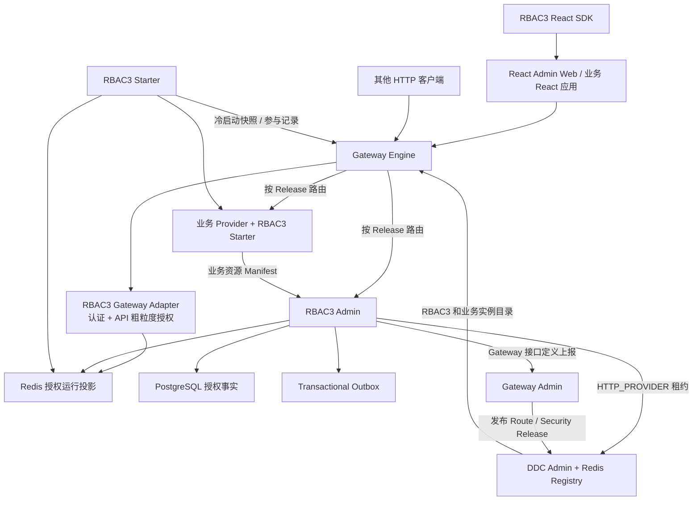
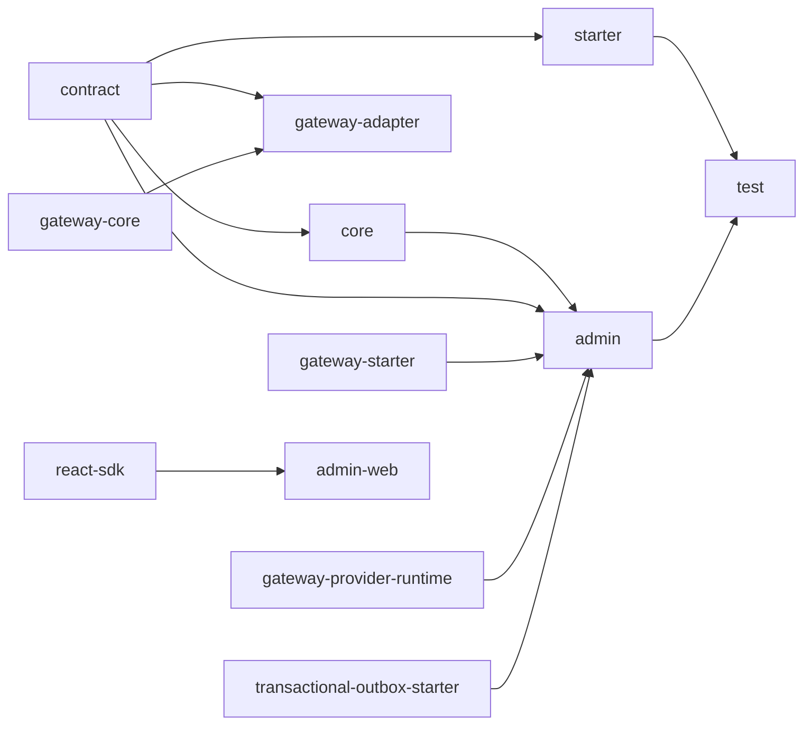
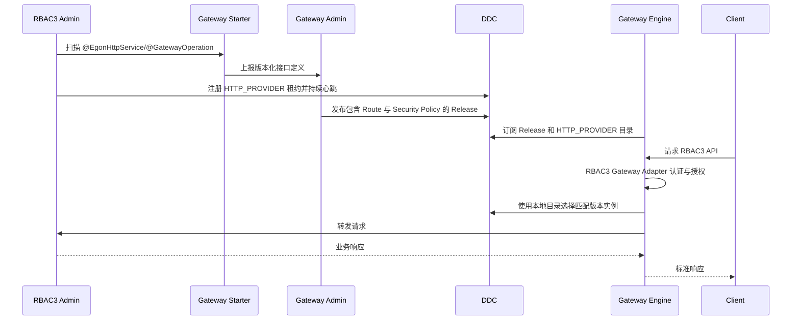
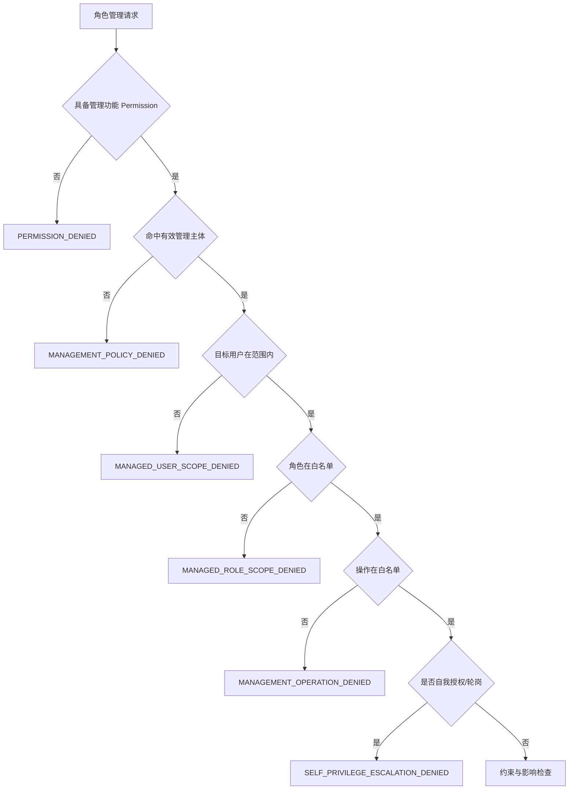

# Egon-COLA RBAC3 企业级权限平台设计 Spec

> 状态：待用户审核，未进入实施
>
> 日期：2026-07-30
>
> 仓库基线：`main@6e730cba`，仓库版本 `5.3.2`
>
> 原始需求稿：`/Users/mario/Downloads/rbac3-permission-system-design-v4.md`
>
> 目标目录：`egon-cola-platforms/egon-cola-platform-rbac3`

## 1. 审核闸门

本文只固化 RBAC3 的产品范围、领域语义、模块边界、运行拓扑、接口契约、数据模型、
一致性要求、错误语义和验收标准，不是实施计划。

在本文获得用户明确确认前：

1. 不创建 `egon-cola-platform-rbac3` 目录或任何子模块；
2. 不修改根 POM、Platforms POM、BOM、版本号或发布配置；
3. 不新增 Java、TypeScript、React、配置、测试、SQL 或 Flyway 文件；
4. 不修改现有 Gateway、DDC、Access Guard 或 Transactional Outbox；
5. 不生成 `docs/superpowers/plans/` 下的实施计划；
6. 不启动 RBAC3、Gateway、DDC、PostgreSQL、Redis 或其他长驻进程。

用户确认本文后，下一步才是按本 Spec 编写实施计划。实施计划仍需列出精确文件、测试、
验证命令和逐任务提交边界。

## 2. 已确认决策

| 编号 | 决策 |
|---|---|
| D-01 | RBAC3 是 `egon-cola-platforms` 下的独立完整平台，不是普通工具 Starter |
| D-02 | 建设中心服务、业务 Starter、Gateway Adapter、React 管理端、React 业务 SDK 和真实测试工程 |
| D-03 | RBAC3 自带最小租户、用户、组织、部门、岗位和授权快照，并提供外部 IdP/HR 同步 SPI；不建设完整 HR 系统 |
| D-04 | 所有业务数据强制租户隔离；平台管理员与租户管理员是不同安全边界 |
| D-05 | 首期支持本地账号、签名 JWT、Refresh Token 轮换和 Redis 在线会话；不建设完整 OAuth2/OIDC Authorization Server |
| D-06 | 持久化使用 PostgreSQL，运行态缓存与会话使用 Redis；不支持 MySQL 或 SQLite |
| D-07 | 管理聚合优先使用 Spring Data JPA；锁、继承闭包、批量决策和热查询允许使用显式 SQL |
| D-08 | 权限资源通过版本化 Manifest 显式注册，不从 URL、类名或前端组件名隐式创造权限 |
| D-09 | Gateway 执行入口认证与粗粒度 API 权限；RBAC3 Starter 和业务服务执行最终功能、数据、字段与同对象职责校验 |
| D-10 | 数据权限和字段权限通过类型化决策契约交给业务侧执行；首期不自动改写任意 JPA/MyBatis SQL |
| D-11 | 普通用户登录后不选择、不切换岗位角色；所有有效任职自动参与当前授权计算 |
| D-12 | 普通角色分配与岗位轮岗是两个不同业务能力 |
| D-13 | RBAC3 不实现审批；不出现待审批、通过、驳回、审批人或审批策略等模型、接口和页面 |
| D-14 | 立即轮岗由有权管理者提交后原子生效；定时和临时轮岗到时由调度器原子执行 |
| D-15 | RBAC3 Admin 必须使用 Gateway Starter 上报全部 HTTP 接口 |
| D-16 | RBAC3 Admin 必须使用 Gateway Provider Runtime，以 `HTTP_PROVIDER` 服务类型注册到 DDC |
| D-17 | Gateway Engine 必须从 DDC 获取 RBAC3 可用实例并完成负载均衡与请求路由 |
| D-18 | DDC 注册成功不等于接口已暴露；接口必须经过 Gateway Admin 的目录接收、路由配置和 Release 发布后才能由 Gateway 路由 |
| D-19 | RBAC3 Gateway Adapter 复用 Gateway 现有认证、授权和可信身份扩展契约，所有失败均 Fail Closed |
| D-20 | 角色、权限或任职变化通过数据库事务、授权版本、事务 Outbox、Redis 投影和会话撤销闭环生效 |
| D-21 | 禁止自我分配、自我轮岗和自我提升；本人只可查看任职，低风险角色自助撤销也必须由管理策略显式开启 |
| D-22 | Spec 描述完整终态，实施按可独立验收的阶段拆分，每个任务单独提交 |
| D-23 | Java 基线为 21，Spring Boot 基线为 3.5.16，Flyway 基线为 11.15.0 |
| D-24 | 管理端沿用现有 Gateway Admin Web 技术方向：React、TypeScript、Vite、React Router、TanStack Query、Ant Design |
| D-25 | 前端不是安全边界；绕过页面直接请求 API 仍必须被 Gateway 和业务侧授权链拒绝 |

## 3. 原始设计稿分析与需求归一

原始设计稿已经正确识别企业权限系统的核心问题：RBAC0 的用户、角色、权限关系不足以
覆盖角色继承、职责分离、任职有效期、委托式管理、轮岗、数据范围、字段权限和实时失效。
本平台保留这些业务结论，但修正原稿中尚未落到可实施边界的部分。

### 3.1 保留的核心模型

RBAC3 在本项目中的含义为：

```text
RBAC0 用户—角色—权限
+
RBAC1 角色继承
+
RBAC2 SSD/DSD/前置角色/角色容量约束
+
有有效期和状态的岗位任职
+
委托式角色管理
+
岗位轮岗
+
同一业务对象职责分离
+
数据权限
+
字段权限
```

普通用户授权路径为：

```text
认证主体
→ 当前有效任职
→ 角色继承闭包
→ SSD/DSD 安全复核
→ 当前有效角色
→ 角色权限并集
→ APP/MENU/ROUTE/ACTION/API
→ 数据范围
→ 字段规则
→ 当前授权快照
```

管理者执行角色变更的路径为：

```text
管理功能权限
→ 委托管理主体匹配
→ 目标用户范围
→ 可管理角色白名单
→ 可执行操作白名单
→ 自我授权拒绝
→ SSD/DSD/前置/容量/有效期检查
→ 原子变更
→ 授权版本更新
→ 会话与缓存失效
→ 审计
```

### 3.2 对原稿的关键修正

1. 原稿只描述一个中心系统，没有说明分布式业务应用如何注册资源和执行最终权限。本 Spec
   增加 RBAC3 Starter、React SDK 和 Gateway Adapter。
2. 原稿将 MySQL 写入技术头部，但当前 Platforms 基线已经治理 PostgreSQL、Flyway 和 Redis。
   本项目统一选择 PostgreSQL + Redis。
3. 原稿同时包含登录接口和“可外接 HR/组织中心”，却没有确定账号与组织归属。本 Spec 采用
   “最小内置目录 + 外部同步 SPI”，保证平台既能独立运行，也不复制完整 HR。
4. 原稿只使用 `authVersion`，无法精确表达单会话撤销和租户级角色权限变更。本 Spec 明确
   `sessionVersion`、用户 `authVersion` 和租户 `policyVersion` 三个版本。
5. 原稿只要求事务提交后删除缓存，进程在提交后崩溃会丢失失效动作。本 Spec 将审计事件和
   Outbox 与业务变化写入同一事务，并增加授权变更栅栏。
6. 原稿定义数据权限和字段权限，但没有定义业务侧执行接口。本 Spec 明确类型化 Scope、Field
   Policy 和 Participation SPI，禁止把任意 SQL 字符串当作权限规则。
7. 原稿定义轮岗审批。本项目经用户确认不实现任何审批，相关状态、字段、接口、页面和错误码
   全部删除。
8. 原稿没有区分 DDC 注册事实、Gateway 接口目录事实和 Gateway Release 路由事实。本 Spec
   将三者作为独立状态管理，禁止用“已注册 DDC”推导“已对外暴露”。
9. 原稿允许特殊 `USER_SELECTABLE` 角色。首期不提供任何用户自选角色；临时和紧急角色也由
   有权管理者分配，生效后自动进入授权集合。
10. 原稿只描述单系统 React Bootstrap。本 Spec 增加可复用 React SDK 和显式
    `componentKey` 注册表，禁止服务端下发可执行前端代码。

## 4. 建设目标

### 4.1 产品目标

RBAC3 必须提供：

1. 多租户账号、会话和最小组织岗位目录；
2. 用户与角色多对多任职、有效期、状态和来源追踪；
3. 角色继承与最大深度为 10 的闭包；
4. APP、MENU、ROUTE、ACTION、API 五类资源；
5. `domain:resource:action` 权限字符；
6. 角色权限、数据范围和字段等级；
7. SSD、DSD、角色前置条件和容量约束；
8. 跨角色、跨会话、跨轮岗仍有效的同对象职责分离；
9. 委托式管理主体、用户范围、角色范围和操作范围；
10. 普通兼容角色分配和岗位轮岗；
11. 立即、定时和临时轮岗；
12. 轮岗影响分析、交接阻断和业务交接 SPI；
13. 登录、Refresh、Logout、Bootstrap 和默认 Landing Route；
14. 用户级、会话级和租户策略级授权版本；
15. Gateway 入口认证授权、可信身份透传和业务服务二次校验；
16. DDC HTTP Provider 注册、恢复、心跳和下线；
17. Gateway 接口目录上报、显式发布、DDC 实例发现和路由闭环；
18. 管理端、React 业务 SDK、审计、模拟和影响分析；
19. 可靠授权失效、Outbox 重试和可观测性；
20. 可重复的模块测试、PostgreSQL/Redis 集成测试和真实 DDC/Gateway 闭环测试。

### 4.2 成功标准

平台成功不以“表和 CRUD 已存在”为判断依据，而以以下闭环为准：

```text
业务应用声明资源
→ RBAC3 接收版本化 Manifest
→ 管理员为角色授权
→ 管理者为用户创建有效任职或执行轮岗
→ 登录生成在线会话与授权快照
→ Gateway 验证身份和 API 权限
→ 业务 Starter 再次验证权限、数据、字段和对象职责
→ 角色变化后旧会话下一次请求被拒绝
→ React 重新加载 Bootstrap 并进入新岗位页面
→ 全链路可按 traceId 查询审计
```

RBAC3 自身还必须满足：

```text
RBAC3 Controller 被 Gateway Starter 发现并上报
→ Gateway Admin 接收接口定义
→ RBAC3 Admin 以 HTTP_PROVIDER 注册 DDC
→ Gateway Admin 发布 RBAC3 Route Release
→ Gateway Engine 从 DDC 发现 RBAC3 实例
→ 客户端通过 Gateway 成功路由到 RBAC3 Admin
```

## 5. 非目标

首期明确不实现：

1. 任何角色分配或轮岗审批；
2. 通用 BPMN、工作流或审批中心；
3. 完整 HR、薪资、考勤或人员档案系统；
4. 完整 OAuth2/OIDC Authorization Server；
5. 普通用户自行选择、切换或合并岗位角色；
6. 用户直接绑定普通业务权限；
7. 通用 Deny 权限模型；
8. 完整 ABAC 策略语言或动态脚本授权；
9. 任意 SQL、SpEL 或脚本形式的数据权限；
10. 首期自动改写 JPA、MyBatis 或 JDBC 查询；
11. 跨租户角色、权限、组织、资源或角色继承；
12. 独立 PAGE 资源；
13. 服务端向浏览器下发任意可执行 React 代码；
14. 业务负责人创建平台级角色、修改底层 API 资源或修改 SSD/DSD；
15. 仅依赖前端隐藏按钮或仅依赖 Gateway 的单层授权；
16. 用 DDC 保存 RBAC3 业务主数据，或用 Gateway Admin 保存角色与权限事实；
17. MySQL、SQLite、Nacos、Dubbo 或新增注册中心；
18. 自动启动项目或把模块测试宣称为真实多进程拓扑验证。

## 6. 方案比较与选型

### 6.1 方案 A：中心控制面 + 本地执行面 + Gateway 入口执行面

RBAC3 Admin 保存授权事实并生成版本化运行快照；Gateway Adapter 在入口执行认证和粗粒度
API 权限；业务 Starter 在服务内部执行最终授权、数据、字段和同对象职责校验。

优点：

- 角色、权限、审计和轮岗集中治理；
- 热路径不需要每次同步调用中心 PDP；
- Gateway 可以在请求进入业务网络前拒绝明显越权；
- 业务服务仍保留最终安全边界，不信任可伪造的前端或普通代理头；
- 中心短暂不可用时，已加载且版本仍有效的授权快照可以继续工作；
- 能直接复用现有 Gateway 和 DDC 契约。

代价：

- 必须维护版本化 Redis 运行投影；
- Gateway Adapter、Starter 和 Admin 对决策语义必须有契约测试；
- 权限变更传播需要 Outbox、栅栏和恢复机制。

### 6.2 方案 B：所有请求远程调用中心 PDP

Gateway 和业务服务每次请求都同步调用 RBAC3 Admin 决策。

优点是授权事实集中且实现直观。缺点是 RBAC3 Admin 成为所有请求的延迟与可用性瓶颈，
Gateway 调用 RBAC3 自身时还会产生递归路由风险。该方案不满足平台数据面的可用性目标。

### 6.3 方案 C：每个业务应用嵌入完整 RBAC

每个应用维护自己的角色、权限、数据库和会话。

优点是应用自治。缺点是无法统一轮岗、审计、资源、会话撤销和跨应用工作台，不能称为统一
RBAC3 平台。

### 6.4 结论

采用方案 A。

Gateway 是第一层 PEP，业务 Starter 是最终 PEP，RBAC3 Core 是统一决策语义，RBAC3 Admin
是授权事实和控制面。任何一层不得自行发明不同的角色合并、权限字符、版本或错误规则。

## 7. 总体架构



### 7.1 三类事实

平台必须区分三类事实：

| 事实 | 权威来源 | 含义 |
|---|---|---|
| 授权事实 | RBAC3 PostgreSQL | 租户、用户、角色、权限、任职、约束、管理策略、轮岗和审计 |
| 服务发现事实 | DDC | 哪些 RBAC3/业务 HTTP Provider 实例当前持有有效租约 |
| Gateway 发布事实 | Gateway Admin + DDC 发布版本 | 哪些 Operation 已被分配 Route、安全策略和运行版本 |

三者不可相互替代：

- RBAC3 数据库有权限，不代表 Gateway 已配置路由；
- DDC 有实例，不代表 Operation 已发布；
- Gateway 有 Route，不代表调用者拥有 RBAC3 权限；
- 前端有菜单，不代表 API 一定允许访问。

## 8. 目标工程结构

```text
egon-cola-platforms/
└── egon-cola-platform-rbac3/
    ├── pom.xml
    ├── README.md
    ├── README.zh-CN.md
    ├── docs/
    │   └── manifest.md
    ├── egon-cola-platform-rbac3-contract/
    ├── egon-cola-platform-rbac3-core/
    ├── egon-cola-platform-rbac3-starter/
    ├── egon-cola-platform-rbac3-gateway-adapter/
    ├── egon-cola-platform-rbac3-admin/
    ├── egon-cola-platform-rbac3-admin-web/
    ├── egon-cola-platform-rbac3-react-sdk/
    └── egon-cola-platform-rbac3-test/
```

Java 包根使用：

```text
top.egon.cola.platform.rbac3
```

配置前缀使用：

```text
egon.cola.platform.rbac3
```

### 8.1 `contract`

稳定、可序列化的消费者契约：

- ID、权限字符、资源类型和错误码；
- Token Claims 和可信身份模型；
- Authorization Snapshot、Decision、Data Scope、Field Policy；
- Resource Manifest 和版本协议；
- Bootstrap DTO；
- 业务参与记录契约；
- 管理端与 Starter 共享的请求响应模型。

该模块不得依赖 Admin、JPA、Redis、Gateway Engine 或前端工程。

### 8.2 `core`

纯领域与决策内核：

- 有效任职计算；
- 角色继承闭包输入校验；
- 权限、数据范围和字段等级合并；
- SSD、DSD、前置角色、容量和对象职责规则；
- 委托管理策略决策；
- 轮岗状态转换与来源角色处理；
- 授权版本变化判定；
- 决策原因和影响分析。

Core 不依赖 Spring MVC、Gateway、DDC、JPA 实体或 Redis 实现。

### 8.3 `starter`

安装在业务 Spring Boot 应用中，负责：

- Bearer Token 解析和 Spring Security 上下文创建；
- `sid/authVersion/policyVersion` 运行校验；
- 方法与 API 权限校验；
- Data Scope、Field Policy 和同对象职责 API；
- 高风险写操作授权栅栏；
- 业务资源 Manifest 生成和上报；
- 本地只读快照缓存和 Redis/中心冷加载；
- 401/403/409 错误映射、事件、日志和指标。

Starter 不依赖 Admin、JPA、业务数据库或 Gateway Engine。业务应用是否同时安装 Gateway
Starter 由其自身网关接入需求决定。

### 8.4 `gateway-adapter`

安装在 Gateway Engine 部署中，复用现有：

- `GatewayCredentialExtractor`；
- `GatewayAuthenticationProvider`；
- `GatewayAuthorizationProvider`；
- `GatewayIdentityMapper`；
- `GatewaySecurityPolicy`；
- `TrustedIdentity`。

Adapter 本地验证 JWT、在线会话和粗粒度 API 权限，不通过 Gateway 回调 RBAC3 HTTP API，
从而避免递归路由。所有 Provider 超时、Redis 不可用、版本缺失或策略缺失均 Fail Closed。

### 8.5 `admin`

独立 Spring Boot 中心服务，负责：

- 租户、账号、目录快照和外部身份映射；
- 角色、权限、资源、继承和约束管理；
- 任职、委托管理、轮岗和交接；
- 登录、会话、Bootstrap 和授权快照物化；
- PostgreSQL、Redis、Outbox、审计和调度；
- 业务资源 Manifest 接收；
- Gateway Starter 接口上报；
- Gateway Provider Runtime 的 DDC HTTP Provider 注册。

Admin 是唯一可写授权事实的服务。Gateway、Starter、React SDK 和业务应用均不得直接写
RBAC3 数据表。

### 8.6 `admin-web`

平台和租户安全管理端，只调用 Gateway 暴露的 RBAC3 Admin API，不直连 PostgreSQL、Redis、
DDC 或 Gateway Admin。

### 8.7 `react-sdk`

供业务 React 应用接入：

- 登录态和 Bootstrap Client；
- `PermissionGuard`、`ActionGuard`、`FieldGuard`；
- APP/MENU/ROUTE 注册表；
- `componentKey` 到本地组件的白名单映射；
- `AUTH_VERSION_MISMATCH` 和 `SESSION_INVALIDATED` 统一处理；
- 默认 Landing Route 解析；
- 不包含管理端页面。

### 8.8 `test`

提供真实业务 Provider、资源 Manifest、React SDK 契约样例和可选多进程测试编排。测试模块不
进入消费者 BOM，不作为生产依赖发布。

## 9. 模块依赖边界



边界约束：

1. `contract` 和 `core` 不依赖 Admin；
2. `starter` 不依赖 Gateway、JPA 或业务持久化框架；
3. `gateway-adapter` 不依赖 Admin；
4. `admin` 可以依赖 Gateway Starter 和 Provider Runtime，但不能复制其上报或租约代码；
5. `admin-web` 和 `react-sdk` 是独立 npm 工程，不通过 Maven Frontend Plugin 隐式修改
   Java 构建；
6. Platforms Parent 只聚合 Maven 模块并在 `dependencyManagement` 治理消费者版本；
7. 不新建独立 RBAC3 BOM；Platforms Parent 只管理 `contract`、`starter` 和
   `gateway-adapter`，不把 Admin、前端或 Test 当作消费者依赖；
8. `test` 依赖生产模块，不允许生产模块反向依赖测试代码。

## 10. Gateway 与 DDC 强制闭环

### 10.1 RBAC3 API 上报 Gateway

RBAC3 Admin 必须依赖现有：

```text
top.egon:egon-cola-platform-gateway-starter
```

Controller 使用现有 `@EgonHttpService`，方法使用现有 `@GatewayOperation`。Spring MVC Mapping
仍是 HTTP Method、Path、Content Type 和参数事实来源，不新增重复描述机械 HTTP 信息的注解。

统一应用身份：

```text
applicationCode = rbac3-admin
applicationName = Egon COLA RBAC3 Admin
serviceName     = rbac3-admin
group           = default
protocol        = http
```

`artifactVersion`、Provider `version` 和 Gateway Definition Identity 必须一致。Gateway Starter
负责定义指纹、幂等上报、失败重试、状态文件和周期校准；RBAC3 不实现第二套上报器。

接口暴露规则：

| 接口 | `externalAccessible` | Gateway 安全模式 |
|---|---:|---|
| Login、Refresh、JWKS/公钥读取、健康探针 | true | 匿名或可选认证，仍受限流和输入校验 |
| Logout、Bootstrap | true | 强制 RBAC3 Bearer 认证 |
| Admin Web 使用的管理 API | true | 强制认证 + 对应管理权限 + 委托范围 |
| Resource Manifest、快照冷加载、参与记录等内部 API | false | 内部入口 + 服务身份 + RBAC3 权限 |
| 调试、重放、Outbox 运维 API | false | 内部入口 + 平台安全管理员 |

`externalAccessible=true` 只表示允许从 PUBLIC Listener 进入，不代表匿名，也不代表拥有业务权限。

### 10.2 RBAC3 Admin 注册 DDC

RBAC3 Admin 必须依赖现有：

```text
top.egon:egon-cola-platform-gateway-provider-runtime
```

Provider Runtime 使用现有配置前缀：

```text
egon.cola.component.gateway.provider.http
```

并使用现有 `DdcServiceRegistryClient` 注册：

```text
DdcServiceKind.HTTP_PROVIDER
```

服务键完整维度为：

```text
env
+ namespace
+ HTTP_PROVIDER
+ serviceName=rbac3-admin
+ group=default
+ version
+ protocol=http|https
```

每个 Admin 实例必须拥有稳定且唯一的 `instanceId`、可路由的 `advertisedHost` 和实际端口。
生产默认：

```text
leaseSeconds = 30
heartbeatIntervalSeconds = 10
failFast = true
```

运行期必须复用 `HttpProviderLeaseRuntime` 的注册、心跳、丢租约恢复和 TTL 下线行为。RBAC3
不得直接写 DDC Redis Key 或复制租约 Lua。

### 10.3 Gateway 路由 RBAC3 请求

请求闭环为：



Gateway Engine 只能选择与 Route 的 env、namespace、serviceName、group、version 和 protocol
全部匹配且租约有效的实例。无匹配实例返回 Gateway 的无可用 Provider 错误，不允许退回静态
地址或跨环境实例。

### 10.4 Gateway RBAC3 安全适配

`gateway-adapter` 提供固定能力 ID：

```text
credential extractor : rbac3-bearer
authentication       : rbac3-jwt-session
authorization        : rbac3-permission
identity mapper      : rbac3-trusted-identity
```

认证步骤：

1. 提取 Bearer Token；
2. 校验算法白名单、签名、`iss`、`aud`、`exp`、`nbf` 和 `jti`；
3. 校验 `tenantId`、`userId`、`sid`、`authVersion`、`sessionVersion`、`policyVersion`；
4. 在 Redis 运行投影中确认会话为 ACTIVE 且版本完全一致；
5. 创建 Gateway Principal；
6. 删除调用方伪造的可信身份头；
7. 由 Identity Mapper 生成受信任身份。

授权步骤：

1. 从 `GatewayAuthContext.policyId` 解析版本化 RBAC3 安全策略引用；
2. 将 Gateway `operationId` 映射到一个显式 API Permission；
3. 在相同版本的授权快照中检查 Permission；
4. 无映射、映射冲突、快照缺失、版本不一致或 Redis 不可用均拒绝；
5. Gateway 只返回粗粒度 Allow/Deny，不计算业务数据或字段结果。

登录和 Refresh Route 使用不需要已有登录态的 Gateway Policy；其他 Route 默认 Fail Closed。
Gateway Adapter 不通过 Gateway 请求 RBAC3 Admin，避免“Gateway 鉴权 → RBAC3 Route → Gateway
鉴权”的递归链。

### 10.5 可信身份

Gateway 只允许向 Provider 注入以下经过编码和签名/可信链路保护的身份字段：

```text
tenantId
userId
sessionId
authVersion
sessionVersion
policyVersion
traceId
```

角色和权限集合不通过普通 Header 全量透传。业务 Starter 仍校验原始 Bearer Token 和 Redis
版本，不因存在可信头而跳过最终授权。可信头用于减少重复解析和审计关联，不是独立凭证。

### 10.6 故障和恢复

| 故障 | 行为 |
|---|---|
| DDC 启动不可用且生产 `failFast=true` | RBAC3 Admin 不进入 Ready |
| DDC 运行期短暂不可用 | Provider Runtime 进入 RECOVERING；已有租约最终按 TTL 失效；恢复后重新注册 |
| Gateway Admin 上报失败 | 按 Gateway Starter 既有重试和状态文件处理；新接口版本未被接收前不得宣称可发布 |
| Gateway Release 不存在 | DDC 有实例也不能由 Gateway 路由 |
| Redis 授权投影不可用 | Gateway Adapter 和业务 Starter 对受保护请求 Fail Closed |
| PostgreSQL 不可用 | 写操作失败；已有且版本有效的只读授权快照可继续服务 |
| RBAC3 Admin 不可用 | 登录、Refresh、管理和冷加载失败；已物化且版本有效的 Gateway/Starter 热路径继续工作 |

## 11. 租户、账号与组织目录

### 11.1 租户边界

所有业务身份和授权实体都必须携带非空 `tenant_id`。任何查询、唯一约束、缓存 Key、审计和
事件都包含 tenant。禁止：

- 从普通请求 Header 直接相信 tenant；
- 使用 `tenant_id = 0` 表示无租户；
- 跨租户角色继承；
- 跨租户为用户分配角色；
- 跨租户合并数据范围；
- 平台管理员身份自动绕过租户审计。

平台运维使用独立的平台租户和平台级权限。进入某个业务租户执行管理动作时，必须形成显式的
目标租户上下文并写入审计。

### 11.2 最小内置目录

RBAC3 保存授权所需最小快照：

- Tenant；
- User；
- Local Credential；
- External Identity Mapping；
- Organization；
- Department；
- Position；
- User Position Snapshot；
- 用户状态与目录同步版本。

目录模型只承载授权所需编码、层级、状态和有效期，不管理薪资、合同、考勤等 HR 信息。

### 11.3 外部同步

提供：

```text
IdentityAuthenticator
DirectorySnapshotProvider
DirectoryChangeConsumer
ExternalSubjectMapper
```

外部同步必须幂等，以 `(tenantId, providerCode, externalId)` 唯一。目录删除先转为 INACTIVE，
不得级联删除历史任职、轮岗、参与记录或审计。

### 11.4 ID 约定

Java 内部 ID 使用 `long`，通过项目 Long ID 生成能力生成。部署必须显式配置唯一 machine ID，
禁止从主机名或 IP 隐式推导。JSON 中所有 Long ID 序列化为十进制字符串，避免 JavaScript
安全整数精度丢失。外部系统主体 ID 单独使用字符串字段，不复用内部主键。

## 12. 认证、Token 与会话

### 12.1 本地认证

首期支持用户名/密码，密码默认使用 BCrypt strength 12。认证 SPI 可以接入外部 IdP，但外部
认证成功后仍必须映射到一个有效 RBAC3 User 和 Tenant。

### 12.2 Token

Access Token 为签名 JWT，至少包含：

```text
iss   issuer
aud   audience
sub   userId
tid   tenantId
sid   sessionId
av    authVersion
sv    sessionVersion
pv    policyVersion
jti   tokenId
iat   issuedAt
nbf   notBefore
exp   expiresAt
```

JWT 不嵌入完整角色、权限、数据或字段集合，避免角色变化后仍携带陈旧授权并控制 Token 大小。

默认时间：

| 项目 | 默认值 | 可配置范围 |
|---|---:|---:|
| Access Token | 15 分钟 | 5～30 分钟 |
| Refresh Token | 7 天 | 1～30 天 |
| 会话空闲时间 | 30 分钟 | 5 分钟～8 小时 |
| 会话绝对时长 | 12 小时 | 1～24 小时 |

Refresh Token 每次使用都轮换；数据库和 Redis 只保存 Token Hash。重放旧 Refresh Token 时撤销
整个 Token Family，并写入安全审计。

### 12.3 签名密钥

JWT 私钥只从部署 Secret、受控文件或 KMS Adapter 读取，不进入 PostgreSQL、Redis、DDC、日志
或普通配置中心。RBAC3 Admin 将仅含公钥的 Key Ring 物化到 Redis，并通过 `/auth/jwks` 提供
标准只读视图。Gateway Adapter 和 Starter 按 `kid` 从 Redis Key Ring 刷新公钥，允许在公钥
`not_after` 之前使用内存 LKG；遇到未知 `kid`、过期 Key Ring 或签名算法变化时 Fail Closed。

密钥轮换必须保留旧公钥至少“最大 Access Token 有效期 30 分钟 + 2 分钟时钟偏差”，新私钥
生效、JWKS/Redis 公钥可见和旧私钥停签的顺序必须可审计。DDC 可以下发非敏感的 Key 版本号和
刷新配置，但不得保存或传递私钥。

### 12.4 三类版本

| 版本 | 粒度 | 变化场景 |
|---|---|---|
| `sessionVersion` | 单会话 | Logout、Refresh Family 重放、单设备撤销 |
| `authVersion` | 单用户 | 任职、用户状态、目录归属、临时角色、轮岗变化 |
| `policyVersion` | 单租户 | 角色权限、资源映射、继承、SSD/DSD、数据或字段规则变化 |

Token 中三个版本必须与 Redis 运行投影完全一致。角色权限变化不需要逐个更新所有用户，而是递增
租户 `policyVersion` 并重新物化受影响快照。

正常 Refresh 在轮换 Refresh Token 的同时递增当前 Session 的 `sessionVersion`，因此旧 Access
Token 立即失效。用户级 `authVersion` 变化撤销该用户全部现有 Session，必须重新认证；租户级
`policyVersion` 变化保留未被单独撤销的 Session，客户端可用有效 Refresh Token 获取新版本
Access Token 并重载 Bootstrap。

### 12.5 Bootstrap

`GET /api/rbac3/v1/auth/bootstrap` 返回：

```json
{
  "user": {
    "id": "10001",
    "tenantId": "20001",
    "username": "zhangsan",
    "displayName": "张三"
  },
  "effectiveAssignments": [
    {
      "assignmentId": "30001",
      "roleCode": "ROLE_PAYMENT_APPROVER",
      "roleType": "POSITION",
      "assignmentType": "ROTATION",
      "validFrom": "2026-08-01T01:00:00Z",
      "validTo": null
    }
  ],
  "permissions": [
    "finance:payment:read",
    "finance:payment:approve"
  ],
  "apps": [],
  "menus": [],
  "routes": [],
  "actions": [],
  "fieldPolicies": {},
  "defaultRoute": "/finance/payment-approvals",
  "sessionId": "40001",
  "authVersion": 43,
  "sessionVersion": 2,
  "policyVersion": 18
}
```

响应不返回其他角色可访问但当前用户不可访问的资源，也不返回密码、Credential、内部规则表达式
或管理策略底层范围。

## 13. 角色、任职与有效角色

### 13.1 角色类型

```text
PUBLIC
POSITION
MANAGEMENT
TEMPORARY
EMERGENCY
```

- PUBLIC：公共低风险角色，可与岗位角色兼容；
- POSITION：决定主要岗位能力和 Landing Route；
- MANAGEMENT：允许进入授权管理功能，但最终可管理范围仍由管理策略决定；
- TEMPORARY：强制 `valid_to`，由有权管理者分配；
- EMERGENCY：强制短有效期、强认证和完整审计，不允许用户自助激活。

### 13.2 任职来源

```text
AUTO
DIRECT
ROTATION
TEMPORARY
EMERGENCY
```

任职状态：

```text
PENDING
ACTIVE
SUSPENDED
EXPIRED
REVOKED
```

有效条件以数据库 UTC 时间为准：

```text
status = ACTIVE
AND valid_from <= database_now
AND (valid_to IS NULL OR valid_to > database_now)
```

所有有效任职自动进入会话候选集，没有角色选择接口。调度器负责按时间推进状态，但授权计算仍
必须检查时间条件，不能只相信调度器已经及时执行。

### 13.3 有效角色算法

```text
有效直接任职
→ 展开角色继承闭包
→ 去重
→ 排除禁用或过期角色
→ DSD 安全复核
→ 得到当前有效角色
```

权限取有效角色的 Allow 并集；没有任何隐式超级管理员字符串绕过。平台或租户超级管理员也必须
通过显式角色、权限和审计实现。

### 13.4 Landing Route

岗位角色拥有：

```text
landing_route_code
landing_priority
```

选择规则：

1. 选择当前有效 POSITION 角色中优先级最高且可访问的 Route；
2. 同优先级按稳定 `role_code` 排序，保证结果确定；
3. 无 POSITION Route 时选择 PUBLIC 角色 Route；
4. 没有可访问 Route 时进入固定无权限页面；
5. Route 指向未知 `componentKey` 时视为前端资源不兼容，不执行任意动态代码。

## 14. 角色继承和约束

### 14.1 角色继承

`senior_role` 继承 `junior_role`。规则：

- 不能自继承；
- 不能成环；
- 不能跨租户；
- 最大深度 10；
- 使用闭包表读取；
- 修改继承关系时在同一事务维护闭包、递增 `policyVersion`、写审计和 Outbox；
- 发布前执行角色权限、SSD/DSD 和容量影响分析。

### 14.2 SSD

SSD 在任职创建、恢复、轮岗和角色继承变化时，基于“变化后的有效角色闭包”检查。冲突集合可
配置最大同时拥有数量，例如审核人和出纳集合最大值为 1。

### 14.3 DSD

DSD 在登录、Refresh、临时/紧急任职生效和每次授权快照重建时复核当前会话角色组合。虽然首期
不允许用户主动选择角色，DSD 仍作为运行时安全网，防止 AUTO、TEMPORARY 和 EMERGENCY
组合因配置变化形成冲突。

### 14.4 前置角色

目标角色可以要求一个或多个前置角色。前置规则明确：

```text
ALL_OF
ANY_OF
```

校验基于变化后的角色闭包。继承得到的前置角色可以满足条件，但禁用、过期或跨租户角色不能。

### 14.5 角色容量

容量范围支持：

```text
TENANT
ORG
DEPT
```

容量统计包含在目标有效时间窗口内重叠的 ACTIVE 和已排期任职。容量校验与任职写入使用同一
范围锁/数据库事务，不能采用“先 count、后无锁 insert”的竞态实现。

## 15. 权限与资源

### 15.1 权限字符

格式固定为：

```text
domain:resource:action
```

只允许小写 ASCII、数字和中划线，段之间使用冒号。示例：

```text
finance:payment:read
finance:payment:approve
system:role-assignment:create
system:role-rotation:create
system:management-policy:manage
```

权限 Code 在租户和应用命名空间内唯一。平台内置权限是只读模板，租户不得修改其 Code 或
语义。

### 15.2 资源类型

```text
APP
MENU
ROUTE
ACTION
API
```

不建立 PAGE。Route 持有：

```text
routeCode
path
componentKey
requiredPermissionCode
redirect
hidden
keepAlive
routeMeta
```

API 持有：

```text
applicationCode
serviceName
gatewayOperationId
httpMethod
pathPattern
requiredPermissionCode
externalAccessible
```

### 15.3 Resource Manifest

每个业务应用上报完整、版本化 Manifest：

```text
applicationCode
applicationName
artifactVersion
buildId
manifestVersion
checksum
apps
menus
routes
actions
apis
fieldDefinitions
```

规则：

1. 相同 `(tenant, applicationCode, artifactVersion, buildId, checksum)` 幂等；
2. 同一 BuildId 不允许用不同内容覆盖；
3. 新 Manifest 先校验引用、Code、Route 和 API 冲突，再原子激活；
4. 新版本缺失的资源标记为 STALE，不立即物理删除；
5. 已被角色授权或历史审计引用的资源不能物理删除；
6. 上报资源不自动把权限授予任何角色；
7. API Permission 必须和 Gateway Operation 显式映射；
8. Manifest 发布递增租户 `policyVersion` 并触发影响分析；
9. 服务账号只能上报自己被注册的 `applicationCode`；
10. 管理端手工补充展示元数据时不能改变应用声明的 API 机械事实。

### 15.4 React `componentKey`

React SDK 只从本地静态 Registry 解析 `componentKey`：

```text
componentKey -> lazy import factory
```

服务端不能返回 JavaScript URL、模块源码或任意 import 表达式。未知 Key 进入受控错误页并记录
前端兼容性事件。

## 16. 数据权限

### 16.1 范围类型

```text
ALL
TENANT
ORG
ORG_TREE
DEPT
DEPT_TREE
SELF
CUSTOM_ORG
CUSTOM_DEPT
CUSTOM_USER
NONE
```

数据范围绑定 `role + permission`，最终规则为：

```text
租户边界
AND
同一 permission 下各有效角色 Data Scope 的规范化并集
```

`ALL` 仍受租户边界约束。`NONE` 不扩大范围。管理者的可管理用户范围与业务数据范围是两个
独立模型，禁止复用同一个 Scope 实例或查询方法。

### 16.2 类型化契约

Starter 返回结构化 `DataScopeDecision`，包含：

```text
tenantId
permissionCode
scopeType
allowedOrgIds
allowedDeptIds
allowedUserIds
selfUserId
decisionVersion
```

业务 Repository 或 Domain Service 将该结构转换为自身查询条件。首期 Starter 不接收或返回
SQL 片段，不拼接字段名，不通过拦截器猜测业务表的 tenant/dept/user 列。

### 16.3 写操作

数据权限不仅用于查询。更新、删除、导出和状态迁移必须以目标对象属性重新校验 Scope，禁止
先按客户端 ID 加载后只检查功能 Permission。

## 17. 字段权限

访问等级：

```text
NONE < MASKED_READ < READ < WRITE
```

字段规则绑定：

```text
role + permission + application + resource + field
```

多个有效角色取同一字段的最高等级，但仍受租户和 Permission 前提约束。注册为敏感字段的字段
默认 `NONE`，必须显式授权。未注册为权限字段的普通响应字段继续由业务 DTO 控制。

后端必须执行：

- 响应字段删除；
- 脱敏转换；
- 写入字段校验；
- 导出字段校验；
- 审计字段校验。

React SDK 只负责隐藏、只读和脱敏展示提示，不能替代后端处理。

## 18. 同一业务对象职责分离

同对象职责分离不依赖当前角色，而依赖历史参与记录。业务应用通过 Starter 记录：

```text
tenantId
businessResource
businessId
actorUserId
actionCode
occurredAt
traceId
```

典型规则：

| 前置操作 | 后置操作 | 同一用户 |
|---|---|---|
| CREATE | APPROVE | 禁止 |
| SUBMIT | APPROVE | 禁止 |
| APPROVE | EXECUTE_PAYMENT | 禁止 |
| EXECUTE_PAYMENT | AUDIT_CONFIRM | 禁止 |

参与记录必须在业务动作成功的同一业务事务或业务 Outbox 中产生。RBAC3 中央记录用于跨应用查询
和审计，但不能让业务动作先成功、参与记录随后静默丢失。

高风险动作流程：

```text
功能 Permission
→ authVersion/policyVersion 授权栅栏
→ Data Scope
→ Field Policy
→ 历史 Participation
→ 业务状态规则
→ 执行写入并记录新 Participation
```

## 19. 委托式管理

### 19.1 管理能力

管理权由以下五元组定义：

```text
管理主体
+ 目标用户范围
+ 可管理角色白名单
+ 可执行操作白名单
+ 有效期
```

本项目没有第六项“审批规则”。

管理主体：

```text
USER
ROLE
POSITION
```

目标范围：

```text
SELF_DEPT
DEPT
DEPT_TREE
ORG
ORG_TREE
CUSTOM_DEPT
CUSTOM_USER
```

操作：

```text
VIEW_ASSIGNMENT
ASSIGN_ROLE
REVOKE_ROLE
ROTATE_ROLE
SCHEDULE_ROTATION
TEMPORARY_ASSIGN
CANCEL_ROTATION
VIEW_AUDIT
VIEW_IMPACT
SELF_REVOKE_LOW_RISK
```

不存在 `SUBMIT_ROTATION`、`APPROVE_ROTATION` 或任何审批操作。

### 19.2 决策顺序



### 19.3 高风险角色

以下角色不得出现在普通委托策略白名单：

```text
ROLE_PLATFORM_ADMIN
ROLE_TENANT_ADMIN
ROLE_SECURITY_ADMIN
ROLE_AUDIT_ADMIN
ROLE_EMERGENCY_ADMIN
```

它们只能由具备显式平台/租户安全管理 Permission 的非目标用户直接操作，并要求强认证、原因、
工单号和审计。由于本项目没有审批，这一限制是防止高风险误授权的硬边界，而不是可选建议。

## 20. 普通角色分配

普通分配适用于 PUBLIC、兼容辅助角色、报表角色和经允许的 MANAGEMENT 角色。它只新增或撤销
一个任职，不自动结束用户现有岗位。

分配前必须检查：

- Tenant 和用户状态；
- 管理策略；
- 角色状态和类型；
- 自我授权；
- 重复或时间重叠任职；
- SSD/DSD；
- 前置角色；
- 角色容量；
- 最大授权天数；
- 对当前 Landing Route 和授权版本的影响。

成功后更新用户 `authVersion`、授权快照、会话和审计。

## 21. 岗位轮岗

### 21.1 轮岗与普通分配

岗位轮岗是：

```text
结束/暂停原岗位
+ 创建新岗位任职
+ 处理交接约束
+ 更新授权版本
+ 撤销旧会话
```

它不是用户角色页面上的两个无关 CRUD。

### 21.2 生效模式

```text
IMMEDIATE
SCHEDULED
TEMPORARY
```

- IMMEDIATE：请求通过校验后在当前命令内原子执行；
- SCHEDULED：到 `effective_at` 后由调度器执行；
- TEMPORARY：在 `[effective_at, expire_at)` 生效，到期失效并按来源处理规则恢复。

### 21.3 来源角色处理

```text
EXPIRE_SOURCE
SUSPEND_SOURCE
KEEP_SOURCE
```

POSITION 轮岗默认 `EXPIRE_SOURCE`。临时代岗推荐 `SUSPEND_SOURCE`。`KEEP_SOURCE` 只有在
SSD、DSD、容量和岗位规则全部允许时才能使用。

### 21.4 状态机

```text
SCHEDULED
EXECUTING
EFFECTIVE
CANCELLED
FAILED
EXPIRED
RESTORED
```

状态转换：

```text
IMMEDIATE:  EXECUTING -> EFFECTIVE | FAILED
SCHEDULED:  SCHEDULED -> EXECUTING -> EFFECTIVE | FAILED
TEMPORARY:  SCHEDULED -> EXECUTING -> EFFECTIVE -> EXPIRED -> RESTORED
CANCEL:     SCHEDULED -> CANCELLED
```

没有 DRAFT、PENDING_APPROVAL、APPROVED、REJECTED。需要预览时使用无副作用的影响分析接口，
而不是持久化审批草稿。

### 21.5 执行前检查

必须检查：

- 请求 Idempotency Key；
- 发起人功能 Permission 和管理策略；
- 目标 Tenant、用户、组织和状态；
- 原任职存在且属于目标用户；
- 新角色在可管理白名单且启用；
- 生效时间和过期时间合法；
- 未存在冲突轮岗；
- SSD、DSD、前置、容量；
- 自我轮岗；
- 业务交接阻断项；
- 当前授权版本。

### 21.6 交接

业务系统通过 SPI 提供：

```text
RotationImpactContributor
RotationHandoverExecutor
```

处理类型：

```text
KEEP
TRANSFER_USER
TRANSFER_QUEUE
BLOCK
```

存在未处理 BLOCK 项时拒绝执行。转移失败时整个轮岗不进入 EFFECTIVE。没有交接 Contributor
的业务资源不允许伪装成“已检查”，必须在角色配置中明确该角色是否需要交接。

### 21.7 原子执行

同一 PostgreSQL 事务必须：

1. 锁定目标用户；
2. 锁定轮岗单或幂等命令；
3. 再次检查并发轮岗和当前授权版本；
4. 结束、暂停或保留原任职；
5. 创建目标任职；
6. 写交接结果；
7. 写执行快照；
8. 递增用户 `authVersion`；
9. 写授权审计；
10. 写 Outbox。

任一步失败必须整体回滚。定时调度使用 PostgreSQL `FOR UPDATE SKIP LOCKED` 领取到期任务，
每个任务仍通过状态条件更新和 Idempotency Key 保证只能生效一次。

## 22. 授权运行投影与强一致边界

### 22.1 Redis 运行模型

Redis 保存：

- Session Runtime；
- User Authorization Version；
- Tenant Policy Version；
- Authorization Snapshot；
- Gateway Operation → Permission 映射；
- 授权变更 Fence；
- 短期幂等和撤销标记。

PostgreSQL 始终是业务事实。Redis 数据可以从 PostgreSQL 和 Outbox 重建，但受保护请求不会在
缺失运行投影时默认放行。

### 22.2 授权变更 Fence

为保证角色变化成功返回后旧授权不能继续使用，变更流程为：

```text
在 Redis 建立 user/tenant mutation fence
→ 受影响请求开始 Fail Closed
→ PostgreSQL 事务写业务变化、版本、审计、Outbox
→ 提交
→ 同步原子更新 Redis 版本/快照并撤销旧会话
→ 删除 fence
→ 返回成功
```

如果数据库回滚，删除 Fence。如果数据库已经提交但 Redis 投影失败：

- 不返回成功；
- 返回 `AUTH_PROPAGATION_PENDING`；
- Fence 保持，受影响请求继续 Fail Closed；
- Outbox Worker 重试投影和会话撤销；
- 修复完成后删除 Fence。

该选择优先安全而非短时可用性。

### 22.3 在途请求

已在 Fence 建立前完成授权的普通只读请求可能完成。高风险写操作必须在业务数据库写入前调用
Starter 的授权栅栏，再次核对 Token 版本、Redis 版本和 Fence；版本变化时终止写入。

“下一次请求不得使用旧权限”的安全承诺成立需要：

1. 请求经过安装 RBAC3 Adapter 的 Gateway，或业务服务安装 RBAC3 Starter；
2. 受保护端点没有绕过两者；
3. Redis 运行投影可访问；
4. 高风险写操作在提交前使用授权栅栏。

## 23. 可靠事件、审计与可观测性

### 23.1 Outbox

以下变化在业务事务内写 Outbox：

- 用户和目录授权属性变化；
- 任职创建、撤销、暂停、恢复和过期；
- 轮岗执行；
- 角色权限和继承变化；
- SSD/DSD、数据和字段规则变化；
- Resource Manifest 激活；
- 管理策略变化；
- 会话撤销。

复用 `egon-cola-component-transactional-outbox-starter` 的稳定契约，不在 RBAC3 内复制通用
轮询、锁、重试和失败模型。消费者必须按 Event ID 和 Aggregate Version 幂等。

### 23.2 审计

必须审计成功和拒绝：

- 登录、Refresh、Logout 和重放检测；
- 角色与权限配置；
- 继承和约束配置；
- 普通任职分配、撤销和自助撤销；
- 轮岗创建、取消、执行、失败、到期和恢复；
- 交接处理；
- 管理策略变化；
- 超范围、自我提权、SSD/DSD、容量和对象职责拒绝；
- Manifest 上报、激活、冲突和归档；
- 授权版本变化、Fence、Redis 投影和会话撤销；
- Gateway Adapter 认证和授权拒绝；
- 模拟和影响分析。

审计至少包含：

```text
tenantId
operatorId
operatorPositionId
targetUserId
operationType
managementPolicyId
sourceRoleId
targetRoleId
beforeSnapshot
afterSnapshot
decision
reasonCode
requestId
traceId
clientIp
userAgent
createdAt
```

审计为追加式记录，不提供普通物理删除 API。敏感字段、Token、密码、Secret 和未哈希 Credential
不得进入日志或审计快照。

### 23.3 指标和健康

指标至少包含：

- 认证允许/拒绝/错误；
- 授权允许/拒绝/错误；
- Snapshot 命中、冷加载、重建耗时；
- Fence 数量与持续时间；
- Outbox 积压、重试和死信；
- 轮岗到期任务、成功、失败和恢复；
- DDC 租约状态和恢复次数；
- Gateway Definition 上报状态；
- authVersion/policyVersion 传播延迟。

RBAC3 Readiness 至少检查 PostgreSQL、Redis、DDC Provider Lease 和必要的签名密钥；Gateway
接口是否已经发布属于部署验收，不在普通本地 Health 中伪装为必然成功。

## 24. 设计模式选择

### 24.1 Strategy

用于真正存在变化点的能力：

- 管理范围解析；
- Data Scope 规范化；
- 外部身份认证；
- 目录同步；
- 轮岗来源角色处理；
- 交接影响收集和执行；
- 授权运行存储。

这些能力的外部系统和业务语义会变化，Strategy 能隔离依赖并便于测试。

### 24.2 Specification

SSD、DSD、前置角色、容量、自我授权、委托范围和对象职责使用可组合 Specification，并返回
结构化 `ALLOW/DENY + reasonCode + evidence`。不只返回 boolean，便于审计、影响分析和前端说明。

### 24.3 State

轮岗采用显式状态转换表和 Domain Service，而不是为每个状态建立一组继承类。状态数量有限，
转换规则稳定，直接的状态机更易审计和并发校验。

### 24.4 Facade / Domain Service

Admin Controller 只调用应用 Facade；Facade 编排事务、策略、领域服务、Repository、审计和
Outbox。Controller 不直接操作 JPA Repository，Repository 也不承担权限决策。

### 24.5 Transactional Outbox

用于数据库事实与 Redis 投影、会话撤销和通知之间的可靠衔接。简单 AFTER_COMMIT Listener
无法覆盖进程在提交后崩溃的情况，因此不足以满足权限失效要求。

### 24.6 明确不采用的模式

- 不建设通用规则引擎；约束类型已知，Specification 更直接；
- 不为每个角色创建 Strategy；角色是数据，不是代码类型；
- 不建设 Abstract Factory 创建普通 DTO；构造器或 Builder 足够；
- 不用深层 Chain of Responsibility 包装简单顺序校验；应用 Facade 中显式编排更易审计。

## 25. 数据库设计

### 25.1 表组

身份与目录：

```text
rbac3_tenant
rbac3_user
rbac3_user_credential
rbac3_external_identity
rbac3_org_unit
rbac3_position
rbac3_user_position_snapshot
```

资源与授权：

```text
rbac3_application
rbac3_resource_manifest
rbac3_resource
rbac3_permission
rbac3_permission_resource
rbac3_role
rbac3_role_inheritance
rbac3_role_closure
rbac3_role_permission
rbac3_data_rule
rbac3_field_definition
rbac3_field_rule
```

任职与约束：

```text
rbac3_user_role_assignment
rbac3_role_prerequisite
rbac3_role_cardinality
rbac3_sod_set
rbac3_sod_member
rbac3_business_participation
```

委托管理：

```text
rbac3_management_policy
rbac3_management_subject
rbac3_management_scope
rbac3_management_role
rbac3_management_operation
```

轮岗：

```text
rbac3_role_rotation
rbac3_rotation_handover
rbac3_rotation_execution_log
```

会话、审计和可靠事件：

```text
rbac3_session
rbac3_refresh_token
rbac3_audit_log
egon_cola_outbox_message
```

`egon_cola_outbox_message` 由 Transactional Outbox Component 拥有。RBAC3 不创建
`rbac3_outbox_event`，不复制 Outbox 表、Store、状态机或清理逻辑。

### 25.2 关键字段与约束

所有租户表包含：

```text
id
tenant_id
version
created_at
created_by
updated_at
updated_by
```

关键约束：

1. 业务唯一键都包含 `tenant_id`；
2. 角色 Code、权限 Code、资源 Code 和应用 Code 有明确租户唯一约束；
3. 所有关联写入在服务层和数据库复合键层校验同租户；
4. 任职包含 `valid_from/valid_to/status/assignment_type/source_rotation_id`；
5. `valid_to > valid_from`；
6. 临时和紧急任职的 `valid_to` 非空；
7. Role Closure 使用 `(tenant_id, ancestor_role_id, descendant_role_id)` 唯一；
8. Rotation Idempotency Key 在租户内唯一；
9. Session ID、Refresh Token Hash 和 Token Family ID 唯一；
10. Audit 和 Execution Log 只追加；
11. 轮岗表没有 `approved_by/approved_at/approval_policy/status=APPROVED`；
12. 管理策略表没有审批策略字段；
13. 所有时间使用 PostgreSQL `timestamptz` 和 UTC；
14. JSON 快照使用 `jsonb`，但可查询的安全字段必须独立列出；
15. JPA 乐观锁不替代轮岗、容量和继承维护所需的悲观锁/条件更新。

### 25.3 Flyway

迁移位置遵守项目 `classpath:db` 约定。RBAC3 领域迁移和 Outbox Component 迁移使用同一
DataSource、两个独立 Flyway History，避免两个目录中的 `V1` 发生版本冲突：

```text
RBAC3 领域：classpath:db/migration
History 表：flyway_schema_history_rbac3

Outbox：classpath:db/transactional-outbox/postgresql
History 表：flyway_schema_history_outbox
```

两个 Flyway 实例必须都成功后 Admin 才能进入 Ready；Outbox Schema 校验必须指向同一个
DataSource 和 TransactionManager，确保业务变化与消息入队处于同一本地事务。

每次数据库变更只新增一个下一版本 Flyway 文件。已有迁移一旦创建，不修改、不重命名、不重排、
不删除、不格式化，也不通过 Repair 替代新迁移。Outbox 直接使用组件现有迁移，不复制到 RBAC3
目录。初始实施计划必须按可独立运行的阶段确定迁移边界，不能先创建一个空壳 V1 再回头修改。

## 26. 核心 API

统一前缀：

```text
/api/rbac3/v1
```

### 26.1 认证与 Bootstrap

```text
POST /auth/login
POST /auth/refresh
POST /auth/logout
GET  /auth/bootstrap
GET  /auth/jwks
```

不提供岗位角色切换或用户自助激活接口。

### 26.2 租户、用户和目录

```text
GET  /tenants/{tenantId}
GET  /users
GET  /users/{userId}
PUT  /users/{userId}/status
GET  /org-units
GET  /positions
POST /internal/directory-snapshots
```

### 26.3 应用、资源和 Manifest

```text
GET  /applications
GET  /applications/{applicationId}/resources
POST /internal/resource-manifests
GET  /resource-manifests/{manifestId}
POST /resource-manifests/{manifestId}/activate
POST /resources/{resourceId}/archive
```

### 26.4 角色、权限和约束

```text
GET    /roles
POST   /roles
PUT    /roles/{roleId}
POST   /roles/{roleId}/permissions
DELETE /roles/{roleId}/permissions/{permissionId}
POST   /roles/{roleId}/inheritances
DELETE /roles/{roleId}/inheritances/{juniorRoleId}
GET    /roles/{roleId}/impact-analysis
GET    /constraints
POST   /constraints
PUT    /constraints/{constraintId}
```

### 26.5 任职

```text
GET    /users/{userId}/role-assignments
POST   /users/{userId}/role-assignments
POST   /users/{userId}/role-assignments/{assignmentId}/revoke
POST   /users/{userId}/role-assignments/{assignmentId}/suspend
POST   /users/{userId}/role-assignments/{assignmentId}/resume
```

`revoke` 只把任职更新为 REVOKED 并保留历史，不物理删除任职行。

### 26.6 委托管理策略

```text
GET    /management-policies
GET    /management-policies/{policyId}
POST   /management-policies
PUT    /management-policies/{policyId}
POST   /management-policies/{policyId}/disable
GET    /management-capabilities/me
GET    /manageable-users
GET    /manageable-roles
```

禁用管理策略保留主体、范围、角色和操作历史，不物理删除策略。

### 26.7 轮岗

```text
POST /role-rotations/impact-analysis
GET  /role-rotations
GET  /role-rotations/{rotationId}
POST /role-rotations
POST /role-rotations/{rotationId}/cancel
GET  /role-rotations/{rotationId}/handover-items
PUT  /role-rotations/{rotationId}/handover-items
GET  /role-rotations/{rotationId}/execution-logs
```

没有 submit、approve、reject 接口。IMMEDIATE 的 `POST /role-rotations` 成功即返回 EFFECTIVE；
SCHEDULED/TEMPORARY 返回 SCHEDULED。

### 26.8 运行决策和参与记录

```text
GET  /internal/authorization/users/{userId}/snapshot
POST /internal/authorization/decisions
POST /internal/authorization/fences/verify
POST /internal/business-participations
GET  /internal/business-participations/conflicts
```

内部 API 只允许注册服务身份通过 INTERNAL Gateway 入口调用。

### 26.9 审计和模拟

```text
GET  /audit-logs
POST /simulations/authorization
POST /simulations/role-change-impact
```

模拟无副作用，不写任职、轮岗或授权版本；模拟结果带所用数据版本，版本变化后不得当作执行授权。

## 27. 错误语义

| HTTP | 业务码 | 含义 |
|---:|---|---|
| 400 | REQUEST_INVALID | 请求字段、时间或 Code 非法 |
| 401 | AUTHENTICATION_REQUIRED | 未登录 |
| 401 | AUTHENTICATION_FAILED | 凭证错误 |
| 401 | TOKEN_INVALID | Token 签名或 Claims 非法 |
| 401 | SESSION_INVALIDATED | 会话失效 |
| 401 | AUTH_VERSION_MISMATCH | 用户授权版本变化 |
| 401 | SESSION_VERSION_MISMATCH | 单会话版本变化 |
| 401 | POLICY_VERSION_MISMATCH | 租户权限策略版本变化 |
| 403 | PERMISSION_DENIED | 无功能权限 |
| 403 | MANAGEMENT_POLICY_DENIED | 无有效委托管理策略 |
| 403 | MANAGED_USER_SCOPE_DENIED | 目标用户超出管理范围 |
| 403 | MANAGED_ROLE_SCOPE_DENIED | 目标角色超出白名单 |
| 403 | MANAGEMENT_OPERATION_DENIED | 操作未被委托 |
| 403 | SELF_PRIVILEGE_ESCALATION_DENIED | 自我授权或自我轮岗 |
| 403 | SSD_CONSTRAINT_VIOLATION | SSD 冲突 |
| 403 | DSD_CONSTRAINT_VIOLATION | DSD 冲突 |
| 403 | OPERATION_SOD_VIOLATION | 同对象职责冲突 |
| 403 | DATA_SCOPE_DENIED | 数据范围拒绝 |
| 403 | FIELD_ACCESS_DENIED | 字段访问拒绝 |
| 409 | RESOURCE_MANIFEST_CONFLICT | Manifest 身份或内容冲突 |
| 409 | ROLE_PREREQUISITE_NOT_MET | 前置角色不满足 |
| 409 | ROLE_CARDINALITY_EXCEEDED | 角色容量超限 |
| 409 | ROLE_INHERITANCE_CYCLE | 角色继承成环 |
| 409 | ASSIGNMENT_TIME_OVERLAP | 任职有效时间重叠 |
| 409 | ROTATION_ALREADY_PENDING | 存在冲突的定时/临时轮岗 |
| 409 | ROTATION_HANDOVER_INCOMPLETE | 交接阻断项未完成 |
| 409 | ROTATION_STATE_CONFLICT | 轮岗状态并发冲突 |
| 409 | IDEMPOTENCY_CONFLICT | 相同幂等 Key 对应不同命令 |
| 422 | INVALID_ROTATION_CONFIG | 轮岗模式、时间或来源处理非法 |
| 503 | AUTH_RUNTIME_UNAVAILABLE | Redis 授权运行投影不可用 |
| 503 | AUTH_PROPAGATION_PENDING | 数据库已提交但授权投影尚未完成 |

不定义任何审批相关错误码。

## 28. 管理端与 React SDK

### 28.1 管理端信息架构

```text
总览
租户与用户
组织与岗位快照
应用与资源
角色与权限
继承与约束
用户任职
委托管理策略
岗位轮岗
交接项
会话
授权模拟
审计与运行状态
```

没有待审批、我发起的审批、审批规则或审批历史页面。

### 28.2 前端技术边界

- React + TypeScript + Vite；
- React Router；
- TanStack Query 管理服务端状态；
- Ant Design；
- Typed API Client 统一处理 Trace、401、403、409、422 和 5xx；
- 不引入 Redux/Zustand，除非实施阶段证明跨页面客户端状态确有需要；
- URL 保存资源身份和可分享筛选；
- 中文为默认管理文案，API 字段保持英文；
- 权限按钮同时显示禁用原因时不得泄露不可见租户或角色信息。

### 28.3 业务 React 行为

Bootstrap 或授权版本变化后：

1. 清除旧 Permission Store；
2. 删除旧动态菜单和路由；
3. 关闭已失权页面；
4. 从本地 Registry 解析新 `componentKey`；
5. 更新 APP、MENU、ROUTE、ACTION 和 Field Policy；
6. 跳转 `defaultRoute`；
7. 无可访问 Route 时进入无权限页面；
8. `AUTH_VERSION_MISMATCH`、`SESSION_INVALIDATED` 或 `POLICY_VERSION_MISMATCH` 时清理旧
   状态并重新认证/刷新 Bootstrap。

## 29. 安全要求

1. 默认拒绝，缺资源映射、缺版本、缺租户或缺会话均不放行；
2. Login、Refresh、Manifest、管理策略、轮岗和模拟接口必须限流；
3. Refresh Token、密码、HMAC Secret 和私钥不进入日志；
4. JWT 只接受显式算法白名单，禁止 `none` 和算法降级；
5. 签名 Key 有 `kid`，支持重叠轮换窗口；
6. Gateway 删除外部伪造的可信身份头；
7. Provider 不只相信可信头，仍执行 Starter 版本与权限校验；
8. 管理策略不能把高风险角色委托给普通部门负责人；
9. 自我授权、跨租户和跨范围操作无法通过超级管理员前端绕过；
10. Manifest 上报使用服务身份并绑定 `applicationCode`；
11. 数据和字段规则只接受已知枚举和 ID，不接受脚本；
12. 模拟接口和影响分析有独立权限并完整审计；
13. Export 使用与普通查询相同的数据和字段规则；
14. Redis Key、指标 Label 和日志不包含原始 Token、密码或高基数完整权限集合；
15. 紧急角色要求强认证、最长 4 小时有效期、显式原因和工单号，但不进入审批流程。

## 30. 测试与验证策略

### 30.1 单元测试

- 权限 Code 和 ID 值对象；
- 有效任职和时间边界；
- 角色继承环、深度和闭包；
- SSD/DSD、前置和容量；
- 管理策略范围与自我授权；
- 数据范围并集和字段等级；
- 轮岗状态转换；
- Token Claims 和版本；
- Resource Manifest 校验；
- 错误码和序列化契约。

### 30.2 模块边界测试

- Contract 不依赖 Spring/JPA/Gateway；
- Core 不依赖 Admin/Redis/JPA；
- Starter 不依赖 Admin 和业务数据库；
- Gateway Adapter 不依赖 Admin；
- 生产模块不依赖 Test；
- Admin 必须包含 Gateway Starter、Provider Runtime 和 Outbox；
- BOM 只导出允许的消费者模块。

### 30.3 PostgreSQL/Redis 集成测试

- Flyway 从空库成功迁移；
- 租户复合唯一约束；
- 并发任职、容量和轮岗锁；
- Closure 原子维护；
- Outbox 与业务事务同成败；
- Redis Session、版本、Snapshot 和 Fence Lua/原子行为；
- 数据库提交后 Redis 失败的 `AUTH_PROPAGATION_PENDING` 恢复；
- Refresh Token Family 重放撤销。

### 30.4 Gateway/DDC 真实闭环

至少运行：

```text
PostgreSQL
Redis
DDC Admin
Gateway Admin
Gateway Engine
RBAC3 Admin x 2
RBAC3 Test Business Provider
```

验证：

1. 两个 RBAC3 Admin 实例以相同服务身份、不同 instanceId 注册 `HTTP_PROVIDER`；
2. Gateway Admin 接收 RBAC3 全部接口定义；
3. 发布 Route 后 Gateway Engine 从 DDC 获取实例并负载路由；
4. 停掉一个 Admin，租约到期后 Gateway 不再选择它；
5. DDC 短暂中断恢复后 Provider Runtime 重新注册；
6. 未发布 Route 时，即使 DDC 有实例也不能访问；
7. 匿名、失效 Session、旧 authVersion 和无 Permission 请求在 Gateway 被拒绝；
8. 绕过 Gateway 直达 Provider 时，业务 Starter 仍拒绝越权；
9. 轮岗后旧 Token 下一次请求失败，新 Bootstrap 呈现新岗位；
10. 数据、字段和同对象职责在业务 Provider 最终执行。

模块测试、Mock DDC 或 Testcontainers 不能单独证明上述真实多进程闭环。最终报告必须区分静态、
单进程、外部依赖和多进程拓扑证据。

### 30.5 前端测试

- Typed Client 和错误转换；
- Permission/Action/Field Guard；
- componentKey 白名单；
- Bootstrap 重建；
- 默认 Landing Route；
- 管理策略范围页面；
- 无审批页面或调用；
- authVersion/policyVersion 失效处理；
- Typecheck、Lint、Vitest、关键 Playwright 流程。

项目完成时不自动启动服务，用户自行发起运行验收。

## 31. 分阶段交付边界

本文是完整终态 Spec。批准后的实施计划按以下可验收阶段拆分：

### 阶段 1：工程与契约基础

- 聚合模块、Contract、Core、Admin、Starter、Gateway Adapter、前端和 Test 边界；
- PostgreSQL 初始迁移；
- 统一错误、ID、Tenant、Trace 和序列化契约；
- 模块边界测试。

### 阶段 2：身份、会话与 Bootstrap

- 最小租户/用户/目录；
- 本地登录、JWT、Refresh、Redis Session；
- 三类授权版本；
- Bootstrap 和 Landing Route。

### 阶段 3：资源、角色、继承和约束

- Resource Manifest；
- APP/MENU/ROUTE/ACTION/API；
- 角色权限、继承闭包、SSD/DSD、前置和容量；
- 影响分析和 Policy Version。

### 阶段 4：DDC、Gateway 与运行执行面

- RBAC3 API Gateway 上报；
- RBAC3 Admin DDC HTTP Provider 注册；
- Gateway Adapter；
- Starter 最终 PEP；
- Gateway Release、实例发现和路由闭环。

### 阶段 5：任职、委托管理和无审批轮岗

- 普通任职；
- 管理主体、范围、角色和操作白名单；
- 立即、定时、临时轮岗；
- 交接、调度、并发、Fence、Outbox 和会话撤销；
- 确认代码、表、API、页面均无审批能力。

### 阶段 6：数据、字段和同对象职责

- Data Scope；
- Field Policy；
- Participation；
- 高风险授权栅栏；
- 业务 Provider 参考接入。

### 阶段 7：管理端、React SDK 与治理

- 完整管理端；
- React SDK；
- 模拟、审计、指标、运行状态；
- 安全加固和前端验证。

### 阶段 8：真实拓扑验收

- PostgreSQL/Redis/DDC/Gateway/RBAC3 双实例/业务 Provider 多进程闭环；
- 故障恢复、版本失效、负载路由和最终验收报告。

每个阶段必须有自己的失败测试、实现、目标验证、代码审查和提交，不能以聚合 POM 构建成功
代替子模块行为验证。

## 32. 验收标准

### AC-01 平台目录

RBAC3 只在批准后创建于 `egon-cola-platforms/egon-cola-platform-rbac3`，命名、包和配置前缀
符合本文。

### AC-02 多租户

跨租户查询、角色分配、继承、轮岗、数据范围和 Manifest 上报全部被拒绝。

### AC-03 登录不选角色

普通用户登录不出现角色选择，系统自动计算全部有效任职。

### AC-04 角色继承

角色继承不能成环、不能跨租户、不能超过深度 10。

### AC-05 SSD/DSD

角色变化前检查 SSD，登录和快照重建复核 DSD。

### AC-06 普通分配

增加兼容报表角色不会结束当前岗位。

### AC-07 委托范围

管理者只有同时命中主体、用户范围、角色白名单和操作白名单才能修改任职。

### AC-08 自我授权

管理者不能给自己分配、轮岗或提升高风险角色。

### AC-09 无审批

代码、状态、表、API、错误码和管理端都不存在审批流程。

### AC-10 立即轮岗

IMMEDIATE 请求通过后原岗位与新岗位在同一事务原子切换并返回 EFFECTIVE。

### AC-11 定时轮岗

在 `effective_at` 前权限不变化，到时只能执行一次。

### AC-12 临时轮岗

临时角色到期失效，SUSPEND_SOURCE 场景原角色按规则恢复。

### AC-13 交接

存在 BLOCK 交接项或交接执行失败时，轮岗不能进入 EFFECTIVE。

### AC-14 历史职责

用户轮岗后仍不能对自己历史参与的同一业务对象执行冲突动作。

### AC-15 数据权限

Data Scope 始终以租户边界 AND 角色范围并集执行，写操作也重新校验对象范围。

### AC-16 字段权限

绕过 React 请求敏感字段时，后端仍执行删除、脱敏和写入拒绝。

### AC-17 资源 Manifest

相同 Manifest 幂等，不同内容不能覆盖同一 BuildId，资源上报不自动授予角色。

### AC-18 Gateway 上报

RBAC3 Controller 和 Operation 通过现有 Gateway Starter 被 Gateway Admin 接收。

### AC-19 DDC 注册

每个 RBAC3 Admin 实例以 `HTTP_PROVIDER` 注册、心跳、丢租约恢复和优雅下线。

### AC-20 Gateway 路由

Gateway Engine 从 DDC 选择匹配 RBAC3 实例；DDC 有实例但无 Release 时不能路由。

### AC-21 Gateway 认证

失效 Token、失效 Session 和版本不一致请求在 Gateway Adapter Fail Closed。

### AC-22 业务最终校验

直达业务 Provider 绕过 Gateway 时，RBAC3 Starter 仍拒绝无权限请求。

### AC-23 实时失效

角色或权限变化成功返回后，旧 Token 的下一次受保护请求不能继续使用旧权限。

### AC-24 传播故障

数据库提交后 Redis 投影失败时返回 `AUTH_PROPAGATION_PENDING`、保持 Fence，并由 Outbox
最终恢复，不允许旧权限放行。

### AC-25 前端重建

版本变化后 React 清理旧页面权限，重新 Bootstrap 并进入新 Landing Route。

### AC-26 审计

成功变更和越权拒绝都能用 traceId 查询，审计不泄露密码、Token 或 Secret。

### AC-27 真实拓扑

最终验收明确证明双 RBAC3 Admin、DDC、Gateway Admin/Engine、PostgreSQL、Redis 和业务
Provider 的真实请求闭环；模块测试不得冒充该证据。

## 33. 风险与约束

1. **无审批风险**：管理策略配置错误会直接导致角色变更生效。必须以高风险角色硬隔离、禁止
   自我授权、强认证、影响分析、幂等和完整审计补偿，不能在实现中悄悄恢复审批。
2. **运行投影风险**：Gateway Adapter 和 Starter 共享授权语义及 Redis 投影，Contract 和兼容
   测试是强制项，否则入口和服务内决策可能漂移。
3. **Gateway 递归风险**：Gateway Adapter 不能通过 Gateway 调用 RBAC3 Admin 做每请求认证。
4. **平台可用性风险**：DDC、Gateway 和 Redis 是生产闭环依赖，Readiness、LKG、恢复和 Fail
   Closed 边界必须有真实故障测试。
5. **数据权限接入风险**：Starter 不自动改写 SQL，业务 Repository 必须显式消费 Data Scope；
   未接入不能宣称数据权限已完成。
6. **字段权限接入风险**：React 隐藏不是证据，业务序列化、写入和导出路径都需要测试。
7. **基线漂移风险**：DDC 已在 `6e730cba` 迁入 Platforms。后续实施前仍须复核 Gateway、DDC
   和 Platforms Parent 的最新提交，禁止覆盖、回滚或把无关改动混入 RBAC3 任务提交。
8. **证据边界**：Maven、Vitest、Mock、静态源码和单进程测试不能证明真实 DDC/Gateway/Redis/
   PostgreSQL 多进程拓扑。

## 34. 最终结论

RBAC3 的核心不是“给用户勾选角色”，而是以带状态和有效期的任职为事实，通过角色继承、约束、
委托管理、轮岗、数据权限、字段权限和历史职责记录计算可审计的授权结果。

本平台选择中心控制面、Gateway 入口执行面和业务 Starter 最终执行面的混合架构。RBAC3 自身 API
必须上报 Gateway，自身实例必须注册 DDC，Gateway 必须从 DDC 发现实例并按已发布 Release
路由。授权事实仍只属于 RBAC3 PostgreSQL，DDC 和 Gateway 不替代权限数据库。

本项目明确没有审批。具备委托权限的管理者提交立即轮岗后直接原子生效；定时和临时轮岗到时
自动执行。由高风险角色硬隔离、自我授权禁止、约束、强认证、授权 Fence、Outbox 和审计保证
安全。

本文审核通过后才能进入实施计划；审核通过本身不授权自动启动项目、修改现有迁移或混入当前
工作区的其他改动。
