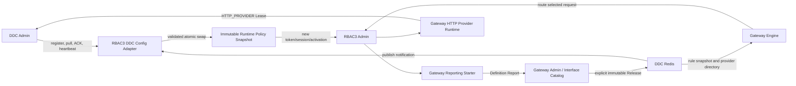

# RBAC3 接入 DDC 配置中心与 Gateway 文档/路由中心设计

> 状态：待用户审核
> 日期：2026-08-01
> 适用仓库：`/Users/mario/SelfProject/Egon-COLA`
> 适用模块：`egon-cola-platforms/egon-cola-platform-rbac3`
> 前置设计：`docs/superpowers/specs/2026-07-30-rbac3-permission-platform-design.md`

## 1. 文档目的

本文是既有 RBAC3 权限平台设计的增量 Spec，只补齐并固化以下四条平台集成链路：

1. DDC 负责 RBAC3 Admin 的服务注册与 Gateway 的服务发现；
2. DDC 负责 RBAC3 Admin 的动态配置拉取、订阅、应用、ACK、心跳和恢复；
3. Gateway 负责 RBAC3 HTTP 流量的规则发布、实例选择和请求路由；
4. Gateway Admin 现有接口目录作为 RBAC3 的文档中心，继续使用 Gateway 自带注解上报接口。

本文不重新设计 RBAC3 领域权限模型，不改变角色激活、角色继承、APP 内互斥、数据权限、字段权限、
会话 Fence、Outbox 或审计语义。前置设计中已经审核通过的业务规则继续有效；本文与前置设计冲突时，
仅本文明确列出的 DDC 配置中心和 Gateway 文档中心增量决策覆盖旧描述。

## 2. 当前实现审计结论

### 2.1 已完成能力

| 能力 | 当前状态 | 当前实现依据 |
|---|---|---|
| Gateway Definition 上报 | 已实现 | RBAC3 Admin 依赖 `egon-cola-platform-gateway-starter`，Controller 使用 Gateway 注解 |
| Gateway 文档目录 | 已实现基础能力 | Gateway Admin 已提供 Interface Catalog；RBAC3 当前 78 个 HTTP Mapping 均有 `@GatewayOperation` |
| DDC HTTP Provider 注册 | 已实现 | RBAC3 Admin 依赖 `egon-cola-platform-gateway-provider-runtime`，启用 `HTTP_PROVIDER` 租约 |
| Gateway 从 DDC 发现实例 | 已实现 | Gateway Engine 使用 DDC Provider Directory，不配置 RBAC3 静态实例地址 |
| Gateway Release 与路由状态 | 已实现 | Definition、Provider Lease、Release/Consistency 分开观察并计算 `ROUTABLE` |
| DDC 注册身份 v3 对齐 | 已实现 | Definition、Provider、Gateway 查询使用一致的 `bizCode + appCode` 业务身份 |

### 2.2 明确缺口

生产 `application.yml` 当前配置：

```yaml
egon:
  cola:
    component:
      ddc:
        enabled: false
        registry:
          enabled: true
```

`registry.enabled=true` 只建立服务注册客户端；`ddc.enabled=false` 会阻止 `DdcRuntimeCoordinator`
启动，因此当前没有以下配置中心闭环：

- `CONFIG_CLIENT` 租约；
- 注解默认值上报；
- 启动时全量配置拉取；
- Redis Topic 动态配置订阅；
- 配置版本和 Checksum 比较；
- 动态配置应用；
- 成功、失败或忽略 ACK；
- 配置租约心跳、丢失恢复和停机下线。

RBAC3 当前也没有 `@DdcValue` 声明或自定义 `DdcConfigApplier`，即使只把开关改成 `true`，
仍然没有真正影响 RBAC3 行为的动态配置。这种“只有客户端在线、没有配置消费者”的形式接入不满足本文目标。

## 3. 强制决策

| 编号 | 决策 |
|---|---|
| IG-01 | Gateway 文档中心复用现有 Gateway Admin Interface Catalog，不引入 Swagger、Springdoc 或第二套文档存储 |
| IG-02 | RBAC3 Controller 继续使用 `@EgonHttpService`、`@GatewayInterfaceGroup`、`@GatewayOperation` 和必要的 `@GatewaySchemaField` |
| IG-03 | 生产环境必须同时启用 DDC 配置客户端和 DDC 服务注册客户端；两者是不同租约和不同状态 |
| IG-04 | DDC v3 配置物理作用域固定为 `bizCode + env + appCode + configKey`，配置作用域不再使用 `namespace` |
| IG-05 | DDC 服务注册与 Gateway Definition/Provider 身份继续包含部署 `namespace`；配置作用域与服务作用域不得混写 |
| IG-06 | 动态配置通过 RBAC3 自有类型化 Runtime Policy 暴露给业务代码，业务代码不得直接依赖 DDC 类 |
| IG-07 | `@DdcValue` 用于配置声明和默认值上报；远程变更由精确 Key 的自定义 Applier 校验后原子替换不可变策略快照 |
| IG-08 | 不直接把 `@DdcValue` 加到现有 `Rbac3AdminProperties` 字段；反射写字段会绕过 setter 校验，且现有消费者会在启动时复制旧值 |
| IG-09 | 每个单 Key、单版本配置更新必须全部成功或完全不生效；DDC 当前不是多 Key 事务，跨 Key 修改需按始终合法的顺序发布 |
| IG-10 | 非法配置返回失败 ACK，并保留最后一次合法快照、当前版本和 Checksum；不得回退到未经验证的字符串值 |
| IG-11 | 动态 Token/Session 配置只影响更新后创建的新 Token 或新 Session，不追溯修改已签发 Token 或已持久化过期时间 |
| IG-12 | `maximum-active-roots` 在每次激活命令解析出规范顶级角色后生效；不得按请求中的原始角色 ID 数量判断 |
| IG-13 | DDC Admin 地址、HMAC、Redis 拓扑、数据库凭据、JWT 密钥、服务身份和监听地址属于启动配置或 Secret，不允许由 DDC 自身动态下发 |
| IG-14 | 生产启动时 DDC 配置客户端必须 Fail Fast；配置未达到 `READY` 时不得把 RBAC3 Provider 发布为可路由实例 |
| IG-15 | Definition 接收、CONFIG_CLIENT、HTTP_PROVIDER Lease、Gateway Release 和 Routed Request 是五个独立事实，任一成功不能推导其他事实成功 |
| IG-16 | RBAC3 不自动创建或发布 Gateway Release；路由和安全策略仍由 Gateway Admin 显式治理 |
| IG-17 | 本增量不新增数据库表，不修改既有 Flyway；实现不应产生新的数据库迁移文件 |
| IG-18 | 测试继续放在各所属模块的 `src/test`，不恢复或新增 RBAC3 独立 Test 模块 |

## 4. 方案选择

### 4.1 未选择：只开启 DDC 配置客户端

只把 `egon.cola.component.ddc.enabled` 改为 `true` 能建立配置客户端租约，但 RBAC3 没有配置声明和
行为消费者。它只能证明 DDC 连接存在，不能证明配置中心影响了 RBAC3 运行行为，因此不采用。

### 4.2 未选择：直接注解现有 Properties

直接给 `Rbac3AdminProperties` 字段增加 `@DdcValue` 虽然代码少，但存在三个问题：

1. DDC 的通用字段 Binding 通过反射写字段，不调用 setter，现有边界校验会被绕过；
2. `JwtTokenService`、`SessionFacade` 等对象构造时复制 Duration，后续字段刷新不会改变其行为；
3. 多个配置字段之间存在关系约束，逐字段反射写入可能产生不合法的中间状态。

因此不采用。

### 4.3 选择：类型化 Policy + DDC Adapter + 不可变 Snapshot

RBAC3 定义稳定的应用端口 `Rbac3RuntimePolicy`。生产与本地代码都只读取它的不可变 Snapshot；
DDC Adapter 负责把字符串配置转换、校验并更新 Snapshot。该方案使用 Ports and Adapters、
Immutable Snapshot 和 Policy/Strategy 三个已有项目风格中的设计手法，隔离 DDC 基础设施并保证配置应用可测试。

## 5. 总体架构



## 6. 身份与作用域

### 6.1 DDC 配置作用域

DDC v3 配置作用域必须使用：

```text
bizCode + env + appCode + configKey
```

RBAC3 固定约定：

| 字段 | 值或来源 |
|---|---|
| `bizCode` | `${DDC_BIZ_CODE:rbac3}` |
| `env` | `${DEPLOYMENT_ENV}` |
| `appCode` | `rbac3-admin` |
| `configKey` | 第 8 节定义的五个 Key |
| `instanceId` | `${RBAC3_INSTANCE_ID}`，用于 CONFIG_CLIENT 租约，不属于配置资源主键 |

`namespace` 不参与 DDC v3 配置物理作用域。兼容 DTO 中即使仍有 deprecated `namespace` 字段，RBAC3
也不得用它构造配置 Pull、Publish、Checksum、Redis Topic 或管理 API 路径。

### 6.2 DDC 服务注册与 Gateway 身份

服务身份继续使用 Gateway/DDC Provider 契约：

```text
bizCode + appCode + env + namespace
+ serviceKind + protocol + serviceName + group + version
```

RBAC3 Provider 固定语义：

| 字段 | 值或来源 |
|---|---|
| `serviceKind` | `HTTP_PROVIDER` |
| `protocol` | `http`；外层 TLS 终止策略由部署定义时可使用 `https` |
| `serviceName` | `rbac3-admin` |
| `group` | `default` |
| `version` | `${RBAC3_ARTIFACT_VERSION}` |
| `env` | `${DEPLOYMENT_ENV}` |
| `namespace` | `${DEPLOYMENT_NAMESPACE}` |
| `instanceId` | `${RBAC3_INSTANCE_ID}` |
| `host` / `port` | `${RBAC3_ADVERTISED_HOST}` / `${RBAC3_ADVERTISED_PORT}` |

配置客户端与 Provider 可以复用同一进程实例 ID，但 Lease ID、租约角色、心跳和状态必须独立。

## 7. 生产配置契约

生产 `application.yml` 的目标配置语义如下：

```yaml
egon:
  cola:
    component:
      ddc:
        enabled: true
        biz-code: ${DDC_BIZ_CODE:rbac3}
        app-code: rbac3-admin
        env: ${DEPLOYMENT_ENV}
        namespace: ${DEPLOYMENT_NAMESPACE}
        instance:
          id: ${RBAC3_INSTANCE_ID}
          lease-seconds: 30
          heartbeat-interval-seconds: 10
        consistency:
          fail-fast: true
          reconcile-enabled: true
          reconcile-interval-seconds: 30
        admin:
          endpoint: ${DDC_ADMIN_ENDPOINT}
          signature-enabled: true
          access-key: ${DDC_REPORT_ACCESS_KEY}
          secret-key: ${DDC_REPORT_SECRET_KEY}
        redis:
          enabled: true
        registry:
          enabled: true
```

Redis 的 mode、nodes、master-name、host、port、password 和 database 继续复用现有显式配置。不得加入
`localhost` 生产回退值。DDC 配置客户端和服务注册客户端允许由现有 Starter 建立各自命名的
Redisson Client；RBAC3 不自行复制 DDC Redis Key、Topic 或 HMAC 实现。

本地 Profile 保持 DDC 配置客户端和 Provider 默认关闭，避免普通单元测试或开发启动意外连接共享
DDC；专用集成测试 Profile 必须显式开启并提供隔离的配置。

## 8. 动态配置目录

### 8.1 Key、默认值与边界

自审时以现有 `JwtTokenService` 和 `SessionFacade` 的安全边界为准，保留当前默认值与合法区间，
不因接入配置中心扩大 Token 或 Session 有效期。配置目录如下：

| Config Key | 类型 | 默认值 | 合法区间 | 应用时点 |
|---|---|---:|---|---|
| `rbac3.access-token-ttl-seconds` | Integer | 900 | 300～1800 秒 | 下一次签发 Access Token |
| `rbac3.refresh-token-ttl-seconds` | Long | 604800 | 86400～2592000 秒 | 下一次创建 Session/Token Family |
| `rbac3.session-idle-timeout-seconds` | Integer | 1800 | 300～28800 秒 | 下一次创建 Session |
| `rbac3.session-absolute-timeout-seconds` | Integer | 43200 | 3600～86400 秒 | 下一次创建 Session |
| `rbac3.maximum-active-roots` | Integer | 16 | 1～32 | 下一次替换激活角色集合 |

关系约束：

```text
session-idle-timeout-seconds <= session-absolute-timeout-seconds
refresh-token-ttl-seconds >= session-absolute-timeout-seconds
```

DDC 当前按单 Key 发布，不提供多 Key 原子事务。需要同时改变关联 Key 时，运维必须选择每一步都满足
关系约束的发布顺序。例如扩大 Idle 与 Absolute 时先扩大 Absolute；缩小时先缩小 Idle。

### 8.2 明确不进入 DDC 的配置

以下内容不得成为动态配置：

- DDC Admin Endpoint、HMAC Access Key/Secret Key；
- DDC Redis、RBAC3 Runtime Redis、Gateway Redis 的拓扑和凭据；
- PostgreSQL URL、用户名和密码；
- JWT 私钥、公钥、KID、Issuer、Audience；
- Gateway Admin 地址、Definition HMAC 和状态读取 OAuth Token；
- `bizCode`、`appCode`、`env`、`namespace`、实例 ID、注册地址、端口和制品版本；
- 租户隔离、禁止自我提权、APP 互斥、Fail Closed、Refresh Replay 撤销等安全不变量；
- `componentKeys` 和平台 Target Tenant 开关等改变信任边界的配置。

这些值是连接 DDC 之前就必须成立的 Bootstrap 或安全根，放入 DDC 会形成引导循环或允许动态改变
服务身份和安全边界。

## 9. Runtime Policy 契约

### 9.1 应用端口

应用层新增一个与 DDC 无关的端口，语义等价于：

```java
public interface Rbac3RuntimePolicy {

    Snapshot current();

    record Snapshot(
            Duration accessTokenTtl,
            Duration refreshTokenTtl,
            Duration sessionIdleTimeout,
            Duration sessionAbsoluteTimeout,
            int maximumActiveRoots,
            Map<String, Long> configVersions
    ) {
    }
}
```

要求：

- `current()` 始终返回一个完整、合法、不可变 Snapshot；
- `configVersions` 保存每个动态 Key 的本地已应用版本，Map 不可修改；
- Snapshot 创建时统一执行类型、范围和关系校验；
- 读路径无锁，使用 `AtomicReference<Snapshot>`；
- 写路径串行比较并构造 Candidate Snapshot，校验通过后只执行一次 CAS/原子替换；
- 不向业务层暴露 DDC 字符串值、Lease、ACK 或 Repository。

### 9.2 默认策略

`AtomicRbac3RuntimePolicy` 在所有 Profile 中都存在。初始值来自现有 `Rbac3AdminProperties`，从而满足：

- DDC 关闭的本地/单元测试仍能运行；
- DDC 首次 Pull 前有与当前行为一致的安全默认值；
- 生产 DDC Pull 成功后只通过同一个 Policy Bean 原子切换；
- 不创建“静态 Policy”和“DDC Policy”两个可能同时注入的实现。

### 9.3 DDC 声明与 Applier

DDC 集成 Bean 使用五个 `@DdcValue` 声明配置 Key、默认值和类型，并设置
`refreshable=false`。该注解 Binding 的职责仅是：

1. 让 `DdcRuntimeCoordinator` 在启动时上报默认值和类型；
2. 把配置 Key 注册到 DDC 本地配置目录；
3. 明确配置目录属于 RBAC3，而不是散落在业务类中。

五个 Key 还必须在 `DdcConfigApplierRegistry` 注册 exact Applier。Exact Applier 优先于默认的反射字段
Applier，负责把远程字符串转换为目标数值、读取当前 Snapshot、构造 Candidate、完整校验并原子替换。

注册必须发生在 `DefaultDdcConfigApplierRegistry.freeze()` 之前；重复 Key 注册必须在启动时失败，不能静默覆盖。

### 9.4 应用算法

DDC Starter 已负责版本、Checksum、每 Key 锁和 ACK。RBAC3 Applier 只实现领域校验和 Snapshot 替换：

```text
输入 key, rawValue, targetVersion
→ 校验 key 属于五个白名单之一
→ 严格解析目标数值；拒绝空串、溢出、小数和附加字符
→ 读取 current Snapshot
→ 只替换 Candidate 中对应字段和该 Key 的版本
→ 执行全部范围与关系约束
→ 原子发布 Candidate Snapshot
→ 返回成功，由 DDC Starter 写入本地版本/Checksum 并提交 SUCCESS ACK
```

任一步异常：

```text
不更新 Snapshot
→ DDC Starter 恢复本地版本/Checksum Metadata
→ 提交 FAILED ACK，currentVersion 保持旧版本
```

同版本同 Checksum、低版本和同版本不同 Checksum 的处理继续由 DDC Starter 现有算法负责；RBAC3 不重复实现。

全量 Pull 必须通过 `DdcConfigApplier.priority()` 使用固定应用顺序，避免进程重启后直接从默认 Snapshot
应用最终远程值时触发不必要的中间关系冲突：

| Key | Priority | 理由 |
|---|---:|---|
| `rbac3.access-token-ttl-seconds` | 0 | 无跨字段依赖 |
| `rbac3.maximum-active-roots` | 0 | 无跨字段依赖 |
| `rbac3.refresh-token-ttl-seconds` | 10 | 先建立不小于任何合法 Absolute 的 Refresh 上界 |
| `rbac3.session-absolute-timeout-seconds` | 20 | 先把 Absolute 调整到最终值，再应用 Idle |
| `rbac3.session-idle-timeout-seconds` | 30 | 最后验证 Idle 不超过最终 Absolute |

上述顺序保证从本文默认值加载任意一组整体合法的远程最终值时可以完成全量 Pull。运行期跨 Key 修改仍不是
事务，必须遵守第 8.1 节的安全发布顺序；Priority 不能被解释为多 Key 原子性。

## 10. 动态配置消费语义

### 10.1 Access Token

`JwtTokenService` 不再在构造时永久保存一个 Duration，而是在每次 `issue()` 开始时读取一次 Policy Snapshot。
同一次签发只使用这一次读取的值，配置在签名过程中变化也不能产生混合结果。

配置更新只改变新 Token 的 `exp`。已签发 JWT 的 `exp` 不修改、不撤销，也不延长；权限变化仍通过
Session/User/Tenant 版本和在线投影拒绝旧权限。

### 10.2 Session 与 Refresh Token

`SessionFacade.create()` 在事务开始前读取一次 Snapshot，并用同一快照计算：

- `idleExpiresAt`；
- `absoluteExpiresAt`；
- 首枚 Refresh Token 的 `expiresAt`。

已存在 Session 的数据库期限不因动态配置更新而改变。Refresh Token 后续轮换继续受 Token Family 和
已持久化的 Session/Refresh 生命周期约束，不允许一次配置更新追溯延长旧 Family。

### 10.3 最大激活根角色数

`maximumActiveRoots` 必须在 `RoleActivationResolver` 完成以下动作后检查：

1. 验证用户请求角色来自有效任职；
2. 把请求角色规范化为每个 APP 的唯一顶级根；
3. 完成 APP 内 DSD/激活互斥校验；
4. 生成 `ActiveRoleSet.rootIds()`。

检查对象是所有 APP 的规范根角色去重总数：

```text
resolution.activeRoleSet().rootIds().size()
```

超过当前 Snapshot 限制时拒绝整个激活事务，返回新增错误码
`ACTIVE_ROLE_ROOT_LIMIT_EXCEEDED`，HTTP 422，并包含实际数量和允许上限；不得写 Session、Fence、Snapshot、
Outbox 或审计成功记录。减少上限不主动撤销当前已激活会话，但该会话下一次 Replace 必须满足新上限。

## 11. DDC 配置客户端生命周期

生产启动遵循现有 `DdcRuntimeCoordinator`：

```text
Redis subscription active
→ CONFIG_CLIENT register and obtain leaseId
→ report five defaults
→ pull full snapshots for bizCode + env + appCode
→ apply each newer Key by priority and Key order
→ READY
→ heartbeat and periodic reconciliation
→ lease loss: register a new lease, report defaults, pull and apply again
→ shutdown: best-effort offline and close subscription
```

约束：

- `consistency.fail-fast=true`；首次注册、默认上报、Pull 或应用失败必须导致生产启动失败；
- Redis 订阅未激活时不得进入 `READY`；
- 配置租约丢失后的恢复必须重新执行完整初始化，不能只重建心跳；
- ACK 异步重试由 DDC Starter 负责，RBAC3 不建立第二个 ACK 队列；
- 定期 Reconcile 必须开启，用于修复 Redis 通知丢失；
- 日志和指标不能输出配置原始值。

## 12. Provider 发布顺序与 Readiness

现有 Gateway HTTP Provider Runtime 在 `WebServerInitializedEvent` 后即可注册 Provider。接入 DDC 配置中心后，
生产必须增加 RBAC3 专用启动 Gate，避免服务在配置 Pull 完成前被 Gateway 发现。

### 12.1 启动 Gate

RBAC3 提供名为 `gatewayHttpProviderServerReadyListener` 的专用 Listener Bean，使 Gateway Provider Runtime
默认 Listener 通过 `@ConditionalOnMissingBean(name=...)` 退让。该 Gate：

1. 在 Web Server 初始化时只记录最终监听端口；
2. 等到 Spring `ApplicationReadyEvent`；
3. 要求 `DdcRuntimeCoordinator.state() == READY`；
4. 要求最终端口与显式 Provider 配置一致；
5. 才调用 `HttpProviderLeaseRuntime.onHttpServerReady(port)` 注册 `HTTP_PROVIDER`。

生产 DDC 为 Fail Fast，因此 DDC 不能 READY 时不会产生 Application Ready，也不会发布 Provider Lease。
本地 Profile 同时关闭 DDC 和 Provider，不进入该 Gate。

### 12.2 Readiness 状态

RBAC3 Readiness 在现有检查上增加独立的 `ddcConfigClient` 检查，状态来源为：

```text
DdcRuntimeCoordinator.state()
+ current CONFIG_CLIENT session/lease expiry
```

生产 Ready 的必要条件至少包括：

- RBAC3/Outbox Flyway 完成；
- JPA、Runtime Redis、Outbox 和 Fence 可用；
- DDC Config Client 为 `READY` 且当前租约存在；
- Gateway Definition 已接收；
- DDC HTTP Provider 已注册；
- Gateway Release/Consistency 满足现有路由检查。

控制面状态 API 必须分别返回 Config Client、Definition、Provider Lease 和 Gateway Release 状态；不得合并成
一个模糊的 `integrationUp=true`。

## 13. Gateway 文档中心

### 13.1 注解职责

| 注解 | 使用位置 | 唯一职责 |
|---|---|---|
| `@EgonHttpService` | Controller 类 | `serviceName/group/version/basePath/weight` Provider 服务身份 |
| `@GatewayInterfaceGroup` | Controller 类 | 业务域、实体域、接口组编码、名称和描述 |
| `@GatewayOperation` | HTTP Handler 方法 | Operation 名称、摘要、描述、Owner、Tag、外部可访问声明和 Schema 补充 |
| `@GatewaySchemaField` | `@GatewayOperation` 内 | 仅补充 Java 反射无法准确表达的请求/响应字段业务语义 |

Spring MVC `@RequestMapping` 系列注解继续负责机械事实：HTTP Method、Path、Consumes、Produces 和参数。
Gateway 注解不得重复定义机械路由，也不新增 RBAC3 私有的文档注解。

### 13.2 RBAC3 目录规则

当前 78 个 HTTP Mapping 必须全部满足：

- 所属 Controller 同时具有 `@RestController`、`@EgonHttpService` 和 `@GatewayInterfaceGroup`；
- Handler 具有 `@GatewayOperation`；
- `GatewayOperation.name` 非空、全局唯一、稳定并包含 `rbac3` 与版本语义；
- `summary` 非空；复杂接口补充 `description`，但不重复 summary；
- `externalAccessible` 必须显式表达是否允许通过 Public Gateway 暴露；
- `tags` 至少包含 `rbac3` 和一个能力域标签；
- 请求/响应 Schema 能从 Java 类型推断；敏感或歧义字段用 `@GatewaySchemaField` 补充说明；
- 文档不得展示 Refresh Token、密码、Step-up Credential、私钥、Secret、Hash 或内部 Snapshot 原文；
- 新增 Mapping 未添加 Gateway 注解时，测试必须失败。

Operation 数量不得长期硬编码为 78，因为后续合法新增接口会改变数量；测试应比较“Spring 实际 Mapping 集合”与
“Gateway Contributor 发现集合”完全相等，并额外记录当前基线数量帮助定位遗漏。

### 13.3 Definition Report

Gateway Starter 继续在启动时构建完整 Definition Set 并通过 HMAC 上报 Gateway Admin。Definition 至少包含：

- `bizCode + applicationCode + env + namespace`；
- 制品版本、Build ID、声明 Host；
- 业务域、实体域、接口组；
- Operation、Method、Path、参数；
- Request/Response Schema、摘要、描述、Tag 和外部可访问属性；
- Provider `serviceName/group/version/protocol`。

上报成功只表示文档中心已经接收 Definition，不表示已经有 Provider 或 Release。

## 14. Gateway 路由闭环

路由闭环保持现有治理模型：

```text
Gateway Admin 接收 RBAC3 Definition
→ 运维/管理员配置 Route、Authentication、Authorization、Rate Limit 和 Upstream
→ Gateway Admin 编译并显式发布不可变 Release 到 DDC
→ Gateway Engine 订阅并原子激活 Release
→ Gateway Engine 按 Release 的 Provider Service Key 查询 DDC
→ 过滤过期、下线或健康检查失败的 HTTP_PROVIDER
→ 按负载均衡策略选择实例
→ 转发原始 Bearer 和受控 Trace/Identity Header
→ RBAC3 Admin 再执行自身 Security 与权限校验
```

禁止：

- RBAC3 上报 Definition 后自动发布 Gateway Release；
- Gateway 使用静态 RBAC3 URL 作为 DDC 不可用时的旁路；
- 只要 DDC 有实例就绕过 Route/Security Release；
- Gateway 伪造或信任客户端提交的 RBAC3 租户、用户、Session、角色 Header；
- Gateway Adapter 在热路径同步调用 RBAC3 Admin 或 PostgreSQL。

## 15. 五事实状态模型

| 事实 | 证明内容 | 不能证明 |
|---|---|---|
| DDC Config Client READY | 本实例完成配置注册、Pull、应用并持有配置租约 | Provider 已注册、接口已上报、流量可路由 |
| Gateway Definition ACCEPTED | 文档中心接收本制品接口定义 | DDC 存在实例、Release 已发布 |
| DDC HTTP_PROVIDER REGISTERED | DDC 当前存在本实例有效 Provider Lease | 接口已获准对外暴露 |
| Gateway Release SUCCESS/CONSISTENT | 特定 Definition 与规则已发布并被 Engine 观察 | 当前一定存在健康 Provider |
| Routed Request SUCCESS | 在观察时刻完整链路成功选择实例并返回 | 长期可用性或多节点容灾已经证明 |

Readiness 和运维 API 必须保留五个事实的原始状态、标识和错误码，再计算汇总可路由状态。禁止把进程存活、
Definition 成功或任一租约成功映射为整体 `ROUTABLE`。

## 16. 错误处理与恢复

### 16.1 DDC 首次启动失败

- Admin Endpoint 缺失、HMAC 不合法、Redis 订阅失败、Register/Pull/Apply 失败：生产启动失败；
- 不创建 HTTP Provider Lease；
- 不对外声称 Ready；
- 已接收的 Gateway Definition 可以保留在文档中心，但不能据此路由。

### 16.2 动态配置非法

- Exact Applier 抛出只包含 Key 和规则的异常；
- DDC 返回 FAILED ACK，currentVersion 保持旧值；
- Runtime Policy Snapshot 不变化；
- Readiness 不因一次非法新版本立即关闭，继续使用最后一次合法配置；
- 指标增加 Apply Failure，日志不输出 rawValue。

### 16.3 DDC 通知丢失或短时中断

- 当前合法 Snapshot 继续使用；
- 周期 Reconcile 拉取补齐新版本；
- CONFIG_CLIENT Lease 丢失时重新 Register、Defaults、Pull、Apply；
- HTTP_PROVIDER Lease 使用 Gateway Provider Runtime 自身恢复状态机；
- 两种恢复不能互相替代。

### 16.4 Gateway 或 Provider 故障

- Definition 上报失败：按 Gateway Starter 状态文件和重试语义处理，不发布新 Definition；
- Gateway Release 不一致：汇总状态为 `NOT_ROUTABLE`；
- Provider Lease 过期：Gateway Engine 从目录移除实例；
- DDC/Gateway 恢复后，按 Config、Definition、Provider、Release、Route 的独立证据重新确认。

## 17. 安全边界

1. DDC 与 Gateway 所有生产远程写操作继续使用各自独立 HMAC 凭据；凭据不可复用；
2. Gateway 状态只读使用独立 OAuth Token File，不能复用 Definition HMAC；
3. DDC 配置内容不得包含 Token、密码、私钥、HMAC Secret、Redis/PostgreSQL 凭据或用户数据；
4. DDC Apply 错误和审计记录只写 Key、Version、Checksum、Status 和规则错误，不写原值；
5. Gateway 文档 Schema 不输出敏感字段值，也不能将敏感请求样例持久化到目录；
6. 文档中心不是授权源；`externalAccessible=true` 仍必须由 Gateway Release 和 RBAC3 Security 双重控制；
7. 配置中心不能关闭租户隔离、自我提权防护、APP 互斥、Fail Closed 或 Refresh Replay 撤销；
8. DDC 或 Gateway 不可用时不得回退到静态直连、匿名接口或放行策略。

## 18. 观测与运维

### 18.1 状态字段

RBAC3 Runtime Status 在现有返回值上增加 DDC 配置客户端信息，至少包括：

- `state`：`NEW/STARTING/READY/RECOVERING/FAILED/STOPPING/STOPPED`；
- `instanceId`；
- `leaseId` 的脱敏标识或 Hash，不返回完整租约凭据；
- `leaseExpireAt`；
- 五个 Key 的当前版本；
- `lastApplyFailureKey`、`lastApplyFailureVersion` 和非敏感错误码；
- `lastReconcileAt`（如现有 DDC Starter 暂无公开时间，则以指标代替，不复制调度器）。

### 18.2 指标

优先复用 DDC/Gateway 现有指标；RBAC3 新增指标必须低基数：

```text
rbac3_ddc_config_apply_total{key,status}
rbac3_ddc_config_snapshot_version{key}
rbac3_ddc_config_ready
rbac3_gateway_definition_operation_count
```

`key` 只能取五个固定白名单值，不能使用用户输入、租户、实例 ID、Change ID 或异常文本作为 Tag。

### 18.3 运维文档

RBAC3 README 和 Operations Runbook 必须补充：

- DDC 配置作用域与服务注册作用域的区别；
- 五个配置 Key、默认值、范围、关系和生效时点；
- 配置变更的安全发布顺序；
- Config Client、Definition、Provider、Release、Routed Request 五事实检查清单；
- 真实本机 DDC/Gateway 联调环境变量和证据模板；
- Maven/单元测试不能冒充真实多进程拓扑证明。

## 19. 设计模式说明

### 19.1 Ports and Adapters

应用代码依赖 `Rbac3RuntimePolicy`，DDC 只作为基础设施 Adapter。这样本地测试可使用固定 Snapshot，DDC
协议升级也不会污染 JWT、Session 或角色激活领域代码。

### 19.2 Immutable Snapshot

五个相关配置使用一个不可变 Snapshot 原子替换，读路径无锁，避免逐字段可见性和跨字段中间状态。直接使用
五个 `volatile` 字段不足以保证多个字段构成同一逻辑版本，因此不采用。

### 19.3 Policy/Strategy

Token、Session 和 Activation 只读取统一 Policy，不在各服务中复制 DDC Key 或边界判断。变化点是运行策略值，
不是不同算法族，因此不引入多套 Strategy 实现或工厂。

### 19.4 Adapter

DDC Exact Applier 把字符串 Key/Value/Version 转换为类型化 Snapshot 更新；Gateway 注解 Contributor 把 Spring
MVC Mapping 转换为 Gateway Interface Definition。两者均复用现有 Adapter 边界，不建立 RBAC3 私有协议。

### 19.5 明确不使用的模式

- 不用 Observer 自建配置事件总线：DDC Starter 已提供 Redis 订阅、Reconcile 和 ACK；
- 不用 State 模式复制 DDC/Gateway 生命周期：直接读取其权威 Runtime State；
- 不用 Chain of Responsibility 处理五个固定 Key：精确 Key Applier 更直观；
- 不用 Factory/Builder 包装简单 Snapshot；构造器校验和候选复制已足够。

## 20. 测试设计

### 20.1 DDC 配置单元测试

必须覆盖：

- 默认 Snapshot 与现有静态默认值一致；
- 五个 Key 的最小值、最大值和正常值可应用；
- 小于/大于边界、空值、非数字、溢出和小数被拒绝；
- Idle 大于 Absolute 被拒绝；
- Refresh 小于 Absolute 被拒绝；
- 失败后 Snapshot、版本和 Checksum 保持旧值；
- 单 Key 更新发布完整不可变 Snapshot；
- 并发读取只观察旧或新 Snapshot，不能观察混合字段；
- 重复注册 Exact Applier 启动失败；
- 注解声明包含五个正确 Key、默认值、类型和 `refreshable=false`。

### 20.2 动态行为测试

使用真实业务类而不是只断言 Mock 调用：

- 更新 Access TTL 后，新 Token `exp-iat` 使用新值，旧 Token Claim 不变；
- 更新 Session TTL 后，新 Session 使用新期限，已有 Session 记录不变；
- 更新 Maximum Roots 后，规范根数量等于上限成功，超过上限返回 422；
- 超限拒绝不写 Session、Fence、Runtime Snapshot 或成功 Outbox；
- DSD/APP 互斥仍先按原算法拒绝，不被数量限制掩盖。

### 20.3 Spring 配置测试

- 生产属性下存在 `DdcRuntimeCoordinator`、`DdcServiceRegistryClient`、`HttpProviderLeaseRuntime` 和
  `Rbac3RuntimePolicy`；
- `ddc.enabled=true` 与 `registry.enabled=true` 都被绑定；
- DDC 物理配置作用域是 `bizCode + env + appCode`；
- Provider 身份仍包含 namespace；
- DDC 未 READY 时专用 Gate 不注册 Provider；
- Application Ready 且 DDC READY 后只注册一次 Provider；
- 本地 Profile 不创建远程 DDC/Provider 生命周期；
- 生产 YAML 没有 localhost 或匿名凭据回退。

### 20.4 Gateway 文档中心测试

- Spring 实际 78 个 Mapping 与 Gateway Contributor 发现集合完全相等；
- 每个 Controller 注解完整；
- 每个 Operation 名唯一、summary 非空、Tag 合法；
- Method、Path、参数和 Schema 与 Mapping/Java 类型一致；
- 敏感字段不出现在示例或可展示字段中；
- 构建出的完整 Definition Report 被 Gateway Admin 接收；
- Definition 接收不自动创建 Release。

### 20.5 Gateway/DDC 集成测试

模块内测试必须覆盖：

- Config Client Register → Defaults → Pull → Apply → READY → Heartbeat → Offline；
- Publish Notification → Apply → SUCCESS ACK；
- Invalid Publish → FAILED ACK → LKG Snapshot；
- Provider Register → Gateway DDC Query → Healthy Instance Projection；
- Definition + Provider + Release 匹配时 `ROUTABLE`；
- 任一身份、版本、Definition Set 或 Release 不匹配时 `NOT_ROUTABLE`；
- DDC 恢复后 Config 与 Provider 各自重新建立租约。

真实多进程 DDC/Gateway/PostgreSQL/Redis 拓扑仍需专用本机联调证据。普通 Maven 组件测试只能证明源码和
进程内契约，不能声明真实部署已经打通。

## 21. 验收标准

### AC-IG-01 DDC 配置客户端

生产配置显式启用 DDC；启动证据显示 `CONFIG_CLIENT` 完成 Register、Defaults、Pull、Apply 并进入 READY。

### AC-IG-02 动态配置生效

在 DDC 发布五个白名单 Key 之一后，新 Token、Session 或激活命令使用新配置，并提交 SUCCESS ACK。

### AC-IG-03 非法配置 Fail Safe

发布非法值返回 FAILED ACK，RBAC3 保持上一合法 Snapshot，业务请求不读取非法值。

### AC-IG-04 独立服务租约

同一进程同时存在 `CONFIG_CLIENT` 和 `HTTP_PROVIDER` 两个独立 Lease；停止或恢复其中一个不会伪造另一个状态。

### AC-IG-05 Provider 发布顺序

DDC 配置未 READY 时 Gateway 查询不到 RBAC3 可路由 Provider；配置 READY 且应用启动完成后才注册 Provider。

### AC-IG-06 Gateway 文档中心

Gateway Admin Interface Catalog 可查看 RBAC3 全部 Spring HTTP Mapping、Method、Path、摘要、参数和请求/响应
Schema；不存在未上报 Mapping。

### AC-IG-07 显式 Release

Definition 上报后不会自动路由；只有 Gateway Admin 显式发布成功 Release 且 Engine 观察一致版本后才允许路由。

### AC-IG-08 DDC 服务发现

Gateway Engine 只从 DDC 有效 `HTTP_PROVIDER` Lease 中选择 RBAC3 实例；租约过期或实例不健康时停止选择。

### AC-IG-09 安全配置边界

DDC 中不存在数据库、Redis、JWT、HMAC、OAuth 或服务监听凭据；日志和状态 API 不泄漏这些值。

### AC-IG-10 回归

RBAC3 Admin、Gateway Starter、Gateway Provider Runtime、Gateway Engine 和 DDC Starter 的相关单元/集成测试
通过；前置 RBAC3 角色激活、授权、会话和 Gateway Adapter 行为不回归。

## 22. 兼容性、迁移与发布

- 不新增或修改数据库 Schema，因此没有 Flyway 迁移；
- Gateway Definition 是完整版本化上报，现有 Operation Name 不改名；
- DDC 五个 Key 首次不存在时使用当前安全默认值并上报默认目录；
- 动态配置接入不改变现有 HTTP API 请求/响应结构，除新增运行状态字段和激活上限错误码；
- 新状态字段必须保持向后兼容，只做响应字段增加；
- Gateway Release 不由代码自动迁移，部署时由运维审核 Definition Diff 后显式发布；
- 上线顺序为 DDC Admin/Redis → Gateway Admin → Gateway Engine → RBAC3 Admin → Gateway Release；
- 回滚 RBAC3 制品前必须确保旧制品识别当前五个 Key；本次所有 Key 为新增，不影响旧制品读取，但旧制品不会动态应用。

## 23. 实施范围边界

审核通过后的实施允许修改：

- RBAC3 Admin 的配置、应用端口、DDC Adapter、启动 Gate、Readiness、Token/Session/Activation 消费点；
- RBAC3 Controller 的 Gateway 注解完整性和必要字段描述；
- RBAC3 模块内单元/集成测试；
- RBAC3 README、Operations Runbook、Architecture 和验证脚本；
- 为兼容新增错误码而修改 RBAC3 Contract。

除非实施时发现现有公共契约存在阻断性缺陷，不修改：

- DDC Admin/Starter 的协议、数据库和 Redis Key；
- Gateway Admin/Engine/Starter/Provider Runtime 的公共协议和数据库；
- RBAC3 数据库表和既有 Flyway；
- 根 POM、版本号、发布流程或无关模块；
- RBAC3 领域权限算法、轮岗边界和无审批语义。

若现有 DDC/Gateway 公共组件存在阻断性缺陷，必须先以失败测试证明缺陷，再单独记录最小公共组件修复，
不得在 RBAC3 内复制或旁路公共协议。

## 24. 审核检查表

- [ ] 同意 Gateway Interface Catalog 就是本项目的文档中心，不引入 Swagger/Springdoc；
- [ ] 同意 DDC 配置作用域使用 `bizCode + env + appCode + configKey`；
- [ ] 同意 CONFIG_CLIENT 与 HTTP_PROVIDER 使用独立 Lease 和状态；
- [ ] 同意五个动态配置 Key、默认值、边界和生效时点；
- [ ] 同意类型化 Policy + DDC Exact Applier + Immutable Snapshot；
- [ ] 同意配置未 READY 前不注册可路由 Provider；
- [ ] 同意 Gateway Release 继续显式发布，不由 RBAC3 自动创建；
- [ ] 同意不新增数据库迁移、不新增独立 Test 模块；
- [ ] 同意真实外部拓扑需单独验证，不能用 Maven 测试替代。
