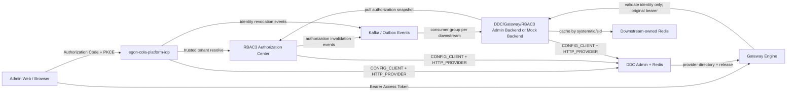

# Egon-COLA 统一身份平台需求与技术设计

> 状态：已批准，进入实施（2026-08-02）
> 设计日期：2026-08-01
> 适用仓库：`/Users/mario/SelfProject/Egon-COLA`
> 新平台模块：`egon-cola-platforms/egon-cola-platform-idp`
> 关联平台：`egon-cola-platform-rbac3`、`egon-cola-platform-gateway`、`egon-cola-platform-dynamic-config-center`
> 原始需求参考：`/Users/mario/SelfProject/blog/internal-unified-identity-platform-spec.md`

## 1. 文档目的

本文定义 Egon-COLA 内部统一身份平台的完整产品需求和技术方案。目标是在当前开发阶段直接完成一次身份体系切换：新增独立的 IdP（Identity Provider），由它统一承担人员身份、登录、单点登录、OAuth 2.1 授权和 Token 生命周期；RBAC3 收敛为多租户授权中心；Gateway 只做身份基础校验；每个下游系统自行解析、校验 Access Token，并从 RBAC3 拉取和缓存自己的授权快照；DDC 继续提供动态配置、服务注册和 Gateway 路由发现能力。

本文既是需求验收基线，也是后续实施计划的唯一架构输入。本文不要求兼容当前开发环境中的 RBAC3 登录态，不设计生产环境双栈迁移和零停机切换。

## 2. 背景与当前实现结论

### 2.1 当前能力

当前仓库已具备以下可复用能力：

| 平台 | 已有能力 | 本次复用方式 |
|---|---|---|
| RBAC3 | 用户、密码凭据、登录、JWT、Refresh Token、会话角色激活、授权快照、Fence、Outbox、审计 | 保留租户授权、身份映射、角色激活、权限快照、Fence、Outbox 和审计；移除人员认证与发 Token 职责 |
| Gateway | 可插拔安全策略链、Bearer 提取、认证/授权 Provider、受信请求映射、DDC 路由 | 只保留 IdP 身份认证 Provider 和受信身份映射，不再执行 RBAC3 权限决策 |
| DDC | CONFIG_CLIENT 生命周期、动态配置、HTTP_PROVIDER 注册、Gateway 服务发现 | 为 IdP、RBAC3、Gateway 和模拟后端提供配置、实例注册和路由发现 |
| 管理端 Web | Gateway、DDC、RBAC3 均有独立前端和 Token 接入基础 | 全部改为 OAuth 2.1 Authorization Code + PKCE S256 的统一 SSO |

### 2.2 当前问题

1. RBAC3 同时承担身份认证和授权，边界过重，无法作为所有平台统一、稳定的 IdP。
2. DDC Admin Web 和 Gateway Admin Web 仍依赖手工粘贴 Access Token，RBAC3 Admin Web 使用自己的登录流程，用户体验和安全模型不一致。
3. Gateway 当前可接入 RBAC3 授权 Provider，但目标架构明确要求 Gateway 只做基础身份校验，业务权限必须由下游系统自己完成。
4. 当前 Access Token 由 RBAC3 签发，身份 Token 与权限版本耦合，不利于独立演进统一 SSO 和授权模型。
5. 多租户身份语义没有清晰分层：全局人员身份、租户成员身份和租户内权限需要由不同平台各自负责。

## 3. 产品目标

### 3.1 核心目标

1. 建立唯一人员身份源和唯一登录入口。
2. DDC、Gateway、RBAC3、IdP 管理端以及后续内部系统全面接入统一 SSO。
3. 支持一个全局人员身份加入多个租户；一次签发的 Access Token 只代表一个租户上下文。
4. IdP 不保存租户成员关系和租户权限，RBAC3 是租户、身份映射和授权事实的唯一权威。
5. Gateway 只验证“Token 合法、用户存在且可用、Token 版本有效”，不查询 RBAC3、不计算权限。
6. 下游系统自行二次校验 Token、从 RBAC3 拉取授权快照、在自己的 Redis 中缓存并执行访问控制。
7. 保留 RBAC3 会话级角色激活、权限版本、数据权限、字段权限、Fence、审计与 Outbox 能力。
8. 通过 DDC 和 Gateway 打通 IdP、RBAC3、DDC、Gateway 与模拟后端的配置、注册、路由和安全链路。

### 3.2 成功指标

| 指标 | 验收标准 |
|---|---|
| 登录入口 | 四个平台管理端不再出现手工粘贴 Token 或 RBAC3 本地人员登录入口 |
| 单点登录 | 用户首次登录 IdP 后，打开其他三个平台无需再次输入密码，只需完成无感授权或租户选择 |
| Token 发行者 | 人员 Access Token 和 Refresh Token 只能由 IdP 签发 |
| Gateway 边界 | Gateway 安全链路不调用 RBAC3，不依据角色或权限决定路由请求是否允许 |
| 下游授权 | 模拟后端能用自身 Redis 授权缓存和 RBAC3 快照独立完成允许/拒绝 |
| 多租户 | 同一 `sub` 能访问多个租户，但每个 Access Token 只有一个 `tid` |
| 角色激活 | RBAC3 更新 `(tid, sid)` 授权上下文后，不重签 IdP Token 即可影响下游后续授权 |
| 撤销 | 禁用用户、改密、全局登出和 Refresh 重放能使旧 Access Token 在 Gateway/下游下一次状态校验时失败 |
| 基础设施 | IdP、RBAC3 和模拟后端通过 DDC 完成配置与 HTTP_PROVIDER 注册，并由 Gateway 路由 |

## 4. 范围

### 4.1 本期范围

- 全局内部用户管理、密码凭据管理、账号禁用/启用、密码修改和重置。
- OAuth 2.1 Authorization Code + PKCE S256。
- 基于 HttpOnly Cookie 的统一 SSO 登录态。
- RS256 Access JWT、Refresh JWT、Refresh Rotation、重放检测和全局撤销。
- OAuth Client、Redirect URI、Audience 和签名密钥管理。
- 多租户选择与切换。
- IdP 与 RBAC3 的受信内部租户解析接口。
- Gateway IdP 身份基础校验适配器。
- RBAC3 下游 Starter 的 Token 二次校验、授权拉取和缓存接口。
- RBAC3 会话授权上下文和角色激活模型。
- DDC、Gateway、RBAC3、IdP 管理端的统一 SSO。
- DDC 配置、服务注册、Gateway Definition/Release 和路由链路。
- 用户、认证、Token、租户选择、授权上下文和安全事件审计。
- 当前开发数据的一次性迁移和旧登录态失效。

### 4.2 非目标

- 面向外部消费者的社交登录、OpenID Federation、SAML 或 SCIM。
- 手机号、短信验证码、邮件验证码、生物识别和 MFA；数据结构与接口保留后续扩展位，但本期不实现。
- 跨公司身份联合、外部组织目录同步和自动账号开通。
- Gateway 集中权限判断、每请求调用中央 PDP、把角色或权限写入 IdP Token。
- IdP 保存租户、租户成员、角色、权限、数据范围或字段策略。
- 生产环境双 Token 验证、灰度迁移、旧会话兼容和零停机迁移。
- 用 DDC 下发数据库密码、Redis 密码、签名私钥或服务身份密钥。

## 5. 强制架构决策

| 编号 | 决策 |
|---|---|
| IDP-01 | 新平台聚合模块名称固定为 `egon-cola-platform-idp` |
| IDP-02 | IdP 是人员身份、密码验证、SSO、OAuth Client、授权码和 Token 的唯一权威 |
| IDP-03 | 全局用户主键为不可变 `identitySub`，即 JWT `sub`；用户名变更不得改变 `sub` |
| IDP-04 | RBAC3 是租户、`identitySub -> tenant user` 映射和租户授权的唯一权威 |
| IDP-05 | IdP 不持久化租户成员关系；展示/确认租户时必须调用 RBAC3 受信内部接口 |
| IDP-06 | Access Token 单租户化，必须且只能有一个 `tid`；切换租户重新执行授权流程并签发新 Token |
| IDP-07 | Access Token 只包含稳定身份与安全声明，不包含角色、权限、数据范围、字段策略和 RBAC3 版本 |
| IDP-08 | `sid` 表示 IdP Refresh Family/SSO 会话标识，在同一次登录族内保持稳定 |
| IDP-09 | RBAC3 的会话授权上下文键固定为 `(tid, sid)`；角色激活不要求 IdP 重签 Token |
| IDP-10 | Gateway 只校验 JWT、用户状态和 `token_version`；严禁 Gateway 调用 RBAC3 或执行权限判断 |
| IDP-11 | 下游系统必须二次校验 Access Token，并通过 RBAC3 Starter 拉取和缓存授权快照 |
| IDP-12 | Gateway 向下游透传原始 Bearer；受信身份头必须由 Gateway 重写并清理客户端伪造值 |
| IDP-13 | Refresh Token 通过 `HttpOnly + Secure + SameSite=Lax` Cookie 传输；浏览器不得持久化 Access Token |
| IDP-14 | Refresh 必须 Rotation；旧 Token 再次使用视为重放并撤销整个 Family |
| IDP-15 | 用户禁用、改密、全局登出和 Refresh 重放必须递增 `tokenVersion` 并撤销 Refresh Family |
| IDP-16 | 所有重要写操作使用本地事务 + Transactional Outbox；消费端按事件 ID 和版本幂等 |
| IDP-17 | DDC v3 配置物理身份不使用 deprecated `namespace`；服务注册物理身份继续遵守当前 DDC v3 契约 |
| IDP-18 | 所有现有 Flyway 文件保持不变；IdP 新库使用一个 V1，RBAC3 变更使用当前序列的一个新版本 |
| IDP-19 | 当前无生产环境，采用开发期直接切换；旧 RBAC3 Access/Refresh/Session 全部失效 |
| IDP-20 | 管理员首次创建通过本地 CLI/启动命令完成，不提供默认用户名或默认密码 |

## 6. 方案选择

### 6.1 已选方案：Gateway 基础身份校验 + 下游自治授权

请求经过 Gateway 时，Gateway 只校验 IdP Access Token 和全局用户状态，然后把原始 Bearer 与受信身份头传给下游。下游使用 RBAC3 Starter 再次验证 Token，从 RBAC3 拉取当前租户/会话/系统的授权快照，写入下游自己的 Redis，并在业务入口执行权限判断。

该方案符合明确的职责边界：Gateway 是统一入口和身份防线，不是权限中心；RBAC3 是授权事实源，不是每请求同步 PDP；下游对自己的业务权限语义和可用性策略负责。

### 6.2 未选方案：Gateway 聚合 RBAC3 授权

该方案会让 Gateway 依赖 RBAC3 的权限模型、缓存和故障状态，使基础路由与业务授权耦合，违背 Gateway 只能基础校验的约束，因此不采用。

### 6.3 未选方案：每请求调用 RBAC3 中央 PDP

该方案即时性高，但会把 RBAC3 变成所有业务请求的同步可用性和延迟瓶颈，也不符合“下游自己拉取和缓存权限”的确定要求，因此不采用。高风险写操作可以显式调用 Fence Verify，但它不是默认路径。

## 7. 总体架构



### 7.1 责任矩阵

| 事实/行为 | 唯一权威 | 允许的只读副本 |
|---|---|---|
| 全局用户、用户名、密码凭据、用户状态、Token Version | IdP PostgreSQL | IdP Redis、Gateway/下游短期读取 |
| OAuth Client、Redirect URI、Audience、签名密钥 | IdP PostgreSQL | IdP 本地/Redis 缓存 |
| SSO/Refresh Family、授权码 | IdP Redis | 无 |
| 租户、租户成员、`identitySub` 映射 | RBAC3 PostgreSQL | RBAC3 Redis、下游授权快照 |
| 角色、权限、激活角色、数据权限、字段权限 | RBAC3 PostgreSQL | RBAC3 Redis、下游自己的 Redis |
| Gateway 路由、Release、Provider Directory | Gateway Admin + DDC | Gateway Engine 运行快照 |
| 动态配置 | DDC Admin | 各应用 Last Known Good 快照 |

## 8. 模块设计

### 8.1 IdP 聚合模块

目录固定为：

```text
egon-cola-platforms/egon-cola-platform-idp/
├── egon-cola-platform-idp-contract
├── egon-cola-platform-idp-core
├── egon-cola-platform-idp-starter
├── egon-cola-platform-idp-gateway-adapter
├── egon-cola-platform-idp-admin
└── egon-cola-platform-idp-admin-web
```

| 子模块 | 职责 |
|---|---|
| `idp-contract` | OAuth/身份 DTO、错误码、公共 Token Claim 常量和只读客户端契约 |
| `idp-core` | 领域模型、应用 Facade、端口、认证/Token/Client/审计核心逻辑 |
| `idp-starter` | 下游可复用的 JWT 验证、JWK 轮换、用户状态校验和 Spring Security 集成 |
| `idp-gateway-adapter` | 实现 Gateway Security SPI，只提供 Bearer 身份校验和受信身份映射 |
| `idp-admin` | OAuth 端点、管理 API、持久化、Redis、Outbox、DDC 和 Gateway Provider 运行时 |
| `idp-admin-web` | 登录、授权同意/租户选择、用户/Client/密钥/审计管理 UI |

测试放在所属模块 `src/test`，不新增独立测试聚合模块。

### 8.2 RBAC3 边界调整

RBAC3 保留：

- Tenant、User 作为租户内授权主体、External Identity/Identity Mapping。
- Role、Permission、Role Hierarchy、互斥、动态规则。
- Session 级激活角色语义，收敛命名为 Authorization Context。
- Data Scope、Field Policy、授权快照、Fence、Outbox、审计。
- Admin API/Web，但登录改用 IdP SSO。

RBAC3 停止：

- 人员密码校验和密码凭据管理。
- 人员 Access JWT、Refresh Token 和 OAuth Token 签发。
- 把 RBAC3 角色/权限写入身份 Token。

为避免一次无关的大范围重命名，数据库中的既有 `rbac3_session` 可继续作为 Authorization Context 的物理表；Java 领域和 API 使用 `AuthorizationContext` 语义。旧 Session/Refresh 数据在迁移时失效。

### 8.3 Gateway 边界调整

Gateway Engine 使用 `idp-gateway-adapter`，安全链仅包含：

1. Credential Extractor：严格提取单个 Bearer。
2. Identity Authentication Provider：JWT、用户状态、Token Version 基础校验。
3. Trusted Identity Mapper：重写受信身份头并透传原始 Bearer。

移除 Engine 对 `rbac3-gateway-adapter` 的运行时依赖，不配置 RBAC3 Authorization Provider。Gateway Release 中的操作权限声明仍可用于接口目录和下游元数据，但 Gateway 不据此拒绝请求。

### 8.4 DDC 边界

DDC 不承担身份和权限事实。DDC Admin Backend 是普通受保护下游，通过 IdP Starter + RBAC3 Starter 完成身份和权限校验；DDC Admin Web 使用统一 SSO。DDC 为 IdP、RBAC3、Gateway 和模拟后端提供配置与服务注册。

## 9. 身份、租户和授权上下文模型

### 9.1 全局身份

IdP `identity_user.id` 是不可变 `identitySub`。它代表自然人/内部账号，不包含租户语义。规范化用户名在 IdP 全局唯一；显示名和用户名允许变更，但 `sub` 永不变化。

### 9.2 租户成员映射

RBAC3 保存：

```text
tenantId + identitySub -> rbac3UserId + membershipStatus
```

一个 `identitySub` 可以映射到多个租户；同一租户内最多一个有效 `rbac3UserId`。IdP 在授权阶段通过服务身份调用 RBAC3：

- 查询用户可访问的租户列表；
- 验证指定租户成员状态；
- 获取租户展示名称和默认租户建议。

IdP 不把这个响应写成长期业务事实，只允许短期缓存以保护交互延迟。

### 9.3 单租户 Access Token

每个 Access Token 必须包含一个 `tid`。用户切换租户时：

1. 浏览器重新发起 `/oauth2/authorize`，带目标 `tenant_id`；
2. IdP 使用现有 SSO Cookie，无需重新输入密码；
3. IdP 调用 RBAC3 验证成员关系；
4. 签发目标租户的新授权码和 Token；
5. 旧租户 Token 可继续到期或被客户端主动撤销，不能改变其 `tid`。

### 9.4 会话授权上下文

RBAC3 使用 `(tid, sid)` 标识当前 SSO 会话在某租户下的授权上下文，内容至少包括：

- `identitySub`、`rbac3UserId`、`tenantId`、`sessionId`；
- 当前激活角色集合；
- `authVersion`、`contextVersion`、`policyVersion`；
- 创建、更新、过期时间和状态。

首次拉取授权快照时，如果映射有效且上下文不存在，RBAC3 按租户策略建立默认上下文。角色激活只更新 RBAC3 上下文、快照/Fence 和事件，不修改 IdP Token。

## 10. OAuth 2.1 与 SSO 流程

### 10.1 Authorization Code + PKCE

所有浏览器 Client 必须：

- 使用 `response_type=code`；
- 使用 PKCE `code_challenge_method=S256`；
- 精确匹配注册的 Redirect URI；
- 使用 `state` 防 CSRF；
- 使用 `nonce` 并在 Token 中回传，防登录响应重放；
- 授权码有效期默认 60 秒、单次使用，使用摘要作为 Redis Key。

```mermaid
sequenceDiagram
    participant W as Admin Web
    participant I as IdP
    participant R as RBAC3
    participant B as Admin Backend

    W->>I: /oauth2/authorize + PKCE + tenant_id
    alt no SSO cookie
        I-->>W: login page
        W->>I: username + password + CSRF
        I->>I: verify credential and create refresh family
    end
    I->>R: trusted resolve(identitySub, tenantId, clientId)
    R-->>I: active membership
    I-->>W: redirect with one-time code + state
    W->>I: /oauth2/token(code, verifier)
    I-->>W: access token; refresh cookie
    W->>B: Authorization: Bearer access
```

### 10.2 SSO Cookie

SSO/Refresh Cookie 属性：

```text
HttpOnly=true
Secure=true（本地开发可通过显式 profile 放宽）
SameSite=Lax
Path=/oauth2
Domain 不配置，默认 IdP Host-only
```

Cookie 中只存 Refresh Token，不存用户权限。前端只在内存持有 Access Token；页面刷新通过静默 Refresh 或重新 Authorization 恢复。禁止把 Access/Refresh Token 写入 LocalStorage、SessionStorage、URL、日志、埋点或错误消息。

### 10.3 Refresh Rotation

1. Refresh JWT 包含 `sub`、`sid`、`family_id`、`token_id`、`token_version`、`iat`、`exp`、`kid`。
2. IdP Redis 保存 Token 摘要状态；不保存明文 Token。
3. 每次 Refresh 在一个原子操作中把当前 Token 标记为已消费并创建后继 Token。
4. 已消费 Token 再次出现时，判定重放：撤销整个 Family、递增用户 `tokenVersion`、发布撤销事件并记安全审计。
5. 并发刷新只允许一个成功；失败方必须重新进入授权流程，不能复用旧响应。

### 10.4 登出

- 当前会话登出：撤销当前 `sid/family_id`，清除 Cookie，发布会话撤销事件。
- 全局登出：递增 `tokenVersion`，撤销用户全部 Refresh Family，发布用户撤销事件。
- 下游系统收到撤销事件后删除相应授权缓存；Gateway/下游下一次用户状态校验拒绝旧版本 Access Token。

## 11. Token 契约

### 11.1 Access Token

Access Token 使用 RS256 JWT，必须包含：

| Claim | 含义 |
|---|---|
| `iss` | IdP 唯一发行者 URI |
| `sub` | 全局 `identitySub` |
| `tid` | 当前唯一租户 ID |
| `sid` | 稳定 SSO/Refresh Family 会话 ID |
| `aud` | 目标资源 Audience 数组或单值 |
| `client_id` | OAuth Client ID |
| `token_version` | 用户全局 Token Version |
| `jti` | Token 唯一 ID |
| `iat`、`nbf`、`exp` | 标准时间声明 |
| `kid` | JOSE Header 中的签名 Key ID |
| `nonce` | 浏览器登录请求提供时回传 |

不得包含 `roles`、`permissions`、`capabilities`、`dataScopes`、`fieldPolicies`、`authVersion`、`contextVersion` 或 `policyVersion`。

默认 Access Token TTL 为 15 分钟，通过 DDC 在安全边界内动态调整，只影响新签发 Token。

### 11.2 JWK 与密钥轮换

- IdP 暴露只读 `/.well-known/oauth-authorization-server` 和 `/oauth2/jwks`。
- 私钥必须加密存储或由 Secret/KMS 注入，严禁进入 DDC、Git 或日志。
- 签名只使用状态为 `ACTIVE` 的 Key；验证接受未过最长 Token TTL + 时钟偏差的 `RETIRED` 公钥。
- 轮换顺序：发布新公钥 -> 等待缓存可见 -> 激活新私钥签名 -> 保留旧公钥到安全窗口结束 -> 删除。
- 验证端遇到未知 `kid` 允许强制刷新 JWK 一次，仍未知则拒绝。

## 12. Gateway 身份基础校验

### 12.1 校验步骤

Gateway 必须按顺序：

1. 删除外部请求中的所有受信身份头。
2. 严格要求零个或一个 `Authorization: Bearer`；受保护路由没有或多个凭据均拒绝。
3. 按 `kid` 获取 JWK，验证 RS256 签名。
4. 精确验证 `iss`、路由要求的 `aud`、允许的 `client_id`、`iat/nbf/exp` 和最大时钟偏差。
5. 验证 `sub/tid/sid/jti/token_version` 存在且格式正确。
6. 查询 IdP Redis `user-state:{sub}`，要求用户存在、状态为 ACTIVE 且 Token Version 完全相等。
7. 设置受信身份头，并以 `ORIGINAL_BEARER` 模式把原始 Token 传给下游。

受信身份头固定为：

```text
X-Egon-Identity-Sub
X-Egon-Tenant-Id
X-Egon-Session-Id
X-Egon-Client-Id
X-Egon-Token-Id
```

下游不能只信这些头，仍必须校验原始 Bearer。直连下游时，网络层必须阻止非 Gateway 来源，应用层也不能用身份头替代 JWT 验证。

### 12.2 明确禁止

Gateway 不得：

- 调用 RBAC3 查询角色或权限；
- 读取 RBAC3 授权缓存或 Fence；
- 根据接口权限元数据执行允许/拒绝；
- 把 RBAC3 角色或权限注入请求头；
- 因 RBAC3 不可用而影响基础身份校验。

### 12.3 失败策略

IdP 用户状态 Redis 不可用时，受保护路由 Fail Closed。允许 DDC 配置一个极短 JVM 近端缓存以缓解瞬时抖动，但不能在 Redis 故障后延长已有条目的过期时间。

## 13. 下游身份校验与 RBAC3 授权

### 13.1 RBAC3 Starter 处理链

每个下游引入 `egon-cola-platform-idp-starter` 和改造后的 `egon-cola-platform-rbac3-starter`：

1. IdP Starter 验证原始 Access Token 签名、标准声明和用户状态。
2. RBAC3 Starter 以 `systemCode + tid + sid` 查询本系统授权缓存。
3. 缓存未命中时，使用受信服务身份调用 RBAC3 Internal Snapshot API。
4. RBAC3 校验租户成员和授权上下文，计算当前系统的不可变授权快照。
5. Starter 写入下游自己的 Redis，并建立最长 5 秒的 JVM 近端缓存。
6. 应用根据权限、数据范围和字段策略执行访问控制。

### 13.2 授权快照

快照至少包含：

```json
{
  "identitySub": "01J...",
  "rbac3UserId": "01J...",
  "tenantId": "01J...",
  "sessionId": "01J...",
  "systemCode": "gateway-admin",
  "activeRoles": ["ROLE_PLATFORM_ADMIN"],
  "permissions": ["gateway:release:read"],
  "dataScopes": [],
  "fieldPolicies": [],
  "authVersion": 12,
  "contextVersion": 3,
  "policyVersion": 8,
  "generatedAt": "2026-08-02T00:00:00Z"
}
```

角色和权限只返回目标 `systemCode` 所需内容，避免把全平台权限扩散到每个系统。

### 13.3 缓存键与默认策略

下游 Redis Key：

```text
rbac3:authorization:{systemCode}:{tenantId}:{sid}
```

默认策略：

| 项目 | 默认值 |
|---|---|
| Redis TTL | 5 分钟 + 0~30 秒随机抖动 |
| JVM Near Cache | 最长 5 秒 |
| RBAC3 拉取超时 | 1 秒 |
| 并发回源 | 同一 Key SingleFlight |
| 无缓存且 RBAC3 不可用 | Fail Closed |
| 缓存已过期且 RBAC3 不可用 | Fail Closed |
| 未过期缓存且 RBAC3 不可用 | 可继续使用到原 TTL，不得续期 |

上述值通过 DDC 动态配置，并有代码内安全上下限和 Last Known Good 快照。

### 13.4 下游索引

为了按用户或租户精确失效且避免 Redis `SCAN`，每个下游维护：

```text
rbac3:authorization:index:user:{systemCode}:{tenantId}:{identitySub}
rbac3:authorization:index:tenant:{systemCode}:{tenantId}
```

索引成员是实际授权缓存 Key，TTL 不短于数据 Key。写缓存、索引和版本标记使用 Lua 或事务保证最小原子性。

### 13.5 高风险 Fence

资金、密钥、发布、账号禁用等高风险写操作可以在本地快照判断通过后，再调用 RBAC3 Fence Verify，提交 `authVersion/contextVersion/policyVersion`。版本不匹配或 RBAC3 不可用时拒绝操作。普通读写不启用同步 Fence。

## 14. 授权失效事件

RBAC3 使用 Transactional Outbox 发布：

| 事件 | 触发 | 下游动作 |
|---|---|---|
| `RBAC_AUTHORIZATION_CONTEXT_CHANGED` | 激活/停用角色、会话上下文关闭 | 精确删除 `systemCode/tid/sid` 缓存 |
| `RBAC_USER_AUTHORIZATION_CHANGED` | 用户角色、状态、身份映射变化 | 通过用户索引删除该用户在租户下缓存 |
| `RBAC_TENANT_POLICY_CHANGED` | 角色权限、继承、互斥、数据/字段策略变化 | 更新租户最低 `policyVersion` 标记并按索引失效 |
| `RBAC_IDENTITY_MAPPING_CHANGED` | `identitySub` 与租户用户映射变化 | 删除用户缓存；映射无效时后续拉取拒绝 |

IdP 使用 Transactional Outbox 发布：

| 事件 | 触发 | 消费动作 |
|---|---|---|
| `IDENTITY_USER_STATE_CHANGED` | 用户禁用/启用 | Gateway/下游刷新或删除用户状态近端缓存 |
| `IDENTITY_TOKEN_REVOKED` | 全局登出、改密、重放、管理员撤销 | 删除对应 `sub` 或 `sid` 的状态/授权缓存 |
| `IDENTITY_SIGNING_KEY_CHANGED` | Key 发布、激活、退役 | 验证端刷新 JWK |

每个下游使用独立 Consumer Group。消费端按 `eventId` 幂等并比较版本，只允许单调前进；Kafka 重复、乱序和短时不可用不得恢复旧授权。Outbox 发布失败由后台重试，短窗口由缓存 TTL 和可选 Fence 共同约束。

## 15. 数据模型

### 15.1 IdP PostgreSQL

所有表使用项目统一 ID 生成策略；时间使用 UTC `timestamptz`；业务写表包含 `created_at`、`updated_at` 和乐观锁版本。

#### `identity_user`

| 字段 | 约束/含义 |
|---|---|
| `id` | PK，不可变 `identitySub` |
| `username` | 原始用户名 |
| `username_normalized` | 全局唯一，统一大小写/空白规范 |
| `display_name` | 展示名 |
| `status` | `ACTIVE/DISABLED/LOCKED` |
| `token_version` | 非负 Long，安全撤销版本 |
| `failed_login_count` | 连续失败计数 |
| `locked_until` | 临时锁定结束时间 |
| `last_login_at` | 最近成功登录时间 |
| `version` | 乐观锁 |

#### `identity_user_credential`

| 字段 | 约束/含义 |
|---|---|
| `id` | PK |
| `identity_sub` | FK，当前密码凭据唯一 |
| `credential_type` | 本期仅 `PASSWORD` |
| `password_hash` | 自描述强哈希格式，不保存明文 |
| `password_changed_at` | 改密时间 |
| `must_change_password` | 管理员重置后强制修改 |
| `status` | `ACTIVE/REVOKED` |

密码算法使用 Spring Security `DelegatingPasswordEncoder`，默认 Argon2id；导入旧 BCrypt 时可验证并在成功登录后升级，不降低强度。

#### OAuth 与密钥表

- `identity_client`：`client_id`、类型、状态、名称、PKCE 要求、Token TTL 策略。
- `identity_client_redirect_uri`：精确 Redirect URI，一条一行，唯一约束。
- `identity_client_audience`：Client 允许请求的 Audience。
- `identity_signing_key`：`kid`、算法、加密私钥引用/密文、公钥、状态、激活和退役时间。
- `identity_audit_log`：不可变审计记录。
- `identity_outbox_event`：聚合类型/ID、事件类型、Payload、状态、重试与时间。

IdP 不创建 tenant、tenant_membership、role、permission 或关系映射表，也不创建关系型 `identity_session` 表。

### 15.2 IdP Redis

```text
identity:v1:user-state:{sub}
identity:v1:refresh:{tokenDigest}
identity:v1:refresh-family:{familyId}
identity:v1:refresh-index:user:{sub}
identity:v1:auth-code:{codeDigest}
identity:v1:client:{clientId}
identity:v1:tenant-context:{sub}:{clientId}
identity:v1:login-attempt:{usernameNormalized}:{sourceBucket}
```

所有 Token/Code Key 使用 SHA-256/HMAC 摘要，不保存明文。Refresh Rotation 使用 Lua 保证“消费旧 Token、验证 Family、创建新 Token”原子执行。

### 15.3 RBAC3 迁移

- 不修改已有 V1/V2 Flyway。
- 新增当前序列的一个 V3 迁移完成身份映射唯一约束、Authorization Context 所需字段/索引及旧 Session/Refresh 失效。
- 删除 Java 运行时对密码凭据、RBAC3 JWT/Refresh 签发路径的依赖；是否物理删除旧表由 V3 采取兼容性更安全的保留/废弃策略决定。
- 当前没有生产环境，因此不提供双写、双读和旧 Token 兼容。

### 15.4 一次性用户导入

提供显式 CLI：

1. 从 RBAC3 导出人员账号和凭据 Hash。
2. 在 IdP 创建全局用户，保留可验证的旧 Hash 格式。
3. 在 RBAC3 为每个租户用户写入对应 `identitySub` 映射。
4. 检查用户名冲突和一个租户内重复映射，冲突时整批失败并输出报告。
5. 递增/重置 RBAC3 安全版本，删除旧 Session/Refresh 数据，使旧 Token 全部无效。

开发环境允许直接清库重建时，可跳过导入 CLI，但端到端测试必须覆盖至少一个用户、两个租户和多个系统权限。

## 16. API 契约

### 16.1 IdP 标准端点

```text
GET  /.well-known/oauth-authorization-server
GET  /oauth2/jwks
GET  /oauth2/authorize
POST /oauth2/token
POST /oauth2/revoke
POST /oauth2/logout
GET  /oauth2/userinfo
```

`/oauth2/token` 支持本期所需 `authorization_code` 和 `refresh_token` Grant。错误响应遵循 OAuth 错误码，不泄露用户名是否存在、密码校验细节、Token 摘要或堆栈。

### 16.2 IdP 管理端点

```text
GET/POST/PATCH  /api/v1/identity/users
POST            /api/v1/identity/users/{sub}/password-reset
POST            /api/v1/identity/users/{sub}/revoke-all
GET/POST/PATCH  /api/v1/identity/clients
PUT/DELETE      /api/v1/identity/clients/{clientId}/redirect-uris
PUT/DELETE      /api/v1/identity/clients/{clientId}/audiences
GET/POST        /api/v1/identity/signing-keys
POST            /api/v1/identity/signing-keys/{kid}/activate
POST            /api/v1/identity/signing-keys/{kid}/retire
GET             /api/v1/identity/audits
GET             /api/v1/identity/me
```

这些端点本身也是下游资源，使用 IdP Token + RBAC3 `idp-admin` 系统权限保护；只有首次 Bootstrap CLI 不依赖已有管理员权限。

### 16.3 RBAC3 受信内部端点

```text
GET  /internal/v1/identity/{identitySub}/tenants?clientId={clientId}
POST /internal/v1/identity/resolve
GET  /internal/v1/authorization/contexts/{tenantId}/{sid}?systemCode={systemCode}
POST /internal/v1/authorization/fence/verify
```

`resolve` 请求包含 `identitySub/tenantId/clientId`，响应只确认 ACTIVE 映射并返回 `rbac3UserId`、租户展示信息和授权上下文提示。Internal API 不接受浏览器人员 Token 作为服务身份；调用方使用受信服务凭据/mTLS 或现有项目服务认证方案，且网络层限制来源。

### 16.4 角色激活端点

RBAC3 Admin 保留现有角色激活行为，输入 `tenantId/sid/roleIds`。服务端必须验证 Token 的 `sub/tid/sid` 与目标上下文一致，规范化顶级角色、互斥关系和最大激活根角色数后原子更新 `contextVersion`，发布事件并返回新快照版本。

## 17. DDC 与 Gateway 集成

### 17.1 IdP 生命周期

IdP Admin 启动顺序：

1. PostgreSQL/Flyway Ready。
2. Redis Ready，加载用户状态和 Refresh 脚本。
3. DDC CONFIG_CLIENT 注册、默认值上报、Pull/Apply/ACK，达到 READY。
4. OAuth/JWK/Outbox 运行时 Ready。
5. Gateway Definition 上报。
6. DDC HTTP_PROVIDER 注册。
7. Gateway Admin 显式创建/发布 Release 后，Gateway 才可路由。

配置未 READY 或 OAuth 核心依赖未 Ready 时不得发布可路由 Provider。

### 17.2 动态配置

建议 Key：

```text
idp.token.access-ttl
idp.token.refresh-ttl
idp.authorization-code.ttl
idp.login.max-failures
idp.login.lock-duration
idp.password.max-concurrency
rbac3.authorization-cache.redis-ttl
rbac3.authorization-cache.near-ttl
rbac3.authorization-cache.fetch-timeout
```

配置通过类型化 Runtime Policy + DDC Adapter + Immutable Snapshot 应用。每个 Key 校验安全上下限；非法值失败 ACK 并保留 Last Known Good。Token TTL 只影响新签发 Token，不追溯修改已有 Token。

以下内容不能由 DDC 动态下发：数据库/Redis/Kafka凭据、IdP 私钥、Client Secret、服务身份密钥、DDC 自身连接信息、监听地址。

### 17.3 DDC v3 身份

配置物理身份遵循当前 DDC v3：

```text
bizCode + env + appCode + configKey
```

服务注册物理身份遵循当前实现的 `DdcServiceKey`：

```text
bizCode + env + appCode + serviceKind + serviceName + group + version + protocol
```

deprecated `namespace` 不参与物理 Key。Definition、Provider、Release 的业务字段必须在 IdP/RBAC3/模拟后端与 Gateway Admin 中一致。

## 18. 四个平台管理端统一 SSO

### 18.1 Client 列表

至少注册以下 Public Client：

| Client ID | 系统代码 | 说明 |
|---|---|---|
| `idp-admin-web` | `idp-admin` | IdP 管理端 |
| `rbac3-admin-web` | `rbac3-admin` | RBAC3 管理端 |
| `gateway-admin-web` | `gateway-admin` | Gateway 管理端 |
| `ddc-admin-web` | `ddc-admin` | DDC 管理端 |

Redirect URI 必须按开发 Host 精确登记，不允许通配符。

### 18.2 前端统一行为

每个前端实现统一 Auth Client：

- 启动时生成 `state/nonce/code_verifier/code_challenge`。
- 没有内存 Access Token 时进入 IdP Authorization。
- Callback 精确校验 `state`，用 `code_verifier` 换 Token。
- Access Token 只保存在内存；Refresh 依赖 IdP HttpOnly Cookie。
- 请求 401 时只允许一次并发 Refresh，失败后清理内存并回到 Authorization。
- 展示当前用户、当前租户和切换租户入口。
- 删除手工 Token 输入框、LocalStorage/SessionStorage Token 逻辑和 RBAC3 本地登录页。

### 18.3 Backend Bootstrap

四个管理后端提供 `/api/v1/auth/bootstrap` 或等价端点，返回：

- 当前身份基本信息；
- 当前租户信息；
- 当前系统的角色/权限摘要；
- 菜单和按钮能力；
- 授权快照版本。

返回值来自 RBAC3 Starter 的本地授权上下文，不从 Token Claims 读取角色或权限。

## 19. 安全要求

### 19.1 密码和登录防护

- 用户名先规范化再查询；失败响应不区分用户不存在和密码错误。
- 账号维度与来源 Bucket 维度限流。
- 连续失败达到阈值后临时锁定，成功登录清零。
- 密码 Hash 参数和升级策略集中配置，严禁明文或可逆保存。
- 修改/重置密码递增 `tokenVersion` 并撤销全部 Refresh Family。
- 管理员重置产生一次性随机密码或临时凭据，只返回一次并强制改密。

### 19.2 Web 安全

- 登录、授权、登出和 Refresh Cookie 接口启用 CSRF 防护。
- Redirect URI 精确匹配，拒绝开放重定向。
- OAuth `state/nonce/PKCE` 必须完整校验。
- 设置 CSP、HSTS、X-Content-Type-Options 和适当 Referrer-Policy。
- Token、授权码、密码、Cookie、私钥和 Client Secret 全部脱敏，不进入结构化日志。

### 19.3 服务间安全

- Internal API 只允许已登记服务身份和受控网络来源。
- 服务身份与人员 Token 分离，Audience 不复用。
- IdP 到 RBAC3 的租户解析、下游到 RBAC3 的授权拉取均有最小权限和审计。
- 管理 API 通过 Gateway 访问；本地管理端口不得暴露到非受信网络。

## 20. 审计与可观测性

### 20.1 审计事件

至少记录：

- 登录成功/失败/锁定；
- 授权码签发/兑换失败；
- Refresh 成功/失败/重放；
- 当前会话/全局登出；
- 用户创建、禁用、启用、改密、重置和撤销；
- Client/Redirect/Audience 变更；
- 签名 Key 发布、激活和退役；
- 租户选择/切换失败；
- RBAC3 身份映射和角色激活变更；
- 授权快照拉取拒绝和 Fence 失败。

审计记录包含 `traceId/eventId/actorSub/targetSub/tid/sid/clientId/sourceIp/userAgent/result/reason/occurredAt`，不包含秘密。

### 20.2 指标

- 登录成功率、失败原因、锁定数和延迟。
- Authorization/Token/Refresh QPS、错误率和 p95/p99。
- Refresh 重放检测数。
- JWK 未知 Kid/刷新失败数。
- Gateway 身份拒绝分类。
- RBAC3 快照命中率、回源率、SingleFlight 合并数、超时和 Fail Closed 数。
- Outbox 积压、发布延迟、消费延迟和版本丢弃数。
- DDC CONFIG_CLIENT/HTTP_PROVIDER Lease 状态和 Gateway 可路由状态。

## 21. 故障与降级策略

| 场景 | 行为 |
|---|---|
| IdP Admin 不可用 | 已签发 Access Token 在 Gateway 能读取用户状态时继续有效；新登录/Refresh 不可用 |
| IdP Redis 不可用 | 登录/Refresh 不可用；Gateway 和下游身份状态校验 Fail Closed |
| IdP PostgreSQL 不可用 | 新登录、用户管理和 Token Version 持久化失败；不得只改 Redis 假装成功 |
| RBAC3 不可用且下游有未过期缓存 | 使用到原 TTL，禁止续期 |
| RBAC3 不可用且缓存缺失/过期 | Fail Closed |
| Kafka 不可用 | Outbox 保留并重试；授权旧值最多受缓存 TTL 限制，高风险操作再走 Fence |
| DDC 更新非法 | 失败 ACK，保留 Last Known Good |
| DDC 不可用且已有配置 | 按既有平台恢复策略使用 LKG；新实例未达到 READY 不发布 Provider |
| HTTP_PROVIDER Lease 过期 | Gateway 停止向实例路由 |
| 未知 JWK `kid` | 强制刷新一次；仍未知则拒绝 |
| RBAC3 身份映射撤销 | 新授权/快照拉取拒绝；事件驱动删除现有缓存 |

任何管理服务都不得通过“直连 Provider 地址”绕过 Gateway 和安全链作为正常降级方案。

## 22. 设计模式取舍

### 22.1 采用

| 模式 | 使用位置 | 解决的问题 |
|---|---|---|
| Ports and Adapters | IdP Core、RBAC3 Core 与 Redis/JPA/DDC/Gateway 分离 | 隔离基础设施并支持真实边界测试 |
| Application Facade | 登录、授权、Refresh、撤销、租户解析和角色激活 | 集中事务与用例编排，避免 Controller/Repository 互调 |
| Strategy | Password Encoder、Token Validator、Gateway Security Provider | 存在明确算法/接入变化点，且项目已有 SPI 风格 |
| Adapter | `idp-gateway-adapter`、DDC Runtime Policy Adapter | 对齐现有 Gateway/DDC 契约，防止核心依赖平台细节 |
| Chain of Responsibility | 复用 Gateway Security Chain | 顺序执行凭据提取、身份认证和受信映射 |
| Cache-Aside + SingleFlight | 下游授权快照 | 降低 RBAC3 压力并约束并发回源 |
| Immutable Snapshot | DDC Runtime Policy、RBAC3 授权快照 | 原子替换、版本清晰、便于并发读取 |
| Transactional Outbox + Idempotent Consumer | 身份/授权失效事件 | 解决数据库写入与事件发布一致性、重复和乱序 |

### 22.2 不采用

- 不引入 Saga：本期跨平台交互以查询和最终一致事件为主，没有需要补偿编排的长事务。
- 不引入模板继承：各平台差异主要在组合不同 Starter，组合优于继承。
- 不为每个登录状态建立 State 类：简单枚举和明确 Facade 分支更直接。
- 不新增第二套权限表达式引擎：复用 RBAC3 既有权限、数据范围和字段策略。
- 不把 Gateway 做成 BFF 或权限编排器：职责与确定方案冲突。

## 23. 测试策略

### 23.1 单元测试

- 用户名规范化、用户状态、登录失败计数和锁定。
- 密码验证/升级、改密和 Token Version 递增。
- JWT Claims、Audience、Issuer、时间、Kid 和错误分支。
- Authorization Code 单次消费、PKCE S256 和 Redirect 精确匹配。
- Refresh Rotation 原子状态、并发刷新和重放撤销。
- RBAC3 租户映射、Authorization Context、角色激活和版本推进。
- Gateway IdP Adapter 只执行身份校验，且清理伪造头/透传原 Bearer。
- 下游授权 Cache-Aside、SingleFlight、TTL、事件失效和 Fail Closed。
- DDC 配置校验、LKG、ACK 和 Runtime Policy 原子替换。

### 23.2 集成测试

- PostgreSQL + Flyway 验证 IdP V1 和 RBAC3 新迁移。
- Redis 实测 Refresh Lua、用户状态和授权缓存索引。
- IdP Authorization Code + PKCE + Refresh + Logout 全流程。
- IdP 到 RBAC3 的两个租户选择和切换。
- Gateway 验证后原 Bearer 到模拟后端；Gateway 不接触 RBAC3。
- 模拟后端首次回源 RBAC3、命中自身 Redis、授权变更事件后重新回源。
- DDC CONFIG_CLIENT、HTTP_PROVIDER、Gateway Definition/Release/Route 全流程。

### 23.3 端到端场景

至少准备：

- 用户 Alice：Tenant A 的管理员、Tenant B 的只读用户。
- 用户 Bob：已禁用或无 Tenant A 映射。
- 四个管理 Web Client 和一个模拟后端 Audience。

必须验证：

1. Alice 登录 IdP 后无密码进入 RBAC3、Gateway、DDC Admin。
2. Tenant A Token 不能访问 Tenant B 资源。
3. 切换 Tenant B 不重新输密码，获得新 `tid` Token。
4. Gateway 接受合法身份但不因业务权限拒绝；模拟后端根据 RBAC3 权限拒绝。
5. 激活角色后不重签 IdP Token，模拟后端事件失效后获得新权限。
6. 禁用 Alice 后旧 Token 被 Gateway/下游拒绝。
7. Refresh 重放撤销整个 Family，旧 Access Token 版本失效。
8. RBAC3 故障时未过期缓存可用到原 TTL，缺失/过期缓存 Fail Closed。

## 24. 验收标准

1. Reactor 中存在并构建 `egon-cola-platform-idp` 及六个约定子模块。
2. IdP 有独立 V1 Flyway，RBAC3 只有一个新的下一版本迁移；既有迁移 checksum 不变。
3. IdP 能管理用户、密码、OAuth Client、Redirect URI、Audience、签名 Key 和审计。
4. Authorization Code + PKCE S256、Refresh Rotation、重放检测、当前/全局登出均有自动化测试。
5. Access Token Claims 与本文一致，且自动化测试证明没有角色/权限/RBAC3 版本。
6. 同一 `sub` 能从 RBAC3 选择两个租户并获得不同 `tid` Token。
7. RBAC3 不再对人员提供密码登录和 Token/Refresh 签发。
8. RBAC3 保留 `(tid,sid)` 角色激活和授权快照，激活后不要求重签 Token。
9. Gateway Engine 使用 IdP Adapter，不运行 RBAC3 Authorization Provider。
10. 自动化测试证明 Gateway 清理伪造身份头、校验用户状态/Token Version并透传原 Bearer。
11. DDC、Gateway、RBAC3 和 IdP Admin Backend 都二次验证 Token，并使用各自 Redis 中的 RBAC3 授权快照。
12. 下游授权缓存有 SingleFlight、事件精确失效、无 `SCAN` 和 Fail Closed 测试。
13. 四个 Admin Web 全部使用统一 SSO，不再存储或手工输入 Token。
14. IdP、RBAC3 和模拟后端完成 DDC CONFIG_CLIENT 与 HTTP_PROVIDER 生命周期。
15. Gateway 能从 DDC 发现并路由 IdP、RBAC3 和模拟后端；Release 必须显式发布。
16. 身份和授权事件通过 Outbox 发布，消费端幂等且版本单调。
17. 全仓相关模块构建、单测和集成测试通过。
18. 本机端到端脚本能启动/连接 IdP、RBAC3、DDC、Gateway 和模拟后端并验证第 23.3 节场景。

## 25. 实施顺序

1. 创建 IdP Reactor、Contract/Core 基础和测试基线。
2. 创建 IdP V1 数据模型、用户/密码/Client/Key 管理与 Bootstrap CLI。
3. 实现 OAuth Authorization Code + PKCE、Access/Refresh、Rotation、撤销、JWK 和审计/Outbox。
4. 实现 IdP Starter 与 Gateway Adapter，并将 Gateway Engine 从 RBAC3 Adapter 切换到 IdP Adapter。
5. 为 RBAC3 新增下一版本迁移和全局身份映射，移除人员认证/Token 发行入口。
6. 改造 RBAC3 Authorization Context、租户解析、Snapshot/Fence API 和 Starter 下游缓存。
7. 改造 IdP、RBAC3、Gateway、DDC Admin Backend 的身份/授权链。
8. 改造四个 Admin Web 为统一 Authorization Code + PKCE SSO。
9. 接入 DDC Runtime Policy、CONFIG_CLIENT、HTTP_PROVIDER、Gateway Definition/Release。
10. 增加模拟后端、端到端夹具和本机联通脚本，完成全量验证。

每个步骤采用测试先行、最小实现、定向验证和独立提交。没有生产环境迁移窗口，因此不增加双栈代码；但所有数据结构、接口和错误语义仍按可生产化标准实现。

## 26. 完成定义

“四个系统打通”必须同时有以下证据，不能只用编译成功代替：

- IdP 实际签发的 Token 能经过 Gateway 基础校验到达后端。
- 后端实际二次校验同一 Token，并实际从 RBAC3 获取/缓存授权快照。
- RBAC3 实际区分租户、会话角色激活和系统权限。
- DDC 实际显示配置客户端与 Provider Lease，Gateway 实际使用 DDC Provider Directory 路由。
- 身份禁用、角色变更和 Refresh 重放的实际失效链路可重复验证。
- 四个管理端使用相同 IdP SSO；模拟后端能演示 Gateway 接受身份而下游按权限允许/拒绝。
- 最终启动的进程、端口、测试账号和质检入口在交付说明中明确列出。

在这些证据全部存在前，不得宣称统一身份平台实施完成或四个平台已经打通。
