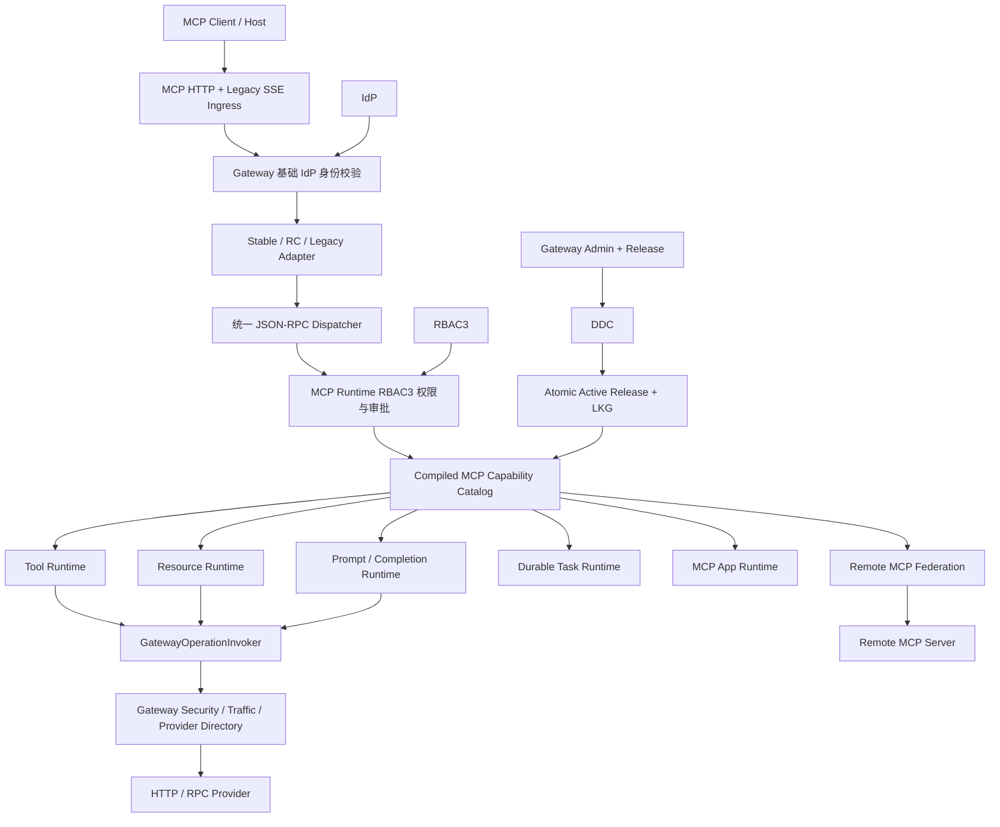

# Egon Gateway 全能力 MCP 网关需求与技术设计

> 本文保留为初始实现记录。其中本地 Tool Draft、手工 Schema/bindings 和
> disabled Route 锚点已经废弃；当前设计以
> [Gateway 注解托管 MCP 设计与破坏性迁移](./2026-08-06-gateway-annotation-managed-mcp-design.md)
> 为准。

- 日期：2026-08-02
- 状态：设计自审通过；按用户授权无需二次确认
- 范围：Gateway MCP 控制面、数据面、Admin Web、IdP/RBAC3/DDC 集成与端到端验证
- 关联设计：[统一身份平台设计](./2026-08-01-unified-identity-platform-design.md)
- 原始材料：`/Users/mario/SelfProject/blog/source/_posts/paper/Egon_Gateway_Complete_MCP_Design_2026.md`、同目录 `mcp_gateway.md` 与配套图片

## 1. 结论

本次建设不是给 Gateway 增加一个固定的 `tools/call` 接口，而是让现有 Egon Gateway 同时成为：

1. 完整的 MCP Server；
2. HTTP/RPC Operation 到 MCP Capability 的动态转换网关；
3. Resources、Prompts、Completion、Durable Tasks 和 MCP Apps 运行时；
4. Remote MCP Federation Gateway；
5. 由现有 Gateway Admin、Release、DDC、LKG、Trace、Metrics、Audit 统一治理的生产级能力。

正式交付只有一个 Release Gate。协议、Tools、Resources、Prompts、Completion、Tasks、Apps、Remote Federation、前后端、权限、安全、故障恢复和实际多进程联调中任一项未通过，均不得把功能标记为完成。

## 2. 需求来源与现状结论

### 2.1 原始需求中必须保留的价值

早期 `mcp_gateway.md` 的核心诉求是：

- 企业已有大量 HTTP/RPC 接口，不应为每个接口单独开发 MCP Server；
- 运营人员应能在管理端注册、描述、审核并发布 MCP 能力；
- Tool 名称、描述、输入输出 Schema 和参数映射应由配置驱动；
- MCP Client 应通过一个统一入口发现并调用这些能力；
- 调用仍要受到网关鉴权、限流、超时、服务发现和审计约束。

这些目标全部保留。

### 2.2 不沿用的早期实现

下列早期实现仅用于理解协议，不进入正式架构：

- 只支持旧式 SSE；
- 依赖单 JVM `ConcurrentHashMap` 保存 Session；
- 用 URL `api_key` 作为主要人类身份；
- Handler 返回硬编码 Tool/Resource；
- MCP Handler 再请求 Gateway 自己的 HTTP Route；
- `@CrossOrigin("*")`、无限请求超时和正文日志；
- 自定义教程工程的 trigger/case/domain 层级和外部规则树依赖。

正式实现遵循当前 Egon Gateway 的 contract/core/runtime/admin 边界，不引入与仓库风格重复的新架构。

### 2.3 当前 Gateway 可复用能力

当前仓库已经具备：

- HTTP/RPC Operation Catalog 与 JSON Schema；
- Provider 注册、租约、健康、负载均衡和 DDC 服务发现；
- 安全、限流、并发、超时、重试、熔断、Bulkhead 和大小限制；
- 不可变 Draft/Release、Canonical Hash、Chunk、DDC 发布日志；
- Engine 校验、编译、LKG 和内存原子激活；
- Trace、Metrics、Audit 和 Admin Web；
- 本机 Redis/PostgreSQL/Kafka 测试基础设施与模拟 Provider。

MCP 必须复用这些能力，不另建平行的服务目录、发布系统或流量治理系统。

## 3. 协议基线

### 3.1 支持方言

同一 MCP Endpoint 支持：

| 方言 | 状态 | 用途 |
|---|---|---|
| `2025-11-25` | 稳定 | 默认兼容基线，支持 initialize、Streamable HTTP 和 Session |
| `2026-07-28-RC` | RC 固定基线 | 支持 server/discover、每请求 `_meta`、标准 HTTP Header 和无协议 Session |
| `LEGACY_2024_SSE` | 兼容 | 仅为旧客户端保留，不作为新接入默认值 |

截至本设计日期，MCP 官方 Releases 页面仍把 `2026-07-28` 标记为预发布 RC，因此运行时必须把它标识为 RC，固定到官方 RC Schema/行为，不能假称最终规范。RC 方言默认可开启，但要有独立配置开关和一致性测试。

### 3.2 SDK 原则

- 官方 Java SDK 2.0.0 只用于 `2025-11-25` Schema、稳定协议兼容和 Conformance 参考；
- `2026-07-28-RC` 使用 Egon 自有 Dialect Adapter；
- `gateway-contract`、`gateway-core` 不暴露 SDK 类型；
- 内部统一模型使用 Jackson `JsonNode`、不可变 record 和显式校验；
- 外部 SDK 升级不得改变 Gateway Rule、数据库或运行时核心接口。

### 3.3 官方依据

- https://github.com/modelcontextprotocol/modelcontextprotocol/releases
- https://modelcontextprotocol.io/specification/draft/server/discover
- https://modelcontextprotocol.io/specification/draft/changelog
- https://github.com/modelcontextprotocol/java-sdk/releases
- https://modelcontextprotocol.io/extensions/tasks/overview
- https://modelcontextprotocol.io/extensions/apps/overview

## 4. 范围

### 4.1 必须交付

- `server/discover`
- `initialize`
- `notifications/initialized`
- `ping`
- `tools/list`、`tools/call`
- `resources/list`、`resources/read`、`resources/templates/list`
- `resources/subscribe`、`resources/unsubscribe`
- `subscriptions/listen`
- Resource List Changed、Resource Updated
- `prompts/list`、`prompts/get`、Prompt List Changed
- `completion/complete`
- Tasks Extension：`tasks/get`、`tasks/update`、`tasks/cancel`
- MCP Apps：UI Resource、Tool Binding、CSP、Permission、Artifact Registry
- Remote MCP：Tools、Resources、Templates、Prompts、Completion、Tasks、Apps、Subscriptions
- Stable/RC/Legacy 方言转换
- OAuth/JWT/mTLS、RBAC3 Scope/Risk/Approval、输入输出 Schema
- 与现有 Gateway Release、DDC、LKG、Trace、Metrics、Audit 整合
- 完整 Admin API 和 Admin Web
- 稳定/RC/Legacy 模拟客户端、远端 MCP Server 和本地 HTTP/RPC/Job Provider
- 协议一致性、安全、HA、恢复、前端 E2E 和实际多进程验证

### 4.2 非目标

- 模型推理和模型供应商代理；
- Agent 编排、Conversation、Memory 或 RAG；
- Token 计费和商业账单；
- Gateway 代替业务 Provider 做业务权限判断；
- 把远端 Prompt 或 Resource 自动升级为系统指令；
- 在本次范围内实现任意用户上传并执行服务端代码。

## 5. 方案比较与选型

### 5.1 方案 A：Gateway 内部独立 MCP Runtime，推荐

新增 `egon-cola-platform-gateway-mcp-runtime`，依赖 `gateway-core` 和 `gateway-contract`；Engine 依赖该 Runtime。MCP 配置成为现有 Gateway Rule 的可选嵌套部分，与 HTTP/RPC Route 共用一个 Release、一个哈希、一个 DDC Active Pointer、一个 LKG 和一次原子激活。

优点：

- 无自调用双跳；
- 复用 Operation、Provider、治理和 Trace；
- DDC/LKG/回滚语义只有一套；
- 2025 与 2026 方言共享统一内部 Handler；
- 可独立测试和演进，不把 Engine 变成巨型模块。

### 5.2 方案 B：单独部署 MCP Gateway

MCP 服务通过 HTTP 再请求现有 Gateway。虽然初期开发较快，但会重复鉴权、限流、序列化、Trace 与重试，并形成 Gateway 调自己 Gateway 的旁路。拒绝。

### 5.3 方案 C：直接用 Java SDK 暴露静态 MCP Server

适用于少量固定 Tool，不适合动态 Release、2026 RC、Remote Federation、Tasks/Apps、现有 Catalog 和 Admin Web。拒绝。

## 6. 总体架构



## 7. 模块边界

### 7.1 Reactor

```text
egon-cola-platform-gateway
├── egon-cola-platform-gateway-contract
├── egon-cola-platform-gateway-core
├── egon-cola-platform-gateway-mcp-runtime   # 新增
├── egon-cola-platform-gateway-engine
├── egon-cola-platform-gateway-admin
├── egon-cola-platform-gateway-admin-web
├── egon-cola-platform-gateway-starter
├── egon-cola-platform-gateway-provider-runtime
└── egon-cola-platform-gateway-test
```

### 7.2 依赖方向

- contract：MCP Rule、协议无关请求/响应、Runtime 描述，不依赖 Spring、SDK 或数据库；
- core：`GatewayOperationInvoker`、MCP 安全/驱动端口，不依赖 Engine；
- mcp-runtime：协议 Adapter、Dispatcher、Handler、Catalog、Drivers、Tasks、Apps、Remote Client；
- engine：MCP Listener、OperationInvoker 实现、Redis/PostgreSQL/Artifact 适配和统一激活；
- admin：MCP Draft、校验、持久化、API、Release 编译；
- admin-web：MCP 控制面页面和协议检查器；
- test：客户端、远端 MCP、Job、对象存储和完整 E2E 拓扑。

### 7.3 设计模式取舍

- Dialect Adapter：隔离 Stable、RC、Legacy Wire 差异；
- Strategy/Registry：按 method、resource source、prompt source、completion source、task executor 选择实现；
- Adapter：Operation、Redis、PostgreSQL、Artifact、RBAC3、Remote Auth；
- State：Durable Task 和 Remote Provider 健康状态；
- Facade：Admin 的 MCP Draft/Validation/Release 编排；
- 不引入通用规则树、抽象工厂或深层模板方法；现有 Handler Registry 和明确 Driver 接口足够。

## 8. 身份与授权边界

### 8.1 Gateway 基础身份层

基础 Gateway 只负责：

- JWT 签名、issuer、audience、过期时间；
- IdP 用户存在且有效；
- tokenVersion 未失效；
- 清理伪造的内部身份 Header；
- 把规范化身份上下文传给 MCP Runtime 或业务 Provider。

基础层不得查询 RBAC3，不判断 Role/Permission。

### 8.2 MCP Runtime 是下游授权主体

MCP Runtime 虽与 Gateway 同进程，但逻辑上是下游应用。它必须：

- 再次解析/验证规范化 JWT Claims；
- 以 `(tid, sid)` 从 RBAC3 拉取授权快照；
- 使用下游授权 Starter 缓存在自己的 Redis Namespace；
- 校验 `mcp:{serverCode}:...` 权限、快照版本和 Fencing；
- 不使用 Access Token 中不存在的 Role/Permission；
- 把原始 Bearer Token 转发给本地业务 Provider，让 Provider 自己做业务授权。

### 8.3 风险与审批

Tool Risk：`LOW`、`MEDIUM`、`HIGH`、`CRITICAL`。

- LOW：权限通过即可调用；
- MEDIUM：权限通过，并在响应审计中记录完整资源摘要；
- HIGH：需要一次性 Approval；
- CRITICAL：需要一次性 Approval，且配置必须显式允许该 Tool 对 MCP 暴露。

Approval 由 Gateway Admin API 创建，绑定 `sid`、`tid`、`clientId`、`serverCode`、`toolName`、请求摘要和过期时间。客户端通过 `_meta.egon.approvalToken` 提交；Token 只存摘要、一次消费、默认 5 分钟过期，不能跨参数复用。

## 9. Endpoint 与传输

| Endpoint | Method | 说明 |
|---|---|---|
| `/mcp/{serverCode}` | POST | Stable/RC JSON-RPC 请求与通知 |
| `/mcp/{serverCode}` | GET | Stable Streamable HTTP 事件流 |
| `/mcp/{serverCode}/listen` | GET/POST | RC `subscriptions/listen` |
| `/.well-known/oauth-protected-resource/mcp/{serverCode}` | GET | OAuth Protected Resource Metadata |
| `/legacy/mcp/{serverCode}/sse` | GET | Legacy SSE 连接 |
| `/legacy/mcp/{serverCode}/message` | POST | Legacy 消息 |
| `/internal/mcp/apps/{artifactId}` | GET | 经 MCP Runtime 读取不可变 App Artifact |
| `/internal/mcp/remote/{providerCode}/health` | GET | 内部 Runtime Health |

传输要求：

- POST 只接受 `application/json` 和协议允许的流式 MIME；
- 请求最大 1 MiB、JSON 深度最大 64；
- Stable Session 元数据和事件使用共享 Redis，不依赖粘性会话；
- RC 每个请求自描述，不从前一请求推断 Client Capability；
- Legacy SSE 使用 Redis Stream/事件路由支持跨 Engine POST；
- Origin、Host、Content-Type、Protocol Header 和 JSON-RPC body 必须一致；
- 客户端断开时取消仍未提交的运行时工作。

## 10. 统一协议模型

内部只接受三类 Envelope：Request、Notification、Response。验证顺序固定为：

1. HTTP 方法、Header、MIME、Body 大小；
2. Origin/Host/TLS；
3. IdP 身份；
4. serverCode 与启用状态；
5. 方言协商；
6. JSON-RPC `2.0`、id、method、params；
7. Header/body method/name 一致；
8. per-request capabilities；
9. MCP Runtime RBAC3 权限；
10. Handler Schema 和业务约束。

JSON-RPC 错误保留标准 code；MCP/Gateway 业务错误放入稳定的 `data.code`。任何异常都不得返回栈、SQL、Provider URL、Secret Reference 或内部类名。

## 11. 能力模型

### 11.1 MCP Server

Server 归属一个 Gateway Group，定义 serverCode、展示信息、instructions、协议方言、OAuth audience、列表缓存和启用状态。`serverCode` 在同 Group 内唯一，Endpoint 由固定前缀和 serverCode 生成，不允许管理员填任意路径。

### 11.2 Tool

Tool 来源：

- `LOCAL_OPERATION`：绑定 Catalog 中的 HTTP/RPC Operation；
- `REMOTE_MCP`：绑定 Remote Mount 后的远端 Tool。

Tool 配置含名称、描述覆盖、输入/输出 Schema 覆盖、参数绑定、结果绑定、Annotations、Required Permissions、Risk、幂等性和启用状态。

客户端永远不能提交 `operationId`、provider URL、routeId、serviceName、Authorization 或 TLS Profile。

### 11.3 Resource 与 Template

Resource Driver：

- STATIC_TEXT
- STATIC_BLOB
- LOCAL_OPERATION
- OBJECT_STORAGE
- DATABASE_SCHEMA
- APP_UI
- REMOTE_MCP

本地 URI：`egon://{serverCode}/{path}`；App URI：`ui://{serverCode}/{appCode}/{version}`；远端虚拟 URI：`egon+remote://{serverCode}/{namespace}/{encodedRemoteUri}`。客户端 URI 不能指定任意网络地址、文件路径或 JDBC URL。

Object Storage 默认使用受根目录约束的文件实现，接口允许未来替换；Database Schema 只访问 Admin 配置的 DataSource 和 Schema Allowlist。

### 11.4 Prompt

Prompt 来源：STATIC_TEMPLATE、STRICT_TEMPLATE、LOCAL_OPERATION、REMOTE_MCP。

模板只支持声明式变量替换与 HTML/JSON 安全编码，不执行 SpEL、脚本、反射或任意 Bean。嵌入 Resource 仍逐项走权限和大小校验。

### 11.5 Completion

来源：LOCAL_DICTIONARY、LOCAL_OPERATION、REMOTE_MCP。最多 100 项，稳定排序，限制模糊匹配复杂度，禁止枚举 Secret/用户隐私/未授权资源。

### 11.6 Durable Tasks

状态：WORKING、INPUT_REQUIRED、COMPLETED、FAILED、CANCELLED。

Task 在响应前先持久化，使用高熵随机 taskId，绑定 Principal Fingerprint、tid、clientId、serverCode、toolName 和请求摘要。每次 get/update/cancel 重新认证和授权；不提供 `tasks/list`；取消是协作式；过期结果不可读取；Remote Task ID 不对外暴露。

### 11.7 MCP Apps

Artifact 必须：

- 不可变版本；
- 上传时计算并保存 SHA-256；
- MIME 为 `text/html;profile=mcp-app`；
- 有 CSP 和 Permission Manifest；
- 限制 16 MiB；
- 不含明文 Secret；
- 只允许声明的依赖 Origin 和 Tool；
- 提供安全下载 Header，禁止 Cookie 和父页面 DOM 访问。

Gateway 不渲染 App，只注册、校验、发布、以 Resource 暴露并审计。Admin Web 的 App 预览也必须使用 sandbox iframe。

### 11.8 Remote MCP Federation

Remote Provider 支持 Stable Streamable HTTP、RC Streamable HTTP、Legacy SSE 和受控 `STDIO_MANAGED`。STDIO 只能执行 Admin 配置的二进制 Allowlist 和固定参数模板，不能接受客户端命令。

Remote Mount 定义 namespace、primitive filter、rename rule、conflict policy 和 permissions。入站 Token 永不透传；Outbound Auth 支持 OAuth Client Credentials、Token Exchange、Secret Reference、mTLS。Secret 只存引用。

能力同步持久化 descriptor 与 fingerprint；Release 固化所用 fingerprint。运行时远端能力漂移不会静默改变当前 Active Release，必须重新预览并发布。

## 12. Operation 调用

新增核心端口：

```java
public interface GatewayOperationInvoker {
    Publisher<GatewayInvocationResult> invoke(
            GatewayOperationInvocation invocation
    );
}
```

Engine 实现必须直接复用：

- Active Release 中的 Operation；
- Gateway Security Context；
- Traffic Governance；
- Provider Directory；
- HTTP/RPC Upstream Adapter；
- Timeout、Retry、Circuit、Bulkhead、大小限制；
- Trace、Metrics、Audit。

禁止 MCP Handler 请求 Gateway 自己的公开 Route。

## 13. Release、DDC 与 LKG

### 13.1 推荐的单快照模型

不新建第二套 Active Pointer。`GatewayRuleContent` 增加可选但始终序列化为稳定默认值的 `McpRuleContent`，包含 Servers、Tools、Resources、Templates、Prompts、Task Policies、Apps、Remote Providers/Mounts 和能力 Fingerprint。

发布时：

1. Admin 同时读取 Gateway Draft 与 MCP Draft；
2. 校验 Operation、Schema、Artifact、Remote Capability 和权限引用；
3. 生成一个 canonical snapshot 和 artifact SHA；
4. 复用现有 inline/chunk publication journal；
5. 写同一个 `gateway.rules.active`；
6. Engine 同时编译 HTTP/RPC 与 MCP；
7. 所有资源准备成功后写 LKG；
8. 单次 `AtomicReference<CompiledGatewayRules>` 切换；
9. 任一 MCP 编译失败时保持旧版本，不出现部分激活。

这比多个 DDC Key 加 Bundle Pointer 更符合当前实现，也避免 DDC 多键非事务窗口。

### 13.2 兼容

- 老 Snapshot 无 `mcp` 字段时按空 MCP Rule 读取；
- 新 Engine 可恢复老 LKG；
- MCP Rule 为空时不开放 MCP Listener 能力，但不影响 HTTP/RPC；
- Release 回滚直接回滚整个统一快照。

## 14. 数据库

只新增一个 Flyway 文件：

`V7__add_gateway_mcp_control_plane.sql`

它一次创建本次数据库变更所需表，绝不修改 V1-V6：

- `gateway_mcp_server`
- `gateway_mcp_tool_draft`
- `gateway_mcp_resource_draft`
- `gateway_mcp_resource_template_draft`
- `gateway_mcp_prompt_draft`
- `gateway_mcp_task_policy_draft`
- `gateway_mcp_app_artifact`
- `gateway_mcp_app_binding_draft`
- `gateway_mcp_remote_provider`
- `gateway_mcp_remote_capability`
- `gateway_mcp_remote_mount_draft`
- `gateway_mcp_approval`
- `gateway_mcp_task_instance`

约束：

- ID 统一 `VARCHAR(64)`，使用现有 `LongIdGenerator` 或高熵 task/approval token；
- JSON 配置使用 JSONB；
- Draft 表以 gatewayGroupId/serverId 和逻辑名称建立唯一约束；
- 所有可编辑控制面实体有 revision、deleted、created/updated actor/time；
- App `(appCode, version)` 唯一且不可覆盖；
- Remote capability `(providerId, primitiveType, remoteName)` 唯一；
- Approval token 只存 SHA-256，带 consumedAt 和 expiresAt；
- Task owner、status/expiry、pending worker 建索引；
- Task 状态和关键枚举有 CHECK；
- 不在 Gateway MCP 表中保存 IdP 密码、RBAC Role 或 Permission 副本。

## 15. Admin API

统一前缀：`/api/v1/gateway/admin/mcp`。

### 15.1 Servers 与能力

- `POST/GET /servers`
- `GET/PUT/DELETE /servers/{id}`
- `POST/GET /servers/{serverId}/tools`
- `PUT/DELETE /tools/{id}`
- `POST /tools/{id}/validate`
- `POST /tools/{id}/test`
- Resource、Template、Prompt 对应完整 CRUD
- `POST /prompts/{id}/render-test`
- `POST /completion/test`

### 15.2 Tasks、Apps、Remote

- Tool Task Policy 的 PUT/GET/DELETE
- Runtime Task 查询和取消
- App Artifact 上传、列表、详情、安全校验
- Tool App Binding 的创建、更新、删除
- Remote Provider CRUD、discover、test、health
- Remote Mount CRUD、冲突预览

### 15.3 Release 与协议检查

- `POST /servers/{serverId}/validate`
- `GET /servers/{serverId}/capability-preview`
- `POST /servers/{serverId}/protocol-inspect`
- 复用现有 Gateway Release preview/publish/rollback API，MCP 不单独发布
- `POST /approvals` 创建一次性高风险调用审批

所有写 API 使用 Idempotency-Key、expectedRevision、审计 actor、统一错误模型；Remote test、Tool test 和 Prompt test 不允许绕过正常权限与治理。

## 16. Admin Web

### 16.1 导航与页面

新增“MCP 管理”导航与以下可用页面：

- MCP Servers
- Server Workbench
- Tools
- Resources
- Resource Templates
- Prompts / Completion
- Task Policies / Runtime Tasks
- MCP Apps / Artifact Security
- Remote Providers / Mounts
- Capability Preview
- Protocol Inspector
- Release Preview
- Runtime Status

### 16.2 交互

- 所有列表有 loading、empty、error、pagination/filter；
- 表单有服务端与客户端一致的校验；
- Operation Tool 通过现有 Operation Catalog 选择，不允许手填 Provider URL；
- Schema 使用 JSON Editor + 格式化 + 校验错误路径；
- Resource URI、Prompt 参数、Remote Namespace 即时预览；
- 高风险 Tool 有显著 Risk/Approval 提示；
- App 上传显示 SHA、CSP、Permissions 和不可变版本；
- Remote discover 显示能力 diff 和冲突；
- Protocol Inspector 能构造 Stable/RC 请求并展示脱敏响应/Trace；
- Release 页面显示 MCP 变更摘要并与 HTTP/RPC 一起发布；
- Unified SSO 替换当前本地 Login，不再保存旧 RBAC3/Gateway token。

### 16.3 权限

页面和按钮分别使用 RBAC3 权限：

- `gateway:mcp:read`
- `gateway:mcp:write`
- `gateway:mcp:test`
- `gateway:mcp:release`
- `gateway:mcp:approve`
- `gateway:mcp:runtime:read`

前端隐藏不代表授权，后端必须再次校验。

## 17. 安全

- JWT、RBAC3、Origin、Host、TLS/mTLS 分层校验；
- 不信任 Tool/Prompt/Resource/Remote 描述；
- JSON Schema 2020-12，限制深度、引用、正则和校验时间；
- 禁止自动获取外部 `$ref`；
- URI Template 限制展开长度和路径穿越；
- Static Blob、Artifact 和 Resource 响应限制大小与 MIME；
- Tool 输入和输出都校验；
- Provider/Remote 返回敏感 Header 必须过滤；
- 入站 Token 永不发给 Remote Provider；
- App 使用 CSP、Sandbox、Permissions、Origin Allowlist；
- Task/Approval 防枚举、防重放、强 owner 绑定；
- 日志默认不记录 body、token、secret、password、artifact 内容；
- Remote Prompt 需要显式 Mount 和管理端审核；
- Retry 只用于明确幂等且尚未提交结果的调用。

## 18. 可靠性与可观测性

### 18.1 可靠性

- Stable/Legacy Session 与 Subscription 使用 Redis 共享状态；
- Durable Task 使用 PostgreSQL，共享 Worker Lease；
- App Artifact 使用不可变共享/本机测试存储，哈希校验；
- Remote Client Pool 有 timeout、bulkhead、circuit breaker 和健康探测；
- DDC 中断继续使用 Active/LKG；
- 新 Release 编译失败不替换旧 Active；
- Engine 启动优先恢复 LKG，再等待 DDC；
- Remote capability 漂移只告警，不改变 Active Release。

### 18.2 Metrics

至少提供：

- `egon_gateway_mcp_requests_total`
- `egon_gateway_mcp_request_duration_seconds`
- tools/resource/prompt/completion/task/app/remote 各自 count、error、duration
- active tasks、subscriptions、remote provider health
- rule apply、artifact verification、capability sync failures

标签禁止使用 taskId、sid、URI 全文或其他高基数/敏感字段。

### 18.3 Trace 与 Audit

Trace 根为 `mcp.server.request`，子 Span 包括 primitive handler、`gateway.operation.invoke`、remote attempt、artifact read 和 task store。Stable/RC Header 与 `_meta` Trace Context 双向适配。

审计覆盖控制面 CRUD、Release、Tool Call、Resource Read、Prompt Get、Task 全生命周期、App Read、Remote Sync/Call 和 Approval，正文只保存摘要与哈希。

## 19. 错误语义

| 场景 | JSON-RPC / HTTP | 稳定业务码 |
|---|---|---|
| JSON 非法 | `-32700` / 400 | `MCP_PARSE_ERROR` |
| Request 非法 | `-32600` / 400 | `MCP_INVALID_REQUEST` |
| Method 不支持 | `-32601` / 404/200 依方言 | `MCP_METHOD_NOT_FOUND` |
| Params/Schema 不符 | `-32602` / 400 | `MCP_INVALID_PARAMS` |
| Header 与 body 不一致 | `-32020` / 400 | `MCP_HEADER_MISMATCH` |
| 缺 Client Capability | `-32021` / 400 | `MCP_CLIENT_CAPABILITY_REQUIRED` |
| 协议版本不支持 | `-32022` / 400 | `MCP_PROTOCOL_UNSUPPORTED` |
| 未认证 | HTTP 401 | `MCP_UNAUTHENTICATED` |
| RBAC/Scope 拒绝 | HTTP 403 | `MCP_FORBIDDEN` |
| Approval 缺失/失效 | 业务错误 | `MCP_APPROVAL_REQUIRED` |
| Task owner 不符 | HTTP 404 | `MCP_TASK_NOT_FOUND` |
| Provider/Remote 超时 | 业务错误 | `MCP_UPSTREAM_TIMEOUT` |
| Release 未就绪 | HTTP 503 | `MCP_SERVER_NOT_READY` |

## 20. 配置默认值

```yaml
egon:
  gateway:
    mcp:
      enabled: true
      endpoint-prefix: /mcp
      protocols:
        stable-2025-11-25: true
        rc-2026-07-28: true
        legacy-sse: true
      limits:
        max-request-bytes: 1048576
        max-json-depth: 64
        max-tools-per-server: 1000
        max-resources-per-server: 5000
        max-prompts-per-server: 1000
        max-resource-bytes: 67108864
        max-app-artifact-bytes: 16777216
        max-subscriptions-per-client: 100
        max-active-tasks-per-client: 100
      schema:
        dialect: 2020-12
        validate-input: true
        validate-output: true
        compile-on-release: true
      tasks:
        default-ttl: 24h
        default-poll-interval: 2s
        cleanup-interval: 10m
      remote:
        discovery-timeout: 20s
        call-timeout: 60s
        health-interval: 30s
        capability-sync-interval: 5m
        token-forwarding: false
      subscriptions:
        max-buffered-events: 1000
        idle-timeout: 5m
      security:
        origin-validation: true
        protected-resource-metadata: true
        token-forwarding: false
      audit:
        body-log-enabled: false
```

## 21. 测试与验收

### 21.1 单元与模块测试

- 每个 Dialect 的解析、协商、Header/body 一致性；
- Dispatcher/Handler 的成功、通知和错误；
- Tool 参数/结果绑定和 Schema；
- 所有 Resource/Prompt/Completion Driver；
- Task 状态机、owner、lease、恢复、取消、过期；
- App SHA/CSP/Permission/路径安全；
- Remote namespace、rename、conflict、dialect translation、auth；
- MCP Rule canonical hash、向后兼容、编译和原子激活；
- V7 PostgreSQL 迁移；
- Admin API revision/idempotency/audit；
- Admin Web 页面、表单、异步竞态和权限按钮。

### 21.2 协议与安全测试

- 官方 MCP Conformance：稳定套件必须通过；
- RC 使用固定官方 Schema/场景测试；
- Legacy SSE 与现有兼容 Client；
- 无效 JSON、批量、重复 id、超深/超大、慢请求；
- Origin/Host、JWT、audience、tokenVersion、RBAC3、Approval；
- SSRF、路径穿越、外部 `$ref`、Prompt Injection、Artifact XSS/CSP；
- Task/Approval 枚举、重放、跨用户/租户/客户端访问；
- Remote Token 泄漏、Secret 日志和 Header 清理。

### 21.3 本机多进程拓扑

最终验证必须实际启动：

- IdP
- RBAC3
- DDC
- Gateway Admin/Engine
- Gateway Admin Web
- DDC/RBAC3/IdP Admin Web
- 本地 Redis、PostgreSQL；若现有发布链需要则启动 Kafka
- HTTP Provider、RPC Provider、Job Provider
- Stable Remote MCP、RC Remote MCP、Remote Apps Server
- MCP Stable/RC/Legacy 测试客户端

验证链路：

1. IdP 登录与 SSO；
2. RBAC3 租户映射和权限发布；
3. Gateway Admin 创建 MCP Server 和所有能力；
4. DDC 发布统一 Release；
5. Engine 激活并从 LKG 恢复；
6. Stable/RC/Legacy 发现、列表和调用；
7. HTTP/RPC Tool、Resource、Prompt、Completion；
8. Task 跨 Engine 创建/读取/更新/取消；
9. App Artifact 获取和 Host 调用；
10. Remote Stable/RC 能力挂载和互译；
11. 断开 DDC、Redis/Remote 短暂故障、错误 Release 回滚；
12. Admin Web Playwright 完成关键配置与发布路径。

Maven、H2、Mock 或 Testcontainers 结果只能证明对应范围，不能替代上述本机真实多进程证据。

### 21.4 完成定义

以下全部满足才算完成：

- 后端编译、单元、集成、协议、安全、恢复测试通过；
- Admin Web lint、typecheck、unit、build、Playwright 通过；
- V7 在空 PostgreSQL 和从 V1-V6 升级两种路径通过；
- Stable/RC/Legacy 客户端成功；
- 所有 primitive、本地/远端能力和前端页面可用；
- IdP、RBAC3、Gateway、DDC 和模拟后端实际打通；
- 最终所需进程保持运行并给出端口、PID、日志与测试账号获取方式；
- 无默认密码、明文 Secret、旧 RBAC3 Token 或未审计的旁路。

## 22. 设计自审

### 22.1 完整性

覆盖了原始完整设计要求的协议、Tools、Resources、Prompts、Completion、Tasks、Apps、Remote、权限、发布、前后端、测试和运行交付，没有把能力拆成后续版本。

### 22.2 一致性

- Gateway 基础层只做身份校验；MCP Runtime 作为下游应用读取 RBAC3，符合已批准统一身份边界；
- HTTP/RPC 与 MCP 共享一个 Release/LKG/Atomic Reference，不存在部分激活；
- Remote 不接收入站 Token；本地 Provider 继续自己授权；
- 旧 Snapshot 缺 MCP 字段时可读，兼容当前发布历史。

### 22.3 取舍

相对原始完整设计，唯一重要结构调整是不用四类 DDC Artifact Key 和第二个 Bundle Pointer，而把 MCP Rule 嵌入现有 canonical snapshot。该调整减少多键一致性窗口，直接复用当前发布日志、回滚和 LKG，能力范围没有减少。

### 22.4 清晰性

所有主要实体、Endpoint、权限、错误、默认配置、迁移、模块边界和完成条件均已确定；没有未决实现选择。
