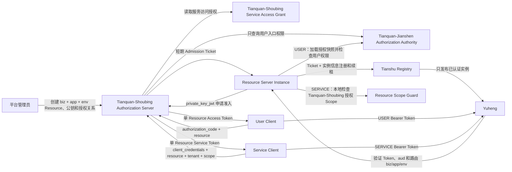
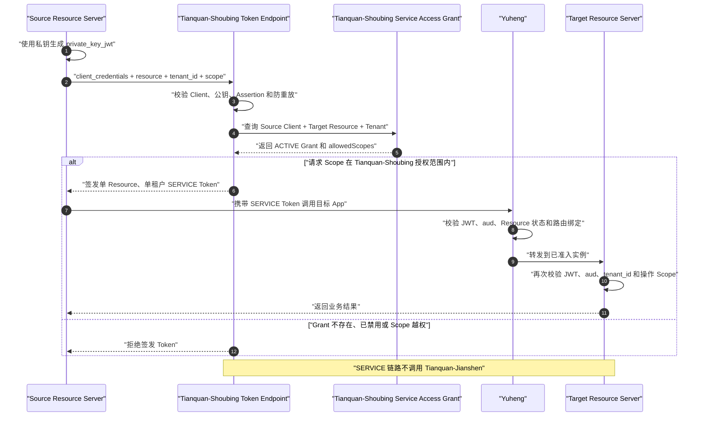

# OAuth 2.0 Resource Server 准入与认证设计

> 状态：已实现并通过本次范围源码级验收；运行态联调待用户启动（2026-08-11）
> 设计日期：2026-08-10
> 适用仓库：`/Users/mario/SelfProject/Egon-COLA`
> 主模块：`egon-cola-tianquan-shoubing`
> 关联模块：`egon-cola-tianquan-jianshen`、`egon-cola-yuheng`、`egon-cola-tianshu`

## 1. 文档目的

本文定义 Egon-COLA 的 OAuth 2.0 Resource Server 准入、用户 Resource Token、
Resource Server 实例启动认证以及 `client_credentials` 服务间调用方案。

本文扩展
`2026-08-01-unified-identity-xingyuan-design.md`，保留以下既有边界：

- Tianquan-Shoubing 是人员身份、OAuth Client、Access Token、机器凭证和服务访问授权的唯一权威；
- Tianquan-Jianshen 是租户内用户角色、入口权限、接口权限、数据权限和字段权限的唯一授权权威；
- Yuheng 负责 Token、目标 Resource 和受信路由身份校验，不执行具体业务权限判断；
- 下游 Resource Server 二次校验 Token；USER Token 使用 Tianquan-Jianshen Starter 执行用户权限判断，
  SERVICE Token 只校验 Tianquan-Shoubing 签发的 Scope，不调用 Tianquan-Jianshen；
- Tianshu 负责配置客户端和 Provider 实例的注册、租约、发现与下线，不负责定义 OAuth 权限。

当本文与旧设计中的自由字符串 `audience`、静态 `clientIds` 或无身份 Tianshu 注册方式冲突时，
以本文为准。

## 2. 实施前基线与缺口

设计冻结时的实现已经具备以下能力：

1. Tianquan-Shoubing 能签发 RS256 用户 Access Token，Token 包含 `sub`、`tid`、`sid`、
   `client_id`、`jti`、`token_version`、`aud` 和时间声明。
2. Tianquan-Shoubing Starter 和 Yuheng Adapter 能验证签名、Issuer、Audience、Client、用户状态与
   Token Version。
3. Tianquan-Jianshen 能为指定系统生成用户授权快照，并在下游按权限编码执行细粒度授权。
4. Tianshu 已使用 `bizCode/appCode/env/instanceId` 表达实例身份，并能签发和维护实例租约。

设计冻结时的缺口如下，均由本文后续实施任务闭合：

1. `audience` 只是 Client 下的自由字符串，没有独立 Resource Server、启停状态、
   业务归属、环境、公钥或准入规则。
2. Tianquan-Shoubing 只校验 `Client -> audience` 字符串关系，不能证明目标 Resource Server 已获批准。
3. Tianshu 注册只校验字段格式，任何知道注册协议的进程都可以声明任意 `bizCode/appCode/env`。
4. Tianquan-Shoubing 只支持 `authorization_code` 和 `refresh_token`，没有 `client_credentials`。
5. 用户是否有权进入目标应用没有参与 Resource Token 签发；只有租户成员身份被校验。
6. Resource Server 的身份、公钥以及 `Client -> Resource -> Tenant -> Scope` 服务访问授权
   尚未在 Tianquan-Shoubing 内形成完整的单一职责链路。

## 3. 需求确认结果

| 编号 | 已确认决策 |
|---|---|
| RS-01 | 使用 `private_key_jwt` 认证 Resource Server；私钥只在服务部署环境，Tianquan-Shoubing 只保存公钥 |
| RS-02 | Resource Server 以 `bizCode + appCode + env` 为逻辑身份，实例只作为运行态租约和审计事实 |
| RS-03 | Resource Server 由管理员按应用创建并启用；可按 `bizCode` 批量管理多个应用，启用后同一 `bizCode + appCode + env` 的实例启动时自动获准接入，不逐实例审批 |
| RS-04 | Tianquan-Shoubing 管逻辑 Resource Server 和机器凭证；Tianshu 管实例注册、心跳、发现和下线 |
| RS-05 | Yuheng 与下游 Resource Server 都必须验证 JWT；用户业务权限由下游 Tianquan-Jianshen 判断，服务调用权限由下游校验 Tianquan-Shoubing 签发的 Scope |
| RS-06 | 授权请求采用 RFC 8707 `resource` 参数；一个 Access Token 只能面向一个 Resource Server |
| RS-07 | 直接切换到新 Resource 模型，不保留旧 `audience` 请求参数和静态兼容逻辑 |
| RS-08 | 用户角色、权限、数据范围和字段策略不写入用户 Access Token；Tianquan-Jianshen 保持授权权威 |
| RS-09 | 本期同时实现 `client_credentials` 服务间调用 |
| RS-10 | Tianquan-Shoubing 不可用时，已认证实例运行到短期准入凭证到期；新实例和续签失败时关闭接入 |
| RS-11 | Resource Server 是平台应用环境级资源；用户访问资格和用户接口权限由 Tianquan-Jianshen 控制，服务访问目标、租户和 Scope 由 Tianquan-Shoubing 控制 |
| RS-12 | 本期包含后端、数据库、Starter、Yuheng、Tianshu、Tianquan-Jianshen 用户授权集成、测试和文档，不包含管理前端 |

## 4. 核心业务语义

### 4.1 四个不同对象

| 对象 | 业务含义 | 示例 |
|---|---|---|
| OAuth Client | 请求 Token 并调用 API 的应用 | `tianquan-shoubing-admin-web`、`tianquan-jianshen-service` |
| Resource Server | 接收 Access Token 的应用安全边界 | `permission/tianquan-shoubing@prod` |
| Resource 实例 | Resource Server 的一个运行进程 | `tianquan-shoubing-admin-7d9f...` |
| RBAC Permission | 用户进入应用后能够执行的操作 | `tianquan-shoubing:user:query`、`tianquan-shoubing:client:update` |
| Tianquan-Shoubing Service Access Grant | 服务 Client 可访问的目标 Resource、租户和 Scope | `tianquan-shoubing-service -> tianquan-jianshen@prod / tenant-001 / tianquan-jianshen:policy:read` |

一个后端服务可以同时是 Resource Server 和 Confidential OAuth Client：它作为
Resource Server 接收调用，作为 Client 使用 `client_credentials` 调用其他 Resource Server。

### 4.2 `bizCode + appCode + env` 是准入和 Token 信任边界

Resource Server 的逻辑唯一性为：

```text
(bizCode, appCode, environment) -> one resourceUri
```

例如：

```text
bizCode             = permission
appCode             = tianquan-shoubing
environment         = prod
resourceUri         = https://api.egon.internal/prod/permission/tianquan-shoubing
rbacApplicationCode = tianquan-shoubing
entryPermissionCode = tianquan-shoubing:access
```

同一个 `permission` 业务域下还可以登记独立的 `tianquan-jianshen@prod` Resource Server：

```text
bizCode             = permission
appCode             = tianquan-jianshen
environment         = prod
resourceUri         = https://api.egon.internal/prod/permission/tianquan-jianshen
rbacApplicationCode = tianquan-jianshen
entryPermissionCode = tianquan-jianshen:access
```

`bizCode` 是业务域和批量管理维度，不是 Audience 边界；`appCode` 才把同一业务域下的
不同应用隔离为独立 Resource Server。每个应用拥有独立的 Resource URI、Audience、
Management Client、公钥和入口权限。`tianquan-shoubing` Token 不能访问同属 `permission` 业务域的
`tianquan-jianshen` Resource。

同一 `bizCode + appCode + env` 下的分布式实例共享应用级 Resource 身份。管理员可以按
`bizCode + env` 批量创建、启用或授权当前明确选中的应用，但系统最终必须展开并保存为
逐应用 Resource Server/Grant 记录。批量操作不得形成自动覆盖未来新应用的通配授权；
新 `appCode` 仍需由管理员创建或纳入一次新的显式批量操作。实例只要拥有本应用环境的
私钥，并且声明与登记的三元组一致，就可以在启动时自动申请接入，不需要逐实例审批。

### 4.3 用户 Resource Token 与 Tianquan-Jianshen 的双闸门

用户只有 A 应用权限、没有 B 应用权限时，即使 A、B 同属一个 `bizCode`：

- Tianquan-Shoubing 不得向该用户签发 B Resource Token；
- 已签发的 A Token 因 `aud` 不匹配，不能调用 B Resource；
- 用户持有 A Token 后，能否调用 A 的某个具体接口，仍由 Tianquan-Jianshen 逐权限判断。

因此业务边界固定为：

```text
Resource Token = 是否允许进入某个应用 Resource
Tianquan-Jianshen Permission = 进入后允许执行哪些具体操作
```

Token 签发阶段只做应用入口权限 `entryPermissionCode` 判断，不把所有接口权限复制进
用户 JWT。权限变更后，Tianquan-Jianshen 下游快照和 Fence 仍可立即拒绝后续业务操作，而不必等待
Access Token 过期。

### 4.4 服务间调用不经过 Tianquan-Jianshen

服务调用与用户授权是两条独立链路。服务使用 `client_credentials` 请求目标 Resource
Token 时，Tianquan-Shoubing 根据自己维护的 Service Access Grant 判断：

```text
Source Client + Target Resource + Tenant + Allowed Scopes = Service Access Grant
```

Tianquan-Jianshen 不保存 Service Principal、Service Permission 或 Service Scope，不参与服务 Token
签发，也不参与 SERVICE Token 的请求鉴权。Tianquan-Shoubing 签发的 `scope` 是本次服务调用的授权结果；
目标 Resource Server 只需验证 Token、Audience、租户以及当前操作要求的 Scope。

## 5. 总体架构



## 6. 管理员创建 Resource Server

管理员通过 Tianquan-Shoubing Admin API 为业务域下的具体应用创建 Resource Server，创建成功并启用
即代表该 `bizCode + appCode + env` 已经完成平台审批。没有运行实例申请和人工审批队列。

创建信息至少包括：

- `resourceServerId`：稳定内部标识，建议显式体现 `bizCode/appCode/env`；
- `resourceUri`：RFC 8707 Resource Identifier，必须是无 Fragment 的绝对 URI，并且
  精确标识当前应用和环境；
- `bizCode`；
- `appCode`；
- `environment`；
- `displayName`；
- `managementClientId`：与 Resource Server 绑定的 Confidential Client；
- `kid`、算法和公开 JWK；
- `rbacApplicationCode`；
- `entryPermissionCode`；
- Admission Ticket TTL；
- 状态和乐观锁版本。

私钥由部署系统生成和保存，禁止上传、打印或持久化到 Tianquan-Shoubing、Tianshu、Git 或 Tianshu 动态配置。
管理员只向 Tianquan-Shoubing 登记公钥。一个 Resource Server 可同时保留多把有效公钥，以支持无停机轮换。

建议的管理 API：

```text
POST   /api/v1/tianquan-shoubing/resource-servers
GET    /api/v1/tianquan-shoubing/resource-servers
GET    /api/v1/tianquan-shoubing/resource-servers/{resourceServerId}
POST   /api/v1/tianquan-shoubing/resource-servers/{resourceServerId}/enable
POST   /api/v1/tianquan-shoubing/resource-servers/{resourceServerId}/disable
POST   /api/v1/tianquan-shoubing/resource-servers/{resourceServerId}/keys
DELETE /api/v1/tianquan-shoubing/resource-servers/{resourceServerId}/keys/{kid}
PUT    /api/v1/tianquan-shoubing/clients/{clientId}/resources/{resourceServerId}
DELETE /api/v1/tianquan-shoubing/clients/{clientId}/resources/{resourceServerId}
POST   /api/v1/tianquan-shoubing/resource-servers/actions/batch
POST   /api/v1/tianquan-shoubing/clients/{clientId}/resource-grants/actions/batch
```

批量接口使用 `bizCode + environment + appCodes[]` 作为选择条件，服务端逐个校验并写入
应用级 Resource Server 或 Grant；不保存 `bizCode=*` 或“未来应用自动继承”的通配规则。

管理接口继续使用 Tianquan-Shoubing Admin 现有 Tianquan-Jianshen 管理权限体系，并新增：

```text
tianquan-shoubing:resource-server:read
tianquan-shoubing:resource-server:create
tianquan-shoubing:resource-server:update
tianquan-shoubing:resource-server:status
tianquan-shoubing:resource-server:key
tianquan-shoubing:resource-server:grant
```

## 7. Resource Server 启动准入

### 7.1 `private_key_jwt` Client Assertion

Resource Server Starter 从 owner-only 私钥文件读取密钥，生成短期 Client Assertion：

```text
typ = JWT
alg = RS256
kid = registered key id
iss = managementClientId
sub = managementClientId
aud = Tianquan-Shoubing admission endpoint
jti = random unique id
iat = now
exp <= now + 60 seconds
```

Tianquan-Shoubing 必须校验：

1. Resource Server 和 Management Client 存在且为 `ACTIVE`；
2. `kid` 对应有效公钥，算法固定为允许的非对称算法；
3. `iss == sub == managementClientId`；
4. `aud` 精确等于 Admission Endpoint；
5. `iat/exp` 在安全时间窗内；
6. Redis 中不存在相同 `(clientId, jti)`，校验成功后写入短期防重放记录；
7. 请求声明的 `bizCode + appCode + env` 与 Resource Server 精确匹配；
8. `instanceId` 非空且满足现有 Tianshu 长度和格式约束。

### 7.2 Admission Ticket

验证成功后，Tianquan-Shoubing 签发独立用途的短期 JWT：

```text
typ              = rs-admission+jwt
token_use        = resource_server_admission
iss              = Tianquan-Shoubing issuer
sub              = resourceServerId
aud              = tianshu-registry
resource         = resourceUri
resource_version = current resource version
biz              = bizCode
app              = appCode
env              = environment
instance_id      = instanceId
credential_id    = kid
jti / iat / nbf / exp
```

Admission Ticket 不能被当作 OAuth Access Token 使用；OAuth Access Token 也不能用于
Tianshu 实例准入。

### 7.3 Tianshu 注册与心跳

Tianshu 的 CONFIG_CLIENT 注册和 HTTP/RPC Provider 注册都必须携带 Admission Ticket。
Tianshu 校验签名、用途、Audience、有效期以及 `biz/app/env/instanceId` 与注册请求的一致性。

生产配置默认 `admission.required=true`。实例未能取得有效 Ticket 时，Resource Server
不得进入 Ready 状态，也不得注册到 Tianshu；没有显式的测试模式开关时应直接终止应用启动。
测试环境可以注入内存 Admission Port，但不能通过普通业务配置关闭生产准入。

Tianshu 租约到期时间不得晚于 Admission Ticket 到期时间。实例在心跳期间自动向 Tianquan-Shoubing
续签 Ticket，再用新 Ticket 延长租约。管理员审批应用级 Resource Server，不审批
同一应用下的 `instanceId`。

资源禁用时：

1. Tianquan-Shoubing 立即拒绝新的 Admission 和续签；
2. Tianquan-Shoubing 通过现有 Transactional Outbox 发布 `IDENTITY_RESOURCE_SERVER_DISABLED`；
3. Tianshu 消费事件并撤销匹配 `bizCode + appCode + env` 的 CONFIG_CLIENT 和 Provider 租约；
4. Yuheng 从 Tianshu 目录移除对应实例；
5. 即使事件暂时不可用，现有短期 Ticket 到期后也无法继续续租。

## 8. 用户 Authorization Code 流程

### 8.1 请求协议

授权请求和 Token 请求使用 RFC 8707 `resource` 参数，不再接受自定义 `audience`：

```text
GET /oauth2/authorize
    ?response_type=code
    &client_id=order-admin-web
    &redirect_uri=...
    &code_challenge=...
    &code_challenge_method=S256
    &resource=https://api.egon.internal/prod/permission/tianquan-shoubing
```

本期主动限制为一个请求只能出现一个 `resource`。Access Token 的 `aud` 数组必须且
只能包含该 Resource URI，避免多 Audience Token 造成应用间的 Token 转发风险。

### 8.2 签发前检查

Authorization、Authorization Code Exchange 和 Refresh 共用同一个
`UserResourceAccessPolicy`，顺序如下：

1. OAuth Client 为 `ACTIVE`；
2. Redirect URI 和 PKCE 合法；
3. Resource Server 存在且为 `ACTIVE`；
4. `Client -> Resource Server` 的 `USER_DELEGATION` Grant 为 `ACTIVE`；
5. 用户身份和当前租户成员关系为 `ACTIVE`；
6. Tianquan-Shoubing 调用 Tianquan-Jianshen Resource Access Decision，校验用户拥有目标应用 Resource Server 绑定的
   `entryPermissionCode`；
7. 所有检查通过后，授权码和 Refresh Grant 才能绑定该 Resource。

Tianquan-Jianshen 新增最小内部决策接口，不向 IdP返回完整角色和权限集合：

```text
POST /internal/v1/authorization/resource-access-decisions
```

请求包含 `identitySub/tid/sid/rbacApplicationCode/entryPermissionCode`；响应只返回
`ALLOW` 或 `DENY`、原因码以及用于审计的授权版本。Tianquan-Jianshen 不可用时必须 Fail Closed，
授权阶段返回 `temporarily_unavailable`，明确拒绝则返回 `access_denied`。

Refresh 时重新检查 Resource 状态、Client Grant 和 Tianquan-Jianshen 入口权限。权限已撤销时，
Refresh 按无效授权处理，不签发新的 Token。

### 8.3 用户 Access Token

用户 Access Token 使用 RFC 9068 风格的签名 JWT：

```text
typ              = at+jwt
principal_type   = USER
iss / sub / aud
client_id
tid / sid
jti
token_version
resource_version
nonce
iat / nbf / exp
```

用户 Token 不包含角色、权限、数据范围、字段策略或 Tianquan-Jianshen 授权快照。Resource Server
收到请求后，通过现有 Tianquan-Jianshen Starter 按自己的 `rbacApplicationCode` 加载授权快照，
再通过 `@RequiresPermission` 或 `AuthorizationService` 判断具体操作。

## 9. Yuheng 与下游验证

### 9.1 Yuheng

Yuheng 必须：

1. 验证签名、`typ=at+jwt`、Issuer 和时间声明；
2. 根据 `principal_type` 校验主体：USER 校验用户、会话和 Token Version，SERVICE
   校验 Client 类型以及 Token 中的服务身份声明；
3. 根据路由定义中的 `bizCode + appCode + env` 解析唯一 Resource URI；
4. 要求 Token `aud` 精确包含且只包含该 Resource URI；
5. 读取 Tianquan-Shoubing Resource Server 运行态投影，确认 Resource 仍为 `ACTIVE` 且版本有效；
6. 清理客户端伪造的用户/服务受信头，再写入已验证身份头；
7. 只路由到 Tianshu 中持有有效认证租约的实例。

Yuheng 不调用 Tianquan-Jianshen，也不判断 `order:query` 等具体权限。

### 9.2 下游 Resource Server

Tianquan-Shoubing Starter 配置从多值 `audiences/clientIds` 改为当前服务唯一的 `resourceUri` 和
Resource Server 标识。下游必须再次执行与 Yuheng 一致的 JWT、Audience、主体状态
和 Resource 状态校验。

下游根据 `principal_type` 分流：

- `USER`：由 Tianquan-Jianshen Starter 加载当前系统授权快照并执行用户接口、数据和字段权限检查；
- `SERVICE`：校验 Token 中由 Tianquan-Shoubing 授权的 `scope` 是否覆盖当前操作要求的 Scope，不调用 Tianquan-Jianshen。

直接访问后端时同样必须经过 Tianquan-Shoubing Starter。USER 请求继续经过 Tianquan-Jianshen Starter，SERVICE
请求继续经过 Scope 校验，因此不能通过绕过 Yuheng 逃避对应权限判断。

## 10. Client Credentials 服务间调用

### 10.1 身份模型

每个需要调用其他服务的 Resource Server 绑定一个 `CONFIDENTIAL` OAuth Client。
该 Client 使用同一套 Tianquan-Shoubing 公钥凭证模型进行 `private_key_jwt` 认证，但 Admission Endpoint
和 Token Endpoint 使用不同的 `aud`，Assertion 不能跨端点重放。

机器凭证和服务访问授权都由 Tianquan-Shoubing 管理。Tianquan-Jianshen 只负责 USER Principal 的用户权限，不保存
Service Principal、Service Permission 或 Service Scope，也不成为服务 Token 的认证或
授权依赖。

Tianquan-Shoubing 中一条服务访问授权必须明确绑定：

```text
sourceClientId
targetResourceServerId
tenantId
allowedScopes
status
```

服务启动准入和服务间调用仍是两种不同授权：Admission Ticket 只允许实例注册 Tianshu；
Client Credentials Grant 只允许 Source Client 获取面向目标 Resource 的 Service Token。

### 10.2 Token 请求

```text
POST /oauth2/token

grant_type=client_credentials
client_id=tianquan-shoubing-service
client_assertion_type=urn:ietf:params:oauth:client-assertion-type:jwt-bearer
client_assertion=<signed assertion>
resource=https://api.egon.internal/prod/permission/tianquan-jianshen
tenant_id=tenant-001
scope=tianquan-jianshen:policy:read
```

第一期要求每个 Client Credentials Token 绑定一个明确租户，不支持 `tid=*`。平台级
无租户基础设施调用需要另行定义专用 Resource 和权限，不得隐式获得所有租户权限。

Tianquan-Shoubing 检查：

1. Confidential Client 和凭证有效，Assertion 未重放；
2. 目标 Resource Server 为 `ACTIVE`；
3. `Source Client -> Target Resource -> Tenant` 的 `CLIENT_CREDENTIALS` Grant 为 `ACTIVE`；
4. 请求 Scope 是该 Tianquan-Shoubing Grant 的 `allowedScopes` 子集；
5. Tianquan-Shoubing 根据 Source Client 绑定的 Resource Server 身份生成
   `source_biz/source_app/source_env`，不接受调用方自行声明；
6. 以上判断全部在 Tianquan-Shoubing 内完成，不调用 Tianquan-Jianshen；
7. Resource、租户、Scope 和 Source Client 关系全部通过后才签发 Token。

Client Credentials 不签发 Refresh Token。Token 过期后，服务重新认证并获取新 Token。

### 10.3 Service Access Token

```text
typ              = at+jwt
principal_type   = SERVICE
iss              = Tianquan-Shoubing issuer
sub              = service client id
client_id        = service client id
aud              = exactly one target resourceUri
tid              = one tenant id
scope            = Tianquan-Shoubing-granted service scopes
source_biz
source_app
source_env
credential_id
resource_version
jti / iat / nbf / exp
```

其中 `scope` 必须为：

```text
scope = Tianquan-Shoubing Service Access Grant 允许 Scope 与本次请求 Scope 的交集
```

服务 Token 的 `scope` 是 Tianquan-Shoubing 服务访问授权在 Token 有效期内的最小签名快照。下游必须
将当前业务操作所需 Scope 与 Token Scope 匹配；Yuheng 仍只校验身份、Resource 和
路由绑定，不执行服务 Scope 判断。整个 SERVICE 链路不调用 Tianquan-Jianshen。Service Token 使用
短 TTL，不允许通过 Refresh 延长旧授权；Grant 撤销后不再签发新 Token，已签发 Token
最多存活到短 TTL 到期。

### 10.4 服务间调用端到端泳道



## 11. 数据模型

### 11.1 Tianquan-Shoubing PostgreSQL

新增：

```text
identity_resource_server
├── id
├── resource_server_id
├── resource_uri
├── biz_code
├── app_code
├── environment
├── display_name
├── management_client_id
├── rbac_application_code
├── entry_permission_code
├── admission_ticket_ttl_seconds
├── status
├── version
└── audit columns

identity_client_jwk
├── id
├── client_id
├── kid
├── algorithm
├── public_jwk
├── valid_from / valid_to
├── status
├── last_used_at
├── version
└── audit columns

identity_client_resource_grant
├── id
├── client_id
├── resource_server_id
├── grant_type
├── tenant_id
├── allowed_scopes
├── status
├── version
└── audit columns
```

主要唯一约束：

```text
UNIQUE (resource_uri)
UNIQUE (biz_code, app_code, environment)
UNIQUE (client_id, kid)
UNIQUE (client_id, resource_server_id) WHERE grant_type = USER_DELEGATION
UNIQUE (client_id, resource_server_id, tenant_id) WHERE grant_type = CLIENT_CREDENTIALS
```

`grant_type` 仅允许 `USER_DELEGATION` 和 `CLIENT_CREDENTIALS`。用户授权关系的
`tenant_id` 和 `allowed_scopes` 为空；Service Grant 的 `tenant_id` 必填，并且至少包含
一个 Scope。服务访问授权完全保存在 Tianquan-Shoubing，不在 Tianquan-Jianshen 建立对应授权记录。

现有 Tianquan-Shoubing V1 Flyway 文件保持不变。新增一个 V2 迁移完成新表创建、约束创建以及旧
`identity_client_audience` 删除。由于选择直接切换，不实现旧 `audience` 到新 Resource
的运行时兼容；部署前必须通过管理数据或 Bootstrap 明确创建 Resource 和 Client Grant。

### 11.2 Tianquan-Shoubing Redis

新增运行态键：

```text
identity:resource-server:{resourceServerId}
identity:resource-uri:{sha256(resourceUri)}
identity:client-assertion-replay:{clientId}:{jti}
identity:service-resource-grant:{clientId}:{resourceServerId}:{tenantId}
```

Resource 投影至少包含状态、Resource URI、`bizCode`、`appCode`、环境和版本。Starter
与 Yuheng 读取该投影，投影缺失、格式错误、版本不一致或 Redis 不可用时 Fail Closed。

### 11.3 Tianshu

实例记录和租约继续由 Tianshu Redis/PostgreSQL 负责，不在 Tianquan-Shoubing 建立 Instance 表。Tianshu
实例记录增加 Admission Ticket 的 `resourceServerId`、`resourceVersion`、`credentialId`
和到期时间审计字段，但不得持久化私钥或原始 Client Assertion。

## 12. 领域与实现结构

### 12.1 Tianquan-Shoubing Core

建议新增：

```text
core/resource/
├── ResourceServer
├── ResourceServerStatus
├── ClientResourceGrant
├── ResourceGrantType
├── ResourceServerAdmissionPolicy
├── UserResourceAccessPolicy
├── ClientCredentialsAccessPolicy
└── ResourceServerFacade

core/port/
├── ResourceServerStore
├── ClientCredentialStore
├── UserResourceAccessAuthorizationPort
└── ResourceServerRuntimePort
```

`ResourceServerAdmissionPolicy` 使用领域服务集中表达状态、业务域、应用、环境、凭证和重放约束。
它是 Specification 风格的显式策略对象，但不拆成大量单条件类，避免过度设计。

`UserResourceAccessPolicy` 通过 `UserResourceAccessAuthorizationPort` 调用 Tianquan-Jianshen；
`ClientCredentialsAccessPolicy` 只读取 Tianquan-Shoubing 的 Client、Resource 和 Service Grant。两类主体
采用两个清晰的策略对象隔离规则，不引入可插拔 Strategy 工厂，因为当前不存在第三种授权路径。

第一期只有 `private_key_jwt`，不引入认证 Strategy 层。以后确实增加 mTLS 时，再将
Client Assertion 与 mTLS 抽成并列认证策略。

### 12.2 Tianquan-Shoubing Admin

遵循已确认的扁平业务包结构：

```text
top.egon.cola.platform.tianquan.shoubing.admin.resource/
├── controller/
├── config/
├── service/
├── service/impl/
├── repo/
├── domain/
├── domain/dto/
├── domain/vo/
└── domain/pojo/
```

每个新增包必须提供中英双语 `package-info.java`，新增 Java 类、字段和方法继续遵守
Tianquan-Shoubing 模块现有中英双语 Javadoc 要求。

### 12.3 其他模块

| 模块 | 改造内容 |
|---|---|
| `tianquan-shoubing-starter` | 启动 Admission Client、精确 Resource 校验、USER/SERVICE Token 识别、Resource 状态读取和 SERVICE Scope 提取 |
| `tianquan-shoubing-gateway-adapter` | 路由 `bizCode + appCode + env -> resourceUri` 解析、单 Audience 校验、USER/SERVICE Principal 映射 |
| `tianquan-shoubing-admin` OAuth | `resource` 参数、Confidential Client、`private_key_jwt`、Service Access Grant、`client_credentials`、RFC 9068 Token |
| `tianquan-jianshen-admin` | 只提供用户 Resource Access Decision 内部接口 |
| `tianquan-jianshen-starter` | 只负责 USER Principal 的用户细粒度权限快照和判断，不处理 SERVICE Principal |
| Tianshu Starter/Admin | Admission Ticket 获取、注册携带、验证、续签、禁用事件撤租 |
| Yuheng Engine | 只使用已认证 Tianshu 实例；把路由 `bizCode + appCode + env` 传给 Resource Audience Resolver |

## 13. 错误语义

### 13.1 OAuth

| 场景 | 错误 |
|---|---|
| Resource 不存在、禁用或 Client 未绑定 | `invalid_target` |
| 用户缺少应用入口权限 | `access_denied` |
| Tianquan-Jianshen 暂时不可用，仅影响用户授权 | `temporarily_unavailable` |
| Client Assertion 无效、过期、重放 | `invalid_client` |
| Client 不允许使用 `client_credentials` | `unauthorized_client` |
| Client 没有目标 Resource 和租户的 Service Grant | `invalid_target` |
| Client Credentials Scope 越权 | `invalid_scope` |
| Refresh 时 Resource、Grant 或用户授权失效 | `invalid_grant` |

### 13.2 Admission

内部稳定错误码至少包括：

```text
TIANQUAN_SHOUBING_RESOURCE_SERVER_NOT_FOUND
TIANQUAN_SHOUBING_RESOURCE_SERVER_DISABLED
TIANQUAN_SHOUBING_RESOURCE_SERVER_BIZ_MISMATCH
TIANQUAN_SHOUBING_RESOURCE_SERVER_APP_MISMATCH
TIANQUAN_SHOUBING_RESOURCE_SERVER_ENV_MISMATCH
TIANQUAN_SHOUBING_RESOURCE_SERVER_CREDENTIAL_INVALID
TIANQUAN_SHOUBING_CLIENT_ASSERTION_AUDIENCE_INVALID
TIANQUAN_SHOUBING_CLIENT_ASSERTION_REPLAYED
TIANQUAN_SHOUBING_RESOURCE_ADMISSION_UNAVAILABLE
TIANSHU_RESOURCE_ADMISSION_REQUIRED
TIANSHU_RESOURCE_ADMISSION_INVALID
TIANSHU_RESOURCE_ADMISSION_EXPIRED
TIANSHU_RESOURCE_ADMISSION_BINDING_MISMATCH
```

对外响应不泄露密钥、JWK 原文、Assertion、Token、数据库状态或内部异常堆栈。

## 14. 安全约束

1. Resource URI 必须是绝对 URI，不允许 Fragment；本期只允许一个 Resource。
2. OAuth Access Token 使用 `typ=at+jwt`，Admission Ticket 使用不同 `typ/token_use/aud`。
3. Client Assertion 最长 60 秒，并对 `jti` 做 Redis 防重放。
4. 只接受显式配置的非对称签名算法，拒绝 `none` 和算法降级。
5. 公钥按 `kid` 轮换；禁用或过期密钥立即不能签发新 Ticket/Token。
6. 私钥文件必须使用绝对路径和 owner-only 权限，不允许写入普通配置或日志。
7. 除本机测试外，Admission、Token 和用户授权所需的 Tianquan-Jianshen 内部调用必须使用 HTTPS。
8. Resource、Client Grant、用户入口权限和 Tianquan-Shoubing Service Grant 任一检查失败都必须 Fail Closed。
9. Yuheng 和下游必须清理客户端伪造的 `X-Egon-*` 受信身份头。
10. 用户 Token 不携带角色和权限；服务 Token Scope 必须是 Tianquan-Shoubing Service Grant 的允许集合子集。
11. Tianquan-Jianshen 不保存或判断 Service Principal、Service Permission 和 Service Scope。

## 15. 验收矩阵

### 15.1 Resource Server 准入

1. 未登记 `bizCode + appCode + env` 的服务无法获得 Admission Ticket。
2. 只伪造 `bizCode/appCode/env`、没有对应应用私钥的进程无法注册 Tianshu。
3. 错误 `kid/aud/iss/sub`、过期 Assertion 和重复 `jti` 全部拒绝。
4. 同一已启用 `bizCode + appCode + env` 的多个实例可自动接入，不产生逐实例审批记录。
5. 同一 `bizCode` 下的 `tianquan-shoubing` 与 `tianquan-jianshen` 使用不同 Resource URI、Audience、凭证和入口权限。
6. Ticket 与注册请求的 `biz/app/env/instanceId` 任一不一致时拒绝注册。
7. Resource 禁用后只撤销匹配三元组的 Tianshu 租约，不影响同业务域的其他应用。
8. Tianquan-Shoubing 不可用时，已有实例只运行到 Ticket 到期，新实例 Fail Closed。

### 15.2 用户 Token 与 Tianquan-Jianshen

1. 有 A 应用入口权限的用户可以获得 A Resource Token。
2. 没有 B 应用入口权限的用户申请 B Token 返回 `access_denied`，即使 A、B 同属一个业务域。
3. A Token 调用 B Resource 因 Audience 不匹配返回 `401 invalid_token`。
4. 用户有 A Resource Token 但缺少具体接口权限时，下游 Tianquan-Jianshen 返回 `403`。
5. 用户权限撤销后，现有 Token不能继续执行被撤销操作，Refresh 不能产生新 Token。
6. Yuheng 只做身份、Resource 和路由校验，不调用 Tianquan-Jianshen 进行业务权限决策。
7. 绕过 Yuheng 直接访问后端时，下游 Tianquan-Shoubing Starter 和 Tianquan-Jianshen Starter 仍能拒绝未授权请求。

### 15.3 Client Credentials

1. 有效 Confidential Client 可用 `private_key_jwt` 获取单 Resource、单租户服务 Token。
2. 未授权目标 Resource、租户或 Scope 均拒绝签发。
3. Service Token 不包含 Refresh Token。
4. Service Token 调用错误 Resource 返回 `401`，缺少目标操作 Scope 返回 `403`。
5. Resource、Client、密钥或 Tianquan-Shoubing Service Grant 禁用后不能获得新 Token。
6. Client Credentials 签发和 SERVICE Token 请求鉴权全链路不调用 Tianquan-Jianshen。

### 15.4 工程验证

1. Tianquan-Shoubing V2 Flyway 契约测试和 PostgreSQL 集成测试通过。
2. Tianquan-Shoubing Core 的 Resource、Grant、Admission、User Access 和 Client Credentials 单元测试通过。
3. Tianquan-Shoubing Starter 与 Yuheng Adapter 的 Fail-Closed 安全矩阵通过。
4. Tianshu CONFIG_CLIENT、HTTP Provider 和 RPC Provider 注册认证测试通过。
5. Tianquan-Jianshen 用户入口决策测试以及 Tianquan-Shoubing Service Grant/Scope 决策测试通过。
6. 相关 Maven 模块定向编译和测试通过。
7. 实施阶段不自动启动完整项目；用户后续明确授权后，完整运行态联调已执行并通过。

## 16. 实施顺序约束

后续实施计划必须按以下依赖顺序拆分并逐任务提交：

1. Tianquan-Shoubing Resource/Grant/凭证领域模型和 V2 数据库迁移；
2. Tianquan-Shoubing Admin Resource 管理 API、公钥轮换和运行态投影；
3. Tianquan-Jianshen 用户 Resource Access Decision 接口；
4. OAuth `resource`、用户双闸门、RFC 9068 Token 改造；
5. Tianquan-Shoubing Service Access Grant、Confidential Client、`private_key_jwt` 和 `client_credentials`；
6. Admission Endpoint 与 Tianquan-Shoubing Starter 启动认证；
7. Tianshu 注册、心跳、事件撤租的 Admission 集成；
8. Yuheng 和下游精确 Resource 校验、USER/SERVICE 主体处理；
9. 删除旧 `audience` 配置和静态 `clientIds` 兼容路径；
10. 全链路安全矩阵、文档与残留引用扫描。

任何数据库变更只能新增对应模块的下一版本 Flyway 文件，不得修改现有迁移。

## 17. 非目标

- 管理前端页面；
- Dynamic Client Registration 和运行实例人工审批流；
- 每个 Pod 独立长期密钥；
- mTLS、SPIFFE/SPIRE 或 Kubernetes Workload Identity；
- 多 Resource/Multi-Audience Access Token；
- 用户角色和权限写入 Access Token；
- Tianquan-Jianshen Service Principal、Service Permission 和 Service Scope；
- Opaque Token 和每请求 Token Introspection；
- `tid=*` 的跨租户 Service Token；
- 生产环境双栈兼容旧 `audience` 请求和配置。

## 18. 标准参考

- [RFC 6749: The OAuth 2.0 Authorization Framework](https://datatracker.ietf.org/doc/html/rfc6749)
- [RFC 7523: JWT Profile for OAuth 2.0 Client Authentication](https://datatracker.ietf.org/doc/html/rfc7523)
- [RFC 8707: Resource Indicators for OAuth 2.0](https://datatracker.ietf.org/doc/html/rfc8707)
- [RFC 9068: JWT Profile for OAuth 2.0 Access Tokens](https://datatracker.ietf.org/doc/html/rfc9068)

## 19. 实施与运维说明

### 19.1 实施结果

- Resource Server 以 `bizCode + appCode + env` 为唯一准入边界，每个三元组绑定一个 Resource URI；
- USER Token 由 Tianquan-Shoubing 完成身份与目标 Resource 校验，并在签发前调用 Tianquan-Jianshen 判断用户入口权限；
- SERVICE Token 的目标、租户与 Scope 全部由 Tianquan-Shoubing Service Grant 决定，不调用 Tianquan-Jianshen；
- Tianshu 的配置客户端、HTTP Provider 与 RPC Provider 注册/心跳均携带 Admission Ticket，租约不得超过 Ticket 到期时间；
- Yuheng 从受信路由定义解析目标 Resource，并分别映射 USER/SERVICE 主体；具体用户业务权限仍由下游 Tianquan-Jianshen 执行；
- 旧 `audience` 请求参数、静态 Client 白名单和 Tianquan-Jianshen 机器权限路径已从活动代码与配置移除。

### 19.2 部署与迁移顺序

1. 先应用 Tianquan-Shoubing V2 和 Tianquan-Shoubing V3 Transactional Outbox Schema，再应用 Tianshu V8（PostgreSQL/SQLite 对应方言），最后应用 Yuheng V11；已有迁移文件不得修改或回退校验和。
2. 在 Tianquan-Shoubing 中按精确三元组创建 Resource Server、Resource URI 和管理公钥，再创建 OAuth Client 与 Client Resource Grant。
3. USER 入口权限在 Tianquan-Jianshen 配置；SERVICE 的目标、租户与 Scope 授权只在 Tianquan-Shoubing Service Grant 配置。
4. 为每个应用配置对应的 `resource-server-id`、`resource-uri`、`biz/app/env` 和 Admission Endpoint；管理私钥仅部署到所属应用，文件使用 owner-only 权限。
5. 先部署可签发 Token/Ticket 的 Tianquan-Shoubing，再部署 Tianshu、Yuheng 和各 Resource Server。实例只有获得有效 Ticket 并建立认证租约后才进入 Ready。

### 19.3 禁用、恢复与回滚边界

- 禁用 Resource Server 后，Tianquan-Shoubing 停止签发新 Token/Ticket，并通过 Outbox 撤销该精确三元组的 Tianshu 租约；同一业务域的其他应用不受影响。
- 恢复时先启用 Resource、公钥、Client Grant 和 Service Grant，再由实例重新申请 Ticket、注册租约并恢复 Ready。
- 数据库迁移采用前向演进；代码回滚不能恢复旧 `audience` 或无 Admission Ticket 的注册协议。需要回滚时应先停止新协议流量，再恢复兼容版本与数据快照。

### 19.4 验证边界

- OAuth2/Admission 聚焦验收与完整受影响 Reactor 均已通过：Tianquan-Shoubing Admin 98、Tianquan-Jianshen Admin 150、Yuheng Admin 169 个测试全部通过；原 3 个 Yuheng arbitrary JSON schema 发现错误已通过显式注解边界修复，默认路径继续 Fail-Closed。
- 四个 Admin Web 的 typecheck、lint、test、build 均通过，共 141 个测试；Tianquan-Jianshen 保留 1 个未改文件中的既有 Hook lint warning，无 lint error。
- 用户授权的真实 Tianquan-Shoubing/Tianquan-Jianshen/Tianshu/Redis/PostgreSQL/Yuheng 双 Engine、HTTP/MCP、四个 Admin Web 与测试服务联调已通过。证据覆盖 SSO/Refresh Replay、目标 App 用户权限、SERVICE Scope、Tianshu Admission/LKG、跨 Engine Session/Task、Remote Circuit Recovery；联调服务保持运行供人工复核。
