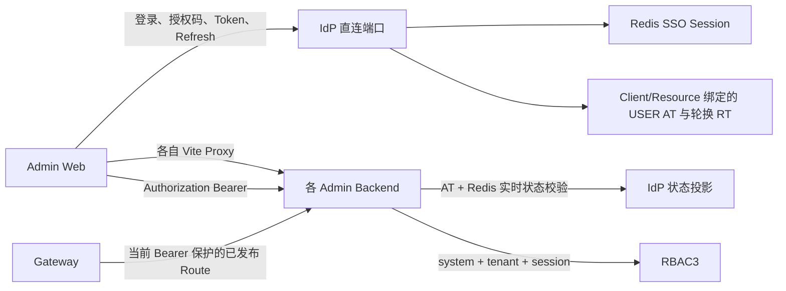
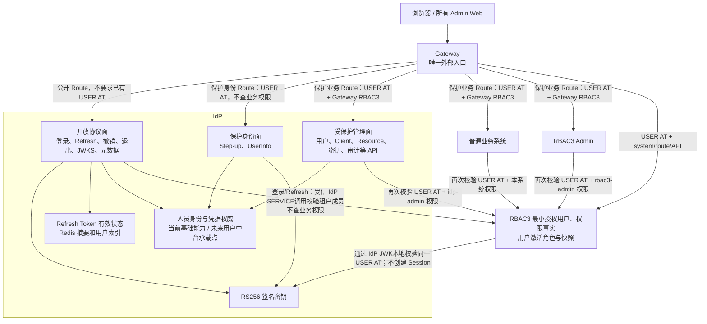
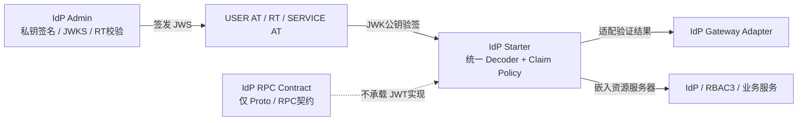
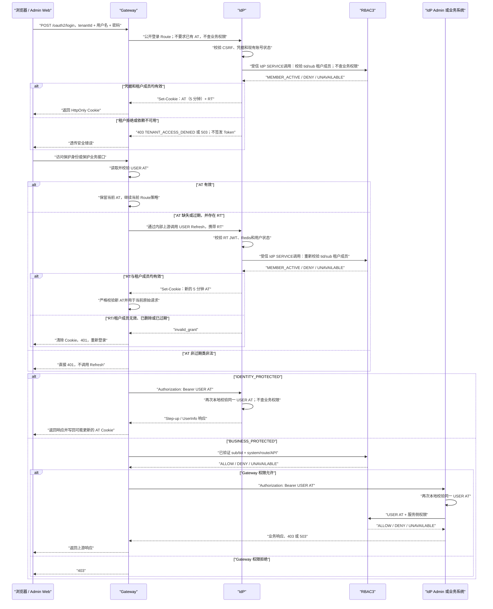
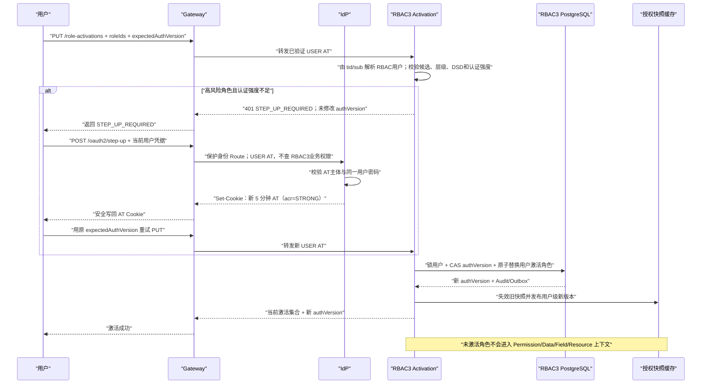
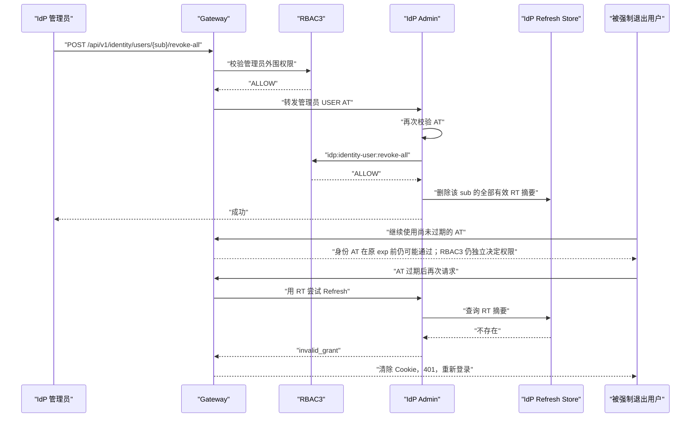

# 统一身份无 Session JWT 与 Gateway 自动刷新改造规格

> 状态：待用户再次书面审查
> 编写日期：2026-08-13
> 复审日期：2026-08-14
> 代码基线：`main@34547c56`
> 适用仓库：`/Users/mario/SelfProject/Egon-COLA`

主要涉及模块：

- `egon-cola-platforms/egon-cola-platform-idp`
- `egon-cola-platforms/egon-cola-platform-rbac3`
- `egon-cola-platforms/egon-cola-platform-gateway`
- `egon-cola-platforms/egon-cola-platform-admin-web-shared`
- IdP、RBAC3、Gateway、DDC 等现有 Admin Web
- `scripts/unified-platform` 与统一身份本地启动、验证脚本

本文固化 2026-08-13 已确认的统一身份改造方向：人员登录链只使用一个平台级
Access Token 和一个 Refresh Token；彻底移除 IdP、RBAC3、Gateway 和业务服务中的
人员 Session 语义；Gateway 成为唯一外部入口，并在人员 Access Token 缺失或过期时
使用 Refresh Token 向 IdP 自动换取新的 Access Token；IdP 同时保留开放身份协议面和
受 RBAC3 保护的管理业务面。RBAC3 继续保留角色激活能力，但激活集合从“登录 Session
状态”改为“租户内 RBAC 用户的应用级授权状态”；未激活角色及其权限不得进入权限上下文。
无论 USER 还是 SERVICE，Access Token、签名密钥和认证凭据的权威都统一在 IdP；RBAC3
只保存最小授权主体与权限之间的授权事实，不再签发 Token、保存密码或复制用户核心资料。
IdP 作为人员身份与凭据权威，当前只完成本改造所需的既有身份能力收口，不在本期建设完整
用户中台。JWT 的身份协议、签发和验签能力归 IdP 模块体系，Gateway Adapter 复用 Starter
的验证能力；RPC Contract 不承载密码学实现，本期也不新建通用 `component-jwt`。

本文是设计规格，不是实施计划。本文经用户审查后，下一阶段才编写逐文件、逐提交、
逐验证命令的 implementation plan；本阶段不修改生产代码、不修改数据库、不启动项目。

---

## 1. 文档权威性与旧设计覆盖关系

### 1.1 本文的权威范围

本文是以下主题的最新权威设计：

- 人员登录、刷新、退出和强制退出；
- 人员 Access Token 与 Refresh Token 契约；
- 跨 Admin Web 的 JWT SSO；
- Gateway 外部入口、Access Token 校验和自动刷新；
- IdP 管理业务域的 Access Token 与 RBAC3 双重保护；
- IdP、RBAC3 的用户数据职责及 RBAC3 最小授权用户模型；
- JWT 签发、验签、Claim 契约和各 IdP 模块的代码归属；
- RBAC3 人员授权快照与 Session 解耦；
- 业务服务绕过 Gateway 时的本地 Access Token 与权限校验；
- 相关前端、Cookie、Redis Key、数据库 Session 表和运行配置清理。

### 1.2 被本文覆盖的旧决策

本文覆盖
`docs/superpowers/specs/2026-08-01-unified-identity-platform-design.md`
中与下列内容有关的旧决策：

- SSO Session、SSO Cookie 和 `sid`；
- `(tenantId, sessionId)` RBAC3 Authorization Context；
- Authorization Code + PKCE 作为内部 Admin Web 人员登录主链；
- 按 OAuth Client、Resource Server 和单一 Resource Audience 签发 USER Token；
- Access Token 由前端内存保存并由前端主动刷新；
- Refresh Token 每次刷新轮换及重放时撤销整个 Family；
- `tokenVersion`、用户实时状态、Resource Version 使旧 Access Token立即失效；
- Gateway 只做身份校验、不做业务域或接口权限校验；
- USER Access Token 默认 15 分钟或动态 5 至 30 分钟。

本文同时覆盖
`docs/superpowers/specs/2026-08-10-oauth2-resource-server-admission-design.md`
中的“单 Resource USER Access Token”部分。该旧规格中的 SERVICE Access Token、
Client Credentials、Admission Ticket、DDC Provider 准入和机器身份边界不由本文删除；
它们不进入人员登录、人员 SSO、人员 Refresh Token 或人员 Session 模型。其中 SERVICE
认证凭据和 Access Token 的权威实现固定在 IdP；这句话不授权保留 RBAC3 自己的
`ServiceCredential`、JWT签名密钥或 Token签发链。

如果其他旧 Spec 或 Plan 把 IdP/RBAC3 Session、`sid`、USER Resource Audience、
前端 Refresh 或即时 `tokenVersion` 撤销声明为冻结契约，以本文为准。实施计划必须显式
标记这些旧计划中的冲突步骤，不得机械续跑旧计划。

同日的 RBAC3 Admin 领域分包已经完成并合并到当前 `main`：生产代码已按
`admin.<domain>.controller/domain/repository/service` 组织，`activation`、`authorization`、
`session`、`runtime` 等均是当前真实包。本文以迁移后的路径为实施基线；后续 plan 不再安排
重复搬包，也不得引用迁移前的 `application/infrastructure/interfaces` 旧路径。分包 Spec
冻结的是当时的结构迁移行为，本文则明确覆盖其中与人员 Session、角色激活和授权上下文
有关的运行契约。

---

## 2. 术语和边界

| 术语 | 本文含义 |
|---|---|
| USER Access Token | IdP 为人员身份签发的、固定 5 分钟、全平台通用的 JWT |
| Refresh Token | IdP 为人员身份签发并在 IdP Redis 保存有效摘要的长期 JWT |
| SERVICE Access Token | IdP 通过 Client Credentials 签发的 `typ=at+jwt`；仍属于 Access Token 类型，不是第三种 Token 类型，不配套 Refresh Token |
| 开放协议接口 | 不要求调用方已经持有 USER Access Token 或 RBAC3 权限，但仍严格校验该接口自己的凭据和请求完整性 |
| 保护身份接口 | 必须持有有效 USER Access Token，可触发 Gateway 自动 Refresh，但不执行业务域 RBAC3 权限判断 |
| 保护业务接口 | 必须持有有效 USER Access Token，并通过 Gateway 与目标服务的 RBAC3 权限判断 |
| 无 Session | 不存在服务端登录 Session、SSO Session、RBAC3 Session、Session Fence、Session Version 或按登录 Session 保存的 Active Role；不表示删除 RBAC3 的用户角色激活能力 |
| 无状态 Access Token | Gateway、IdP、RBAC3 和业务服务仅通过签名与声明验证 USER Access Token，不查询用户登录 Session 或 Token Version |
| 用户激活角色集合 | RBAC3 按 `(tenantId, rbac3UserId, applicationId)` 保存的授权状态；它决定哪些有效角色族进入权限上下文，与 AT、RT 和登录 Session 无关 |
| IdP 用户 | 人员身份主数据与认证安全状态的唯一权威；当前承载已有登录标识、展示名、账号状态、密码凭据和登录安全状态，不表示本期建设完整用户中台 |
| RBAC3 用户 | 某个 IdP `identitySub` 在一个 RBAC3 Tenant 中的最小授权主体，只承载身份绑定、租户授权状态、授权版本和审计元数据，不承载密码或用户核心资料 |
| JWT 签名/验签 | 本文口语中的“JWT 加解密”实际指当前 RS256 JWS 的私钥签名与公钥验签；Token Payload 未加密，本期不引入 JWE |

Refresh Token 有效记录、JWK 缓存、RBAC3 权限快照缓存、审计日志和 Outbox 都不是登录
Session。IdP 必须保存 Refresh Token 的服务端有效状态，才能执行退出、强制退出和过期
校验；这不改变 USER Access Token 的无状态性。

---

## 3. 已确认的强制决策

| 编号 | 决策 |
|---|---|
| SJ-01 | 所有浏览器和外部 USER HTTP 调用只能通过 Gateway 访问 IdP、RBAC3、DDC、Gateway Admin 和普通业务系统；受信机器内部调用继续遵守各自 SERVICE/Admission 边界 |
| SJ-02 | IdP 内部监听地址只作为 Gateway 上游、JWK 内部读取或受信服务调用地址，不作为浏览器 Issuer/API 地址 |
| SJ-03 | IdP 同时包含开放协议面和受保护管理面；IdP Admin 不是认证旁路 |
| SJ-04 | `/oauth2/login`、USER Refresh、撤销、退出、JWKS 和元数据是开放协议路由，不要求已有 USER Access Token 或 RBAC3 权限 |
| SJ-05 | “开放”只表示可匿名发起；登录必须校验账号密码，刷新必须校验 Refresh Token，Client Credentials 必须校验 Client Assertion |
| SJ-06 | IdP 的 `/api/**` 管理接口必须像普通业务系统一样再次校验 USER Access Token，并使用 `systemCode=idp-admin` 执行 RBAC3 权限判断 |
| SJ-07 | IdP 管理员与其他用户使用同一个登录入口和同一种 USER Access Token/Refresh Token，不签发管理员专用 Token |
| SJ-08 | 身份认证成功与业务域授权分离；用户可以登录成功并获得 AT/RT，但无 `idp-admin` 权限时访问 IdP Admin 返回 403 |
| SJ-09 | USER Access Token 固定有效 5 分钟；`exp = iat + 300 秒`，不得动态延长，也不得在 `exp` 后增加正向容忍窗口 |
| SJ-10 | 同一个 USER Access Token 可跨 Admin Web、跨业务域使用，不再按 Client 或 Resource Server 签发人员 Token |
| SJ-11 | USER Access Token 保留单一租户 `tid`；跨客户端/业务域 SSO 指同一租户上下文，不表示一个 Token 同时代表多个租户 |
| SJ-12 | USER Access Token 不包含 `sid`、`session_id`、`client_id`、`token_version`、`resource_version`、`nonce`、角色、权限、数据范围或字段策略 |
| SJ-13 | USER Access Token 使用固定的平台 Audience；业务域权限由 RBAC3 决定，不由 Audience 隔离 |
| SJ-14 | USER Access Token 不在 IdP、Gateway、RBAC3 或业务服务持久化；IdP 只负责签发和密钥权威 |
| SJ-15 | Refresh Token 不绑定 Session、OAuth Client 或 Resource Server；同一登录上下文使用一个人员 Refresh Token |
| SJ-16 | 本期 Refresh Token 不按每次刷新轮换；刷新只签发新的 USER Access Token，Refresh Token 使用绝对过期时间，不因刷新滑动续期 |
| SJ-17 | IdP Redis 只保存 Refresh Token 摘要、主体/租户索引、过期时间和有效状态，不保存明文 Refresh Token |
| SJ-18 | Gateway 不保存 AT、RT 或人员 Session；Gateway 节点扩缩容不改变登录状态 |
| SJ-19 | Gateway 只在 USER Access Token 缺失或确认为过期且存在 RT 时自动调用 IdP 刷新 |
| SJ-20 | USER Access Token 签名错误、Issuer 错误、Audience 错误、类型错误或格式错误时直接 401，不尝试刷新 |
| SJ-21 | RBAC3 拒绝产生 403；403 不触发刷新，也不伪装为登录失败 |
| SJ-22 | Gateway 刷新成功后必须在同一个原始请求中使用新 AT 继续权限校验和路由，并把新 AT Cookie 写回浏览器 |
| SJ-23 | Refresh 路由本身不得触发 Gateway 自动刷新，Gateway 调 IdP 刷新使用内部上游地址，避免递归进入公开 Gateway 路由 |
| SJ-24 | Gateway 仅在保护业务路由执行外围业务域/Route/API 权限判断，目标服务再次执行服务侧权威权限判断；任一层拒绝即拒绝 |
| SJ-25 | Gateway 只向目标服务转发 USER Access Token；Refresh Token 和浏览器认证 Cookie不得转发给普通业务服务 |
| SJ-26 | IdP、RBAC3 和所有业务服务都必须在本地再次校验同一个 USER Access Token；目标服务永不使用 RT 自动刷新 |
| SJ-27 | 绕过 Gateway 调用目标服务时，有效 AT 仍需通过服务侧 RBAC3；过期 AT 直接 401，服务端不读取 RT |
| SJ-28 | RBAC3 授权快照身份键改为 `(systemCode, tenantId, identitySub)`，不再包含 Session ID 或 Session Version |
| SJ-29 | RBAC3 从已验证 USER Access Token 派生 `identitySub` 和 `tenantId`，不信任调用方传入的身份查询参数 |
| SJ-30 | RBAC3 Session、Session Fence、Session Version 和 RBAC3 Refresh Token 运行链全部移除；`rbac3_session_active_role` 及其 Session 外键删除，但角色激活能力不得删除 |
| SJ-31 | Assignment 只产生可激活候选；RBAC3 按 `(tenantId, rbac3UserId, applicationId)` 保存当前激活根角色集合，只有仍满足 Role/Assignment/层级/DSD/策略规则的激活角色族才能进入权限上下文，未激活角色权限不得回查或填充 |
| SJ-32 | 权限字符、菜单、按钮、路由、API、数据和字段策略继续归 RBAC3；本期不重新设计细粒度权限模型 |
| SJ-33 | 强制退出和用户主动全局退出只删除/失效该用户 Refresh Token；已经签发的 USER Access Token 最多继续有效至原 `exp` |
| SJ-34 | 密码修改、密码重置和现有账号禁用可复用同一 RT 撤销机制；本期不新增“账号冻结”状态或管理功能 |
| SJ-35 | 权限或角色被撤销时，RBAC3 仍可在 AT 到期前立即拒绝请求；“AT 最多继续五分钟”只表示身份 JWT 仍有效，不保证业务权限仍允许 |
| SJ-36 | 人员浏览器主链不再使用 SSO Cookie、Authorization Code、PKCE 回调或前端 Token Store；JWT Cookie 本身提供跨客户端免登录 |
| SJ-37 | 现有 SERVICE Access Token、Client Credentials 和 Admission Ticket 保持在机器身份边界，不得混入 USER Refresh、USER SSO 或 USER RBAC3 Session |
| SJ-38 | 不新增登录 JWT、业务域 JWT、客户端 JWT、Session JWT 或其他人员认证 Token |
| SJ-39 | Cookie 模式下必须保留登录 CSRF 防护，并在 Gateway 对变更类请求执行可信 Origin/Referer 或等价请求完整性校验；CSRF 随机值不是身份 Token |
| SJ-40 | 该改造是开发期破坏式直接切换：旧 SSO Cookie、旧 USER AT、旧 RT、旧授权码、旧 RBAC3 Session 和旧 Session Active Role 数据全部丢弃，不做迁移、回填、双读或兼容，用户重新登录并按需重新选择激活角色 |
| SJ-41 | 登录、Refresh、Access Token 过期、Gateway 节点切换和跨客户端访问都不得重置用户激活角色集合；激活变更推进 RBAC3 用户授权版本并使对应系统快照失效，不要求重签 USER AT |
| SJ-42 | 现有高风险角色激活的二次认证语义保留，但不再写入 RBAC3 Session；IdP 在同一种 USER AT 中签名携带认证强度和认证时间，二次认证只签发新的 5 分钟 AT，不创建第三种 Token 或服务端 Session |
| SJ-43 | Gateway Route 必须显式且互斥地分为“开放协议”、“保护身份”和“保护业务”三类；前两类不得因缺少业务权限阻断登录、Refresh、Step-up 或 UserInfo |
| SJ-44 | USER/SERVICE Access Token、Refresh Token、签名密钥和人员/机器认证凭据的唯一权威都是 IdP；RBAC3 不得签发或刷新任何 Token，不得保存 `ServiceCredential` 或自有签名私钥 |
| SJ-45 | RBAC3 可保留 `ServicePrincipal + ServicePermission` 作为机器主体授权事实，但机器 `client_id`、凭据校验、SERVICE AT签发和 Scope/Resource认证仍归 IdP；Admission Ticket 继续属于现有 DDC启动准入协议，不得复用为 RBAC登录或第三种平台访问 Token |
| SJ-46 | RBAC3 不再保存人员密码、密码散列、失败次数、登录锁定时间、用户名、规范化用户名、展示名或其他用户核心资料；`rbac3_user` 只保留租户内最小授权主体 |
| SJ-47 | IdP 是人员身份、登录标识、密码凭据、账号状态和登录安全状态的唯一权威；本期只收口现有能力和本方案必需字段，不开发完整用户中台、人员档案或组织人事能力 |
| SJ-48 | `rbac3_user` 固定以 `(tenant_id, identity_sub)` 唯一绑定 IdP 用户，保留 RBAC内部 `id`、本地授权状态、`auth_version`、行版本和审计字段；组织、岗位、角色、权限继续作为 RBAC授权关系或独立事实存在，不塞回用户核心资料 |
| SJ-49 | IdP Admin 持有平台 JWT 私钥并负责 AT/RT 签发与 JWKS；`idp-starter` 负责共享公钥验签和严格 Claim验证；`idp-gateway-adapter` 只把 Starter能力适配到 Gateway，不复制密码学和 Claim规则 |
| SJ-50 | `egon-cola-platform-idp-rpc-contract` 只保存稳定 RPC/Proto 契约，不直接声明 Spring Security/Nimbus、不保存密钥、不实现 JWT签发或验签；Bearer JWT只是调用 RPC时的传输凭据，不进入业务消息模型 |
| SJ-51 | 本期不新增 `component-jwt`，也不把 IdP Claim/Issuer/Audience/主体规则下沉到 Common Crypto；只有未来出现多个非 IdP协议的真实复用者时，才可另行评审只含无状态 JOSE/JWK原语的组件 |
| SJ-52 | 当前 RS256 Token 是签名 JWT（JWS），不是加密 JWT（JWE）；本期不增加 Payload加密、JWE密钥或解密链 |

---

## 4. 当前代码基线与目标差距

### 4.1 当前 IdP 已具备的正确边界

以下能力已经存在，实施时应复用而不是推倒重建：

| 当前能力 | 代码位置 |
|---|---|
| Spring Security 已配置 `SessionCreationPolicy.STATELESS` | `idp-admin/.../support/security/IdpSecurityConfig.java` |
| IdP 保护接口按 IdP Bearer Filter、RBAC3 Filter 顺序执行 | `IdpSecurityConfig.java` |
| IdP Admin 已依赖 `egon-cola-platform-rbac3-starter` | `egon-cola-platform-idp-admin/pom.xml` |
| IdP RBAC3 `system-code` 已是 `idp-admin` | `idp-admin/src/main/resources/application.yml` |
| IdP 管理 Controller 已使用 `@AuthenticationPrincipal IdentityPrincipal` | `identity/controller/IdentityUserController.java` 等 |
| IdP 管理业务已显式检查 `idp:*` 权限 | `IdpAdminAuthorizationPort` 及各 Controller |
| IdP 已签发 RS256 `typ=at+jwt` 并提供 JWKS | `Rs256TokenService.java`、`OAuthJwksController.java` |
| Refresh Token 已使用签名 JWT 和 Redis 摘要状态 | `RefreshTokenClaims.java`、`RedisRefreshTokenStore.java` |
| 现有账号已具有 `ACTIVE/DISABLED/LOCKED` 状态与登录限制 | `IdentityFacade.java`、IdP V1 migration |
| IdP 已有用户核心与登录安全模型 | `IdentityUser.java`、`IdentityUserEntity.java`、IdP Password Credential模型 |
| IdP Starter 已持有 Spring Security JOSE/JWT 验证依赖 | `idp-starter/pom.xml`、`IdpJwtVerifier.java`、`RetryingJwtDecoder.java` |
| Gateway Adapter 已依赖 Starter并委托共享验证器 | `idp-gateway-adapter/pom.xml`、`IdpGatewayJwtVerifier.java` |
| IdP RPC Contract 当前只有稳定 Admission Proto | `idp-rpc-contract/pom.xml`、`resource_server_admission.proto` |

`@AuthenticationPrincipal` 只注入安全链已经认证的人员主体。它不自行解析 JWT、不访问
RBAC3，也不等价于权限注解。改造后该用法继续保留，但 `IdentityPrincipal` 不再携带
Session、Client 或 Token Version。

### 4.2 当前必须移除或改写的链路

| 当前实现 | 当前行为 | 与目标的冲突 |
|---|---|---|
| `OAuthLoginController` | 密码通过后创建 12 小时 SSO Session 和 SSO Cookie | 仍是服务端登录 Session |
| `/oauth2/authorize` + Authorization Code | 依赖 SSO Principal，再按 Client/Resource 换码 | 人员登录被拆成 Session + Code + Token 多段链 |
| `OAuthTokenController` | USER Token 按 `client_id + resource` 签发 | 不能跨 Client 和业务域复用 |
| `AccessTokenClaims` | 包含 `sid/client_id/token_version/resource_version/nonce` | USER AT 与 Session 和单 Resource 耦合 |
| `TokenFacade.refresh` | 每次 Refresh 轮换并在并发时执行重放撤销 | Gateway 并发自动刷新会出现误撤销风险 |
| `IdpJwtVerifier` | 每次读取用户、Resource、Client Redis 状态 | USER AT 不是真正本地无状态验证 |
| `IdentityUserServiceImpl.revokeAll` | 递增 Token Version 并撤销 Refresh Family | 旧 AT 立即失败，不符合五分钟窗口 |
| `IdpBearerCredentialExtractor` | 只读取 Authorization Bearer | Gateway 看不到浏览器 RT，不能自动刷新 |
| `IdpIdentityAuthenticationProvider` | 验证异常统一为 DENY | 无法区分 EXPIRED 与 INVALID |
| Admin Web Shared | Access Token 存内存，401 后由前端调用 IdP 刷新 | 刷新责任不在 Gateway |
| RBAC3 React SDK | `InMemoryAccessTokenStore`、`Rbac3ApiClient.refresh()`、`Rbac3Provider` 启动刷新与 `useRbac3Session` 仍保存 Token/Session 语义 | 即使后端删表，前端仍会直接刷新、保存 Bearer 并依赖 Session Contract |
| 本地脚本 | `VITE_IDP_ISSUER` 与各 Admin API 指向独立后端端口 | Gateway 不是唯一外部入口 |
| `HttpRbac3AuthorizationClient` | 按 tenant/session/identity 查询快照 | RBAC3 权限上下文依赖 Session |
| `SingleFlightSnapshotLoader` | 缓存和一致性绑定 `principal.sessionId()` | 无法在无 Session 主体下工作 |
| `Rbac3JwtSessionAuthenticationProvider` / `Rbac3GatewayJwtVerifier` | Gateway 再验证 RBAC3 自签 `Rbac3TokenClaims`，再以 `SessionVerifier` 查 Session/Version | USER AT 只能由 IdP 签发和验证；RBAC3 Gateway Adapter 不应再是第二个人员认证器 |
| `Rbac3GatewayRuntimeSnapshotReader` | 从 `rbac3.session-id/auth-version/session-version/policy-version` 属性读 Redis Session、Fence 和 Session Snapshot | 应只从已认证 IdP `GatewayPrincipal(sub, tid)` 读取用户级授权快照 |
| `Rbac3TrustedIdentityMapper` | 向下游写 `x-egon-gateway-session-id/session-version` 等 Session Header | 该 USER 映射职责删除；下游以原始 IdP USER AT 为身份权威 |
| `IdentityMappingFacade` / `IdentityResolveRequestDTO` | USER 身份映射仍要求 `clientId` | 平台 USER AT 无 Client 维度，人员映射必须改为 `(tenantId, identitySub)` |
| `admin.activation` | `RoleActivationController`、`RoleActivationFacade`、`ActiveRoleSet` 和候选/层级/DSD 校验均已实现，但状态、CAS、Fence、快照投影绑定 Session | 激活语义应保留，仅把身份键、版本和运行投影改为用户级 |
| `RoleActivationFacade` | 高风险根角色依赖 Session 中的认证强度和 `strongAuthenticatedAt` | Session 删除后必须改为校验 IdP 签名 AT中的认证上下文 |
| `AuthController` / `SessionController` | RBAC3 还提供 Session Logout、Session Bootstrap、会话列表与撤销 API | 全部 Session API 应删除；Bootstrap 改为用户级授权快照，全局 Logout 唯一调用 IdP |
| RBAC3 `admin.auth` | 仍存在人员 `AuthenticationFacade`、`PasswordIdentityAuthenticator`、`JwtTokenService`、`RefreshFacade`、`StepUpFacade`、`JwtKeyRingService` 以及 Session 强化适配器 | USER/SERVICE认证、AT/RT签发、签名密钥和二次认证统一归 IdP；RBAC3只保留资源服务验证与授权能力 |
| `rbac3_user_credential` | RBAC3仍保存人员密码凭据 | IdP已经是人员凭据权威；该表及人员密码读写链在破坏式切换中删除 |
| `rbac3_user` | 同时保存 `username/normalized_username/display_name/locked_until` 等身份/登录字段，以及组织岗位快照字段 | RBAC3 用户必须缩为以 `identitySub` 绑定的最小授权主体；身份核心字段和登录安全状态只能由 IdP持有 |
| `rbac3_external_identity` | 通过 `provider_code + external_subject_id` 再映射到 RBAC用户 | 平台统一只接受 IdP规范化后的 `identitySub`；外部身份联合将来由 IdP吸收，本期删除这层重复身份目录抽象 |
| `rbac3_service_credential` / `ServiceCredentialPO` | RBAC3仍可保存机器 Secret/Public Key，且与 `ServicePrincipalPO`同处授权模型 | IdP 已有 Client Credential、SERVICE AT和Resource/Scope权威；RBAC3机器凭据表与读写模型删除，只保留机器主体和权限关系 |
| `JpaPlatformAdminBootstrapRepository` / `Rbac3PlatformAdminBootstrapCli` | RBAC3 首管引导仍接收密码、使用 `PasswordEncoder`并写 `UserCredentialPO` | 引导不能成为 RBAC3 本地密码旁路；身份先由 IdP 建立，RBAC3 只绑定 `identitySub`并创建授权事实 |
| RBAC3 V1 表 | 存在 `rbac3_session`、`rbac3_session_active_role`、`rbac3_refresh_token` | 认证 Session/Refresh 表应删除；Session Active Role 表应被用户级 Active Role 表替代，而不是退化为全部 Assignment 生效 |

RBAC3 包迁移后的当前关键路径为：

```text
admin/activation/controller/RoleActivationController.java
admin/activation/service/RoleActivationFacade.java
admin/activation/repository/jpa/JpaSessionActiveRoleRepository.java
admin/authorization/service/AuthorizationDecisionService.java
admin/runtime/service/SystemAuthorizationSnapshotService.java
admin/session/**
admin/auth/**
admin/identity/repository/jpa/JpaPasswordCredentialRepository.java
admin/identity/repository/jpa/CredentialRow.java
admin/config/security/CurrentRbac3Principal.java
admin/bootstrap/repository/jpa/JpaPlatformAdminBootstrapRepository.java
egon-cola-platform-rbac3-react-sdk/src/**
egon-cola-platform-rbac3-admin-web/src/features/session/**
```

后续 implementation plan 必须以这些现有路径为起点：保留并改造 `activation`，删除
`session` 人员运行链和 `auth` 中的人员认证/发 Token职责，重写
`authorization/runtime/config.security` 中的 Session 输入。当前
`ServicePrincipalPO/ServicePermissionPO` 只承载机器主体授权事实，可以迁入明确的授权包；
`ServiceCredentialPO`、`JwtTokenService`、`JwtKeyRingService` 及 RBAC3 JWT 私钥配置属于
认证/签发职责，必须删除。真实机器调用者继续从 IdP 获取 SERVICE AT，再由 RBAC3决定其
权限，不得为了兼容调用者在 RBAC3保留第二套凭据或 Token权威。现有
`AuthController.bootstrap()`和 `DefaultLoginStateService`中的候选聚合语义可迁入
`bootstrap/authorization`；除此以外的登录、Refresh、Step-up、JWT、密码、登录状态/审计
Adapter及其在 `identity`包中的 `JpaPasswordCredentialRepository`全部删除，不能因为跨包
引用而漏删。完成后 `admin.auth`人员认证包整体消失，Bootstrap不再挂在“认证”语义下。

### 4.3 当前实际拓扑

当前本地 Admin Web 的 Issuer 和 API Proxy 直接指向 IdP/RBAC3/Gateway/DDC Admin
端口；Gateway 当前安全适配器只处理 Bearer，现有本地发布脚本主要验证 Mock/MCP Route。
因此不能把当前运行形态描述为“所有人员请求已经经过 Gateway”。



---

## 5. 目标与非目标

### 5.1 目标

1. 建立只有 USER Access Token 和 Refresh Token 的人员认证模型；
2. 完全移除人员 Session、SSO Session、RBAC3 Session 和 Session 级 Active Role 绑定，同时保留用户级角色激活能力；
3. 让一个 5 分钟 USER Access Token 在同一租户内跨客户端、跨业务域使用；
4. 让 Gateway 成为所有外部请求的唯一入口；
5. 让 Gateway 在 AT 缺失或过期时使用 RT 向 IdP 自动刷新；
6. 让 IdP 的开放协议接口和受保护管理接口具有明确、不同的安全策略；
7. 让 IdP 管理员和普通平台用户使用同一登录与 Token 模型；
8. 让 Gateway 与每个保护业务目标服务都校验同一个 USER AT并执行各自 RBAC3 权限判断；
   保护身份端点只做 Gateway + IdP两次 USER AT校验，不要求业务域权限；
9. 让 RBAC3 权限快照以业务系统、租户和人员身份为键，不再以 Session 为键；
10. 让强制退出通过撤销 RT 生效，已签发 AT 最多保留五分钟身份有效期；
11. 让跨客户端免登录完全由 Gateway 域的 JWT Cookie 完成，不建立服务器 SSO 状态；
12. 保持 IdP 的 SERVICE Access Token与现有 Admission能力，但删除 RBAC3重复的机器凭据、签名和发 Token能力；
13. 保证只有用户明确激活且当前仍有效的角色族进入权限上下文，未激活角色权限不生效；
14. 把 RBAC3 用户收缩为租户内最小授权主体，彻底删除 RBAC3人员密码和重复用户核心资料；
15. 固定 JWT模块职责：IdP Admin签发，IdP Starter统一验签，Gateway Adapter复用适配，
    RPC Contract保持纯契约，本期不新增通用 JWT组件。

### 5.2 非目标

- 不在本期重新设计菜单、按钮、路由、API、数据、字段权限的数据模型；
- 不实现新的账号冻结状态、冻结后台页面或冻结审批流程；
- 不实现 MFA、短信、邮件、社交登录、SAML、SCIM 或外部身份联合；
- 不在本期建设完整用户中台，不新增人员档案、联系方式、实名、画像、偏好、生命周期、
  组织人事主数据或对应管理页面；
- 不删除 IdP Client Credentials、IdP SERVICE Access Token、Admission Ticket 或 MCP 异步任务机器身份；
- 不把角色、权限、数据范围或字段策略写进 USER Access Token；
- 不让 Gateway 或业务服务保存人员 AT/RT/Session；
- 不让普通业务服务接收、读取、代理或刷新人员 Refresh Token；
- 不保留旧 Session、旧授权码或旧 USER Token 的双栈兼容；
- 不迁移旧 Session Active Role、旧 Refresh Family 或 IdP `tokenVersion` 数据；
- 不把 JWT实现放进 RPC Contract，不新建 `component-jwt`，不引入 JWE或 Payload加密；
- 不在本规格阶段修改生产代码、数据库或编写 implementation plan；
- 不启动项目，不执行浏览器或运行态联调。

---

## 6. 目标总体架构



### 6.1 IdP 的双重角色

IdP 必须同时满足两种角色，不能只实现其中之一：

1. **身份协议服务**：登录、刷新、撤销、退出、JWK 和元数据为开放协议接口；
   Step-up 和 UserInfo 为保护身份接口。两者都不要求业务域权限，但必须满足自己的
   凭据或 USER AT 校验。
2. **受保护业务系统**：用户、OAuth Client、Resource Server、签名密钥、审计和管理配置。
   这些接口必须通过 Gateway USER AT 校验、Gateway RBAC3、IdP 本地 USER AT 校验和
   IdP RBAC3 权限校验。

IdP 管理页面的登录不建立特殊“管理员会话”。认证成功后是否能进入 IdP Admin，由
`idp:bootstrap:read` 及后续 `idp:*` 权限决定。

### 6.2 两层 PEP

Gateway 与目标服务都是 Policy Enforcement Point：

- Gateway 使用 Route、Operation、business domain 和 required permission 做外围拒绝；
- 目标服务使用自己的接口/方法权限做最终权威拒绝；
- 两层共享 RBAC3 权限事实，但可以各自缓存快照；
- Gateway 放行不替代服务鉴权，服务放行也不能绕过 Gateway 外围策略；
- RBAC3 不可用时两层均 fail closed，不能降级为匿名或默认允许。

---

## 7. USER Token 契约

### 7.1 USER Access Token

USER Access Token 使用 RS256 JWT。

JOSE Header：

| 字段 | 要求 |
|---|---|
| `alg` | 固定 `RS256` |
| `typ` | 固定 `at+jwt` |
| `kid` | 必须存在，并能在当前或仍处于验证窗口的 JWKS 中找到 |

Claims：

| Claim | 要求 |
|---|---|
| `iss` | 稳定的对外 IdP Issuer；该 URL 由 Gateway 路由，不暴露 IdP 内部端口 |
| `principal_type` | 固定 `USER`；只用于把人员 Access Token 与 `SERVICE` Access Token 做结构化区分，不是第三种 Token |
| `sub` | 不可变 `identitySub` |
| `tid` | 当前唯一租户 ID |
| `aud` | 有且只有一个固定的平台级 USER Audience，不按客户端或业务域变化 |
| `jti` | 每个 AT 唯一 |
| `iat` | 秒精度签发时间 |
| `nbf` | 不得晚于 `iat`；默认与 `iat` 相同 |
| `exp` | 必须严格等于 `iat + 300 秒` |
| `acr` | 可选；允许值按现有等级为 `PASSWORD/MFA/STRONG`，只表达 IdP 已验证的认证强度，不得表达角色或权限。本期密码 Step-up 成功签发 `STRONG`；缺失时规范化为 `PASSWORD` |
| `auth_time` | Epoch Second；`acr=MFA/STRONG` 时必须存在，表示该强度最近一次由 IdP 验证的时间；`PASSWORD` 可省略 |

禁止出现：

```text
sid
session_id
client_id
token_version
resource_server_id
resource
resource_version
nonce
roles
permissions
capabilities
dataScopes
fieldPolicies
authVersion
sessionVersion
contextVersion
```

验证 USER AT 时必须检查签名、`alg/typ/kid`、Issuer、平台 Audience、
`principal_type=USER`、`sub/tid/jti`、
`iat/nbf/exp`；存在 `acr/auth_time` 时还必须校验允许值、类型和时间关系。不得读取 IdP 用户
状态 Redis、OAuth Client 状态、Resource Server 状态、Refresh Store 或 RBAC3 Session。
各节点必须依赖时钟同步；`exp` 后不得继续接受该 AT。

`acr/auth_time` 不是第三种 Token，也不是 Session。现有角色规则的等级比较
`PASSWORD < MFA < STRONG` 保留；本期不凭空新增 MFA 认证流，只把已存在的“密码
Step-up -> STRONG”语义迁到 IdP。高风险角色激活需要二次认证时，IdP 校验当前
用户凭据并重新签发同一种 5 分钟 USER AT；新 AT 带 `acr=STRONG` 和当前
`auth_time`，RT 不轮换。初次密码登录和普通 Refresh签发 `acr=PASSWORD`；Verifier也把
兼容性缺失的 `acr`规范化为 `PASSWORD`。普通 Refresh不继承旧
AT 的 `MFA/STRONG`，防止通过长期 RT 无限延长强认证窗口。

Step-up 请求体只接受当前用户密码，不接受可由调用方替换的
`username/identitySub/tenantId`。IdP 必须从已验签 USER AT 获得 `sub/tid`，在
`IdentityFacade` 增加按 `identitySub` 绑定的当前密码验证用例，复用现有账号
状态、PasswordHashPort、失败计数、密码升级和审计能力。不能把用户名+密码
再次交给 RBAC3，也不能允许用 A 的 AT 与 B 的凭据完成 Step-up。

### 7.2 Refresh Token

人员 Refresh Token 继续使用 IdP 签名 JWT，Header 保持 `alg=RS256`、`typ=JWT` 和
`kid`，Claim 使用 `token_use=refresh` 与 USER AT 严格区分。

Refresh Token 只允许包含：

| Claim | 要求 |
|---|---|
| `iss` | 与 USER AT 相同的 IdP Issuer |
| `sub` | 人员 `identitySub` |
| `tid` | Refresh 所属唯一租户 |
| `jti` | Refresh Token 唯一标识 |
| `token_use` | 固定 `refresh` |
| `iat`、`nbf`、`exp` | 绝对有效期；刷新时不延长 `exp` |

禁止包含 `token_id`、`sid`、`session_id`、`client_id`、`family_id`、`generation`、`token_version`、
`resource_server_id`、`resource`、`resource_version` 和 `nonce`。

Refresh TTL 继续由现有 IdP Runtime Policy 管理并保持当前 1 至 30 天安全边界；本文不
改变其默认值。无论配置多少天，`exp` 都在首次登录签发时固定，后续 Refresh 不滑动续期。

IdP 校验 Refresh Token 时必须同时满足：

1. JWT 签名、Issuer、Type/Use 和时间有效；
2. Redis 中存在该 Token 摘要且状态有效；
3. Redis 记录的 `sub/tid/exp` 与 JWT 一致；
4. 当前用户仍满足现有登录允许状态；
5. 当前租户成员映射仍有效；
6. Refresh Token 未被退出、强制退出、密码安全操作或过期清理撤销。

第 4 项复用当前 `ACTIVE/DISABLED/LOCKED` 行为，不新增“冻结”状态。第 5 项通过现有
IdP SERVICE身份调用 RBAC3 做租户成员校验，不执行业务域/API 权限判断；该内部调用
复用 IdP现有 SERVICE认证能力，不把刚签发或待刷新的 USER AT当作调用方凭据。RBAC3 或依赖暂时
不可用时返回暂时不可用，不得伪装成密码错误或 Token 伪造。

每次成功输入凭据建立一个独立 RT 记录；同一浏览器通过 Gateway Host Cookie在多个
Admin Web共享该 RT，不同浏览器/设备可以各自持有独立 RT。`revoke` 只撤销当前 RT，
`revoke-all` 按 `sub` 索引撤销该用户所有设备的 RT；任何一种情况都不创建 Session。

### 7.3 SERVICE Access Token 边界

现有 SERVICE Access Token 同样使用 `typ=at+jwt`，因此从 Token 类型上仍只有
Access Token 和 Refresh Token。SERVICE AT：

- 只能由 IdP 通过现有 Client Credentials/机器身份流程签发；
- 必须携带固定 `principal_type=SERVICE`，不得被 USER 入口接受；
- 不附带人员 Refresh Token；
- 不参与 JWT SSO、Gateway 人员自动刷新或人员 Cookie；
- 可继续使用精确 Resource Audience、Service Scope 和 Admission 契约；
- 不得被转换为 `IdentityPrincipal` 或用于模拟人员访问；
- 不得因此保留任何人员 Session 结构；
- 由 Gateway、RBAC3 或业务服务通过 IdP JWK和 SERVICE Contract验证；RBAC3不得二次
  签发、刷新或用自己的 `JwtKeyRingService` 验证另一套 RBAC3 Token。

IdP 保存 Client Credential、Client/Resource Grant、Scope和签名密钥；RBAC3最多保存
`ServicePrincipal + ServicePermission` 授权事实，并以验签后的 IdP SERVICE Principal
作为主体输入。当前 `rbac3_service_credential`、`ServiceCredentialPO`、RBAC3
`JwtTokenService/JwtKeyRingService` 和 RBAC3 JWT 私钥配置必须删除。Admission Ticket
继续是现有 IdP/DDC 的窄用途启动准入 JWT，不是第三种平台访问 Token，不得用于用户登录、
Refresh、RBAC角色激活或普通业务 API Bearer。

USER 与 SERVICE 的验证策略必须按安全策略/受保护入口明确选择，再严格校验
对应的 `principal_type`、Audience 和该主体类型的必需 Claim。类型缺失、错误或与入口不匹配
时必须拒绝，不能把不可信 Token 自动降级识别为 USER。

### 7.4 JWT 实现归属与模块依赖

当前 IdP 模块依赖方向已经适合直接收口：

```text
idp-gateway-adapter -> idp-starter -> idp-core + idp-rpc-contract
idp-admin -> idp-core + idp-rpc-contract + rbac3-starter
```

本方案固定以下代码归属：

| 模块 | 本期职责 | 明确禁止 |
|---|---|---|
| `egon-cola-platform-idp-core` | 保存不依赖 Spring/Nimbus 的 USER/SERVICE/Refresh Claim语义、Token Policy和签发/验证端口 | 私钥文件读取、JWK HTTP客户端、Spring Security Filter、Gateway SPI |
| `egon-cola-platform-idp-admin` | 唯一 Token Issuer；持有 IdP平台私钥，签发 USER AT、RT和 SERVICE AT，提供 JWKS并校验 RT；改造现有 `Rs256TokenService`而不是建立第二套签发器 | 把 IdP签名私钥下发给 Gateway、RBAC3或业务服务 |
| `egon-cola-platform-idp-starter` | 共享 Resource Server能力；维护 `RetryingJwtDecoder`、JWK公钥缓存、USER/SERVICE入口的严格验签和 Claim验证，并输出无 Session的可信 Principal | 签发平台 AT/RT、保存 IdP平台私钥、读取 USER RT、查询 RBAC Session |
| `egon-cola-platform-idp-gateway-adapter` | 通过 Adapter复用 Starter验证器，把 `VALID/EXPIRED/INVALID` 和可信 Principal映射为 Gateway安全链结果；承接 Cookie提取与自动 Refresh编排所需的 Gateway接口 | 复制 JWT解析/签名验证/Claim规则，或直接持有私钥、签发 Token |
| `egon-cola-platform-idp-rpc-contract` | 只保存稳定 Proto/RPC消息与服务声明；继续承载现有 Admission Contract | 引入 JOSE/Nimbus/Spring Security，保存密钥，签发/解析/验证 JWT，或把原始 Token定义为业务字段 |

`idp-starter` 中现有 `PrivateKeyJwtAssertionFactory` 是调用方用自身 Client私钥签名
`private_key_jwt` Client Assertion 的窄用途工具，不是 IdP平台 AT/RT签发器。它可以留在
Starter的机器调用能力内，但不得接触 IdP平台签名私钥，也不得被复用为 USER Token签发入口。

`idp-gateway-adapter` 当前已经依赖 `idp-starter`，因此 Gateway直接适配共享验证结果即可；
不得把 Starter的实现复制一份到 Adapter。RPC Contract位于 Starter的依赖下游，如果把
JWT实现塞进 Contract，会让纯传输契约反向承担安全基础设施并污染所有 RPC消费者，因此明确
不采用。Bearer或 Subject Token只作为 RPC/HTTP调用的安全元数据传递，由接收端 Starter
验证，不进入 Proto业务消息。

本期不创建 `egon-cola-component-jwt`。当前需要复用的是 IdP特有的 Issuer、Audience、
`principal_type`、USER/SERVICE/Refresh Claim和错误语义，不是跨领域的通用 JWT算法。
过早下沉会把身份协议规则泄漏到 Components。将来只有出现至少两个不依赖 IdP协议、且确实
重复 JOSE底层实现的调用域时，才另立规格评审一个只包含 JWS/JWK编解码、安全算法白名单和
时钟工具的无状态组件；IdP Claim规则、密钥权威和 Token Policy仍不得下沉。



本文所称 JWT“加解密”统一落实为 RS256 JWS 的“签名/验签”。JWS Payload只是 Base64URL
编码，并未保密；日志、URL、前端存储和普通业务服务仍不得暴露 RT。若未来需要 Claim保密，
必须单独设计 JWE密钥分发、轮换、解密方、性能和故障模型，不能在本次无 Session改造中隐式加入。

---

## 8. Cookie 与浏览器传输

### 8.1 Cookie 规则

浏览器人员认证使用两个 Gateway 对外 Host 的 Cookie：

| 属性 | USER AT Cookie `__Host-egon_user_at` | Refresh Cookie `__Host-egon_user_rt` |
|---|---|---|
| `HttpOnly` | `true` | `true` |
| `Secure` | 非本地环境固定 `true` | 非本地环境固定 `true` |
| `SameSite` | `Lax` | `Lax` |
| `Path` | `/` | `/` |
| `Domain` | 不显式设置，使用 Gateway 对外 Host-only | 不显式设置，使用 Gateway 对外 Host-only |
| `Max-Age` | 不超过 AT 剩余 5 分钟 | 不超过 RT 绝对剩余时间 |

生产/HTTPS环境固定使用上述 `__Host-`名称；因此必须同时满足 `Secure=true`、`Path=/`且无
`Domain`。本地纯 HTTP profile不能合法使用 `__Host-`前缀，应使用明确的
`egon_user_at_local/egon_user_rt_local`名称，禁止把本地非 Secure降级带到非本地环境。
旧的 SSO和按 Client命名的 Refresh Cookie必须在破坏式切换时按精确名称过期。

RT 的 Path 不能继续使用当前 `/oauth2`，因为 Gateway 必须在任意保护请求到达时判断是否
存在 RT。Gateway 读取后必须剥离 Refresh Cookie，普通业务上游永远看不到 RT。

IdP 对经 Gateway 代理的登录/刷新响应写 `Set-Cookie` 时不设置内部 IdP Domain；浏览器
以实际响应的 Gateway Host 保存 Cookie。Gateway 内部自动刷新调用必须读取 IdP 响应的
AT `Set-Cookie`，把新 AT 用于当前请求，并把该 Cookie 安全地写回外部响应。

### 8.2 不向前端暴露 Token

人员登录和 Refresh 响应不得把原始 AT/RT 放入可被 JavaScript 读取的 JSON、Header、
URL、LocalStorage、SessionStorage、日志或埋点。Admin Web 不解析 JWT，也不保存 Token。

Client Credentials 的 SERVICE AT OAuth 响应保持现有非浏览器契约，不适用上述人员
Cookie 限制。

### 8.3 CSRF 与 Origin

- 保留当前 `/oauth2/login/csrf` 双提交登录防护；
- Gateway 对使用认证 Cookie 的非安全 HTTP Method 校验可信 Origin/Referer 或等价机制；
- Gateway CORS 只允许已登记 Admin Web Origin，且显式允许 Credentials；
- CSRF 随机值只证明请求来源完整性，不代表身份、不进入 JWT、不计作第三种身份 Token；
- 不能因为 Spring Security 设置为 `STATELESS` 就继续无条件忽略全部 `/api/**` CSRF 风险。

---

## 9. IdP 端点与安全策略

### 9.1 对外端点矩阵

| IdP 端点 | Gateway 策略 | IdP 校验 | RBAC3 |
|---|---|---|---|
| `GET /.well-known/oauth-authorization-server` | 公开精确 Route | 无身份凭据；只读 | 不调用 |
| `GET /oauth2/jwks` | 公开精确 Route | 无身份凭据；只读 | 不调用 |
| `GET /oauth2/login/csrf` | 公开精确 Route | 生成请求完整性随机值 | 不调用 |
| `POST /oauth2/login` | 公开精确 Route | CSRF、用户名、密码、现有账号状态、租户成员 | 不检查业务权限 |
| `POST /oauth2/token` USER Refresh 分支 | 公开精确 Route，排除自动刷新 | `grant_type=refresh_token` + Refresh Cookie JWT + Redis 状态 + 用户状态 + 租户成员；不接受 USER `client_id/resource` | 不检查业务权限 |
| `POST /oauth2/token` Client Credentials 分支 | 公开精确 Route，排除自动刷新 | 现有 Client Assertion/Grant/Resource 规则 | 保持现有 SERVICE 边界 |
| `POST /oauth2/revoke` | 公开精确 Route | 仅从统一 Refresh Cookie 读 RT，存在时撤销；不接受 USER `client_id`，结果幂等 | 不调用 |
| `POST /oauth2/logout` | 公开精确 Route | 仅从统一 Refresh Cookie 读 RT 并撤销；不接受 USER `client_id/all_sessions`，AT 可已过期 | 不调用 |
| `POST /oauth2/step-up` | 保护身份 Route；可自动 Refresh，不因业务权限拒绝 | 当前 USER AT + 当前用户凭据；成功重签带 `acr=STRONG` 的 AT | 不检查业务权限 |
| `GET /oauth2/userinfo` | 保护身份 Route；可触发 Gateway 自动 Refresh | IdP 校验 USER AT并只返回当前主体信息 | 不要求 IdP Admin 权限 |
| `/api/v1/auth/bootstrap` | 保护业务 Route | IdP 再次校验 USER AT | `idp:bootstrap:read` |
| `/api/**` 其他 IdP Admin API | 保护业务 Route | IdP 再次校验 USER AT | 对应 `idp:*` 权限 |

公开 Route 必须使用精确 Method + Path，不允许用宽泛 `/oauth2/**` 匿名白名单覆盖未来新增
接口。`/oauth2/logout` 必须能在 AT 过期后依靠 RT 完成，不能继续因缺少有效 AT 被
Spring Security 拦截。保护身份 Route 先按第 10 章恢复/校验 AT，然后直达 IdP；
它不调用 Gateway RBAC3。Step-up 成功后以 `Set-Cookie` 替换 AT，响应 Body 不包含原始 Token。

### 9.2 人员登录

内部 Admin Web 人员登录不再经过 `/oauth2/authorize` 和 Authorization Code：

1. 浏览器从 Gateway 获取登录 CSRF；
2. 浏览器向 Gateway `/oauth2/login` 提交 `tenantId + username + password`；
3. Gateway 按公开 Route 转发 IdP；
4. IdP 校验 CSRF、账号密码、现有账号状态和目标租户成员关系；
5. IdP 签发 5 分钟平台 USER AT 和长期 RT；
6. 响应只写 HttpOnly AT/RT Cookie及非敏感登录结果；
7. 前端跳转目标 Admin Web，并调用其 Bootstrap；
8. Bootstrap 的 Gateway 和服务侧 RBAC3 决定用户能否进入该业务域。

目标登录请求体为 `tenantId + username + password`，不再携带浏览器 OAuth
`client_id/resource/redirect_uri`。成功响应 Body 只能返回 `identitySub/displayName/
mustChangePassword` 等非敏感结果，AT/RT 只通过第 8 章 Cookie 建立。

浏览器 OAuth Client、Redirect URI、PKCE State、Nonce 和 Authorization Code 不再参与
该人员主链。OAuth Client/Resource Server 管理能力可继续服务机器身份和 Admission，
但不得重新进入 USER Token Claim。

### 9.3 USER Refresh

本期 Refresh 使用稳定 RT：

- Refresh 成功只产生一个新 USER AT；
- USER 分支只接受 `grant_type=refresh_token`，RT 仅来自统一 Refresh Cookie；
  `client_id/resource/audience/refresh_token` 表单参数出现时按 `invalid_request` 拒绝；
- 不产生后继 RT，不修改 RT 摘要，不延长 RT 绝对过期时间；
- 多个并发 Refresh 可以各自得到不同 `jti` 的有效 5 分钟 AT；
- IdP 不把并发使用同一有效 RT 判定为重放；
- RT 到期、撤销或摘要不存在时统一 `invalid_grant`；
- 安全审计记录成功/失败原因，但不记录明文 Token 或摘要。

该选择避免为 Gateway 集群增加分布式 Refresh Single Flight 或 Rotation Grace Window。
以后如重新引入 Rotation，必须先设计 IdP 端幂等并发语义，不能恢复当前“并发失败即撤销
整个 Family”的行为。

---

## 10. Gateway 请求链

### 10.1 保护请求状态机

Gateway 在路由前完成 USER AT 判断：

| 输入状态 | Gateway 行为 |
|---|---|
| AT 有效 | 继续执行该 Route 类型的策略；仅保护业务 Route进入 Gateway RBAC3，然后转发同一 AT |
| AT 缺失，RT 有效 | 调 IdP Refresh；校验新 AT；写 AT Cookie；继续原请求 |
| AT 已过期，RT 有效 | 同上 |
| AT 缺失/过期，RT 缺失 | 清理残留 AT Cookie并返回 401 |
| AT 缺失/过期，RT 无效/已撤销/已过期 | 清理两个 Cookie并返回 401 |
| AT 签名、Issuer、Audience、类型或格式错误 | 不 Refresh，清理 AT并返回 401 |
| AT 有效但保护业务 Route的 Gateway RBAC3 拒绝 | 返回 403，不 Refresh |
| 保护业务 Route的 RBAC3 暂时不可用 | Fail closed，返回 503，不 Refresh |

Gateway 不应先把过期 AT 发给目标服务再根据任意上游 401 猜测是否刷新。自动刷新只由
路由前的 USER AT 验证结果触发。目标服务在 Gateway 已验证 AT 后仍返回 401 时，Gateway
原样返回认证失败，不进行第二次刷新或无限重试。

### 10.2 完整登录、访问和刷新泳道



### 10.3 Gateway 安全链扩展方式

现有 `GatewaySecurityChain` 已是按阶段执行的责任链。本次在现有链中增加“USER Credential
Recovery”阶段，不创建第二套网关认证框架：

```text
精确开放协议/保护身份/保护业务 Route 策略
  -> USER AT/RT Credential Extraction
  -> USER AT Classification and Validation
  -> Missing/Expired Recovery through IdP
  -> [仅保护业务] Gateway RBAC3 Authorization
  -> Sanitize inbound trusted headers
  -> Forward original USER AT only
```

这是对现有 Chain of Responsibility 和 Adapter 边界的扩展。无需引入新的通用 Strategy、
Factory 或 Session Manager。USER 与 SERVICE 安全策略通过既有 Route/Policy 显式选择，
不在一个 Provider 中堆叠含混的自动推断。

当前 Gateway 存在 IdP 和 RBAC3 两套 USER Bearer 认证链。目标职责分配固定为：

- `IdpIdentityAuthenticationProvider` 是 USER AT 的唯一 `GatewayAuthenticationProvider`；
  其 USER 分支改为第 7.1 节的纯 JWT 验证，删除用户/Client/Resource Redis 状态读取；
- `Rbac3JwtSessionAuthenticationProvider`、`Rbac3GatewayJwtVerifier`、`Rbac3TokenClaims` 及其
  AutoConfiguration Bean 从 USER 运行链物理删除，不改名保留 Session Verifier；
- `Rbac3PermissionAuthorizationProvider` 保留为 `BUSINESS_PROTECTED` 的授权提供者；
  `Rbac3GatewayRuntimeSnapshotReader` 按已认证 IdP `GatewayPrincipal` 的 `tenantId + subject`与
  Route `systemCode/operation` 读用户级快照，不读 Session/Fence；
- `Rbac3BearerCredentialExtractor`、`Rbac3TrustedIdentityMapper` 及 RBAC3 Session 保留头集在
  USER 链删除；`IdpTrustedIdentityMapper` 的 USER 分支也删除。Gateway 的通用
  `TrustedIdentitySanitizer`/入口清理规则仍先移除外部 `X-Egon-*` 伪造头，但对 USER
  不重建任何可信身份头。下游只重新验证 Gateway Relay 的原始 USER AT，
  不信任 `x-egon-gateway-session-*`、`X-Egon-Identity-*` 或权限 Header。SERVICE
  专用 Route 如仍需 IdP Trusted Identity Mapping，保留在显式 SERVICE Policy 中，不进入
  USER 流程。

这里的“物理删除”包括 RBAC3 人员自签 JWT/Session 验证链，也包括 RBAC3自己的
SERVICE签发/验签链。如该模块仍有独立 SERVICE Token消费者，必须使用 IdP SERVICE
Contract 和明确的机器身份 Adapter承载；不得通过保留
`Rbac3TokenClaims/sid/sessionVersion/JwtKeyRingService` 来顺带兼容。

### 10.4 Credential 冲突规则

- 浏览器主路径从 Gateway Host-only Cookie读取 USER AT；
- 受信非浏览器调用可继续使用 `Authorization: Bearer`；
- 同一请求同时携带 Cookie AT 和 Authorization AT 时，两者必须完全相同，否则返回 401；
- 外部请求不得自带受信 `X-Egon-*` 身份头，Gateway 继续先清理再重建；
- 对 USER Route，Gateway 清理后不重建 `X-Egon-*` 身份头，身份仅由下游验证原始
  USER AT 获得；SERVICE Route 是独立显式策略；
- RT 只允许从 HttpOnly Cookie进入 IdP Protocol/Refresh 适配器，不允许 Query、普通 Header
  或业务 Request Body 传递。

---

## 11. IdP Starter、IdP Admin 与业务服务

### 11.1 USER AT 验证器

当前 `IdpJwtVerifier` 同时承担 USER/SERVICE、单 Resource、用户状态、Client 状态和
Resource 状态验证。目标实现必须拆清边界：

- USER 保护入口使用平台 USER AT 验证器，只验证第 7.1 节契约；
- SERVICE 入口继续使用 IdP现有机器身份、精确 Resource/Scope验证边界和对应实时
  Client/Resource状态检查；USER无状态化不得顺手删除 SERVICE的这条吊销/状态链；
- USER 验证器不注入或依赖 `IdentityUserStateReader`、
  `IdentityResourceServerStateReader`、`IdentityOAuthClientStateReader`；
- USER `IdentityPrincipal` 只保留 `subject/tenantId/tokenId/audience/issuedAt/expiresAt`
  等无 Session 身份信息，以及可选的结构化 `AuthenticationContext(acr, authTime)`；
- `AuthenticationContext` 只能由验签后的 `acr/auth_time` 构造，不得使用任意 Claim Map、
  Gateway 请求头或前端传入值；
- `OAuthUserInfoVO` 同步删除 `sessionId/clientId/tokenVersion`，只返回当前 USER AT中允许
  对调用方公开的 `sub/tid/aud/iat/exp` 及可选 `acr/auth_time` 身份信息；
- `IdpAuthenticationToken` 不保存明文 AT；如 RBAC3 Starter 需要 Relay 当前 AT，使用
  请求级受控 Credential Carrier，禁止写入日志、缓存、Principal 属性或跨请求状态。

### 11.2 IdP Admin Security Chain

`IdpSecurityConfig` 改造后：

1. 删除 `IdpSsoAuthenticationFilter` 和 Authorization Entry Point；
2. 仅精确公开第 9.1 节协议端点；
3. 其他请求必须 USER AT 认证；
4. IdP Bearer Filter 在 RBAC3 Filter 前执行；
5. `@AuthenticationPrincipal IdentityPrincipal` 继续可用；
6. `IdpAdminAuthorizationPort` 继续 fail closed；
7. `/oauth2/logout` 在 AT 过期时仍可使用 RT；
8. 不创建 HttpSession，保持 `SessionCreationPolicy.STATELESS`。
9. 原 RBAC3 `/api/rbac3/v1/auth/step-up` 的 Session 强化职责删除；二次认证统一由 IdP
   `/oauth2/step-up` 完成并返回同一种 USER AT。

### 11.3 目标服务二次校验

每个业务服务和 IdP Admin 必须：

- 接收 Gateway 转发的原始 USER AT；
- 使用相同 Issuer、平台 Audience 和 JWK进行本地验证；
- 从 `sub/tid` 构造 IdentityPrincipal；
- 如存在 `acr/auth_time`，把经过签名校验的认证上下文作为请求级只读信息提供给 RBAC3，
  不在目标服务持久化；
- 使用本系统 `systemCode` 获取 RBAC3 授权快照；
- 在 URL、方法或现有 `AuthorizationService` 调用处执行权限；
- 401 只表示身份 Token 无效，403 只表示身份有效但权限不足；
- 不读取 Refresh Cookie，不调用 IdP Refresh，不依赖 Gateway 受信头替代 AT 验证。

---

## 12. RBAC3 无 Session 授权模型

### 12.1 最小授权用户与 IdP 用户权威

RBAC3 的 `UserPO/rbac3_user` 不再是账号或用户资料主表，只是“一个 IdP人员在一个租户中
参与 RBAC授权”的本地主体。目标字段固定为：

| 字段 | 语义 |
|---|---|
| `id` | RBAC3内部不可变用户 ID，供 Role Assignment、组织/岗位关系、激活角色和审计外键使用 |
| `tenant_id` | RBAC3租户边界；与 `identity_sub`共同唯一 |
| `identity_sub` | IdP签发 Token中的稳定 `sub`，是跨系统身份绑定键，不接受用户名替代 |
| `status` | 仅表示该主体在该 RBAC租户中的授权成员状态；固定为 `ACTIVE/DISABLED/ARCHIVED`，不表达密码锁定或 IdP账号状态 |
| `auth_version` | RBAC权限事实和激活角色变化的版本；只用于快照失效，不进入 JWT，不用于身份吊销 |
| `version` | 数据库乐观锁版本 |
| `created_at/created_by/updated_at/updated_by` | RBAC授权主体审计元数据 |

从 `rbac3_user` 删除 `username`、`normalized_username`、`display_name`、`locked_until`、
`primary_org_unit_id`、`primary_position_id`、`directory_snapshot_version` 和 `archived_at`。
同时删除 `rbac3_user_credential`；RBAC3任何 API、CLI、Repository、DTO和事件都不得再接收、
散列、验证或返回密码。组织、岗位、角色与用户的关系继续留在 RBAC3各自的目录/授权关系表，
但“主组织/主岗位”不再作为 `rbac3_user` 上的用户核心属性。归档由授权成员 `status`和审计
表达，不再额外复制 `archived_at`。

当前 `rbac3_external_identity` 也是重复的身份目录层：目标直接在 `rbac3_user.identity_sub`
绑定 IdP规范主体，因此该表、`provider_code/external_subject_id/sync_version/last_synced_at`及
对应同步模型删除。未来 LDAP、社交登录或外部身份联合先在 IdP完成身份归一化，RBAC3只看
一个稳定 `identitySub`，不自行成为第二个身份提供方。

IdP 继续作为用户核心信息与认证安全状态权威。本期基于现有 `IdentityUser/IdentityUserEntity`
保留并收口：`id/username/normalizedUsername/displayName/status/failedLoginCount/lockedUntil/
lastLoginAt/version`、Password Credential和审计；按第 13节删除与即时 AT吊销冲突的
`tokenVersion`。用户登录标识、展示名、密码、账号禁用/锁定和登录失败状态只在 IdP变更。
本期 RBAC3 Contract和管理页面只展示 `identitySub`与本地授权状态，不为展示资料新增
RBAC3 -> IdP同步或同步 RPC依赖。将来用户中台提供统一查询/聚合能力后，页面可以按独立权限
组合展示用户名或展示名，但不能把这些字段重新写回 RBAC3作为权威或快照副本。

“IdP承载用户中台能力”在本期只冻结所有权和扩展方向：不新增姓名证件、手机邮箱、头像、
人员档案、偏好、组织人事、账号合并、SCIM、生命周期工作流或完整用户管理产品。后续用户中台
另立规格扩展 IdP，不得因此阻塞本次 JWT、密码归属和无 Session改造。

身份与授权状态必须分别判断：IdP账号可登录，不代表拥有某租户/业务权限；IdP状态通过后，
RBAC3 `status=DISABLED/ARCHIVED` 仍会拒绝该租户授权。反之，RBAC3不能用本地状态替代 IdP
密码和账号校验。登录/Refresh 的租户成员校验只检查最小 RBAC主体是否 `ACTIVE`，不要求任何
业务角色或权限。

### 12.2 授权快照身份

当前快照使用：

```text
systemCode + tenantId + sessionId
```

目标统一为：

```text
systemCode + tenantId + identitySub
```

RBAC3 Snapshot 至少包含：

- `systemCode`
- `tenantId`
- `identitySub`
- RBAC3 Tenant User 映射标识
- 当前用户已激活且仍有效的根角色及角色层级结果
- Permission 字符集合
- Resource/Menu/Route/API/Action 投影
- 当前已有 Data Scope 与 Field Policy 决策数据
- 权限事实版本、快照生成时间和快照过期时间

禁止包含 `sessionId`、`sessionVersion`、SSO Family、Refresh Token ID 或人员 AT 明文。

### 12.3 RBAC3 Snapshot 获取

目标保留现有两种消费形态，但统一使用同一份用户级授权投影：

- Gateway 已由 `IdpIdentityAuthenticationProvider` 验证当前 USER AT，继续通过改造后的
  `Rbac3GatewayRuntimeSnapshotReader` 直读 RBAC3 Redis投影；Reader只用已认证
  `GatewayPrincipal` 的 `tenantId + subject`、Route `systemCode/operation`和当前授权版本，
  不再读取 Session/Fence，也不接受外部身份 Header；
- IdP Admin和普通业务服务的 RBAC3 Starter在本地验证当前 USER AT后，缓存未命中时把
  同一个 USER AT Relay给 RBAC3内部 Snapshot API；同时继续使用现有 IdP Client
  Credentials取得调用服务的 SERVICE AT（复用当前 `HttpTenantServiceTokenSupplier`，删除
  `service-token.enabled=false + service-credential-file`旧静态 Bearer分支）。RBAC3同时验证“谁在调用”和“查询谁的权限”，
  不接受只有 USER AT、没有 SERVICE Scope的内部快照请求。

RBAC3内部 Snapshot API：

1. 按当前 `@RequiresServiceScope("service:authorization:snapshot")`边界验证 IdP SERVICE AT；
2. 从专用 Credential Header读取并本地验证被授权用户的原始 USER AT；
3. 要求 SERVICE和 USER `tid`一致，并要求 `systemCode`属于该 SERVICE在 RBAC3登记的
   Application/System绑定，禁止任意跨系统查询；
4. 从 USER AT派生 `identitySub` 和 `tenantId`；
5. 使用已校验绑定的 `systemCode`计算该人员在该系统中的当前授权；
6. 不接受 Query/Path中另传的 `identitySub`、`tenantId`或 `sessionId`；
7. 返回与 USER AT `sub/tid`一致的快照；
8. 不为返回当前人员自己的权限快照再递归调用 RBAC3自身授权服务。

现有
`/internal/v1/authorization/contexts/{tenantId}/{sessionId}`
契约必须替换为：

```text
GET /internal/v1/authorization/snapshots/current?systemCode={systemCode}
Authorization: Bearer {caller-service-access-token}
X-Egon-Subject-Token: Bearer {current-user-access-token}
```

`X-Egon-Subject-Token` 是内部请求级 Credential Carrier，不是信任身份 Header：RBAC3必须
对其中完整 USER AT独立验签。Gateway必须从外部入站请求删除该 Header；HTTP访问日志和
异常日志必须脱敏；Starter不得把它写入 Principal、缓存或跨请求状态。新契约没有
`tenantId`、`identitySub`或 `sessionId`请求参数；它们只能从已验证 USER AT派生。响应快照
必须回显并由调用方校验 `systemCode + tenantId + identitySub`。
Gateway直读投影不调用这个 HTTP端点，但必须执行第 12.4 节相同的版本/发布保护原子校验；
两种 Adapter不得各自定义不同快照结构、角色生效规则或降级策略。
人员身份映射链同步删除 `clientId`：`IdentityMappingFacade`、
`IdentityResolveRequestDTO`和 IdP `TenantMembershipPort` 的 USER 分支按
`(tenantId, identitySub)` 解析 RBAC3 用户和租户成员关系。SERVICE Client/Resource 的
`clientId` 契约不因此删除。

### 12.4 缓存与失效

- JVM near-cache 和 Redis 快照可以保留；
- Cache Key 固定包含 `systemCode + tenantId + identitySub`；
- 相同主体的并发 miss 可以继续 Single Flight，但 Key 不得出现 Session；
- Permission、Role、Assignment、Membership 和用户激活角色变化继续通过现有授权版本/失效
  事件清除快照；
- `policyVersion`、permission fact version 可以保留，它们是授权事实版本，不是登录
  `tokenVersion/sessionVersion`；
- 现有 `rbac3_user.auth_version` 保留为 RBAC3 用户授权事实版本；角色激活成功也推进该版本，
  但它不进入 USER AT，也不参与 IdP 的 JWT身份有效性判断；
- 逻辑快照身份键固定为 `(systemCode, tenantId, identitySub)`；实体缓存可以在该键后追加
  `authVersion + policyVersion`，但不得追加 Session/Token/Client；
- 每次授权决策在使用快照前必须校验 RBAC3 发布的当前用户 `authVersion`、
  租户 `policyVersion` 和“授权发布保护”状态；快照版本不一致、保护存在或版本源
  不可用时 fail closed，不得因 AT 仍有效而使用旧权限；
- 授权变更开始时按 `(tenantId, rbac3UserId)`（租户级变更使用 tenant scope）
  建立短生命周发布保护；新版本快照已写入且当前版本指针原子前进后才删除保护。
  Gateway 直读 Redis 时使用原子脚本或前后双检避免竞态；通过 RBAC3 HTTP 取快照时由
  RBAC3 服务端执行同一检查；
- 上述保护是 RBAC3 授权投影一致性状态，不含 AT/RT、不表示登录、不按客户端或
  请求延长，不是 Session；旧 `Session Fence` 名称、键和 `sessionId` 语义仍必须删除；
- 缓存不可用或快照身份不一致时 fail closed；
- 原始 USER AT 只用于当前取快照调用，不作为缓存内容或 Key。

### 12.5 角色生效语义

角色“有效”和角色“被当前用户激活”是两层不同条件，不能合并：

1. `RoleStatusEnum.ACTIVE`、有效 Assignment、有效期、租户和 Application 边界决定该角色
   是否能成为候选；
2. 用户激活角色集合决定候选中的哪些规范根角色实际进入权限上下文；
3. 只有同时满足前两层条件的根角色，才按现有唯一顶级根、完整后代族、DSD/互斥、最大
   根数和权限代数生成快照；
4. 没有被用户激活的 Assignment 只能出现在候选查询中，其权限、数据范围、字段策略、
   菜单、路由、API和按钮都不得进入授权快照；
5. 已激活角色后来被禁用、Assignment失效或约束不再满足时，`ActiveRoleSetRevalidator`
   必须在事务中删除失效根角色行；若应用内剩余集合整体不再满足约束，清空该
   Application 激活集合。同一事务推进 `authVersion`并写 Audit/Outbox，新快照只投影
   剩余有效集合；不能继续使用旧权限，也不能自动改成全部 Assignment；
6. 新用户没有激活集合时返回 `activationRequired=true` 的空业务权限上下文。为了让用户
   完成首次选择，可保留现有只包含 `system:role-activation:read/use` 的最小引导能力；它
   不是从未激活角色继承来的业务权限。

登录、Refresh、AT到期、Gateway节点切换、打开另一个 Admin Web都不改变激活集合。因此，
同一租户用户在不同客户端访问同一系统时看到相同的当前权限上下文。用户主动替换激活
集合、管理员改变 Role/Assignment或重选校验失败，才会推进 RBAC3授权版本并重建快照。

### 12.6 角色激活 API 与事务

保留现有三个语义端点，不保留 Session 输入：

| 端点 | 目标行为 |
|---|---|
| `GET /api/rbac3/v1/auth/role-activation-candidates` | 从当前 USER AT派生 `tid/sub` 并映射 RBAC3用户；只返回当前有效 Assignment 可形成的规范根角色候选 |
| `GET /api/rbac3/v1/auth/role-activations` | 返回该 RBAC3用户按 Application保存的当前激活根角色集合、`authVersion` 和 `activationRequired`；响应不再有 `sessionId/sessionVersion/contextVersion` |
| `PUT /api/rbac3/v1/auth/role-activations` | 原子替换该 RBAC3用户跨 Application 的完整激活根角色集合；请求使用 `roleIds + expectedAuthVersion`，不接受 `sessionId` |

目标 Contract 形状固定为：

```text
ActiveRoleSetView(activeRoles, activationRequired, authVersion,
                  policyVersion, snapshotChecksum)
ReplaceActiveRolesRequest(roleIds, expectedAuthVersion)
ReplaceActiveRolesResult(activeRoles, changed, activationRequired, authVersion,
                         policyVersion, snapshotChecksum)
```

上述响应不返回 `accessToken/refreshToken/expiresIn/bootstrapRequired`；新 AT 只能由
IdP 登录、Refresh 或 Step-up 通过 HttpOnly Cookie 建立。

替换事务固定为：

1. 从已验证 USER AT的 `tid/sub`解析并锁定 `rbac3_user`；
2. 使用 `expectedAuthVersion` 对当前 `rbac3_user.auth_version` 做 CAS；
3. 复用 `RoleActivationCandidateResolver`、`DefaultRoleActivationResolver`、唯一根解析、角色
   层级、DSD、Assignment证据、有效期和最大根数校验；
4. 对照现有规则使用 `PASSWORD < MFA < STRONG` 比较候选角色
   `requiredAuthStrength` 与已验证 AT 的 `acr`；`MFA/STRONG` 都要求合法 `auth_time`，
   `STRONG` 继续复用当前 `RoleActivationFacade` 的 10 分钟最大时长，MFA最大时长在以后真正
   实现 MFA 流程前单独冻结（本期无 MFA签发入口）。不满足时返回 `STEP_UP_REQUIRED`；
5. 原子替换用户激活角色行、推进 `rbac3_user.auth_version`、写 Mutation/Audit/Outbox；
6. Mutation Scope从 `SESSION` 改为 `USER`，Command ID由
   `tenantId + rbac3UserId + expectedAuthVersion + canonicalRoleIds`确定；
7. 删除对应主体的旧授权快照并发布新版本；发布未完成时 fail closed；
8. 返回新 `authVersion` 和当前激活集合，不重签 USER AT。



现有 `RoleActivationController`、`RoleActivationFacade`、`RoleActivationCandidateService`、
`ActiveRoleSetRevalidator`、`ActiveRoleSet`、`RoleActivationInput` 和 Core算法保留并做 Session
解耦；`JpaSessionActiveRoleRepository`、`SessionActiveRolePO`、`SessionActiveRoleKey` 改为
用户级实现。不能把删除 Session误实现为删除整个 `activation` 领域。

### 12.7 RBAC3 自身的管理接口

RBAC3 Admin 也是普通保护业务域：

- 浏览器从 Gateway进入；
- Gateway校验 USER AT并执行 `rbac3-admin` 外围权限；
- RBAC3 Admin 再次校验 USER AT；
- RBAC3 Admin 使用自身权限服务执行具体管理权限；
- 获取当前人员快照的内部入口只做 USER AT身份和快照计算，不递归调用自己。

RBAC3 人员 Auth/Session API 的处置固定为：

- 删除 `AuthController.logout()`；人员全局退出唯一调用 Gateway
  `/oauth2/logout`，由 IdP 撤销 RT；
- 删除 `SessionController`、`admin.session/**`、`/sessions/**`、
  `/users/{userId}/sessions/revoke-all` 和 `system:session:*` 权限/资源种子；
- 删除 RBAC3 人员 `/login`、`/refresh`、`/step-up` 及其 Contract，不做路由转发兼容；
- 保留 `/api/rbac3/v1/auth/bootstrap` 路由作为 RBAC3 Admin 启动视图，但
  `AuthController` 只依赖用户级 `BootstrapQueryService`，由 `tid/sub` 查询当前激活角色；
- `BootstrapView`、Authorization/Data/Field/SOD Decision 统一删除
  `sessionId/sessionVersion/contextVersion`，保留 `authVersion/policyVersion`。

### 12.8 首个平台管理员引导

当前 `JpaPlatformAdminBootstrapRepository` 和 `Rbac3PlatformAdminBootstrapCli` 会在 RBAC3
接收密码并写入 `UserCredentialPO`，这是 IdP 凭据权威的旁路，必须一起删除。
目标引导顺序固定为：

1. IdP `IdpBootstrapService` 先创建首个人员身份和唯一密码凭据，得到
   `identitySub`；不记录密码或 Token；
2. RBAC3 Bootstrap 只接收 `tenantCode + identitySub`，在一个事务中创建租户、最小
   RBAC3 User、平台角色和 Assignment；不创建 External Identity Mapping，不复制
   `username/displayName`；
3. RBAC3 Bootstrap 不注入 `PasswordEncoder`、不创建 Credential、不签发 AT/RT；
4. 生产引导不隐式激活高风险平台角色。引导完成后，用户经 Gateway 登录，
   以最小激活引导权限读候选，必要时在 IdP Step-up，再显式激活；
5. 现有 `Rbac3DevelopmentBootstrap` 通过 `RBAC3_DEVELOPMENT_IDENTITY_SUB`绑定 IdP
   主体的方向保留；任何本地自动分配/激活只能是显式开启的 development 能力，
   且不得绕过相同候选与约束校验。

---

## 13. 退出、强制退出和账号安全事件

### 13.1 当前设备退出

1. 浏览器经 Gateway 调 `/oauth2/logout`；
2. 即使 AT 已过期，Gateway仍按公开协议 Route 转发 RT；
3. IdP 校验 RT 后删除/失效当前 RT摘要；
4. IdP 返回过期 AT/RT Cookie；
5. 退出接口幂等，不泄露 RT 是否曾有效。

### 13.2 用户全部设备强制退出



### 13.3 与 `tokenVersion` 的关系

本期 USER AT 验证不再读取或比较 `tokenVersion`。既然本次允许破坏式更新，
`identity_user.token_version` 及其领域字段、VO、事件属性、Redis用户状态投影、Claim、
Principal、Verifier、Gateway Attribute和撤销比较链全部删除，不保留兼容列或占位字段。
物理删除必须通过一个新的 IdP Flyway migration完成，不得修改现有 V1/V2/V3。

密码修改、密码重置、现有账号禁用和管理员 revoke-all 都至少撤销相关 RT。已签发 AT
仍按原 `exp` 最多保留五分钟身份有效期；若同时撤销 RBAC3 权限，业务访问可以更早 403。

---

## 14. 前端与跨客户端 SSO

### 14.1 Admin Web Shared

删除人员认证链中的：

- OAuth Authorization Transaction 和 PKCE State/Nonce/Verifier；
- Authorization Callback Page；
- `TokenStore` 及内存 Access Token；
- `getAccessToken()` 和 JavaScript 设置 Authorization Header；
- 任意 401 后前端调用 `/oauth2/token` 并重试的逻辑；
- 按 Client/Resource 构造 Refresh 请求；
- 浏览器端解析 JWT Payload。

保留/新增：

- 所有 Gateway API请求 `credentials: include`；
- 统一登录页面调用 Gateway `/oauth2/login/csrf` 和 `/oauth2/login`；
- 401 清理本地非敏感 UI 状态并跳转登录；
- 403 展示“已登录但无当前系统权限”，不能跳成密码登录失败；
- Admin Web 启动时调用各自 Bootstrap；
- Bootstrap 成功后根据 RBAC3 资源/权限投影加载现有菜单和能力。

RBAC3 React SDK 是本次破坏性契约的明确改造面：

- 删除 `InMemoryAccessTokenStore`、`Rbac3ApiClient.refresh()`、RBAC3
  `/auth/refresh` 和 `/auth/logout` 调用，HTTP Client 只用 `credentials: include`请求 Gateway；
- `Rbac3Provider` 初始化直接请求 Bootstrap，不先 Refresh；401 只进入
  `AUTHENTICATION_REQUIRED`，不由 SDK 调用 Token 端点后重试；
- 删除 `Rbac3TokenClaims`、`LoginRequest/LoginResult`、`RefreshResult`、
  `SessionStatus`及所有 `sessionId/sessionVersion/expectedSessionVersion/accessToken`字段；
- 保留候选、当前激活角色、权限/Data/Field Guard 和替换能力；
  `replaceActiveRoles` 使用 `expectedAuthVersion`，成功后重读 Bootstrap，不读响应 Token；
- 由于不需要旧 API 兼容，`Rbac3SessionContext/useRbac3Session` 改名为
  `Rbac3AuthorizationContext/useRbac3Authorization`；状态表达授权快照、激活和 401/403，
  不表达服务端 Session；
- `STEP_UP_REQUIRED` 时，前端收集当前用户凭据并调用 Gateway
  `/oauth2/step-up`；成功后用原 `expectedAuthVersion` 重试一次角色激活，不接触 AT；
- 删除 RBAC3 Admin Web `features/session/**`、会话路由/菜单和
  `system:session:*` UI 能力；全局退出按钮调用 Gateway `/oauth2/logout`。

### 14.2 跨客户端免登录

所有 Admin Web 访问同一个 Gateway API Host：

1. 用户在任一 Admin Web 登录，Gateway Host保存 AT/RT Cookie；
2. 打开第二个 Admin Web 时，它直接请求该系统 Bootstrap；
3. AT 有效时 Gateway 直接校验和授权；
4. 只有 RT、AT 已过期时 Gateway 自动 Refresh；
5. 该用户无第二个业务域权限时 Bootstrap 返回 403；
6. AT/RT 都无效时返回 401并要求重新登录。

不存在 IdP SSO Cookie、跨应用 SSO Session 查询或“已登录 IdP 再静默走授权码”的过程。

---

## 15. 配置、路由与部署边界

### 15.1 Issuer 与 JWK

- USER Token `iss` 使用稳定的对外 Identity URL；该 URL 的 DNS/Route 进入 Gateway；
- 浏览器只看到 Gateway 对外 URL，不使用 `http://127.0.0.1:18120` 等 IdP 内部端口；
- `/.well-known/oauth-authorization-server` 和 `/oauth2/jwks` 由 Gateway公开代理 IdP；
- Gateway、IdP、RBAC3 和业务服务可通过内部地址拉取 JWK，但必须校验相同外部 Issuer；
- JWK 缓存和密钥轮换保留，不能因短 AT 而禁用 `kid` 或旧公钥验证窗口。

### 15.2 Gateway Route 分类

Gateway Release 必须为每个 Method + Path 标记且只标记一种策略：

| Route 策略 | USER AT/Refresh | Gateway RBAC3 | 典型端点 |
|---|---|---|---|
| `PUBLIC_PROTOCOL` | 不要求 AT，不触发自动 Refresh | 不调用 | 登录、USER Refresh、Revoke、Logout、JWKS、Metadata |
| `IDENTITY_PROTECTED` | 要求 USER AT；缺失/过期可使用 RT 自动 Refresh | 不调用 | Step-up、UserInfo |
| `BUSINESS_PROTECTED` | 要求 USER AT；缺失/过期可使用 RT 自动 Refresh | 必须调用 | IdP/RBAC3/Gateway/DDC Admin 和其他业务 API |

三种 Route 使用不同安全 Policy，不能依赖 Controller 内部补救宽泛 Gateway 白名单。
Gateway 自动 Refresh 的内部 IdP Upstream 不经过对外 Route发布，避免路由循环。

### 15.3 外部与内部端口

- 浏览器、CLI 人员调用和外部调用只允许 Gateway 对外端口；
- IdP/RBAC3/各 Admin Backend 内部端口由网络策略限制；
- 即使内部端口被误访问，保护身份接口仍本地校验 USER AT，保护业务接口仍本地校验
  USER AT和 RBAC3；
- IdP 开放协议接口被内部直接调用时仍校验密码、RT、Client Assertion或请求完整性；
- Gateway 不成为下游唯一安全边界。

### 15.4 本地脚本

本地脚本必须区分：

```text
PUBLIC_GATEWAY_URL
IDP_INTERNAL_BASE_URL
RBAC3_INTERNAL_BASE_URL
各 Admin Backend 内部地址
```

`VITE_IDP_ISSUER`、Admin Web API Base URL和登录 URL使用对外 Gateway URL；内部服务
配置继续使用内部地址。验证脚本不能再通过浏览器路径直接调用 `18120/18130/...` 证明
外部拓扑成功，内部健康检查除外。

现有 `scripts/unified-identity-local.sh` 已经具备“先 IdP Bootstrap，再读取
`identitySub` 写入 `RBAC3_DEVELOPMENT_IDENTITY_SUB`”的正确先后关系，这个边界保留。
但人员登录和验证流必须破坏性重写：

- 删除“establishing IdP SSO session”、Authorization Code、按 Admin Client的
  `oauth_token`、`fresh_oauth_token` 和人员 Refresh Replay 流程；
- 不再为 idp/rbac3/gateway/ddc/mock 个别生成或传递 `*.access.jwt`文件；人员
  契约测试使用同一 Gateway Cookie Jar 保存 AT/RT，不从 JSON 提取 Token；
- 角色候选、激活、Bootstrap、全局退出和所有 Admin 访问都通过 Gateway；
- SERVICE Client Credentials、Admission 及 MCP 等确有机器消费者的私钥/公钥凭据文件可保留，
  但其凭据注册与 Access Token签发端必须是 IdP；命名和测试必须明确它们是 SERVICE，
  不能被人员 Admin Web 使用，也不能指向 RBAC3 自签 Token端点；现有
  `*_RBAC3_SERVICE_CREDENTIAL_FILE/*.service.jwt`静态 Bearer快照调用配置和脚本输出删除，
  统一启用 Starter `service-token` 的 IdP Client Assertion换取流程。机器私钥文件可以保留
  作为 IdP Client Assertion凭据，但不能把预签 SERVICE Access Token长期落盘。

---

## 16. 持久化与清理

### 16.1 IdP Redis

删除：

- SSO Session Key；
- SSO Cookie到 Session的映射；
- Refresh Family generation/rotation/consumed/replay状态；
- Session/Client/Resource绑定字段；
- 为 USER AT实时校验维护的用户 Token Version/Resource Version/Client状态读取链。

保留：

- Refresh Token digest -> `sub/tid/exp/status`；
- `sub` -> 有效 Refresh Token ID集合，用于全局撤销；
- 必要的原子 create/revoke/revoke-subject/expire操作；
- 审计和安全事件，但不存明文 Token。

旧 Redis SSO/Refresh Key在切换时使用显式、精确 Prefix清理；不得执行针对 Redis DB 的
宽泛 flush。旧身份 Key不迁移；清理前后都要确认目标 Prefix，避免删除 DDC、Gateway、
RBAC3或其他业务数据。“不保留旧数据”只授权丢弃本次身份链自己的旧数据，不授权清空共享
Redis中的无关业务状态。

### 16.2 RBAC3 PostgreSQL

现有 Flyway 文件保持不可变。以当前序列 V1 至 V4 为基线，实施时新增一个下一版本
RBAC3 migration，破坏式重建人员授权相关结构：

```text
1. DROP rbac3_authorization_mutation 到 rbac3_session 的外键，删除 Session 列/版本/约束/索引，
   并将 fence_created_at 改为 guard_created_at
2. DROP rbac3_refresh_token（内部 replaced_by 自引用与 Session 外键随表一起删除）
3. DROP rbac3_session_active_role
4. DROP rbac3_session
5. DROP rbac3_user_credential
6. DROP rbac3_service_credential
7. DROP rbac3_external_identity
8. DROP rbac3_user 到 primary_org_unit_id/primary_position_id 的两个外键；ALTER rbac3_user：
   增加 identity_sub，删除身份资料/登录安全/主组织主岗位/目录快照列，收窄 status 约束并
   重建唯一约束和索引
9. CREATE rbac3_user_active_role 及索引/外键/检查约束
```

破坏式切换不迁移现有 RBAC3用户或 External Identity Mapping。`rbac3_user`目标结构固定为
`id/tenant_id/identity_sub/status/auth_version/version/created_at/created_by/updated_at/updated_by`；
唯一约束为 `(tenant_id, id)` 和 `(tenant_id, identity_sub)`，状态只允许
`ACTIVE/DISABLED/ARCHIVED`，并保留 `auth_version/version >= 0` 检查。删除原用户名唯一索引、
租户主组织索引以及 `INVITED/LOCKED`身份状态语义。实施后由 IdP Bootstrap/受保护管理链按
`identitySub`重新建立所需 RBAC租户授权主体、Assignment和激活角色；旧用户数据不回填。
该 migration是“重建干净 RBAC3数据后执行”的结构切换，不是非空库原地升级：发布前只重置
RBAC3自有表/Schema，不删除共享数据库中的其他模块数据；若检测到待保留的 RBAC3用户或
用户关联数据则 fail fast，不做隐式搬迁或 `CASCADE`。精确重建命令与所有权清单在
implementation plan中按部署形态给出。

`rbac3_user_active_role` 固定字段和约束如下：

| 字段/约束 | 要求 |
|---|---|
| `tenant_id`、`user_id`、`application_id`、`root_role_id` | 共同标识用户在应用下激活的规范根角色；均为非空外键 |
| `auth_version` | 该集合写入时的 RBAC3用户授权版本，非负；不得命名为 `session_version/context_version` |
| `eligible_assignment_ids` | 保留现有 JSONB Assignment证据，必须为数组 |
| `activated_at`、`activated_by` | 激活审计元数据，不含 AT/RT/Session |
| 唯一约束 | `(tenant_id, user_id, application_id, root_role_id)` |
| 查询索引 | `(tenant_id, user_id, application_id)` 支撑当前用户应用集合；`(tenant_id, root_role_id)` 支撑角色变更后反查受影响用户 |
| 用户外键 | `(tenant_id, user_id) -> rbac3_user(tenant_id, id)` |
| 角色外键 | `(tenant_id, application_id, root_role_id) -> rbac3_role(tenant_id, application_id, id)` |

同时把 `rbac3_authorization_mutation` 的 Session作用域和列改为 USER授权变更语义：删除
`session_id/old_session_version/new_session_version` 及 Session外键，只保留或补齐
`user_id/old_auth_version/new_auth_version`。`fence_created_at` 改名为不含 Session 语义的
`guard_created_at`，并与 Mutation 状态、用户 `authVersion` 共同证明第 12.4 节的
授权发布保护；`scope_type` 只允许 `USER/TENANT`，对应约束分别要求 `user_id`存在或使用
租户范围，不再允许 `SESSION`。该保护不是登录 Session，不得出现 `sessionId` 或被用于登录状态。
旧 Session Mutation、Session Active Role、Session、External Identity Mapping、
RBAC3 Refresh、RBAC3用户资料、人员凭据和机器凭据数据都不迁移、不回填。RBAC3
`ServicePrincipalPO/ServicePermissionPO`及对应表保留为授权事实；所有机器 Credential
必须在 IdP重新 Bootstrap/注册，不从 `rbac3_service_credential` 搬迁 Secret或公钥。

上述顺序是按当前 V1–V4 真实外键固定的：`rbac3_authorization_mutation`、
`rbac3_refresh_token`、`rbac3_session_active_role` 都直接依赖 `rbac3_session`，因此不允许
先 Drop Session 或使用 `CASCADE` 隐式扩大删除面。该 migration只处理本次 RBAC3无 Session和用户激活角色
数据库变更，不修改旧 migration checksum。实施前再次确认当时 HEAD 的最新版本号；如果
已有并发新增版本，使用当时正确的下一版本，不覆盖现有文件。

### 16.3 IdP PostgreSQL

本期不删除 IdP现有账号状态、人员凭据、Client、Resource Server、Signing Key、Audit和
Outbox表。实施时新增一个 IdP下一版本 migration删除 `identity_user.token_version`；旧值
不迁移、不另存。代码同步删除对应领域/DTO/事件/投影字段，密码修改、禁用和 revoke-all
直接按 `sub` 撤销 RT。不得修改 V1/V2/V3；实施前按当时 HEAD选择正确的下一版本。

---

## 17. 错误语义

| 场景 | 对外结果 | 要求 |
|---|---|---|
| 用户名/密码错误 | 401 | 使用统一安全错误，不泄露账号存在性 |
| 现有账号状态禁止登录 | 401 | 复用当前状态逻辑；不新增冻结功能 |
| 登录时租户成员不存在/无效 | 403 `TENANT_ACCESS_DENIED` | 凭据认证与租户准入分离；不签发目标 `tid` Token |
| Refresh 时租户成员不存在/无效 | IdP `invalid_grant`；原业务请求映射 401 | 撤销该 RT并清理人员 Cookie |
| 登录依赖/RBAC3 暂时不可用 | 503 | 不返回“用户名密码错误” |
| USER Refresh Token 无效/撤销/过期 | IdP `invalid_grant`；原业务请求映射 401 | 清理人员 Cookie |
| USER Access Token 缺失且无有效 RT | 401 | 要求重新登录 |
| USER Access Token 已过期且 RT 有效 | 对调用方透明 Refresh 后继续原请求 | 不先把过期 AT 发往下游 |
| USER Access Token 非过期类非法 | 401 | 不调用 Refresh |
| 激活高风险角色但 AT无有效 `acr=STRONG/auth_time` | 401 `STEP_UP_REQUIRED` | 前端经 Gateway调用 IdP Step-up；成功后携新 AT重试原激活集合，不创建 Session |
| 角色激活 `expectedAuthVersion` 过期 | 409 `ROLE_ACTIVATION_VERSION_CONFLICT` | 重新读取当前激活集合，不盲目重放 |
| 当前没有有效激活角色 | 空业务上下文 / `activationRequired=true` | 只允许最小角色激活引导能力；未激活 Assignment权限不生效 |
| Gateway RBAC3 拒绝 | 403 | 不调用 Refresh |
| 服务侧 RBAC3 拒绝 | 403 | 不调用 Refresh |
| RBAC3 暂时不可用 | 503 | Fail closed |
| Gateway 已验证但目标服务仍返回 401 | 401 | 不二次 Refresh、不循环重试 |
| Revoke/Logout 使用未知 RT | 204/幂等成功 | 不泄露 RT 是否存在 |

所有错误响应和日志不得包含原始 AT、RT、Cookie、Client Assertion、密码、Token Digest 或
签名私钥。Trace/Audit只记录 `sub`、`tid`、`jti`、结果码和安全原因等非秘密元数据。

---

## 18. 迁移与发布策略

这是身份协议、Cookie、Gateway 路由、Starter Principal、RBAC3 Snapshot 和角色激活持久化
契约的联合破坏性迁移，不允许长期混跑新旧 USER Token，也不迁移旧身份/Session数据。

推荐发布波次：

1. 冻结最新 USER Token、Principal、Cookie、Gateway 三类 Route、错误、RBAC3 Snapshot
   和用户激活角色 Contract；
2. 改造 IdP USER Claims、稳定 RT Store、直接登录/Refresh/Logout；
3. 改造 USER IdP Starter 和无 Session IdentityPrincipal；
4. 改造 RBAC3 Snapshot、缓存 Key、人员映射、用户级角色激活、授权版本和数据库 Session清理；
5. 扩展 Gateway USER Credential Recovery、RBAC3外围授权和 IdP公开/保护 Route；
6. 改造 IdP Admin、RBAC3 Admin及其他目标服务的二次校验；
7. 改造 Admin Web Shared、RBAC3 React SDK、所有 Admin Web、IdP先行/RBAC3授权引导和本地脚本；
8. 清理旧 SSO/Auth Code/Session代码、Redis Key、配置、测试和文档；
9. 统一发布时直接丢弃旧 Cookie/RT/Session/Session Active Role/Token Version数据，要求
   所有用户重新登录并按需重新选择激活角色；
10. 完成全链验收并确认生产代码、配置和存储结构没有旧兼容分支。

具体文件顺序、提交边界和每波 Maven/前端验证命令在用户批准本 Spec 后进入
implementation plan。每个实施任务单独提交；不得启动项目，运行态联调由用户自行发起。

### 18.1 失败恢复原则

- 本次不承诺旧身份数据回滚；旧 SSO/RT/Session/Session Active Role/Token Version数据均可丢弃；
- migration执行后不得单独回滚到依赖旧 Session表的代码，也不得修改旧 Flyway伪造兼容；
- 联合发布失败时，修复代码并向前发布；开发/测试环境可重建干净 schema和身份 Redis命名空间，
  再重新执行全部 migration与 Bootstrap；
- Gateway Route/Policy、Admin Web、Token Contract、IdP和RBAC3必须作为同一协议版本恢复，
  不能让新旧组件交叉接受 `sid` AT或旧 OAuth Code Cookie；
- 共享 Redis只清理本方案明确拥有的身份 Prefix；DDC、Gateway和业务数据不在破坏范围内；
- 签名私钥不因协议切换而删除、回滚或写入仓库。

---

## 19. 验证策略

### 19.1 USER Token Contract

- USER AT只有允许的 Header/Claims；禁止字段均不存在；
- `exp - iat` 严格为 300 秒；
- 普通 AT签发 `acr=PASSWORD`且无 `auth_time`；Verifier兼容缺失 `acr`并规范化为
  `PASSWORD`；Step-up AT为同一种 USER AT并包含合法 `acr=STRONG/auth_time`，仍严格 5 分钟；
- 同一 AT能被 Gateway、IdP Admin、RBAC3和普通业务服务验证；
- USER AT不按 Client/Resource变化；
- USER Verifier在 Redis用户/Client/Resource状态不可用时仍能完成纯 JWT验证；
- RT不含 Session/Client/Resource/Rotation字段；
- Refresh不轮换 RT、不延长 RT `exp`。
- Token是 RS256 JWS；验签测试不能声称 Payload已加密，本期不存在 JWE/JWT解密链；
- IdP Admin签发的同一 Token样本可由 Starter验证，Gateway Adapter的结果与 Starter完全一致；
- `idp-rpc-contract` 的 POM不直接声明 JOSE/Nimbus/Spring Security，生产源码无 JWT实现
  Import，Proto不含原始 AT/RT字段；
- 仓库不存在新 `component-jwt`，IdP Claim Policy未下沉到 Common Crypto。

### 19.2 IdP

- 登录接口无需已有 AT，但错误密码不能签发 Cookie；
- 登录成功同时建立 AT/RT Cookie，不创建 SSO Key；
- Refresh无需有效 AT，只依赖有效 RT；
- Logout在 AT过期时仍能撤销 RT；
- IdP Admin接口无 AT返回 401；
- IdP Admin接口有 AT但无 `idp:*` 权限返回 403；
- `@AuthenticationPrincipal` 能注入无 Session IdentityPrincipal；
- Gateway USER 身份只由 `IdpIdentityAuthenticationProvider` 认证；RBAC3 Adapter 不再验
  RBAC3 自签 USER JWT、Session 或 Session Version；
- IdP Step-up校验当前用户凭据后只重签同一种 5 分钟 AT，不创建 Session、不轮换 RT；
- 普通 Refresh回到 `PASSWORD`强度，不继承已过期 AT的 `MFA/STRONG`认证上下文；
- revoke-all只撤销 RT，不使当前 AT在 `exp` 前因 Token Version失效。
- 首个人员凭据只在 IdP Bootstrap创建；RBAC3 Bootstrap只绑定 `identitySub`，
  不接收密码、不依赖 `PasswordEncoder`、不写 Credential。

### 19.3 Gateway

- 所有 IdP协议和 Admin业务请求都从 Gateway进入；
- 有效 AT直接路由；
- 缺失 AT + 有效 RT自动刷新；
- 过期 AT + 有效 RT自动刷新并继续原请求；
- 非过期类非法 AT不刷新；
- Refresh Route不递归；
- 多个并发过期请求不会撤销稳定 RT；
- Gateway RBAC3 403不刷新；
- Gateway RBAC3 授权直接使用 IdP 已认证 `sub/tid` 读用户级快照，不需要
  `rbac3.session-id/session-version` Principal Attribute；
- 新 AT写回 Cookie；
- 普通业务上游看不到 RT Cookie；
- Gateway重启或切换节点不影响有效 AT/RT。
- `PUBLIC_PROTOCOL`、`IDENTITY_PROTECTED`、`BUSINESS_PROTECTED` 互斥；
  Step-up/UserInfo 校验/恢复 AT 但不调用 Gateway RBAC3。

### 19.4 RBAC3 与业务服务

- `rbac3_user` 只含第 12.1 节最小授权字段，以 `(tenantId, identitySub)`唯一；
- RBAC3生产代码/表/接口不保存、接收、散列、校验或返回人员密码；
- RBAC3不保存 `username/normalizedUsername/displayName/lockedUntil`等 IdP核心/登录字段；
- `rbac3_external_identity`及同步模型删除；IdP外部身份未来只向 RBAC暴露规范化 `identitySub`；
- IdP账号状态与 RBAC租户授权状态分别测试，任何一边拒绝都不能被另一边覆盖；
- Snapshot和 Cache Key只有 `systemCode + tenantId + identitySub`；
- RBAC3从 AT派生主体，不接受伪造 identitySub/sessionId；
- RBAC3内部 Snapshot同时要求调用方 IdP SERVICE AT和原始 USER Subject Token；SERVICE
  Scope、同租户与系统绑定任一不满足都拒绝，不能只凭 USER AT查询任意系统快照；
- 相同人员跨客户端得到同一权限上下文；
- Assignment只形成候选；未激活角色的 Permission/Data/Field/Resource均不进入快照；
- 用户激活集合按 `(tenantId, rbac3UserId, applicationId)` 保存，登录、Refresh和跨客户端
  访问不重置；
- 激活集合替换使用 `expectedAuthVersion` CAS，成功推进 `rbac3_user.auth_version`并失效旧快照；
- 授权变更从 Mutation/Guard 开始到新快照/当前版本指针完成前始终 fail closed；
  并发请求不得在新旧版本之间短暂放行已撤权权限；
- 已激活角色/Assignment失效后重校验 fail closed并要求重选，不自动启用其他 Assignment；
- 重校验在事务中删除无效激活行、推进 `authVersion`并发布新快照，
  不只修改一个内存“需重选”标志；
- 高风险角色只接受有效 AT的 IdP签名 `acr=STRONG/auth_time`，不读取 RBAC3 Session强度；
- 权限撤销可使仍有效 AT立即得到 403；
- 业务服务绕过 Gateway时有效 AT + 权限可访问；
- 绕过 Gateway时过期 AT返回 401且不使用 RT；
- IdP Admin作为目标服务执行第二次 AT和 RBAC3校验。

### 19.5 强制退出

使用可控 Clock验证：

1. 用户登录并获得 `exp=iat+300s` 的 AT和有效 RT；
2. 管理员 revoke-all删除该用户全部 RT；
3. 未改变权限时，当前 AT在 `exp` 前仍通过身份验证；
4. 到达 `exp` 后 Gateway判定过期；
5. Gateway用已删除 RT刷新失败；
6. Gateway清理 Cookie并返回 401；
7. 用户重新输入凭据后才能获得新 AT/RT。

### 19.6 结构与静态扫描

实施完成后必须证明生产运行链不存在：

```text
IdpSsoSessionStore
IdpSsoAuthenticationFilter
IdpSsoPrincipal
IdpAuthorizationAuthenticationEntryPoint
OAuthAuthorizationController
AuthorizationFacade
AuthorizationCode
AuthorizationCodeStore
RedisAuthorizationCodeStore
Rbac3JwtSessionAuthenticationProvider
Rbac3GatewayJwtVerifier
Rbac3TokenClaims
Rbac3BearerCredentialExtractor
Rbac3TrustedIdentityMapper
rbac3 gateway SessionVerifier/verifySession
x-egon-gateway-session-id
x-egon-gateway-session-version
rbac3_session runtime repository
rbac3_session_active_role runtime repository
rbac3_refresh_token runtime repository
RBAC3 USER AuthenticationFacade
RBAC3 USER PasswordIdentityAuthenticator
RBAC3 USER JwtTokenService
RBAC3 USER RefreshFacade
RBAC3 USER StepUpFacade
RBAC3 admin.auth package after bootstrap migration
RBAC3 SessionStrengthRepository
RBAC3 ServiceCredentialPO/ServiceCredential repository
RBAC3 JwtKeyRingService/RBAC3 JWT private-key configuration
Rbac3JwtConfiguration/RBAC3_JWT_PRIVATE_KEY_FILE/RBAC3_JWT_PUBLIC_KEY_FILE
RBAC3 USER or SERVICE token issuance endpoint
RBAC3 Starter authorization.serviceCredentialFile/static Bearer fallback
*_RBAC3_SERVICE_CREDENTIAL_FILE/*.service.jwt pre-signed token flow
Rbac3ApiClient.refresh()
InMemoryAccessTokenStore
Rbac3SessionContext
useRbac3Session
SessionController
system:session:*
principal.sessionId()
idp.session-id
sessionVersion
contextVersion
expectedSessionVersion
Session Fence
Session fence_created_at name
USER token_version verification
identity_user.token_version
USER resource_version verification
frontend TokenStore
frontend on-401 refresh
RBAC3 platform bootstrap password/PasswordEncoder/UserCredentialPO
RBAC3 user username/normalizedUsername/displayName/lockedUntil fields
rbac3_external_identity runtime table/repository/provider mapping
per-client USER *.access.jwt script flow
```

同时必须证明生产运行链明确存在并被测试覆盖：

```text
rbac3_user_active_role
RoleActivationController
RoleActivationCandidateService
RoleActivationFacade
ActiveRoleSetRevalidator
expectedAuthVersion
rbac3_user.auth_version
RBAC3 user authorization publication guard
Rbac3AuthorizationContext
useRbac3Authorization
AuthenticationContext(acr, authTime)
Gateway IDENTITY_PROTECTED route policy
IdpIdentityAuthenticationProvider as sole USER GatewayAuthenticationProvider
Rbac3PermissionAuthorizationProvider with user-level snapshot reader
RBAC3 bootstrap identitySub binding
minimal rbac3_user tenantId + identitySub authorization subject
IdP IdentityUser and Password Credential as sole user core/credential authority
IdP Admin TokenSigner + IdP Starter verifier + Gateway Adapter delegation
```

`ServicePrincipal/ServicePermission` 可以作为 RBAC3机器授权事实保留，但
`ServiceCredential`、RBAC3自有签名密钥和任何 USER/SERVICE Token签发链必须删除；真实
SERVICE调用者统一改为 IdP Client Credentials。静态扫描必须区分这两个边界，不能把
授权主体误删，也不能因存在调用者而保留第二套认证权威。

历史 Flyway 文件、旧 Spec、迁移说明和审计历史中的文字可以存在；静态验收命令必须排除
这些非生产运行文件，不能因为文档描述旧名称而误判实现未完成。

### 19.7 构建与测试边界

implementation plan 至少覆盖：

- IdP Contract/Core/Starter/Gateway Adapter/Admin 模块测试与编译；
- Maven依赖树与源码扫描验证 Gateway Adapter只经 Starter复用 JWT验证、RPC Contract不直接
  声明或实现 JOSE安全能力；
- RBAC3 Contract/Core/Starter/Admin 模块测试与编译；
- RBAC3内部 Snapshot双凭据负向测试：缺少/错误 SERVICE Scope、跨租户、跨系统绑定、
  伪造 USER Subject Token均必须拒绝，日志不得出现原始 Token；
- Gateway Security Chain、Route Policy和 Engine测试；
- Admin Web Shared和四个 Admin Web的 unit/typecheck/lint/build；
- 统一身份脚本 shell语法和契约测试；
- Flyway migration验证；
- `git diff --check` 与变更范围检查。

本 Spec 阶段只验证文档和仓库差异，不运行上述实现测试。

---

## 20. 验收标准

1. 平台 Token类型只有 Access Token和 Refresh Token：人员使用 USER AT + RT，机器只使用
   IdP签发的 SERVICE AT且没有 RT；
2. USER Access Token固定 5 分钟并使用平台 Audience；
3. USER AT、RT、IdentityPrincipal、Gateway Principal、RBAC3 Snapshot、Cache Key中都没有 Session；
4. IdP SSO Session、RBAC3 Session、Session级 Active Role、Session Fence和 Session Version均从生产运行链删除，但 RBAC3用户级角色激活保留；
5. Gateway是所有外部请求的唯一入口，USER AT 仅由 IdP Gateway Adapter
   认证，RBAC3 Gateway Adapter 只做业务权限决策；
6. 登录、Refresh、撤销、退出为精确公开 Route，但各自严格校验密码、RT或 Client Assertion；
7. IdP Admin使用同一 USER AT/RT登录并受 Gateway + IdP两层 RBAC3保护；
8. Gateway只对 AT缺失或过期自动刷新；非法 AT、403和上游 401不触发刷新；
9. 保护业务 Route由 Gateway和目标服务都校验同一个 USER AT并执行各自权限；保护身份
   Route由 Gateway和 IdP都校验同一个 USER AT但不调用 RBAC3；
10. RT只存在浏览器 HttpOnly Cookie和 IdP摘要状态，普通业务系统永不接触 RT；
11. revoke-all删除用户 RT，现有 AT身份有效性最多保留至五分钟 `exp`；
12. RBAC3快照键固定为 `(systemCode, tenantId, identitySub)`；
    服务侧内部快照读取同时验证 IdP SERVICE AT、原始 USER Subject Token、同租户和
    SERVICE到系统绑定；Gateway直读投影执行等价身份键和版本保护；
13. 跨 Admin Web依靠 Gateway JWT Cookie免登录，不依赖 IdP SSO Cookie或授权码；
14. 无业务域权限返回 403，不伪装成认证失败；
15. 绕过 Gateway时，目标服务仍校验 AT和 RBAC3，过期 AT直接 401；
16. IdP SERVICE Access Token/Admission能力不进入人员 SSO且未被误删；RBAC3只保留
    `ServicePrincipal/ServicePermission`授权事实，机器 Credential、签名私钥和发 Token能力已删除；
17. 未实现新的账号冻结功能，现有账号状态行为得到保留；
18. 所有旧 USER Token、RT、SSO Cookie、Authorization Code和 RBAC3 Session在切换时失效；
19. 既有 Flyway文件未被修改；RBAC3和IdP各自只新增一个正确的下一版本 migration完成本模块结构变更；
20. 生产代码、配置、Redis Key和数据库运行结构不再依赖人员 Session；
21. Assignment只产生候选，只有用户激活且当前仍有效的角色族进入权限上下文；
22. `rbac3_user_active_role` 以租户、RBAC用户、应用和根角色为键，登录、Refresh、AT过期、
    Gateway节点切换和跨客户端访问都不会清空它；
23. 角色激活变更使用 `expectedAuthVersion`、推进 RBAC3用户授权版本并失效旧快照，不重签 AT；
24. 高风险角色的 Step-up由 IdP签发同一种 5 分钟 USER AT表达，不创建第三种 Token或 Session；
25. IdP `identity_user.token_version`、RBAC3人员/机器凭据、RBAC3 USER/SERVICE发 Token、
    自有签名密钥和Refresh链均已物理删除，不保留旧数据或兼容分支；IdP签名密钥继续保留；
26. Gateway 三类 Route 互斥；Step-up/UserInfo 要求身份但不要求任何业务域权限；
27. RBAC3 React SDK 不保存/返回/解析人员 Token，不做前端 Refresh，但保留无 Session
    的角色激活和细粒度权限 Guard。
28. RBAC3 Session 页面、API、权限字符和资源种子均删除；所有人员退出均调用 IdP；
29. 首管密码只存 IdP；RBAC3 Bootstrap 以 IdP `identitySub` 创建最小授权用户和授权事实，
    不自动激活生产高风险角色。
30. RBAC3用户是 `(tenantId, identitySub)` 唯一的最小授权主体，只保留内部 ID、授权成员
    状态、`authVersion`、行版本和审计字段；密码、登录安全状态、用户名、展示名及其他核心
    用户资料只存在 IdP。
31. `rbac3_external_identity`删除；未来外部身份统一由 IdP归一为稳定 `identitySub`，RBAC3
    不建设第二套身份目录。
32. IdP当前保留既有基础用户与凭据能力作为未来用户中台承载点，但本期没有新增完整用户中台
    字段、接口、页面或业务流程。
33. IdP Admin是平台 AT/RT唯一签发者；IdP Starter是共享验签/Claim Policy实现；Gateway
    Adapter只做适配复用；RPC Contract保持纯 RPC/Proto契约。
34. 本期没有 `component-jwt`和 JWE；所谓 JWT加解密按 RS256 JWS签名/验签落实，Payload
    保密不在本期范围。

---

## 21. 设计模式取舍

本改造只复用两个已存在且确有价值的模式：

- **Chain of Responsibility**：扩展现有 `GatewaySecurityChain`，把公开 Route、Credential
  提取、AT验证、过期恢复、RBAC3和转发保持为有序阶段；
- **Adapter**：继续由 `idp-gateway-adapter` 和 RBAC3 Starter把统一身份/RBAC3契约适配到
  Gateway SPI与 Spring Security，不让 Gateway Core依赖 IdP/RBAC3领域实现。

不引入 Session Manager、业务域 Token Factory、登录 Token Strategy或新的认证框架。
USER/SERVICE验证差异由明确安全 Policy和已有 Adapter边界隔离，直接实现比新增通用抽象
更清晰，也能避免把本次人员无 Session改造扩张为机器身份重写。JWT共享沿用现有 Adapter
与端口边界，不引入 Factory/Strategy或 `component-jwt`：当前唯一变化点是 IdP Claim Policy，
并不存在多个独立算法供应方；新增通用组件会制造反向依赖和协议泄漏。

---

## 22. 用户确认记录与下一步

用户已确认以下设计方向：

- Gateway唯一外部入口；
- IdP开放协议面与受保护业务面并存；
- IdP管理员使用同一个 AT/RT；
- USER AT固定 5 分钟并跨客户端/业务域；
- Gateway自动 Refresh；
- Gateway和业务服务均做 AT与权限校验；
- Session相关能力全部移除；
- RBAC3 角色激活能力保留，但改为用户/应用级授权状态，未激活角色不进入权限上下文；
- 强制退出删除 RT并接受最多五分钟 AT窗口；
- 本期稳定 RT不轮换；
- 现有 SERVICE AT保留为 Access Token类型并与人员链隔离，且只能由 IdP签发；RBAC3只保留
  机器主体权限事实，不保留机器 Credential、签名密钥或发 Token能力；
- 包迁移已完成并合入 `main`，本文按最新竖切包路径设计，不重复安排迁移；
- 旧 Session/Token/Active Role 数据可破坏性丢弃，不需要旧数据兼容；
- 账号冻结仅保留扩展意图，本期不实现。
- RBAC3不再保存密码或用户核心资料，只保存以 IdP `identitySub`绑定的最小授权主体；
- IdP是用户核心信息与凭据权威，未来可承载用户中台，但本期不开发完整用户中台；
- JWT职责固定为 IdP Admin签发、IdP Starter统一验签、Gateway Adapter适配复用，RPC
  Contract不放实现；本期不下沉 `component-jwt`，不引入 JWE。

请用户审查本文是否准确表达已确认方案。只有本文再次获批后，才进入
`docs/superpowers/plans/` 下的详细 implementation plan；在此之前不修改生产代码。
