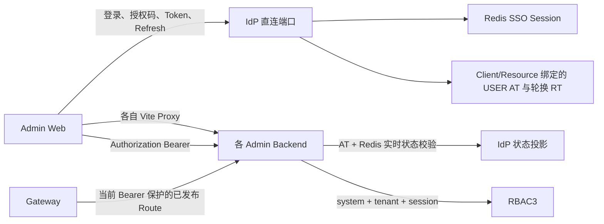
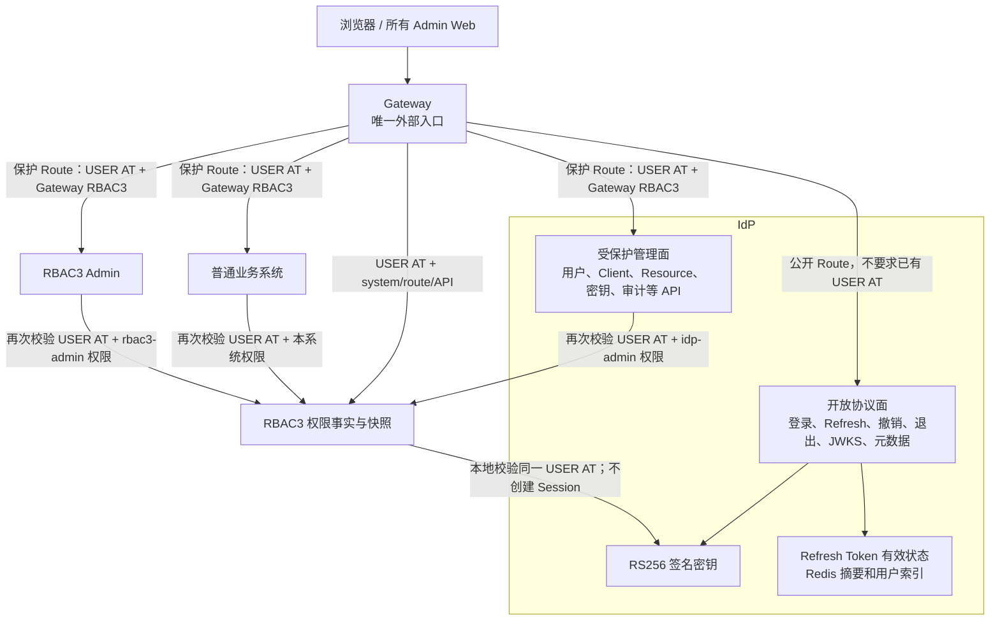
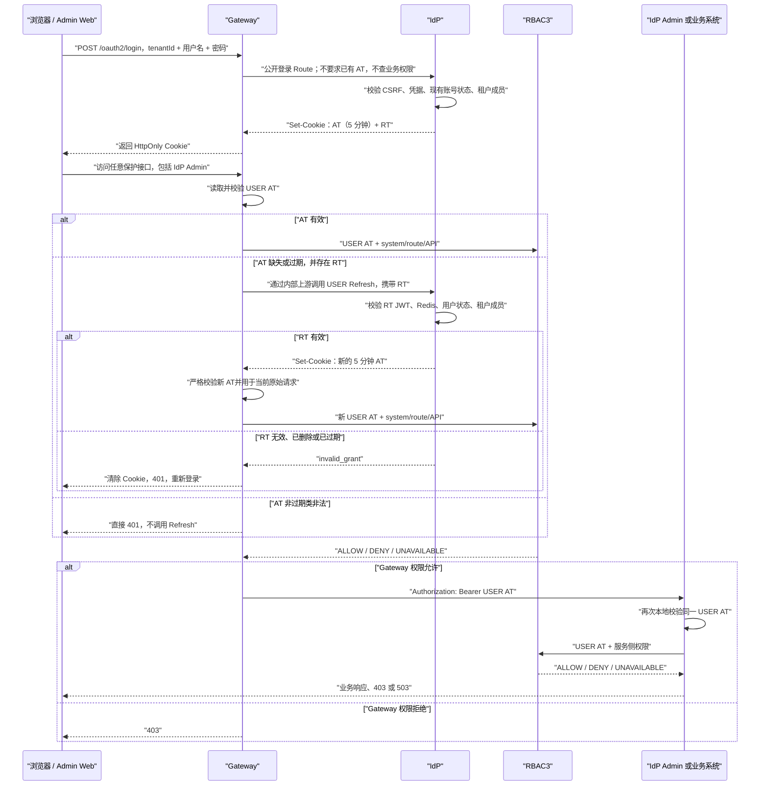
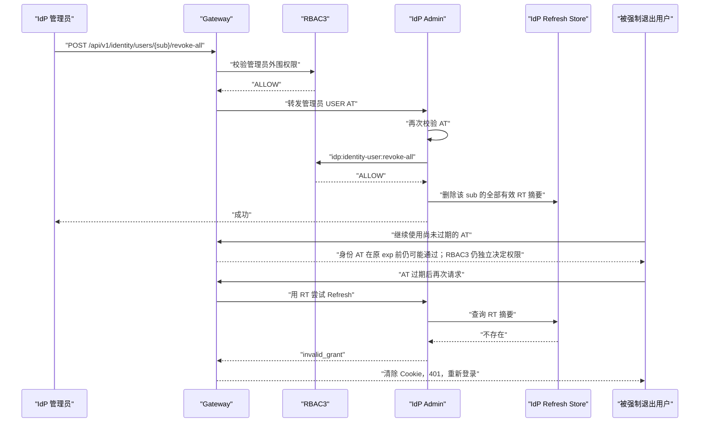

# 统一身份无 Session JWT 与 Gateway 自动刷新改造规格

> 状态：待用户书面审查
> 编写日期：2026-08-13
> 代码基线：`main@fdac7dd6`
> 适用仓库：`/Users/mario/SelfProject/Egon-COLA`

主要涉及模块：

- `egon-cola-platforms/egon-cola-platform-idp`
- `egon-cola-platforms/egon-cola-platform-rbac3`
- `egon-cola-platforms/egon-cola-platform-gateway`
- `egon-cola-platforms/egon-cola-platform-admin-web-shared`
- IdP、RBAC3、Gateway、DDC 等现有 Admin Web
- `scripts/unified-platform` 与统一身份本地启动、验证脚本

本文固化 2026-08-13 已确认的统一身份改造方向：人员登录链只使用一个平台级
Access Token 和一个 Refresh Token；彻底移除 IdP、RBAC3、Gateway 和业务服务中的
人员 Session 语义；Gateway 成为唯一外部入口，并在人员 Access Token 缺失或过期时
使用 Refresh Token 向 IdP 自动换取新的 Access Token；IdP 同时保留开放身份协议面和
受 RBAC3 保护的管理业务面。

本文是设计规格，不是实施计划。本文经用户审查后，下一阶段才编写逐文件、逐提交、
逐验证命令的 implementation plan；本阶段不修改生产代码、不修改数据库、不启动项目。

---

## 1. 文档权威性与旧设计覆盖关系

### 1.1 本文的权威范围

本文是以下主题的最新权威设计：

- 人员登录、刷新、退出和强制退出；
- 人员 Access Token 与 Refresh Token 契约；
- 跨 Admin Web 的 JWT SSO；
- Gateway 外部入口、Access Token 校验和自动刷新；
- IdP 管理业务域的 Access Token 与 RBAC3 双重保护；
- RBAC3 人员授权快照与 Session 解耦；
- 业务服务绕过 Gateway 时的本地 Access Token 与权限校验；
- 相关前端、Cookie、Redis Key、数据库 Session 表和运行配置清理。

### 1.2 被本文覆盖的旧决策

本文覆盖
`docs/superpowers/specs/2026-08-01-unified-identity-platform-design.md`
中与下列内容有关的旧决策：

- SSO Session、SSO Cookie 和 `sid`；
- `(tenantId, sessionId)` RBAC3 Authorization Context；
- Authorization Code + PKCE 作为内部 Admin Web 人员登录主链；
- 按 OAuth Client、Resource Server 和单一 Resource Audience 签发 USER Token；
- Access Token 由前端内存保存并由前端主动刷新；
- Refresh Token 每次刷新轮换及重放时撤销整个 Family；
- `tokenVersion`、用户实时状态、Resource Version 使旧 Access Token立即失效；
- Gateway 只做身份校验、不做业务域或接口权限校验；
- USER Access Token 默认 15 分钟或动态 5 至 30 分钟。

本文同时覆盖
`docs/superpowers/specs/2026-08-10-oauth2-resource-server-admission-design.md`
中的“单 Resource USER Access Token”部分。该旧规格中的 SERVICE Access Token、
Client Credentials、Admission Ticket、DDC Provider 准入和机器身份边界不由本文删除；
它们不进入人员登录、人员 SSO、人员 Refresh Token 或人员 Session 模型。

如果其他旧 Spec 或 Plan 把 IdP/RBAC3 Session、`sid`、USER Resource Audience、
前端 Refresh 或即时 `tokenVersion` 撤销声明为冻结契约，以本文为准。实施计划必须显式
标记这些旧计划中的冲突步骤，不得机械续跑旧计划。

同日已有的 Gateway Admin/RBAC3 Admin 分包 Spec 属于结构改造文档，它们把认证行为声明为
非目标只是为了冻结当时的结构迁移范围。本文是更新的认证行为规格：如果相关分包尚未
实施，新的 implementation plan 必须先按本文删除人员 Session，再决定剩余类型的目标包；
不得先把即将删除的 Session 链完整搬包后再删除。

---

## 2. 术语和边界

| 术语 | 本文含义 |
|---|---|
| USER Access Token | IdP 为人员身份签发的、固定 5 分钟、全平台通用的 JWT |
| Refresh Token | IdP 为人员身份签发并在 IdP Redis 保存有效摘要的长期 JWT |
| SERVICE Access Token | 现有机器身份通过 Client Credentials 获取的 `typ=at+jwt`；仍属于 Access Token 类型，不是第三种人员 Token |
| 开放协议接口 | 不要求调用方已经持有 USER Access Token 或 RBAC3 权限，但仍严格校验该接口自己的凭据和请求完整性 |
| 保护接口 | 必须持有有效 USER Access Token，并通过 Gateway 与目标服务的 RBAC3 权限判断 |
| 无 Session | 不存在服务端登录 Session、SSO Session、RBAC3 Session、Session Fence、Session Version 或 Session Active Role |
| 无状态 Access Token | Gateway、IdP、RBAC3 和业务服务仅通过签名与声明验证 USER Access Token，不查询用户登录 Session 或 Token Version |

Refresh Token 有效记录、JWK 缓存、RBAC3 权限快照缓存、审计日志和 Outbox 都不是登录
Session。IdP 必须保存 Refresh Token 的服务端有效状态，才能执行退出、强制退出和过期
校验；这不改变 USER Access Token 的无状态性。

---

## 3. 已确认的强制决策

| 编号 | 决策 |
|---|---|
| SJ-01 | 所有浏览器和外部 USER HTTP 调用只能通过 Gateway 访问 IdP、RBAC3、DDC、Gateway Admin 和普通业务系统；受信机器内部调用继续遵守各自 SERVICE/Admission 边界 |
| SJ-02 | IdP 内部监听地址只作为 Gateway 上游、JWK 内部读取或受信服务调用地址，不作为浏览器 Issuer/API 地址 |
| SJ-03 | IdP 同时包含开放协议面和受保护管理面；IdP Admin 不是认证旁路 |
| SJ-04 | `/oauth2/login`、USER Refresh、撤销、退出、JWKS 和元数据是开放协议路由，不要求已有 USER Access Token 或 RBAC3 权限 |
| SJ-05 | “开放”只表示可匿名发起；登录必须校验账号密码，刷新必须校验 Refresh Token，Client Credentials 必须校验 Client Assertion |
| SJ-06 | IdP 的 `/api/**` 管理接口必须像普通业务系统一样再次校验 USER Access Token，并使用 `systemCode=idp-admin` 执行 RBAC3 权限判断 |
| SJ-07 | IdP 管理员与其他用户使用同一个登录入口和同一种 USER Access Token/Refresh Token，不签发管理员专用 Token |
| SJ-08 | 身份认证成功与业务域授权分离；用户可以登录成功并获得 AT/RT，但无 `idp-admin` 权限时访问 IdP Admin 返回 403 |
| SJ-09 | USER Access Token 固定有效 5 分钟；`exp = iat + 300 秒`，不得动态延长，也不得在 `exp` 后增加正向容忍窗口 |
| SJ-10 | 同一个 USER Access Token 可跨 Admin Web、跨业务域使用，不再按 Client 或 Resource Server 签发人员 Token |
| SJ-11 | USER Access Token 保留单一租户 `tid`；跨客户端/业务域 SSO 指同一租户上下文，不表示一个 Token 同时代表多个租户 |
| SJ-12 | USER Access Token 不包含 `sid`、`session_id`、`client_id`、`token_version`、`resource_version`、`nonce`、角色、权限、数据范围或字段策略 |
| SJ-13 | USER Access Token 使用固定的平台 Audience；业务域权限由 RBAC3 决定，不由 Audience 隔离 |
| SJ-14 | USER Access Token 不在 IdP、Gateway、RBAC3 或业务服务持久化；IdP 只负责签发和密钥权威 |
| SJ-15 | Refresh Token 不绑定 Session、OAuth Client 或 Resource Server；同一登录上下文使用一个人员 Refresh Token |
| SJ-16 | 本期 Refresh Token 不按每次刷新轮换；刷新只签发新的 USER Access Token，Refresh Token 使用绝对过期时间，不因刷新滑动续期 |
| SJ-17 | IdP Redis 只保存 Refresh Token 摘要、主体/租户索引、过期时间和有效状态，不保存明文 Refresh Token |
| SJ-18 | Gateway 不保存 AT、RT 或人员 Session；Gateway 节点扩缩容不改变登录状态 |
| SJ-19 | Gateway 只在 USER Access Token 缺失或确认为过期且存在 RT 时自动调用 IdP 刷新 |
| SJ-20 | USER Access Token 签名错误、Issuer 错误、Audience 错误、类型错误或格式错误时直接 401，不尝试刷新 |
| SJ-21 | RBAC3 拒绝产生 403；403 不触发刷新，也不伪装为登录失败 |
| SJ-22 | Gateway 刷新成功后必须在同一个原始请求中使用新 AT 继续权限校验和路由，并把新 AT Cookie 写回浏览器 |
| SJ-23 | Refresh 路由本身不得触发 Gateway 自动刷新，Gateway 调 IdP 刷新使用内部上游地址，避免递归进入公开 Gateway 路由 |
| SJ-24 | Gateway 在保护路由执行外围业务域/Route/API 权限判断，目标服务再次执行服务侧权威权限判断；任一层拒绝即拒绝 |
| SJ-25 | Gateway 只向目标服务转发 USER Access Token；Refresh Token 和浏览器认证 Cookie不得转发给普通业务服务 |
| SJ-26 | IdP、RBAC3 和所有业务服务都必须在本地再次校验同一个 USER Access Token；目标服务永不使用 RT 自动刷新 |
| SJ-27 | 绕过 Gateway 调用目标服务时，有效 AT 仍需通过服务侧 RBAC3；过期 AT 直接 401，服务端不读取 RT |
| SJ-28 | RBAC3 授权快照身份键改为 `(systemCode, tenantId, identitySub)`，不再包含 Session ID 或 Session Version |
| SJ-29 | RBAC3 从已验证 USER Access Token 派生 `identitySub` 和 `tenantId`，不信任调用方传入的身份查询参数 |
| SJ-30 | RBAC3 Session、Session Active Role、Session Fence、Session Version 和 RBAC3 Refresh Token 运行链全部移除 |
| SJ-31 | 移除 Session Active Role 后，本期使用所有满足现有状态、作用域和约束规则的有效角色分配计算权限，不提供按登录 Session 临时激活角色 |
| SJ-32 | 权限字符、菜单、按钮、路由、API、数据和字段策略继续归 RBAC3；本期不重新设计细粒度权限模型 |
| SJ-33 | 强制退出和用户主动全局退出只删除/失效该用户 Refresh Token；已经签发的 USER Access Token 最多继续有效至原 `exp` |
| SJ-34 | 密码修改、密码重置和现有账号禁用可复用同一 RT 撤销机制；本期不新增“账号冻结”状态或管理功能 |
| SJ-35 | 权限或角色被撤销时，RBAC3 仍可在 AT 到期前立即拒绝请求；“AT 最多继续五分钟”只表示身份 JWT 仍有效，不保证业务权限仍允许 |
| SJ-36 | 人员浏览器主链不再使用 SSO Cookie、Authorization Code、PKCE 回调或前端 Token Store；JWT Cookie 本身提供跨客户端免登录 |
| SJ-37 | 现有 SERVICE Access Token、Client Credentials 和 Admission Ticket 保持在机器身份边界，不得混入 USER Refresh、USER SSO 或 USER RBAC3 Session |
| SJ-38 | 不新增登录 JWT、业务域 JWT、客户端 JWT、Session JWT 或其他人员认证 Token |
| SJ-39 | Cookie 模式下必须保留登录 CSRF 防护，并在 Gateway 对变更类请求执行可信 Origin/Referer 或等价请求完整性校验；CSRF 随机值不是身份 Token |
| SJ-40 | 该改造是开发期直接切换：旧 SSO Cookie、旧 USER AT、旧 RT、旧授权码和旧 RBAC3 Session 全部失效，用户重新登录一次 |

---

## 4. 当前代码基线与目标差距

### 4.1 当前 IdP 已具备的正确边界

以下能力已经存在，实施时应复用而不是推倒重建：

| 当前能力 | 代码位置 |
|---|---|
| Spring Security 已配置 `SessionCreationPolicy.STATELESS` | `idp-admin/.../support/security/IdpSecurityConfig.java` |
| IdP 保护接口按 IdP Bearer Filter、RBAC3 Filter 顺序执行 | `IdpSecurityConfig.java` |
| IdP Admin 已依赖 `egon-cola-platform-rbac3-starter` | `egon-cola-platform-idp-admin/pom.xml` |
| IdP RBAC3 `system-code` 已是 `idp-admin` | `idp-admin/src/main/resources/application.yml` |
| IdP 管理 Controller 已使用 `@AuthenticationPrincipal IdentityPrincipal` | `identity/controller/IdentityUserController.java` 等 |
| IdP 管理业务已显式检查 `idp:*` 权限 | `IdpAdminAuthorizationPort` 及各 Controller |
| IdP 已签发 RS256 `typ=at+jwt` 并提供 JWKS | `Rs256TokenService.java`、`OAuthJwksController.java` |
| Refresh Token 已使用签名 JWT 和 Redis 摘要状态 | `RefreshTokenClaims.java`、`RedisRefreshTokenStore.java` |
| 现有账号已具有 `ACTIVE/DISABLED/LOCKED` 状态与登录限制 | `IdentityFacade.java`、IdP V1 migration |

`@AuthenticationPrincipal` 只注入安全链已经认证的人员主体。它不自行解析 JWT、不访问
RBAC3，也不等价于权限注解。改造后该用法继续保留，但 `IdentityPrincipal` 不再携带
Session、Client 或 Token Version。

### 4.2 当前必须移除或改写的链路

| 当前实现 | 当前行为 | 与目标的冲突 |
|---|---|---|
| `OAuthLoginController` | 密码通过后创建 12 小时 SSO Session 和 SSO Cookie | 仍是服务端登录 Session |
| `/oauth2/authorize` + Authorization Code | 依赖 SSO Principal，再按 Client/Resource 换码 | 人员登录被拆成 Session + Code + Token 多段链 |
| `OAuthTokenController` | USER Token 按 `client_id + resource` 签发 | 不能跨 Client 和业务域复用 |
| `AccessTokenClaims` | 包含 `sid/client_id/token_version/resource_version/nonce` | USER AT 与 Session 和单 Resource 耦合 |
| `TokenFacade.refresh` | 每次 Refresh 轮换并在并发时执行重放撤销 | Gateway 并发自动刷新会出现误撤销风险 |
| `IdpJwtVerifier` | 每次读取用户、Resource、Client Redis 状态 | USER AT 不是真正本地无状态验证 |
| `IdentityUserServiceImpl.revokeAll` | 递增 Token Version 并撤销 Refresh Family | 旧 AT 立即失败，不符合五分钟窗口 |
| `IdpBearerCredentialExtractor` | 只读取 Authorization Bearer | Gateway 看不到浏览器 RT，不能自动刷新 |
| `IdpIdentityAuthenticationProvider` | 验证异常统一为 DENY | 无法区分 EXPIRED 与 INVALID |
| Admin Web Shared | Access Token 存内存，401 后由前端调用 IdP 刷新 | 刷新责任不在 Gateway |
| 本地脚本 | `VITE_IDP_ISSUER` 与各 Admin API 指向独立后端端口 | Gateway 不是唯一外部入口 |
| `HttpRbac3AuthorizationClient` | 按 tenant/session/identity 查询快照 | RBAC3 权限上下文依赖 Session |
| `SingleFlightSnapshotLoader` | 缓存和一致性绑定 `principal.sessionId()` | 无法在无 Session 主体下工作 |
| RBAC3 V1 表 | 存在 `rbac3_session`、`rbac3_session_active_role`、`rbac3_refresh_token` | RBAC3 仍保存认证 Session/Refresh 状态 |

### 4.3 当前实际拓扑

当前本地 Admin Web 的 Issuer 和 API Proxy 直接指向 IdP/RBAC3/Gateway/DDC Admin
端口；Gateway 当前安全适配器只处理 Bearer，现有本地发布脚本主要验证 Mock/MCP Route。
因此不能把当前运行形态描述为“所有人员请求已经经过 Gateway”。



---

## 5. 目标与非目标

### 5.1 目标

1. 建立只有 USER Access Token 和 Refresh Token 的人员认证模型；
2. 完全移除人员 Session、SSO Session、RBAC3 Session 和 Session Active Role；
3. 让一个 5 分钟 USER Access Token 在同一租户内跨客户端、跨业务域使用；
4. 让 Gateway 成为所有外部请求的唯一入口；
5. 让 Gateway 在 AT 缺失或过期时使用 RT 向 IdP 自动刷新；
6. 让 IdP 的开放协议接口和受保护管理接口具有明确、不同的安全策略；
7. 让 IdP 管理员和普通平台用户使用同一登录与 Token 模型；
8. 让 Gateway 与每个目标服务都执行 JWT 校验和 RBAC3 权限判断；
9. 让 RBAC3 权限快照以业务系统、租户和人员身份为键，不再以 Session 为键；
10. 让强制退出通过撤销 RT 生效，已签发 AT 最多保留五分钟身份有效期；
11. 让跨客户端免登录完全由 Gateway 域的 JWT Cookie 完成，不建立服务器 SSO 状态；
12. 保持机器身份的 SERVICE Access Token/Admission 能力与人员登录链隔离。

### 5.2 非目标

- 不在本期重新设计菜单、按钮、路由、API、数据、字段权限的数据模型；
- 不实现新的账号冻结状态、冻结后台页面或冻结审批流程；
- 不实现 MFA、短信、邮件、社交登录、SAML、SCIM 或外部身份联合；
- 不删除 Client Credentials、SERVICE Access Token、Admission Ticket 或 MCP 异步任务机器身份；
- 不把角色、权限、数据范围或字段策略写进 USER Access Token；
- 不让 Gateway 或业务服务保存人员 AT/RT/Session；
- 不让普通业务服务接收、读取、代理或刷新人员 Refresh Token；
- 不保留旧 Session、旧授权码或旧 USER Token 的双栈兼容；
- 不在本规格阶段修改生产代码、数据库或编写 implementation plan；
- 不启动项目，不执行浏览器或运行态联调。

---

## 6. 目标总体架构



### 6.1 IdP 的双重角色

IdP 必须同时满足两种角色，不能只实现其中之一：

1. **身份协议服务**：登录、刷新、撤销、退出、JWK 和元数据。调用方不需要先登录，
   但必须满足每个协议接口自己的凭据校验。
2. **受保护业务系统**：用户、OAuth Client、Resource Server、签名密钥、审计和管理配置。
   这些接口必须通过 Gateway USER AT 校验、Gateway RBAC3、IdP 本地 USER AT 校验和
   IdP RBAC3 权限校验。

IdP 管理页面的登录不建立特殊“管理员会话”。认证成功后是否能进入 IdP Admin，由
`idp:bootstrap:read` 及后续 `idp:*` 权限决定。

### 6.2 两层 PEP

Gateway 与目标服务都是 Policy Enforcement Point：

- Gateway 使用 Route、Operation、business domain 和 required permission 做外围拒绝；
- 目标服务使用自己的接口/方法权限做最终权威拒绝；
- 两层共享 RBAC3 权限事实，但可以各自缓存快照；
- Gateway 放行不替代服务鉴权，服务放行也不能绕过 Gateway 外围策略；
- RBAC3 不可用时两层均 fail closed，不能降级为匿名或默认允许。

---

## 7. USER Token 契约

### 7.1 USER Access Token

USER Access Token 使用 RS256 JWT。

JOSE Header：

| 字段 | 要求 |
|---|---|
| `alg` | 固定 `RS256` |
| `typ` | 固定 `at+jwt` |
| `kid` | 必须存在，并能在当前或仍处于验证窗口的 JWKS 中找到 |

Claims：

| Claim | 要求 |
|---|---|
| `iss` | 稳定的对外 IdP Issuer；该 URL 由 Gateway 路由，不暴露 IdP 内部端口 |
| `sub` | 不可变 `identitySub` |
| `tid` | 当前唯一租户 ID |
| `aud` | 固定的平台级 USER Audience，不按业务域变化 |
| `jti` | 每个 AT 唯一 |
| `iat` | 秒精度签发时间 |
| `nbf` | 不得晚于 `iat`；默认与 `iat` 相同 |
| `exp` | 必须严格等于 `iat + 300 秒` |

禁止出现：

```text
sid
session_id
client_id
token_version
resource_server_id
resource
resource_version
nonce
principal_type
roles
permissions
capabilities
dataScopes
fieldPolicies
authVersion
sessionVersion
contextVersion
```

验证 USER AT 时必须检查签名、`alg/typ/kid`、Issuer、平台 Audience、`sub/tid/jti`、
`iat/nbf/exp`。不得读取 IdP 用户状态 Redis、OAuth Client 状态、Resource Server 状态、
Refresh Store 或 RBAC3 Session。各节点必须依赖时钟同步；`exp` 后不得继续接受该 AT。

### 7.2 Refresh Token

人员 Refresh Token 继续使用 IdP 签名 JWT，Header 保持 `alg=RS256`、`typ=JWT` 和
`kid`，Claim 使用 `token_use=refresh` 与 USER AT 严格区分。

Refresh Token 只允许包含：

| Claim | 要求 |
|---|---|
| `iss` | 与 USER AT 相同的 IdP Issuer |
| `sub` | 人员 `identitySub` |
| `tid` | Refresh 所属唯一租户 |
| `jti` | Refresh Token 唯一标识 |
| `token_use` | 固定 `refresh` |
| `iat`、`nbf`、`exp` | 绝对有效期；刷新时不延长 `exp` |

禁止包含 `token_id`、`sid`、`session_id`、`client_id`、`family_id`、`generation`、`token_version`、
`resource_server_id`、`resource`、`resource_version` 和 `nonce`。

Refresh TTL 继续由现有 IdP Runtime Policy 管理并保持当前 1 至 30 天安全边界；本文不
改变其默认值。无论配置多少天，`exp` 都在首次登录签发时固定，后续 Refresh 不滑动续期。

IdP 校验 Refresh Token 时必须同时满足：

1. JWT 签名、Issuer、Type/Use 和时间有效；
2. Redis 中存在该 Token 摘要且状态有效；
3. Redis 记录的 `sub/tid/exp` 与 JWT 一致；
4. 当前用户仍满足现有登录允许状态；
5. 当前租户成员映射仍有效；
6. Refresh Token 未被退出、强制退出、密码安全操作或过期清理撤销。

第 4 项复用当前 `ACTIVE/DISABLED/LOCKED` 行为，不新增“冻结”状态。第 5 项通过现有
受信机器身份调用 RBAC3 做租户成员校验，不执行业务域/API 权限判断。RBAC3 或依赖暂时
不可用时返回暂时不可用，不得伪装成密码错误或 Token 伪造。

每次成功输入凭据建立一个独立 RT 记录；同一浏览器通过 Gateway Host Cookie在多个
Admin Web共享该 RT，不同浏览器/设备可以各自持有独立 RT。`revoke` 只撤销当前 RT，
`revoke-all` 按 `sub` 索引撤销该用户所有设备的 RT；任何一种情况都不创建 Session。

### 7.3 SERVICE Access Token 边界

现有 SERVICE Access Token 同样使用 `typ=at+jwt`，因此从 Token 类型上仍只有
Access Token 和 Refresh Token。SERVICE AT：

- 只能由 Client Credentials/现有机器身份流程签发；
- 不附带人员 Refresh Token；
- 不参与 JWT SSO、Gateway 人员自动刷新或人员 Cookie；
- 可继续使用精确 Resource Audience、Service Scope 和 Admission 契约；
- 不得被转换为 `IdentityPrincipal` 或用于模拟人员访问；
- 不得因此保留任何人员 Session 结构。

USER 与 SERVICE 的验证策略必须按安全策略/受保护入口明确选择，不能因为某个任意 Claim
缺失而把不可信 Token 自动降级识别为 USER。

---

## 8. Cookie 与浏览器传输

### 8.1 Cookie 规则

浏览器人员认证使用两个 Gateway 对外 Host 的 Cookie：

| 属性 | USER AT Cookie | Refresh Cookie |
|---|---|---|
| `HttpOnly` | `true` | `true` |
| `Secure` | 非本地环境固定 `true` | 非本地环境固定 `true` |
| `SameSite` | `Lax` | `Lax` |
| `Path` | `/` | `/` |
| `Domain` | 不显式设置，使用 Gateway 对外 Host-only | 不显式设置，使用 Gateway 对外 Host-only |
| `Max-Age` | 不超过 AT 剩余 5 分钟 | 不超过 RT 绝对剩余时间 |

RT 的 Path 不能继续使用当前 `/oauth2`，因为 Gateway 必须在任意保护请求到达时判断是否
存在 RT。Gateway 读取后必须剥离 Refresh Cookie，普通业务上游永远看不到 RT。

IdP 对经 Gateway 代理的登录/刷新响应写 `Set-Cookie` 时不设置内部 IdP Domain；浏览器
以实际响应的 Gateway Host 保存 Cookie。Gateway 内部自动刷新调用必须读取 IdP 响应的
AT `Set-Cookie`，把新 AT 用于当前请求，并把该 Cookie 安全地写回外部响应。

### 8.2 不向前端暴露 Token

人员登录和 Refresh 响应不得把原始 AT/RT 放入可被 JavaScript 读取的 JSON、Header、
URL、LocalStorage、SessionStorage、日志或埋点。Admin Web 不解析 JWT，也不保存 Token。

Client Credentials 的 SERVICE AT OAuth 响应保持现有非浏览器契约，不适用上述人员
Cookie 限制。

### 8.3 CSRF 与 Origin

- 保留当前 `/oauth2/login/csrf` 双提交登录防护；
- Gateway 对使用认证 Cookie 的非安全 HTTP Method 校验可信 Origin/Referer 或等价机制；
- Gateway CORS 只允许已登记 Admin Web Origin，且显式允许 Credentials；
- CSRF 随机值只证明请求来源完整性，不代表身份、不进入 JWT、不计作第三种身份 Token；
- 不能因为 Spring Security 设置为 `STATELESS` 就继续无条件忽略全部 `/api/**` CSRF 风险。

---

## 9. IdP 端点与安全策略

### 9.1 对外端点矩阵

| IdP 端点 | Gateway 策略 | IdP 校验 | RBAC3 |
|---|---|---|---|
| `GET /.well-known/oauth-authorization-server` | 公开精确 Route | 无身份凭据；只读 | 不调用 |
| `GET /oauth2/jwks` | 公开精确 Route | 无身份凭据；只读 | 不调用 |
| `GET /oauth2/login/csrf` | 公开精确 Route | 生成请求完整性随机值 | 不调用 |
| `POST /oauth2/login` | 公开精确 Route | CSRF、用户名、密码、现有账号状态、租户成员 | 不检查业务权限 |
| `POST /oauth2/token` USER Refresh 分支 | 公开精确 Route，排除自动刷新 | Refresh JWT + Redis 状态 + 用户状态 + 租户成员 | 不检查业务权限 |
| `POST /oauth2/token` Client Credentials 分支 | 公开精确 Route，排除自动刷新 | 现有 Client Assertion/Grant/Resource 规则 | 保持现有 SERVICE 边界 |
| `POST /oauth2/revoke` | 公开精确 Route | RT 存在时撤销；结果幂等 | 不调用 |
| `POST /oauth2/logout` | 公开精确 Route | 使用 RT 证明并撤销；AT 可已过期 | 不调用 |
| `GET /oauth2/userinfo` | 保护 Route，可触发 Gateway 自动 Refresh | IdP 校验 USER AT并只返回当前主体信息 | 不要求 IdP Admin 权限 |
| `/api/v1/auth/bootstrap` | 保护 Route | IdP 再次校验 USER AT | `idp:bootstrap:read` |
| `/api/**` 其他 IdP Admin API | 保护 Route | IdP 再次校验 USER AT | 对应 `idp:*` 权限 |

公开 Route 必须使用精确 Method + Path，不允许用宽泛 `/oauth2/**` 匿名白名单覆盖未来新增
接口。`/oauth2/logout` 必须能在 AT 过期后依靠 RT 完成，不能继续因缺少有效 AT 被
Spring Security 拦截。

### 9.2 人员登录

内部 Admin Web 人员登录不再经过 `/oauth2/authorize` 和 Authorization Code：

1. 浏览器从 Gateway 获取登录 CSRF；
2. 浏览器向 Gateway `/oauth2/login` 提交 `tenantId + username + password`；
3. Gateway 按公开 Route 转发 IdP；
4. IdP 校验 CSRF、账号密码、现有账号状态和目标租户成员关系；
5. IdP 签发 5 分钟平台 USER AT 和长期 RT；
6. 响应只写 HttpOnly AT/RT Cookie及非敏感登录结果；
7. 前端跳转目标 Admin Web，并调用其 Bootstrap；
8. Bootstrap 的 Gateway 和服务侧 RBAC3 决定用户能否进入该业务域。

浏览器 OAuth Client、Redirect URI、PKCE State、Nonce 和 Authorization Code 不再参与
该人员主链。OAuth Client/Resource Server 管理能力可继续服务机器身份和 Admission，
但不得重新进入 USER Token Claim。

### 9.3 USER Refresh

本期 Refresh 使用稳定 RT：

- Refresh 成功只产生一个新 USER AT；
- 不产生后继 RT，不修改 RT 摘要，不延长 RT 绝对过期时间；
- 多个并发 Refresh 可以各自得到不同 `jti` 的有效 5 分钟 AT；
- IdP 不把并发使用同一有效 RT 判定为重放；
- RT 到期、撤销或摘要不存在时统一 `invalid_grant`；
- 安全审计记录成功/失败原因，但不记录明文 Token 或摘要。

该选择避免为 Gateway 集群增加分布式 Refresh Single Flight 或 Rotation Grace Window。
以后如重新引入 Rotation，必须先设计 IdP 端幂等并发语义，不能恢复当前“并发失败即撤销
整个 Family”的行为。

---

## 10. Gateway 请求链

### 10.1 保护请求状态机

Gateway 在路由前完成 USER AT 判断：

| 输入状态 | Gateway 行为 |
|---|---|
| AT 有效 | 进入 Gateway RBAC3；允许后转发同一 AT |
| AT 缺失，RT 有效 | 调 IdP Refresh；校验新 AT；写 AT Cookie；继续原请求 |
| AT 已过期，RT 有效 | 同上 |
| AT 缺失/过期，RT 缺失 | 清理残留 AT Cookie并返回 401 |
| AT 缺失/过期，RT 无效/已撤销/已过期 | 清理两个 Cookie并返回 401 |
| AT 签名、Issuer、Audience、类型或格式错误 | 不 Refresh，清理 AT并返回 401 |
| AT 有效但 Gateway RBAC3 拒绝 | 返回 403，不 Refresh |
| RBAC3 暂时不可用 | Fail closed，返回 503，不 Refresh |

Gateway 不应先把过期 AT 发给目标服务再根据任意上游 401 猜测是否刷新。自动刷新只由
路由前的 USER AT 验证结果触发。目标服务在 Gateway 已验证 AT 后仍返回 401 时，Gateway
原样返回认证失败，不进行第二次刷新或无限重试。

### 10.2 完整登录、访问和刷新泳道



### 10.3 Gateway 安全链扩展方式

现有 `GatewaySecurityChain` 已是按阶段执行的责任链。本次在现有链中增加“USER Credential
Recovery”阶段，不创建第二套网关认证框架：

```text
精确公开/保护 Route 策略
  -> USER AT/RT Credential Extraction
  -> USER AT Classification and Validation
  -> Missing/Expired Recovery through IdP
  -> Gateway RBAC3 Authorization
  -> Trusted Identity Mapping
  -> Forward USER AT only
```

这是对现有 Chain of Responsibility 和 Adapter 边界的扩展。无需引入新的通用 Strategy、
Factory 或 Session Manager。USER 与 SERVICE 安全策略通过既有 Route/Policy 显式选择，
不在一个 Provider 中堆叠含混的自动推断。

### 10.4 Credential 冲突规则

- 浏览器主路径从 Gateway Host-only Cookie读取 USER AT；
- 受信非浏览器调用可继续使用 `Authorization: Bearer`；
- 同一请求同时携带 Cookie AT 和 Authorization AT 时，两者必须完全相同，否则返回 401；
- 外部请求不得自带受信 `X-Egon-*` 身份头，Gateway 继续先清理再重建；
- RT 只允许从 HttpOnly Cookie进入 IdP Protocol/Refresh 适配器，不允许 Query、普通 Header
  或业务 Request Body 传递。

---

## 11. IdP Starter、IdP Admin 与业务服务

### 11.1 USER AT 验证器

当前 `IdpJwtVerifier` 同时承担 USER/SERVICE、单 Resource、用户状态、Client 状态和
Resource 状态验证。目标实现必须拆清边界：

- USER 保护入口使用平台 USER AT 验证器，只验证第 7.1 节契约；
- SERVICE 入口继续使用现有机器身份、精确 Resource/Scope 验证边界；
- USER 验证器不注入或依赖 `IdentityUserStateReader`、
  `IdentityResourceServerStateReader`、`IdentityOAuthClientStateReader`；
- USER `IdentityPrincipal` 只保留 `subject/tenantId/tokenId/audience/issuedAt/expiresAt`
  等无 Session 身份信息；
- `OAuthUserInfoVO` 同步删除 `sessionId/clientId/tokenVersion`，只返回当前 USER AT中允许
  对调用方公开的 `sub/tid/aud/iat/exp` 身份信息；
- `IdpAuthenticationToken` 不保存明文 AT；如 RBAC3 Starter 需要 Relay 当前 AT，使用
  请求级受控 Credential Carrier，禁止写入日志、缓存、Principal 属性或跨请求状态。

### 11.2 IdP Admin Security Chain

`IdpSecurityConfig` 改造后：

1. 删除 `IdpSsoAuthenticationFilter` 和 Authorization Entry Point；
2. 仅精确公开第 9.1 节协议端点；
3. 其他请求必须 USER AT 认证；
4. IdP Bearer Filter 在 RBAC3 Filter 前执行；
5. `@AuthenticationPrincipal IdentityPrincipal` 继续可用；
6. `IdpAdminAuthorizationPort` 继续 fail closed；
7. `/oauth2/logout` 在 AT 过期时仍可使用 RT；
8. 不创建 HttpSession，保持 `SessionCreationPolicy.STATELESS`。

### 11.3 目标服务二次校验

每个业务服务和 IdP Admin 必须：

- 接收 Gateway 转发的原始 USER AT；
- 使用相同 Issuer、平台 Audience 和 JWK进行本地验证；
- 从 `sub/tid` 构造 IdentityPrincipal；
- 使用本系统 `systemCode` 获取 RBAC3 授权快照；
- 在 URL、方法或现有 `AuthorizationService` 调用处执行权限；
- 401 只表示身份 Token 无效，403 只表示身份有效但权限不足；
- 不读取 Refresh Cookie，不调用 IdP Refresh，不依赖 Gateway 受信头替代 AT 验证。

---

## 12. RBAC3 无 Session 授权模型

### 12.1 授权快照身份

当前快照使用：

```text
systemCode + tenantId + sessionId
```

目标统一为：

```text
systemCode + tenantId + identitySub
```

RBAC3 Snapshot 至少包含：

- `systemCode`
- `tenantId`
- `identitySub`
- RBAC3 Tenant User 映射标识
- 有效角色与角色层级结果
- Permission 字符集合
- Resource/Menu/Route/API/Action 投影
- 当前已有 Data Scope 与 Field Policy 决策数据
- 权限事实版本、快照生成时间和快照过期时间

禁止包含 `sessionId`、`sessionVersion`、SSO Family、Refresh Token ID 或人员 AT 明文。

### 12.2 RBAC3 Snapshot 获取

Gateway 和业务服务在授权缓存未命中时，把当前请求的 USER AT Relay 给 RBAC3。RBAC3：

1. 本地验证 USER AT；
2. 从 AT 派生 `identitySub` 和 `tenantId`；
3. 使用请求的 `systemCode` 计算该人员在该系统中的当前授权；
4. 不接受 Query/Path 中另传的 `identitySub` 或 `sessionId`；
5. 返回与 AT `sub/tid` 一致的快照；
6. 不为返回当前人员自己的权限快照再递归调用 RBAC3 自身授权服务。

现有
`/internal/v1/authorization/contexts/{tenantId}/{sessionId}`
契约必须替换为：

```text
GET /internal/v1/authorization/snapshots/current?systemCode={systemCode}
Authorization: Bearer {current-user-access-token}
```

新契约没有 `tenantId`、`identitySub` 或 `sessionId` 请求参数；它们只能从已验证 USER AT
派生。响应快照必须回显并由调用方校验 `systemCode + tenantId + identitySub`。

### 12.3 缓存与失效

- JVM near-cache 和 Redis 快照可以保留；
- Cache Key 固定包含 `systemCode + tenantId + identitySub`；
- 相同主体的并发 miss 可以继续 Single Flight，但 Key 不得出现 Session；
- Permission、Role、Assignment、Membership 变化继续通过现有版本/失效事件清除快照；
- `policyVersion`、permission fact version 可以保留，它们是授权事实版本，不是登录
  `tokenVersion/sessionVersion`；
- 缓存不可用或快照身份不一致时 fail closed；
- 原始 USER AT 只用于当前取快照调用，不作为缓存内容或 Key。

### 12.4 角色生效语义

移除 `rbac3_session_active_role` 后，不再提供“这次登录临时激活哪些角色”的状态。本期
对某个 `(systemCode, tenantId, identitySub)` 使用全部满足以下条件的角色分配：

- Assignment 当前有效；
- Role 当前有效；
- 适用于目标 System/Application；
- 满足现有层级、互斥、约束和动态规则；
- 未被现有管理策略排除。

现有 `RoleActivationController`、`ActiveRoleSet`、`RoleActivationInput` 及以 Session 为
Command ID/幂等键的链路从人员运行时移除。未来如需要“用户偏好角色集”，必须设计为
人员/租户/系统授权偏好，不能重新包装成 Session；该能力不在本期细粒度权限改造范围。

### 12.5 RBAC3 自身的管理接口

RBAC3 Admin 也是普通保护业务域：

- 浏览器从 Gateway进入；
- Gateway校验 USER AT并执行 `rbac3-admin` 外围权限；
- RBAC3 Admin 再次校验 USER AT；
- RBAC3 Admin 使用自身权限服务执行具体管理权限；
- 获取当前人员快照的内部入口只做 USER AT身份和快照计算，不递归调用自己。

---

## 13. 退出、强制退出和账号安全事件

### 13.1 当前设备退出

1. 浏览器经 Gateway 调 `/oauth2/logout`；
2. 即使 AT 已过期，Gateway仍按公开协议 Route 转发 RT；
3. IdP 校验 RT 后删除/失效当前 RT摘要；
4. IdP 返回过期 AT/RT Cookie；
5. 退出接口幂等，不泄露 RT 是否曾有效。

### 13.2 用户全部设备强制退出



### 13.3 与 `tokenVersion` 的关系

本期 USER AT 验证不再读取或比较 `tokenVersion`。现有数据库字段在本次改造中保留为
不参与运行决策的遗留兼容列；生产 USER Token Claim、Principal、Verifier、Gateway
Attribute、RBAC3 Snapshot 和撤销链不得继续读取、递增或比较它。本次不新增 IdP
Flyway migration删除该列；未来如需物理清理，必须单独设计并新增 migration，不得修改
现有 IdP V1/V2/V3 migration。

密码修改、密码重置、现有账号禁用和管理员 revoke-all 都至少撤销相关 RT。已签发 AT
仍按原 `exp` 最多保留五分钟身份有效期；若同时撤销 RBAC3 权限，业务访问可以更早 403。

---

## 14. 前端与跨客户端 SSO

### 14.1 Admin Web Shared

删除人员认证链中的：

- OAuth Authorization Transaction 和 PKCE State/Nonce/Verifier；
- Authorization Callback Page；
- `TokenStore` 及内存 Access Token；
- `getAccessToken()` 和 JavaScript 设置 Authorization Header；
- 任意 401 后前端调用 `/oauth2/token` 并重试的逻辑；
- 按 Client/Resource 构造 Refresh 请求；
- 浏览器端解析 JWT Payload。

保留/新增：

- 所有 Gateway API请求 `credentials: include`；
- 统一登录页面调用 Gateway `/oauth2/login/csrf` 和 `/oauth2/login`；
- 401 清理本地非敏感 UI 状态并跳转登录；
- 403 展示“已登录但无当前系统权限”，不能跳成密码登录失败；
- Admin Web 启动时调用各自 Bootstrap；
- Bootstrap 成功后根据 RBAC3 资源/权限投影加载现有菜单和能力。

### 14.2 跨客户端免登录

所有 Admin Web 访问同一个 Gateway API Host：

1. 用户在任一 Admin Web 登录，Gateway Host保存 AT/RT Cookie；
2. 打开第二个 Admin Web 时，它直接请求该系统 Bootstrap；
3. AT 有效时 Gateway 直接校验和授权；
4. 只有 RT、AT 已过期时 Gateway 自动 Refresh；
5. 该用户无第二个业务域权限时 Bootstrap 返回 403；
6. AT/RT 都无效时返回 401并要求重新登录。

不存在 IdP SSO Cookie、跨应用 SSO Session 查询或“已登录 IdP 再静默走授权码”的过程。

---

## 15. 配置、路由与部署边界

### 15.1 Issuer 与 JWK

- USER Token `iss` 使用稳定的对外 Identity URL；该 URL 的 DNS/Route 进入 Gateway；
- 浏览器只看到 Gateway 对外 URL，不使用 `http://127.0.0.1:18120` 等 IdP 内部端口；
- `/.well-known/oauth-authorization-server` 和 `/oauth2/jwks` 由 Gateway公开代理 IdP；
- Gateway、IdP、RBAC3 和业务服务可通过内部地址拉取 JWK，但必须校验相同外部 Issuer；
- JWK 缓存和密钥轮换保留，不能因短 AT 而禁用 `kid` 或旧公钥验证窗口。

### 15.2 Gateway Route 分类

Gateway Release 至少明确包含：

- IdP 开放协议 Route；
- IdP Admin 保护 Route；
- RBAC3 Admin 保护 Route；
- Gateway Admin 保护 Route；
- DDC Admin 保护 Route；
- 其他业务系统保护 Route。

公开和保护 Route 使用不同安全 Policy，不能依赖 Controller 内部补救宽泛 Gateway 白名单。
Gateway 自动 Refresh 的内部 IdP Upstream 不经过对外 Route发布，避免路由循环。

### 15.3 外部与内部端口

- 浏览器、CLI 人员调用和外部调用只允许 Gateway 对外端口；
- IdP/RBAC3/各 Admin Backend 内部端口由网络策略限制；
- 即使内部端口被误访问，保护接口仍本地校验 USER AT和 RBAC3；
- IdP 开放协议接口被内部直接调用时仍校验密码、RT、Client Assertion或请求完整性；
- Gateway 不成为下游唯一安全边界。

### 15.4 本地脚本

本地脚本必须区分：

```text
PUBLIC_GATEWAY_URL
IDP_INTERNAL_BASE_URL
RBAC3_INTERNAL_BASE_URL
各 Admin Backend 内部地址
```

`VITE_IDP_ISSUER`、Admin Web API Base URL和登录 URL使用对外 Gateway URL；内部服务
配置继续使用内部地址。验证脚本不能再通过浏览器路径直接调用 `18120/18130/...` 证明
外部拓扑成功，内部健康检查除外。

---

## 16. 持久化与清理

### 16.1 IdP Redis

删除：

- SSO Session Key；
- SSO Cookie到 Session的映射；
- Refresh Family generation/rotation/consumed/replay状态；
- Session/Client/Resource绑定字段；
- 为 USER AT实时校验维护的用户 Token Version/Resource Version/Client状态读取链。

保留：

- Refresh Token digest -> `sub/tid/exp/status`；
- `sub` -> 有效 Refresh Token ID集合，用于全局撤销；
- 必要的原子 create/revoke/revoke-subject/expire操作；
- 审计和安全事件，但不存明文 Token。

旧 Redis SSO/Refresh Key在切换时使用显式、精确 Prefix清理；不得执行针对 Redis DB 的
宽泛 flush。清理前后都要确认目标 Prefix，避免删除 DDC、Gateway、RBAC3或其他业务数据。

### 16.2 RBAC3 PostgreSQL

现有 Flyway 文件保持不可变。以当前序列 V1 至 V4 为基线，实施时新增一个下一版本
RBAC3 migration，清理：

```text
rbac3_session_active_role
rbac3_refresh_token
rbac3_session
```

删除顺序必须遵守外键依赖。该 migration只处理本次 RBAC3无 Session数据库变更，不修改
旧 migration checksum。实施前必须再次确认当时 HEAD 的最新版本号；如果已有并发新增
版本，使用当时正确的下一版本，不覆盖现有文件。

### 16.3 IdP PostgreSQL

本期不修改现有账号状态、凭据、Client、Resource Server、Signing Key、Audit 和 Outbox
表。`identity_user.token_version` 作为不参与运行决策的遗留兼容列保留，本次不删除、
不递增、不读取；未来物理删除必须另立设计并通过一个新的 Flyway migration完成，不能
修改 V1/V2/V3。

---

## 17. 错误语义

| 场景 | 对外结果 | 要求 |
|---|---|---|
| 用户名/密码错误 | 401 | 使用统一安全错误，不泄露账号存在性 |
| 现有账号状态禁止登录 | 401 | 复用当前状态逻辑；不新增冻结功能 |
| 登录时租户成员不存在/无效 | 403 `TENANT_ACCESS_DENIED` | 凭据认证与租户准入分离；不签发目标 `tid` Token |
| Refresh 时租户成员不存在/无效 | IdP `invalid_grant`；原业务请求映射 401 | 撤销该 RT并清理人员 Cookie |
| 登录依赖/RBAC3 暂时不可用 | 503 | 不返回“用户名密码错误” |
| USER Refresh Token 无效/撤销/过期 | IdP `invalid_grant`；原业务请求映射 401 | 清理人员 Cookie |
| USER Access Token 缺失且无有效 RT | 401 | 要求重新登录 |
| USER Access Token 已过期且 RT 有效 | 对调用方透明 Refresh 后继续原请求 | 不先把过期 AT 发往下游 |
| USER Access Token 非过期类非法 | 401 | 不调用 Refresh |
| Gateway RBAC3 拒绝 | 403 | 不调用 Refresh |
| 服务侧 RBAC3 拒绝 | 403 | 不调用 Refresh |
| RBAC3 暂时不可用 | 503 | Fail closed |
| Gateway 已验证但目标服务仍返回 401 | 401 | 不二次 Refresh、不循环重试 |
| Revoke/Logout 使用未知 RT | 204/幂等成功 | 不泄露 RT 是否存在 |

所有错误响应和日志不得包含原始 AT、RT、Cookie、Client Assertion、密码、Token Digest 或
签名私钥。Trace/Audit只记录 `sub`、`tid`、`jti`、结果码和安全原因等非秘密元数据。

---

## 18. 迁移与发布策略

这是身份协议、Cookie、Gateway 路由、Starter Principal 和 RBAC3 Snapshot 契约的联合
破坏性迁移，不允许长期混跑新旧 USER Token。

推荐发布波次：

1. 冻结最新 USER Token、Principal、Cookie、错误和 RBAC3 Snapshot Contract；
2. 改造 IdP USER Claims、稳定 RT Store、直接登录/Refresh/Logout；
3. 改造 USER IdP Starter 和无 Session IdentityPrincipal；
4. 改造 RBAC3 Snapshot、缓存 Key、角色生效和数据库 Session清理；
5. 扩展 Gateway USER Credential Recovery、RBAC3外围授权和 IdP公开/保护 Route；
6. 改造 IdP Admin、RBAC3 Admin及其他目标服务的二次校验；
7. 改造 Admin Web Shared、所有 Admin Web和本地脚本；
8. 清理旧 SSO/Auth Code/Session代码、Redis Key、配置、测试和文档；
9. 统一发布后清理旧 Cookie/RT/Session数据，要求所有用户重新登录；
10. 完成全链验收后才删除不再使用的兼容字段或旧配置。

具体文件顺序、提交边界和每波 Maven/前端验证命令在用户批准本 Spec 后进入
implementation plan。每个实施任务单独提交；不得启动项目，运行态联调由用户自行发起。

### 18.1 回滚原则

- 代码回滚必须连同 Gateway Route/Policy、Admin Web和 Token Contract一起回滚；
- 不能让旧前端把新 Cookie当作旧 OAuth Code Token，也不能让新 Gateway接受旧 `sid` AT；
- 新 RBAC3 migration执行前必须确认无需保留开发 Session数据；
- RBAC3表删除后，如回滚到旧代码，需要从结构备份恢复开发 schema，不能修改旧 Flyway；
- Refresh Redis Key清理不可恢复，回滚后用户仍需重新登录；
- 签名私钥不因协议回滚而回滚或写入仓库。

---

## 19. 验证策略

### 19.1 USER Token Contract

- USER AT只有允许的 Header/Claims；禁止字段均不存在；
- `exp - iat` 严格为 300 秒；
- 同一 AT能被 Gateway、IdP Admin、RBAC3和普通业务服务验证；
- USER AT不按 Client/Resource变化；
- USER Verifier在 Redis用户/Client/Resource状态不可用时仍能完成纯 JWT验证；
- RT不含 Session/Client/Resource/Rotation字段；
- Refresh不轮换 RT、不延长 RT `exp`。

### 19.2 IdP

- 登录接口无需已有 AT，但错误密码不能签发 Cookie；
- 登录成功同时建立 AT/RT Cookie，不创建 SSO Key；
- Refresh无需有效 AT，只依赖有效 RT；
- Logout在 AT过期时仍能撤销 RT；
- IdP Admin接口无 AT返回 401；
- IdP Admin接口有 AT但无 `idp:*` 权限返回 403；
- `@AuthenticationPrincipal` 能注入无 Session IdentityPrincipal；
- revoke-all只撤销 RT，不使当前 AT在 `exp` 前因 Token Version失效。

### 19.3 Gateway

- 所有 IdP协议和 Admin业务请求都从 Gateway进入；
- 有效 AT直接路由；
- 缺失 AT + 有效 RT自动刷新；
- 过期 AT + 有效 RT自动刷新并继续原请求；
- 非过期类非法 AT不刷新；
- Refresh Route不递归；
- 多个并发过期请求不会撤销稳定 RT；
- Gateway RBAC3 403不刷新；
- 新 AT写回 Cookie；
- 普通业务上游看不到 RT Cookie；
- Gateway重启或切换节点不影响有效 AT/RT。

### 19.4 RBAC3 与业务服务

- Snapshot和 Cache Key只有 `systemCode + tenantId + identitySub`；
- RBAC3从 AT派生主体，不接受伪造 identitySub/sessionId；
- 相同人员跨客户端得到同一权限上下文；
- 所有有效角色分配按第 12.4 节参与计算；
- 权限撤销可使仍有效 AT立即得到 403；
- 业务服务绕过 Gateway时有效 AT + 权限可访问；
- 绕过 Gateway时过期 AT返回 401且不使用 RT；
- IdP Admin作为目标服务执行第二次 AT和 RBAC3校验。

### 19.5 强制退出

使用可控 Clock验证：

1. 用户登录并获得 `exp=iat+300s` 的 AT和有效 RT；
2. 管理员 revoke-all删除该用户全部 RT；
3. 未改变权限时，当前 AT在 `exp` 前仍通过身份验证；
4. 到达 `exp` 后 Gateway判定过期；
5. Gateway用已删除 RT刷新失败；
6. Gateway清理 Cookie并返回 401；
7. 用户重新输入凭据后才能获得新 AT/RT。

### 19.6 结构与静态扫描

实施完成后必须证明生产运行链不存在：

```text
IdpSsoSessionStore
IdpSsoAuthenticationFilter
IdpSsoPrincipal
IdpAuthorizationAuthenticationEntryPoint
OAuthAuthorizationController
AuthorizationFacade
AuthorizationCode
AuthorizationCodeStore
RedisAuthorizationCodeStore
Rbac3JwtSessionAuthenticationProvider
rbac3_session runtime repository
rbac3_session_active_role runtime repository
rbac3_refresh_token runtime repository
principal.sessionId()
idp.session-id
sessionVersion
Session Fence
USER token_version verification
USER resource_version verification
frontend TokenStore
frontend on-401 refresh
```

历史 Flyway 文件、旧 Spec、迁移说明和审计历史中的文字可以存在；静态验收命令必须排除
这些非生产运行文件，不能因为文档描述旧名称而误判实现未完成。

### 19.7 构建与测试边界

implementation plan 至少覆盖：

- IdP Contract/Core/Starter/Gateway Adapter/Admin 模块测试与编译；
- RBAC3 Contract/Core/Starter/Admin 模块测试与编译；
- Gateway Security Chain、Route Policy和 Engine测试；
- Admin Web Shared和四个 Admin Web的 unit/typecheck/lint/build；
- 统一身份脚本 shell语法和契约测试；
- Flyway migration验证；
- `git diff --check` 与变更范围检查。

本 Spec 阶段只验证文档和仓库差异，不运行上述实现测试。

---

## 20. 验收标准

1. 人员认证只存在 USER Access Token和 Refresh Token；
2. USER Access Token固定 5 分钟并使用平台 Audience；
3. USER AT、RT、IdentityPrincipal、Gateway Principal、RBAC3 Snapshot、Cache Key中都没有 Session；
4. IdP SSO Session、RBAC3 Session、Session Active Role、Session Fence和 Session Version均从生产运行链删除；
5. Gateway是所有外部请求的唯一入口；
6. 登录、Refresh、撤销、退出为精确公开 Route，但各自严格校验密码、RT或 Client Assertion；
7. IdP Admin使用同一 USER AT/RT登录并受 Gateway + IdP两层 RBAC3保护；
8. Gateway只对 AT缺失或过期自动刷新；非法 AT、403和上游 401不触发刷新；
9. Gateway和目标服务都校验同一个 USER AT并执行各自权限；
10. RT只存在浏览器 HttpOnly Cookie和 IdP摘要状态，普通业务系统永不接触 RT；
11. revoke-all删除用户 RT，现有 AT身份有效性最多保留至五分钟 `exp`；
12. RBAC3快照键固定为 `(systemCode, tenantId, identitySub)`；
13. 跨 Admin Web依靠 Gateway JWT Cookie免登录，不依赖 IdP SSO Cookie或授权码；
14. 无业务域权限返回 403，不伪装成认证失败；
15. 绕过 Gateway时，目标服务仍校验 AT和 RBAC3，过期 AT直接 401；
16. 现有 SERVICE Access Token/Admission能力不进入人员 SSO且未被误删；
17. 未实现新的账号冻结功能，现有账号状态行为得到保留；
18. 所有旧 USER Token、RT、SSO Cookie、Authorization Code和 RBAC3 Session在切换时失效；
19. 既有 Flyway文件未被修改，RBAC3数据库清理只通过一个新的下一版本 migration完成；
20. 生产代码、配置、Redis Key和数据库运行结构不再依赖人员 Session。

---

## 21. 设计模式取舍

本改造只复用两个已存在且确有价值的模式：

- **Chain of Responsibility**：扩展现有 `GatewaySecurityChain`，把公开 Route、Credential
  提取、AT验证、过期恢复、RBAC3和转发保持为有序阶段；
- **Adapter**：继续由 `idp-gateway-adapter` 和 RBAC3 Starter把统一身份/RBAC3契约适配到
  Gateway SPI与 Spring Security，不让 Gateway Core依赖 IdP/RBAC3领域实现。

不引入 Session Manager、业务域 Token Factory、登录 Token Strategy或新的认证框架。
USER/SERVICE验证差异由明确安全 Policy和已有 Adapter边界隔离，直接实现比新增通用抽象
更清晰，也能避免把本次人员无 Session改造扩张为机器身份重写。

---

## 22. 用户确认记录与下一步

用户已确认以下设计方向：

- Gateway唯一外部入口；
- IdP开放协议面与受保护业务面并存；
- IdP管理员使用同一个 AT/RT；
- USER AT固定 5 分钟并跨客户端/业务域；
- Gateway自动 Refresh；
- Gateway和业务服务均做 AT与权限校验；
- Session相关能力全部移除；
- 强制退出删除 RT并接受最多五分钟 AT窗口；
- 本期稳定 RT不轮换；
- 现有 SERVICE AT保留为 Access Token类型并与人员链隔离；
- 账号冻结仅保留扩展意图，本期不实现。

请用户审查本文是否准确表达已确认方案。只有本文再次获批后，才进入
`docs/superpowers/plans/` 下的详细 implementation plan；在此之前不修改生产代码。
