# 大型单体轻量领域分层架构 Mermaid 图集

> 本文用于补充《大型单体轻量领域分层架构 Code Style》中的架构图。  
> 所有图均使用 Mermaid 编写，可直接复制到支持 Mermaid 的 Markdown 编辑器、GitLab、GitHub、语雀、Typora、Obsidian 或文档平台中渲染。

> **规范效力说明**
>
> 本文所有图描述的是 `egon-cola-archetype-light`、`egon-cola-archetype-web`、`egon-cola-archetype-service`
> 三个骨架**实际落地并强制执行**的架构。
>
> 其中的分层依赖约束由 `egon-cola-component-bytecode-architecture-maven-plugin` 自动校验：
> 该插件绑定在 Maven 的 `verify` 阶段，并以 `unknownLayerPolicy=FAIL` 运行，任何越界依赖和未登记的包都会直接导致构建失败。
>
> 当本文与骨架代码不一致时，**以骨架为准**，并回头修正本文。
>
> 两条最容易记错的边：`infrastructure` 只依赖 `domain`（不依赖 `application`），全部端口接口都定义在 `domain`。

---

## 1. 总体分层依赖图

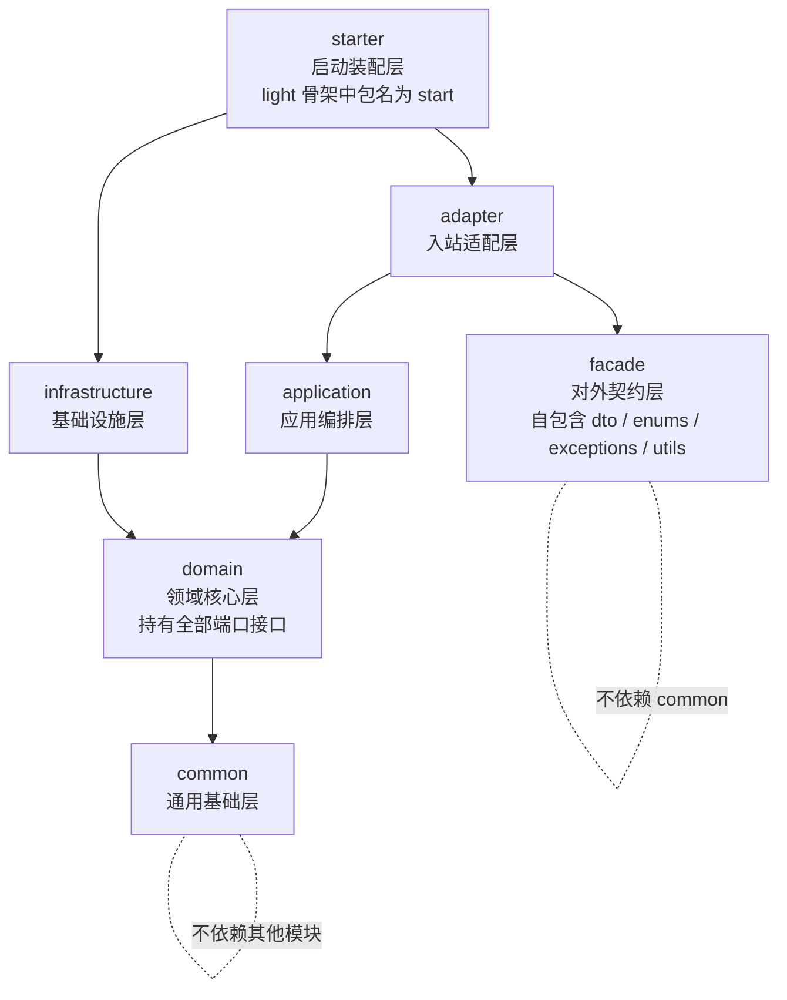

---

## 2. 禁止依赖关系图

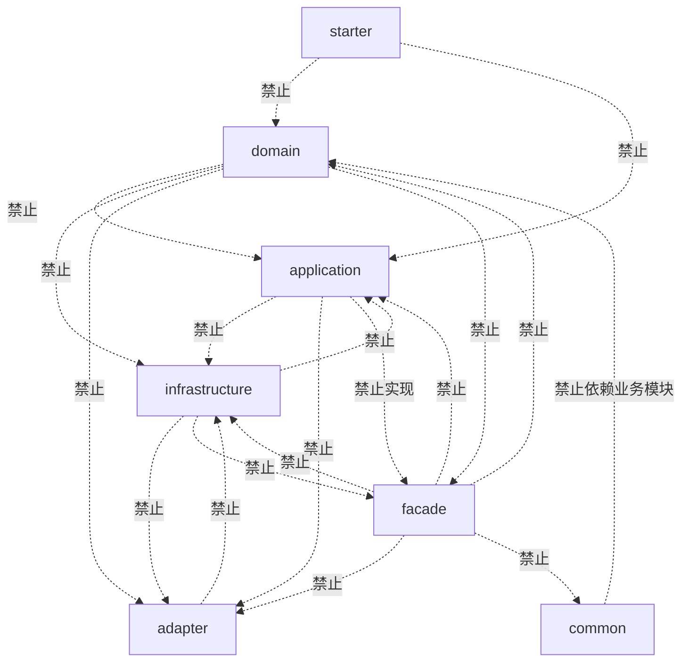

---

## 3. 标准调用方向图

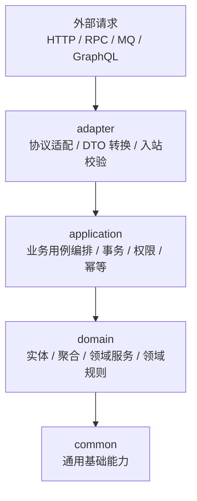

---

## 4. Adapter 入站适配图

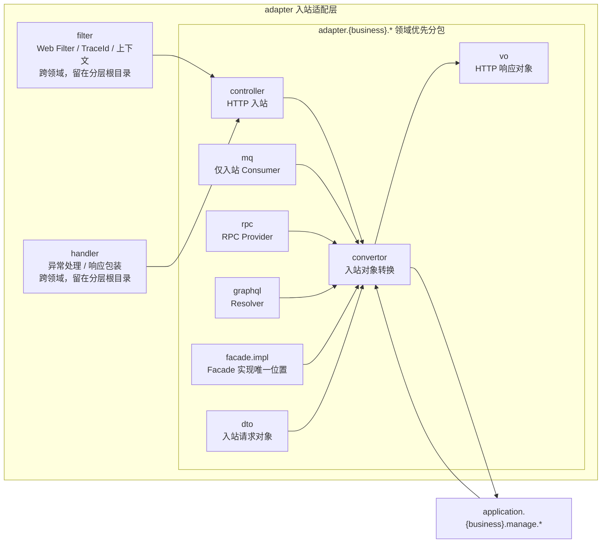

---

## 5. Facade 契约层图

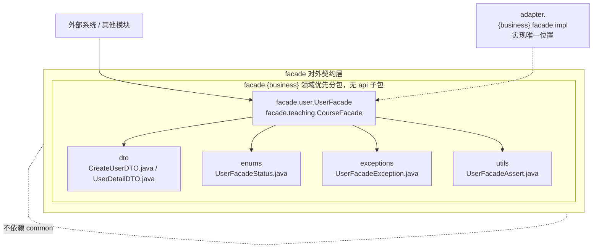

---

## 6. Application 业务编排图

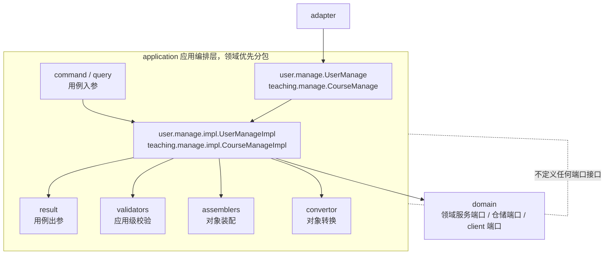

---

## 7. Domain 领域核心图

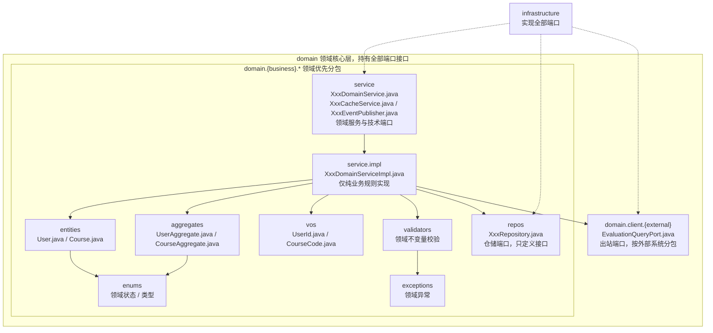

---

## 8. Infrastructure 基础设施图

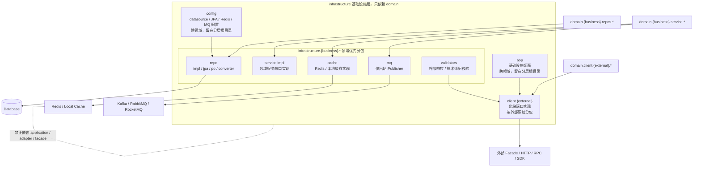

---

## 9. Repository 调用链路图

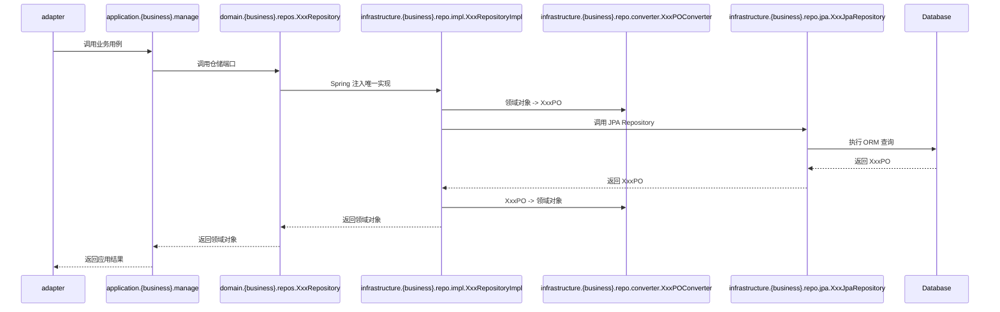

> 持久化只有 JPA 一条链路，不存在 MyBatis-Plus 分支。

---

## 10. JPA 仓储实现链路图

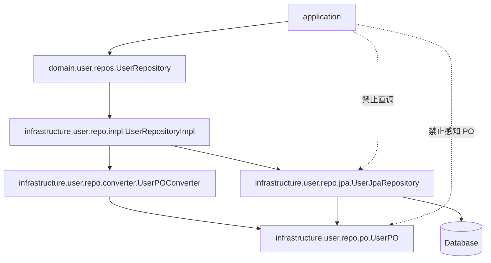

> 这是**唯一**的仓储实现链路：`application` -> `domain.{business}.repos` -> `infrastructure.{business}.repo.impl`
> -> `converter` + `jpa` -> `po`。

---

## 11. 外部 Client 防腐层图

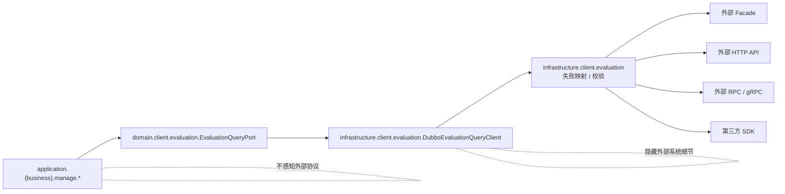

> 出站端口定义在 `domain.client.{external}`，实现唯一放在 `infrastructure.client.{external}`。
> 不存在 `application.client` 包，也不使用 `infrastructure.client.impl` 这种技术优先分包。

---

## 12. MQ 入站与出站隔离图

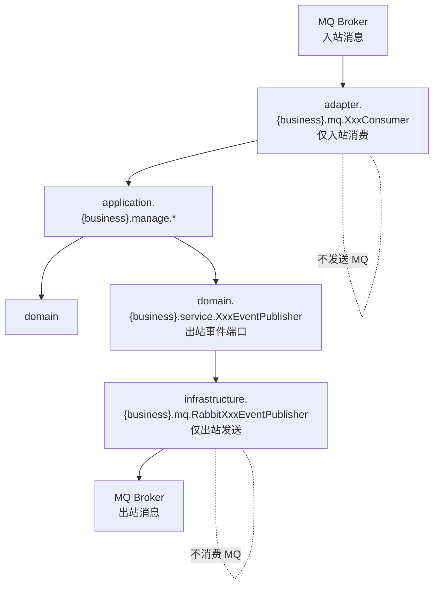

---

## 13. Validator 分层职责图

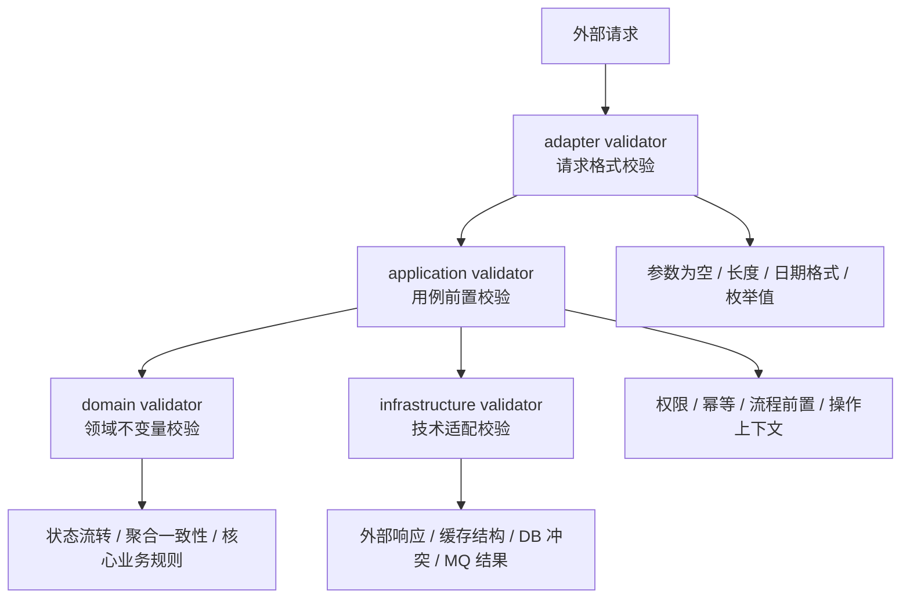

---

## 14. 单体内两个领域示例图

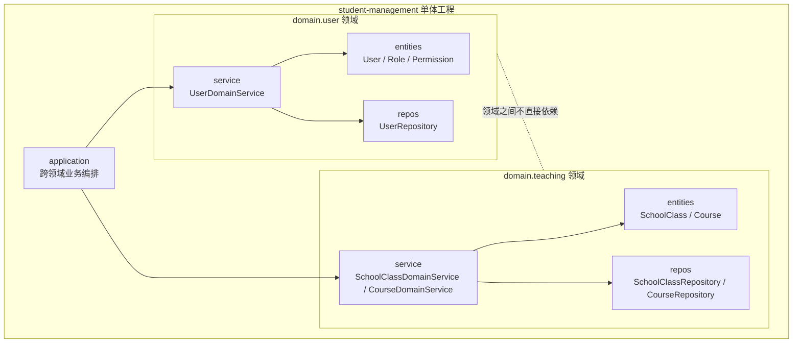

---

## 15. 典型 HTTP 请求时序图

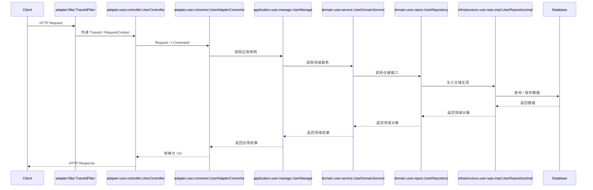

---

## 16. 典型 RPC 请求时序图

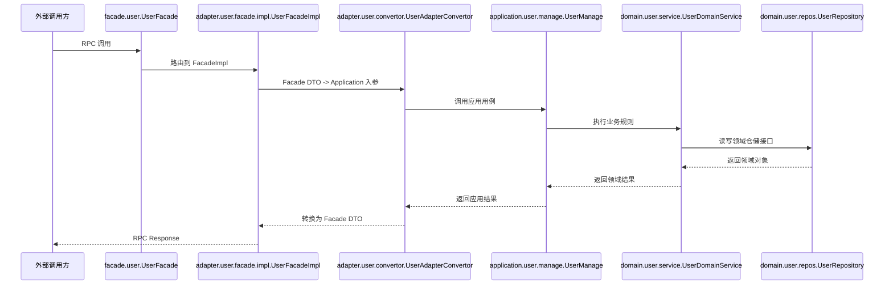

---

## 17. 典型 MQ 入站时序图

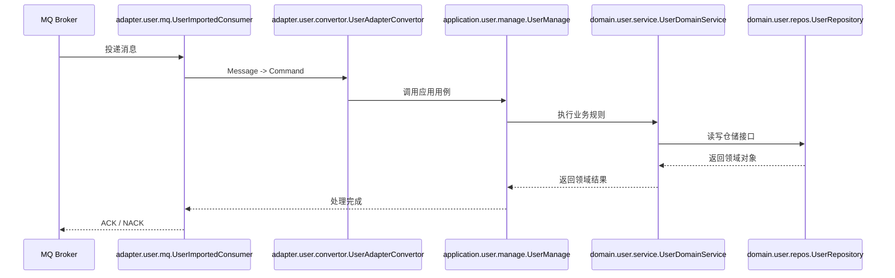

---

## 18. 包结构关系图

```mermaid
flowchart TD
    ROOT["com.xxx.project"]
    ROOT --> STARTER["starter<br/>light 骨架为 start"]
    ROOT --> ADAPTER["adapter"]
    ROOT --> FACADE["facade"]
    ROOT --> APPLICATION["application"]
    ROOT --> DOMAIN["domain"]
    ROOT --> INFRA["infrastructure"]
    ROOT --> COMMON["common"]
    ADAPTER --> ADAPTER_USER["user.controller / user.rpc<br/>user.mq 仅入站 / user.facade.impl"]
    ADAPTER --> ADAPTER_TEACHING["teaching.controller / teaching.rpc<br/>teaching.mq 仅入站 / teaching.facade.impl"]
    ADAPTER --> ADAPTER_SHARED["handler / filter<br/>跨领域，留在分层根目录"]
    FACADE --> FACADE_USER["user<br/>UserFacade + dto / enums / exceptions / utils"]
    FACADE --> FACADE_TEACHING["teaching<br/>CourseFacade + dto / enums / exceptions / utils"]
    APPLICATION --> APP_USER["user.manage.impl<br/>user.command / query / result"]
    APPLICATION --> APP_TEACHING["teaching.manage.impl<br/>teaching.command / query / result"]
    DOMAIN --> DOMAIN_USER["user.entities / user.service<br/>user.repos"]
    DOMAIN --> DOMAIN_TEACHING["teaching.entities / teaching.service<br/>teaching.repos"]
    DOMAIN --> DOMAIN_CLIENT["client.evaluation<br/>出站端口，按外部系统分包"]
    INFRA --> INFRA_USER["user.repo.impl / user.repo.jpa<br/>user.service.impl / user.cache / user.mq 仅出站"]
    INFRA --> INFRA_TEACHING["teaching.repo.impl / teaching.repo.jpa<br/>teaching.service.impl / teaching.cache / teaching.mq 仅出站"]
    INFRA --> INFRA_SHARED["client.evaluation / aop / config<br/>跨领域，留在分层根目录"]
    COMMON --> COMMON_PKG["constants / utils / enums / exceptions"]
```

---

## 19. 架构边界总览图

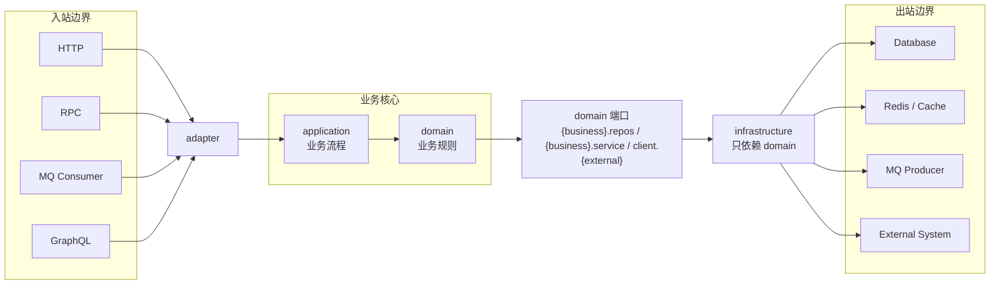
