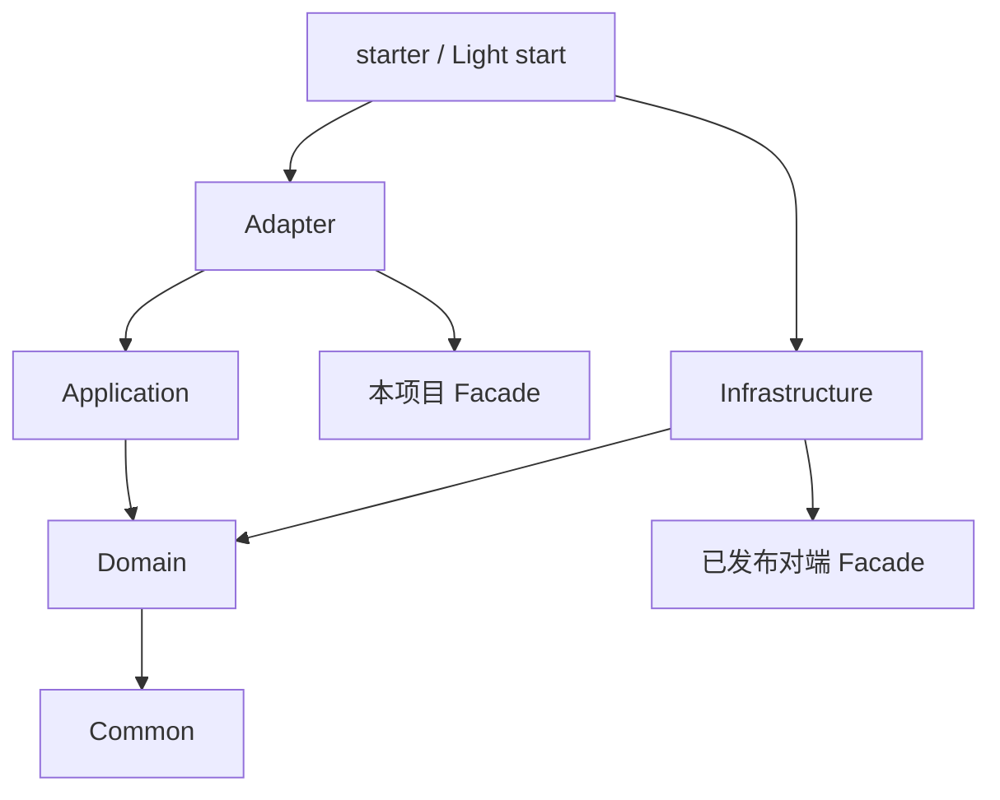
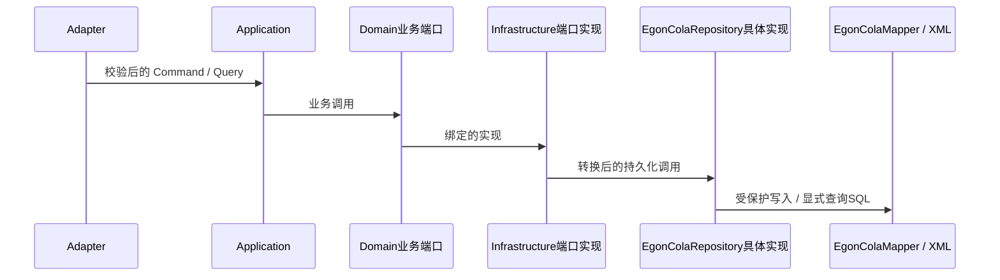
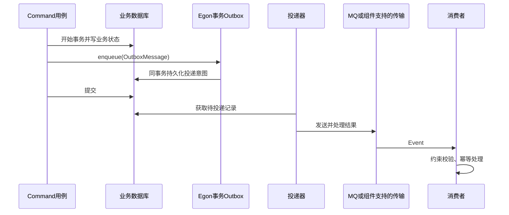
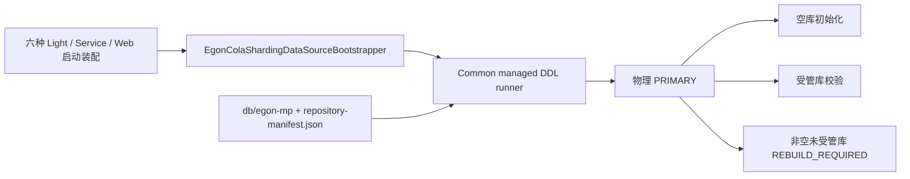

# Egon-COLA 脚手架架构图

更新：2026-09-22。准确的各产品直接 Maven 依赖见[架构总览](open-source-archetype-architecture.md)；新增与修改代码遵循[编码规范](code-style-abstract.md)。下面箭头分别说明依赖或运行调用，不能混用。

## 业务层依赖（箭头为依赖方指向被依赖方）

这是 Service/Web 的业务边界示意，不是全部直接 POM 边。Light 是单模块，facade 为当前源码中的包责任；Agent 不创建 facade。Native/Open 的外部依赖按各自 POM。Domain 不依赖 Infrastructure 的 PO/Mapper，也不继承技术 CRUD 服务。

## 持久化运行调用（箭头为调用方向）

PO、DAO、converter、repo 位于 Infrastructure 的对应业务域内并平级。业务端口由 Domain 持有。事务由实际 Application/use-case 边界协调，不能从示意图推导新增转发类。

## CQE 事务事件

此图描述采用 Outbox 时的目标交互，并不表示所有模板都已接入。直接 MQ 也是允许路径，但必须说明 DB/MQ 双写窗口与重试/恢复。Web 现有 afterCommit Rabbit 路径在失败时记录日志/指标，不能据此声称可靠恢复或 exactly-once。Query 无业务写入或事件副作用。

## 数据库生命周期

旧 B/V/manual SQL 不是这六种产品的运行入口。Agent 也必须收敛到该受管 DDL 标准；其源码残留的 Flyway 配置是待处理差异，不是保留选项。所有图仅解释源码/目标契约，不代表已运行服务或完成真实数据库与消息验收。
