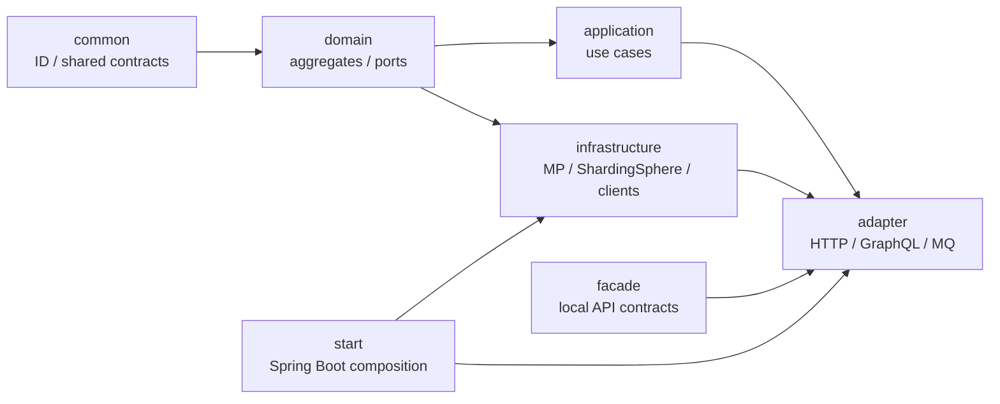
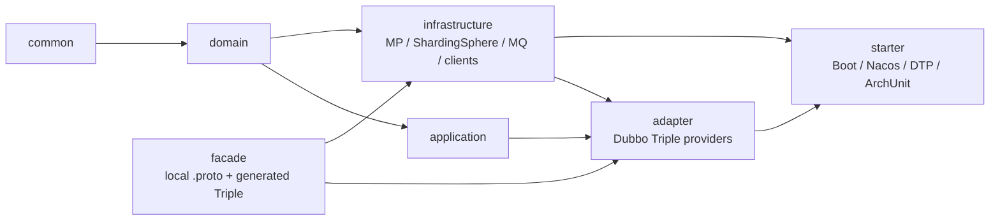
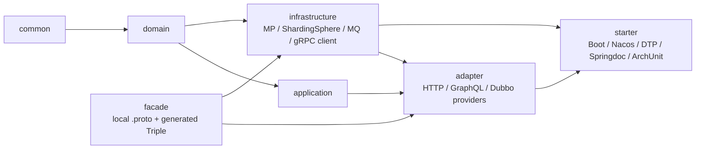
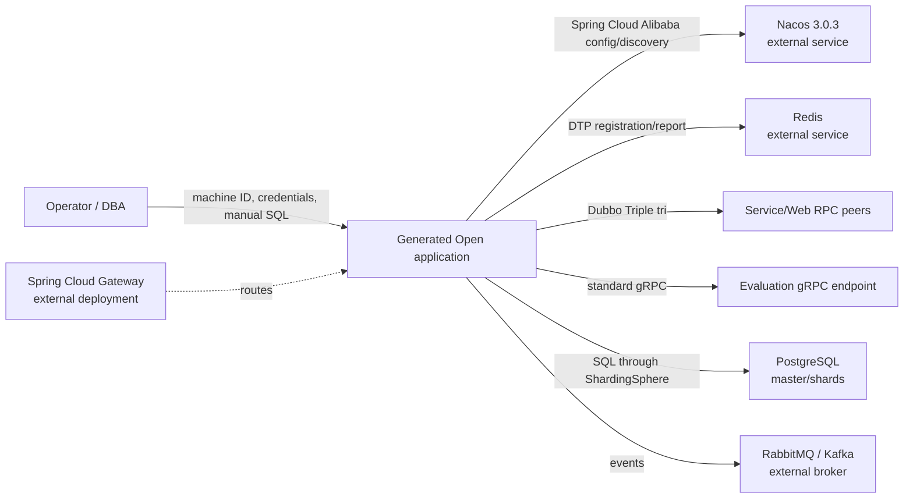

# Open-source Archetype Family Architecture

This document is the implementation-oriented overview for the three public-stack
archetypes. The approved family specification remains the normative contract;
this page explains how the generated modules, protocols, infrastructure, and
operator-owned database steps fit together.

## Family choice

The original artifacts and the Open artifacts are parallel products:

| Product | Original artifact | Open artifact | Shape |
|---|---|---|---|
| Light | `egon-cola-archetype-light` | `egon-cola-archetype-light-open` | one Maven project, domain-first packages |
| Service | `egon-cola-archetype-service` | `egon-cola-archetype-service-open` | seven modules, RPC/MQ service, no HTTP controller |
| Web | `egon-cola-archetype-web` | `egon-cola-archetype-web-open` | seven modules, HTTP/GraphQL adapters plus RPC |

The Open family is the public Spring ecosystem baseline. It does not redirect or
replace the original family, whose component/platform dependencies continue to
evolve independently.

## Approved runtime matrix

All Open products target Java 21 and Spring Boot `3.5.16`. The shared dependency
profile is Spring Cloud `2025.0.3`, Spring Cloud Alibaba `2025.0.0.0`,
MyBatis-Plus `3.5.17`, and ShardingSphere `5.5.3`. Service and Web additionally
pin Dubbo `3.3.6` and gRPC `1.73.0`; Light deliberately has no RPC dependency.
The Web and Light products add Springdoc OpenAPI `2.8.17`; Service deliberately
does not expose HTTP API documentation. Compose examples pin the Nacos image to
`nacos/nacos-server:v3.0.3`.

Every generated project consumes only the approved Egon entries needed by the
profile: Common core/ID and Dynamic Thread Pool, plus the documented RPC or
other direct runtime entry points. No Spring Data JPA, `JpaRepository`,
`jakarta.persistence`, Flyway, Liquibase, or embedded Spring Cloud Gateway is
part of the Open runtime.

## Module and dependency graphs

### Light Open — one bounded project

Light keeps the existing single-module packaging while making the package
direction explicit. Its `facade` package is a leaf contract; it is not a place
for persistence or application orchestration.

The Light project owns eight MyBatis-Plus mapper XML files, manual PostgreSQL
master/shard SQL, one Snowflake `Long` sharding algorithm, and Springdoc
contracts. `applicationTaskExecutor` is the single bounded Spring executor and
uses the Dynamic Thread Pool task decorator; executor limits are explicit in
configuration.

### Service Open — seven modules and local Proto contract

The Service facade is the only wire source. It contains the local evaluation
and organization Proto files, including the wire-compatible
`google/protobuf/empty.proto` support source required by the pinned Dubbo
codegen. The adapter exports the evaluation Triple providers; the infrastructure
client owns the organization consumer boundary. Service has no generated REST
controller and no Springdoc dependency.

### Web Open — seven modules, HTTP adapters, and RPC consumers

Web owns the organization providers and the standard gRPC client for evaluation
queries. Its HTTP and GraphQL IDs are decimal strings so JavaScript consumers do
not lose precision; the internal domain and database representation remains
`Long`. The Web facade Proto directory is byte-identical to Service's facade
Proto directory and is checked by the archetypes reactor gate.

### Runtime context and external boundaries

Gateway is intentionally outside all three generated projects. Nacos, Redis,
PostgreSQL, brokers, and the gRPC load-balancing topology are operator-owned
runtime dependencies; a generated-project test context disables or replaces
them so source and contract tests remain deterministic.

## Identity, persistence, and schema ownership

- `egon-cola-component-common-id-starter` supplies the Snowflake `Long` generator.
  `EGON_ID_MACHINE_ID` is explicit and must be unique per deployment instance;
  tests use machine ID `0` only.
- ShardingSphere owns routing and read/write topology. The Open templates use
  `BIGINT` keys and the corresponding `Long` mapper/domain types. Route keys are
  defined in the checked-in datasource YAML and algorithm classes.
- MyBatis-Plus is the persistence API. Mapper interfaces and XML are owned by
  Infrastructure; repositories in Domain/Application depend on ports, never on
  JPA or generated SQL table names.
- Schema files live in the generated project's manual SQL directory and are
  applied by a DBA in the documented master/shard order. Maven verify and
  application startup never run those scripts and never create or alter tables.

## Protocol ownership

The facade module is a contract leaf. Service and Web maintain independent local
Proto sources but the family gate requires their directories to remain
byte-identical. Proto IDs are positive `int64`; HTTP/GraphQL IDs are decimal
strings. Dubbo providers use the `tri` protocol; Web's evaluation read path also
uses a standard gRPC client. Provider implementations belong to Adapter,
protocol clients belong to Infrastructure, and Application/Domain do not import
generated transport details.

## Proof boundary

The archetype verifier and full `egon-cola-archetypes` reactor prove generation,
dependency bans, package/module direction, mapper/SQL presence, descriptor
shape, in-process RPC contracts, DTP configuration, Springdoc contracts, and
ArchUnit rules. They do not prove live Nacos registration, Redis-backed DTP
reporting, production PostgreSQL topology, broker delivery, cross-process
Triple/gRPC load balancing, or an external Gateway deployment. Those are
deployment/operator acceptance gates described in each generated runbook.
