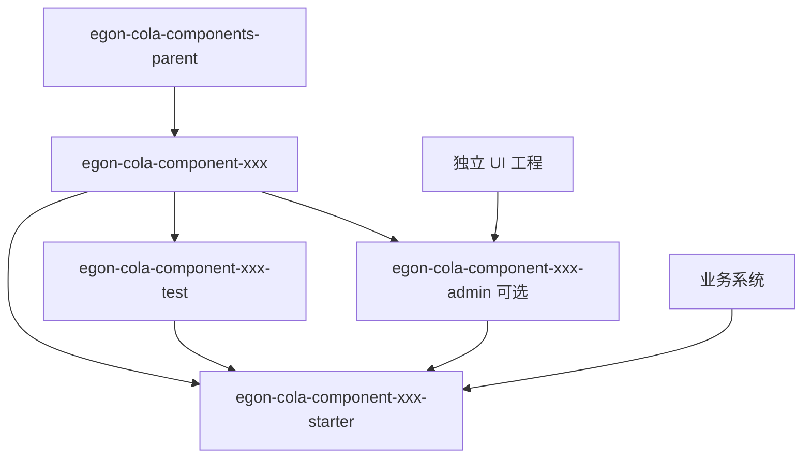
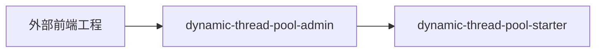
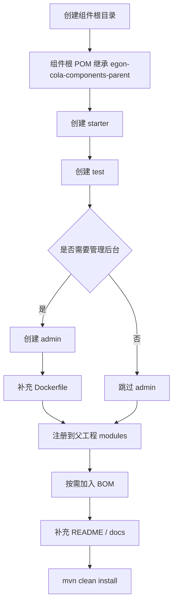

# Egon-COLA Components 多组件工程结构规范

## 1. 综述

本文档用于规范 `egon-cola-components` 下的组件工程组织方式。

运行时 starter-style 组件应该是可以独立维护、独立测试、独立发布的 Maven 多模块组件工程。`egon-cola-component-common` 这类纯基础组件不采用 starter / admin / test 结构，而是通过 common 聚合 POM 管理多个可按需依赖的基础语义 Jar。组件内部不再混放 UI，UI 统一抽离到独立前端工程中维护。

运行时 starter-style 组件整体形态参考动态线程池组件的拆分方式：

```text
component
├── starter   # 业务系统引入的 Spring Boot Starter
├── test      # 组件测试工程 / 示例工程 / 集成测试工程
└── admin     # 可选，组件管理后台；如果存在，必须提供 Dockerfile
```

组件设计目标：

```text
1. 组件统一收敛到 egon-cola-components 父工程下。
2. 每个组件根工程继承 egon-cola-components-parent。
3. 运行时 starter-style 组件内部至少包含 starter 和 test。
4. 如果组件需要管理后台，则增加 admin 模块。
5. 组件内部不包含 UI，UI 统一放到独立前端工程。
6. admin 是后端管理服务，可以提供 REST / RPC / MQ 管理能力。
7. 对运行时 starter-style 组件，starter 是真正给业务系统引入的核心模块。
8. test 用于组件自测、集成测试、示例启动和回归验证。
```

`egon-cola-component-common` 是明确的纯基础组件例外，它不采用 starter / admin / test 结构，而是作为 common 聚合 POM 管理多个可按需依赖的基础语义 Jar。业务系统不直接依赖 `egon-cola-component-common` 聚合 POM，而是按需依赖 `egon-cola-component-common-core`、`egon-cola-component-common-result`、`egon-cola-component-common-id` 等具体模块。

---

## 2. 父工程与依赖关系

## 2.1 上级父 POM

所有组件都必须纳入 `egon-cola-components` 父工程管理。

父工程位置：

```text
Egon-COLA
└── egon-cola-components
    └── pom.xml
```

父 POM 坐标：

```xml

<groupId>top.egon</groupId>
<artifactId>egon-cola-components-parent</artifactId>
<version>5.1.1</version>
<packaging>pom</packaging>
```

组件根工程必须继承该父 POM：

```xml

<parent>
    <groupId>top.egon</groupId>
    <artifactId>egon-cola-components-parent</artifactId>
    <version>5.1.1</version>
    <relativePath>../pom.xml</relativePath>
</parent>
```

## 2.2 组件内部父子关系

运行时 starter-style 组件推荐采用两级 Maven 结构：

```text
egon-cola-components-parent
└── egon-cola-component-xxx
    ├── egon-cola-component-xxx-starter
    ├── egon-cola-component-xxx-test
    └── egon-cola-component-xxx-admin    # 可选
```

也就是说：

```text
1. egon-cola-components/pom.xml 是所有组件的统一父工程。
2. egon-cola-component-xxx/pom.xml 是某一个组件的聚合工程。
3. starter / test / admin 是组件内部子模块。
4. starter / test / admin 继承 egon-cola-component-xxx。
5. egon-cola-component-xxx 继承 egon-cola-components-parent。
```

这样可以保证：

```text
1. 顶层父 POM 统一管理 JDK、Spring Boot、插件、发布配置。
2. 单个组件根 POM 统一管理组件内部模块版本和依赖。
3. starter / test / admin 不需要重复声明通用构建配置。
```

## 2.3 组件模块依赖关系

运行时 starter-style 组件标准依赖关系：

```text
egon-cola-component-xxx-admin -> egon-cola-component-xxx-starter
egon-cola-component-xxx-test  -> egon-cola-component-xxx-starter
```

starter 不允许反向依赖 admin / test。

```text
egon-cola-component-xxx-starter 不依赖 admin
egon-cola-component-xxx-starter 不依赖 test
egon-cola-component-xxx-starter 不依赖 UI
```

## 2.4 Mermaid 依赖图



---

## 3. 顶层 components 工程结构

## 3.1 egon-cola-components 根结构

```text
Egon-COLA/
└── egon-cola-components/
    ├── pom.xml                                                   # components 统一父 POM，artifactId=egon-cola-components-parent
    │
    ├── egon-cola-components-bom/                                 # BOM 模块，统一导出组件依赖版本
    │   ├── pom.xml
    │   └── README.md
    │
    ├── egon-cola-component-common/                               # common 聚合 POM，内部管理基础语义 Jar
    │   ├── pom.xml
    │   ├── egon-cola-component-common-core/
    │   ├── egon-cola-component-common-model/
    │   ├── egon-cola-component-common-result/
    │   ├── egon-cola-component-common-id/
    │   ├── egon-cola-component-common-crypto/
    │   ├── egon-cola-component-common-trace/
    │   ├── egon-cola-component-common-mask/
    │   └── egon-cola-component-common-structure/
    │
    ├── egon-cola-component-dynamic-thread-pool/                  # 动态线程池组件
    │   ├── pom.xml                                               # 动态线程池组件聚合 POM
    │   ├── egon-cola-component-dynamic-thread-pool-starter/      # 业务应用引入的 starter
    │   ├── egon-cola-component-dynamic-thread-pool-admin/        # 可选，管理后台
    │   └── egon-cola-component-dynamic-thread-pool-test/         # 测试工程 / 示例工程
```

## 3.2 父工程 modules 示例

`egon-cola-components/pom.xml` 中只声明组件根模块或已有扁平组件模块。

推荐新增组件时使用组件根模块：

```xml

<modules>
    <module>egon-cola-components-bom</module>
    <module>egon-cola-component-common</module>
    <module>egon-cola-component-dynamic-thread-pool</module>
</modules>
```

---

## 4. 单个组件标准结构

以下以 `egon-cola-component-dynamic-thread-pool` 为例。

## 4.1 组件根结构

```text
egon-cola-component-dynamic-thread-pool/
├── pom.xml                                                       # 组件聚合 POM，继承 egon-cola-components-parent
├── README.md                                                     # 组件说明文档
├── CHANGELOG.md                                                  # 版本变更记录
├── docs/                                                         # 组件设计文档，不参与发布
│   ├── architecture.md                                           # 架构设计说明
│   ├── api.md                                                    # admin 接口说明，可选
│   └── usage.md                                                  # 使用说明
│
├── egon-cola-component-dynamic-thread-pool-starter/              # starter 模块，业务系统依赖这个
├── egon-cola-component-dynamic-thread-pool-admin/                # admin 模块，可选
└── egon-cola-component-dynamic-thread-pool-test/                 # test 模块，测试和示例工程
```

## 4.2 组件根 POM 示例

```xml

<project xmlns="http://maven.apache.org/POM/4.0.0"
         xmlns:xsi="http://www.w3.org/2001/XMLSchema-instance"
         xsi:schemaLocation="http://maven.apache.org/POM/4.0.0 https://maven.apache.org/xsd/maven-4.0.0.xsd">
    <modelVersion>4.0.0</modelVersion>

    <parent>
        <groupId>top.egon</groupId>
        <artifactId>egon-cola-components-parent</artifactId>
        <version>5.1.1</version>
        <relativePath>../pom.xml</relativePath>
    </parent>

    <artifactId>egon-cola-component-dynamic-thread-pool</artifactId>
    <packaging>pom</packaging>
    <name>egon-cola-component-dynamic-thread-pool</name>
    <description>Dynamic thread pool component for Egon COLA.</description>

    <modules>
        <module>egon-cola-component-dynamic-thread-pool-starter</module>
        <module>egon-cola-component-dynamic-thread-pool-admin</module>
        <module>egon-cola-component-dynamic-thread-pool-test</module>
    </modules>
</project>
```

---

## 5. starter 模块结构

## 5.1 starter 定位

对运行时 starter-style 组件，`starter` 是组件的核心模块，也是业务系统真正需要引入的模块。`egon-cola-component-common` 作为纯基础组件聚合 POM 不适用本节 starter 拆分约束。

starter 负责：

```text
1. 提供 Spring Boot AutoConfiguration。
2. 提供组件核心能力。
3. 提供配置属性 Properties。
4. 提供核心 SPI / Registry / Listener / Service。
5. 提供必要的模型对象。
6. 对外暴露最小依赖面。
```

starter 不负责：

```text
1. 不提供 UI。
2. 不提供管理后台页面。
3. 不启动独立 Web 服务。
4. 不放业务系统专属测试代码。
5. 不直接依赖 admin。
6. 不依赖 test。
```

## 5.2 starter 目录结构

```text
egon-cola-component-dynamic-thread-pool-starter/
├── pom.xml                                                       # starter 模块 POM
├── README.md                                                     # starter 使用说明
│
├── src/
│   ├── main/
│   │   ├── java/
│   │   │   └── top/
│   │   │       └── egon/
│   │   │           └── cola/
│   │   │               └── component/
│   │   │                   └── dtp/
│   │   │                       ├── package-info.java             # 动态线程池 starter 根包说明
│   │   │                       │
│   │   │                       ├── autoconfigure/
│   │   │                       │   ├── package-info.java         # 自动装配包说明
│   │   │                       │   ├── DynamicThreadPoolAutoConfiguration.java
│   │   │                       │   ├── DynamicThreadPoolProperties.java
│   │   │                       │   └── DynamicThreadPoolCondition.java
│   │   │                       │
│   │   │                       ├── core/
│   │   │                       │   ├── package-info.java         # 核心能力包说明
│   │   │                       │   ├── DynamicThreadPoolService.java
│   │   │                       │   ├── DynamicThreadPoolManager.java
│   │   │                       │   └── DynamicThreadPoolRegistry.java
│   │   │                       │
│   │   │                       ├── model/
│   │   │                       │   ├── package-info.java         # 模型对象包说明
│   │   │                       │   ├── DynamicThreadPoolConfig.java
│   │   │                       │   ├── DynamicThreadPoolSnapshot.java
│   │   │                       │   ├── DynamicThreadPoolUpdateCommand.java
│   │   │                       │   └── DynamicThreadPoolReportEvent.java
│   │   │                       │
│   │   │                       ├── monitor/
│   │   │                       │   ├── package-info.java         # 监控采集包说明
│   │   │                       │   ├── ThreadPoolMetricsCollector.java
│   │   │                       │   └── ThreadPoolDataReportScheduler.java
│   │   │                       │
│   │   │                       ├── listener/
│   │   │                       │   ├── package-info.java         # 配置变更监听包说明
│   │   │                       │   └── ThreadPoolConfigChangeListener.java
│   │   │                       │
│   │   │                       ├── registry/
│   │   │                       │   ├── package-info.java         # 注册中心抽象包说明
│   │   │                       │   ├── ThreadPoolRegistry.java
│   │   │                       │   └── redis/
│   │   │                       │       ├── package-info.java     # Redis 注册实现包说明
│   │   │                       │       └── RedisThreadPoolRegistry.java
│   │   │                       │
│   │   │                       ├── exception/
│   │   │                       │   ├── package-info.java         # 组件异常包说明
│   │   │                       │   └── DynamicThreadPoolException.java
│   │   │                       │
│   │   │                       ├── constants/
│   │   │                       │   ├── package-info.java         # 常量包说明
│   │   │                       │   └── DynamicThreadPoolConstants.java
│   │   │                       │
│   │   │                       └── util/
│   │   │                           ├── package-info.java         # starter 内部工具包说明
│   │   │                           └── ThreadPoolNameUtils.java
│   │   │
│   │   └── resources/
│   │       ├── META-INF/
│   │       │   ├── spring/
│   │       │   │   └── org.springframework.boot.autoconfigure.AutoConfiguration.imports
│   │       │   └── additional-spring-configuration-metadata.json
│   │
│   └── test/
│       ├── java/
│       │   └── top/
│       │       └── egon/
│       │           └── cola/
│       │               └── component/
│       │                   └── dtp/
│       │                       ├── package-info.java
│       │                       └── DynamicThreadPoolAutoConfigurationTest.java
│       └── resources/
│           ├── application-test.yml
│           └── logback-test.xml
```

## 5.3 starter POM 示例

```xml

<project xmlns="http://maven.apache.org/POM/4.0.0"
         xmlns:xsi="http://www.w3.org/2001/XMLSchema-instance"
         xsi:schemaLocation="http://maven.apache.org/POM/4.0.0 https://maven.apache.org/xsd/maven-4.0.0.xsd">
    <modelVersion>4.0.0</modelVersion>

    <parent>
        <groupId>top.egon</groupId>
        <artifactId>egon-cola-component-dynamic-thread-pool</artifactId>
        <version>5.1.1</version>
        <relativePath>../pom.xml</relativePath>
    </parent>

    <artifactId>egon-cola-component-dynamic-thread-pool-starter</artifactId>
    <packaging>jar</packaging>
    <name>egon-cola-component-dynamic-thread-pool-starter</name>

    <dependencies>
        <dependency>
            <groupId>org.springframework.boot</groupId>
            <artifactId>spring-boot-autoconfigure</artifactId>
        </dependency>

        <dependency>
            <groupId>org.springframework.boot</groupId>
            <artifactId>spring-boot-configuration-processor</artifactId>
            <optional>true</optional>
        </dependency>
    </dependencies>
</project>
```

## 5.4 AutoConfiguration.imports 示例

```text
# src/main/resources/META-INF/spring/org.springframework.boot.autoconfigure.AutoConfiguration.imports
top.egon.cola.component.dtp.config.DynamicThreadPoolAutoConfig
```

---

## 6. admin 模块结构

## 6.1 admin 定位

`admin` 是组件的后端管理服务，只有组件需要集中管理能力时才需要提供。

例如：

```text
1. 动态线程池需要查看线程池状态、修改线程池参数。
2. 分布式限流需要管理限流规则。
3. 任务调度需要管理任务、触发任务、查看执行日志。
4. 动态配置中心需要管理配置项、发布配置、查看配置历史。
```

admin 可以提供：

```text
1. REST API。
2. RPC API。
3. MQ 管理入口。
4. 后台任务。
5. 数据库持久化。
6. 缓存管理。
7. Dockerfile。
```

admin 不提供：

```text
1. 不放 UI 页面。
2. 不放前端路由。
3. 不放 Vue / React / Vite 代码。
4. 不作为业务系统直接依赖。
```

## 6.2 admin 目录结构

```text
egon-cola-component-dynamic-thread-pool-admin/
├── pom.xml                                                       # admin 模块 POM
├── Dockerfile                                                    # admin 必须提供 Dockerfile
├── README.md                                                     # admin 部署说明
├── docker/
│   ├── docker-compose.yml                                       # 可选，本地调试编排
│   └── entrypoint.sh                                             # 可选，容器启动脚本
│
├── src/
│   ├── main/
│   │   ├── java/
│   │   │   └── top/
│   │   │       └── egon/
│   │   │           └── cola/
│   │   │               └── component/
│   │   │                   └── dtp/
│   │   │                       └── admin/
│   │   │                           ├── package-info.java         # admin 根包说明
│   │   │                           ├── DynamicThreadPoolAdminApplication.java
│   │   │                           │
│   │   │                           ├── controller/
│   │   │                           │   ├── package-info.java     # 管理接口包说明
│   │   │                           │   └── DynamicThreadPoolAdminController.java
│   │   │                           │
│   │   │                           ├── application/
│   │   │                           │   ├── package-info.java     # admin 应用编排包说明
│   │   │                           │   ├── DynamicThreadPoolAdminService.java
│   │   │                           │   └── DynamicThreadPoolAdminServiceImpl.java
│   │   │                           │
│   │   │                           ├── model/
│   │   │                           │   ├── package-info.java     # admin 请求响应模型包说明
│   │   │                           │   ├── ThreadPoolConfigQueryRequest.java
│   │   │                           │   ├── ThreadPoolConfigUpdateRequest.java
│   │   │                           │   └── ThreadPoolConfigResponse.java
│   │   │                           │
│   │   │                           ├── repository/
│   │   │                           │   ├── package-info.java     # admin 持久化包说明
│   │   │                           │   ├── ThreadPoolConfigRepository.java
│   │   │                           │   ├── ThreadPoolConfigPO.java
│   │   │                           │   └── ThreadPoolConfigMapper.java
│   │   │                           │
│   │   │                           ├── mq/
│   │   │                           │   ├── package-info.java     # admin 消息发布包说明
│   │   │                           │   └── ThreadPoolConfigChangePublisher.java
│   │   │                           │
│   │   │                           ├── config/
│   │   │                           │   ├── package-info.java     # admin 配置包说明
│   │   │                           │   ├── DynamicThreadPoolAdminConfig.java
│   │   │                           │   └── WebMvcConfig.java
│   │   │                           │
│   │   │                           └── handler/
│   │   │                               ├── package-info.java     # admin 全局处理包说明
│   │   │                               └── AdminGlobalExceptionHandler.java
│   │   │
│   │   └── resources/
│   │       ├── application.yml
│   │       ├── application-dev.yml
│   │       ├── application-test.yml
│   │       ├── application-prod.yml
│   │       ├── logback-spring.xml
│   │       └── db/
│   │           └── migration/
│   │               ├── V1__create_thread_pool_config.sql
│   │               └── V2__create_thread_pool_report.sql
│   │
│   └── test/
│       ├── java/
│       │   └── top/
│       │       └── egon/
│       │           └── cola/
│       │               └── component/
│       │                   └── dtp/
│       │                       └── admin/
│       │                           ├── package-info.java
│       │                           └── DynamicThreadPoolAdminApplicationTest.java
│       └── resources/
│           ├── application-test.yml
│           └── logback-test.xml
```

## 6.3 admin POM 示例

```xml

<project xmlns="http://maven.apache.org/POM/4.0.0"
         xmlns:xsi="http://www.w3.org/2001/XMLSchema-instance"
         xsi:schemaLocation="http://maven.apache.org/POM/4.0.0 https://maven.apache.org/xsd/maven-4.0.0.xsd">
    <modelVersion>4.0.0</modelVersion>

    <parent>
        <groupId>top.egon</groupId>
        <artifactId>egon-cola-component-dynamic-thread-pool</artifactId>
        <version>5.1.1</version>
        <relativePath>../pom.xml</relativePath>
    </parent>

    <artifactId>egon-cola-component-dynamic-thread-pool-admin</artifactId>
    <packaging>jar</packaging>
    <name>egon-cola-component-dynamic-thread-pool-admin</name>

    <dependencies>
        <dependency>
            <groupId>top.egon</groupId>
            <artifactId>egon-cola-component-dynamic-thread-pool-starter</artifactId>
            <version>${project.version}</version>
        </dependency>

        <dependency>
            <groupId>org.springframework.boot</groupId>
            <artifactId>spring-boot-starter-web</artifactId>
        </dependency>

        <dependency>
            <groupId>org.springframework.boot</groupId>
            <artifactId>spring-boot-starter-actuator</artifactId>
        </dependency>
    </dependencies>
</project>
```

## 6.4 Dockerfile 示例

```dockerfile
FROM eclipse-temurin:21-jre

WORKDIR /app

ARG JAR_FILE=target/egon-cola-component-dynamic-thread-pool-admin.jar
COPY ${JAR_FILE} /app/app.jar

ENV JAVA_OPTS="-Xms512m -Xmx512m"
ENV SPRING_PROFILES_ACTIVE="prod"

EXPOSE 8080

ENTRYPOINT ["sh", "-c", "java ${JAVA_OPTS} -jar /app/app.jar --spring.profiles.active=${SPRING_PROFILES_ACTIVE}"]
```

---

## 7. test 模块结构

## 7.1 test 定位

`test` 模块用于组件验证和示例运行。

它不是业务组件的一部分，也不应该被其他业务工程依赖。

适合放：

```text
1. 示例启动类。
2. starter 集成测试。
3. admin 联调测试。
4. 容器化测试配置。
5. 组件最小使用示例。
6. 回归测试用例。
```

不适合放：

```text
1. 组件核心代码。
2. 生产环境配置。
3. 发布到业务系统的 API。
4. UI 代码。
```

## 7.2 test 目录结构

```text
egon-cola-component-dynamic-thread-pool-test/
├── pom.xml                                                       # test 模块 POM
├── README.md                                                     # 测试说明
│
├── src/
│   ├── main/
│   │   ├── java/
│   │   │   └── top/
│   │   │       └── egon/
│   │   │           └── cola/
│   │   │               └── component/
│   │   │                   └── dtp/
│   │   │                       └── test/
│   │   │                           ├── package-info.java         # 测试示例根包说明
│   │   │                           ├── DynamicThreadPoolTestApplication.java
│   │   │                           │
│   │   │                           ├── config/
│   │   │                           │   ├── package-info.java     # 示例配置包说明
│   │   │                           │   └── ThreadPoolExampleConfig.java
│   │   │                           │
│   │   │                           ├── runner/
│   │   │                           │   ├── package-info.java     # 示例运行器包说明
│   │   │                           │   └── ThreadPoolExampleRunner.java
│   │   │                           │
│   │   │                           └── service/
│   │   │                               ├── package-info.java     # 示例业务包说明
│   │   │                               └── ThreadPoolExampleService.java
│   │   │
│   │   └── resources/
│   │       ├── application.yml
│   │       ├── application-dev.yml
│   │       ├── application-test.yml
│   │       └── logback-spring.xml
│   │
│   └── test/
│       ├── java/
│       │   └── top/
│       │       └── egon/
│       │           └── cola/
│       │               └── component/
│       │                   └── dtp/
│       │                       └── test/
│       │                           ├── package-info.java
│       │                           ├── DynamicThreadPoolStarterIntegrationTest.java
│       │                           └── DynamicThreadPoolRedisIntegrationTest.java
│       └── resources/
│           ├── application-test.yml
│           └── logback-test.xml
```

## 7.3 test POM 示例

```xml

<project xmlns="http://maven.apache.org/POM/4.0.0"
         xmlns:xsi="http://www.w3.org/2001/XMLSchema-instance"
         xsi:schemaLocation="http://maven.apache.org/POM/4.0.0 https://maven.apache.org/xsd/maven-4.0.0.xsd">
    <modelVersion>4.0.0</modelVersion>

    <parent>
        <groupId>top.egon</groupId>
        <artifactId>egon-cola-component-dynamic-thread-pool</artifactId>
        <version>5.1.1</version>
        <relativePath>../pom.xml</relativePath>
    </parent>

    <artifactId>egon-cola-component-dynamic-thread-pool-test</artifactId>
    <packaging>jar</packaging>
    <name>egon-cola-component-dynamic-thread-pool-test</name>

    <dependencies>
        <dependency>
            <groupId>top.egon</groupId>
            <artifactId>egon-cola-component-dynamic-thread-pool-starter</artifactId>
            <version>${project.version}</version>
        </dependency>

        <dependency>
            <groupId>org.springframework.boot</groupId>
            <artifactId>spring-boot-starter-test</artifactId>
            <scope>test</scope>
        </dependency>
    </dependencies>
</project>
```

---

## 8. 无 admin 组件结构示例

并不是所有组件都需要 admin，也不是所有组件都必须拆成 starter / test / admin。

`egon-cola-component-common` 是当前基础能力组件聚合 POM，不提供 starter、admin，也不进入独立运行流程。业务系统不直接依赖该聚合 POM，而是按需依赖具体基础语义 Jar：

```text
egon-cola-component-common/
├── pom.xml
├── egon-cola-component-common-core/
├── egon-cola-component-common-model/
├── egon-cola-component-common-trace/
├── egon-cola-component-common-result/
├── egon-cola-component-common-id/
├── egon-cola-component-common-crypto/
├── egon-cola-component-common-mask/
├── egon-cola-component-common-structure/
└── egon-cola-component-common-test/
```

---

## 9. 有 admin 组件结构示例

动态线程池组件是当前带 admin 的组件示例。starter 给业务系统按需引入，admin 作为独立管理服务部署，test 只用于组件自测和示例验证：

```text
egon-cola-component-dynamic-thread-pool/
├── pom.xml
├── README.md
├── docs/
│   └── manifest.md
│
├── egon-cola-component-dynamic-thread-pool-starter/
│   ├── pom.xml
│   └── src/
│       ├── main/
│       │   ├── java/
│       │   │   └── top/egon/cola/component/dtp/
│       │   └── resources/
│       │       └── META-INF/spring/org.springframework.boot.autoconfigure.AutoConfiguration.imports
│       └── test/
│           ├── java/
│           └── resources/
│
├── egon-cola-component-dynamic-thread-pool-admin/
│   ├── pom.xml
│   ├── Dockerfile
│   └── src/
│       ├── main/
│       │   ├── java/
│       │   │   └── top/egon/cola/component/dtp/admin/
│       │   └── resources/
│       │       ├── application.yml
│       │       └── application-dev.yml
│       └── test/
│           ├── java/
│           └── resources/
│
└── egon-cola-component-dynamic-thread-pool-test/
    ├── pom.xml
    └── src/
        ├── main/
        └── test/
```

---

## 10. UI 工程分离规范

组件工程不放 UI。

当前仓库只维护组件后端能力。动态线程池 admin 提供 `/api/v1/dtp` 后端 API，并通过 `GET /api/v1/dtp/manifest` 暴露前端发现协议。

```text
component: dynamic-thread-pool
baseApi: /api/v1/dtp
frontend.module: dynamic-thread-pool
frontend.routeBase: /components/dynamic-thread-pool
```

UI 与 admin 的关系：



---

## 11. BOM 管理规范

`egon-cola-components-bom` 用于统一管理对业务系统开放的组件版本。

当前 BOM 只导出业务系统可直接依赖的 common 具体 Jar 与 starter，不导出 common 聚合 POM、admin 和 test。

admin 是否导出取决于部署方式：

```text
1. 如果 admin 只作为内部服务部署，不需要放到 BOM。
2. 如果 admin 也需要被其他工程以依赖方式复用，可以加入 BOM。
3. test 永远不进入 BOM。
```

BOM 示例：

```xml

<dependencyManagement>
    <dependencies>
        <dependency>
            <groupId>top.egon</groupId>
            <artifactId>egon-cola-component-common-core</artifactId>
            <version>${project.version}</version>
        </dependency>
        <dependency>
            <groupId>top.egon</groupId>
            <artifactId>egon-cola-component-common-result</artifactId>
            <version>${project.version}</version>
        </dependency>

        <dependency>
            <groupId>top.egon</groupId>
            <artifactId>egon-cola-component-dynamic-thread-pool-starter</artifactId>
            <version>${project.version}</version>
        </dependency>
    </dependencies>
</dependencyManagement>
```

业务系统使用方式：

```xml

<dependencyManagement>
    <dependencies>
        <dependency>
            <groupId>top.egon</groupId>
            <artifactId>egon-cola-components-bom</artifactId>
            <version>5.2.1</version>
            <type>pom</type>
            <scope>import</scope>
        </dependency>
    </dependencies>
</dependencyManagement>

<dependencies>
<dependency>
    <groupId>top.egon</groupId>
    <artifactId>egon-cola-component-common-result</artifactId>
</dependency>
</dependencies>
```

---

## 12. 命名规范

## 12.1 组件命名

```text
egon-cola-component-{component-name}
```

示例：

```text
egon-cola-component-common
egon-cola-component-dynamic-thread-pool
```

## 12.2 starter 命名

```text
egon-cola-component-{component-name}-starter
```

示例：

```text
egon-cola-component-dynamic-thread-pool-starter
```

## 12.3 admin 命名

```text
egon-cola-component-{component-name}-admin
```

示例：

```text
egon-cola-component-dynamic-thread-pool-admin
```

## 12.4 test 命名

```text
egon-cola-component-{component-name}-test
```

示例：

```text
egon-cola-component-dynamic-thread-pool-test
```

## 12.5 Java 包名命名

starter 包名：

```text
top.egon.cola.component.{component}.xxx
```

admin 包名：

```text
top.egon.cola.component.{component}.admin.xxx
```

test 包名：

```text
top.egon.cola.component.{component}.test.xxx
```

示例：

```text
top.egon.cola.component.common.exception
top.egon.cola.component.dtp.config
top.egon.cola.component.dtp.admin.trigger
top.egon.cola.component.dtp.test
```

---

## 13. 组件开发约束

## 13.1 starter 约束

```text
1. 除 common 这类纯 Jar 基础组件外，运行时 starter-style 组件应由业务系统直接引入 starter。
2. starter 必须提供自动装配能力。
3. starter 的配置项必须提供 Properties 类。
4. starter 必须提供 AutoConfiguration.imports。
5. starter 不允许依赖 admin。
6. starter 不允许依赖 test。
7. starter 不允许包含 UI。
8. starter 不允许启动独立服务。
9. starter 尽量减少三方依赖暴露。
10. starter 对外 API 要稳定。
```

## 13.2 admin 约束

```text
1. admin 是可选模块。
2. 有 admin 就必须提供 Dockerfile。
3. admin 可以依赖 starter。
4. admin 不允许被 starter 依赖。
5. admin 不放 UI。
6. admin 可以提供 REST API 给独立 UI 调用。
7. admin 可以提供 RPC / MQ 管理入口。
8. admin 可以独立部署。
```

## 13.3 test 约束

```text
1. test 是测试工程和示例工程。
2. test 可以依赖 starter。
3. test 可以依赖 admin 进行集成测试。
4. test 不参与 BOM 导出。
5. test 不作为业务系统依赖。
6. test 中允许有启动类和样例配置。
```

## 13.4 UI 约束

```text
1. components 工程不存放 UI。
2. UI 统一放到独立前端工程。
3. UI 通过 HTTP / RPC Gateway 调用 admin。
4. UI 路由按组件动态挂载。
5. UI 不反向影响 starter 设计。
```

---

## 14. 新增组件流程

新增运行时 starter-style 组件时，按以下流程执行。纯基础组件可以参考 `egon-cola-component-common` 的聚合 POM 形态，但业务依赖应导向具体 Jar 模块。

```text
1. 在 egon-cola-components 下创建 egon-cola-component-{name} 目录。
2. 创建组件根 pom.xml，并继承 egon-cola-components-parent。
3. 创建 egon-cola-component-{name}-starter 模块。
4. 创建 egon-cola-component-{name}-test 模块。
5. 如果需要后台管理能力，创建 egon-cola-component-{name}-admin 模块。
6. 如果存在 admin，必须补充 Dockerfile。
7. 在 egon-cola-components/pom.xml 中注册组件根 module。
8. 在 egon-cola-components-bom 中按需导出 starter。
9. 编写 README.md、usage.md、architecture.md。
10. 编写 starter 自动装配和测试用例。
11. 本地执行 mvn clean install。
```

Mermaid 流程图：



---

## 15. 最终标准模板

带 admin 的组件：

```text
egon-cola-component-{name}/
├── pom.xml
├── README.md
├── CHANGELOG.md
├── docs/
│   ├── architecture.md
│   ├── api.md
│   └── usage.md
│
├── egon-cola-component-{name}-starter/
│   ├── pom.xml
│   └── src/
│       ├── main/
│       │   ├── java/
│       │   └── resources/
│       └── test/
│           ├── java/
│           └── resources/
│
├── egon-cola-component-{name}-admin/
│   ├── pom.xml
│   ├── Dockerfile
│   └── src/
│       ├── main/
│       │   ├── java/
│       │   └── resources/
│       └── test/
│           ├── java/
│           └── resources/
│
└── egon-cola-component-{name}-test/
    ├── pom.xml
    └── src/
        ├── main/
        │   ├── java/
        │   └── resources/
        └── test/
            ├── java/
            └── resources/
```

不带 admin 的组件：

```text
egon-cola-component-{name}/
├── pom.xml
├── README.md
├── CHANGELOG.md
├── docs/
│   ├── architecture.md
│   └── usage.md
│
├── egon-cola-component-{name}-starter/
│   ├── pom.xml
│   └── src/
│       ├── main/
│       │   ├── java/
│       │   └── resources/
│       └── test/
│           ├── java/
│           └── resources/
│
└── egon-cola-component-{name}-test/
    ├── pom.xml
    └── src/
        ├── main/
        │   ├── java/
        │   └── resources/
        └── test/
            ├── java/
            └── resources/
```

---

## 16. 总结

Egon-COLA components 的核心结构是：

```text
components-parent
└── component
    ├── starter
    ├── test
    └── admin，可选
```

最终规范：

```text
1. 每个组件根工程继承 egon-cola-components-parent。
2. 运行时 starter-style 组件至少有 starter 和 test。
3. 需要管理能力时增加 admin。
4. 有 admin 必须提供 Dockerfile。
5. components 工程不放 UI。
6. UI 独立工程维护。
7. starter 面向需要自动装配的业务系统运行时能力。
8. admin 面向管理后台。
9. test 面向验证和示例。
10. BOM 导出 common 这类纯 Jar 基础组件，以及业务系统可直接依赖的 starter。
```

一句话总结：

```text
组件工程只管能力沉淀，UI 单独抽走；common 这类纯 Jar 能力可以被业务直接依赖，starter 给运行时组件业务接入使用，admin 给平台管，test 给自己验。
```
