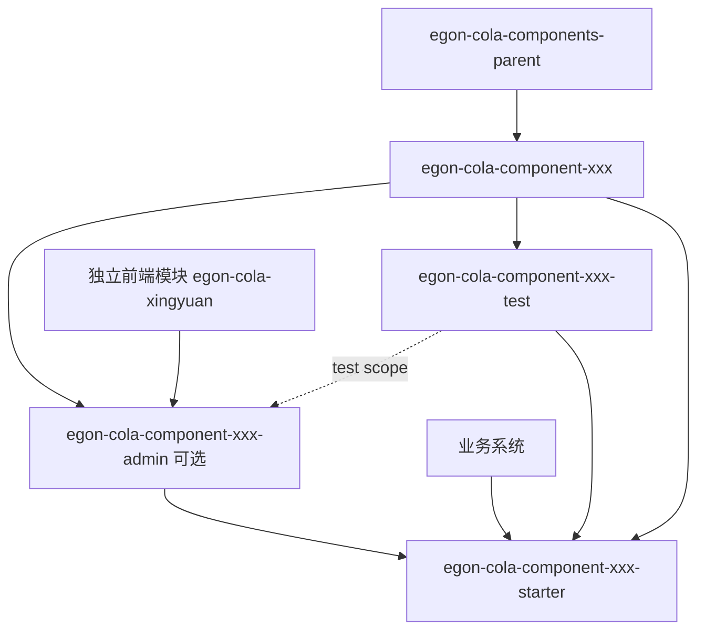
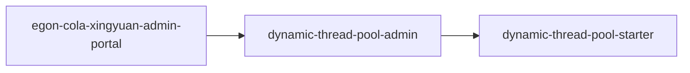
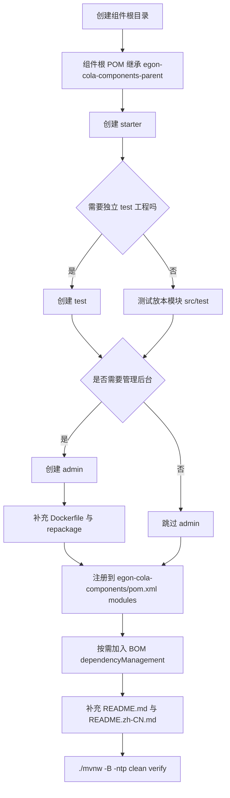

# Egon-COLA Components 多组件工程结构规范

## 1. 综述

本文档用于规范 `egon-cola-components` 下的组件工程组织方式。

运行时 starter-style 组件应该是可以独立维护、独立测试、独立发布的 Maven 组件工程。`egon-cola-component-common` 通过 common 聚合 POM 管理多个可按需依赖的基础能力模块；轻量 Starter 可以直接作为 common 的子模块，例如同时承载纯 JDK ID 算法与 Spring Boot 自动配置的 `egon-cola-component-common-id-starter`。组件内部不再混放 UI，UI 统一抽离到独立前端模块中维护（本仓库 `egon-cola-xingyuan/` 下的 admin portal 与共享前端包）。

运行时 starter-style 组件整体形态参考动态线程池组件的拆分方式：

```text
component
├── starter   # 业务系统引入的 Spring Boot Starter
├── test      # 组件测试工程 / 示例工程 / 集成测试工程
└── admin     # 可选，组件管理后台；如果存在，必须提供 Dockerfile
```

组件设计目标：

```text
1. 组件统一收敛到 egon-cola-components 父工程下。
2. 每个组件根工程继承 egon-cola-components-parent。
3. 常规运行时组件内部至少包含 starter 和 test；轻量扁平 starter 的测试可放在本模块 `src/test`。
4. 如果组件需要管理后台，则增加 admin 模块。
5. 组件内部不包含 UI，UI 统一放到独立前端模块。
6. admin 是后端管理服务，可以提供 REST / RPC / MQ 管理能力。
7. 对运行时 starter-style 组件，starter 是真正给业务系统引入的核心模块。
8. test 用于组件自测、集成测试、示例启动和回归验证。
```

`egon-cola-component-common` 是明确的基础组件例外，它不采用 starter / admin / test 三模块结构，而是作为 common 聚合 POM 管理 core 契约 Jar 与少量工具模块。业务系统不直接依赖该聚合 POM，而是按需依赖具体模块；ID 能力只发布 common 下的 `egon-cola-component-common-id-starter`，算法、自动配置和测试均位于该模块。

---

## 2. 父工程与依赖关系

## 2.1 上级父 POM

所有组件都必须纳入 `egon-cola-components` 父工程管理。

父工程位置：

```text
Egon-COLA
└── egon-cola-components
    └── pom.xml
```

父 POM 坐标：

```xml

<groupId>top.egon</groupId>
<artifactId>egon-cola-components-parent</artifactId>
<version>5.4.1</version>
<packaging>pom</packaging>
```

`egon-cola-components-parent` 自身还有父 POM `top.egon:egon-cola-aggregation-parent:5.4.1`，
也就是仓库根 `pom.xml`；它再继承 `org.springframework.boot:spring-boot-starter-parent:3.5.16`。
JDK、Spring Boot 版本、central-publishing 与 GPG 等发布配置都定义在仓库根 POM，组件不要直接继承它。

组件根工程必须继承该父 POM：

```xml

<parent>
    <groupId>top.egon</groupId>
    <artifactId>egon-cola-components-parent</artifactId>
    <version>5.4.1</version>
    <relativePath>../pom.xml</relativePath>
</parent>
```

`<parent><version>` 写当前仓库的发布版本，新增组件时不要沿用示例中的历史值。

## 2.2 组件内部父子关系

运行时 starter-style 组件推荐采用两级 Maven 结构：

```text
egon-cola-components-parent
└── egon-cola-component-xxx
    ├── egon-cola-component-xxx-starter
    ├── egon-cola-component-xxx-test
    └── egon-cola-component-xxx-admin    # 可选
```

也就是说：

```text
1. egon-cola-components/pom.xml 是所有组件的统一父工程。
2. egon-cola-component-xxx/pom.xml 是某一个组件的聚合工程。
3. starter / test / admin 是组件内部子模块。
4. starter / test / admin 继承 egon-cola-component-xxx。
5. egon-cola-component-xxx 继承 egon-cola-components-parent。
```

本节的两级结构只适用于需要拆分子模块的组件。rule-engine、agent-flow、access-guard、
transactional-outbox、rag 这 5 个扁平 starter 没有组件聚合 POM：`egon-cola-components/pom.xml`
直接列出 `egon-cola-component-{name}-starter` 目录本身，该目录的 POM 直接继承
`egon-cola-components-parent`。扁平形态的批准理由见第 8 节。

这样可以保证：

```text
1. 顶层父 POM 统一管理 JDK、Spring Boot、插件、发布配置。
2. 单个组件根 POM 统一管理组件内部模块版本和依赖。
3. starter / test / admin 不需要重复声明通用构建配置。
```

## 2.3 组件模块依赖关系

运行时 starter-style 组件标准依赖关系：

```text
egon-cola-component-xxx-admin -> egon-cola-component-xxx-starter
egon-cola-component-xxx-test  -> egon-cola-component-xxx-starter
egon-cola-component-xxx-test  -> egon-cola-component-xxx-admin   # test scope，用于联调
```

动态线程池就是这种形态：`-test` 以 `test` scope 依赖 `-admin`，才能在同一个 Spring 上下文里
拉起 admin 并验证 starter 注册链路。

starter 不允许反向依赖 admin / test。

```text
egon-cola-component-xxx-starter 不依赖 admin
egon-cola-component-xxx-starter 不依赖 test
egon-cola-component-xxx-starter 不依赖 UI
```

## 2.4 Mermaid 依赖图


```mermaid
graph TD
    A[egon-cola-components-parent] --> B[egon-cola-component-xxx]
    B --> C[egon-cola-component-xxx-starter]
    B --> D[egon-cola-component-xxx-test]
    B --> E[egon-cola-component-xxx-admin 可选]
    D --> C
    E --> C
    D -. test scope .-> E
    F[业务系统] --> C
    G[独立前端模块 egon-cola-xingyuan] --> E
```

---

## 3. 顶层 components 工程结构

## 3.1 egon-cola-components 根结构

```text
Egon-COLA/
└── egon-cola-components/
    ├── pom.xml                                                   # components 统一父 POM，artifactId=egon-cola-components-parent
    │
    ├── egon-cola-components-bom/                                 # BOM 模块，统一导出组件依赖版本
    │   ├── pom.xml
    │   ├── README.md
    │   └── README.zh-CN.md
    │
    ├── egon-cola-component-common/                               # common 聚合 POM，内部管理基础语义 Jar
    │   ├── pom.xml
    │   ├── egon-cola-component-common-core/
    │   ├── egon-cola-component-common-trace/                     # Trace 纯契约与核心
    │   ├── egon-cola-component-common-trace-spring-boot-starter/ # Trace 的 Spring 接入
    │   ├── egon-cola-component-common-id-starter/                # ID 算法、Spring Boot 自动配置与模块内测试
    │   ├── egon-cola-component-common-crypto/
    │   ├── egon-cola-component-common-data-desensitize-spring-boot-starter/
    │   ├── egon-cola-component-common-mybatis-plus-sharding-jdbc-ext-spring-boot-starter/
    │   ├── egon-cola-component-common-cache-spring-boot-starter/
    │   └── egon-cola-component-common-test/
    │
    ├── egon-cola-component-dynamic-thread-pool/                  # 动态线程池组件（聚合 POM：starter + admin + test）
    ├── egon-cola-component-rpc/                                  # RPC 组件（聚合 POM：starter + adapter + test）
    ├── egon-cola-component-method-extension/                     # 方法扩展组件（聚合 POM，只含一个 starter）
    ├── egon-cola-component-bytecode/                             # 字节码组件（聚合 POM，9 个子模块）
    ├── egon-cola-component-code-generator/                       # 离线代码生成工具，单模块、无子模块
    │
    ├── egon-cola-component-rule-engine-starter/                  # 以下为扁平 starter：组件目录本身就是模块
    ├── egon-cola-component-agent-flow-starter/                   #   没有组件聚合 POM
    ├── egon-cola-component-access-guard-starter/                 #   也没有独立 -test / -admin 子模块
    ├── egon-cola-component-transactional-outbox-starter/         #   测试放在本模块 src/test
    └── egon-cola-component-rag-starter/                          #   见第 8 节
```

`egon-cola-components/pom.xml` 的 `<modules>` 恰好是 12 个条目：上面列出的 BOM、common、
dynamic-thread-pool、rpc、method-extension、bytecode、code-generator 七个聚合或单模块工程，
加上五个扁平 starter。

## 3.2 父工程 modules 示例

`egon-cola-components/pom.xml` 中只声明组件根模块；common 的具体子模块由 common 聚合 POM 管理。

当前实际的 modules 列表（新增组件时按同样的方式注册组件根目录）：

```xml

<modules>
    <module>egon-cola-components-bom</module>
    <module>egon-cola-component-common</module>
    <module>egon-cola-component-dynamic-thread-pool</module>
    <module>egon-cola-component-rpc</module>
    <module>egon-cola-component-rule-engine-starter</module>
    <module>egon-cola-component-agent-flow-starter</module>
    <module>egon-cola-component-access-guard-starter</module>
    <module>egon-cola-component-method-extension</module>
    <module>egon-cola-component-transactional-outbox-starter</module>
    <module>egon-cola-component-bytecode</module>
    <module>egon-cola-component-rag-starter</module>
    <module>egon-cola-component-code-generator</module>
</modules>
```

---

## 4. 单个组件标准结构

以下以 `egon-cola-component-dynamic-thread-pool` 为例。

## 4.1 组件根结构

```text
egon-cola-component-dynamic-thread-pool/
├── pom.xml                                                       # 组件聚合 POM，继承 egon-cola-components-parent
├── README.md                                                     # 组件说明文档（英文）
├── README.zh-CN.md                                               # 组件说明文档（中文），两份必须同时存在
├── docs/
│   └── manifest.md                                               # admin 前端发现协议说明
│
├── egon-cola-component-dynamic-thread-pool-starter/              # starter 模块，业务系统依赖这个
├── egon-cola-component-dynamic-thread-pool-admin/                # admin 模块，可选
└── egon-cola-component-dynamic-thread-pool-test/                 # test 模块，测试和示例工程
```

组件根目录只有 `README.md`、`README.zh-CN.md` 和按需的 `docs/`。仓库不维护 `CHANGELOG.md`，
也不强制 `architecture.md` / `api.md` / `usage.md`；版本号变更由 POM 版本和各模块 README 承担。
`docs/` 目前只有动态线程池组件使用，用于描述 admin 的前端发现协议。

## 4.2 组件根 POM 示例

```xml

<project xmlns="http://maven.apache.org/POM/4.0.0"
         xmlns:xsi="http://www.w3.org/2001/XMLSchema-instance"
         xsi:schemaLocation="http://maven.apache.org/POM/4.0.0 https://maven.apache.org/xsd/maven-4.0.0.xsd">
    <modelVersion>4.0.0</modelVersion>

    <parent>
        <groupId>top.egon</groupId>
        <artifactId>egon-cola-components-parent</artifactId>
        <version>5.4.1</version>
        <relativePath>../pom.xml</relativePath>
    </parent>

    <artifactId>egon-cola-component-dynamic-thread-pool</artifactId>
    <packaging>pom</packaging>
    <name>egon-cola-component-dynamic-thread-pool</name>
    <description>Dynamic thread pool component for Egon COLA.</description>

    <!-- 组件根 POM 用 ${project.version} 统一内部模块与同版本 common 模块的版本 -->
    <dependencyManagement>
        <dependencies>
            <dependency>
                <groupId>top.egon</groupId>
                <artifactId>egon-cola-component-common-core</artifactId>
                <version>${project.version}</version>
            </dependency>
            <dependency>
                <groupId>top.egon</groupId>
                <artifactId>egon-cola-component-common-trace</artifactId>
                <version>${project.version}</version>
            </dependency>
            <!-- 以及 common-trace-spring-boot-starter / common-id-starter / common-crypto；
                 组件私有三方（commons-lang、fastjson2）也在这里定版本 -->
        </dependencies>
    </dependencyManagement>

    <modules>
        <module>egon-cola-component-dynamic-thread-pool-starter</module>
        <module>egon-cola-component-dynamic-thread-pool-admin</module>
        <module>egon-cola-component-dynamic-thread-pool-test</module>
    </modules>
</project>
```

---

## 5. starter 模块结构

## 5.1 starter 定位

对运行时 starter-style 组件，`starter` 是组件的核心模块，也是业务系统真正需要引入的模块。`egon-cola-component-common` 作为纯基础组件聚合 POM 不适用本节 starter 拆分约束。

starter 负责：

```text
1. 提供 Spring Boot AutoConfiguration。
2. 提供组件核心能力。
3. 提供配置属性 Properties。
4. 提供核心 SPI / Registry / Listener / Service。
5. 提供必要的模型对象。
6. 对外暴露最小依赖面。
```

starter 不负责：

```text
1. 不提供 UI。
2. 不提供管理后台页面。
3. 不启动独立 Web 服务。
4. 不放业务系统专属测试代码。
5. 不直接依赖 admin。
6. 不依赖 test。
```

## 5.2 starter 目录结构

```text
egon-cola-component-dynamic-thread-pool-starter/
├── pom.xml                                                       # starter 模块 POM（模块内没有 README）
│
├── src/
│   ├── main/
│   │   ├── java/top/egon/cola/component/dtp/
│   │   │   ├── config/                                           # DynamicThreadPoolAutoConfig、DynamicThreadPoolAutoProperties、package-info
│   │   │   ├── context/                                          # DtpRunnable / DtpCallable / DtpSupplier / DtpTaskDecorator / DtpContextAwareExecutorService / DtpThreads
│   │   │   ├── domain/                                           # IDynamicThreadPoolService、DynamicThreadPoolService、package-info
│   │   │   │   └── model/
│   │   │   │       ├── entity/                                   # ExecutorSnapshot / ExecutorUpdateCommand / ThreadPoolConfigEntity / UpdateResult
│   │   │   │       └── valobj/                                   # ExecutorKind / RegistryEnumVO
│   │   │   ├── executor/                                         # ManagedExecutor、ManagedExecutorRegistry
│   │   │   │   ├── adapter/                                      # ThreadPoolTaskExecutor / ThreadPoolExecutor / BoundedVirtualThread 三种托管实现
│   │   │   │   ├── support/                                      # ThreadPoolResizeSupport
│   │   │   │   └── virtual/                                      # BoundedVirtualThreadExecutor
│   │   │   ├── metrics/                                          # DtpMeterBinder
│   │   │   ├── registry/                                         # IRegistry、package-info
│   │   │   │   ├── model/                                        # DtpAuditEvent / DtpConfigChangeMessage / DtpRedisKeys
│   │   │   │   └── redis/                                        # RedisRegistry
│   │   │   └── trigger/                                          # package-info
│   │   │       ├── job/                                          # ThreadPoolDataReportJob
│   │   │       └── listener/                                     # ThreadPoolConfigAdjustListener
│   │   │
│   │   └── resources/META-INF/spring/
│   │       └── org.springframework.boot.autoconfigure.AutoConfiguration.imports
│   │
│   └── test/java/top/egon/cola/component/dtp/                    # 与 main 包同构的单元与契约测试
│
└── target/                                                       # 构建产物，不入库
```

自动装配类放在 `config` 包，命名为 `*AutoConfig` / `*AutoProperties`，不是 Spring Boot 官方
推荐的 `*AutoConfiguration` / `*Properties`；这是本仓库既有约定，新组件保持一致。
`package-info.java` 只出现在 `config`、`domain`、`registry`、`trigger` 四个包，starter 根包没有。
模块不提交 `additional-spring-configuration-metadata.json`，也不提供 `src/test/resources`；
配置元数据由 `spring-boot-configuration-processor` 在构建期生成。测试直接落在 `src/test/java`，
按被测包组织，包括 `config/DtpDependencyBoundaryTest`（依赖边界）与
`contract/RemainingComponentContractTest`（契约）。

## 5.3 starter POM 示例

```xml

<project xmlns="http://maven.apache.org/POM/4.0.0"
         xmlns:xsi="http://www.w3.org/2001/XMLSchema-instance"
         xsi:schemaLocation="http://maven.apache.org/POM/4.0.0 https://maven.apache.org/xsd/maven-4.0.0.xsd">
    <modelVersion>4.0.0</modelVersion>

    <parent>
        <groupId>top.egon</groupId>
        <artifactId>egon-cola-component-dynamic-thread-pool</artifactId>
        <version>5.4.1</version>
        <relativePath>../pom.xml</relativePath>
    </parent>

    <artifactId>egon-cola-component-dynamic-thread-pool-starter</artifactId>
    <packaging>jar</packaging>
    <name>egon-cola-component-dynamic-thread-pool-starter</name>
    <description>Spring Boot starter for Egon COLA dynamic thread pool.</description>

    <dependencies>
        <dependency>
            <groupId>top.egon</groupId>
            <artifactId>egon-cola-component-common-core</artifactId>
        </dependency>
        <dependency>
            <groupId>top.egon</groupId>
            <artifactId>egon-cola-component-common-trace</artifactId>
        </dependency>
        <dependency>
            <groupId>org.springframework.boot</groupId>
            <artifactId>spring-boot-starter</artifactId>
        </dependency>
        <dependency>
            <groupId>org.springframework.boot</groupId>
            <artifactId>spring-boot-autoconfigure</artifactId>
        </dependency>
        <dependency>
            <groupId>org.springframework.boot</groupId>
            <artifactId>spring-boot-starter-aop</artifactId>
        </dependency>
        <dependency>
            <groupId>org.springframework.boot</groupId>
            <artifactId>spring-boot-configuration-processor</artifactId>
            <optional>true</optional>
        </dependency>
        <dependency>
            <groupId>org.projectlombok</groupId>
            <artifactId>lombok</artifactId>
            <scope>provided</scope>
        </dependency>
        <dependency>
            <groupId>io.micrometer</groupId>
            <artifactId>micrometer-core</artifactId>
            <optional>true</optional>
        </dependency>
        <!-- 只用 plain redisson 客户端，不用 redisson-spring-boot-starter：
             后者会自动连接 redis://127.0.0.1:6379，让没有 Redis 的应用直接启动失败 -->
        <dependency>
            <groupId>org.redisson</groupId>
            <artifactId>redisson</artifactId>
        </dependency>
        <dependency>
            <groupId>org.springframework.boot</groupId>
            <artifactId>spring-boot-starter-test</artifactId>
            <scope>test</scope>
        </dependency>
    </dependencies>
</project>
```

由组件根 POM 或 `egon-cola-components-parent` 统一给版本的依赖，子模块只写 groupId 和
artifactId，不重复声明 `<version>`。可选依赖必须显式 `<optional>true</optional>`，
避免把指标、注解处理器等技术面强推给业务系统。

## 5.4 AutoConfiguration.imports 示例

```text
# src/main/resources/META-INF/spring/org.springframework.boot.autoconfigure.AutoConfiguration.imports
top.egon.cola.component.dtp.config.DynamicThreadPoolAutoConfig
```

---

## 6. admin 模块结构

## 6.1 admin 定位

`admin` 是组件的后端管理服务，只有组件需要集中管理能力时才需要提供。

例如：

```text
1. 动态线程池需要查看线程池状态、修改线程池参数。
2. 分布式限流需要管理限流规则。
3. 任务调度需要管理任务、触发任务、查看执行日志。
4. 动态配置中心需要管理配置项、发布配置、查看配置历史。
```

admin 可以提供：

```text
1. REST API。
2. RPC API。
3. MQ 管理入口。
4. 后台任务。
5. 数据库持久化。
6. 缓存管理。
7. Dockerfile。
```

admin 不提供：

```text
1. 不放 UI 页面。
2. 不放前端路由。
3. 不放 Vue / React / Vite 代码。
4. 不作为业务系统直接依赖。
```

## 6.2 admin 目录结构

```text
egon-cola-component-dynamic-thread-pool-admin/
├── pom.xml                                                       # admin 模块 POM
├── Dockerfile                                                    # admin 必须提供 Dockerfile
│
├── src/
│   ├── main/
│   │   ├── java/top/egon/cola/component/dtp/admin/
│   │   │   ├── AdminApplication.java                             # 启动类，与 POM 中 spring-boot-maven-plugin 的 mainClass 一致
│   │   │   ├── manifest/
│   │   │   │   ├── DtpComponentManifest.java                     # 前端发现协议载荷
│   │   │   │   └── DtpManifestController.java                    # GET /api/v1/dtp/manifest
│   │   │   ├── trigger/
│   │   │   │   ├── DynamicThreadPoolController.java              # /api/v1/dtp 下的查询与变更接口
│   │   │   │   └── model/
│   │   │   │       ├── ResizeExecutorRequest.java
│   │   │   │       └── VirtualLimitRequest.java
│   │   │   └── types/
│   │   │       └── Response.java                                 # admin 自己的统一响应包装
│   │   │
│   │   └── resources/
│   │       ├── application.yml
│   │       ├── application-dev.yml                               # server.port=8089
│   │       ├── application-test.yml
│   │       ├── application-prod.yml                              # server.port=8089
│   │       └── logback-spring.xml
│   │
│   └── test/java/top/egon/cola/component/dtp/
│       ├── admin/
│       │   ├── AdminResourceConfigurationTest.java
│       │   ├── ApplicationRedisClientConfigPropertiesTest.java
│       │   ├── manifest/DtpManifestControllerTest.java
│       │   ├── trace/AdminTraceAutoConfigurationTest.java
│       │   └── trigger/DynamicThreadPoolControllerTest.java
│       └── contract/RemainingComponentContractTest.java          # 与 starter/test 模块共用的契约测试
```

admin 模块没有 `package-info.java`、没有 README、没有 `docker/` 目录，也没有 Flyway 之类的
`db/migration` 脚本：DTP admin 的状态全部来自 Redis 注册中心，自身不落库。
持久化、MQ 发布等能力只在组件确实需要时才加，不是 admin 的模板要求。
admin 同样没有 `src/test/resources`，测试用 `@SpringBootTest` 直接跑当前 profile。

## 6.3 admin POM 示例

```xml

<project xmlns="http://maven.apache.org/POM/4.0.0"
         xmlns:xsi="http://www.w3.org/2001/XMLSchema-instance"
         xsi:schemaLocation="http://maven.apache.org/POM/4.0.0 https://maven.apache.org/xsd/maven-4.0.0.xsd">
    <modelVersion>4.0.0</modelVersion>

    <parent>
        <groupId>top.egon</groupId>
        <artifactId>egon-cola-component-dynamic-thread-pool</artifactId>
        <version>5.4.1</version>
        <relativePath>../pom.xml</relativePath>
    </parent>

    <artifactId>egon-cola-component-dynamic-thread-pool-admin</artifactId>
    <packaging>jar</packaging>
    <name>egon-cola-component-dynamic-thread-pool-admin</name>
    <description>Admin service for Egon COLA dynamic thread pool.</description>

    <dependencies>
        <dependency>
            <groupId>top.egon</groupId>
            <artifactId>egon-cola-component-dynamic-thread-pool-starter</artifactId>
            <version>${project.version}</version>
        </dependency>
        <dependency>
            <groupId>top.egon</groupId>
            <artifactId>egon-cola-component-common-core</artifactId>
        </dependency>
        <dependency>
            <groupId>top.egon</groupId>
            <artifactId>egon-cola-component-common-trace-spring-boot-starter</artifactId>
        </dependency>
        <dependency>
            <groupId>org.springframework.boot</groupId>
            <artifactId>spring-boot-starter-web</artifactId>
        </dependency>
        <dependency>
            <groupId>org.springframework.boot</groupId>
            <artifactId>spring-boot-starter-test</artifactId>
            <scope>test</scope>
        </dependency>
    </dependencies>

    <build>
        <!-- finalName 必须和 Dockerfile 里的 JAR_FILE 一致 -->
        <finalName>egon-cola-component-dynamic-thread-pool-admin</finalName>
        <plugins>
            <plugin>
                <groupId>org.springframework.boot</groupId>
                <artifactId>spring-boot-maven-plugin</artifactId>
                <version>${spring.boot.version}</version>
                <executions>
                    <execution>
                        <goals>
                            <goal>repackage</goal>
                        </goals>
                    </execution>
                </executions>
                <configuration>
                    <mainClass>top.egon.cola.component.dtp.admin.AdminApplication</mainClass>
                    <layout>JAR</layout>
                </configuration>
            </plugin>
        </plugins>
    </build>
</project>
```

admin 是独立 Spring Boot 应用，所以必须显式声明 `repackage` 执行、`mainClass` 和固定的
`finalName`。当前 admin 不依赖 `spring-boot-starter-actuator`，需要暴露运行指标时再单独评估。

## 6.4 Dockerfile 示例

```dockerfile
FROM eclipse-temurin:21-jre-jammy

WORKDIR /app

ARG JAR_FILE=target/egon-cola-component-dynamic-thread-pool-admin.jar
COPY ${JAR_FILE} /app/app.jar

ENV JAVA_OPTS="-Xms512m -Xmx512m"
ENV SPRING_PROFILES_ACTIVE="prod"

# 与 application-dev.yml / application-prod.yml 的 server.port 保持一致
EXPOSE 8089

ENTRYPOINT ["sh", "-c", "exec java ${JAVA_OPTS} -jar /app/app.jar --spring.profiles.active=${SPRING_PROFILES_ACTIVE}"]
```

`EXPOSE` 端口必须匹配 profile 里的 `server.port`，admin 用的是 8089 而不是 Spring Boot 默认的
8080。`exec java` 保证容器信号能传进 JVM。基础镜像固定 `21-jre-jammy`。

---

## 7. test 模块结构

## 7.1 test 定位

`test` 模块用于组件验证和示例运行。

它不是业务组件的一部分，也不应该被其他业务工程依赖。

适合放：

```text
1. 示例启动类。
2. starter 集成测试。
3. admin 联调测试。
4. 组件最小使用示例。
5. 回归测试用例。
```

动态线程池 test 目前用 `@SpringBootTest` 直接起上下文，没有引入 Testcontainers，
也没有把中间件容器编排进测试模块。

不适合放：

```text
1. 组件核心代码。
2. 生产环境配置。
3. 发布到业务系统的 API。
4. UI 代码。
```

## 7.2 test 目录结构

```text
egon-cola-component-dynamic-thread-pool-test/
├── pom.xml                                                       # test 模块 POM
│
├── src/
│   ├── main/
│   │   ├── java/top/egon/cola/component/dtp/test/
│   │   │   ├── Application.java                                  # 示例启动类
│   │   │   ├── Main.java
│   │   │   └── config/
│   │   │       ├── ThreadPoolConfig.java                         # 示例线程池 Bean
│   │   │       └── ThreadPoolConfigProperties.java
│   │   │
│   │   └── resources/
│   │       ├── application.yml
│   │       ├── application-dev.yml
│   │       ├── application-test.yml
│   │       ├── application-prod.yml
│   │       └── logback-spring.xml
│   │
│   └── test/java/top/egon/cola/component/dtp/test/
│       ├── ApiTest.java
│       ├── DynamicThreadPoolAdjustTest.java
│       ├── smoke/
│       │   ├── DtpSampleHygieneTest.java
│       │   └── DtpSampleSmokeTest.java
│       └── middleware/dynamic/thread/pool/
│           ├── integration/ThreadPoolIntegrationTest.java
│           ├── sample/SampleExecutorRegistrationTest.java
│           ├── smoke/SmokeTest.java
│           └── support/DtpSampleTestSupport.java
```

test 模块没有 README，也没有 `src/test/resources`：示例配置直接放在 `src/main/resources`，
测试复用同一份 profile。`middleware/dynamic/thread/pool/...` 是历史遗留的深度包嵌套，
新组件不要再引入这种包段，按 `top.egon.cola.component.{component}.test.xxx` 组织即可。

## 7.3 test POM 示例

```xml

<project xmlns="http://maven.apache.org/POM/4.0.0"
         xmlns:xsi="http://www.w3.org/2001/XMLSchema-instance"
         xsi:schemaLocation="http://maven.apache.org/POM/4.0.0 https://maven.apache.org/xsd/maven-4.0.0.xsd">
    <modelVersion>4.0.0</modelVersion>

    <parent>
        <groupId>top.egon</groupId>
        <artifactId>egon-cola-component-dynamic-thread-pool</artifactId>
        <version>5.4.1</version>
        <relativePath>../pom.xml</relativePath>
    </parent>

    <artifactId>egon-cola-component-dynamic-thread-pool-test</artifactId>
    <packaging>jar</packaging>
    <name>egon-cola-component-dynamic-thread-pool-test</name>
    <description>Sample and integration tests for Egon COLA dynamic thread pool.</description>

    <dependencies>
        <dependency>
            <groupId>top.egon</groupId>
            <artifactId>egon-cola-component-dynamic-thread-pool-starter</artifactId>
            <version>${project.version}</version>
        </dependency>
        <dependency>
            <groupId>top.egon</groupId>
            <artifactId>egon-cola-component-dynamic-thread-pool-admin</artifactId>
            <version>${project.version}</version>
            <scope>test</scope>
        </dependency>
        <dependency>
            <groupId>org.springframework.boot</groupId>
            <artifactId>spring-boot-starter-web</artifactId>
        </dependency>
        <dependency>
            <groupId>org.springframework.boot</groupId>
            <artifactId>spring-boot-starter-test</artifactId>
            <scope>test</scope>
        </dependency>
    </dependencies>

    <build>
        <finalName>egon-cola-component-dynamic-thread-pool-test</finalName>
    </build>
</project>
```

test 不配 `spring-boot-maven-plugin`，产物是普通 Jar：`repackage` 会把示例工程变成可执行包，
而 test 模块只需要被 Surefire 使用。它不进入 BOM，也不被任何业务工程依赖。

---

## 8. 无 admin 组件结构示例

并不是所有组件都需要 admin，也不是所有组件都必须拆成 starter / test / admin。

`egon-cola-component-common` 是当前基础能力组件聚合 POM，本身不进入独立运行流程。业务系统按需依赖具体基础能力模块；ID 只保留一个位于 common 下的 Starter，纯 JDK 算法、Spring Boot 自动配置和全部测试都收敛在该模块。common 当前有 9 个子模块：

```text
egon-cola-component-common/
├── pom.xml
├── egon-cola-component-common-core/                                     # 稳定契约与工具 Jar
├── egon-cola-component-common-trace/                                    # Trace 纯核心，不依赖 Spring
├── egon-cola-component-common-trace-spring-boot-starter/                # Trace 的 Spring 接入
├── egon-cola-component-common-id-starter/
│   ├── pom.xml
│   └── src/
│       ├── main/
│       └── test/
├── egon-cola-component-common-crypto/
├── egon-cola-component-common-data-desensitize-spring-boot-starter/
├── egon-cola-component-common-mybatis-plus-sharding-jdbc-ext-spring-boot-starter/
├── egon-cola-component-common-cache-spring-boot-starter/
└── egon-cola-component-common-test/
```

### 8.1 Agent Flow 扁平 starter 例外

`egon-cola-component-agent-flow-starter` 是一个经过批准的 flat component profile 例外。它不拆分 DDD 风格的 `domain`、`application`、`infrastructure` 或 `adapter` 包，也不增加 admin、test 子模块；配置、编译、Registry、Session 执行和自动配置都收敛在单一 starter 中：

```text
egon-cola-component-agent-flow-starter/
├── README.md / README.zh-CN.md
├── lombok.config
├── pom.xml
└── src/
    ├── main/java/top/egon/cola/component/agentflow/
    │   ├── api/            # AgentFlowService、Command、Result、DescriptorDTO
    │   ├── autoconfigure/  # strict Properties 与 AutoConfiguration
    │   ├── common/exception/   # 配置、Session、执行和生命周期异常
    │   ├── config/         # 配置 record、Validation Group、图校验
    │   ├── execution/      # tuple guard 与同步/流式执行
    │   ├── runtime/        # ADK/Spring AI 编译和 immutable Registry
    │   └── workflow/       # Sequential / Parallel / Loop Strategy
    └── main/resources/META-INF/spring/
        └── org.springframework.boot.autoconfigure.AutoConfiguration.imports
```

该 starter 的输入是宿主具名 `ChatModel` 与组件配置，输出是内部 Java `AgentFlowService` 和 ADK `Event`/`Flowable<Event>`。它只提供本地能力边界：不提供 provider、HTTP、MCP、database、UI、凭据管理、持久化 Session 或远程恢复。宿主负责 provider 连接和认证上下文；Agent Flow 采用 Google ADK 0.7.0、Spring AI 1.1.8，在 Java 21 / Spring Boot 3.5.16 线上验证。


---

### 8.2 RAG 扁平 starter

`egon-cola-component-rag-starter` 与 Agent Flow 采用同一个经过批准的 flat component profile 例外：不拆分
`domain`、`application`、`infrastructure` 或 `adapter` 包，不增加 admin、test 子模块，配置、抽取、切分、
嵌入、检索、存储扩展点和自动配置都收敛在单一 starter 中：

```text
egon-cola-component-rag-starter/
├── README.md / README.zh-CN.md
├── lombok.config
├── pom.xml
└── src/
    ├── main/java/top/egon/cola/component/rag/
    │   ├── api/            # RagExtractionService、RagIngestionService、RagRetrievalService
    │   ├── autoconfigure/  # 严格 Properties、AutoConfiguration、可选指标与探针
    │   ├── chunk/          # RagChunkingStrategy、枚举、工厂、分块 id 工厂
    │   ├── converter/      # 分块与向量文档的双向映射
    │   ├── embed/          # 逻辑嵌入模型注册表与描述符
    │   ├── common/exception/   # 稳定失败类型
    │   ├── execution/      # 抽取、摄取、检索实现与可选探针
    │   ├── extract/        # RagDocumentExtractor、优先级注册表与内置抽取器
    │   ├── metadata/       # 保留向量元数据键与规则
    │   ├── model/          # Command、Query、Result、BO 与 DTO 载体
    │   └── storage/        # RagDocumentStorage、类型枚举与本地实现
    └── main/resources/META-INF/spring/
        └── org.springframework.boot.autoconfigure.AutoConfiguration.imports
```

两个扁平 starter 的 `src/main/resources` 里只有 `AutoConfiguration.imports`；
`spring-configuration-metadata.json` 由 `spring-boot-configuration-processor` 在构建期生成到
`target`，不入库。

该 starter 的输入是宿主的具名 `EmbeddingModel` 与 `VectorStore`，输出是三个内部 Java 服务入口。它只提供
本地能力边界：不提供 provider、HTTP、schema、database、UI、凭据管理、调度或持久化。宿主负责供应商连接、
向量表结构与异步编排；RAG 采用 Spring AI 1.1.8，在 Java 21 / Spring Boot 3.5.16 线上验证。

与 Agent Flow 的关键差异在于**引擎不创建自己的依赖**：Agent Flow 由宿主提供 `ChatModel`，RAG 同样由宿主
提供嵌入模型与向量库。RAG 的必选 Spring AI 依赖只有 `spring-ai-model` 与 `spring-ai-vector-store`
两个抽象模块，不含任何向量库实现；`spring-ai-pdf-document-reader`、`spring-ai-tika-document-reader`
和 `micrometer-core` 都声明为 `optional`，宿主不用就不承担。

---

## 9. 有 admin 组件结构示例

动态线程池组件是当前带 admin 的组件示例。starter 给业务系统按需引入，admin 作为独立管理服务部署，test 只用于组件自测和示例验证：

```text
egon-cola-component-dynamic-thread-pool/
├── pom.xml
├── README.md
├── README.zh-CN.md
├── docs/
│   └── manifest.md
│
├── egon-cola-component-dynamic-thread-pool-starter/
│   ├── pom.xml
│   └── src/
│       ├── main/
│       │   ├── java/
│       │   │   └── top/egon/cola/component/dtp/
│       │   └── resources/
│       │       └── META-INF/spring/org.springframework.boot.autoconfigure.AutoConfiguration.imports
│       └── test/
│           └── java/
│
├── egon-cola-component-dynamic-thread-pool-admin/
│   ├── pom.xml
│   ├── Dockerfile
│   └── src/
│       ├── main/
│       │   ├── java/
│       │   │   └── top/egon/cola/component/dtp/admin/
│       │   └── resources/
│       │       ├── application.yml
│       │       ├── application-dev.yml
│       │       ├── application-test.yml
│       │       ├── application-prod.yml
│       │       └── logback-spring.xml
│       └── test/
│           └── java/
│
└── egon-cola-component-dynamic-thread-pool-test/
    ├── pom.xml
    └── src/
        ├── main/
        └── test/
```

三个子模块都只有 `src/test/java`，没有 `src/test/resources`。
组件级验收在仓库根执行 `./mvnw -B -ntp -pl egon-cola-components/egon-cola-component-dynamic-thread-pool -am verify`。

---

## 10. UI 前端模块分离规范

组件工程不放 UI。

组件侧只维护后端能力。动态线程池 admin 提供 `/api/v1/dtp` 后端 API，并通过 `GET /api/v1/dtp/manifest`
暴露前端发现协议；协议载荷由 `DtpManifestController` 构造，`DtpManifestControllerTest` 覆盖。

```text
component: dynamic-thread-pool
baseApi: /api/v1/dtp
frontend.module: dynamic-thread-pool
frontend.routeBase: /components/dynamic-thread-pool
```

UI 与 admin 的关系：


```mermaid
graph LR
    UI[egon-cola-xingyuan-admin-portal] --> TP[dynamic-thread-pool-admin]
    TP --> TPs[dynamic-thread-pool-starter]
```

前端不在 `egon-cola-components` 里，也不在独立仓库里，而是本仓库 `egon-cola-xingyuan/` 下的
`egon-cola-xingyuan-admin-portal` 与 `egon-cola-xingyuan-admin-web-shared` 两个前端模块。

需要注意现状：admin portal 的模块发现读取 `/portal-manifest/<env>.json`，`PlatformKey` 是
`tianquan-shoubing / tianquan-jianshen / yuheng / tianshu` 的封闭联合，并不读取组件 admin 的
`/api/v1/dtp/manifest`。也就是说上面的发现协议目前只有服务端实现，portal 侧尚未接入，
`frontend.module` / `routeBase` 也没有对应页面。要真正挂出 DTP 页面，需要先扩展 portal 的
manifest 装载。

---

## 11. BOM 管理规范

`egon-cola-components-bom` 用于统一管理对业务系统开放的组件版本。

BOM 自身的坐标是 `top.egon:egon-cola-components-bom:5.4.1`，`packaging` 为 `pom`，并且**不继承**
`egon-cola-components-parent`：它是独立发布的导入物，不继承 JDK、插件和构建配置。

当前 BOM 管理 22 个 `top.egon:egon-cola-component-*` 运行时产物，只导出业务系统可直接依赖的
common core/契约 Jar 与 starter，不导出 common 聚合 POM、admin、test、构建期工具
（`egon-cola-component-code-generator`）和字节码组件的内部模块。

admin 是否导出取决于部署方式：

```text
1. 如果 admin 只作为内部服务部署，不需要放到 BOM。
2. 如果 admin 也需要被其他工程以依赖方式复用，可以加入 BOM。
3. test 永远不进入 BOM。
```

BOM 示例：

```xml

<dependencyManagement>
    <dependencies>
        <dependency>
            <groupId>top.egon</groupId>
            <artifactId>egon-cola-component-common-core</artifactId>
            <version>${project.version}</version>
        </dependency>

        <dependency>
            <groupId>top.egon</groupId>
            <artifactId>egon-cola-component-dynamic-thread-pool-starter</artifactId>
            <version>${project.version}</version>
        </dependency>

        <!-- 三方版本也在 BOM 里收口，业务系统不再各自声明 -->
        <dependency>
            <groupId>org.apache.commons</groupId>
            <artifactId>commons-lang3</artifactId>
            <version>${commons.lang3.version}</version>
        </dependency>
        <dependency>
            <groupId>org.redisson</groupId>
            <artifactId>redisson</artifactId>
            <version>${redisson.version}</version>
        </dependency>
    </dependencies>
</dependencyManagement>
```

导出项跟随 BOM 自身版本（`${project.version}`）。三方只固定
`org.apache.commons:commons-lang3` 与 `org.redisson:redisson`、
`redisson-spring-boot-starter` 三条线。`maven-deploy-plugin` 默认 `skip=true`，
发布由 `release` profile（central-publishing 0.11.0 + sources / javadoc / GPG）控制。

业务系统使用方式：

```xml

<dependencyManagement>
    <dependencies>
        <dependency>
            <groupId>top.egon</groupId>
            <artifactId>egon-cola-components-bom</artifactId>
            <version>5.4.1</version>
            <type>pom</type>
            <scope>import</scope>
        </dependency>
    </dependencies>
</dependencyManagement>

<dependencies>
<dependency>
    <groupId>top.egon</groupId>
    <artifactId>egon-cola-component-common-core</artifactId>
</dependency>
</dependencies>
```

---

## 12. 命名规范

## 12.1 组件命名

```text
egon-cola-component-{component-name}
```

示例：

```text
egon-cola-component-common
egon-cola-component-dynamic-thread-pool
```

## 12.2 starter 命名

```text
egon-cola-component-{component-name}-starter
```

示例：

```text
egon-cola-component-dynamic-thread-pool-starter
egon-cola-component-rag-starter
egon-cola-component-access-guard-starter
```

common 下的自动配置模块用的是另一种后缀 `egon-cola-component-common-{name}-spring-boot-starter`，
当前有 4 个：`common-trace-spring-boot-starter`、`common-data-desensitize-spring-boot-starter`、
`common-mybatis-plus-sharding-jdbc-ext-spring-boot-starter`、`common-cache-spring-boot-starter`。
新组件不要照抄这个后缀，它只是 common 内部的既有形态；`common-id-starter` 用的才是 `-starter`。

## 12.3 admin 命名

```text
egon-cola-component-{component-name}-admin
```

示例：

```text
egon-cola-component-dynamic-thread-pool-admin
```

## 12.4 test 命名

```text
egon-cola-component-{component-name}-test
```

示例：

```text
egon-cola-component-dynamic-thread-pool-test
```

## 12.5 Java 包名命名

starter 包名：

```text
top.egon.cola.component.{component}.xxx
```

admin 包名：

```text
top.egon.cola.component.{component}.admin.xxx
```

test 包名：

```text
top.egon.cola.component.{component}.test.xxx
```

示例：

```text
top.egon.cola.component.common.core.exception
top.egon.cola.component.dtp.config
top.egon.cola.component.dtp.admin.trigger
top.egon.cola.component.dtp.test
```

common 的包段带一层 `core`，不是 `top.egon.cola.component.common.exception`。

---

## 13. 组件开发约束

## 13.1 starter 约束

```text
1. 除 common 这类纯 Jar 基础组件外，运行时 starter-style 组件应由业务系统直接引入 starter。
2. starter 必须提供自动装配能力。
3. starter 的配置项必须提供 Properties 类。
4. starter 必须提供 src/main/resources/META-INF/spring/
   org.springframework.boot.autoconfigure.AutoConfiguration.imports；
   自动装配不再写进已废弃的 spring.factories。
   spring.factories 只用于 Spring Boot 仍要求它的其他 SPI，
   例如 rpc-tianshu-adapter 用它注册 ConfigDataLocationResolver 与 ConfigDataLoader。
5. starter 不允许依赖 admin。
6. starter 不允许依赖 test。
7. starter 不允许包含 UI。
8. starter 不允许启动独立服务。
9. starter 尽量减少三方依赖暴露。
10. starter 对外 API 要稳定。
```

## 13.2 admin 约束

```text
1. admin 是可选模块。
2. 有 admin 就必须提供 Dockerfile。
3. admin 可以依赖 starter。
4. admin 不允许被 starter 依赖。
5. admin 不放 UI。
6. admin 可以提供 REST API 给独立 UI 调用。
7. admin 可以提供 RPC / MQ 管理入口。
8. admin 可以独立部署。
```

## 13.3 test 约束

```text
1. test 是测试工程和示例工程。
2. test 可以依赖 starter。
3. test 可以依赖 admin 进行集成测试。
4. test 不参与 BOM 导出。
5. test 不作为业务系统依赖。
6. test 中允许有启动类和样例配置。
```

## 13.4 UI 约束

```text
1. components 工程不存放 UI。
2. UI 统一放到独立前端模块（本仓库 egon-cola-xingyuan 下的 admin portal 与共享包）。
3. UI 通过 HTTP / RPC Yuheng 调用 admin。
4. UI 路由按组件动态挂载。
5. UI 不反向影响 starter 设计。
```

第 4 条目前只有服务端侧实现：组件 admin 提供 manifest 载荷，portal 的动态挂载还没有读取它。

---

## 14. 新增组件流程

新增运行时 starter-style 组件时，按以下流程执行。纯基础组件可以参考 `egon-cola-component-common` 的聚合 POM 形态，但业务依赖应导向具体 Jar 模块。

```text
1. 在 egon-cola-components 下创建 egon-cola-component-{name} 目录。
2. 创建组件根 pom.xml，parent 写 egon-cola-components-parent 和当前仓库版本。
3. 创建 egon-cola-component-{name}-starter 模块。
4. 需要独立示例/集成工程时创建 egon-cola-component-{name}-test；
   扁平 starter 直接把测试放在本模块 src/test/java。
5. 如果需要后台管理能力，创建 egon-cola-component-{name}-admin 模块。
6. 如果存在 admin，必须补充 Dockerfile，并在 admin POM 配好
   spring-boot-maven-plugin 的 repackage、mainClass 和 finalName。
7. 在 egon-cola-components/pom.xml 的 <modules> 中注册组件根目录（当前共 12 个条目）。
8. 在 egon-cola-components-bom 的 <dependencyManagement> 中按需导出 starter，
   版本跟随 ${project.version}；聚合 POM、admin、test 和构建期工具不导出。
9. 编写 README.md 与 README.zh-CN.md，两份内容必须对等。
10. 编写 starter 自动装配、AutoConfiguration.imports 和测试用例。
11. 在仓库根执行验证。
```

验证命令统一走仓库根的 Maven Wrapper，不使用系统 `mvn`：

```bash
./mvnw -B -ntp -pl egon-cola-components/egon-cola-component-{name} -am verify
./mvnw -B -ntp clean verify
```

Mermaid 流程图：


```mermaid
flowchart TD
    A[创建组件根目录] --> B[组件根 POM 继承 egon-cola-components-parent]
    B --> C[创建 starter]
    C --> D{需要独立 test 工程吗}
    D -- 是 --> D1[创建 test]
    D -- 否 --> D2[测试放本模块 src/test]
    D1 --> E{是否需要管理后台}
    D2 --> E
    E -- 是 --> F[创建 admin]
    F --> G[补充 Dockerfile 与 repackage]
    E -- 否 --> H[跳过 admin]
    G --> I[注册到 egon-cola-components/pom.xml modules]
    H --> I
    I --> J[按需加入 BOM dependencyManagement]
    J --> K[补充 README.md 与 README.zh-CN.md]
    K --> L[./mvnw -B -ntp clean verify]
```

---

## 15. 最终标准模板

带 admin 的组件：

```text
egon-cola-component-{name}/
├── pom.xml
├── README.md
├── README.zh-CN.md
├── docs/                                                    # 可选，当前只有动态线程池使用
│   └── manifest.md                                          # admin 前端发现协议说明
│
├── egon-cola-component-{name}-starter/
│   ├── pom.xml
│   └── src/
│       ├── main/
│       │   ├── java/
│       │   └── resources/META-INF/spring/
│       │       └── org.springframework.boot.autoconfigure.AutoConfiguration.imports
│       └── test/
│           └── java/
│
├── egon-cola-component-{name}-admin/
│   ├── pom.xml
│   ├── Dockerfile
│   └── src/
│       ├── main/
│       │   ├── java/
│       │   └── resources/
│       │       ├── application.yml
│       │       ├── application-dev.yml
│       │       ├── application-test.yml
│       │       ├── application-prod.yml
│       │       └── logback-spring.xml
│       └── test/
│           └── java/
│
└── egon-cola-component-{name}-test/
    ├── pom.xml
    └── src/
        ├── main/
        │   ├── java/
        │   └── resources/
        └── test/
            └── java/
```

不带 admin 的组件：

```text
egon-cola-component-{name}/
├── pom.xml
├── README.md
├── README.zh-CN.md
│
├── egon-cola-component-{name}-starter/
│   ├── pom.xml
│   └── src/
│       ├── main/
│       │   ├── java/
│       │   └── resources/META-INF/spring/
│       │       └── org.springframework.boot.autoconfigure.AutoConfiguration.imports
│       └── test/
│           └── java/
│
└── egon-cola-component-{name}-test/
    ├── pom.xml
    └── src/
        ├── main/
        │   ├── java/
        │   └── resources/
        └── test/
            └── java/
```

扁平 starter 形态（rule-engine、access-guard、transactional-outbox、agent-flow、rag）
连 `egon-cola-component-{name}-starter` 这一层都不拆：组件目录本身就是模块，
测试放在该模块的 `src/test/java`。新增组件时按下面这张表选择形态，不要再声称所有组件都有 test：

```text
两级 + test：dynamic-thread-pool（starter / admin / test）、rpc、bytecode、common
两级、无 test：method-extension（聚合 POM 下只有一个 starter）
扁平 starter：rule-engine、agent-flow、access-guard、transactional-outbox、rag
单模块工具：  code-generator（构建期工具，无运行时产物）
```

---

## 16. 总结

Egon-COLA components 的核心结构是：

```text
components-parent
└── component
    ├── starter
    ├── test
    └── admin，可选
```

最终规范：

```text
1. 每个组件根工程继承 egon-cola-components-parent。
2. 运行时 starter-style 组件至少有 starter；测试放在独立 test 模块或本模块 src/test。
3. 当前 11 个组件里只有 4 个带独立 -test 模块，1 个带 admin。
4. 需要管理能力时增加 admin。
5. 有 admin 必须提供 Dockerfile，端口与 profile 的 server.port 一致。
6. components 工程不放 UI。
7. UI 由本仓库 egon-cola-xingyuan 下的独立前端模块维护。
8. starter 面向需要自动装配的业务系统运行时能力。
9. admin 面向管理后台。
10. test 面向验证和示例。
11. BOM 导出 common 这类纯 Jar 基础组件，以及业务系统可直接依赖的 starter，
    共 22 个 top.egon 产物；聚合 POM、admin、test 和构建期工具不导出。
```

一句话总结：

```text
组件工程只管能力沉淀，UI 抽到独立前端模块；common 这类纯 Jar 能力可以被业务直接依赖，starter 给运行时组件业务接入使用，admin 独立部署给管理后台，test 给自己验，BOM 只管对外那一层版本。
```
