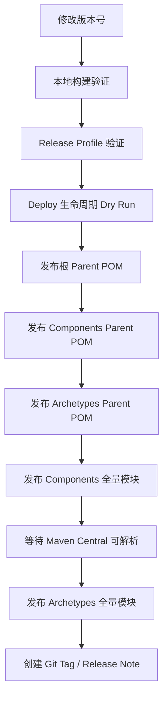

# Egon-COLA Maven Central 发布操作说明

> 适用路径：`scripts/maven-deploy.md`  
> 适用目标：将 Egon-COLA 的 Parent POM、Components、Archetypes 发布到 Maven Central。  
> 发布方式：Sonatype Central Portal + `central-publishing-maven-plugin`。  
> 不再使用旧 OSSRH Staging 流程。

---

## 1. 发布模型

Egon-COLA 当前不是一个单一 jar 包，而是一个多模块发布体系。发布时不要只盯着 `mvn deploy`，要先理解发布对象之间的依赖顺序。

```text
Egon-COLA
├── egon-cola-aggregation-parent      # 根聚合 Parent POM
├── egon-cola-components
│   ├── egon-cola-components-parent   # Components Parent POM
│   ├── egon-cola-components-bom      # Components BOM
│   └── egon-cola-component-*         # 具体组件模块
└── egon-cola-archetypes
    ├── egon-cola-archetypes-parent   # Archetypes Parent POM
    ├── egon-cola-archetype-light
    ├── egon-cola-archetype-service
    └── egon-cola-archetype-web
```

推荐发布顺序：



第一次发布或大版本发布时，建议按顺序分步发布；只有在确认整个发布链路稳定后，才考虑使用 `all`。

---

## 2. 发布前检查清单

发布前先确认下面这些项，不要跳过。Maven Central 的 Release 版本一旦发布，不能覆盖同一个版本号。

| 检查项         | 要求                                         |
|-------------|--------------------------------------------|
| JDK         | JDK 21 或以上                                 |
| Maven       | 优先使用仓库自带的 `./mvnw`                         |
| Version     | Release 版本不能带 `SNAPSHOT`                   |
| Namespace   | `top.egon` 已在 Sonatype Central Portal 完成验证 |
| Credentials | Central Portal User Token 已配置              |
| GPG         | 本地有可用私钥，CI 中有 `GPG_PRIVATE_KEY`            |
| Sources     | `-Prelease` 能生成 `*-sources.jar`            |
| Javadocs    | `-Prelease` 能生成 `*-javadoc.jar`            |
| Signature   | `-Prelease` 能生成 `.asc` 签名文件                |
| CI Secrets  | GitHub Actions Secrets 已配置完整               |

---

## 3. 版本号修改

统一使用脚本修改全仓库 Maven 版本：

```bash
./scripts/bump_cola_version 5.x.y
```

脚本会执行两件事：

1. 使用 `versions-maven-plugin` 修改 Reactor 中所有 Maven 模块版本。
2. 同步更新 `README.md` 里的 archetype 使用示例版本。

修改后建议检查：

```bash
git diff
./mvnw -B -ntp validate
```

如果只改了部分模块，也不要在公开发布版本里让同一批模块版本混乱。Egon-COLA 当前更适合保持统一版本号，后面如果要做“部分模块独立版本”，再单独设计版本策略。

---

## 4. 本地 Maven 配置

在 `~/.m2/settings.xml` 中配置 Central Portal Token。

```xml

<settings xmlns="http://maven.apache.org/SETTINGS/1.0.0"
          xmlns:xsi="http://www.w3.org/2001/XMLSchema-instance"
          xsi:schemaLocation="http://maven.apache.org/SETTINGS/1.0.0 https://maven.apache.org/xsd/settings-1.0.0.xsd">

    <servers>
        <server>
            <id>central</id>
            <username>${env.CENTRAL_USERNAME}</username>
            <password>${env.CENTRAL_PASSWORD}</password>
        </server>
    </servers>

    <profiles>
        <profile>
            <id>central-publishing</id>
            <properties>
                <gpg.executable>gpg</gpg.executable>
                <gpg.passphrase>${env.GPG_PASSPHRASE}</gpg.passphrase>
                <!-- 可选：只有在本地存在多个 GPG Home 时才需要打开 -->
                <!-- <gpg.homedir>${user.home}/.gnupg</gpg.homedir> -->
            </properties>
        </profile>
    </profiles>

    <activeProfiles>
        <activeProfile>central-publishing</activeProfile>
    </activeProfiles>
</settings>
```

本地环境变量：

```bash
export CENTRAL_USERNAME="Central Portal token username"
export CENTRAL_PASSWORD="Central Portal token password"
export GPG_PASSPHRASE="GPG key passphrase"
```

检查 GPG 私钥：

```bash
gpg --list-secret-keys --keyid-format LONG
```

---

## 5. GitHub Actions Secrets

仓库需要配置以下 Secrets：

```text
CENTRAL_USERNAME
CENTRAL_PASSWORD
GPG_PRIVATE_KEY
GPG_PASSPHRASE
```

`GPG_PRIVATE_KEY` 使用下面命令导出：

```bash
gpg --armor --export-secret-keys <KEY_ID>
```

然后把完整输出内容配置到 GitHub Actions Secret 中。

注意：不要把 GPG 私钥、Central Token、Passphrase 写入仓库、README、Issue 或日志。这个不用靠自觉，靠规矩；人脑防泄漏能力通常不如猫防推杯子。

---

## 6. 本地验证

### 6.1 基础验证

只做基础 Maven 校验，不触发真实发布：

```bash
./mvnw -B -ntp -DskipTests validate
```

### 6.2 Release Profile 验证

验证 Components 发布构建：

```bash
./mvnw -B -ntp -f egon-cola-components/pom.xml -Prelease -DskipTests verify
```

验证 Archetypes 发布构建：

```bash
./mvnw -B -ntp -f egon-cola-archetypes/pom.xml -Prelease -DskipTests verify
```

如果只是想验证 `release` profile 的 sources / javadocs 绑定，但本地暂时没有 GPG 环境，可以临时跳过签名：

```bash
./mvnw -B -ntp -f egon-cola-components/pom.xml -Prelease -DskipTests -Dgpg.skip=true verify
./mvnw -B -ntp -f egon-cola-archetypes/pom.xml -Prelease -DskipTests -Dgpg.skip=true verify
```

注意：`-Dgpg.skip=true` 只能用于本地验证，不能用于真实发布。真实发布必须生成 `.asc` 签名文件。

### 6.3 Deploy 生命周期 Dry Run

验证 `deploy` 生命周期是否能跑通，但不上传到 Central：

```bash
./mvnw -B -ntp -N -Prelease -DskipTests -DskipPublishing=true clean deploy
./mvnw -B -ntp -N -f egon-cola-components/pom.xml -Prelease -DskipTests -DskipPublishing=true clean deploy
./mvnw -B -ntp -N -f egon-cola-archetypes/pom.xml -Prelease -DskipTests -DskipPublishing=true clean deploy
./mvnw -B -ntp -f egon-cola-components/pom.xml -Prelease -DskipTests -DskipPublishing=true clean deploy
./mvnw -B -ntp -f egon-cola-archetypes/pom.xml -Prelease -DskipTests -DskipPublishing=true clean deploy
```

Dry Run 通过后，再进入真实发布。

---

## 7. 本地真实发布

### 7.1 发布

```bash
./mvnw -B -ntp -f ./pom.xml -Prelease clean deploy  # 发布全部的包
./mvnw -B -ntp -f egon-cola-components/pom.xml -Prelease clean deploy # 发布 components 全部的包 parent & children module
./mvnw -B -ntp -f egon-cola-archetypes/pom.xml -Prelease clean deploy # 发布 archetypes 全部的包 parent & children module
```

### 7.2 发布 Components

```bash
./mvnw -B -ntp -f egon-cola-components/pom.xml -Prelease -DskipTests clean deploy
```

发布后等待 Maven Central 能解析 Components，再发布 Archetypes。

可以用下面方式验证依赖是否可解析：

```bash
./mvnw -B -ntp dependency:get -Dartifact=top.egon:egon-cola-components-bom:5.x.y:pom
```

### 7.3 发布 Archetypes

```bash
./mvnw -B -ntp -f egon-cola-archetypes/pom.xml -Prelease -DskipTests clean deploy
```

发布后验证 archetype 是否可用：

```bash
./mvnw -B -ntp archetype:generate \
  -DarchetypeGroupId=top.egon \
  -DarchetypeArtifactId=egon-cola-archetype-web \
  -DarchetypeVersion=5.x.y \
  -DgroupId=com.example \
  -DartifactId=demo-web \
  -Dversion=1.0.0-SNAPSHOT \
  -Dpackage=com.example.demo \
  -DinteractiveMode=false
```

---

## 8. GitHub Actions 发布

使用工作流：

```text
.github/workflows/publish-maven-central.yml
```

触发方式：

```text
GitHub Repository → Actions → Publish Maven Central → Run workflow
```

可选目标：

| target                         | 说明                       | 建议使用场景    |
|--------------------------------|--------------------------|-----------|
| `egon-cola-aggregation-parent` | 发布根 Parent POM           | 新版本首次发布   |
| `egon-cola-components-parent`  | 发布 Components Parent POM | 新版本首次发布   |
| `egon-cola-archetypes-parent`  | 发布 Archetypes Parent POM | 新版本首次发布   |
| `egon-cola-components`         | 发布 Components 全量模块       | 组件发布      |
| `egon-cola-archetypes`         | 发布 Archetypes 全量模块       | 脚手架发布     |
| `all`                          | 从根 Reactor 发布全部          | 仅在链路稳定后使用 |

推荐 CI 发布顺序：

```text
1. egon-cola-aggregation-parent
2. egon-cola-components-parent
3. egon-cola-archetypes-parent
4. egon-cola-components
5. egon-cola-archetypes
```

`skip_tests=true` 可以用于手动发布加速，但正式 Release 前必须至少跑过一次完整 CI。发布不是许愿池，测试该还的债迟早会来敲门。

---

## 9. 发布后验证

### 9.1 验证 Maven Central 可解析

```bash
./mvnw -B -ntp dependency:get \
  -Dartifact=top.egon:egon-cola-component-dto:5.x.y
```

```bash
./mvnw -B -ntp dependency:get \
  -Dartifact=top.egon:egon-cola-archetype-web:5.x.y
```

### 9.2 验证新项目生成

```bash
./mvnw -B -ntp archetype:generate \
  -DarchetypeGroupId=top.egon \
  -DarchetypeArtifactId=egon-cola-archetype-service \
  -DarchetypeVersion=5.x.y \
  -DgroupId=com.example \
  -DartifactId=demo-service \
  -Dversion=1.0.0-SNAPSHOT \
  -Dpackage=com.example.demo \
  -DinteractiveMode=false

cd demo-service
./mvnw -B -ntp test
```

### 9.3 打 Tag

```bash
git tag -a v5.x.y -m "Release v5.x.y"
git push origin v5.x.y
```

---

## 10. 常见失败与处理

| 现象                                                    | 常见原因                                               | 处理方式                                                                   |
|-------------------------------------------------------|----------------------------------------------------|------------------------------------------------------------------------|
| `401 Unauthorized`                                    | `central` server id 缺失、Central Token 错误、Secret 未注入 | 检查 `settings.xml`、GitHub Secrets、`server-id=central`                   |
| `403 Forbidden`                                       | `top.egon` namespace 未验证，或版本已经发布过                  | 先验证 namespace；如果版本已存在，只能升级版本号                                          |
| `repository element was not specified`                | 没有启用 `-Prelease`，或 release profile 未加载             | 确认命令包含 `-Prelease`，并使用 Central Publishing Plugin                       |
| `Missing Signature`                                   | GPG 私钥不可用、Passphrase 错误、签名被跳过                      | 检查 `GPG_PRIVATE_KEY`、`GPG_PASSPHRASE`，不要在 deploy 中使用 `-Dgpg.skip=true` |
| `Missing Sources/Javadocs`                            | `-Prelease` 未生效                                    | 使用 `-Prelease verify` 检查 `target` 下是否生成 sources / javadocs             |
| `gpg: signing failed: Inappropriate ioctl for device` | GPG 需要交互式 pinentry                                 | 确认 POM 中已配置 `--pinentry-mode loopback`                                 |
| Javadoc 构建失败                                          | Java 21 doclint 或注释问题                              | 当前 POM 已关闭 doclint；仍失败时检查具体类注释或非法字符                                    |
| JUnit Platform 发现测试失败                                 | JUnit Jupiter 与 JUnit Platform 版本不一致               | 保持 JUnit Jupiter 与 Spring Boot BOM 对齐                                  |
| `scripts/bash-buddy/... No such file or directory`    | 子模块或脚本依赖未初始化完整                                     | 检查 `scripts/bash-buddy` 是否存在，必要时重新拉取子模块                                |
| Central Portal 长时间不可解析                                | Central 同步有延迟                                      | 等待后重新执行 `dependency:get` 验证                                            |

---

## 11. 不要这样做

| 不推荐做法                            | 原因                                          |
|----------------------------------|---------------------------------------------|
| 使用旧 OSSRH Staging URL 发布 Release | Egon-COLA 当前走 Central Portal，不走旧 Staging 流程 |
| 真实发布时使用 `-Dgpg.skip=true`        | Maven Central Release 必须有签名                 |
| 同一版本重复发布                         | Release 版本不可覆盖                              |
| 未验证 Parent POM 就直接发布子模块          | 子模块可能无法解析父 POM                              |
| 首次发布直接使用 `all`                   | 失败时不好定位，容易把问题扩大                             |
| 把 Token / GPG 私钥写进文档             | 这是事故，不是配置                                   |

---

## 12. 推荐发布流程摘要

普通 Release 建议直接按下面执行：

```bash
# 1. 修改版本
./scripts/bump_cola_version 5.x.y

# 2. 基础验证
./mvnw -B -ntp validate

# 3. Release Profile 验证
./mvnw -B -ntp -f egon-cola-components/pom.xml -Prelease -DskipTests verify
./mvnw -B -ntp -f egon-cola-archetypes/pom.xml -Prelease -DskipTests verify

# 4. Dry Run
./mvnw -B -ntp -f egon-cola-components/pom.xml -Prelease -DskipTests -DskipPublishing=true clean deploy
./mvnw -B -ntp -f egon-cola-archetypes/pom.xml -Prelease -DskipTests -DskipPublishing=true clean deploy

# 5. 发布 Parent POM
./mvnw -B -ntp -N -Prelease -DskipTests clean deploy
./mvnw -B -ntp -N -f egon-cola-components/pom.xml -Prelease -DskipTests clean deploy
./mvnw -B -ntp -N -f egon-cola-archetypes/pom.xml -Prelease -DskipTests clean deploy

# 6. 发布 Components
./mvnw -B -ntp -f egon-cola-components/pom.xml -Prelease -DskipTests clean deploy

# 7. 等待 Components 可解析后发布 Archetypes
./mvnw -B -ntp -f egon-cola-archetypes/pom.xml -Prelease -DskipTests clean deploy

# 8. 打 Tag
git tag -a v5.x.y -m "Release v5.x.y"
git push origin v5.x.y
```

---

## 13. 参考资料

- Sonatype Central Portal Maven Plugin：`https://central.sonatype.org/publish/publish-portal-maven/`
- GitHub Actions `setup-java`：`https://github.com/actions/setup-java`
- GitHub Actions `setup-java` GPG 使用说明：`https://github.com/actions/setup-java/blob/main/docs/advanced-usage.md`
