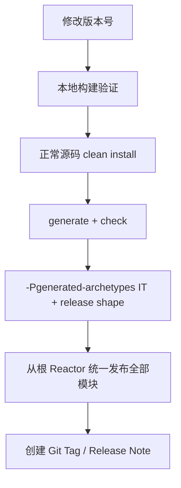

# Egon-COLA Maven Central 发布操作说明

> 适用路径：`scripts/maven-deploy.md`  
> 适用目标：将 Egon-COLA 的 Parent POM、Components、Platforms、Archetypes 发布到 Maven Central。
> 发布方式：Sonatype Central Portal + `central-publishing-maven-plugin`。  
> 不再使用旧 OSSRH Staging 流程。

---

## 1. 发布模型

Egon-COLA 当前不是一个单一 jar 包，而是一个多模块发布体系。发布时不要只盯着 `mvn deploy`，要先理解发布对象之间的依赖顺序。

```text
Egon-COLA
├── egon-cola-aggregation-parent      # 根聚合 Parent POM
├── egon-cola-components
│   ├── egon-cola-components-parent   # Components Parent POM
│   ├── egon-cola-components-bom      # Components BOM
│   └── egon-cola-component-*         # 具体组件模块
├── egon-cola-platforms
│   ├── egon-cola-platforms-parent    # Platforms Parent POM
│   └── egon-cola-platform-*          # 企业级基础设施平台
└── egon-cola-archetypes
    ├── egon-cola-archetypes-parent   # Archetypes Parent POM
    ├── source-projects                # 可编辑的正常 Maven 源码（不发布）
    │   ├── egon-cola-source-light
    │   ├── egon-cola-source-light-open
    │   ├── egon-cola-source-service
    │   ├── egon-cola-source-service-open
    │   ├── egon-cola-source-web
    │   └── egon-cola-source-web-open
    ├── definitions                     # Archetype 打包合同（不单独作为 Maven module）
    │   └── egon-cola-archetype-{light,light-open,service,service-open,web,web-open}
    ├── .generated                      # 忽略的完整发布 Reactor（由脚本生成）
    ├── egon-cola-evaluation-facade
    └── egon-cola-organization-facade
```

推荐发布顺序：


```mermaid
flowchart TD
    A[修改版本号] --> B[本地构建验证]
    B --> C[正常源码 clean install]
    C --> D[generate + check]
    D --> E[-Pgenerated-archetypes IT + release shape]
    E --> F[从根 Reactor 统一发布全部模块]
    F --> G[创建 Git Tag / Release Note]
```

DDC 归属 Platforms，但 RPC 组件消费 DDC Starter，Gateway 又消费 RPC。这个依赖图在
根 Reactor 内可以由 Maven 正确排序，却不能拆成独立的 Components 和 Platforms 新版本
发布批次。因此 Maven Central 发布只允许使用根 Reactor 的 `all` 目标。

Archetype 采用两阶段所有权：维护者只在 `source-projects` 的标准 `src/main/java`、
`src/main/resources` 和 `src/test` 目录中开发；`definitions` 只保存 manifest、
`packaging-pom.xml`、META-INF、IT、javadoc 和架构文档等打包合同。运行
`scripts/generate_archetypes.sh generate` 时，固定使用
`maven-archetype-plugin:3.4.1:create-from-project` 把正常源码转换为完整的
`.generated` Reactor。`.generated` 是派生目录，不能手工修改，也不会提交到 Git。

---

## 2. 发布前检查清单

发布前先确认下面这些项，不要跳过。Maven Central 的 Release 版本一旦发布，不能覆盖同一个版本号。

| 检查项         | 要求                                         |
|-------------|--------------------------------------------|
| JDK         | JDK 21 或以上                                 |
| Maven       | 优先使用仓库自带的 `./mvnw`                         |
| Version     | Release 版本不能带 `SNAPSHOT`                   |
| Namespace   | `top.egon` 已在 Sonatype Central Portal 完成验证 |
| Credentials | Central Portal User Token 已配置              |
| GPG         | 本地有可用私钥，CI 中有 `GPG_PRIVATE_KEY`            |
| Sources     | `-Prelease` 能生成 `*-sources.jar`            |
| Javadocs    | `-Prelease` 能生成 `*-javadoc.jar`            |
| Signature   | `-Prelease` 能生成 `.asc` 签名文件                |
| CI Secrets  | GitHub Actions Secrets 已配置完整               |

---

## 3. 版本号修改

统一使用脚本修改全仓库 Maven 版本：

```bash
./scripts/bump_cola_version.sh 5.x.y
```

脚本会按两阶段所有权执行版本更新：

1. 使用 `versions-maven-plugin` 修改 Reactor 中所有 Maven 模块版本。
2. 动态发现 `egon-cola-archetypes/source-projects` 下声明 `<egon-cola.version>` 的正常源码根 POM 并同步更新。
3. 同步更新 `README.md` 里的 archetype 使用示例版本。

源码工程自身的 `0.1.0-SNAPSHOT` 坐标是生成器内部哨兵，不会被 bump；`.generated`、锁目录和临时派生物也不会被编辑。

修改后建议检查：

```bash
git diff
./mvnw -B -ntp validate
```

如果只改了部分模块，也不要在公开发布版本里让同一批模块版本混乱。Egon-COLA 当前更适合保持统一版本号，后面如果要做“部分模块独立版本”，再单独设计版本策略。

---

### 3.1 源码依赖与 Flyway 约定

六个 `source-projects` 都是可直接导入 IDE 的正常 Maven 工程，并统一继承
Spring Boot `3.5.16` Parent。根工程、Components、Platforms 和 Archetypes 的
共享版本来自根 POM 导入的 `spring-boot-dependencies` BOM；Light/Web 的四个源码根
再按需导入 `springdoc-openapi-bom`，Service 不引入 Springdoc。修改依赖时只调整
这些既定的 Parent/BOM 归属，不在生成目录里补版本。

非 Open 的 Light、Service、Web 源码各自按 Flyway 物理 role 提供一个累计 baseline：
一个 `master-data`、一个 `shard`。baseline 直接声明该 role 的最终 schema，历史
`V*.sql` 仅作为不可变归档，不得修改、移动或删除；Open 源码不使用 Flyway，继续
生成手工 SQL runbook。生成器会把这些正常源码内容带入 `.generated`，发布者不应在
`.generated` 中编辑迁移或业务代码。

---

## 4. 本地 Maven 配置

在 `~/.m2/settings.xml` 中配置 Central Portal Token。

```xml

<settings xmlns="http://maven.apache.org/SETTINGS/1.0.0"
          xmlns:xsi="http://www.w3.org/2001/XMLSchema-instance"
          xsi:schemaLocation="http://maven.apache.org/SETTINGS/1.0.0 https://maven.apache.org/xsd/settings-1.0.0.xsd">

    <servers>
        <server>
            <id>central</id>
            <username>${env.CENTRAL_USERNAME}</username>
            <password>${env.CENTRAL_PASSWORD}</password>
        </server>
    </servers>

    <profiles>
        <profile>
            <id>central-publishing</id>
            <properties>
                <gpg.executable>gpg</gpg.executable>
                <gpg.passphrase>${env.GPG_PASSPHRASE}</gpg.passphrase>
                <!-- 可选：只有在本地存在多个 GPG Home 时才需要打开 -->
                <!-- <gpg.homedir>${user.home}/.gnupg</gpg.homedir> -->
            </properties>
        </profile>
    </profiles>

    <activeProfiles>
        <activeProfile>central-publishing</activeProfile>
    </activeProfiles>
</settings>
```

本地环境变量：

```bash
export CENTRAL_USERNAME="Central Portal token username"
export CENTRAL_PASSWORD="Central Portal token password"
export GPG_PASSPHRASE="GPG key passphrase"
```

检查 GPG 私钥：

```bash
gpg --list-secret-keys --keyid-format LONG
```

---

## 5. GitHub Actions Secrets

仓库需要配置以下 Secrets：

```text
CENTRAL_USERNAME
CENTRAL_PASSWORD
GPG_PRIVATE_KEY
GPG_PASSPHRASE
```

`GPG_PRIVATE_KEY` 使用下面命令导出：

```bash
gpg --armor --export-secret-keys <KEY_ID>
```

然后把完整输出内容配置到 GitHub Actions Secret 中。

注意：不要把 GPG 私钥、Central Token、Passphrase 写入仓库、README、Issue 或日志。这个不用靠自觉，靠规矩；人脑防泄漏能力通常不如猫防推杯子。

---

## 6. 本地验证

### 6.1 两阶段完整预检

`maven-deploy.sh` 的默认 dry-run 会执行以下不可跳过的顺序，不会上传 Central：

```bash
./mvnw -B -ntp -N install
./mvnw -B -ntp -N -f egon-cola-archetypes/pom.xml install
./mvnw -B -ntp -f egon-cola-archetypes/source-projects/pom.xml clean install
./scripts/generate_archetypes.sh generate
./scripts/check_archetypes.sh
./mvnw -B -ntp -f egon-cola-archetypes/pom.xml \
  -Pgenerated-archetypes clean install
./mvnw -B -ntp -Pgenerated-archetypes -Prelease \
  -Dgpg.skip=true clean verify
```

也可以直接调用同一入口：

```bash
./scripts/maven-deploy.sh --dry-run
```

`--skip-tests` 不会跳过上述预检；它只在预检完成后、且确实选择 `--publish` 时传给最后一次 deploy。

### 6.2 Release Profile 验证

验证六个 Archetype 的 main/sources/javadoc 形态但跳过本地 GPG：

```bash
./mvnw -B -ntp -f egon-cola-archetypes/pom.xml \
  -Pgenerated-archetypes -Prelease -Dgpg.skip=true clean verify
```

注意：`-Dgpg.skip=true` 只能用于本地验证，不能用于真实发布。真实发布必须生成 `.asc` 签名文件。

根 Reactor 会在一个拓扑中验证全部 Parent POM 和子模块。不要先对同一版本运行
parent-only 或局部 deploy，否则后续全量发布会重复发布不可覆盖的 Release 坐标。

---

## 7. 本地真实发布

同一版本没有执行过任何 parent-only 或局部发布后，从根 Reactor 一次性发布：

```bash
./scripts/maven-deploy.sh all --publish
```

该命令会先完整执行 source → generate/check → Archetype IT → release-shape 预检，随后只执行一次根 Reactor `clean deploy`。
真实发布不能传 `-Dgpg.skip=true`；Central Portal 返回 `UNKNOWN` 时必须先按 deployment id 查询状态，不能盲目重放 deploy。

发布后可以验证 BOM、DDC 平台和 Archetype 是否可解析：

```bash
./mvnw -B -ntp dependency:get -Dartifact=top.egon:egon-cola-components-bom:5.x.y:pom
./mvnw -B -ntp dependency:get -Dartifact=top.egon:egon-cola-platform-dynamic-config-center-starter:5.x.y
```

发布后验证 archetype 是否可用：

```bash
./mvnw -B -ntp archetype:generate \
  -DarchetypeGroupId=top.egon \
  -DarchetypeArtifactId=egon-cola-archetype-web \
  -DarchetypeVersion=5.x.y \
  -DgroupId=com.example \
  -DartifactId=demo-web \
  -Dversion=1.0.0-SNAPSHOT \
  -Dpackage=com.example.demo \
  -DinteractiveMode=false
```

---

## 8. GitHub Actions 发布

使用工作流：

```text
.github/workflows/publish-maven-central.yml
```

触发方式：

```text
GitHub Repository → Actions → Publish Maven Central → Run workflow
```

可选目标：

| target | 说明 | 建议使用场景 |
|---|---|---|
| `all` | 从根 Reactor 按依赖拓扑发布全部模块 | 所有正式发布 |

推荐 CI 发布顺序：

```text
1. all
2. 等待本次 Central Deployment 发布完成
3. 验证 BOM、DDC Starter 和 Archetype 坐标可解析
```

工作流不再暴露 parent-only、Components-only 或 Platforms-only 目标，避免跨 Reactor
依赖和 Maven Central Release 坐标不可覆盖共同造成半发布状态。

`skip_tests=true` 只影响 mandatory preflight 成功后的最后一次 deploy；不会跳过 source install、生成器、Archetype IT、release-shape 或签名附件检查。正式 Release 前仍应保留一次完整 CI 证据。

---

## 9. 发布后验证

### 9.1 验证 Maven Central 可解析

```bash
./mvnw -B -ntp dependency:get \
  -Dartifact=top.egon:egon-cola-component-dto:5.x.y
```

```bash
./mvnw -B -ntp dependency:get \
  -Dartifact=top.egon:egon-cola-archetype-web:5.x.y
```

### 9.2 验证新项目生成

```bash
./mvnw -B -ntp archetype:generate \
  -DarchetypeGroupId=top.egon \
  -DarchetypeArtifactId=egon-cola-archetype-service \
  -DarchetypeVersion=5.x.y \
  -DgroupId=com.example \
  -DartifactId=demo-service \
  -Dversion=1.0.0-SNAPSHOT \
  -Dpackage=com.example.demo \
  -DinteractiveMode=false

cd demo-service
./mvnw -B -ntp test
```

### 9.3 打 Tag

```bash
git tag -a v5.x.y -m "Release v5.x.y"
git push origin v5.x.y
```

---

## 10. 常见失败与处理

| 现象                                                    | 常见原因                                               | 处理方式                                                                   |
|-------------------------------------------------------|----------------------------------------------------|------------------------------------------------------------------------|
| `401 Unauthorized`                                    | `central` server id 缺失、Central Token 错误、Secret 未注入 | 检查 `settings.xml`、GitHub Secrets、`server-id=central`                   |
| `403 Forbidden`                                       | `top.egon` namespace 未验证，或版本已经发布过                  | 先验证 namespace；如果版本已存在，只能升级版本号                                          |
| `repository element was not specified`                | 没有启用 `-Prelease`，或 release profile 未加载             | 确认命令包含 `-Prelease`，并使用 Central Publishing Plugin                       |
| `Missing Signature`                                   | GPG 私钥不可用、Passphrase 错误、签名被跳过                      | 检查 `GPG_PRIVATE_KEY`、`GPG_PASSPHRASE`，不要在 deploy 中使用 `-Dgpg.skip=true` |
| `Missing Sources/Javadocs`                            | `-Prelease` 未生效                                    | 使用 `-Prelease verify` 检查 `target` 下是否生成 sources / javadocs             |
| `Generated archetype resources are missing`            | 未执行 source install/generate，或 `.generated` 不完整 | 执行 `./scripts/maven-deploy.sh --dry-run`，不要手工补写 package resources       |
| Central Deployment 状态为 `UNKNOWN`                   | Portal 查询超时或网络中断                              | 保存 deployment id，先在 Portal 查询最终状态；不要自动重放 `deploy`             |
| `gpg: signing failed: Inappropriate ioctl for device` | GPG 需要交互式 pinentry                                 | 确认 POM 中已配置 `--pinentry-mode loopback`                                 |
| Javadoc 构建失败                                          | Java 21 doclint 或注释问题                              | 当前 POM 已关闭 doclint；仍失败时检查具体类注释或非法字符                                    |
| JUnit Platform 发现测试失败                                 | JUnit Jupiter 与 JUnit Platform 版本不一致               | 保持 JUnit Jupiter 与 Spring Boot BOM 对齐                                  |
| `scripts/bash-buddy/... No such file or directory`    | 子模块或脚本依赖未初始化完整                                     | 检查 `scripts/bash-buddy` 是否存在，必要时重新拉取子模块                                |
| Central Portal 长时间不可解析                                | Central 同步有延迟                                      | 等待后重新执行 `dependency:get` 验证                                            |

---

## 11. 不要这样做

| 不推荐做法                            | 原因                                          |
|----------------------------------|---------------------------------------------|
| 使用旧 OSSRH Staging URL 发布 Release | Egon-COLA 当前走 Central Portal，不走旧 Staging 流程 |
| 真实发布时使用 `-Dgpg.skip=true`        | Maven Central Release 必须有签名                 |
| 同一版本重复发布                         | Release 版本不可覆盖                              |
| 未验证 Parent POM 就直接发布子模块          | 子模块可能无法解析父 POM                              |
| 绕过预检直接发布或发布非 `all` 目标          | 可能产生未验证的半套 Central 坐标                           |
| 把 Token / GPG 私钥写进文档             | 这是事故，不是配置                                   |

---

## 12. 推荐发布流程摘要

普通 Release 建议直接按下面执行：

```bash
# 1. 修改版本
./scripts/bump_cola_version.sh 5.x.y

# 2. 两阶段完整预检（不发布）
./scripts/maven-deploy.sh --dry-run

# 3. 从根 Reactor 一次性发布（仅在确认版本、凭据和预检证据后）
./scripts/maven-deploy.sh all --publish

# 4. 打 Tag
git tag -a v5.x.y -m "Release v5.x.y"
git push origin v5.x.y
```

---

## 13. 参考资料

- Sonatype Central Portal Maven Plugin：`https://central.sonatype.org/publish/publish-portal-maven/`
- GitHub Actions `setup-java`：`https://github.com/actions/setup-java`
- GitHub Actions `setup-java` GPG 使用说明：`https://github.com/actions/setup-java/blob/main/docs/advanced-usage.md`
